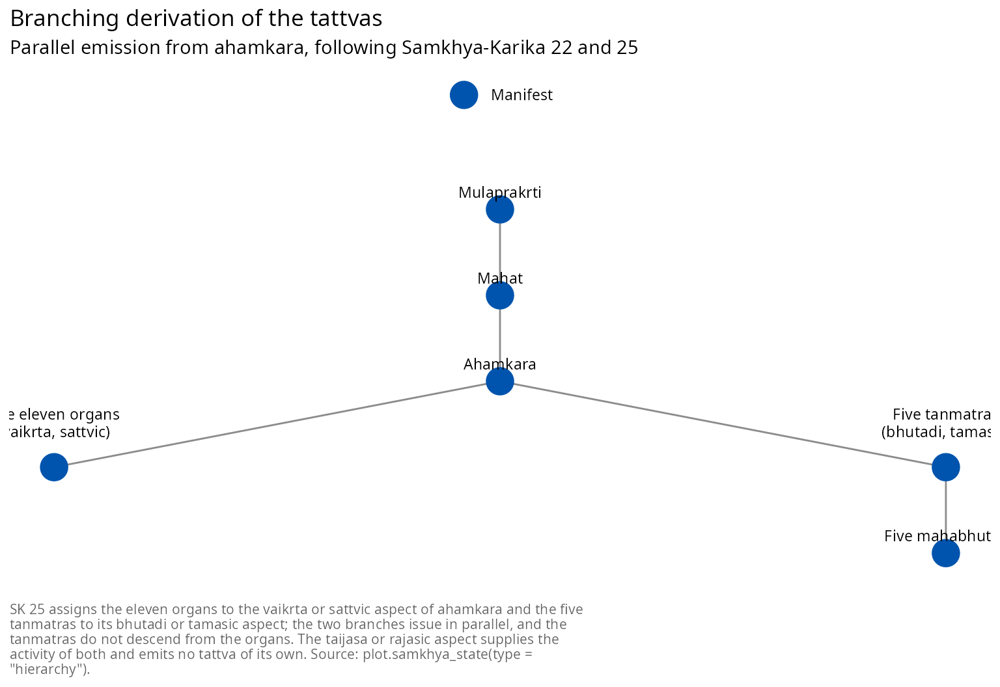

# सांख्यदर्शनस्य परिचयः - पञ्चविंशतितत्त्वानि

## प्रस्तावना

एतत् पत्रम् आङ्ग्लभाषायां लिखितस्य `samkhya_philosophy` इति परिचयपत्रस्य
संस्कृतरूपान्तरम् अस्ति । उभयोः विषयक्रमः समानः, प्रमाणानि च समानानि । यत्र
मूलकारिकायाः वचनं भवति तत्र कारिकासंख्या निर्दिश्यते; यत्र केवलं व्याख्यातॄणां मतं भवति
तत्र व्याख्यातुः नाम निर्दिश्यते । “सां.का.” इति सांख्यकारिकायाः संकेतः ।

सांख्यदर्शनं षड्दर्शनेषु अन्यतमम् । तत् चैतन्यजडयोः द्वैतम्, विकासवादिनी सृष्टिमीमांसा,
विवेकज्ञानमात्रेण मोक्षं प्रतिपादयन्ती मुक्तिमीमांसा च । परम्परया कपिलमुनये आरोपितम् इदं
दर्शनं योगे वेदान्ते च गभीरं प्रभावम् अकरोत् । किन्तु उपलब्धः शास्त्रीयग्रन्थः ईश्वरकृष्णस्य
सांख्यकारिका, या ख्रिस्ताब्दस्य चतुर्थपञ्चमशतकयोः प्रायः रचिता [\[2\]](#ref2) ।

व्याख्यापरम्परा अत्र विशेषतया महत्त्वपूर्णा, यतः बहूनि “सांख्यम्” इति प्रचलितानि मतानि
वस्तुतः व्याख्यातॄणाम् एव, न तु कारिकायाः । युक्तिदीपिका दार्शनिकदृष्ट्या गम्भीरतमा
व्याख्या [\[5\]](#ref5); गौडपादस्य भाष्यं प्रसिद्धतमम्; वाचस्पतिमिश्रस्य तत्त्वकौमुदी
नवमदशमशतकयोः प्रामाणिकी व्याख्या; विज्ञानभिक्षोः सांख्यप्रवचनभाष्यं तु षोडशशतकस्य
संश्लेषणम्, यत् ईश्वरवादादिषु विषयेषु कारिकातः विचलति ।

एकम् आदौ ज्ञातव्यम् । शास्त्रीयं सांख्यं **निरीश्वरम्** । कारिका प्रकृतिं पुरुषं च साधयति,
स्रष्टारं तु न कल्पयति; ईश्वरवादिनी व्याख्या विज्ञानभिक्षोः उत्तरकालीनायाः च
परम्परायाः । पातञ्जलयोगेन सह अस्य भेदः अधस्तात् विचार्यते ।

  

### त्रीणि प्रमाणानि

सां.का. ४ त्रीणि प्रमाणानि स्वीकरोति, त्रीणि एव: **दृष्टम्** (यत् प्रत्यक्षेण गृह्यते),
**अनुमानम्**, **आप्तवचनं** च । न्यायः उपमानम् अधिकं स्वीकरोति, मीमांसा च द्वे अधिके;
त्रित्वनियमः तु बुद्धिपूर्वकः, यतः अन्यानि प्रमाणानि एतेषु त्रिषु अन्तर्भवन्ति इति
सांख्यमतम् ।

``` r

samkhya_pramanas()
#> <samkhya_pramana>
#> Three means of valid knowledge, and three only (SK 4)
#> 
#> 1. Perception (karika: drsta; commentators: pratyaksa)
#>    Determination of each object by the sense proper to it (SK 5)
#> 2. Inference (karika: anumana; commentators: anumana)
#>    Threefold, resting on a mark and on the bearer of the mark (SK 5)
#> 3. Reliable testimony (karika: aptavacana; commentators: sabda)
#>    The word of one who is reliable; reaches what inference cannot (SK 5-6)
#> 
#> Nyaya adds comparison and Mimamsa adds two more; SK 4 restricts to three.
```

प्रथमतृतीययोः कृते प्रायः उद्धृते “प्रत्यक्षम्” “शब्दः” इति पदे न्यायस्य, ये
सांख्यव्याख्यातृभिः गृहीते । कारिकायाः स्वकीये पदे तु “दृष्टम्” “आप्तवचनम्” इति । पैकेजः
उभे अपि दर्शयति, येन भेदः प्रकटः तिष्ठेत् ।

तृतीयस्य प्रमाणस्य अत्र विशेषं गौरवम् । सां.का. ६ वदति यत् अतीन्द्रियं वस्तु
सामान्यतोदृष्टेन अनुमानेन सिध्यति, यत् च अनुमानेन अपि न सिध्यति तत् आप्तवचनेन । प्रकृतिः
पुरुषश्च न प्रत्यक्षविषयौ, अतः सर्वा अपि इयम् ऊहा द्वितीयतृतीययोः प्रमाणयोः आश्रिता,
कारिका च तत्र स्पष्टवादिनी ।

  

## सत्कार्यवादः

गणनातः पूर्वं कारणवादः । सां.का. ९ प्रतिपादयति यत् कार्यम् उत्पत्तेः पूर्वम् एव स्वे
उपादानकारणे विद्यते, इति सत्कार्यवादः ।

``` r

satkaryavada()
#> <samkhya_satkarya>
#> Satkaryavada: the effect exists in its cause before production (SK 9)
#> 
#> 1. asadakaranat
#>    Because there is no making of what is not
#>    Production out of nothing is not production
#> 2. upadanagrahanat
#>    Because a material cause is resorted to
#>    The potter takes clay, not milk, to make a pot
#> 3. sarvasambhavabhavat
#>    Because there is no arising of everything from everything
#>    Oil comes from sesame and not from sand
#> 4. saktasya sakyakaranat
#>    Because what is capable produces what it is capable of
#>    A capacity is a capacity for something determinate
#> 5. karanabhavat
#>    Because the effect is of the nature of the cause
#>    Cloth is not other than the threads that constitute it
#> 
#> Transformation is real (parinama), not apparent (vivarta).
```

अनेन विना विकासक्रमः न सङ्गच्छते । यदि कार्यं कारणे पूर्वं न स्यात्, तर्हि त्रयोविंशतिः
विकाराः प्रकृतेः अभिव्यक्तयः न भवेयुः, अपि तु तस्यां नूतनाः प्रक्षेपाः; सां.का. १५-१६ च
व्यक्तस्य परिमाणात् समन्वयाच्च एकम् अव्यक्तं कारणम् अनुमिनोति, तत् अनुमानं च न सिध्येत् ।
सांख्ये परिणामः वास्तविकः: कार्यं कारणस्य यथार्थं परिणामः । अनेन इदं दर्शनम्
अद्वैतवेदान्तस्य विवर्तवादात् (यत्र कार्यम् आभासमात्रं कारणं च अपरिणतम्) न्यायवैशेषिकयोः
असत्कार्यवादाच्च (यत्र कार्यम् अत्यन्तं नूतनं वस्तु) भिद्यते [\[4\]](#ref4) ।

  

## द्वे मूलतत्त्वे

  

### पुरुषः

पुरुषः चैतन्यम् । सां.का. १७ तस्य अस्तित्वे पञ्च हेतून् वदति: सङ्घातस्य परार्थत्वात्,
त्रिगुणादिविपर्ययात्, अधिष्ठानात्, **भोक्तृभावात्**, कैवल्यार्थं प्रवृत्तेश्च । सां.का. १८
बहुत्वं त्रिभिः हेतुभिः साधयति, न तु एकेन: जननमरणकरणानां प्रतिनियमात्,
**अयुगपत्प्रवृत्तेः**, त्रैगुण्यविपर्ययाच्च ।

सां.का. १९ पुरुषस्य स्वरूपम् एकया पङ्क्त्या वदति: साक्षित्वम्, कैवल्यम्, माध्यस्थ्यम्,
द्रष्टृत्वम्, अकर्तृभावश्च । अत्र द्वयोः विशेषेण ध्यानम् आवश्यकम्, यतः उभे प्रायः अतिशयेन
कथ्येते ।

पुरुषः **अकर्ता**, कदापि न कर्ता । किन्तु सः **अभोक्ता न**: सां.का. १७ तस्य
अस्तित्वं भोक्तृभावात् एव साधयति, सां.का. १९ च केवलं कर्तृत्वं निषेधति । समाधानं सां.का.
३७, यत्र बुद्धेः कर्म पुरुषस्य भोगसाधनम् इति उच्यते । भोगः पुरुषार्थः, परिणामः तु सर्वः
प्रकृतौ । पुरुषं भोक्तृत्वात् निषेधन् सां.का. १७ इत्यस्य हेतुं नाशयति, कर्तृत्वं च आरोपयन्
सां.का. १९ इत्यस्य विरोधं करोति ।

**कैवल्यं** सां.का. १९ मध्ये स्वाभाविकं लक्षणम्, न तु प्राप्तव्यं फलम् । पुरुषः स्वभावतः एव
केवलः । अतः दर्शनान्ते यत् प्राप्यते तत् पुरुषस्य पूर्वम् असतो धर्मस्य लाभः न; तत् तु प्रकृतेः
व्यापारस्य निवृत्तिः । अयम् एव अधस्तात् मुक्तिविचारस्य मूलम् ।

पुरुषः प्रकृतौ न व्याप्रियते । तस्य सन्निधिमात्रं पर्याप्तम्, सां.का. २१ च पङ्ग्वन्धवत्
संयोगम् उपमिमीते, यत्र उभौ परस्परोपकारेण वर्तेते किन्तु न अन्यतरः अन्यो भवति ।
“अयस्कान्तः लोहम् आकर्षति स्वयं तु न चलति” इति प्रसिद्धा उपमा व्याख्यानेषु सांख्यसूत्रे च,
न तु कारिकायाम् ।

  

### प्रकृतिः

प्रकृतिः अचेतनं जडं मूलतत्त्वम्, प्रधानम् अव्यक्तम् इति च उच्यते । सां.का. ३ तस्याः स्थानम्
एकेन पदेन वदति: **अविकृतिः** । सा अनुत्पन्ना, मूलं यत् स्वयं न कस्यचित् कार्यम् ।

सां.का. १० व्यक्ताव्यक्तयोः दशभिः धर्मैः वैपरीत्यं वदति: व्यक्तं हेतुमत् अनित्यम् अव्यापि
सक्रियम् अनेकम् आश्रितं लिङ्गं सावयवं परतन्त्रं च, अव्यक्तं तु प्रतिकूलम् । सां.का. ११ तयोः
साधर्म्यम् अपि वदति: उभे त्रिगुणे अविवेकिनी विषयः सामान्यम् अचेतनं प्रसवधर्मि च, पुरुषः
तु तद्विपरीतः, तथापि सां.का. १० इत्यस्य केषुचित् धर्मेषु अव्यक्तेन सदृशः ।

अत्रैव प्रसिद्धा भ्रान्तिः प्रविशति । यतः सां.का. ११ पुरुषं केषुचित् धर्मेषु अव्यक्तसदृशं
वदति, अतः केचित् पुरुषं प्रकृतिं च मिलित्वा “द्वे अव्यक्ततत्त्वे” इति गणयन्ति । एतत्
सां.का. २ तथा ३ इत्याभ्यां न सह्यते, यत्र त्रयः विभागाः उक्ताः - **व्यक्तम्, अव्यक्तम्,
ज्ञः** - पुरुषश्च कार्यकारणपरम्परातः बहिः “न प्रकृतिर्न विकृतिः” इति स्थापितः ।
“अव्यक्तम्” इति पदं मूलप्रकृतिमात्रं वदति । अधस्तात् गणना सां.का. ३ अनुसरति ।

प्रकृतेः एकत्वं सां.का. १५ साधयति - भेदानां परिमाणात्, समन्वयात्, शक्तितः प्रवृत्तेः,
कारणकार्यविभागात्, अविभागाच्च वैश्वरूप्यस्य - न तु सां.का. ११ ।

  

### त्रयो गुणाः

सां.का. १२ गुणान् **प्रीत्यप्रीतिविषादात्मकान्** वदति, **प्रकाशप्रवृत्तिनियमार्थान्**
च । ततः एकेन समासेन तेषां चतस्रः परस्परवृत्तीः वदति:
**अन्योन्याभिभवाश्रयजननमिथुनवृत्तयः** । ते परस्परम् अभिभवन्ति, परस्परम् आश्रयन्ते,
परस्परं जनयन्ति, परस्परं च मिथुनीभवन्ति ।

एतासु प्रथमा विशेषेण विचारणीया, यतः सा प्रायः विपरीतम् अनूद्यते । **अभिभवः** इति
आक्रमणं दमनं वा । “परस्परं सहायन्ते” इति अनुवादः आश्रयम् एव गृह्णाति, अभिभवं च तूष्णीं
त्यजति; तेन प्रधानपदस्य अर्थः विपर्यस्तः । गुणाः यावत् सहकारिणः तावत् एव विरोधिनः,
तेषां च विरोधः एव अभिव्यक्तेः प्रेरकः ।

सां.का. १३ तेषां धर्मान् वदति: सत्त्वं **लघु प्रकाशकम्**, रजः **उपष्टम्भकं चलम्**, तमः
**गुरु वरणकम्** ।

| गुणः   | सां.का. १२ स्वभावः | सां.का. १२ प्रयोजनम् | सां.का. १३ धर्माः |
|-------|------------------|-------------------|-----------------|
| सत्त्वम् | प्रीतिः           | प्रकाशः            | लघु, प्रकाशकम्     |
| रजः   | अप्रीतिः          | प्रवृत्तिः           | उपष्टम्भकम्, चलम्   |
| तमः   | विषादः           | नियमः             | गुरु, वरणकम्       |

द्वे प्रसिद्धे कल्पने अस्यां सारण्यां बुद्धिपूर्वकं वर्जिते । गुणानां शुक्ललोहितकृष्णवर्णैः सह
सम्बन्धः श्वेताश्वतरोपनिषदः ४.५ ततः पुराणेभ्यश्च आगतः, न तु कारिकातः ।
ऊर्ध्वतिर्यगधोगतिभिः सह सम्बन्धः भगवद्गीतायाः १४.१८ आगतः, या च वस्तुतः पुरुषाणां
गतिं वदति, न तु गुणस्वरूपम् । उभे अपि भारतीयचिन्तने प्रामाणिके, उभे च न सां.का. १२ न
वा १३; तत्संकेतेन सह प्रदर्शनं तु मिथ्यारोपणम् ।

अव्यक्तावस्थायां त्रयः साम्येन तिष्ठन्ति, याम् अवस्थाम् उत्तरकालीना परम्परा
**साम्यावस्था** इति वदति; पदम् इदं वाचस्पतेः सांख्यसूत्रस्य च, न तु कारिकायाः । यतः
त्रयः एकस्यैव द्रव्यस्य अंशाः, अतः तेषां योगः एकः; अभिव्यक्तिश्च तेषु पुनर्विभाजनम्, न तु
कस्यचित् वृद्धिः । पैकेजः प्रतिपदम् एतं नियमं रक्षति ।

``` r

state <- init_prakriti()
state$gunas
#>    sattva     rajas     tamas 
#> 0.3333333 0.3333333 0.3333333
sum(state$gunas)
#> [1] 1
```

  

## पञ्चविंशतितत्त्वानि

सां.का. ३ पञ्चविंशतितत्त्वानि चतुर्धा विभजति: मूलप्रकृतिः अविकृतिः; सप्त
प्रकृतिविकृतयः; षोडश विकाराः; पुरुषश्च न प्रकृतिर्न विकृतिः । पैकेजः एतां गणनां
दत्तांशरूपेण धारयति, तस्य च सर्वाः सारण्यः चित्राणि पद्धतयश्च तस्मात् एव जायन्ते, अतः
संख्या क्वापि न विचलति ।

| वर्गः             | अर्थः           | तत्त्वानि                       | संख्या |
|:-----------------|:---------------|:------------------------------|-----:|
| अविकृतिः          | अनुत्पन्नं मूलम्     | मूलप्रकृतिः                      |    1 |
| प्रकृतिविकृतिः      | कार्यं कारणं च    | महत्, अहंकारः, पञ्च तन्मात्राणि    |    7 |
| विकारः           | कार्यम् एव       | एकादश इन्द्रियाणि, पञ्च महाभूतानि |   16 |
| न प्रकृतिर्न विकृतिः | न कारणं न कार्यम् | पुरुषः                          |    1 |

सां.का. ३ अनुसारं विभागः । {.table}

गणितम् एतत्: १ + ७ + १६ + १ = २५ । अस्य एकं फलं स्पष्टं वक्तव्यम्, यतः तत् प्रायः
विपरीतं कथ्यते । प्रकृतेः **त्रयोविंशतिः** विकाराः, न तु चतुर्विंशतिः । मूलप्रकृतिः
स्वस्याः विकारः न, पुरुषश्च कस्यापि विकारः न ।

``` r

sum(tattvas$category %in% c("prakriti-vikriti", "vikara"))
#> [1] 23
```

अत्र प्रयुक्ता संख्या चतुर्विंशतिं जडतत्त्वानि मूलप्रकृतेः (१) पृथिव्याः (२४) पर्यन्तं गणयति,
पुरुषं च **पञ्चविंशं** करोति, या गणना व्याख्यातृभिः मोक्षधर्मेण च स्वीकृता ।

| क्रमः | नाम | IAST | अर्थः | सां.का. |
|---:|:---|:---|:---|:---|
| 1 | मूलप्रकृति | mūlaprakṛti | Primordial nature, unmanifest and uncaused | 3, 10-11, 15-16 |
| 2 | महत् | mahat | The great one, cosmic intellect | 3, 22-23 |
| 3 | अहंकार | ahaṃkāra | The I-maker, principle of self-appropriation | 3, 22, 24 |
| 4 | मनस् | manas | Mind, the eleventh organ | 25, 27 |
| 5 | श्रोत्र | śrotra | Ear, organ of hearing | 25, 26, 28 |
| 6 | त्वच् | tvac | Skin, organ of touch | 25, 26, 28 |
| 7 | चक्षुस् | cakṣus | Eye, organ of sight | 25, 26, 28 |
| 8 | रसना | rasanā | Tongue, organ of taste | 25, 26, 28 |
| 9 | घ्राण | ghrāṇa | Nose, organ of smell | 25, 26, 28 |
| 10 | वाच् | vāc | Speech | 25, 26, 28 |
| 11 | पाणि | pāṇi | Grasping | 25, 26, 28 |
| 12 | पाद | pāda | Locomotion | 25, 26, 28 |
| 13 | पायु | pāyu | Excretion | 25, 26, 28 |
| 14 | उपस्थ | upastha | Generation | 25, 26, 28 |
| 15 | शब्द | śabda | Sound as bare essence | 25, 38 |
| 16 | स्पर्श | sparśa | Touch as bare essence | 25, 38 |
| 17 | रूप | rūpa | Form as bare essence | 25, 38 |
| 18 | रस | rasa | Taste as bare essence | 25, 38 |
| 19 | गन्ध | gandha | Smell as bare essence | 25, 38 |
| 20 | आकाश | ākāśa | Space | 22, 38 |
| 21 | वायु | vāyu | Air | 22, 38 |
| 22 | तेजस् | tejas | Fire | 22, 38 |
| 23 | अप् | ap | Water | 22, 38 |
| 24 | पृथिवी | pṛthivī | Earth | 22, 38 |
| 25 | पुरुष | puruṣa | Pure consciousness, the witness | 3, 11, 17-19 |

पञ्चविंशतितत्त्वानि । {.table}

  

### अन्तःकरणं त्रिविधम्

सां.का. ३३ अन्तःकरणं **त्रिविधम्** इति वदति: बुद्धिः, अहंकारः, मनश्च; दश
इन्द्रियाणि तु बाह्यानि । अतः मनः युगपत् द्वयोः वर्गयोः अन्तर्भवति, पैकेजश्च द्वाभ्यां
स्तम्भाभ्यां तौ पृथक् रक्षति; अन्यथा द्वितत्त्वकं वर्गम् “अन्तःकरणम्” इति नामयन् प्रसिद्धः
दोषः जायते ।

``` r

subset(tattvas, antahkarana, select = c(index, iast, group, ekadasaka))
#>   index     iast    group ekadasaka
#> 2     2    mahat   buddhi     FALSE
#> 3     3 ahaṃkāra ahamkara     FALSE
#> 4     4    manas    manas      TRUE
```

कारणतः मनः अहंकारात् प्रवृत्तेषु एकादशसु अन्यतमम् (सां.का. २५); व्यापारतः तु
अन्तःकरणस्य त्रिषु अन्यतमम् (सां.का. ३३) । उभे सत्ये, न च अन्यतरत् अन्यत्र लीयते ।

  

### विकासक्रमः शाखाद्वयेन प्रवर्तते

सां.का. २२ क्रमं वदति: प्रकृतेः महान्, ततः अहंकारः, तस्मात् षोडशकः गणः, तस्मात्
षोडशकात् पञ्चभ्यः पञ्च भूतानि । सां.का. २५ तु यत् क्रममात्रेण न ज्ञायते तत् वदति,
अर्थात् अहंकारः युगपत् द्वाभ्यां रूपाभ्यां सृजति:

> **सात्त्विक एकादशकः प्रवर्तते वैकृतादहंकारात् ।** **भूतादेस्तन्मात्रः स
> तामसस्तैजसादुभयम् ॥**

एकादशकः **वैकृतात्** सात्त्विकात् रूपात् प्रवर्तते; तन्मात्राणि **भूतादेः** तामसात्; उभयं
च **तैजसात्** राजसात्, अर्थात् राजसं रूपं क्रियाशक्तिं ददाति येन उभे शाखे प्रवर्तेते, स्वयं
तु न किमपि तत्त्वं सृजति ।

``` r

subset(tattvas, !is.na(guna_aspect), select = c(index, iast, group, guna_aspect)) |>
  transform(guna_aspect = factor(guna_aspect)) |>
  (\(d) table(d$group, d$guna_aspect))()
#>              
#>               bhutadi vaikrta
#>   jnanendriya       0       5
#>   karmendriya       0       5
#>   manas             0       1
#>   tanmatra          5       0
```

द्वे फले अनुसरतः, उभे च प्रचलितेषु बहुषु चित्रेषु विरुद्धे ।

**कर्मेन्द्रियाणि सात्त्विकोद्भवानि ।** सां.का. २५ इत्यस्य एकादशकः मनसा सह पञ्च
ज्ञानेन्द्रियाणि पञ्च कर्मेन्द्रियाणि च, सर्वाणि एकादश **वैकृतात्** । चित्रस्य
सामञ्जस्यार्थं कर्मेन्द्रियाणि तामसे राजसे वा शाखायां स्थापयन्तः कारिकाम् एव विरुन्धन्ति
।

**तन्मात्राणि इन्द्रियेभ्यः न जायन्ते ।** तानि अपरा शाखा, साक्षात् अहंकारात् प्रवृत्ता
। यत् चित्रं ज्ञानेन्द्रियाणि कर्मेन्द्रियाणि वा तन्मात्रेषु प्रवेशयति तत् क्रमं विपर्यस्यति ।
अस्मिन् पैकेजे शाखे यथार्थं समानान्तरे, अहंकारयुक्ता अवस्था च एकेनापि इन्द्रियेण विना
तन्मात्रविकासाय योग्या ।

``` r

ahamkara_only <- init_prakriti() |>
  evolution_buddhi(verbose = FALSE) |>
  evolution_ahamkara(verbose = FALSE)

# तामसी शाखा सात्त्विक्यां शाखायां शून्यायाम् अपि प्रवर्तते ।
tanmatras_first <- evolution_tanmatras(ahamkara_only, verbose = FALSE)
summary(tanmatras_first)$branches
#> vaikrta bhutadi 
#>       0       5
```

  

### इन्द्रियाणि तेषां वृत्तिश्च

सां.का. २६ पञ्च ज्ञानेन्द्रियाणि पञ्च कर्मेन्द्रियाणि च नामयति । सां.का. २८ तेषां वृत्तिं
वदति, यत् प्रत्यक्षज्ञानविषये तीक्ष्णतमम् उक्तम्: शब्दादिषु पञ्चानां वृत्तिः
**आलोचनमात्रम्**, न ततः अधिकम् । पञ्च कर्माणि तु वचनम्, आदानम्, विहरणम्, उत्सर्गः,
आनन्दश्च ।

| क्रमः | नाम   | IAST    | अर्थः                   | वर्गः        |
|-----:|:------|:--------|:-----------------------|:------------|
|    5 | श्रोत्र | śrotra  | Ear, organ of hearing  | jnanendriya |
|    6 | त्वच्   | tvac    | Skin, organ of touch   | jnanendriya |
|    7 | चक्षुस्  | cakṣus  | Eye, organ of sight    | jnanendriya |
|    8 | रसना  | rasanā  | Tongue, organ of taste | jnanendriya |
|    9 | घ्राण  | ghrāṇa  | Nose, organ of smell   | jnanendriya |
|   10 | वाच्   | vāc     | Speech                 | karmendriya |
|   11 | पाणि  | pāṇi    | Grasping               | karmendriya |
|   12 | पाद   | pāda    | Locomotion             | karmendriya |
|   13 | पायु   | pāyu    | Excretion              | karmendriya |
|   14 | उपस्थ  | upastha | Generation             | karmendriya |

दश इन्द्रियाणि (सां.का. २६, २८) । {.table}

आलोचनं न निश्चयः । सां.का. २९-३० शिष्टं कर्म विभजतः: बुद्धिः अध्यवस्यति, अहंकारः
अभिमन्यते, मनः सङ्कल्पयति, त्रयश्च सह इन्द्रियेण क्रमशः युगपच्च वर्तन्ते । सां.का. ३५
बुद्धिं द्वारि, इतराणि च द्वाराणि करोति; सां.का. ३६ सर्वाणि बुद्धौ अर्पयति, बुद्धिश्च
सर्वं पुरुषाय । अयम् एव कर्मविभागः, न तु इन्द्रियाणां निश्चायकत्वं, सांख्यस्य
ज्ञानमीमांसायाः वैशिष्ट्यम् ।

अत्र ज्ञानेन्द्रियाणि श्रोत्रत्वक्चक्षूरसनाघ्राणक्रमेण उक्तानि, येन प्रत्येकं स्वेन तन्मात्रेण
महाभूतेन च सङ्गच्छते । सां.का. २६ स्वयं चक्षुःश्रोत्रघ्राणरसनत्वक्क्रमम् आश्रयति । भेदः
प्रदर्शनमात्रस्य, न सिद्धान्तस्य; पैकेजे च एकः एव क्रमः सर्वत्र प्रयुज्यते, येन तस्य सारण्यः
चित्राणि पत्राणि च परस्परं न विरुध्येरन् ।

  

### सूक्ष्माणि स्थूलानि च भूतानि

सां.का. ३८ वदति:

> **तन्मात्राण्यविशेषास्तेभ्यो भूतानि पञ्च पञ्चभ्यः ।** **एते स्मृता विशेषाः शान्ता
> घोराश्च मूढाश्च ॥**

तन्मात्राणि **अविशेषाः**; तेभ्यः पञ्चभ्यः पञ्च भूतानि; **एते** च विशेषाः शान्ताः
घोराः मूढाश्च स्मृताः । शान्तघोरमूढत्वं स्थूलभूतेषु विधीयते । प्रचलितः अनुवादः तु सां.का.
३८ तन्मात्राणि “न शान्तानि न घोराणि न मूढानि” इति वदन्तं दर्शयति, येन विधेयम् एव
विपर्यस्तं भवति, प्रीत्यप्रीतिविषादत्रयं च सां.का. १२ तः गृह्यते यत्र तत् गुणस्वरूपं वदति
। तन्मात्राणां निषेधात्मकं लक्षणं व्याख्यातॄणाम् अनुमानम्; कारिका तु स्थूलभूतानां विध्यात्मकं
लक्षणं वदति ।

द्वितीयम् आरोपणम् अपि तथैव विचारणीयम् । यत्र प्रत्येकं स्थूलभूतं पूर्वेषां गुणान् सञ्चिनोति -
आकाशः शब्दमात्रं, पृथिवी च पञ्च गुणान् - सा कल्पना सां.का. २२ मध्ये अन्यत्र वा
कारिकायां नास्ति । सांख्ये सा विज्ञानभिक्षोः मतम्; वाचस्पतिमिश्रः तु प्रत्येकं स्थूलभूतं
स्वात् एव तन्मात्रात् उत्पद्यते इति वदति, तम् एव एकैकसम्बन्धम् अयं पैकेजः धारयति
[\[3\]](#ref3) । सांख्यात् बहिः सा कल्पना वेदान्तपुराणयोः, पञ्चीकरणेन सह सम्बद्धा ।
एषः परम्परायाम् अद्यापि जीवन् विवादः, तं च सां.का. २२ इति संकेतेन समीकुर्वन् उभे अपि
मते नाशयति ।

| क्रमः | नाम   | IAST    | अर्थः                  | उपादानकारणम् |
|-----:|:------|:--------|:----------------------|:------------|
|   15 | शब्द   | śabda   | Sound as bare essence | ahaṃkāra    |
|   16 | स्पर्श  | sparśa  | Touch as bare essence | ahaṃkāra    |
|   17 | रूप    | rūpa    | Form as bare essence  | ahaṃkāra    |
|   18 | रस    | rasa    | Taste as bare essence | ahaṃkāra    |
|   19 | गन्ध   | gandha  | Smell as bare essence | ahaṃkāra    |
|   20 | आकाश  | ākāśa   | Space                 | śabda       |
|   21 | वायु   | vāyu    | Air                   | sparśa      |
|   22 | तेजस्   | tejas   | Fire                  | rūpa        |
|   23 | अप्    | ap      | Water                 | rasa        |
|   24 | पृथिवी | pṛthivī | Earth                 | gandha      |

सूक्ष्माणि स्थूलानि च भूतानि, वाचस्पतेः क्रमेण । {.table}

  

## विकासस्य अनुकरणम्

सर्वः शाखायुक्तः क्रमः एकेन आह्वानेन, पदे पदे वा, प्रवर्तते ।

``` r

manifested <- samkhya_evolve(guna_dominant = "sattva", verbose = FALSE)
manifested
#> <samkhya_state>
#> Stage: Mahabhutas (the specific)
#> Gunas: sattva = 0.433, rajas = 0.283, tamas = 0.283 (sum = 1.000)
#> Evolutes manifest: 23 of 23
#> Cognitive situation: Visesa (the specific): the gross world stands manifest
#> Viveka in buddhi: Not attained
#> Prakrti acting for this Purusha: Yes
#> Purusha: Witness, neutral, non-agent; neither bound nor released (SK 19, 62)
```

संक्षेपः संरचनाविभागं, शाखयोः अवस्थां, त्रिविधम् अन्तःकरणं, लिङ्गशरीरं च वदति ।

``` r

summary(manifested)
#> <summary.samkhya_state>
#> 
#> Stage: Mahabhutas (the specific)
#> Cognitive situation: Visesa (the specific): the gross world stands manifest
#> 
#> Qualities of Prakrti (SK 12-13)
#>   Sattva = 0.4333   Rajas = 0.2833   Tamas = 0.2833   Sum = 1.0000
#> 
#> Structural partition of what has manifested (SK 3)
#>   Avikriti, uncreated root                : 1 of 1
#>   Prakriti-vikriti, effect and cause both : 7 of 7
#>   Vikara, effect only                     : 16 of 16
#>   Evolutes of Prakrti manifest            : 23 of 23
#> 
#> Branches issuing from ahamkara (SK 25)
#>   Vaikrta, sattvic: the eleven organs     : 11 of 11
#>   Bhutadi, tamasic: the five tanmatras    : 5 of 5
#>   Taijasa, rajasic: supplies activity to both, issues no tattva
#> 
#> Internal organ, threefold (SK 33): mahat, ahaṃkāra, manas
#> Subtle body, eighteenfold (SK 40): 18 of 18 constituents
#> 
#> Viveka in buddhi: Not attained
#> Prakrti acting for this Purusha: Yes
#> Purusha: Unchanged throughout; neither bound nor released (SK 62)
```

यतः शाखे समानान्तरे, अतः तयोः क्रमः न प्रयोजकः, उभौ च क्रमौ समानं फलं ददतः ।

``` r

vaikrta_first <- ahamkara_only |>
  evolution_manas(verbose = FALSE) |>
  evolution_indriyas(verbose = FALSE) |>
  evolution_tanmatras(verbose = FALSE) |>
  evolution_mahabhutas(verbose = FALSE)

bhutadi_first <- ahamkara_only |>
  evolution_tanmatras(verbose = FALSE) |>
  evolution_mahabhutas(verbose = FALSE) |>
  evolution_manas(verbose = FALSE) |>
  evolution_indriyas(verbose = FALSE)

setequal(vaikrta_first$tattvas, bhutadi_first$tattvas)
#> [1] TRUE
```

शाखायाः अन्तः कारणक्रमः तु न वैकल्पिकः: किमपि स्वस्मात् उपादानकारणात् पूर्वं न
प्रादुर्भवति ।

``` r

evolution_mahabhutas(ahamkara_only)
#> Error:
#> ! The gross elements cannot evolve: the material cause is not yet manifest (śabda, sparśa, rūpa, rasa, gandha missing).
```

  

## लिङ्गशरीरम्

सां.का. ३९ सूक्ष्माणि शरीराणि मातापितृजेभ्यः प्रभूतेभ्यश्च पृथक् करोति; सां.का. ४० च
लिङ्गं **पूर्वोत्पन्नम् असक्तं नियतं महदादिसूक्ष्मपर्यन्तम्** इति वदति । तानि
**अष्टादश**: महान्, अहंकारः, एकादश इन्द्रियाणि, पञ्च तन्मात्राणि च ।

``` r

linga_sharira(manifested)
#> <samkhya_linga>
#> Subtle body, linga-sarira and suksma-sarira being one thing (SK 39-40)
#> 
#>   buddhi       Mahat
#>   ahamkara     Ahamkara
#>   manas        Manas
#>   jnanendriya  Shrotra, Tvac, Chakshus, Rasana, Ghrana
#>   karmendriya  Vac, Pani, Pada, Payu, Upastha
#>   tanmatra     Shabda, Sparsha, Rupa, Rasa, Gandha
#> 
#> Constituents: 18
#> Manifest in this state: 18 of 18
#> The gross elements are excluded: they constitute the gross body, which perishes.
```

**लिङ्गशरीरम्** **सूक्ष्मशरीरम्** इति च एकस्यैव सङ्घातस्य द्वे नामनी । ये तयोः द्वौ
भिन्नौ सङ्घातौ कल्पयन्ति - एकं बुद्धेः तन्मात्रपर्यन्तम्, अपरं बुद्ध्यहंकारमनोमयम् - ते
कारिकायाः एकं पदं द्विधा भिन्दन्ति सां.का. ४० च विरुन्धन्ति । स्थूलभूतानि अस्य अङ्गानि
न: लिङ्गशरीरं संसरति, स्थूलशरीरं च नश्यति ।

सां.का. ४१ तस्य आवश्यकतां दृष्टान्तेन वदति: यथा चित्रं विना आश्रयं न तिष्ठति, यथा च
छाया विना स्थाणुम्, तथा लिङ्गं विना विशेषम् आश्रयं न वर्तते । सां.का. ४२ तस्य प्रयोजनं
वदति, यत् नटवत् पुरुषार्थं भूमिकां धारयति ।

  

## बुद्धेः भावाः

सां.का. २३ बुद्धौ अष्टौ भावान् वदति, चतुरः सात्त्विकान् चतुरश्च तद्विपरीतान्; सां.का.
४३-५१ च तेषु पञ्चाशद्विधं प्रत्ययसर्गं निर्मिमते ।

``` r

buddhi_bhavas()
#> <samkhya_bhava>
#> Eight dispositions of buddhi (SK 23, 43-45)
#> 
#>   Sattvic form
#>     dharma      Virtue       Ascent to the higher worlds (SK 44)
#>     jnana       Knowledge    Release (SK 44)
#>     viraga      Dispassion   Dissolution into Prakrti (SK 45)
#>     aisvarya    Mastery      Non-obstruction (SK 45)
#>   Tamasic form
#>     adharma     Vice         Descent to the lower worlds (SK 44)
#>     ajnana      Ignorance    Bondage (SK 44)
#>     raga        Attachment   Transmigration (SK 45)
#>     anaisvarya  Impotence    Obstruction (SK 45)
#> 
#> Intellectual creation, fiftyfold (SK 46-51)
#>   viparyaya   Misconception   5  tamas, moha, mahamoha, tamisra, andhatamisra (SK 47-48)
#>   asakti      Incapacity     28  Injuries of the eleven organs and seventeen failures of buddhi (SK 49)
#>   tusti       Contentment     9  Four internal and five external (SK 50)
#>   siddhi      Attainment      8  Reasoning, hearing, study, three suppressions of pain, and two more (SK 51)
#>               Total          50
#> 
#> The five misconceptions are not the five afflictions of Yoga-sutra 2.3;
#> that identification belongs to the commentators, not to the karika.
```

अत्र द्वे प्रचलिते मते संशोध्येते । **विरागस्य** विपर्ययः **रागः**; सां.का. २३
“तामसमस्माद्विपर्यस्तम्” इति वदति, बहुषु च द्वितीयकग्रन्थेषु दृश्यमानं “अवैराग्यम्” इति पदं
कल्पितम्, यत् भावस्य स्थाने भाववाचकस्य निषेधं करोति ।

सां.का. ४७-४८ इत्यनयोः पञ्च **विपर्ययाः** तमः, मोहः, महामोहः, तामिस्रम्,
अन्धतामिस्रं च । ते योगसूत्रस्य २.३ पञ्च **क्लेशाः** (अविद्या, अस्मिता, रागः, द्वेषः,
अभिनिवेशः) न । तयोः समीकरणं व्याख्यातृभिः, वाचस्पतिना च, कृतम्; तत् समर्थनीयं
व्याख्यानम्, किन्तु न कारिकायाः वचनम्, अविद्यायै च “सां.का. ४७” इति संकेतं ददत्
ईश्वरकृष्णाय अनुक्तां सूचीम् आरोपयति ।

सां.का. ४४ भावानां फलं वदति, तस्य च द्वितीयः पादः सर्वस्य दर्शनस्य कीलकम्: **ज्ञानेन
चापवर्गो विपर्ययादिष्यते बन्धः** ।

  

## प्रकृतिः परार्थं प्रवर्तते

प्रयोजनवादः अस्य दर्शनस्य विचित्रतमम् अत एव वैशिष्ट्यपूर्णम् अङ्गम्, तेन च अन्तः सङ्गच्छते
। सां.का. २१ संयोगस्य प्रयोजनं वदति: पुरुषस्य दर्शनार्थं प्रधानस्य कैवल्यार्थं च । सां.का.
३१ इन्द्रियाणि परस्परप्रेरणया स्वां स्वां वृत्तिं कुर्वन्ति इति वदति, हेतुश्च पुरुषार्थः एव,
न अन्यत् किञ्चित् । सां.का. ५६-५७ आपत्तिम् उत्थाप्य समादधातः: एषः
महदादिविशेषभूतपर्यन्तः विकासः प्रकृत्या प्रतिपुरुषविमोक्षार्थं क्रियते, परार्थं स्वार्थम्
इव; यथा च अज्ञं क्षीरं वत्सविवृद्ध्यर्थं प्रवर्तते, तथा प्रकृतिः पुरुषविमोक्षार्थम् ।

अयम् एव उपमायाः आशयः । सांख्ये प्रयोजनवत्त्वं प्रयोजयितारं न अपेक्षते । प्रकृतिः सर्वदा
अचेतना, न च कश्चित् ईश्वरः तां प्रेरयति; प्रयोजनं तस्याः स्वभावे एव निहितम्, यथा पोषणं
क्षीरस्य स्वभावे । सां.का. ६० तां **गुणवतीम् उपकारिणीम्** वदति, या अनुपकारिणः
निर्गुणस्य अर्थम् अनेकैः उपायैः अनुपकृता एव साधयति । सां.का. ६१ तां **सुकुमारतराम्**
वदति, या “दृष्टास्मि” इति मत्वा पुनः तस्य पुरुषस्य दर्शनं न आयाति ।

  

## कैवल्यम्

उपरि सर्वं सां.का. ६२ प्रति सङ्गच्छते, या च कारिका सङ्गणकीयेषु लोकप्रियेषु च विवरणेषु
समानम् एव लुप्यते:

> **तस्मान्न बध्यतेऽद्धा न मुच्यते नापि संसरति कश्चित् ।** **संसरति बध्यते मुच्यते च
> नानाश्रया प्रकृतिः ॥**

अतः न कश्चित् बध्यते, न मुच्यते, न संसरति; नानाश्रया प्रकृतिः एव संसरति बध्यते मुच्यते च
।

पुरुषः कदापि न बद्धः, अतः सः न मुच्यते । यत् उत्पद्यते तत् विवेकज्ञानम्, तच्च **बुद्धौ**
उत्पद्यते । सां.का. ६४ तस्य विषयं वदति: तत्त्वाभ्यासात् “**नास्मि न मे नाहम्**” इति
ज्ञानम् उत्पद्यते, यत् अविपर्ययात् विशुद्धं केवलं च ।

``` r

final <- get_kaivalya(manifested, verbose = FALSE)

final$viveka
#> [1] TRUE
final$prakriti_active
#> [1] FALSE
```

पुरुषश्च यथापूर्वम् एव प्रत्यर्प्यते, इति कारिकया आवश्यकः निर्णयः:

``` r

identical(final$purusha, manifested$purusha)
#> [1] TRUE
```

सां.का. ५९ यत् परिवर्तते तस्य उपमां ददाति: **रङ्गस्य दर्शयित्वा निवर्तते नर्तकी यथा
नृत्यात्**, तथा पुरुषस्य आत्मानं प्रकाश्य विनिवर्तते प्रकृतिः । सां.का. ६६ निवृत्तेः
अनन्तरम् अवस्थां वदति: **दृष्टा मयेत्युपेक्षकः एको दृष्टाहमित्युपरमत्यन्या**; संयोगे सत्यपि
सर्गस्य प्रयोजनं न अवशिष्यते ।

ज्ञानक्षणे एव देहः न निवर्तते । सां.का. ६७ वदति यत् पूर्वसंस्कारवशात् देहः तिष्ठति,
**चक्रभ्रमिवत्** - यथा कुलालचक्रं कुलाले विरते अपि भ्रमति । देहभेदे तु, प्रकृतौ
चरितार्थायाम्, **ऐकान्तिकम् आत्यन्तिकं** कैवल्यम् आप्यते (सां.का. ६८) । पैकेजः एतं भेदं
धारयति ।

``` r

c(embodied = get_kaivalya(manifested, jivanmukti = TRUE, verbose = FALSE)$mental_state,
  final    = get_kaivalya(manifested, jivanmukti = FALSE, verbose = FALSE)$mental_state)
#>                                                 embodied 
#> "Viveka attained; the body persists by momentum (SK 67)" 
#>                                                    final 
#>   "Viveka attained; isolation certain and final (SK 68)"
```

एषा अवस्था न उच्छेदः न च कुत्रचित् ऐक्यम् । सा सदा विद्यमानस्य भेदस्य प्रत्यभिज्ञानम् ।

  

## सांख्यं योगश्च

पातञ्जलः योगः सांख्यस्य तत्त्वमीमांसां प्रायः सर्वां गृह्णाति, उभे च सिद्धान्तसाधनरूपेण
युग्मीक्रियेते । एतत् युग्मीकरणम् उपयोगि, तथापि त्रीन् वास्तविकान् भेदान् आच्छादयति, यान्
लार्सन् [\[2\]](#ref2) विस्तरेण, बर्लि [\[4\]](#ref4) च पुनः, विचारयतः ।

योगः **ईश्वरम्** स्वीकरोति, क्लेशकर्मविपाकाशयैः अपरामृष्टं पुरुषविशेषम् (यो.सू. १.२४) ।
कारिका तु न कमपि । अयं तीक्ष्णतमः भेदः, अत एव दोक्षोग्राफीषु उभे **निरीश्वरसांख्यम्**
**सेश्वरसांख्यम्** इति भिद्येते ।

योगस्य मार्गः अष्टाङ्गः साधनपरश्च (यो.सू. २.२९), तस्य च केन्द्रीयं पदं
**विवेकख्यातिः** - यो.सू. २.२६ यत्र “विवेकख्यातिरविप्लवा हानोपायः” इति
हानोपायत्वेन उक्ता - योगस्य पदम् । कारिका **ज्ञानम्** **विवेकम्** च वदति,
“विवेकख्याति” इति पदं तु न प्रयुङ्क्ते; तत् सांख्यविवरणेषु एतावत् प्रचलितं यत् निर्देशार्हम्,
यद्यपि सैद्धान्तिकं किमपि तत्र न निर्भरम् ।

योगस्य प्रतिबन्धकविवरणं यो.सू. २.३ इत्यस्य पञ्च क्लेशाः; सांख्यस्य तु सां.का. ४७-४८
इत्यनयोः पञ्चविधः विपर्ययः, यः उपरि विचारितः । एलियादे [\[9\]](#ref9)
फोयरश्टैन् [\[10\]](#ref10) च योगपक्षं विचारयतः; हाल्ब्फास् [\[8\]](#ref8) तु
उभयोः यूरोपीयदर्शने ग्रहणस्य प्रामाणिकं विवरणं ददाति, यत् ग्रहणं प्रायः एतैः एव सङ्करैः
जातम् ये अस्मिन् पत्रे पृथक्कृताः ।

  

## गुणानां गतिः

साम्यभङ्गे कः गुणः प्रधानीभवति इति अभिव्यक्तेः स्वभावं परिवर्तयति, न तु संरचनाम् ।

``` r

states <- lapply(c("sattva", "rajas", "tamas"), function(g)
  evolution_buddhi(init_prakriti(), guna_dominant = g, verbose = FALSE))

sapply(states, function(s) s$gunas)
#>             [,1]      [,2]      [,3]
#> sattva 0.4333333 0.2833333 0.2833333
#> rajas  0.2833333 0.4333333 0.2833333
#> tamas  0.2833333 0.2833333 0.4333333
```

``` r

# त्रयः प्रतिपदम् एकस्यैव द्रव्यस्य अंशाः तिष्ठन्ति ।
sapply(states, function(s) sum(s$gunas))
#> [1] 1 1 1
```


  

## विकासक्रमस्य चित्रम्

चित्रं हस्तेन न लिखितं किन्तु गणनातः एव जनितम्, अतः तत् उपरितनीभिः सारणीभिः सह
कदापि न विरुध्यते । अहंकारस्य द्वे रूपे द्वयोः पृथक्कोष्ठकयोः दर्शिते, यतः तयोः
सामानान्तर्यम् एव सां.का. २५ इत्यस्य सारः, तदेव च अस्य दर्शनस्य चित्रेषु प्रायः लुप्यते ।

वर्णः प्रधानगुणं सूचयति: सात्त्विकशाखा पाण्डुरा, तामसी श्यामा, राजसं रूपं (यत् उभे
प्रेरयति किन्तु किमपि तत्त्वं न सृजति) रक्तम् । पुरुषः वर्णरहितः क्रमात् बहिश्च चित्रितः,
विच्छिन्नरेखया च संयोजितः, यतः सः **निर्गुणः**, त्रिभिः अपि अनिर्मितः, सां.का. ३
च तं कार्यकारणपरम्परातः बहिः स्थापयति । कैवल्यं संख्यारहितम्: पञ्चविंशं तत्त्वं पुरुषः,
कैवल्यं तु अवस्था, न तत्त्वम् ।

``` r

mermaid(create_samkhya_flowchart(), height = 620)
```

विस्तृतं रूपं प्रत्येकस्मिन् वर्गे सर्वाणि तत्त्वानि नामयति क्रमसंख्याश्च ददाति ।

``` r

mermaid(create_samkhya_flowchart_detailed(), height = 680)
```

`plot` पद्धतिः तमेव क्रमं स्थिरचित्ररूपेण दर्शयति, दत्तायाम् अवस्थायां यावत् प्रादुर्भूतं
तावत् च छायया सूचयति ।



  

## उपसंहारः

सांख्यं गणनया यथार्थस्य संरचनां वदति, मिथ्याभिमानेन दुःखस्य उत्पत्तिं वदति, विवेकमात्रेण
च ततः निर्गमं वदति । आधुनिकस्य पाठकस्य कृते तस्य आकर्षणं सृष्टिमीमांसायाम् अपेक्ष्य तस्मिन्
नियमे यत् साक्षिणं सर्वस्मात् दृश्यात् पृथक् करोति, तस्यां च सिद्धतायां यत् कर्तृत्वं बन्धं
मोक्षं च सर्वम् अचेतने तत्त्वे स्थापयति, चैतन्यं च सर्वदा यथाभूतं तथैव तिष्ठति ।

अस्मिन् पत्रे आरोपणविषये कृतः यत्नः न शब्दजालम् । यत् दर्शनं युक्तिभिः लोकविरुद्धं
सिद्धान्तं साधयति तत् स्वैः एव पदैः वक्तव्यम्; अत्र च संशोधिताः दोषाः - ये
कर्मेन्द्रियाणि मिथ्याशाखायां स्थापयन्ति, प्रकृतेः चतुर्विंशतिं विकारान् वदन्ति, सां.का.
३८ विपरीतं पठन्ति, पुरुषाय च तं मोक्षं ददति यं ग्रन्थः स्पष्टं निषेधति - प्रत्येकं दर्शनं
यथार्थात् सरलतरं न्यूनरोचकं च कुर्वन्ति ।

  

## सन्दर्भाः

  

### मूलग्रन्थाः

**\[1\]** ईश्वरकृष्णः । **सांख्यकारिका** । ख्रिस्ताब्दस्य ३५०-४५० तमे वर्षे प्रायः
रचिता । अस्मिन् पत्रे “सां.का.” इति संकेतेन कारिकासंख्यया च उद्धृता । पाठः अनुवादश्च
[\[2\]](#ref2) तथा [\[3\]](#ref3) अनुसारेण ।

**\[5\]** Wezler, A., & Motegi, S. (Eds.). (1998). *Yuktidīpikā: The
most significant commentary on the Sāṃkhyakārikā*, Vol. I. Alt- und
Neu-Indische Studien 44. Stuttgart: Franz Steiner Verlag. ISBN
[3-515-06132-0](https://search.worldcat.org/isbn/3515061320).

  

### आधुनिकविद्वत्ता

**\[2\]** Larson, G. J. (1979). *Classical Sāṃkhya: An interpretation of
its history and meaning* (2nd rev. ed.). Delhi: Motilal Banarsidass.
ISBN
[978-81-208-0503-3](https://search.worldcat.org/isbn/9788120805033).

**\[3\]** Larson, G. J., & Bhattacharya, R. S. (Eds.). (1987). *Sāṃkhya:
A dualist tradition in Indian philosophy*. Encyclopedia of Indian
Philosophies, Vol. 4. Princeton, NJ: Princeton University Press.
[doi:10.1515/9781400853533](https://doi.org/10.1515/9781400853533)

**\[4\]** Burley, M. (2007). *Classical Sāṃkhya and Yoga: An Indian
metaphysics of experience*. Routledge Hindu Studies Series. London:
Routledge. ISBN
[978-0-415-39448-2](https://search.worldcat.org/isbn/9780415394482).

**\[6\]** Chakravarti, P. (1951). *Origin and development of the Sāṃkhya
system of thought*. Calcutta Sanskrit Series XXX. Calcutta: Metropolitan
Printing and Publishing House.

**\[7\]** Dasgupta, S. (1922). *A history of Indian philosophy*, Vol. I.
Cambridge: Cambridge University Press. ISBN
[978-0-521-04778-4](https://search.worldcat.org/isbn/9780521047784).

  

### तुलनात्मकाध्ययनानि

**\[8\]** Halbfass, W. (1988). *India and Europe: An essay in
understanding*. Albany, NY: State University of New York Press. ISBN
[978-0-88706-795-2](https://search.worldcat.org/isbn/9780887067952).

**\[9\]** Eliade, M. (1969). *Yoga: Immortality and freedom* (2nd ed.;
W. R. Trask, Trans.). Bollingen Series LVI. Princeton, NJ: Princeton
University Press. ISBN
[978-0-691-01764-8](https://search.worldcat.org/isbn/9780691017648).

**\[10\]** Feuerstein, G. (1980). *The philosophy of classical Yoga*.
Manchester: Manchester University Press. ISBN
[978-0-7190-0777-4](https://search.worldcat.org/isbn/9780719007774).
