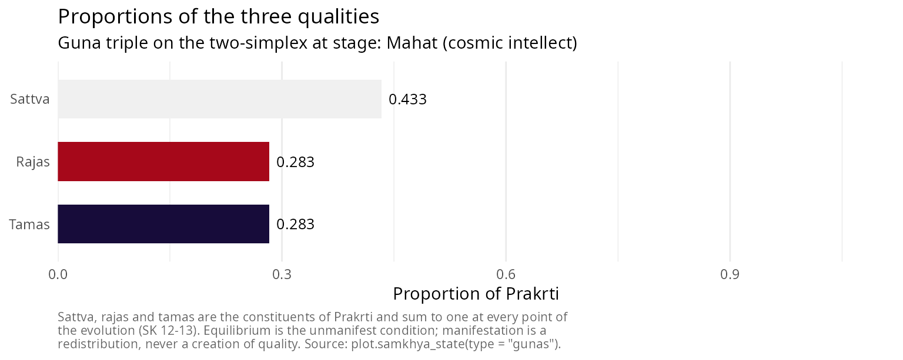

# Introduction to Sāṃkhya philosophy: the twenty-five tattvas

## Sāṃkhya and its sources

Sāṃkhya (सांख्य, “enumeration”) is one of the six orthodox systems
(*ṣaḍdarśana*) of Indian philosophy. It is a dualism of consciousness
and matter, an evolutionary cosmology, and a soteriology in which
release comes through discriminative knowledge and through nothing else.
Tradition ascribes it to the sage Kapila, but the surviving classical
statement is the *Sāṃkhyakārikā* of Īśvarakṛṣṇa, composed in or around
the fourth or fifth century CE [\[2\]](#ref2). Verse 72 counts the work
at seventy verses, and the received text transmits seventy-two or
seventy-three, the closing verses being transitional; this vignette
cites by the standard numbering and writes SK for the text.

The commentarial tradition matters here more than usual, because a great
many claims circulated as “Sāṃkhya” belong to the commentators rather
than to the kārikā. The *Yuktidīpikā*, critically edited by Wezler and
Motegi [\[5\]](#ref5), is the most philosophically substantial of the
commentaries; Gauḍapāda’s *Bhāṣya* is the most widely read; Vācaspati
Miśra’s *Tattvakaumudī*, of the ninth or tenth century, is the standard
scholastic exposition; and Vijñānabhikṣu’s sixteenth-century
*Sāṃkhyapravacanabhāṣya* is a late synthesis that departs from the
kārikā on several points, theism among them. Throughout this vignette a
claim found in the kārikā is marked with its verse, and a claim found
only in a commentary is attributed to the commentator who makes it.

One point of orientation before the doctrine. Classical Sāṃkhya is
*nirīśvara*, without a lord: the kārikā argues for Prakṛti and for
Puruṣa and posits no creator, and the theistic readings of the system
belong to Vijñānabhikṣu and to the later tradition. The contrast with
Pātañjala Yoga, which admits an Īśvara, is treated below.

  

### The three means of valid knowledge

SK 4 admits three means of valid knowledge and three only: *dṛṣṭa*, what
is seen; *anumāna*, inference; and *āptavacana*, the word of one who is
reliable. Nyāya adds comparison and Mīmāṃsā two more; the restriction to
three is deliberate, since the remaining means are held to reduce to
these.

``` r

samkhya_pramanas()
#> <samkhya_pramana>
#> Three means of valid knowledge, and three only (SK 4)
#> 
#> 1. Perception (karika: drsta; commentators: pratyaksa)
#>    Determination of each object by the sense proper to it (SK 5)
#> 2. Inference (karika: anumana; commentators: anumana)
#>    Threefold, resting on a mark and on the bearer of the mark (SK 5)
#> 3. Reliable testimony (karika: aptavacana; commentators: sabda)
#>    The word of one who is reliable; reaches what inference cannot (SK 5-6)
#> 
#> Nyaya adds comparison and Mimamsa adds two more; SK 4 restricts to three.
```

The terms most often quoted for the first and third, *pratyakṣa* and
*śabda*, are Nyāya’s vocabulary adopted by the Sāṃkhya commentators. The
kārikā’s own words are *dṛṣṭa* and *āptavacana*, and the package reports
both columns so that the difference stays visible rather than being
quietly harmonised.

The third means carries unusual weight in this system. SK 6 states that
what lies beyond the senses is established by inference from the
general, and that what even inference cannot reach is established by
reliable testimony. Prakṛti and Puruṣa are not objects of perception, so
the whole ontology rests on the second and third means, and the kārikā
is candid about it.

  

## The effect pre-exists in its cause

Before any enumeration, the causal doctrine. SK 9 argues that the effect
exists in its material cause before it is produced, which is
*satkāryavāda*.

``` r

satkaryavada()
#> <samkhya_satkarya>
#> Satkaryavada: the effect exists in its cause before production (SK 9)
#> 
#> 1. asadakaranat
#>    Because there is no making of what is not
#>    Production out of nothing is not production
#> 2. upadanagrahanat
#>    Because a material cause is resorted to
#>    The potter takes clay, not milk, to make a pot
#> 3. sarvasambhavabhavat
#>    Because there is no arising of everything from everything
#>    Oil comes from sesame and not from sand
#> 4. saktasya sakyakaranat
#>    Because what is capable produces what it is capable of
#>    A capacity is a capacity for something determinate
#> 5. karanabhavat
#>    Because the effect is of the nature of the cause
#>    Cloth is not other than the threads that constitute it
#> 
#> Transformation is real (parinama), not apparent (vivarta).
```

Nothing in the evolutionary sequence makes sense without this. If the
effect did not already exist in the cause, the twenty-three evolutes
would be additions to Prakṛti rather than manifestations of what she
already contains, and the inference of SK 15 and 16 from the finitude
and the homogeneity of the manifest back to a single unmanifest cause
would not go through. Transformation in Sāṃkhya is real, *pariṇāma*: the
effect is a genuine modification of the cause. This separates the system
from the *vivarta* of Advaita Vedānta, in which the effect is an
appearance that leaves the cause untouched, and from the *asatkāryavāda*
of Nyāya-Vaiśeṣika, in which the effect is a genuinely new entity
[\[4\]](#ref4).

  

## The two principles

  

### Puruṣa

Puruṣa (पुरुष) is consciousness. SK 17 gives five arguments for its
existence: because an aggregate exists for the sake of another; because
there must be something that is the reverse of what is constituted by
the three qualities; because there must be a superintendent; because
there must be an experiencer, *bhoktṛbhāvāt*; and because there is
activity directed towards isolation. SK 18 establishes plurality on
three grounds, and not on one: the several determination of birth, death
and the organs; the non-simultaneity of activity, *ayugapatpravṛtteḥ*;
and difference in the proportion of the three qualities.

SK 19 gives the character of Puruṣa in a single line: witnesshood,
isolation, neutrality, spectatorship and non-agency. Two of these
deserve emphasis, because each is regularly overstated in one direction
or the other.

Puruṣa is *akartṛ*, never an agent. It is not, however, *abhoktṛ*: SK 17
argues for its existence precisely from the requirement of an
experiencer, and SK 19 denies agency alone. The resolution is SK 37,
which assigns to buddhi the work of presenting everything to Puruṣa for
experience. Experience is *for* Puruṣa while every modification involved
in it occurs in Prakṛti; to deny that Puruṣa is an experiencer is to
remove the argument of SK 17, and to make it an agent is to contradict
SK 19.

*Kaivalya*, isolation, appears in SK 19 as a standing characteristic and
not as an achievement. Puruṣa is already isolated. What is attained at
the end of the system is therefore not a property Puruṣa lacked; it is
the cessation of an activity of Prakṛti’s. The point governs the whole
treatment of liberation below.

Puruṣa does not act on Prakṛti. Its mere presence suffices, and SK 21
illustrates the conjunction with the image of a lame man and a blind
man, who cooperate to their mutual benefit without either becoming the
other. The simile of the magnet drawing iron without itself moving,
often quoted at this point, belongs to the commentaries and to the
*Sāṃkhyasūtra*, not to the kārikā.

  

### Prakṛti

Prakṛti (प्रकृति) is the unconscious material principle, also called
*pradhāna*, the primary, and *avyakta*, the unmanifest. SK 3 states her
structural position in one word, *avikṛti*: she is uncreated, the root
that is not itself an effect of anything.

SK 10 contrasts the manifest with the unmanifest in ten respects, the
manifest being caused, non-eternal, non-pervasive, active, plural,
dependent, mergent, composite and subordinate, and the unmanifest the
reverse in each. SK 11 adds what the two share, namely that both are
constituted by the three qualities, non-discriminating, objective,
common, unconscious and productive, and that Puruṣa is the reverse of
this while resembling the unmanifest in some of the respects of SK 10.

That last clause is where a common error enters. Because SK 11 likens
Puruṣa to the unmanifest in certain respects, secondary accounts
sometimes group Puruṣa and Prakṛti together as two “unmanifest
principles”. The grouping does not survive SK 2 and SK 3, which give
three categories, *vyakta*, *avyakta* and *jña*, the manifest, the
unmanifest and the knower, and which place Puruṣa outside the causal
series altogether as *na prakṛtir na vikṛtiḥ*, neither cause nor effect.
*Avyakta* denotes mūlaprakṛti alone. The enumeration below follows SK 3.

The unity of Prakṛti is argued at SK 15, from the finitude of particular
things, from homogeneity, from evolution through causal power, from the
separation of cause and effect, and from the non-separateness of the
whole world; it is not asserted at SK 11.

  

### The three qualities

SK 12 gives the three qualities as having the nature of pleasure, pain
and dejection, *prītyaprītiviṣādātmakāḥ*, and as having illumination,
activity and restraint for their purposes, *prakāśapravṛttiniyamārthāḥ*.
It then names four relations they bear one another, in a single
compound: *anyonyābhibhavāśrayajananamithunavṛttayaḥ*. They mutually
dominate, mutually depend, mutually produce and mutually consort.

The first of these four is worth dwelling on, because it is routinely
mistranslated. *Abhibhava* is overpowering or suppression. Rendering the
compound as “mutual support” keeps *āśraya* and silently drops
*abhibhava*, which reverses the sense of the leading term: the qualities
are as much in contention as in cooperation, and it is their contention
that drives manifestation at all.

SK 13 gives their properties: sattva is light and illuminating, *laghu
prakāśakam*; rajas is stimulating and mobile, *upaṣṭambhakaṃ calam*;
tamas is heavy and enveloping, *guru varaṇakam*.

| Quality | SK 12 nature | SK 12 purpose | SK 13 properties |
|----|----|----|----|
| *sattva* (सत्त्व) | *prīti*, pleasure | *prakāśa*, illumination | light, illuminating |
| *rajas* (रजस्) | *aprīti*, pain | *pravṛtti*, activity | stimulating, mobile |
| *tamas* (तमस्) | *viṣāda*, dejection | *niyama*, restraint | heavy, enveloping |

Two familiar schemes are absent from this table on purpose. The
association of the three qualities with the colours white, red and black
comes from Śvetāśvatara Upaniṣad 4.5 and the Purāṇic material that
follows it, not from the kārikā. The association with upward, horizontal
and downward tendency comes from Bhagavadgītā 14.18, which is in any
case a statement about the destinies of persons rather than about the
qualities as such. Both are perfectly respectable pieces of Indian
thought and neither is Sāṃkhyakārikā 12 or 13; presenting them under
that citation is a misattribution, and it is common enough to be worth
naming.

In the unmanifest condition the three stand in equilibrium, a condition
the later tradition calls *sāmyāvasthā*; the term is Vācaspati’s and the
*Sāṃkhyasūtra*’s rather than the kārikā’s. Because the three are
proportions of one substance, they sum to one, and manifestation is a
redistribution among them rather than an increase in any. The package
enforces that invariant at every step.

``` r

state <- init_prakriti()
state$gunas
#>    sattva     rajas     tamas 
#> 0.3333333 0.3333333 0.3333333
sum(state$gunas)
#> [1] 1
```

  

## The twenty-five tattvas

SK 3 partitions the twenty-five principles four ways: mūlaprakṛti is
uncreated; seven are at once effects and causes; sixteen are effects
only; and Puruṣa is neither. The package carries the enumeration as a
data object, and every table, diagram and method in it derives from that
object, so the numbering cannot drift between them.

| Class | Sense | Members | n |
|:---|:---|:---|---:|
| *avikṛti* | Uncreated root | mūlaprakṛti | 1 |
| *prakṛti-vikṛti* | Effect and cause both | mahat, ahaṃkāra, the five tanmātras | 7 |
| *vikāra* | Effect only | the eleven organs, the five gross elements | 16 |
| *na prakṛtir na vikṛtiḥ* | Neither cause nor effect | puruṣa | 1 |

The partition of Sāṃkhyakārikā 3. {.table}

The arithmetic is 1 + 7 + 16 + 1 = 25, and one consequence of it is
worth stating explicitly because it is so often got wrong. Prakṛti has
**twenty-three** evolutes, not twenty-four. Mūlaprakṛti is not an
evolute of herself, and Puruṣa is not an evolute at all.

``` r

sum(tattvas$category %in% c("prakriti-vikriti", "vikara"))
#> [1] 23
```

The numbering used throughout counts the twenty-four material principles
from mūlaprakṛti (1) to pṛthivī (24) and makes Puruṣa the twenty-fifth,
*pañcaviṃśa*, which is the enumeration presupposed by the commentators
and by the *Mokṣadharma*.

| \# | IAST | Devanāgarī | Gloss | SK |
|---:|:---|:---|:---|:---|
| 1 | mūlaprakṛti | मूलप्रकृति | Primordial nature, unmanifest and uncaused | 3, 10-11, 15-16 |
| 2 | mahat | महत् | The great one, cosmic intellect | 3, 22-23 |
| 3 | ahaṃkāra | अहंकार | The I-maker, principle of self-appropriation | 3, 22, 24 |
| 4 | manas | मनस् | Mind, the eleventh organ | 25, 27 |
| 5 | śrotra | श्रोत्र | Ear, organ of hearing | 25, 26, 28 |
| 6 | tvac | त्वच् | Skin, organ of touch | 25, 26, 28 |
| 7 | cakṣus | चक्षुस् | Eye, organ of sight | 25, 26, 28 |
| 8 | rasanā | रसना | Tongue, organ of taste | 25, 26, 28 |
| 9 | ghrāṇa | घ्राण | Nose, organ of smell | 25, 26, 28 |
| 10 | vāc | वाच् | Speech | 25, 26, 28 |
| 11 | pāṇi | पाणि | Grasping | 25, 26, 28 |
| 12 | pāda | पाद | Locomotion | 25, 26, 28 |
| 13 | pāyu | पायु | Excretion | 25, 26, 28 |
| 14 | upastha | उपस्थ | Generation | 25, 26, 28 |
| 15 | śabda | शब्द | Sound as bare essence | 25, 38 |
| 16 | sparśa | स्पर्श | Touch as bare essence | 25, 38 |
| 17 | rūpa | रूप | Form as bare essence | 25, 38 |
| 18 | rasa | रस | Taste as bare essence | 25, 38 |
| 19 | gandha | गन्ध | Smell as bare essence | 25, 38 |
| 20 | ākāśa | आकाश | Space | 22, 38 |
| 21 | vāyu | वायु | Air | 22, 38 |
| 22 | tejas | तेजस् | Fire | 22, 38 |
| 23 | ap | अप् | Water | 22, 38 |
| 24 | pṛthivī | पृथिवी | Earth | 22, 38 |
| 25 | puruṣa | पुरुष | Pure consciousness, the witness | 3, 11, 17-19 |

The twenty-five tattvas. {.table}

  

### The internal organ is threefold

SK 33 defines the internal organ, *antaḥkaraṇa*, as threefold: buddhi,
ahaṃkāra and manas, with the ten organs external to it. Manas therefore
belongs to two classifications at once, and the package keeps them apart
with two columns, because conflating them produces the frequent error of
labelling a two-member group “the antaḥkaraṇa”.

``` r

subset(tattvas, antahkarana, select = c(index, iast, group, ekadasaka))
#>   index     iast    group ekadasaka
#> 2     2    mahat   buddhi     FALSE
#> 3     3 ahaṃkāra ahamkara     FALSE
#> 4     4    manas    manas      TRUE
```

Causally manas is one of the eleven that issue from ahaṃkāra (SK 25);
functionally it is one of the three that constitute the internal organ
(SK 33). Both are true, and neither reduces to the other.

  

### The derivation branches

SK 22 gives the order: from Prakṛti, mahat; from that, ahaṃkāra; from
that, the set of sixteen; and from five of those sixteen, the five gross
elements. SK 25 gives what the order alone leaves out, namely that
ahaṃkāra emits along two different aspects at once:

> *sāttvika ekādaśakaḥ pravartate vaikṛtād ahaṃkārāt* *bhūtādes
> tanmātraḥ sa tāmasas taijasād ubhayam*

The elevenfold set proceeds from the sattvic aspect, called *vaikṛta*;
the tanmātras proceed from the tamasic, called *bhūtādi*; and both
proceed from the rajasic, called *taijasa*, in the sense that the
rajasic aspect supplies the activity by which either proceeds at all and
emits no principle of its own.

``` r

subset(tattvas, !is.na(guna_aspect), select = c(index, iast, group, guna_aspect)) |>
  transform(guna_aspect = factor(guna_aspect)) |>
  (\(d) table(d$group, d$guna_aspect))()
#>              
#>               bhutadi vaikrta
#>   jnanendriya       0       5
#>   karmendriya       0       5
#>   manas             0       1
#>   tanmatra          5       0
```

Two consequences follow, and both are contradicted by a large fraction
of the diagrams in circulation.

The organs of action are sattvic in origin. The elevenfold set of SK 25
is manas together with the five organs of knowledge and the five organs
of action, all eleven from the *vaikṛta* aspect. Assigning the organs of
action to a tamasic or a rajasic branch, as is often done to make the
diagram symmetrical, contradicts the verse.

The tanmātras do not descend from the organs. They are the other branch,
issuing from ahaṃkāra directly. A diagram that routes the organs of
knowledge or of action into the tanmātras inverts the derivation. In
this package the two branches are genuinely parallel, and a state
carrying ahaṃkāra with no organ whatever is a legitimate argument to the
function that manifests the tanmātras.

``` r

ahamkara_only <- init_prakriti() |>
  evolution_buddhi(verbose = FALSE) |>
  evolution_ahamkara(verbose = FALSE)

# The tamasic branch proceeds with the sattvic branch entirely empty.
tanmatras_first <- evolution_tanmatras(ahamkara_only, verbose = FALSE)
summary(tanmatras_first)$branches
#> vaikrta bhutadi 
#>       0       5
```

  

### The organs and their function

SK 26 names the five organs of knowledge and the five of action. SK 28
gives their function, and it is the sharpest thing the kārikā says about
perception: the function of the five organs of knowledge with respect to
sound and the rest is *ālocanamātra*, bare apprehension and nothing
more. The five actions are speech, grasping, movement, excretion and
pleasure.

|  \# | IAST    | Devanāgarī | Gloss                  | Class       |
|----:|:--------|:-----------|:-----------------------|:------------|
|   5 | śrotra  | श्रोत्र      | Ear, organ of hearing  | jnanendriya |
|   6 | tvac    | त्वच्        | Skin, organ of touch   | jnanendriya |
|   7 | cakṣus  | चक्षुस्       | Eye, organ of sight    | jnanendriya |
|   8 | rasanā  | रसना       | Tongue, organ of taste | jnanendriya |
|   9 | ghrāṇa  | घ्राण       | Nose, organ of smell   | jnanendriya |
|  10 | vāc     | वाच्        | Speech                 | karmendriya |
|  11 | pāṇi    | पाणि       | Grasping               | karmendriya |
|  12 | pāda    | पाद        | Locomotion             | karmendriya |
|  13 | pāyu    | पायु        | Excretion              | karmendriya |
|  14 | upastha | उपस्थ       | Generation             | karmendriya |

The ten organs (SK 26, 28). {.table}

Bare apprehension is not judgement. SK 29 and 30 distribute the
remaining work: buddhi determines, ahaṃkāra appropriates, manas
constructs, and the three together with the relevant organ operate now
successively and now simultaneously. SK 35 makes buddhi the doorkeeper
and the other organs the doors, and SK 36 has all of them presenting the
whole to buddhi, which in turn presents everything to Puruṣa. This
division of labour, rather than any theory of the senses as judging
faculties, is what distinguishes the Sāṃkhya account of cognition.

The organs of knowledge are listed here in the order ear, skin, eye,
tongue, nose, which aligns each with its corresponding subtle and gross
element. SK 26’s own order is eye, ear, nose, tongue, skin. The
divergence is one of presentation and not of doctrine, and one ordering
is used throughout the package so that its tables, diagrams and
vignettes cannot disagree with one another.

  

### The subtle and the gross elements

SK 38 reads:

> *tanmātrāṇy aviśeṣās tebhyo bhūtāni pañca pañcabhyaḥ* *ete smṛtā
> viśeṣāḥ śāntā ghorāś ca mūḍhāś ca*

The tanmātras are the non-specific; from those five arise the five
elements; and *these*, the specific, are held to be tranquil, turbulent
and deluding. The predication of *śānta*, *ghora* and *mūḍha* falls on
the gross elements. A widespread rendering instead has SK 38 describe
the tanmātras as neither soothing nor tormenting nor stupefying, which
reverses the relatum and borrows the triple *prīti*, *aprīti*, *viṣāda*
from SK 12, where it characterises the three qualities. The negative
characterisation of the tanmātras is a commentarial inference; the verse
states the positive characterisation of the gross elements.

A second attribution needs the same care. The scheme by which each gross
element accumulates the qualities of those before it, so that space
carries sound alone and earth carries all five, is not in SK 22 or
anywhere else in the kārikā. Within Sāṃkhya it is Vijñānabhikṣu’s
position; Vācaspati Miśra holds instead that each gross element arises
from its own tanmātra alone, and that one-to-one derivation is what this
package records [\[3\]](#ref3). Outside Sāṃkhya the accumulation scheme
is Vedāntic and Purāṇic and belongs with *pañcīkaraṇa*. It is a live
disagreement in the tradition, and flattening it into a citation of SK
22 loses both positions.

|  \# | IAST    | Devanāgarī | Gloss                 | Material cause |
|----:|:--------|:-----------|:----------------------|:---------------|
|  15 | śabda   | शब्द        | Sound as bare essence | ahaṃkāra       |
|  16 | sparśa  | स्पर्श       | Touch as bare essence | ahaṃkāra       |
|  17 | rūpa    | रूप         | Form as bare essence  | ahaṃkāra       |
|  18 | rasa    | रस         | Taste as bare essence | ahaṃkāra       |
|  19 | gandha  | गन्ध        | Smell as bare essence | ahaṃkāra       |
|  20 | ākāśa   | आकाश       | Space                 | śabda          |
|  21 | vāyu    | वायु        | Air                   | sparśa         |
|  22 | tejas   | तेजस्        | Fire                  | rūpa           |
|  23 | ap      | अप्         | Water                 | rasa           |
|  24 | pṛthivī | पृथिवी      | Earth                 | gandha         |

The subtle and gross elements, with Vācaspati’s derivation. {.table}

  

## Simulating the evolution

The whole branching sequence runs in one call, or step by step.

``` r

manifested <- samkhya_evolve(guna_dominant = "sattva", verbose = FALSE)
manifested
#> <samkhya_state>
#> Stage: Mahabhutas (the specific)
#> Gunas: sattva = 0.433, rajas = 0.283, tamas = 0.283 (sum = 1.000)
#> Evolutes manifest: 23 of 23
#> Cognitive situation: Visesa (the specific): the gross world stands manifest
#> Viveka in buddhi: Not attained
#> Prakrti acting for this Purusha: Yes
#> Purusha: Witness, neutral, non-agent; neither bound nor released (SK 19, 62)
```

The summary reports the structural partition, the state of the two
branches, the threefold internal organ and the subtle body.

``` r

summary(manifested)
#> <summary.samkhya_state>
#> 
#> Stage: Mahabhutas (the specific)
#> Cognitive situation: Visesa (the specific): the gross world stands manifest
#> 
#> Qualities of Prakrti (SK 12-13)
#>   Sattva = 0.4333   Rajas = 0.2833   Tamas = 0.2833   Sum = 1.0000
#> 
#> Structural partition of what has manifested (SK 3)
#>   Avikriti, uncreated root                : 1 of 1
#>   Prakriti-vikriti, effect and cause both : 7 of 7
#>   Vikara, effect only                     : 16 of 16
#>   Evolutes of Prakrti manifest            : 23 of 23
#> 
#> Branches issuing from ahamkara (SK 25)
#>   Vaikrta, sattvic: the eleven organs     : 11 of 11
#>   Bhutadi, tamasic: the five tanmatras    : 5 of 5
#>   Taijasa, rajasic: supplies activity to both, issues no tattva
#> 
#> Internal organ, threefold (SK 33): mahat, ahaṃkāra, manas
#> Subtle body, eighteenfold (SK 40): 18 of 18 constituents
#> 
#> Viveka in buddhi: Not attained
#> Prakrti acting for this Purusha: Yes
#> Purusha: Unchanged throughout; neither bound nor released (SK 62)
```

Because the branches are parallel, the order in which they are taken
does not matter, and the two orders give the same result.

``` r

vaikrta_first <- ahamkara_only |>
  evolution_manas(verbose = FALSE) |>
  evolution_indriyas(verbose = FALSE) |>
  evolution_tanmatras(verbose = FALSE) |>
  evolution_mahabhutas(verbose = FALSE)

bhutadi_first <- ahamkara_only |>
  evolution_tanmatras(verbose = FALSE) |>
  evolution_mahabhutas(verbose = FALSE) |>
  evolution_manas(verbose = FALSE) |>
  evolution_indriyas(verbose = FALSE)

setequal(vaikrta_first$tattvas, bhutadi_first$tattvas)
#> [1] TRUE
```

The causal order within a branch, by contrast, is not optional: nothing
manifests before its material cause.

``` r

evolution_mahabhutas(ahamkara_only)
#> Error:
#> ! The gross elements cannot evolve: the material cause is not yet manifest (śabda, sparśa, rūpa, rasa, gandha missing).
```

  

## The subtle body

SK 39 distinguishes the subtle bodies from those born of mother and
father and from the gross elements, and SK 40 defines the subtle body as
arisen before, unattached, constant, and extending from mahat to the
subtle ones. That is eighteen constituents: mahat, ahaṃkāra, the eleven
organs and the five tanmātras.

``` r

linga_sharira(manifested)
#> <samkhya_linga>
#> Subtle body, linga-sarira and suksma-sarira being one thing (SK 39-40)
#> 
#>   buddhi       Mahat
#>   ahamkara     Ahamkara
#>   manas        Manas
#>   jnanendriya  Shrotra, Tvac, Chakshus, Rasana, Ghrana
#>   karmendriya  Vac, Pani, Pada, Payu, Upastha
#>   tanmatra     Shabda, Sparsha, Rupa, Rasa, Gandha
#> 
#> Constituents: 18
#> Manifest in this state: 18 of 18
#> The gross elements are excluded: they constitute the gross body, which perishes.
```

*Liṅga-śarīra* and *sūkṣma-śarīra* are two names for this one aggregate.
Accounts that make them designate two different bodies, one running from
buddhi to the tanmātras and another consisting of buddhi, ahaṃkāra and
manas, split a single term of the kārikā in two and contradict SK 40.
The gross elements are not constituents of it: the subtle body
transmigrates, and the gross body perishes.

SK 41 gives the reason it must exist, in an image: as a picture cannot
stand without a support, nor a shadow without a post, so the subtle
marks cannot subsist without a specific substratum. SK 42 gives its
purpose, that it plays its part for the sake of Puruṣa like an actor
taking on a role.

  

## The dispositions of buddhi

SK 23 assigns buddhi eight dispositions, four sattvic and four their
reverse, and SK 43 to 51 build on them the fiftyfold intellectual
creation.

``` r

buddhi_bhavas()
#> <samkhya_bhava>
#> Eight dispositions of buddhi (SK 23, 43-45)
#> 
#>   Sattvic form
#>     dharma      Virtue       Ascent to the higher worlds (SK 44)
#>     jnana       Knowledge    Release (SK 44)
#>     viraga      Dispassion   Dissolution into Prakrti (SK 45)
#>     aisvarya    Mastery      Non-obstruction (SK 45)
#>   Tamasic form
#>     adharma     Vice         Descent to the lower worlds (SK 44)
#>     ajnana      Ignorance    Bondage (SK 44)
#>     raga        Attachment   Transmigration (SK 45)
#>     anaisvarya  Impotence    Obstruction (SK 45)
#> 
#> Intellectual creation, fiftyfold (SK 46-51)
#>   viparyaya   Misconception   5  tamas, moha, mahamoha, tamisra, andhatamisra (SK 47-48)
#>   asakti      Incapacity     28  Injuries of the eleven organs and seventeen failures of buddhi (SK 49)
#>   tusti       Contentment     9  Four internal and five external (SK 50)
#>   siddhi      Attainment      8  Reasoning, hearing, study, three suppressions of pain, and two more (SK 51)
#>               Total          50
#> 
#> The five misconceptions are not the five afflictions of Yoga-sutra 2.3;
#> that identification belongs to the commentators, not to the karika.
```

Two things in that output correct claims that circulate widely. The
reverse of *virāga*, dispassion, is *rāga*, attachment; SK 23 says the
tamasic form is the reverse of the sattvic, *tāmasam asmād viparyastam*,
and the form *avairāgya* that appears in many secondary accounts is a
coinage that negates the abstract noun instead of the disposition.

And the five *viparyayas* of SK 47 and 48 are *tamas*, *moha*,
*mahāmoha*, *tāmisra* and *andhatāmisra*. They are not the five
afflictions of Yogasūtra 2.3, *avidyā*, *asmitā*, *rāga*, *dveṣa* and
*abhiniveśa*. The identification of the two lists is made by the
commentators, Vācaspati among them, and it is a defensible piece of
exegesis; it is not what the kārikā says, and citing SK 47 for *avidyā*
attributes to Īśvarakṛṣṇa a list he does not give.

SK 44 states what the dispositions effect, and the second clause is the
hinge of the whole system: *jñānena cāpavargo viparyayād iṣyate
bandhaḥ*, by knowledge there is release, and by its reverse, bondage.

  

## Prakṛti acts for another

The teleology is the strangest and the most characteristic part of the
system, and it is what makes the ending intelligible. SK 21 states the
purpose of the conjunction: the seeing of Prakṛti by Puruṣa, and the
isolation of Puruṣa. SK 31 has the organs performing their own functions
moved by mutual impulse, the motive being the purpose of Puruṣa and
nothing else. SK 56 and 57 press the difficulty and answer it: this
evolution, from mahat to the specific elements, is brought about by
Prakṛti for the release of each Puruṣa, for another’s sake though it
looks like her own; and as the unknowing milk functions for the
nourishment of the calf, so Prakṛti functions for the release of Puruṣa.

That is the point of the analogy. Purposiveness in Sāṃkhya does not
require a purposer. Prakṛti is unconscious throughout and there is no
Īśvara directing her; the teleology is built into her constitution as
the nourishing function is built into milk. SK 60 calls her the
benefactress endowed with the qualities who accomplishes by manifold
means, without benefit to herself, the purpose of one who is devoid of
qualities and confers no benefit. SK 61 calls her the most delicate of
beings, who having once been seen with the thought “I have been seen”
never comes again into the sight of that Puruṣa.

  

## Kaivalya

Everything above converges on SK 62, which is the verse most often lost
in computational and popular treatments alike:

> *tasmān na badhyate ’ddhā na mucyate nāpi saṃsarati kaścit* *saṃsarati
> badhyate mucyate ca nānāśrayā prakṛtiḥ*

Therefore no one is bound, no one is released, and no one transmigrates;
it is Prakṛti, in her manifold supports, who transmigrates, is bound and
is released.

Puruṣa was never bound, so Puruṣa does not become free. What arises is
discriminative knowledge, and it arises in buddhi. SK 64 gives its
content: from the repeated practice of the principles there arises the
knowledge “I am not, nothing is mine, I am not an I”, *nāsmi na me
nāham*, which is complete because free from error, pure and absolute.

``` r

final <- get_kaivalya(manifested, verbose = FALSE)

final$viveka
#> [1] TRUE
final$prakriti_active
#> [1] FALSE
```

And Puruṣa is returned exactly as it was, which is the design decision
the verse forces:

``` r

identical(final$purusha, manifested$purusha)
#> [1] TRUE
```

SK 59 gives the image for what does change: as a dancer withdraws from
the stage having shown herself to the audience, so Prakṛti withdraws
having shown herself to Puruṣa. SK 66 states the situation after the
withdrawal, that the one has ceased to look and the other has ceased to
display, and though the conjunction persists there is no further motive
for creation.

Embodiment does not stop at the moment of knowledge. SK 67 says that the
body continues by the momentum of impressions already acquired, as a
potter’s wheel goes on turning after the potter has stopped pushing it.
Only at the separation from the body, Prakṛti’s purpose being
accomplished, is isolation attained both certainly and finally,
*aikāntikam ātyantikam* (SK 68). The package records the distinction.

``` r

c(embodied = get_kaivalya(manifested, jivanmukti = TRUE, verbose = FALSE)$mental_state,
  final    = get_kaivalya(manifested, jivanmukti = FALSE, verbose = FALSE)$mental_state)
#>                                                 embodied 
#> "Viveka attained; the body persists by momentum (SK 67)" 
#>                                                    final 
#>   "Viveka attained; isolation certain and final (SK 68)"
```

The state is neither annihilation nor absorption into anything. It is
the recognition of a distinction that always obtained.

  

## Sāṃkhya and Yoga

Pātañjala Yoga takes over most of the Sāṃkhya ontology, and the two are
conventionally paired as theory and practice. The pairing is useful and
it obscures three real differences, each of which Larson treats at
length [\[2\]](#ref2) and Burley re-examines [\[4\]](#ref4).

Yoga admits an Īśvara, a special Puruṣa untouched by affliction, action
and its residue (YS 1.24). The kārikā admits none. This is the sharpest
divergence, and it is why the two systems are distinguished in the
doxographies as *nirīśvara* and *seśvara* Sāṃkhya.

Yoga’s path is eightfold and practical (YS 2.29), and its central
technical notion, *vivekakhyāti*, the unbroken discriminative
discernment named at YS 2.26 as the means of removal, is a Yoga term.
The kārikā speaks of *jñāna* and of *viveka* and does not use
*vivekakhyāti*; the term is imported into expositions of Sāṃkhya so
routinely that it is worth flagging, though nothing doctrinal turns on
it.

Yoga’s account of what obstructs is the five afflictions of YS 2.3;
Sāṃkhya’s is the fivefold *viparyaya* of SK 47 and 48, discussed above.
Eliade [\[9\]](#ref9) and Feuerstein [\[10\]](#ref10) treat the Yoga
side; Halbfass [\[8\]](#ref8) is the standard account of how both were
received in European philosophy, often through exactly the conflations
this vignette has been separating.

  

## Guṇa dynamics

Which quality predominates when the equilibrium breaks changes the
character of the manifestation without changing its structure.

``` r

states <- lapply(c("sattva", "rajas", "tamas"), function(g)
  evolution_buddhi(init_prakriti(), guna_dominant = g, verbose = FALSE))

sapply(states, function(s) s$gunas)
#>             [,1]      [,2]      [,3]
#> sattva 0.4333333 0.2833333 0.2833333
#> rajas  0.2833333 0.4333333 0.2833333
#> tamas  0.2833333 0.2833333 0.4333333
```

``` r

# The three remain proportions of one substance at every point.
sapply(states, function(s) sum(s$gunas))
#> [1] 1 1 1
```



  

## The derivation as a diagram

The diagram is generated from the enumeration rather than written by
hand, so it cannot come to disagree with the tables above. The two
aspects of ahaṃkāra are drawn as two enclosed branches, because their
parallelism is the whole point of SK 25 and the thing most often lost in
diagrams of this system.

Colour encodes the quality that predominates: pale for the sattvic
branch, dark for the tamasic, red for the rajasic aspect that drives
both and emits nothing. Puruṣa is drawn uncoloured and outside the
sequence, joined to it by a broken edge, because it is *nirguṇa*,
constituted by none of the three, and because SK 3 places it outside the
causal series as neither cause nor effect. Kaivalya carries no number:
the twenty-fifth principle is Puruṣa, and kaivalya is a condition, not a
tattva.

``` r

mermaid(create_samkhya_flowchart(), height = 620)
```

The detailed form names every principle in each group and gives its
index range.

``` r

mermaid(create_samkhya_flowchart_detailed(), height = 680)
```

The plot method draws the same derivation as a static figure, shading
what has so far manifested in a given state.


  

## Conclusion

Sāṃkhya sets out a structure of reality by enumeration, an account of
suffering by misidentification, and a path out of it by discrimination
alone. Its interest for a modern reader lies less in its cosmology than
in the discipline with which it separates the witness from everything
witnessed, and in its willingness to locate agency, bondage and release
entirely on the side of the unconscious principle while consciousness
remains, throughout, exactly what it was.

The care this vignette has taken over attribution is not pedantry. A
system that argues its way to a counter-intuitive conclusion deserves to
be reported in its own terms, and the errors corrected here, which put
the organs of action on the wrong branch, give Prakṛti twenty-four
evolutes, read SK 38 backwards, and hand Puruṣa a liberation the text
expressly denies it, each make the system tidier and less interesting
than it is.

  

## References

  

### Primary sources

**\[1\]** Īśvarakṛṣṇa. *Sāṃkhyakārikā*. Composed c. 350-450 CE. Cited by
verse throughout as SK. Text and translation as established in
[\[2\]](#ref2) and [\[3\]](#ref3).

**\[5\]** Wezler, A., & Motegi, S. (Eds.). (1998). *Yuktidīpikā: The
most significant commentary on the Sāṃkhyakārikā*, Vol. I. Alt- und
Neu-Indische Studien 44. Stuttgart: Franz Steiner Verlag. ISBN
[3-515-06132-0](https://search.worldcat.org/isbn/3515061320).

  

### Modern scholarship

**\[2\]** Larson, G. J. (1979). *Classical Sāṃkhya: An interpretation of
its history and meaning* (2nd rev. ed.). Delhi: Motilal Banarsidass.
ISBN
[978-81-208-0503-3](https://search.worldcat.org/isbn/9788120805033).

**\[3\]** Larson, G. J., & Bhattacharya, R. S. (Eds.). (1987). *Sāṃkhya:
A dualist tradition in Indian philosophy*. Encyclopedia of Indian
Philosophies, Vol. 4. Princeton, NJ: Princeton University Press.
[doi:10.1515/9781400853533](https://doi.org/10.1515/9781400853533)

**\[4\]** Burley, M. (2007). *Classical Sāṃkhya and Yoga: An Indian
metaphysics of experience*. Routledge Hindu Studies Series. London:
Routledge. ISBN
[978-0-415-39448-2](https://search.worldcat.org/isbn/9780415394482).

**\[6\]** Chakravarti, P. (1951). *Origin and development of the Sāṃkhya
system of thought*. Calcutta Sanskrit Series XXX. Calcutta: Metropolitan
Printing and Publishing House.

**\[7\]** Dasgupta, S. (1922). *A history of Indian philosophy*, Vol. I.
Cambridge: Cambridge University Press. ISBN
[978-0-521-04778-4](https://search.worldcat.org/isbn/9780521047784).

  

### Comparative and reception studies

**\[8\]** Halbfass, W. (1988). *India and Europe: An essay in
understanding*. Albany, NY: State University of New York Press. ISBN
[978-0-88706-795-2](https://search.worldcat.org/isbn/9780887067952).

**\[9\]** Eliade, M. (1969). *Yoga: Immortality and freedom* (2nd ed.;
W. R. Trask, Trans.). Bollingen Series LVI. Princeton, NJ: Princeton
University Press. ISBN
[978-0-691-01764-8](https://search.worldcat.org/isbn/9780691017648).
Originally published in French, 1954.

**\[10\]** Feuerstein, G. (1980). *The philosophy of classical Yoga*.
Manchester: Manchester University Press. ISBN
[978-0-7190-0777-4](https://search.worldcat.org/isbn/9780719007774).
