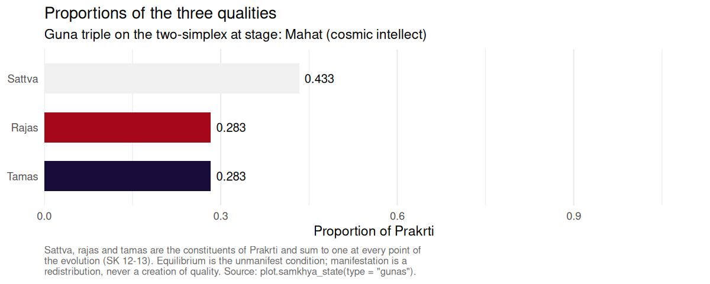
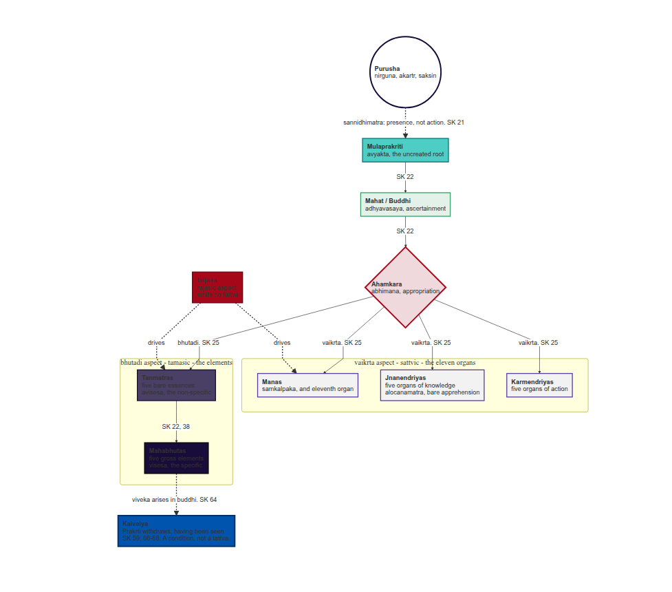

# SāṃkhyaR

[](https://lifecycle.r-lib.org/articles/stages.html#experimental)
[](https://www.gnu.org/licenses/gpl-3.0)
[](https://www.r-project.org/)
[](https://robustecologies.github.io/SamkhyaR/reference/index.html)
[](https://robustecologies.github.io/SamkhyaR/reference/index.html)
[](https://robustecologies.github.io/SamkhyaR/reference/index.html)
[](https://robustecologies.github.io/SamkhyaR/articles/index.html)
[](https://robustecologies.github.io/SamkhyaR)

  

*Purusha Prakriti se bhinna hai.* Consciousness is distinct from matter.
The witness is distinct from nature. The package that compiles distills
the awareness of the wild.

  

## Overview

**SamkhyaR** provides computational tools for the enumeration and the
causal derivation of classical Sāṃkhya, one of the six orthodox schools
(*ṣaḍdarśana*) of Indian philosophy. The package carries the twenty-five
principles (*tattva*) as a documented data object, simulates the
branching evolution of Prakṛti as the *Sāṃkhyakārikā* states it, renders
the derivation as a diagram, and supplies reference objects for the
doctrines that surround the evolution.

Sāṃkhya distinguishes two irreducible realities. **Puruṣa** (पुरुष) is
consciousness: witness, neutral, spectator, non-agent. **Prakṛti**
(प्रकृति) is the unconscious material principle, constituted by the three
qualities *sattva*, *rajas* and *tamas*, which in equilibrium constitute
the unmanifest and in disequilibrium the whole manifest world. From
their conjunction the twenty-three evolutes of Prakṛti proceed.

Sources are cited to verse throughout, and commentarial positions are
distinguished from the text of the kārikā rather than blended into it.

  

## Installation

``` r

if (!require("pak")) install.packages("pak")
pak::pak("robustecologies/SamkhyaR")
```

  

## The twenty-five tattvas

Sāṃkhyakārikā 3 partitions the principles four ways: one uncreated root,
seven that are at once effects and causes, sixteen that are effects
only, and Puruṣa who is neither.

| Class | Sense | Members | n |
|:---|:---|:---|---:|
| *avikṛti* | Uncreated root | mūlaprakṛti | 1 |
| *prakṛti-vikṛti* | Effect and cause both | mahat, ahaṃkāra, the five tanmātras | 7 |
| *vikāra* | Effect only | the eleven organs, the five gross elements | 16 |
| *na prakṛtir na vikṛtiḥ* | Neither | puruṣa | 1 |

The arithmetic is 1 + 7 + 16 + 1 = 25, from which it follows that
Prakṛti has **twenty-three** evolutes and not twenty-four: mūlaprakṛti
is not an evolute of herself, and Puruṣa is not an evolute at all.

``` r

sum(tattvas$category %in% c("prakriti-vikriti", "vikara"))
#> [1] 23
```

  

## Quick start

The evolution branches rather than running in a single chain.
Sāṃkhyakārikā 25 assigns the eleven organs to the sattvic (*vaikṛta*)
aspect of ahaṃkāra and the five tanmātras to its tamasic (*bhūtādi*)
aspect; the two proceed in parallel, and the gross elements descend from
the tanmātras alone.

``` r

library(SamkhyaR)

manifested <- samkhya_evolve(guna_dominant = "sattva", verbose = FALSE)
manifested
#> <samkhya_state>
#> Stage: Mahabhutas (the specific)
#> Gunas: sattva = 0.433, rajas = 0.283, tamas = 0.283 (sum = 1.000)
#> Evolutes manifest: 23 of 23
#> Cognitive situation: Visesa (the specific): the gross world stands manifest
#> Viveka in buddhi: Not attained
#> Prakrti acting for this Purusha: Yes
#> Purusha: Witness, neutral, non-agent; neither bound nor released (SK 19, 62)
```

``` r

summary(manifested)
#> <summary.samkhya_state>
#> 
#> Stage: Mahabhutas (the specific)
#> Cognitive situation: Visesa (the specific): the gross world stands manifest
#> 
#> Qualities of Prakrti (SK 12-13)
#>   Sattva = 0.4333   Rajas = 0.2833   Tamas = 0.2833   Sum = 1.0000
#> 
#> Structural partition of what has manifested (SK 3)
#>   Avikriti, uncreated root                : 1 of 1
#>   Prakriti-vikriti, effect and cause both : 7 of 7
#>   Vikara, effect only                     : 16 of 16
#>   Evolutes of Prakrti manifest            : 23 of 23
#> 
#> Branches issuing from ahamkara (SK 25)
#>   Vaikrta, sattvic: the eleven organs     : 11 of 11
#>   Bhutadi, tamasic: the five tanmatras    : 5 of 5
#>   Taijasa, rajasic: supplies activity to both, issues no tattva
#> 
#> Internal organ, threefold (SK 33): mahat, ahaṃkāra, manas
#> Subtle body, eighteenfold (SK 40): 18 of 18 constituents
#> 
#> Viveka in buddhi: Not attained
#> Prakrti acting for this Purusha: Yes
#> Purusha: Unchanged throughout; neither bound nor released (SK 62)
```

Because the branches are parallel, the tanmātras are reachable from a
state carrying ahaṃkāra and no organ whatever.

``` r

ahamkara_only <- init_prakriti() |>
  evolution_buddhi(verbose = FALSE) |>
  evolution_ahamkara(verbose = FALSE)

summary(evolution_tanmatras(ahamkara_only, verbose = FALSE))$branches
#> vaikrta bhutadi 
#>       0       5
```

  

## Kaivalya

Sāṃkhyakārikā 62 is explicit that no one is bound, no one is released
and no one transmigrates; it is Prakṛti, in her manifold supports, who
is bound and released. Discriminative knowledge arises in *buddhi*, and
what ends is Prakṛti’s activity on behalf of that Puruṣa. Accordingly
nothing in this package alters the description of Puruṣa that a state
carries.

``` r

final <- get_kaivalya(manifested, verbose = FALSE)

final$viveka
#> [1] TRUE
final$prakriti_active
#> [1] FALSE

# Purusha is returned exactly as it was.
identical(final$purusha, manifested$purusha)
#> [1] TRUE
```

  

## Guṇa dynamics

The three qualities are proportions of one substance and sum to one at
every point of the evolution. A disturbance of the equilibrium
redistributes them; it does not create quality.

``` r

states <- lapply(c("sattva", "rajas", "tamas"), function(g)
  evolution_buddhi(init_prakriti(), guna_dominant = g, verbose = FALSE))

sapply(states, function(s) s$gunas)
#>             [,1]      [,2]      [,3]
#> sattva 0.4333333 0.2833333 0.2833333
#> rajas  0.2833333 0.4333333 0.2833333
#> tamas  0.2833333 0.2833333 0.4333333
sapply(states, function(s) sum(s$gunas))
#> [1] 1 1 1
```



## The derivation as a diagram

``` r

DiagrammeR::mermaid(create_samkhya_flowchart(), height = 780)
```



  

## Doctrinal reference

The package also carries the doctrines that surround the evolution, each
cited to verse: the three means of valid knowledge in the kārikā’s own
vocabulary (*dṛṣṭa*, *anumāna*, *āptavacana*, SK 4-6), the eight
dispositions of buddhi with the fiftyfold intellectual creation (SK 23,
43-51), the eighteen constituents of the subtle body (SK 39-42), and the
five arguments for the pre-existence of the effect in its cause (SK 9).

``` r

linga_sharira()$n
#> [1] 18

satkaryavada()$table$term
#> [1] "asadakaranat"          "upadanagrahanat"       "sarvasambhavabhavat"  
#> [4] "saktasya sakyakaranat" "karanabhavat"
```

  

## Philosophical sources

The classical statement of the system is the *Sāṃkhyakārikā* of
Īśvarakṛṣṇa, composed in or around the fourth or fifth century CE. The
commentarial tradition matters more than usual here, because many claims
circulated as Sāṃkhya belong to the commentators rather than to the
kārikā: the *Yuktidīpikā* is the most philosophically substantial
commentary, Gauḍapāda’s *Bhāṣya* the most widely read, Vācaspati Miśra’s
*Tattvakaumudī* the standard scholastic exposition, and Vijñānabhikṣu’s
*Sāṃkhyapravacanabhāṣya* a late synthesis that departs from the kārikā
on several points, theism among them. Classical Sāṃkhya is *nirīśvara*,
without a lord.

Full bibliographic detail, with DOIs and ISBNs, is given in the
vignettes.

  

## Vignettes

The package ships 2 vignettes:

- **Introduction to Sāṃkhya philosophy: the twenty-five tattvas**, a
  verse-by-verse presentation of the system
- **सांख्यदर्शनस्य परिचयः - पञ्चविंशतितत्त्वानि**, the same presentation in
  Sanskrit, section for section

``` r

vignette(package = "SamkhyaR")
vignette("samkhya_philosophy", package = "SamkhyaR")
```

  

## Contributing

Contributions are welcome. Accuracy to the *Sāṃkhyakārikā* is the
governing constraint: a claim taken from the kārikā should carry its
verse number, a claim taken from a commentary should name the
commentator, and the two should not be blended. Scholarly references are
expected for philosophical claims, and every exported function ships
with `testthat` coverage.

  

## License

GPL (\>= 3)

  

## Citation

``` R
@software{samkhyar,
  author = {Almaraz, Pablo},
  title  = {SamkhyaR: computational exploration of the Samkhya darsana and its twenty-five tattvas},
  year   = {2026},
  note   = {R package version 0.2.0},
  url    = {https://github.com/robustecologies/SamkhyaR}
}
```

  

## Author

**Pablo Almaraz**
[](https://orcid.org/0000-0003-1416-2695)

[Robust Ecologies Lab](https://robustecologies.github.io)

  

## Disclaimer

This package is the original creation of the author in all conceptual,
theoretical and design aspects. Implementation was assisted by
Anthropic’s Claude Code to streamline package development. All original
ideas, creativity and scientific contributions belong to the author, who
maintains full responsibility for the package’s correctness and
reliability. Users are encouraged to report any issue through the
package’s issue tracker.
