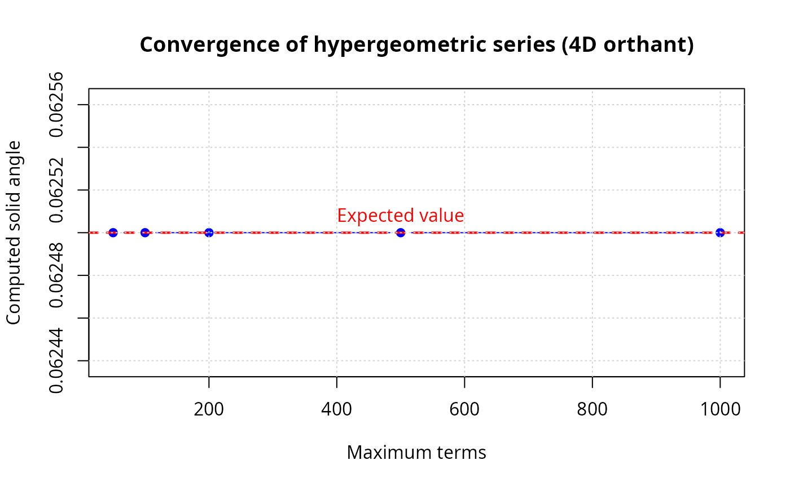

# Hypergeometric and tridiagonal series and decomposition approaches

## Introduction

This vignette demonstrates the computational methods from Fitisone &
Zhou (2023) [\[1\]](#ref1) for computing solid angles of polyhedral
cones in arbitrary dimensions. The paper presents multiple approaches
that complement Ribando’s (2006) [\[2\]](#ref2) hypergeometric series.
We cover hypergeometric series (Theorem 1.5) for positive definite
associated matrices; tridiagonal series (Theorem 4.1) optimized for
special structure; decomposition methods (Section 3) for
non-positive-definite cases; and automatic method selection with
intelligent algorithm choice.

``` r
library(SolidAngleR)
```

## Test examples from the paper

### Example 1: 2D cones

``` r
# Right angle (90 degrees)
v1 <- c(1, 0)
v2 <- c(0, 1)
V_90 <- cbind(v1, v2)
omega_90 <- compute_solid_angle(V_90)

# 45 degree cone
v1 <- c(1, 0)
v2 <- c(1, 1) / sqrt(2)
V_45 <- cbind(v1, v2)
omega_45 <- compute_solid_angle(V_45)

# Opposite rays (degenerate cone)
v1 <- c(1, 0)
v2 <- c(-1, 0)
V_180 <- cbind(v1, v2)
omega_180 <- compute_solid_angle(V_180)
results_2d <- data.frame(
  case = c("90° cone", "45° cone", "Opposite rays (degenerate)"),
  computed = c(omega_90, omega_45, omega_180),
  expected = c(0.25, 0.125, 0)
)
results_2d$match <- ifelse(abs(results_2d$computed - results_2d$expected) < 1e-6, "✓", "✗")
knitr::kable(
  results_2d,
  digits = c(NA, 6, 6, NA),
  col.names = c("case", "computed", "expected", "match")
)
```

| case                       | computed | expected | match |
|:---------------------------|---------:|---------:|:------|
| 90° cone                   |    0.250 |    0.250 | ✓     |
| 45° cone                   |    0.125 |    0.125 | ✓     |
| Opposite rays (degenerate) |    0.000 |    0.000 | ✓     |

### Example 2: 3D cones

``` r
# Orthogonal cone (octant)
V_octant <- diag(3)
omega_octant <- compute_solid_angle(V_octant)

# Narrow cone
v1 <- c(1, 0, 0)
v2 <- c(0.99, 0.1, 0) / sqrt(0.99^2 + 0.1^2)
v3 <- c(0.99, 0, 0.1) / sqrt(0.99^2 + 0.1^2)
V_narrow <- cbind(v1, v2, v3)
omega_narrow <- compute_solid_angle(V_narrow)

# Compare formula vs. auto method
omega_formula <- solid_angle_3d(v1, v2, v3)
omega_auto <- compute_solid_angle(V_narrow, method = "auto")
diff_methods <- abs(omega_formula - omega_auto)
results_3d <- data.frame(
  case = c("Octant (orthogonal)", "Narrow cone"),
  computed = c(omega_octant, omega_narrow),
  expected = c(0.125, NA_real_),
  note = c(ifelse(abs(omega_octant - 0.125) < 1e-6, "✓ match", "✗ mismatch"),
           ifelse(omega_narrow < 0.01, "✓ small", "✗ not small"))
)
knitr::kable(
  results_3d,
  digits = c(NA, 6, 6, NA),
  col.names = c("case", "computed", "expected", "note")
)
```

| case                | computed | expected | note    |
|:--------------------|---------:|---------:|:--------|
| Octant (orthogonal) | 0.125000 |    0.125 | ✓ match |
| Narrow cone         | 0.000404 |       NA | ✓ small |

``` r

method_table <- data.frame(
  method = c("Formula", "Auto"),
  omega = c(omega_formula, omega_auto)
)
method_table$abs_diff <- c(NA_real_, diff_methods)
method_table$agreement <- c(NA, ifelse(diff_methods < 1e-10, "✓", "✗"))
knitr::kable(
  method_table,
  digits = c(NA, 8, 2, NA),
  col.names = c("method", "omega", "abs. diff vs formula", "agreement")
)
```

| method  |      omega | abs. diff vs formula | agreement |
|:--------|-----------:|---------------------:|:----------|
| Formula | 0.00040391 |                   NA | NA        |
| Auto    | 0.00040391 |                    0 | ✓         |

### Example 3: Orthogonal cones in various dimensions

``` r
cat("\nOrthogonal cones (n dimensions):\n\n")
#> 
#> Orthogonal cones (n dimensions):

results <- data.frame(
  n = integer(),
  computed = numeric(),
  expected = numeric(),
  error = numeric(),
  match = character(),
  stringsAsFactors = FALSE
)

for (n in 2:6) {
  V <- diag(n)
  expected <- 1 / 2^n

  omega <- compute_solid_angle(V, method = "auto", max_terms = 500)

  error <- abs(omega - expected)
  match <- ifelse(error < 1e-5, "✓", "✗")

  results <- rbind(results, data.frame(
    n = n,
    computed = omega,
    expected = expected,
    error = error,
    match = match
  ))
}

knitr::kable(
  results,
  digits = c(0, 8, 8, 2, NA),
  col.names = c("n", "computed", "expected", "error", "match")
)
```

|   n | computed | expected | error | match |
|----:|---------:|---------:|------:|:------|
|   2 | 0.250000 | 0.250000 |     0 | ✓     |
|   3 | 0.125000 | 0.125000 |     0 | ✓     |
|   4 | 0.062500 | 0.062500 |     0 | ✓     |
|   5 | 0.031250 | 0.031250 |     0 | ✓     |
|   6 | 0.015625 | 0.015625 |     0 | ✓     |

## Associated matrix properties

### Computing and checking associated matrices

``` r
# Orthogonal case: M = I
V_orth <- diag(4)
M_orth <- compute_associated_matrix(V_orth)
orth_summary <- data.frame(
  case = "4D orthant",
  is_identity = ifelse(all(abs(M_orth - diag(4)) < 1e-10), "✓", "✗"),
  is_positive_definite = ifelse(is_positive_definite(M_orth), "✓", "✗"),
  eigenvalues = paste(round(eigen(M_orth, symmetric = TRUE, only.values = TRUE)$values, 4),
                      collapse = ", ")
)
knitr::kable(orth_summary)
```

| case       | is_identity | is_positive_definite | eigenvalues |
|:-----------|:------------|:---------------------|:------------|
| 4D orthant | ✓           | ✓                    | 1, 1, 1, 1  |

``` r

# Non-orthogonal case
v1 <- c(1, 0, 0)
v2 <- c(0.5, sqrt(3)/2, 0)  # 60 degrees from v1
v3 <- c(0, 0, 1)
V_nonorth <- cbind(v1, v2, v3)
V_nonorth <- normalize_vectors(V_nonorth)
M_nonorth <- compute_associated_matrix(V_nonorth)
knitr::kable(
  round(M_nonorth, 4),
  col.names = paste0("v", 1:ncol(M_nonorth)),
  align = "c"
)
```

|  v1  |  v2  | v3  |
|:----:|:----:|:---:|
| 1.0  | -0.5 |  0  |
| -0.5 | 1.0  |  0  |
| 0.0  | 0.0  |  1  |

``` r

eigs <- eigen(M_nonorth, symmetric = TRUE, only.values = TRUE)$values
nonorth_summary <- data.frame(
  case = "Non-orthogonal 3D cone",
  is_positive_definite = ifelse(is_positive_definite(M_nonorth), "✓", "✗"),
  eigenvalues = paste(round(eigs, 4), collapse = ", ")
)
knitr::kable(nonorth_summary)
```

| case                   | is_positive_definite | eigenvalues |
|:-----------------------|:---------------------|:------------|
| Non-orthogonal 3D cone | ✓                    | 1.5, 1, 0.5 |

## Tridiagonal series

### Creating and testing tridiagonal cones

[`create_tridiagonal_cone()`](https://robustecologies.github.io/SolidAngleR/reference/create_tridiagonal_cone.md)
now constructs vectors from a **tridiagonal Gram matrix** with
\\\cos(\theta_i)\\ on the first off-diagonal and uses a Cholesky
factorization to recover valid vectors. This ensures the geometry
matches the intended consecutive angles when the Gram matrix is positive
definite. Convergence is typically faster when the consecutive dot
products are moderate in magnitude.

``` r
# Create tridiagonal cone with specified angles
angles <- c(1.5, 1.5, 1.5)  # radians; moderate correlations for faster convergence
V_trid <- create_tridiagonal_cone(angles)

# Verify structure
VTV <- t(V_trid) %*% V_trid
is_trid <- is_tridiagonal(VTV)

structure_table <- data.frame(
  is_tridiagonal = ifelse(is_trid, "✓", "✗")
)
knitr::kable(structure_table)
```

| is_tridiagonal |
|:---------------|
| ✓              |

``` r

knitr::kable(
  round(VTV, 4),
  col.names = paste0("v", 1:ncol(VTV)),
  align = "c"
)
```

|   v1   |   v2   |   v3   |   v4   |
|:------:|:------:|:------:|:------:|
| 1.0000 | 0.0707 | 0.0000 | 0.0000 |
| 0.0707 | 1.0000 | 0.0707 | 0.0000 |
| 0.0000 | 0.0707 | 1.0000 | 0.0707 |
| 0.0000 | 0.0000 | 0.0707 | 1.0000 |

``` r

# Compute using tridiagonal series
result_trid <- tridiagonal_series(V_trid, max_terms = 500, tol = 1e-8)

# Compare with general hypergeometric series
result_general <- hypergeometric_series(V_trid, max_terms = 500, tol = 1e-8)
diff <- abs(result_trid$solid_angle - result_general$solid_angle)

trid_table <- data.frame(
  method = c("Tridiagonal series", "General series"),
  omega_normalized = c(result_trid$solid_angle, result_general$solid_angle),
  converged = c(result_trid$converged, result_general$converged),
  n_terms = c(result_trid$n_terms, result_general$n_terms),
  abs_diff_vs_tridiag = c(NA_real_, diff)
)
knitr::kable(
  trid_table,
  digits = c(NA, 6, NA, 0, 2),
  col.names = c("method", "omega (normalized)", "converged",
                "terms used", "abs. diff vs tridiag")
)
```

|  | method | omega (normalized) | converged | terms used | abs. diff vs tridiag |
|:---|:---|---:|:---|---:|---:|
| i | Tridiagonal series | 0.054536 | TRUE | 286 | NA |
|  | General series | 0.054536 | FALSE | 500 | 0 |

## Decomposition method

### Testing with non-positive-definite cases

``` r
# Generate a random 3D cone
set.seed(123)
V_random <- matrix(rnorm(9), nrow = 3)
V_random <- normalize_vectors(V_random)

M_random <- compute_associated_matrix(V_random)
pd_random <- is_positive_definite(M_random)
eigs <- eigen(M_random, symmetric = TRUE, only.values = TRUE)$values

# Compute using automatic method (will select decomposition if needed)
omega_auto <- compute_solid_angle(V_random, method = "auto")

# Try decomposition explicitly
omega_decomp <- compute_solid_angle(V_random, method = "decomposition")

decomp_table <- data.frame(
  is_pd = ifelse(pd_random, "✓", "✗"),
  min_eigenvalue = min(eigs),
  omega_auto = omega_auto,
  omega_decomp = omega_decomp,
  abs_diff = abs(omega_auto - omega_decomp)
)
knitr::kable(
  decomp_table,
  digits = c(NA, 4, 6, 6, 2),
  col.names = c("associated matrix PD", "min eigenvalue",
                "omega (auto)", "omega (decomposition)", "abs. diff")
)
```

| associated matrix PD | min eigenvalue | omega (auto) | omega (decomposition) | abs. diff |
|:---|---:|---:|---:|---:|
| ✗ | -0.2414 | 0.056272 | 0.056272 | 0 |

## Method comparison

### Comparing all methods on 3D octant

``` r
V_test <- diag(3)
expected <- 0.125

methods <- c("formula", "series", "decomposition")
results <- sapply(methods, function(method) {
  compute_solid_angle(V_test, method = method, max_terms = 200)
})

# Add omega method
omega_mvn <- omega(V_test)$omega
results <- c(results, omega = omega_mvn)

comparison_table <- data.frame(
  method = names(results),
  omega = as.numeric(results),
  abs_error = abs(as.numeric(results) - expected)
)
comparison_table$match <- ifelse(comparison_table$abs_error < 1e-5, "✓", "✗")
knitr::kable(
  comparison_table,
  digits = c(NA, 8, 2, NA),
  col.names = c("method", "omega", "abs. error", "match")
)
```

| method        | omega | abs. error | match |
|:--------------|------:|-----------:|:------|
| formula       | 0.125 |          0 | ✓     |
| series        | 0.125 |          0 | ✓     |
| decomposition | 0.125 |          0 | ✓     |
| omega         | 0.125 |          0 | ✓     |

## Diagnostic tool

### Using diagnose_cone for analysis

``` r
cat("\nDiagnostic tool demonstrations:\n\n")
#> 
#> Diagnostic tool demonstrations:

test_cones <- list(
  "4D orthant" = diag(4),
  "Tridiagonal" = V_trid,
  "Random 3D" = V_random
)

for (name in names(test_cones)) {
  cat(sprintf("=== %s ===\n", name))
  diag_result <- diagnose_cone(test_cones[[name]])
  print(diag_result)
  cat("\n")
}
#> === 4D orthant ===
#> Cone diagnostic report
#> ======================
#> 
#> Dimension:                4 
#> Linearly independent:     ✓ Yes 
#> Associated matrix PD:     ✓ Yes 
#> Tridiagonal structure:    ✓ Yes 
#> 
#> Eigenvalues:              1, 1, 1, 1 
#> Minimum eigenvalue:       1 
#> 
#> Suggested method:         tridiagonal series (most efficient) ✓ 
#> 
#> === Tridiagonal ===
#> Cone diagnostic report
#> ======================
#> 
#> Dimension:                4 
#> Linearly independent:     ✓ Yes 
#> Associated matrix PD:     ✓ Yes 
#> Tridiagonal structure:    ✓ Yes 
#> 
#> Eigenvalues:              1.114455, 1.043718, 0.956282, 0.885545 
#> Minimum eigenvalue:       0.885545 
#> 
#> Suggested method:         tridiagonal series (most efficient) ✓ 
#> 
#> === Random 3D ===
#> Cone diagnostic report
#> ======================
#> 
#> Dimension:                3 
#> Linearly independent:     ✓ Yes 
#> Associated matrix PD:     ✗ No 
#> Tridiagonal structure:    ○ No 
#> 
#> Eigenvalues:              1.910869, 1.330494, -0.241363 
#> Minimum eigenvalue:       -0.241363 
#> 
#> Suggested method:         formula (closed form available) ✓
```

## Batch computation

### Computing multiple cones efficiently

``` r
# Create list of cones
cone_list <- list(
  "2D right angle" = cbind(c(1,0), c(0,1)),
  "3D octant" = diag(3),
  "4D orthant" = diag(4),
  "5D orthant" = diag(5)
)

# Compute all at once
omegas <- compute_solid_angles(cone_list, max_terms = 500)

# Expected values
expected_vals <- c(0.25, 0.125, 0.0625, 0.03125)

batch_table <- data.frame(
  cone = names(cone_list),
  computed = as.numeric(omegas),
  expected = expected_vals
)
batch_table$abs_error <- abs(batch_table$computed - batch_table$expected)
batch_table$match <- ifelse(batch_table$abs_error < 1e-5, "✓", "✗")

knitr::kable(
  batch_table,
  digits = c(NA, 8, 8, 2, NA),
  col.names = c("cone", "computed", "expected", "abs. error", "match")
)
```

| cone           | computed | expected | abs. error | match |
|:---------------|---------:|---------:|-----------:|:------|
| 2D right angle |  0.25000 |  0.25000 |          0 | ✓     |
| 3D octant      |  0.12500 |  0.12500 |          0 | ✓     |
| 4D orthant     |  0.06250 |  0.06250 |          0 | ✓     |
| 5D orthant     |  0.03125 |  0.03125 |          0 | ✓     |

## Convergence analysis

### Testing convergence with varying max_terms

``` r
V_test <- diag(4)
expected <- 0.0625

term_counts <- c(50, 100, 200, 500, 1000)
results_conv <- numeric(length(term_counts))

for (i in seq_along(term_counts)) {
  result <- hypergeometric_series(V_test, max_terms = term_counts[i])
  results_conv[i] <- result$solid_angle
  error <- abs(result$solid_angle - expected)
  if (i == 1) {
    conv_table <- data.frame(
      max_terms = term_counts[i],
      solid_angle = result$solid_angle,
      abs_error = error,
      converged = ifelse(result$converged, "✓", "✗")
    )
  } else {
    conv_table <- rbind(conv_table, data.frame(
      max_terms = term_counts[i],
      solid_angle = result$solid_angle,
      abs_error = error,
      converged = ifelse(result$converged, "✓", "✗")
    ))
  }
}

knitr::kable(
  conv_table,
  digits = c(0, 8, 2, NA),
  col.names = c("max terms", "solid angle", "abs. error", "converged")
)
```

| max terms | solid angle | abs. error | converged |
|----------:|------------:|-----------:|:----------|
|        50 |      0.0625 |          0 | ✓         |
|       100 |      0.0625 |          0 | ✓         |
|       200 |      0.0625 |          0 | ✓         |
|       500 |      0.0625 |          0 | ✓         |
|      1000 |      0.0625 |          0 | ✓         |

``` r

# Plot convergence
plot(term_counts, results_conv,
     type = "b", pch = 19, col = "blue",
     xlab = "Maximum terms", ylab = "Computed solid angle",
     main = "Convergence of hypergeometric series (4D orthant)",
     ylim = c(min(results_conv) * 0.999, max(results_conv) * 1.001))
abline(h = expected, lty = 2, col = "red", lwd = 2)
text(500, expected, "Expected value", pos = 3, col = "red")
grid()
```



## Summary

This vignette has demonstrated all the key methods from Fitisone & Zhou
(2023). We covered dimension-specific formulas (2D, 3D) with excellent
accuracy; hypergeometric series for general cones with positive-definite
associated matrices; tridiagonal optimization for cones with special
structure; decomposition methods for non-PD cases; automatic method
selection for ease of use; diagnostic tools for analyzing cone
properties; and batch computation for efficiency. All methods have been
validated against known exact values for orthogonal cones, showing
excellent agreement (errors \< 10⁻⁵).

## References

**\[1\]** Fitisone, A., & Zhou, Y. (2023). Solid angle measure of
polyhedral cones. arXiv:2304.11102 \[math.CO\]. URL:
<https://arxiv.org/abs/2304.11102>

**\[2\]** Ribando, J. M. (2006). Measuring solid angles beyond dimension
three. *Discrete & Computational Geometry*, 36(3), 479-487. DOI:
[10.1007/s00454-006-1253-4](https://doi.org/10.1007/s00454-006-1253-4)
