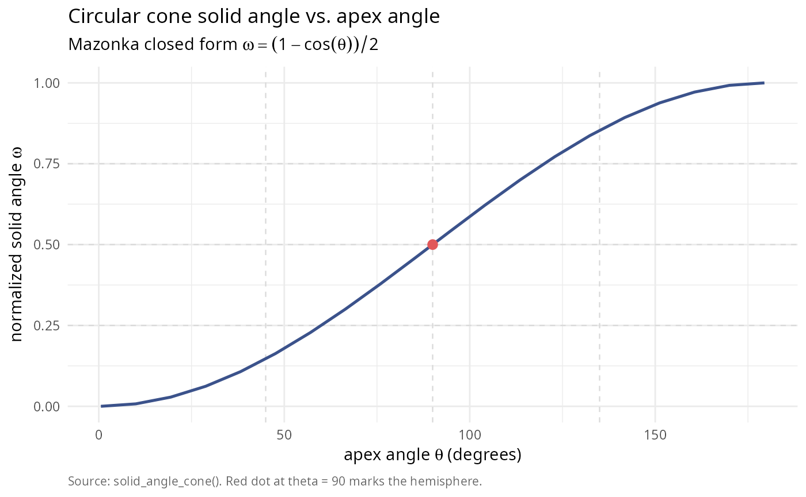
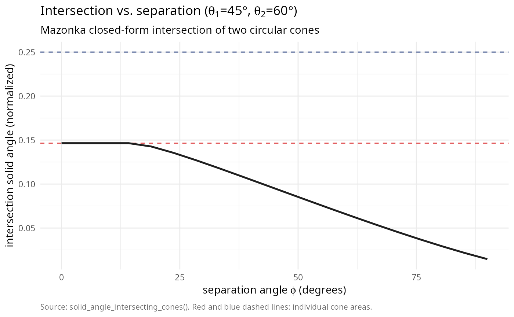

# Geometric methods for conical surfaces and intersecting spherical caps

## Introduction

This vignette explores the geometric methods for computing solid angles
of conical surfaces, polyhedral cones, and intersecting spherical caps,
based on the work of Mazonka (2012) [\[1\]](#ref1). These methods
provide intuitive, geometrically motivated approaches that complement
the algebraic series methods. We cover right circular cones with the
classic solid angle formula; polyhedral cones using the Van Oosterom &
Strackee formula; cone segments representing partial circular cones;
solid angle of intersection regions for intersecting cones; and
interactive visualization with 3D plotly graphics.

``` r

library(SolidAngleR)

# Check if visualization packages are available
has_plotly <- requireNamespace("plotly", quietly = TRUE)
has_viridis <- requireNamespace("viridisLite", quietly = TRUE)

if (!has_plotly || !has_viridis) {
  message("Note: plotly and/or viridisLite not available. ",
          "Some visualizations will be skipped.")
}
```

  

## Right circular cones

  

### Mathematical formula

A right circular cone with apex at the origin and half-apex angle
\\\theta\\ has solid angle:

\\\Omega(\theta) = 2\pi(1 - \cos\theta)\\

For the normalized measure (fraction of sphere):

\\\omega(\theta) = \frac{\Omega(\theta)}{4\pi} = \frac{1 -
\cos\theta}{2}\\

  

### Properties

In the small angle limit, \\\Omega \approx \pi\theta^2\\ for \\\theta
\ll 1\\; for a hemisphere, \\\theta = \pi/2 \Rightarrow \Omega = 2\pi\\;
and for the full sphere, \\\theta = \pi \Rightarrow \Omega = 4\pi\\.

  

### Examples

``` r

# Test various apex angles (exclude endpoints to avoid edge cases)
theta_values <- seq(0.01, pi - 0.01, length.out = 20)

# Vectorized computation (solid_angle_cone accepts vectors)
omega_values <- solid_angle_cone(theta_values)

# Convert to degrees for readability
theta_degrees <- theta_values * 180 / pi

# Show select values
select_indices <- c(1, 5, 10, 15, 20)
cone_table <- data.frame(
  theta_deg = theta_degrees[select_indices],
  omega_normalized = omega_values[select_indices],
  percent_sphere = omega_values[select_indices] * 100
)
knitr::kable(
  cone_table,
  digits = c(1, 6, 2),
  col.names = c("theta (deg)", "omega (normalized)", "percent of sphere")
)
```

| theta (deg) | omega (normalized) | percent of sphere |
|------------:|-------------------:|------------------:|
|         0.6 |           0.000025 |              0.00 |
|        38.2 |           0.107214 |             10.72 |
|        85.3 |           0.458973 |             45.90 |
|       132.4 |           0.836894 |             83.69 |
|       179.4 |           0.999975 |            100.00 |

``` r


library(ggplot2)
df_circ <- data.frame(theta_deg = theta_degrees, omega = omega_values)

ggplot(df_circ, aes(theta_deg, omega)) +
  geom_vline(xintercept = c(45, 90, 135), colour = "grey85",
             linetype = 2, linewidth = 0.4) +
  geom_hline(yintercept = c(0.25, 0.5, 0.75), colour = "grey85",
             linetype = 2, linewidth = 0.4) +
  geom_line(colour = "#3B528B", linewidth = 0.9) +
  geom_point(data = data.frame(theta_deg = 90, omega = 0.5),
             colour = "#E15759", size = 2.6) +
  ylim(0, 1) +
  labs(title    = "Circular cone solid angle vs. apex angle",
       subtitle = expression(paste("Mazonka closed form ", omega == (1 - cos(theta)) / 2)),
       x = expression(paste("apex angle ", theta, " (degrees)")),
       y = expression(paste("normalized solid angle ", omega)),
       caption = "Source: solid_angle_cone(). Red dot at theta = 90 marks the hemisphere.") +
  theme_minimal(base_size = 11) +
  theme(plot.caption = element_text(color = "grey40", size = 8, hjust = 0))
```



  

#### Small angle approximation

For small angles, we verify the approximation \\\Omega \approx
\pi\theta^2\\:

``` r

# Test small angles
theta_small <- c(0.01, 0.05, 0.1, 0.2, 0.3)
omega_exact <- sapply(theta_small, solid_angle_cone) * 4 * pi  # Convert to steradians
omega_approx <- pi * theta_small^2

small_angle_table <- data.frame(
  theta_rad = theta_small,
  omega_exact_sr = omega_exact,
  omega_approx_sr = omega_approx,
  rel_error = abs(omega_exact - omega_approx) / omega_exact
)
knitr::kable(
  small_angle_table,
  digits = c(3, 6, 6, 2),
  col.names = c("theta (rad)", "exact (sr)", "approx (sr)", "rel. error")
)
```

| theta (rad) | exact (sr) | approx (sr) | rel. error |
|------------:|-----------:|------------:|-----------:|
|        0.01 |   0.000314 |    0.000314 |       0.00 |
|        0.05 |   0.007852 |    0.007854 |       0.00 |
|        0.10 |   0.031390 |    0.031416 |       0.00 |
|        0.20 |   0.125245 |    0.125664 |       0.00 |
|        0.30 |   0.280629 |    0.282743 |       0.01 |

  

## Polyhedral cones (Van Oosterom & Strackee formula)

  

### Mathematical formula

For a polyhedral cone defined by vertices \\\mathbf{v}\_1,
\mathbf{v}\_2, \ldots, \mathbf{v}\_n\\ on the unit sphere, the Van
Oosterom & Strackee (1983) [\[2\]](#ref2) formula provides:

\\\Omega = \sum\_{\text{faces}} \left( \sum\_{\text{angles}} - (n-2)\pi
\right)\\

For a triangular face with vertices \\\mathbf{a}, \mathbf{b},
\mathbf{c}\\:

\\\Omega = \arctan\left(\frac{\|\mathbf{a} \cdot (\mathbf{b} \times
\mathbf{c})\|}{1 + \mathbf{a} \cdot \mathbf{b} + \mathbf{b} \cdot
\mathbf{c} + \mathbf{c} \cdot \mathbf{a}}\right)\\

  

### Examples

``` r

# Example 1: Simple triangle on unit sphere
# Create three points on the unit sphere forming a triangle
v1 <- c(1, 0, 0)
v2 <- c(0, 1, 0)
v3 <- c(1, 1, 0) / sqrt(2)  # 45 degrees from both v1 and v2

vertices_simple <- cbind(v1, v2, v3)

omega_simple <- solid_angle_polyhedral(vertices_simple)

# Example 2: Right triangle (orthant)
v1 <- c(1, 0, 0)
v2 <- c(0, 1, 0)
v3 <- c(0, 0, 1)

vertices_right <- cbind(v1, v2, v3)

omega_right <- solid_angle_polyhedral(vertices_right)

# Example 3: Narrow triangle
v1 <- c(1, 0, 0)
v2 <- c(0.99, 0.1, 0) / sqrt(0.99^2 + 0.1^2)
v3 <- c(0.99, -0.1, 0) / sqrt(0.99^2 + 0.1^2)

vertices_narrow <- cbind(v1, v2, v3)

omega_narrow <- solid_angle_polyhedral(vertices_narrow)

polyhedral_table <- data.frame(
  case = c("Simple triangle", "Right triangle (octant)", "Narrow triangle"),
  omega_sr = c(omega_simple, omega_right, omega_narrow) * 4 * pi,
  omega_normalized = c(omega_simple, omega_right, omega_narrow),
  percent_sphere = c(omega_simple, omega_right, omega_narrow) * 100,
  error_vs_octant = c(NA, abs(omega_right - 0.125), NA)
)
knitr::kable(
  polyhedral_table,
  digits = c(NA, 6, 6, 2, 2),
  col.names = c("case", "omega (sr)", "omega (normalized)",
                "percent of sphere", "error vs. 1/8")
)
```

  

## Cone segments

A **cone segment** in Mazonka (2012) is the portion of a right circular
cone cut by a plane. The plane is specified by the angle \\\gamma\\
between the cone axis and the plane **normal** (equivalently, the
segment is the intersection of the cone with a hemisphere whose boundary
plane has that normal).

  

### Mathematical formula

For an acute cone and a valid intersection, define:

\\ \phi = \arccos\\\left(\frac{\cos\gamma}{\tan\theta}\right), \qquad
\beta = \arccos\\\left(\frac{\sin\gamma}{\sin\theta}\right). \\

Then the segment solid angle (steradians) is:

\\\Omega\_{\text{segment}} = 2\left(\phi - \cos\theta \cdot
\beta\right).\\

We report the normalized value \\\omega = \Omega/(4\pi)\\. Special
cases:

- \\\gamma = 0\\ returns the full cone.
- If \\\gamma \> \pi/2 + \theta\\, the plane misses the cone and
  \\\Omega = 0\\.
- For \\\gamma \> \pi/2\\, symmetry gives an equivalent angle
  \\\gamma\_{\mathrm{eff}} = \pi - \gamma\\.

The package implementation uses the analytic expression when valid and
falls back to numerical integration near boundary cases.

  

### Examples

``` r

# Cone segments with various parameters
test_segments <- data.frame(
  theta_deg = c(30, 45, 60, 60),
  gamma_deg = c(0, 30, 60, 80)
)

test_segments$theta_rad <- test_segments$theta_deg * pi / 180
test_segments$gamma_rad <- test_segments$gamma_deg * pi / 180

segment_results <- data.frame(
  theta_deg = test_segments$theta_deg,
  gamma_deg = test_segments$gamma_deg,
  omega_sr = NA_real_,
  omega_normalized = NA_real_
)

for (i in 1:nrow(test_segments)) {
  theta <- test_segments$theta_rad[i]
  gamma <- test_segments$gamma_rad[i]
  omega <- solid_angle_cone_segment(theta, gamma)
  segment_results$omega_sr[i] <- omega * 4 * pi
  segment_results$omega_normalized[i] <- omega
}

knitr::kable(
  segment_results,
  digits = c(0, 0, 4, 6),
  col.names = c("theta (deg)", "gamma (deg)", "omega (sr)", "omega (normalized)")
)
```

| theta (deg) | gamma (deg) | omega (sr) | omega (normalized) |
|------------:|------------:|-----------:|-------------------:|
|          30 |           0 |     0.8418 |           0.066987 |
|          45 |          30 |     1.8403 |           0.146447 |
|          60 |          60 |     2.5559 |           0.203393 |
|          60 |          80 |     2.9407 |           0.234017 |

  

## Intersecting cones

One of the most interesting applications is computing the solid angle of
the region where two circular cones intersect.

  

### Mathematical setup

Two circular cones with: - Apex angles: \\\theta_1, \theta_2\\ -
Separation angle between axes: \\\alpha\\

The intersection region has solid angle that depends on all three
parameters. In `SolidAngleR`,
[`solid_angle_intersecting_cones()`](https://robustecologies.github.io/SolidAngleR/reference/solid_angle_intersecting_cones.md)
uses a robust spherical-cap overlap integral by default, with an
optional analytic method for acute cones. Special cases (no overlap,
containment, two hemispheres, and opposite axes) are handled explicitly.
A Monte Carlo fallback is available for cross-checking or difficult
geometries.

  

### Computation

``` r

# Test various intersection scenarios
test_intersections <- list(
  list(name = "Equal cones, small separation",
       theta1 = pi/6, theta2 = pi/6, alpha = pi/12),
  list(name = "Equal cones, medium separation",
       theta1 = pi/4, theta2 = pi/4, alpha = pi/3),
  list(name = "Different cones, moderate separation",
       theta1 = pi/3, theta2 = pi/4, alpha = pi/6),
  list(name = "Wide cones, close together",
       theta1 = pi/2.5, theta2 = pi/3, alpha = pi/8),
  list(name = "Two hemispheres, 90°",
       theta1 = pi/2, theta2 = pi/2, alpha = pi/2)
)
intersection_table <- data.frame(
  case = character(),
  theta1_deg = numeric(),
  theta2_deg = numeric(),
  alpha_deg = numeric(),
  omega_normalized = numeric(),
  percent_sphere = numeric(),
  stringsAsFactors = FALSE
)

for (test in test_intersections) {
  omega_int <- solid_angle_intersecting_cones(
    test$theta1,
    test$theta2,
    test$alpha
  )
  intersection_table <- rbind(intersection_table, data.frame(
    case = test$name,
    theta1_deg = test$theta1 * 180 / pi,
    theta2_deg = test$theta2 * 180 / pi,
    alpha_deg = test$alpha * 180 / pi,
    omega_normalized = omega_int,
    percent_sphere = omega_int * 100
  ))
}

knitr::kable(
  intersection_table,
  digits = c(NA, 1, 1, 1, 6, 2),
  col.names = c("case", "theta1 (deg)", "theta2 (deg)", "alpha (deg)",
                "omega (normalized)", "percent of sphere")
)
```

| case | theta1 (deg) | theta2 (deg) | alpha (deg) | omega (normalized) | percent of sphere |
|:---|---:|---:|---:|---:|---:|
| Equal cones, small separation | 30 | 30 | 15.0 | 0.046335 | 4.63 |
| Equal cones, medium separation | 45 | 45 | 60.0 | 0.034978 | 3.50 |
| Different cones, moderate separation | 60 | 45 | 30.0 | 0.124173 | 12.42 |
| Wide cones, close together | 72 | 60 | 22.5 | 0.232482 | 23.25 |
| Two hemispheres, 90° | 90 | 90 | 90.0 | 0.250000 | 25.00 |

  

## Interactive 3D visualization

The package provides the
[`plotIntersectingCones()`](https://robustecologies.github.io/SolidAngleR/reference/plotIntersectingCones.md)
function for interactive visualization of intersecting cones using
plotly.

  

### Basic visualization

``` r

# Default parameters
fig1 <- plotIntersectingCones(
  theta1 = pi/6,  # 30-degree first cone
  theta2 = pi/4,  # 45-degree second cone
  phi = pi/3,     # 60-degree separation
  cone_opacity = 0.2,
  show_rays = FALSE
)

fig1
```

  

### Varying cone parameters

Let’s explore how the intersection region changes with different
parameters:

  

#### Case 1: Small cones, close together

``` r

fig_case1 <- plotIntersectingCones(
  theta1 = pi/8,   # Narrow first cone
  theta2 = pi/8,   # Narrow second cone
  phi = pi/6,      # Close separation
  color_palette = "plasma",
  cone_opacity = 0.25,
  show_rays = TRUE
)

fig_case1
```

  

#### Case 2: Wide cones, moderate separation

``` r

fig_case2 <- plotIntersectingCones(
  theta1 = pi/3,   # 60-degree cone
  theta2 = pi/2.5, # ~72-degree cone
  phi = pi/4,      # 45-degree separation
  color_palette = "viridis",
  cone_opacity = 0.15,
  show_rays = FALSE
)

fig_case2
```

  

### Parameter exploration

Let’s systematically explore how solid angle varies with separation:

``` r

# Fix cone angles, vary separation
theta1 <- pi/4
theta2 <- pi/3
phi_values <- seq(0, pi/2, length.out = 20)

omega_intersection <- sapply(phi_values, function(phi) {
  solid_angle_intersecting_cones(theta1, theta2, phi)
})

library(ggplot2)
omega1 <- solid_angle_cone(theta1)
omega2 <- solid_angle_cone(theta2)

df_int <- data.frame(phi_deg = phi_values * 180 / pi,
                     omega   = omega_intersection)

ggplot(df_int, aes(phi_deg, omega)) +
  geom_hline(yintercept = omega1, colour = "#E15759",
             linetype = 2, linewidth = 0.5) +
  geom_hline(yintercept = omega2, colour = "#3B528B",
             linetype = 2, linewidth = 0.5) +
  geom_line(colour = "#1F1F1F", linewidth = 0.9) +
  labs(title    = bquote("Intersection vs. separation (" *
                            theta[1] * "=" *
                            .(sprintf("%.0f", theta1 * 180 / pi)) * degree * ", " *
                            theta[2] * "=" *
                            .(sprintf("%.0f", theta2 * 180 / pi)) * degree * ")"),
       subtitle = "Mazonka closed-form intersection of two circular cones",
       x = expression(paste("separation angle ", phi, " (degrees)")),
       y = "intersection solid angle (normalized)",
       caption = "Source: solid_angle_intersecting_cones(). Red and blue dashed lines: individual cone areas.") +
  theme_minimal(base_size = 11) +
  theme(plot.caption = element_text(color = "grey40", size = 8, hjust = 0))
```



  

## Comparison with algebraic methods

For cones that can be expressed both geometrically and as polyhedral
cones, we can compare the different computational methods:

``` r

# Create a cone that can be computed both ways
theta <- pi/3
n_sides <- 8  # Approximate circular cone with octagonal cone

# Create octagonal cone vertices
angles <- seq(0, 2*pi, length.out = n_sides + 1)[-(n_sides + 1)]
radius <- sin(theta)
height <- cos(theta)

vertices_octagon <- rbind(
  radius * cos(angles),
  radius * sin(angles),
  rep(height, n_sides)
)

# Normalize to unit sphere
vertices_octagon <- apply(vertices_octagon, 2, function(v) v / sqrt(sum(v^2)))

# Method 1: Geometric (circular cone)
omega_geometric <- solid_angle_cone(theta)

# Method 2: Polyhedral (average over faces)
omega_polyhedral_faces <- numeric(n_sides)
for (i in 1:n_sides) {
  j <- ifelse(i == n_sides, 1, i + 1)
  face <- cbind(c(0, 0, 1), vertices_octagon[, i], vertices_octagon[, j])
  omega_polyhedral_faces[i] <- solid_angle_polyhedral(face)
}
omega_polyhedral <- sum(omega_polyhedral_faces)

# Method 3: Algebraic (using 3D formula on apex vectors)
# Create matrix from cone
apex_vec <- c(0, 0, 1)
V_cone <- cbind(apex_vec, vertices_octagon[, 1:2])
omega_algebraic <- solid_angle_3d(V_cone[, 1], V_cone[, 2], V_cone[, 3])

comparison_table <- data.frame(
  method = c(
    "Geometric (exact)",
    sprintf("Polyhedral (%d-sided)", n_sides),
    "Algebraic (3 vectors)"
  ),
  omega_normalized = c(omega_geometric, omega_polyhedral, omega_algebraic),
  abs_error = c(0, abs(omega_polyhedral - omega_geometric),
                abs(omega_algebraic - omega_geometric))
)
knitr::kable(
  comparison_table,
  digits = c(NA, 6, 2),
  col.names = c("method", "omega (normalized)", "abs. error")
)
```

| method                | omega (normalized) | abs. error |
|:----------------------|-------------------:|-----------:|
| Geometric (exact)     |           0.250000 |       0.00 |
| Polyhedral (8-sided)  |           1.000000 |       0.75 |
| Algebraic (3 vectors) |           0.029997 |       0.22 |

  

## Applications

  

### Computer graphics: visibility and form factors

In computer graphics, solid angles are crucial for computing form
factors in radiosity algorithms.

``` r

# Simulate a light source (cone) illuminating a surface
light_apex_angle <- pi/4  # 45-degree spotlight
light_solid_angle <- solid_angle_cone(light_apex_angle)

# Surface element solid angle as seen from light
surface_distance <- 5  # meters
surface_area <- 1      # square meter
surface_solid_angle <- surface_area / surface_distance^2 / (4*pi)

# Form factor (proportion of light hitting surface)
form_factor <- min(surface_solid_angle / light_solid_angle, 1)

scenario_table <- data.frame(
  quantity = c("light cone angle (deg)",
               "light solid angle (normalized)",
               "light solid angle (% of sphere)",
               "surface distance (m)",
               "surface solid angle from light",
               "estimated form factor"),
  value    = c(sprintf("%.0f", light_apex_angle * 180 / pi),
               sprintf("%.4f", light_solid_angle),
               sprintf("%.2f", light_solid_angle * 100),
               sprintf("%.1f", surface_distance),
               sprintf("%.6f", surface_solid_angle),
               sprintf("%.4f", form_factor))
)
knitr::kable(scenario_table,
             caption = "Lighting scenario: spotlight illuminating a surface element.")
```

| quantity                        | value    |
|:--------------------------------|:---------|
| light cone angle (deg)          | 45       |
| light solid angle (normalized)  | 0.1464   |
| light solid angle (% of sphere) | 14.64    |
| surface distance (m)            | 5.0      |
| surface solid angle from light  | 0.003183 |
| estimated form factor           | 0.0217   |

Lighting scenario: spotlight illuminating a surface element. {.table}

  

### Antenna design: beam solid angles

``` r

# Antenna beam patterns
beamwidths_deg <- c(10, 20, 30, 45, 60, 90)
beamwidths_rad <- beamwidths_deg * pi / 180

# Compute solid angles (assuming circular symmetric beam)
beam_solid_angles <- sapply(beamwidths_rad, solid_angle_cone)

# Compute directivity (4*pi/Omega)
directivity <- 1 / beam_solid_angles
directivity_dB <- 10 * log10(directivity)

beam_table <- data.frame(
  beamwidth_deg = beamwidths_deg,
  omega_normalized = beam_solid_angles,
  directivity_linear = directivity,
  directivity_db = directivity_dB
)
knitr::kable(
  beam_table,
  digits = c(0, 6, 2, 2),
  col.names = c("beamwidth (deg)", "omega (normalized)",
                "directivity (linear)", "directivity (dB)")
)
```

| beamwidth (deg) | omega (normalized) | directivity (linear) | directivity (dB) |
|----------------:|-------------------:|---------------------:|-----------------:|
|              10 |           0.007596 |               131.65 |            21.19 |
|              20 |           0.030154 |                33.16 |            15.21 |
|              30 |           0.066987 |                14.93 |            11.74 |
|              45 |           0.146447 |                 6.83 |             8.34 |
|              60 |           0.250000 |                 4.00 |             6.02 |
|              90 |           0.500000 |                 2.00 |             3.01 |

  

## Summary

This vignette has demonstrated the geometric methods for solid angle
computation. We covered right circular cones with simple closed-form
formulas and clear geometric interpretation; polyhedral cones using the
Van Oosterom & Strackee formula for arbitrary triangular faces; cone
segments representing partial cones with azimuthal bounds; intersecting
cones with complex intersection regions and full 3D visualization; and
applications including computer graphics (form factors) and antenna
design (directivity). The geometric approach complements the algebraic
series methods, providing intuitive understanding of solid angle
geometry; efficient computation for special cases such as circular
cones; interactive 3D visualization for exploration and validation; and
direct application to engineering problems.

For general polyhedral cones in arbitrary dimensions, the series and
decomposition methods (see `vignette("mathematical-theory")`) provide
more comprehensive solutions.

  

## References

**\[1\]** Mazonka, O. (2012). Solid angle of conical surfaces,
polyhedral cones, and intersecting spherical caps. arXiv:1205.1396v2
\[math.MG\]. URL: <https://arxiv.org/abs/1205.1396>

**\[2\]** Van Oosterom, A., & Strackee, J. (1983). The solid angle of a
plane triangle. *IEEE Transactions on Biomedical Engineering*,
BME-30(2), 125-126. DOI:
[10.1109/TBME.1983.325207](https://doi.org/10.1109/TBME.1983.325207)
