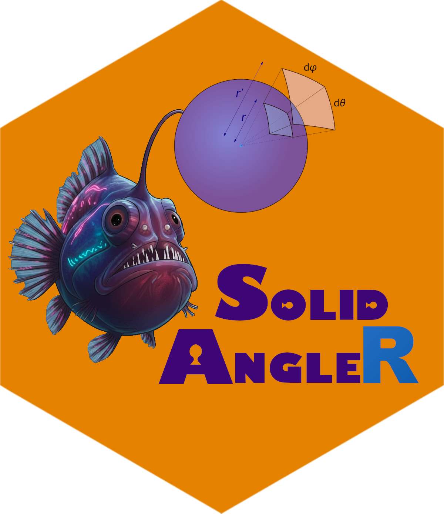

# SolidAngleR [](https://robustecologies.github.io/SolidAngleR)

## Computing normalized solid angles of polyhedral cones in arbitrary dimensions

[](https://github.com/palmaraz/SolidAngleR/actions)
[](https://www.r-project.org/)

[](https://cran.r-project.org/package=Rcpp)
[](https://cran.r-project.org/package=RcppArmadillo)

[](https://www.gnu.org/licenses/gpl-3.0)

**SolidAngleR** provides comprehensive methods for computing normalized
solid angles of polyhedral cones in arbitrary dimensions, including
closed formulas for low dimensions, hypergeometric series, tridiagonal
series, decomposition methods, multivariate normal integration and
spanning tree methods for extreme ray computation. Implements advanced
Monte Carlo (MC) approaches using rejection sampling for random point
assignments to complex cone intersections, and Rcpp-based novel O(n) MC
algorithms for generating uniform random vectors using the
Box-Muller/Marsaglia method for complete n-dimensional spheres coverage,
and the incomplete beta function plus Givens rotation for full coverage
within spherical caps.

## Key features

The package provides two main capabilities. For solid angle computation,
it offers multiple computational methods including closed formulas,
hypergeometric series, decomposition, multivariate normal integration,
and Monte Carlo approaches; it works from 2D to high-dimensional spaces;
and it automatically selects the appropriate algorithm based on cone
properties.

For uniform sphere and cone sampling, the package implements an O(n)
cone sampling algorithm that generates uniform random vectors directly
within n-dimensional cones, eliminating the exponential cost of naive
rejection sampling. It uses the Box-Muller/Marsaglia method for complete
sphere coverage and supports hollow cones (annular regions between two
angles). Arbitrary cone orientations are handled via efficient O(n)
Givens rotations, and built-in uniformity tests (Kolmogorov-Smirnov and
chi-squared) provide statistical validation.

See the accompanying `Vignettes` for a comprehensive overview of the
mathematical theory of solid angles, uniform sampling on spheres, and
extensive testing and applications of the functions in the package.

## Installation

``` r

# Check if devtools is already installed. If not, install it.
if (!requireNamespace("devtools", quietly = TRUE)) {
  install.packages("devtools")
}

# Install from GitHub (development version)
devtools::install_github("robustecologies/SolidAngleR")

# Or install locally
devtools::install()

# Or install from CRAN
install.packages("SolidAngleR")
```

### Build from package directory

``` bash
cd /path/to/SolidAngleR
R CMD build .
R CMD INSTALL SolidAngleR_0.6.0.tar.gz
```

## Mathematical background

### Normalized solid angle

The normalized solid angle measure \\\tilde{\Omega}\_n(C)\\ of a
polyhedral cone \\C \subseteq \mathbb{R}^n\\ quantifies the proportion
of \\n\\-dimensional space occupied by the cone. Formally:

\\\tilde{\Omega}\_n(C) = \frac{\text{vol}\_{n-1}(C \cap
S^{n-1})}{\text{vol}\_{n-1}(S^{n-1})}\\

where \\S^{n-1}\\ is the unit sphere in \\\mathbb{R}^n\\.

In 2D (\\n=2\\), \\\tilde{\Omega}\_2 = \frac{\theta}{2\pi}\\, where
\\\theta\\ is the planar angle in radians. In 3D (\\n=3\\),
\\\tilde{\Omega}\_3 = \frac{\Omega}{4\pi}\\, where \\\Omega\\ is the
standard solid angle in steradians. In n-D, \\\tilde{\Omega}\_n\\
represents the fraction of the unit hypersphere surface covered by the
cone.

### Key properties

The normalized solid angle has several fundamental properties. Its range
is \\\tilde{\Omega}\_n(C) \in \[0, 1\]\\; for an orthant (axes-aligned
cone), \\\tilde{\Omega}\_n(\mathbb{R}^n\_{\geq 0}) = \frac{1}{2^n}\\;
for full space, \\\tilde{\Omega}\_n(\mathbb{R}^n) = 1\\; and for an
empty cone, \\\tilde{\Omega}\_n(\emptyset) = 0\\.

## Quick start

### Solid angle computation

``` r

library(SolidAngleR)

# Example 1: 3D orthogonal cone (octant)
V <- diag(3)
omega <- compute_solid_angle(V)
print(omega)  # 0.125 (1/8 of space)
#> [1] 0.125

# Example 2: 2D cone
v1 <- c(1, 0)
v2 <- c(1, 1) / sqrt(2)
V <- cbind(v1, v2)
omega <- compute_solid_angle(V)
print(omega)  # 0.125 (45° / 360°)
#> [1] 0.125

# Example 3: Diagnose cone properties
diag <- diagnose_cone(V)
print(diag)
#> Cone diagnostic report
#> ======================
#> 
#> Dimension:                2 
#> Linearly independent:     ✓ Yes 
#> Associated matrix PD:     ✓ Yes 
#> Tridiagonal structure:    ✓ Yes 
#> 
#> Eigenvalues:              1.707107, 0.292893 
#> Minimum eigenvalue:       0.292893 
#> 
#> Suggested method:         formula (closed form available) ✓

# Example 4: Visualize general 3D cone
# (Interactive plotly visualization)
# fig <- plot_cone_3d(V, color = "orange")
# fig
```

### Uniform cone sampling optimized with C++

``` r

# Example 1: Generate uniform samples on 3D spherical cap
# Now uses fast C++ implementation for massive sampling
mu_hat <- c(0, 0, 1)  # Cone axis (z-axis)
theta0 <- pi/4  # 45-degree half-angle
n_samples <- 1000

samples <- generate_cone_samples(n_samples, mu_hat, theta0)
sample_info <- data.frame(
  n_samples = n_samples,
  dimension = paste(nrow(samples), "x", ncol(samples))
)
knitr::kable(sample_info)
```

| n_samples | dimension |
|----------:|:----------|
|      1000 | 3 x 1000  |

``` r


# Example 2: Verify uniformity
set.seed(42)
samples_test <- generate_cone_samples(10000, c(0, 0, 1), pi/3)
results <- verify_cone_uniformity(samples_test, c(0, 0, 1), pi/3)
uniformity_table <- data.frame(
  test = c("KS p-value", "Chi-squared p-value"),
  value = c(results$ks_pvalue, results$chi_pvalue)
)
knitr::kable(uniformity_table, digits = c(NA, 4))
```

| test                |  value |
|:--------------------|-------:|
| KS p-value          | 0.4511 |
| Chi-squared p-value | 0.1082 |

``` r


# Example 3: High-dimensional cone (100D with 10-degree half-angle)
mu_hat_100d <- c(rep(0, 99), 1)
sample_100d <- generate_cone_sample(mu_hat_100d, pi/18, method = "rejection")
norm_table <- data.frame(
  quantity = "100D sample norm",
  value = sqrt(sum(sample_100d^2))
)
knitr::kable(norm_table, digits = c(NA, 10))
```

| quantity         | value |
|:-----------------|------:|
| 100D sample norm |     1 |

``` r


# Example 4: Hollow cone (annular region)
sample_hollow <- generate_hollow_cone_sample(c(1, 0, 0), pi/6, pi/3)
angle <- acos(sample_hollow[1])
hollow_table <- data.frame(
  angle_deg = angle * 180 / pi
)
knitr::kable(hollow_table, digits = 2)
```

| angle_deg |
|----------:|
|     56.03 |

## Available methods

### 1. Unified interface

The
[`compute_solid_angle()`](https://robustecologies.github.io/SolidAngleR/reference/compute_solid_angle.md)
function automatically selects the best method:

``` r

V <- diag(4)
omega <- compute_solid_angle(V, method = "auto")
#> ✓ Using tridiagonal series method
```

**Available methods:** - `"auto"` - Automatic selection (recommended) -
`"formula"` - Closed formulas (2D/3D only) - `"series"` - Hypergeometric
series (requires positive definite) - `"tridiagonal"` - Optimized for
tridiagonal cones - `"decomposition"` - Universal method (any cone)

### 2. Specialized functions

#### 2D cones

``` r

# Direct angle computation
v1 <- c(1, 0)
v2 <- c(0.8, 0.6)
omega <- solid_angle_2d(v1, v2)
omega
#> [1] 0.1024164
```

#### 3D cones

``` r

# Euler-Lagrange formula
v1 <- c(1, 0, 0)
v2 <- c(0, 1, 0)
v3 <- c(0, 0, 1)
omega <- solid_angle_3d(v1, v2, v3)
omega
#> [1] 0.125
```

#### Geometric shapes

``` r

# Circular cone
theta <- pi/3  # Apex half-angle
omega <- solid_angle_cone(theta)

# Intersecting cones
theta1 <- pi/3
theta2 <- pi/4
alpha <- pi/6  # Separation angle
omega <- solid_angle_intersecting_cones(theta1, theta2, alpha)
omega
#> [1] 0.1241727
```

#### Monte Carlo estimation

For complex geometric regions or when analytical formulas are
unavailable, Monte Carlo integration provides a powerful alternative
with quantified uncertainty:

``` r

#### Define a complex region: intersection of two cones                  ####
complex_region_test <- function(point) {
  #### First cone: axis along z, 60\u00B0 opening                           ####
  cone1 <- point[3] >= cos(pi/3)

  #### Second cone: tilted axis, 45\u00B0 opening                            ####
  axis2 <- c(1, 1, 1) / sqrt(3)  # Tilted axis
  angle_from_axis <- acos(sum(point * axis2))
  cone2 <- angle_from_axis <= pi/4

  #### Intersection of both cones                                         ####
  return(cone1 && cone2)
}

#### Monte Carlo estimation with uncertainty quantification              ####
result <- solid_angle_monte_carlo(complex_region_test, n_samples = 200000, seed = 42)

mc_table <- data.frame(
  estimate_sr = result$estimate,
  std_error_sr = result$std_error,
  ci_lower = result$estimate - 1.96 * result$std_error,
  ci_upper = result$estimate + 1.96 * result$std_error,
  omega_normalized = result$estimate / (4 * pi),
  percent_sphere = 100 * result$fraction_inside
)
knitr::kable(
  mc_table,
  digits = c(6, 6, 6, 6, 4, 2),
  col.names = c("estimate (sr)", "SE (sr)", "CI lower", "CI upper",
                "omega (normalized)", "percent of sphere")
)
```

| estimate (sr) | SE (sr) | CI lower | CI upper | omega (normalized) | percent of sphere |
|--------------:|--------:|---------:|---------:|-------------------:|------------------:|
|      0.964595 | 0.00748 | 0.949933 | 0.979256 |             0.0768 |              7.68 |

Monte Carlo integration works for arbitrary complex regions without
requiring analytical formulas, achieves dimension-independent
convergence at rate \\O(N^{-1/2})\\, provides quantified uncertainty
through standard error estimation, scales efficiently via embarrassingly
parallel computation for massive sample sizes, and serves as an ideal
validation tool for analytical methods.

## Common workflows

### Workflow 1: Ecological feasibility domain

``` r

library(SolidAngleR)

# Community interaction matrix (4 species)
S <- 4
alpha <- matrix(runif(S * S, -1, 0), S, S)
diag(alpha) <- -1

# Compute feasibility domain size via the multivariate-normal branch
omega_raw    <- compute_solid_angle(alpha, method = "mvn", normalize = FALSE)
omega_scaled <- omega_raw^(1 / S)
feas_table   <- data.frame(omega = omega_raw, omega_scaled = omega_scaled)
knitr::kable(feas_table, digits = 6)
```

|    omega | omega_scaled |
|---------:|-------------:|
| 0.001536 |     0.197963 |

**Interpretation:** `omega` represents the fraction of parameter space
where all species can coexist with positive abundances;
`omega_scaled = omega^(1 / S)` is the per-species geometric mean used to
compare communities of different sizes.

### Workflow 2: Computational geometry

``` r

# Define polyhedral cone by generator matrix
V <- matrix(c(
  1, 0.8, 0.2,
  0, 0.6, 0.3,
  0, 0, 0.9
), nrow = 3)

# Analyze cone properties
diagnosis <- diagnose_cone(V)
print(diagnosis)
#> Cone diagnostic report
#> ======================
#> 
#> Dimension:                3 
#> Linearly independent:     ✓ Yes 
#> Associated matrix PD:     ✓ Yes 
#> Tridiagonal structure:    ○ No 
#> 
#> Eigenvalues:              1.697606, 1.145699, 0.156694 
#> Minimum eigenvalue:       0.156694 
#> 
#> Suggested method:         formula (closed form available) ✓

# Compute solid angle
omega <- compute_solid_angle(V, method = "auto")
geom_table <- data.frame(omega_normalized = omega)
knitr::kable(geom_table, digits = 6)
```

| omega_normalized |
|-----------------:|
|         0.047913 |

### Workflow 3: Method comparison

``` r

V <- diag(4)

# Compare different computational approaches
methods <- c("series", "decomposition", "mvn")
results <- sapply(methods, function(m) {
  compute_solid_angle(V, method = m)
})
#> ○ Decomposed into 1 cones
method_table <- data.frame(
  method = methods,
  omega  = as.numeric(results)
)
knitr::kable(method_table, digits = 6)
```

| method        |  omega |
|:--------------|-------:|
| series        | 0.0625 |
| decomposition | 0.0625 |
| mvn           | 0.0625 |

``` r

# All should be approximately 0.0625 (1/16)
```

## Performance tips

For optimal performance, consider dimension and cone structure when
selecting methods. For low dimensions (\\n \le 3\\), use
`method = "formula"` as the fastest option; for positive definite cones,
use `method = "series"` for efficient computation; for tridiagonal
structure, use `method = "tridiagonal"` with optimized algorithms; for
any cone type, use `method = "decomposition"` as a universal approach;
for quick estimates, use
[`solid_angle_monte_carlo()`](https://robustecologies.github.io/SolidAngleR/reference/solid_angle_monte_carlo.md)
for approximate results; and for ecological feasibility-domain
applications, use `method = "mvn"` for the Genz-Bretz quasi-Monte Carlo
orthant integral.

## Method selection guide

| Cone property | Dimension | Recommended method | Function |
|----|----|----|----|
| Any | 2 | Closed formula | [`solid_angle_2d()`](https://robustecologies.github.io/SolidAngleR/reference/solid_angle_2d.md) |
| Any | 3 | Euler-Lagrange | [`solid_angle_3d()`](https://robustecologies.github.io/SolidAngleR/reference/solid_angle_3d.md) |
| Positive definite | Any | Hypergeometric series | `method = "series"` |
| Tridiagonal V’V | Any | Tridiagonal series | `method = "tridiagonal"` |
| Any | Any | Decomposition | `method = "decomposition"` |
| Positive definite | n \<= 20 | Multivariate normal QMC | `method = "mvn"` |
| Complex geometry | 3 | Monte Carlo | [`solid_angle_monte_carlo()`](https://robustecologies.github.io/SolidAngleR/reference/solid_angle_monte_carlo.md) |

## Examples

### Example 1: Simple octant

``` r

# One octant of 3D space
V <- diag(3)
omega <- compute_solid_angle(V)
# Result: 0.125 (exactly 1/8)
```

### Example 2: Tridiagonal cone

``` r

# Create cone with specified angles (radians) that yield a PD tridiagonal Gram matrix
angles <- c(1.5, 1.5, 1.5)
V <- create_tridiagonal_cone(angles)
omega <- compute_solid_angle(V, method = "tridiagonal")
```

### Example 3: Circular cone

``` r

# 60-degree cone (half-angle)
theta <- pi/3
omega <- solid_angle_cone(theta)
# Result: ~0.0669 (normalized fraction of the sphere)
```

### Example 4: High-dimensional orthogonal cone

``` r

# 5D orthant
V <- diag(5)
omega <- compute_solid_angle(V)
#> ✓ Using tridiagonal series method
# Result: 0.03125 (exactly 1/32)
```

## Version 0.6.0 status

### What’s working

All core functionality is operational and the package passes
`R CMD check --as-cran` with zero errors, zero warnings and a single
system-level NOTE. The main dispatcher
[`compute_solid_angle()`](https://robustecologies.github.io/SolidAngleR/reference/compute_solid_angle.md)
routes automatically to the cheapest convergent backend and now exposes
the multivariate-normal orthant integral as `method = "mvn"` (the
previous standalone `omega()` was retired); the diagnostic constructor
[`diagnose_cone()`](https://robustecologies.github.io/SolidAngleR/reference/diagnose_cone.md)
is a full S3 object with `print`, `summary` and `plot` methods; the C++
sampling backend via Rcpp and RcppArmadillo delivers O(n) per-sample
cost; and the hypergeometric stack covers arbitrary n through
[`hypergeometric_series_nd()`](https://robustecologies.github.io/SolidAngleR/reference/hypergeometric_series_nd.md).
See `NEWS.md` for the complete version history.

### Known limitations

The recursive decomposition in
[`decompose_cone()`](https://robustecologies.github.io/SolidAngleR/reference/decompose_cone.md)
can hit R’s call-stack limit on pathological non-positive-definite
configurations; the documented workaround is to pass `method = "series"`
when the cone is known to be positive-definite, or to restructure the
generators so that the Gram matrix becomes tridiagonal. Some
non-orthogonal tridiagonal cones still require `max_terms` well above
the default for the series to meet the convergence criterion; the
returned values remain correct but the caller must set `max_terms`
manually in those cases.

### Future enhancements

A C++ port of the recursive decomposition to eliminate the stack-limit
issue, parallelisation of the batch dispatcher
[`compute_solid_angles()`](https://robustecologies.github.io/SolidAngleR/reference/compute_solid_angles.md),
and an automatic triangulation stage to accept non-simplicial polyhedral
cones may be added in a future release.

## Diagnostic tools

The
[`diagnose_cone()`](https://robustecologies.github.io/SolidAngleR/reference/diagnose_cone.md)
function provides detailed cone analysis:

``` r

V <- matrix(rnorm(9), nrow = 3)
diag <- diagnose_cone(V)
print(diag)
#> Cone diagnostic report
#> ======================
#> 
#> Dimension:                3 
#> Linearly independent:     ✓ Yes 
#> Associated matrix PD:     ✓ Yes 
#> Tridiagonal structure:    ○ No 
#> 
#> Eigenvalues:              1.818378, 1.056231, 0.125391 
#> Minimum eigenvalue:       0.125391 
#> 
#> Suggested method:         formula (closed form available) ✓
```

The output includes the cone dimension, positive definiteness status of
the associated matrix, tridiagonal structure detection, and the
recommended computational method.

## Theoretical foundations

This package implements algorithms from multiple sources. Ribando
[\[1\]](#ref1) provides the hypergeometric series method for measuring
solid angles beyond dimension three. Fitisone and Zhou [\[2\]](#ref2)
develop decomposition and tridiagonal methods for polyhedral cones.
Mazonka [\[3\]](#ref3) derives geometric formulas for conical surfaces,
polyhedral cones, and intersecting spherical caps. Malekmohammadi and
Mostafaee [\[4\]](#ref4) contribute spanning tree methods for obtaining
extreme rays of special cones.

**\[1\]** Ribando, J. M. (2006). Measuring solid angles beyond dimension
three. *Discrete & Computational Geometry*, 36(3), 479-487. DOI:
[10.1007/s00454-006-1253-4](https://doi.org/10.1007/s00454-006-1253-4)

**\[2\]** Fitisone, A., & Zhou, Y. (2023). Solid angle measure of
polyhedral cones. arXiv:2304.11102 \[math.CO\]. URL:
<https://arxiv.org/abs/2304.11102>

**\[3\]** Mazonka, O. (2012). Solid angle of conical surfaces,
polyhedral cones, and intersecting spherical caps. arXiv:1205.1396
\[math.MG\]. URL: <https://arxiv.org/abs/1205.1396>

**\[4\]** Malekmohammadi, N., & Mostafaee, A. (2017). Obtaining all
extreme rays of a special cone using spanning trees in a complete
digraph: application in DEA. *Journal of the Operational Research
Society*, 69(3), 465-472. DOI:
[10.1057/s41274-017-0265-9](https://doi.org/10.1057/s41274-017-0265-9)

## Documentation and vignettes

The package includes comprehensive vignettes with mathematical theory
and working examples. Access them with:

``` r

# View available vignettes
vignette(package = "SolidAngleR")

# Open specific vignette
vignette("theoretical-analysis", package = "SolidAngleR")
```

The package ships seven vignettes. The `theoretical-analysis` vignette
covers the mathematical foundations of the normalized solid angle,
derivations of the closed forms for 2D and 3D cones, and an overview of
the computational approaches. The `fitisone-zhou-methods` vignette
develops the Ribando hypergeometric series, the tridiagonal
specialization (Theorem 4.1) and the Brion-Vergne decomposition for
non-positive-definite cones. The `mazonka-geometric-methods` vignette
gives the closed forms for circular cones, cone segments and
intersecting spherical caps, with interactive plotly renderings. The
`monte-carlo-methods` vignette analyses convergence, error estimation
and validation against analytical results. The `uniform-sphere-sampling`
vignette describes the O(n) cone sampler of Arun and Venkatapathi, the
comparison with naive rejection sampling and applications in directional
statistics. The `hypergeometric-high-dim` vignette stress-tests the
n-dimensional series, and the `architecture-api` vignette is the
technical reference: dispatch logic, S3 contracts, the C++ backend, and
the complete API surface with DiagrammeR diagrams.

## Getting help

``` r

# Function documentation
?compute_solid_angle
?diagnose_cone
?generate_cone_samples

# Package overview
?SolidAngleR

# List all functions
ls("package:SolidAngleR")
```

## Contributing

Contributions are welcome. You can report bugs at
<https://github.com/robustecologies/SolidAngleR/issues>, suggest new
features, or submit pull requests.

## License

GPL (\>= 3)

## Citation

If you use **SolidAngleR** in publications, please cite:

``` bibtex
@Manual{solidangler2025,
  title = {SolidAngleR: Computing normalized solid angles of polyhedral cones in arbitrary dimensions},
  author = {Pablo Almaraz},
  year = {2025},
  note = {R package version 0.6.0},
  url = {https://github.com/robustecologies/SolidAngleR}
}
```

## Author

**Pablo Almaraz**
[](https://orcid.org/0000-0003-1416-2695)

[Robust Ecologies Lab](https://robustecologies.github.io)

## Disclaimer

This package is the original creation of the author in all conceptual,
theoretical, and design aspects. Implementation was assisted by
Anthropic’s Claude Code v.2 (Opus 4.5-4.7) to streamline package
development. All original ideas, creativity, and scientific
contributions belong to the author, who maintains full responsibility
for the package’s correctness and reliability. While all code has been
thoroughly reviewed and tested, users are encouraged to report any
issues through the package’s issue tracker.
