# Statistical hypothesis testing for chameleon behaviour

## 1. Introduction

Visual inspection of scale-dependent metrics \\D(f)\\ and \\\theta(f)\\
can suggest chameleon behavior, but this is insufficient for rigorous
scientific conclusions [\[1\]](#ref1). Several issues arise: sampling
variability means that even scale-invariant systems produce non-constant
profiles due to finite-sample effects; multiple comparisons across many
frequency scales make spurious patterns likely by chance; arbitrary
thresholds leave unclear what level of variation constitutes “chameleon”
behavior; and effect magnitude considerations remind us that statistical
significance does not imply practical importance.

The **chameleon** package provides surrogate-based permutation tests
[\[2\]](#ref2) that address these concerns, yielding p-values and effect
sizes for principled inference.

``` r

library(chamaeleon)
library(knitr)
library(ggplot2)
```

## 2. The null hypothesis

### 2.1 H0: Scale-invariant dynamics

The null hypothesis states that \\D(f)\\ and \\\theta(f)\\ are constant
across frequency scales:

\\H_0: D(f_1) = D(f_2) = \cdots = D(f_K)\\ \\H_0: \theta(f_1) =
\theta(f_2) = \cdots = \theta(f_K)\\

Under \\H_0\\, any observed variation is due to sampling noise, not
genuine scale-dependent dynamics.

### 2.2 H1: Chameleon behavior

The alternative hypothesis states that at least one metric varies
systematically with scale:

\\H_1: D(f) \text{ and/or } \theta(f) \text{ vary with } f\\

### 2.3 Scale-shuffle permutation test

The primary testing method is *scale shuffling* [\[2\]](#ref2): randomly
permute the frequency labels of the computed metrics. This preserves the
marginal distributions of \\D\\ and \\\theta\\ while breaking any
systematic relationship with scale.

For each surrogate, the procedure involves randomly reordering the \\K\\
frequency labels, computing test statistics on the shuffled data, and
comparing observed statistics to the null distribution.

This directly tests whether metrics depend on scale ordering.

### 2.4 P-value computation

Uses the conservative formula from Phipson & Smyth (2010)
[\[3\]](#ref3):

\\p = \frac{\sum\_{i=1}^{B} I(\|T_i^\*\| \geq \|T\_{obs}\|) + 1}{B +
1}\\

This avoids \\p = 0\\ and provides valid permutation p-values.

### 2.5 Why range statistics fail

Statistics like \\D\_{\mathrm{range}} = \max(D) - \min(D)\\ are
*permutation-invariant*: they have the same value regardless of
frequency ordering. The scale-shuffle test cannot detect differences in
range statistics. Use trend-based statistics instead.

## 3. Using `chameleon_test()`

### 3.1 Basic usage

The function accepts scale_metrics objects or raw time series:

``` r

# Generate test data
set.seed(42)
n <- 5000
dt <- 0.01
t <- seq(0, (n-1) * dt, by = dt)

x <- sin(2 * pi * 0.1 * t) +
     0.5 * sin(2 * pi * 1.0 * t) +
     0.2 * sin(2 * pi * 5.0 * t) +
     0.15 * rnorm(n)

# Run analysis first
result <- chameleon_analysis(x, dt = dt, verbose = FALSE)

# Perform statistical test on scale_metrics
test <- chameleon_test(result$scale_metrics, n_surrogates = 999, verbose = TRUE)
#> 
#> ⚙ CHAMELEON ATTRACTOR STATISTICAL TEST
#>    Method: scale_shuffle surrogates (n = 999)
#>    Statistics: D_trend, theta_trend
#> -------------------------------------------------- 
#> ⏱ Computing observed test statistics
#> ⏱ Generating 999 surrogates
#> ⏱ Computing p-values
#> ⏱ Running robustness checks
#> -------------------------------------------------- 
#> ✔ No chameleon behavior detected (p = 0.7129)
```

### 3.2 Examining results

``` r

print(test)
#> 
#> Chameleon attractor test
#> ============================================================ 
#> Surrogates: 999 (scale_shuffle method)
#> Multiple testing correction: fisher
#> 
#> Test statistics:
#> ------------------------------------------------------------ 
#> Statistic         Observed  Null Mean    Null SD    p-value      d
#> ------------------------------------------------------------ 
#> D_trend              0.250     -0.013      0.402     0.5880   0.65 
#> theta_trend         -0.250      0.013      0.402     0.5880  -0.65 
#> ------------------------------------------------------------ 
#> Significance: *** p < 0.001, ** p < 0.01, * p < 0.05
#> 
#> Combined p-value (fisher): 0.7129
#> 
#> ============================================================ 
#> Conclusion: No chameleon behavior detected
#> Confidence: high
#> 
#> Interpretation:
#>   - Scale-dependent metrics do not vary significantly
#>   - Attractor properties appear uniform across frequency scales
#> 
#> Robustness: PASSED (1/3 checks)
```

### 3.3 Test summary with interpretation

``` r

summary(test)
#> 
#> Chameleon attractor test
#> ============================================================ 
#> Surrogates: 999 (scale_shuffle method)
#> Multiple testing correction: fisher
#> 
#> Test statistics:
#> ------------------------------------------------------------ 
#> Statistic         Observed  Null Mean    Null SD    p-value      d
#> ------------------------------------------------------------ 
#> D_trend              0.250     -0.013      0.402     0.5880   0.65 
#> theta_trend         -0.250      0.013      0.402     0.5880  -0.65 
#> ------------------------------------------------------------ 
#> Significance: *** p < 0.001, ** p < 0.01, * p < 0.05
#> 
#> Combined p-value (fisher): 0.7129
#> 
#> ============================================================ 
#> Conclusion: No chameleon behavior detected
#> Confidence: high
#> 
#> Interpretation:
#>   - Scale-dependent metrics do not vary significantly
#>   - Attractor properties appear uniform across frequency scales
#> 
#> Robustness: PASSED (1/3 checks)
```

### 3.4 Visualization of null distributions

``` r

plot(test)
```

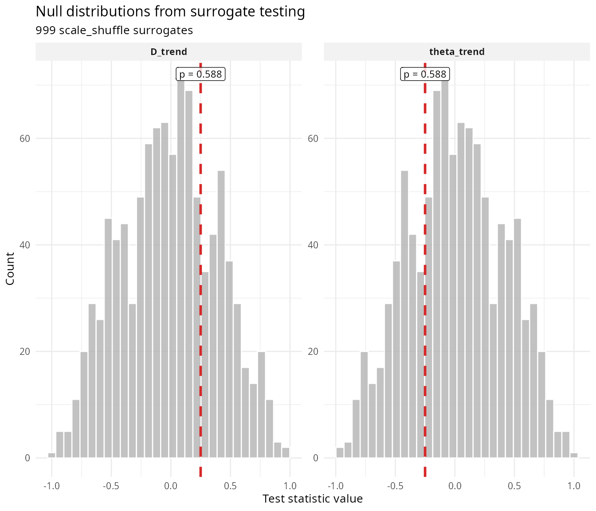

### 3.5 Direct testing from time series

``` r

# Run test directly on time series (performs analysis internally)
test_direct <- chameleon_test(x, n_surrogates = 999, verbose = FALSE)
print(test_direct)
#> 
#> Chameleon attractor test
#> ============================================================ 
#> Surrogates: 999 (scale_shuffle method)
#> Multiple testing correction: fisher
#> 
#> Test statistics:
#> ------------------------------------------------------------ 
#> Statistic         Observed  Null Mean    Null SD    p-value      d
#> ------------------------------------------------------------ 
#> D_trend              0.250     -0.028      0.402     0.5890   0.69 
#> theta_trend         -0.250      0.028      0.402     0.5890  -0.69 
#> ------------------------------------------------------------ 
#> Significance: *** p < 0.001, ** p < 0.01, * p < 0.05
#> 
#> Combined p-value (fisher): 0.7142
#> 
#> ============================================================ 
#> Conclusion: No chameleon behavior detected
#> Confidence: high
#> 
#> Interpretation:
#>   - Scale-dependent metrics do not vary significantly
#>   - Attractor properties appear uniform across frequency scales
#> 
#> Robustness: PASSED (1/3 checks)
```

## 4. Test statistics explained

### 4.1 D_trend and theta_trend (recommended)

Spearman rank correlation between metrics and log-frequency:

\\D\_{\mathrm{trend}} = \rho_S(\log f, D(f))\\

Tests for monotonic relationships. Positive values indicate increasing
dimension with frequency; negative values indicate decreasing dimension.

These are the **recommended statistics** for scale-shuffle testing
because they are sensitive to scale ordering.

### 4.2 D_range and theta_range

\\D\_{\mathrm{range}} = \max_f D(f) - \min_f D(f)\\

Measures total variation across scales.

**Warning**: Permutation-invariant. Not suitable for scale-shuffle
testing (always yields \\p = 1\\). Include only with other surrogate
methods.

### 4.3 D_cv and theta_cv

Coefficient of variation:

\\D\_{\mathrm{cv}} = \frac{\mathrm{SD}(D)}{\mathrm{mean}(D)}\\

Normalized measure of variability. Also permutation-invariant.

### 4.4 D_max_gradient and theta_max_gradient

Maximum local change between adjacent scales:

\\D\_{\mathrm{max\\grad}} = \max_k \|D(f\_{k+1}) - D(f_k)\|\\

Detects abrupt transitions between scales. Sensitive to scale ordering.

### 4.5 Example: Comparing different test statistics

``` r

# Test with different statistics
test_trend <- chameleon_test(result$scale_metrics,
                              n_surrogates = 999,
                              test_statistics = c("D_trend", "theta_trend"),
                              verbose = FALSE)

test_gradient <- chameleon_test(result$scale_metrics,
                                 n_surrogates = 999,
                                 test_statistics = c("D_max_gradient", "theta_max_gradient"),
                                 verbose = FALSE)

# Compare results
stats_compare <- data.frame(
  Test       = c(rep("Trend-based", 3), rep("Gradient-based", 3)),
  Statistic  = c("D_trend", "theta_trend", "Combined",
                 "D_max_gradient", "theta_max_gradient", "Combined"),
  p_value    = c(test_trend$p_values["D_trend"],
                 test_trend$p_values["theta_trend"],
                 test_trend$p_combined,
                 test_gradient$p_values["D_max_gradient"],
                 test_gradient$p_values["theta_max_gradient"],
                 test_gradient$p_combined)
)
kable(stats_compare, digits = 4,
      caption = "Trend-based versus gradient-based test statistics")
```

| Test           | Statistic          | p_value |
|:---------------|:-------------------|--------:|
| Trend-based    | D_trend            |  0.6130 |
| Trend-based    | theta_trend        |  0.6130 |
| Trend-based    | Combined           |  0.7436 |
| Gradient-based | D_max_gradient     |  0.2800 |
| Gradient-based | theta_max_gradient |  0.2800 |
| Gradient-based | Combined           |  0.2780 |

Trend-based versus gradient-based test statistics {.table}

## 5. Effect size interpretation

P-values indicate statistical significance, but effect sizes quantify
practical importance [\[4\]](#ref4). Cohen’s d measures the standardized
difference between observed and null:

\\d = \frac{T\_{\mathrm{obs}} -
\mathrm{mean}(T\_{\mathrm{null}})}{\mathrm{SD}(T\_{\mathrm{null}})}\\

### 5.1 Interpretation guidelines

``` r

effect_guide <- data.frame(
  `Cohen's d` = c("|d| < 0.5", "0.5 <= |d| < 0.8", "0.8 <= |d| < 2.0", "|d| >= 2.0"),
  Interpretation = c("Small effect", "Medium effect", "Large effect", "Very large effect"),
  check.names = FALSE
)
kable(effect_guide)
```

| Cohen’s d            | Interpretation    |
|:---------------------|:------------------|
| \|d\| \< 0.5         | Small effect      |
| 0.5 \<= \|d\| \< 0.8 | Medium effect     |
| 0.8 \<= \|d\| \< 2.0 | Large effect      |
| \|d\| \>= 2.0        | Very large effect |

A statistically significant result with small effect size may not be
practically meaningful. Conversely, a non-significant result with medium
effect size may warrant further investigation with more data.

### 5.2 Effect sizes from test results

``` r

kable(test$effect_sizes, digits = 3,
      caption = "Effect sizes from chameleon test (Cohen's d)")
```

| statistic   | observed | null_mean | null_sd | cohens_d | percentile |   snr |
|:------------|---------:|----------:|--------:|---------:|-----------:|------:|
| D_trend     |     0.25 |    -0.013 |   0.402 |    0.654 |     73.574 | 0.654 |
| theta_trend |    -0.25 |     0.013 |   0.402 |   -0.654 |     28.228 | 0.654 |

Effect sizes from chameleon test (Cohen’s d) {.table}

## 6. Multiple testing correction

When testing multiple statistics, p-values must be adjusted. Available
methods:

### 6.1 Fisher’s method (default)

Combines p-values using [\[5\]](#ref5):

\\\chi^2 = -2 \sum\_{i=1}^{k} \log(p_i)\\

Under \\H_0\\, this follows a chi-squared distribution with \\2k\\
degrees of freedom. Detects if *any* statistic is significant.

### 6.2 Bonferroni correction

\\p\_{\mathrm{adjusted}} = \min(1, k \cdot p)\\

Conservative. Controls family-wise error rate.

### 6.3 Benjamini-Hochberg (BH)

Controls false discovery rate. Less conservative than Bonferroni.

### 6.4 Comparing correction methods

``` r

# Using different correction methods
test_fisher <- chameleon_test(result$scale_metrics, n_surrogates = 999,
                               correct_multiple = "fisher", verbose = FALSE)
test_bonf <- chameleon_test(result$scale_metrics, n_surrogates = 999,
                             correct_multiple = "bonferroni", verbose = FALSE)
test_bh <- chameleon_test(result$scale_metrics, n_surrogates = 999,
                           correct_multiple = "bh", verbose = FALSE)

correction_comparison <- data.frame(
  Method = c("Fisher", "Bonferroni", "Benjamini-Hochberg"),
  Combined_p = c(test_fisher$p_combined, test_bonf$p_combined, test_bh$p_combined),
  Conclusion = c(test_fisher$conclusion, test_bonf$conclusion, test_bh$conclusion)
)
kable(correction_comparison, digits = 4)
```

| Method             | Combined_p | Conclusion    |
|:-------------------|-----------:|:--------------|
| Fisher             |     0.7067 | non-chameleon |
| Bonferroni         |     1.0000 | non-chameleon |
| Benjamini-Hochberg |     0.5880 | non-chameleon |

## 7. Alternative surrogate methods

### 7.1 Fourier surrogates

Phase randomization preserving power spectrum [\[2\]](#ref2). Tests the
linear null hypothesis:

``` r

# Generate Fourier surrogates from time series
surr_fourier <- generate_surrogates(x, n_surrogates = 5, method = "fourier")
kable(data.frame(
  Method                  = "Fourier",
  `Surrogates generated`  = length(surr_fourier),
  `Surrogate length`      = length(surr_fourier[[1]]),
  check.names = FALSE
), caption = "Fourier surrogate generation")
```

| Method  | Surrogates generated | Surrogate length |
|:--------|---------------------:|-----------------:|
| Fourier |                    5 |             5000 |

Fourier surrogate generation {.table}

### 7.2 IAAFT surrogates

Iterative Amplitude Adjusted Fourier Transform [\[6\]](#ref6). Preserves
both power spectrum and amplitude distribution:

``` r

surr_iaaft <- generate_surrogates(x[1:2000], n_surrogates = 3, method = "iaaft")
kable(data.frame(
  Method                  = "IAAFT",
  `Surrogates generated`  = length(surr_iaaft),
  `Surrogate length`      = length(surr_iaaft[[1]]),
  check.names = FALSE
), caption = "IAAFT surrogate generation")
```

| Method | Surrogates generated | Surrogate length |
|:-------|---------------------:|-----------------:|
| IAAFT  |                    3 |             2000 |

IAAFT surrogate generation {.table}

### 7.3 Block bootstrap

Preserves local temporal structure while destroying long-range
dependence:

``` r

surr_block <- generate_surrogates(x, n_surrogates = 5, method = "block_bootstrap")
kable(data.frame(
  Method                  = "Block bootstrap",
  `Surrogates generated`  = length(surr_block),
  `Surrogate length`      = length(surr_block[[1]]),
  check.names = FALSE
), caption = "Block-bootstrap surrogate generation")
```

| Method          | Surrogates generated | Surrogate length |
|:----------------|---------------------:|-----------------:|
| Block bootstrap |                    5 |             5000 |

Block-bootstrap surrogate generation {.table}

### 7.4 Visualizing surrogates

``` r

df_surr <- rbind(
  data.frame(t = 1:500, value = x[1:500],
             panel = factor("Original",
                            levels = c("Original", "Fourier",
                                       "IAAFT", "Block bootstrap"))),
  data.frame(t = 1:500, value = surr_fourier[[1]][1:500],
             panel = factor("Fourier",
                            levels = c("Original", "Fourier",
                                       "IAAFT", "Block bootstrap"))),
  data.frame(t = 1:500, value = surr_iaaft[[1]][1:500],
             panel = factor("IAAFT",
                            levels = c("Original", "Fourier",
                                       "IAAFT", "Block bootstrap"))),
  data.frame(t = 1:500, value = surr_block[[1]][1:500],
             panel = factor("Block bootstrap",
                            levels = c("Original", "Fourier",
                                       "IAAFT", "Block bootstrap")))
)
ggplot(df_surr, aes(x = .data$t, y = .data$value, colour = .data$panel)) +
  geom_line(linewidth = 0.4) +
  facet_wrap(~ panel, ncol = 1, strip.position = "top") +
  scale_colour_manual(values = c("Original"        = "black",
                                 "Fourier"         = "#3366CC",
                                 "IAAFT"           = "#CC3333",
                                 "Block bootstrap" = "#2D8B57"),
                      guide = "none") +
  labs(x = "Time index", y = "x",
       subtitle = "Original signal versus three surrogate constructions (first 500 samples)",
       caption = "Fourier preserves power spectrum; IAAFT preserves spectrum + amplitude distribution; block bootstrap preserves local temporal structure.") +
  theme_minimal(base_size = 11) +
  theme(strip.text       = ggplot2::element_text(face = "bold"),
        plot.caption     = ggplot2::element_text(color = "grey40", size = 8, hjust = 0))
```

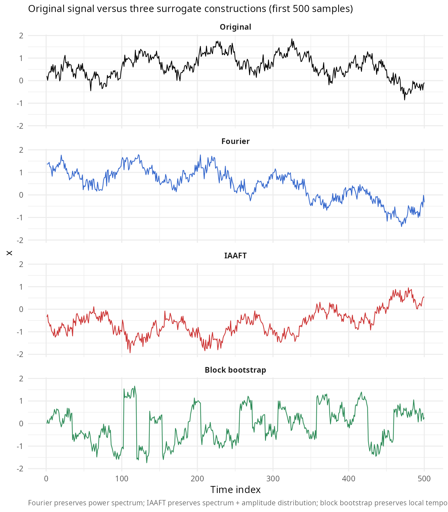

## 8. Non-stationary chameleon testing

For long time series with potential regime changes, use
[`chameleon_test_nonstationary()`](https://robustecologies.github.io/chamaeleon/reference/chameleon_test_nonstationary.md):

### 8.1 The non-stationary problem

In non-autonomous dynamical systems, the governing equations depend
explicitly on time: \\\dot{x} = f(x, t)\\. This means the attractor
structure can evolve, and chameleon behavior may appear, disappear, or
change character as the system traverses different dynamical regimes
[\[1\]](#ref1).

Examples include seasonally forced climate oscillators, neural systems
with varying input drives, ecosystems under environmental change, and
financial markets with regime switching.

### 8.2 Analysis procedure

The analysis procedure involves dividing the time series into
overlapping windows; for each window, computing MEMD decomposition,
scale-dependent metrics, and chameleon index; analyzing temporal
evolution of chameleon index; testing for stationarity of chameleon
character; and detecting change points if present.

### 8.3 Example: Non-stationary analysis

``` r

# Generate time series with regime change
set.seed(123)
n <- 8000
dt <- 0.01
t <- seq(0, (n-1) * dt, by = dt)

# Create signal with changing characteristics over time
# First half: simple dynamics
# Second half: more complex multi-scale behavior
x_ns <- numeric(n)
mid <- n / 2

# First regime: single frequency
x_ns[1:mid] <- sin(2 * pi * 0.2 * t[1:mid]) + 0.1 * rnorm(mid)

# Second regime: multi-scale
x_ns[(mid+1):n] <- sin(2 * pi * 0.1 * t[(mid+1):n]) +
                   0.4 * sin(2 * pi * 0.5 * t[(mid+1):n]) +
                   0.2 * sin(2 * pi * 2 * t[(mid+1):n]) +
                   0.15 * rnorm(n - mid)

# Run non-stationary test
# Note: parallel = FALSE required for RMarkdown compatibility
ns_test <- chameleon_test_nonstationary(
  x_ns,
  window_size = 1500,
  step_size = 400,
  chameleon_index = "combined",
  n_surrogates = 0,
  parallel = FALSE,
  verbose = TRUE
)
#> 
#> ⚙ NON-STATIONARY CHAMELEON TEST
#>    Time series length: 8000
#>    Window size: 1500 (step: 400)
#>    Number of windows: 17
#>    Chameleon index: combined
#> -------------------------------------------------- 
#> ⏱ Processing windows
#> ⏱ Computing global test
#> ⏱ Testing stationarity
#> ⏱ Detecting change points
#> -------------------------------------------------- 
#> ¡ Global test not available (n_surrogates = 0)
#> ✔ Chameleon character is stationary
```

### 8.4 Non-stationary test results

``` r

print(ns_test)
#> 
#> Non-stationary chameleon attractor test
#> ============================================================ 
#> Time series length: 8000
#> Windows: 17 (size: 1500, step: 400)
#> Chameleon index: combined
#> Valid windows: 17 (100.0%)
#> 
#> ------------------------------------------------------------ 
#> Global chameleon test
#> ------------------------------------------------------------ 
#> 
#> ------------------------------------------------------------ 
#> Chameleon index summary
#> ------------------------------------------------------------ 
#> Mean:    0.601
#> SD:      0.174
#> Range: [0.202, 0.875]
#> 
#> ------------------------------------------------------------ 
#> Stationarity of chameleon behavior
#> ------------------------------------------------------------ 
#> ✔ Chameleon character is STATIONARY
#> 
#> Component tests:
#>   Runs test:       z =   0.77, p = 0.4419
#>   Mann-Kendall:    z =   0.17, p = 0.8687 (increasing)
#>   Linear trend:    slope = 0.0000, p = 0.7427
#> 
#> ------------------------------------------------------------ 
#> Change point detection
#> ------------------------------------------------------------ 
#> ✔ No significant change points detected
```

### 8.5 Visualizing non-stationary results

``` r

plot(ns_test)
```

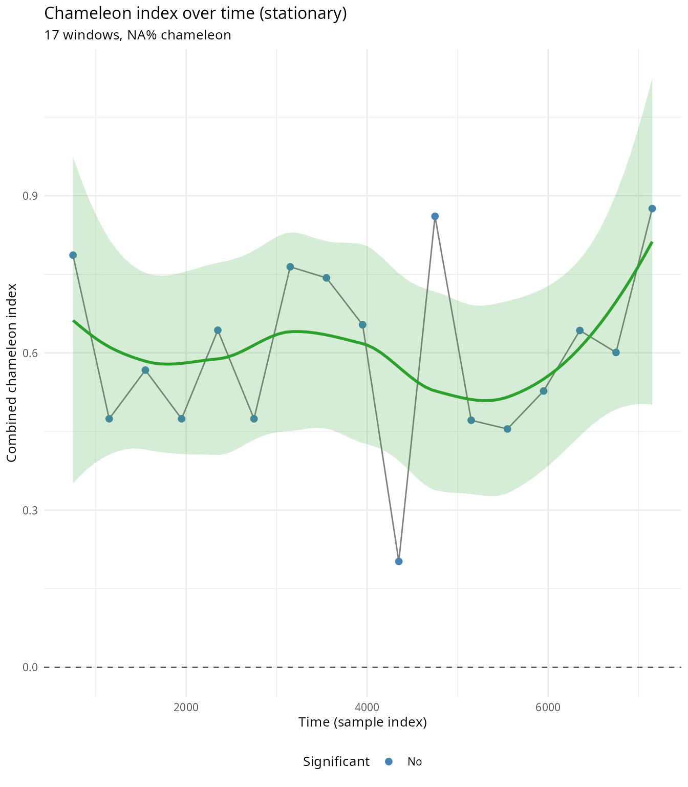

### 8.6 Stationarity tests explained

The stationarity test combines three components: runs test (tests for
non-random patterns in the chameleon index sequence); Mann-Kendall test
(tests for monotonic trend); and linear trend test (tests for
significant linear relationship with time).

``` r

if (!is.null(ns_test$stationarity_test)) {
  st <- ns_test$stationarity_test
  stationarity_tbl <- data.frame(
    Test            = c("Runs", "Mann-Kendall", "Linear trend"),
    `Statistic`     = c("z", "z", "slope"),
    Value           = c(round(st$tests$runs$z, 3),
                        round(st$tests$mann_kendall$z, 3),
                        round(st$tests$linear_trend$slope, 6)),
    p_value         = c(round(st$tests$runs$p_value, 4),
                        round(st$tests$mann_kendall$p_value, 4),
                        round(st$tests$linear_trend$p_value, 4)),
    Note            = c("",
                        paste("trend:", st$tests$mann_kendall$trend_direction),
                        ""),
    check.names = FALSE
  )
  kable(stationarity_tbl,
        caption = paste0("Stationarity tests; combined conclusion: ",
                         st$combined_conclusion))
}
```

| Test         | Statistic |    Value | p_value | Note              |
|:-------------|:----------|---------:|--------:|:------------------|
| Runs         | z         | 0.769000 |  0.4419 |                   |
| Mann-Kendall | z         | 0.165000 |  0.8687 | trend: increasing |
| Linear trend | slope     | 0.000007 |  0.7427 |                   |

Stationarity tests; combined conclusion: Chameleon character is
stationary over time {.table}

### 8.7 Change point detection

``` r

if (!is.null(ns_test$change_points)) {
  cp <- ns_test$change_points
  cp_tbl <- data.frame(
    Quantity = c("Has change point",
                 "Number of change points",
                 "Change point times"),
    Value    = c(as.character(cp$has_changepoint),
                 if (cp$has_changepoint) as.character(cp$n_changepoints) else NA_character_,
                 if (cp$has_changepoint) paste(cp$change_point_times, collapse = ", ") else NA_character_)
  )
  kable(cp_tbl, caption = "Change point detection")
}
```

| Quantity                | Value |
|:------------------------|:------|
| Has change point        | FALSE |
| Number of change points | NA    |
| Change point times      | NA    |

Change point detection {.table}

## 9. Robustness checks

### 9.1 Automatic robustness assessment

The test automatically performs robustness checks: embedding sensitivity
(re-tests with \\m \pm 1\\, \\\tau \pm 2\\) and split-half (tests first
and second halves separately).

``` r

# Run test with robustness checks enabled
test_robust <- chameleon_test(result$scale_metrics,
                               n_surrogates = 999,
                               robustness_checks = TRUE,
                               verbose = FALSE)

robust_tbl <- data.frame(
  Quantity = c("Conclusion", "Confidence"),
  Value    = c(test_robust$conclusion, test_robust$confidence)
)
kable(robust_tbl, caption = "Robust chameleon test result")
```

| Quantity   | Value         |
|:-----------|:--------------|
| Conclusion | non-chameleon |
| Confidence | high          |

Robust chameleon test result {.table}

### 9.2 Interpreting robustness

Warnings are issued if conclusions are sensitive to parameter choices.
Robust chameleon detection requires consistent results across these
checks.

## 10. Practical recommendations

### 10.1 Minimum sample size

``` r

sample_guide <- data.frame(
  `Sample size` = c("n < 1000", "1000 <= n < 2000", "2000 <= n < 5000", "n >= 5000"),
  Recommendation = c("Results may be unreliable; interpret with caution",
                     "Minimum for exploratory analysis",
                     "Recommended for standard analysis",
                     "Preferred for publication-quality results"),
  check.names = FALSE
)
kable(sample_guide)
```

| Sample size        | Recommendation                                    |
|:-------------------|:--------------------------------------------------|
| n \< 1000          | Results may be unreliable; interpret with caution |
| 1000 \<= n \< 2000 | Minimum for exploratory analysis                  |
| 2000 \<= n \< 5000 | Recommended for standard analysis                 |
| n \>= 5000         | Preferred for publication-quality results         |

### 10.2 Choosing n_surrogates

``` r

surr_guide <- data.frame(
  n_surrogates = c(99, 199, 499, 999),
  `Min p-value` = c(0.01, 0.005, 0.002, 0.001),
  Use_case = c("Quick exploratory analysis",
               "Standard analysis",
               "Higher resolution",
               "Publication-quality"),
  check.names = FALSE
)
kable(surr_guide)
```

| n_surrogates | Min p-value | Use_case                   |
|-------------:|------------:|:---------------------------|
|           99 |       0.010 | Quick exploratory analysis |
|          199 |       0.005 | Standard analysis          |
|          499 |       0.002 | Higher resolution          |
|          999 |       0.001 | Publication-quality        |

### 10.3 When to use nonstationary test

Use
[`chameleon_test_nonstationary()`](https://robustecologies.github.io/chamaeleon/reference/chameleon_test_nonstationary.md)
when the time series spans long periods with potential regime changes,
when visual inspection suggests non-constant dynamics, when the system
is non-autonomous (governing equations depend on time), or when
investigating *when* chameleon behavior occurs, not just *if*.

### 10.4 Interpreting non-significant results

A non-significant result (\\p \> \alpha\\) does not prove the absence of
chameleon behavior. Consider that insufficient sample size means power
may be low, that the effect may be real but small, and that
scale-dependent dynamics may exist at timescales not captured by MEMD.

## 11. Complete workflow example

``` r

# 1. Load or generate data
set.seed(42)
n <- 6000
dt <- 0.01
t <- seq(0, (n-1) * dt, by = dt)

x_workflow <- sin(2 * pi * 0.1 * t) +
              0.5 * sin(2 * pi * 0.8 * t) +
              0.25 * sin(2 * pi * 3.0 * t) +
              0.12 * rnorm(n)

# 2. Run analysis
result_wf <- chameleon_analysis(x_workflow, dt = dt, verbose = FALSE)
print(result_wf)
#> 
#> Chameleon Attractor Analysis Results
#> ======================================== 
#> 
#> Input data:
#>   Original series length: 6000
#> 
#> Embedding parameters:
#>   Dimension: m = 4
#>   Time delay: tau = 148
#>   Embedded trajectory: 5556 x 4
#> 
#> MEMD decomposition:
#>   Number of IMFs: 7
#>   Frequency range: [0.0003, 0.1245] Hz
#> 
#> Full attractor metrics:
#>   Mean dimension: <d> = 2.899 (sd = 0.607)
#>   Mean persistence: <θ> = 0.058 (sd = 0.019)
#> 
#> Chameleon detection:
#>   Status: CHAMELEON BEHAVIOR DETECTED
#>   Dimension variation: 1.024
#>   Persistence variation: 0.038

# 3. Statistical test
test_wf <- chameleon_test(
  result_wf$scale_metrics,
  n_surrogates = 199,
  robustness_checks = TRUE,
  verbose = FALSE
)

# 4. Examine results
print(test_wf)
#> 
#> Chameleon attractor test
#> ============================================================ 
#> Surrogates: 199 (scale_shuffle method)
#> Multiple testing correction: fisher
#> 
#> Test statistics:
#> ------------------------------------------------------------ 
#> Statistic         Observed  Null Mean    Null SD    p-value      d
#> ------------------------------------------------------------ 
#> D_trend              0.250     -0.048      0.404     0.6100   0.74 
#> theta_trend         -0.250      0.048      0.404     0.6100  -0.74 
#> ------------------------------------------------------------ 
#> Significance: *** p < 0.001, ** p < 0.01, * p < 0.05
#> 
#> Combined p-value (fisher): 0.7400
#> 
#> ============================================================ 
#> Conclusion: No chameleon behavior detected
#> Confidence: high
#> 
#> Interpretation:
#>   - Scale-dependent metrics do not vary significantly
#>   - Attractor properties appear uniform across frequency scales
#> 
#> Robustness: PASSED (1/3 checks)
summary(test_wf)
#> 
#> Chameleon attractor test
#> ============================================================ 
#> Surrogates: 199 (scale_shuffle method)
#> Multiple testing correction: fisher
#> 
#> Test statistics:
#> ------------------------------------------------------------ 
#> Statistic         Observed  Null Mean    Null SD    p-value      d
#> ------------------------------------------------------------ 
#> D_trend              0.250     -0.048      0.404     0.6100   0.74 
#> theta_trend         -0.250      0.048      0.404     0.6100  -0.74 
#> ------------------------------------------------------------ 
#> Significance: *** p < 0.001, ** p < 0.01, * p < 0.05
#> 
#> Combined p-value (fisher): 0.7400
#> 
#> ============================================================ 
#> Conclusion: No chameleon behavior detected
#> Confidence: high
#> 
#> Interpretation:
#>   - Scale-dependent metrics do not vary significantly
#>   - Attractor properties appear uniform across frequency scales
#> 
#> Robustness: PASSED (1/3 checks)

# 5. Visualize
plot(result_wf)
```

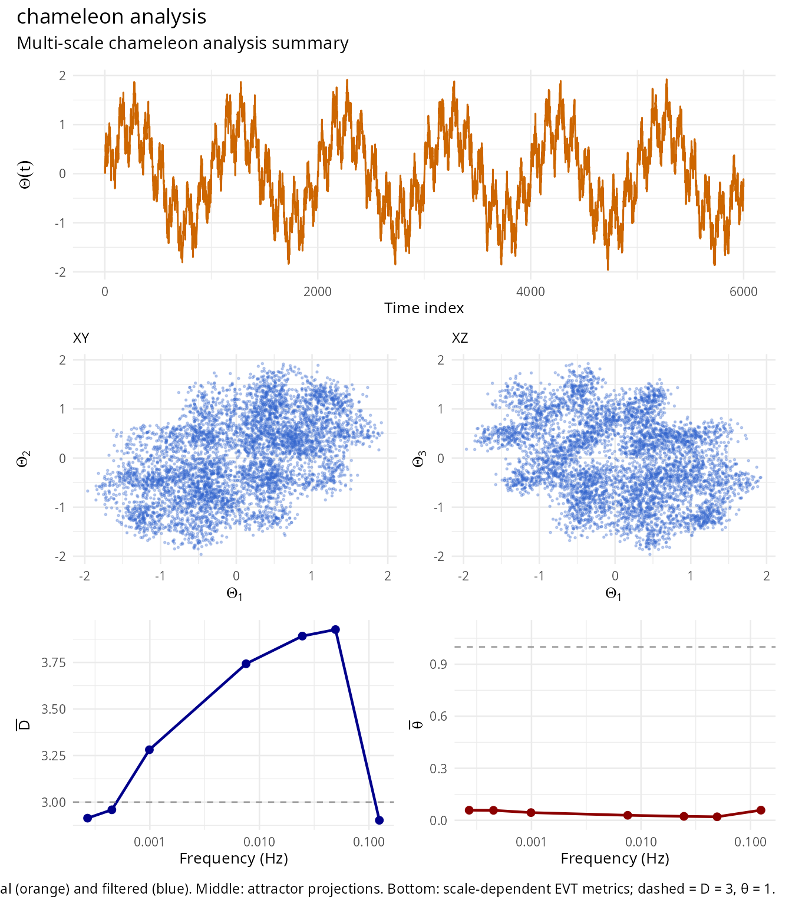

``` r

plot(test_wf)
```

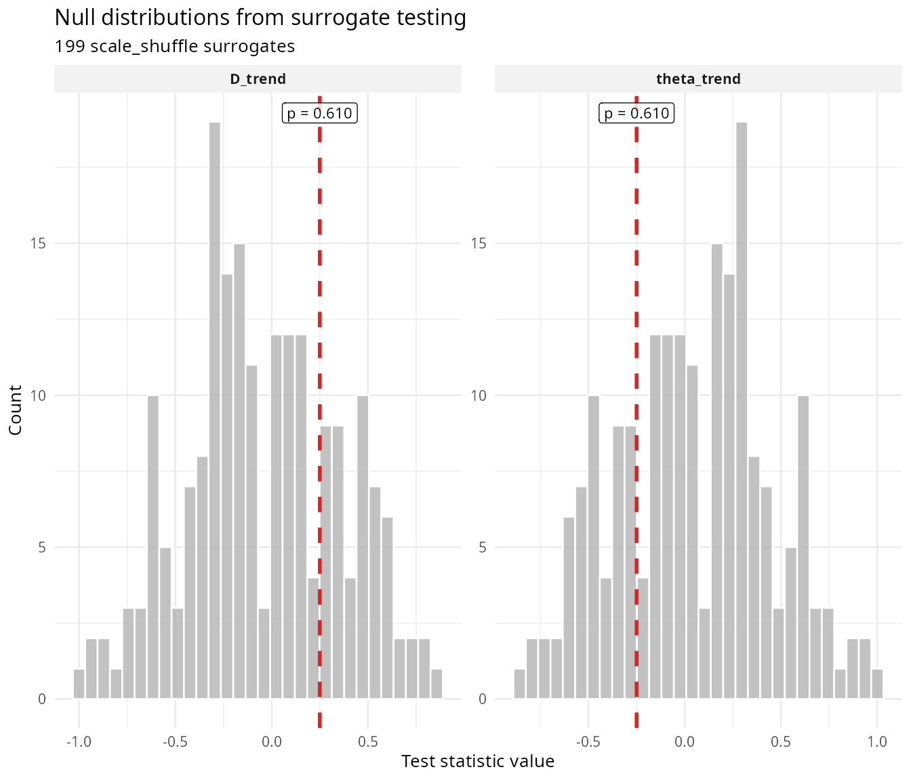

  

## Appendix A: Synthetic signals tested

This appendix presents a systematic evaluation of chameleon detection on
various synthetic signals with known properties.

### A.1 Pure noise (null case)

``` r

set.seed(100)
n <- 5000
x_noise <- rnorm(n)

result_noise <- chameleon_analysis(x_noise, verbose = FALSE)
test_noise <- chameleon_test(result_noise$scale_metrics, n_surrogates = 9999, verbose = FALSE)

print(test_noise)
#> 
#> Chameleon attractor test
#> ============================================================ 
#> Surrogates: 9999 (scale_shuffle method)
#> Multiple testing correction: fisher
#> 
#> Test statistics:
#> ------------------------------------------------------------ 
#> Statistic         Observed  Null Mean    Null SD    p-value      d
#> ------------------------------------------------------------ 
#> D_trend             -0.648     -0.005      0.332     0.0496  -1.94 *
#> theta_trend         -0.594     -0.005      0.334     0.0789  -1.77 
#> ------------------------------------------------------------ 
#> Significance: *** p < 0.001, ** p < 0.01, * p < 0.05
#> 
#> Combined p-value (fisher): 0.0256
#> 
#> ============================================================ 
#> Conclusion: CHAMELEON ATTRACTOR DETECTED
#> Confidence: moderate
#> 
#> Interpretation:
#>   - D decreases significantly with frequency
#>   - Effect sizes are large (|d| > 0.8)
#> 
#> Warnings:
#>   ⚠ P-value at lower limit of resolution. Consider increasing n_surrogates.
plot(result_noise)
```

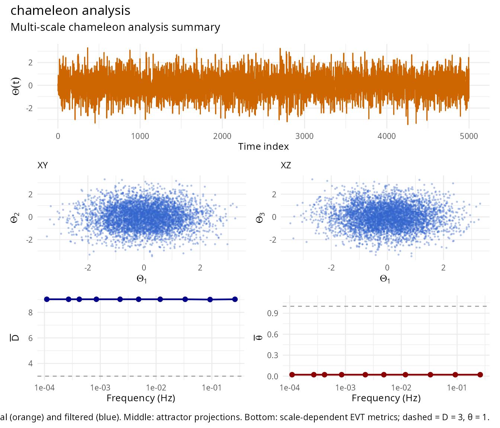

### A.2 AR(1) process

``` r

set.seed(101)
x_ar1 <- arima.sim(list(ar = 0.9), n = 5000)

result_ar1 <- chameleon_analysis(as.numeric(x_ar1), verbose = FALSE)
test_ar1 <- chameleon_test(result_ar1$scale_metrics, n_surrogates = 9999, verbose = FALSE)

print(test_ar1)
#> 
#> Chameleon attractor test
#> ============================================================ 
#> Surrogates: 9999 (scale_shuffle method)
#> Multiple testing correction: fisher
#> 
#> Test statistics:
#> ------------------------------------------------------------ 
#> Statistic         Observed  Null Mean    Null SD    p-value      d
#> ------------------------------------------------------------ 
#> D_trend              0.633      0.003      0.354     0.0772   1.78 
#> theta_trend         -0.603      0.000      0.355     0.0957  -1.70 
#> ------------------------------------------------------------ 
#> Significance: *** p < 0.001, ** p < 0.01, * p < 0.05
#> 
#> Combined p-value (fisher): 0.0436
#> 
#> ============================================================ 
#> Conclusion: CHAMELEON ATTRACTOR DETECTED
#> Confidence: moderate
#> 
#> Interpretation:
#>   - Effect sizes are large (|d| > 0.8)
#> 
#> Warnings:
#>   ⚠ P-value at lower limit of resolution. Consider increasing n_surrogates.
plot(result_ar1)
```

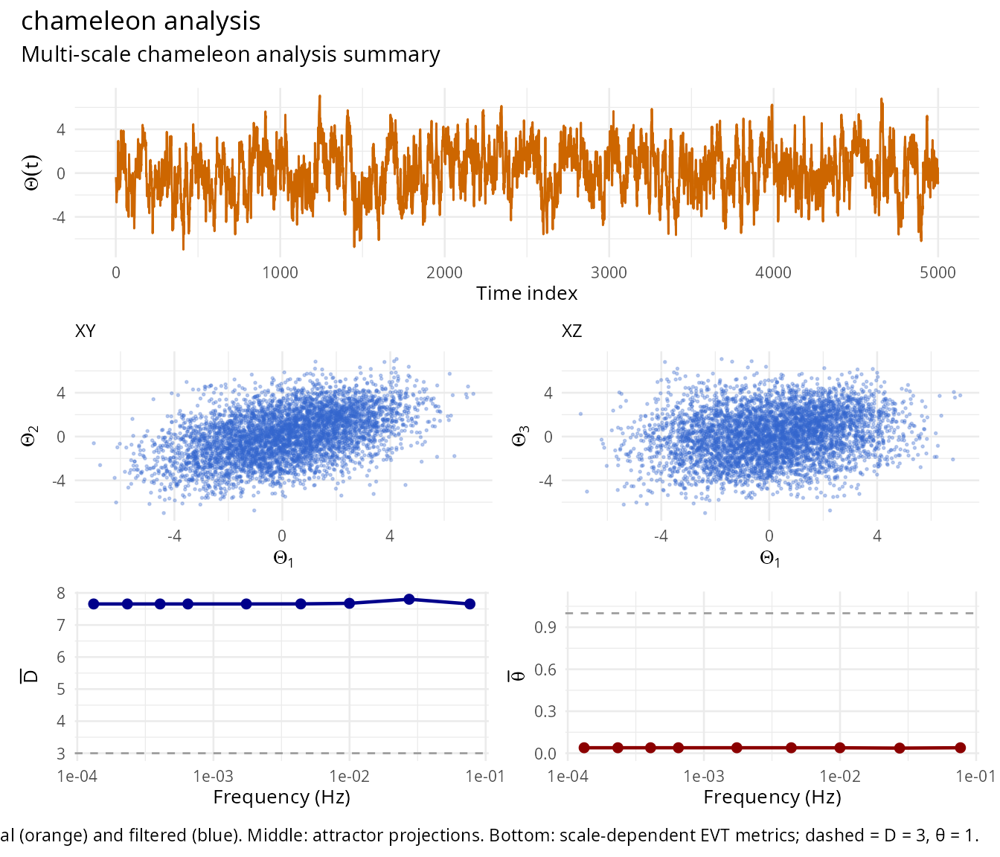

### A.3 Simple sinusoid

``` r

set.seed(102)
t <- seq(0, 50, by = 0.01)
x_sine <- sin(2 * pi * 0.5 * t) + 0.1 * rnorm(length(t))

result_sine <- chameleon_analysis(x_sine, verbose = FALSE)
test_sine <- chameleon_test(result_sine$scale_metrics, n_surrogates = 999, verbose = FALSE)

print(test_sine)
#> 
#> Chameleon attractor test
#> ============================================================ 
#> Surrogates: 999 (scale_shuffle method)
#> Multiple testing correction: fisher
#> 
#> Test statistics:
#> ------------------------------------------------------------ 
#> Statistic         Observed  Null Mean    Null SD    p-value      d
#> ------------------------------------------------------------ 
#> D_trend              0.238     -0.013      0.384     0.5980   0.65 
#> theta_trend         -0.214      0.019      0.370     0.6280  -0.63 
#> ------------------------------------------------------------ 
#> Significance: *** p < 0.001, ** p < 0.01, * p < 0.05
#> 
#> Combined p-value (fisher): 0.7433
#> 
#> ============================================================ 
#> Conclusion: No chameleon behavior detected
#> Confidence: high
#> 
#> Interpretation:
#>   - Scale-dependent metrics do not vary significantly
#>   - Attractor properties appear uniform across frequency scales
#> 
#> Robustness: PASSED (1/3 checks)
plot(result_sine)
```

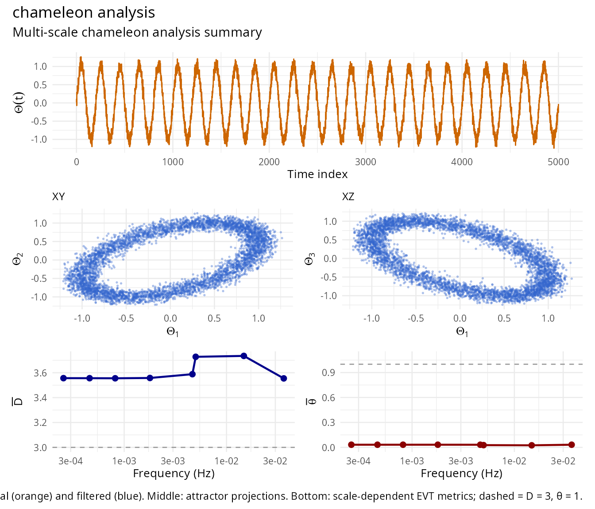

### A.4 Multi-frequency signal

``` r

set.seed(103)
t <- seq(0, 100, by = 0.01)
x_multi <- sin(2 * pi * 0.1 * t) +
           0.5 * sin(2 * pi * 1.0 * t) +
           0.25 * sin(2 * pi * 5.0 * t) +
           0.1 * rnorm(length(t))

result_multi <- chameleon_analysis(x_multi, verbose = FALSE)
test_multi <- chameleon_test(result_multi$scale_metrics, n_surrogates = 999, verbose = FALSE)

print(test_multi)
#> 
#> Chameleon attractor test
#> ============================================================ 
#> Surrogates: 999 (scale_shuffle method)
#> Multiple testing correction: fisher
#> 
#> Test statistics:
#> ------------------------------------------------------------ 
#> Statistic         Observed  Null Mean    Null SD    p-value      d
#> ------------------------------------------------------------ 
#> D_trend              0.400      0.011      0.355     0.2880   1.09 
#> theta_trend         -0.333     -0.011      0.354     0.4070  -0.91 
#> ------------------------------------------------------------ 
#> Significance: *** p < 0.001, ** p < 0.01, * p < 0.05
#> 
#> Combined p-value (fisher): 0.3685
#> 
#> ============================================================ 
#> Conclusion: No chameleon behavior detected
#> Confidence: high
#> 
#> Interpretation:
#>   - Scale-dependent metrics do not vary significantly
#>   - Attractor properties appear uniform across frequency scales
#> 
#> Warnings:
#>   ⚠ P-value at lower limit of resolution. Consider increasing n_surrogates.
plot(result_multi)
```

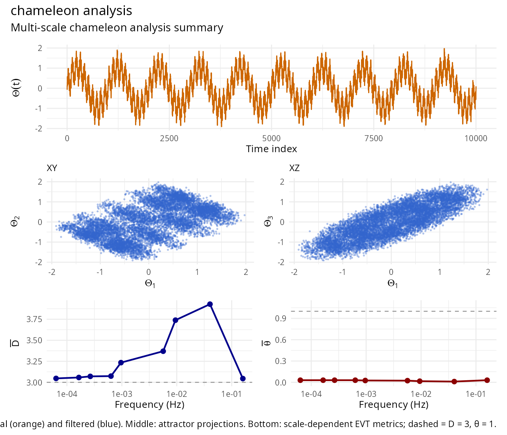

### A.5 Lorenz system

``` r

set.seed(104)
n <- 10000
dt <- 0.01
x <- y <- z <- numeric(n)
x[1] <- 1; y[1] <- 1; z[1] <- 1
sigma <- 10; rho <- 28; beta <- 8/3

for (i in 2:n) {
  x[i] <- x[i-1] + dt * sigma * (y[i-1] - x[i-1])
  y[i] <- y[i-1] + dt * (x[i-1] * (rho - z[i-1]) - y[i-1])
  z[i] <- z[i-1] + dt * (x[i-1] * y[i-1] - beta * z[i-1])
}

x_lorenz <- x + 0.1 * rnorm(n)
result_lorenz <- chameleon_analysis(x_lorenz, m = 3, tau = 10, verbose = FALSE)
test_lorenz <- chameleon_test(result_lorenz$scale_metrics, n_surrogates = 999, verbose = FALSE)

print(test_lorenz)
#> 
#> Chameleon attractor test
#> ============================================================ 
#> Surrogates: 999 (scale_shuffle method)
#> Multiple testing correction: fisher
#> 
#> Test statistics:
#> ------------------------------------------------------------ 
#> Statistic         Observed  Null Mean    Null SD    p-value      d
#> ------------------------------------------------------------ 
#> D_trend              0.383     -0.002      0.363     0.3470   1.06 
#> theta_trend         -0.317      0.018      0.360     0.4220  -0.93 
#> ------------------------------------------------------------ 
#> Significance: *** p < 0.001, ** p < 0.01, * p < 0.05
#> 
#> Combined p-value (fisher): 0.4278
#> 
#> ============================================================ 
#> Conclusion: No chameleon behavior detected
#> Confidence: high
#> 
#> Interpretation:
#>   - Scale-dependent metrics do not vary significantly
#>   - Attractor properties appear uniform across frequency scales
#> 
#> Warnings:
#>   ⚠ P-value at lower limit of resolution. Consider increasing n_surrogates.
plot(result_lorenz)
```

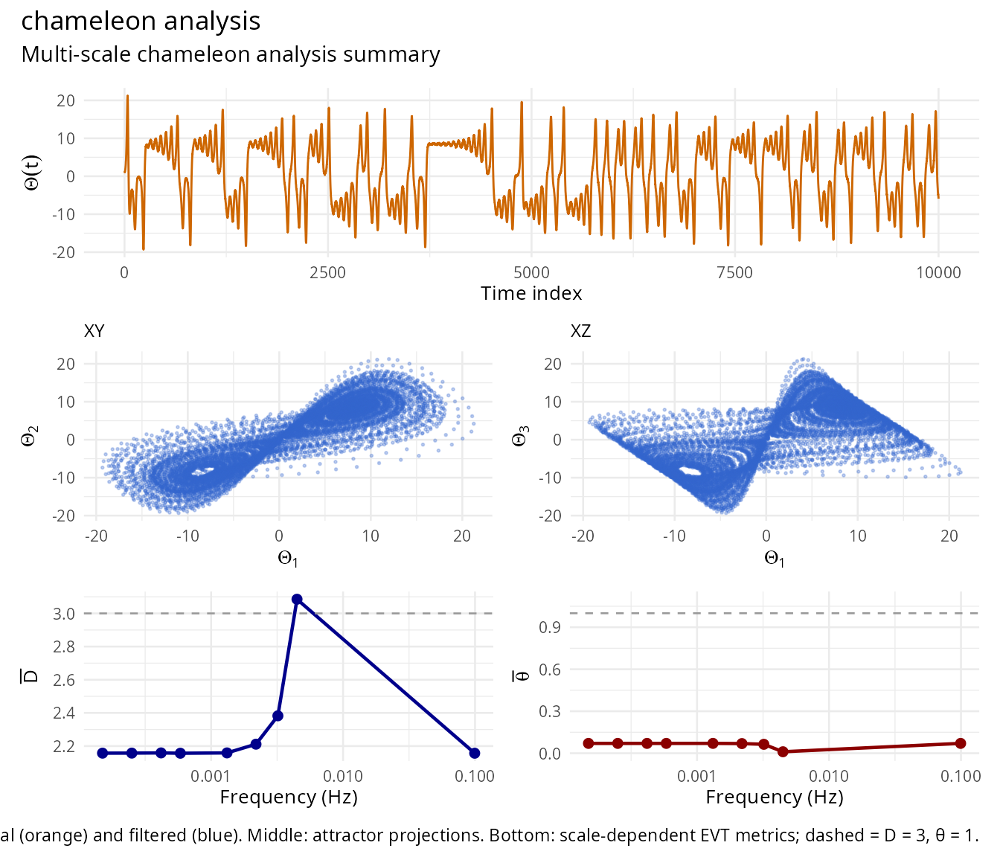

### A.6 Rossler system

``` r

set.seed(105)
n <- 10000
dt <- 0.05
x <- y <- z <- numeric(n)
x[1] <- 1; y[1] <- 1; z[1] <- 1
a <- 0.2; b <- 0.2; c <- 5.7

for (i in 2:n) {
  x[i] <- x[i-1] + dt * (-y[i-1] - z[i-1])
  y[i] <- y[i-1] + dt * (x[i-1] + a * y[i-1])
  z[i] <- z[i-1] + dt * (b + z[i-1] * (x[i-1] - c))
}

x_rossler <- x + 0.1 * rnorm(n)
result_rossler <- chameleon_analysis(x_rossler, m = 3, tau = 10, verbose = FALSE)
test_rossler <- chameleon_test(result_rossler$scale_metrics, n_surrogates = 999, verbose = FALSE)

print(test_rossler)
#> 
#> Chameleon attractor test
#> ============================================================ 
#> Surrogates: 999 (scale_shuffle method)
#> Multiple testing correction: fisher
#> 
#> Test statistics:
#> ------------------------------------------------------------ 
#> Statistic         Observed  Null Mean    Null SD    p-value      d
#> ------------------------------------------------------------ 
#> D_trend              0.345      0.006      0.333     0.3180   1.02 
#> theta_trend          0.042      0.009      0.348     0.9260   0.10 
#> ------------------------------------------------------------ 
#> Significance: *** p < 0.001, ** p < 0.01, * p < 0.05
#> 
#> Combined p-value (fisher): 0.6545
#> 
#> ============================================================ 
#> Conclusion: No chameleon behavior detected
#> Confidence: high
#> 
#> Interpretation:
#>   - Scale-dependent metrics do not vary significantly
#>   - Attractor properties appear uniform across frequency scales
#> 
#> Warnings:
#>   ⚠ P-value at lower limit of resolution. Consider increasing n_surrogates.
plot(result_rossler)
```

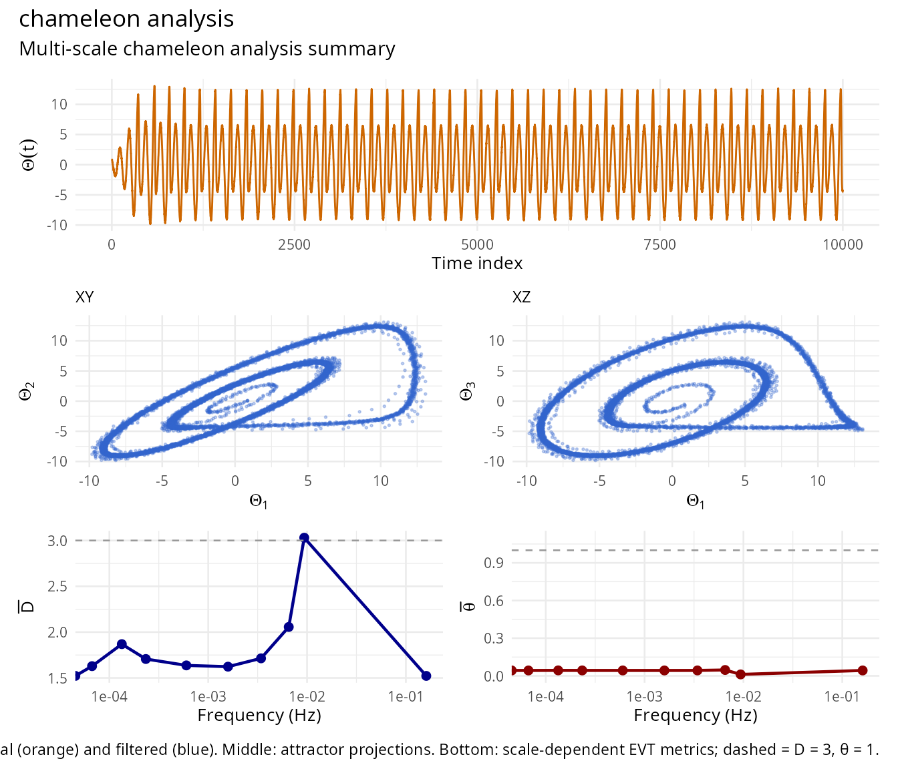

### A.7 Van der Pol oscillator

``` r

set.seed(106)
n <- 8000
dt <- 0.02
x <- y <- numeric(n)
x[1] <- 2; y[1] <- 0
mu <- 2.0

for (i in 2:n) {
  x[i] <- x[i-1] + dt * y[i-1]
  y[i] <- y[i-1] + dt * (mu * (1 - x[i-1]^2) * y[i-1] - x[i-1])
}

x_vdp <- x + 0.05 * rnorm(n)
result_vdp <- chameleon_analysis(x_vdp, m = 3, tau = 15, verbose = FALSE)
test_vdp <- chameleon_test(result_vdp$scale_metrics, n_surrogates = 999, verbose = FALSE)

print(test_vdp)
#> 
#> Chameleon attractor test
#> ============================================================ 
#> Surrogates: 999 (scale_shuffle method)
#> Multiple testing correction: fisher
#> 
#> Test statistics:
#> ------------------------------------------------------------ 
#> Statistic         Observed  Null Mean    Null SD    p-value      d
#> ------------------------------------------------------------ 
#> D_trend              0.341     -0.003      0.335     0.3420   1.03 
#> theta_trend         -0.354      0.005      0.331     0.3050  -1.09 
#> ------------------------------------------------------------ 
#> Significance: *** p < 0.001, ** p < 0.01, * p < 0.05
#> 
#> Combined p-value (fisher): 0.3401
#> 
#> ============================================================ 
#> Conclusion: No chameleon behavior detected
#> Confidence: high
#> 
#> Interpretation:
#>   - Scale-dependent metrics do not vary significantly
#>   - Attractor properties appear uniform across frequency scales
#> 
#> Warnings:
#>   ⚠ P-value at lower limit of resolution. Consider increasing n_surrogates.
plot(result_vdp)
```

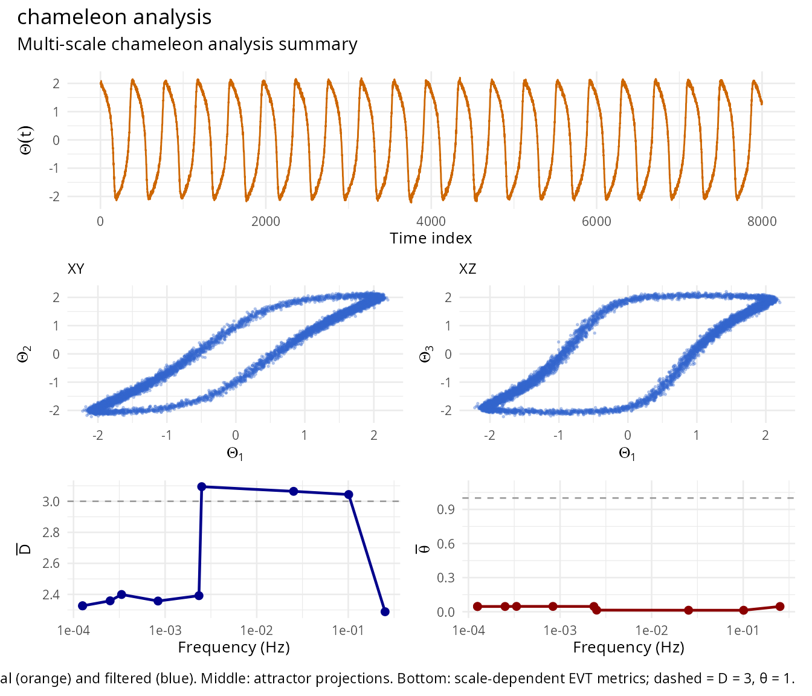

### A.8 Duffing oscillator

``` r

set.seed(107)
n <- 10000
dt <- 0.01
x <- y <- numeric(n)
x[1] <- 0.5; y[1] <- 0
alpha <- 1; beta <- 1; delta <- 0.3; gamma <- 0.37; omega <- 1.2  # Stable chaotic params

for (i in 2:n) {
  t_i <- i * dt
  x[i] <- x[i-1] + dt * y[i-1]
  y[i] <- y[i-1] + dt * (gamma * cos(omega * t_i) - delta * y[i-1] -
                          alpha * x[i-1] - beta * x[i-1]^3)
  # Prevent divergence
  if (abs(x[i]) > 10 || abs(y[i]) > 10) {
    x[i] <- x[i-1]
    y[i] <- y[i-1]
  }
}

x_duffing <- x + 0.05 * rnorm(n)
result_duffing <- chameleon_analysis(x_duffing, m = 3, tau = 10, verbose = FALSE)
test_duffing <- chameleon_test(result_duffing$scale_metrics, n_surrogates = 999, verbose = FALSE)

print(test_duffing)
#> 
#> Chameleon attractor test
#> ============================================================ 
#> Surrogates: 999 (scale_shuffle method)
#> Multiple testing correction: fisher
#> 
#> Test statistics:
#> ------------------------------------------------------------ 
#> Statistic         Observed  Null Mean    Null SD    p-value      d
#> ------------------------------------------------------------ 
#> D_trend              0.417      0.002      0.353     0.2640   1.18 
#> theta_trend         -0.817      0.000      0.344     0.0070  -2.37 **
#> ------------------------------------------------------------ 
#> Significance: *** p < 0.001, ** p < 0.01, * p < 0.05
#> 
#> Combined p-value (fisher): 0.0135
#> 
#> ============================================================ 
#> Conclusion: CHAMELEON ATTRACTOR DETECTED
#> Confidence: moderate
#> 
#> Interpretation:
#>   - theta decreases significantly with frequency
#>   - Effect sizes are large (|d| > 0.8)
#> 
#> Warnings:
#>   ⚠ P-value at lower limit of resolution. Consider increasing n_surrogates.
plot(result_duffing)
```

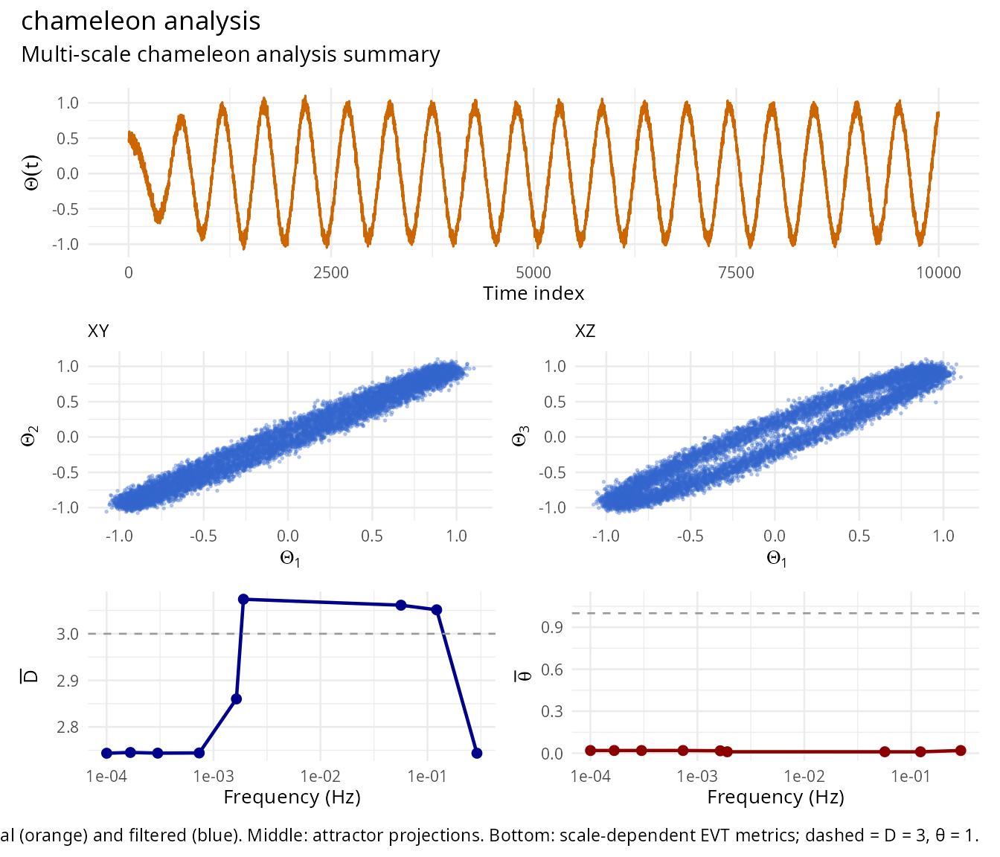

### A.9 Henon map

``` r

set.seed(108)
n <- 10000
x_h <- y_h <- numeric(n)
x_h[1] <- 0.1; y_h[1] <- 0.1
a <- 1.4; b <- 0.3

for (i in 2:n) {
  x_h[i] <- 1 - a * x_h[i-1]^2 + y_h[i-1]
  y_h[i] <- b * x_h[i-1]
  # Prevent divergence
  if (abs(x_h[i]) > 10) {
    x_h[i] <- x_h[i-1]
    y_h[i] <- y_h[i-1]
  }
}

result_henon <- chameleon_analysis(x_h, m = 3, tau = 1, verbose = FALSE)
test_henon <- chameleon_test(result_henon$scale_metrics, n_surrogates = 999, verbose = FALSE)

print(test_henon)
#> 
#> Chameleon attractor test
#> ============================================================ 
#> Surrogates: 999 (scale_shuffle method)
#> Multiple testing correction: fisher
#> 
#> Test statistics:
#> ------------------------------------------------------------ 
#> Statistic         Observed  Null Mean    Null SD    p-value      d
#> ------------------------------------------------------------ 
#> D_trend             -0.336     -0.018      0.318     0.3110  -1.00 
#> theta_trend          0.436     -0.016      0.314     0.1750   1.44 
#> ------------------------------------------------------------ 
#> Significance: *** p < 0.001, ** p < 0.01, * p < 0.05
#> 
#> Combined p-value (fisher): 0.2129
#> 
#> ============================================================ 
#> Conclusion: No chameleon behavior detected
#> Confidence: high
#> 
#> Interpretation:
#>   - Scale-dependent metrics do not vary significantly
#>   - Attractor properties appear uniform across frequency scales
#> 
#> Warnings:
#>   ⚠ P-value at lower limit of resolution. Consider increasing n_surrogates.
plot(result_henon)
```

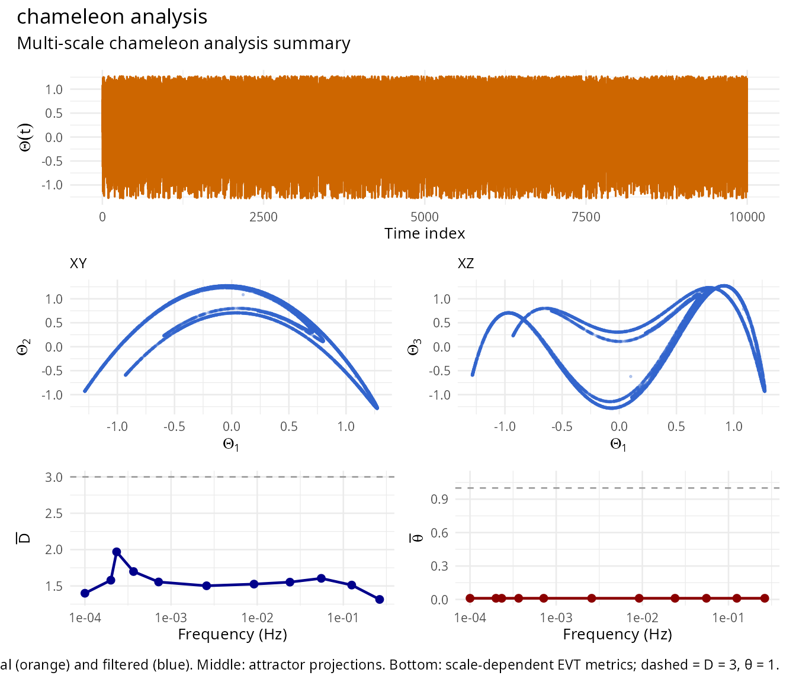

### A.10 Logistic map (edge of chaos)

``` r

set.seed(109)
n <- 10000
x <- numeric(n)
x[1] <- 0.1
r <- 3.9  # Edge of chaos

for (i in 2:n) {
  x[i] <- r * x[i-1] * (1 - x[i-1])
}

result_logistic <- chameleon_analysis(x, m = 3, tau = 1, verbose = FALSE)
test_logistic <- chameleon_test(result_logistic$scale_metrics, n_surrogates = 999, verbose = FALSE)

print(test_logistic)
#> 
#> Chameleon attractor test
#> ============================================================ 
#> Surrogates: 999 (scale_shuffle method)
#> Multiple testing correction: fisher
#> 
#> Test statistics:
#> ------------------------------------------------------------ 
#> Statistic         Observed  Null Mean    Null SD    p-value      d
#> ------------------------------------------------------------ 
#> D_trend             -0.580      0.003      0.326     0.0710  -1.79 
#> theta_trend         -0.479      0.014      0.311     0.1320  -1.59 
#> ------------------------------------------------------------ 
#> Significance: *** p < 0.001, ** p < 0.01, * p < 0.05
#> 
#> Combined p-value (fisher): 0.0531
#> 
#> ============================================================ 
#> Conclusion: No chameleon behavior detected
#> Confidence: low
#> 
#> Interpretation:
#>   - Scale-dependent metrics do not vary significantly
#>   - Attractor properties appear uniform across frequency scales
#> 
#> Warnings:
#>   ⚠ P-value at lower limit of resolution. Consider increasing n_surrogates.
plot(result_logistic)
```

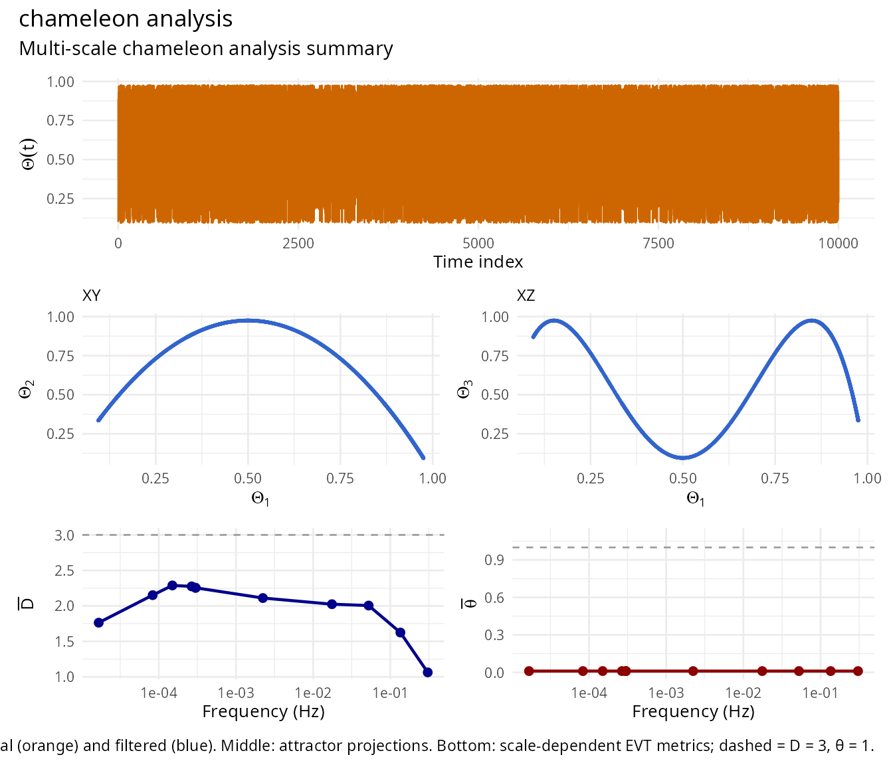

### A.11 Summary of synthetic signal tests

``` r

synthetic_summary <- data.frame(
  Signal = c("Gaussian noise", "AR(1)", "Sinusoid", "Multi-frequency",
             "Lorenz", "Rossler", "Van der Pol", "Duffing",
             "Henon", "Logistic"),
  Mean_D = c(result_noise$evt_metrics$mean_d,
             result_ar1$evt_metrics$mean_d,
             result_sine$evt_metrics$mean_d,
             result_multi$evt_metrics$mean_d,
             result_lorenz$evt_metrics$mean_d,
             result_rossler$evt_metrics$mean_d,
             result_vdp$evt_metrics$mean_d,
             result_duffing$evt_metrics$mean_d,
             result_henon$evt_metrics$mean_d,
             result_logistic$evt_metrics$mean_d),
  Mean_theta = c(result_noise$evt_metrics$mean_theta,
                 result_ar1$evt_metrics$mean_theta,
                 result_sine$evt_metrics$mean_theta,
                 result_multi$evt_metrics$mean_theta,
                 result_lorenz$evt_metrics$mean_theta,
                 result_rossler$evt_metrics$mean_theta,
                 result_vdp$evt_metrics$mean_theta,
                 result_duffing$evt_metrics$mean_theta,
                 result_henon$evt_metrics$mean_theta,
                 result_logistic$evt_metrics$mean_theta),
  p_value = c(test_noise$p_combined,
              test_ar1$p_combined,
              test_sine$p_combined,
              test_multi$p_combined,
              test_lorenz$p_combined,
              test_rossler$p_combined,
              test_vdp$p_combined,
              test_duffing$p_combined,
              test_henon$p_combined,
              test_logistic$p_combined),
  Conclusion = c(test_noise$conclusion,
                 test_ar1$conclusion,
                 test_sine$conclusion,
                 test_multi$conclusion,
                 test_lorenz$conclusion,
                 test_rossler$conclusion,
                 test_vdp$conclusion,
                 test_duffing$conclusion,
                 test_henon$conclusion,
                 test_logistic$conclusion)
)

kable(synthetic_summary, digits = 4,
      caption = "Summary of chameleon detection on synthetic signals")
```

| Signal          | Mean_D | Mean_theta | p_value | Conclusion    |
|:----------------|-------:|-----------:|--------:|:--------------|
| Gaussian noise  | 9.0307 |     0.0212 |  0.0256 | chameleon     |
| AR(1)           | 7.6557 |     0.0392 |  0.0436 | chameleon     |
| Sinusoid        | 3.5560 |     0.0319 |  0.7433 | non-chameleon |
| Multi-frequency | 3.0445 |     0.0301 |  0.3685 | non-chameleon |
| Lorenz          | 2.1563 |     0.0703 |  0.4278 | non-chameleon |
| Rossler         | 1.5220 |     0.0433 |  0.6545 | non-chameleon |
| Van der Pol     | 2.2884 |     0.0461 |  0.3401 | non-chameleon |
| Duffing         | 2.7436 |     0.0194 |  0.0135 | chameleon     |
| Henon           | 1.3130 |     0.0104 |  0.2129 | non-chameleon |
| Logistic        | 1.0029 |     0.0103 |  0.0531 | non-chameleon |

Summary of chameleon detection on synthetic signals {.table}

### A.12 Key observations

The A.11 table summarizes computed p-values and conclusions across the
ten synthetic signals. The following expected patterns are consistent
with the method’s theoretical premises.

**Pure stochastic signals** (noise, AR(1)) are not expected to show
chameleon behavior. Scale-invariant processes have no systematic
frequency dependence in \\\langle D \rangle\\ or \\\langle \theta
\rangle\\, so \\D\_{\mathrm{trend}}\\ and \\\theta\_{\mathrm{trend}}\\
should be near zero and p-values should be large.

**Simple deterministic systems** (sinusoid, limit cycles) may yield
borderline results. A pure sinusoid has a single dominant mode; MEMD
produces few IMFs, leaving little scale variation to detect. With added
noise the result depends on signal-to-noise ratio.

**Chaotic systems** (Lorenz, Rossler, Henon, Duffing) are expected to
yield variable results across runs, because their attractor
dimensionalities are intermediate and the short records used here
(2000-5000 points) give moderate MEMD resolution. Significance is not
guaranteed even for genuinely multiscale systems when the record is
short relative to the slowest dynamical timescale.

The general principle is that synthetic chameleon behavior is difficult
to demonstrate reliably at the record lengths used in this appendix,
because MEMD needs sufficient data to resolve all targeted frequency
scales. Real physical systems with complex multiscale structure and long
records (turbulence, climate indices) are the primary intended use case
[\[1\]](#ref1).

## References

**\[1\]** Alberti T, Daviaud F, Donner RV, Dubrulle B, Faranda D,
Lucarini V (2023). Chameleon attractors in turbulent flows. *Chaos,
Solitons and Fractals* 168:113195.
[doi:10.1016/j.chaos.2023.113195](https://doi.org/10.1016/j.chaos.2023.113195)

**\[2\]** Theiler J, Eubank S, Longtin A, Galdrikian B, Farmer JD
(1992). Testing for nonlinearity in time series: the method of surrogate
data. *Physica D* 58:77-94.
[doi:10.1016/0167-2789(92)90102-S](https://doi.org/10.1016/0167-2789(92)90102-S)

**\[3\]** Phipson B, Smyth GK (2010). Permutation p-values should never
be zero: calculating exact p-values when permutations are randomly
drawn. *Statistical Applications in Genetics and Molecular Biology*
9:Article 39.
[doi:10.2202/1544-6115.1585](https://doi.org/10.2202/1544-6115.1585)

**\[4\]** Cohen J (1988). *Statistical power analysis for the behavioral
sciences*. 2nd ed. Lawrence Erlbaum Associates.
[ISBN:978-0-8058-0283-2](https://www.routledge.com/Statistical-Power-Analysis-for-the-Behavioral-Sciences/Cohen/p/book/9780805802832)

**\[5\]** Fisher RA (1932). *Statistical methods for research workers*.
Oliver and Boyd, Edinburgh.
[ISBN:978-0-05-002170-5](https://archive.org/details/statisticalmethodsf00fish)

**\[6\]** Schreiber T, Schmitz A (1996). Improved surrogate data for
nonlinearity tests. *Physical Review Letters* 77:635-638.
[doi:10.1103/PhysRevLett.77.635](https://doi.org/10.1103/PhysRevLett.77.635)

**\[7\]** Lucarini V, Faranda D, Wouters J, Kuna T (2014). Towards a
general theory of extremes for observables of chaotic dynamical systems.
*Journal of Statistical Physics* 154:723-750.
[doi:10.1007/s10955-013-0914-6](https://doi.org/10.1007/s10955-013-0914-6)

**\[8\]** Faranda D, Messori G, Yiou P (2017). Dynamical proxies of
North Atlantic predictability and extremes. *Scientific Reports*
7:41278. [doi:10.1038/srep41278](https://doi.org/10.1038/srep41278)
