# Chameleon attractors: theory and embedding-EVT-MEMD framework

## 1. Introduction

A **chameleon attractor** is a strange attractor whose geometric and
topological properties vary dynamically across time and frequency scales
[\[1\]](#ref1). Unlike traditional attractors with fixed global
properties, chameleon attractors adapt their characteristics depending
on the observational scale, revealing fundamentally different dynamics
at different frequencies.

The **chameleon** package implements multiscale dynamical systems
analysis for detecting and characterizing chameleon attractors. The
methodology combines three theoretical pillars: **Takens embedding
theorem** for phase-space reconstruction [\[2\]](#ref2); **multivariate
empirical mode decomposition (MEMD)** for scale separation
[\[3\]](#ref3); and **extreme value theory (EVT)** for computing
instantaneous dynamical metrics [\[4\]](#ref4).

This vignette provides the complete mathematical theory underlying the
package, based on Alberti et al. (2023) [\[1\]](#ref1).

``` r

library(chamaeleon)
library(knitr)
```

## 2. Takens embedding

### 2.1 The embedding theorem

Given a univariate time series \\\Theta(t)\\ observed from a dynamical
system, Takens’ theorem (1981) [\[2\]](#ref2) guarantees that under
generic conditions, the original attractor can be reconstructed via a
delay embedding: \\\Theta(t) \rightarrow \mathbf{\Theta}\_{m,\Delta}(t)
= \left\[\Theta(t), \Theta(t-\Delta), \Theta(t-2\Delta), \ldots,
\Theta(t-(m-1)\Delta)\right\]^\top\\

where \\m\\ is the **embedding dimension** and \\\Delta\\ is the **time
delay** (in samples).

The theorem states that if the original system has attractor dimension
\\D\\, then choosing \\m \> 2D\\ guarantees a diffeomorphic
(topology-preserving) reconstruction.

### 2.2 Parameter estimation

**Time delay estimation** uses the autocorrelation function (ACF):
\\\Delta = \min\\k : \rho_k \< 0.5\\\\

where \\\rho_k = \mathrm{ACF}(k)\\ is the autocorrelation at lag \\k\\.
Alternative criteria include the first minimum of mutual information
[\[5\]](#ref5).

**Embedding dimension estimation** uses the false nearest neighbors
(FNN) method [\[6\]](#ref6). For dimension \\m\\, we find the nearest
neighbor of each point and check if it remains a neighbor in dimension
\\m+1\\. A false neighbor satisfies either: \\\frac{\|x\_{i+m\Delta} -
x\_{j+m\Delta}\|}{\\\mathbf{x}\_i^{(m)} - \mathbf{x}\_j^{(m)}\\} \>
R\_{\mathrm{tol}}\\

or \\\|x\_{i+m\Delta} - x\_{j+m\Delta}\| \> A\_{\mathrm{tol}} \cdot
\sigma_x\\

where \\R\_{\mathrm{tol}} \approx 15\\ and \\A\_{\mathrm{tol}} \approx
2\\ are tolerance parameters.

### 2.3 Example: Takens embedding with automatic parameter estimation

``` r

# Generate a quasi-periodic signal (torus-like attractor)
set.seed(42)
n <- 5000
dt <- 0.02
t <- seq(0, (n - 1) * dt, by = dt)

# Two incommensurate frequencies create a torus
x_torus <- sin(2 * pi * 0.5 * t) + 0.6 * sin(2 * pi * sqrt(2) * 0.5 * t) +
           0.1 * rnorm(n)

# Automatic parameter estimation
params <- estimate_embedding_params(x_torus, verbose = FALSE)
cat("Estimated parameters:\n")
#> Estimated parameters:
cat("  Embedding dimension m =", params$m, "\n")
#>   Embedding dimension m = 4
cat("  Time delay tau =", params$tau, "\n")
#>   Time delay tau = 15

# Perform embedding
embedded_torus <- takens_embed(x_torus, m = params$m, tau = params$tau)
```

### 2.4 Visualizing the reconstructed attractor

The [`plot()`](https://rdrr.io/r/graphics/plot.default.html) method for
`takens_embedding` objects creates interactive 3D visualizations using
plotly [\[1\]](#ref1):

``` r

# 3D visualization of the torus attractor
plot(embedded_torus, main = "Quasi-periodic attractor (torus)")
```

### 2.5 Example: Driven Duffing oscillator (two-lobe attractor)

The driven Duffing oscillator with a double-well potential creates a
chaotic attractor with two distinct lobes, similar to the asymmetric
turbulent states in [\[1\]](#ref1):

\\\ddot{x} + \delta \dot{x} - x + x^3 = \gamma \cos(\omega t)\\

``` r

# Driven Duffing oscillator: chaotic regime with two-lobe attractor
set.seed(123)
n <- 20000
dt <- 0.05
x <- y <- numeric(n)
x[1] <- 0.1; y[1] <- 0

# Parameters for chaotic two-lobe behavior
delta <- 0.25   # Damping
gamma <- 0.30   # Forcing amplitude
omega <- 1.0    # Forcing frequency

for (i in 2:n) {
  t_i <- i * dt
  # dx/dt = y
  # dy/dt = -delta*y + x - x^3 + gamma*cos(omega*t)
  x[i] <- x[i-1] + dt * y[i-1]
  y[i] <- y[i-1] + dt * (-delta * y[i-1] + x[i-1] - x[i-1]^3 +
                          gamma * cos(omega * t_i))
}

# Discard transient and add observation noise
x_duffing <- x[5001:n] + 0.05 * rnorm(length(5001:n))

# Embed with automatic parameter estimation
params_duff <- estimate_embedding_params(x_duffing, verbose = FALSE)
embedded_duffing <- takens_embed(x_duffing, m = 3, tau = params_duff$tau)

cat("Duffing oscillator embedding:\n")
#> Duffing oscillator embedding:
cat("  Estimated tau =", params_duff$tau, "\n")
#>   Estimated tau = 48
cat("  Using m = 3\n")
#>   Using m = 3

# Visualize the two-lobe structure
plot(embedded_duffing, main = "Two-lobe attractor (driven Duffing)")
```

### 2.6 Example: Lorenz system

``` r

# Generate Lorenz system dynamics
set.seed(456)
n <- 10000
dt <- 0.01

# Lorenz parameters
sigma <- 10
rho <- 28
beta <- 8/3

# Initialize
x_l <- y_l <- z_l <- numeric(n)
x_l[1] <- 1
y_l[1] <- 1
z_l[1] <- 1

# Euler integration
for (i in 2:n) {
  x_l[i] <- x_l[i-1] + dt * sigma * (y_l[i-1] - x_l[i-1])
  y_l[i] <- y_l[i-1] + dt * (x_l[i-1] * (rho - z_l[i-1]) - y_l[i-1])
  z_l[i] <- z_l[i-1] + dt * (x_l[i-1] * y_l[i-1] - beta * z_l[i-1])
}

# Use x component with small observation noise
x_obs <- x_l + 0.3 * rnorm(n)

# Embed
embedded_chaotic <- takens_embed(x_obs, m = 3, tau = 10)
plot(embedded_chaotic, main = "Lorenz attractor reconstruction")
```

## 3. Multivariate empirical mode decomposition (MEMD)

### 3.1 EMD fundamentals

The empirical mode decomposition (EMD) [\[7\]](#ref7) decomposes a
signal into intrinsic mode functions (IMFs) through an iterative sifting
process. For a univariate signal \\x(t)\\: \\x(t) = \sum\_{k=1}^{N}
c_k(t) + r(t)\\

where each \\c_k(t)\\ is an IMF satisfying two conditions: the number of
extrema and zero crossings differ by at most one, and the mean of upper
and lower envelopes is zero at all points.

### 3.2 Multivariate extension (MEMD)

For a multivariate signal \\\mathbf{\Theta}\_\mu(t) \in \mathbb{R}^p\\,
MEMD [\[3\]](#ref3) projects the signal onto \\K\\ directions uniformly
distributed on the unit hypersphere: \\\\\mathbf{d}\_k\\\_{k=1}^{K}
\subset S^{p-1}\\

For each direction \\\mathbf{d}\_k\\, the algorithm proceeds as follows:
project \\p_k(t) = \langle \mathbf{\Theta}\_\mu(t), \mathbf{d}\_k
\rangle\\; find local extrema of \\p_k(t)\\; compute upper envelope
\\U_k(t)\\ through maxima via cubic spline; and compute lower envelope
\\L_k(t)\\ through minima via cubic spline.

The mean envelope is: \\\mathbf{M}\_\mu(t) = \frac{1}{K} \sum\_{k=1}^{K}
\frac{U_k(t) + L_k(t)}{2} \cdot \mathbf{d}\_k\\

The sifting iteration is: \\\mathbf{H}\_\mu^{(n+1)}(t) =
\mathbf{H}\_\mu^{(n)}(t) - \mathbf{M}\_\mu(t)\\

starting from \\\mathbf{H}\_\mu^{(0)}(t) = \mathbf{\Theta}\_\mu(t)\\.
Iteration continues until the stopping criterion: \\\mathrm{NMSD} =
\frac{\sum_t \\\mathbf{H}\_\mu^{(n+1)}(t) -
\mathbf{H}\_\mu^{(n)}(t)\\^2}{\sum_t \\\mathbf{H}\_\mu^{(n)}(t)\\^2} \<
\epsilon\\

### 3.3 Mean timescale of MIMFs

Each multivariate IMF \\\mathbf{C}\_{\mu,k}(t)\\ has a characteristic
timescale: \\\tau_k = \frac{1}{N_p \Delta t} \int_0^{N_p \Delta t} t'
\langle \mathbf{C}\_{\mu,k}(t') \rangle\_\mu \\ dt'\\

and corresponding mean frequency \\f_k = 1/\tau_k\\.

### 3.4 Scale-dependent reconstruction

Partial sums provide scale-filtered signals: \\\mathbf{\Theta}\_\mu^f(t)
= \sum\_{k: f_k \> f^\*} \mathbf{C}\_{\mu,k}(t)\\

This contains only fluctuations at frequencies higher than the cutoff
\\f^\*\\.

### 3.5 Example: MEMD decomposition

``` r

# Create a multi-scale signal
set.seed(42)
n <- 3000
dt <- 0.01
t <- seq(0, (n-1) * dt, by = dt)

# Low frequency (slow dynamics)
x_low <- sin(2 * pi * 0.05 * t)
# Medium frequency
x_med <- 0.5 * sin(2 * pi * 0.5 * t)
# High frequency (fast dynamics)
x_high <- 0.2 * sin(2 * pi * 2 * t)
# Noise
x_noise <- 0.1 * rnorm(n)

# Combined signal
x_multi <- x_low + x_med + x_high + x_noise

# Embed the signal
embedded_multi <- takens_embed(x_multi, m = 3, tau = 10)

# Apply MEMD
decomp <- memd(embedded_multi, n_directions = 64, verbose = FALSE)
print(decomp)
#> Multivariate empirical mode decomposition
#>   Number of IMFs: 9
#>   Signal dimensions: 2980 x 3
#> 
#>   IMF frequencies (Hz):
#>     IMF 1: f = 0.2668 (T = 3.75)
#>     IMF 2: f = 0.1055 (T = 9.48)
#>     IMF 3: f = 0.0242 (T = 41.39)
#>     IMF 4: f = 0.0152 (T = 65.74)
#>     IMF 5: f = 0.0048 (T = 210.35)
#>     IMF 6: f = 0.0005 (T = 1986.67)
#>     IMF 7: f = 0.0005 (T = 1986.67)
#>     IMF 8: f = 0.0002 (T = 5960.00)
#>     IMF 9: f = 0.0000 (T = Inf)

# Display frequencies of extracted MIMFs
cat("\nMIMF frequencies (Hz):\n")
#> 
#> MIMF frequencies (Hz):
freq_table <- data.frame(
  MIMF = seq_along(decomp$frequencies),
  Frequency_Hz = round(decomp$frequencies, 4),
  Timescale_s = round(decomp$timescales, 2)
)
kable(freq_table)
```

| MIMF | Frequency_Hz | Timescale_s |
|-----:|-------------:|------------:|
|    1 |       0.2668 |        3.75 |
|    2 |       0.1055 |        9.48 |
|    3 |       0.0242 |       41.39 |
|    4 |       0.0152 |       65.74 |
|    5 |       0.0048 |      210.35 |
|    6 |       0.0005 |     1986.67 |
|    7 |       0.0005 |     1986.67 |
|    8 |       0.0002 |     5960.00 |
|    9 |       0.0000 |         Inf |

### 3.6 Visualizing MIMFs

The [`plot()`](https://rdrr.io/r/graphics/plot.default.html) method for
`memd` objects provides several visualization types:

``` r

# Visualize all extracted MIMFs as faceted time series
plot(decomp, type = "modes", dt = dt)
```

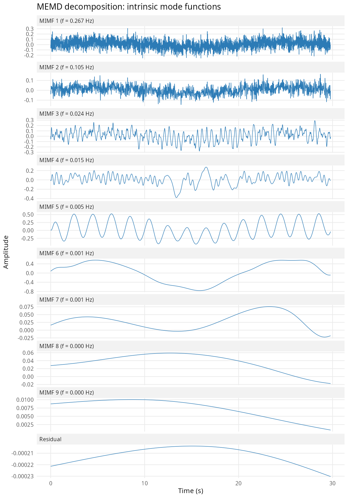

Each panel shows one MIMF ordered from highest to lowest frequency. The
bottom panel shows the residual (monotonic trend component).

### 3.7 Spectral analysis of MIMFs

``` r

# Power spectral density of each MIMF
plot(decomp, type = "spectrum", dt = dt)
```

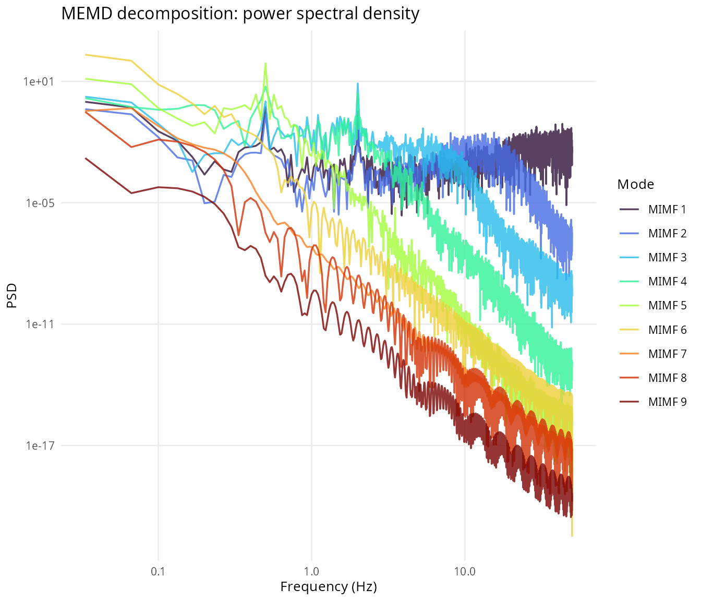

Well-separated modes should show distinct spectral peaks with minimal
overlap. This confirms that MEMD successfully decomposes the signal into
narrow-band components.

### 3.8 Signal reconstruction

``` r

# Progressive reconstruction by cumulative addition of modes
plot(decomp, type = "reconstruction")
```

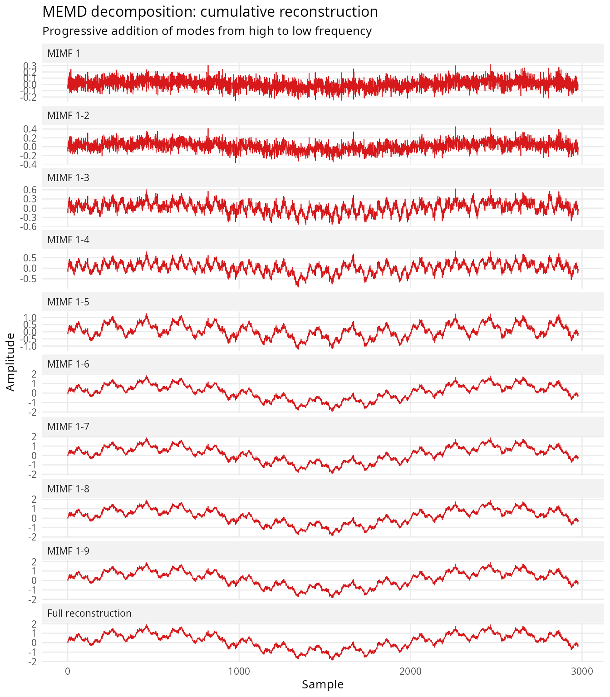

This shows how the original signal is progressively reconstructed by
cumulatively adding MIMFs from highest to lowest frequency. The final
reconstruction should closely match the original embedded signal.

### 3.9 Partial sums for scale-dependent analysis

The partial sums \\\mathbf{\Theta}\_\mu^f(t)\\ (equation 6) are computed
internally by
[`scale_dependent_metrics()`](https://robustecologies.github.io/chamaeleon/reference/scale_dependent_metrics.md)
during chameleon analysis. They represent the signal at frequencies
above each cutoff \\f^\*\\:

``` r

# The memd_partial_sums() function computes partial sums at each MIMF frequency
partial <- memd_partial_sums(decomp)

cat("Number of frequency cutoffs:", length(partial), "\n")
#> Number of frequency cutoffs: 9
cat("Cutoff frequencies (Hz):",
    paste(round(attr(partial, "freq_cutoffs"), 4), collapse = ", "), "\n")
#> Cutoff frequencies (Hz): 0.2668, 0.1055, 0.0242, 0.0152, 0.0048, 5e-04, 5e-04, 2e-04, 0
```

These partial sums are used to compute scale-dependent EVT metrics
\\D(f)\\ and \\\theta(f)\\ in section 5.

## 4. Extreme value theory metrics

### 4.1 Theoretical foundation

The dynamical properties of chaotic systems can be characterized using
extreme value theory [\[4\]](#ref4), [\[8\]](#ref8). For a reference
state \\\zeta^\*\\ in phase space, define the negative logarithmic
return: \\g(x(\zeta), \zeta^\*) = -\log\left\[\mathrm{dist}(x(\zeta),
\zeta^\*)\right\]\\

where \\\mathrm{dist}(\cdot, \cdot)\\ is typically the Euclidean
distance.

### 4.2 The Freitas-Freitas-Todd theorem

Let \\s(q, \zeta^\*)\\ be the \\q\\-th empirical percentile of
\\g(x(\zeta), \zeta^\*)\\. The exceedances: \\X(\zeta^\*) = g(x(\zeta),
\zeta^\*) - s(q, \zeta^\*)\\

follow a generalized Pareto distribution [\[9\]](#ref9): \\F(X,
\zeta^\*) \simeq \exp\left\[-\theta(\zeta^\*) \cdot X(\zeta^\*) \cdot
d(\zeta^\*)\right\]\\

where \\d(\zeta^\*)\\ is the **instantaneous (local) dimension** and
\\\theta(\zeta^\*)\\ is the **inverse persistence** (extremal index).

### 4.3 Interpretation of metrics

**Local dimension \\d\\** measures the number of active degrees of
freedom around state \\\zeta^\*\\: \\d\\ equals the fractal dimension
when averaged over the attractor; higher \\d\\ indicates more complex
local dynamics; and for a noisy fixed point, \\d \approx m\\ (embedding
dimension).

**Inverse persistence \\\theta\\** measures trajectory stability:
\\\theta = 1\\ indicates no persistence (stochastic/unpredictable);
\\\theta \< 1\\ indicates persistent dynamics (trajectory tends to stay
in region); and \\\theta \to 0\\ indicates very persistent dynamics
(fixed point or slow manifold).

### 4.4 GPD fitting

For exceedances \\X_1, \ldots, X_n \> 0\\, the scale parameter
\\\sigma\\ of the exponential GPD is estimated by maximum likelihood:
\\\hat{\sigma} = \frac{1}{n}\sum\_{i=1}^{n} X_i\\

The local dimension is then: \\\hat{d} = \frac{1}{\hat{\sigma}}\\

### 4.5 Extremal index estimation (Suveges method)

Let \\T_1, T_2, \ldots, T_n\\ be interexceedance times. The Suveges
estimator [\[10\]](#ref10) is: \\\hat{\theta} =
\frac{2\left(\sum\_{i=1}^{n}(T_i - 1)\right)^2}{(n -
N_C)\sum\_{i=1}^{n}(T_i - 1)(T_i - 2)}\\

where \\N_C\\ is the number of consecutive exceedances (\\T_i = 1\\).

### 4.6 Example: Computing EVT metrics

``` r

# Use the Duffing system from earlier
embedded_duff <- takens_embed(x_duffing[1:5000], m = 3, tau = 5)

# Compute EVT metrics
metrics <- evt_metrics(embedded_duff, q = 0.98, verbose = FALSE)
print(metrics)
#> EVT-based dynamical system metrics
#>   Trajectory: 4990 points, 3 dimensions
#>   Quantile: q = 0.980
#>   Distance metric: euclidean
#> 
#>   Summary statistics:
#>     Mean dimension: d = 2.672 (sd = 0.447)
#>     Mean persistence: θ = 0.049 (sd = 0.011)
```

### 4.7 Visualizing EVT metrics

``` r

# Time series of d(t) and theta(t)
plot(metrics, type = "timeseries")
```

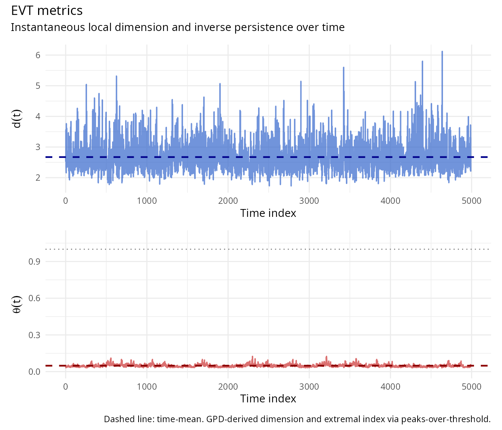

``` r

# Histograms
plot(metrics, type = "histogram")
```

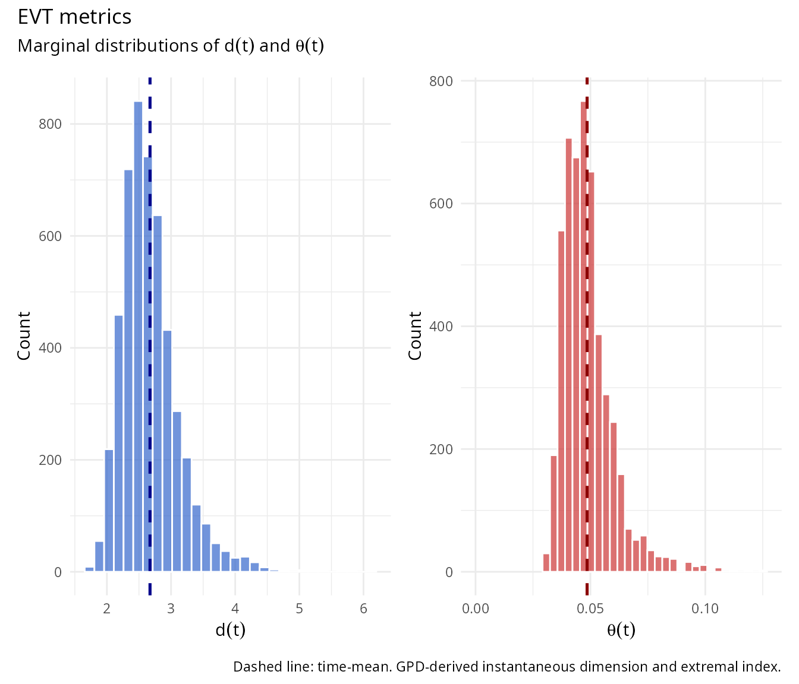

``` r

# Scatter plot of d vs theta
plot(metrics, type = "scatter")
```

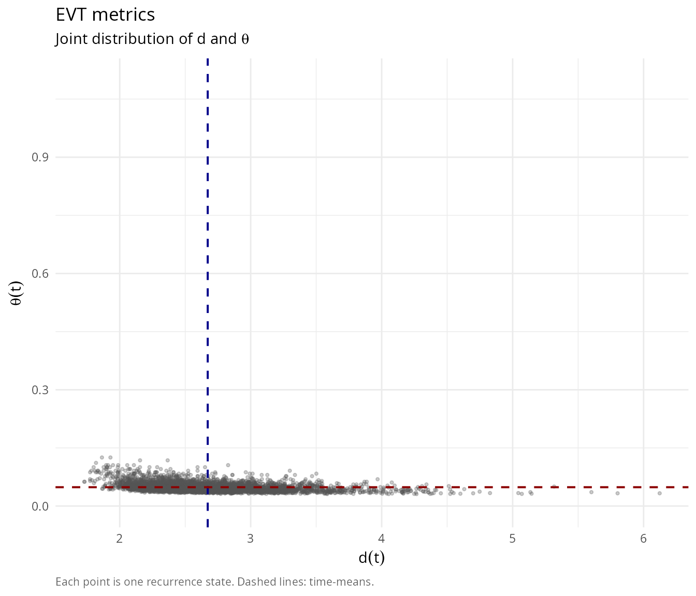

### 4.8 Coloring the attractor by EVT metrics

``` r

# Visualize attractor colored by instantaneous dimension
plot(embedded_duff, color_by = metrics$d, color_label = "D(t)",
     palette = "Viridis", main = "Attractor colored by local dimension")
```

``` r

# Visualize attractor colored by inverse persistence
plot(embedded_duff, color_by = metrics$theta, color_label = "\u03B8(t)",
     palette = "Hot", main = "Attractor colored by inverse persistence")
```

## 5. Scale-dependent metrics and chameleon detection

### 5.1 Definition and chameleon attractor detection

Combining MEMD with EVT, we define two scale-dependent metrics:
**scale-dependent dimension** (\\D(t, f)\\) and **scale-dependent
persistence** (\\\theta(t, f)\\). These are computed by reconstructing
\\\mathbf{\Theta}\_\mu^f(t)\\ for frequency cutoff \\f\\ and computing
EVT metrics on the reconstructed phase space.

### 5.2 Chameleon attractor detection

A chameleon attractor is characterized by significant variation in
\\\langle D(t,f) \rangle\\ and \\\langle \theta(t,f) \rangle\\ across
scales. In the symmetric/scale-invariant case, \\\langle D \rangle
\approx \mathrm{const}\\ and \\\langle \theta \rangle \approx 1\\ for
all \\f\\. In the chameleon case, there is strong \\f\\-dependence with
transitions between regimes: at high-\\f\\, stochastic behavior
dominates (\\\langle D \rangle \approx m\\, \\\langle \theta \rangle
\approx 1\\); at low-\\f\\, structured dynamics emerge (\\\langle D
\rangle \< m\\, \\\langle \theta \rangle \< 1\\).

### 5.3 Physical interpretation in turbulence

The scale-dependent metrics reveal the turbulent energy cascade
[\[1\]](#ref1): at large scales (low \\f\\), deterministic dynamics
driven by forcing mechanism predominate; at small scales (high \\f\\),
stochastic behavior from energy cascade emerges; and the transition
frequency marks the injection scale where nonlinear interactions
develop.

### 5.4 Example: Complete chameleon analysis

``` r

# Generate test signal with multiple scales
set.seed(42)
n <- 5000
dt <- 0.01
t <- seq(0, (n-1) * dt, by = dt)

# Create signal with scale-dependent structure
x_test <- sin(2 * pi * 0.1 * t) +           # Low frequency
          0.5 * sin(2 * pi * 1.0 * t) +     # Medium frequency
          0.2 * sin(2 * pi * 5.0 * t) +     # High frequency
          0.15 * rnorm(n)                    # Noise

# Run complete analysis
result <- chameleon_analysis(x_test, dt = dt, verbose = TRUE)
#> 
#> ⚙ CHAMELEON ATTRACTOR ANALYSIS
#>    Time series: n = 5000, dt = 0.01
#> -------------------------------------------------- 
#> ¡ Step 1: No filtering applied
#> ⏱ Step 2: Estimating embedding parameters
#>    Estimated: m = 4, tau = 127
#> ⏱ Step 3: Takens embedding (m = 4, tau = 127)
#>    Embedded dimensions: 4619 x 4
#> ⏱ Step 4: MEMD decomposition (64 directions)
#> ⚙ MEMD decomposition: n=4619, p=4, directions=64
#> 
#> ¡ Residual is monotonic, stopping at IMF 7
#>    Extracted 7 IMFs
#> ⏱ Step 5: EVT metrics on full attractor (q = 0.980)
#>    Mean dimension: <d> = 3.174
#>    Mean persistence: <θ> = 0.059
#> ⏱ Step 6: Scale-dependent metrics
#> ⚙ Computing scale-dependent metrics
#> ⏱ Step 2/2: EVT metrics at 7 frequency scales
#> ⏱ Step 7: Detecting chameleon behavior
#>    Dimension range: 0.711 (CV = 0.092)
#>    Persistence range: 0.033 (CV = 0.315)
#>    Dimension transition at f ~ 0.1013 Hz
#> -------------------------------------------------- 
#> ⚠ CHAMELEON BEHAVIOR DETECTED
```

### 5.5 Examining analysis results

``` r

print(result)
#> 
#> Chameleon Attractor Analysis Results
#> ======================================== 
#> 
#> Input data:
#>   Original series length: 5000
#> 
#> Embedding parameters:
#>   Dimension: m = 4
#>   Time delay: tau = 127
#>   Embedded trajectory: 4619 x 4
#> 
#> MEMD decomposition:
#>   Number of IMFs: 7
#>   Frequency range: [0.0003, 0.1013] Hz
#> 
#> Full attractor metrics:
#>   Mean dimension: <d> = 3.174 (sd = 0.651)
#>   Mean persistence: <θ> = 0.059 (sd = 0.017)
#> 
#> Chameleon detection:
#>   Status: CHAMELEON BEHAVIOR DETECTED
#>   Dimension variation: 0.711
#>   Persistence variation: 0.033
```

### 5.6 Scale-dependent metrics visualization

``` r

# Plot scale-dependent D(f) and theta(f)
plot(result$scale_metrics, show_ci = TRUE, reference_lines = TRUE)
```

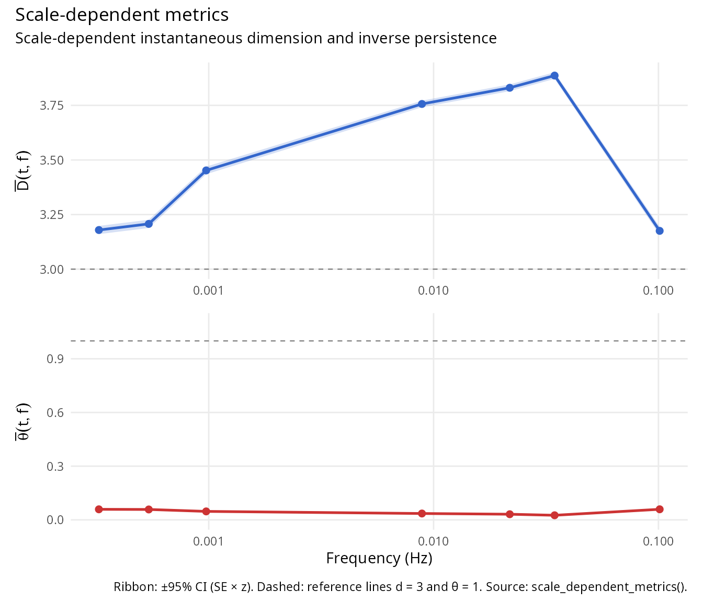

### 5.7 Complete analysis summary

``` r

# Multi-panel summary
plot(result)
```

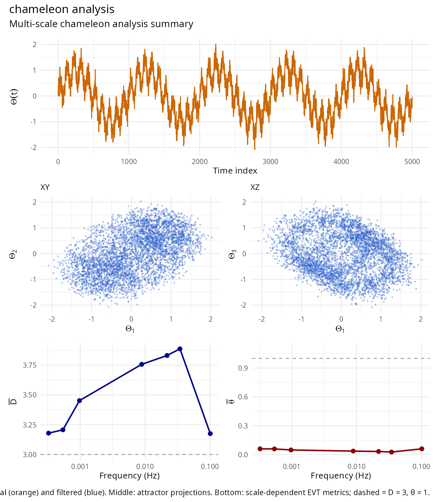

### 5.8 Interactive 3D visualization

``` r

# Interactive attractor colored by dimension
plot(result, interactive = TRUE)
```

## 6. Algorithm summary

The complete chameleon analysis follows this workflow:

    Algorithm: Chameleon attractor analysis
    ----------------------------------------
    Input: Time series x(t), parameters (m, tau, q)

    1. Takens embedding
       - Estimate m, tau if not provided (FNN, ACF methods)
       - Construct Theta_mu(t) in R^m

    2. MEMD decomposition
       - Generate K directions on S^{m-1}
       - For k = 1, 2, ..., N:
           - Sift to extract MIMF C_k(t)
           - Update residual
       - Compute frequencies f_k = 1/tau_k

    3. Full attractor metrics
       - Compute d(t), theta(t) for full Theta_mu(t)

    4. Scale-dependent metrics
       - For each frequency cutoff f*:
           - Reconstruct Theta^f_mu(t) from partial sums
           - Compute D(t,f), theta(t,f)

    5. Chameleon detection
       - Analyze variation of <D(t,f)>, <theta(t,f)> across f
       - Identify transition frequencies
       - Classify attractor type

    Output: Metrics, MEMD decomposition, chameleon indicator

## 7. Additional examples

### 7.1 Rossler-like system

``` r

# Simulate Rossler-like dynamics
set.seed(789)
n <- 8000
dt <- 0.05
x <- y <- z <- numeric(n)
x[1] <- 1; y[1] <- 1; z[1] <- 1
a <- 0.2; b <- 0.2; c <- 5.7

for (i in 2:n) {
  x[i] <- x[i-1] + dt * (-y[i-1] - z[i-1])
  y[i] <- y[i-1] + dt * (x[i-1] + a * y[i-1])
  z[i] <- z[i-1] + dt * (b + z[i-1] * (x[i-1] - c))
}

# Add observation noise and analyze
x_rossler <- x + 0.1 * rnorm(n)
result_rossler <- chameleon_analysis(x_rossler, m = 3, tau = 10,
                                      verbose = FALSE)
print(result_rossler)
#> 
#> Chameleon Attractor Analysis Results
#> ======================================== 
#> 
#> Input data:
#>   Original series length: 8000
#> 
#> Embedding parameters:
#>   Dimension: m = 3
#>   Time delay: tau = 10
#>   Embedded trajectory: 7980 x 3
#> 
#> MEMD decomposition:
#>   Number of IMFs: 10
#>   Frequency range: [0.0000, 0.2020] Hz
#> 
#> Full attractor metrics:
#>   Mean dimension: <d> = 1.544 (sd = 0.637)
#>   Mean persistence: <θ> = 0.054 (sd = 0.004)
#> 
#> Chameleon detection:
#>   Status: CHAMELEON BEHAVIOR DETECTED
#>   Dimension variation: 1.529
#>   Persistence variation: 0.045
plot(result_rossler)
```

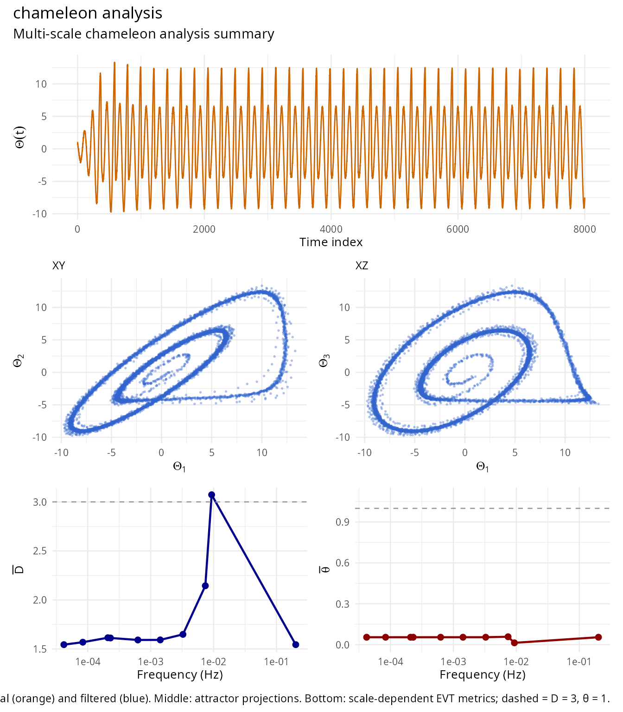

### 7.2 Van der Pol oscillator

``` r

# Van der Pol oscillator (limit cycle)
set.seed(321)
n <- 6000
dt <- 0.02
x <- y <- numeric(n)
x[1] <- 2; y[1] <- 0
mu <- 1.5

for (i in 2:n) {
  x[i] <- x[i-1] + dt * y[i-1]
  y[i] <- y[i-1] + dt * (mu * (1 - x[i-1]^2) * y[i-1] - x[i-1])
}

x_vdp <- x + 0.05 * rnorm(n)
result_vdp <- chameleon_analysis(x_vdp, m = 3, tau = 15, verbose = FALSE)
print(result_vdp)
#> 
#> Chameleon Attractor Analysis Results
#> ======================================== 
#> 
#> Input data:
#>   Original series length: 6000
#> 
#> Embedding parameters:
#>   Dimension: m = 3
#>   Time delay: tau = 15
#>   Embedded trajectory: 5970 x 3
#> 
#> MEMD decomposition:
#>   Number of IMFs: 8
#>   Frequency range: [0.0003, 0.2295] Hz
#> 
#> Full attractor metrics:
#>   Mean dimension: <d> = 2.254 (sd = 0.601)
#>   Mean persistence: <θ> = 0.063 (sd = 0.034)
#> 
#> Chameleon detection:
#>   Status: CHAMELEON BEHAVIOR DETECTED
#>   Dimension variation: 0.770
#>   Persistence variation: 0.047
plot(result_vdp)
```

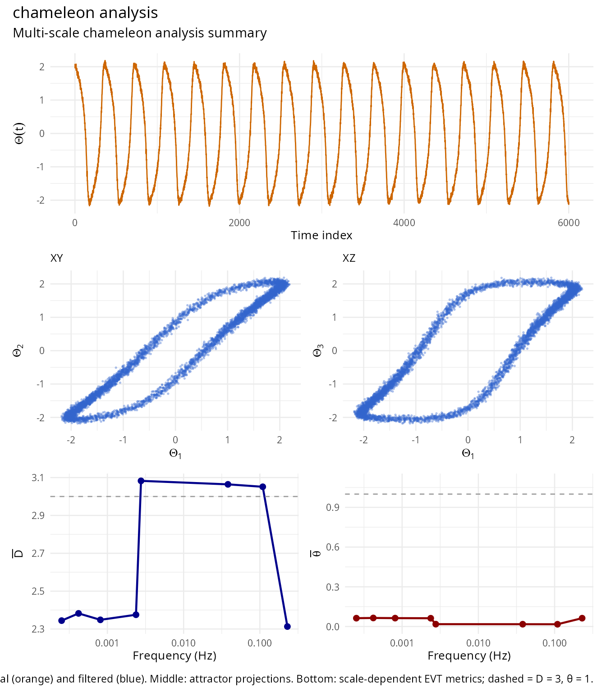

### 7.3 Henon map (discrete chaotic system)

``` r

# Henon map
set.seed(654)
n <- 8000
x_h <- y_h <- numeric(n)
x_h[1] <- 0.1; y_h[1] <- 0.1
a <- 1.4; b <- 0.3

for (i in 2:n) {
  x_h[i] <- 1 - a * x_h[i-1]^2 + y_h[i-1]
  y_h[i] <- b * x_h[i-1]
  # Prevent divergence
 if (abs(x_h[i]) > 10) {
    x_h[i] <- x_h[i-1]
    y_h[i] <- y_h[i-1]
  }
}

# Analyze x component (m=3 for 3D visualization compatibility)
result_henon <- chameleon_analysis(x_h, m = 3, tau = 1, verbose = FALSE)
print(result_henon)
#> 
#> Chameleon Attractor Analysis Results
#> ======================================== 
#> 
#> Input data:
#>   Original series length: 8000
#> 
#> Embedding parameters:
#>   Dimension: m = 3
#>   Time delay: tau = 1
#>   Embedded trajectory: 7998 x 3
#> 
#> MEMD decomposition:
#>   Number of IMFs: 11
#>   Frequency range: [0.0000, 0.2649] Hz
#> 
#> Full attractor metrics:
#>   Mean dimension: <d> = 1.313 (sd = 0.341)
#>   Mean persistence: <θ> = 0.013 (sd = 0.002)
#> 
#> Chameleon detection:
#>   Status: CHAMELEON BEHAVIOR DETECTED
#>   Dimension variation: 0.681
#>   Persistence variation: 0.000
plot(result_henon)
```

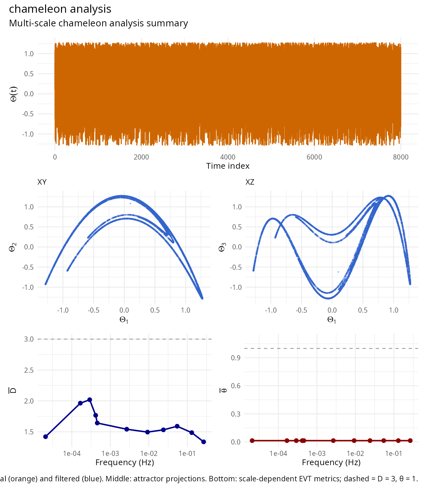

## 8. Caveats and limitations

### 8.1 Synthetic signals

The MEMD + EVT pipeline produces approximately constant \\D\\ across
scales for most synthetic signals because MEMD extracts MIMFs at
relatively low frequencies, high-frequency noise is not separated into
distinct IMFs, and EVT dimension reflects the stochastic component.

Generating synthetic data with genuine scale-dependent dynamics (true
chameleon behavior) is non-trivial. The method is designed for real
physical systems with complex multiscale structure.

### 8.2 Minimum data requirements

For reliable results, at least 2000 observations are recommended,
sampling rate must resolve dynamics of interest, and stationary or
weakly non-stationary data are preferred.

### 8.3 Parameter sensitivity

Results can be sensitive to embedding parameters (\\m\\, \\\tau\\), EVT
quantile (\\q\\), and number of MEMD directions.

The robustness checks in
[`chameleon_test()`](https://robustecologies.github.io/chamaeleon/reference/chameleon_test.md)
assess sensitivity to parameter choices.

## References

**\[1\]** Alberti T, Daviaud F, Donner RV, Dubrulle B, Faranda D,
Lucarini V (2023). Chameleon attractors in turbulent flows. *Chaos,
Solitons and Fractals* 168:113195.
[doi:10.1016/j.chaos.2023.113195](https://doi.org/10.1016/j.chaos.2023.113195)

**\[2\]** Takens F (1981). Detecting strange attractors in turbulence.
In: *Lecture Notes in Mathematics* 898. Springer.
[doi:10.1007/BFb0091924](https://doi.org/10.1007/BFb0091924)

**\[3\]** Rehman N, Mandic DP (2010). Multivariate empirical mode
decomposition. *Proceedings of the Royal Society A* 466:1291-1302.
[doi:10.1098/rspa.2009.0502](https://doi.org/10.1098/rspa.2009.0502)

**\[4\]** Lucarini V, Faranda D, de Freitas ACGMM, de Freitas JMM,
Holland M, Kuna T et al. (2016). *Extremes and recurrence in dynamical
systems*. Wiley.
[ISBN:978-1-118-63219-2](https://www.wiley.com/en-us/Extremes+and+Recurrence+in+Dynamical+Systems-p-9781118632192)

**\[5\]** Fraser AM, Swinney HL (1986). Independent coordinates for
strange attractors from mutual information. *Physical Review A* 33:1134.
[doi:10.1103/PhysRevA.33.1134](https://doi.org/10.1103/PhysRevA.33.1134)

**\[6\]** Kennel MB, Brown R, Abarbanel HDI (1992). Determining
embedding dimension for phase-space reconstruction using a geometrical
construction. *Physical Review A* 45:3403.
[doi:10.1103/PhysRevA.45.3403](https://doi.org/10.1103/PhysRevA.45.3403)

**\[7\]** Huang NE, Shen Z, Long SR, Wu MC, Shih HH, Zheng Q et
al. (1998). The empirical mode decomposition and the Hilbert spectrum
for nonlinear and non-stationary time series analysis. *Proceedings of
the Royal Society A* 454:903-995.
[doi:10.1098/rspa.1998.0193](https://doi.org/10.1098/rspa.1998.0193)

**\[8\]** Faranda D, Messori G, Yiou P (2017). Dynamical proxies of
North Atlantic predictability and extremes. *Scientific Reports*
7:41278. [doi:10.1038/srep41278](https://doi.org/10.1038/srep41278)

**\[9\]** Freitas ACM, Freitas JM, Todd M (2010). Hitting time
statistics and extreme value theory. *Probability Theory and Related
Fields* 147:675-710.
[doi:10.1007/s00440-009-0221-y](https://doi.org/10.1007/s00440-009-0221-y)

**\[10\]** Suveges M (2007). Likelihood estimation of the extremal
index. *Extremes* 10:41-55.
[doi:10.1007/s10687-007-0034-2](https://doi.org/10.1007/s10687-007-0034-2)

**\[11\]** Faranda D, Sato Y, Saint-Michel B, Wiertel C, Padilla V,
Dubrulle B, Daviaud F (2017). Stochastic chaos in a turbulent swirling
flow. *Physical Review Letters* 119:014502.
[doi:10.1103/PhysRevLett.119.014502](https://doi.org/10.1103/PhysRevLett.119.014502)

**\[12\]** Alberti T, Consolini G, Ditlevsen PD, Donner RV,
Quattrociocchi V (2020). Multiscale measures of phase-space
trajectories. *Chaos* 30:123116.
[doi:10.1063/5.0008916](https://doi.org/10.1063/5.0008916)
