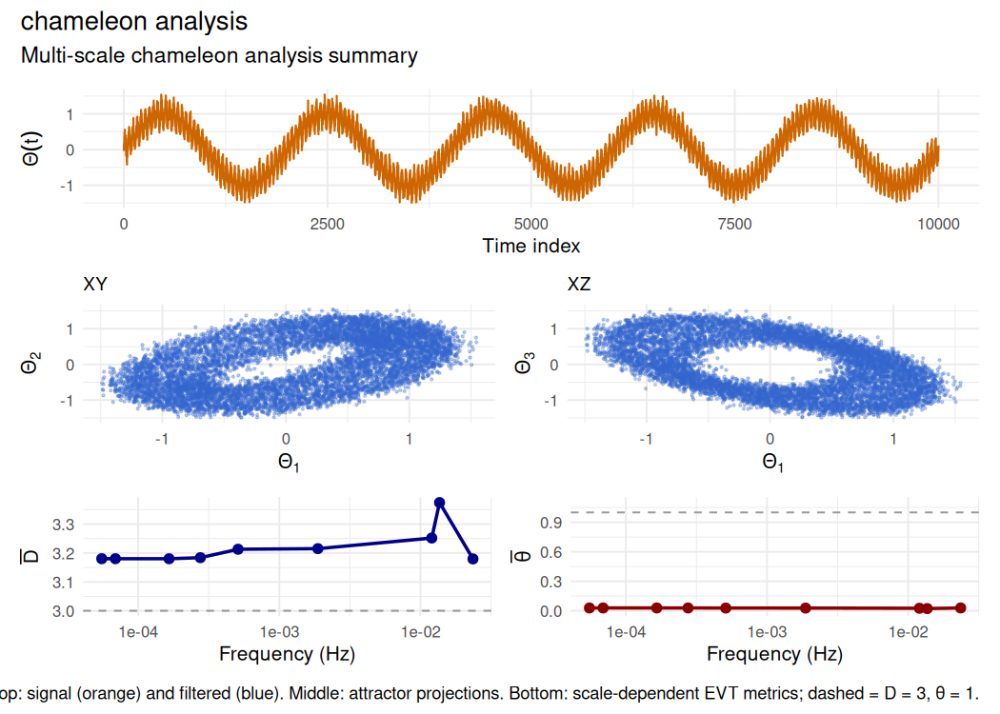
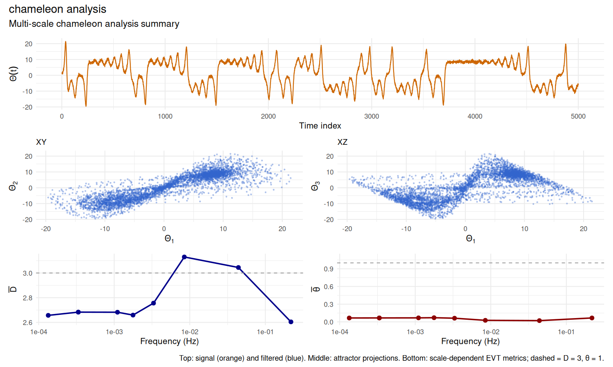

# chamaeleon [](https://robustecologies.github.io/chamaeleon)

[](https://github.com/robustecologies/chamaeleon/actions)
[](https://github.com/robustecologies/chamaeleon)
[](https://www.r-project.org/)
[](https://robustecologies.github.io/chamaeleon/reference/index.html)
[](https://robustecologies.github.io/chamaeleon/reference/index.html)
[](https://cran.r-project.org/package=Rcpp)
[](https://www.openmp.org/)
[](https://www.gnu.org/licenses/gpl-3.0)

## Multiscale analysis of chameleon behaviour in stochastic strange attractors

**chamaeleon** implements multiscale times-series analysis combining
Takens embedding, multivariate empirical mode decomposition (MEMD), and
extreme value theory (EVT) for non-stationary dynamical systems.
Computes scale-dependent instantaneous dimension and inverse persistence
to characterise **chameleon attractors**, a class of stochastic strange
attractors whose geometric and topological properties vary across time
and scales (Alberti et al. (2023) <doi:10.1016/j.chaos.2023.113195>).
Provides a novel surrogate-based statistical testing framework for
formal hypothesis testing of chameleon behaviour against scale-invariant
null models, including multiple test statistics, effect-size estimation
and non-stationary analysis.

  

## What is inside

| Layer | Components | Count |
|----|----|----|
| Phase-space reconstruction | `takens_embed`, `estimate_embedding_params` | 2 |
| Scale decomposition (MEMD) | `memd`, `memd_partial_sums` | 2 |
| Extreme-value metrics | `evt_metrics`, `scale_dependent_metrics` | 2 |
| Chameleon analysis and testing | `chameleon_analysis`, `chameleon_test`, `chameleon_test_nonstationary`, `generate_surrogates` | 4 |
| Visualization | `plot_trajectory_3d` | 1 |
| S3 classes (with print, summary, plot) | `takens_embedding`, `memd`, `evt_metrics`, `scale_metrics`, `chameleon_analysis`, `chameleon_test`, `chameleon_nonstationary` | 7 |

The package ships canonical-validation regression tests
(`tests/testthat/test-validation-canonical.R`) that pin the EVT
dimension on Lorenz-63, the MEMD mode count on a synthetic three-mode
signal, the chameleon-test p-value on a stationary sinusoid, and the
Takens reconstruction fidelity on Lorenz-63.

See
[`vignette("theory")`](https://robustecologies.github.io/chamaeleon/articles/theory.md)
for the mathematical foundations;
[`vignette("statistical-testing")`](https://robustecologies.github.io/chamaeleon/articles/statistical-testing.md)
for the surrogate-testing details;
[`vignette("api")`](https://robustecologies.github.io/chamaeleon/articles/api.md)
for the architecture map.

## Installation

``` r

# From CRAN (when available)
install.packages("chamaeleon")

# Development version from GitHub
remotes::install_github("robustecologies/chamaeleon")
```

### System requirements

- C++17 compiler with OpenMP support
- Armadillo library (automatically handled via RcppArmadillo)

## Theoretical background

### Phase-space reconstruction

Given a scalar time series \\\\\Theta(t)\\\\, Takens’ theorem guarantees
that the dynamics can be reconstructed in an \\m\\-dimensional embedding
space via delay coordinates:

\\\mathbf{x}(t) = \[\Theta(t), \Theta(t-\tau), \ldots,
\Theta(t-(m-1)\tau)\]^\top\\

where \\m\\ is the embedding dimension and \\\tau\\ the time delay. The
package estimates \\m\\ using false nearest neighbors (FNN) and \\\tau\\
from the autocorrelation function.

### Scale decomposition

MEMD decomposes the multivariate embedded trajectory into \\N\\
intrinsic mode functions (IMFs) ordered by decreasing frequency:

\\\mathbf{x}\_\mu(t) = \sum\_{k=1}^{N} \mathbf{C}\_{\mu,k}(t) +
\mathbf{R}\_\mu(t)\\

Partial sums reconstruct the dynamics at frequencies above a cutoff
\\f^\*\\:

\\\mathbf{x}^f\_\mu(t) = \sum\_{k: f_k \> f^\*} \mathbf{C}\_{\mu,k}(t)\\

### Instantaneous dynamical metrics

For a reference state \\\zeta^\*\\ on the attractor, the statistics of
close recurrences follow a generalized Pareto distribution. This yields
two EVT-derived metrics:

- **Local dimension** \\d(\zeta^\*)\\: The number of active degrees of
  freedom, corresponding to the scaling exponent of the recurrence
  probability.

- **Inverse persistence** \\\theta(\zeta^\*)\\: The extremal index
  measuring trajectory stability. Values \\\theta \approx 1\\ indicate
  stochastic-like behavior; \\\theta \< 1\\ indicates persistent
  dynamics near \\\zeta^\*\\.

### Chameleon attractors

An attractor exhibits chameleon behavior when \\\langle D \rangle_f\\ or
\\\langle \theta \rangle_f\\ vary systematically with the frequency
scale \\f\\. This indicates that the effective dimensionality or
persistence of the dynamics depends on the observation timescale.

## Quick start

``` r

library(chamaeleon)

# Generate test signal with multiple scales
set.seed(42)
t <- seq(0, 100, by = 0.01)
x <- sin(2*pi*0.05*t) +          # Low frequency
     0.3*sin(2*pi*2*t) +         # High frequency
     0.1*rnorm(length(t))        # Noise

# Complete chameleon analysis
result <- chameleon_analysis(x, verbose = TRUE)
#> 
#> ⚙ CHAMELEON ATTRACTOR ANALYSIS
#>    Time series: n = 10001, dt = 1
#> -------------------------------------------------- 
#> ¡ Step 1: No filtering applied
#> ⏱ Step 2: Estimating embedding parameters
#>    Estimated: m = 4, tau = 314
#> ⏱ Step 3: Takens embedding (m = 4, tau = 314)
#>    Embedded dimensions: 9059 x 4
#> ⏱ Step 4: MEMD decomposition (64 directions)
#> ⚙ MEMD decomposition: n=9059, p=4, directions=64
#> [===>                                    ]   6.7% (1/15) ETA: 1s[=====>                                  ]  13.3% (2/15) ETA: 1s[========>                               ]  20.0% (3/15) ETA: 1s[===========>                            ]  26.7% (4/15) ETA: 1s[=============>                          ]  33.3% (5/15) ETA: 1s[================>                       ]  40.0% (6/15) ETA: 0s[===================>                    ]  46.7% (7/15) ETA: 0s[=====================>                  ]  53.3% (8/15) ETA: 0s[========================>               ]  60.0% (9/15) ETA: 0s
#> ¡ Residual is monotonic, stopping at IMF 9
#> [========================================] 100.0% (15/15) ETA: 0s
#>    Extracted 9 IMFs
#> ⏱ Step 5: EVT metrics on full attractor (q = 0.980)
#>    Mean dimension: <d> = 3.180
#>    Mean persistence: <θ> = 0.029
#> ⏱ Step 6: Scale-dependent metrics
#> ⚙ Computing scale-dependent metrics
#> ⏱ Step 2/2: EVT metrics at 9 frequency scales
#> [====>                                   ]  11.1% (1/9) ETA: 3s[=========>                              ]  22.2% (2/9) ETA: 3s[=============>                          ]  33.3% (3/9) ETA: 3s[==================>                     ]  44.4% (4/9) ETA: 2s[======================>                 ]  55.6% (5/9) ETA: 2s[===========================>            ]  66.7% (6/9) ETA: 1s[===============================>        ]  77.8% (7/9) ETA: 1s[====================================>   ]  88.9% (8/9) ETA: 0s[========================================] 100.0% (9/9) ETA: 0s
#> ⏱ Step 7: Detecting chameleon behavior
#>    Dimension range: 0.195 (CV = 0.020)
#>    Persistence range: 0.006 (CV = 0.076)
#>    Dimension transition at f ~ 0.0137 Hz
#> -------------------------------------------------- 
#> ✔ Scale-invariant attractor
print(result)
#> 
#> Chameleon Attractor Analysis Results
#> ======================================== 
#> 
#> Input data:
#>   Original series length: 10001
#> 
#> Embedding parameters:
#>   Dimension: m = 4
#>   Time delay: tau = 314
#>   Embedded trajectory: 9059 x 4
#> 
#> MEMD decomposition:
#>   Number of IMFs: 9
#>   Frequency range: [0.0001, 0.0236] Hz
#> 
#> Full attractor metrics:
#>   Mean dimension: <d> = 3.180 (sd = 0.455)
#>   Mean persistence: <θ> = 0.029 (sd = 0.004)
#> 
#> Chameleon detection:
#>   Status: Scale-invariant attractor

# Visualize results
plot(result)
```



## Example: Lorenz system

The Lorenz attractor provides a canonical test case with known
low-dimensional structure.

``` r

# Simulate Lorenz system (simplified Euler integration)
set.seed(123)
n <- 5000
dt <- 0.01
x <- y <- z <- numeric(n)
x[1] <- 1; y[1] <- 1; z[1] <- 1
sigma <- 10; rho <- 28; beta <- 8/3

for (i in 2:n) {
  x[i] <- x[i-1] + dt * sigma * (y[i-1] - x[i-1])
  y[i] <- y[i-1] + dt * (x[i-1] * (rho - z[i-1]) - y[i-1])
  z[i] <- z[i-1] + dt * (x[i-1] * y[i-1] - beta * z[i-1])
}

# Add observation noise
x_obs <- x + 0.5 * rnorm(n)

# Chameleon analysis
result_lorenz <- chameleon_analysis(x_obs, m = 3, tau = 10, verbose = FALSE)
print(result_lorenz)
#> 
#> Chameleon Attractor Analysis Results
#> ======================================== 
#> 
#> Input data:
#>   Original series length: 5000
#> 
#> Embedding parameters:
#>   Dimension: m = 3
#>   Time delay: tau = 10
#>   Embedded trajectory: 4980 x 3
#> 
#> MEMD decomposition:
#>   Number of IMFs: 9
#>   Frequency range: [0.0001, 0.2183] Hz
#> 
#> Full attractor metrics:
#>   Mean dimension: <d> = 2.598 (sd = 0.509)
#>   Mean persistence: <θ> = 0.066 (sd = 0.028)
#> 
#> Chameleon detection:
#>   Status: CHAMELEON BEHAVIOR DETECTED
#>   Dimension variation: 0.525
#>   Persistence variation: 0.050
```

``` r

plot(result_lorenz)
```



## Statistical testing (original contribution)

The
[`chameleon_test()`](https://robustecologies.github.io/chamaeleon/reference/chameleon_test.md)
function provides formal hypothesis testing against the null of
scale-invariant dynamics. This statistical framework is an **original
contribution** of this package, extending the Alberti et al. methodology
with rigorous surrogate-based inference:

``` r

# Generate scale metrics for testing
# (Using a shorter synthetic series for speed)
set.seed(42)
test_signal <- arima.sim(n = 20000, model = list(ar = 0.7)) +
               sin(seq(0, 20*pi, length.out = 20000))

result_test <- chameleon_analysis(as.numeric(test_signal), verbose = FALSE)
test <- chameleon_test(result_test$scale_metrics, n_surrogates = 999,
                       verbose = FALSE)
print(test)
#> 
#> Chameleon attractor test
#> ============================================================ 
#> Surrogates: 999 (scale_shuffle method)
#> Multiple testing correction: fisher
#> 
#> Test statistics:
#> ------------------------------------------------------------ 
#> Statistic         Observed  Null Mean    Null SD    p-value      d
#> ------------------------------------------------------------ 
#> D_trend              0.697      0.003      0.336     0.0310   2.07 *
#> theta_trend         -0.539      0.005      0.330     0.0970  -1.65 
#> ------------------------------------------------------------ 
#> Significance: *** p < 0.001, ** p < 0.01, * p < 0.05
#> 
#> Combined p-value (fisher): 0.0205
#> 
#> ============================================================ 
#> Conclusion: CHAMELEON ATTRACTOR DETECTED
#> Confidence: moderate
#> 
#> Interpretation:
#>   - D increases significantly with frequency
#>   - Effect sizes are large (|d| > 0.8)
#> 
#> Warnings:
#>   ⚠ P-value at lower limit of resolution. Consider increasing n_surrogates.
```

## Main functions

| Function | Description |
|----|----|
| [`chameleon_analysis()`](https://robustecologies.github.io/chamaeleon/reference/chameleon_analysis.md) | Complete analysis workflow |
| [`takens_embed()`](https://robustecologies.github.io/chamaeleon/reference/takens_embed.md) | Takens time-delay embedding |
| [`memd()`](https://robustecologies.github.io/chamaeleon/reference/memd.md) | Multivariate empirical mode decomposition |
| [`evt_metrics()`](https://robustecologies.github.io/chamaeleon/reference/evt_metrics.md) | EVT-based dimension and persistence |
| [`scale_dependent_metrics()`](https://robustecologies.github.io/chamaeleon/reference/scale_dependent_metrics.md) | Scale-dependent D(t,f) and theta(t,f) |
| [`estimate_embedding_params()`](https://robustecologies.github.io/chamaeleon/reference/estimate_embedding_params.md) | Automatic m, tau estimation |
| [`chameleon_test()`](https://robustecologies.github.io/chamaeleon/reference/chameleon_test.md) | Surrogate-based hypothesis testing |
| [`chameleon_test_nonstationary()`](https://robustecologies.github.io/chamaeleon/reference/chameleon_test_nonstationary.md) | Sliding window analysis for non-stationary series |

## Performance

The C++/Rcpp implementation uses OpenMP parallelization for the most
expensive steps. Runtime grows roughly O(n^2) with trajectory length, so
subsampling is recommended for very long series. Key implementation
features include:

- Automatic CPU core detection for parallel computation
- Optimized distance calculations and GPD fitting

## References

Alberti T, Daviaud F, Donner RV, Dubrulle B, Faranda D, Lucarini V
(2023). “Chameleon attractors in turbulent flows.” *Chaos, Solitons and
Fractals*, 168, 113195. doi:
[10.1016/j.chaos.2023.113195](https://doi.org/10.1016/j.chaos.2023.113195)

Rehman N, Mandic DP (2010). “Multivariate empirical mode decomposition.”
*Proceedings of the Royal Society A*, 466(2117), 1291-1302. doi:
[10.1098/rspa.2009.0502](https://doi.org/10.1098/rspa.2009.0502)

Lucarini V, Faranda D, Wouters J, Kuna T (2014). “Towards a general
theory of extremes for observables of chaotic dynamical systems.”
*Journal of Statistical Physics*, 154(3), 723-750. doi:
[10.1007/s10955-013-0914-6](https://doi.org/10.1007/s10955-013-0914-6)

## License

GPL (\>= 3)

## Author

**Pablo Almaraz**
[](https://orcid.org/0000-0003-1416-2695)

[Robust Ecologies Lab](https://robustecologies.github.io)

## Disclaimer

This package is the original creation of the author in all conceptual,
theoretical, and design aspects. Implementation was assisted by
Anthropic’s Claude Code v.2 (Opus 4.5-4.7) to streamline package
development. All original ideas, creativity, and scientific
contributions belong to the author, who maintains full responsibility
for the package’s correctness and reliability. All the code has been
thoroughly tested, and users are encouraged to report any issues through
the package’s issue tracker.
