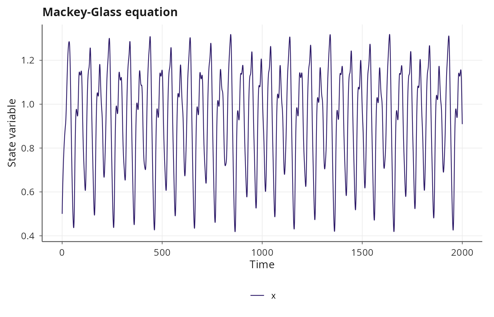
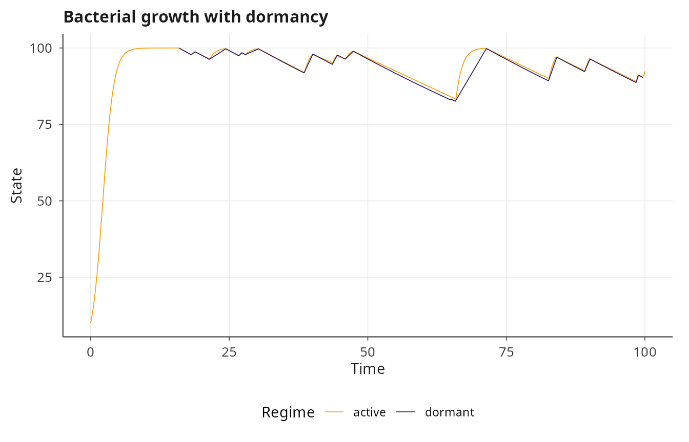
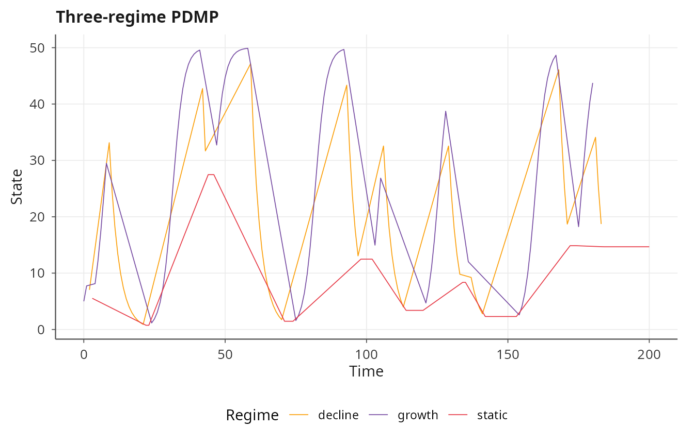
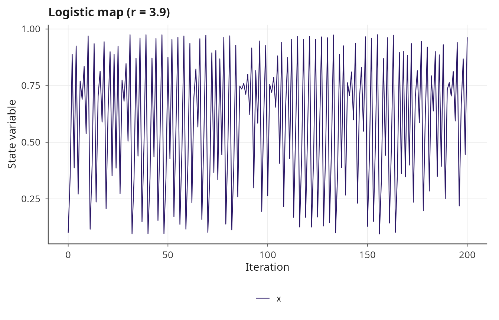
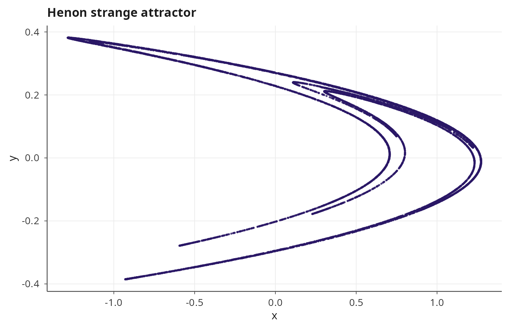
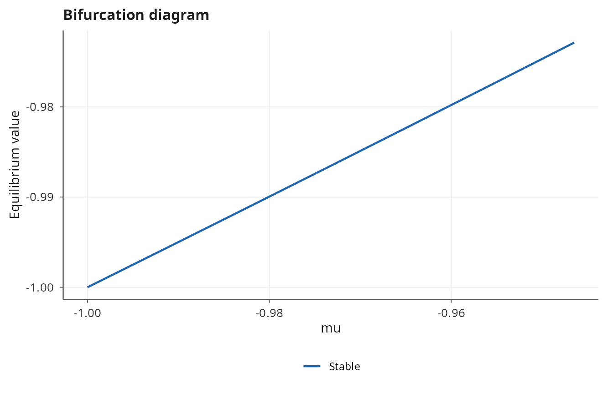
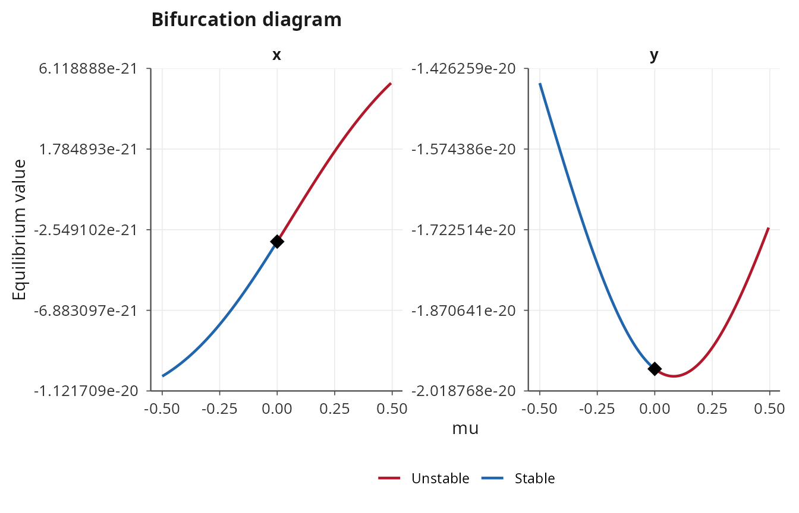
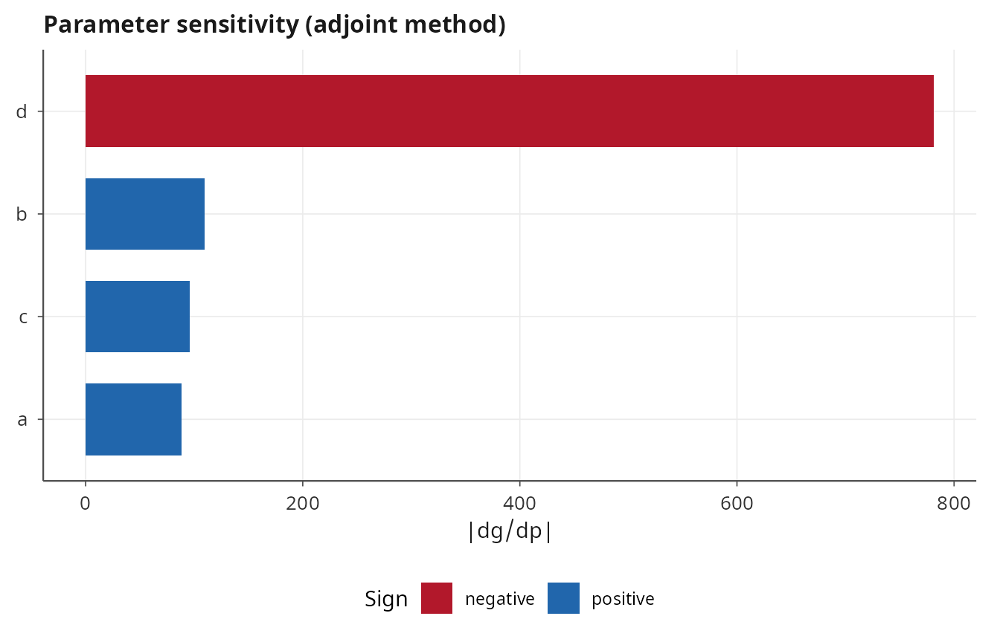

# Advanced dynamics: DDE, PDMP, maps, and analysis tools

## Overview

Beyond ODEs, CTMCs, SDEs, and PDEs, janos supports three further classes
of dynamics: delay differential equations (DDE) for systems with memory,
piecewise deterministic Markov processes (PDMP) for hybrid
continuous-discrete dynamics, and discrete-time maps for iterated
systems. This vignette demonstrates each of these model types and then
covers the analytical tools available for post-simulation investigation:
equilibrium finding, bifurcation continuation, and adjoint sensitivity
analysis.

``` r

library(janos)
```

## Delay differential equations

Delay differential equations incorporate dependence on past states,
\\\dot{x}(t) = f(x(t), x(t - \tau))\\, and arise naturally in population
dynamics (maturation delays), control theory (feedback latency), and
epidemiology (incubation periods). janos implements DDE integration via
RK4 with a circular history buffer and cubic Hermite interpolation for
evaluating the state at arbitrary past times.

### Mackey-Glass equation

The Mackey-Glass equation [\[1\]](#ref1) is a classical DDE that
exhibits a transition from limit cycles to chaos as the delay \\\tau\\
increases:

\\\dot{x}(t) = \frac{a \\ x(t - \tau)}{1 + x(t - \tau)^c} - b \\ x(t)\\

``` r

mg <- system_spec(
    rhs = list(x ~ a * x_delay / (1 + x_delay^c) - b * x),
    delays = list(x_delay = list(state = "x", tau = 17.0)),
    state_names = "x",
    parms = list(a = 0.2, b = 0.1, c = 10),
    init  = c(x = 0.5)
)

result_mg <- dyn_sim(mg, t_max = 2000, solver = solver_dde(dt = 0.1),
                     discard_transient = 500)
#> ⚙ Simulating DDE system (compiled DDE)
#>   ¡ Integration: RK4, dt = 0.1, τ_max = 17
#>   ¡ Duration: 2000, discarding 500 transient
#>   ⏱ Elapsed: 0.02 seconds
#> ✔ Simulation complete: 20001 time points, 15001 on attractor
print(result_mg)
#> 
#> Dynamical system simulation 
#> --------------------------- 
#> 
#> System type: autonomous
#> 
#> Solver: DDE (dt = 0.100)
#> Simulation: t_max = 2000.0, discarding 500.0 transient
#> Attractor points: 15001
#> 
#> State variables on attractor (mean ± sd):
#>   x:           0.9309 ± 0.2255
plot(result_mg, title = "Mackey-Glass equation")
```



The `delays` argument is a named list where each element specifies which
state variable is delayed and by how much. The delayed value is made
available as a new symbol (`x_delay`) in the RHS formulas, and the
compiler resolves it through the history buffer. Multiple delays on
different state variables or at different lag times are supported.

## Piecewise deterministic Markov processes

A PDMP [\[2\]](#ref2) evolves deterministically between random events
that switch the system between different dynamical regimes. The flow
within each regime is governed by its own ODE, while the transitions
between regimes are driven by inhomogeneous Poisson processes with
state-dependent rates. janos simulates PDMPs by integrating the current
regime with RK4 and using Lewis-Shedler thinning to determine when
transitions occur.

### Bacterial growth and dormancy

Consider a bacterial population that switches between active growth and
dormancy. In the active regime, the population grows logistically; in
the dormant regime, it decays slowly. The transition from active to
dormant increases with population density (a stress response), while the
transition back to active occurs at a constant rate.

``` r

bacteria <- system_spec(
    regimes = list(
        active  = list(N ~ r * N * (1 - N / K)),
        dormant = list(N ~ -d * N)
    ),
    transitions = list(
        list(from = "active",  to = "dormant", rate = ~ lambda_ad * N / K),
        list(from = "dormant", to = "active",  rate = ~ lambda_da)
    ),
    initial_regime = "active",
    state_names = "N",
    parms = list(r = 1.0, K = 100, d = 0.01,
                 lambda_ad = 0.5, lambda_da = 0.2),
    init  = c(N = 10)
)

result_pdmp <- dyn_sim(bacteria, t_max = 100,
                       solver = solver_pdmp(dt_ode = 0.01, output_dt = 0.1,
                                            seed = 42),
                       discard_transient = 0)
#> ⚙ Simulating PDMP system (PDMP, 2 regimes)
#>   ¡ dt_ode = 0.01, seed = 42
#>   ¡ Duration: 100, discarding 0 transient
#>   ¡ Initial regime: active
#>   ⏱ Elapsed: 3.44 seconds
#> ✔ Simulation complete: 1001 time points, 26 regime transitions
print(result_pdmp)
#> 
#> Dynamical system simulation 
#> --------------------------- 
#> 
#> System type: autonomous
#> 
#> Solver: PDMP (dt = 0.01)
#> Simulation: t_max = 100.0, discarding 0.0 transient
#> Attractor points: 1001
#> 
#> State variables on attractor (mean ± sd):
#>   N:           93.0035 ± 11.6415
plot(result_pdmp, title = "Bacterial growth with dormancy")
```



The output trajectory includes a `regime` column (character) indicating
which regime is active at each time point. The plot automatically
color-codes the trajectory by regime.

### Multi-regime PDMP

PDMPs are not limited to two regimes. Any number of regimes can be
defined, each with its own set of ODE formulas, and transitions can
connect any pair of regimes:

``` r

three_regime <- system_spec(
    regimes = list(
        growth  = list(x ~ a * x * (1 - x / K)),
        decline = list(x ~ -b * x),
        static  = list(x ~ 0)
    ),
    transitions = list(
        list(from = "growth",  to = "decline", rate = ~ r1),
        list(from = "decline", to = "static",  rate = ~ r2),
        list(from = "static",  to = "growth",  rate = ~ r3)
    ),
    initial_regime = "growth",
    state_names = "x",
    parms = list(a = 0.5, K = 50, b = 0.3, r1 = 0.1, r2 = 0.2, r3 = 0.15),
    init  = c(x = 5)
)

result_3r <- dyn_sim(three_regime, t_max = 200,
                     solver = solver_pdmp(dt_ode = 0.01, seed = 7),
                     discard_transient = 0)
#> ⚙ Simulating PDMP system (PDMP, 3 regimes)
#>   ¡ dt_ode = 0.01, seed = 7
#>   ¡ Duration: 200, discarding 0 transient
#>   ¡ Initial regime: growth
#>   ⏱ Elapsed: 3.42 seconds
#> ✔ Simulation complete: 201 time points, 29 regime transitions
plot(result_3r, title = "Three-regime PDMP")
```



## Discrete maps

Discrete-time iterated maps \\x\_{n+1} = F(x_n)\\ are a fundamental
object in dynamical systems theory, exhibiting period-doubling cascades,
strange attractors, and sensitive dependence on initial conditions in
low-dimensional settings. janos compiles map formulas to C++ and
iterates them with
[`solver_map()`](https://robustecologies.github.io/janos/reference/solver_map.md).

### Logistic map

The logistic map \\x\_{n+1} = r x_n (1 - x_n)\\ undergoes a
period-doubling route to chaos as \\r\\ increases toward 4:

``` r

logistic <- system_spec(
    map = list(x ~ r * x * (1 - x)),
    state_names = "x",
    parms = list(r = 3.9),
    init  = c(x = 0.1)
)

result_log <- dyn_sim(logistic, t_max = 200, solver = solver_map(),
                      discard_transient = 50)
#> ⚙ Iterating Discrete map (compiled)
#>   ¡ Iterations: 200, discarding 50 transient
#>   ⏱ Elapsed: 0.01 seconds
#> ✔ Simulation complete: 201 iterations stored, 151 on attractor
print(result_log)
#> 
#> Dynamical system simulation 
#> --------------------------- 
#> 
#> System type: autonomous
#> 
#> Solver: MAP (discrete iteration)
#> Simulation: 200 iterations, discarding 50 transient
#> Attractor points: 151
#> 
#> State variables on attractor (mean ± sd):
#>   x:           0.6000 ± 0.2966
plot(result_log, title = "Logistic map (r = 3.9)")
```



The `t_max` argument for maps specifies the number of iterations (not
continuous time), and `discard_transient` removes the initial iterations
before the attractor is reached.

### Henon map

The Henon map is a two-dimensional invertible map that produces one of
the most studied strange attractors:

\\x\_{n+1} = 1 - a x_n^2 + y_n, \quad y\_{n+1} = b x_n\\

``` r

henon <- system_spec(
    map = list(
        x ~ 1 - a * x^2 + y,
        y ~ b * x
    ),
    state_names = c("x", "y"),
    parms = list(a = 1.4, b = 0.3),
    init  = c(x = 0, y = 0)
)

result_henon <- dyn_sim(henon, t_max = 10000, solver = solver_map(),
                        discard_transient = 1000)
#> ⚙ Iterating Discrete map (compiled)
#>   ¡ Iterations: 10000, discarding 1000 transient
#>   ⏱ Elapsed: 0.01 seconds
#> ✔ Simulation complete: 10001 iterations stored, 9001 on attractor
plot(result_henon, type = "phase", title = "Henon strange attractor")
```



All states are updated simultaneously, which is the correct semantics
for maps (the new \\x\\ and new \\y\\ are computed from the old values,
not sequentially).

## Equilibrium finding

The
[`equilibrium()`](https://robustecologies.github.io/janos/reference/equilibrium.md)
function locates steady states \\f(y^\*, p) = 0\\ of an ODE system using
Newton’s method with the symbolically compiled Jacobian. The equilibrium
is classified by the eigenvalues of the Jacobian evaluated at the fixed
point: stable nodes, unstable nodes, saddle points, stable foci,
unstable foci, and centers.

``` r

lv <- system_spec(
    rhs = list(x ~ a * x - b * x * y, y ~ d * x * y - c * y),
    state_names = c("x", "y"),
    parms = list(a = 1.0, b = 0.1, d = 0.075, c = 1.5),
    init  = c(x = 20, y = 10)
)

eq <- equilibrium(lv)
print(eq)
#> 
#> Equilibrium point
#> ---------------------------------------- 
#> 
#> State:
#>   x          =    20.000000
#>   y          =    10.000000
#> 
#> Classification: center
#> Stable: FALSE
#> Residual: 0.00e+00
#> Newton iterations: 0
#> 
#> Eigenvalues:
#>   lambda_1 = 0.000000 + 1.224745i
#>   lambda_2 = 0.000000 - 1.224745i
summary(eq)
#> 
#> Summary: equilibrium point
#> ================================================== 
#> 
#> State:
#>   x          =  20.00000000
#>   y          =  10.00000000
#> 
#> Classification: center
#> Stable: FALSE
#> Residual: 0.00e+00
#> Jacobian condition number: 2.21e+00
#> 
#> Eigenvalue spectrum:
#>  index real imaginary modulus
#>      1    0   1.22474 1.22474
#>      2    0  -1.22474 1.22474
```

The `init_guess` argument can steer Newton’s method toward a particular
equilibrium when multiple fixed points exist. For the Lotka-Volterra
system the nontrivial equilibrium is a center (purely imaginary
eigenvalues), reflecting the conservative nature of the dynamics.

## Bifurcation continuation

Continuation traces how an equilibrium moves and changes stability as a
parameter varies, using the pseudo-arclength method [\[3\]](#ref3). The
algorithm starts from a known equilibrium and takes steps along the
solution branch in a combined state-parameter space, detecting fold
bifurcations (where the branch turns back) and Hopf bifurcations (where
a pair of complex eigenvalues crosses the imaginary axis).

``` r

# Two-dimensional system with a fold bifurcation
fold_model <- system_spec(
    rhs = list(x ~ mu + x^2),
    state_names = "x",
    parms = list(mu = -1),
    init  = c(x = 1)
)

# Find starting equilibrium at mu = -1
eq_start <- equilibrium(fold_model, init_guess = c(x = -1.5),
                         parms = list(mu = -1))

# Continue the branch from mu = -1 to mu = 1
bif <- continuation(fold_model, par_name = "mu", par_range = c(-1, 1),
                    init_eq = eq_start, ds = 0.01)
#> Continuation: mu in [-1, 1], ds = 0.01
#>   Corrector failed at step 7 (mu = -0.937593). Stopping.
#>   Completed: 7 points, 0 bifurcations
print(bif)
#> 
#> Bifurcation continuation
#> ---------------------------------------- 
#> 
#> Parameter: mu
#> Range: [-1, 1]
#> Actual range: [-1, -0.9465]
#> Step size: 0.01
#> Branch points: 7
#> Stable: 7, Unstable: 0
#> 
#> No bifurcations detected.
summary(bif)
#> 
#> Summary: bifurcation continuation
#> ================================================== 
#> 
#> Parameter: mu
#> Range traversed: [-1, -0.946483]
#> Branch points: 7
#> Fraction stable: 100.0%
#> 
#> State variable ranges along branch:
#>  variable min       max
#>         x  -1 -0.972873
#> 
#> Eigenvalue real-part ranges:
#>  eigenvalue min_re   max_re
#>    lambda_1     -2 -1.94575
plot(bif)
```



The continuation plot shows the equilibrium value of \\x\\ against the
parameter \\\mu\\, with stability indicated by line type and bifurcation
points marked. For the fold normal form \\\dot{x} = \mu + x^2\\, the
stable branch \\x = -\sqrt{-\mu}\\ exists for \\\mu \< 0\\ and
disappears via a saddle-node bifurcation at \\\mu = 0\\. The
pseudo-arclength algorithm traces the stable branch from the starting
equilibrium toward the fold point; near the fold, the Jacobian becomes
singular and the corrector may fail, so the branch may terminate before
reaching the exact bifurcation value.

### Hopf bifurcation detection

The continuation algorithm also detects Hopf bifurcations, which occur
when a pair of complex conjugate eigenvalues crosses the imaginary axis.
Consider a model with a supercritical Hopf bifurcation:

``` r

hopf_model <- system_spec(
    rhs = list(
        x ~ mu * x - y - x * (x^2 + y^2),
        y ~ x + mu * y - y * (x^2 + y^2)
    ),
    state_names = c("x", "y"),
    parms = list(mu = -0.5),
    init  = c(x = 0.1, y = 0.1)
)

eq_hopf <- equilibrium(hopf_model, parms = list(mu = -0.5))
bif_hopf <- continuation(hopf_model, par_name = "mu", par_range = c(-0.5, 0.5),
                         init_eq = eq_hopf, ds = 0.005)
#> Continuation: mu in [-0.5, 0.5], ds = 0.005
#>   step 100: mu = -0.005, stable = TRUE
#>   hopf bifurcation detected at mu = -3.05176e-07
#>   step 200: mu = 0.495, stable = FALSE
#>   Completed: 200 points, 1 bifurcations
plot(bif_hopf)
```



## Adjoint sensitivity analysis

For ODE models, the continuous adjoint method [\[4\]](#ref4) computes
the gradient of a scalar objective with respect to all model parameters
in a single backward integration, regardless of the number of
parameters. This is far more efficient than finite-difference
sensitivity analysis when the parameter dimension is large. The
[`adjoint_sensitivity()`](https://robustecologies.github.io/janos/reference/adjoint_sensitivity.md)
function performs a forward simulation to obtain the trajectory, then
integrates the adjoint equation backward in time using the Pontryagin
minimum principle.

``` r

lv <- system_spec(
    rhs = list(x ~ a * x - b * x * y, y ~ d * x * y - c * y),
    state_names = c("x", "y"),
    parms = list(a = 1.0, b = 0.1, d = 0.075, c = 1.5),
    init  = c(x = 40, y = 9)
)

sens <- adjoint_sensitivity(lv, objective = "terminal", t_max = 10)
#> ⚙ Adjoint sensitivity for ODE system
#>   ¡ Forward pass: RK45, t_max = 10
#>   ¡ Compiling adjoint solver (J^T + df/dp)
#>   ¡ Backward pass: RK4, 1000 checkpoints
#>   ⏱ Elapsed: 7.56 seconds
#> ✔ Sensitivity complete. Top: d = -781.4, b = 109.4, c = 95.84
print(sens)
#> 
#> Adjoint sensitivity analysis
#> ----------------------------
#> 
#> Objective value:  29.2305 
#> Duration: 10, 1000 checkpoints
#> 
#> Parameter gradients (dg/dp):
#>    a  =  88.0639  (elasticity:  3.013 )
#>    b  =  109.416  (elasticity:  0.374 )
#>    d  =  -781.387  (elasticity:  -2.005 )
#>    c  =  95.8441  (elasticity:  4.918 )
#> 
#> Elapsed:  7.56  seconds
summary(sens)
#> 
#> Adjoint sensitivity analysis (summary)
#> =======================================
#> 
#> Objective value:  29.2305 
#> Duration:  10 
#> Checkpoints:  1000 
#> States:  x, y 
#> Parameters:  4 
#> 
#> Parameter sensitivity table:
#>   Parameter              Value     Gradient   Elasticity
#> ------------------------------------------------------- 
#>   a                          1        88.06       3.0127
#>   b                        0.1        109.4       0.3743
#>   d                      0.075       -781.4      -2.0049
#>   c                        1.5        95.84       4.9184
#> 
#> Ranked by |gradient| (most sensitive first):
#>    d :  -781.4 
#>    b :  109.4 
#>    c :  95.84 
#>    a :  88.06 
#> 
#> Elapsed:  7.56  seconds
plot(sens)
```



The `objective = "terminal"` option computes the sensitivity of the
terminal state with respect to each parameter. The `sensitivity_result`
object contains the gradient vector and relative sensitivity (normalized
by parameter magnitude), which identifies which parameters most strongly
influence the outcome.

## References

**\[1\]** Mackey, M. C., & Glass, L. (1977). Oscillation and chaos in
physiological control systems. *Science*, 197(4300), 287-289.
[doi:10.1126/science.267326](https://doi.org/10.1126/science.267326)

**\[2\]** Davis, M. H. A. (1984). Piecewise-deterministic Markov
processes: a general class of non-diffusion stochastic models. *Journal
of the Royal Statistical Society: Series B*, 46(3), 353-388.
[doi:10.1111/j.2517-6161.1984.tb01308.x](https://doi.org/10.1111/j.2517-6161.1984.tb01308.x)

**\[3\]** Keller, H. B. (1977). Numerical solution of bifurcation and
nonlinear eigenvalue problems. In P. H. Rabinowitz (Ed.), *Applications
of Bifurcation Theory* (pp. 359-384). Academic Press. ISBN:
978-0-12-574650-5.

**\[4\]** Pontryagin, L. S., Boltyanskii, V. G., Gamkrelidze, R. V., &
Mishchenko, E. F. (1962). *The Mathematical Theory of Optimal
Processes*. Wiley. ISBN: 978-2-88124-077-5.
