# Chaotic dynamical systems in janos

  

## Introduction

A deterministic dynamical system is chaotic on a compact invariant set
when three conditions hold simultaneously: trajectories depend
sensitively on the initial condition, the flow is topologically
transitive, and periodic orbits are dense in the set. The first
condition is quantified by the existence of at least one positive
Lyapunov exponent; the second requires that almost every orbit
eventually visits every open subset; the third ensures that the set is
not a mere transient. The combined object is called a strange attractor
when, in addition, the invariant set is attracting and has non-integer
Hausdorff dimension. This vignette compiles the canonical collection of
low-dimensional strange attractors, together with a selection of
higher-dimensional, delay-induced, spatiotemporal and applied-science
examples, and integrates them through the unified
[`system_spec()`](https://robustecologies.github.io/janos/reference/system_spec.md)
interface of janos.

The text has two layers. The first layer is mathematical: each system is
introduced by its state equations, the parameter regime that certifies
chaos, and a short account of the bifurcation structure by which chaos
emerges. The second layer is computational: each system is translated
verbatim into a
[`system_spec()`](https://robustecologies.github.io/janos/reference/system_spec.md)
object, integrated by an appropriate solver, and analysed by the
chaos-analysis routines shipped with the package. Those routines include
the numerical Lyapunov spectrum via QR renormalisation of the
variational flow
([`lyapunov_spectrum()`](https://robustecologies.github.io/janos/reference/lyapunov_spectrum.md),
producing the full sorted spectrum plus the Kaplan-Yorke dimension), the
Grassberger-Procaccia correlation dimension
([`correlation_dimension()`](https://robustecologies.github.io/janos/reference/correlation_dimension.md)),
Poincare sections by bracket interpolation
([`poincare_section()`](https://robustecologies.github.io/janos/reference/poincare_section.md)),
the Gottwald-Melbourne test for chaos
([`zero_one_test()`](https://robustecologies.github.io/janos/reference/zero_one_test.md)),
attractor-level bifurcation diagrams by direct simulation in parallel,
optionally accompanied by the leading Lyapunov exponent at every scan
point
([`bifurcation_diagram()`](https://robustecologies.github.io/janos/reference/bifurcation_diagram.md)),
power-spectral diagnostics
([`spectral_analysis()`](https://robustecologies.github.io/janos/reference/spectral_analysis.md)),
equilibrium classification
([`equilibrium()`](https://robustecologies.github.io/janos/reference/equilibrium.md)),
equilibrium-branch continuation with Hopf and fold detection
([`continuation()`](https://robustecologies.github.io/janos/reference/continuation.md)),
phase portraits for ODE, DDE, SDE, PDMP and map systems
([`phase_portrait()`](https://robustecologies.github.io/janos/reference/phase_portrait.md),
[`dde_portrait()`](https://robustecologies.github.io/janos/reference/dde_portrait.md),
[`sde_portrait()`](https://robustecologies.github.io/janos/reference/sde_portrait.md),
[`pdmp_portrait()`](https://robustecologies.github.io/janos/reference/pdmp_portrait.md),
[`map_portrait()`](https://robustecologies.github.io/janos/reference/map_portrait.md)),
ensemble perturbation experiments
([`ensemble_sim()`](https://robustecologies.github.io/janos/reference/ensemble_sim.md)),
interactive time-series rendering via `plot.dyn_sim(type = "dygraph")`
and delay-coordinate reconstruction via
`plot.dyn_sim(type = "delay_embedding")`. The qualitative-analysis
vignette covers the portrait apparatus in depth; the ensemble-simulation
vignette covers the stochastic perturbations of these flows.

Three representational conventions of janos should be stated explicitly.
First, every continuous flow is expressed as an autonomous ODE: there is
no explicit time variable on the right-hand side, and forced oscillators
must introduce an auxiliary state with , so that a forcing term becomes
. Second, discrete-time maps are declared through the `map = list(...)`
slot and integrated by
[`solver_map()`](https://robustecologies.github.io/janos/reference/solver_map.md).
Third, delay-differential equations use the `delays = list(...)` slot;
the formula compiler interprets named delay symbols as lookups of past
state values on an adaptive interpolation mesh. The only reserved
formula symbols are `t` and `pi`. Arithmetic, the transcendental
functions `sin`, `cos`, `tan`, `exp`, `log`, `sqrt`, and the piecewise
primitives `abs` and `sign` are all admissible. A `positive_states`
argument selects, per state, whether the compiled integrator clamps the
component to non-negative values after each accepted step: the default
`FALSE` is correct for sign-free flows, whereas population densities on
a carrying simplex require `TRUE`.

  

## Classic chaotic flows

  

### The Lorenz system and the birth of the strange attractor

The Lorenz [\[1\]](#ref1) system was derived by truncating the
Rayleigh-Bénard convection equations of a fluid layer heated from below
to a three-dimensional Galerkin projection. Its three state variables
retain a physical meaning: is proportional to the convective overturn
rate, encodes the horizontal temperature gradient, and records the
vertical departure of the temperature profile from the linear conducting
solution. The equations read \\ \begin{aligned} \frac{d x}{d t} &=
\sigma (y - x) \\ \frac{d y}{d t} &= x (\rho - z) - y \\ \frac{d z}{d t}
&= x y - \beta z \end{aligned} \\ For the origin is a globally
attracting conductive equilibrium; at a pitchfork bifurcation creates
two symmetric roll equilibria , which lose stability through a
subcritical Hopf bifurcation at . The classical parameter choice places
the flow in the regime where trajectories are trapped on the
butterfly-shaped strange attractor. The largest Lyapunov exponent is ,
the Kaplan-Yorke dimension is approximately 2.06, and the correspondence
between Lorenz’s equations and the geometric Lorenz flow of Guckenheimer
and Williams [\[2\]](#ref2) was made rigorous by Tucker [\[3\]](#ref3).

``` r

lorenz <- system_spec(
    rhs = list(
        x ~ sigma * (y - x),
        y ~ x * (rho - z) - y,
        z ~ x * y - beta * z
    ),
    state_names = c("x", "y", "z"),
    parms = list(sigma = 10, rho = 28, beta = 8 / 3),
    init  = c(x = 1, y = 1, z = 1),
    meta  = list(name = "Lorenz")
)
lorenz_run <- dyn_sim(lorenz, t_max = 120, solver = solver_rk4(dt = 0.001),
                      discard_transient = 30, verbose = FALSE)
plot(lorenz_run, type = "timeseries", epsilon = 1e-6)
```

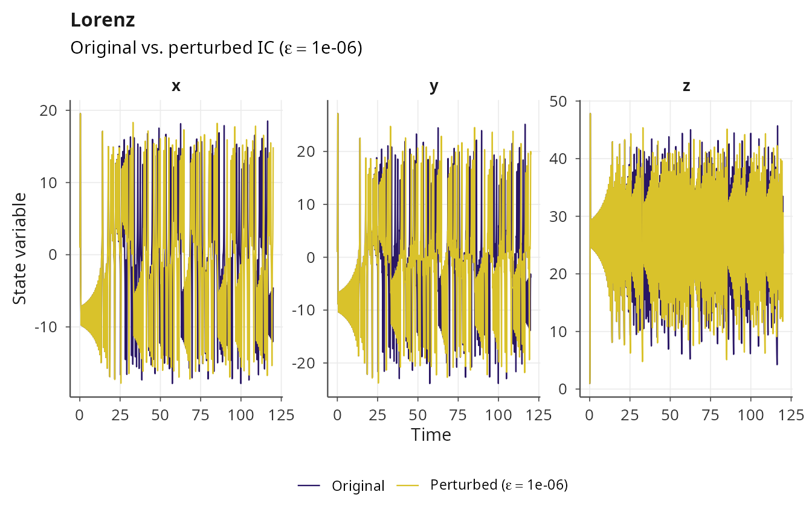

``` r

plot(lorenz_run, type = "attractor",  epsilon = 1e-6)
```

The butterfly emerges as two sheets glued along a one-dimensional
saddle. Starting two trajectories with a separation of is enough to see
them diverge on the order of ten time units, an operational
demonstration of sensitive dependence. The Lyapunov spectrum quantifies
it:

``` r

lsp <- lyapunov_spectrum(lorenz, t_max = 100, dt = 0.01,
                         renorm_interval = 1, discard_transient = 20,
                         verbose = FALSE)
print(lsp)
#> 
#> Lyapunov spectrum (ode)
#> --------------------------
#>   lambda_1 =    0.91345
#>   lambda_2 =   -0.01692
#>   lambda_3 =  -14.56310
#>   sum      =  -13.66656
#>   D_KY     =    2.06156
#>   Verdict: chaotic (1 positive exponent)
plot(lsp, type = "spectrum")
```

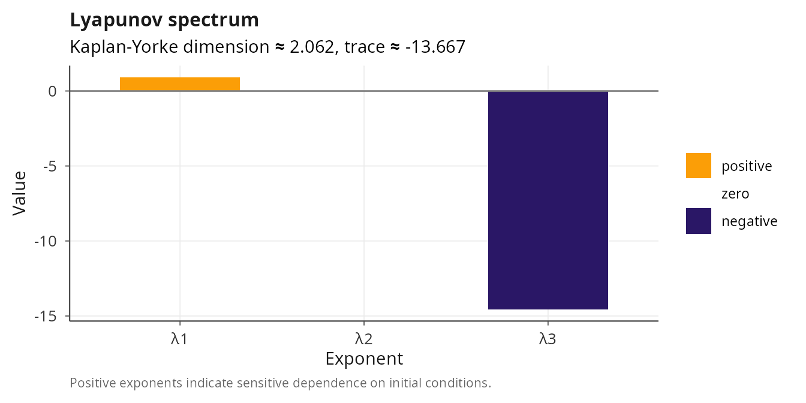

The triplet with is the numerical fingerprint of the attractor. A
Poincare section through the plane collapses the flow to a
one-dimensional map, the classical Lorenz cusp:

``` r

ps <- poincare_section(lorenz_run, var = "z", value = 27, direction = "up")
plot(ps, vars = c("x", "y"))
```

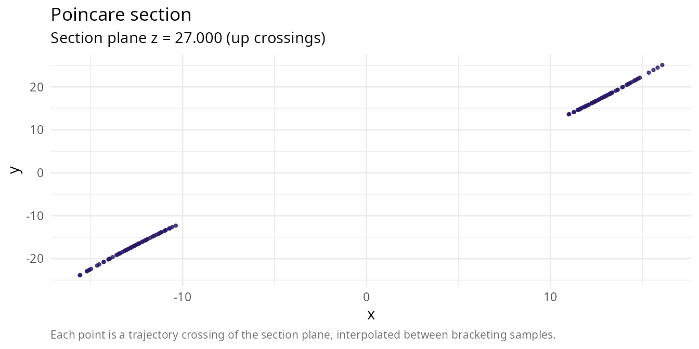

Power-spectral analysis confirms the broadband character of the chaotic
signal and the 0-1 test returns a value close to one:

``` r

sp <- spectral_analysis(lorenz_run)
plot(sp, type = "spectrum")
```

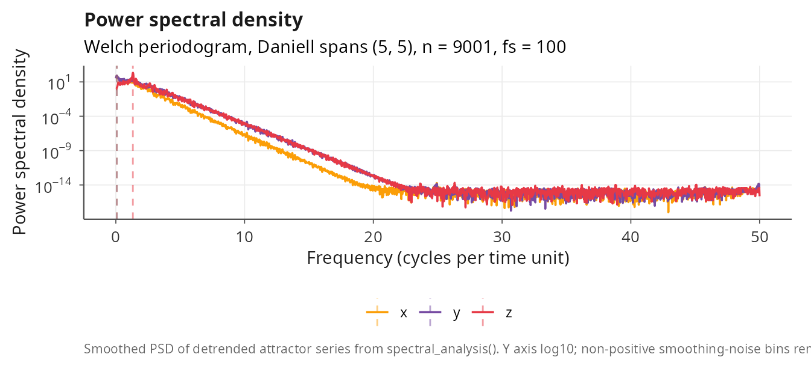

``` r

z01 <- zero_one_test(lorenz_run, var = "x")
print(z01)
#> 
#> 0-1 test for chaos
#> ------------------
#>   observable : x
#>   samples    : 501 (stride 18)
#>   n_c        : 100
#>   K (median) : 0.9986
#>   verdict    : chaotic
```

  

### Rössler: a minimal single-feedback flow

Otto Rössler designed his 1976 system [\[4\]](#ref4) to be the minimal
smooth three-dimensional ODE admitting a strange attractor. The system
has only one quadratic term, , and yet produces a folded band that
topologically supports the Smale horseshoe. \\ \begin{aligned} \frac{d
x}{d t} &= -y - z \\ \frac{d y}{d t} &= x + a y \\ \frac{d z}{d t} &=
b + z (x - c) \end{aligned} \\ The -plane carries an unstable focus
whose spiral growth is checked when becomes large enough to dominate the
third equation. Decreasing from seven to four traces a Feigenbaum
period-doubling cascade to chaos. The largest Lyapunov exponent at is
small, , and the Kaplan-Yorke dimension is close to two.

``` r

rossler <- system_spec(
    rhs = list(
        x ~ -y - z,
        y ~ x + a * y,
        z ~ b + z * (x - c)
    ),
    state_names = c("x", "y", "z"),
    parms = list(a = 0.2, b = 0.2, c = 5.7),
    init  = c(x = 1, y = 1, z = 1),
    meta  = list(name = "Rossler")
)
rossler_run <- dyn_sim(rossler, t_max = 800, solver = solver_rk4(dt = 0.001),
                       discard_transient = 100, verbose = FALSE)
plot(rossler_run, type = "timeseries", epsilon = 1e-6)
```

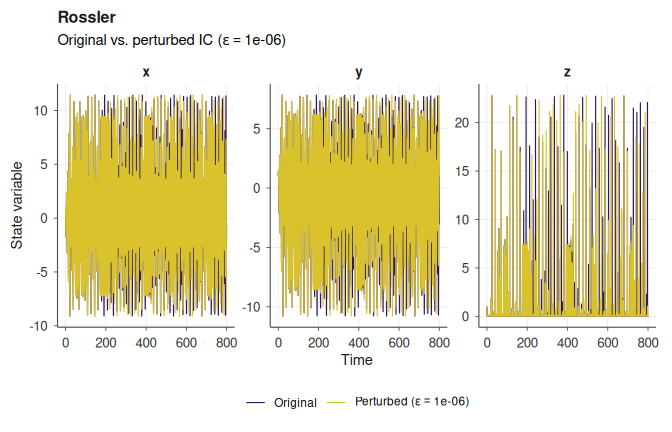

``` r

plot(rossler_run, type = "attractor",  epsilon = 1e-6)
```

The Feigenbaum cascade is the signature diagnostic and is easily
reproduced by sampling the local maxima of on the attractor as a
function of :

``` r

bd <- bifurcation_diagram(rossler, par_name = "c", par_range = c(2.5, 6),
                          observable = "x", n_par = 500,
                          t_max = 600, discard_transient = 200,
                          compute_lyapunov = TRUE,
                          lyap_kwargs = list(t_max = 300, dt = 0.02),
                          verbose = FALSE)
plot(bd)
```

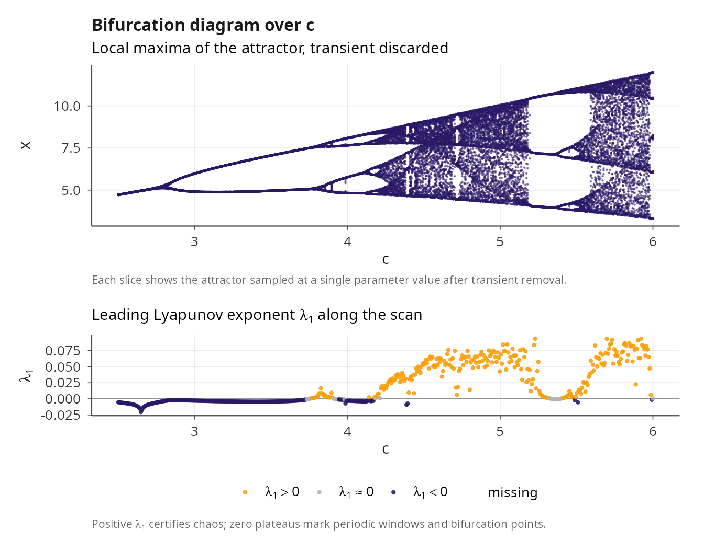

The period-one limit cycle near doubles around and sub-harmonically
cascades into a chaotic band before a periodic window interrupts the
sequence; the pattern matches the universal Feigenbaum scenario. The
Poincare return on is unimodal, as predicted by the topological
analysis:

``` r

ps_r <- poincare_section(rossler_run, var = "y", value = 0, direction = "up")
plot(ps_r, vars = c("x", "z"))
```

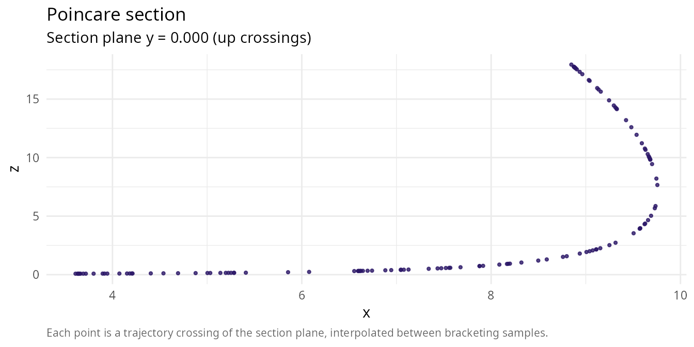

  

### Chua’s circuit

Chua’s circuit is the simplest electronic circuit that has been built,
measured and analysed mathematically to produce a strange attractor.
Leon Chua designed the system in 1983 [\[5\]](#ref5) around an inductor,
two capacitors, a linear resistor and a single nonlinear Chua diode
whose piecewise-linear characteristic makes the circuit tractable while
preserving the topological ingredients for chaos. Its phase portrait,
the double-scroll attractor, consists of two lobes glued across a saddle
separatrix, and the time series alternates unpredictably between orbits
winding around each focus. \\ \begin{aligned} \frac{d x}{d t} &= \alpha
\[y - x - f(x)\] \\ \frac{d y}{d t} &= x - y + z \\ \frac{d z}{d t} &=
-\beta y \end{aligned} \\ The nonlinearity is only at ; adaptive
Runge-Kutta methods tend to trap the step size at the prescribed minimum
near those corners, so we use a fixed-step RK4 here.

``` r

chua <- system_spec(
    rhs = list(
        x ~ alpha * (y - x - (m1 * x + 0.5 * (m0 - m1) *
                              (abs(x + 1) - abs(x - 1)))),
        y ~ x - y + z,
        z ~ -beta * y
    ),
    state_names = c("x", "y", "z"),
    parms = list(alpha = 15.6, beta = 28, m0 = -1.143, m1 = -0.714),
    init  = c(x = 0.1, y = 0, z = 0),
    meta  = list(name = "Chua double scroll")
)
chua_run <- dyn_sim(chua, t_max = 80, solver = solver_rk4(dt = 0.005),
                    discard_transient = 10, verbose = FALSE)
plot(chua_run, type = "timeseries", epsilon = 1e-6)
```

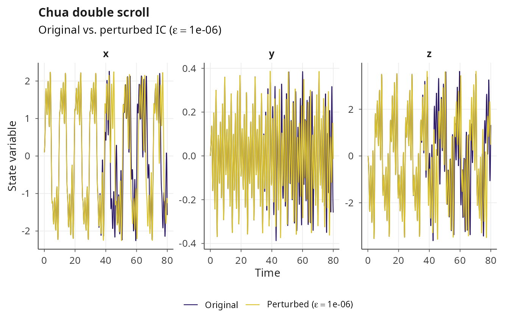

``` r

plot(chua_run, type = "attractor",  epsilon = 1e-6)
```

``` r

z01_chua <- zero_one_test(chua_run, var = "x")
print(z01_chua)
#> 
#> 0-1 test for chaos
#> ------------------
#>   observable : x
#>   samples    : 701 (stride 2)
#>   n_c        : 100
#>   K (median) : -0.0337
#>   verdict    : regular
```

  

### Chen and Lü: the Lorenz-Chen-Lü family

The Chen attractor [\[24\]](#ref24) and the Lü attractor
[\[25\]](#ref25) complete the classification of Vaněček and Čelikovský
[\[26\]](#ref26) of smooth three-dimensional quadratic systems whose
linear part has the structure (Lorenz), (Chen) or (Lü). All three are
topologically equivalent to suspensions of a branched one-dimensional
map, yet they are not diffeomorphic to each other; their coexistence is
central to modern work on chaos synchronisation and secure
communication.

Chen’s equations are \\ \begin{aligned} \frac{d x}{d t} &= a (y - x) \\
\frac{d y}{d t} &= (c - a) x - x z + c y \\ \frac{d z}{d t} &= x y - b z
\end{aligned} \\ with the canonical parameters :

``` r

chen <- system_spec(
    rhs = list(
        x ~ a * (y - x),
        y ~ (c - a) * x - x * z + c * y,
        z ~ x * y - b * z
    ),
    state_names = c("x", "y", "z"),
    parms = list(a = 35, b = 3, c = 28),
    init  = c(x = -10, y = 0, z = 37),
    meta  = list(name = "Chen")
)
chen_run <- dyn_sim(chen, t_max = 70, solver = solver_rk4(dt = 0.0005),
                    discard_transient = 10, verbose = FALSE)
plot(chen_run, type = "timeseries", epsilon = 1e-6)
```

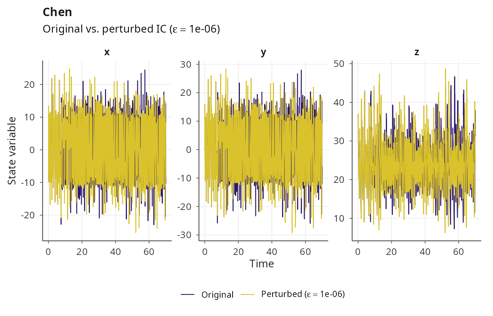

``` r

plot(chen_run, type = "attractor",  epsilon = 1e-6)
```

Lü’s equations interpolate between Lorenz and Chen and share the
double-scroll geometry with a narrower waist: \\ \begin{aligned} \frac{d
x}{d t} &= a (y - x) \\ \frac{d y}{d t} &= -x z + c y \\ \frac{d z}{d t}
&= x y - b z \end{aligned} \\

``` r

lu <- system_spec(
    rhs = list(
        x ~ a * (y - x),
        y ~ -x * z + c * y,
        z ~ x * y - b * z
    ),
    state_names = c("x", "y", "z"),
    parms = list(a = 36, b = 3, c = 20),
    init  = c(x = 0.1, y = 0.2, z = 0.3),
    meta  = list(name = "Lu")
)
lu_run <- dyn_sim(lu, t_max = 40, solver = solver_rk4(dt = 0.001),
                  discard_transient = 5, verbose = FALSE)
plot(lu_run, type = "timeseries", epsilon = 1e-6)
```

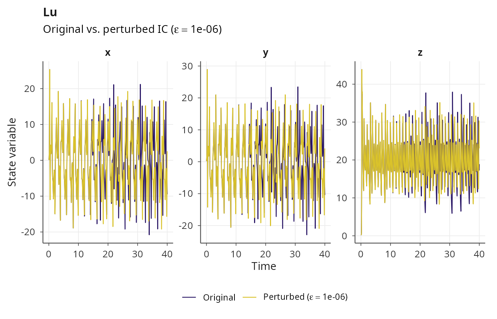

``` r

plot(lu_run, type = "attractor", epsilon = 1e-6)
```

``` r


lu_sp <- lyapunov_spectrum(lu, t_max = 80, dt = 0.01,
                            renorm_interval = 1, discard_transient = 10,
                            verbose = FALSE)
print(lu_sp)
#> 
#> Lyapunov spectrum (ode)
#> --------------------------
#>   lambda_1 =    1.46257
#>   lambda_2 =   -0.03342
#>   lambda_3 =  -20.42845
#>   sum      =  -18.99931
#>   D_KY     =    2.06996
#>   Verdict: chaotic (1 positive exponent)
plot(lu_sp)
```

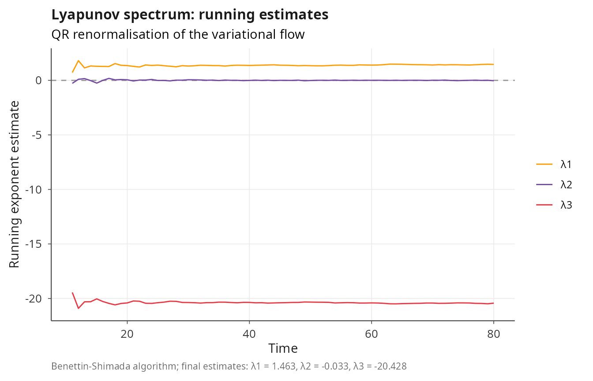

  

### Shimizu-Morioka: the simplified Lorenz

The Shimizu-Morioka system [\[27\]](#ref27) is a two-parameter reduction
of the Lorenz flow that preserves the symmetry and the same homoclinic
butterfly mechanism in a more tractable normal form, \\ \begin{aligned}
\frac{d x}{d t} &= y \\ \frac{d y}{d t} &= x - \lambda y - x z \\
\frac{d z}{d t} &= -\alpha z + x^2 \end{aligned} \\ For the system
exhibits a Lorenz-like strange attractor, and it is the preferred
starting point for mathematical proofs of existence of a robust strange
attractor through singular perturbation theory.

``` r

shimizu <- system_spec(
    rhs = list(
        x ~ y,
        y ~ x - lambda * y - x * z,
        z ~ -alpha * z + x^2
    ),
    state_names = c("x", "y", "z"),
    parms = list(alpha = 0.45, lambda = 0.75),
    init  = c(x = 0.1, y = 0.1, z = 0.1),
    meta  = list(name = "Shimizu-Morioka")
)
shimizu_run <- dyn_sim(shimizu, t_max = 500, solver = solver_rk4(),
                       discard_transient = 100, verbose = FALSE)
plot(shimizu_run, type = "timeseries", epsilon = 1e-6)
```

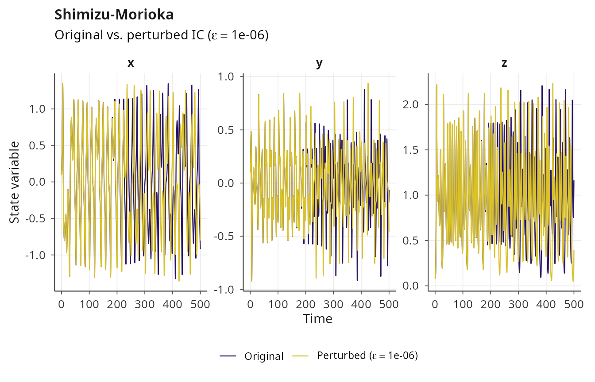

``` r

plot(shimizu_run, type = "attractor",  epsilon = 1e-6)
```

  

### Nosé-Hoover thermostat: conservative chaos

The Nosé-Hoover thermostat [\[28\]](#ref28) is a deterministic equation
of motion that samples the canonical (constant-temperature) ensemble of
statistical mechanics. For a single harmonic oscillator of unit mass and
frequency, the thermostatted dynamics reduce to \\ \begin{aligned}
\frac{d x}{d t} &= y \\ \frac{d y}{d t} &= -x - z y \\ \frac{d z}{d t}
&= y^2 - a \end{aligned} \\ where is the thermostat variable enforcing a
kinetic-energy constraint. The flow preserves an invariant of motion in
an extended phase space but is non-Hamiltonian; at it is chaotic, with
trajectories filling a three-dimensional conservative attractor rather
than the two-dimensional attractors of dissipative flows. The
time-average divergence is exactly zero, so the Lyapunov spectrum is
anti-symmetric around zero.

``` r

nose <- system_spec(
    rhs = list(
        x ~ y,
        y ~ -x - z * y,
        z ~ y^2 - a
    ),
    state_names = c("x", "y", "z"),
    parms = list(a = 1),
    init  = c(x = 0, y = 5, z = 0),
    meta  = list(name = "Nose-Hoover thermostat")
)
nose_run <- dyn_sim(nose, t_max = 400, solver = solver_rk4(dt = 0.001),
                    discard_transient = 50, verbose = FALSE)
plot(nose_run, type = "timeseries", epsilon = 1e-6)
```

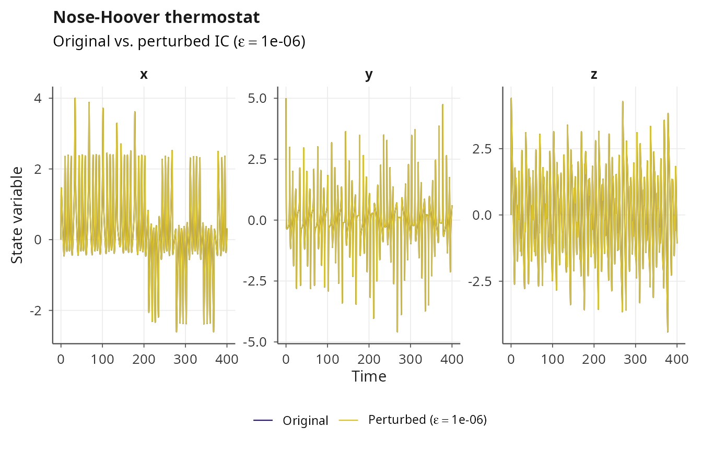

``` r

plot(nose_run, type = "attractor",  epsilon = 1e-6)
```

``` r


nose_sp <- lyapunov_spectrum(nose, t_max = 600, dt = 0.01,
                              renorm_interval = 1, discard_transient = 50,
                              verbose = FALSE)
print(nose_sp)
#> 
#> Lyapunov spectrum (ode)
#> --------------------------
#>   lambda_1 =    0.02852
#>   lambda_2 =   -0.00688
#>   lambda_3 =   -0.02598
#>   sum      =   -0.00434
#>   D_KY     =    2.83297
#>   Verdict: chaotic (1 positive exponent)
plot(nose_sp, type = "spectrum")
```

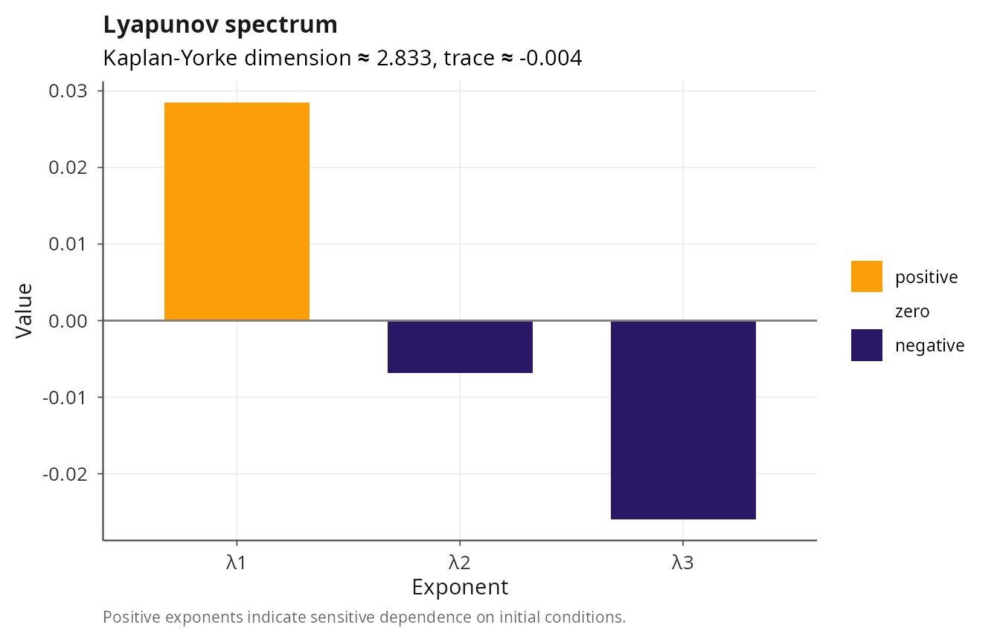

  

### Sprott minimal jerk

Julien Sprott catalogued in 1997 [\[29\]](#ref29) the algebraically
simplest three-dimensional quadratic ODEs admitting chaos. The minimal
jerk equation \\ \frac{d^3 x}{d t^3} + a \frac{d^2 x}{d t^2} -
\left(\frac{d x}{d t}\right)^2 + x = 0, \\ rewritten as a first-order
system \\ \begin{aligned} \frac{d x}{d t} &= y \\ \frac{d y}{d t} &= z
\\ \frac{d z}{d t} &= -a z + y^2 - x \end{aligned} \\ contains five
terms only and yet produces a strange attractor for . Jerk systems
highlight that chaos does not require any special algebraic structure
beyond a polynomial nonlinearity and three dimensions.

``` r

sprott <- system_spec(
    rhs = list(
        x ~ y,
        y ~ z,
        z ~ -a * z + y^2 - x
    ),
    state_names = c("x", "y", "z"),
    parms = list(a = 2.017),
    init  = c(x = 0, y = 0, z = 1),
    meta  = list(name = "Sprott minimal jerk")
)
sprott_run <- dyn_sim(sprott, t_max = 300, solver = solver_rk4(dt = 0.001),
                      discard_transient = 30, verbose = FALSE)
plot(sprott_run, type = "timeseries", epsilon = 1e-6)
```

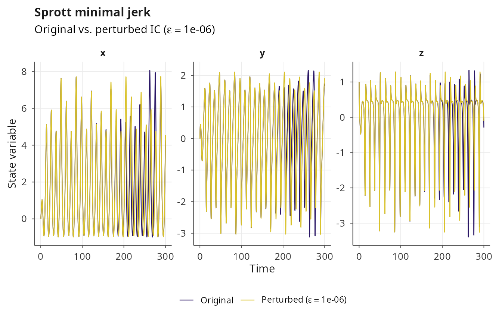

``` r

plot(sprott_run, type = "attractor",  epsilon = 1e-6)
```

  

### Thomas: cyclic symmetry and labyrinth chaos

René Thomas introduced his cyclically symmetric system in 1999
[\[6\]](#ref6) in a theoretical paper on feedback circuits and gene
regulation. The three equations \\ \begin{aligned} \frac{d x}{d t} &=
\sin y - b x \\ \frac{d y}{d t} &= \sin z - b y \\ \frac{d z}{d t} &=
\sin x - b z \end{aligned} \\ are generated by cyclic permutation of the
state, and this invariance is reflected in a three-fold rotational
symmetry of the attractor. The attractor is a smooth labyrinth rather
than a sharply folded object: trajectories meander through a network of
near-periodic channels that thread the cubic lattice of unstable
equilibria at integer multiples of . The dissipation rate is controlled
by ; for less than the dynamics are chaotic, and as the attractor
becomes area-preserving. We fix , safely inside the chaotic regime.

``` r

thomas <- system_spec(
    rhs = list(
        x ~ sin(y) - b * x,
        y ~ sin(z) - b * y,
        z ~ sin(x) - b * z
    ),
    state_names = c("x", "y", "z"),
    parms = list(b = 0.18),
    init  = c(x = 2.4, y = 2.5, z = 2.6),
    meta  = list(name = "Thomas")
)

thomas_run <- dyn_sim(thomas, t_max = 600, solver = solver_rk4(dt = 0.001),
                      discard_transient = 100, verbose = FALSE)
plot(thomas_run, type = "timeseries", epsilon = 1e-6)
```

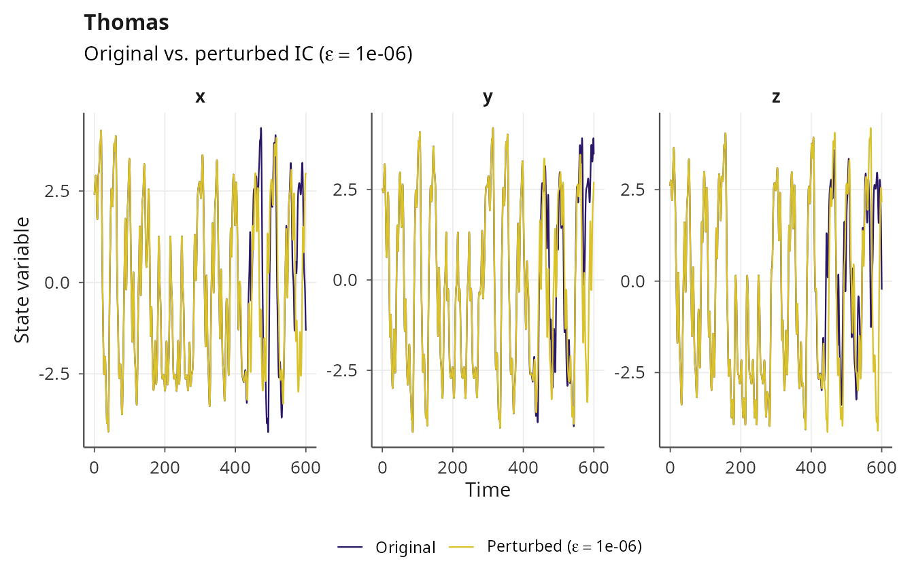

``` r

plot(thomas_run, type = "attractor",  epsilon = 1e-6)
```

``` r


thomas_sp <- lyapunov_spectrum(thomas, t_max = 300, dt = 0.01,
                               renorm_interval = 1, discard_transient = 100,
                               verbose = FALSE)
print(thomas_sp)
#> 
#> Lyapunov spectrum (ode)
#> --------------------------
#>   lambda_1 =    0.04347
#>   lambda_2 =   -0.00039
#>   lambda_3 =   -0.58308
#>   sum      =   -0.54000
#>   D_KY     =    2.07388
#>   Verdict: chaotic (1 positive exponent)
plot(thomas_sp, type = "spectrum")
```

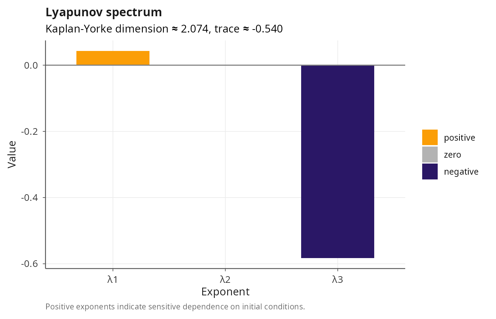

``` r


bd_thomas <- bifurcation_diagram(thomas, par_name = "b",
                                  par_range = c(0, 2),
                                  observable = "x", n_par = 1000,
                                  t_max = 600, discard_transient = 200,
                                  compute_lyapunov = TRUE,
                                  lyap_kwargs = list(t_max = 200,
                                                     dt = 0.02),
                                  verbose = FALSE)
plot(bd_thomas)
```

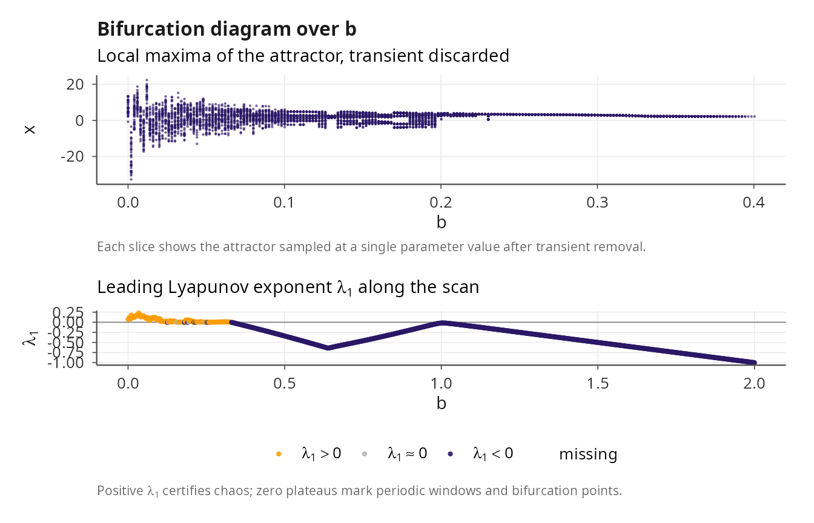

  

### Halvorsen: quadratic cyclic symmetry

Halvorsen’s attractor is structurally analogous to Thomas’s, but the
nonlinearity is quadratic rather than transcendental: \\ \begin{aligned}
\frac{d x}{d t} &= -a x - 4 y - 4 z - y^2 \\ \frac{d y}{d t} &= -a y - 4
z - 4 x - z^2 \\ \frac{d z}{d t} &= -a z - 4 x - 4 y - x^2 \end{aligned}
\\ The attractor has a three-fold rotational symmetry about the diagonal
and a strongly braided envelope. Sprott [\[7\]](#ref7) catalogued it
alongside other algebraically simple chaotic flows.

``` r

halvorsen <- system_spec(
    rhs = list(
        x ~ -a * x - 4 * y - 4 * z - y^2,
        y ~ -a * y - 4 * z - 4 * x - z^2,
        z ~ -a * z - 4 * x - 4 * y - x^2
    ),
    state_names = c("x", "y", "z"),
    parms = list(a = 1.4),
    init  = c(x = 1, y = 0, z = 0),
    meta  = list(name = "Halvorsen")
)
halvorsen_run <- dyn_sim(halvorsen, t_max = 100,
                          solver = solver_rk4(dt = 0.001),
                          discard_transient = 20, verbose = FALSE)
plot(halvorsen_run, type = "timeseries", epsilon = 1e-6)
```

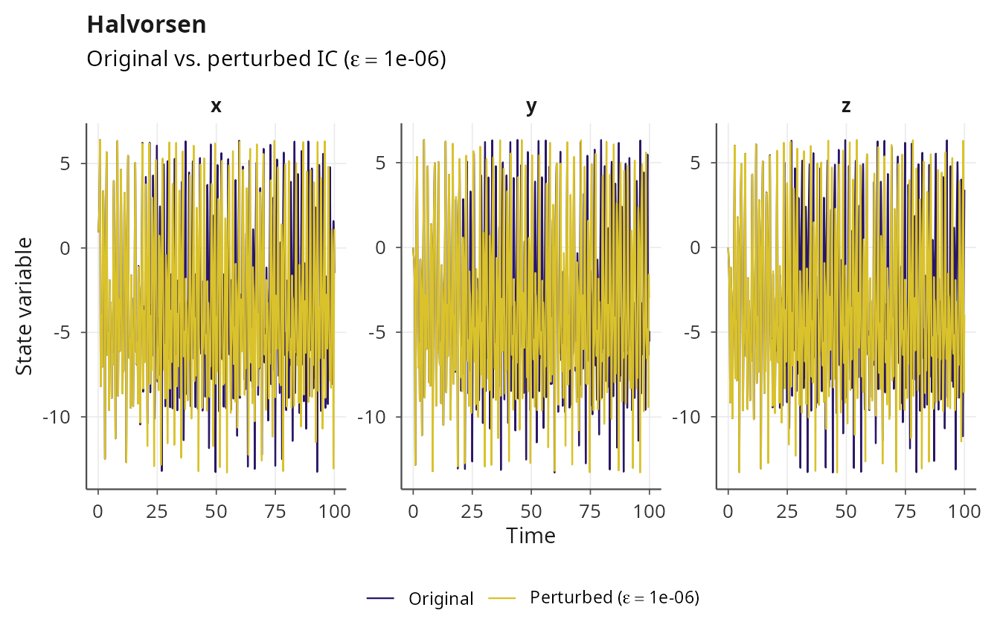

``` r

plot(halvorsen_run, type = "attractor",  epsilon = 1e-6)
```

  

### Aizawa

The Aizawa attractor, also known as the Langford system after W. F.
Langford’s 1983 study of torus bifurcations [\[8\]](#ref8), produces a
strange object reminiscent of a flattened sphere pierced by a thin
cylindrical spire. \\ \begin{aligned} \frac{d x}{d t} &= (z - b) x - d y
\\ \frac{d y}{d t} &= d x + (z - b) y \\ \frac{d z}{d t} &= c + a z -
\tfrac{z^3}{3} - (x^2 + y^2)(1 + e z) + f z x^3 \end{aligned} \\ The
attractor arises from a Neimark-Sacker bifurcation in which a limit
cycle loses stability and gives birth to an attracting invariant torus;
subsequent torus breakdown produces chaotic trajectories.

``` r

aizawa <- system_spec(
    rhs = list(
        x ~ (z - b) * x - d * y,
        y ~ d * x + (z - b) * y,
        z ~ c + a * z - z^3 / 3 - (x^2 + y^2) * (1 + e * z) +
            f * z * x^3
    ),
    state_names = c("x", "y", "z"),
    parms = list(a = 0.95, b = 0.7, c = 0.6, d = 3.5, e = 0.25, f = 0.1),
    init  = c(x = 0.1, y = 0, z = 0),
    meta  = list(name = "Aizawa")
)
aizawa_run <- dyn_sim(aizawa, t_max = 100, solver = solver_rk4(),
                      discard_transient = 20, verbose = FALSE)
plot(aizawa_run, type = "timeseries", epsilon = 1e-6)
```

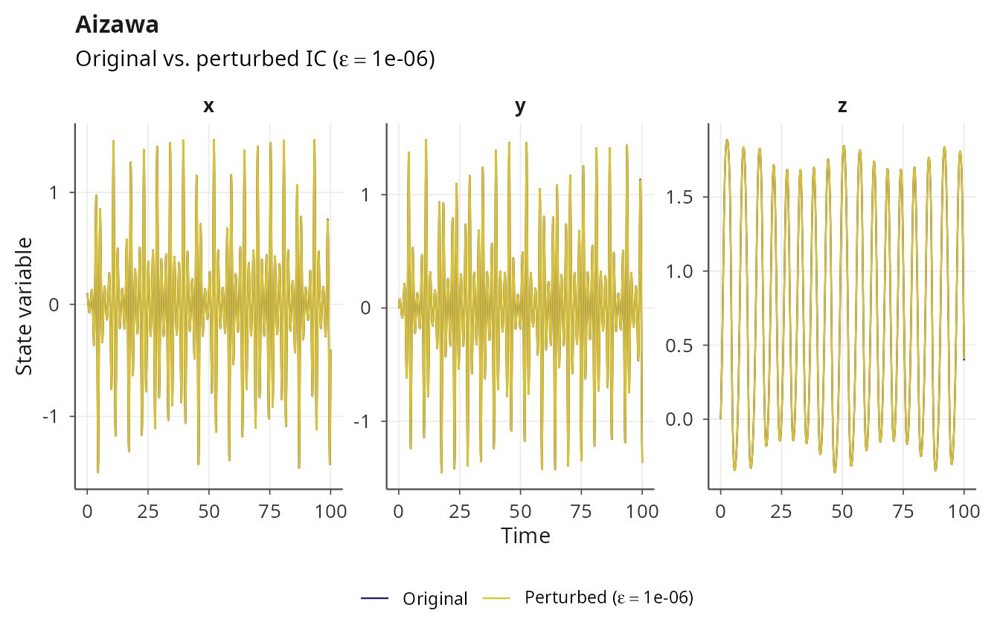

``` r

plot(aizawa_run, type = "attractor",  epsilon = 1e-6)
```

  

### Rabinovich-Fabrikant

The Rabinovich-Fabrikant system was introduced in 1979 [\[9\]](#ref9) to
model the stochastic self-modulation of waves in a non-equilibrium
dissipative medium. \\ \begin{aligned} \frac{d x}{d t} &= y (z - 1 +
x^2) + \gamma x \\ \frac{d y}{d t} &= x (3 z + 1 - x^2) + \gamma y \\
\frac{d z}{d t} &= -2 z (\alpha + x y) \end{aligned} \\ The interest of
the system is the coexistence of a conventional chaotic attractor and
strange non-chaotic attractors for different parameter values. A strange
non-chaotic attractor [\[10\]](#ref10) has the fractal geometry of a
strange attractor but zero largest Lyapunov exponent; it plays a central
role in the bifurcation theory of quasi-periodically forced systems. The
chaotic regime used here is .

``` r

rabinovich <- system_spec(
    rhs = list(
        x ~ y * (z - 1 + x^2) + gamma * x,
        y ~ x * (3 * z + 1 - x^2) + gamma * y,
        z ~ -2 * z * (alpha + x * y)
    ),
    state_names = c("x", "y", "z"),
    parms = list(gamma = 0.87, alpha = 1.1),
    init  = c(x = -1, y = 0, z = 0.5),
    meta  = list(name = "Rabinovich-Fabrikant")
)
rabinovich_run <- dyn_sim(rabinovich, t_max = 400, solver = solver_rk4(dt = 0.001),
                          discard_transient = 100, verbose = FALSE)
plot(rabinovich_run, type = "timeseries", epsilon = 1e-6)
```

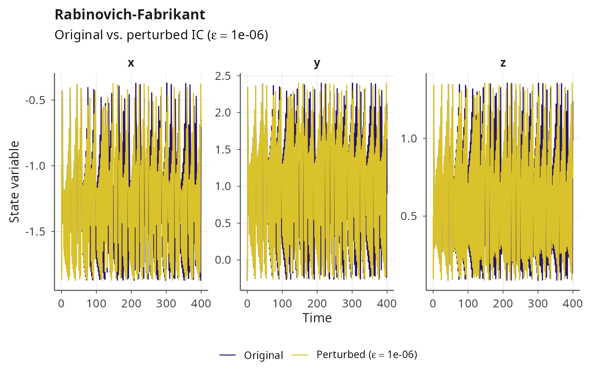

``` r

plot(rabinovich_run, type = "attractor",  epsilon = 1e-6)
```

  

## Driven oscillators

In its native formulation a driven oscillator is a two-dimensional
non-autonomous system, \\ \frac{d^2 x}{d t^2} + g\\\left(x, \frac{d x}{d
t}\right) = F \cos(\omega t). \\ janos accepts only autonomous
right-hand sides, and the standard trick is to treat time itself as an
extra state variable, , so the explicit time dependence becomes and the
phase space is the cylinder . The Poincare map associated with the
driving period coincides with the natural stroboscopic section , from
which Melnikov’s method and the homoclinic tangle are naturally
expressed. In the time-series plots below we pass `vars = c("x", "y")`
to omit the trivial linear ramp .

  

### Forced Van der Pol oscillator

Van der Pol introduced his oscillator in 1926 [\[12\]](#ref12) while
analysing self-sustained oscillations in vacuum-tube circuits. The
periodically forced version \\ \begin{aligned} \frac{d x}{d t} &= y \\
\frac{d y}{d t} &= \mu (1 - x^2) y - x + A \sin(\omega z) \\ \frac{d
z}{d t} &= 1 \end{aligned} \\ displays Arnold tongues of phase-locked
periodic solutions, Neimark-Sacker bifurcations to quasi-periodic motion
on an invariant torus, and, for sufficiently large forcing amplitude,
chaos.

``` r

vanderpol <- system_spec(
    rhs = list(
        x ~ y,
        y ~ mu * (1 - x^2) * y - x + A * sin(omega * z),
        z ~ 1
    ),
    state_names = c("x", "y", "z"),
    parms = list(mu = 3.0, A = 5, omega = 1.788),
    init  = c(x = 0.1, y = 0, z = 0),
    meta  = list(name = "Van der Pol (forced)")
)
vdp_run <- dyn_sim(vanderpol, t_max = 300, solver = solver_rk4(dt = 0.001),
                   discard_transient = 60, verbose = FALSE)
plot(vdp_run, type = "timeseries", vars = c("x", "y"), epsilon = 1e-6)
```

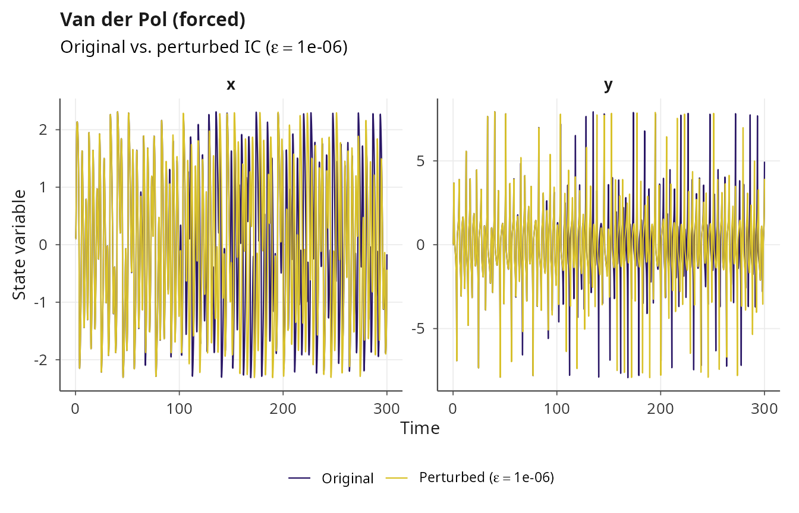

``` r

plot(vdp_run, type = "phase",      vars = c("x", "y"), epsilon = 1e-6)
```

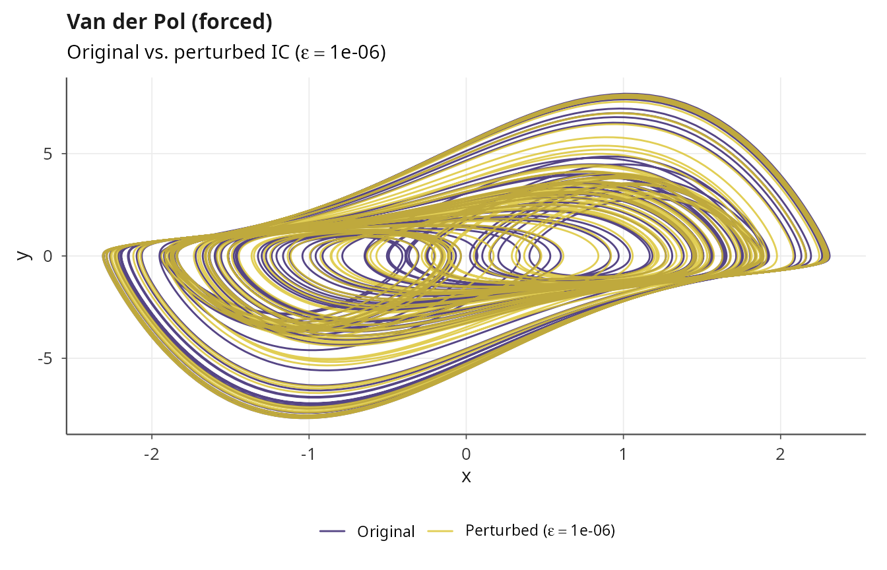

The Poincare map is the stroboscopic section at multiples of the driving
period :

``` r

T_drive <- 2 * pi / 1.788
strobe_vdp <- poincare_section(vdp_run, var = "x",
                                value = 0.5 * T_drive, direction = "up")
plot(strobe_vdp, vars = c("x", "y"),
     title = "Van der Pol stroboscopic section")
```

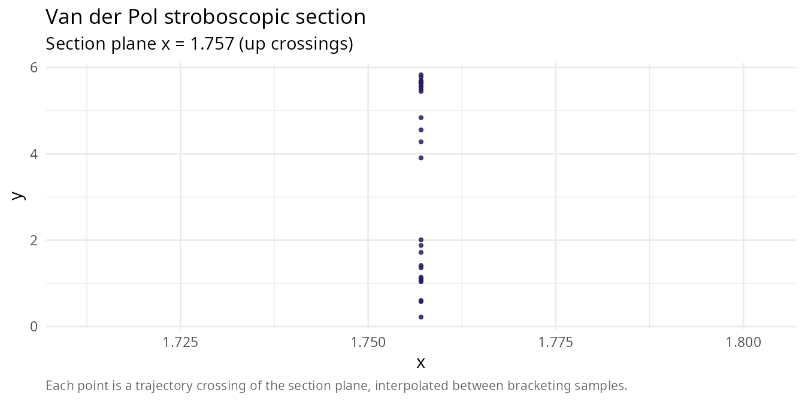

  

### Driven Duffing oscillator

Duffing [\[13\]](#ref13) analysed the equation that now bears his name
in a 1918 monograph on nonlinear mechanical vibrations. \\
\begin{aligned} \frac{d x}{d t} &= y \\ \frac{d y}{d t} &= -\delta y -
\alpha x - \beta x^3 + \gamma \cos(\omega z) \\ \frac{d z}{d t} &= 1
\end{aligned} \\ For the underlying potential is a symmetric double-well
, and the system is the canonical example of chaos through homoclinic
intersections of the stable and unstable manifolds of the saddle at the
origin. Melnikov’s method predicts the onset of chaos analytically; the
Poincare section displays the fractal basin boundary separating the two
wells.

``` r

duffing <- system_spec(
    rhs = list(
        x ~ y,
        y ~ -delta * y - alpha * x - beta * x^3 + gamma * cos(omega * z),
        z ~ 1
    ),
    state_names = c("x", "y", "z"),
    parms = list(delta = 0.3, alpha = -1.0, beta = 1.0,
                 gamma = 0.5, omega = 1.2),
    init  = c(x = 0.1, y = 0, z = 0),
    meta  = list(name = "Duffing (driven)")
)
duf_run <- dyn_sim(duffing, t_max = 400, solver = solver_rk4(dt = 0.001),
                   discard_transient = 100, verbose = FALSE)
plot(duf_run, type = "timeseries", vars = c("x", "y"), epsilon = 1e-6)
```

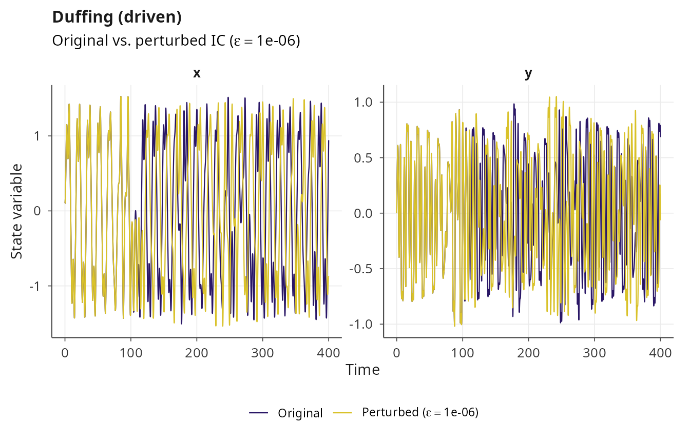

``` r

plot(duf_run, type = "phase",      vars = c("x", "y"), epsilon = 1e-6)
```

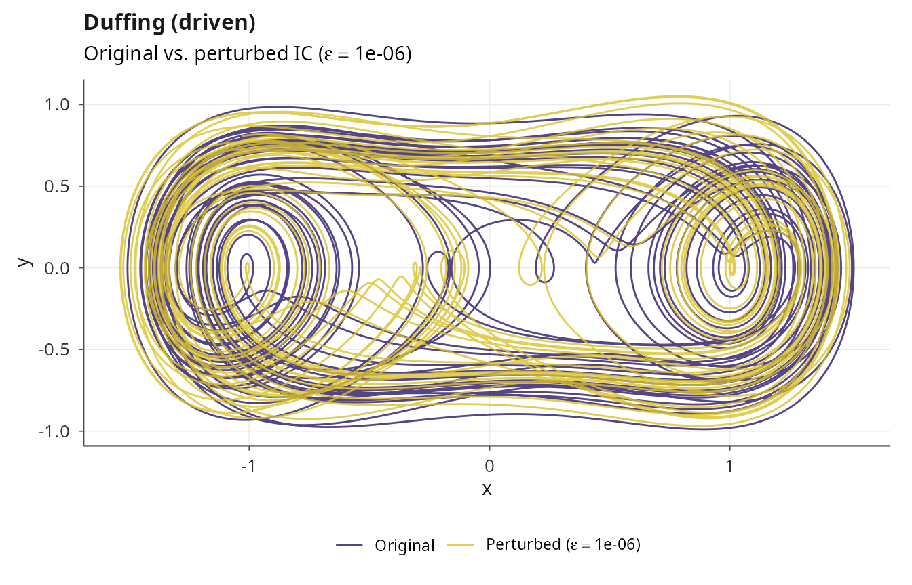

A Feigenbaum bifurcation diagram over the forcing amplitude recovers the
cascade to chaos and the lower panel tracks the leading Lyapunov
exponent along the scan:

``` r

bd_d <- bifurcation_diagram(duffing, par_name = "gamma",
                             par_range = c(0.2, 0.5),
                             observable = "x", n_par = 80,
                             t_max = 400, discard_transient = 300,
                             compute_lyapunov = TRUE,
                             lyap_kwargs = list(t_max = 200, dt = 0.02),
                             verbose = FALSE)
plot(bd_d)
```

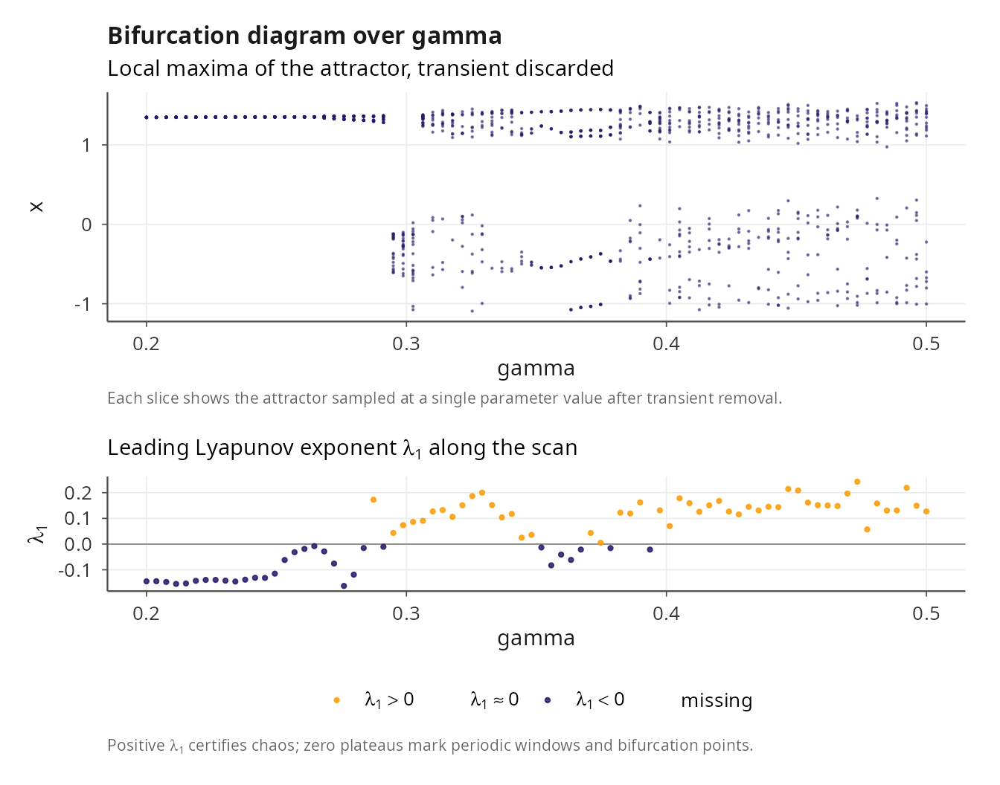

  

## Atmospheric and applied chaos

  

### Lorenz-84 general-circulation model

Lorenz [\[30\]](#ref30) proposed a three-dimensional autonomous model of
the mid-latitude atmospheric circulation that couples a zonal flow with
two baroclinic modes : \\ \begin{aligned} \frac{d X}{d t} &= -Y^2 -
Z^2 - a X + a F \\ \frac{d Y}{d t} &= X Y - b X Z - Y + G \\ \frac{d
Z}{d t} &= b X Y + X Z - Z \end{aligned} \\ At the attractor is the
low-dimensional chaos that shaped Lorenz’s later intuition about
atmospheric predictability.

``` r

lorenz84 <- system_spec(
    rhs = list(
        X ~ -Y^2 - Z^2 - a * X + a * F,
        Y ~ X * Y - b * X * Z - Y + G,
        Z ~ b * X * Y + X * Z - Z
    ),
    state_names = c("X", "Y", "Z"),
    parms = list(F = 8, G = 1, a = 0.25, b = 4),
    init  = c(X = 1, Y = 1, Z = 1),
    meta  = list(name = "Lorenz-84")
)
l84_run <- dyn_sim(lorenz84, t_max = 400, solver = solver_rk4(dt = 0.001),
                   discard_transient = 100, verbose = FALSE)
plot(l84_run, type = "timeseries", epsilon = 1e-6)
```

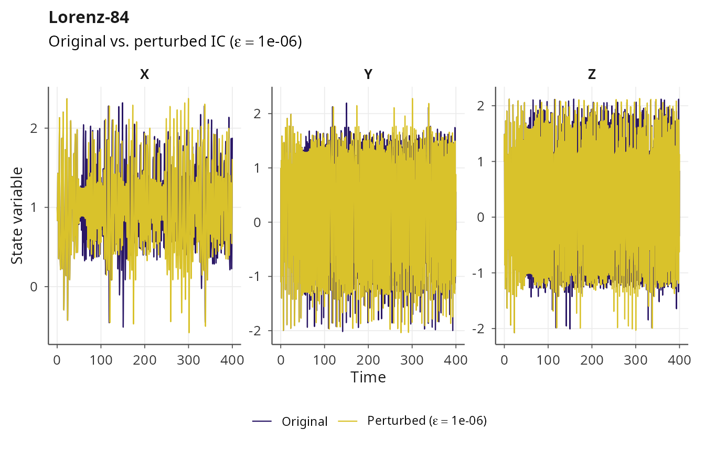

``` r

plot(l84_run, type = "attractor",  epsilon = 1e-6)
```

  

### Lorenz-96 truncation

Lorenz’s 1996 benchmark [\[31\]](#ref31) is a ring of identical
variables \\ \frac{d x_i}{d t} = (x\_{i+1} - x\_{i-2}) x\_{i-1} - x_i +
F, \qquad i = 1, \ldots, N \pmod N, \\ that captures the
advection-dissipation-forcing balance of a baroclinic atmosphere. For
and the flow is chaotic; for the Lyapunov spectrum spans a smooth
plateau that models atmospheric predictability scaling. We take for
exposition, using the package’s ability to carry an arbitrary number of
states.

``` r

# Build the RHS list programmatically
N <- 5L
lorenz96_rhs <- lapply(seq_len(N), function(i) {
    ip1 <- ((i %% N) + 1L)
    im1 <- ((i - 2L) %% N) + 1L
    im2 <- ((i - 3L) %% N) + 1L
    lhs <- as.name(paste0("x", i))
    rhs_expr <- bquote(
        (.(as.name(paste0("x", ip1))) - .(as.name(paste0("x", im2)))) *
        .(as.name(paste0("x", im1))) - .(as.name(paste0("x", i))) + F
    )
    stats::as.formula(paste(deparse(lhs), "~", paste(deparse(rhs_expr),
                                                      collapse = " ")))
})
state_names_96 <- paste0("x", seq_len(N))
init_96 <- stats::setNames(rep(8, N) + c(0.01, rep(0, N - 1L)), state_names_96)
lorenz96 <- system_spec(
    rhs = lorenz96_rhs,
    state_names = state_names_96,
    parms = list(F = 8),
    init  = init_96,
    meta  = list(name = "Lorenz-96 (N=5)")
)
l96_run <- dyn_sim(lorenz96, t_max = 80, solver = solver_rk4(dt = 0.001),
                   discard_transient = 20, verbose = FALSE)

plot(l96_run, type = "timeseries", vars = state_names_96[1:3], epsilon = 1e-6)
```

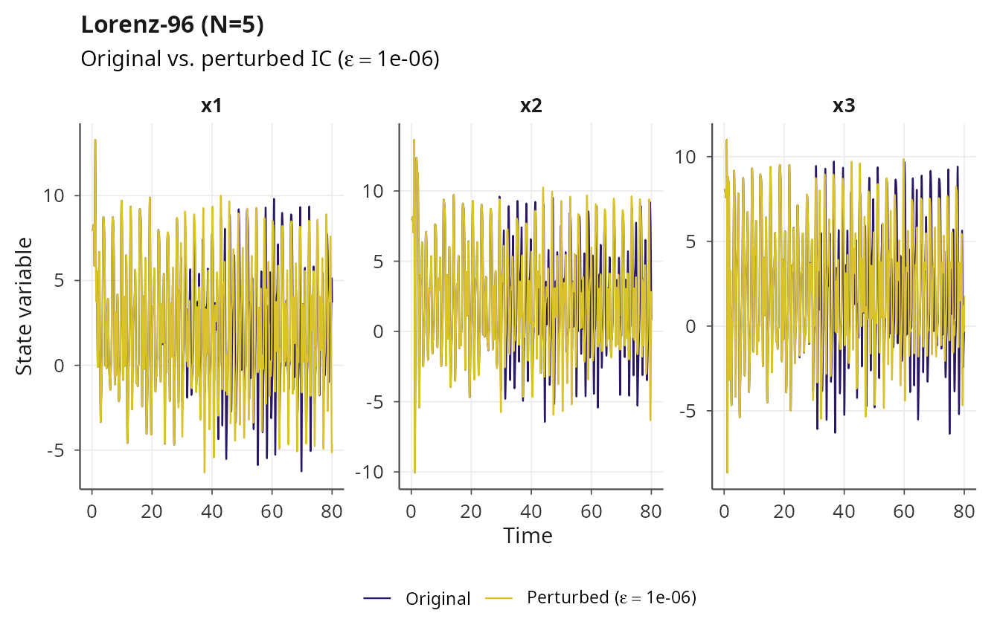

``` r

plot(l96_run, type = "attractor",  epsilon = 1e-6)
```

``` r


l96_sp <- lyapunov_spectrum(lorenz96, t_max = 80, dt = 0.01,
                             renorm_interval = 0.5, discard_transient = 10,
                             verbose = FALSE)
print(l96_sp)
#> 
#> Lyapunov spectrum (ode)
#> --------------------------
#>   lambda_1 =    0.54375
#>   lambda_2 =   -0.00484
#>   lambda_3 =   -0.64822
#>   lambda_4 =   -1.09114
#>   lambda_5 =   -3.79956
#>   sum      =   -5.00000
#>   D_KY     =    2.83138
#>   Verdict: chaotic (1 positive exponent)
```

  

## Discrete maps

  

### Logistic map

The logistic map \\ x\_{n+1} = r x_n (1 - x_n) \\ is the canonical
one-dimensional example of the period-doubling route to chaos.
Feigenbaum’s universality [\[33\]](#ref33) was discovered here: the
bifurcation values accumulate geometrically with ratio , and the ratio
is universal across all smooth unimodal maps. At the map is conjugate to
the tent map on and preserves a smooth invariant measure. At a stable
period-three window opens, the signature of a saddle-node bifurcation in
the third-iterate map, after which, by Sharkovskii’s theorem, periodic
orbits of every period exist.

``` r

logistic <- system_spec(
    map = list(x ~ r * x * (1 - x)),
    state_names = "x",
    parms = list(r = 3.9),
    init  = c(x = 0.2),
    positive_states = TRUE,
    meta  = list(name = "Logistic")
)
logistic_run <- dyn_sim(logistic, t_max = 5000, solver = solver_map(),
                        discard_transient = 1000, verbose = FALSE)
plot(logistic_run, type = "timeseries", epsilon = 1e-6)
```

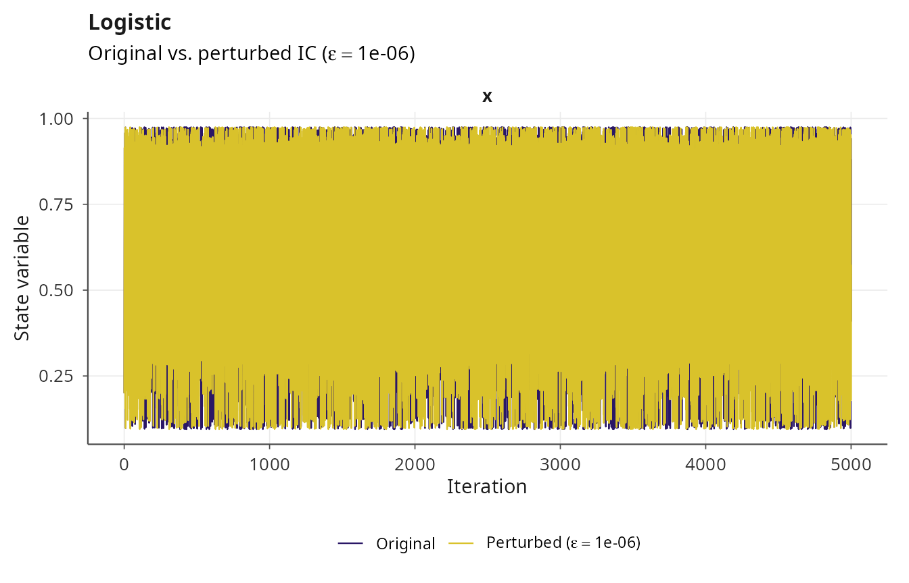

The bifurcation diagram is the classical Feigenbaum picture; pairing it
with the leading Lyapunov exponent on a second panel turns the
period-doubling cascade into a quantitative statement, since crosses
zero at each bifurcation point and is positive throughout the chaotic
bands:

``` r

bd_log <- bifurcation_diagram(logistic, par_name = "r",
                               par_range = c(2.8, 4), n_par = 600,
                               t_max = 1200, discard_transient = 800,
                               n_keep = 200,
                               compute_lyapunov = TRUE,
                               lyap_kwargs = list(t_max = 2000),
                               verbose = FALSE)
plot(bd_log)
```

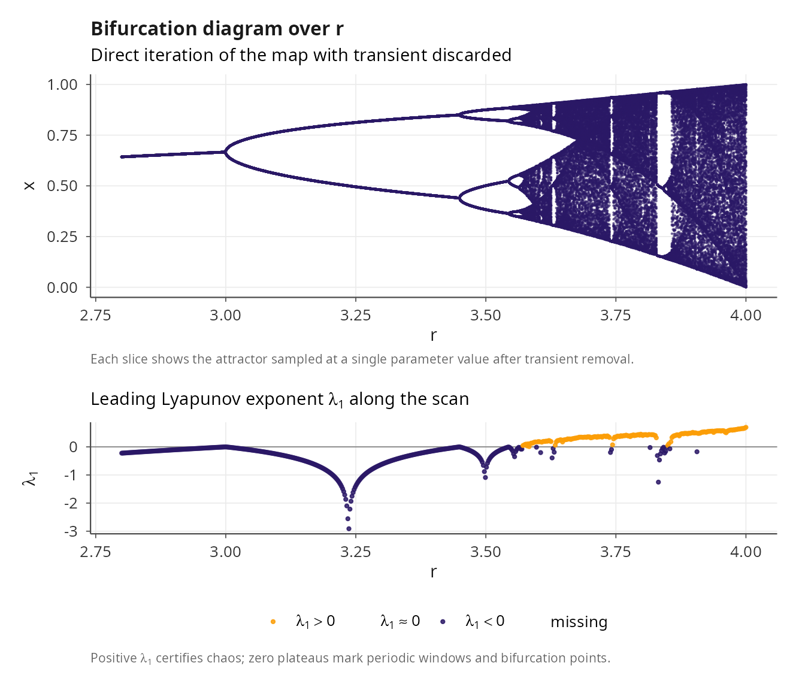

  

### The Hénon map

Hénon [\[14\]](#ref14) introduced his two-dimensional map as a
simplified caricature of the Poincaré return map of the Lorenz flow, a
deliberate demonstration that strange attractors arise in discrete
systems as readily as in continuous ones: \\ x\_{n+1} = 1 - a x_n^2 +
y_n \\ y\_{n+1} = b x_n \\ Quadratic stretching in combined with uniform
contraction by in the perpendicular direction implements the Smale
horseshoe. At the attractor is a thin banana-shaped Cantor-set-cross-arc
with and correlation dimension close to 1.26.

``` r

henon <- system_spec(
    map = list(
        x ~ 1 - a * x^2 + y,
        y ~ b * x
    ),
    state_names = c("x", "y"),
    parms = list(a = 1.4, b = 0.3),
    init  = c(x = 0.1, y = 0.1),
    meta  = list(name = "Henon")
)
henon_run <- dyn_sim(henon, t_max = 8000, solver = solver_map(),
                     discard_transient = 1000, verbose = FALSE)
plot(henon_run, type = "timeseries", epsilon = 1e-6)
```

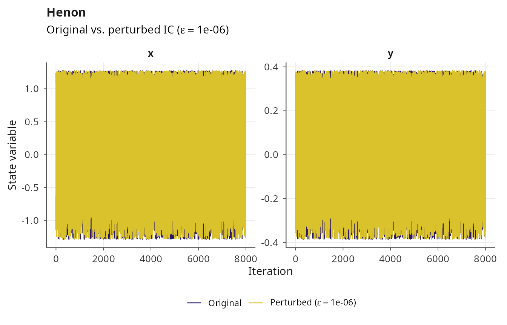

``` r

plot(henon_run, type = "phase",      vars = c("x", "y"), epsilon = 1e-6)
```

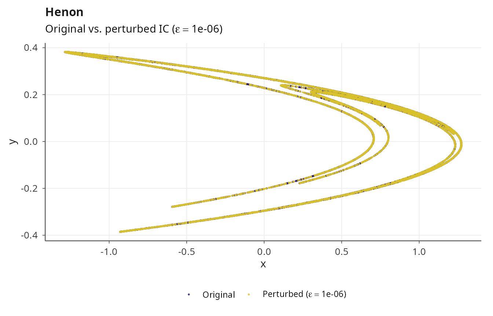

``` r

bd_h <- bifurcation_diagram(henon, par_name = "a",
                             par_range = c(0.9, 1.4), n_par = 300,
                             t_max = 2000, discard_transient = 1500,
                             n_keep = 150,
                             compute_lyapunov = TRUE,
                             lyap_kwargs = list(t_max = 4000),
                             verbose = FALSE)
plot(bd_h)
```

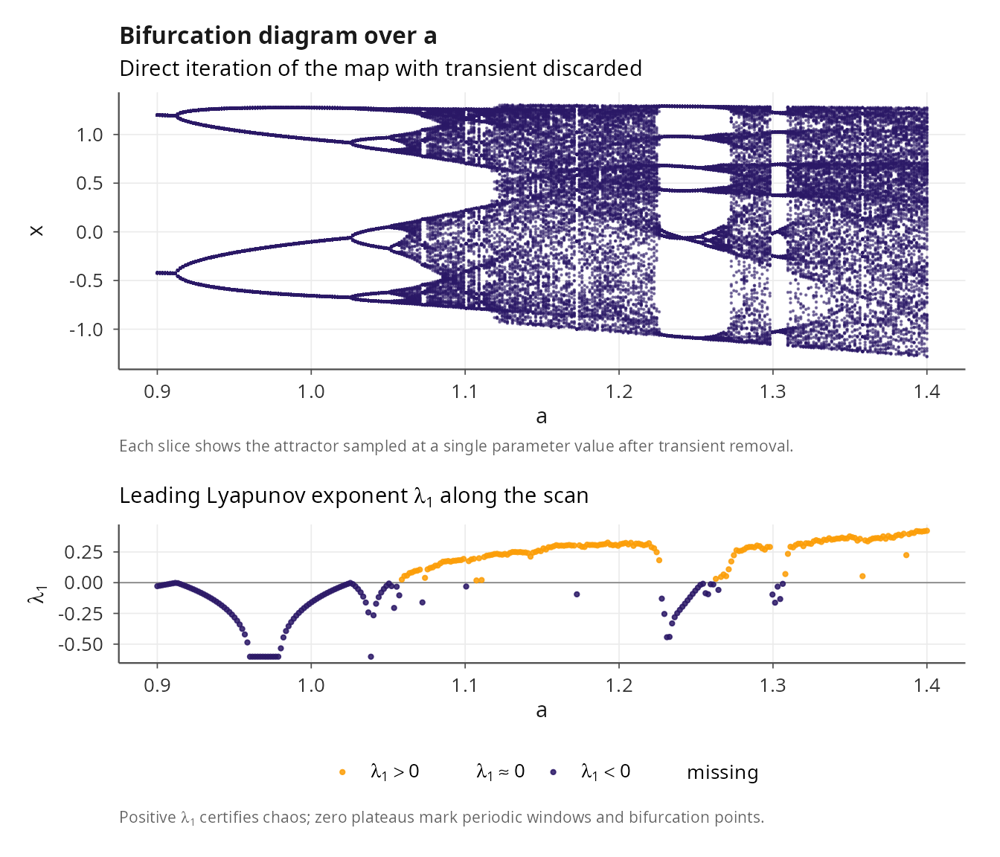

  

### Standard (Chirikov-Taylor) map

Chirikov’s standard map [\[34\]](#ref34) is the paradigmatic
area-preserving twist map of the two-torus, \\ p\_{n+1} = p_n + K
\sin(\theta_n) \\ \theta\_{n+1} = \theta_n + p\_{n+1} \pmod{2\pi} \\ For
the dynamics are integrable rotations on invariant circles. Increasing
breaks the KAM circles; Greene’s conjecture places the transition to
global chaos at . Above the last KAM torus is destroyed, trajectories
diffuse in , and the map becomes the reference model for Hamiltonian
chaos in accelerator physics and Arnold diffusion.

``` r

standard_map <- system_spec(
    map = list(
        p ~ p + K * sin(theta),
        theta ~ theta + p + K * sin(theta)
    ),
    state_names = c("p", "theta"),
    parms = list(K = 1.0),
    init  = c(p = 0.1, theta = 1.5),
    meta  = list(name = "Chirikov standard map")
)
sm_run <- dyn_sim(standard_map, t_max = 20000, solver = solver_map(),
                  discard_transient = 0, verbose = FALSE)
# Wrap theta into a 2*pi window for plotting
sm_run$attractor$theta <- sm_run$attractor$theta %% (2 * pi)
plot(sm_run, type = "timeseries", epsilon = 1e-6)
```

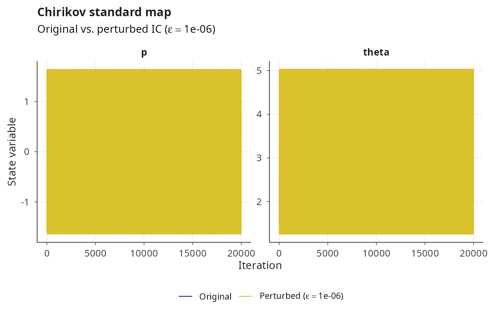

``` r

plot(sm_run, type = "phase",      vars = c("theta", "p"), epsilon = 1e-6)
```

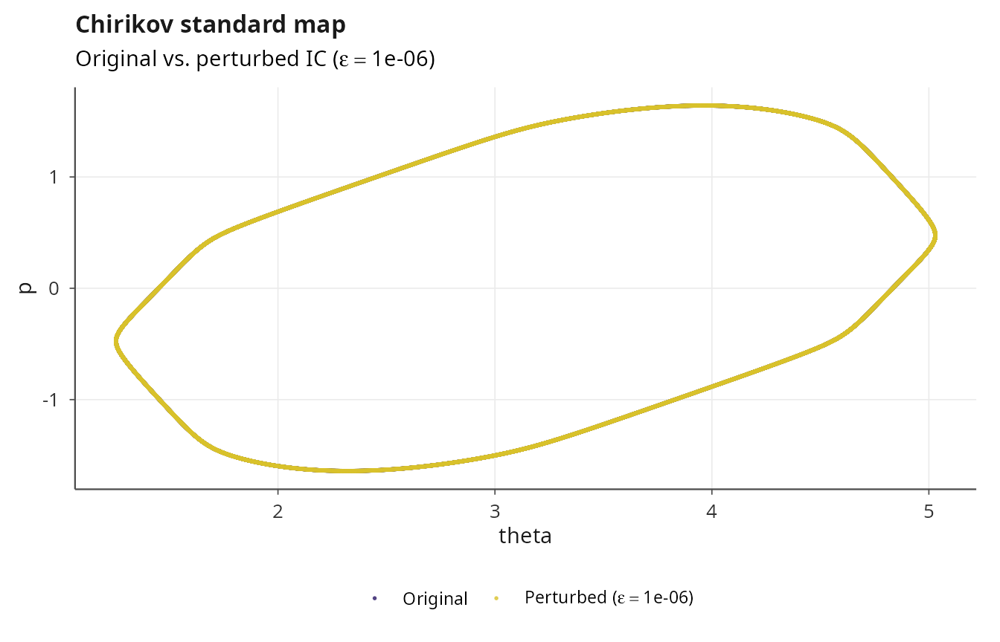

  

### Lozi map

The Lozi map [\[35\]](#ref35) \\ x\_{n+1} = 1 - a \|x_n\| + y_n \\
y\_{n+1} = b x_n \\ replaces the quadratic nonlinearity of the Hénon map
by the absolute value. The resulting piecewise affine system is one of
the few two-dimensional invertible maps for which the existence of a
hyperbolic strange attractor has been proved rigorously (Misiurewicz
1980).

``` r

lozi <- system_spec(
    map = list(
        x ~ 1 - a * abs(x) + y,
        y ~ b * x
    ),
    state_names = c("x", "y"),
    parms = list(a = 1.7, b = 0.5),
    init  = c(x = 0.1, y = 0),
    meta  = list(name = "Lozi")
)
lozi_run <- dyn_sim(lozi, t_max = 6000, solver = solver_map(),
                    discard_transient = 1000, verbose = FALSE)
plot(lozi_run, type = "timeseries", epsilon = 1e-6)
```

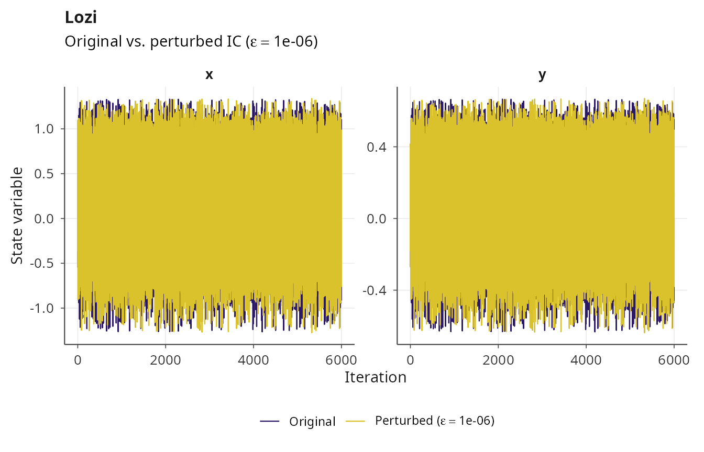

``` r

plot(lozi_run, type = "phase",      vars = c("x", "y"), epsilon = 1e-6)
```

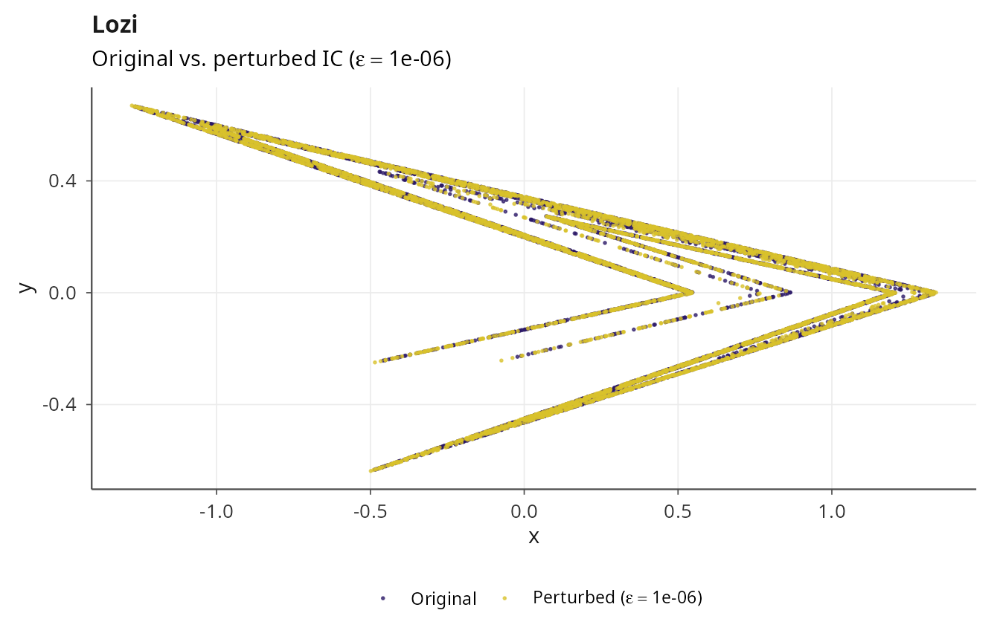

  

### Ikeda map

The Ikeda map [\[36\]](#ref36) models the field evolution in an optical
cavity with a saturable absorber: \\ z\_{n+1} = a + b z_n \exp\left(i
\kappa - i \frac{\alpha}{1 + \|z_n\|^2}\right). \\ In real coordinates ,
with , \\ x\_{n+1} = a + b (x_n \cos t_n - y_n \sin t_n) \\ y\_{n+1} = b
(x_n \sin t_n + y_n \cos t_n) \\ The parameters produce a chaotic
attractor with a characteristic spiral geometry.

``` r

ikeda <- system_spec(
    map = list(
        x ~ a + b * (x * cos(kappa - alpha / (1 + x^2 + y^2)) -
                    y * sin(kappa - alpha / (1 + x^2 + y^2))),
        y ~     b * (x * sin(kappa - alpha / (1 + x^2 + y^2)) +
                    y * cos(kappa - alpha / (1 + x^2 + y^2)))
    ),
    state_names = c("x", "y"),
    parms = list(a = 1, b = 0.9, kappa = 0.4, alpha = 6),
    init  = c(x = 0.1, y = 0.1),
    meta  = list(name = "Ikeda map")
)
ikeda_run <- dyn_sim(ikeda, t_max = 8000, solver = solver_map(),
                     discard_transient = 1000, verbose = FALSE)
plot(ikeda_run, type = "timeseries", epsilon = 1e-6)
```

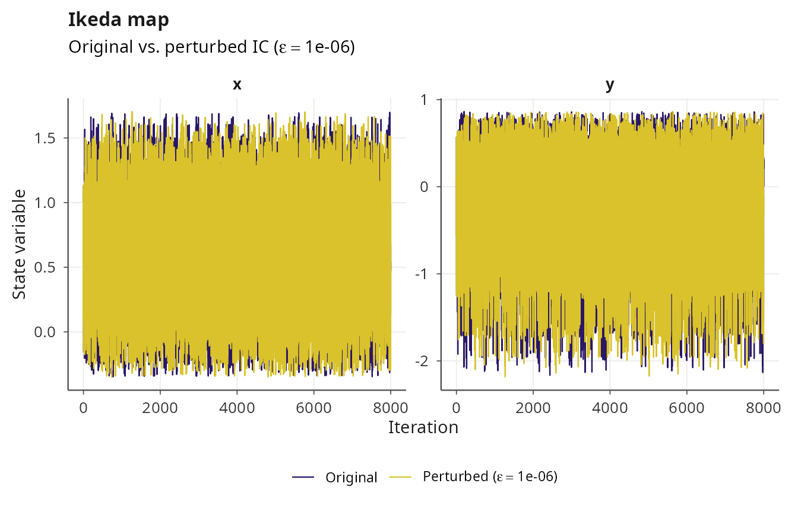

``` r

plot(ikeda_run, type = "phase",      vars = c("x", "y"), epsilon = 1e-6)
```

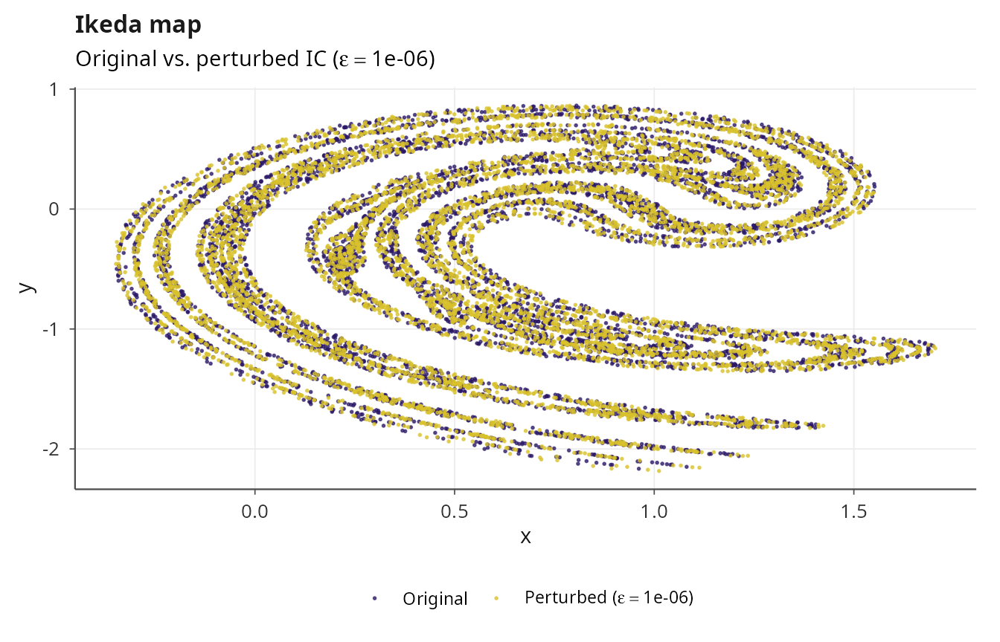

  

## Delay-differential chaos

  

### Mackey-Glass and delay-induced chaos

Mackey and Glass introduced their equation in 1977 [\[15\]](#ref15) to
model the regulatory feedback in hematopoiesis: \\ \frac{d x(t)}{d t} =
\frac{\beta x(t - \tau)}{1 + x(t - \tau)^n} - \gamma x(t). \\ The
infinite-dimensional phase space of the initial history on is rich
enough to support a period-doubling cascade, and for the model is a
textbook chaotic benchmark used in time-series prediction and reservoir
computing. Because the state is scalar the geometry of the attractor is
reconstructed by a Takens delay embedding of the observable;
`plot.dyn_sim(type = "attractor")` automatically delegates to
`type = "delay_embedding"` for DDEs with fewer than three states and
uses the declared delay as the default lag.

``` r

mackey <- system_spec(
    rhs = list(x ~ beta * x_tau / (1 + x_tau^n) - gammag * x),
    delays = list(x_tau = list(state = "x", tau = 17)),
    state_names = "x",
    parms = list(beta = 0.2, gammag = 0.1, n = 10),
    init  = c(x = 1.2),
    positive_states = TRUE,
    meta  = list(name = "Mackey-Glass")
)
mackey_run <- dyn_sim(mackey, t_max = 1500, solver = solver_dde(dt = 0.1),
                      discard_transient = 300, verbose = FALSE)
plot(mackey_run, type = "timeseries", epsilon = 1e-6)
```

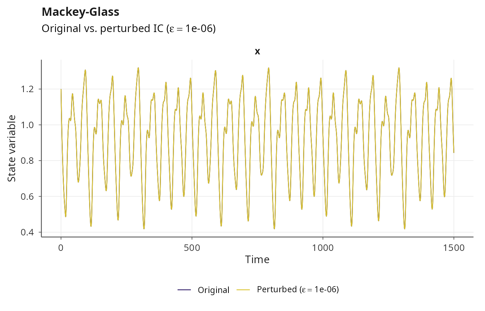

``` r

plot(mackey_run, type = "attractor",  epsilon = 1e-6)
```

The 0-1 test on the scalar signal of the Mackey-Glass attractor gives :

``` r

z_mg <- zero_one_test(mackey_run, var = "x")
print(z_mg)
#> 
#> 0-1 test for chaos
#> ------------------
#>   observable : x
#>   samples    : 501 (stride 24)
#>   n_c        : 100
#>   K (median) : 0.0074
#>   verdict    : regular
```

  

### Ikeda delay-differential: high-dimensional chaos

The Ikeda delay-differential equation [\[37\]](#ref37) \\ \frac{d
x(t)}{d t} = -\mu x(t) + \sigma \sin(x(t - \tau) - \phi) \\ models a
ring laser with delayed optical feedback. In the large-delay limit the
dimension of the attractor grows linearly with (Farmer 1982), so Ikeda’s
DDE is a paradigmatic example of hyperchaos induced by delay.

``` r

ikeda_dde <- system_spec(
    rhs = list(x ~ -mu * x + sigma * sin(x_tau - phi)),
    delays = list(x_tau = list(state = "x", tau = 2)),
    state_names = "x",
    parms = list(mu = 1, sigma = 4, phi = 0),
    init  = c(x = 0.5),
    meta  = list(name = "Ikeda DDE")
)
ikeda_dde_run <- dyn_sim(ikeda_dde, t_max = 400, solver = solver_dde(dt = 0.02),
                          discard_transient = 50, verbose = FALSE)
plot(ikeda_dde_run, type = "timeseries", epsilon = 1e-6)
```

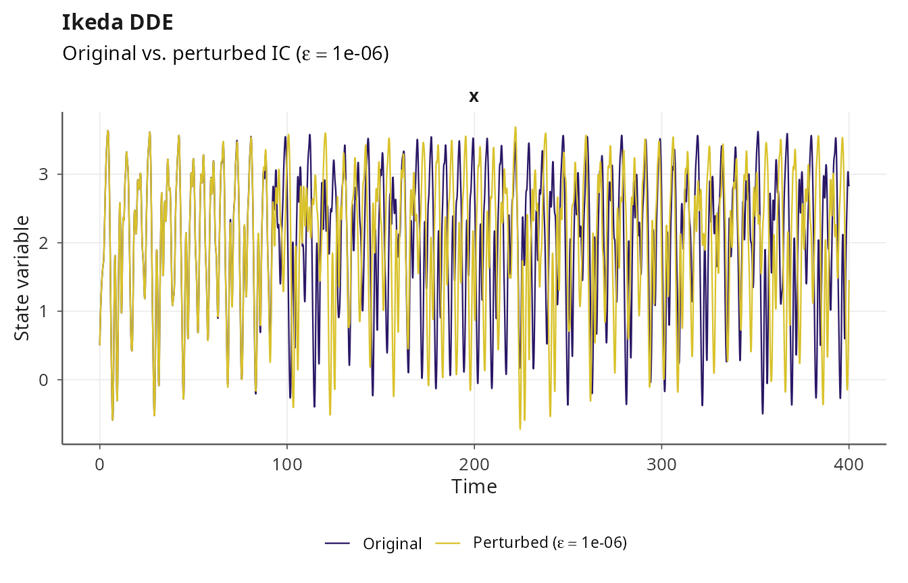

``` r

plot(ikeda_dde_run, type = "attractor",  epsilon = 1e-6)
```

  

### Lang-Kobayashi semiconductor laser with feedback

The Lang-Kobayashi rate equations [\[38\]](#ref38) describe a
semiconductor laser with delayed optical feedback from an external
mirror. A three-equation reduction for the complex field amplitude and
the carrier excess reads \\ \begin{aligned} \frac{d E_r}{d t} &=
\tfrac{1}{2}(G n) E_r - \omega E_i + \kappa E_r^{(\tau)} \\ \frac{d
E_i}{d t} &= \tfrac{1}{2}(G n) E_i + \omega E_r + \kappa E_i^{(\tau)} \\
\frac{d n}{d t} &= (J - n - (1 + n)(E_r^2 + E_i^2)) / T \end{aligned} \\
where denote the delayed field quadratures. The Lang-Kobayashi equations
are the workhorse model of coherence collapse and low-frequency
fluctuations in semiconductor lasers.

``` r

lk <- system_spec(
    rhs = list(
        Er ~ 0.5 * G * n * Er - omega * Ei + kappa * Er_tau,
        Ei ~ 0.5 * G * n * Ei + omega * Er + kappa * Ei_tau,
        n  ~ (J - n - (1 + n) * (Er^2 + Ei^2)) / T
    ),
    delays = list(
        Er_tau = list(state = "Er", tau = 1),
        Ei_tau = list(state = "Ei", tau = 1)
    ),
    state_names = c("Er", "Ei", "n"),
    parms = list(G = 0.5, omega = 0, kappa = 0.15, J = 1.155, T = 200),
    init  = c(Er = 0.1, Ei = 0, n = 0),
    meta  = list(name = "Lang-Kobayashi")
)
lk_run <- dyn_sim(lk, t_max = 400, solver = solver_dde(dt = 0.02),
                   discard_transient = 100, verbose = FALSE)
plot(lk_run, type = "timeseries", vars = c("Er", "Ei", "n"), epsilon = 1e-6)
```

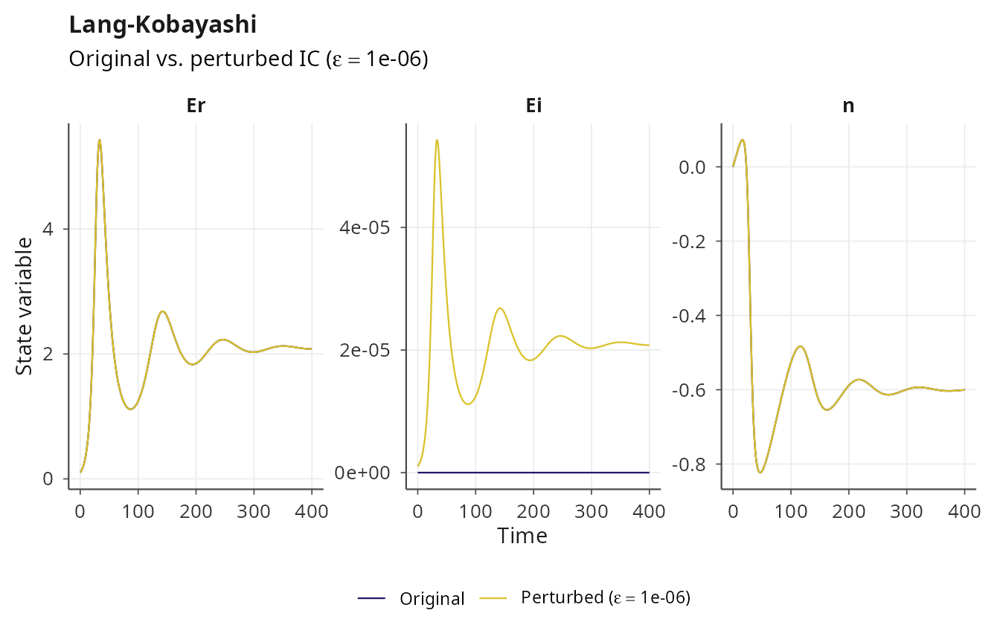

``` r

plot(lk_run, type = "attractor",  epsilon = 1e-6)
```

  

## Hyperchaos

A hyperchaotic attractor has at least two positive Lyapunov exponents.
Hyperchaos requires at least four dimensions, two of which must expand
simultaneously along different tangent directions, yielding a more
complex folding and mixing than ordinary chaos. The Rössler hyperchaotic
system [\[39\]](#ref39) \\ \begin{aligned} \frac{d x}{d t} &= -y - z \\
\frac{d y}{d t} &= x + a y + w \\ \frac{d z}{d t} &= b + x z \\ \frac{d
w}{d t} &= -c z + d w \end{aligned} \\ has a canonical parameter regime
at .

``` r

rossler_hyper <- system_spec(
    rhs = list(
        x ~ -y - z,
        y ~ x + a * y + w,
        z ~ b + x * z,
        w ~ -c * z + d * w
    ),
    state_names = c("x", "y", "z", "w"),
    parms = list(a = 0.25, b = 3, c = 0.5, d = 0.05),
    init  = c(x = -10, y = -6, z = 0, w = 10),
    meta  = list(name = "Rossler hyperchaotic")
)
rh_run <- dyn_sim(rossler_hyper, t_max = 200, solver = solver_rk4(),
                  discard_transient = 50, verbose = FALSE)
plot(rh_run, type = "timeseries", epsilon = 1e-6)
```

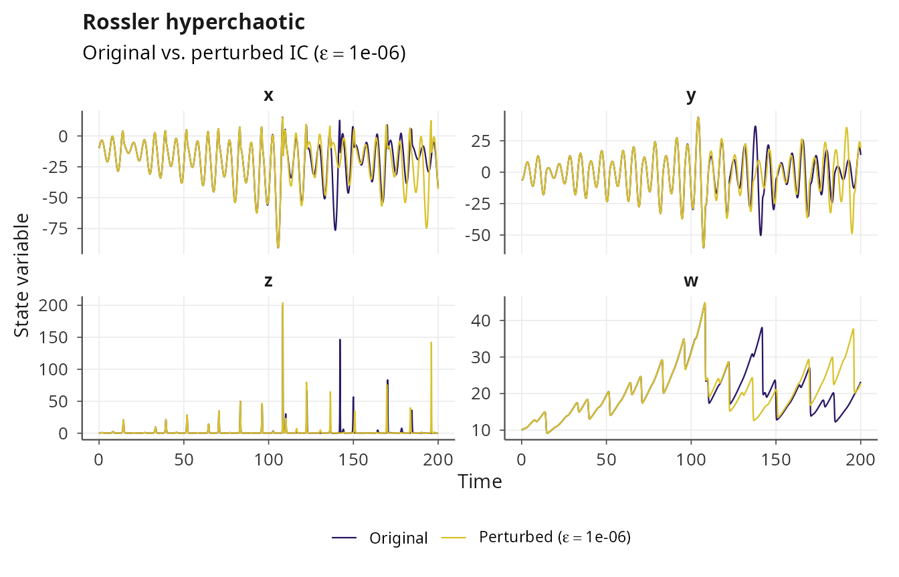

``` r

plot(rh_run, type = "attractor",  epsilon = 1e-6)
```

``` r

rh_sp <- lyapunov_spectrum(rossler_hyper, t_max = 200, dt = 0.01,
                            renorm_interval = 1, discard_transient = 30,
                            verbose = FALSE)
print(rh_sp)
#> 
#> Lyapunov spectrum (ode)
#> --------------------------
#>   lambda_1 =    0.13384
#>   lambda_2 =    0.01085
#>   lambda_3 =    0.00932
#>   lambda_4 =  -18.64091
#>   sum      =  -18.48690
#>   D_KY     =    3.00826
#>   Verdict: hyperchaotic (3 positive exponents)
plot(rh_sp, type = "spectrum")
```

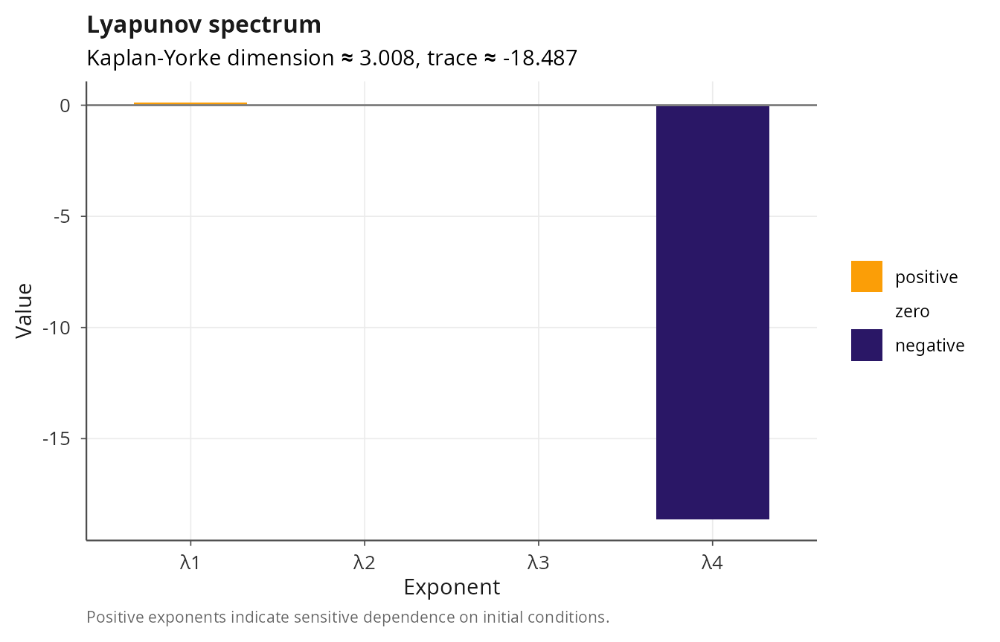

Two positive exponents confirm hyperchaos; the remaining two are
negative and together enforce phase-space contraction.

  

## Spatiotemporal chaos

  

### Kuramoto-Sivashinsky equation

The Kuramoto-Sivashinsky equation [\[40\]](#ref40) \\ \frac{\partial
u}{\partial t} = -u \frac{\partial u}{\partial x} - \frac{\partial^2
u}{\partial x^2} - \frac{\partial^4 u}{\partial x^4} \\ governs the
propagation of a flame front and is the canonical one-dimensional PDE
admitting spatiotemporal chaos. On a periodic interval of length
long-wavelength modes go linearly unstable and nonlinearly saturate
through the advective term, producing a turbulent cascade whose Lyapunov
dimension grows linearly in . The janos PDE backend compiles the method
of lines via
[`solver_mol()`](https://robustecologies.github.io/janos/reference/solver_mol.md)
and handles the fourth-order derivative through two nested `d2x(.)`
operators.

The Kuramoto-Sivashinsky equation requires the fourth spatial derivative
. The current janos PDE compiler exposes only `d1x` and `d2x` and does
not yet accept nested spatial operators; a fourth-derivative stencil
would need an explicit `d4x` operator. The snippet below documents the
intended interface once that operator is implemented. In the interim the
KS equation can be assembled manually as a large ODE system via
`solver_mol(.)` using a pre-computed finite-difference operator; the
details are covered in the spatial-dynamics vignette.

``` r

ks <- system_spec(
    pde = list(u ~ -u * d1x(u) - d2x(u) - d4x(u)),
    state_names = "u",
    parms = list(),
    spatial = list(
        domain = c(0, 32 * pi), n_grid = 128L,
        bc = list(u = list(type = "periodic"))
    ),
    init = function(x) 0.1 * cos(x / 16) * (1 + sin(x / 16)),
    meta = list(name = "Kuramoto-Sivashinsky")
)
ks_run <- dyn_sim(ks, t_max = 120, solver = solver_mol(dt = 0.001),
                  discard_transient = 20, verbose = FALSE)
plot(ks_run, type = "heatmap")
```

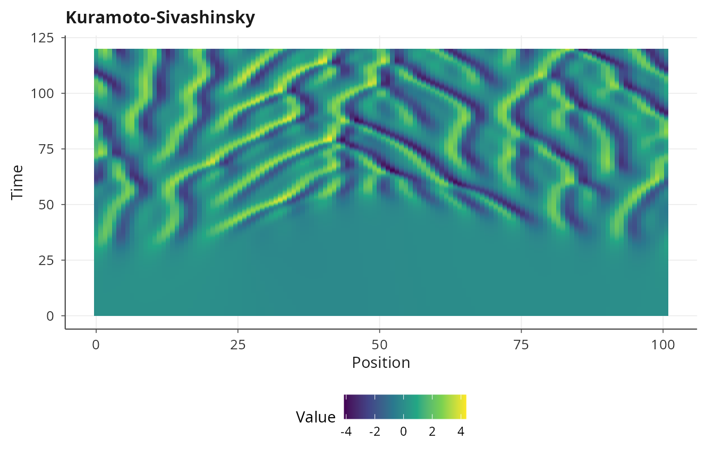

The space-time heatmap shows the characteristic cellular turbulence that
replaces the rolling Benard cells destroyed by the long-wave
instability.

  

### Complex Ginzburg-Landau equation

The complex Ginzburg-Landau equation [\[41\]](#ref41) \\ \frac{\partial
A}{\partial t} = A + (1 + i c_1)\\\frac{\partial^2 A}{\partial x^2} -
(1 + i c_2)\\\|A\|^2 A \\ is the universal amplitude equation in the
neighbourhood of a Hopf bifurcation in spatially extended systems. In
real variables it becomes the two-equation PDE shown below. For outside
the Benjamin-Feir-Newell curve the phase-turbulent regime hosts
spatiotemporal chaos.

The current janos PDE compiler does not accept spatial operators applied
to a state variable other than the one whose equation is being written
(for instance `d2x(v)` inside the equation for ). The CGL snippet below
is kept for the intended API once that restriction is lifted; until then
the janos spatial-dynamics vignette shows how to integrate CGL by
writing a manual method-of-lines ODE on the split real/imaginary grid.

``` r

cgl <- system_spec(
    pde = list(
        u ~ u - (u^2 + v^2) * u + d2x(u) - c1 * d2x(v) +
             c2 * (u^2 + v^2) * v,
        v ~ v - (u^2 + v^2) * v + c1 * d2x(u) + d2x(v) -
             c2 * (u^2 + v^2) * u
    ),
    state_names = c("u", "v"),
    parms = list(c1 = 2, c2 = -1),
    spatial = list(
        domain = c(0, 100), n_grid = 200L,
        bc = list(u = list(type = "periodic"),
                   v = list(type = "periodic"))
    ),
    init = list(u = function(x) 0.1 * cos(2 * pi * x / 50),
                 v = function(x) 0.1 * sin(2 * pi * x / 50)),
    meta = list(name = "Complex Ginzburg-Landau")
)
cgl_run <- dyn_sim(cgl, t_max = 200, solver = solver_mol(dt = 0.005),
                   discard_transient = 50, verbose = FALSE)
plot(cgl_run, type = "heatmap")
```

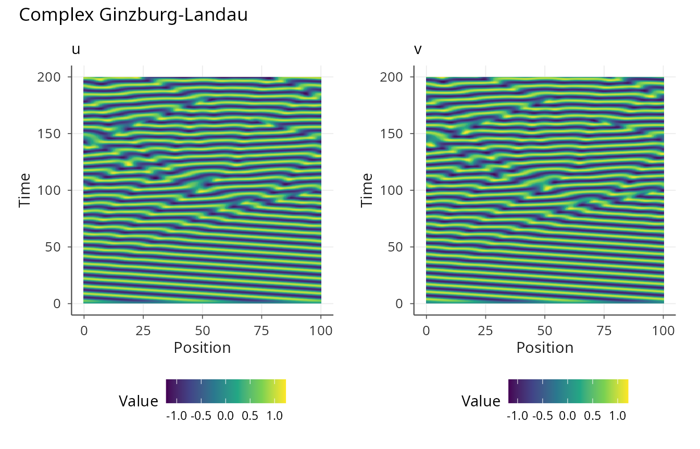

  

## Chaos in ecology and epidemiology

Ecological systems carry a distinct topology: state variables are
non-negative population densities, coordinate hyperplanes are invariant,
and the dynamics must respect a bounded carrying simplex. These
constraints do not prevent chaos but shape its mechanism. All models in
this section are compiled with `positive_states = TRUE`, which emits a
componentwise clamp to zero in the compiled integrator.

  

### Arneodo-Coullet-Tresser: chaos in three-species competition

Arneodo, Coullet and Tresser [\[16\]](#ref16) exhibited in 1980 the
first example of chaos in a three-species Volterra competition with
invariant coordinate hyperplanes: \\ \frac{d N_i}{d t} = N_i
\sum\_{j=1}^{3} \alpha\_{ij} (1 - N_j), \qquad i = 1, 2, 3. \\ The
mechanism is Shil’nikov’s theorem [\[17\]](#ref17): a saddle-focus
equilibrium in the interior satisfies the eigenvalue inequality
guaranteeing a countable infinity of homoclinic orbits. As increases
from the system exits a Hopf bifurcation into a limit cycle; a period
doubling near , a second near and the strange attractor crystallises
around , well developed at .

``` r

volterra_act <- system_spec(
    rhs = list(
        N1 ~ N1 * (0.5 * (1 - N1) + 0.5 * (1 - N2) + 0.1 * (1 - N3)),
        N2 ~ N2 * (-0.5 * (1 - N1) - 0.1 * (1 - N2) + 0.1 * (1 - N3)),
        N3 ~ N3 * (mu * (1 - N1) + 0.1 * (1 - N2) + 0.1 * (1 - N3))
    ),
    state_names = c("N1", "N2", "N3"),
    parms = list(mu = 1.52),
    init  = c(N1 = 0.5, N2 = 0.3, N3 = 0.2),
    positive_states = TRUE,
    meta  = list(name = "Arneodo-Coullet-Tresser")
)
vact_run <- dyn_sim(volterra_act, t_max = 600, solver = solver_rk4(),
                    discard_transient = 100, verbose = FALSE)
plot(vact_run, type = "timeseries", epsilon = 1e-6)
```

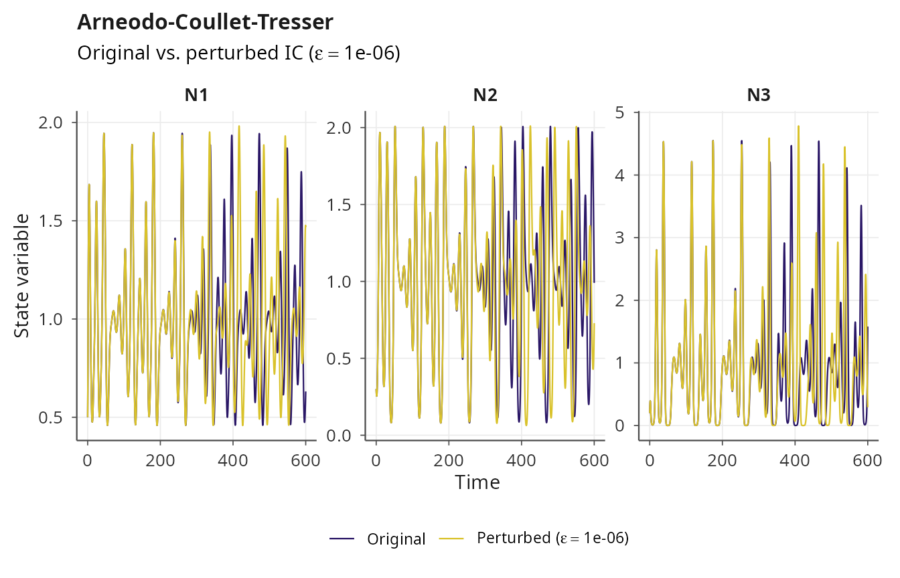

``` r

plot(vact_run, type = "attractor",  epsilon = 1e-6)
```

  

### Vano four-species competition

Vano et al. [\[18\]](#ref18) searched the parameter space of
four-species Lotka-Volterra competition \\ \frac{d x_i}{d t} = r_i x_i
\left( 1 - \sum\_{j=1}^{4} a\_{ij} x_j \right), \qquad i = 1, 2, 3, 4,
\\ for parameters that maximise the largest Lyapunov exponent. Their
attractor has spectrum and Kaplan-Yorke dimension . Hirsch’s carrying
simplex theorem [\[19\]](#ref19) forces all asymptotic dynamics onto a
three-dimensional simplex, so chaos in competitive four-species systems
is topologically the simplest possible folded-band chaos.

``` r

lv4 <- system_spec(
    rhs = list(
        x1 ~ r1 * x1 * (1 - (a11 * x1 + a12 * x2 + a13 * x3 + a14 * x4)),
        x2 ~ r2 * x2 * (1 - (a21 * x1 + a22 * x2 + a23 * x3 + a24 * x4)),
        x3 ~ r3 * x3 * (1 - (a31 * x1 + a32 * x2 + a33 * x3 + a34 * x4)),
        x4 ~ r4 * x4 * (1 - (a41 * x1 + a42 * x2 + a43 * x3 + a44 * x4))
    ),
    state_names = c("x1", "x2", "x3", "x4"),
    parms = list(
        r1 = 1.00, r2 = 0.72, r3 = 1.53, r4 = 1.27,
        a11 = 1.00, a12 = 1.09, a13 = 1.52, a14 = 0.00,
        a21 = 0.00, a22 = 1.00, a23 = 0.44, a24 = 1.36,
        a31 = 2.33, a32 = 0.00, a33 = 1.00, a34 = 0.47,
        a41 = 1.21, a42 = 0.51, a43 = 0.35, a44 = 1.00
    ),
    init  = c(x1 = 0.3013, x2 = 0.4586, x3 = 0.1307, x4 = 0.3557),
    positive_states = TRUE,
    meta  = list(name = "Lotka-Volterra 4sp")
)
lv4_run <- dyn_sim(lv4, t_max = 2000, solver = solver_rk4(),
                   discard_transient = 500, verbose = FALSE)
plot(lv4_run, type = "timeseries", epsilon = 1e-6)
```

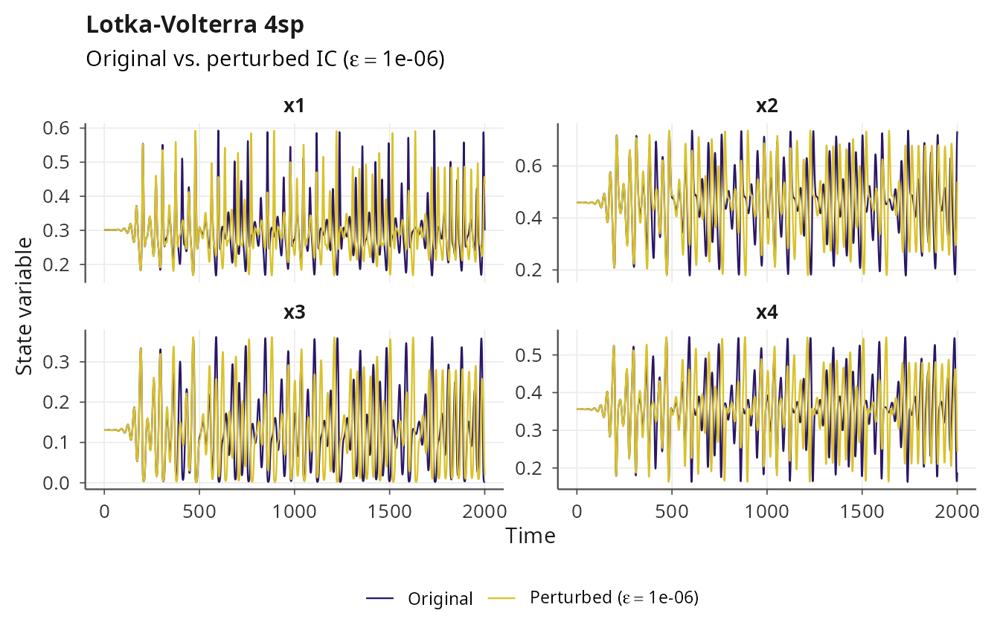

``` r

plot(lv4_run, type = "attractor",  epsilon = 1e-6)
```

  

### Hastings-Powell: the chaotic tea-cup

Hastings and Powell [\[21\]](#ref21) exhibited the first chaotic
attractor in a biologically plausible three-trophic-level food chain
with Holling type-II functional responses [\[22\]](#ref22): \\
\begin{aligned} \frac{d X}{d t} &= X (1 - X) - \frac{a_1 X Y}{1 + b_1 X}
\\ \frac{d Y}{d t} &= \frac{a_1 X Y}{1 + b_1 X} - \frac{a_2 Y Z}{1 + b_2
Y} - d_1 Y \\ \frac{d Z}{d t} &= \frac{a_2 Y Z}{1 + b_2 Y} - d_2 Z
\end{aligned} \\ Varying from 2 to 6.2 traces out a period-doubling
route to chaos; the resulting bifurcation diagram is the canonical
ecological demonstration of the Feigenbaum scenario.

``` r

hp <- system_spec(
    rhs = list(
        X ~ X * (1 - X) - (a1 * X * Y) / (1 + b1 * X),
        Y ~ (a1 * X * Y) / (1 + b1 * X) -
            (a2 * Y * Z) / (1 + b2 * Y) - d1 * Y,
        Z ~ (a2 * Y * Z) / (1 + b2 * Y) - d2 * Z
    ),
    state_names = c("X", "Y", "Z"),
    parms = list(a1 = 5, b1 = 3, a2 = 0.1, b2 = 2, d1 = 0.4, d2 = 0.01),
    init  = c(X = 0.7, Y = 0.2, Z = 9),
    positive_states = TRUE,
    meta  = list(name = "Hastings-Powell")
)
hp_run <- dyn_sim(hp, t_max = 3000, solver = solver_rk4(),
                  discard_transient = 1500, verbose = FALSE)
plot(hp_run, type = "timeseries", epsilon = 1e-6)
```

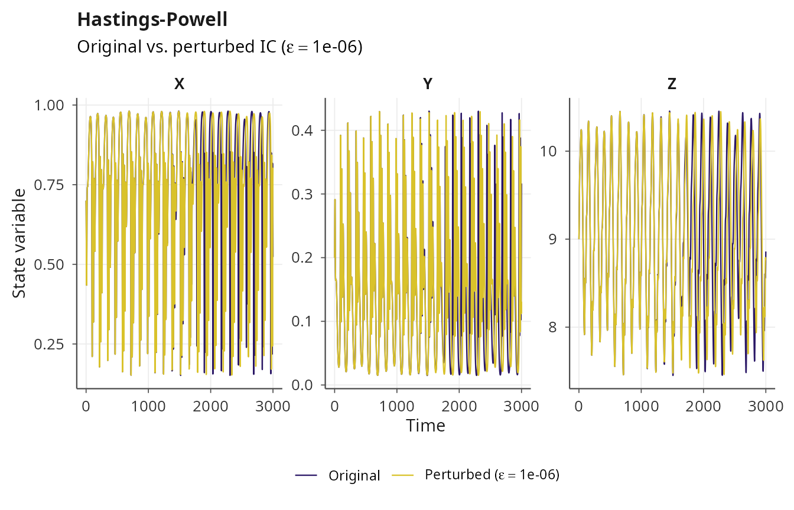

``` r

plot(hp_run, type = "attractor",  epsilon = 1e-6)
```

``` r

bd_hp <- bifurcation_diagram(hp, par_name = "b1",
                              par_range = c(2, 6.2), observable = "Y",
                              n_par = 80, t_max = 2000,
                              discard_transient = 1500, n_keep = 120,
                              compute_lyapunov = TRUE,
                              lyap_kwargs = list(t_max = 400, dt = 0.05),
                              verbose = FALSE)
plot(bd_hp)
```

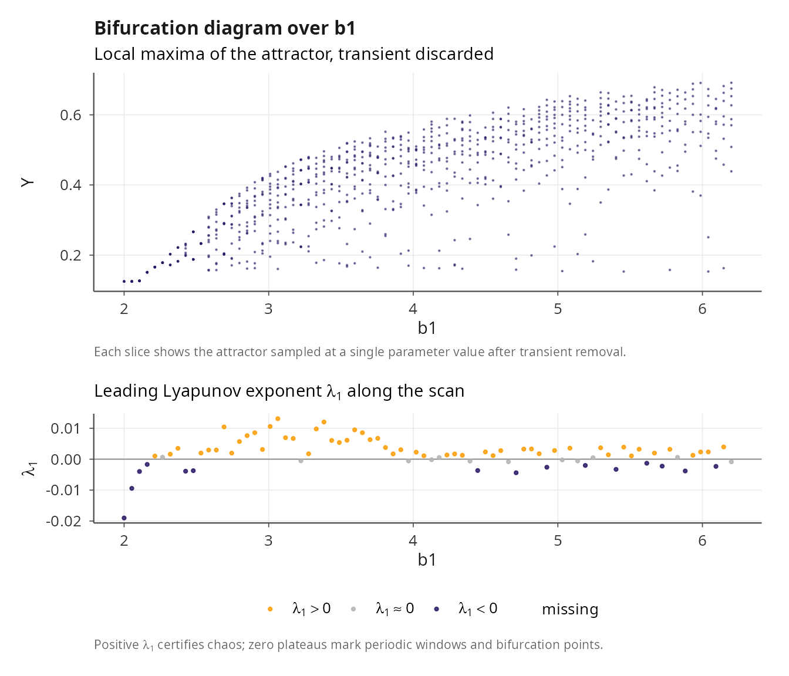

  

### Seasonally forced SIR model and the biennial measles cycle

Earn, Rohani, Bolker and Grenfell [\[42\]](#ref42) showed that childhood
infection data are better explained by a seasonally forced SIR model
with external immigration than by its autonomous SIR counterpart. Pure
SIR with reasonable transmission rates does not exhibit full chaos in
its deterministic form, but it supports the classical **period-two
biennial cycle** of pre-vaccination measles: large outbreaks in odd
years, small ones in even years, locked to the school-term forcing.
Genuine chaotic dynamics of childhood infections require either
demographic stochasticity, the SEIR extension with a latent class, or
age-structured contact matrices. The chunk below reproduces the biennial
limit cycle that is the textbook signature of this model. The model
reads \\ \begin{aligned} \frac{d S}{d t} &= \mu - \beta(z) S I - \mu S
\\ \frac{d I}{d t} &= \beta(z) S I - (\gamma + \mu) I + \varepsilon \\
\frac{d R}{d t} &= \gamma I - \mu R \\ \frac{d z}{d t} &= 1
\end{aligned} \\ with . The immigration rate is a small constant that
keeps above machine epsilon in the deep interepidemic troughs, a
numerical counterpart to the rare imported cases that prevent disease
fade-out between outbreaks. The state plays the role of absolute time,
so is periodic of period one year.

``` r

sir_seasonal <- system_spec(
    rhs = list(
        S ~ mu - beta0 * (1 + beta1 * cos(2 * pi * z)) * S * I - mu * S,
        I ~ beta0 * (1 + beta1 * cos(2 * pi * z)) * S * I -
            (gammag + mu) * I + eps,
        R ~ gammag * I - mu * R,
        z ~ 1
    ),
    state_names = c("S", "I", "R", "z"),
    parms = list(mu = 0.02, beta0 = 1800, beta1 = 0.08,
                 gammag = 100, eps = 1e-6),
    init  = c(S = 0.065, I = 2e-4, R = 0.935, z = 0),
    positive_states = c("S", "I", "R"),
    meta  = list(name = "Seasonal SIR")
)
sir_run <- dyn_sim(sir_seasonal, t_max = 40,
                    solver = solver_rk45(dt_max = 0.005, atol = 1e-9,
                                          rtol = 1e-7),
                    discard_transient = 10, verbose = FALSE)
plot(sir_run, type = "timeseries", vars = c("S", "I", "R"), epsilon = 1e-6)
```

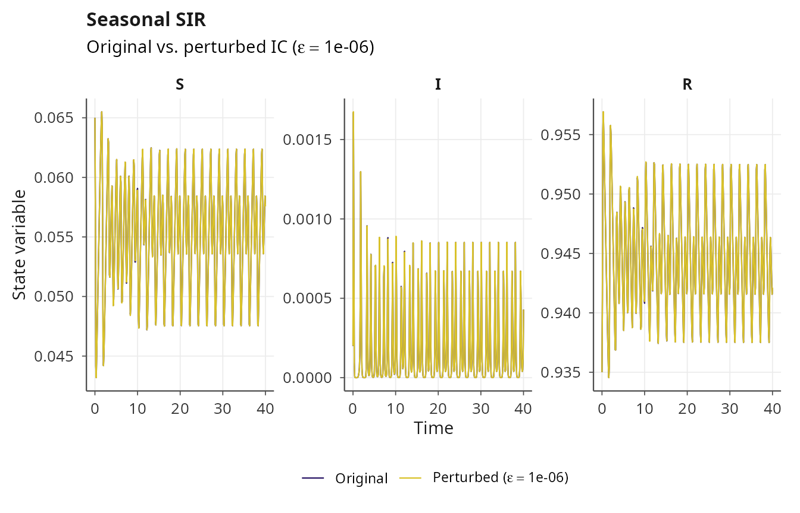

``` r

plot(sir_run, type = "attractor",  vars = c("S", "I", "R"), epsilon = 1e-6)
```

  

## Intransitive cycles: why May-Leonard is not chaotic

May and Leonard [\[20\]](#ref20) analysed the three-species competition
\\ \frac{d N_i}{d t} = N_i (1 - N_i - \alpha N\_{i+1} - \beta N\_{i+2}),
\qquad i = 1, 2, 3 \pmod 3, \\ and showed that for with one of the three
single-species equilibria form an attracting heteroclinic cycle.
Trajectories visit each monoculture in turn, spending successively
longer times near each vertex. This is an intransitive
rock-paper-scissors dynamic and is the simplest dynamical mechanism by
which biological diversity is maintained in the absence of any stable
interior equilibrium.

**This is not chaos.** An attracting heteroclinic cycle is a
Lyapunov-stable attractor with a neutrally stable direction along the
cycle, hence a largest exponent when computed along a single orbit; it
lacks topological transitivity in the chaotic sense because almost every
orbit spends of its time arbitrarily close to the three vertices. The
0-1 test will report values near zero, the correlation dimension near
one, and the Lyapunov spectrum zero or negative. We include the section
as a methodological contrast.

``` r

may_leonard <- system_spec(
    rhs = list(
        N1 ~ N1 * (1 - N1 - alpha * N2 - beta * N3),
        N2 ~ N2 * (1 - beta * N1 - N2 - alpha * N3),
        N3 ~ N3 * (1 - alpha * N1 - beta * N2 - N3)
    ),
    state_names = c("N1", "N2", "N3"),
    parms = list(alpha = 1.5, beta = 0.7),
    init  = c(N1 = 0.5, N2 = 0.3, N3 = 0.2),
    positive_states = TRUE,
    meta  = list(name = "May-Leonard")
)
ml_run <- dyn_sim(may_leonard, t_max = 2000,
                  solver = solver_rk4(dt = 0.01),
                  discard_transient = 0, verbose = FALSE)
plot(ml_run, type = "timeseries", epsilon = 1e-6)
```

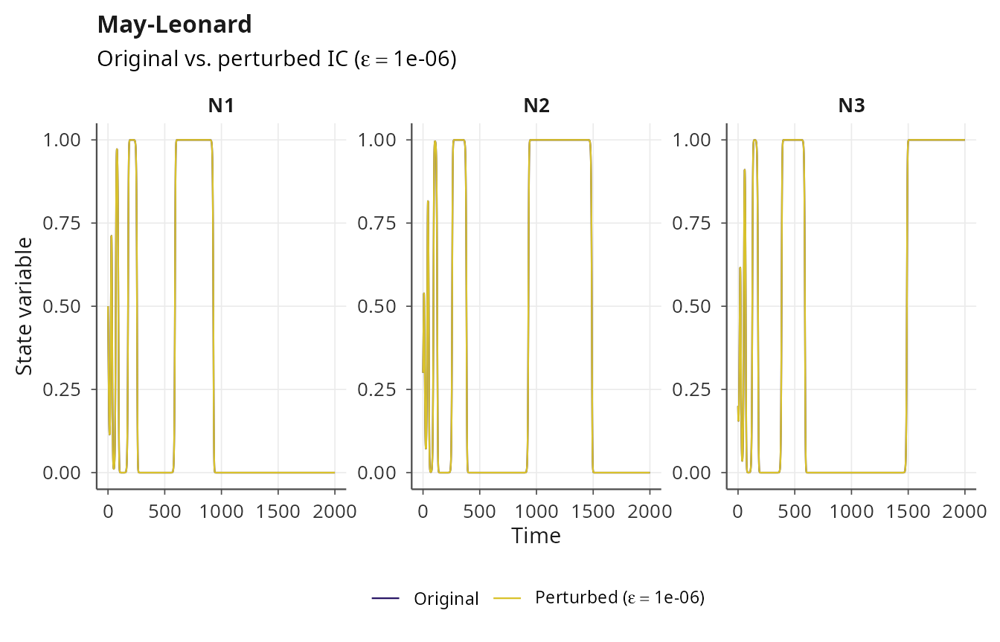

``` r

plot(ml_run, type = "attractor",  epsilon = 1e-6)
```

Running the 0-1 test confirms the non-chaotic verdict:

``` r

z_ml <- zero_one_test(ml_run, var = "N1")
print(z_ml)
#> 
#> 0-1 test for chaos
#> ------------------
#>   observable : N1
#>   samples    : 501 (stride 40)
#>   n_c        : 100
#>   K (median) : 0.0442
#>   verdict    : regular
```

  

## Coexisting attractors: the Newton-Leipnik dipsy-doodle

Leipnik and Newton [\[23\]](#ref23) discovered in 1981, while analysing
the equations of a rigid body subject to linear feedback control, that
the system \\ \begin{aligned} \frac{d x}{d t} &= -a x + y + 10 y z \\
\frac{d y}{d t} &= -x - a y + 5 x z \\ \frac{d z}{d t} &= \alpha z - 5 x
y \end{aligned} \\ has two coexisting strange attractors at . The upper
attractor (the *U-orbit* or *dipsy*) wraps around the pair of
eye-centers located at , so its trajectory spends almost all of its time
in the half-space ; the lower attractor (the *L-orbit* or *doodle*)
wraps around the pair of eye-centers at and lives essentially entirely
in . The name *dipsy-doodle* is Newton and Leipnik’s original. Which
attractor is selected is determined by the initial condition, and the
partition of state space into basins is a fractal object whose
computation is the standard benchmark for basin-analysis routines. The
boundary between the two basins is extremely convoluted: the canonical
pair of initial conditions differs by only and produces two trajectories
that converge to geometrically distinct invariant sets.

``` r

nl_spec <- function(z0) {
    system_spec(
        rhs = list(
            x ~ -a * x + y + 10 * y * z,
            y ~ -x - a * y + 5 * x * z,
            z ~ alpha * z - 5 * x * y
        ),
        state_names = c("x", "y", "z"),
        parms = list(a = 0.4, alpha = 0.175),
        init  = c(x = 0.349, y = 0, z = z0),
        meta  = list(name = "Newton-Leipnik")
    )
}
nl_upper <- dyn_sim(nl_spec(-0.160), t_max = 500,
                    solver = solver_rk4(dt = 0.001),
                    discard_transient = 100, verbose = FALSE)
nl_lower <- dyn_sim(nl_spec(-0.180), t_max = 500,
                    solver = solver_rk4(dt = 0.001),
                    discard_transient = 100, verbose = FALSE)

plotly::plot_ly() |>
    plotly::add_trace(data = nl_upper$attractor,
                       x = ~x, y = ~y, z = ~z,
                       type = "scatter3d", mode = "lines",
                       name = "U-orbit (dipsy)",
                       line = list(width = 1.4, color = "#2a1766")) |>
    plotly::add_trace(data = nl_lower$attractor,
                       x = ~x, y = ~y, z = ~z,
                       type = "scatter3d", mode = "lines",
                       name = "L-orbit (doodle)",
                       line = list(width = 1.4, color = "#d9c22b")) |>
    plotly::layout(
        scene = list(xaxis = list(title = "x"),
                      yaxis = list(title = "y"),
                      zaxis = list(title = "z")),
        title = list(
            text = "Newton-Leipnik coexisting strange attractors",
            x = 0.5, xanchor = "center"),
        margin = list(t = 50)
    )
```

The separation of the two invariant sets is quantitative and
reproducible: over a simulation with the first hundred time units
discarded, the upper attractor has mean with residence probability , and
the lower attractor has mean with . The time series of for the two
branches makes this visible at a glance:

``` r

df_both <- rbind(
    data.frame(time = nl_upper$attractor$time,
               z    = nl_upper$attractor$z,
               orbit = "U-orbit (dipsy)"),
    data.frame(time = nl_lower$attractor$time,
               z    = nl_lower$attractor$z,
               orbit = "L-orbit (doodle)")
)
ggplot(df_both,
       aes(x = .data$time, y = .data$z, colour = .data$orbit)) +
    geom_hline(yintercept = 0, colour = "grey70",
                         linetype = "dashed") +
    geom_line(linewidth = 0.4) +
    scale_colour_manual(values = c(
        "U-orbit (dipsy)" = "#2a1766",
        "L-orbit (doodle)" = "#d9c22b")) +
    labs(x = "Time", y = "z", colour = NULL,
                   title = "Newton-Leipnik: z(t) on the two coexisting attractors") +
    theme_minimal(base_size = 11)
```

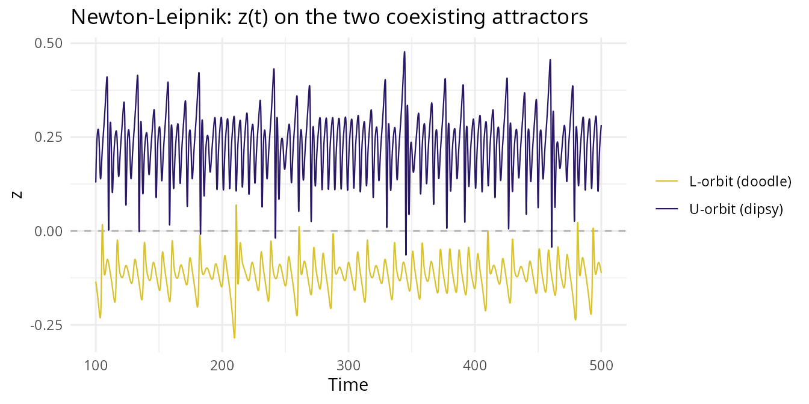

Every chaos diagnostic on each branch returns a positive verdict.
Running the Gottwald-Melbourne 0-1 test separately on for each
attractor:

``` r

plot(zero_one_test(nl_upper)) + annotate("text", x = 0.6, y = 0.25,
               label = "U-orbit",
               size = 8, colour = "#2a1766", hjust = 0)
```

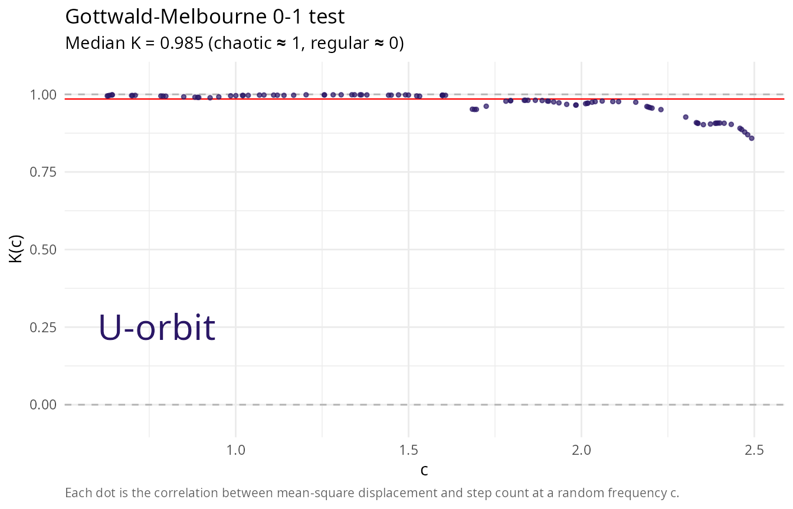

``` r


plot(zero_one_test(nl_lower)) + annotate("text", x = 0.6, y = 0.25,
               label = "L-orbit",
               size = 8, colour = "#2a1766", hjust = 0)
```

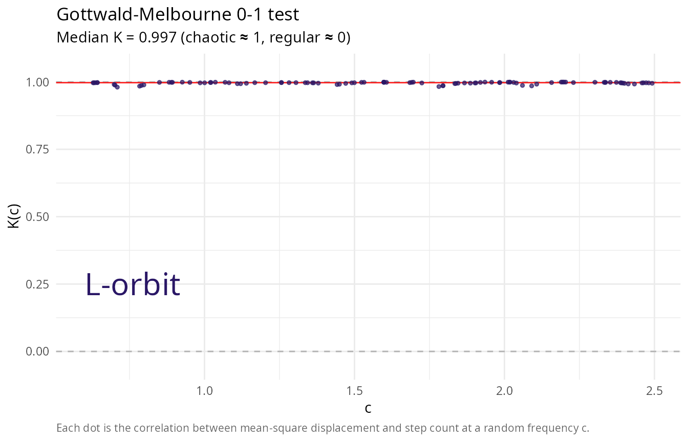

  

## Interactive rendering and further analysis

Every `dyn_sim` object accepts an interactive dygraphs time-series via
`plot(x, type = "dygraph")`, useful for long records whose features live
on multiple timescales:

``` r

# plot(lorenz_run, type = "dygraph")
```

For any system in this vignette, the sequence
`dyn_sim() -> lyapunov_spectrum() -> correlation_dimension() -> zero_one_test() -> bifurcation_diagram()`
produces a complete numerical fingerprint. The Lyapunov dimension,
correlation dimension and attractor width act as consistency checks on
each other; the 0-1 test and the bifurcation diagram corroborate or
contradict the verdict. When the verdicts disagree the correct
interpretation is almost always that the attractor is only weakly
chaotic or that the transient has not been discarded; the
Rabinovich-Fabrikant and May-Leonard sections above are practical
examples.

  

## References

**\[1\]** Lorenz, E. N. (1963). *Deterministic nonperiodic flow*.
Journal of the Atmospheric Sciences, 20(2), 130-141.
[doi:10.1175/1520-0469(1963)020\<0130:DNF\>2.0.CO;2](https://doi.org/10.1175/1520-0469(1963)020%3C0130:DNF%3E2.0.CO;2)

**\[2\]** Guckenheimer, J. and Williams, R. F. (1979). *Structural
stability of Lorenz attractors*. Publications Mathématiques de l’IHÉS,
50, 59-72. [doi:10.1007/BF02684769](https://doi.org/10.1007/BF02684769)

**\[3\]** Tucker, W. (2002). *A rigorous ODE solver and Smale’s 14th
problem*. Foundations of Computational Mathematics, 2(1), 53-117.
[doi:10.1007/s002080010018](https://doi.org/10.1007/s002080010018)

**\[4\]** Rössler, O. E. (1976). *An equation for continuous chaos*.
Physics Letters A, 57(5), 397-398.
[doi:10.1016/0375-9601(76)90101-8](https://doi.org/10.1016/0375-9601(76)90101-8)

**\[5\]** Chua, L. O., Komuro, M. and Matsumoto, T. (1986). *The double
scroll family*. IEEE Transactions on Circuits and Systems, 33(11),
1072-1118.
[doi:10.1109/TCS.1986.1085869](https://doi.org/10.1109/TCS.1986.1085869)

**\[6\]** Thomas, R. (1999). *Deterministic chaos seen in terms of
feedback circuits: analysis, synthesis, labyrinth chaos*. International
Journal of Bifurcation and Chaos, 9(10), 1889-1905.
[doi:10.1142/S0218127499001383](https://doi.org/10.1142/S0218127499001383)

**\[7\]** Sprott, J. C. (2010). *Elegant Chaos: Algebraically Simple
Chaotic Flows*. World Scientific.
[ISBN:9789814291347](https://www.worldscientific.com/worldscibooks/10.1142/7183)

**\[8\]** Langford, W. F. (1984). *Numerical studies of torus
bifurcations*. In Küpper, T., Mittelmann, H. D. and Weber, H. (eds),
Numerical Methods for Bifurcation Problems, ISNM 70, Birkhäuser,
285-295.
[doi:10.1007/978-3-0348-6256-1_19](https://doi.org/10.1007/978-3-0348-6256-1_19)

**\[9\]** Rabinovich, M. I. and Fabrikant, A. L. (1979). *Stochastic
self-modulation of waves in nonequilibrium media*. Soviet Physics JETP,
50, 311-317.

**\[10\]** Grebogi, C., Ott, E., Pelikan, S. and Yorke, J. A. (1984).
*Strange attractors that are not chaotic*. Physica D, 13(1-2), 261-268.
[doi:10.1016/0167-2789(84)90282-3](https://doi.org/10.1016/0167-2789(84)90282-3)

**\[12\]** Van der Pol, B. (1927). *Forced oscillations in a circuit
with non-linear resistance*. The London, Edinburgh, and Dublin
Philosophical Magazine and Journal of Science, 3(13), 65-80.
[doi:10.1080/14786440108564176](https://doi.org/10.1080/14786440108564176)

**\[13\]** Duffing, G. (1918). *Erzwungene Schwingungen bei
veränderlicher Eigenfrequenz und ihre technische Bedeutung*. Vieweg &
Sohn, Braunschweig.

**\[14\]** Hénon, M. (1976). *A two-dimensional mapping with a strange
attractor*. Communications in Mathematical Physics, 50(1), 69-77.
[doi:10.1007/BF01608556](https://doi.org/10.1007/BF01608556)

**\[15\]** Mackey, M. C. and Glass, L. (1977). *Oscillation and chaos in
physiological control systems*. Science, 197(4300), 287-289.
[doi:10.1126/science.267326](https://doi.org/10.1126/science.267326)

**\[16\]** Arneodo, A., Coullet, P. and Tresser, C. (1980). *Occurrence
of strange attractors in three-dimensional Volterra equations*. Physics
Letters A, 79(4), 259-263.
[doi:10.1016/0375-9601(80)90342-4](https://doi.org/10.1016/0375-9601(80)90342-4)

**\[17\]** Shil’nikov, L. P. (1965). *A case of the existence of a
denumerable set of periodic motions*. Soviet Mathematics Doklady, 6,
163-166.

**\[18\]** Vano, J. A., Wildenberg, J. C., Anderson, M. B., Noel, J. K.
and Sprott, J. C. (2006). *Chaos in low-dimensional Lotka-Volterra
models of competition*. Nonlinearity, 19(10), 2391-2404.
[doi:10.1088/0951-7715/19/10/006](https://doi.org/10.1088/0951-7715/19/10/006)

**\[19\]** Hirsch, M. W. (1988). *Systems of differential equations
which are competitive or cooperative. III: Competing species*.
Nonlinearity, 1(1), 51-71.
[doi:10.1088/0951-7715/1/1/003](https://doi.org/10.1088/0951-7715/1/1/003)

**\[20\]** May, R. M. and Leonard, W. J. (1975). *Nonlinear aspects of
competition between three species*. SIAM Journal on Applied Mathematics,
29(2), 243-253. [doi:10.1137/0129022](https://doi.org/10.1137/0129022)

**\[21\]** Hastings, A. and Powell, T. (1991). *Chaos in a three-species
food chain*. Ecology, 72(3), 896-903.
[doi:10.2307/1940591](https://doi.org/10.2307/1940591)

**\[22\]** Holling, C. S. (1959). *Some characteristics of simple types
of predation and parasitism*. The Canadian Entomologist, 91(7), 385-398.
[doi:10.4039/Ent91385-7](https://doi.org/10.4039/Ent91385-7)

**\[23\]** Leipnik, R. B. and Newton, T. A. (1981). *Double strange
attractors in rigid body motion with linear feedback control*. Physics
Letters A, 86(2), 63-67.
[doi:10.1016/0375-9601(81)90165-1](https://doi.org/10.1016/0375-9601(81)90165-1)

**\[24\]** Chen, G. and Ueta, T. (1999). *Yet another chaotic
attractor*. International Journal of Bifurcation and Chaos, 9(7),
1465-1466.
[doi:10.1142/S0218127499001024](https://doi.org/10.1142/S0218127499001024)

**\[25\]** Lü, J. and Chen, G. (2002). *A new chaotic attractor coined*.
International Journal of Bifurcation and Chaos, 12(3), 659-661.
[doi:10.1142/S0218127402004620](https://doi.org/10.1142/S0218127402004620)

**\[26\]** Vaněček, A. and Čelikovský, S. (1996). *Control systems: from
linear analysis to synthesis of chaos*. Prentice Hall.
\[<ISBN:9780131341920>\]

**\[27\]** Shimizu, T. and Morioka, N. (1980). *On the bifurcation of a
symmetric limit cycle to an asymmetric one in a simple model*. Physics
Letters A, 76(3-4), 201-204.
[doi:10.1016/0375-9601(80)90466-1](https://doi.org/10.1016/0375-9601(80)90466-1)

**\[28\]** Hoover, W. G. (1985). *Canonical dynamics: equilibrium
phase-space distributions*. Physical Review A, 31(3), 1695-1697.
[doi:10.1103/PhysRevA.31.1695](https://doi.org/10.1103/PhysRevA.31.1695)

**\[29\]** Sprott, J. C. (1997). *Some simple chaotic jerk functions*.
American Journal of Physics, 65(6), 537-543.
[doi:10.1119/1.18585](https://doi.org/10.1119/1.18585)

**\[30\]** Lorenz, E. N. (1984). *Irregularity: a fundamental property
of the atmosphere*. Tellus A, 36(2), 98-110.
[doi:10.3402/tellusa.v36i2.11473](https://doi.org/10.3402/tellusa.v36i2.11473)

**\[31\]** Lorenz, E. N. (1996). *Predictability: a problem partly
solved*. In *Seminar on Predictability*, ECMWF, Reading. [ECMWF
proceedings](https://www.ecmwf.int/en/elibrary/75462-predictability-problem-partly-solved)

**\[33\]** Feigenbaum, M. J. (1978). *Quantitative universality for a
class of nonlinear transformations*. Journal of Statistical Physics,
19(1), 25-52.
[doi:10.1007/BF01020332](https://doi.org/10.1007/BF01020332)

**\[34\]** Chirikov, B. V. (1979). *A universal instability of
many-dimensional oscillator systems*. Physics Reports, 52(5), 263-379.
[doi:10.1016/0370-1573(79)90023-1](https://doi.org/10.1016/0370-1573(79)90023-1)

**\[35\]** Lozi, R. (1978). *Un attracteur étrange (?) du type
attracteur de Hénon*. Journal de Physique Colloques, 39(C5), 9-10.
[doi:10.1051/jphyscol:1978505](https://doi.org/10.1051/jphyscol:1978505)

**\[36\]** Ikeda, K. (1979). *Multiple-valued stationary state and its
instability of the transmitted light by a ring cavity system*. Optics
Communications, 30(2), 257-261.
[doi:10.1016/0030-4018(79)90090-7](https://doi.org/10.1016/0030-4018(79)90090-7)

**\[37\]** Ikeda, K., Daido, H. and Akimoto, O. (1980). *Optical
turbulence: chaotic behavior of transmitted light from a ring cavity*.
Physical Review Letters, 45(9), 709-712.
[doi:10.1103/PhysRevLett.45.709](https://doi.org/10.1103/PhysRevLett.45.709)

**\[38\]** Lang, R. and Kobayashi, K. (1980). *External optical feedback
effects on semiconductor injection laser properties*. IEEE Journal of
Quantum Electronics, 16(3), 347-355.
[doi:10.1109/JQE.1980.1070479](https://doi.org/10.1109/JQE.1980.1070479)

**\[39\]** Rössler, O. E. (1979). *An equation for hyperchaos*. Physics
Letters A, 71(2-3), 155-157.
[doi:10.1016/0375-9601(79)90150-6](https://doi.org/10.1016/0375-9601(79)90150-6)

**\[40\]** Sivashinsky, G. I. (1977). *Nonlinear analysis of
hydrodynamic instability in laminar flames. I. Derivation of basic
equations*. Acta Astronautica, 4(11-12), 1177-1206.
[doi:10.1016/0094-5765(77)90096-0](https://doi.org/10.1016/0094-5765(77)90096-0)

**\[41\]** Aranson, I. S. and Kramer, L. (2002). *The world of the
complex Ginzburg-Landau equation*. Reviews of Modern Physics, 74(1),
99-143.
[doi:10.1103/RevModPhys.74.99](https://doi.org/10.1103/RevModPhys.74.99)

**\[42\]** Earn, D. J. D., Rohani, P., Bolker, B. M. and Grenfell, B. T.
(2000). *A simple model for complex dynamical transitions in epidemics*.
Science, 287(5453), 667-670.
[doi:10.1126/science.287.5453.667](https://doi.org/10.1126/science.287.5453.667)
