# A guided tour of janos

``` r
library(janos)
library(ggplot2)
library(patchwork)
```

  

## Abstract

janos is a unified R framework for specifying, simulating, and analysing
dynamical systems. A single
[`model_spec()`](https://robustecologies.github.io/janos/reference/model_spec.md)
object encodes the governing equations; a single
[`dyn_sim()`](https://robustecologies.github.io/janos/reference/dyn_sim.md)
entry point integrates them through a family-aware solver stack; and a
family-aware analysis layer computes qualitative portraits, continuation
diagrams, Fokker-Planck densities, quasi-stationary distributions,
Lyapunov spectra and constructive Lyapunov certificates, rare-event
probabilities, and adjoint-based sensitivities. Under the hood, every
model expressed as formulas is lowered to C++ through Rcpp and cached
across sessions, so compiled performance is available without leaving R.
This vignette is the entry point to the janos workflow. It establishes
the taxonomy of systems the package recognises, provides a decision tree
that maps a user question onto the matching
[`model_spec()`](https://robustecologies.github.io/janos/reference/model_spec.md)
slot and the available analysis functions, demonstrates the uniform API
by rendering the same biological problem as an ODE, a continuous-time
Markov chain and a chemical Langevin equation, walks four contrasting
canonical systems on one decision branch each, and closes with a case
study on a stochastic metapopulation with an Allee effect that exercises
the full stack end-to-end and contrasts the deterministic and stochastic
extinction boundaries with a measurable prediction.

  

## 1. Eight families under one specification

Dynamical systems differ along five mathematical axes: time continuity
(continuous or discrete), determinism (deterministic or stochastic),
memory (memoryless or delayed), regularity (smooth or switched), and
spatial coupling (well-mixed or distributed). janos recognises eight
families that partition this space. Ordinary differential equations
(ODEs) are continuous, deterministic, memoryless, smooth and well-mixed;
their janos signature is a `rhs` slot in
[`model_spec()`](https://robustecologies.github.io/janos/reference/model_spec.md).
Discrete maps share determinism but replace continuous time by integer
iteration and use the `map` slot. Delay differential equations (DDEs)
introduce finite history through the `delays` slot. Stochastic
differential equations (SDEs) add a Brownian or more general noise
channel through `diffusion` and an optional `noise` specification.
Continuous-time Markov chains (CTMCs) describe integer populations under
mass-action kinetics through `stoichiometry` and `propensities`.
Jump-diffusions superimpose a Poisson jump process onto a diffusion via
`jumps`. Piecewise deterministic Markov processes (PDMPs) alternate
between smooth flow and Markovian switching via `regimes` and
`transitions`. Partial differential equations (PDEs) discretise a
spatial dimension through `pde` and `spatial`, and the
reaction-diffusion master equation (RDME) extends the CTMC layer to
graphs of voxels through `spatial = list(adjacency = ...)`. All eight
families share one constructor, one simulation entry point and one
analysis vocabulary.

  

## 2. Decision tree

The following tree walks from the single question *what kind of state
does the system have* down to the
[`model_spec()`](https://robustecologies.github.io/janos/reference/model_spec.md)
slot that selects each family and to the solver and analysis entry
points that apply. Diamonds are decision nodes; coloured rectangles are
model families; the compact second line inside each leaf lists the
primary analysis functions the family supports.

  

## 3. One specification, three families

The same biological problem can be expressed in three distinct
mathematical regimes within janos with no change to the constructor
interface. Consider a two-species Lotka-Volterra predator-prey system
with prey \\x\\ and predator \\y\\, interaction rate \\\beta\\ and
predator efficiency \\\delta\\. As a deterministic ODE the system is
written through the `rhs` slot; as a CTMC with integer-valued
populations it is written through `stoichiometry` and `propensities`,
with propensities computed under a system size \\\Omega\\; as a chemical
Langevin equation it couples the continuous drift to a square-root
diffusion through both `rhs` and `diffusion` slots. The three
definitions share the same state names, the same initial condition up to
integer rounding and the same parameter names. Different `solver_*()`
constructors dispatch to the correct family.

``` r
lv_ode <- model_spec(
    rhs = list(
        x ~  alpha * x - beta  * x * y,
        y ~  delta * x * y - gamma * y
    ),
    state_names = c("x", "y"),
    parms = list(alpha = 1.0, beta = 0.1, delta = 0.075, gamma = 1.5),
    init  = c(x = 40, y = 9)
)
run_ode <- dyn_sim(lv_ode, t_max = 50, solver = solver_rk45(),
                   discard_transient = 0, verbose = FALSE)
plot(run_ode, title = "Lotka-Volterra as an ODE")
```

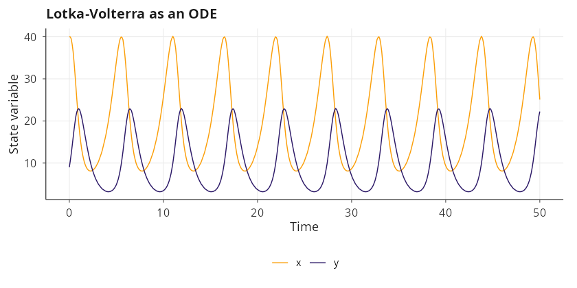

``` r
Omega <- 30
lv_ctmc <- model_spec(
    stoichiometry = list(
        birth_x  = c(x =  1L, y =  0L),
        pred     = c(x = -1L, y =  1L),
        death_y  = c(x =  0L, y = -1L)
    ),
    propensities = list(
        birth_x ~ alpha * x,
        pred    ~ beta  * x * y / Omega,
        death_y ~ gamma * y
    ),
    state_names = c("x", "y"),
    parms = list(alpha = 1.0, beta = 0.1, gamma = 1.5, Omega = Omega),
    init  = c(x = 40L * Omega, y = 9L * Omega)
)
run_ctmc <- dyn_sim(lv_ctmc, t_max = 50,
                    solver = solver_ssa_direct(output_dt = 0.1),
                    discard_transient = 0, verbose = FALSE)
plot(run_ctmc, title = "Lotka-Volterra as a CTMC (Gillespie)")
```

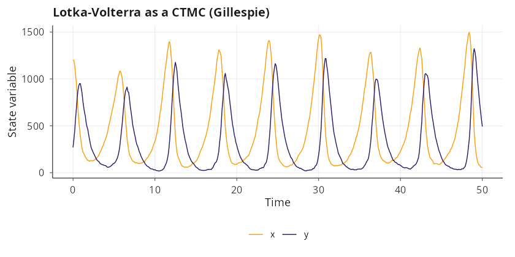

``` r
lv_cle <- model_spec(
    rhs = list(
        x ~  alpha * x - beta  * x * y,
        y ~  delta * x * y - gamma * y
    ),
    diffusion = list(
        x ~ sqrt(alpha * x + beta  * x * y) / sqrt(Omega),
        y ~ sqrt(delta * x * y + gamma * y) / sqrt(Omega)
    ),
    state_names = c("x", "y"),
    parms = list(alpha = 1.0, beta = 0.1, delta = 0.075, gamma = 1.5,
                 Omega = Omega),
    init  = c(x = 40, y = 9),
    positive_states = TRUE
)
run_cle <- dyn_sim(lv_cle, t_max = 50,
                   solver = solver_euler_maruyama(dt = 0.01),
                   discard_transient = 0, verbose = FALSE)
plot(run_cle, title = "Lotka-Volterra as a chemical Langevin equation")
```

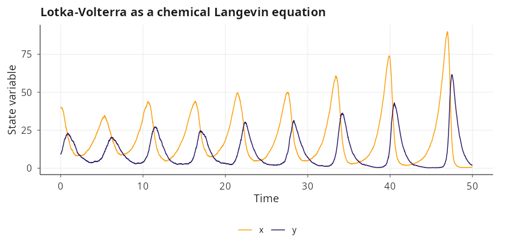

The ODE, CTMC and CLE share the same qualitative geometry; the
statistical fluctuations around the deterministic orbit scale as
\\1/\sqrt{\Omega}\\.

  

## 4. A contrasting gallery

The following four examples illustrate one decision-tree branch each.
None of the systems is used elsewhere in the janos vignettes or in the
README, so a reader who has not yet explored the package encounters four
canonical problems and four distinct analysis paths in one reading.

  

### 4.1 Selkov glycolytic oscillator: continuation and Hopf onset

The Selkov model [\[1\]](#ref1) is a minimal two-variable ODE for
glycolytic oscillations, \\\dot{x} = -x + a\\y + x^2\\y\\ and \\\dot{y}
= b - a\\y - x^2\\y\\, where \\x\\ and \\y\\ represent dimensionless
adenosine-diphosphate and fructose-6-phosphate concentrations. For fixed
\\b\\ the system undergoes a supercritical Hopf bifurcation as \\a\\
crosses a critical value that depends on \\b\\;
[`continuation()`](https://robustecologies.github.io/janos/reference/continuation.md)
traces the equilibrium branch in \\a\\ and detects the Hopf crossing
automatically, while
[`phase_portrait()`](https://robustecologies.github.io/janos/reference/phase_portrait.md)
shows the focus becoming a limit cycle.

``` r
selkov <- model_spec(
    rhs = list(
        x ~ -x + a * y + x^2 * y,
        y ~  b - a * y - x^2 * y
    ),
    state_names = c("x", "y"),
    parms = list(a = 0.1, b = 0.5),
    init  = c(x = 0.5, y = 0.5)
)

pp_selkov <- phase_portrait(selkov,
                            xlim = c(0, 2.0), ylim = c(0, 3.5),
                            trajectories = TRUE, manifolds = TRUE)
cont_selkov <- continuation(selkov, par_name = "a",
                            par_range = c(0.02, 0.35), verbose = FALSE)

plot(pp_selkov, title = "Selkov phase portrait at a = 0.1, b = 0.5") /
    plot(cont_selkov, title = "Continuation in a with Hopf crossing")
```

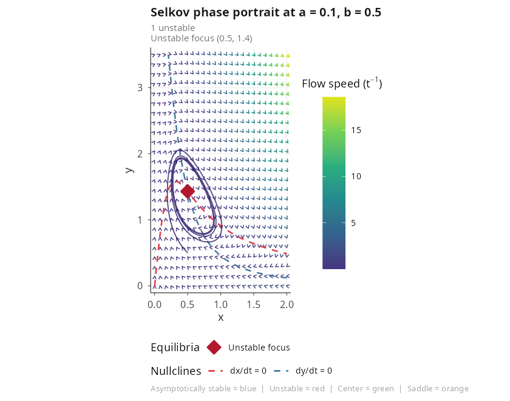

  

### 4.2 Stochastic double-well: Fokker-Planck density and Kramers rate

The prototypical one-dimensional bistable drift \\\dot{x} = x - x^3\\
has two symmetric minima at \\x = \pm 1\\ separated by a barrier at the
origin. Under additive white noise of intensity \\\sigma\\ the
stationary density is the Gibbs measure \\\exp(-2\\V(x)/\sigma^2)\\ with
\\V(x) = -x^2/2 + x^4/4\\, and the mean first-passage time between wells
follows Kramers’ law [\[2\]](#ref2). The
[`fp_potential()`](https://robustecologies.github.io/janos/reference/fp_potential.md)
function reconstructs \\V(x)\\ from the drift,
[`fp_stationary()`](https://robustecologies.github.io/janos/reference/fp_stationary.md)
integrates the steady 1D Fokker-Planck equation [\[3\]](#ref3) and
[`fp_kramers_rate()`](https://robustecologies.github.io/janos/reference/fp_kramers_rate.md)
applies the Kramers-Eyring-Polanyi formula.

``` r
dw <- model_spec(
    rhs       = list(x ~ x - x^3),
    diffusion = list(x ~ 0.35),
    state_names = "x",
    parms = list(),
    init  = c(x = -1.0)
)

dw_run <- dyn_sim(dw, t_max = 400,
                  solver = solver_euler_maruyama(dt = 0.01),
                  discard_transient = 50, verbose = FALSE)

V   <- fp_potential   (dw, xlim = c(-2.2, 2.2))
rho <- fp_stationary  (dw, xlim = c(-2.2, 2.2), epsilon = 0.35^2)
kra <- fp_kramers_rate(dw, xlim = c(-2.2, 2.2), epsilon = 0.35^2)

(plot(V,      title = "Potential V(x)") |
 plot(rho,    title = "Stationary FP density")) /
(plot(dw_run, title = "Sample path (inter-well hopping)") |
 plot(kra,    title = "Kramers escape rate"))
```

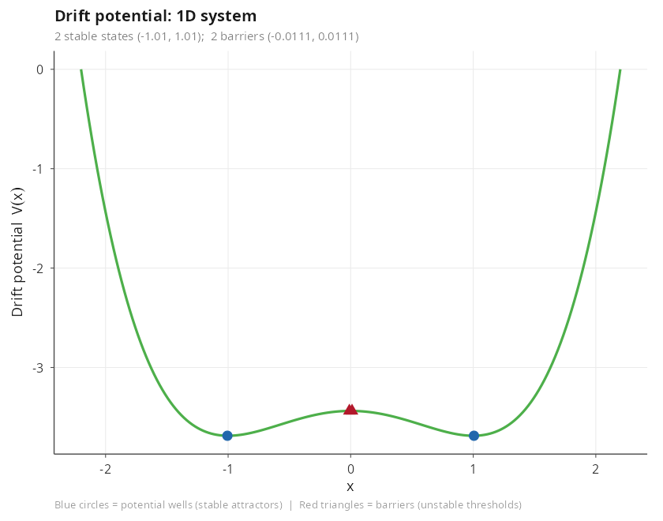

  

### 4.3 Nicholson blowflies DDE: delay-induced oscillations

The Nicholson blowflies equation [\[4\]](#ref4) models an insect
population under adult-density-dependent mortality and reproduction that
depends on the density \\\tau\\ time units earlier: \\\dot{N} = P\\N(t -
\tau)\\\exp(-N(t - \tau)/N_0) - \delta\\N\\. The delay generates
sustained oscillations whose period scales with \\\tau\\; for
sufficiently large \\\tau\\ the attractor becomes aperiodic.
[`spectral_analysis()`](https://robustecologies.github.io/janos/reference/spectral_analysis.md)
extracts the fundamental frequency; a manual sweep of
[`dyn_sim()`](https://robustecologies.github.io/janos/reference/dyn_sim.md)
over \\\tau\\ traces the attractor extrema through the onset of
oscillation, since
[`bifurcation_diagram()`](https://robustecologies.github.io/janos/reference/bifurcation_diagram.md)
is restricted to ODE and map families.

``` r
nicholson <- model_spec(
    rhs = list(N ~ P * N_tau * exp(-N_tau / N0) - delta * N),
    delays = list(N_tau = list(state = "N", tau = 15.0)),
    state_names = "N",
    parms = list(P = 8, N0 = 1.0, delta = 0.175),
    init  = c(N = 3.0),
    positive_states = TRUE
)

nich_run  <- dyn_sim(nicholson, t_max = 300,
                     solver = solver_dde(dt = 0.1),
                     discard_transient = 100, verbose = FALSE)
spec_nich <- spectral_analysis(nich_run)

tau_grid  <- seq(4, 22, length.out = 14)
tau_sweep <- vapply(tau_grid, function(tv) {
    m <- nicholson
    m$delays$N_tau$tau <- tv
    r <- dyn_sim(m, t_max = 300, solver = solver_dde(dt = 0.1),
                 discard_transient = 150, verbose = FALSE)
    range(r$attractor$N)
}, numeric(2))

df_tau <- data.frame(
    tau  = rep(tau_grid, each = 2L),
    N    = as.numeric(tau_sweep),
    kind = rep(c("min", "max"), length(tau_grid))
)
p_tau <- ggplot(df_tau, aes(x = tau, y = N, colour = kind)) +
    geom_line(linewidth = 0.8) +
    scale_colour_manual(values = c(min = "#E66101", max = "#5E3C99")) +
    labs(title = "Attractor extrema across the delay tau",
         x = "delay tau", y = "range of N on the attractor") +
    theme_minimal() +
    theme(legend.position = "none")

plot(nich_run,  title = "Nicholson attractor at tau = 15") /
plot(spec_nich, title = "Welch periodogram") /
p_tau
```

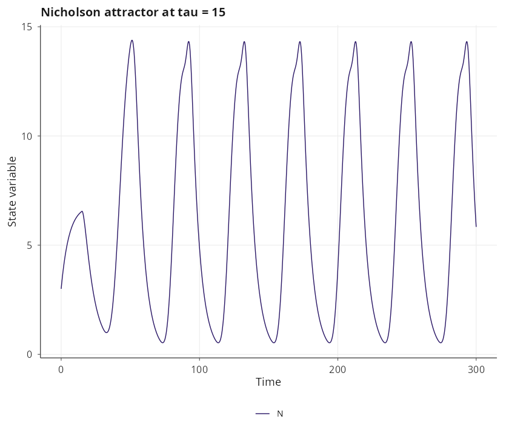

  

### 4.4 Newell-Whitehead-Segel amplitude equation: pattern onset

The amplitude equation \\u_t = r\\u + \partial_x^2 u - u^3\\
[\[5\]](#ref5)[\[6\]](#ref6) describes the envelope of a weakly
nonlinear pattern near threshold. On a bounded interval with Dirichlet
boundary conditions the trivial state \\u \equiv 0\\ is stable below the
threshold \\r_c = (\pi/L)^2\\ and loses stability through a pitchfork
bifurcation toward a smooth stationary profile. The corresponding janos
specification uses only the second spatial derivative operator `d2x`,
and simulating two runs below and above \\r_c\\ visualises the
bifurcation directly.

``` r
L <- 8
nws_sub <- model_spec(
    pde = list(u ~ r * u + d2x(u) - u^3),
    state_names = "u",
    parms = list(r = 0.1),
    spatial = list(
        domain = c(0, L), n_grid = 81L,
        bc = list(u = list(type = "dirichlet", left = 0, right = 0))
    ),
    init = function(x) 0.05 * sin(pi * x / L)
)
nws_super <- model_spec(
    pde = list(u ~ r * u + d2x(u) - u^3),
    state_names = "u",
    parms = list(r = 0.6),
    spatial = list(
        domain = c(0, L), n_grid = 81L,
        bc = list(u = list(type = "dirichlet", left = 0, right = 0))
    ),
    init = function(x) 0.05 * sin(pi * x / L)
)
run_sub   <- dyn_sim(nws_sub,   t_max = 50,
                     solver = solver_mol(dt = 0.001, subsample = 100L),
                     discard_transient = 0, verbose = FALSE)
run_super <- dyn_sim(nws_super, t_max = 50,
                     solver = solver_mol(dt = 0.001, subsample = 100L),
                     discard_transient = 0, verbose = FALSE)

plot(run_sub,   type = "snapshot",
     title = "r = 0.1, subcritical") |
    plot(run_super, type = "snapshot",
         title = "r = 0.6, supercritical")
```

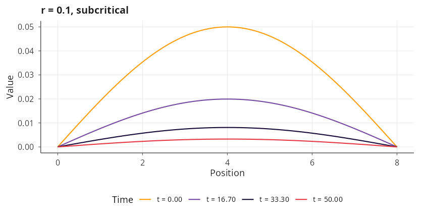

  

## 5. Case study: metapopulation with an Allee effect on a heterogeneous lattice

The final case study exercises several janos subsystems in a single
narrative. A population with a strong Allee effect [\[7\]](#ref7)
occupies a four-by-four lattice of patches connected by
nearest-neighbour dispersal. Within each patch individuals are born and
die through density-dependent processes, and between adjacent patches
they hop as a first-order diffusion reaction. Writing \\b(N) = b_0\\N^2
/ (A + N)\\ and \\d(N) = d_0\\N + \beta\\N^2\\, the well-mixed mean
field \\\dot{N} = b(N) - d(N)\\ admits three non-negative equilibria:
extinction at zero, an unstable Allee threshold and a stable carrying
capacity. Below the threshold the population collapses; above it, it
saturates. The scientific question is how demographic stochasticity
shifts this deterministic picture when a small network of patches is
coupled by dispersal.

  

### 5.1 Well-mixed mean field and continuation

``` r
allee_mf <- model_spec(
    rhs = list(N ~ b0 * N^2 / (A + N) - d0 * N - beta * N^2),
    state_names = "N",
    parms = list(b0 = 1.0, d0 = 0.1, A = 10.0, beta = 0.005),
    init  = c(N = 5.0),
    positive_states = TRUE
)

rhs_grid <- seq(0, 200, length.out = 400)
parms_mf <- allee_mf$parms
rhs_vals <- with(parms_mf,
                 b0 * rhs_grid^2 / (A + rhs_grid) -
                     d0 * rhs_grid - beta * rhs_grid^2)
p_rhs <- ggplot(data.frame(N = rhs_grid, dNdt = rhs_vals),
                aes(x = N, y = dNdt)) +
    geom_hline(yintercept = 0, linetype = 2, colour = "grey40") +
    geom_line(colour = "#2C7FB8", linewidth = 0.8) +
    labs(title = "dN/dt: extinction, Allee threshold, carrying capacity",
         x = "N", y = "dN/dt") +
    theme_minimal()

cont_mf <- continuation(allee_mf, par_name = "A",
                        par_range = c(1, 30), verbose = FALSE)

p_rhs | plot(cont_mf, title = "Continuation over the Allee threshold A")
```

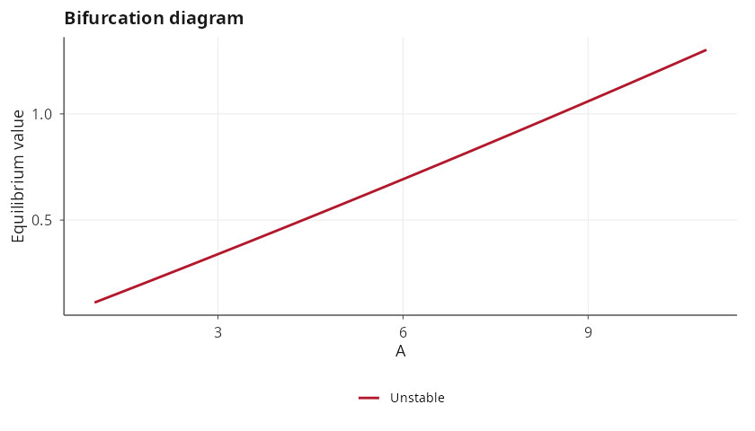

  

### 5.2 Stochastic lattice: RDME realisation

``` r
lat <- lattice_graph(4, 4, bc = "none")
allee_rdme <- model_spec(
    stoichiometry = list(birth = c(N =  1L),
                         death = c(N = -1L)),
    propensities  = list(birth ~ b0 * N^2 / (A + N),
                         death ~ d0 * N + beta * N^2),
    state_names = "N",
    parms = list(b0 = 1.0, d0 = 0.1, A = 10.0, beta = 0.005, D_N = 0.05),
    init  = function(node) {
        c(N = if (node %in% c(1L, 6L, 11L, 16L)) 60L else 15L)
    },
    spatial = list(diffusion_rates = list(N ~ D_N), adjacency = lat)
)

rdme_run <- dyn_sim(allee_rdme, t_max = 100,
                    solver = solver_rdme(output_dt = 0.5, seed = 7),
                    discard_transient = 0, verbose = FALSE)
plot(rdme_run, title = "RDME realisation on the 4 x 4 lattice")
```

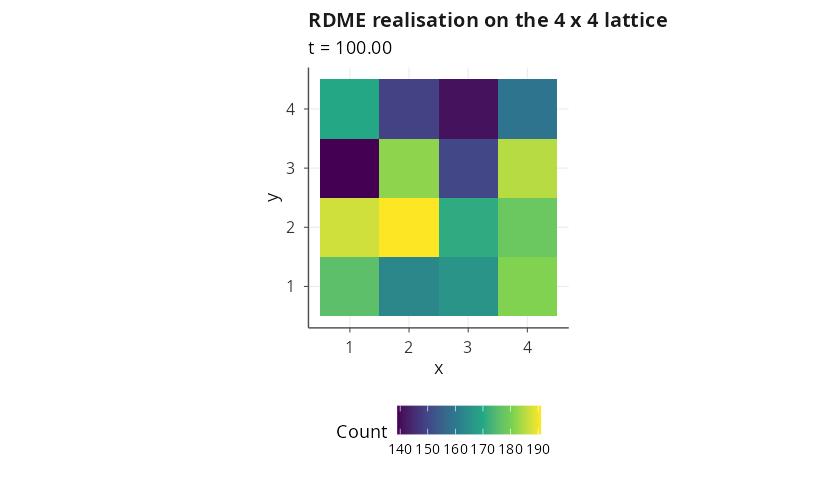

  

### 5.3 Ensemble fan chart

``` r
rdme_ens <- ensemble_sim(allee_rdme, n_replicates = 25, t_max = 100,
                         solver = solver_rdme(output_dt = 1.0),
                         parallel = FALSE, verbose = FALSE)
plot(rdme_ens, type = "fan",
     title = "Ensemble fan chart of the lattice metapopulation (n = 25)")
```

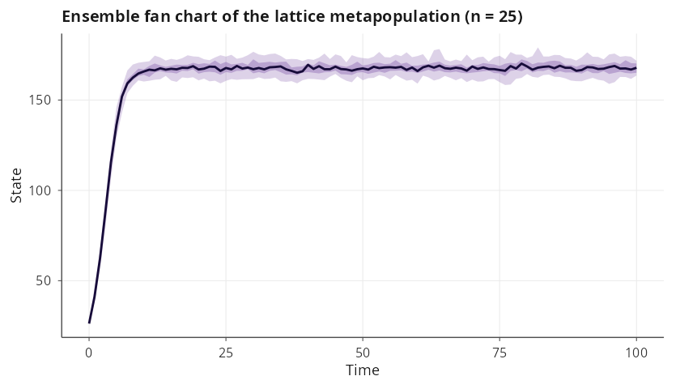

  

### 5.4 Quasi-stationary distribution on the well-mixed CTMC

Fleming-Viot particles [\[8\]](#ref8) estimate the quasi-stationary
distribution of a well-mixed absorbing chain by resampling particles
that hit the absorbing set from the empirical distribution of survivors.
Applied to the well-mixed Allee CTMC, the QSD peaks below the
deterministic carrying capacity; the stochastic contraction is a
finite-population correction to the mass-action approximation.

``` r
allee_single <- model_spec(
    stoichiometry = list(birth = c(N =  1L),
                         death = c(N = -1L)),
    propensities  = list(birth ~ b0 * N^2 / (A + N),
                         death ~ d0 * N + beta * N^2),
    state_names = "N",
    parms = list(b0 = 1.0, d0 = 0.1, A = 10.0, beta = 0.005),
    init  = c(N = 30L)
)
```

``` r
qsd <- estimate_qsd(allee_single,
                    absorbing       = ~ N == 0,
                    n_particles     = 150L,
                    t_max           = 120,
                    sample_interval = 1.0,
                    seed = 11, verbose = FALSE)
plot(qsd, title = "Quasi-stationary distribution of N (well-mixed Allee CTMC)")
```

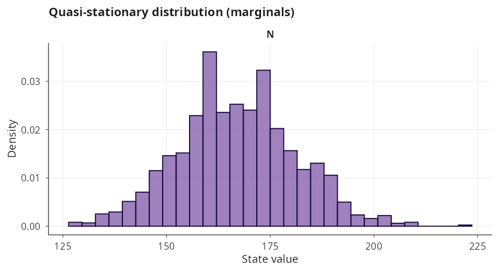

  

### 5.5 Extinction probability across the Allee threshold

As the Allee threshold \\A\\ grows, the unstable threshold and the
stable carrying capacity approach each other and annihilate at the fold;
the deterministic ODE predicts collapse to \\N = 0\\ for any \\A\\ above
the fold. The stochastic version softens this transition: for values of
\\A\\ below the deterministic fold, demographic noise already triggers
extinction with non-trivial probability over a finite horizon. Sweeping
\\A\\ across the CTMC quantifies the stochastic shift of the effective
extinction boundary.

``` r
A_grid <- seq(5, 35, length.out = 7)
p_ext <- vapply(A_grid, function(Aval) {
    m <- allee_single
    m$parms$A <- Aval
    out <- estimate_extinction(m, target = ~ N == 0,
                               n_runs = 80L, t_max = 150,
                               seed = 29, verbose = FALSE)
    as.numeric(out$probability)
}, numeric(1))

df_sweep <- data.frame(A = A_grid, p_ext = p_ext)
ggplot(df_sweep, aes(x = A, y = p_ext)) +
    geom_line(colour = "#E66101", linewidth = 0.8) +
    geom_point(colour = "#E66101", size = 2) +
    labs(title = "Stochastic extinction probability across the Allee threshold A",
         x = "Allee threshold A", y = "P( N = 0 by t = 150 )") +
    theme_minimal()
```

The quantitative takeaway is direct. Even for values of \\A\\ well below
the deterministic fold, the stochastic population goes extinct with
non-trivial probability inside a finite horizon, because demographic
noise transports the system across the unstable Allee threshold. The
deterministic fold curve and the stochastic extinction-probability
surface therefore encode different information, and janos makes both
accessible through the same specification object.

  

## 6. Position of janos in the current landscape

The capability matrix below compares janos to packages and ecosystems
that target the same niche across R, Python, Julia, C++ and commercial
environments. The cell encoding uses four symbols to keep the table
within A4 width: `F` means first-class native support shipping with the
tool; `P` means partial support, either restricted in scope or available
only through an optional add-on; `C` means that the capability is
covered only when several packages in the same ecosystem are coordinated
by hand; `-` means the capability is absent and the user would have to
implement it from scratch. Capability columns are grouped into core
simulation (A to B), stochastic and spatial extensions (C to G) and
analysis layer (H to J).

| Tool / ecosystem | A. ODE (stiff, adaptive) | B. SDE (multiplicative, correlated) | C. Exotic noise (Levy, fBm, 1/f) | D. CTMC / tau-leap / hybrid | E. RDME (grids + graphs) | F. PDE via method of lines | G. DDE / PDMP / jump-diffusion | H. Continuation + bifurcation | I. Lyapunov spectrum + constructive | J. FP / QSD / rare event / MLMC / adjoint |
|:---|:---|:---|:---|:---|:---|:---|:---|:---|:---|:---|
| janos (R) | F | F | F | F | F | F | F | F | F | F |
| deSolve + sde + GillespieSSA2 + ReacTran (R) | F | P | \- | P | \- | P | P | \- | \- | \- |
| pomp (R) | P | P | \- | F | \- | \- | P | \- | \- | F |
| phaseR (R) | P | \- | \- | \- | \- | \- | \- | P | \- | \- |
| SciPy + Gillespy2 + py-pde (Python) | F | P | \- | P | \- | F | \- | \- | \- | \- |
| PyDSTool (Python) | F | \- | \- | \- | \- | \- | \- | F | P | \- |
| Tellurium / libRoadRunner (Py/R) | F | P | \- | F | \- | \- | \- | \- | \- | \- |
| SciML: DifferentialEquations.jl + BifurcationKit.jl + DynamicalSystems.jl + Catalyst.jl (Julia) | F | F | P | F | P | F | F | F | P | P |
| SUNDIALS + Boost.odeint (C++) | F | F | \- | \- | \- | P | P | \- | \- | \- |
| MATLAB ODE + SimBiology + MATCONT + dde23 | F | P | \- | F | \- | F | P | F | P | P |
| Mathematica NDSolve | F | P | \- | \- | \- | F | P | P | \- | \- |
| XPPAUT + AUTO-07p | F | P | \- | \- | \- | \- | P | F | P | \- |

Capability matrix across tools. F = first-class; P = partial or add-on;
C = cross-package coordination; - = absent. Capability blocks: A-B core
simulation, C-G stochastic and spatial extensions, H-J analysis layer.

The table does not claim feature parity for every cell; each non-obvious
assessment corresponds to a feature documented in the current manual of
the tool in question, and borderline cases are downgraded rather than
inflated. The honest summary is that no single R or Python package
covers the union of ODE with stiff solvers, SDE with exotic noise
processes, CTMC with adaptive tau-leap and hybrid SSA/CLE, RDME on grids
and on arbitrary graphs, deterministic PDE through method of lines, DDE,
PDMP, jump-diffusion, numerical continuation, Lyapunov spectrum,
constructive Lyapunov certificates, Fokker-Planck densities and Kramers
rates, quasi-stationary distributions, rare-event importance sampling,
multi-level Monte Carlo and adjoint sensitivity under a single unified
specification API. The Julia SciML stack matches janos on core
simulation and on bifurcation and chaos diagnostics, but its
exotic-noise coverage is partial, it does not ship an RDME primitive and
the constructive-Lyapunov layer with Goh, SOS, RBF, Foster, Krasovskii,
Massera and CPA builders is not part of the ecosystem. Commercial suites
(MATLAB with SimBiology, MATCONT and `dde23`; Mathematica `NDSolve`) are
broad but closed-source and license-restricted; XPPAUT and AUTO-07p
remain the reference for equilibrium continuation and qualitative
analysis but do not cover the stochastic or spatial layers.

  

## 7. Where to go next

This vignette is the unifier; every subsystem it introduces is developed
in a dedicated tutorial.
[`vignette("solvers")`](https://robustecologies.github.io/janos/articles/solvers.md)
itemises the complete solver catalogue with accuracy and stability
trade-offs.
[`vignette("qualitative-analysis")`](https://robustecologies.github.io/janos/articles/qualitative-analysis.md)
develops the phase-portrait machinery, equilibrium classification,
manifold tracing and nullclines.
[`vignette("chaotic-systems")`](https://robustecologies.github.io/janos/articles/chaotic-systems.md)
extends continuation to strange attractors and covers the full
chaos-diagnostics suite.
[`vignette("stochastic-simulation")`](https://robustecologies.github.io/janos/articles/stochastic-simulation.md)
covers CTMC modelling, SSA variants, tau-leaping, hybrid SDE,
quasi-stationary distributions and multi-level Monte Carlo.
[`vignette("sde-noise")`](https://robustecologies.github.io/janos/articles/sde-noise.md)
develops SDE solvers, correlated noise, Levy alpha-stable, fractional
Brownian motion and coloured noise.
[`vignette("spatial-dynamics")`](https://robustecologies.github.io/janos/articles/spatial-dynamics.md)
covers PDEs in one and two dimensions and the full RDME layer on grids
and graphs.
[`vignette("advanced-dynamics")`](https://robustecologies.github.io/janos/articles/advanced-dynamics.md)
covers DDEs, PDMPs, discrete maps, continuation and adjoint sensitivity.
[`vignette("lyapunov_functions")`](https://robustecologies.github.io/janos/articles/lyapunov_functions.md)
is the reference for the Lyapunov advisor and for each of the eight
constructive algorithms.
[`vignette("ensemble-simulation")`](https://robustecologies.github.io/janos/articles/ensemble-simulation.md)
covers the parallel ensemble dispatcher and the fan, spaghetti, terminal
and extinction plot types.
[`vignette("API")`](https://robustecologies.github.io/janos/articles/API.md)
provides a detailed cross-reference of every exported function and the
compilation pipeline.

  

## References

**\[1\]** Selkov, E. E. (1968). *Self-oscillations in glycolysis. A
simple kinetic model*. European Journal of Biochemistry, 4(1), 79-86.
[doi:10.1111/j.1432-1033.1968.tb00175.x](https://doi.org/10.1111/j.1432-1033.1968.tb00175.x)

**\[2\]** Kramers, H. A. (1940). *Brownian motion in a field of force
and the diffusion model of chemical reactions*. Physica, 7(4), 284-304.
[doi:10.1016/S0031-8914(40)90098-2](https://doi.org/10.1016/S0031-8914(40)90098-2)

**\[3\]** Risken, H. (1989). *The Fokker-Planck Equation: Methods of
Solution and Applications*. 2nd ed. Springer Series in Synergetics,
vol. 18. Springer. ISBN 978-3-540-61530-9.
[doi:10.1007/978-3-642-61544-3](https://doi.org/10.1007/978-3-642-61544-3)

**\[4\]** Gurney, W. S. C., Blythe, S. P. and Nisbet, R. M. (1980).
*Nicholson’s blowflies revisited*. Nature, 287(5777), 17-21.
[doi:10.1038/287017a0](https://doi.org/10.1038/287017a0)

**\[5\]** Newell, A. C. and Whitehead, J. A. (1969). *Finite bandwidth,
finite amplitude convection*. Journal of Fluid Mechanics, 38(2),
279-303.
[doi:10.1017/S0022112069000176](https://doi.org/10.1017/S0022112069000176)

**\[6\]** Segel, L. A. (1969). *Distant side-walls cause slow amplitude
modulation of cellular convection*. Journal of Fluid Mechanics, 38(1),
203-224.
[doi:10.1017/S0022112069000127](https://doi.org/10.1017/S0022112069000127)

**\[7\]** Courchamp, F., Berec, L. and Gascoigne, J. (2008). *Allee
Effects in Ecology and Conservation*. Oxford University Press. ISBN
978-0-19-857030-1.
[doi:10.1093/acprof:oso/9780198570301.001.0001](https://doi.org/10.1093/acprof:oso/9780198570301.001.0001)

**\[8\]** Burdzy, K., Holyst, R. and March, P. (2000). *A Fleming-Viot
particle representation of the Dirichlet Laplacian*. Communications in
Mathematical Physics, 214(3), 679-703.
[doi:10.1007/s002200000294](https://doi.org/10.1007/s002200000294)
