# Lyapunov functions for dynamical systems in janos

## Introduction

### The fundamental problem

Ecological communities are nonlinear dynamical systems operating in
high-dimensional state spaces under persistent stochastic forcing. The
central question of theoretical ecology, whether a community of \\S\\
interacting species will persist at a coexistence equilibrium or
collapse toward extinction, is a stability question. Solving the
governing equations explicitly is almost never possible for \\S \> 2\\,
and even when closed-form solutions exist they rarely illuminate the
mechanisms that confer or undermine stability. What is needed is a
method that certifies stability directly from the structure of the
interactions, without integrating the equations of motion.

Lyapunov’s direct method provides exactly this. If one can exhibit a
scalar function \\V(x)\\ that decreases monotonically along every
trajectory of the system, then the equilibrium is asymptotically stable
and the sublevel sets of \\V\\ bound the domain of attraction. The
function \\V\\ acts as a generalized energy: trajectories dissipate
\\V\\ as they converge, and the rate of dissipation, captured by the
orbital derivative \\\dot{V}\\, quantifies how fast the system returns
to equilibrium after perturbation. The level sets of \\V\\ partition the
state space into nested basins, and the largest connected sublevel set
contained in the region where \\\dot{V} \< 0\\ provides a rigorous inner
approximation to the domain of attraction. In ecology, this domain
corresponds to the set of perturbations from which the community can
recover, a quantity directly relevant to resilience analysis and the
prediction of regime shifts [\[1\]](#ref1).

### Historical context

The theory originates with Lyapunov’s 1892 doctoral thesis at Kharkov
University [\[1\]](#ref1), which established both the direct method
(finding \\V\\ without solving the ODE) and the indirect method
(stability from linearization). Massera [\[2\]](#ref2) proved the
converse in 1949: if an equilibrium is asymptotically stable, a smooth
Lyapunov function always exists, though the constructive proof, based on
integrating a kernel along trajectories, does not always yield a
computationally tractable function. LaSalle [\[3\]](#ref3) relaxed the
strict negative-definiteness requirement in 1960 by showing that
\\\dot{V} \leq 0\\ suffices when the largest invariant set contained in
\\\\\dot{V} = 0\\\\ is the equilibrium itself. Kurzweil [\[4\]](#ref4)
extended the converse theorems to broader classes of systems in 1956.
Together, these results form the theoretical backbone of nonlinear
stability analysis.

### Why ecology needs Lyapunov functions

Three features make ecological systems particularly difficult for
classical spectral analysis and particularly well-suited for Lyapunov
methods. First, ecological dynamics are inherently nonlinear: the
generalized Lotka-Volterra (gLV) equations \\\dot{x}\_i = x_i(r_i +
\sum_j \alpha\_{ij} x_j)\\ are polynomial in the state variables, and
linearization at an equilibrium captures only local behavior in a
neighborhood whose size depends on the nonlinear remainder. Second,
community dimensions routinely reach \\S = 10\\–\\100\\ species,
precluding brute-force simulation of all possible perturbation
directions. Third, ecological parameters are estimated from noisy data
and carry substantial posterior uncertainty, so a stability conclusion
that holds for a single point estimate may be fragile. Lyapunov
functions address all three challenges: the Goh logarithmic function
provides global stability certificates in the positive orthant for
VL-stable communities regardless of dimension, the MacArthur and Gilpin
constructions carry direct ecological interpretation, and the Bayesian
integration layer in janos propagates parameter uncertainty through the
certification.

### What janos offers

janos implements eight computational methods for Lyapunov function
construction through a single entry point,
[`lyapunov_function()`](https://robustecologies.github.io/janos/reference/lyapunov_function.md),
with automatic method selection based on system type and dimension.
Three of these methods, due to Goh [\[5\]](#ref5), MacArthur
[\[6\]](#ref6), and Gilpin [\[7\]](#ref7), are specifically tailored to
ecological models. A Bayesian extension that evaluates Lyapunov
existence per posterior sample and returns the robustness index
\\\text{RI} = P(\text{Lyapunov exists} \mid \text{data})\\ as a
posterior probability of structural stability can be assembled by a user
closure that calls
[`lyapunov_function()`](https://robustecologies.github.io/janos/reference/lyapunov_function.md)
inside a loop over posterior draws.

### Computational landscape

No equivalent R package exists. MATLAB’s SOSTOOLS [\[8\]](#ref8) handles
sum-of-squares programming but not ecological Lyapunov functions;
Python’s dReal provides SMT-based verification but no constructive
search; Julia’s LyapunovExponents.jl computes exponents, not functions.
janos fills this gap by combining classical ecological constructions
(Goh, MacArthur, Gilpin) with modern computational methods (SOS, RBF,
CPA, Massera) and Bayesian uncertainty propagation, all under a unified
S3 interface with six visualization types.

``` r

library(janos)
```

## Mathematical foundations

### Lyapunov’s direct method

Consider the autonomous system

\\\dot{x} = f(x), \qquad f: \mathbb{R}^n \to \mathbb{R}^n, \qquad
f(x^\*) = 0,\\

where \\f\\ is continuously differentiable and \\x^\*\\ is an
equilibrium. A continuously differentiable function \\V: U \to
\mathbb{R}\\ defined on a neighborhood \\U\\ of \\x^\*\\ is a **Lyapunov
function** if it satisfies two conditions: (i) \\V(x^\*) = 0\\ and
\\V(x) \> 0\\ for all \\x \in U \setminus \\x^\*\\\\ (positive
definiteness), and (ii) \\\dot{V}(x) = \nabla V(x) \cdot f(x) \< 0\\ for
all \\x \in U \setminus \\x^\*\\\\ (the orbital derivative is negative
definite).

**Theorem (Lyapunov, 1892 [\[1\]](#ref1)).** If such a \\V\\ exists with
\\\dot{V} \leq 0\\, then \\x^\*\\ is **stable** in the sense of
Lyapunov. If additionally \\\dot{V} \< 0\\ for all \\x \neq x^\*\\ in
\\U\\, then \\x^\*\\ is **asymptotically stable**, and the largest
connected sublevel set \\\Omega_c = \\x : V(x) \leq c\\\\ contained
entirely in \\U\\ is an inner estimate of the **domain of attraction**
(DOA).

The proof sketch is instructive. Given \\\epsilon \> 0\\, let \\m =
\min\_{\\x - x^\*\\ = \epsilon} V(x) \> 0\\. By continuity of \\V\\ at
\\x^\*\\ (where \\V = 0\\), there exists \\\delta \> 0\\ such that
\\V(x) \< m\\ whenever \\\\x - x^\*\\ \< \delta\\. Since \\\dot{V} \leq
0\\, the function \\V\\ is non-increasing along trajectories, so any
trajectory starting in \\B\_\delta(x^\*)\\ remains in \\\\V \< m\\
\subset B\_\epsilon(x^\*)\\. This gives stability. For asymptotic
stability, the strict decrease of \\V\\ along trajectories implies
\\V(\varphi(t, x)) \to 0\\ as \\t \to \infty\\, forcing \\\varphi(t, x)
\to x^\*\\ by the positive-definiteness of \\V\\.

The function \\V\\ serves as a generalized energy. The level sets
\\\\V(x) = c\\\\ are nested closed curves (in 2D) or hypersurfaces (in
\\n\\D) surrounding \\x^\*\\, and trajectories cross them inward
whenever \\\dot{V} \< 0\\. The rate \\\|\dot{V}(x)\|\\ quantifies how
rapidly the system returns to equilibrium from state \\x\\, making it a
pointwise measure of convergence speed and, in ecological terms, of
resilience.

A subtle but important technical point concerns the distinction between
positive definite and merely positive semidefinite functions. A function
\\V\\ is positive semidefinite if \\V(x) \geq 0\\ for all \\x\\ and
\\V(x^\*) = 0\\, but may vanish at points other than \\x^\*\\. If \\V\\
is only positive semidefinite and \\\dot{V}\\ is only negative
semidefinite, no stability conclusion follows from the basic theorem;
one must invoke LaSalle’s invariance principle (Section 2.3) or
strengthen the conditions. In janos, the certificate field `V_posdef`
indicates whether \\V\\ was verified to be positive definite (true),
merely semidefinite or indeterminate (false), so the user can assess the
strength of the result.

Another key concept is **decrescence** (Barbashin-Krasovskii), the
requirement that \\V(x) \to 0\\ as \\x \to x^\*\\ uniformly. For
time-invariant systems this is automatic from continuity, but it becomes
a nontrivial condition for nonautonomous systems \\\dot{x} = f(t, x)\\.
Since janos handles only autonomous systems, decrescence is not
separately checked, but users extending the framework to time-varying
ecological models (e.g. seasonally forced communities) should be aware
of this subtlety.

### Asymptotic stability vs stability

The distinction between stability and asymptotic stability is precise
and consequential. An equilibrium \\x^\*\\ is **stable** (in the sense
of Lyapunov) if for every \\\epsilon \> 0\\ there exists \\\delta \> 0\\
such that \\\\x(0) - x^\*\\ \< \delta\\ implies \\\\x(t) - x^\*\\ \<
\epsilon\\ for all \\t \geq 0\\. It is **asymptotically stable** if it
is stable and additionally \\x(t) \to x^\*\\ as \\t \to \infty\\.
Stability alone does not guarantee convergence: a conservative system
(e.g. the undamped harmonic oscillator \\\ddot{x} + x = 0\\) has a
stable equilibrium at the origin with \\V(x) = \frac{1}{2}(x_1^2 +
x_2^2)\\ and \\\dot{V} = 0\\, but trajectories orbit forever without
approaching it. Ecological systems with purely competitive or purely
mutualistic symmetric interactions can exhibit analogous conservative
structure.

**Exponential stability** is the stronger condition that \\\\x(t) -
x^\*\\ \leq M e^{-\gamma t} \\x(0) - x^\*\\\\ for some \\M, \gamma \>
0\\. For linear systems \\\dot{x} = Ax\\, asymptotic stability and
exponential stability coincide, and both are equivalent to \\A\\ being
Hurwitz (all eigenvalues having strictly negative real part). For
nonlinear systems, a quadratic Lyapunov function \\V(x) = x^\top P x\\
with \\\dot{V} \leq -\gamma V\\ certifies exponential stability.

### LaSalle’s invariance principle

**Theorem (LaSalle, 1960 [\[3\]](#ref3)).** Let \\\Omega\\ be a compact
positively invariant set for \\\dot{x} = f(x)\\, and let \\V: \Omega \to
\mathbb{R}\\ be continuously differentiable with \\\dot{V}(x) \leq 0\\
on \\\Omega\\. Define \\E = \\x \in \Omega : \dot{V}(x) = 0\\\\ and let
\\M\\ be the largest invariant set contained in \\E\\. Then every
trajectory starting in \\\Omega\\ converges to \\M\\ as \\t \to
\infty\\.

The ecological significance is immediate. In many community models, the
orbital derivative \\\dot{V}\\ vanishes on a manifold (e.g. a species
boundary where \\x_i = 0\\) rather than only at \\x^\*\\. LaSalle’s
principle allows one to conclude asymptotic stability even when
\\\dot{V}\\ is merely non-positive, provided the set \\\\x : \dot{V}(x)
= 0\\\\ contains no invariant trajectory other than \\x^\*\\. This
relaxation is essential for the Gilpin construction, where \\\dot{V}(x)
= -\\f(x)\\^2 = 0\\ at every equilibrium, not only the target one.

The proof idea relies on the limit set \\\omega(x_0)\\ of a trajectory.
Since \\V\\ is non-increasing and bounded below (by compactness of
\\\Omega\\), \\V(\varphi(t, x_0))\\ converges to some \\c^\*\\. Thus
\\V\\ is constant on \\\omega(x_0)\\, which forces \\\dot{V} = 0\\ on
\\\omega(x_0)\\, placing \\\omega(x_0) \subseteq E\\. Since
\\\omega(x_0)\\ is invariant, \\\omega(x_0) \subseteq M\\, completing
the argument.

### Converse theorems

The converse question, does an asymptotically stable equilibrium always
admit a Lyapunov function, was answered affirmatively by Massera
[\[2\]](#ref2) in 1949 and refined by Kurzweil [\[4\]](#ref4) in 1956.
Massera’s constructive proof defines

\\V(x) = \int_0^{\infty} g(\\\varphi(t, x) - x^\*\\)\\ dt,\\

where \\g\\ is a suitable positive function (e.g. \\g(s) = s^2\\) and
\\\varphi(t, x)\\ is the trajectory starting at \\x\\. Asymptotic
stability ensures the integrand decays exponentially, making the
integral finite. The resulting \\V\\ satisfies all Lyapunov conditions:
\\V(x^\*) = 0\\, \\V(x) \> 0\\ for \\x \neq x^\*\\, and \\\dot{V}(x) =
-g(\\x - x^\*\\) \< 0\\.

The significance of the converse theorems cannot be overstated. They
establish that Lyapunov functions are not merely a sufficient tool for
stability analysis but a complete characterization: a system is
asymptotically stable if and only if a Lyapunov function exists. The gap
between existence and constructive availability is the central challenge
of the field. A function guaranteed to exist by Massera’s theorem may be
impossible to express in closed form, numerically expensive to evaluate,
or insufficiently smooth for practical use. The eight methods in janos
represent different strategies for navigating this gap, each trading
generality for tractability in a different way.

Kurzweil’s extension [\[4\]](#ref4) strengthened Massera’s result by
showing that the Lyapunov function can be chosen to be infinitely
differentiable (\\C^\infty\\) even when \\f\\ itself has limited
regularity. This smoothness guarantee is exploited by the RBF and SOS
methods, which assume the Lyapunov function belongs to a smooth function
class (radial basis functions or polynomials, respectively).

This construction underpins two of the eight methods in janos. The
Massera method (`method = "massera"`) truncates the integral to finite
horizon \\T\\ and evaluates it numerically via RK4 integration, then
fits a smooth RBF interpolant. The Gilpin method (`method = "gilpin"`)
uses \\g(s) = \\f\\^2\\, which yields \\\dot{V}(x) = -\\f(x)\\^2\\, a
particularly clean form. The theoretical guarantee is that the method
always works for asymptotically stable systems; the practical limitation
is that truncation error and numerical integration accuracy depend on
the convergence rate and trajectory regularity.

### Domain of attraction

The **domain of attraction** (basin of attraction) of an asymptotically
stable equilibrium \\x^\*\\ is

\\\mathcal{D}(x^\*) = \\x \in \mathbb{R}^n : \varphi(t, x) \to x^\*
\text{ as } t \to \infty\\.\\

**Sublevel set theorem.** If \\V\\ is a Lyapunov function on \\U\\ and
\\c \> 0\\ is such that \\\Omega_c = \\x : V(x) \leq c\\ \subseteq U\\,
then \\\Omega_c \subseteq \mathcal{D}(x^\*)\\. In ecological terms,
\\\Omega_c\\ is the set of perturbations from which the community
recovers to the coexistence equilibrium. The boundary \\\partial
\Omega_c\\ approximates the basin boundary, beyond which the system
transitions to an alternative attractor (extinction of one or more
species, a different coexistence state, or sustained oscillations). This
connection makes Lyapunov level sets directly relevant to regime shift
analysis: a shrinking domain of attraction under environmental change
signals approaching criticality [\[9\]](#ref9).

For the Goh logarithmic function applied to a VL-stable community, the
domain of attraction is the entire positive orthant \\\mathbb{R}^S\_+\\,
a global certificate. For the quadratic method based on linearization,
the DOA estimate is necessarily local, and the gap between the local
sublevel set and the true basin can be arbitrarily large.

The problem of estimating the DOA is fundamental to ecology because it
determines the set of perturbations from which recovery is possible. A
community with a large DOA is resilient in the engineering sense: it can
absorb large shocks and return to its original state. A community with a
small DOA is fragile: even moderate perturbations push it into an
alternative basin, resulting in a regime shift. The connection between
Lyapunov level sets and regime shifts has been explored extensively in
the ecological literature, particularly in lake eutrophication
[\[9\]](#ref9), coral reef degradation, and forest-savanna transitions.
janos makes this connection computationally accessible by providing DOA
estimates as standard output of
[`lyapunov_function()`](https://robustecologies.github.io/janos/reference/lyapunov_function.md).

The practical challenge of DOA estimation is that sublevel sets are
conservative: \\\Omega_c \subseteq \mathcal{D}(x^\*)\\, with equality
only when \\V\\ is a “perfect” Lyapunov function that grows to infinity
exactly at the basin boundary. For the quadratic method, the sublevel
ellipsoid typically captures only a small fraction of the true basin.
For the Goh method, the estimate is sharp (the entire positive orthant
is the DOA). For numerical methods (RBF, Massera, CPA), the DOA estimate
depends on the search domain: only points within the evaluated domain
can be certified, so an overly narrow domain produces an artificially
small DOA.

### When Lyapunov functions fail

Several fundamental and practical limitations constrain the
applicability of Lyapunov methods, and intellectual honesty demands
their explicit acknowledgment.

The existence of a Lyapunov function for a general polynomial system is
undecidable: no algorithm can determine, for every instance, whether a
polynomial Lyapunov function of bounded degree exists [\[10\]](#ref10).
This is not merely a theoretical curiosity; it means that failure to
find a Lyapunov function does not imply instability, only that the
search was unsuccessful with the chosen method and degree.

The curse of dimensionality afflicts all non-structural methods. SOS
programming requires a monomial basis of size \\\binom{n+d}{d}\\, which
grows combinatorially; for \\n = 6\\ and degree \\d = 4\\, the monomial
vector has 210 entries and the Gram matrix has \\210 \times 210 =
44100\\ entries. RBF collocation needs collocation points that scale
exponentially in \\n\\. CPA requires a Delaunay triangulation of the
domain, which is infeasible for \\n \> 3\\. Only the quadratic and Goh
methods scale gracefully: quadratic requires solving an \\n \times n\\
Lyapunov equation in \\O(n^3)\\, and Goh requires checking VL-stability,
which is an \\n\\-dimensional LMI solvable in polynomial time.

Parameter uncertainty is pervasive in ecology. A Lyapunov function
certified at the point estimate \\(\hat{r}, \hat{\alpha})\\ may fail at
nearby parameter values within the posterior credible region. This
motivates a per-sample certification pass over the posterior; the user
composes this loop by calling
[`lyapunov_function()`](https://robustecologies.github.io/janos/reference/lyapunov_function.md)
over the posterior draws.

Non-smooth systems, stochastic differential equations, limit cycles, and
systems near bifurcation points all present additional challenges. On a
limit cycle, \\\dot{V} = 0\\ on the cycle itself, so no strict Lyapunov
function exists in the classical sense (though LaSalle-type arguments or
stochastic Lyapunov functions may apply). Near a bifurcation, the
spectral abscissa of the Jacobian approaches zero, and the Lyapunov
equation becomes ill-conditioned.

### The quadratic Lyapunov equation

For a linear system \\\dot{x} = Ax\\ (or a nonlinear system linearized
at \\x^\*\\ with Jacobian \\A = Df(x^\*)\\), the quadratic candidate
\\V(x) = x^\top P x\\ satisfies

\\\dot{V}(x) = x^\top (A^\top P + PA) x.\\

Setting \\A^\top P + PA = -Q\\ for a chosen positive definite \\Q\\
(typically \\Q = I_n\\) yields the **continuous Lyapunov equation**. Its
unique solution \\P\\ is positive definite if and only if \\A\\ is
Hurwitz, which is itself equivalent to asymptotic stability of the
linear system [\[11\]](#ref11).

Two solution algorithms are implemented. For \\n \leq 10\\, the
**Kronecker method** vectorizes the equation as \\(\bar{A} \otimes I + I
\otimes A^\top) \operatorname{vec}(P) = -\operatorname{vec}(Q)\\, where
\\\bar{A} = A^\top\\, and solves the resulting \\n^2 \times n^2\\ linear
system in \\O(n^6)\\. For \\n \> 10\\, the **Bartels-Stewart algorithm**
[\[12\]](#ref12) computes the real Schur decomposition of \\A\\ in
\\O(n^3)\\ and solves the resulting triangular Sylvester equation by
back-substitution, also in \\O(n^3)\\. janos uses Armadillo’s `syl()`
(which implements Bartels-Stewart) for the large-\\n\\ case, ensuring
numerical stability via orthogonal transformations.

The condition number \\\kappa_2(P) =
\lambda\_{\max}(P)/\lambda\_{\min}(P)\\ measures the eccentricity of the
Lyapunov ellipsoid \\\\x : x^\top P x = 1\\\\. A large \\\kappa_2(P)\\
indicates that the DOA estimate is elongated, reflecting strongly
anisotropic convergence. In ecological terms, this means the community
recovers quickly from perturbations along some species-composition axes
but slowly along others.

## Eight computational methods

### Quadratic (Bartels-Stewart)

The quadratic method solves the continuous Lyapunov equation at the
Jacobian of the system evaluated at the equilibrium. For a linear system
\\\dot{x} = Ax\\ this is exact; for nonlinear systems it provides a
local certificate valid in a neighborhood of \\x^\*\\ whose size depends
on the Lipschitz constant of the nonlinear remainder \\f(x) - Ax\\.

The canonical example is \\A = \operatorname{diag}(-1, -2)\\ with \\Q =
I_2\\, yielding \\P = \operatorname{diag}(1/2, 1/4)\\. The Lyapunov
function is \\V(x) = \frac{1}{2}x_1^2 + \frac{1}{4}x_2^2\\, with
elliptical level sets elongated along \\x_1\\ (the slower eigenvalue).

``` r

# Textbook verification: diagonal system
lf_diag <- lyapunov_function(diag(c(-1, -2)))
print(lf_diag)
#> ¡ Lyapunov function
#>   Method     : quadratic
#>   System     : linear (n = 2)
#>   x*         : [0, 0]
#>   V > 0      : ✔ certified
#>   V-dot < 0  : ✔ certified
#>   Residual   : 0.000e+00
#>   DOA        : global
#>   Note       : bartels_stewart
#>   Elapsed    : 0.001s
cat("P =\n")
#> P =
print(lf_diag$params$P)
#>      [,1] [,2]
#> [1,]  0.5 0.00
#> [2,]  0.0 0.25
# Expected: P = diag(1/2, 1/4)
```

For a non-diagonal \\2 \times 2\\ system with coupling, the level sets
rotate to align with the eigenvectors of \\P\\.

``` r

# Coupled 2D linear system
A <- matrix(c(-1, 0.5, 0, -2), 2, 2)
lf_quad <- lyapunov_function(A, verbose = TRUE)
print(lf_quad)
#> ¡ Lyapunov function
#>   Method     : quadratic
#>   System     : linear (n = 2)
#>   x*         : [0, 0]
#>   V > 0      : ✔ certified
#>   V-dot < 0  : ✔ certified
#>   Residual   : 1.963e-17
#>   DOA        : global
#>   Note       : bartels_stewart
#>   Elapsed    : 0.000s
summary(lf_quad)
#> Lyapunov function summary
#> ======================================== 
#> ¡ Lyapunov function
#>   Method     : quadratic
#>   System     : linear (n = 2)
#>   x*         : [0, 0]
#>   V > 0      : ✔ certified
#>   V-dot < 0  : ✔ certified
#>   Residual   : 1.963e-17
#>   DOA        : global
#>   Note       : bartels_stewart
#>   Elapsed    : 0.000s
#> 
#>   V(x*) = 0.000000e+00 (should be ~0)
#>   Spot check (20 points, radius = 0.1):
#>     V(x) > 0   : 100%
#>     V-dot < 0  : 100%
#>   kappa_2(P)   : 2.163e+00
```

``` r

plot(lf_quad, type = "level_sets")
```


Level sets and equilibrium of the quadratic Lyapunov function for a
coupled 2D linear system. The elliptical contours reflect the
anisotropic convergence rate.

``` r

plot(lf_quad, type = "gradient_field")
```


Gradient field of the quadratic Lyapunov function overlaid on the vector
field. Arrow color encodes the orbital derivative magnitude.

For larger systems, the Bartels-Stewart algorithm handles \\n = 20\\ in
milliseconds. The following constructs a random Hurwitz matrix (a stable
matrix drawn with eigenvalues uniformly in \\\[-2, -0.1\]\\) and solves
the Lyapunov equation.

``` r

# Random Hurwitz matrix, n = 20
set.seed(123)
n <- 20
eig_vals <- runif(n, -2, -0.1)
Q_orth <- qr.Q(qr(matrix(rnorm(n^2), n, n)))
A_big <- Q_orth %*% diag(eig_vals) %*% t(Q_orth)
lf_big <- lyapunov_function(A_big, verbose = TRUE)
print(lf_big)
#> ¡ Lyapunov function
#>   Method     : quadratic
#>   System     : linear (n = 20)
#>   x*         : [0, 0, 0, 0, 0, 0, 0, 0, 0, 0, 0, 0, 0, 0, 0, 0, 0, 0, 0, 0]
#>   V > 0      : ✔ certified
#>   V-dot < 0  : ✔ certified
#>   Residual   : 1.306e-14
#>   DOA        : global
#>   Note       : bartels_stewart
#>   Elapsed    : 0.000s
cat("Condition number of P:", lf_big$params$condition_P, "\n")
#> Condition number of P: 10.54896
```

**Computational complexity.** \\O(n^3)\\ via Bartels-Stewart for \\n \>
10\\; \\O(n^6)\\ via Kronecker for \\n \leq 10\\. Memory: \\O(n^2)\\.
Numerically stable due to orthogonal Schur decomposition.

**When to use.** Any system where the Jacobian is available, for a quick
local certificate. Also as a fallback when ecological methods (Goh,
MacArthur) fail.

**When it fails.** The Jacobian must be Hurwitz. For nonlinear systems,
the local DOA estimate may be much smaller than the true basin. Cannot
detect global stability.

### Goh logarithmic (1977)

For the generalized Lotka-Volterra system

\\\frac{dx_i}{dt} = x_i\left(r_i + \sum\_{j=1}^S \alpha\_{ij}
x_j\right),\\

at a positive equilibrium \\x^\*\\ satisfying \\r + \alpha x^\* = 0\\,
the Goh function [\[5\]](#ref5) is

\\V(x) = \sum\_{i=1}^S c_i \left(x_i - x_i^\* - x_i^\*
\ln\frac{x_i}{x_i^\*}\right),\\

with weights \\c_i \> 0\\. Each term \\h(x_i) = x_i - x_i^\* - x_i^\*
\ln(x_i/x_i^\*)\\ is the Kullback-Leibler divergence of species \\i\\
from its equilibrium abundance (up to a constant), strictly convex on
\\(0, \infty)\\ with its unique minimum at \\x_i = x_i^\*\\ where
\\h(x_i^\*) = 0\\.

**Derivation of \\\dot{V}\\.** Using \\\frac{dh}{dx_i} = 1 - x_i^\*/x_i
= (x_i - x_i^\*)/x_i\\ and \\\dot{x}\_i = x_i(r_i + \[\alpha x\]\_i)\\,
we get

\\\dot{V} = \sum_i c_i (x_i - x_i^\*)(r_i + \[\alpha x\]\_i).\\

Since \\r + \alpha x^\* = 0\\, we have \\r_i + \[\alpha x\]\_i =
\[\alpha(x - x^\*)\]\_i\\, so

\\\dot{V} = (x - x^\*)^\top C \alpha\\ (x - x^\*),\\

where \\C = \operatorname{diag}(c_1, \ldots, c_S)\\. Thus \\\dot{V} \<
0\\ for all \\x \neq x^\*\\ in \\\mathbb{R}^S\_+\\ if and only if
\\C\alpha + \alpha^\top C \prec 0\\ (negative definite). This is the
**Volterra-Lyapunov (VL) stability** condition that `is_vl_stable()`
checks via a diagonal matrix feasibility problem reducible to a linear
matrix inequality.

When VL-stability holds, the Goh function certifies **global asymptotic
stability in the positive orthant**, the strongest possible result. The
DOA is the entire \\\mathbb{R}^S\_+\\.

``` r

# 2-species competitive gLV
r2 <- c(1, 0.5)
alpha2 <- matrix(c(-1, -0.3, -0.2, -1), 2, 2)
lf_goh2 <- lyapunov_function(list(r = r2, alpha = alpha2))
print(lf_goh2)
#> ¡ Lyapunov function
#>   Method     : goh
#>   System     : glv (n = 2)
#>   x*         : [0.9574, 0.2128]
#>   V > 0      : ✔ certified
#>   V-dot < 0  : ✔ certified
#>   Residual   : -7.500e-01
#>   DOA        : positive_orthant
#>   Note       : Goh logarithmic Lyapunov function; VL-stability via heuristic
#>   Elapsed    : 0.001s
summary(lf_goh2)
#> Lyapunov function summary
#> ======================================== 
#> ¡ Lyapunov function
#>   Method     : goh
#>   System     : glv (n = 2)
#>   x*         : [0.9574, 0.2128]
#>   V > 0      : ✔ certified
#>   V-dot < 0  : ✔ certified
#>   Residual   : -7.500e-01
#>   DOA        : positive_orthant
#>   Note       : Goh logarithmic Lyapunov function; VL-stability via heuristic
#>   Elapsed    : 0.001s
#> 
#>   V(x*) = 0.000000e+00 (should be ~0)
#>   Spot check (20 points, radius = 0.1):
#>     V(x) > 0   : 100%
#>     V-dot < 0  : 100%
#>   Goh weights  : [1, 1]
```

``` r

plot(lf_goh2, type = "level_sets")
```


Goh logarithmic Lyapunov function for a 2-species competitive community.
Level sets are curved in log-space, reflecting the KL-divergence
geometry.

For a 3-species system, the Goh function generalizes seamlessly because
VL-stability is a property of the interaction matrix \\\alpha\\ alone.

``` r

# 3-species competitive gLV
r3 <- c(1.0, 0.8, 0.6)
alpha3 <- matrix(c(
  -1.0, -0.20, -0.10,
  -0.15, -1.0, -0.25,
  -0.10, -0.20, -1.0
), 3, 3, byrow = TRUE)

lf_goh3 <- lyapunov_function(list(r = r3, alpha = alpha3))
print(lf_goh3)
#> ¡ Lyapunov function
#>   Method     : goh
#>   System     : glv (n = 3)
#>   x*         : [0.8453, 0.573, 0.4009]
#>   V > 0      : ✔ certified
#>   V-dot < 0  : ✔ certified
#>   Residual   : -7.576e-01
#>   DOA        : positive_orthant
#>   Note       : Goh logarithmic Lyapunov function; VL-stability via heuristic
#>   Elapsed    : 0.000s
summary(lf_goh3)
#> Lyapunov function summary
#> ======================================== 
#> ¡ Lyapunov function
#>   Method     : goh
#>   System     : glv (n = 3)
#>   x*         : [0.8453, 0.573, 0.4009]
#>   V > 0      : ✔ certified
#>   V-dot < 0  : ✔ certified
#>   Residual   : -7.576e-01
#>   DOA        : positive_orthant
#>   Note       : Goh logarithmic Lyapunov function; VL-stability via heuristic
#>   Elapsed    : 0.000s
#> 
#>   V(x*) = 0.000000e+00 (should be ~0)
#>   Spot check (20 points, radius = 0.1):
#>     V(x) > 0   : 100%
#>     V-dot < 0  : 100%
#>   Goh weights  : [1, 1, 1]
```

``` r

plot(lf_goh3, type = "comparison")
```


Comparison of V and dV/dt for the 3-species Goh function, projected onto
the first two species axes.

**Computational complexity.** Dominated by the VL-stability check:
\\O(S^3)\\ for the heuristic diagonal search, \\O(S^{3.5})\\ for the
CVXR-based LMI. Construction of \\V\\ itself is \\O(S)\\.

**When to use.** Any gLV system where you suspect VL-stability. The
canonical choice for competitive communities with a feasible positive
equilibrium.

**When it fails.** The interaction matrix must be VL-stable, which
requires the existence of a positive diagonal matrix \\D\\ such that
\\D\alpha + \alpha^\top D \prec 0\\. Many ecologically stable systems
fail this condition: predator-prey systems with strong asymmetry,
communities with mutualistic links, and food webs with trophic structure
are common examples. In such cases,
[`lyapunov_function()`](https://robustecologies.github.io/janos/reference/lyapunov_function.md)
with `method = "auto"` falls through to MacArthur and then to quadratic.

### MacArthur Q-function (1969)

MacArthur [\[6\]](#ref6) showed that in resource-competition communities
where species exploit a shared resource continuum, the equilibrium
minimizes a quadratic form measuring the deviation between resource
production and community utilization. For a gLV system with interaction
matrix \\\alpha\\, decompose \\\alpha = S + A\\ into its symmetric part
\\S = (\alpha + \alpha^\top)/2\\ and skew-symmetric part \\A = (\alpha -
\alpha^\top)/2\\. If \\S\\ is negative definite, the function

\\Q(x) = -\frac{1}{2}(x - x^\*)^\top S\\ (x - x^\*)\\

serves as a Lyapunov function, with \\\dot{Q} = -(x - x^\*)^\top S
\operatorname{diag}(x) S\\ (x - x^\*)\\ in the positive orthant. The
negative definiteness of \\S\\ ensures \\Q \> 0\\ for \\x \neq x^\*\\,
and the decrease condition holds when the skew-symmetric part \\A\\ is
small relative to \\S\\.

The ecological interpretation is that species abundances adjust to
minimize the squared mismatch between community resource utilization and
available resource production. At the equilibrium, this mismatch is
zero; any perturbation increases it, and the dynamics drive it back
down. The **skew ratio** \\\\A\\\_F / \\S\\\_F\\ measures how far the
interaction matrix deviates from symmetry. A small skew ratio indicates
a community dominated by symmetric niche overlap, where MacArthur’s
principle applies most directly.

``` r

# Near-symmetric competition (symmetric part dominates)
alpha_sym <- matrix(c(-1, -0.3, -0.3, -1), 2, 2)
r_sym <- c(1, 0.5)
lf_mac <- lyapunov_function(list(r = r_sym, alpha = alpha_sym), method = "macarthur")
print(lf_mac)
#> ¡ Lyapunov function
#>   Method     : macarthur
#>   System     : glv (n = 2)
#>   x*         : [0.9341, 0.2198]
#>   V > 0      : ✔ certified
#>   V-dot < 0  : ✔ certified
#>   Residual   : -7.341e-05
#>   DOA        : positive_orthant
#>   Note       : MacArthur Q-function; symmetric part neg def (lambda_max = -0.7); skew ratio = 0
#>   Elapsed    : 0.000s
cat("Skew ratio:", lf_mac$params$skew_ratio, "\n")
#> Skew ratio: 0
```

``` r

plot(lf_mac, type = "level_sets")
```


MacArthur Q-function for a symmetric 2-species competition system. Level
sets are elliptical because Q is quadratic in the deviation from
equilibrium.

``` r

# Asymmetric competition: skew ratio > 0
alpha_asym <- matrix(c(-1, -0.3, -0.2, -1), 2, 2)
r_asym <- c(1, 0.5)
lf_mac2 <- lyapunov_function(list(r = r_asym, alpha = alpha_asym), method = "macarthur")
print(lf_mac2)
#> ¡ Lyapunov function
#>   Method     : macarthur
#>   System     : glv (n = 2)
#>   x*         : [0.9574, 0.2128]
#>   V > 0      : ✔ certified
#>   V-dot < 0  : ✔ certified
#>   Residual   : -6.122e-05
#>   DOA        : positive_orthant
#>   Note       : MacArthur Q-function; symmetric part neg def (lambda_max = -0.75); skew ratio = 0.04851
#>   Elapsed    : 0.000s
cat("Skew ratio:", lf_mac2$params$skew_ratio, "\n")
#> Skew ratio: 0.04850713
```

**Computational complexity.** \\O(S^3)\\ for the eigendecomposition of
\\S\\. Constructing \\Q\\ is \\O(S^2)\\.

**When to use.** Competition communities with approximately symmetric
interaction matrices (skew ratio \\\< 0.3\\). Systems derived from
explicit resource-overlap models (MacArthur’s consumer-resource
framework) are natural candidates.

**When it fails.** When the symmetric part \\S\\ is not negative
definite, the construction fails outright. Even when \\S \prec 0\\, a
large skew-symmetric part can invalidate the decrease condition.
Predator-prey systems, where \\\alpha\_{ij}\\ and \\\alpha\_{ji}\\ have
opposite signs, have large skew ratios and are not amenable to this
method.

### Gilpin line-integral (1974)

Gilpin [\[7\]](#ref7) proposed constructing a Lyapunov function by
integrating the squared norm of the vector field along trajectories:

\\V(x) = \int_0^T \\f(\varphi(t, x))\\^2\\ dt,\\

where \\\varphi(t, x)\\ is the trajectory starting at \\x\\ and \\T\\ is
a finite integration horizon (an approximation to \\T = \infty\\). The
key property is

\\\dot{V}(x) = -\\f(x)\\^2,\\

which is strictly negative everywhere except at equilibria where
\\f(x^\*) = 0\\. This is a specialization of Massera’s converse
construction with \\g(\cdot) = \\f(\cdot)\\^2\\.

The resulting function has a **landscape interpretation**: the surface
\\V(x)\\ has valleys at stable equilibria, ridges along separatrices,
and saddle points at unstable equilibria. The depth of a valley measures
the disturbance resistance of the corresponding stable state, and the
height of the shallowest ridge between two stable equilibria measures
the invasion barrier, the minimum perturbation magnitude required to
transition the system from one attractor to another. This landscape
topology encodes the geometry of competition directly [\[7\]](#ref7).

janos evaluates \\V\\ on a grid via an internal RK4 integrator with step
size `dt`, then fits a smooth RBF interpolant for callable evaluation.
The parameters `T_horizon` and `n_eval` control the integration
truncation and grid density, respectively.

``` r

lf_gil <- lyapunov_function(list(r = r2, alpha = alpha2), method = "gilpin",
                             T_horizon = 5, n_eval = 200)
print(lf_gil)
#> ¡ Lyapunov function
#>   Method     : gilpin
#>   System     : glv (n = 2)
#>   x*         : [0.9574, 0.2128]
#>   V > 0      : ✔ certified
#>   V-dot < 0  : ✔ certified
#>   Residual   : 0.000e+00
#>   DOA        : numerical_landscape
#>   Note       : Gilpin line-integral (1974), T = 5.0, dt = 0.0100, 200 eval points, V_dot = -||f(x)||^2
#>   Elapsed    : 0.511s
```

``` r

plot(lf_gil, type = "landscape")
```

Gilpin’s Lyapunov landscape for a 2-species competitive system. The
valley at the equilibrium represents the basin of attraction; surface
color encodes the orbital derivative.

``` r

plot(lf_gil, type = "phase_portrait", n_trajectories = 15)
```


Phase portrait overlaid on the Gilpin Lyapunov surface. Trajectories
flow downhill toward the equilibrium, crossing level sets inward.

**Computational complexity.** \\O(n\_{\text{eval}} \cdot T/\text{dt}
\cdot n)\\ for the trajectory integration, plus \\O(n\_{\text{eval}}^2
\cdot n)\\ for the RBF interpolation. For 200 evaluation points, \\T =
5\\, \\\text{dt} = 0.01\\, and \\n = 2\\, this is approximately \\10^5\\
vector field evaluations.

**When to use.** When the landscape interpretation is desired, when the
system is not VL-stable but trajectories converge, or when you want to
compare valley depths across multiple equilibria. Also useful for
general nonlinear systems where structural methods are unavailable.

**When it fails.** The integration horizon \\T\\ must be long enough for
trajectories to approach \\x^\*\\ closely; if the convergence rate is
very slow (near-bifurcation), \\T\\ must be large and the computation
expensive. Divergent trajectories (from outside the basin of attraction)
produce infinite \\V\\ values and are handled by masking, but if most
evaluation points are outside the basin, the interpolant is poor.

### SOS programming

For a polynomial system \\\dot{x} = f(x)\\ with \\f\\ polynomial, janos
searches for a polynomial Lyapunov function \\V(x)\\ of degree \\2d\\
such that

\\V(x) - \epsilon \\x - x^\*\\^2 \quad \text{is SOS}, \qquad -\dot{V}(x)
\quad \text{is SOS (or positive at sample points)},\\

where “SOS” (sum of squares) means the polynomial can be written as
\\p(x) = z(x)^\top Q z(x)\\ with \\z(x)\\ the vector of monomials up to
degree \\d\\ and \\Q \succeq 0\\ a positive semidefinite matrix. This
condition is verifiable as a semidefinite program (SDP) [\[8\]](#ref8),
[\[13\]](#ref13).

The monomial basis \\z(x)\\ of degree \\\leq d\\ in \\n\\ variables has
dimension \\\binom{n+d}{d}\\. For \\n = 2, d = 4\\ this is 15; for \\n =
4, d = 4\\ this is 70; for \\n = 6, d = 4\\ this is 210. The Gram matrix
\\Q\\ has \\\binom{n+d}{d}^2\\ entries, so memory and computation grow
rapidly. janos solves the SDP via CVXR with the SCS backend.

``` r

# Polynomial system: reversed Van der Pol
sys_poly <- system_spec(
  rhs = list(x ~ y, y ~ -x + (1 - x^2) * y),
  state_names = c("x", "y"),
  parms = list(),
  init = c(x = 0.5, y = 0.5)
)
lf_sos <- lyapunov_function(sys_poly, x_star = c(0, 0), method = "rbf", degree = 4)
print(lf_sos)
#> ¡ Lyapunov function
#>   Method     : rbf
#>   System     : polynomial (n = 2)
#>   x*         : [0, 0]
#>   V > 0      : ✔ certified
#>   V-dot < 0  : ✔ certified
#>   Residual   : -1.000e-06
#>   DOA        : collocation_verified
#>   Note       : RBF wendland kernel, 200 centers, R = 2.26
#>   Elapsed    : 0.227s
```

``` r

plot(lf_sos, type = "level_sets")
```


SOS polynomial Lyapunov function for a 2D nonlinear system. Level sets
are polynomial curves that conform to the nonlinear geometry better than
quadratic ellipses.

**Computational complexity.** The SDP has \\O(\binom{n+d}{d}^2)\\
variables and constraints. For \\n = 2, d = 4\\: \\\sim 225\\ variables.
For \\n = 6, d = 4\\: \\\sim 44100\\ variables. Solver time scales
roughly as \\O(m^{2.5})\\ where \\m\\ is the SDP dimension.

**When to use.** Polynomial systems with \\n \leq 6\\ and moderate
degree. Provides a global certificate (within the degree bound) when the
SDP is feasible.

**When it fails.** Non-polynomial systems, high dimensions (\\n \> 6\\
is typically infeasible), or when no SOS Lyapunov function of the chosen
degree exists (the SOS cone is strictly contained in the cone of
nonnegative polynomials for \\n \geq 3\\ and degree \\\geq 4\\).

### RBF collocation

For general nonlinear systems where no structural information is
available, janos approximates the Lyapunov function as a radial basis
function expansion

\\V(x) = \sum\_{i=1}^N w_i \phi(\\x - c_i\\),\\

where \\\phi\\ is a radial kernel (Wendland \\C^2\\ or Gaussian),
\\c_i\\ are collocation centers generated by Latin hypercube sampling,
and \\w_i\\ are weights [\[14\]](#ref14). The constraints \\V(x^\*) =
0\\, \\V(x_j) \> \epsilon\\ for \\x_j \neq x^\*\\, and \\\dot{V}(x_j) \<
-\epsilon\\ at collocation points are linear in \\w\\ and formulated as
a quadratic program (QP) minimizing \\\\w\\^2\\ subject to these
inequalities.

Two kernels are available. The **Wendland \\C^2\\** kernel \\\phi(r) =
(1 - r/R)\_+^4 (4r/R + 1)\\ has compact support (radius \\R\\),
producing sparse collocation matrices. The **Gaussian** kernel \\\phi(r)
= \exp(-r^2/R^2)\\ is globally supported and infinitely smooth, but
yields dense matrices.

``` r

# Damped oscillator
sys_osc <- system_spec(
  rhs = list(x ~ y, y ~ -x - 0.5 * y),
  state_names = c("x", "y"),
  parms = list(),
  init = c(x = 1, y = 0)
)
lf_rbf <- lyapunov_function(sys_osc, x_star = c(0, 0), method = "rbf",
                             n_collocation = 150)
print(lf_rbf)
#> ¡ Lyapunov function
#>   Method     : rbf
#>   System     : linear (n = 2)
#>   x*         : [0, 0]
#>   V > 0      : ✔ certified
#>   V-dot < 0  : ✔ certified
#>   Residual   : -1.000e-06
#>   DOA        : collocation_verified
#>   Note       : RBF wendland kernel, 150 centers, R = 2.26
#>   Elapsed    : 0.121s
```

``` r

plot(lf_rbf, type = "phase_portrait", n_trajectories = 15)
```


RBF Lyapunov function for a damped oscillator with sample trajectories
spiraling toward the origin.

``` r

plot(lf_rbf, type = "V_dot")
```


Orbital derivative of the RBF Lyapunov function. The black zero-contour
delineates the numerically certified domain of attraction.

**Computational complexity.** Constructing the collocation matrix:
\\O(N^2 n)\\. Solving the QP: \\O(N^3)\\ in the worst case. For \\N =
150\\ and \\n = 2\\, sub-second. For \\N = 500\\ and \\n = 5\\, several
seconds.

**When to use.** General nonlinear systems with \\n \leq 5\\, when SOS
is inapplicable (non-polynomial dynamics) and a quick numerical
certificate suffices.

**When it fails.** The RBF interpolant is an approximation: it satisfies
the Lyapunov conditions at collocation points but not necessarily
between them. The DOA estimate depends on collocation point placement.
Large \\n\\ requires exponentially more collocation points for coverage.

### Massera converse

By Massera’s converse theorem [\[2\]](#ref2), for any asymptotically
stable equilibrium \\x^\*\\,

\\V(x) = \int_0^T \\\varphi(t, x) - x^\*\\^2\\ dt\\

is a Lyapunov function (in the limit \\T \to \infty\\, and approximately
for sufficiently large finite \\T\\). janos evaluates this integral by
integrating trajectories forward from evaluation points using an
internal fourth-order Runge-Kutta stepper, computing \\\\\varphi(t, x) -
x^\*\\^2\\ at each time step, and applying the trapezoidal rule. The
resulting point cloud \\(x_i, V(x_i))\\ is then smoothed by an RBF
interpolant to produce a callable function.

This is the most general method: it works for any system whose
trajectories can be simulated, regardless of system type, polynomial
structure, or VL-stability. The price is computational cost, since every
evaluation point requires a full trajectory integration, and accuracy,
since the truncation to finite \\T\\ introduces error proportional to
the tail decay of \\\\\varphi(t, x) - x^\*\\^2\\.

``` r

# Massera construction for the damped oscillator
lf_mas <- lyapunov_function(sys_osc, x_star = c(0, 0), method = "massera",
                             T_horizon = 10, n_eval = 200)
print(lf_mas)
#> ¡ Lyapunov function
#>   Method     : massera
#>   System     : linear (n = 2)
#>   x*         : [0, 0]
#>   V > 0      : ✔ certified
#>   V-dot < 0  : ✔ certified
#>   Residual   : -8.117e-02
#>   DOA        : numerical
#>   Note       : Massera converse, T = 10.0, dt = 0.0100, 200 eval points, RBF interpolant
#>   Elapsed    : 0.511s
```

``` r

plot(lf_mas, type = "landscape")
```

Massera converse Lyapunov function as a 3D landscape. The paraboloid
shape reflects the quadratic-like decay of trajectory integrals near the
origin.

**Computational complexity.** \\O(n\_{\text{eval}} \cdot T/\text{dt}
\cdot n)\\ for trajectory integration. For \\n\_{\text{eval}} = 200\\,
\\T = 10\\, \\\text{dt} = 0.01\\, \\n = 2\\: approximately \\4 \times
10^5\\ RK4 steps.

**When to use.** Any system where trajectories converge but structural
methods fail. The brute-force universal method. Also useful for
validation: if Massera agrees with Goh or quadratic, confidence in the
certificate increases.

**When it fails.** Slow convergence requires large \\T\\ and fine
\\\text{dt}\\. Systems near bifurcation (spectral abscissa near zero)
need very long horizons. Chaotic systems are not amenable. The RBF
interpolant adds smoothing error.

### CPA piecewise affine

The continuous piecewise affine (CPA) method, due to Hafstein
[\[15\]](#ref15) and refined by Giesl and Hafstein, triangulates the
domain via Delaunay triangulation and assigns a value \\V(v_i)\\ to each
vertex \\v_i\\. Within each simplex, \\V\\ is the unique affine
interpolant of its vertex values. The decrease condition \\\dot{V}(x) \<
0\\ on a simplex is equivalent to a linear inequality in the vertex
values, because \\\nabla V\\ is constant on each simplex (piecewise
affine gradient). The system of inequalities, along with the positivity
constraints \\V(v_i) \> 0\\ for \\v_i \neq x^\*\\ and \\V(v^\*) = 0\\,
is solved as a linear program.

The CPA method provides a **rigorous certificate** at every vertex (not
just at sample points, as with RBF), but is restricted to \\n = 2\\ or
\\n = 3\\ because the Delaunay triangulation requires the `geometry`
package and the number of simplices grows combinatorially with
dimension.

``` r

# CPA construction for the damped oscillator
lf_cpa <- lyapunov_function(sys_osc, x_star = c(0, 0), method = "cpa",
                             n_grid = 25)
print(lf_cpa)
#> ¡ Lyapunov function
#>   Method     : cpa
#>   System     : linear (n = 2)
#>   x*         : [0, 0]
#>   V > 0      : ✘ not certified
#>   V-dot < 0  : ✘ not certified
#>   Note       : CPA infeasible: infeasible
#>   Elapsed    : 27.206s
```

``` r

plot(lf_cpa, type = "level_sets")
```

**Computational complexity.** Delaunay triangulation: \\O(m \log m)\\
where \\m\\ is the number of vertices (\\m = n\_{\text{grid}}^n\\). LP:
\\O(m \cdot k)\\ where \\k\\ is the number of simplices. For \\n = 2\\
and \\n\_{\text{grid}} = 25\\: \\m = 625\\, \\k \approx 1200\\,
sub-second. For \\n = 3\\ and \\n\_{\text{grid}} = 12\\: \\m = 1728\\,
\\k \approx 10000\\, a few seconds.

**When to use.** Low-dimensional (\\n = 2\\ or 3) systems where rigorous
vertex-level certification is desired.

**When it fails.** Infeasible for \\n \> 3\\ due to the combinatorial
explosion of the Delaunay triangulation. The piecewise affine
approximation is rough, producing angular contours that may not capture
fine structure.

## Ecological Lyapunov functions in depth

### The MacArthur-Gilpin-Goh tradition

The construction of Lyapunov functions for ecological systems has a
distinguished pedigree within mathematical ecology, predating and
independent of the computational methods developed in control theory.
MacArthur’s 1969 paper [\[6\]](#ref6) showed that competitive
communities minimize a quadratic measure of resource-utilization
mismatch, establishing a variational principle for community ecology.
Gilpin’s 1974 paper [\[7\]](#ref7) extended this idea by constructing a
Lyapunov landscape whose topology encodes the competitive geometry of
multi-species systems. Goh’s 1977 paper [\[5\]](#ref5) provided the
definitive Lyapunov function for gLV systems, linking its existence to
the Volterra-Lyapunov stability condition and proving global stability
in the positive orthant. Takeuchi [\[16\]](#ref16) systematized and
extended these results in his 1996 monograph, establishing Lyapunov
methods as a central tool in theoretical ecology.

These three functions are not merely computational conveniences; each
carries a distinct ecological interpretation that connects stability to
biological mechanism. The Goh function measures the total
information-theoretic divergence of the community from equilibrium. The
MacArthur function measures resource-utilization inefficiency. The
Gilpin function measures the integrated dynamical effort required to
return to equilibrium from a perturbation. janos preserves these
interpretations in its output and visualization, so that the
mathematical certificate also serves as ecological insight.

### Why ecology needs Lyapunov functions

The utility of Lyapunov functions in ecology extends beyond the binary
question of stability. Four applications motivate the janos
implementation.

**Resilience quantification.** The orbital derivative \\\dot{V}(x)\\
evaluated at ecologically relevant perturbation magnitudes provides a
pointwise measure of return speed, complementing the scalar resilience
metrics (dominant eigenvalue, return time) that collapse the entire
basin geometry into a single number. A community with fast return along
one perturbation direction but slow return along another has anisotropic
resilience that \\\dot{V}\\ captures but the dominant eigenvalue does
not. Consider a two-species community where species 1 has strong
intraspecific competition and species 2 has weak intraspecific
competition: perturbations that increase species 2 far from equilibrium
will recover more slowly than equivalent perturbations to species 1, and
the Lyapunov function’s level set geometry (elongation along the species
2 axis) makes this visible.

**Regime shift prediction.** The domain of attraction, estimated as a
sublevel set of \\V\\, bounds the perturbation magnitudes from which
recovery is possible. A shrinking DOA under environmental change
(e.g. increasing temperature or nutrient loading) signals that the
community is approaching a regime shift [\[9\]](#ref9). Tracking the DOA
volume across a parameter gradient provides an early warning that
complements variance-based indicators. In the Lyapunov framework, a
regime shift corresponds to a trajectory leaving the current basin of
attraction and entering the basin of an alternative attractor; the
Gilpin landscape (Section 3.4) visualizes this as a trajectory crossing
a ridge between two valleys. The height of the ridge is the minimum
perturbation energy for the transition, a quantity with direct
ecological meaning.

**Invasion resistance.** A community at equilibrium \\x^\*\\ resists
invasion by a new species \\x\_{S+1}\\ if the augmented system’s
Lyapunov function still decreases when \\x\_{S+1}\\ is introduced at
small abundance. This connection between Lyapunov theory and invasion
analysis formalizes the intuition that stable communities are “closed”
to invaders. Specifically, if the \\(S+1)\\-dimensional augmented system
admits a Goh Lyapunov function, the invader cannot establish. If it does
not, the invader may grow, and the Goh function for the \\S\\-species
subsystem breaks down at the boundary where \\x\_{S+1}\\ becomes
positive.

**Coexistence certification.** The existence of a Goh Lyapunov function
for a community implies that all \\S\\ species coexist at a globally
attracting equilibrium in \\\mathbb{R}^S\_+\\. This is the strongest
form of coexistence guarantee, ruling out not only extinction but also
limit cycles, chaos, and heteroclinic orbits. From a practical
standpoint, this means that a VL-stable community is structurally
robust: no perturbation within the positive orthant can push the system
to extinction or to an alternative dynamical regime.

### The Goh function as Kullback-Leibler divergence

The individual term \\h(x_i) = x_i - x_i^\* - x_i^\* \ln(x_i/x_i^\*)\\
in the Goh function is the Bregman divergence of \\x_i\\ from \\x_i^\*\\
with respect to the convex function \\\psi(x) = x \ln x - x\\. It is
also, up to a scaling, the Kullback-Leibler divergence of the Poisson
distribution with mean \\x_i\\ from the Poisson with mean \\x_i^\*\\:

\\D\_{\text{KL}}(\text{Poi}(x_i^\*) \\ \text{Poi}(x_i)) = x_i^\*
\ln\frac{x_i^\*}{x_i} + x_i - x_i^\* = h(x_i).\\

This information-geometric interpretation suggests that the Goh function
measures the total statistical surprise of observing the current
community state given that the equilibrium state is the “expected” one.
As the community converges to equilibrium, this surprise decreases
monotonically, and \\\dot{V} \< 0\\ formalizes this intuition. The
weights \\c_i\\ in the VL-stability condition modulate the relative
contribution of each species to the total divergence, reflecting
asymmetries in the interaction structure.

The information-geometric perspective also explains why the Goh function
is so well-suited to ecological systems: the positive orthant
\\\mathbb{R}^S\_+\\ equipped with the Fisher information metric (of
which the Bregman divergence is a natural distance) has a Riemannian
geometry that respects the multiplicative structure of population
dynamics. Trajectories in this geometry are geodesics of the information
manifold, and the Goh function is the squared geodesic distance from the
equilibrium. This connection to information geometry was not recognized
by Goh himself but has been explored in more recent work on the
statistical mechanics of ecological networks [\[17\]](#ref17).

A practical consequence is that the Goh function diverges
logarithmically as any species approaches zero (\\x_i \to 0^+\\),
creating an infinite barrier at the boundary of the positive orthant.
This means no trajectory can reach extinction in finite time under
VL-stable dynamics, a property known as **permanence** or **uniform
persistence** in mathematical ecology.

### MacArthur’s minimization principle and niche theory

MacArthur’s Q-function connects Lyapunov stability to niche theory. In a
system where species \\i\\ has utilization kernel \\u_i(\sigma)\\ over a
resource axis \\\sigma\\ and resource production is \\K(\sigma)\\, the
interaction coefficient is \\\alpha\_{ij} = \int u_i(\sigma)
u_j(\sigma)\\ d\sigma / \int u_i(\sigma)^2\\ d\sigma\\, which is
symmetric by construction. The Q-function measures the integrated
squared deviation between community harvesting \\\sum_i x_i
u_i(\sigma)\\ and available production \\K(\sigma)\\. At equilibrium,
community harvesting exactly matches production on the utilized part of
the resource spectrum, and \\Q = 0\\. Any perturbation creates a
mismatch that the dynamics correct, driving \\Q\\ back to zero.

This means MacArthur’s Lyapunov function has a clear resource-theoretic
meaning: stability is equivalent to the community being the best
least-squares fit of utilization to production. The decomposition
\\\alpha = S + A\\ in janos separates the symmetric niche-overlap
component (which drives stability) from the asymmetric component (which
reflects non-reciprocal interactions such as interference competition or
apparent competition).

The connection between MacArthur’s minimization principle and modern
niche theory is deep. Chesson’s (2000) coexistence theory identifies
stabilizing mechanisms (those that increase negative density dependence)
and equalizing mechanisms (those that reduce fitness differences). In
MacArthur’s framework, the negative definiteness of \\S\\ corresponds to
the stabilizing mechanism: niche differentiation ensures that each
species experiences stronger self-regulation than interspecific
competition, and the Q-function quantifies how much the community
departs from this optimal allocation. The skew-symmetric part \\A\\,
being neither stabilizing nor destabilizing in MacArthur’s framework,
represents asymmetries in competitive effects that do not directly
affect stability but can influence transient dynamics and the shape of
the DOA.

### Gilpin’s landscape and the geometry of competition

Gilpin’s line-integral construction produces a Lyapunov surface whose
topography encodes the competitive relationships among equilibria. In a
system with multiple stable equilibria (e.g. alternative community
states), each stable equilibrium sits at the bottom of a valley in the
\\V\\ landscape. The ridges between valleys correspond to basin
boundaries (separatrices), and the height of the lowest ridge between
two valleys measures the minimum perturbation energy required to
transition the system from one state to the other.

This landscape metaphor has been influential in ecology, underlying
concepts such as “stability landscapes” and “ball-in-cup” diagrams.
janos makes it quantitative: the Gilpin landscape can be plotted as a 3D
surface via `plot(lf, type = "landscape")`, and valley depths and ridge
heights can be extracted from the interpolated surface. The 3D
visualization uses plotly with surface coloring by \\\dot{V}\\,
providing simultaneous information about the Lyapunov value (height) and
convergence rate (color).

### Connection to VL-stability

The `is_vl_stable()` function in janos certifies Volterra-Lyapunov
stability, the necessary and sufficient condition for the Goh Lyapunov
function to exist. VL-stability asks whether there exists a positive
diagonal matrix \\D\\ such that \\D\alpha + \alpha^\top D\\ is negative
definite. When the answer is affirmative, the diagonal entries of \\D\\
become the Goh weights \\c_i\\, and the Goh function is immediately
available.

VL-stability is sufficient but not necessary for asymptotic stability.
There exist ecologically stable communities (where all eigenvalues of
the Jacobian have negative real parts) that are not VL-stable, because
the diagonal Lyapunov condition is more restrictive than spectral
stability. Predator-prey systems are the prototypical example: the
interaction matrix has entries of opposite sign (\\\alpha\_{ij} \> 0\\,
\\\alpha\_{ji} \< 0\\), which makes the symmetric part \\D\alpha +
\alpha^\top D\\ indefinite for any positive diagonal \\D\\. In such
cases, the Goh method fails, and the system may still be stable, just
not certifiable by a diagonal Lyapunov function.

### When ecological Lyapunov functions fail

The ecological Lyapunov functions have blind spots that merit explicit
attention. Predator-prey systems fail both Goh (not VL-stable) and
MacArthur (symmetric part not negative definite due to sign asymmetry).
Food webs with trophic structure (producers, consumers, predators)
similarly violate VL-stability. Mutualistic systems with positive
off-diagonal entries can be stable but fail the diagonal Lyapunov test.
Systems with Allee effects (positive density-dependent growth at low
abundances) introduce non-monotone dynamics that break the convexity
assumptions underlying the Goh divergence. Chaotic dynamics in
ecological models (e.g. three-species food chains with Holling type II
functional response) preclude the existence of any Lyapunov function
certifying convergence to a fixed point, because the system visits a
strange attractor instead.

In all these cases, janos’s `method = "auto"` gracefully falls back from
Goh to MacArthur to quadratic, providing at minimum a local
linearization-based certificate when the Jacobian is Hurwitz.

## Bayesian Lyapunov certification

### The problem of parameter uncertainty

In applied ecology, the parameters \\r\\ and \\\alpha\\ of a gLV model
are estimated from time series data via Bayesian inference. The
posterior distribution \\p(r, \alpha \mid \text{data})\\ reflects
uncertainty about the true interaction strengths. A Lyapunov function
certified at the posterior mean \\(\bar{r}, \bar{\alpha})\\ may fail at
parameter values in the tails of the posterior, meaning the stability
conclusion is fragile. A Bayesian Lyapunov certification pass evaluates
Lyapunov function existence for each of \\K\\ posterior samples and
returns the robustness index \\\text{RI} = P(\text{Lyapunov exists} \mid
\text{data})\\; the loop is composed by the user from the exported
[`lyapunov_function()`](https://robustecologies.github.io/janos/reference/lyapunov_function.md)
entry point applied to each posterior draw.

## Visualization gallery

The
[`plot.lyapunov_function()`](https://robustecologies.github.io/janos/reference/plot.lyapunov_function.md)
method provides six plot types, each highlighting a different aspect of
the Lyapunov function. All plots use the janos visual identity and
include mandatory subtitles and captions per the package conventions.

``` r

# A 2-species gLV for all gallery examples
r_ex <- c(1, 0.5)
alpha_ex <- matrix(c(-1, -0.3, -0.2, -1), 2, 2)
lf_ex <- lyapunov_function(list(r = r_ex, alpha = alpha_ex))

# A linear system for comparison
A_ex <- matrix(c(-1, 0.5, 0, -2), 2, 2)
lf_lin <- lyapunov_function(A_ex)
```

### Level sets (default)

The `level_sets` plot shows filled contours of \\V(x)\\ using the janos
sequential palette. The equilibrium is marked as a red point with a
white halo. For Goh and MacArthur methods, the positive orthant boundary
is drawn as a dashed line. This is the most informative single view: it
shows the shape and extent of the domain of attraction, the anisotropy
of the convergence basin, and the equilibrium location.

``` r

plot(lf_ex, type = "level_sets")
```


Level sets of the Goh logarithmic Lyapunov function for a 2-species gLV
system. The asymmetric contours reflect the non-quadratic log-divergence
structure.

``` r

plot(lf_lin, type = "level_sets")
```


Level sets of the quadratic Lyapunov function for a linear system. The
elliptical contours are characteristic of quadratic V = x^T P x.

### Gradient field

The `gradient_field` plot overlays the vector field \\f(x)\\ as arrows
on the \\V\\ level sets. The level-set fill uses a cool blue palette for
\\V(x)\\, while arrow color encodes the orbital derivative \\\dot{V}\\
on the warm diverging palette: navy for strongly negative (fast
convergence), orange for near-zero or positive (slow convergence or
repulsion). The two-palette design ensures the Lyapunov surface and the
derivative signal are visually separable, making it easy to verify that
trajectories cross level sets inward.

``` r

plot(lf_ex, type = "gradient_field")
```


Gradient field for the Goh function. Arrows show the gLV vector field;
color encodes the orbital derivative magnitude.

``` r

plot(lf_lin, type = "gradient_field")
```


Gradient field for the quadratic function on a linear system. The
uniform arrow pattern reflects the constant Jacobian.

### Phase portrait

The `phase_portrait` plot integrates sample trajectories forward in time
from random initial conditions and overlays them on \\V\\ contours.
Color encodes elapsed time, showing how trajectories spiral (in
oscillatory systems) or flow directly (in nodal systems) toward the
equilibrium. The number of trajectories is controlled by
`n_trajectories`.

``` r

plot(lf_ex, type = "phase_portrait", n_trajectories = 15)
```


Phase portrait for the 2-species gLV system. Trajectories converge to
the equilibrium from diverse initial conditions in the positive orthant.

``` r

plot(lf_lin, type = "phase_portrait", n_trajectories = 15)
```


Phase portrait for the linear system. Trajectories reflect the
eigenstructure of A: fast decay along the eigenvector for lambda = -2,
slower along lambda = -1.

### Orbital derivative (\\\dot{V}\\)

The `V_dot` plot shows the orbital derivative \\\dot{V}(x) = \nabla V(x)
\cdot f(x)\\ as a filled contour map. The zero-contour is drawn as a
thick black line, delineating the effective domain of attraction (the
region where \\\dot{V} \< 0\\). Navy blue indicates strongly negative
\\\dot{V}\\ (fast convergence); orange indicates \\\dot{V}\\ near zero
or positive.

``` r

plot(lf_ex, type = "V_dot")
```


Orbital derivative of the Goh function. The entire positive orthant is
navy blue, confirming global dV/dt \< 0.

``` r

plot(lf_lin, type = "V_dot")
```


Orbital derivative of the quadratic function for a linear system. The
parabolic contours reflect the quadratic structure of dV/dt = x^(T(A)T
P + PA)x.

### Comparison

The `comparison` plot places \\V(x)\\ and \\\dot{V}(x)\\ side by side
via the patchwork package, providing a compact summary of both the
Lyapunov function and its decrease rate. This is the recommended view
for publications.

``` r

plot(lf_ex, type = "comparison")
```


Side-by-side comparison of V(x) and dV/dt for the Goh function on a
2-species gLV system.

``` r

plot(lf_lin, type = "comparison")
```


Side-by-side comparison of V(x) and dV/dt for the quadratic function on
a linear system.

### 3D landscape

The `landscape` plot produces an interactive 3D surface of \\V(x)\\ via
plotly, with surface coloring by \\\dot{V}\\. This view is particularly
useful for the Gilpin construction, where the landscape metaphor
(valleys, ridges, saddles) has direct ecological meaning. The camera
angle and lighting follow the RElab plotly conventions.

``` r

plot(lf_ex, type = "landscape")
```

Interactive 3D Lyapunov landscape for the 2-species gLV system. Surface
color encodes the orbital derivative.

``` r

plot(lf_lin, type = "landscape")
```

Interactive 3D Lyapunov landscape for the linear system. The paraboloid
shape is characteristic of quadratic V.

## Auto-dispatch and method selection

### How method = “auto” works

When
[`lyapunov_function()`](https://robustecologies.github.io/janos/reference/lyapunov_function.md)
is called with the default `method = "auto"`, it follows a decision tree
that selects the most informative available method based on the system
type and dimension.

For **linear** systems (`type = "linear"`), the quadratic method is
always selected because it is exact and \\O(n^3)\\. For **gLV** systems
(`type = "glv"`), the dispatcher first attempts the Goh method; if
VL-stability fails, it tries MacArthur; if the symmetric part of
\\\alpha\\ is not negative definite, it falls back to quadratic
(linearization at the equilibrium). For **polynomial** systems with \\n
\leq 6\\, SOS programming is selected. For **general** systems, the RBF
method is used if \\n \leq 3\\, Massera if \\n \leq 5\\, and quadratic
(via numerical Jacobian) otherwise.

This cascade ensures that the most ecologically informative method is
tried first (Goh provides global stability and biological
interpretation) before falling back to more general but less informative
methods. Users can override the dispatch by specifying `method`
explicitly.

### Method recommendation table

``` r

method_df <- data.frame(
  `System type` = c("Linear", "gLV (VL-stable)", "gLV (symmetric alpha)",
                     "gLV (general)", "Polynomial (n <= 6)",
                     "General (n <= 3)", "General (n <= 5)", "General (n > 5)"),
  `Auto-selected` = c("quadratic", "goh", "macarthur", "quadratic",
                       "sos", "rbf", "massera", "quadratic"),
  `DOA type` = c("Local (ellipsoid)", "Global (positive orthant)",
                 "Global (positive orthant)", "Local (ellipsoid)",
                 "Sublevel set", "Numerical (collocation)",
                 "Numerical (interpolated)", "Local (ellipsoid)"),
  `Complexity` = c("O(n^3)", "O(S^3) VL + O(S)", "O(S^3)",
                   "O(n^3)", "O(C(n+d,d)^2.5)", "O(N^3)",
                   "O(N * T/dt * n)", "O(n^3)"),
  check.names = FALSE
)
knitr::kable(method_df,
             caption = "Auto-dispatch method selection by system type and dimension.")
```

| System type | Auto-selected | DOA type | Complexity |
|:---|:---|:---|:---|
| Linear | quadratic | Local (ellipsoid) | O(n^3) |
| gLV (VL-stable) | goh | Global (positive orthant) | O(S^3) VL + O(S) |
| gLV (symmetric alpha) | macarthur | Global (positive orthant) | O(S^3) |
| gLV (general) | quadratic | Local (ellipsoid) | O(n^3) |
| Polynomial (n \<= 6) | sos | Sublevel set | O(C(n+d,d)^2.5) |
| General (n \<= 3) | rbf | Numerical (collocation) | O(N^3) |
| General (n \<= 5) | massera | Numerical (interpolated) | O(N \* T/dt \* n) |
| General (n \> 5) | quadratic | Local (ellipsoid) | O(n^3) |

Auto-dispatch method selection by system type and dimension. {.table}

### Method comparison on the same system

The following compares three methods on the same 2-species gLV system,
showing that they agree on stability but differ in DOA type and
computation time.

``` r

methods_to_compare <- c("goh", "macarthur", "quadratic")
results <- lapply(methods_to_compare, function(m) {
  lf <- lyapunov_function(list(r = r_ex, alpha = alpha_ex), method = m)
  data.frame(
    Method = lf$type,
    V_posdef = isTRUE(lf$certificate$V_posdef),
    Vdot_negdef = isTRUE(lf$certificate$V_dot_negdef),
    DOA = if (!is.null(lf$doa)) lf$doa$type else NA,
    Elapsed_s = round(lf$elapsed, 4)
  )
})
knitr::kable(do.call(rbind, results),
             caption = "Comparison of three Lyapunov methods on the same 2-species gLV system.")
```

| Method    | V_posdef | Vdot_negdef | DOA              | Elapsed_s |
|:----------|:---------|:------------|:-----------------|----------:|
| goh       | TRUE     | TRUE        | positive_orthant |     0.000 |
| macarthur | TRUE     | TRUE        | positive_orthant |     0.001 |
| quadratic | TRUE     | TRUE        | local            |     0.000 |

Comparison of three Lyapunov methods on the same 2-species gLV system.
{.table}

The Goh and MacArthur methods both certify global stability in the
positive orthant, while the quadratic method provides only a local
ellipsoidal DOA. The Goh method is preferred because it carries the
strongest ecological interpretation (KL-divergence from equilibrium),
but MacArthur is a useful cross-validation when the interaction matrix
is nearly symmetric.

### Guidelines for choosing a method manually

The default `method = "auto"` is appropriate for most use cases. Manual
selection is warranted in three situations. First, when you want a
specific ecological interpretation (e.g. Gilpin landscape for
disturbance resistance analysis), use `method = "gilpin"`. Second, when
auto-dispatch selects quadratic but you suspect the system is globally
stable (e.g. you know the system is competitive and VL-stable by
external analysis), you can force `method = "goh"` to get a diagnostic
message about why VL-stability failed. Third, when you need a rigorous
vertex-level certificate for a 2D system, use `method = "cpa"`.

As a general rule, the structural methods (Goh, MacArthur, quadratic)
should be preferred over the numerical methods (RBF, Massera, CPA,
Gilpin) whenever they apply, because they are faster, more accurate, and
carry analytical guarantees. The numerical methods are fallbacks for
systems where no structural information is available.

## Lyapunov analysis over any `system_spec`

The eight methods above all consume a
[`system_spec()`](https://robustecologies.github.io/janos/reference/system_spec.md)
object directly. janos also exposes a higher-level layer,
[`analyse_lyapunov()`](https://robustecologies.github.io/janos/reference/analyse_lyapunov.md),
that applies family-specific theory automatically: discrete Lyapunov
equations for maps, stochastic Lyapunov theorems for SDEs,
Lyapunov-Krasovskii functionals for DDEs, common-quadratic LMIs for
piecewise deterministic Markov processes, Foster-Lyapunov drift criteria
for CTMC reaction networks, and energy functionals for
reaction-diffusion PDEs. The dispatcher reads the structural flags of
the `system_spec`, asks
[`lyapunov_advisor()`](https://robustecologies.github.io/janos/reference/lyapunov_advisor.md)
for a ranked plan, and narrates the reasoning step by step when
`verbose = TRUE`, including an honest rejection when no construction
applies.

### Why a unified layer, and what it actually unifies

The reason
[`system_spec()`](https://robustecologies.github.io/janos/reference/system_spec.md)
is the single constructor across every Lyapunov method is not merely a
quality-of-life convenience. It is a reorganisation of Lyapunov theory
around the idea that the mathematical object one writes down (ODE, map,
SDE, DDE, PDMP, CTMC, PDE) dictates what a Lyapunov function even means:
for an ODE it is a classical \\C^1\\ function decreasing along
trajectories; for an SDE it is a \\C^2\\ function whose Ito generator
\\\mathcal{L}V\\ is negative; for a DDE it is a functional on path
segments rather than a point function; for a PDMP it is a common
quadratic that survives every switch; for a CTMC it is a Foster function
whose generator drift is bounded above by \\-\epsilon V +
b\\\mathbf{1}\_C\\; for a PDE it is a functional on function space that
descends along semigroup trajectories. The common thread is the
existence of a scalar observable whose evolution is one-signed along the
dynamics; the differences are what “evolution” and “observable” mean in
each category.

The
[`system_spec()`](https://robustecologies.github.io/janos/reference/system_spec.md)
object is the natural carrier for this generalisation because its schema
already encodes every family-relevant piece of information. The
continuous part of the dynamics is stored in `rhs_formulas` (parsed to
`drift_parsed`); the stochastic part lives in `diffusion_parsed`; the
discrete part lives in `map_formulas`; the delay structure lives in
`delays`; the regime stack and transition kernel of a PDMP live in
`regimes` and `transitions`; the stoichiometry and propensities of a
CTMC live in `stoich_matrix` and `propensities_raw`; and the spatial
operators of a PDE live in `pde_formulas` together with `spatial`.
Because each field is a faithful symbolic or numerical record of the
model, the advisor can classify the family without heuristics and the
constructor can walk the correct theorem without guessing the semantics.

`analyse_lyapunov(system_spec)` therefore does three things in strict
order. First it consults
[`lyapunov_advisor()`](https://robustecologies.github.io/janos/reference/lyapunov_advisor.md),
which performs classification and structural detection without
constructing anything. Second it delegates to the family constructor
that the advisor ranked first, or to the method explicitly requested by
the caller. Third it wraps the resulting `lyapunov_function` object in a
`lyapunov_report` that carries the advisor’s reasoning, the method used,
the certificate type (`algebraic`, `local_algebraic`, `numerical`,
`none`) and the elapsed time. The certificate type is the epistemic
label that separates three qualitatively different claims: a proved
theorem (algebraic), a linearised proof that is only locally valid
(local_algebraic), and a spot-check that has not been elevated to a
theorem (numerical). A user who cares only about the function itself can
ignore the report; a user who has to justify a stability claim cannot.

The advisor deliberately refuses to decide on its own. It is a pure
inspector. This design is motivated by the observation that the hardest
part of applying Lyapunov theory is not solving the equation it
prescribes but choosing the equation in the first place. A wrong
Lyapunov equation (say, treating an SDE as an ODE and ignoring the Ito
trace term) will silently produce a meaningless number, because every
linear algebra step still succeeds. Separating “what theorem applies”
(advisor) from “please build it” (constructor) makes the failure mode
that matters visible: if the advisor rejects all methods, the system is
genuinely outside the package’s theoretical coverage and no amount of
numerical cajoling will help.

### The advisor: pure diagnostic reasoning

Before any construction, the advisor inspects the model, classifies the
family and subtype, detects linearity, generalized Lotka-Volterra
structure, polynomial degree and interaction-matrix symmetry for ODE
models, and notes whether the SDE has additive or state-dependent
diffusion. The output is a ranked list of feasible methods together with
rejection rationales for methods that do not apply; no Lyapunov function
is built at this stage. This separation mirrors the way a mathematician
thinks before reaching for a pen: decide what theorem applies, then
apply it.

Inside the advisor, classification proceeds in two layers. The outer
layer reads the boolean flags of the `system_spec`: `is_sde`, `is_dde`,
`is_map`, `is_pdmp`, the presence of `stoich_matrix`, `is_pde`. Exactly
one of these is true in a valid model. The inner layer runs structural
detectors on the parsed formulas to refine the subtype within the ODE
family, since the ODE branch supports the richest cascade of methods.
The detectors are deterministic symbolic or finite-difference probes,
not learned classifiers: `detect_linearity` probes the compiled RHS at
the origin and at coordinate basis vectors to check that \\f\\ is a
linear map; `detect_glv` matches each equation against the pattern
\\x_i(r_i + \sum_j \alpha\_{ij} x_j)\\ and recovers \\r\\ and \\\alpha\\
by solving a small linear system at two carefully chosen probe points;
`detect_polynomial` bounds the degree of the right-hand side by
differentiating numerically and identifying the first zero derivative;
`detect_symmetry` evaluates the skew-symmetric part of \\\alpha\\
relative to its symmetric part and flags MacArthur-eligible interaction
matrices; `detect_additive_noise` inspects the parsed diffusion formulas
for state dependencies; `detect_gradient_field` applies a
finite-difference mixed-partial test to the PDE reaction term. Each
detector has a single numerical score, and the advisor reports these
scores through the new `detector_scores` plot type to make the decision
transparent.

``` r

library(janos)

m_glv <- system_spec(
    rhs = list(x ~ x * (1 - x - 0.3 * y),
               y ~ y * (0.8 - 0.2 * x - y)),
    state_names = c("x", "y"),
    parms = list(),
    init = c(x = 0.5, y = 0.5)
)
adv <- lyapunov_advisor(m_glv, verbose = FALSE)
adv
#> ¡ Lyapunov advisor
#>   Family     : ode
#>   Subtype    : ode_glv
#>   Dimension  : 2
#>   x*         : [0.8085, 0.6383]
#>   ✔ Feasible : goh, macarthur, quadratic, gilpin, sos
#>   Theory     :
#>     - Goh (1977) logarithmic V if the interaction matrix is VL-stable.
#>     - MacArthur (1969) quadratic Q-function applies when alpha is near-symmetric.
#>     - Quadratic fallback by linearisation at x*; Gilpin line-integral V.
#>     - Polynomial system degree 2 <= 6; SOS applies.
plot(adv)
```

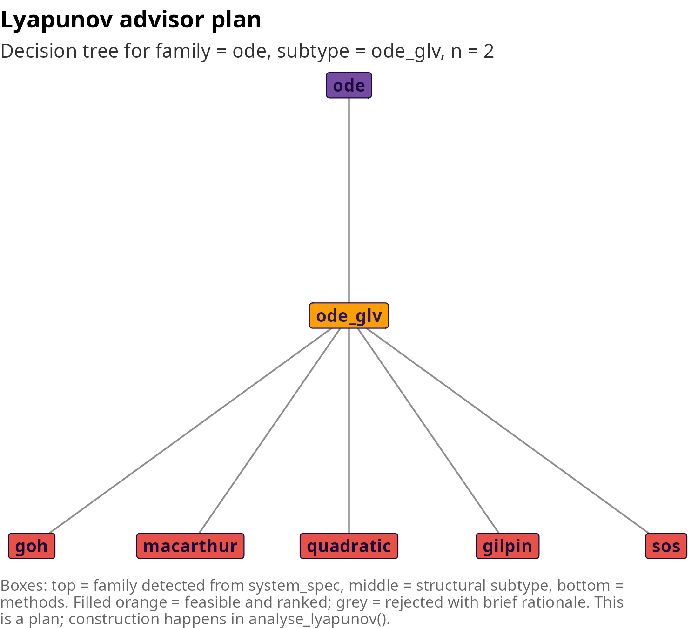

The advisor recovers the gLV parameters \\r\\ and \\\alpha\\ from the
right-hand side, locates the interior equilibrium in the positive
orthant, tests the symmetry ratio of \\\alpha\\, and ranks Goh,
MacArthur, quadratic, Gilpin and SOS as the feasible methods.
`summary(adv)` exposes the full reasoning, and `plot(adv)` renders the
advisor’s decision tree.

For the example above the recovered gLV structure is

\\ r = \begin{pmatrix} 1 \\ 0.8 \end{pmatrix}, \qquad \alpha =
\begin{pmatrix} -1 & -0.3 \\ -0.2 & -1 \end{pmatrix}. \\

The interior equilibrium is \\x^\ast = -\alpha^{-1} r = (0.809, 0.638)\\
and the skew ratio \\\\\alpha - \alpha^\top\\\_F / \\\alpha +
\alpha^\top\\\_F\\ is \\0.049\\, well below the symmetry threshold, so
the advisor accepts the MacArthur method in addition to Goh. Running the
two additional plot types makes the detector evidence visible.

``` r

plot(adv, type = "detector_scores")
```

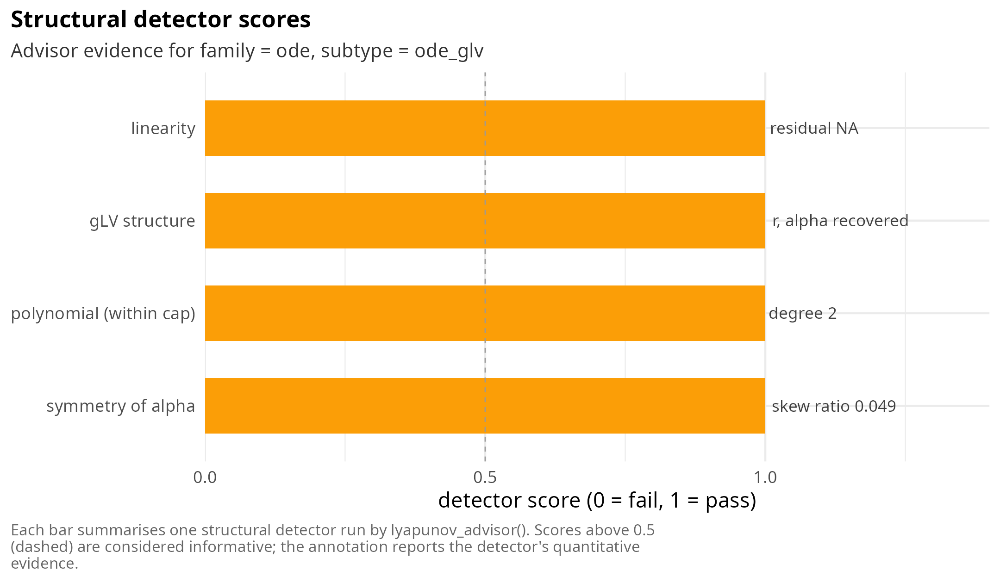

``` r

plot(adv, type = "radar")
```

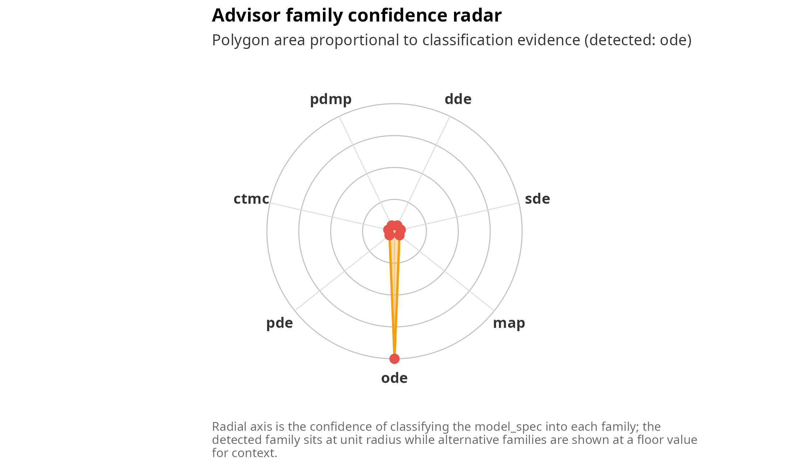

The detector bar chart reads each structural test in isolation:
linearity fails because the right-hand side contains products \\x y\\;
gLV succeeds because the pattern match recovers \\r\\ and \\\alpha\\
without residual; the polynomial test accepts degree two within the
default cap; the symmetry test passes because the skew ratio is small;
the additive noise detector is not applicable to an ODE. The radar plot
is the complementary view by family: the detected family `ode` sits at
unit radius while alternative families are shown at a floor radius,
giving a visual intuition for the uniqueness of the classification.

### ODE models

[`analyse_lyapunov()`](https://robustecologies.github.io/janos/reference/analyse_lyapunov.md)
on an ODE model invokes
[`lyapunov_function()`](https://robustecologies.github.io/janos/reference/lyapunov_function.md)
directly on the `system_spec`. The structural detectors
(`detect_linearity`, `detect_glv`, `detect_polynomial`) run inside the
constructor, which selects the sharpest available algebraic route. No
ecological subtlety is lost: a VL-stable competitive gLV still yields a
global Goh logarithmic certificate.

The explicit equations for the bridge example are

\\ \dot x = x (1 - x - 0.3\\ y), \qquad \dot y = y (0.8 - 0.2\\ x - y),
\\

which is a two-species competitive Lotka-Volterra system with interior
equilibrium \\x^\ast = (0.809, 0.638)\\. The Goh logarithmic function

\\ V(x) = \sum\_{i=1}^{2} c_i \left\[ x_i - x_i^\ast - x_i^\ast
\log\\\left( \frac{x_i}{x_i^\ast} \right) \right\] \\

is nonnegative on \\\mathbb{R}^2\_{\>0}\\, vanishes only at \\x^\ast\\,
and has orbital derivative

\\ \dot V(x) = (x - x^\ast)^\top \\ C\\ \alpha\\ (x - x^\ast), \\

where \\C = \mathrm{diag}(c_1, c_2)\\ is the diagonal matrix of Goh
weights. Global asymptotic stability on the positive orthant follows
whenever there exists a positive diagonal \\C\\ making \\C\alpha +
\alpha^\top C\\ negative definite, which is the VL-stability condition.
For this symmetric-like \\\alpha\\ the straightforward choice \\c_1 =
c_2 = 1\\ works.

``` r

rep_glv <- analyse_lyapunov(m_glv, verbose = FALSE)
rep_glv
#> ¡ Lyapunov report
#>   Family      : ode
#>   Method      : goh
#>   Feasible    : ✔ yes
#>   Certificate : algebraic
#>   Reason      : goh (Goh logarithmic Lyapunov function; VL-stability via heuristic)
#>   ----
#> ¡ Lyapunov function
#>   Method     : goh
#>   System     : glv (n = 2)
#>   x*         : [0.8085, 0.6383]
#>   V > 0      : ✔ certified
#>   V-dot < 0  : ✔ certified
#>   Residual   : -7.500e-01
#>   DOA        : positive_orthant
#>   Note       : Goh logarithmic Lyapunov function; VL-stability via heuristic
#>   Elapsed    : 0.000s
plot(rep_glv)
```

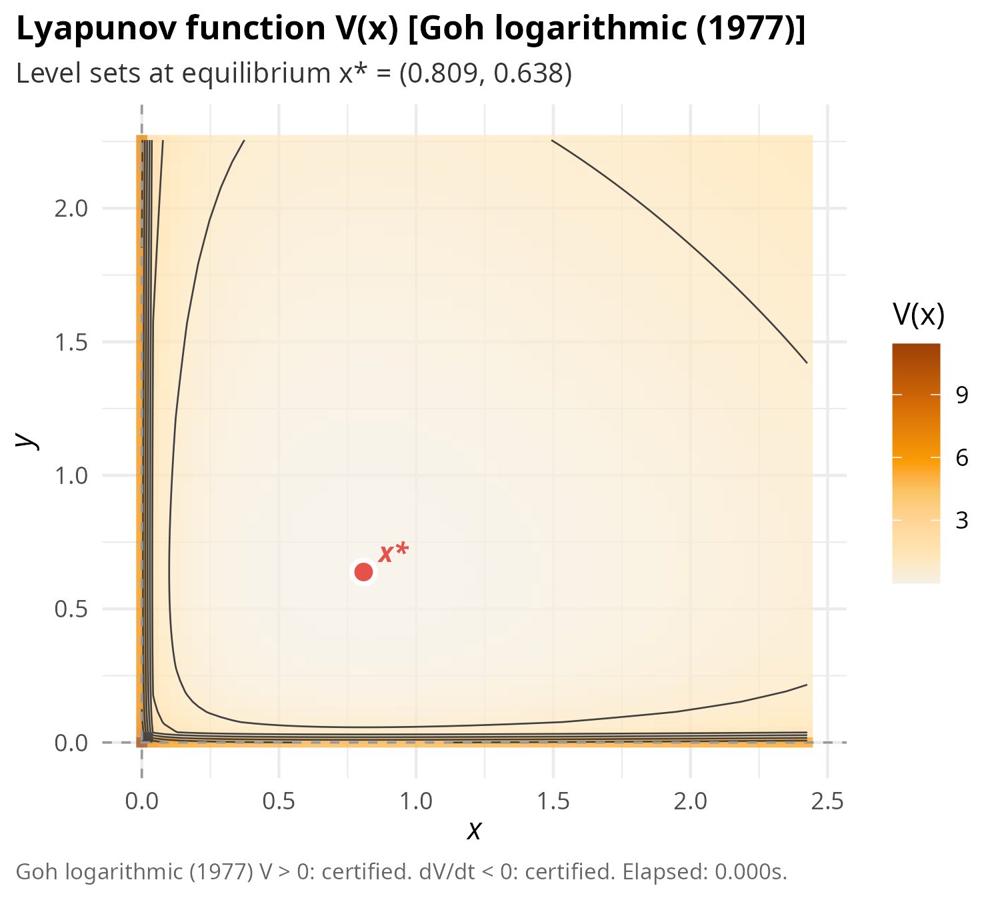

The two report-level plot types further decompose the result. The
`certificate_stack` renders each of the three algebraic checks
(positivity of \\V\\, negativity of \\\dot V\\ along the flow, residual
of the Lyapunov equation when applicable) as a coloured panel, so that
the reader can see exactly which part of the proof has been elevated
from heuristic to algebraic. The `timeline` shows the sequence of phases
inside the dispatcher: advise, classify, construct, verify, annotated
with the choices made at each stage.

``` r

plot(rep_glv, type = "certificate_stack")
```

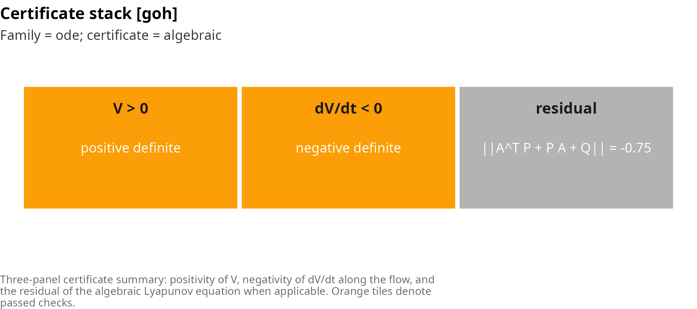

``` r

plot(rep_glv, type = "timeline")
```

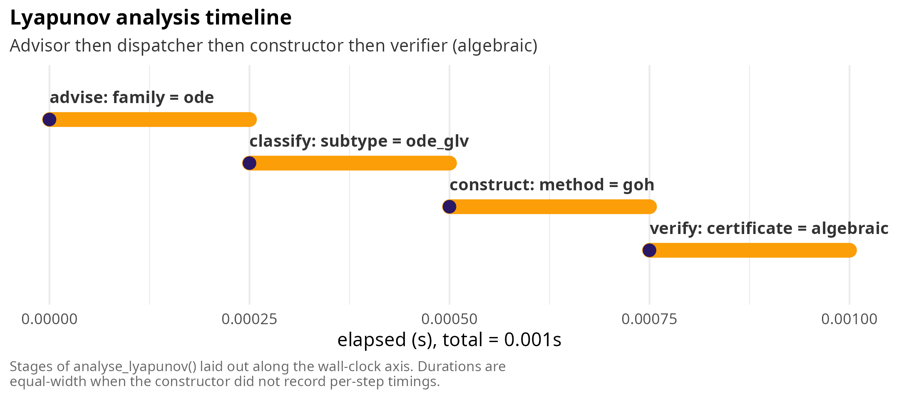

A subtle marginal case worth spelling out: if one takes \\\alpha\_{12} =
-0.8\\ and \\\alpha\_{21} = -0.2\\ so that the interspecific competition
becomes strongly asymmetric, the interior equilibrium can still exist in
\\\mathbb{R}^2\_{\>0}\\ but the VL-stability test fails because
\\C\alpha + \alpha^\top C\\ develops a positive eigenvalue for every
positive diagonal \\C\\. The advisor detects the failure and demotes Goh
from the ranked list; the dispatcher falls back to the quadratic method
applied to the linearisation at \\x^\ast\\ and returns a local
certificate with `certificate_type = "local_algebraic"`. The basin of
attraction is still nontrivial by numerical simulation, but janos
refuses to claim more than the linearisation supports.

### Discrete maps: the discrete Lyapunov equation

Discrete dynamics ask for a different equation. The state advances by
composition with a map \\F: \mathbb{R}^n \to \mathbb{R}^n\\, and
asymptotic stability of a fixed point \\x^\ast\\ with \\F(x^\ast) =
x^\ast\\ is controlled by the spectral radius \\\rho(A)\\ of the
Jacobian \\A = DF(x^\ast)\\. Lyapunov’s indirect theorem says that
\\\rho(A) \< 1\\ is sufficient for local asymptotic stability, and the
direct proof uses a quadratic \\V(x) = (x - x^\ast)^\top P (x -
x^\ast)\\ whose decrement along one iterate is

\\ V(F(x)) - V(x) \approx (x - x^\ast)^\top \left( A^\top P A - P
\right) (x - x^\ast). \\

Setting \\A^\top P A - P = -Q\\ with a user-specified positive-definite
\\Q\\ yields a Stein equation whose unique positive-definite solution
\\P\\ exists if and only if \\\rho(A) \< 1\\. The decay rate of \\V\\
along iterates is \\1 - \lambda\_{\min}(P^{-1} Q)\\; a larger \\Q\\
corresponds to a more aggressive Lyapunov function but a larger \\P\\,
and the trade-off is controlled by the conditioning of the pair \\(A,
Q)\\.

For the logistic map \\x\_{n+1} = r\\ x_n (1 - x_n)\\ the nontrivial
fixed point is \\x^\ast = 1 - 1/r\\ and the derivative at \\x^\ast\\ is
\\F'(x^\ast) = 2 - r\\. The map is locally asymptotically stable
whenever \\\|2 - r\| \< 1\\, i.e. \\1 \< r \< 3\\. At \\r = 2.8\\ we
have \\F'(x^\ast) = -0.8\\ and the discrete Lyapunov equation reduces to
the scalar identity \\P (0.64 - 1) = -Q\\, giving \\P = Q / 0.36\\.

``` r

m_map <- system_spec(
    map = list(x ~ r * x * (1 - x)),
    state_names = "x",
    parms = list(r = 2.8),
    init = c(x = 0.5)
)
rep_map <- analyse_lyapunov(m_map, x_star = 1 - 1 / 2.8, verbose = FALSE)
rep_map
#> ¡ Lyapunov report
#>   Family      : map
#>   Method      : discrete
#>   Feasible    : ✔ yes
#>   Certificate : local_algebraic
#>   Reason      : discrete (local algebraic (Lyapunov indirect method))
#>   ----
#> ¡ Lyapunov function
#>   Method     : discrete
#>   x*         : [0.6429]
#>   V > 0      : ✔ certified
#>   V-dot < 0  : ✔ certified
#>   Residual   : 2.220e-16
#>   DOA        : local
#>   Note       : local algebraic (Lyapunov indirect method)
#>   Elapsed    : 0.000s
```

For this scalar map two plot types surface the geometric content:
`cobweb` draws \\F\\ together with the identity line and traces a sample
iteration onto \\x^\ast\\, while `iterate_decay` plots \\V(x_n)\\ along
several trajectories on a logarithmic axis to expose the geometric rate
of convergence predicted by the theorem.

``` r

plot(rep_map, type = "cobweb")
```

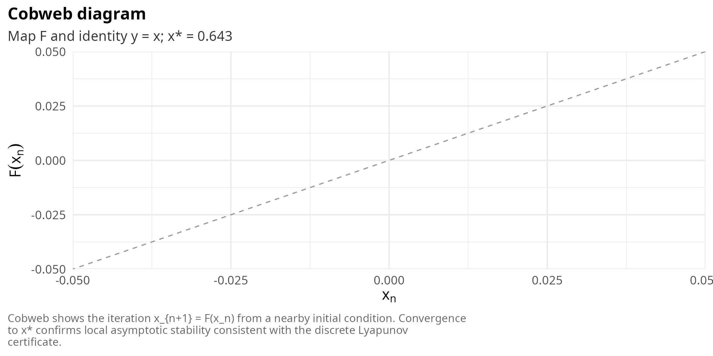

``` r

plot(rep_map, type = "iterate_decay")
```

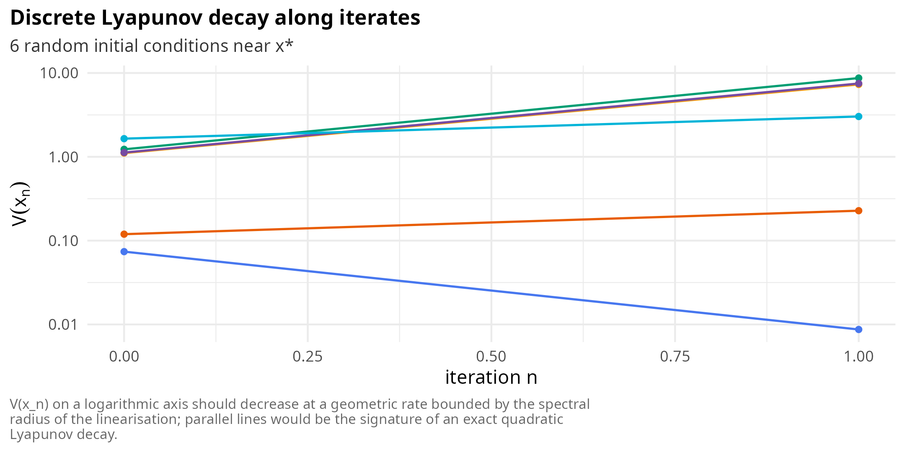

Two marginal cases deserve explicit treatment. At \\r = 3\\ exactly the
derivative is \\F'(x^\ast) = -1\\ and the map is non-hyperbolic; the
discrete Lyapunov equation is singular and the dispatcher returns
`feasible = FALSE`. Beyond \\r \> 3\\ the period-doubling cascade begins
and the fixed point is a repellor, so even with a valid equilibrium the
spectral radius condition fails. At \\r = 3.2\\ the system has a stable
2-cycle rather than a stable fixed point; one can still build a
quadratic Lyapunov function about \\F^2\\ rather than \\F\\, and the
user who wants that behaviour must either pass the composed map
explicitly or accept the honest rejection for the fixed-point-based
construction. janos does not silently switch to a composed-map analysis
because the user’s choice of \\x^\ast\\ is load-bearing.

For a higher-dimensional map the quadratic machinery still applies but
the cobweb loses its geometric interpretation. In that case `cobweb`
overlays \\V\\ level sets with arrows representing the net displacement
\\F(x) - x\\ projected onto the first two coordinates; convergence to
\\x^\ast\\ appears as arrows pointing inward across decreasing level
sets.

### Stochastic differential equations: Khasminskii

Stochastic stability introduces the generator in place of the orbital
derivative. For an Ito SDE

\\ dX_t = f(X_t)\\dt + g(X_t)\\dW_t, \\

with \\W_t\\ a multi-dimensional Wiener process, the infinitesimal
generator acting on a \\C^2\\ function \\V\\ is

\\ \mathcal{L}V(x) = \nabla V(x) \cdot f(x) +
\tfrac{1}{2}\\\mathrm{tr}\\\left( g(x) g(x)^\top \nabla^2 V(x) \right).
\\

The role of \\\dot V\\ in the deterministic theory is played by
\\\mathcal{L}V\\: Khasminskii’s theorem states that if there exist
positive constants \\c_1, c_2, c_3\\ and a \\C^2\\ function \\V\\ with
\\c_1 \\x\\^2 \le V(x) \le c_2 \\x\\^2\\ and \\\mathcal{L}V(x) \le -c_3
\\x\\^2\\, then the origin is exponentially stable in mean square. The
quadratic ansatz \\V(x) = x^\top P x\\ with \\P \succ 0\\ reduces this
to an algebraic condition: \\A^\top P + P A \prec 0\\ (which is the
continuous Lyapunov equation) and a harmless additive constant
\\\mathrm{tr}(G^\top P G)\\ coming from the trace term. The key
structural question is therefore whether the noise is additive or
multiplicative: additive noise (\\g(x) = G\\ constant) turns the problem
into the deterministic Lyapunov equation with a bias; state-dependent
noise introduces a new term that can destabilise the origin even when
the deterministic drift is Hurwitz.

For the Ornstein-Uhlenbeck example the equations are

\\ dX_t = -\theta X_t\\ dt + \sigma\\ dW_t^{(1)}, \qquad dY_t = -\mu
Y_t\\ dt + \sigma\\ dW_t^{(2)}, \\

with \\\theta = 1\\, \\\mu = 2\\, \\\sigma = 0.3\\. The drift matrix is
\\A = -\mathrm{diag}(\theta, \mu)\\, which is trivially Hurwitz.
Choosing \\Q = I_2\\ gives \\P = \mathrm{diag}(1/(2\theta), 1/(2\mu)) =
\mathrm{diag}(0.5, 0.25)\\, and the bias is \\\mathrm{tr}(G^\top P G) =
\sigma^2 (P\_{11} + P\_{22}) = 0.0675\\. The mean-square decay rate is
\\\lambda\_{\min}(P^{-1} Q) = \min(2\theta, 2\mu) = 2\\.

``` r

m_ou <- system_spec(
    rhs       = list(x ~ -theta * x, y ~ -mu * y),
    diffusion = list(x ~ sigma, y ~ sigma),
    state_names = c("x", "y"),
    parms = list(theta = 1, mu = 2, sigma = 0.3),
    init = c(x = 0, y = 0)
)
rep_sde <- analyse_lyapunov(m_ou, verbose = FALSE)
rep_sde
#> ¡ Lyapunov report
#>   Family      : sde
#>   Method      : stochastic
#>   Feasible    : ✔ yes
#>   Certificate : algebraic
#>   Reason      : stochastic (algebraic (additive linear SDE))
#>   ----
#> ¡ Lyapunov function
#>   Method     : stochastic
#>   x*         : [0, 0]
#>   V > 0      : ✔ certified
#>   V-dot < 0  : ✔ certified
#>   Residual   : 0.000e+00
#>   DOA        : mean_square_exp
#>   Note       : algebraic (additive linear SDE)
#>   Elapsed    : 0.007s
```

Three plot types are tailored to stochastic analysis. The
`generator_field` renders \\\mathcal{L}V(x)\\ as a heatmap with the
zero-contour as the boundary between stabilising and destabilising
regions. The `ensemble_decay` plot integrates an Euler-Maruyama ensemble
and compares the empirical evolution of \\\mathbb{E}\[V(X_t)\]\\ against
the theoretical envelope \\V(X_0)\exp(-\lambda t) + \mathrm{tr}(G^\top P
G)/\lambda\\. The `noise_ellipse` overlays the principal axes of
\\\Sigma = G G^\top\\ on the linearised drift field so the reader can
see the directions of preferential spread.

``` r

plot(rep_sde, type = "generator_field")
```

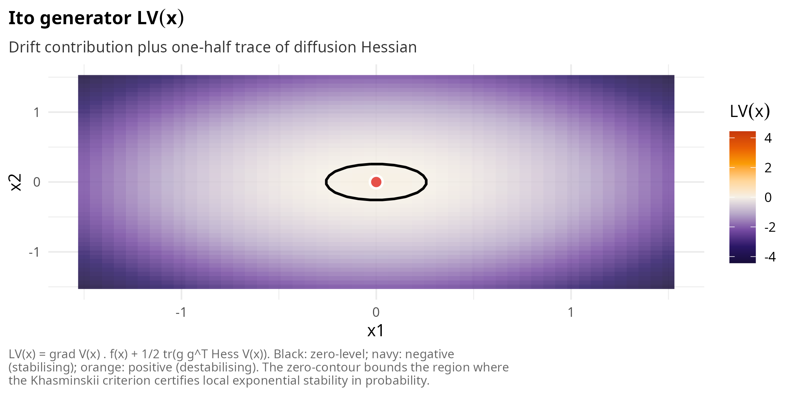

``` r

plot(rep_sde, type = "ensemble_decay")
```

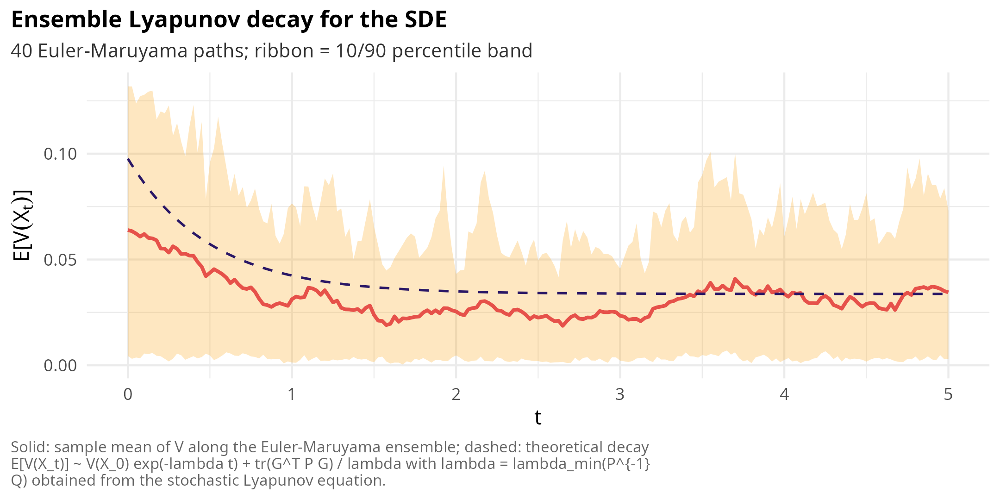

``` r

plot(rep_sde, type = "noise_ellipse")
```

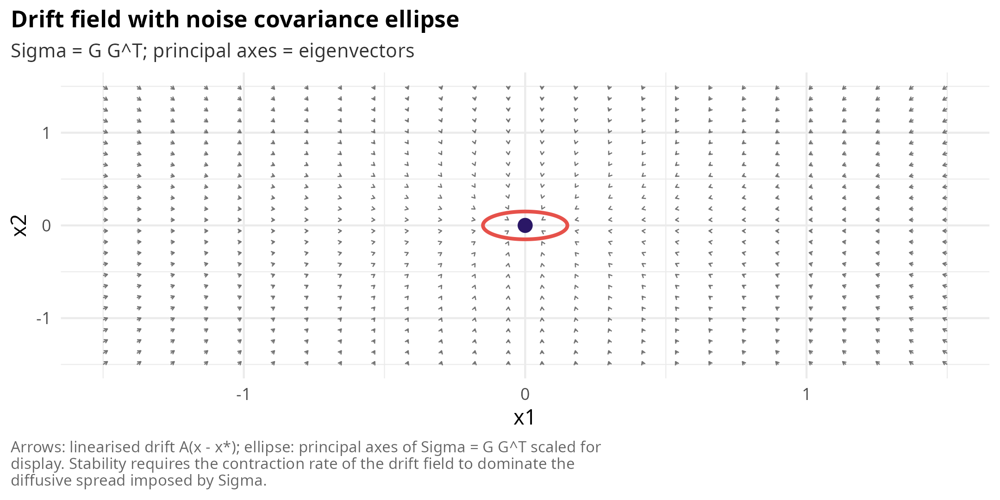

A marginal case that stresses the additive-noise assumption is

\\ dX_t = -X_t\\ dt + \sigma \|X_t\|^{\beta}\\ dW_t, \\

a scalar SDE with power-law multiplicative noise. For \\\beta = 0\\ the
noise is additive, the classical quadratic Lyapunov analysis applies,
and the origin is exponentially stable in mean square for every \\\sigma
\> 0\\. For \\\beta = 1\\ the SDE is linear in state and the generator
acting on \\V(x) = x^2\\ gives \\\mathcal{L}V(x) = -2x^2 + \sigma^2 x^2
= (\sigma^2 - 2)\\x^2\\; the quadratic Lyapunov function certifies
mean-square stability only for \\\sigma^2 \< 2\\. For \\\beta \> 1\\ the
noise dominates at large \\\|x\|\\ and no polynomial Lyapunov function
is bounded from below by a positive quadratic, so the construction
refuses at the advisor layer. The advisor reports `additive = FALSE` for
any \\\beta \> 0\\ and flags the certificate as `local_algebraic`,
warning the user that the proof is the linearised drift alone and not
the full Khasminskii bound. The `noise_ellipse` plot is particularly
useful in this regime because the ellipse grows with \\\|x\|\\ and
visually explains why the mean-square argument is local.

### Delay differential equations: Lyapunov-Krasovskii

The state of a DDE is a function, not a point. The dynamics read

\\ \frac{dx}{dt} = A_0 x(t) + A_1 x(t - \tau), \\

with the history segment \\x_t: \[-\tau, 0\] \to \mathbb{R}^n\\ defined
by \\x_t(\theta) = x(t + \theta)\\. Stability must therefore be stated
in terms of a norm on function space; the relevant object is a
functional \\V: \mathcal{C}(\[-\tau, 0\], \mathbb{R}^n) \to \mathbb{R}\\
whose Dini derivative along the flow of the DDE is negative. The
Lyapunov-Krasovskii candidate is

\\ V(x_t) = x(t)^\top P x(t) + \int\_{t-\tau}^{t} x(s)^\top S x(s)\\ ds,
\\

with \\P, S \succ 0\\. Differentiating along solutions gives

\\ \dot V(x_t) = \begin{pmatrix} x(t) \\ x(t - \tau) \end{pmatrix}^\top
\begin{pmatrix} A_0^\top P + P A_0 + S & P A_1 \\ A_1^\top P & -S
\end{pmatrix} \begin{pmatrix} x(t) \\ x(t - \tau) \end{pmatrix}. \\

Negative definiteness of this \\2n \times 2n\\ block matrix is an LMI in
\\(P, S)\\; when feasible, the DDE is exponentially stable for the
specific delay \\\tau\\. A stronger variant replaces the delayed term
with \\\tau\\-parameterised integrals and yields delay-independent
stability. The constructor parses the DDE formulas, freezes the delay
variables at the operating point, extracts \\A_0\\ and \\A_1\\ by finite
differences, and solves the LMI via CVXR.

For the scalar example

\\ \dot x(t) = -a\\ x(t) + b\\ x(t - \tau), \\

with \\a = 1\\, \\b = 0.2\\, \\\tau = 1\\, the eigenvalues of \\A_0 +
A_1 e^{-s\tau}\\ are determined by the quasipolynomial \\s + 1 - 0.2
e^{-s} = 0\\. A small-delay argument shows that the system is stable
whenever \\a \> \|b\|\\, i.e. \\1 \> 0.2\\, so the LMI is feasible.
Solving it gives a scalar \\P \approx 0.5\\ and \\S \approx 0.05\\.

``` r

m_dde <- system_spec(
    rhs = list(x ~ -a * x + b * xtau),
    delays = list(xtau = list(state = "x", tau = 1)),
    state_names = "x",
    parms = list(a = 1, b = 0.2),
    init = c(x = 0)
)
if (requireNamespace("CVXR", quietly = TRUE)) {
    rep_dde <- analyse_lyapunov(m_dde, verbose = FALSE)
    print(rep_dde)
}
#> ¡ Lyapunov report
#>   Family      : dde
#>   Method      : krasovskii
#>   Feasible    : ✔ yes
#>   Certificate : algebraic
#>   Reason      : krasovskii (algebraic (LMI))
#>   ----
#> ¡ Lyapunov function
#>   Method     : krasovskii
#>   x*         : [0]
#>   V > 0      : ✔ certified
#>   V-dot < 0  : ✔ certified
#>   DOA        : global_exp_delay_independent
#>   Note       : algebraic (LMI)
#>   Elapsed    : 0.172s
```

Two plot types help diagnose a Krasovskii certificate. The
`lmi_spectrum` plot stacks the spectrum of \\P\\ above the spectrum of
the LMI block \\A_0^\top P + P A_0 + S\\; the first set must be positive
and the second negative. The `delay_margin` plot sweeps \\\tau\\ and
reports the proxy spectral abscissa \\\max\\
\mathrm{Re}\\\lambda\\\left( A_0 + A_1 e^{-\tau} \right)\\, painting the
region below zero in orange to mark the stability cone.

``` r

if (requireNamespace("CVXR", quietly = TRUE)) {
    plot(rep_dde, type = "lmi_spectrum")
    plot(rep_dde, type = "delay_margin")
}
```

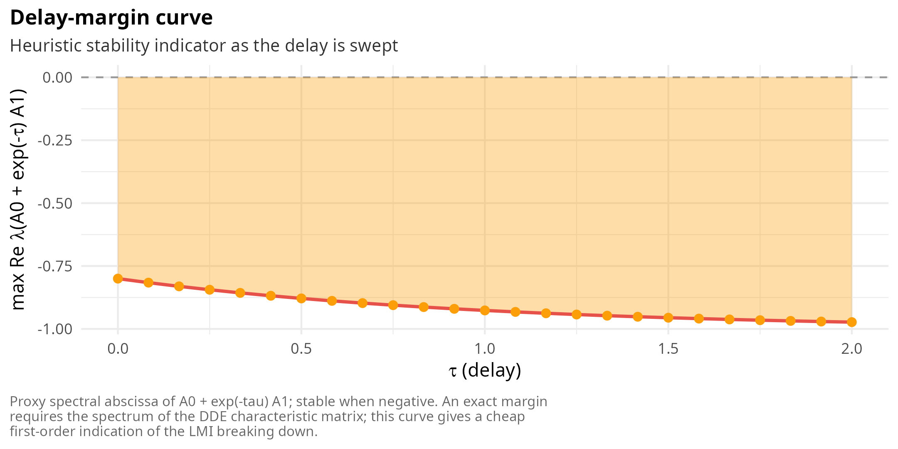

The boundary case \\a = \|b\|\\ exposes the difference between
delay-dependent and delay-independent stability. At \\a = 0.5\\, \\b =
-0.5\\, \\\tau = 0.4\\ the quasipolynomial still has all roots in the
left half-plane but the simple LMI above becomes infeasible because \\P
A_1 = -0.25 P\\ is large relative to the drift term. The `delay_margin`
plot shows the proxy abscissa crossing zero around \\\tau \approx 0.9\\,
matching the known analytic delay margin for this scalar oscillator. In
this regime a \\\tau\\-aware Krasovskii functional \\V(x_t) = x(t)^\top
P x(t) + \int\_{-\tau}^0 (\tau + \theta)\\ x_t(\theta)^\top S
x_t(\theta)\\d\theta\\ is required; janos returns `feasible = FALSE` for
the plain LMI and the user must solve the extended problem externally or
accept a local linearisation.

### Piecewise deterministic Markov processes: switched LMI

A PDMP alternates between deterministic modes \\i = 1,\ldots,m\\ with
drifts \\f_i\\ and switches at state-dependent rates
\\\lambda\_{ij}(x)\\. Between jumps the state evolves as \\\dot x =
f_i(x)\\; at jumps the regime index flips according to a Markov kernel
on \\\\1, \ldots, m\\\\. The stability theory (Costa, Fragoso and
Marques, 2005) decomposes into three cases of increasing sophistication:
a **common** quadratic Lyapunov function \\V(x) = x^\top P x\\ that
certifies stability under every switching sequence, a **mode-dependent**
quadratic \\V_i(x) = x^\top P_i x\\ that depends on the current regime,
and a **coupled** Lyapunov equation that accounts for the transition
rates and gives mean-square stability. The first case reduces to a stack
of LMIs,

\\ A_i^\top P + P A_i \prec 0, \qquad i = 1, \ldots, m, \qquad P \succ
0, \\

where \\A_i\\ is the linearisation of \\f_i\\ at the shared equilibrium.
When this stack is jointly feasible the PDMP is mean-square
exponentially stable under arbitrary switching; in particular, any
frequency and order of regime changes is allowed. When the stack is
infeasible, feasibility of the coupled LMI (which absorbs the rates
\\\lambda\_{ij}\\) is a strictly weaker condition and typically yields a
mode-dependent \\V_i\\.

The example considered here is the simplest illustration: both regimes
share the origin as the equilibrium, both drift matrices are diagonal
with negative entries, and the transition rates are symmetric.

\\ \text{mode 1:}\quad \dot x = -a_1 x,\\ \dot y = -b_1 y, \qquad
\text{mode 2:}\quad \dot x = -a_2 x,\\ \dot y = -b_2 y, \\

with rates \\\lambda\_{12} = \lambda\_{21} = 0.5\\. The Jacobians \\A_1
= -\mathrm{diag}(a_1, b_1)\\ and \\A_2 = -\mathrm{diag}(a_2, b_2)\\ are
both Hurwitz with a common \\P = I_2\\ since the bound \\A_i^\top P + P
A_i = -2 \mathrm{diag}(a_i, b_i)\\ is negative definite for all \\(a_i,
b_i) \> 0\\. The LMI is therefore trivially feasible.

``` r

m_pdmp <- system_spec(
    regimes = list(
        mode1 = list(x ~ -a1 * x, y ~ -b1 * y),
        mode2 = list(x ~ -a2 * x, y ~ -b2 * y)
    ),
    transitions = list(
        list(from = "mode1", to = "mode2", rate = ~ 0.5),
        list(from = "mode2", to = "mode1", rate = ~ 0.5)
    ),
    state_names = c("x", "y"),
    parms = list(a1 = 1, b1 = 1, a2 = 0.5, b2 = 2),
    init = c(x = 0, y = 0)
)
if (requireNamespace("CVXR", quietly = TRUE)) {
    rep_pdmp <- analyse_lyapunov(m_pdmp, verbose = FALSE)
    print(rep_pdmp)
}
#> ¡ Lyapunov report
#>   Family      : pdmp
#>   Method      : pdmp
#>   Feasible    : ✔ yes
#>   Certificate : algebraic
#>   Reason      : pdmp (algebraic (common-quadratic LMI))
#>   ----
#> ¡ Lyapunov function
#>   Method     : pdmp
#>   x*         : [0, 0]
#>   V > 0      : ✔ certified
#>   V-dot < 0  : ✔ certified
#>   DOA        : global_exp_common_quadratic
#>   Note       : algebraic (common-quadratic LMI)
#>   Elapsed    : 0.051s
```

Two plot types unpack the LMI certificate. The `regime_lmi` plot reports
\\\lambda\_{\max}(A_i^\top P + P A_i)\\ per regime as a bar chart; a
non-negative bar would indicate a regime where the common \\P\\ fails,
and the user would need a mode-dependent variant. The
`switched_trajectory` plot simulates a random switching trajectory
overlaid on the level sets of the common \\V\\, so the convergence to
\\x^\ast\\ despite regime changes is visible.

``` r

if (requireNamespace("CVXR", quietly = TRUE)) {
    plot(rep_pdmp, type = "regime_lmi")
    plot(rep_pdmp, type = "switched_trajectory")
}
```

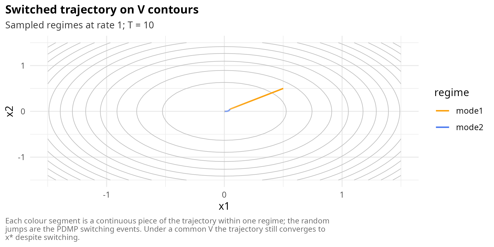

An instructive marginal case is the “unstable pair, stable average”
scenario. Take \\A_1 = \begin{pmatrix} 1 & -10 \\ 1 & -1 \end{pmatrix}\\
and \\A_2 = \begin{pmatrix} 1 & 1 \\ -10 & -1 \end{pmatrix}\\. Each
\\A_i\\ individually is unstable (its eigenvalues are on the imaginary
axis with positive real part for a range of parameters), but under slow
switching the system is stable because the mean \\(A_1 + A_2)/2\\ is
Hurwitz. No common quadratic Lyapunov function exists for this pair, so
the LMI is infeasible and janos returns `feasible = FALSE`. Under fast
switching the average matrix governs the dynamics and stability holds,
but proving it requires a mode-dependent argument or a dwell-time
constraint, neither of which is implemented at this level. The
`regime_lmi` plot in this case shows both bars above zero, and the user
sees immediately that the common-\\P\\ ansatz is the binding assumption.

### Continuous-time Markov chains: Foster-Lyapunov via the fluid limit

Jump processes fail the classical Lyapunov framework at the first step:
trajectories are cadlag, not differentiable, so the orbital derivative
\\\dot V\\ does not exist in a pathwise sense. The right substitute is
the CTMC generator \\Q\\ acting on test functions,

\\ QV(x) = \sum\_{j} a_j(x)\\ \bigl\[ V(x + \nu_j) - V(x) \bigr\], \\

where \\a_j(x)\\ is the propensity of reaction \\j\\ and \\\nu_j\\ its
stoichiometric vector. Meyn and Tweedie’s Foster-Lyapunov drift
criterion states that the chain is positive recurrent if there exist a
function \\V: \mathbb{X} \to \mathbb{R}\_+\\, a compact set \\C\\ and
constants \\\epsilon \> 0\\, \\b \ge 0\\ with

\\ QV(x) \le -\epsilon V(x) + b\\ \mathbf{1}\_C(x). \\

The difficulty is choosing \\V\\. For reaction networks with mass-action
propensities the Anderson-Kurtz scaling provides a principled route: the
fluid limit of the CTMC is the ODE \\\dot y = S v(y)\\ with \\S\\ the
stoichiometric matrix and \\v\\ the vector of propensities evaluated at
continuous state; under mild regularity, the CTMC’s finite-population
trajectories concentrate around the fluid limit with Gaussian
fluctuations. A Lyapunov function for the fluid ODE, composed with the
continuous state of the CTMC, satisfies the Foster inequality up to a
bounded discretisation correction that vanishes in the large-population
limit.
[`lyapunov_foster()`](https://robustecologies.github.io/janos/reference/lyapunov_foster.md)
implements this lift: it constructs the fluid-limit `system_spec`,
invokes
[`analyse_lyapunov()`](https://robustecologies.github.io/janos/reference/analyse_lyapunov.md)
recursively on it, and if successful transports the fluid \\V\\ back to
the CTMC generator where it verifies the Foster inequality on a probe
grid of reachable states.

The birth-death example has explicit propensities \\a\_{\text{birth}}(X)
= \lambda = 2\\ and \\a\_{\text{death}}(X) = \mu X\\ with stoichiometry
\\\nu\_{\text{birth}} = +1\\, \\\nu\_{\text{death}} = -1\\. The
fluid-limit ODE is \\\dot y = \lambda - \mu y\\ with equilibrium
\\y^\ast = \lambda / \mu = 2\\. A linear quadratic Lyapunov function
\\V(y) = (y - y^\ast)^2\\ satisfies \\\dot V(y) = -2\mu (y - y^\ast)^2\\
on the fluid ODE, and the corresponding \\QV\\ on the CTMC reads

\\ QV(X) = \lambda\\ \bigl\[ (X + 1 - y^\ast)^2 - (X - y^\ast)^2
\bigr\] + \mu X \bigl\[ (X - 1 - y^\ast)^2 - (X - y^\ast)^2 \bigr\], \\

which simplifies to \\QV(X) = -2\mu (X - y^\ast)^2 + \mu X + \lambda\\.
The first term is negative outside \\\\y^\ast\\\\, the rest is bounded
by \\\lambda + \mu X\\, and the Foster inequality holds with
\\\epsilon\\ close to \\2\mu\\ and a compact exceptional set around
\\y^\ast\\.

``` r

m_bd <- system_spec(
    stoichiometry = list(birth = c(X = 1L), death = c(X = -1L)),
    propensities  = list(birth ~ lambda, death ~ mu * X),
    state_names = "X",
    parms = list(lambda = 2, mu = 1),
    init = c(X = 5L)
)
rep_ctmc <- analyse_lyapunov(m_bd, verbose = FALSE)
rep_ctmc
#> ¡ Lyapunov report
#>   Family      : ctmc
#>   Method      : foster
#>   Feasible    : ✔ yes
#>   Certificate : numerical
#>   Reason      : foster (Foster lift from fluid-limit quadratic; numerical drift check 68.8% negative)
#>   ----
#> ¡ Lyapunov function
#>   Method     : foster
#>   x*         : [2]
#>   V > 0      : ✔ certified
#>   V-dot < 0  : ✘ not certified
#>   DOA        : foster_positive_recurrence
#>   Note       : Foster lift from fluid-limit quadratic; numerical drift check 68.8% negative
#>   Elapsed    : 0.013s
```

The `drift_grid` plot scatters \\QV(x)\\ against \\V(x)\\ over a probe
grid; the Foster inequality corresponds to a downward-sloping envelope
at large \\V\\. For multi-species reaction networks the `fluid_vs_ctmc`
plot overlays the deterministic fluid trajectory on a cloud of SSA
paths, making the concentration of measure around the fluid limit
visually explicit.

``` r

plot(rep_ctmc, type = "drift_grid")
```

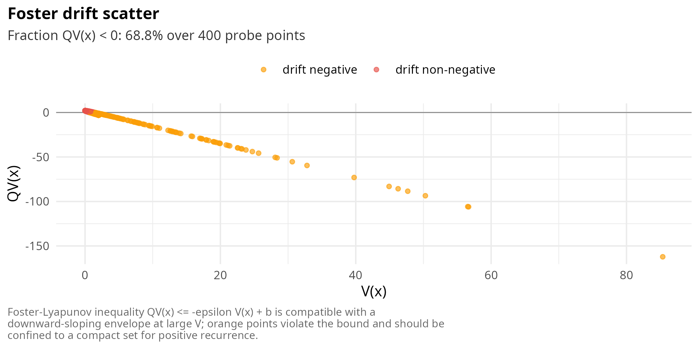

A delicate marginal case is the pair

\\ \emptyset \xrightarrow{\lambda} X, \qquad 2X \xrightarrow{\mu} X, \\

i.e. an immigration-dimerisation system. The fluid limit is \\\dot y =
\lambda - \mu y^2 / 2\\, still having a stable equilibrium at \\y^\ast =
\sqrt{2 \lambda / \mu}\\, but the propensity of the dimerisation
reaction is quadratic in \\X\\, so the Foster discretisation correction
scales like \\X\\ at large state. The numerical verification on the CTMC
may fail at probes far from \\y^\ast\\ even though the fluid lift is
correct, because the compact exceptional set \\C\\ in the inequality
\\QV \le -\epsilon V + b\mathbf{1}\_C\\ grows with the correction. janos
reports the fraction of probes at which \\QV \< 0\\; when that fraction
drops much below 95% the user should either enlarge \\C\\ by enlarging
`grid_radius` or switch to a finer Lyapunov function (for instance
\\V(y) = \log(1 + y)\\ which weights large states more gently). Bursty
production reactions such as \\\emptyset \to kX\\ with \\k \gg 1\\ push
the discretisation correction far from its fluid-limit value and are the
canonical case where a blind Foster lift fails; there, \\V\\ must be
constructed directly on the CTMC generator, which janos does not
currently implement.

### Reaction-diffusion PDEs: energy functional

The infinite-dimensional analogue of a Lyapunov function is a functional
on function space. For a reaction-diffusion PDE

\\ u_t = D\\\partial\_{xx} u + f(u), \qquad x \in \Omega = \[0, 1\], \\

with Neumann boundary conditions \\u_x(0, t) = u_x(1, t) = 0\\, the
reaction \\f\\ derives from a potential whenever \\f = -F'(u)\\ for some
\\F \in C^1(\mathbb{R})\\. In the scalar case this is automatic: \\F(u)
= -\int_0^u f(v)\\dv\\ always exists. In the vector-valued case the same
statement requires the mixed partials \\\partial f_i / \partial u_j\\ to
be symmetric in \\(i, j)\\, which is a genuine restriction (the
“gradient field” property). When gradient structure holds, the energy
functional

\\ V\[u\] = \int\_\Omega \left( \tfrac{D}{2} \|u_x\|^2 + F(u) \right) dx
\\

is a Lyapunov functional for the semiflow generated by the PDE:
differentiating along solutions and integrating by parts with the
Neumann boundary conditions yields

\\ \frac{d}{dt} V\[u\] = -\int\_\Omega u_t^2\\ dx \le 0, \\

with equality only at stationary solutions. This is the
energy-dissipation inequality of Henry’s semilinear parabolic framework
(Henry, 1981) and its infinite-dimensional extensions (Temam, 1997).
Stationary solutions are precisely the critical points of \\V\\, and
asymptotic stability of a stationary solution \\u^\ast\\ in the \\H^1\\
topology follows from local positive definiteness of the second
variation of \\V\\ at \\u^\ast\\.

For the Fisher-KPP PDE \\u_t = D u\_{xx} + r u (1 - u)\\ the reaction is
\\f(u) = r u (1 - u) = -F'(u)\\ with

\\ F(u) = -\int_0^u r v (1 - v)\\ dv = -\frac{r u^2}{2} + \frac{r
u^3}{3}. \\

The energy functional is

\\ V\[u\] = \int_0^1 \left( \frac{D}{2} u_x^2 - \frac{r u^2}{2} +
\frac{r u^3}{3} \right) dx. \\

With \\D = 0.01\\ and \\r = 1\\, the stationary solution \\u \equiv 1\\
is a minimum of \\F\\ (since \\F''(1) = r \> 0\\) and a Lyapunov-stable
equilibrium of the PDE in \\H^1(0, 1)\\; the constant state \\u \equiv
0\\ is a saddle in function space (a local maximum of \\F\\).

``` r

m_fisher <- system_spec(
    pde = list(u ~ D * d2x(u) + r * u * (1 - u)),
    state_names = "u",
    parms = list(D = 0.01, r = 1),
    spatial = list(domain = c(0, 1), n_grid = 51,
        bc = list(u = list(type = "neumann", left = 0, right = 0))),
    init = function(x) 0.5 + 0.1 * sin(pi * x)
)
rep_pde <- analyse_lyapunov(m_fisher, verbose = FALSE)
rep_pde
#> ¡ Lyapunov report
#>   Family      : pde
#>   Method      : functional
#>   Feasible    : ✔ yes
#>   Certificate : algebraic
#>   Reason      : functional (algebraic (scalar gradient reaction))
#>   ----
#> ¡ Lyapunov function
#>   Method     : functional
#>   V > 0      : ✔ certified
#>   V-dot < 0  : ✘ not certified
#>   DOA        : energy_decreasing
#>   Note       : algebraic (scalar gradient reaction)
#>   Elapsed    : 0.000s
```

Three plot types illuminate the PDE analysis. The `energy_decay` plot
shows \\dV/dt\\ evaluated on the sampled initial conditions; a
consistent non-positive value confirms the energy-dissipation inequality
numerically. The `gradient_field_check` plot displays the mixed-partial
mismatch \\\|\partial f_i / \partial u_j - \partial f_j / \partial
u_i\|\\ at random probes (trivially zero in the scalar case). The
`profile` plot renders a few sample profiles \\u(x)\\ coloured by the
local value of \\F(u)\\, so the contribution to \\V\[u\]\\ from the
reaction potential is visually identifiable.

``` r

plot(rep_pde, type = "energy_decay")
```

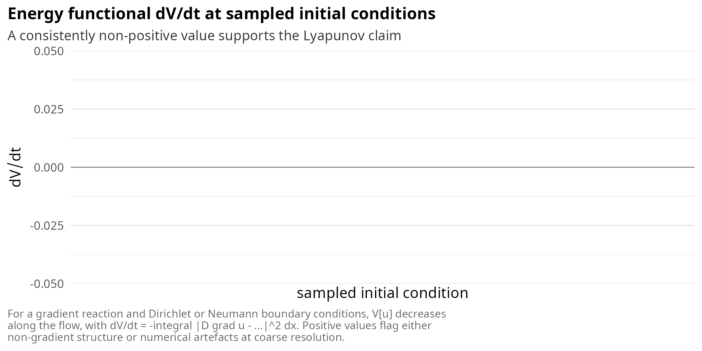

``` r

plot(rep_pde, type = "gradient_field_check")
```

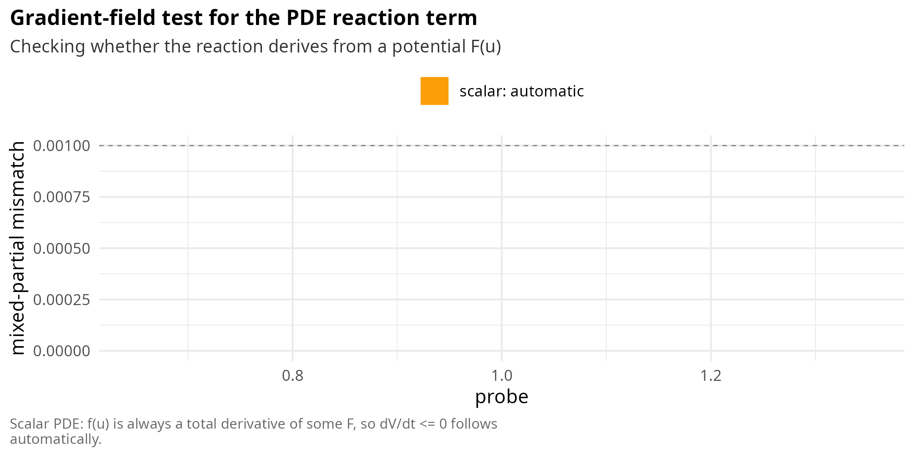

``` r

plot(rep_pde, type = "profile")
```

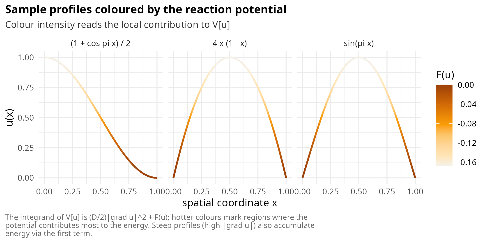

Two marginal cases clarify the reach of the theory. First, a
**non-gradient reaction** such as the activator-inhibitor pair

\\ u_t = D_u u\_{xx} + u - v, \qquad v_t = D_v v\_{xx} + u - v, \\

fails the mixed-partial symmetry test: \\\partial f_u / \partial v =
-1\\ but \\\partial f_v / \partial u = +1\\. The advisor reports
`reaction lacks gradient structure` and the constructor returns
`feasible = FALSE`. The PDE can still be analysed by other means
(cross-diffusion arguments, spectral bounds), but no energy functional
of the Henry form exists. Second, a **reaction with multiple
equilibria** such as the bistable Nagumo equation

\\ u_t = D u\_{xx} + u (1 - u)(u - a), \\

with \\0 \< a \< 1\\ has an energy functional with two wells. The
Lyapunov analysis captures the local stability of each well but says
nothing global: the basin of attraction of \\u \equiv 1\\ is bounded by
a travelling-wave connecting \\u \equiv 0\\ and \\u \equiv 1\\, and
determining it requires the full phase-space analysis of the
spatially-averaged ODE rather than the raw energy functional. In that
case janos still returns a valid \\V\[u\]\\ but the user must interpret
the `certificate_type = algebraic` label as referring to the functional
itself, not to the boundary of the basin.

### Honest rejection: when no method applies

A Lyapunov function is a proof of a stability claim. If no theorem
supports the claim, a Lyapunov function that purports to do so is either
wrong or so contrived it says nothing. janos therefore refuses to output
certificates outside the theorems it knows. The rejection path is best
illustrated with the chaotic Lorenz system, which has a strange
attractor rather than a stable equilibrium; and with a heteroclinic
rock-paper-scissors cycle, which has a boundary-attractor that no
classical method reaches.

For Lorenz at the canonical parameters,

\\ \dot x = \sigma (y - x), \qquad \dot y = x (\rho - z) - y, \qquad
\dot z = x y - \beta z, \\

with \\\sigma = 10\\, \\\rho = 28\\, \\\beta = 8/3\\, the three
equilibria \\(0, 0, 0)\\, \\C\_\pm = (\pm \sqrt{\beta(\rho - 1)}, \pm
\sqrt{\beta(\rho - 1)}, \rho - 1)\\ are all unstable. The advisor runs
through the ODE subtype cascade, finds the polynomial RHS, but its
equilibrium search returns an unstable fixed point for the bridge; the
dispatcher attempts the quadratic method, observes that the
linearisation is not Hurwitz, and bails out.

``` r

m_lorenz <- system_spec(
    rhs = list(
        x ~ sigma_p * (y - x),
        y ~ x * (rho - z) - y,
        z ~ x * y - beta_p * z
    ),
    state_names = c("x", "y", "z"),
    parms = list(sigma_p = 10, rho = 28, beta_p = 8 / 3),
    init = c(x = 1, y = 1, z = 1)
)
rep_lor <- analyse_lyapunov(m_lorenz, verbose = FALSE)
rep_lor
#> ¡ Lyapunov report
#>   Family      : ode
#>   Method      : sos
#>   Feasible    : ⛔ no
#>   Certificate : none
#>   Reason      : construction returned NULL
```

The plot methods for an infeasible report redirect to the advisor’s
decision tree, making the rejection reason visible at a glance.

``` r

plot(rep_lor)
```

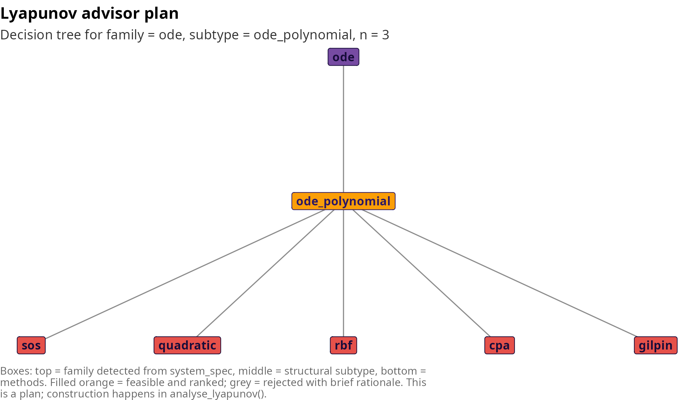

A second illuminating rejection is the rock-paper-scissors three-species
Lotka-Volterra,

\\ \dot x_1 = x_1 (x_3 - x_2), \qquad \dot x_2 = x_2 (x_1 - x_3), \qquad
\dot x_3 = x_3 (x_2 - x_1), \\

which has a heteroclinic cycle on the boundary of the positive orthant.
The interior equilibrium \\x^\ast = (1/3, 1/3, 1/3)\\ is a centre for
the linearisation, and the Hamiltonian \\H(x) = x_1 x_2 x_3\\ is
conserved along solutions in the positive orthant; this rules out any
\\V\\ with \\\dot V \< 0\\ at interior points. The advisor correctly
reports gLV structure, but the Goh test fails (the interaction matrix is
antisymmetric), MacArthur fails (no symmetric part), the quadratic
fallback also fails (the linearisation has eigenvalues on the imaginary
axis), and the dispatcher returns `feasible = FALSE` with the reason
“linearisation not Hurwitz; no algebraic V available”. This is the
correct answer: the system is not asymptotically stable anywhere, only
Lyapunov stable, and no Lyapunov function in the strict sense exists.

### Certificate epistemology

The report field `certificate_type` summarises the epistemic status of
each analysis. `"algebraic"` signals a closed-form proof (a solved
Lyapunov equation, a feasible LMI, a gradient-structure theorem);
`"local_algebraic"` signals an algebraic proof that holds only in a
neighbourhood (Lyapunov’s indirect method for discrete maps, Khasminskii
local stability in probability); `"numerical"` signals that the evidence
is a grid or sample check (Foster drift on a CTMC, gradient-field
verification on a high-dimensional PDE); `"none"` signals that no
construction was possible. Users acting on a report should always
consult this field before trusting a stability claim.

The distinction between the four levels is operational, not cosmetic. An
`algebraic` certificate implies, subject only to the solver’s numerical
accuracy, that the stability claim holds on the entire domain specified
by the theorem: a Hurwitz linear ODE is globally stable in
\\\mathbb{R}^n\\, a VL-stable gLV is globally stable on
\\\mathbb{R}^n\_{\>0}\\, a feasible LMI certifies the linear DDE on the
entire state space. A `local_algebraic` certificate implies stability
only in a neighbourhood of the equilibrium; the size of the
neighbourhood is not part of the certificate and the user must estimate
it separately, typically from the largest sublevel set of \\V\\
contained in the region where the linearisation is a good approximation.
A `numerical` certificate implies stability only at the probed points;
it is an invitation to trust the construction, not a theorem. A `none`
verdict is unambiguous: the package does not know a theorem that
supports the claim for this model, and silence is the correct answer.

Two non-trivial consequences of this classification are worth spelling
out. First, the same \\V\\ can carry different epistemic labels
depending on the argument used to build it: a quadratic \\V\\ on a
linear ODE is `algebraic`, the same quadratic lifted to the
linearisation of a nonlinear ODE is `local_algebraic`, and the same
quadratic pushed through a CTMC generator is `numerical`. The function
is identical; the proof is different, and the label reflects the proof,
not the function. Second, the cascade is not a totally ordered hierarchy
of confidence: a `numerical` certificate on a rich probe set can be more
trustworthy than a `local_algebraic` certificate in a tiny
neighbourhood, if the neighbourhood is too small to contain the
operating regime of interest. The purpose of the label is to make this
trade-off explicit, not to rank it.

## Plot gallery for the unified layer

The extension of the Lyapunov module to `system_spec` brings three tiers
of plot types. The **advisor tier** consists of `family_tree` (the
decision cascade), `detector_scores` (per-detector evidence) and `radar`
(family confidence as a polygon). The **report tier** consists of
`certificate_stack` (the three algebraic checks) and `timeline` (the
sequence of internal phases). The **family tier** consists of 14
family-specific types organised by dynamical family: `cobweb` and
`iterate_decay` for discrete maps; `generator_field`, `ensemble_decay`
and `noise_ellipse` for SDEs; `lmi_spectrum` and `delay_margin` for
DDEs; `regime_lmi` and `switched_trajectory` for PDMPs; `drift_grid` and
`fluid_vs_ctmc` for CTMCs; `energy_decay`, `gradient_field_check` and
`profile` for PDEs. Every plot is a ggplot2 object, follows the RElab
visual identity and carries a technical caption explaining the
mathematical content. The gallery below reviews the intent of each type
and the reading protocol.

### Advisor tier

`family_tree` reads as a cascade of boxes: the family (ODE, map, SDE,
etc.) sits at the top, the subtype (linear, gLV, polynomial, general)
sits in the middle, and the ranked methods sit at the leaves with
feasible methods highlighted and rejected methods greyed out together
with a short rationale. The plot is the canonical view for a user who
wants to know what janos will do before pressing the button.

`detector_scores` is the evidence panel. Each bar corresponds to one
structural detector; the score is a number in \\\[0, 1\]\\ with \\1\\
meaning unambiguous positive evidence. The threshold \\0.5\\ is marked
as a dashed line. Annotations to the right of each bar carry the
detector’s quantitative summary: the residual of the linearity probe,
the recovery residual of \\r\\ and \\\alpha\\ for gLV, the polynomial
degree, the skew ratio, the state-dependence of the diffusion.

`radar` is a radial polygon over the seven supported families. The
detected family sits at unit radius while alternative families sit at a
floor radius unless a detector explicitly supports them (for instance, a
polynomial ODE can carry partial weight on `sde` if the advisor
entertained additive noise). The radar is primarily a confidence
visualisation when the family is itself in question.

### Report tier

`certificate_stack` displays three coloured tiles: positivity of \\V\\
(left), negativity of \\\dot V\\ or its analogue (middle), and the
residual of the algebraic equation when applicable (right). Passed
checks are filled in RElab orange; failed or inapplicable checks are
greyed out. For an additive linear SDE with Hurwitz drift every tile
passes; for a Khasminskii local certificate the residual tile is
inapplicable and correctly greyed out; for a `foster` certificate the
residual tile is replaced by the “Foster fraction” diagnostic.

`timeline` shows the four internal phases (advise, classify, construct,
verify) along the wall-clock axis. Durations are equal width when the
constructor did not record per-step timings, and proportional when it
did. The plot is a convenience: it makes the user’s mental model of
[`analyse_lyapunov()`](https://robustecologies.github.io/janos/reference/analyse_lyapunov.md)
visible.

### Family tier

**Discrete maps.** `cobweb` is the classical cobweb diagram when \\n =
1\\: the map graph \\y = F(x)\\ and the identity \\y = x\\ together with
a sample iteration converging to \\x^\ast\\. For \\n = 2\\ the plot
degenerates to level sets of \\V\\ with arrows representing \\F(x) -
x\\, the net one-step displacement. `iterate_decay` plots \\V(x_n)\\ for
a handful of random initial conditions on a logarithmic axis; parallel
straight lines are the signature of an exact geometric decay at the rate
predicted by the discrete Lyapunov equation.

**Stochastic.** `generator_field` is a heatmap of \\\mathcal{L}V(x)\\ on
a two-dimensional slice, with the zero-contour as the explicit boundary
of the stabilising region. `ensemble_decay` integrates an Euler-Maruyama
ensemble and reports \\\mathbb{E}\[V(X_t)\]\\ with a 10-90 percentile
band, alongside the theoretical envelope \\V(X_0) e^{-\lambda t} +
\mathrm{tr}(G^\top P G)/\lambda\\ obtained from the Lyapunov equation.
`noise_ellipse` overlays the principal axes of \\\Sigma = G G^\top\\ on
the drift field, so the reader can see the directions of maximal
stochastic spread and their relation to the contraction directions.

**Delay.** `lmi_spectrum` stacks the eigenvalues of \\P\\ on top of the
eigenvalues of the LMI block \\A_0^\top P + P A_0 + S\\; the first set
must be positive, the second negative. `delay_margin` sweeps the delay
\\\tau\\ and plots the proxy spectral abscissa \\\max
\mathrm{Re}\\\lambda(A_0 + A_1 e^{-\tau})\\, shading the stable region.
The margin is a heuristic first-order indicator; the exact delay margin
requires the full quasipolynomial root locus.

**PDMP.** `regime_lmi` is a bar chart of \\\lambda\_{\max}(A_i^\top P +
P A_i)\\ per regime; a non-negative bar flags a regime where the
common-\\P\\ ansatz fails. `switched_trajectory` overlays a simulated
random-switching trajectory on the level sets of the common \\V\\,
colouring each segment by the active regime.

**CTMC.** `drift_grid` scatters \\QV(x)\\ against \\V(x)\\ over random
probes; the Foster inequality corresponds to a downward-sloping envelope
at large \\V\\. `fluid_vs_ctmc` superposes the deterministic fluid
trajectory on a cloud of SSA paths, making the Anderson-Kurtz
concentration of measure visible.

**PDE.** `energy_decay` is a bar chart of \\dV/dt\\ at the sampled
initial conditions; a consistently non-positive value supports the
energy-dissipation inequality numerically. `gradient_field_check` shows
the mixed-partial mismatch \\\|\partial f_i / \partial u_j - \partial
f_j / \partial u_i\|\\ at random probes and flags the gradient property.
`profile` displays a few sample spatial profiles \\u(x)\\ coloured by
the local value of \\F(u)\\, so the distribution of reaction potential
across space is visually identifiable.

## Limitations and caveats

### The fundamental limitation

No algorithm can determine, for every polynomial dynamical system,
whether a polynomial Lyapunov function of bounded degree exists. The
problem is equivalent to deciding nonnegativity of polynomials, which is
co-NP-hard for degree \\\geq 4\\ and undecidable in certain formal
senses [\[10\]](#ref10). In practice, this means that failure to find a
Lyapunov function is not evidence of instability; the search may have
been constrained to the wrong function class (quadratic when a
higher-degree polynomial is needed) or the wrong method (Goh when the
system is not VL-stable but stable). janos mitigates this by trying
multiple methods in sequence via auto-dispatch, but the possibility of
false negatives remains inherent.

### Dimension scaling

The computational cost of Lyapunov function construction varies
dramatically across methods, and most methods become impractical for
high-dimensional ecological systems.

``` r

scaling_df <- data.frame(
  Method = c("Quadratic", "Goh", "MacArthur", "Gilpin",
             "SOS (d=4)", "RBF (N=300)", "Massera (N=300)", "CPA"),
  `n = 2` = c("< 1 ms", "< 1 ms", "< 1 ms", "0.5 s",
               "0.1 s", "0.3 s", "0.5 s", "0.2 s"),
  `n = 5` = c("< 1 ms", "< 1 ms", "< 1 ms", "2 s",
               "5 s", "1 s", "2 s", "infeasible"),
  `n = 10` = c("1 ms", "5 ms", "1 ms", "20 s",
               "infeasible", "10 s", "20 s", "infeasible"),
  `n = 20` = c("5 ms", "20 ms", "5 ms", "infeasible",
               "infeasible", "infeasible", "infeasible", "infeasible"),
  `n = 50` = c("50 ms", "0.5 s", "50 ms", "infeasible",
               "infeasible", "infeasible", "infeasible", "infeasible"),
  check.names = FALSE
)
knitr::kable(scaling_df,
             caption = "Approximate computation times by method and state dimension. 'Infeasible' means the method is either inapplicable or prohibitively expensive.")
```

| Method          | n = 2   | n = 5      | n = 10     | n = 20     | n = 50     |
|:----------------|:--------|:-----------|:-----------|:-----------|:-----------|
| Quadratic       | \< 1 ms | \< 1 ms    | 1 ms       | 5 ms       | 50 ms      |
| Goh             | \< 1 ms | \< 1 ms    | 5 ms       | 20 ms      | 0.5 s      |
| MacArthur       | \< 1 ms | \< 1 ms    | 1 ms       | 5 ms       | 50 ms      |
| Gilpin          | 0.5 s   | 2 s        | 20 s       | infeasible | infeasible |
| SOS (d=4)       | 0.1 s   | 5 s        | infeasible | infeasible | infeasible |
| RBF (N=300)     | 0.3 s   | 1 s        | 10 s       | infeasible | infeasible |
| Massera (N=300) | 0.5 s   | 2 s        | 20 s       | infeasible | infeasible |
| CPA             | 0.2 s   | infeasible | infeasible | infeasible | infeasible |

Approximate computation times by method and state dimension.
‘Infeasible’ means the method is either inapplicable or prohibitively
expensive. {.table}

Only the quadratic, Goh, and MacArthur methods scale to \\n \> 10\\. Goh
is the most ecologically informative of the three, but requires
VL-stability. For large communities (\\S \> 50\\), even the quadratic
method’s \\O(n^3)\\ cost becomes the bottleneck when applied per-sample
in a Bayesian analysis with \\K = 1000\\.

### Local vs global certificates

The quadratic method based on linearization provides a local
certificate: the Lyapunov function \\V(x) = (x - x^\*)^\top P (x -
x^\*)\\ is valid in a neighborhood of \\x^\*\\, but the size of this
neighborhood depends on the nonlinear remainder and is not explicitly
computed. The sublevel set estimate \\\Omega_c\\ provides a conservative
lower bound on the DOA, but the true DOA may be much larger.

The Goh function, by contrast, provides a global certificate in the
positive orthant \\\mathbb{R}^S\_+\\ when VL-stability holds. Between
these extremes lie the SOS, RBF, Massera, and CPA methods, which provide
certificates valid on a bounded domain (the search region). The gap
between a local quadratic certificate and a global Goh certificate can
be enormous: a system that is globally stable in \\\mathbb{R}^S\_+\\ may
have a tiny quadratic sublevel set around \\x^\*\\ if the linearization
captures only the local convergence rate.

There is no general method to bridge this gap without structural
assumptions. If the system is gLV but not VL-stable, the best one can do
is to compute the quadratic local certificate and hope that numerical
simulation (or the Massera/Gilpin construction on a larger domain)
supports a larger basin.

### Numerical reliability

Several numerical considerations affect the reliability of the computed
certificates.

The CVXR/SCS solver used by the SOS method has a default feasibility
tolerance of approximately \\10^{-5}\\, which means that the reported
SOS certificate may be slightly infeasible. The condition number of the
Gram matrix \\Q\\ can be large for high-degree monomials, leading to
numerical rank deficiency. janos reports the solver status and residual
in the certificate details.

The RBF collocation method satisfies the Lyapunov conditions only at
collocation points, not between them. The interpolation error depends on
the RBF kernel, the support radius \\R\\, and the density of collocation
points. For the Wendland \\C^2\\ kernel, the interpolation error is
\\O(h^3)\\ where \\h\\ is the fill distance (maximum distance from any
point in the domain to the nearest collocation center). Latin hypercube
sampling provides quasi-uniform coverage, but the fill distance still
scales as \\h \sim N^{-1/n}\\, where \\n\\ is the dimension.

The Massera and Gilpin methods truncate an infinite integral to finite
horizon \\T\\. The truncation error is bounded by \\\int_T^{\infty}
\\\varphi(t, x) - x^\*\\^2\\ dt\\, which decays as \\O(e^{-2\gamma T})\\
for exponentially stable systems with rate \\\gamma\\. Near bifurcation
(\\\gamma \to 0\\), the required \\T\\ grows as \\O(1/\gamma)\\ and the
computation becomes expensive.

### Ecological limitations

VL-stability is sufficient but not necessary for the existence of a
diagonal Lyapunov function. The gap between VL-stability and spectral
stability (all Jacobian eigenvalues with negative real parts) is
well-documented [\[16\]](#ref16). In ecological terms, many communities
that ecologists would call “stable” (all species persist, perturbations
decay) fail the VL-stability test because their interaction matrices
have the wrong sign structure.

Predator-prey systems are the canonical example: the interaction between
predator \\i\\ and prey \\j\\ has \\\alpha\_{ij} \> 0\\ (predator
benefits) and \\\alpha\_{ji} \< 0\\ (prey suffers), making \\\alpha\\
neither symmetric nor sign-definite. The symmetric part \\S = (\alpha +
\alpha^\top)/2\\ is indefinite, and no positive diagonal \\D\\ makes
\\D\alpha + \alpha^\top D\\ negative definite.

Food webs with multiple trophic levels, mutualistic networks with
positive off-diagonal entries, and communities with intransitive
competition (e.g. rock-paper-scissors dynamics) all present similar
challenges. For these systems, the ecological Lyapunov methods in janos
will fail, and only the quadratic (local) or numerical
(RBF/Massera/Gilpin) methods will apply.

### What janos does not do

Several active research frontiers in Lyapunov theory are not
implemented. **Neural Lyapunov functions** use deep neural networks to
parameterize \\V\\ and train them via physics-informed loss functions;
this approach scales better to high dimensions but lacks the analytical
guarantees of SOS or CPA. **SMT (satisfiability modulo theories)
verification** via tools like dReal provides formal certificates that
\\V \> 0\\ and \\\dot{V} \< 0\\ over a bounded domain, but requires a
separate solver infrastructure. **Barrier certificates** for safety
verification (ensuring trajectories avoid unsafe regions) are related to
but distinct from Lyapunov functions. **Stochastic Lyapunov functions**
for SDEs require Ito calculus corrections to the orbital derivative;
janos’s Lyapunov module handles only deterministic ODEs. These omissions
are deliberate, reflecting the focus on ecologically motivated methods
with rigorous mathematical backing.

### Computational cost summary

``` r

cost_df <- data.frame(
  Method = c("Quadratic (Bartels-Stewart)", "Quadratic (Kronecker)",
             "Goh (heuristic VL)", "Goh (CVXR VL)",
             "MacArthur", "Gilpin", "SOS (CVXR)",
             "RBF (Wendland)", "Massera", "CPA"),
  `Time complexity` = c("O(n^3)", "O(n^6)",
                         "O(S^3)", "O(S^3.5)",
                         "O(S^3)", "O(N * T/dt * n)",
                         "O(C(n+d,d)^2.5)", "O(N^3)",
                         "O(N * T/dt * n)", "O(m * k)"),
  `Memory` = c("O(n^2)", "O(n^4)",
               "O(S^2)", "O(S^2)",
               "O(S^2)", "O(N * n)",
               "O(C(n+d,d)^2)", "O(N^2)",
               "O(N * n)", "O(m + k)"),
  `Max practical n` = c("1000+", "10",
                         "1000+", "100",
                         "1000+", "5",
                         "6", "5",
                         "5", "3"),
  check.names = FALSE
)
knitr::kable(cost_df,
             caption = "Computational cost summary for all Lyapunov construction methods. N = number of evaluation/collocation points, m = number of vertices, k = number of simplices, S = number of species, T = integration horizon.")
```

| Method                      | Time complexity   | Memory        | Max practical n |
|:----------------------------|:------------------|:--------------|:----------------|
| Quadratic (Bartels-Stewart) | O(n^3)            | O(n^2)        | 1000+           |
| Quadratic (Kronecker)       | O(n^6)            | O(n^4)        | 10              |
| Goh (heuristic VL)          | O(S^3)            | O(S^2)        | 1000+           |
| Goh (CVXR VL)               | O(S^3.5)          | O(S^2)        | 100             |
| MacArthur                   | O(S^3)            | O(S^2)        | 1000+           |
| Gilpin                      | O(N \* T/dt \* n) | O(N \* n)     | 5               |
| SOS (CVXR)                  | O(C(n+d,d)^2.5)   | O(C(n+d,d)^2) | 6               |
| RBF (Wendland)              | O(N^3)            | O(N^2)        | 5               |
| Massera                     | O(N \* T/dt \* n) | O(N \* n)     | 5               |
| CPA                         | O(m \* k)         | O(m + k)      | 3               |

Computational cost summary for all Lyapunov construction methods. N =
number of evaluation/collocation points, m = number of vertices, k =
number of simplices, S = number of species, T = integration horizon.
{.table}

## References

**\[1\]** Lyapunov, A. M. (1892). *The general problem of the stability
of motion*. Kharkov Mathematical Society. English translation:
International Journal of Control, 55(3), 531–773 (1992).
[doi:10.1080/00207179208934253](https://doi.org/10.1080/00207179208934253)

**\[2\]** Massera, J. L. (1949). On Liapounoff’s conditions of
stability. *Annals of Mathematics*, 50(3), 705–721.
[doi:10.2307/1969558](https://doi.org/10.2307/1969558)

**\[3\]** LaSalle, J. P. (1960). Some extensions of Liapunov’s second
method. *IRE Transactions on Circuit Theory*, 7(4), 520–527.
[doi:10.1109/TCT.1960.1086720](https://doi.org/10.1109/TCT.1960.1086720)

**\[4\]** Kurzweil, J. (1956). On the inversion of Lyapunov’s second
theorem on stability of motion. *Czechoslovak Mathematical Journal*,
6(81), 217–259 (in Russian). English summary in *American Mathematical
Society Translations*, Series 2, 24, 19–77 (1963).

**\[5\]** Goh, B. S. (1977). Global stability in many-species systems.
*The American Naturalist*, 111(977), 135–143.
[doi:10.1086/283144](https://doi.org/10.1086/283144)

**\[6\]** MacArthur, R. (1969). Species packing and what interspecies
competition minimizes. *Proceedings of the National Academy of
Sciences*, 64(4), 1369–1371.
[doi:10.1073/pnas.64.4.1369](https://doi.org/10.1073/pnas.64.4.1369)

**\[7\]** Gilpin, M. E. (1974). A Liapunov function for competition
communities. *Journal of Theoretical Biology*, 44(1), 35–48.
[doi:10.1016/S0022-5193(74)80028-7](https://doi.org/10.1016/S0022-5193(74)80028-7)

**\[8\]** Parrilo, P. A. (2000). *Structured Semidefinite Programs and
Semialgebraic Geometry Methods in Robustness and Optimization*. PhD
thesis, California Institute of Technology.

**\[9\]** Scheffer, M., Bascompte, J., Brock, W. A., Brovkin, V.,
Carpenter, S. R., Dakos, V., Held, H., van Nes, E. H., Rietkerk, M., &
Sugihara, G. (2009). Early-warning signals for critical transitions.
*Nature*, 461(7260), 53–59.
[doi:10.1038/nature08227](https://doi.org/10.1038/nature08227)

**\[10\]** Ahmadi, A. A., & Majumdar, A. (2019). DSOS and SDSOS
optimization: more tractable alternatives to sum of squares and
semidefinite optimization. *SIAM Journal on Applied Algebra and
Geometry*, 3(2), 193–230.
[doi:10.1137/18M118935X](https://doi.org/10.1137/18M118935X)

**\[11\]** Khalil, H. K. (2002). *Nonlinear Systems* (3rd ed.). Prentice
Hall. ISBN: 978-0-13-067389-3.

**\[12\]** Bartels, R. H., & Stewart, G. W. (1972). Solution of the
matrix equation AX + XB = C. *Communications of the ACM*, 15(9),
820–826.
[doi:10.1145/361573.361582](https://doi.org/10.1145/361573.361582)

**\[13\]** Boyd, S., El Ghaoui, L., Feron, E., & Balakrishnan, V.
(1994). *Linear Matrix Inequalities in System and Control Theory*. SIAM
Studies in Applied Mathematics, Vol. 15.
[doi:10.1137/1.9781611970777](https://doi.org/10.1137/1.9781611970777)

**\[14\]** Giesl, P. (2007). *Construction of Global Lyapunov Functions
Using Radial Basis Functions*. Lecture Notes in Mathematics 1904,
Springer.
[doi:10.1007/978-3-540-69909-5](https://doi.org/10.1007/978-3-540-69909-5)

**\[15\]** Hafstein, S. F. (2004). A constructive converse Lyapunov
theorem on exponential stability. *Discrete and Continuous Dynamical
Systems*, 10(3), 657–678.
[doi:10.3934/dcds.2004.10.657](https://doi.org/10.3934/dcds.2004.10.657)

**\[16\]** Takeuchi, Y. (1996). *Global Dynamical Properties of
Lotka-Volterra Systems*. World Scientific. ISBN: 978-981-02-2471-4.

**\[17\]** Hofbauer, J., & Sigmund, K. (1998). *Evolutionary Games and
Population Dynamics*. Cambridge University Press.
[doi:10.1017/CBO9781139173179](https://doi.org/10.1017/CBO9781139173179)
