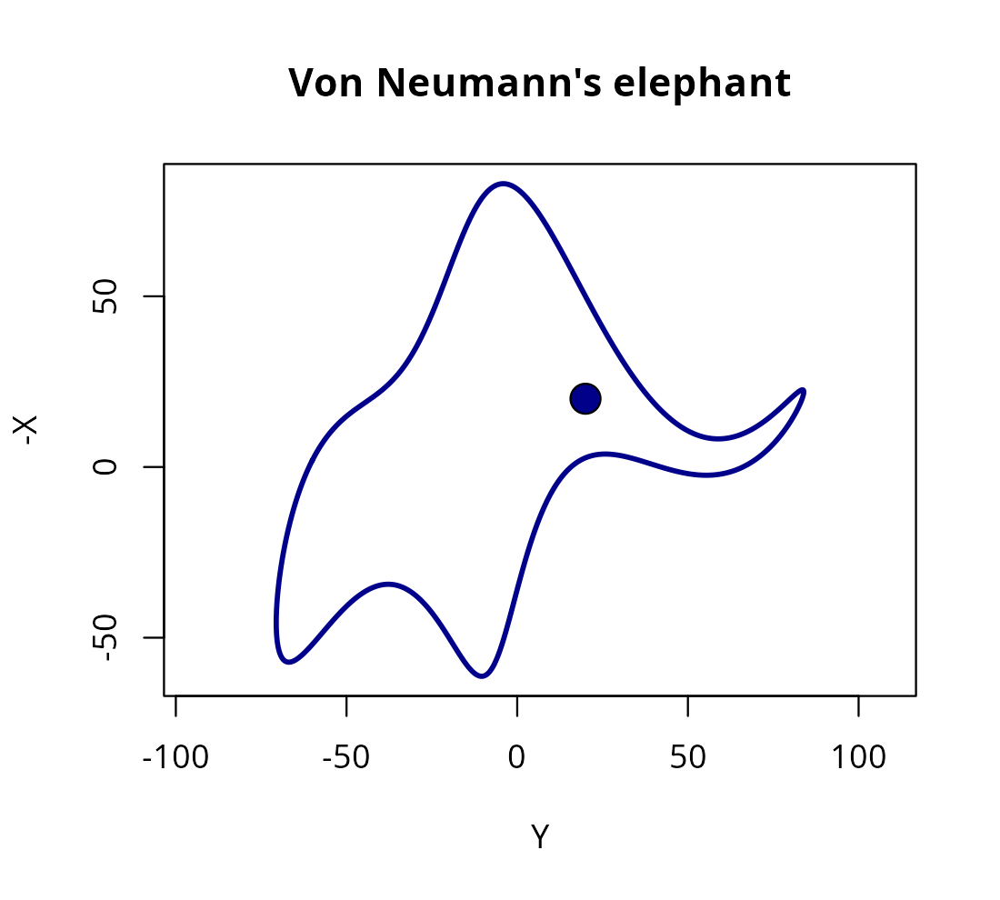

# Why janos? A note on John von Neumann

## The name

*janos* is the Hungarian form of *John*. The package is named in homage
to **Janos Lajos Neumann** (1903-1957), better known in the
English-speaking world as **John von Neumann**, whose footprints are
visible in essentially every computational technique offered by this
package. The choice of the Hungarian given name is deliberate: it
foregrounds the mathematician the way his Budapest contemporaries knew
him, before the American anglicisation that later rebranded him as
*Johnny*.


*John von Neumann, Los Alamos ID badge photograph (c. 1943). Public
domain; a work of the U.S. federal government.*

## A brief biographical sketch

Born in Budapest on 28 December 1903 into an affluent Jewish banking
family, Neumann displayed arithmetical prodigy from early childhood,
reportedly dividing eight-digit numbers in his head at age six and
reading Emile Borel’s *Lecons sur la theorie des fonctions* at eleven.
He earned a chemical engineering diploma at the ETH Zurich and,
simultaneously, a doctorate in mathematics at the University of Budapest
in 1926, with a dissertation on an axiomatisation of set theory that
resolved several of the foundational difficulties raised by Russell and
Zermelo.

Through the late 1920s in Gottingen and Berlin he produced the
operator-algebraic foundations of quantum mechanics, formalising
observables as self-adjoint operators on Hilbert space and proving the
spectral theorem in the generality still used today. His 1932 monograph
*Mathematische Grundlagen der Quantenmechanik* remains the canonical
axiomatic account of the theory. After emigrating to Princeton in 1930
and joining the Institute for Advanced Study in 1933, Neumann extended
his range with an astonishing fluidity across pure and applied
mathematics: ergodic theory (the mean ergodic theorem, 1932), lattice
theory and continuous geometry, almost-periodic functions on groups,
game theory (the minimax theorem in 1928 and the monograph *Theory of
Games and Economic Behavior* with Morgenstern in 1944), linear
programming and the duality theorem, and the mathematical theory of
shock waves.

During the Second World War his applied profile grew decisively. He
joined the Manhattan Project in 1943 and contributed both the implosion
lens design and, with Stanislaw Ulam, the detonation-wave numerical work
that required industrial-scale computation. That computational demand
drove the next chapter.

## Computing, Monte Carlo, and cellular automata

Neumann was central to the birth of modern computing in at least four
independent ways.

First, the **stored-program architecture**. His 1945 *First Draft of a
Report on the EDVAC* articulated, for the first time and with surgical
clarity, the design in which instructions and data share the same
memory. What is universally called the *von Neumann architecture* is
that document; every modern general-purpose processor still follows its
essentials.

Second, the **Monte Carlo method**. Working with Ulam at Los Alamos in
1946-1947 on neutron diffusion through fissile materials, he
reformulated the intractable deterministic transport integrals as
expectations over stochastic particle histories that could be estimated
by sampling. The method was christened Monte Carlo by Metropolis; the
seminal exposition is Metropolis and Ulam (1949) and the mathematical
analysis of pseudorandom generation (the *middle-square* method,
inverse-CDF sampling, rejection sampling) is von Neumann’s. Every
stochastic backend in janos
([`solver_ssa_direct()`](https://robustecologies.github.io/janos/reference/solver_ssa_direct.md),
[`solver_tau_leap()`](https://robustecologies.github.io/janos/reference/solver_tau_leap.md),
[`solver_euler_maruyama()`](https://robustecologies.github.io/janos/reference/solver_euler_maruyama.md),
[`solver_rdme()`](https://robustecologies.github.io/janos/reference/solver_rdme.md),
[`ensemble_sim()`](https://robustecologies.github.io/janos/reference/ensemble_sim.md),
[`estimate_extinction()`](https://robustecologies.github.io/janos/reference/estimate_extinction.md),
[`mlmc_estimate()`](https://robustecologies.github.io/janos/reference/mlmc_estimate.md))
is a descendant of that 1947 idea.

Third, **cellular automata and self-reproducing machines**. His
posthumous *Theory of Self-Reproducing Automata* (1966) constructed the
first universal constructor, a cellular automaton capable of building
arbitrary machines, including copies of itself, thereby anticipating by
decades the formal theory of artificial life and the self-assembly
perspective on biological systems. Reaction-diffusion master equations
simulated by
[`solver_rdme()`](https://robustecologies.github.io/janos/reference/solver_rdme.md)
on
[`lattice_graph()`](https://robustecologies.github.io/janos/reference/lattice_graph.md)
sit squarely in that lineage.

Fourth, **numerical weather prediction**. The ENIAC run of April 1950
under Charney, Fjortoft and von Neumann was the first successful
numerical integration of the barotropic vorticity equation on a computer
and is widely regarded as the founding event of computational
geophysics.

Beyond these, he gave the first practical treatment of the error
analysis of Gaussian elimination (with Goldstine, 1947), introduced
operator algebras now called *von Neumann algebras*, supplied a direct
integration scheme for shock waves (von Neumann-Richtmyer 1950) that
remains in hydrocodes, and sketched, in a 1955 lecture, the
technological singularity decades before the term existed.

He died of cancer in Washington on 8 February 1957 at fifty-three, still
consulting for the Atomic Energy Commission from a wheelchair. Eugene
Wigner wrote that *only von Neumann was fully awake* among physicists of
his generation; Hans Bethe observed that his brain *indicated a new
species, an evolution beyond man*. The hyperbole is unusual among
scientists of that calibre and is, for once, probably accurate.

## Why this package invokes him

janos is, ultimately, a Monte Carlo instrument decorated with modern
machinery. The core act it performs, *compile a formula to C++, sample,
aggregate*, is the act von Neumann formalised in 1947. The architectural
layer on which that C++ runs was his 1945 proposal. The ergodic sampling
theorems that justify averaging a single long trajectory are his 1932
theorem. The cellular automaton semantics of the graph RDME descend from
his 1966 automata theory. Naming the package *janos* is an
acknowledgement that the ideas are borrowed and that the debt is
enormous.

## “With four parameters I can fit an elephant”

Freeman Dyson (2004) recounts, in his obituary for Enrico Fermi, an
exchange that has become an aphorism of model parsimony:

> *I remember my friend Johnny von Neumann used to say, with four
> parameters I can fit an elephant, and with five I can make him wiggle
> his trunk.*

The remark was delivered as a warning, not a boast. When a model has
enough free parameters, it no longer reveals the world; it only redraws
it. Fermi used the anecdote to dismiss a four-parameter fit to his
pion-nucleon scattering data as scientifically empty. Von Neumann would
have pointed to exactly the same hazard in any over-parametrised ODE
system you care to simulate today.

For decades the statement was treated as rhetorical. Then in 2010 Jurgen
Mayer, Khaled Khairy and Jonathon Howard published a short note in the
*American Journal of Physics* giving a concrete realisation: four
complex Fourier coefficients, eight real numbers, that parametrise a
closed planar curve passing through the body contour of an elephant,
with a fifth coefficient that makes the trunk oscillate. They called
their curve *Drawing an elephant with four complex parameters* and
treated the construction as a pedagogical one-liner on the dangers of
flexible models.

janos carries a small tribute to both of those stories. The exported
function
[`VonNeumanns_elephant()`](https://robustecologies.github.io/janos/reference/VonNeumanns_elephant.md)
reproduces the Mayer-Khairy-Howard construction and animates the trunk
wiggle:

``` r

library(janos)
VonNeumanns_elephant(elephant_color = "darkblue", line_width = 2.5)
```



The function accepts `trunk_wiggle` and `wiggle_phase` for static poses,
and `animate = TRUE` for a GIF output; see
[`?VonNeumanns_elephant`](https://robustecologies.github.io/janos/reference/VonNeumanns_elephant.md)
for the full signature. The Easter egg is deliberate. Whenever a user of
janos fits a twelve-parameter reaction network to five data points and
declares success, the elephant is there to remind them whose warning
they are about to ignore.

## Further reading

A short, consolidated bibliography for the whole package lives in
[`vignette("references")`](https://robustecologies.github.io/janos/articles/references.md);
below is a minimal reading list for the historical material referenced
here.

- Macrae, N. (1992). *John von Neumann: The Scientific Genius Who
  Pioneered the Modern Computer, Game Theory, Nuclear Deterrence, and
  Much More*. Pantheon.
- Aspray, W. (1990). *John von Neumann and the Origins of Modern
  Computing*. MIT Press.
- Metropolis, N. and Ulam, S. (1949). *The Monte Carlo method*. Journal
  of the American Statistical Association, 44(247), 335-341.
  [doi:10.1080/01621459.1949.10483310](https://doi.org/10.1080/01621459.1949.10483310)
- Dyson, F. (2004). *A meeting with Enrico Fermi*. Nature, 427, 297.
  [doi:10.1038/427297a](https://doi.org/10.1038/427297a)
- Mayer, J., Khairy, K. and Howard, J. (2010). *Drawing an elephant with
  four complex parameters*. American Journal of Physics, 78(6), 648-649.
  [doi:10.1119/1.3254017](https://doi.org/10.1119/1.3254017)
