# Numerical solvers available in janos

### Overview

janos separates the description of a dynamical system from the numerical
method used to solve it. Every solver is created by calling a
constructor function that returns a `solver_spec` object, which is then
passed to
[`dyn_sim()`](https://robustecologies.github.io/janos/reference/dyn_sim.md)
alongside a `system_spec`. This design means that the same model can be
solved by different algorithms without modifying the model definition,
and solver parameters can be tuned independently of the system
equations.

The solvers are organized below by the class of dynamical system they
target. Within each family, the solvers are listed roughly from simplest
to most specialized.

[Deterministic ODE solvers](#ode)

- [Fixed-step RK4](#rk4)
- [Adaptive Dormand-Prince RK4(5)](#rk45)
- [Rosenbrock (Rodas3) for stiff systems](#rosenbrock)

[Stochastic simulation algorithms (SSA)](#ssa)

- [Gillespie direct method](#ssa_direct)
- [Next-reaction method (NRM)](#ssa_nrm)
- [Modified next-reaction method (MNRM)](#ssa_mnrm)

[Approximate stochastic methods](#approx_stoch)

- [Adaptive tau-leap](#tau_leap)
- [Midpoint tau-leap](#tau_leap_midpoint)
- [Hybrid SSA/CLE](#hybrid)

[Stochastic differential equation (SDE) solvers](#sde)

- [Euler-Maruyama](#euler_maruyama)
- [Milstein](#milstein)
- [Jump-diffusion](#jump_diffusion)

[Discrete-time and delay solvers](#discrete_delay)

- [Discrete map](#map)
- [Delay differential equations (DDE)](#dde)

[Piecewise deterministic Markov processes](#pdmp_section)

- [PDMP solver](#pdmp)

[Spatial solvers](#spatial)

- [Method of lines (1D PDE)](#mol)
- [Method of lines (2D PDE)](#mol2d)
- [Reaction-diffusion master equation (RDME)](#rdme)

### Solver summary table

| Solver | Family | Stepping | Order | Typical.use |
|:---|:---|:---|:---|:---|
| solver_rk4() | ODE | Fixed | 4 | Non-stiff ODE |
| solver_rk45() | ODE | Adaptive | 4(5) | General ODE |
| solver_rosenbrock() | ODE | Adaptive | 4(3) | Stiff ODE |
| solver_ssa_direct() | SSA | Event-driven | Exact | Small CTMC |
| solver_ssa_nrm() | SSA | Event-driven | Exact | Medium CTMC |
| solver_ssa_mnrm() | SSA | Event-driven | Exact | Large CTMC |
| solver_tau_leap() | Approx. stochastic | Adaptive | ~1 | Large CTMC |
| solver_tau_leap_midpoint() | Approx. stochastic | Adaptive | ~2 | Large CTMC |
| solver_hybrid() | Approx. stochastic | Fixed + event | Mixed | Multi-scale CTMC |
| solver_euler_maruyama() | SDE | Fixed | 0.5 (strong) | Ito SDE |
| solver_milstein() | SDE | Fixed | 1.0 (strong) | Ito SDE |
| solver_jump_diffusion() | SDE | Fixed | 0.5 (strong) | SDE with jumps |
| solver_map() | Discrete/delay | Iteration | N/A | Iterated maps |
| solver_dde() | Discrete/delay | Fixed | 4 | Systems with memory |
| solver_pdmp() | PDMP | Fixed + event | 4 (ODE part) | Hybrid continuous-discrete |
| solver_mol() | Spatial | Fixed | 4 | 1D reaction-diffusion |
| solver_mol2d() | Spatial | Fixed | 4 | 2D reaction-diffusion |
| solver_rdme() | Spatial | Event-driven | Exact | Spatial stochastic |

## Deterministic ODE solvers

These solvers integrate systems of ordinary differential equations
\\\dot{y} = f(y, t)\\, where the dynamics are fully deterministic. janos
provides three ODE solvers spanning the spectrum from the simplest
fixed-step scheme to an implicit method for stiff problems. In all three
cases, the model equations are compiled from R formulas into C++ at
first use and cached on disk, so subsequent simulations run at compiled
speed.

### Fixed-step RK4

| Aspect       | Description                             |
|:-------------|:----------------------------------------|
| Order        | 4 (classical Runge-Kutta)               |
| Step control | Fixed time step dt; no error estimation |
| Model type   | Deterministic ODE (rhs formulas)        |
| Compiled     | Yes (C++ via Rcpp)                      |

The classical fourth-order Runge-Kutta method evaluates the right-hand
side four times per step, combining the results to achieve fourth-order
accuracy in the local truncation error. Given a step size \\h\\ and
current state \\y_n\\:

\\k_1 = f(t_n, y_n)\\ \\k_2 = f(t_n + h/2, \\ y_n + h \\ k_1/2)\\ \\k_3
= f(t_n + h/2, \\ y_n + h \\ k_2/2)\\ \\k_4 = f(t_n + h, \\ y_n + h \\
k_3)\\ \\y\_{n+1} = y_n + \frac{h}{6}(k_1 + 2k_2 + 2k_3 + k_4)\\

The method is explicit, A-stable for linear problems within a bounded
stability region, and requires no matrix factorization. Its main
limitation is the absence of step-size control: the user must select
\\h\\ small enough for the problem at hand. The `subsample` parameter
reduces output size by storing every \\n\\th step.

[`solver_rk4()`](https://robustecologies.github.io/janos/reference/solver_rk4.md)
is the default solver in janos. It is appropriate when the time scale of
the dynamics is well understood and a fixed step suffices.

#### Example: Lotka-Volterra predator-prey

``` r

lv <- system_spec(
    rhs = list(
        prey     ~ alpha * prey - beta * prey * predator,
        predator ~ delta * prey * predator - gamma * predator
    ),
    state_names = c("prey", "predator"),
    parms = list(alpha = 1.0, beta = 0.1, delta = 0.075, gamma = 1.5),
    init  = c(prey = 40, predator = 9)
)

result <- dyn_sim(lv, t_max = 80, solver = solver_rk4(dt = 0.01, subsample = 10))
#> ⚙ Simulating User-defined ODE system (compiled)
#>   ¡ Integration: RK4, dt = 0.01
#>   ¡ Duration: 80, discarding 30 transient
#>   ⏱ Elapsed: 0.01 seconds
#> ✔ Simulation complete: 801 time points, 501 on attractor
plot(result, title = "Lotka-Volterra predator-prey")
```

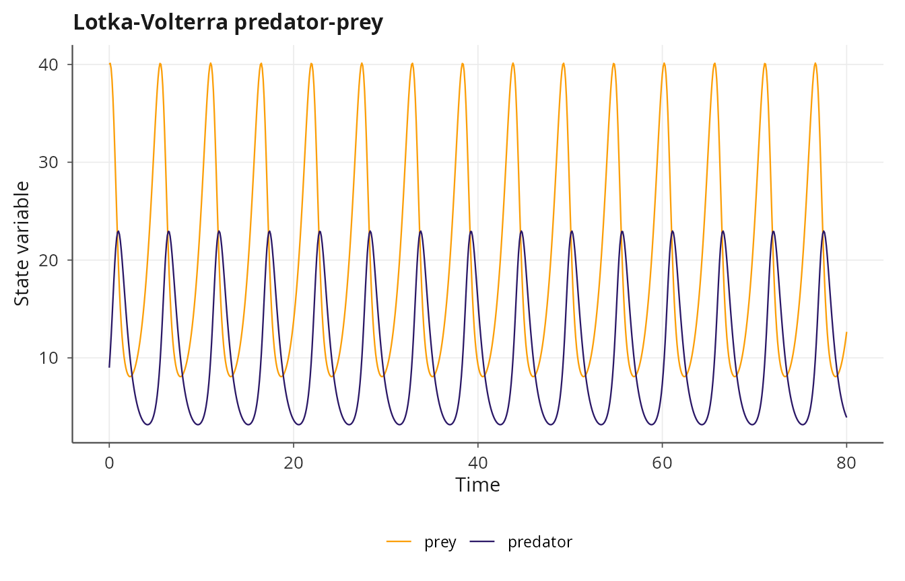

#### References

- Kutta, W. (1901). Beitrag zur naherungsweisen Integration totaler
  Differentialgleichungen. *Zeitschrift fur Mathematik und Physik*, 46,
  435-453.

### Adaptive Dormand-Prince RK4(5)

| Aspect       | Description                                   |
|:-------------|:----------------------------------------------|
| Order        | 4(5) embedded pair (Dormand-Prince)           |
| Step control | Adaptive; step accepted when error norm \<= 1 |
| Model type   | Deterministic ODE (rhs formulas)              |
| Compiled     | Yes (C++ via Rcpp, FSAL optimization)         |

The Dormand-Prince method is an embedded Runge-Kutta pair that produces
both a fourth-order and a fifth-order solution from six function
evaluations (seven nominally, but the “first same as last” optimization
reuses the last evaluation as the first of the next step). The
difference between the two estimates serves as a local error indicator.
A step is accepted when the error satisfies:

\\\left\\\frac{y_5 - y_4}{\text{atol} + \text{rtol} \cdot
\|y_4\|}\right\\\_\infty \leq 1\\

When the error exceeds this bound, the step is rejected and retried with
a smaller step. After acceptance, the next step size is estimated from
the error ratio using a safety factor of 0.9, with a growth factor
clamped to \[0.2, 5.0\].

This is the recommended solver for general-purpose ODE integration. It
automatically handles problems with varying time scales, eliminating the
need to manually tune the step size. The `subsample` parameter here
specifies the approximate interval between output points (in time units,
not step counts), since the internal steps are variable.

#### Example: Rosenzweig-MacArthur predator-prey

The Rosenzweig-MacArthur model extends the classic Lotka-Volterra system
with a type II functional response and logistic prey growth. For
appropriate parameters it produces a stable limit cycle with pronounced
amplitude variation, making adaptive stepping beneficial:

``` r

rma <- system_spec(
    rhs = list(
        prey ~ r * prey * (1 - prey / K) - a * prey * pred / (1 + a * h * prey),
        pred ~ e * a * prey * pred / (1 + a * h * prey) - d * pred
    ),
    state_names = c("prey", "pred"),
    parms = list(r = 1.0, K = 1.0, a = 5.0, h = 0.5, e = 0.5, d = 0.3),
    init  = c(prey = 0.5, pred = 0.1)
)

result <- dyn_sim(rma, t_max = 100, solver = solver_rk45(),
                  discard_transient = 10)
#> ⚙ Simulating User-defined ODE system (compiled)
#>   ¡ Integration: RK45 (adaptive)
#>   ¡ Duration: 100, discarding 10 transient
#>   ⏱ Elapsed: 0.01 seconds
#> ✔ Simulation complete: 1001 time points, 900 on attractor
plot(result, title = "Rosenzweig-MacArthur predator-prey")
```

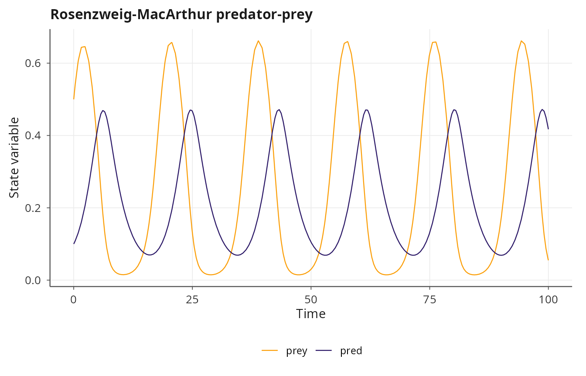

#### References

- Dormand, J. R., & Prince, P. J. (1980). A family of embedded
  Runge-Kutta formulae. *Journal of Computational and Applied
  Mathematics*, 6(1), 19-26. [DOI:
  10.1016/0771-050X(80)90013-3](https://doi.org/10.1016/0771-050X(80)90013-3)
- Rosenzweig, M. L. & MacArthur, R. H. (1963). Graphical representation
  and stability conditions of predator-prey interactions. *American
  Naturalist*, 97(895), 209-223. [DOI:
  10.1086/282272](https://doi.org/10.1086/282272)

### Rosenbrock (Rodas3) for stiff systems

| Aspect       | Description                              |
|:-------------|:-----------------------------------------|
| Order        | 4 with embedded order-3 error estimate   |
| Step control | Adaptive; same error norm as RK45        |
| Model type   | Deterministic ODE (rhs formulas)         |
| Compiled     | Yes (C++ via Rcpp, symbolic Jacobian)    |
| Stiff-stable | L-stable (correct damping of fast modes) |

Stiff systems contain widely separated time scales; explicit methods
like RK4 and RK45 require impractically small steps to maintain
stability on such problems. Rosenbrock methods avoid this by solving a
linear system at each stage rather than iterating to convergence as
fully implicit methods do. The Rodas3 variant uses four stages per step
and is L-stable, meaning it correctly damps arbitrarily fast modes
without oscillation.

At each stage \\i\\, the solver solves the linear system:

\\\left(\frac{I}{\gamma \\ h} - J\right) k_i = f(y + \sum_j a\_{ij}
k_j) + \frac{J}{\gamma \\ h} \sum_j c\_{ij} k_j\\

where \\J = \partial f / \partial y\\ is the Jacobian, \\h\\ is the step
size, and \\\gamma\\ is a method coefficient. The Jacobian is generated
symbolically from the model formulas at compile time, providing exact
derivatives without finite-difference approximation. Adaptive step-size
control uses the difference between the fourth-order and third-order
solutions.

#### Example: Brusselator

The Brusselator is a model of an autocatalytic chemical reaction that
exhibits limit-cycle oscillations with sharp, stiff transients in the
\\y\\ variable. With \\a = 1\\ and \\b = 3\\ the system lies beyond the
Hopf bifurcation, and the relaxation-type spikes in \\y\\ make explicit
methods inefficient:

\\\dot{x} = a - (b + 1)x + x^2 y, \qquad \dot{y} = bx - x^2 y\\

``` r

brusselator <- system_spec(
    rhs = list(
        x ~ a - (b + 1) * x + x^2 * y,
        y ~ b * x - x^2 * y
    ),
    state_names = c("x", "y"),
    parms = list(a = 1, b = 3),
    init  = c(x = 1.5, y = 1)
)

result <- dyn_sim(brusselator, t_max = 40,
                  solver = solver_rosenbrock())
#> ⚙ Simulating User-defined ODE system (Rosenbrock)
#>   ¡ Integration: Rosenbrock (Rodas3, L-stable, order 4)
#>   ¡ Duration: 40, discarding 30 transient
#>   ⏱ Elapsed: 0.02 seconds
#> ✔ Simulation complete: 401 time points, 101 on attractor
plot(result, title = "Brusselator oscillator")
```

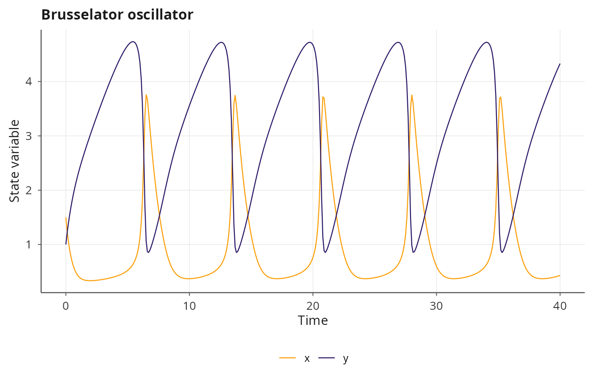

#### References

- Hairer, E. & Wanner, G. (1996). *Solving Ordinary Differential
  Equations II: Stiff and Differential-Algebraic Problems*. Springer.
  ISBN: 978-3-642-05221-7.
- Prigogine, I. & Lefever, R. (1968). Symmetry breaking instabilities in
  dissipative systems. II. *Journal of Chemical Physics*, 48(4),
  1695-1700. [DOI: 10.1063/1.1668896](https://doi.org/10.1063/1.1668896)

## Stochastic simulation algorithms (SSA)

These solvers produce exact sample paths of continuous-time Markov
chains (CTMCs), where the state is an integer-valued population vector
and transitions occur at random times according to propensity functions.
The three SSA variants differ in computational cost per event but all
generate statistically exact trajectories. Models are specified through
stoichiometry matrices and propensity formulas rather than ODE
right-hand sides.

The general form of a CTMC with \\M\\ reaction channels is: given
current state \\\mathbf{x}\\, reaction \\j\\ fires at rate
\\a_j(\mathbf{x})\\ (the propensity), changing the state by
stoichiometry vector \\\mathbf{\nu}\_j\\. Between events, the time to
the next reaction is exponentially distributed with rate \\a_0 =
\sum\_{j=1}^{M} a_j(\mathbf{x})\\.

### Gillespie direct method

| Aspect         | Description                             |
|:---------------|:----------------------------------------|
| Exactness      | Exact (no approximation)                |
| Cost per event | O(M) where M is the number of reactions |
| Model type     | CTMC (stoichiometry + propensities)     |
| Compiled       | Yes (C++ via Rcpp)                      |

The Gillespie direct method is the foundational exact SSA. At each step,
all \\M\\ propensities are computed, the time to the next event is drawn
from \\\text{Exp}(a_0)\\, and the firing reaction is selected with
probability \\a_j / a_0\\. The algorithm is conceptually simple and
numerically robust, but its \\O(M)\\ cost per step makes it inefficient
for systems with many reaction channels.

#### Algorithm

1.  Compute all propensities \\a_j(\mathbf{x})\\ and total rate \\a_0 =
    \sum_j a_j\\.
2.  Draw waiting time \\\tau \sim \text{Exp}(a_0)\\.
3.  Select reaction \\j\\ with probability \\a_j / a_0\\.
4.  Update state \\\mathbf{x} \leftarrow \mathbf{x} + \mathbf{\nu}\_j\\
    and time \\t \leftarrow t + \tau\\.

#### Example: SIR epidemic

``` r

sir <- system_spec(
    stoichiometry = list(
        infection = c(S = -1L, I = 1L, R = 0L),
        recovery  = c(S = 0L,  I = -1L, R = 1L)
    ),
    propensities = list(
        infection ~ beta * S * I,
        recovery  ~ gamma * I
    ),
    state_names = c("S", "I", "R"),
    parms = list(beta = 0.001, gamma = 0.1),
    init  = c(S = 999L, I = 1L, R = 0L)
)

result <- dyn_sim(sir, t_max = 200, solver = solver_ssa_direct(seed = 123),
                  discard_transient = 0)
#> ⚙ Simulating CTMC reaction network (Gillespie direct)
#>   ¡ Reactions: 2 (infection, recovery)
#>   ¡ Duration: 200, seed = 123
#>   ⏱ Elapsed: 0.01 seconds
#> ✔ Simulation complete: 86 time points, 1999 reactions fired
plot(result, title = "SIR epidemic (Gillespie direct)")
```

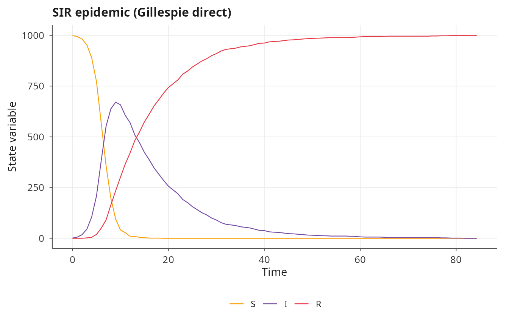

#### References

- Gillespie, D. T. (1977). Exact stochastic simulation of coupled
  chemical reactions. *Journal of Physical Chemistry*, 81(25),
  2340-2361. [DOI:
  10.1021/j100540a008](https://doi.org/10.1021/j100540a008)

### Next-reaction method (NRM)

| Aspect | Description |
|:---|:---|
| Exactness | Exact (no approximation) |
| Cost per event | O(log M) via priority queue; only affected propensities recomputed |
| Model type | CTMC (stoichiometry + propensities) |
| Compiled | Yes (C++ via Rcpp, dependency graph) |

Gibson and Bruck’s next-reaction method maintains a priority queue of
putative firing times, one per reaction channel. At each step, the
reaction with the smallest putative time fires. After the state update,
only the propensities in the dependency graph of the fired reaction are
recomputed, and their putative times are rescaled rather than redrawn.
This achieves \\O(\log M)\\ cost per event and avoids the \\O(M)\\
full-scan of the direct method.

The NRM uses a stale-entry priority queue: when a putative time entry is
encountered whose stored time differs from the current putative time of
that reaction, the entry is skipped. This avoids explicit deletion from
the queue and keeps the implementation simple.

#### Algorithm

1.  For each reaction \\j\\, draw initial putative time \\\tau_j \sim
    \text{Exp}(a_j)\\ and insert into priority queue.
2.  Pop the minimum \\\tau\_\mu\\ from the queue; fire reaction \\\mu\\.
3.  Update state \\\mathbf{x} \leftarrow \mathbf{x} +
    \mathbf{\nu}\_\mu\\.
4.  For each reaction \\j\\ in the dependency graph of \\\mu\\:
    recompute \\a_j\\; if \\j = \mu\\, draw new \\\tau_j\\; otherwise
    rescale \\\tau_j \leftarrow t + (a_j^{\text{old}} /
    a_j^{\text{new}})(\tau_j - t)\\.

#### Example

The `sir` model defined above can be solved with the NRM by changing
only the solver; the model specification is identical:

``` r

result <- dyn_sim(sir, t_max = 200, solver = solver_ssa_nrm(seed = 42))
#> ⚙ Simulating CTMC reaction network (Gibson-Bruck NRM)
#>   ¡ Reactions: 2 (infection, recovery)
#>   ¡ Duration: 200, seed = 42
#>   ⏱ Elapsed: 0.01 seconds
#> ✔ Simulation complete: 120 time points, 1999 reactions fired
plot(result, title = "SIR epidemic (next-reaction method)")
```


Because the three SSA methods use different internal RNG sequences, each
produces a distinct stochastic realization of the same epidemic, but
their statistical properties are identical.

#### References

- Gibson, M. A., & Bruck, J. (2000). Efficient exact stochastic
  simulation of chemical systems with many species and many channels.
  *Journal of Physical Chemistry A*, 104(9), 1876-1889. [DOI:
  10.1021/jp993732q](https://doi.org/10.1021/jp993732q)

### Modified next-reaction method (MNRM)

| Aspect         | Description                                               |
|:---------------|:----------------------------------------------------------|
| Exactness      | Exact (no approximation)                                  |
| Cost per event | O(log M) via priority queue; improved numerical stability |
| Model type     | CTMC (stoichiometry + propensities)                       |
| Compiled       | Yes (C++ via Rcpp, dependency graph)                      |

Anderson’s modification of the NRM reformulates the internal bookkeeping
in terms of unit-rate Poisson processes. Each reaction \\k\\ maintains
an internal time \\T_k\\ and an integrated propensity \\P_k(t) =
\int_0^t a_k(\mathbf{x}(s)) \\ ds\\. The next firing time for reaction
\\k\\ is the smallest \\t\\ satisfying \\P_k(t) \geq T_k\\, where
\\T_k\\ is incremented by independent unit-rate exponentials. This
formulation avoids the rescaling step of the original NRM and provides
improved numerical stability for systems where propensities vary over
many orders of magnitude.

#### Example

``` r

result <- dyn_sim(sir, t_max = 200, solver = solver_ssa_mnrm(seed = 42))
#> ⚙ Simulating CTMC reaction network (Anderson MNRM)
#>   ¡ Reactions: 2 (infection, recovery)
#>   ¡ Duration: 200, seed = 42
#>   ⏱ Elapsed: 0.01 seconds
#> ✔ Simulation complete: 67 time points, 1999 reactions fired
plot(result, title = "SIR epidemic (modified next-reaction)")
```


#### References

- Anderson, D. F. (2007). A modified next reaction method for simulating
  chemical systems with time dependent propensities and delays. *Journal
  of Chemical Physics*, 127, 214107. [DOI:
  10.1063/1.2799998](https://doi.org/10.1063/1.2799998)

## Approximate stochastic methods

When exact SSA is too slow because the system fires millions of events
per unit time, approximate methods trade statistical exactness for
computational speed. These solvers leap over multiple events in a single
step, either by drawing Poisson-distributed reaction counts (tau-leap)
or by approximating the discrete dynamics with a continuous Langevin
equation (hybrid).

### Adaptive tau-leap

| Aspect       | Description                                    |
|:-------------|:-----------------------------------------------|
| Accuracy     | Approximate; error controlled by epsilon       |
| Step control | Adaptive tau selection (Cao-Gillespie-Petzold) |
| Model type   | CTMC (stoichiometry + propensities)            |
| Compiled     | Yes (C++ via Rcpp)                             |

Tau-leaping advances the system by a time increment \\\tau\\ during
which multiple reactions may fire. The number of firings of reaction
\\j\\ during \\\[\\t, t + \tau)\\ is drawn from
\\\text{Poisson}(a_j(\mathbf{x}) \cdot \tau)\\. The key challenge is
selecting \\\tau\\ large enough for efficiency but small enough to keep
the propensities approximately constant. The Cao-Gillespie-Petzold
(2006) procedure selects:

\\\tau = \min_i \left\\ \frac{\max(\epsilon \\ x_i / g_i, \\
1)}{\|\mu_i\|}, \\\\ \frac{\max(\epsilon \\ x_i / g_i, \\
1)^2}{\sigma_i^2} \right\\\\

where \\\mu_i\\ and \\\sigma_i^2\\ are the expected mean and variance of
the state change per unit time, \\x_i\\ is the current population of
species \\i\\, and \\g_i\\ is the highest order of reactant \\i\\ across
all reactions. When the selected \\\tau\\ is too small or propensities
are near zero, the algorithm falls back to `n_critical` exact Gillespie
steps.

Step rejection is enabled by default: if a leap produces negative
populations, the step is halved and retried up to `max_rejections` times
before falling back to exact SSA.

#### Example: birth-death process

``` r

bd <- system_spec(
    stoichiometry = list(
        birth = c(N = 1L),
        death = c(N = -1L)
    ),
    propensities = list(
        birth ~ lambda,
        death ~ mu * N
    ),
    state_names = "N",
    parms = list(lambda = 100, mu = 0.1),
    init  = c(N = 1000L)
)

result <- dyn_sim(bd, t_max = 200, solver = solver_tau_leap(seed = 42),
                  discard_transient = 0)
#> ⚙ Simulating CTMC reaction network (Adaptive tau-leap (CGP 2006))
#>   ¡ Reactions: 2 (birth, death)
#>   ¡ Duration: 200, seed = 42
#>   ⏱ Elapsed: 0.01 seconds
#> ✔ Simulation complete: 202 time points, 40228 reactions fired, 46 leap steps
plot(result, title = "Birth-death process (tau-leap)")
```

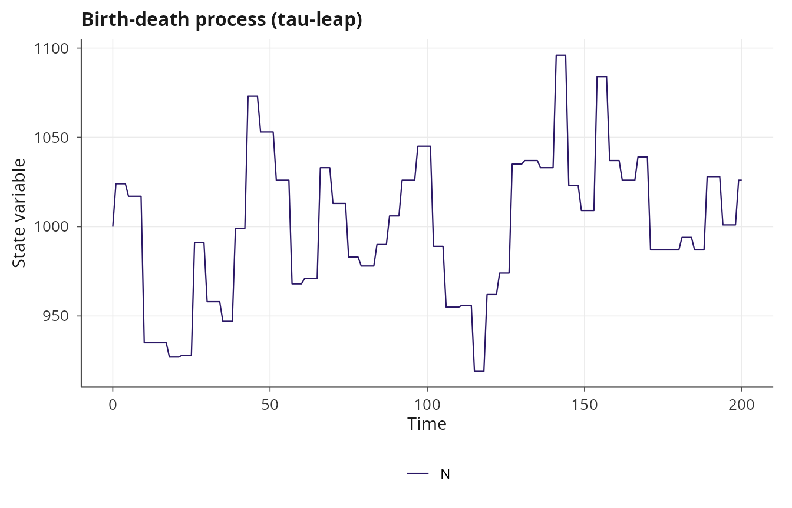

#### References

- Cao, Y., Gillespie, D. T., & Petzold, L. R. (2006). Efficient step
  size selection for the tau-leaping simulation method. *Journal of
  Chemical Physics*, 124, 044109. [DOI:
  10.1063/1.2187339](https://doi.org/10.1063/1.2187339)

### Midpoint tau-leap

| Aspect       | Description                                             |
|:-------------|:--------------------------------------------------------|
| Accuracy     | Approximate; one order less bias than explicit tau-leap |
| Step control | Adaptive tau selection (same as tau-leap)               |
| Model type   | CTMC (stoichiometry + propensities)                     |
| Compiled     | Yes (C++ via Rcpp)                                      |

The midpoint variant of tau-leaping evaluates propensities at the
midpoint of the \\\tau\\ interval rather than at the beginning. The
algorithm first computes the deterministic drift to obtain a midpoint
state:

\\\mathbf{x}\_{\text{mid}} = \mathbf{x} + \frac{\tau}{2} \sum_j
a_j(\mathbf{x}) \\ \mathbf{\nu}\_j\\

and then draws Poisson-distributed reaction counts using propensities
evaluated at \\\mathbf{x}\_{\text{mid}}\\. This reduces the bias
inherent in explicit tau-leaping by one order, at the cost of an
additional propensity evaluation per step. The same adaptive tau
selection and step rejection mechanism as the explicit tau-leap apply.

#### Example

``` r

result <- dyn_sim(bd, t_max = 200,
                  solver = solver_tau_leap_midpoint(seed = 42),
                  discard_transient = 0)
#> ⚙ Simulating CTMC reaction network (Midpoint tau-leap)
#>   ¡ Reactions: 2 (birth, death)
#>   ¡ Duration: 200, seed = 42
#>   ⏱ Elapsed: 0.01 seconds
#> ✔ Simulation complete: 202 time points, 40143 reactions fired, 47 leap steps
plot(result, title = "Birth-death process (midpoint tau-leap)")
```

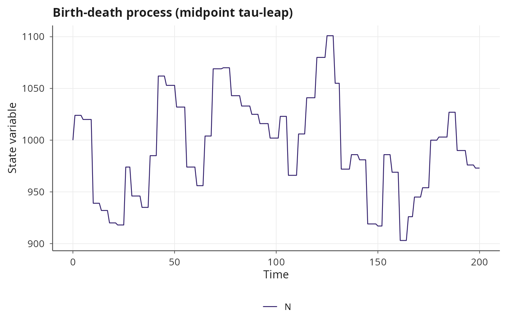

#### References

- Gillespie, D. T. (2001). Approximate accelerated stochastic simulation
  of chemically reacting systems. *Journal of Chemical Physics*, 115(4),
  1716-1733. [DOI: 10.1063/1.1378322](https://doi.org/10.1063/1.1378322)

### Hybrid SSA/CLE

| Aspect       | Description                                               |
|:-------------|:----------------------------------------------------------|
| Accuracy     | Approximate; fast reactions via CLE, slow reactions exact |
| Step control | Fixed CLE time step; event-driven slow reactions          |
| Model type   | CTMC (stoichiometry + propensities)                       |
| Compiled     | Yes (C++ via Rcpp)                                        |

The hybrid solver partitions reactions into fast and slow channels based
on a propensity threshold. Fast reactions, those with \\a_j \cdot \Delta
t \> \texttt{threshold}\\, are approximated by the chemical Langevin
equation (CLE), an Euler-Maruyama discretization of the diffusion limit.
Slow reactions are handled exactly by the Gillespie direct method. The
partition is updated periodically every `repartition_interval` steps.

For each fast reaction \\j\\, the CLE update within a time step \\\Delta
t\\ is:

\\\mathbf{x} \leftarrow \mathbf{x} + \mathbf{\nu}\_j \left\[
a_j(\mathbf{x}) \\ \Delta t + \sqrt{a_j(\mathbf{x}) \\ \Delta t} \\ Z_j
\right\]\\

where \\Z_j \sim \mathcal{N}(0,1)\\. Because the CLE produces
continuous-valued state, the output trajectory contains doubles rather
than integers.

This approach is particularly effective for multi-scale systems where
some reactions fire orders of magnitude more frequently than others.

#### Example: gene expression with fast transcription

``` r

gene <- system_spec(
    stoichiometry = list(
        transcription   = c(mRNA = 1L, protein = 0L),
        translation     = c(mRNA = 0L, protein = 1L),
        mrna_decay      = c(mRNA = -1L, protein = 0L),
        protein_decay   = c(mRNA = 0L, protein = -1L)
    ),
    propensities = list(
        transcription   ~ k_tx,
        translation     ~ k_tl * mRNA,
        mrna_decay      ~ d_m * mRNA,
        protein_decay   ~ d_p * protein
    ),
    state_names = c("mRNA", "protein"),
    parms = list(k_tx = 5, k_tl = 5, d_m = 0.5, d_p = 0.1),
    init  = c(mRNA = 0L, protein = 0L)
)

result <- dyn_sim(gene, t_max = 100,
                  solver = solver_hybrid(dt_cle = 0.01, threshold = 10),
                  discard_transient = 0)
#> ⚙ Simulating CTMC reaction network (Hybrid SSA/CLE)
#>   ¡ Reactions: 4 (transcription, translation, mrna_decay, protein_decay)
#>   ¡ Duration: 100, seed = 42
#>   ⏱ Elapsed: 0.01 seconds
#> ✔ Simulation complete: 102 time points, 6329 reactions fired, 6329 SSA steps, 16329 CLE steps
plot(result, title = "Gene expression with fast transcription")
```

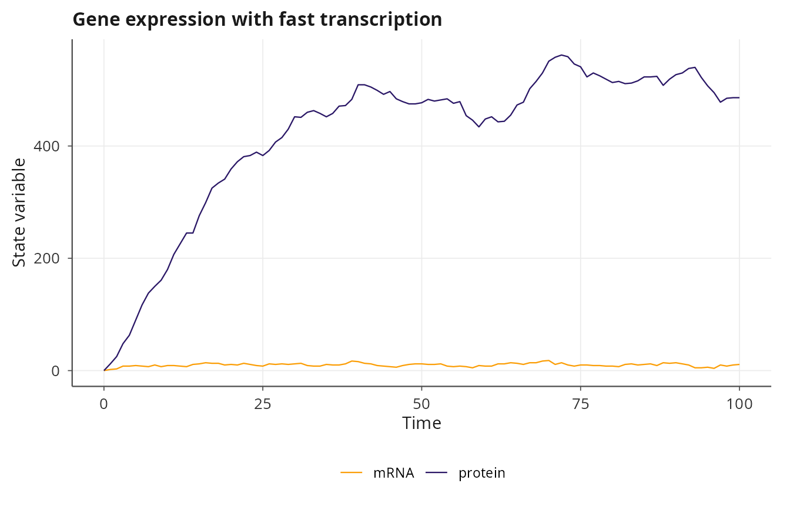

#### References

- Haseltine, E. L., & Rawlings, J. B. (2002). Approximate simulation of
  coupled fast and slow reactions for stochastic chemical kinetics.
  *Journal of Chemical Physics*, 117(15), 6959-6969. [DOI:
  10.1063/1.1505860](https://doi.org/10.1063/1.1505860)

## Stochastic differential equation (SDE) solvers

These solvers integrate Ito stochastic differential equations of the
general form \\d\mathbf{X} = f(\mathbf{X}) \\ dt + g(\mathbf{X}) \\
d\mathbf{W}\\, where \\d\mathbf{W}\\ is a vector of independent Wiener
process increments. SDE models are specified in
[`system_spec()`](https://robustecologies.github.io/janos/reference/system_spec.md)
through both `rhs` (drift) and `diffusion` formulas. janos also supports
correlated noise, Levy-driven SDEs, fractional Brownian motion, and
colored noise via `noise_spec` objects attached to the model.

### Euler-Maruyama

| Aspect       | Description                        |
|:-------------|:-----------------------------------|
| Strong order | 0.5                                |
| Step control | Fixed time step                    |
| Model type   | Ito SDE (rhs + diffusion formulas) |
| Compiled     | Yes (C++ via Rcpp)                 |

The Euler-Maruyama method is the simplest numerical scheme for SDEs. At
each step:

\\X\_{n+1} = X_n + f(X_n) \\ \Delta t + g(X_n) \\ \Delta W_n\\

where \\\Delta W_n \sim \mathcal{N}(0, \Delta t)\\. The method achieves
strong order 0.5 and weak order 1.0 convergence. Despite its low order,
it is often the method of choice because it is simple, robust, and
compatible with all noise types supported by janos (correlated, Levy,
fBm, colored).

#### Example: geometric Brownian motion

``` r

gbm <- system_spec(
    rhs = list(x ~ mu * x),
    diffusion = list(x ~ sigma * x),
    state_names = "x",
    parms = list(mu = 0.05, sigma = 0.3),
    init  = c(x = 1.0)
)

result <- dyn_sim(gbm, t_max = 5,
                  solver = solver_euler_maruyama(dt = 0.001, seed = 42),
                  discard_transient = 0)
#> ⚙ Simulating SDE system (compiled EULER_MARUYAMA)
#>   ¡ dt = 0.001, seed = 42
#>   ¡ Duration: 5, discarding 0 transient
#>   ⏱ Elapsed: 0.01 seconds
#> ✔ Simulation complete: 5001 time points, 5001 on attractor
plot(result, title = "Geometric Brownian motion")
```

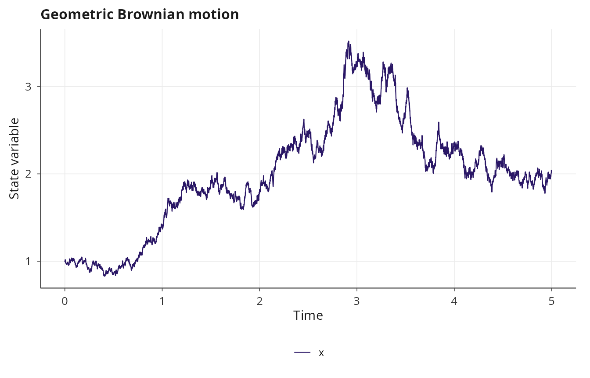

#### References

- Maruyama, G. (1955). Continuous Markov processes and stochastic
  equations. *Rendiconti del Circolo Matematico di Palermo*, 4, 48-90.
  [DOI: 10.1007/BF02846028](https://doi.org/10.1007/BF02846028)
- Kloeden, P. E. & Platen, E. (1992). *Numerical Solution of Stochastic
  Differential Equations*. Springer. ISBN: 978-3-540-54062-5.

### Milstein

| Aspect       | Description                                             |
|:-------------|:--------------------------------------------------------|
| Strong order | 1.0                                                     |
| Step control | Fixed time step                                         |
| Model type   | Ito SDE (rhs + diffusion formulas, Gaussian noise only) |
| Compiled     | Yes (C++ via Rcpp)                                      |

The Milstein method adds a correction term to the Euler-Maruyama scheme
that accounts for the Ito-Taylor expansion to the next order:

\\X\_{n+1} = X_n + f(X_n) \\ \Delta t + g(X_n) \\ \Delta W_n +
\frac{1}{2} \\ g(X_n) \\ g'(X_n) \left\[(\Delta W_n)^2 - \Delta
t\right\]\\

The derivative \\g'(X)\\ is approximated by central finite difference
with perturbation `dg_eps`. This achieves strong order 1.0, doubling the
convergence rate compared to Euler-Maruyama. The improvement is most
pronounced when the diffusion coefficient varies significantly with the
state.

The Milstein method is restricted to Gaussian noise; it is blocked for
Levy-driven, fractional Brownian motion, and colored noise models, where
the Ito-Taylor expansion does not apply in the standard form.

#### Example: Cox-Ingersoll-Ross process

The CIR process is a mean-reverting model with state-dependent
volatility, commonly used for interest rate modeling:

\\dX = \kappa(\theta - X) \\ dt + \sigma \sqrt{X} \\ dW\\

``` r

cir <- system_spec(
    rhs = list(x ~ kappa * (theta - x)),
    diffusion = list(x ~ sigma * sqrt(x)),
    state_names = "x",
    parms = list(kappa = 0.5, theta = 0.04, sigma = 0.1),
    init  = c(x = 0.04)
)

result <- dyn_sim(cir, t_max = 20,
                  solver = solver_milstein(dt = 0.001, seed = 42),
                  discard_transient = 0)
#> ⚙ Simulating SDE system (compiled MILSTEIN)
#>   ¡ dt = 0.001, seed = 42
#>   ¡ Duration: 20, discarding 0 transient
#>   ⏱ Elapsed: 0.01 seconds
#> ✔ Simulation complete: 20001 time points, 20001 on attractor
plot(result, title = "Cox-Ingersoll-Ross process")
```

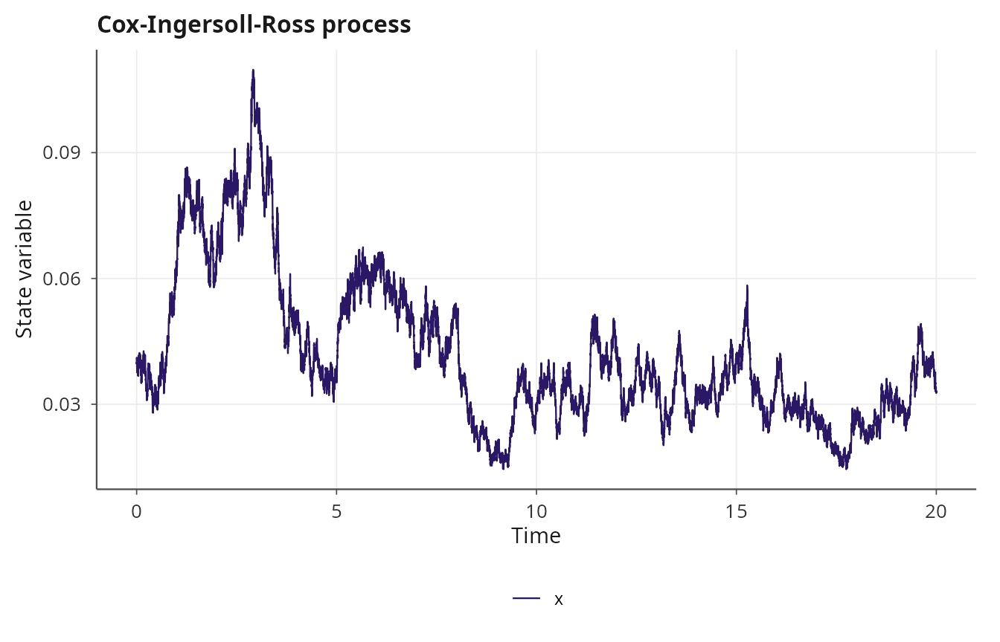

#### References

- Milstein, G. N. (1975). Approximate integration of stochastic
  differential equations. *Theory of Probability and Its Applications*,
  19(3), 557-562. [DOI:
  10.1137/1119062](https://doi.org/10.1137/1119062)

### Jump-diffusion

| Aspect       | Description                                          |
|:-------------|:-----------------------------------------------------|
| Strong order | 0.5 (diffusion part); exact jump simulation          |
| Step control | Fixed time step                                      |
| Model type   | Ito SDE with Poisson jumps (rhs + diffusion + jumps) |
| Compiled     | Yes (C++ via Rcpp)                                   |

The jump-diffusion solver handles Ito processes augmented with Poisson
jump channels:

\\d\mathbf{X} = f(\mathbf{X}) \\ dt + g(\mathbf{X}) \\ d\mathbf{W} +
\sum_k h_k(\mathbf{X}, J_k) \\ dN_k(t)\\

where \\N_k(t)\\ are independent Poisson processes with state-dependent
intensity \\\lambda_k(\mathbf{X})\\. At each time step, the diffusion
part is handled by Euler-Maruyama or Milstein (selectable via the
`method` argument), and then for each jump channel the number of
arrivals during \\\[t, t + \Delta t)\\ is drawn from
\\\text{Poisson}(\lambda_k \cdot \Delta t)\\. Jump sizes can follow
deterministic, normal, exponential, or uniform distributions. An
optional `compensated` flag subtracts the jump compensator from the
drift for the martingale property.

#### Example: Merton jump-diffusion

``` r

merton <- system_spec(
    rhs = list(x ~ mu * x),
    diffusion = list(x ~ sigma * x),
    jumps = list(
        x ~ list(intensity = ~ lambda,
                 size_distribution = "normal",
                 size_mean = ~ mu_J * x,
                 size_sd = ~ sigma_J * x)
    ),
    state_names = "x",
    parms = list(mu = 0.05, sigma = 0.2, lambda = 1.0,
                 mu_J = -0.05, sigma_J = 0.03),
    init  = c(x = 1.0)
)

result <- dyn_sim(merton, t_max = 5,
                  solver = solver_jump_diffusion(dt = 0.001, seed = 42),
                  discard_transient = 0)
#> ⚙ Simulating Jump-diffusion system (jump-diffusion, Euler-Maruyama)
#>   ¡ Jump channels: 1
#>   ¡ dt = 0.001, seed = 42
#>   ¡ Duration: 5, discarding 0 transient
#>   ⏱ Elapsed: 0.01 seconds
#> ✔ Simulation complete: 5001 time points, 5001 on attractor
plot(result, title = "Merton jump-diffusion")
```

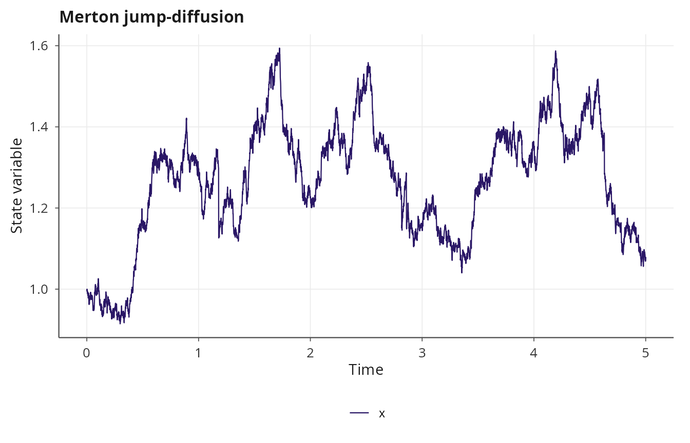

#### References

- Merton, R. C. (1976). Option pricing when underlying stock returns are
  discontinuous. *Journal of Financial Economics*, 3(1-2), 125-144.
  [DOI:
  10.1016/0304-405X(76)90022-2](https://doi.org/10.1016/0304-405X(76)90022-2)
- Cont, R., & Tankov, P. (2004). *Financial Modelling with Jump
  Processes*. Chapman and Hall/CRC. ISBN: 978-1584884132.

## Discrete-time and delay solvers

These solvers handle two classes of systems that fall outside the
standard ODE/SDE framework: deterministic iterated maps, where the state
evolves in discrete steps, and delay differential equations, where the
rate of change depends on the state at a past time.

### Discrete map

| Aspect       | Description                      |
|:-------------|:---------------------------------|
| Order        | Exact iteration y(n+1) = F(y(n)) |
| Step control | One map application per step     |
| Model type   | Discrete map (map formulas)      |
| Compiled     | Yes (C++ via Rcpp)               |

The discrete map solver iterates \\y\_{n+1} = F(y_n, \theta)\\ where
\\F\\ is specified through `map` formulas in
[`system_spec()`](https://robustecologies.github.io/janos/reference/system_spec.md).
All state variables are updated simultaneously from the current state
(not sequentially), matching the mathematical convention for coupled
maps. The `t_max` argument to
[`dyn_sim()`](https://robustecologies.github.io/janos/reference/dyn_sim.md)
is reinterpreted as the number of iterations, and `discard_transient` as
the number of initial iterations to discard.

#### Example: logistic map

``` r

logistic <- system_spec(
    map = list(x ~ r * x * (1 - x)),
    state_names = "x",
    parms = list(r = 3.9),
    init  = c(x = 0.1)
)

result <- dyn_sim(logistic, t_max = 500, solver = solver_map(),
                  discard_transient = 100)
#> ⚙ Iterating Discrete map (compiled)
#>   ¡ Iterations: 500, discarding 100 transient
#>   ⏱ Elapsed: 0.01 seconds
#> ✔ Simulation complete: 501 iterations stored, 401 on attractor
plot(result, title = "Logistic map (r = 3.9)")
```

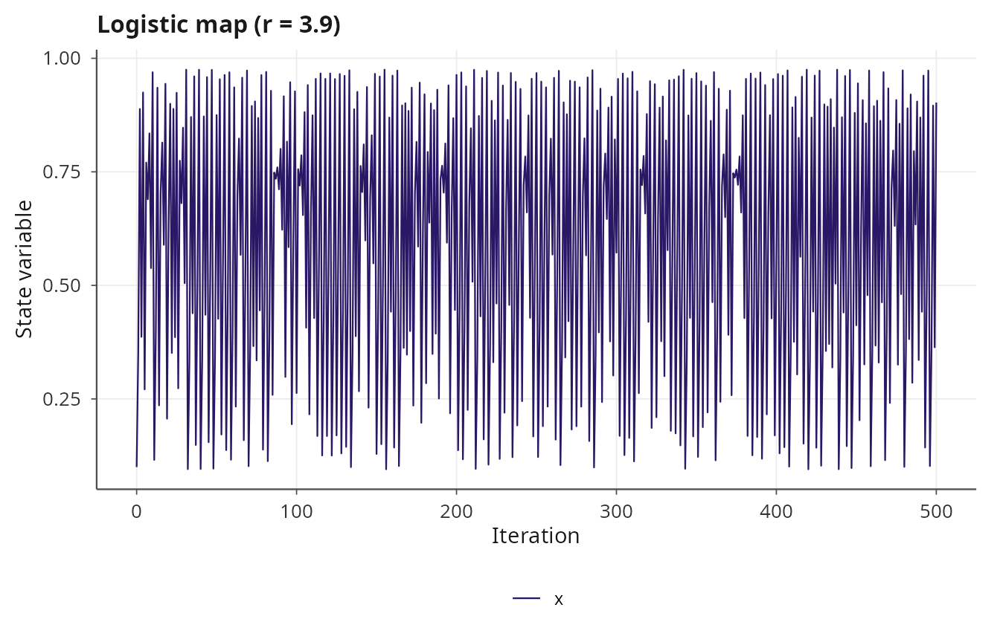

### Delay differential equations (DDE)

| Aspect       | Description                                   |
|:-------------|:----------------------------------------------|
| Order        | 4 (RK4 with Hermite interpolation of history) |
| Step control | Fixed time step                               |
| Model type   | DDE (rhs formulas + delays specification)     |
| Compiled     | Yes (C++ via Rcpp, circular history buffer)   |

Delay differential equations incorporate dependence on past states,
\\\dot{x}(t) = f(x(t), x(t - \tau))\\. They arise naturally in
population dynamics (maturation delays), control theory (feedback
latency), and epidemiology (incubation periods).

janos implements DDE integration via fixed-step RK4 with a circular
history buffer. Past state values at arbitrary times are obtained by
cubic Hermite interpolation over stored \\(t, y, \dot{y})\\ triples. The
delay terms are declared in the `delays` argument of
[`system_spec()`](https://robustecologies.github.io/janos/reference/system_spec.md)
as named lists specifying which state variable is delayed and by how
much. The delayed symbols then appear directly in the right-hand side
formulas.

#### Example: Mackey-Glass equation

The Mackey-Glass equation exhibits a transition from limit cycles to
chaos as the delay \\\tau\\ increases:

\\\dot{x}(t) = \frac{a \\ x(t - \tau)}{1 + x(t - \tau)^c} - b \\ x(t)\\

``` r

mg <- system_spec(
    rhs = list(x ~ a * x_delay / (1 + x_delay^c) - b * x),
    delays = list(x_delay = list(state = "x", tau = 17.0)),
    state_names = "x",
    parms = list(a = 0.2, b = 0.1, c = 10.0),
    init  = c(x = 0.9)
)

result <- dyn_sim(mg, t_max = 2000, solver = solver_dde(dt = 0.1),
                  discard_transient = 500)
#> ⚙ Simulating DDE system (compiled DDE)
#>   ¡ Integration: RK4, dt = 0.1, τ_max = 17
#>   ¡ Duration: 2000, discarding 500 transient
#>   ⏱ Elapsed: 0.01 seconds
#> ✔ Simulation complete: 20001 time points, 15001 on attractor
plot(result, title = "Mackey-Glass equation")
```

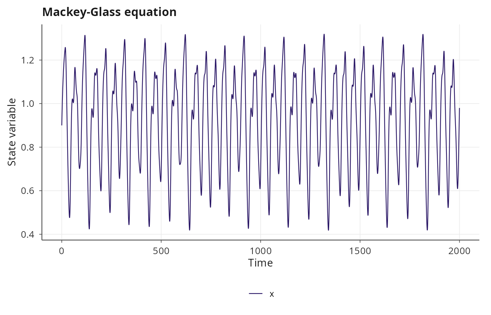

#### References

- Mackey, M. C. & Glass, L. (1977). Oscillation and chaos in
  physiological control systems. *Science*, 197(4300), 287-289. [DOI:
  10.1126/science.267326](https://doi.org/10.1126/science.267326)

## Piecewise deterministic Markov processes

### PDMP solver

| Aspect           | Description                                   |
|:-----------------|:----------------------------------------------|
| ODE order        | 4 (RK4 between switching events)              |
| Event generation | Lewis-Shedler thinning algorithm              |
| Model type       | PDMP (regimes + transitions + initial_regime) |
| Compiled         | Yes (C++ via Rcpp, per-regime compilation)    |

Piecewise deterministic Markov processes (PDMPs) combine continuous ODE
dynamics with discrete random switching between regimes. Between events,
the state evolves deterministically according to the current regime’s
right-hand side. Regime transitions occur stochastically: the solver
draws putative event times from an exponential distribution using the
Lewis-Shedler thinning algorithm, integrates the ODE to that time,
recomputes the actual transition rates, and accepts the event with
probability \\\lambda\_{\text{actual}} / \lambda\_{\text{bound}}\\. If
accepted, the target regime is selected proportional to individual
outgoing rates.

Models are specified through `regimes` (a named list of formula lists,
one per regime), `transitions` (a list of `from`/`to`/`rate`
specifications), and `initial_regime`. The output includes a `regime`
column tracking the active regime at each time point.

#### Example: bacterial growth with dormancy switching

A bacterium switches between an active growth phase and a dormant
survival phase at random times:

``` r

bact <- system_spec(
    regimes = list(
        active  = list(x ~ r * x * (1 - x / K)),
        dormant = list(x ~ -d * x)
    ),
    transitions = list(
        list(from = "active", to = "dormant", rate = ~ lambda_ad),
        list(from = "dormant", to = "active", rate = ~ lambda_da)
    ),
    state_names = "x",
    parms = list(r = 0.5, K = 100, d = 0.01,
                 lambda_ad = 0.1, lambda_da = 0.05),
    init  = c(x = 50),
    initial_regime = "active"
)

result <- dyn_sim(bact, t_max = 200, solver = solver_pdmp(seed = 42),
                  discard_transient = 0)
#> ⚙ Simulating PDMP system (PDMP, 2 regimes)
#>   ¡ dt_ode = 0.01, seed = 42
#>   ¡ Duration: 200, discarding 0 transient
#>   ¡ Initial regime: active
#>   ⏱ Elapsed: 0.01 seconds
#> ✔ Simulation complete: 201 time points, 15 regime transitions
plot(result, title = "Bacterial growth with dormancy switching")
```

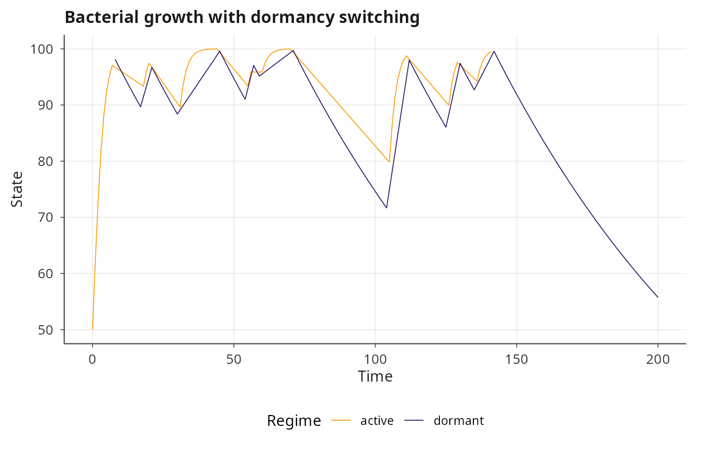

#### References

- Davis, M. H. A. (1984). Piecewise-deterministic Markov processes: A
  general class of non-diffusion stochastic models. *Journal of the
  Royal Statistical Society, Series B*, 46(3), 353-388.
- Lewis, P. A. W. & Shedler, G. S. (1979). Simulation of nonhomogeneous
  Poisson processes by thinning. *Naval Research Logistics Quarterly*,
  26(3), 403-413. [DOI:
  10.1002/nav.3800260304](https://doi.org/10.1002/nav.3800260304)

## Spatial solvers

These solvers handle systems with explicit spatial structure:
reaction-diffusion PDEs (both 1D and 2D) via the method of lines, and
spatially discrete stochastic dynamics via the reaction-diffusion master
equation.

### Method of lines, 1D PDE

| Aspect         | Description                             |
|:---------------|:----------------------------------------|
| Spatial order  | 2 (central finite differences)          |
| Temporal order | 4 (RK4)                                 |
| Step control   | Fixed time step (CFL stability warning) |
| Model type     | 1D PDE (pde + spatial formulas)         |
| Compiled       | Yes (C++ via Rcpp)                      |

The method of lines (MOL) semi-discretizes the PDE by replacing spatial
derivatives with finite-difference approximations on a uniform grid of
\\N\\ points with spacing \\\Delta x = (x\_{\max} - x\_{\min}) / (N -
1)\\. The spatial operators `d1x(u)` and `d2x(u)` are approximated by
second-order central differences:

\\\frac{\partial u}{\partial x}\bigg\|\_i \approx \frac{u\_{i+1} -
u\_{i-1}}{2 \\ \Delta x}, \qquad \frac{\partial^2 u}{\partial
x^2}\bigg\|\_i \approx \frac{u\_{i+1} - 2u_i + u\_{i-1}}{\Delta x^2}\\

The resulting \\N\\ coupled ODEs per state variable are integrated with
fixed-step RK4. The CFL stability condition for pure diffusion with
coefficient \\D\\ requires \\\Delta t \< \Delta x^2 / (2D)\\; a warning
is issued if the user-specified `dt` exceeds this bound.

Boundary conditions are specified per state variable: Dirichlet (fixed
value), Neumann (zero-flux via ghost points), or periodic (wrap-around
indexing).

#### Example: Fisher-KPP equation

The Fisher-KPP equation combines logistic growth with diffusion:

\\\frac{\partial u}{\partial t} = D \frac{\partial^2 u}{\partial x^2} +
r \\ u (1 - u)\\

``` r

fisher <- system_spec(
    pde = list(u ~ D * d2x(u) + r * u * (1 - u)),
    state_names = "u",
    parms = list(D = 0.01, r = 1.0),
    spatial = list(
        domain = c(0, 10), n_grid = 201,
        bc = list(u = list(type = "neumann", left = 0, right = 0))
    ),
    init = function(x) ifelse(x < 1, 1.0, 0.0)
)

result <- dyn_sim(fisher, t_max = 15, solver = solver_mol(dt = 0.001),
                  discard_transient = 0, verbose = FALSE)
plot(result, title = "Fisher-KPP travelling wave")
```

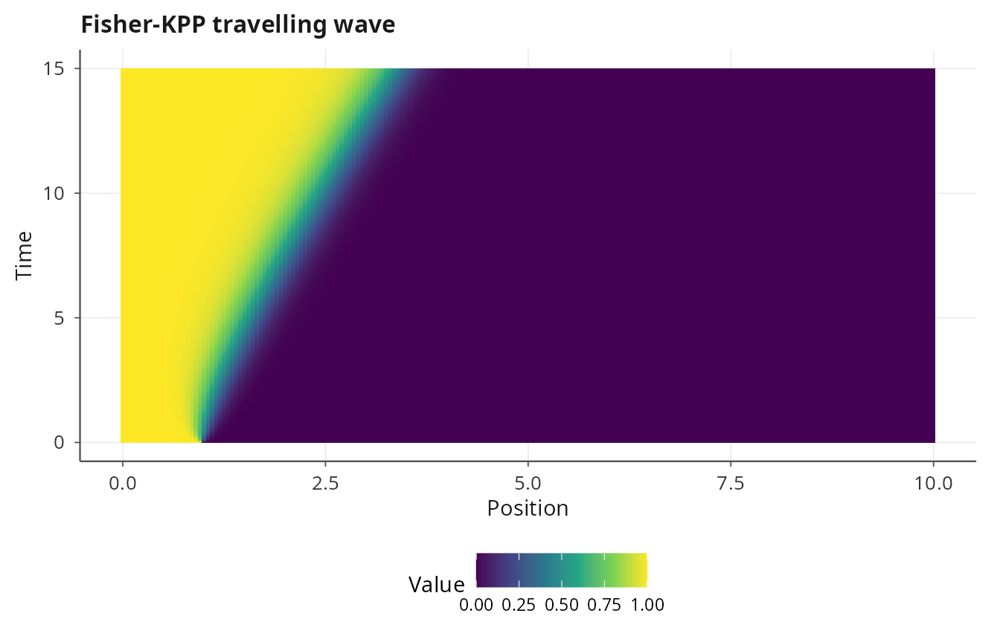

#### References

- Schiesser, W. E. (1991). *The Numerical Method of Lines*. Academic
  Press. ISBN: 978-0-12-624130-3.

### Method of lines, 2D PDE

| Aspect         | Description                                      |
|:---------------|:-------------------------------------------------|
| Spatial order  | 2 (central finite differences on Cartesian grid) |
| Temporal order | 4 (RK4)                                          |
| Step control   | Fixed time step (2D CFL stability warning)       |
| Model type     | 2D PDE (pde + spatial with x,y domain)           |
| Compiled       | Yes (C++ via Rcpp)                               |

The 2D MOL solver extends the 1D method of lines to Cartesian grids with
\\N_x \times N_y\\ points. Spatial operators include `d1x`, `d2x`,
`d1y`, `d2y`, and the Laplacian `lap` (which expands to `d2x + d2y`).
The state vector layout is \\y\[k \cdot N_x \cdot N_y + j \cdot N_x +
i\]\\ for state \\k\\ at grid point \\(i, j)\\.

The 2D CFL condition for diffusion with coefficient \\D\\ and uniform
grid spacing \\\Delta x = \Delta y\\ is \\\Delta t \< \Delta x^2 /
(4D)\\, which is twice as restrictive as the 1D condition.

#### Example: 2D heat equation

``` r

heat2d <- system_spec(
    pde = list(u ~ D * lap(u)),
    state_names = "u",
    parms = list(D = 1.0),
    init = function(x, y) sin(pi * x) * sin(pi * y),
    spatial = list(
        domain = list(x = c(0, 1), y = c(0, 1)),
        n_grid = c(41, 41),
        bc = list(u = list(
            x = list(type = "dirichlet", left = 0, right = 0),
            y = list(type = "dirichlet", left = 0, right = 0)
        ))
    )
)

result <- dyn_sim(heat2d, t_max = 0.1,
                  solver = solver_mol2d(dt = 0.00005, subsample = 100),
                  discard_transient = 0, verbose = FALSE)
plot(result, title = "2D heat equation")
```

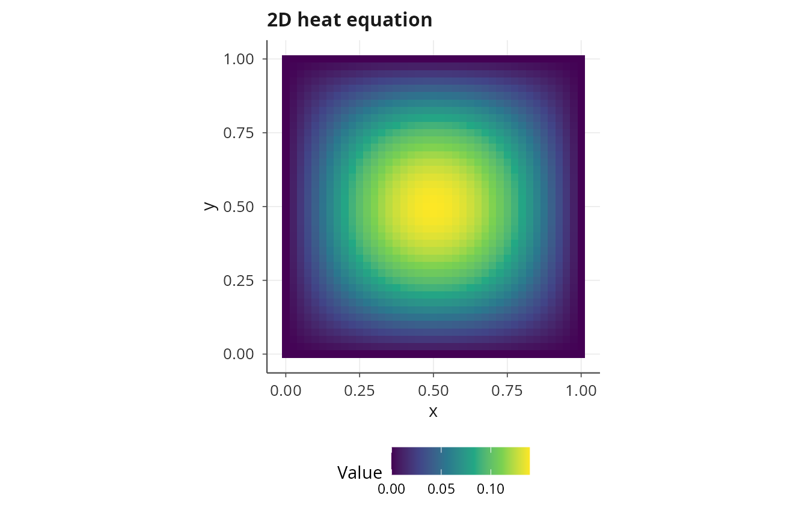

### Reaction-diffusion master equation (RDME)

| Aspect | Description |
|:---|:---|
| Exactness | Exact (Gillespie direct over voxels/nodes) |
| Cost per event | O(total channels) = O(n_voxels \* (n_reactions + 2 \* n_species)) |
| Model type | CTMC + spatial (stoichiometry + propensities + diffusion_rates) |
| Compiled | Yes (C++ via Rcpp) |
| Topology | 1D lattice (solver_rdme) or arbitrary graph (adjacency matrix) |

The RDME discretizes the spatial domain into voxels (1D lattice) or
nodes (arbitrary graph), each containing an independent copy of the
reaction system coupled by nearest-neighbor diffusion. For species \\k\\
in voxel \\i\\ with count \\X\_{k,i}\\, the diffusion hop rate to an
adjacent voxel is \\D_k \cdot X\_{k,i} / \Delta x^2\\. The Gillespie
direct algorithm selects the next event (reaction or hop) across all
voxels, with propensity recomputation restricted to affected voxels and
their neighbors.

janos supports two RDME topologies. On a 1D lattice, the model is
specified with `spatial$domain`, `spatial$n_voxels`, and
`spatial$diffusion_rates`, using
[`solver_rdme()`](https://robustecologies.github.io/janos/reference/solver_rdme.md).
On an arbitrary graph, the model provides a `spatial$adjacency` matrix
together with `spatial$diffusion_rates`, and the same
[`solver_rdme()`](https://robustecologies.github.io/janos/reference/solver_rdme.md)
dispatches to the graph RDME compiler. Utility functions
[`lattice_graph()`](https://robustecologies.github.io/janos/reference/lattice_graph.md),
[`ring_graph()`](https://robustecologies.github.io/janos/reference/ring_graph.md),
[`star_graph()`](https://robustecologies.github.io/janos/reference/star_graph.md),
[`complete_graph()`](https://robustecologies.github.io/janos/reference/complete_graph.md),
and
[`random_graph()`](https://robustecologies.github.io/janos/reference/random_graph.md)
generate common topologies.

#### Example: spatial birth-death on a 1D lattice

``` r

spatial_bd <- system_spec(
    stoichiometry = list(
        birth = c(N = 1L),
        death = c(N = -1L)
    ),
    propensities = list(
        birth ~ lambda,
        death ~ mu * N
    ),
    state_names = "N",
    parms = list(lambda = 50, mu = 0.5, D_N = 0.5),
    init  = c(N = 100L),
    spatial = list(
        domain = c(0, 10), n_voxels = 50,
        diffusion_rates = list(N = ~ D_N),
        bc = list(type = "reflecting")
    )
)

result <- dyn_sim(spatial_bd, t_max = 30, solver = solver_rdme(seed = 42),
                  discard_transient = 0)
#> ⚙ Simulating RDME reaction-diffusion system (RDME)
#>   ¡ Grid: 50 voxels, dx = 0.2000
#>   ¡ Reactions: 2 (birth, death)
#>   ¡ BCs: reflecting, seed = 42
#>   ¡ Duration: 30, discarding 0 transient
#>   ⏱ Elapsed: 0.51 seconds
#> ✔ Simulation complete: 31 time points, 3844540 events
plot(result, title = "Spatial birth-death on a 1D lattice")
```

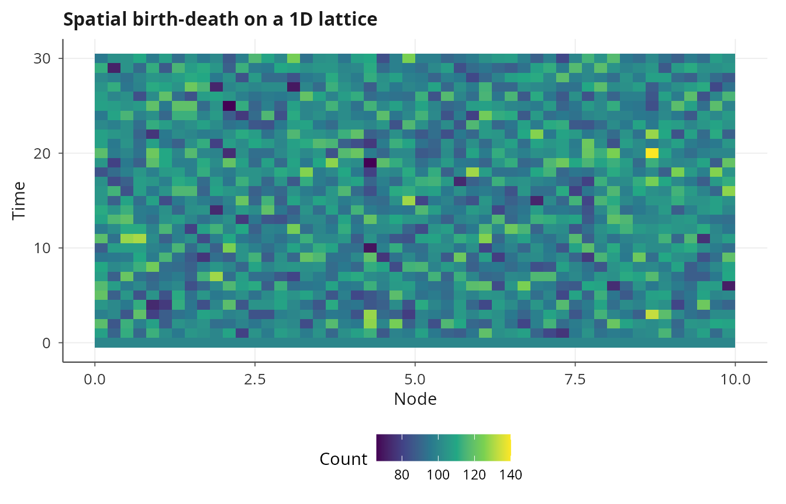

#### Example: stochastic dynamics on a ring graph

``` r

adj <- ring_graph(10)

graph_bd <- system_spec(
    stoichiometry = list(
        birth = c(N = 1L),
        death = c(N = -1L)
    ),
    propensities = list(
        birth ~ lambda,
        death ~ mu * N
    ),
    state_names = "N",
    parms = list(lambda = 50, mu = 0.5, D_N = 0.05),
    init  = c(N = 50L),
    spatial = list(
        adjacency = adj,
        diffusion_rates = list(N = ~ D_N)
    )
)

result <- dyn_sim(graph_bd, t_max = 30, solver = solver_rdme(seed = 42),
                  discard_transient = 0)
#> ⚙ Simulating Graph RDME reaction-diffusion system (graph RDME)
#>   ¡ Nodes: 10, edges: 20
#>   ¡ Reactions: 2 (birth, death)
#>   ¡ Seed: 42
#>   ¡ Duration: 30, discarding 0 transient
#>   ⏱ Elapsed: 0.01 seconds
#> ✔ Simulation complete: 31 time points, 32470 events
plot(result, title = "Stochastic dynamics on a ring graph")
```

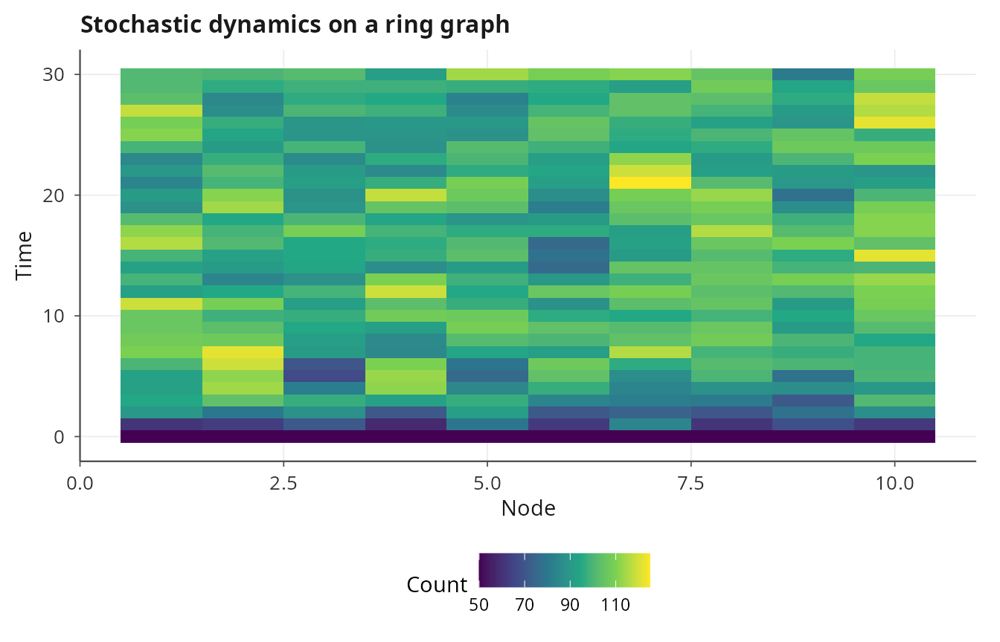

#### References

- Elf, J. & Ehrenberg, M. (2004). Spontaneous separation of bi-stable
  biochemical systems into spatial domains of opposite phases. *Systems
  Biology*, 1(2), 230-236. [DOI:
  10.1049/sb:20045021](https://doi.org/10.1049/sb:20045021)
- Isaacson, S. A. (2009). The reaction-diffusion master equation as an
  asymptotic approximation of diffusion to a small target. *SIAM Journal
  on Applied Mathematics*, 70(1), 77-111. [DOI:
  10.1137/070705039](https://doi.org/10.1137/070705039)

### Choosing a solver

The choice of solver is determined primarily by the mathematical class
of the model. Within each class, the tradeoffs are:

For **deterministic ODEs**,
[`solver_rk45()`](https://robustecologies.github.io/janos/reference/solver_rk45.md)
is the recommended default; it handles varying time scales automatically
and requires no user tuning of the step size. Use
[`solver_rk4()`](https://robustecologies.github.io/janos/reference/solver_rk4.md)
when you need exactly reproducible, fixed-step output (for example, for
spectral analysis where uniform temporal sampling matters). Use
[`solver_rosenbrock()`](https://robustecologies.github.io/janos/reference/solver_rosenbrock.md)
for stiff systems where explicit methods would need impractically small
steps.

For **exact stochastic simulation**,
[`solver_ssa_direct()`](https://robustecologies.github.io/janos/reference/solver_ssa_direct.md)
is simplest and sufficient for systems with fewer than ~20 reactions. As
the number of reaction channels grows,
[`solver_ssa_nrm()`](https://robustecologies.github.io/janos/reference/solver_ssa_nrm.md)
and
[`solver_ssa_mnrm()`](https://robustecologies.github.io/janos/reference/solver_ssa_mnrm.md)
offer \\O(\log M)\\ scaling per event; MNRM is preferred when
propensities span many orders of magnitude.

For **approximate stochastic simulation**,
[`solver_tau_leap()`](https://robustecologies.github.io/janos/reference/solver_tau_leap.md)
provides the best balance of speed and accuracy for large-population
CTMCs. The midpoint variant reduces bias at the cost of one extra
propensity evaluation per step. The hybrid solver is best when the
system contains both fast and slow reactions.

For **SDEs**,
[`solver_euler_maruyama()`](https://robustecologies.github.io/janos/reference/solver_euler_maruyama.md)
is the universal choice that works with all noise types.
[`solver_milstein()`](https://robustecologies.github.io/janos/reference/solver_milstein.md)
doubles the strong convergence rate but is restricted to Gaussian noise.
[`solver_jump_diffusion()`](https://robustecologies.github.io/janos/reference/solver_jump_diffusion.md)
extends the SDE framework with Poisson jump channels.

For **spatial systems**, the choice between PDE (`solver_mol`,
`solver_mol2d`) and stochastic (`solver_rdme`) depends on whether the
continuum or discrete-particle description is appropriate for the
application.
