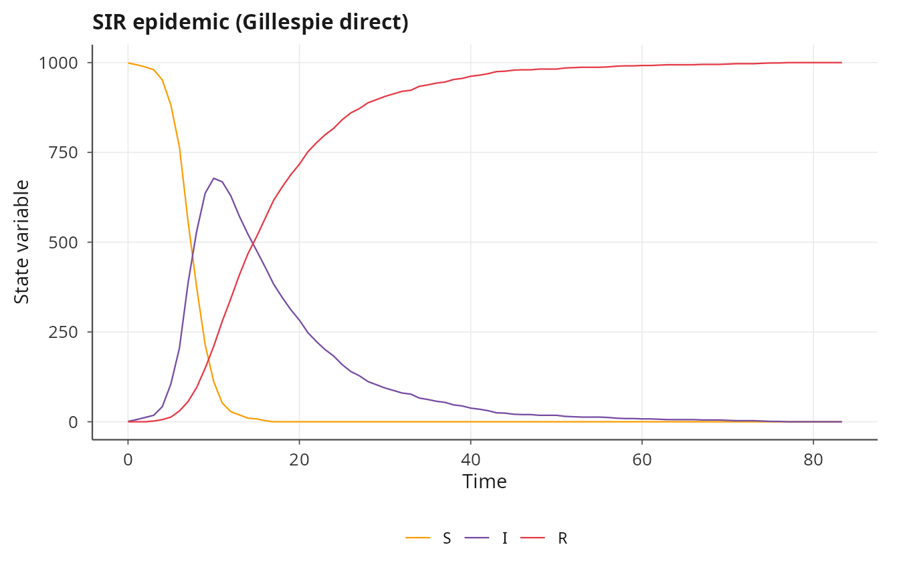
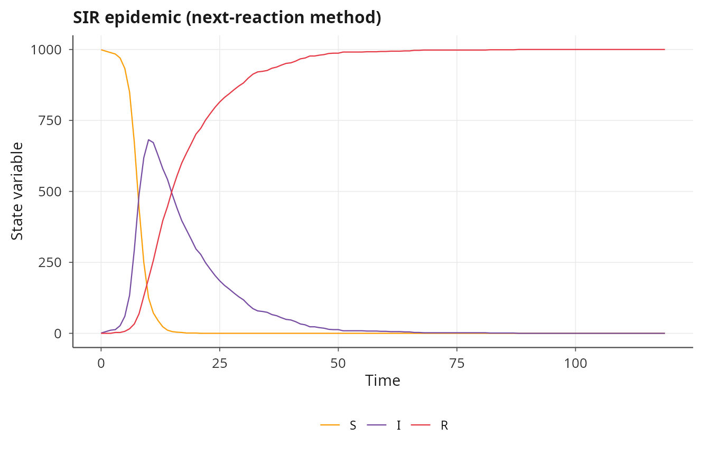
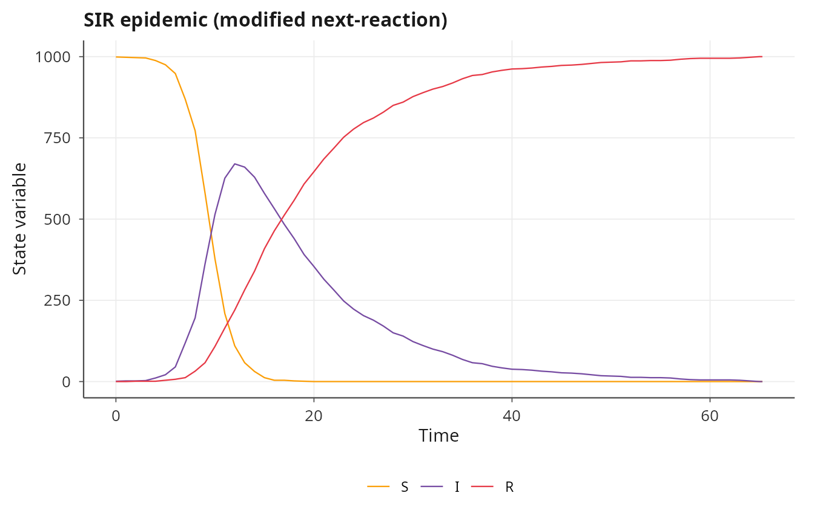
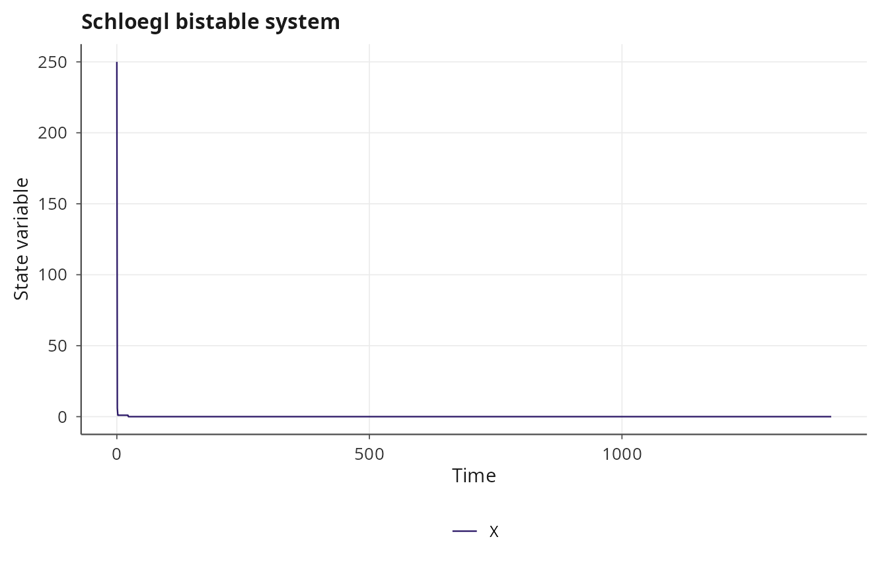
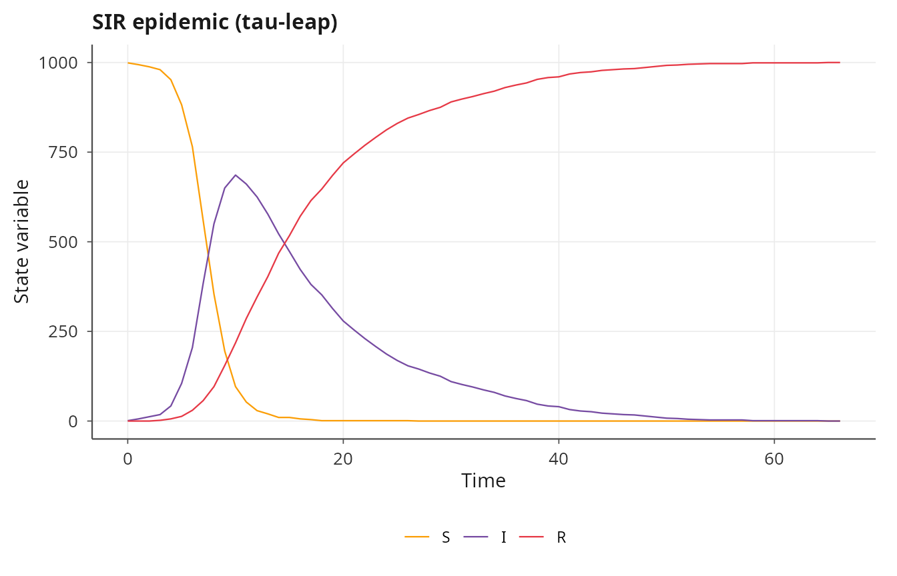
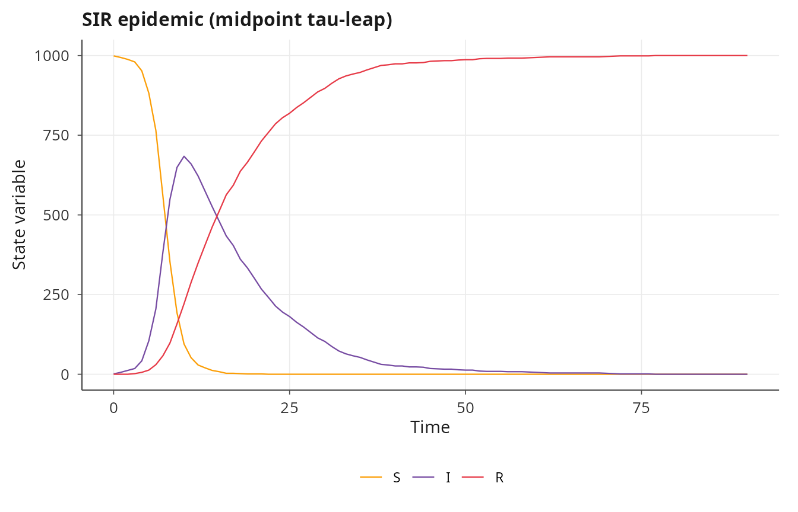
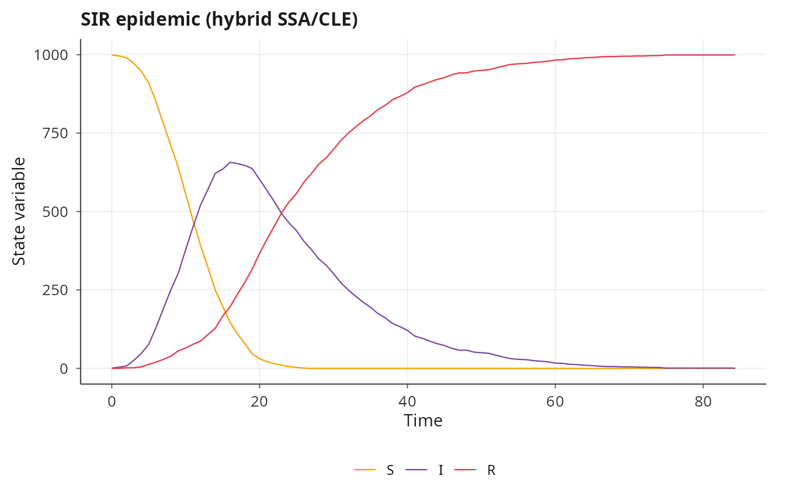
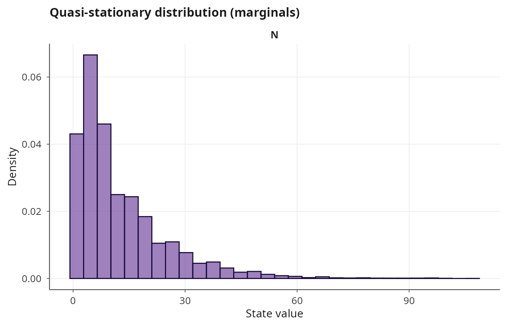
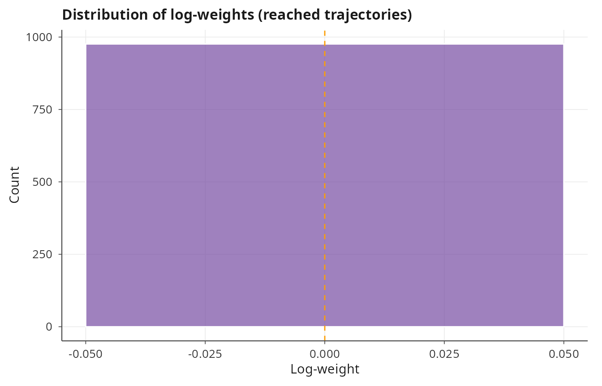
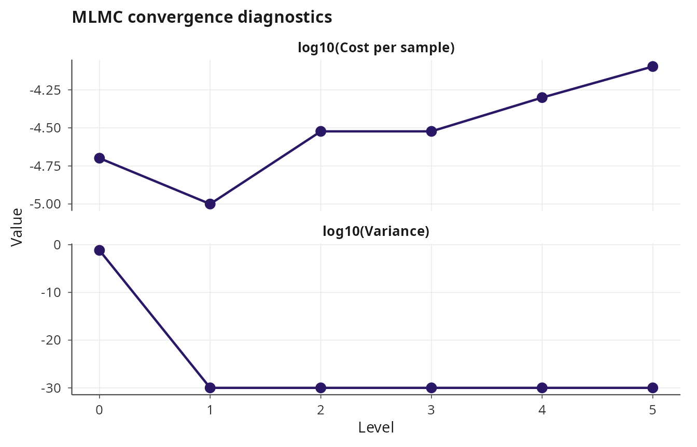

# Stochastic simulation of continuous-time Markov chains

## Continuous-time Markov chains in janos

Many biological and chemical systems are naturally described as
collections of discrete individuals undergoing stochastic reactions. The
continuous-time Markov chain (CTMC) formalism models these systems
through a stoichiometry matrix (how each reaction changes the state) and
propensity functions (the instantaneous rate of each reaction given the
current state). janos compiles propensity formulas to C++ and provides
six solver backends spanning exact and approximate stochastic
simulation, from the Gillespie direct method through tau-leaping and
hybrid SSA/CLE approaches.

``` r
library(janos)
```

## Specifying a CTMC model

A CTMC model is defined by passing `stoichiometry` and `propensities` to
[`model_spec()`](https://robustecologies.github.io/janos/reference/model_spec.md),
with `rhs` left as `NULL`. The stoichiometry is a list of named integer
vectors, one per reaction, specifying the net change in each state
variable. The propensities are formulas whose right-hand sides give the
rate of each reaction as a function of the current state and parameters.

Consider the SIR (susceptible-infected-recovered) epidemic model with
mass-action transmission:

``` r
sir <- model_spec(
    stoichiometry = list(
        infection = c(S = -1L, I = 1L, R = 0L),
        recovery  = c(S = 0L,  I = -1L, R = 1L)
    ),
    propensities = list(
        infection ~ beta * S * I,
        recovery  ~ gamma * I
    ),
    state_names = c("S", "I", "R"),
    parms = list(beta = 0.001, gamma = 0.1),
    init  = c(S = 999L, I = 1L, R = 0L)
)
print(sir)
#> 
#> Dynamical system 
#> ---------------- 
#> 
#> System: CTMC (2 reactions)
#> Reactions: infection, recovery
#> States (3): S, I, R
#> Parameters (2): beta, gamma
#> Default IC: S = 999, I =   1, R =   0
#> Backend: compiled (SSA propensities)
```

The integer suffix on initial conditions (`999L`, `1L`, `0L`) signals
that the state is discrete, though janos handles the casting internally.
Propensity formulas follow the same syntax as ODE formulas: state
variable and parameter names are resolved automatically, and the
expressions are compiled to C++ on first use.

## Gillespie direct method

The
[`solver_ssa_direct()`](https://robustecologies.github.io/janos/reference/solver_ssa_direct.md)
backend implements Gillespie’s direct stochastic simulation algorithm
[\[1\]](#ref1), which is exact in the sense that it samples the correct
probability distribution over reaction times and channels. At each step
the algorithm computes all propensities, draws an exponential waiting
time from the total propensity, and selects a reaction with probability
proportional to its individual propensity.

``` r
result_direct <- dyn_sim(sir, t_max = 200, solver = solver_ssa_direct(seed = 42),
                         discard_transient = 0)
#> ⚙ Simulating CTMC reaction network (Gillespie direct)
#>   ¡ Reactions: 2 (infection, recovery)
#>   ¡ Duration: 200, seed = 42
#>   ⏱ Elapsed: 0.01 seconds
#> ✔ Simulation complete: 85 time points, 1999 reactions fired
print(result_direct)
#> 
#> Dynamical system simulation 
#> --------------------------- 
#> 
#> System type: autonomous
#> 
#> Solver: SSA_DIRECT (1,999 reactions fired)
#>   infection:      999
#>   recovery:       1,000
#> Simulation: t_max = 200.0, discarding 0.0 transient
#> Attractor points: 85
#> 
#> State variables on attractor (mean ± sd):
#>   S:           93.4353 ± 266.5167
#>   I:           116.0000 ± 183.4872
#>   R:           790.5647 ± 327.4102
summary(result_direct)
#> 
#> Summary: dynamical system simulation
#> ================================================== 
#> 
#> Solver:  SSA_DIRECT
#> 
#> State variable statistics on attractor:
#>  variable     mean       sd min  max
#>         S  93.4353 266.5167   0  999
#>         I 116.0000 183.4872   0  678
#>         R 790.5647 327.4102   0 1000
#> 
#> Correlation matrix:
#>        S      I      R
#> S  1.000  0.026 -0.828
#> I  0.026  1.000 -0.581
#> R -0.828 -0.581  1.000
#> 
#> Dominant periodicity (ACF-based):
#>   S:         not detected
#>   I:         not detected
#>   R:         not detected
plot(result_direct, title = "SIR epidemic (Gillespie direct)")
```



The `seed` argument ensures reproducibility. The output metadata
includes the total number of reactions fired and per-reaction counts,
which is useful for verifying that the simulation proceeded as expected.

## Next-reaction method

The next-reaction method (NRM) of Gibson and Bruck [\[2\]](#ref2)
maintains a priority queue of putative reaction times and uses a
dependency graph to update only those propensities affected by the most
recent reaction. This reduces the per-step cost from \\O(M)\\ (where
\\M\\ is the number of reactions) to \\O(\log M)\\ for the priority
queue operations plus \\O(d)\\ for the dependency updates, where \\d\\
is the average number of reactions affected.

``` r
result_nrm <- dyn_sim(sir, t_max = 200, solver = solver_ssa_nrm(seed = 42),
                       discard_transient = 0)
#> ⚙ Simulating CTMC reaction network (Gibson-Bruck NRM)
#>   ¡ Reactions: 2 (infection, recovery)
#>   ¡ Duration: 200, seed = 42
#>   ⏱ Elapsed: 0.01 seconds
#> ✔ Simulation complete: 120 time points, 1999 reactions fired
plot(result_nrm, title = "SIR epidemic (next-reaction method)")
```



For the SIR model with only two reactions, the NRM offers no advantage
over the direct method. The gains become significant for models with
hundreds of reactions where the dependency graph is sparse.

## Modified next-reaction method

Anderson’s modified next-reaction method (MNRM) [\[3\]](#ref3)
reformulates the NRM using internal times and unit-rate Poisson
processes, avoiding the need to recalculate putative times after each
reaction. Instead, it maintains integrated propensities \\P_k(t)\\ for
each reaction \\k\\ and advances time until the next internal clock
fires. This yields the same asymptotic complexity as the NRM but can be
more numerically stable for models with widely varying propensity
magnitudes.

``` r
result_mnrm <- dyn_sim(sir, t_max = 200, solver = solver_ssa_mnrm(seed = 42),
                        discard_transient = 0)
#> ⚙ Simulating CTMC reaction network (Anderson MNRM)
#>   ¡ Reactions: 2 (infection, recovery)
#>   ¡ Duration: 200, seed = 42
#>   ⏱ Elapsed: 0.01 seconds
#> ✔ Simulation complete: 67 time points, 1999 reactions fired
plot(result_mnrm, title = "SIR epidemic (modified next-reaction)")
```



All three exact SSA variants produce trajectories drawn from the same
probability distribution; they differ only in computational efficiency
and numerical properties.

## A richer example: the Schloegl model

The Schloegl model is a classical bistable chemical system that exhibits
a first-order phase transition. It consists of four reactions involving
a single species \\X\\ with two fixed reservoir species held at constant
concentration:

``` r
schloegl <- model_spec(
    stoichiometry = list(
        r1 = c(X = 1L),
        r2 = c(X = -1L),
        r3 = c(X = 1L),
        r4 = c(X = -1L)
    ),
    propensities = list(
        r1 ~ c1 * X * (X - 1) / 2,
        r2 ~ c2 * X * (X - 1) * (X - 2) / 6,
        r3 ~ c3,
        r4 ~ c4 * X
    ),
    state_names = "X",
    parms = list(c1 = 3e-7, c2 = 1e-4, c3 = 1e-3, c4 = 3.5),
    init  = c(X = 250L)
)

result_sch <- dyn_sim(schloegl, t_max = 50, solver = solver_ssa_direct(seed = 7),
                      discard_transient = 0)
#> ⚙ Simulating CTMC reaction network (Gillespie direct)
#>   ¡ Reactions: 4 (r1, r2, r3, r4)
#>   ¡ Duration: 50, seed = 7
#>   ⏱ Elapsed: 0.01 seconds
#> ✔ Simulation complete: 25 time points, 252 reactions fired
plot(result_sch, title = "Schloegl bistable system")
```



## Tau-leaping

When the system contains many molecules and reactions fire at high
rates, exact simulation becomes computationally expensive because each
reaction is simulated individually. Tau-leaping [\[4\]](#ref4)
approximates the process by advancing time by a step \\\tau\\ and
drawing the number of firings of each reaction from a Poisson
distribution with mean \\a_k(x) \tau\\, where \\a_k\\ is the propensity.
The step size is selected adaptively so that the relative change in each
propensity remains below a tolerance \\\epsilon\\. This converts the
simulation from event-driven to time-stepped, trading exactness for
speed.

``` r
result_tau <- dyn_sim(sir, t_max = 200,
                      solver = solver_tau_leap(seed = 42),
                      discard_transient = 0)
#> ⚙ Simulating CTMC reaction network (Adaptive tau-leap (CGP 2006))
#>   ¡ Reactions: 2 (infection, recovery)
#>   ¡ Duration: 200, seed = 42
#>   ⏱ Elapsed: 0.01 seconds
#> ✔ Simulation complete: 68 time points, 1999 reactions fired, 61 leap steps, 1306 SSA steps
plot(result_tau, title = "SIR epidemic (tau-leap)")
```



### Adaptive step rejection

A known problem with tau-leaping is that large steps can drive species
counts negative. janos implements adaptive step rejection: when a
proposed step produces negative states, it halves \\\tau\\ and retries,
falling back to exact SSA after a configurable number of rejections
(`max_rejections`). This ensures non-negative states without manual
tuning.

``` r
result_tau_adapt <- dyn_sim(
    sir, t_max = 200,
    solver = solver_tau_leap(max_rejections = 10, seed = 42),
    discard_transient = 0
)
#> ⚙ Simulating CTMC reaction network (Adaptive tau-leap (CGP 2006))
#>   ¡ Reactions: 2 (infection, recovery)
#>   ¡ Duration: 200, seed = 42
#>   ⏱ Elapsed: 0.01 seconds
#> ✔ Simulation complete: 68 time points, 1999 reactions fired, 61 leap steps, 1306 SSA steps
summary(result_tau_adapt)
#> 
#> Summary: dynamical system simulation
#> ================================================== 
#> 
#> Solver:  TAU_LEAP
#> 
#> State variable statistics on attractor:
#>  variable     mean       sd min  max
#>         S 116.2500 293.2684   0  999
#>         I 145.5294 197.3536   0  686
#>         R 738.2206 347.4544   0 1000
#> 
#> Correlation matrix:
#>        S      I      R
#> S  1.000 -0.037 -0.823
#> I -0.037  1.000 -0.537
#> R -0.823 -0.537  1.000
#> 
#> Dominant periodicity (ACF-based):
#>   S:         not detected
#>   I:         not detected
#>   R:         not detected
```

The summary reports the number of rejected steps, which is diagnostic of
whether \\\tau\\ is too aggressive for the current state.

### Midpoint tau-leaping

The midpoint variant [\[5\]](#ref5) evaluates propensities at the
midpoint of each step rather than the beginning, which improves the
weak-order accuracy from \\O(\tau)\\ to \\O(\tau^2)\\ at negligible
extra cost.

``` r
result_mid <- dyn_sim(sir, t_max = 200,
                      solver = solver_tau_leap_midpoint(seed = 42),
                      discard_transient = 0)
#> ⚙ Simulating CTMC reaction network (Midpoint tau-leap)
#>   ¡ Reactions: 2 (infection, recovery)
#>   ¡ Duration: 200, seed = 42
#>   ⏱ Elapsed: 0.01 seconds
#> ✔ Simulation complete: 92 time points, 1999 reactions fired, 59 leap steps, 1314 SSA steps
plot(result_mid, title = "SIR epidemic (midpoint tau-leap)")
```



## Hybrid SSA/CLE

For multi-scale systems where some species have large populations
(suitable for continuous approximation) and others have small
populations (requiring discrete treatment), the hybrid solver combines
exact SSA for rare reactions with the Chemical Langevin Equation (CLE)
for frequent reactions. In janos, the
[`solver_hybrid()`](https://robustecologies.github.io/janos/reference/solver_hybrid.md)
backend uses a double-precision state vector and approximates the system
as a CLE, providing a practical middle ground between exact SSA and
purely continuous approximation.

``` r
result_hybrid <- dyn_sim(sir, t_max = 200,
                         solver = solver_hybrid(dt_cle = 0.01, seed = 42),
                         discard_transient = 0)
#> ⚙ Simulating CTMC reaction network (Hybrid SSA/CLE)
#>   ¡ Reactions: 2 (infection, recovery)
#>   ¡ Duration: 200, seed = 42
#>   ⏱ Elapsed: 0.01 seconds
#> ✔ Simulation complete: 86 time points, 1999 reactions fired, 1999 SSA steps, 10433 CLE steps
plot(result_hybrid, title = "SIR epidemic (hybrid SSA/CLE)")
```



## Quasi-stationary distributions

Many CTMC models have absorbing states, such as extinction (all
individuals of a species reach zero). The quasi-stationary distribution
(QSD) characterizes the long-run behavior of the system *conditioned on
non-absorption*. The
[`estimate_qsd()`](https://robustecologies.github.io/janos/reference/estimate_qsd.md)
function implements a Fleming-Viot particle method [\[6\]](#ref6): a
pool of particles are simulated forward; whenever a particle reaches the
absorbing state it is replaced by a copy of a randomly chosen surviving
particle. After a burn-in period, the empirical distribution of the
surviving particles approximates the QSD.

``` r
bd <- model_spec(
    stoichiometry = list(
        birth = c(N = 1L),
        death = c(N = -1L)
    ),
    propensities = list(
        birth ~ lambda * N,
        death ~ mu * N
    ),
    state_names = "N",
    parms = list(lambda = 1.0, mu = 1.1),
    init  = c(N = 50L)
)

qsd <- estimate_qsd(bd, t_max = 100, n_particles = 500,
                     absorbing = ~ N == 0)
#> ⚙ Estimating QSD via Fleming-Viot (500 particles)
#>   ¡ t_max = 100, burn_in = 50%
#> ✔ QSD estimated: 25500 samples, 3796 replacements
print(qsd)
#> 
#> Quasi-stationary distribution estimate
#> ------------------------------------------ 
#> 
#> Fleming-Viot particles: 500
#> Absorbing condition: N == 0
#> Samples: 25500
#> Replacements: 3796
#> Absorption rate: 0.1518 per unit time
#> 
#> Marginal means on QSD:
#>   N:           12.73
summary(qsd)
#> 
#> Summary: quasi-stationary distribution estimate
#> ================================================== 
#> 
#> Algorithm: Fleming-Viot, 500 particles
#> Absorbing condition: N == 0
#> Absorption rate: 0.151840 per unit time
#> 
#> Marginal QSD statistics:
#>  variable    mean     sd median
#>         N 12.7269 12.496      9
plot(qsd)
```



## Rare event estimation

When the event of interest (e.g., extinction of a species) is rare under
normal simulation conditions, naive Monte Carlo is inefficient because
most replicates never observe the event. The
[`estimate_extinction()`](https://robustecologies.github.io/janos/reference/estimate_extinction.md)
function uses importance sampling to bias the simulation toward the
event of interest and then corrects the estimator with appropriate
weights, yielding reliable probability estimates with far fewer
replicates than brute-force simulation.

``` r
rare <- estimate_extinction(bd, target = ~ N == 0, n_runs = 1000,
                            t_max = 50)
#> ⚙ Estimating rare event probability (1000 runs)
#>   ¡ Target: N == 0
#>   Run 100 / 1000
#>   Run 200 / 1000
#>   Run 300 / 1000
#>   Run 400 / 1000
#>   Run 500 / 1000
#>   Run 600 / 1000
#>   Run 700 / 1000
#>   Run 800 / 1000
#>   Run 900 / 1000
#>   Run 1000 / 1000
#> ✔ Probability estimate: 0.976000 (SE = 0.004842)
#>   ¡ Reached target: 976 / 1000 (ESS = 976.0)
print(rare)
#> 
#> Rare event probability estimate
#> ----------------------------------- 
#> 
#> Target: N == 0
#> Method: weighted SSA (importance sampling)
#> Runs: 1000
#> Reached target: 976 / 1000
#> 
#> P(target) = 0.976000
#> SE        = 0.004842
#> 95% CI    = [0.966509, 0.985491]
#> ESS       = 976.0
summary(rare)
#> 
#> Summary: rare event probability estimate
#> ================================================== 
#> 
#> Target: N == 0
#> Probability: 0.976000 (SE = 0.004842)
#> 95% CI: [0.966509, 0.985491]
#> Reached: 976 / 1000 runs
#> ESS: 976.0 (efficiency = 97.6%)
#> 
#> Log-weight statistics (reached trajectories):
#>   Mean: 0.0000
#>   SD:   0.0000
#>   Range: [0.0000, 0.0000]
#> 
#> Bias factors:
#>   birth:          1.000
#>   death:          1.000
plot(rare)
```



## Multi-level Monte Carlo

Estimating expectations of the form \\E\[Q(X(T))\]\\ for a CTMC is
expensive with exact SSA and biased with tau-leaping. Multi-level Monte
Carlo (MLMC) [\[7\]](#ref7) resolves this tradeoff by combining
estimates from multiple levels of tau-leaping resolution, using coarse
levels to reduce variance cheaply and fine levels to reduce bias. The
Anderson-Higham coupling [\[8\]](#ref8) ensures that the coarse and fine
tau-leap paths share the same Poisson events, which minimizes the
variance of the level correction.

``` r
mlmc <- mlmc_estimate(
    model   = sir,
    t_max   = 100,
    quantity = function(x) x["I"],
    tol     = 1.0,
    tau_base = 1.0,
    n_warmup = 100,
    max_level = 5
)
#> ⚙ MLMC estimation (Anderson-Higham 2012)
#>   ¡ max_level = 5, R = 2, tau_base = 1.0000
#>   ¡ tol = 1, n_warmup = 100
#>   ⏱ Level 0: tau = 1.000000 (100 warm-up samples)
#>   ⏱ Level 1: tau = 0.500000 (100 warm-up samples)
#>   ⏱ Level 2: tau = 0.250000 (100 warm-up samples)
#>   ⏱ Level 3: tau = 0.125000 (100 warm-up samples)
#>   ⏱ Level 4: tau = 0.062500 (100 warm-up samples)
#>   ⏱ Level 5: tau = 0.031250 (100 warm-up samples)
#> ✔ MLMC estimate: 0.0700 (95%% CI: [0.0197, 0.1203])
#>   Total samples: 600 across 6 levels
print(mlmc)
#> 
#> Multi-level Monte Carlo estimate
#> -------------------------------------- 
#> 
#> Estimate: 0.0700
#> 95% CI:   [0.0197, 0.1203]
#> RMSE:     0.0256
#> 
#> Levels: 6
#> Refinement: R = 2
#> Total samples: 600
#> Target tolerance: 1
summary(mlmc)
#> 
#> Summary: multi-level Monte Carlo estimate
#> ================================================ 
#> 
#> Algorithm: Anderson-Higham MLMC
#> Target RMSE: 1
#> Achieved RMSE: 0.0256
#> Estimate: 0.070000
#> 95% CI: [0.019739, 0.120261]
#> 
#> Per-level statistics:
#>   level    tau n_samples n_optimal mean_diff variance     cost
#>  0.0000 1.0000  100.0000  100.0000    0.0700   0.0658 2.00e-05
#>  1.0000 0.5000  100.0000  100.0000    0.0000   0.0000 1.00e-05
#>  2.0000 0.2500  100.0000  100.0000    0.0000   0.0000 3.00e-05
#>  3.0000 0.1250  100.0000  100.0000    0.0000   0.0000 3.00e-05
#>  4.0000 0.0625  100.0000  100.0000    0.0000   0.0000 5.00e-05
#>  5.0000 0.0312  100.0000  100.0000    0.0000   0.0000 8.00e-05
#> 
#> Total samples: 600
#> Refinement factor R = 2
#> Base tau = 1.0000
plot(mlmc)
```



The `quantity` argument is a function mapping the terminal state vector
to a scalar. The `tol` parameter controls the target root-mean-square
error, and the MLMC algorithm automatically determines the optimal
allocation of samples across levels to achieve this tolerance at minimum
computational cost.

## References

**\[1\]** Gillespie, D. T. (1977). Exact stochastic simulation of
coupled chemical reactions. *Journal of Physical Chemistry*, 81(25),
2340-2361.
[doi:10.1021/j100540a008](https://doi.org/10.1021/j100540a008)

**\[2\]** Gibson, M. A., & Bruck, J. (2000). Efficient exact stochastic
simulation of chemical systems with many species and many channels.
*Journal of Physical Chemistry A*, 104(9), 1876-1889.
[doi:10.1021/jp993732q](https://doi.org/10.1021/jp993732q)

**\[3\]** Anderson, D. F. (2007). A modified next reaction method for
simulating chemical systems with time dependent propensities and delays.
*Journal of Chemical Physics*, 127(21), 214107.
[doi:10.1063/1.2799998](https://doi.org/10.1063/1.2799998)

**\[4\]** Gillespie, D. T. (2001). Approximate accelerated stochastic
simulation of chemically reacting systems. *Journal of Chemical
Physics*, 115(4), 1716-1733.
[doi:10.1063/1.1378322](https://doi.org/10.1063/1.1378322)

**\[5\]** Gillespie, D. T. (2003). Improved leap-size selection for
accelerated stochastic simulation. *Journal of Chemical Physics*,
119(16), 8229-8234.
[doi:10.1063/1.1615760](https://doi.org/10.1063/1.1615760)

**\[6\]** Villemonais, D. (2011). Interacting particle systems and
Yaglom limit approximation of diffusions with unbounded drift.
*Electronic Journal of Probability*, 16, 1663-1692.
[doi:10.1214/EJP.v16-925](https://doi.org/10.1214/EJP.v16-925)

**\[7\]** Giles, M. B. (2008). Multilevel Monte Carlo path simulation.
*Operations Research*, 56(3), 607-617.
[doi:10.1287/opre.1070.0496](https://doi.org/10.1287/opre.1070.0496)

**\[8\]** Anderson, D. F., & Higham, D. J. (2012). Multilevel Monte
Carlo for continuous time Markov chains, with applications in
biochemical kinetics. *Multiscale Modeling and Simulation*, 10(1),
146-179. [doi:10.1137/110840546](https://doi.org/10.1137/110840546)
