# janos [](https://robustecologies.github.io/janos)

[](https://github.com/robustecologies/janos/actions)
[](https://github.com/robustecologies/janos)
[](https://www.r-project.org/)
[](https://robustecologies.github.io/janos/reference/index.html)
[](https://robustecologies.github.io/janos/reference/index.html)

[](https://cran.r-project.org/package=Rcpp)
[](https://cran.r-project.org/package=RcppArmadillo)
[](https://www.openmp.org/)

[](https://www.gnu.org/licenses/gpl-3.0)

  

## A general-purpose R framework for specifying, simulating, and analysing dynamical systems using C++ and OpenMP

janos is a general-purpose R framework for specifying, simulating, and
analysing dynamical systems. It provides a unified interface from
deterministic ODEs through stochastic differential equations,
continuous-time Markov chains, partial differential equations, delay
differential equations, discrete maps, jump-diffusion processes, and
piecewise deterministic Markov processes, all driven by a formula-to-C++
compilation engine that delivers compiled performance without requiring
users to write C++ code.

The design separates *what* a system does (the model specification) from
*how* it is solved (the solver backend). A single
[`system_spec()`](https://robustecologies.github.io/janos/reference/system_spec.md)
object can be passed to any compatible solver, and the package handles
compilation, caching, and dispatch transparently. On top of the
simulation layer, janos ships an analysis stack covering phase and
qualitative portraits, Fokker-Planck densities and quasi-potentials,
bifurcation continuation, adjoint sensitivity, multi-level Monte Carlo,
rare-event probabilities, a family-aware Lyapunov advisor that
dispatches over eight construction algorithms, and a chaos-diagnostics
suite (Lyapunov spectrum, correlation dimension, Poincare sections, 0-1
test, bifurcation diagrams). The stiff-ODE stack covers five families
(Rosenbrock Rodas3, BDF orders 1-5, ESDIRK TR-BDF2, additive IMEX-RK and
Radau IIA), with companion utilities for slow-fast partition discovery,
stiffness diagnostics, geometric singular perturbation reduction and
matrix-exponential evaluation.

  

## What is inside

| Layer | Components | Count |
|----|----|----|
| Solvers (continuous, discrete, spatial, stochastic) | RK4, Dormand-Prince RK4(5), Rosenbrock Rodas3, BDF (orders 1-5), ESDIRK TR-BDF2, IMEX-RK ARS(2,3,2), Radau IIA (s=2, order 3), maps, DDE, MOL 1D, MOL 2D, Euler-Maruyama, Milstein, jump-diffusion, tau-leap (adaptive and midpoint), hybrid SSA/CLE, SSA direct, SSA NRM, SSA MNRM, PDMP, RDME | 22 |
| Noise processes | correlated Gaussian (Cholesky), Levy alpha-stable (CMS), fractional Brownian (circulant embedding), colored 1/f^beta (FFT) | 4 |
| Qualitative portraits | `phase_portrait`, `map_portrait`, `sde_portrait`, `dde_portrait`, `pdmp_portrait` | 5 |
| Slow-fast diagnostics and reduction | `slow_fast_partition`, `stiffness_ratio`, `gsp_reduce`, `expm_pade`, `expm_krylov` | 5 |
| Lyapunov construction algorithms | quadratic, Goh, MacArthur, Gilpin, SOS, RBF, Massera, CPA | 8 |
| Lyapunov families (advisor dispatch) | ODE, map, SDE, DDE, PDMP, CTMC (Foster), reaction-diffusion PDE | 7 |
| Fokker-Planck and rare-event tools | `fp_stationary`, `fp_stationary_2d`, `fp_potential`, `fp_kramers_rate`, `estimate_qsd`, `estimate_extinction`, `density_landscape_2d` | 7 |
| Chaos diagnostics | `lyapunov_spectrum`, `correlation_dimension`, `poincare_section`, `zero_one_test`, `bifurcation_diagram` | 5 |
| Other analysis | `continuation`, `bifurcation_sweep`, `adjoint_sensitivity`, `spectral_analysis`, `mlmc_estimate`, `ensemble_sim`, `observe` | 7 |
| Exported S3 classes (all with `print`, `summary`, `plot`) | 34 | 34 |

All 74 user-facing functions are formula-based: the C++ back-end is
never exposed. Compilation artifacts are cached under
`tools::R_user_dir("janos", "cache")` and the compile pipeline
self-repairs on cache corruption, so the second call to any already-seen
system is instantaneous.

  

## Installation

``` r

# install.packages("devtools")
devtools::install_github("robustecologies/janos")
```

janos requires a C++ compiler (GCC, Clang, or MSVC) because it compiles
model formulas to native code at runtime via Rcpp. On most systems this
is already available; if not, install
[Rtools](https://cran.r-project.org/bin/windows/Rtools/) on Windows or
Xcode Command Line Tools on macOS.

  

## Guided tour

The following five examples span the main modelling regimes covered by
janos: deterministic multi-species ecology with chaotic dynamics,
algebraic stability certification for a competitive system, stochastic
chemistry with ensemble variability, spatio-temporal reaction-diffusion,
and stochastic reaction-diffusion on a network. Each subsection
concludes with a pointer to the vignette that develops the topic in
full.

``` r

library(janos)
```

  

### 1. Chaos in a three-species food chain

The Hastings-Powell model [\[1\]](#ref1) couples two Holling type-II
functional responses along a tri-trophic chain and exhibits a *teacup*
chaotic attractor for standard parameter values. With \\x\\ the
(logistically growing) resource, \\y\\ the intermediate consumer, and
\\z\\ the top predator, the non-dimensional equations read

\\\begin{aligned} \frac{d x}{d t} \\&=\\ x\\(1-x) \\-\\
\frac{a\_{1}\\x\\y}{1 + b\_{1}\\x} & \text{(resource)} \\\[2pt\] \frac{d
y}{d t} \\&=\\ \frac{a\_{1}\\x\\y}{1 + b\_{1}\\x} \\-\\
\frac{a\_{2}\\y\\z}{1 + b\_{2}\\y} \\-\\ d\_{1}\\y & \text{(consumer)}
\\\[2pt\] \frac{d z}{d t} \\&=\\ \frac{a\_{2}\\y\\z}{1 + b\_{2}\\y}
\\-\\ d\_{2}\\z & \text{(predator)} \end{aligned}\\

``` r

hp <- system_spec(
    rhs = list(
        x ~ x * (1 - x) - (a1 * x * y) / (1 + b1 * x),
        y ~ (a1 * x * y) / (1 + b1 * x) -
            (a2 * y * z) / (1 + b2 * y) - d1 * y,
        z ~ (a2 * y * z) / (1 + b2 * y) - d2 * z
    ),
    state_names = c("x", "y", "z"),
    parms = list(a1 = 5, b1 = 3, a2 = 0.1, b2 = 2,
                 d1 = 0.4, d2 = 0.01),
    init  = c(x = 0.7, y = 0.2, z = 9.0)
)

hp_run <- dyn_sim(hp, t_max = 2000, solver = solver_rk4(),
                  discard_transient = 600, verbose = FALSE)
plot(hp_run, title = "Hastings-Powell tri-trophic food chain", epsilon = 0.0001)
```

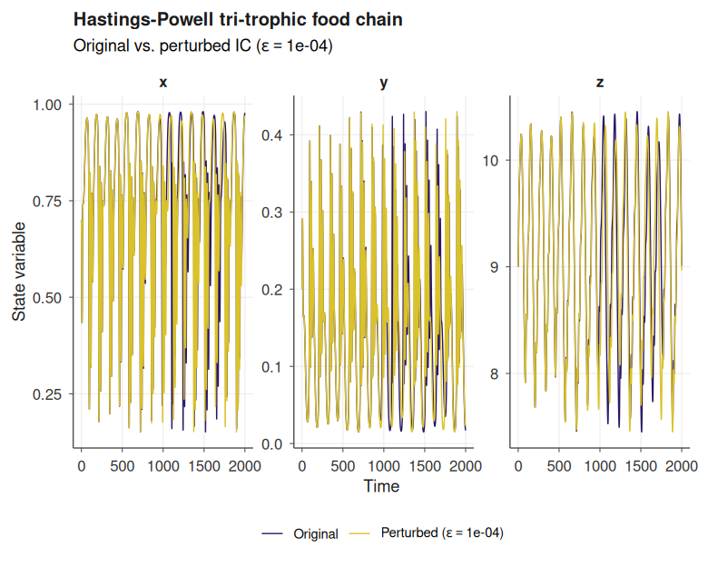

``` r

plot(hp_run, type = "phase", title = "Teacup attractor projection", epsilon = 0.0001)
```

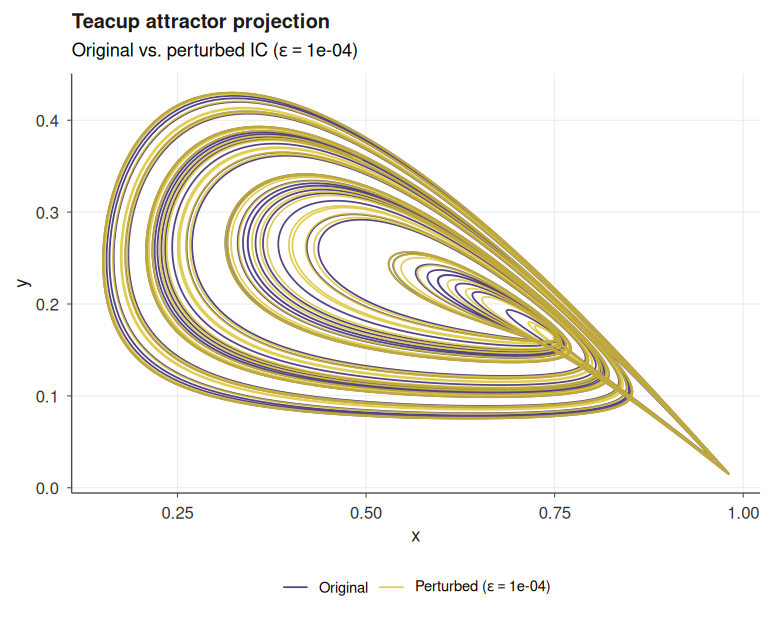

The first panel overlays the reference trajectory and a companion
trajectory launched from a perturbed initial condition (controlled by
the argument `epsilon`); the rapid divergence of the two curves is a
direct visualisation of sensitive dependence on initial conditions, a
defining signature of deterministic chaos. The second panel projects the
three-dimensional attractor onto a pair of state variables; a rotatable
3D rendering is available through `type = "attractor"`, backed by
[plotly](https://plotly.com/r/), and a full phase-space decomposition
(vector field, nullclines, equilibria with stability classification,
streamlines) is produced by
[`phase_portrait()`](https://robustecologies.github.io/janos/reference/phase_portrait.md).
See
[`vignette("introduction")`](https://robustecologies.github.io/janos/articles/introduction.md)
and
[`vignette("qualitative-analysis")`](https://robustecologies.github.io/janos/articles/qualitative-analysis.md)
for the complete workflow.

A quantitative fingerprint of the attractor is produced by the
chaos-analysis stack shipped with the package.
[`lyapunov_spectrum()`](https://robustecologies.github.io/janos/reference/lyapunov_spectrum.md)
computes the full Lyapunov exponents via QR renormalisation of the
variational flow and reports the Kaplan-Yorke dimension;
[`correlation_dimension()`](https://robustecologies.github.io/janos/reference/correlation_dimension.md)
estimates the Grassberger-Procaccia fractal dimension from pair
statistics of attractor points;
[`zero_one_test()`](https://robustecologies.github.io/janos/reference/zero_one_test.md)
applies the Gottwald-Melbourne translation-variable criterion and
returns a scalar verdict close to one for chaos and zero for regular
dynamics;
[`bifurcation_diagram()`](https://robustecologies.github.io/janos/reference/bifurcation_diagram.md)
sweeps one parameter across a range, simulates the model at each value,
and retains post-transient samples of the chosen observable, so that
period-doubling cascades, tangent and Hopf bifurcations, and periodic
windows embedded in chaotic regions emerge as structural features of the
resulting cloud of points. When `compute_lyapunov = TRUE`, the largest
Lyapunov exponent is evaluated at every parameter value and rendered in
a companion panel, so the sign change marking the onset of chaos can be
read off the same figure. The scan dispatches across all available cores
through a cross-platform parallel backend (`mclapply` on Unix, PSOCK
clusters on Windows), with Esc returning a partial diagram rather than
discarding the run.

``` r

lsp <- lyapunov_spectrum(hp, t_max = 80, dt = 0.01,
                          renorm_interval = 1, discard_transient = 10,
                          verbose = FALSE)
print(lsp)
#> 
#> Lyapunov spectrum (ode)
#> --------------------------
#>   lambda_1 =    0.02544
#>   lambda_2 =   -0.01183
#>   lambda_3 =   -0.65352
#>   sum      =   -0.63991
#>   D_KY     =    2.02083
#>   Verdict: chaotic (1 positive exponent)
plot(lsp, type = "spectrum")
```

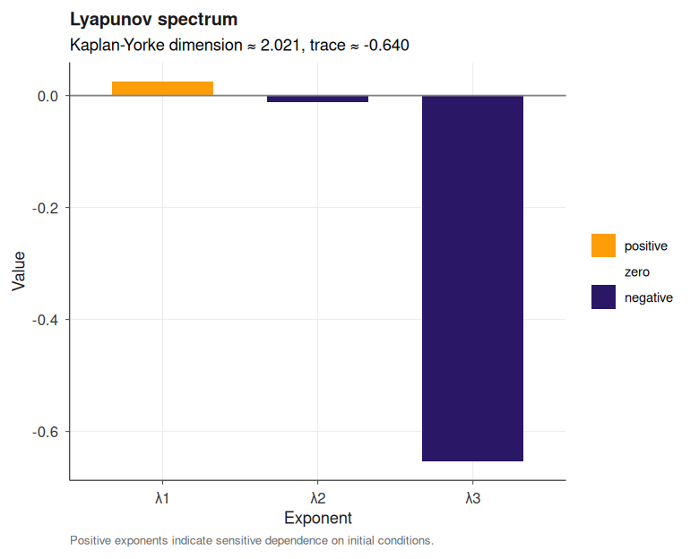

``` r


cd <- correlation_dimension(hp_run, n_points = 1500)
print(cd)
#> 
#> Correlation dimension
#> --------------------
#>   D_2       = 1.6010
#>   points    = 1500
#>   Theiler   = 10
#>   fit eps   = [0.1175, 0.4399]
plot(cd)
```

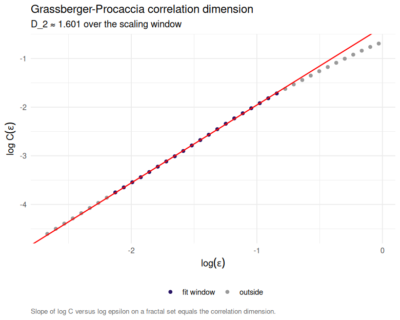

``` r


z01 <- zero_one_test(hp_run, var = "x")
print(z01)
#> 
#> 0-1 test for chaos
#> ------------------
#>   observable : x
#>   samples    : 501 (stride 28)
#>   n_c        : 100
#>   K (median) : 0.8653
#>   verdict    : chaotic
plot(z01)
```

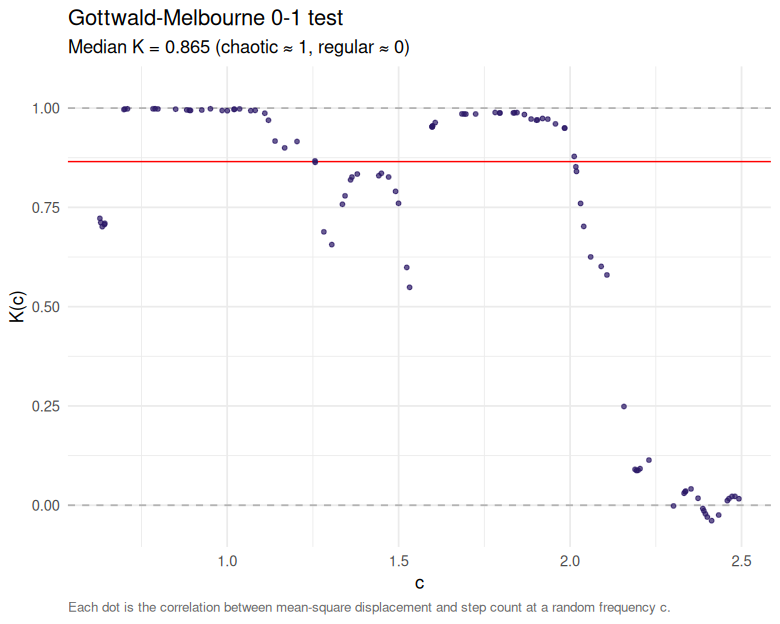

``` r


bd <- bifurcation_diagram(hp, par_name = "b1", par_range = c(2.2, 3.2),
                          observable = "z", n_par = 300, t_max = 3000,
                          discard_transient = 500, compute_lyapunov = TRUE,
                          verbose = FALSE)
plot(bd)
```

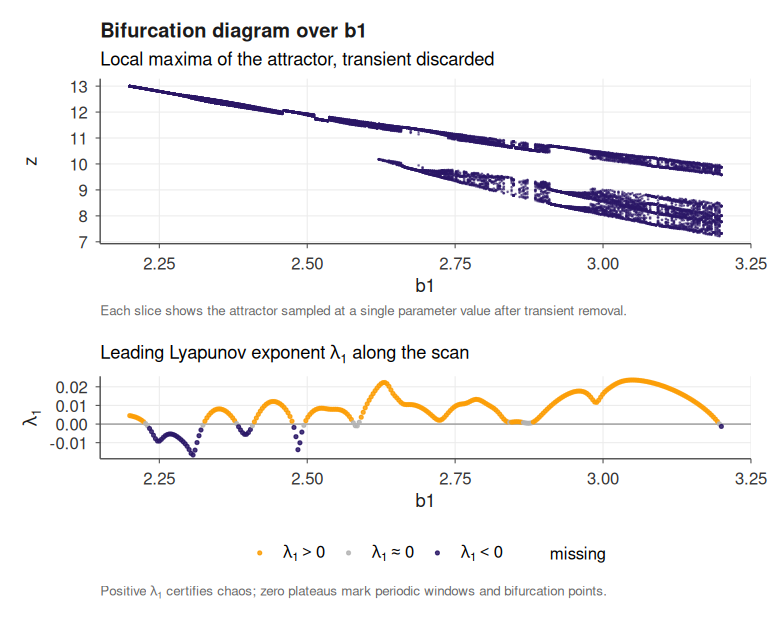

For an interactive time-series viewer, `plot(hp_run, type = "dygraph")`
produces a [dygraphs](https://rstudio.github.io/dygraphs/) panel with
range selector and hover legend. The full catalogue of strange
attractors, from Lorenz to Kuramoto-Sivashinsky, is worked out in
[`vignette("chaotic-systems")`](https://robustecologies.github.io/janos/articles/chaotic-systems.md).

  

### 2. Stability certificate for a competitive 2D model

For a two-species competitive Lotka-Volterra with an interior
equilibrium,
[`analyse_lyapunov()`](https://robustecologies.github.io/janos/reference/analyse_lyapunov.md)
inspects the family, classifies the subtype (gLV) and dispatches to the
Goh logarithmic construction [\[2\]](#ref2), returning an algebraic
certificate. With \\x\\ and \\y\\ the two competing species, the
non-dimensional equations read

\\\begin{aligned} \frac{d x}{d t} \\&=\\ x\\(1 - x - \alpha\_{12}\\y)
\\\[2pt\] \frac{d y}{d t} \\&=\\ y\\(1 - y - \alpha\_{21}\\x)
\end{aligned}\\

with interspecific coefficients \\\alpha\_{12} = 0.5\\ and
\\\alpha\_{21} = 0.3\\ satisfying the coexistence condition
\\\alpha\_{12}\\\alpha\_{21} \< 1\\. The function
[`phase_portrait()`](https://robustecologies.github.io/janos/reference/phase_portrait.md)
computes and assembles the qualitative geometric structure of a
[`system_spec()`](https://robustecologies.github.io/janos/reference/system_spec.md),
and captures the vector field, nullclines, equilibrium points
(classified by stability type), streamlines, stable and unstable
manifolds, and solution trajectories for any two- or three-dimensional
ODE system; see
[`vignette("qualitative-analysis")`](https://robustecologies.github.io/janos/articles/qualitative-analysis.md).

``` r

comp <- system_spec(
    rhs = list(
        x ~ x * (1 - x - 0.5 * y),
        y ~ y * (1 - y - 0.3 * x)
    ),
    state_names = c("x", "y"),
    parms = list(),
    init  = c(x = 0.2, y = 0.2)
)

pp <- phase_portrait(comp, xlim = c(-0.1, 2), ylim = c(-0.1, 2), trajectories = FALSE)
plot(pp, feasible = TRUE)
```

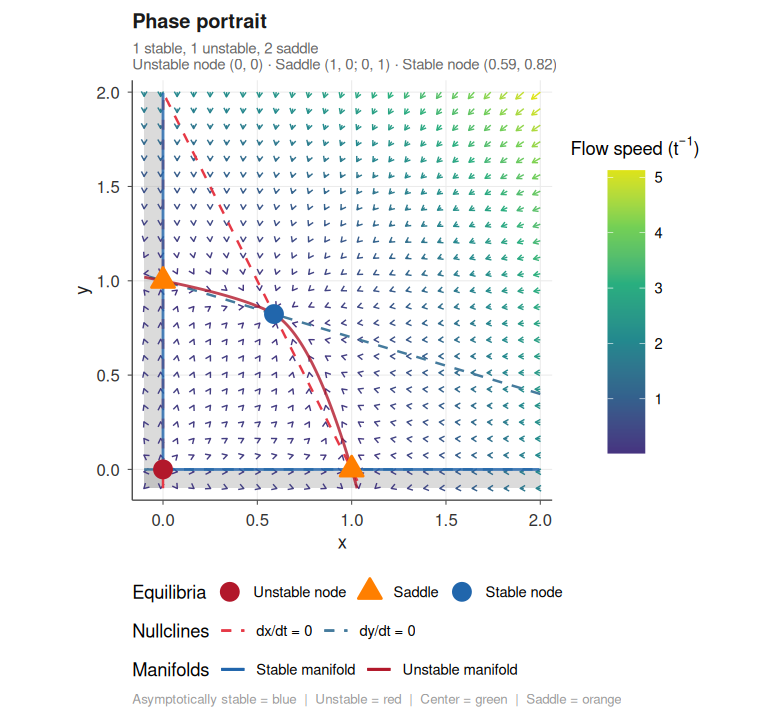

``` r


rep <- analyse_lyapunov(comp, verbose = FALSE)
print(rep)
#> ¡ Lyapunov report
#>   Family      : ode
#>   Method      : goh
#>   Feasible    : ✔ yes
#>   Certificate : algebraic
#>   Reason      : goh (Goh logarithmic Lyapunov function; VL-stability via heuristic)
#>   ----
#> ¡ Lyapunov function
#>   Method     : goh
#>   System     : glv (n = 2)
#>   x*         : [0.5882, 0.8235]
#>   V > 0      : ✔ certified
#>   V-dot < 0  : ✔ certified
#>   Residual   : -6.000e-01
#>   DOA        : positive_orthant
#>   Note       : Goh logarithmic Lyapunov function; VL-stability via heuristic
#>   Elapsed    : 0.001s
plot(rep$lyapunov, type = "phase_portrait",
     title = "Trajectories descending V")
```

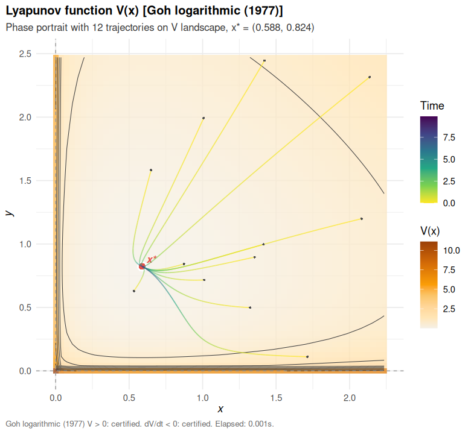

The advisor, the eight construction algorithms, and all family-specific
certificate views (`cobweb`, `iterate_decay`, `generator_field`,
`lmi_spectrum`, `regime_lmi`, `energy_decay`, …) are documented in
[`vignette("lyapunov_functions")`](https://robustecologies.github.io/janos/articles/lyapunov_functions.md).

  

### 3. Stochastic Brusselator and ensemble variability

The Brusselator [\[3\]](#ref3) is the canonical two-species
autocatalytic reaction network exhibiting stable limit cycles. In its
stochastic formulation the four elementary reactions and their
mass-action propensities read

\\\begin{aligned} \varnothing &\\\xrightarrow{A\\\Omega}\\ X &
\text{(influx)} \\\[2pt\] 2X + Y &\\\xrightarrow{X(X-1)\\Y /
\Omega^{2}}\\ 3X & \text{(autocatalysis)} \\\[2pt\] X
&\\\xrightarrow{B\\X}\\ Y & \text{(conversion)} \\\[2pt\] X
&\\\xrightarrow{X}\\ \varnothing & \text{(degradation)} \end{aligned}\\

where \\\Omega\\ is the system size and propensities are scaled so that
the thermodynamic limit recovers the deterministic rate equations.
Simulated exactly via the Gillespie direct algorithm [\[4\]](#ref4), the
stochastic trajectory shows fluctuations around the deterministic orbit;
repeating the simulation with
[`ensemble_sim()`](https://robustecologies.github.io/janos/reference/ensemble_sim.md)
recovers the full distribution.

``` r

Omega <- 80
bruss <- system_spec(
    stoichiometry = list(
        r1 = c(X =  1L, Y =  0L),
        r2 = c(X =  1L, Y = -1L),
        r3 = c(X = -1L, Y =  1L),
        r4 = c(X = -1L, Y =  0L)
    ),
    propensities = list(
        r1 ~ A * Omega,
        r2 ~ X * (X - 1) * Y / (Omega * Omega),
        r3 ~ B * X,
        r4 ~ X
    ),
    state_names = c("X", "Y"),
    parms = list(A = 1.0, B = 3.0, Omega = Omega),
    init  = c(X = as.integer(Omega), Y = as.integer(Omega))
)

one <- dyn_sim(bruss, t_max = 40,
               solver = solver_ssa_direct(output_dt = 0.1),
               discard_transient = 0, verbose = FALSE)
plot(one, title = "Stochastic Brusselator: a single realisation")
```

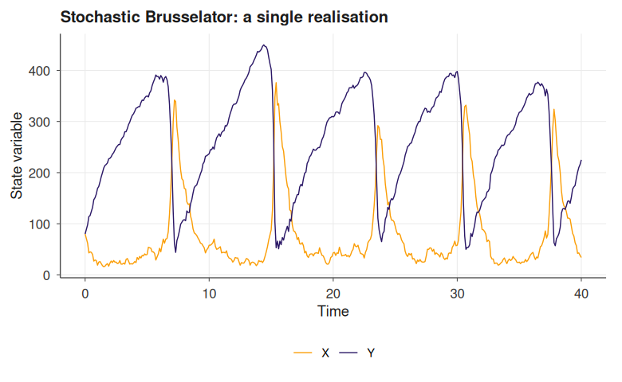

``` r

ens <- ensemble_sim(bruss, n_replicates = 40, t_max = 40,
                    solver = solver_ssa_direct(output_dt = 0.2),
                    parallel = FALSE, verbose = FALSE)
plot(ens, type = "fan", title = "Brusselator: ensemble fan chart (n = 40)")
```

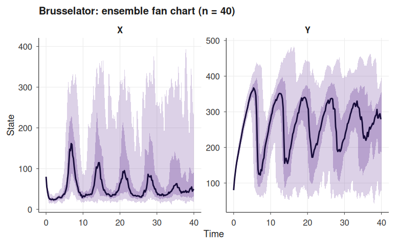

See
[`vignette("stochastic-simulation")`](https://robustecologies.github.io/janos/articles/stochastic-simulation.md)
for CTMC modelling, tau-leaping, MLMC variance reduction, and
quasi-stationary distributions, and
[`vignette("ensemble-simulation")`](https://robustecologies.github.io/janos/articles/ensemble-simulation.md)
for the full range of ensemble plot types (`fan`, `spaghetti`,
`terminal`, `extinction`).

  

### 4. Fisher-KPP travelling wave (spatio-temporal physics)

The Fisher-KPP equation [\[5\]](#ref5), the prototypical
reaction-diffusion model for an invading front, couples linear diffusion
with logistic growth,

\\\frac{\partial u}{\partial t} \\=\\ D\\\frac{\partial^{2} u}{\partial
x^{2}} \\+\\ r\\u\\(1 - u),\\

and admits travelling wave solutions with asymptotic speed \\c^{\ast} =
2\sqrt{D\\r}\\. janos compiles the formula and integrates the
semi-discretised system via the method of lines.

``` r

kpp <- system_spec(
    pde = list(u ~ D * d2x(u) + r * u * (1 - u)),
    state_names = "u",
    parms = list(D = 0.05, r = 1.0),
    spatial = list(
        domain = c(0, 40), n_grid = 81,
        bc = list(u = list(type = "neumann", left = 0, right = 0))
    ),
    init = function(x) as.numeric(x < 3)
)

kpp_run <- dyn_sim(kpp, t_max = 25,
                   solver = solver_mol(dt = 0.01, subsample = 50),
                   discard_transient = 0, verbose = FALSE)
plot(kpp_run, title = "Fisher-KPP invading front (kymograph)")
```

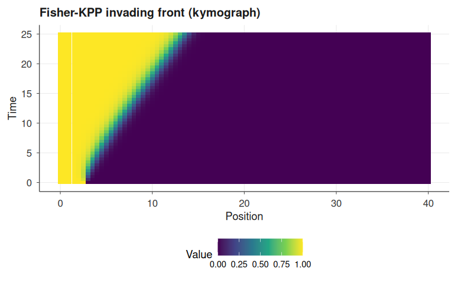

``` r

plot(kpp_run, type = "snapshot",
     title = "Fisher-KPP profiles at selected times")
```

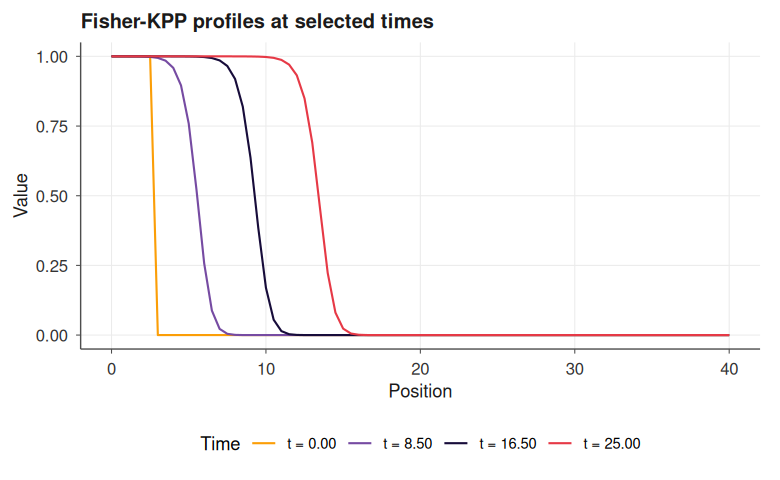

For 2D reaction-diffusion (Gray-Scott, Turing patterns, FitzHugh-Nagumo
waves) and boundary-condition cookbook, see
[`vignette("spatial-dynamics")`](https://robustecologies.github.io/janos/articles/spatial-dynamics.md).

  

### 5. Stochastic epidemic on a network (RDME)

The reaction-diffusion master equation [\[6\]](#ref6) discretises space
into voxels (or network nodes), runs a local well-mixed Gillespie
reaction network inside each voxel, and couples adjacent voxels through
first-order hopping reactions whose rates encode the diffusion
coefficients. The resulting process is a continuous-time Markov chain
over the joint state space of size \\n\_{\text{species}} \times
n\_{\text{nodes}}\\, simulated exactly by an extended direct method.
Here a susceptible-infected-susceptible (SIS) epidemic [\[7\]](#ref7)
runs on a periodic ring of ten patches, seeded at a single node; at each
node \\v\\ the local reactions and propensities are

\\\begin{aligned} S\_{v} + I\_{v}
&\\\xrightarrow{\beta\\S\_{v}\\I\_{v}}\\ 2\\I\_{v} & \text{(infection)}
\\\[2pt\] I\_{v} &\\\xrightarrow{\gamma\\I\_{v}}\\ S\_{v} &
\text{(recovery)} \end{aligned}\\

and each species hops between adjacent nodes \\v \sim w\\ through
first-order diffusion reactions \\X\_{v} \xrightarrow{D\_{X}\\X\_{v}}
X\_{w}\\ with \\X \in \\S, I\\\\, so that infection spreads by
intra-patch contact and by inter-patch diffusion of infected
individuals.

``` r

adj <- ring_graph(10, bc = "periodic")

sis_ring <- system_spec(
    stoichiometry = list(
        infection = c(S = -1L, I =  1L),
        recovery  = c(S =  1L, I = -1L)
    ),
    propensities = list(
        infection ~ beta * S * I,
        recovery  ~ gamma * I
    ),
    state_names = c("S", "I"),
    parms = list(beta = 0.004, gamma = 0.1,
                 D_S = 0.05, D_I = 0.2),
    init  = function(node) {
        if (node == 1L) c(S = 45L, I = 5L)
        else             c(S = 50L, I = 0L)
    },
    spatial = list(
        diffusion_rates = list(S ~ D_S, I ~ D_I),
        adjacency = adj
    )
)

ring_run <- dyn_sim(sis_ring, t_max = 40,
                    solver = solver_rdme(output_dt = 0.5, seed = 3),
                    discard_transient = 0, verbose = FALSE)
plot(ring_run, title = "SIS on a ring: spatio-temporal occupancy")
```

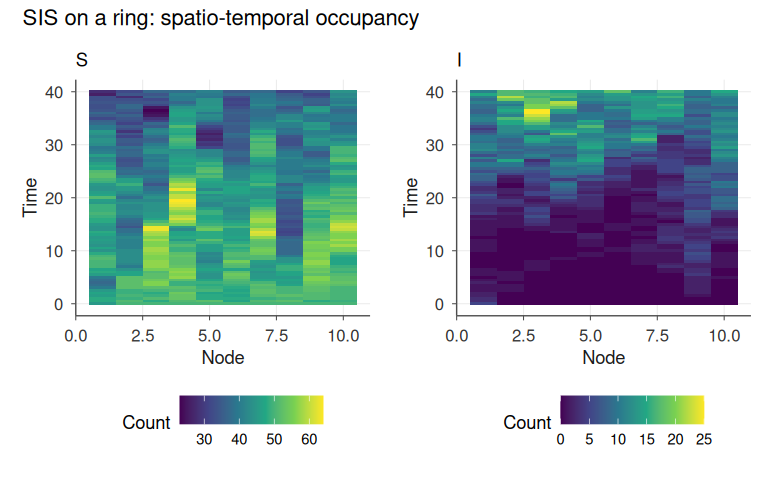

The network-RDME layer supports arbitrary topologies via
[`lattice_graph()`](https://robustecologies.github.io/janos/reference/lattice_graph.md),
[`ring_graph()`](https://robustecologies.github.io/janos/reference/ring_graph.md),
[`star_graph()`](https://robustecologies.github.io/janos/reference/star_graph.md),
[`complete_graph()`](https://robustecologies.github.io/janos/reference/complete_graph.md),
and
[`random_graph()`](https://robustecologies.github.io/janos/reference/random_graph.md);
see
[`vignette("spatial-dynamics")`](https://robustecologies.github.io/janos/articles/spatial-dynamics.md)
for metapopulation and lattice-ecology examples.

  

## Feature map

**Deterministic dynamics.**
[`solver_rk4()`](https://robustecologies.github.io/janos/reference/solver_rk4.md)
(fixed-step classical RK4),
[`solver_rk45()`](https://robustecologies.github.io/janos/reference/solver_rk45.md)
(adaptive Dormand-Prince RK4(5) with PI step control),
[`solver_rosenbrock()`](https://robustecologies.github.io/janos/reference/solver_rosenbrock.md)
(L-stable Rodas3 with symbolically generated Jacobians for stiff
systems),
[`solver_map()`](https://robustecologies.github.io/janos/reference/solver_map.md)
(discrete-time maps),
[`solver_dde()`](https://robustecologies.github.io/janos/reference/solver_dde.md)
(constant-lag delay equations with interpolated history).

**Stochastic differential equations.**
[`solver_euler_maruyama()`](https://robustecologies.github.io/janos/reference/solver_euler_maruyama.md)
and
[`solver_milstein()`](https://robustecologies.github.io/janos/reference/solver_milstein.md)
with central-difference `g'(X)` estimation, correlated Gaussian noise
via
[`correlated_noise()`](https://robustecologies.github.io/janos/reference/correlated_noise.md)
(Cholesky rotation),
[`levy_noise()`](https://robustecologies.github.io/janos/reference/levy_noise.md)
(Chambers-Mallows-Stuck alpha-stable),
[`fbm_noise()`](https://robustecologies.github.io/janos/reference/fbm_noise.md)
(Wood-Chan circulant embedding plus Hosking fallback),
[`colored_noise()`](https://robustecologies.github.io/janos/reference/colored_noise.md)
(FFT spectral synthesis for arbitrary 1/f^beta), and
[`solver_jump_diffusion()`](https://robustecologies.github.io/janos/reference/solver_jump_diffusion.md)
for SDEs with Poisson jump channels (deterministic, normal, exponential,
or uniform jump sizes).

**Continuous-time Markov chains.**
[`solver_ssa_direct()`](https://robustecologies.github.io/janos/reference/solver_ssa_direct.md),
[`solver_ssa_nrm()`](https://robustecologies.github.io/janos/reference/solver_ssa_nrm.md)
(Gibson-Bruck next-reaction method),
[`solver_ssa_mnrm()`](https://robustecologies.github.io/janos/reference/solver_ssa_mnrm.md)
(Anderson modified next-reaction),
[`solver_tau_leap()`](https://robustecologies.github.io/janos/reference/solver_tau_leap.md)
(adaptive leap-size selection with step rejection),
[`solver_tau_leap_midpoint()`](https://robustecologies.github.io/janos/reference/solver_tau_leap_midpoint.md),
and
[`solver_hybrid()`](https://robustecologies.github.io/janos/reference/solver_hybrid.md)
(SSA/CLE switching by reaction-channel abundance).

**Spatial and graph-structured dynamics.**
[`solver_mol()`](https://robustecologies.github.io/janos/reference/solver_mol.md)
and
[`solver_mol2d()`](https://robustecologies.github.io/janos/reference/solver_mol2d.md)
for 1D and 2D PDEs with operators `d1x`, `d2x`, `d1y`, `d2y`, `lap` and
Dirichlet/Neumann/periodic BCs;
[`solver_rdme()`](https://robustecologies.github.io/janos/reference/solver_rdme.md)
for stochastic reaction-diffusion on 1D voxel grids and on arbitrary
graphs produced by
[`lattice_graph()`](https://robustecologies.github.io/janos/reference/lattice_graph.md),
[`ring_graph()`](https://robustecologies.github.io/janos/reference/ring_graph.md),
[`star_graph()`](https://robustecologies.github.io/janos/reference/star_graph.md),
[`complete_graph()`](https://robustecologies.github.io/janos/reference/complete_graph.md),
[`random_graph()`](https://robustecologies.github.io/janos/reference/random_graph.md).

**Hybrid and switched dynamics.**
[`solver_pdmp()`](https://robustecologies.github.io/janos/reference/solver_pdmp.md)
for piecewise deterministic Markov processes: per-regime ODE integration
with Lewis-Shedler thinning for non-stationary switching.

**Analysis layer.** Qualitative portraits (`phase_portrait`,
`map_portrait`, `sde_portrait`, `dde_portrait`, `pdmp_portrait`);
numerical bifurcation continuation with fold and Hopf detection
(`continuation`, `bifurcation_sweep`); Fokker-Planck stationary
densities and quasi-potentials in 1D and 2D (`fp_stationary`,
`fp_stationary_2d`, `fp_potential`) and Kramers escape rates
(`fp_kramers_rate`); quasi-stationary distribution estimation
(`estimate_qsd`, Fleming-Viot particles); rare-event probabilities by
importance sampling (`estimate_extinction`); multi-level Monte Carlo
variance reduction (`mlmc_estimate`); continuous adjoint sensitivity for
parameter gradients (`adjoint_sensitivity`); power-spectral-density
estimation by Welch’s method (`spectral_analysis`); observation-noise
layering (`observe`) with Gaussian, lognormal, Poisson and
negative-binomial models; two-tier ensemble simulation (`ensemble_sim`)
with C++ OpenMP batches for SSA/SDE/tau-leap and an `mclapply`/`future`
fallback.

**Chaos diagnostics.** Full numerical Lyapunov spectrum via QR
renormalisation of the variational flow with Kaplan-Yorke dimension
(`lyapunov_spectrum`); Grassberger-Procaccia correlation dimension with
Theiler-window correction (`correlation_dimension`); Poincare sections
by bracketed interpolation (`poincare_section`); Gottwald-Melbourne 0-1
test (`zero_one_test`); and attractor-level bifurcation diagrams by
direct simulation across a scanned parameter (`bifurcation_diagram`),
embarrassingly parallel on Unix and Windows through a shared
cross-platform dispatcher and capable of overlaying a second panel with
the leading Lyapunov exponent at every scan point. This complements
equilibrium-branch continuation with the Feigenbaum cascade and
periodic-window structure visible on the true attractor. Interactive
rendering through `plot(x, type = "dygraph")` and
`type = "delay_embedding")` rounds off the chaos toolkit.

**Parallelism and early termination.** Every long-running analysis entry
point accepts `parallel = TRUE, n_cores = NULL` and dispatches through a
single internal helper that runs
[`parallel::mclapply()`](https://rdrr.io/r/parallel/mclapply.html) on
Unix and
[`parallel::makePSOCKcluster()`](https://rdrr.io/r/parallel/makeCluster.html)
on Windows; there is no Windows fallback to serial. Covered:
`bifurcation_diagram`, `bifurcation_sweep`, `phase_portrait`,
`map_portrait`, `sde_portrait`, `dde_portrait`, `pdmp_portrait`,
`ensemble_sim`. Work is chunked so that pressing Esc returns a partial
result with `$interrupted = TRUE` and `$metadata$n_completed / n_total`
metadata instead of discarding the run. The compiled OpenMP batch
templates (`ssa_direct`, `euler_maruyama`, `tau_leap`) check the R
interrupt flag between replicate chunks via a non-longjmp
`R_ToplevelExec` helper. Windows OpenMP support is detected
automatically at session start (Rtools 4.x); when absent, the batch path
gracefully falls back to the R-level dispatcher.

**Lyapunov stack.**
[`analyse_lyapunov()`](https://robustecologies.github.io/janos/reference/analyse_lyapunov.md)
unified entry point,
[`lyapunov_advisor()`](https://robustecologies.github.io/janos/reference/lyapunov_advisor.md)
diagnostic classifier, eight algebraic and numerical constructors
([`lyapunov_function()`](https://robustecologies.github.io/janos/reference/lyapunov_function.md)
auto-dispatch over quadratic, Goh, MacArthur, Gilpin, SOS via CVXR, RBF
collocation, Massera converse, CPA piecewise affine), and
family-specific constructors for maps, SDEs, DDEs (Krasovskii LMI),
PDMPs (switched-system LMI), CTMCs (Foster lift from fluid limit), and
reaction-diffusion PDEs (energy functional).

  

## Vignettes

Detailed tutorials are available as package vignettes:

- [`vignette("introduction")`](https://robustecologies.github.io/janos/articles/introduction.md)
  core workflow, formula compilation, solver selection
- [`vignette("solvers")`](https://robustecologies.github.io/janos/articles/solvers.md)
  solver gallery, accuracy and stability trade-offs
- [`vignette("stochastic-simulation")`](https://robustecologies.github.io/janos/articles/stochastic-simulation.md)
  CTMC models, SSA, tau-leap, QSD, MLMC
- [`vignette("sde-noise")`](https://robustecologies.github.io/janos/articles/sde-noise.md)
  SDEs, exotic noise processes, jump-diffusion
- [`vignette("spatial-dynamics")`](https://robustecologies.github.io/janos/articles/spatial-dynamics.md)
  PDEs (1D/2D), RDME on grids and graphs
- [`vignette("advanced-dynamics")`](https://robustecologies.github.io/janos/articles/advanced-dynamics.md)
  DDEs, PDMPs, maps, bifurcation continuation, adjoint sensitivity
- [`vignette("qualitative-analysis")`](https://robustecologies.github.io/janos/articles/qualitative-analysis.md)
  phase portraits, nullclines, separatrix detection
- [`vignette("lyapunov_functions")`](https://robustecologies.github.io/janos/articles/lyapunov_functions.md)
  Lyapunov construction algorithms and family-aware advisor
- [`vignette("chaotic-systems")`](https://robustecologies.github.io/janos/articles/chaotic-systems.md)
  strange attractors from Lorenz to Kuramoto-Sivashinsky, with Lyapunov
  spectrum, correlation dimension, Poincare sections and bifurcation
  diagrams
- [`vignette("ensemble-simulation")`](https://robustecologies.github.io/janos/articles/ensemble-simulation.md)
  ensemble replicates, parallelism, plot types
- [`vignette("API")`](https://robustecologies.github.io/janos/articles/API.md)
  exhaustive cross-reference of exported functions

  

## References

**\[1\]** Hastings, A. and Powell, T. (1991). *Chaos in a three-species
food chain*. Ecology, 72(3), 896-903.
[doi:10.2307/1940591](https://doi.org/10.2307/1940591)

**\[2\]** Goh, B. S. (1977). *Global stability in many-species systems*.
The American Naturalist, 111(977), 135-143.
[doi:10.1086/283144](https://doi.org/10.1086/283144)

**\[3\]** Prigogine, I. and Lefever, R. (1968). *Symmetry breaking
instabilities in dissipative systems II*. Journal of Chemical Physics,
48(4), 1695-1700.
[doi:10.1063/1.1668896](https://doi.org/10.1063/1.1668896)

**\[4\]** Gillespie, D. T. (1977). *Exact stochastic simulation of
coupled chemical reactions*. The Journal of Physical Chemistry, 81(25),
2340-2361.
[doi:10.1021/j100540a008](https://doi.org/10.1021/j100540a008)

**\[5\]** Fisher, R. A. (1937). *The wave of advance of advantageous
genes*. Annals of Eugenics, 7(4), 355-369.
[doi:10.1111/j.1469-1809.1937.tb02153.x](https://doi.org/10.1111/j.1469-1809.1937.tb02153.x);
Kolmogorov, A., Petrovsky, I. and Piskunov, N. (1937). *Study of the
diffusion equation with growth of the quantity of matter*. Bulletin of
Moscow State University, Ser. A, 1, 1-26.

**\[6\]** Gardiner, C. W., McNeil, K. J., Walls, D. F. and Matheson, I.
S. (1976). *Correlations in stochastic theories of chemical reactions*.
Journal of Statistical Physics, 14(4), 307-331.
[doi:10.1007/BF01030197](https://doi.org/10.1007/BF01030197)

**\[7\]** Pastor-Satorras, R., Castellano, C., Van Mieghem, P. and
Vespignani, A. (2015). *Epidemic processes in complex networks*. Reviews
of Modern Physics, 87(3), 925-979.
[doi:10.1103/RevModPhys.87.925](https://doi.org/10.1103/RevModPhys.87.925)

  

## Author

**Pablo Almaraz**
[](https://orcid.org/0000-0003-1416-2695)

[Robust Ecologies Lab](https://robustecologies.github.io)

  

## Disclaimer

This package is the original creation of the author in all conceptual,
theoretical, and design aspects. Implementation was assisted by
Anthropic’s Claude Code v.2 (Opus 4.5-4.7) to streamline package
development. All original ideas, creativity, and scientific
contributions belong to the author, who maintains full responsibility
for the package’s correctness and reliability. All the code has been
thoroughly tested, and users are encouraged to report any issues through
the package’s [issue
tracker](https://github.com/robustecologies/janos/issues).

  

## License

GPL (\>= 3)
