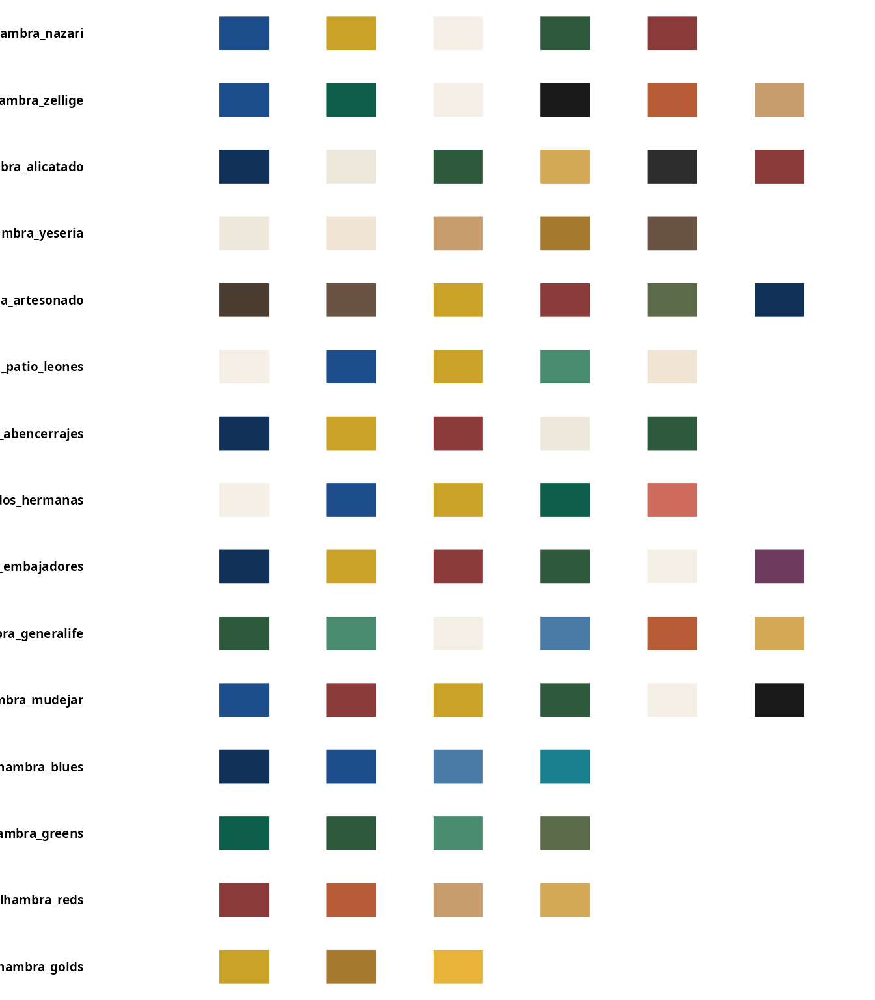
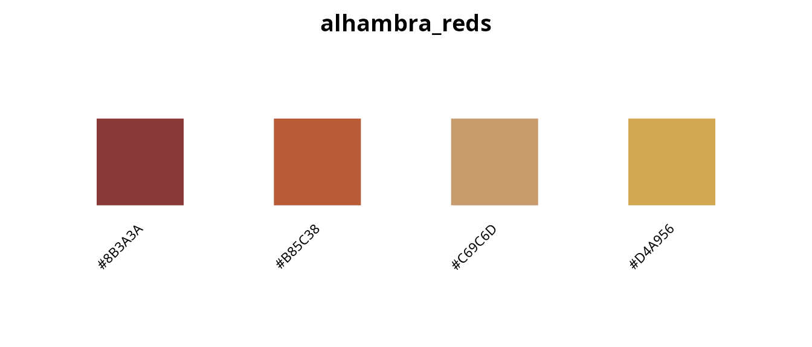
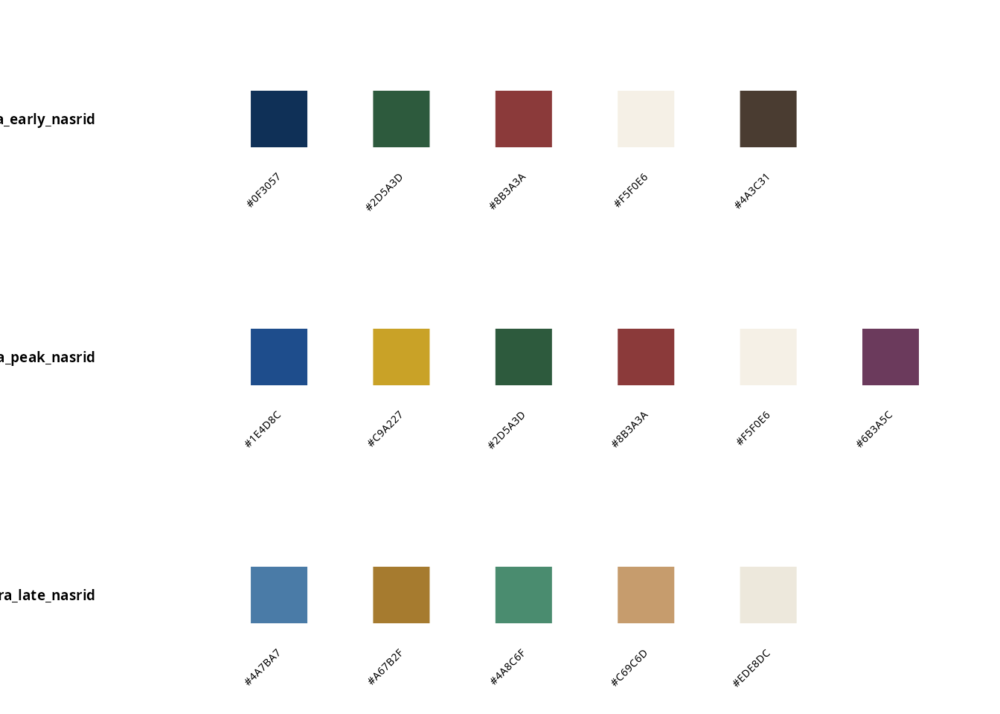
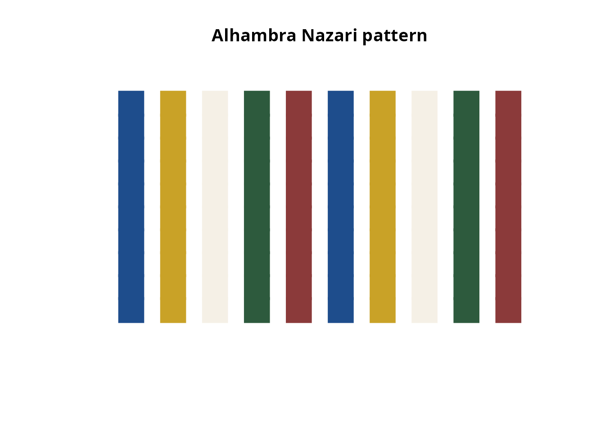
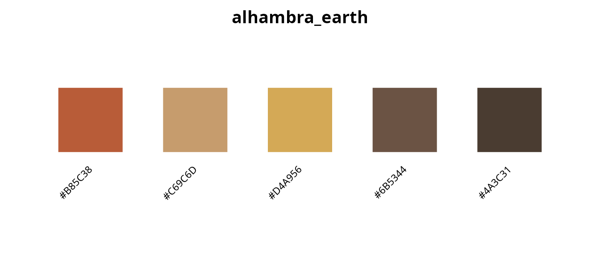
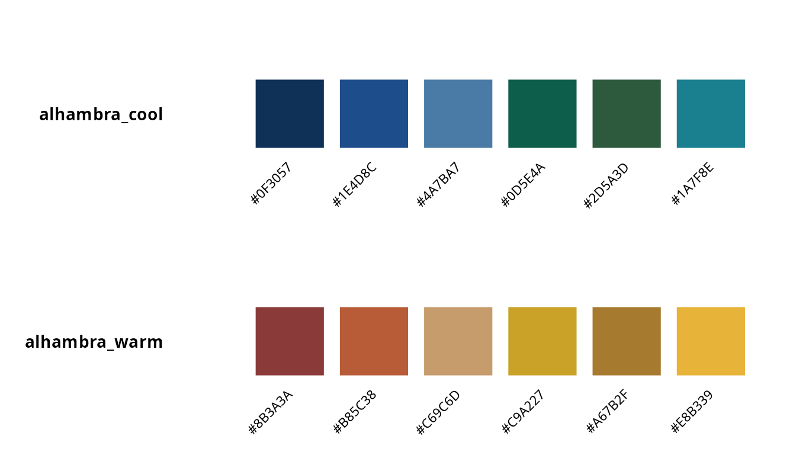

# Alhambra color palettes: historical pigments from the Nasrid dynasty

## Historical context: the Nasrid dynasty

The Alhambra palace complex in Granada, Spain, represents the pinnacle
of Islamic art and architecture in Al-Andalus, the name of Iberian
Peninsula during the Muslim presence. Built primarily during the Nasrid
dynasty (1232-1492), its color schemes reflect both the aesthetic
principles of Islamic geometric art and the practical constraints of
13th-14th century pigment technology [Fernández-Puertas
(1997)](#ref-fernandez1997).

koloRo includes over 50 authentic Alhambra color palettes derived from
spectroscopic analysis of original pigments ([García-Bueno &
Medina-Flórez (2004)](#ref-garcia2004); [Cardell & Navarrete
(2006)](#ref-cardell2006)) and historical documentation.

## The Alhambra color palette collection

``` r

# View all Alhambra palettes
plot_category("alhambra", max_display = 15)
#> Showing first 15 of 30 palettes
```



## Authentic pigments and their sources

The colors of the Alhambra were created using natural minerals and
organic materials available in medieval Al-Andalus.

### Blues (cobalt oxide, lapis lazuli)

``` r

plot_palette("alhambra_blues")
```


| Color         | Hex      | Historical source              |
|---------------|----------|--------------------------------|
| Azul cobalto  | \#1E4D8C | Primary blue from cobalt oxide |
| Azul profundo | \#0F3057 | Deeper shade for shadows       |
| Azul celeste  | \#4A7BA7 | Weathered/oxidized cobalt      |
| Azul turquesa | \#1A7F8E | Copper-based blue-green        |

### Greens (malachite, verdigris)

``` r

plot_palette("alhambra_greens")
```


| Color            | Hex      | Historical source           |
|------------------|----------|-----------------------------|
| Verde malaquita  | \#0D5E4A | Crushed malachite stone     |
| Verde alhambra   | \#2D5A3D | Characteristic palace green |
| Verde cardenillo | \#4A8C6F | Copper acetate (verdigris)  |
| Verde oliva      | \#5C6B4A | Mixed earth pigments        |

### Reds and ochres (iron oxides)

``` r

plot_palette("alhambra_reds")
```



| Color         | Hex      | Historical source            |
|---------------|----------|------------------------------|
| Rojo almagre  | \#8B3A3A | Hematite-based red ochre     |
| Terracota     | \#B85C38 | Fired clay pigment           |
| Ocre dorado   | \#C69C6D | Yellow-orange iron oxide     |
| Ocre amarillo | \#D4A956 | Lighter yellow ochre variant |

### Golds (gold leaf, amber resins)

``` r

plot_palette("alhambra_golds")
```


| Color      | Hex      | Historical source  |
|------------|----------|--------------------|
| Oro nazarí | \#C9A227 | Royal gold color   |
| Oro viejo  | \#A67B2F | Oxidized/aged gold |
| Ámbar      | \#E8B339 | Amber resin color  |

### Whites (lime, gypsum)

``` r

plot_palette("alhambra_whites")
```


| Color       | Hex      | Historical source             |
|-------------|----------|-------------------------------|
| Blanco cal  | \#F5F0E6 | Lime wash (calcium carbonate) |
| Blanco yeso | \#EDE8DC | Gypsum plaster                |
| Marfil      | \#F0E6D3 | Aged white/ivory              |

### Darks (carbon, earth)

``` r

plot_palette("alhambra_darks")
```


| Color        | Hex      | Historical source         |
|--------------|----------|---------------------------|
| Negro carbón | \#1A1A1A | Carbon black for outlines |
| Negro suave  | \#2D2D2D | Softer black              |
| Pardo oscuro | \#4A3C31 | Dark cedar wood           |
| Pardo claro  | \#6B5344 | Light weathered wood      |

## Location-based palettes

Each major space in the Alhambra has a distinct color character:

### Patio de los Leones (Court of the Lions)

``` r

plot_palette("alhambra_patio_leones")
```


The Court of the Lions features an elegant, light palette dominated by
white marble, blue tiles, and gold accents.

### Sala de los Abencerrajes (Hall of the Abencerrajes)

``` r

plot_palette("alhambra_sala_abencerrajes")
```


This hall is known for its spectacular muqarnas ceiling and rich, deep
color scheme.

### Sala de las Dos Hermanas (Hall of the Two Sisters)

``` r

plot_palette("alhambra_dos_hermanas")
```


Features delicate polychrome work with intricate geometric patterns.

### Sala de los Embajadores (Hall of the Ambassadors)

``` r

plot_palette("alhambra_embajadores")
```


The throne room, with the most elaborate and richest color scheme.

### Generalife gardens

``` r

plot_palette("alhambra_generalife")
```


The summer palace gardens feature more naturalistic greens with
terracotta accents.

## Period-specific palettes

The Nasrid color palette evolved over time:

``` r

plot_palette(c("alhambra_early_nasrid", "alhambra_peak_nasrid", "alhambra_late_nasrid"))
```



### Early Nasrid (13th century)

The early period featured a limited palette consisting primarily of deep
blue, green, red, white, and brown, reflecting both aesthetic
preferences and economic constraints. Geometric patterns were simpler
during this formative period, and gold was used sparingly due to
resource limitations.

### Peak Nasrid (14th century)

During the reigns of Yusuf I and Muhammad V, the Nasrid color palette
reached its full expression with prominent use of gold throughout the
palace complex. Artisans developed complex polychrome designs featuring
sophisticated color modulation techniques that created three-dimensional
illusions on flat surfaces. This period also saw the introduction of
royal purple derived from kermes and murex, marking the height of Nasrid
decorative arts.

### Late Nasrid (15th century)

Economic decline during the late period resulted in lighter colors and
reduced use of expensive cobalt-based blues. Earth tones became more
prevalent, and overall color schemes were simplified compared to the
elaborate polychrome work of the peak period.

## Using Alhambra palettes for geometric art

The Alhambra palettes are ideal for creating Islamic-inspired geometric
patterns:

### Color manipulation for depth

``` r

# Base color
base <- "#1E4D8C"  # Alhambra blue

# Create depth variants
shadow <- shadow_color(base, intensity = 0.3)
highlight <- highlight_color(base, intensity = 0.3)

cat("Base:", base, "\n")
#> Base: #1E4D8C
cat("Shadow:", shadow, "\n")
#> Shadow: #1C3A62
cat("Highlight:", highlight, "\n")
#> Highlight: #3A6CAF
```

### Pattern generation

``` r

# Generate colors for a geometric pattern
n_tiles <- 50

# Cyclic coloring - regular repetition
cyclic <- pattern_colors(n_tiles, "alhambra_nazari", method = "cyclic")
head(cyclic, 10)
#>  [1] "#1E4D8C" "#C9A227" "#F5F0E6" "#2D5A3D" "#8B3A3A" "#1E4D8C" "#C9A227"
#>  [8] "#F5F0E6" "#2D5A3D" "#8B3A3A"

# Gradient coloring - smooth transitions
gradient <- pattern_colors(n_tiles, "alhambra_nazari", method = "gradient")
head(gradient, 10)
#>  [1] "#1E4D8C" "#2B5383" "#395A7B" "#476173" "#55686B" "#636F62" "#71765A"
#>  [8] "#7F7D52" "#8D844A" "#9B8B41"
```

### Example: creating a simple pattern

``` r

# Create a simple grid pattern with Alhambra colors
set.seed(42)
cols <- palettes(palette = "alhambra_nazari")

# Create grid
n <- 10
x <- rep(1:n, n)
y <- rep(1:n, each = n)
colors <- pattern_colors(n^2, "alhambra_nazari", method = "cyclic")

plot(x, y, col = colors, pch = 15, cex = 4,
     xlim = c(0, n + 1), ylim = c(0, n + 1),
     xlab = "", ylab = "", axes = FALSE,
     main = "Alhambra Nazari pattern")
```



## Functional palettes

koloRo includes pre-designed palettes for specific use cases:

### High-contrast geometric patterns

``` r

plot_palette("alhambra_geometric")
```


Designed for clear pattern definition with maximum contrast.

### Earth tones

``` r

plot_palette("alhambra_earth")
```



Naturalistic colors for organic designs.

### Cool vs. warm

``` r

plot_palette(c("alhambra_cool", "alhambra_warm"))
```



### Minimal two-tone combinations

``` r

plot_palette(c("alhambra_minimal_blue_white", "alhambra_minimal_green_white", "alhambra_minimal_gold_blue"))
```


## Scientific validation

Modern restoration efforts have used spectroscopic analysis to identify
original pigments ([García-Bueno & Medina-Flórez
(2004)](#ref-garcia2004); [Cardell & Navarrete
(2006)](#ref-cardell2006)):

- **X-ray fluorescence (XRF)**: Confirms cobalt in blues
- **Raman spectroscopy**: Identifies malachite and verdigris
- **Infrared reflectography**: Reveals carbon black underdraws
- **Pigment stratigraphy**: Shows original vs. restoration layers

The colors in koloRo are based on these scientific analyses, not
approximations.

## Complete inventory

``` r

alhambra_list <- list_palettes(category = "alhambra")
knitr::kable(alhambra_list, caption = "All Alhambra palettes")
```

| palette_name                 | category | n_colors |
|:-----------------------------|:---------|---------:|
| alhambra_nazari              | alhambra |        5 |
| alhambra_zellige             | alhambra |        6 |
| alhambra_alicatado           | alhambra |        6 |
| alhambra_yeseria             | alhambra |        5 |
| alhambra_artesonado          | alhambra |        6 |
| alhambra_patio_leones        | alhambra |        5 |
| alhambra_sala_abencerrajes   | alhambra |        5 |
| alhambra_dos_hermanas        | alhambra |        5 |
| alhambra_embajadores         | alhambra |        6 |
| alhambra_generalife          | alhambra |        6 |
| alhambra_mudejar             | alhambra |        6 |
| alhambra_blues               | alhambra |        4 |
| alhambra_greens              | alhambra |        4 |
| alhambra_reds                | alhambra |        4 |
| alhambra_golds               | alhambra |        3 |
| alhambra_whites              | alhambra |        3 |
| alhambra_darks               | alhambra |        4 |
| alhambra_geometric           | alhambra |        5 |
| alhambra_earth               | alhambra |        5 |
| alhambra_cool                | alhambra |        6 |
| alhambra_warm                | alhambra |        6 |
| alhambra_sunset              | alhambra |        6 |
| alhambra_spectrum            | alhambra |        8 |
| alhambra_minimal_blue_white  | alhambra |        2 |
| alhambra_minimal_green_white | alhambra |        2 |
| alhambra_minimal_gold_blue   | alhambra |        2 |
| alhambra_early_nasrid        | alhambra |        5 |
| alhambra_peak_nasrid         | alhambra |        6 |
| alhambra_late_nasrid         | alhambra |        5 |
| alhambra_restoration         | alhambra |        6 |

All Alhambra palettes {.table}

## References

Fernández-Puertas, A. (1997). *The Alhambra: From the ninth century to
Yusuf I (1354)*. London: Saqi Books. ISBN: 978-0-86356-466-6

García-Bueno, A., & Medina-Flórez, V.J. (2004). The Nasrid plasterwork
at “qubba Dar al-Manjara l-kubra” in Granada: Characterisation of
materials and techniques. *Journal of Cultural Heritage*, 5(1), 75-89.
[doi:10.1016/j.culher.2003.02.002](https://doi.org/10.1016/j.culher.2003.02.002)

Cardell, C., & Navarrete, L. (2006). Pigment and plasterwork analyses of
Nasrid polychrome stucco in the Alhambra (Granada, Spain). *Studies in
Conservation*, 51(3), 161-176.
[doi:10.1179/sic.2006.51.3.161](https://doi.org/10.1179/sic.2006.51.3.161)

Abas, S.J., & Salman, A.S. (1995). *Symmetries of Islamic Geometrical
Patterns*. Singapore: World Scientific.
[doi:10.1142/2301](https://doi.org/10.1142/2301)

Dodds, J.D. (Ed.). (1992). *Al-Andalus: The Art of Islamic Spain*. New
York: Metropolitan Museum of Art.
