# Chameleon color palettes: nature's masters of chromatic adaptation

## The biology of chameleon coloration

Chameleons (family Chamaeleonidae) are renowned for their remarkable
ability to change color, a capacity that has fascinated naturalists
since antiquity. Contrary to popular belief, chameleons do not change
color primarily for camouflage; rather, color change serves functions in
thermoregulation, communication, and social signaling ([Stuart-Fox &
Moussalli (2009)](#ref-stuartfox2009)).

The mechanism underlying color change involves specialized cells called
chromatophores arranged in layers beneath the transparent epidermis. The
uppermost layer contains xanthophores (yellow pigments) and
erythrophores (red pigments), while deeper layers contain iridophores
with guanine nanocrystals that reflect light, and melanophores
containing dark melanin. By adjusting the spacing of nanocrystals in the
iridophore layer, chameleons can shift from reflecting short wavelengths
(blue) to long wavelengths (red), with the overlying yellow pigments
producing the characteristic green coloration when combined with blue
reflectance ([Teyssier et al. (2015)](#ref-teyssier2015)).

koloRo includes over 20 palettes based on documented coloration patterns
of chameleon species from three continents, derived from scientific
literature, field guides, and natural history documentation.

## Overview of chameleon palettes

``` r

plot_category("chameleons", max_display = 20)
#> Showing first 20 of 22 palettes
```

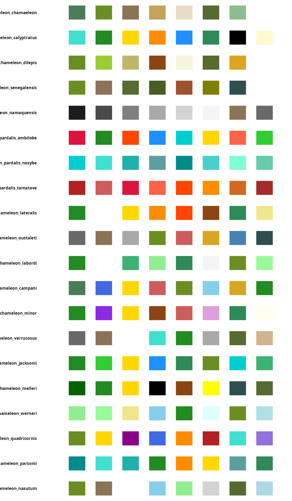

## Geographic distribution and genera

The family Chamaeleonidae comprises approximately 220 species
distributed across Africa, Madagascar, southern Europe, and parts of
Asia. The majority of species diversity occurs in Madagascar (genera
*Calumma*, *Furcifer*, and *Brookesia*) and sub-Saharan Africa (genera
*Chamaeleo*, *Trioceros*, *Kinyongia*, and *Rhampholeon*).

### African chameleons (genus *Chamaeleo*)

The genus *Chamaeleo* includes some of the most widely distributed
chameleon species, ranging from the Mediterranean Basin to southern
Africa.

#### Common chameleon (*Chamaeleo chamaeleon*)

The only chameleon native to Europe, *C. chamaeleon* inhabits the
Mediterranean coastal regions of Spain, Portugal, southern Italy,
Greece, and North Africa. Its coloration ranges from yellowish-brown
through various greens to dark brown, typically displaying two lighter
lateral stripes ([Cuadrado et al. (2001)](#ref-cuadrado2001)).

``` r

plot_palette("chameleon_chamaeleon")
```

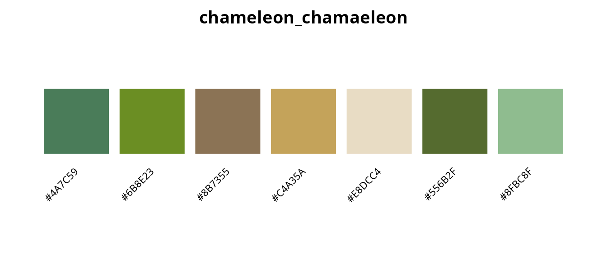

#### Veiled chameleon (*Chamaeleo calyptratus*)

Native to the Arabian Peninsula, the veiled chameleon is distinguished
by its prominent casque and bold coloration. Males display turquoise,
gold, and orange bands against a green background, making this species
one of the most visually striking in the genus ([Ferguson et
al. (2007)](#ref-ferguson2007)).

``` r

plot_palette("chameleon_calyptratus")
```

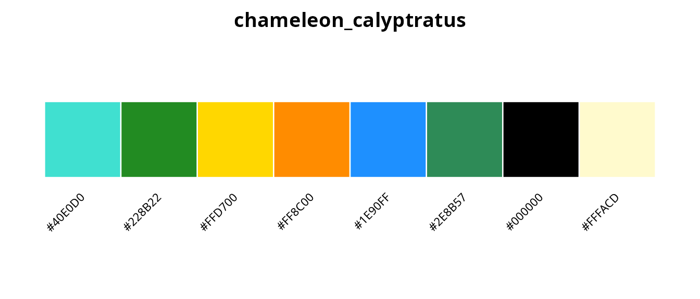

#### Flap-necked chameleon (*Chamaeleo dilepis*)

The most widely distributed African chameleon, *C. dilepis* ranges
across sub-Saharan Africa from Ethiopia to South Africa. Coloration
varies through greens, yellows, and browns with characteristic pale
flank stripes ([Tolley & Burger (2007)](#ref-tolley2007)).

``` r

plot_palette("chameleon_dilepis")
```

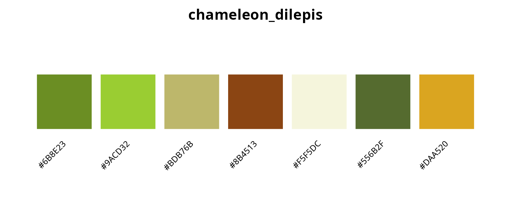

#### Namaqua chameleon (*Chamaeleo namaquensis*)

A ground-dwelling desert specialist from the Namib, *C. namaquensis*
uses color change primarily for thermoregulation. In cool mornings,
individuals turn nearly black to absorb heat; at midday, they become
pale grey or white to reflect solar radiation. Remarkably, they can
display both colors simultaneously, divided along the spine ([Burrage
(1973)](#ref-burrage1973)).

``` r

plot_palette("chameleon_namaquensis")
```

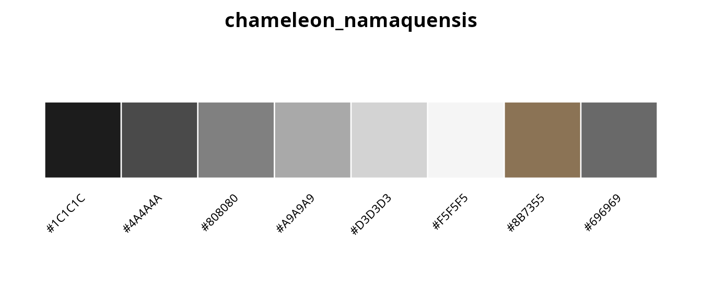

### Malagasy chameleons (genus *Furcifer*)

Madagascar harbors extraordinary chameleon diversity, with the genus
*Furcifer* containing some of the most colorful species known.

#### Panther chameleon (*Furcifer pardalis*)

Perhaps the most celebrated chameleon for its spectacular coloration,
the panther chameleon exhibits remarkable geographic variation in male
color patterns. Different populations, known as “locales,” display
distinct color morphs that correlate with mitochondrial haplogroups
([Grbic et al. (2015)](#ref-grbic2015)).

``` r

plot_palette(c(
  "chameleon_pardalis_ambilobe",
  "chameleon_pardalis_nosybe",
  "chameleon_pardalis_tamatave"
))
```

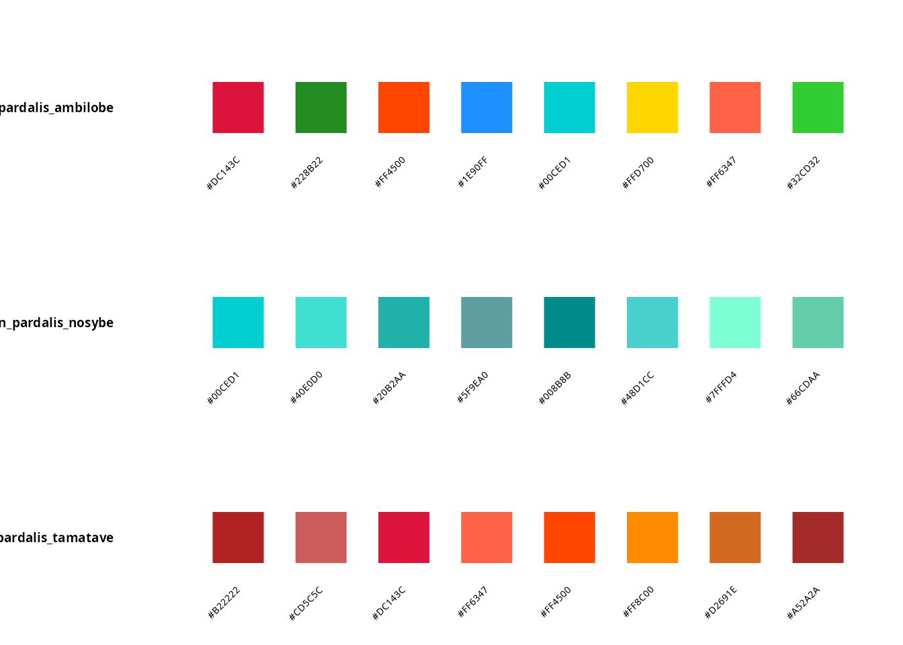

The Ambilobe locale displays the full spectrum of reds, greens, oranges,
and blues; Nosy Be individuals are characterized by vibrant turquoise
and blue-green coloration; Tamatave specimens are predominantly red with
orange accents.

#### Carpet chameleon (*Furcifer lateralis*)

Named for the intricate carpet-like patterns displayed by gravid
females, *F. lateralis* exhibits reversed sexual dichromatism, with
females more colorful than males ([Brady & Griffiths
(1999)](#ref-brady1999)).

``` r

plot_palette("chameleon_lateralis")
```

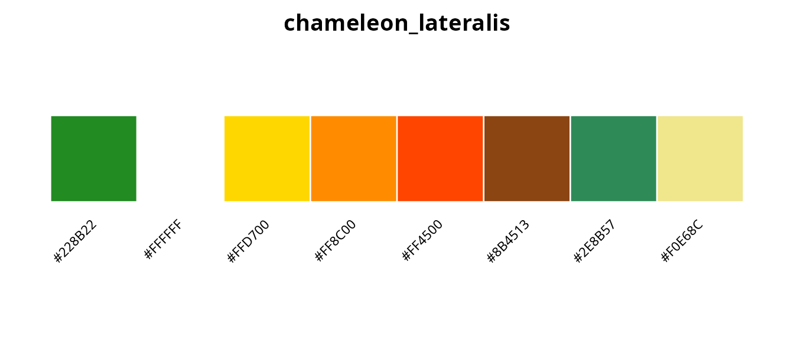

#### Labord’s chameleon (*Furcifer labordi*)

Remarkable for having the shortest lifespan of any tetrapod (4-5 months
post-hatching), *F. labordi* displays green coloration with white
lateral stripes. Individuals show dramatic color changes immediately
before death, a phenomenon documented in 2024 PBS footage ([Karsten et
al. (2008)](#ref-karsten2008)).

``` r

plot_palette("chameleon_labordi")
```

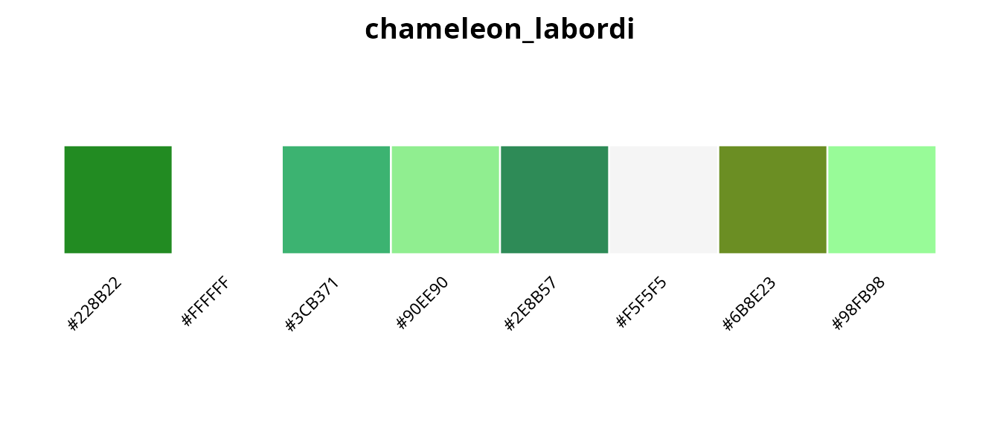

#### Jeweled chameleon (*Furcifer campani*)

Endemic to the central highlands of Madagascar at elevations of
1,800-2,600 m, the jeweled chameleon earns its name from the bright blue
spots and red markings above the eyes that adorn its green body
([Raselimanana et al. (2000)](#ref-raselimanana2000)).

``` r

plot_palette("chameleon_campani")
```

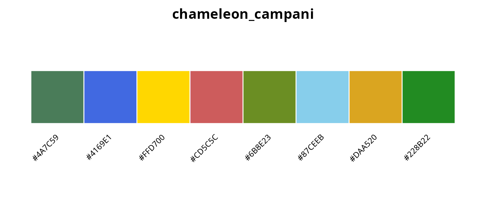

### Horned chameleons (genus *Trioceros*)

The African genus *Trioceros* includes several species with prominent
cranial horns, a feature used in male-male combat and species
recognition.

#### Jackson’s chameleon (*Trioceros jacksonii*)

The three-horned Jackson’s chameleon, native to East African montane
forests and introduced to Hawaii, displays bright green coloration with
blue and yellow accents. Males possess three annulated horns reminiscent
of the prehistoric *Triceratops* ([Martin (1992)](#ref-martin1992)).

``` r

plot_palette("chameleon_jacksonii")
```

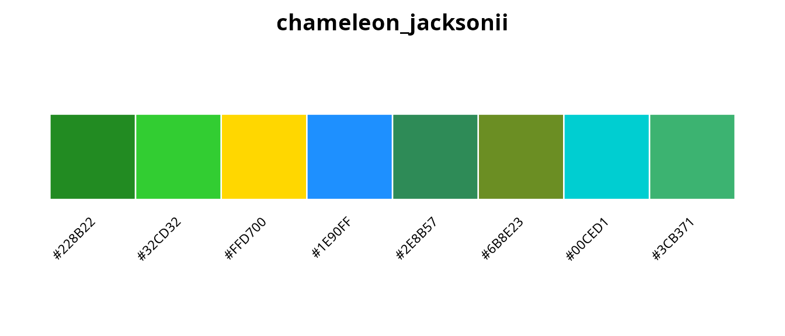

#### Meller’s chameleon (*Trioceros melleri*)

The largest chameleon in mainland Africa, *T. melleri* displays deep
forest green with distinctive yellow stripes and black spots. Stress
patterns include dark mottling that intensifies with increasing
agitation ([Necas (2004)](#ref-necas2004)).

``` r

plot_palette("chameleon_melleri")
```

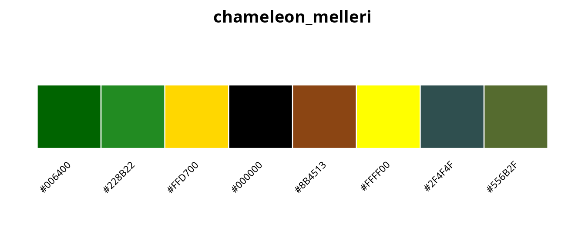

#### Four-horned chameleon (*Trioceros quadricornis*)

Endemic to the montane forests of Cameroon and Nigeria, this species
displays green-yellow base coloration with purple, blue, and orange
accents. The sail-like dorsal crest and multiple horns (up to six in
some individuals) make this among the most dramatic chameleon species
([Gonwouo et al. (2006)](#ref-gonwouo2006)).

``` r

plot_palette("chameleon_quadricornis")
```

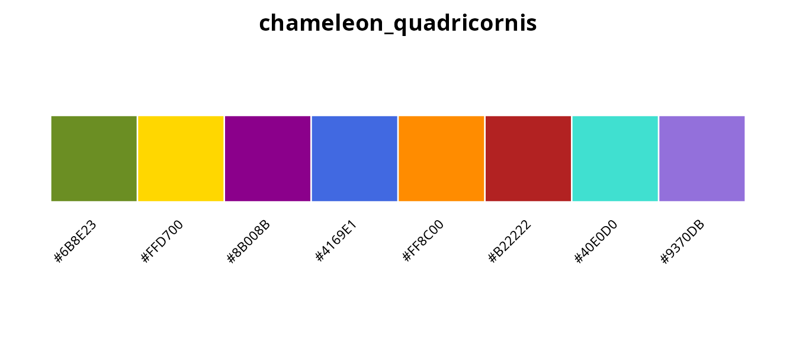

### Giant chameleons (genus *Calumma*)

Madagascar’s genus *Calumma* includes the world’s largest chameleons by
body mass.

#### Parson’s chameleon (*Calumma parsonii*)

The heaviest chameleon species, *C. parsonii* displays
turquoise-blue-green body coloration with striking yellow or orange eye
turrets. Several color variants exist, potentially representing distinct
subspecies ([Jenkins et al. (2011)](#ref-jenkins2011)).

``` r

plot_palette("chameleon_parsonii")
```

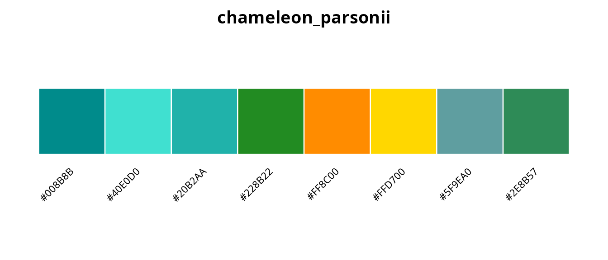

### Leaf chameleons (genera *Brookesia* and *Rhampholeon*)

The smallest chameleons belong to the leaf chameleon genera, with
cryptic coloration adapted for life among leaf litter.

``` r

plot_palette("chameleon_brookesia")
```

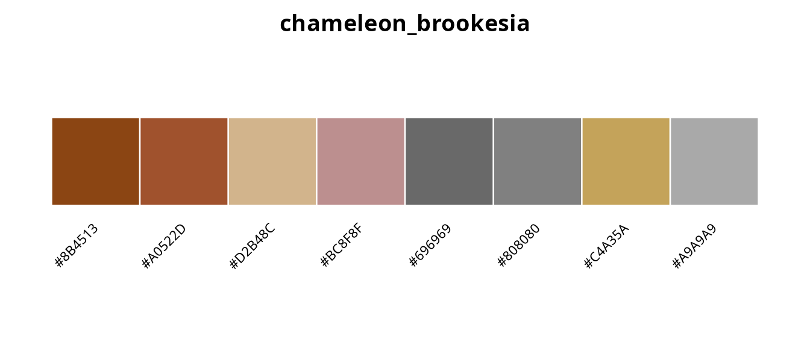

These miniature species display muted browns, tans, and greys that
provide camouflage among dead leaves on the forest floor ([Glaw et
al. (2012)](#ref-glaw2012)).

## Complete chameleon palette inventory

``` r

cham_list <- list_palettes(category = "chameleons")
knitr::kable(cham_list, caption = "All chameleon palettes in koloRo")
```

| palette_name                | category   | n_colors |
|:----------------------------|:-----------|---------:|
| chameleon_chamaeleon        | chameleons |        7 |
| chameleon_calyptratus       | chameleons |        8 |
| chameleon_dilepis           | chameleons |        7 |
| chameleon_senegalensis      | chameleons |        7 |
| chameleon_namaquensis       | chameleons |        8 |
| chameleon_pardalis_ambilobe | chameleons |        8 |
| chameleon_pardalis_nosybe   | chameleons |        8 |
| chameleon_pardalis_tamatave | chameleons |        8 |
| chameleon_lateralis         | chameleons |        8 |
| chameleon_oustaleti         | chameleons |        8 |
| chameleon_labordi           | chameleons |        8 |
| chameleon_campani           | chameleons |        8 |
| chameleon_minor             | chameleons |        8 |
| chameleon_verrucosus        | chameleons |        8 |
| chameleon_jacksonii         | chameleons |        8 |
| chameleon_melleri           | chameleons |        8 |
| chameleon_werneri           | chameleons |        8 |
| chameleon_quadricornis      | chameleons |        8 |
| chameleon_parsonii          | chameleons |        8 |
| chameleon_nasutum           | chameleons |        8 |
| chameleon_fischeri          | chameleons |        8 |
| chameleon_brookesia         | chameleons |        8 |

All chameleon palettes in koloRo {.table}

## Using chameleon palettes with ggplot2

The chameleon palettes work seamlessly with koloRo’s ggplot2
integration:

``` r

library(ggplot2)

# Categorical data with panther chameleon Ambilobe palette
ggplot(iris, aes(Sepal.Length, Sepal.Width, color = Species)) +
  geom_point(size = 3, alpha = 0.8) +
  scale_color_koloro("chameleon_pardalis_ambilobe") +
  labs(
    title = "Iris dataset with panther chameleon (Ambilobe) palette",
    subtitle = "Furcifer pardalis: the most colorful chameleon species"
  ) +
  theme_minimal() +
  theme(legend.position = "bottom")
```

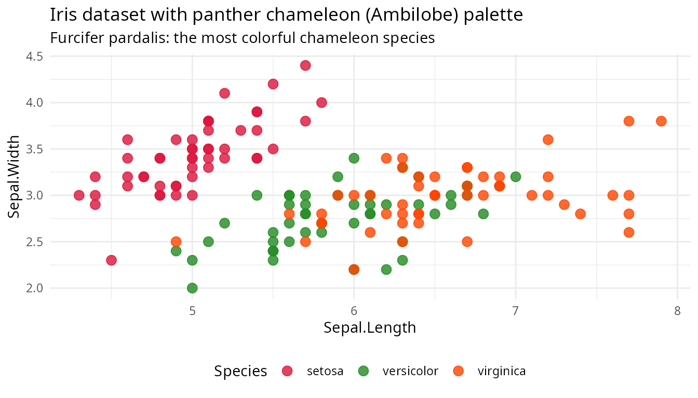

``` r

# Continuous data with Jackson's chameleon palette
ggplot(faithfuld, aes(waiting, eruptions, fill = density)) +
  geom_tile() +
  scale_fill_koloro_c("chameleon_jacksonii") +
  labs(
    title = "Old Faithful eruptions with Jackson's chameleon palette",
    subtitle = "Trioceros jacksonii: the three-horned chameleon of East Africa"
  ) +
  theme_minimal()
```

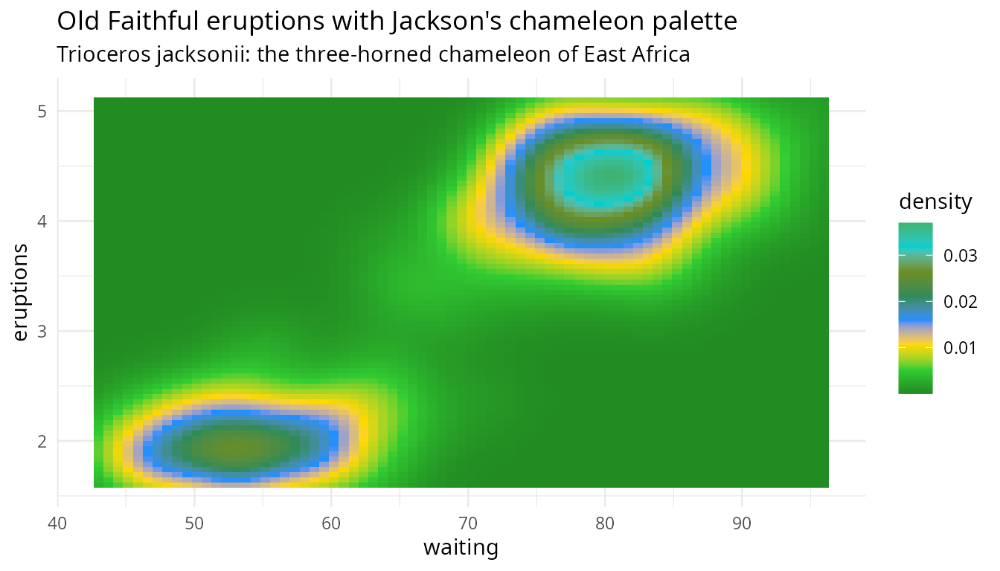

## Conservation note

Many chameleon species face conservation threats from habitat loss and
the international pet trade. Several species included in this palette
collection are listed as Vulnerable or Endangered by the IUCN. koloRo
aims to raise awareness of chameleon diversity while supporting
scientific visualization needs.

## References

Stuart-Fox, D., & Moussalli, A. (2009). Camouflage, communication and
thermoregulation: lessons from colour changing organisms. *Philosophical
Transactions of the Royal Society B*, 364, 463-470.
[doi:10.1098/rstb.2008.0254](https://doi.org/10.1098/rstb.2008.0254)

Teyssier, J., Saenko, S.V., van der Marel, D., & Milinkovitch, M.C.
(2015). Photonic crystals cause active colour change in chameleons.
*Nature Communications*, 6, 6368.
[doi:10.1038/ncomms7368](https://doi.org/10.1038/ncomms7368)

Cuadrado, M., Martin, J., & Lopez, P. (2001). Camouflage and escape
decisions in the common chameleon *Chamaeleo chamaeleon*. *Biological
Journal of the Linnean Society*, 72, 547-554.
[doi:10.1111/j.1095-8312.2001.tb01337.x](https://doi.org/10.1111/j.1095-8312.2001.tb01337.x)

Ferguson, G.W., Brinker, A.M., Gehrmann, W.H., Bucklin, S.E., Baines,
F.M., & Mackin, S.J. (2007). Voluntary exposure of some
western-hemisphere snake and lizard species to ultraviolet-B radiation
in the field. *Applied Herpetology*, 4, 227-244.

Tolley, K., & Burger, M. (2007). *Chameleons of Southern Africa*. Cape
Town: Struik Publishers. ISBN: 978-1-77007-446-0

Burrage, B.R. (1973). Comparative ecology and behaviour of *Chamaeleo
pumilus pumilus* and *C. namaquensis*. *Annals of the South African
Museum*, 61, 1-158.

Grbic, D., Saenko, S.V., Randriamoria, T.M., Debry, A., Raselimanana,
A.P., & Milinkovitch, M.C. (2015). Phylogeography and support vector
machine classification of colour variation in panther chameleons.
*Molecular Ecology*, 24, 3455-3466.
[doi:10.1111/mec.13241](https://doi.org/10.1111/mec.13241)

Brady, L.D., & Griffiths, R.A. (1999). Status assessment of chameleons
in Madagascar. *IUCN Species Survival Commission*. Cambridge: IUCN.

Karsten, K.B., Andriamandimbiarisoa, L.N., Fox, S.F., & Raxworthy, C.J.
(2008). A unique life history among tetrapods: an annual chameleon
living mostly as an egg. *Proceedings of the National Academy of
Sciences*, 105, 8980-8984.
[doi:10.1073/pnas.0802468105](https://doi.org/10.1073/pnas.0802468105)

Raselimanana, A.P., Raxworthy, C.J., & Nussbaum, R.A. (2000). A revision
of the dwarf *Zonosaurus* Boulenger (Reptilia: Squamata: Cordylidae)
from Madagascar, including descriptions of three new species.
*Scientific Papers, Natural History Museum, University of Kansas*, 18,
1-16.

Martin, J. (1992). *Masters of Disguise: A Natural History of
Chameleons*. New York: Facts on File. ISBN: 978-0816024377

Necas, P. (2004). *Chameleons: Nature’s Hidden Jewels* (2nd ed.).
Frankfurt: Edition Chimaira. ISBN: 978-3930612840

Gonwouo, N.L., LeBreton, M., Chirio, L., Ineich, I., Tchamba, N.M.,
Ngassam, P., Dzikouk, G., & Diffo, J.L. (2006). Biodiversity and
conservation of the reptiles of the Mount Cameroon area. *African
Journal of Herpetology*, 55, 79-90.

Jenkins, R.K.B., Rabearivelo, A., Chan, L.M., Andre, J.A.,
Randrianavelona, R., & Randrianantoandro, J.C. (2011). *Calumma
parsonii*. The IUCN Red List of Threatened Species 2011.

Glaw, F., Kohler, J., Townsend, T.M., & Vences, M. (2012). Rivaling the
world’s smallest reptiles: discovery of miniaturized and microendemic
new species of leaf chameleons (Brookesia) from northern Madagascar.
*PLoS ONE*, 7, e31314.
[doi:10.1371/journal.pone.0031314](https://doi.org/10.1371/journal.pone.0031314)

## Session info

``` r

sessionInfo()
#> R version 4.6.0 (2026-04-24)
#> Platform: x86_64-pc-linux-gnu
#> Running under: Ubuntu 24.04.4 LTS
#> 
#> Matrix products: default
#> BLAS:   /usr/lib/x86_64-linux-gnu/openblas-pthread/libblas.so.3 
#> LAPACK: /usr/lib/x86_64-linux-gnu/openblas-pthread/libopenblasp-r0.3.26.so;  LAPACK version 3.12.0
#> 
#> locale:
#>  [1] LC_CTYPE=es_ES.UTF-8       LC_NUMERIC=C              
#>  [3] LC_TIME=es_ES.UTF-8        LC_COLLATE=es_ES.UTF-8    
#>  [5] LC_MONETARY=es_ES.UTF-8    LC_MESSAGES=es_ES.UTF-8   
#>  [7] LC_PAPER=es_ES.UTF-8       LC_NAME=C                 
#>  [9] LC_ADDRESS=C               LC_TELEPHONE=C            
#> [11] LC_MEASUREMENT=es_ES.UTF-8 LC_IDENTIFICATION=C       
#> 
#> time zone: Europe/Madrid
#> tzcode source: system (glibc)
#> 
#> attached base packages:
#> [1] stats     graphics  grDevices utils     datasets  methods   base     
#> 
#> other attached packages:
#> [1] ggplot2_4.0.3 koloRo_0.1.2 
#> 
#> loaded via a namespace (and not attached):
#>  [1] gtable_0.3.6       jsonlite_2.0.0     dplyr_1.2.1        compiler_4.6.0    
#>  [5] tidyselect_1.2.1   jquerylib_0.1.4    systemfonts_1.3.2  scales_1.4.0      
#>  [9] textshaping_1.0.5  yaml_2.3.12        fastmap_1.2.0      R6_2.6.1          
#> [13] labeling_0.4.3     generics_0.1.4     knitr_1.51         htmlwidgets_1.6.4 
#> [17] tibble_3.3.1       desc_1.4.3         bslib_0.10.0       pillar_1.11.1     
#> [21] RColorBrewer_1.1-3 rlang_1.2.0        cachem_1.1.0       xfun_0.57         
#> [25] fs_2.1.0           sass_0.4.10        S7_0.2.2           otel_0.2.0        
#> [29] cli_3.6.6          withr_3.0.2        pkgdown_2.2.0      magrittr_2.0.5    
#> [33] digest_0.6.39      grid_4.6.0         rstudioapi_0.18.0  lifecycle_1.0.5   
#> [37] vctrs_0.7.3        evaluate_1.0.5     glue_1.8.1         farver_2.1.2      
#> [41] ragg_1.5.2         rmarkdown_2.31     tools_4.6.0        pkgconfig_2.0.3   
#> [45] htmltools_0.5.9
```
