# Colorblind-safe palettes: accessibility in data visualization

``` r

library(koloRo)
```

## Understanding color vision deficiency

Color vision deficiency (CVD), commonly called “color blindness,”
affects approximately 8% of males and 0.5% of females of Northern
European descent. Understanding CVD types is essential for creating
accessible visualizations.

### Types of color vision deficiency

| Type | Affected population | Description |
|----|----|----|
| Deuteranomaly | ~6% of males, 0.4% of females | Reduced sensitivity to green light |
| Protanomaly | ~2% of males, 0.01% of females | Reduced sensitivity to red light |
| Tritanomaly | ~0.01% of population | Reduced sensitivity to blue light |
| Achromatopsia | Very rare | Complete color blindness (monochrome) |

The most common forms (deuteranomaly and protanomaly) affect red-green
discrimination, which is why red-green color schemes are particularly
problematic.

## Gold standard palettes

koloRo includes extensively validated colorblind-safe palettes that have
been rigorously tested and are recommended for scientific publications.

### Okabe-Ito palette (2008)

The Okabe-Ito palette is considered the gold standard for
colorblind-safe visualization. It was designed using confusion lines in
color space to maximize distinguishability.

``` r

plot_palette("okabe_ito")
```


**Best for:** General purpose categorical data, up to 8 categories.

**Reference:** [Okabe & Ito (2008)](#ref-okabe2008)

### Wong palette (2011)

Published in *Nature Methods*, the Wong palette is optimized
specifically for deuteranopia and protanopia.

``` r

plot_palette("wong")
```

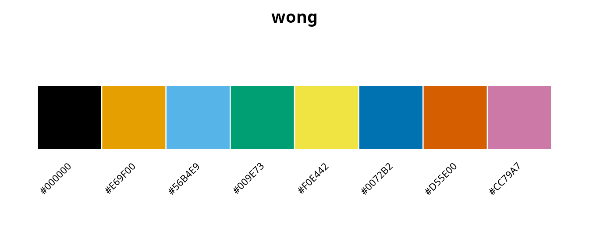

**Best for:** Scientific publications, particularly in biology and
medicine.

**Reference:** [Wong (2011)](#ref-wong2011)

### Paul Tol collection (2021)

Paul Tol developed a comprehensive collection of palettes with
mathematical optimization in CIELAB color space under simulated CVD
conditions.

``` r

tol_palettes <- c(
  "tol_bright",
  "tol_high_contrast",
  "tol_vibrant",
  "tol_muted",
  "tol_light",
  "tol_medium"
)
plot_palette(tol_palettes)
```

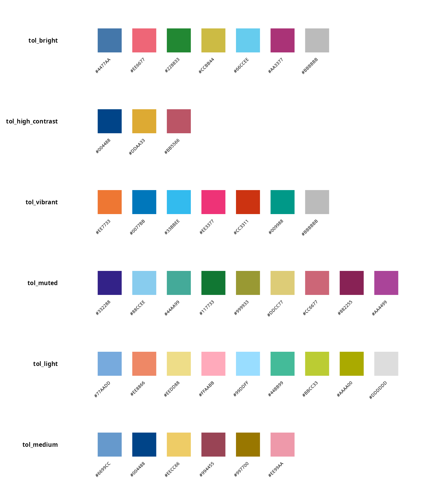

**Palette descriptions:**

The tol_bright palette provides 7 colors as the main qualitative scheme,
while tol_high_contrast offers 3 colors optimized for maximum
grayscale-safe contrast. For alternative bright applications,
tol_vibrant provides 7 colors with a different hue selection. The
tol_muted palette extends to 9 colors with a softer appearance suitable
for larger datasets, whereas tol_light (9 colors) serves specialized
purposes for cell backgrounds and tol_medium (6 colors) works well for
color pairs.

**Reference:** [Tol (2021)](#ref-tol2021)

## IBM and Tableau palettes

Industry-standard colorblind-safe palettes:

``` r

plot_palette(c("ibm_colorblind", "tableau_colorblind10"))
```

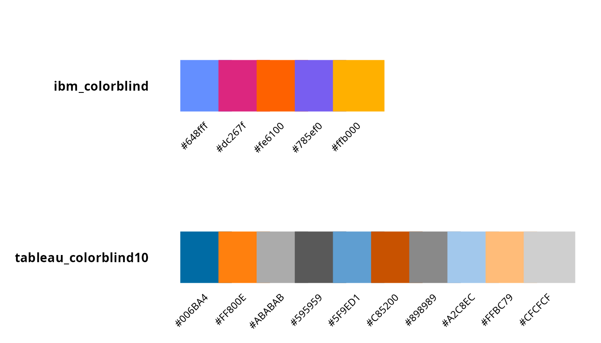

## Color Universal Design (CUD) palettes

The CUD initiative provides carefully selected color pairs and sets:

``` r

# Safe two-color combinations
plot_palette(c("cud_sky_orange", "cud_blue_red", "cud_vermillion_blue"))
```

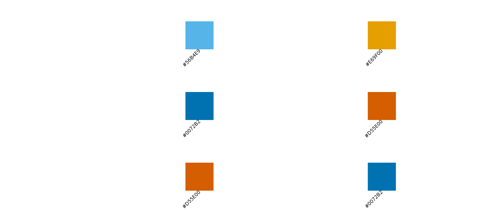

## Type-specific optimized palettes

koloRo includes palettes optimized for specific types of color vision
deficiency:

``` r

plot_palette(c("deuteranopia_safe", "protanopia_safe", "tritanopia_safe"))
```

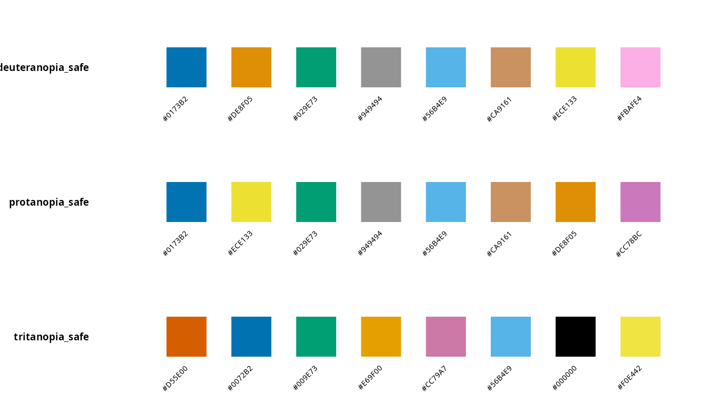

## Safe diverging palettes

Diverging palettes for data with a meaningful midpoint:

``` r

plot_palette(c("safe_diverging_brown_teal", "safe_diverging_purple_green", "safe_diverging_pink_green"))
```

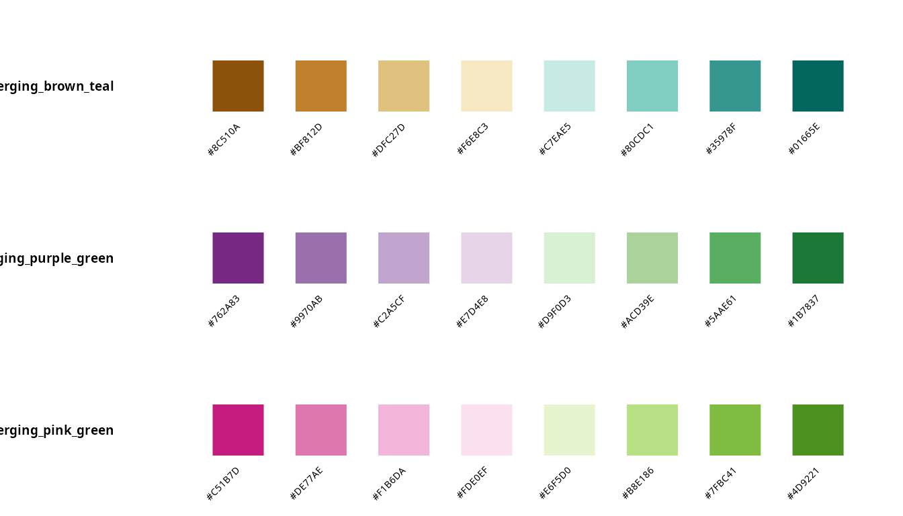

## Complete colorblind palette inventory

``` r

cb_list <- list_palettes(category = "colorblind")
knitr::kable(cb_list[1:20, ], caption = "Colorblind-safe palettes (first 20)")
```

| palette_name            | category   | n_colors |
|:------------------------|:-----------|---------:|
| okabe_ito               | colorblind |        8 |
| okabe_ito_extended      | colorblind |       10 |
| wong                    | colorblind |        8 |
| tol_bright              | colorblind |        7 |
| tol_high_contrast       | colorblind |        3 |
| tol_vibrant             | colorblind |        7 |
| tol_muted               | colorblind |        9 |
| tol_light               | colorblind |        9 |
| tol_medium              | colorblind |        6 |
| tol_pale                | colorblind |        6 |
| tol_dark                | colorblind |        6 |
| ibm_colorblind          | colorblind |        5 |
| ibm_colorblind_extended | colorblind |        7 |
| tableau_colorblind10    | colorblind |       10 |
| cud_sky_orange          | colorblind |        2 |
| cud_blue_red            | colorblind |        2 |
| cud_vermillion_blue     | colorblind |        2 |
| cud_bluish_green_red    | colorblind |        2 |
| safe_qualitative_4      | colorblind |        4 |
| safe_qualitative_5      | colorblind |        5 |

Colorblind-safe palettes (first 20) {.table}

## Best practices for accessible visualizations

### 1. Start with validated palettes

Always begin with one of the gold standard palettes (Okabe-Ito, Wong, or
Paul Tol):

``` r

# Recommended starting points
recommended <- c("okabe_ito", "wong", "tol_bright")
plot_palette(recommended)
```

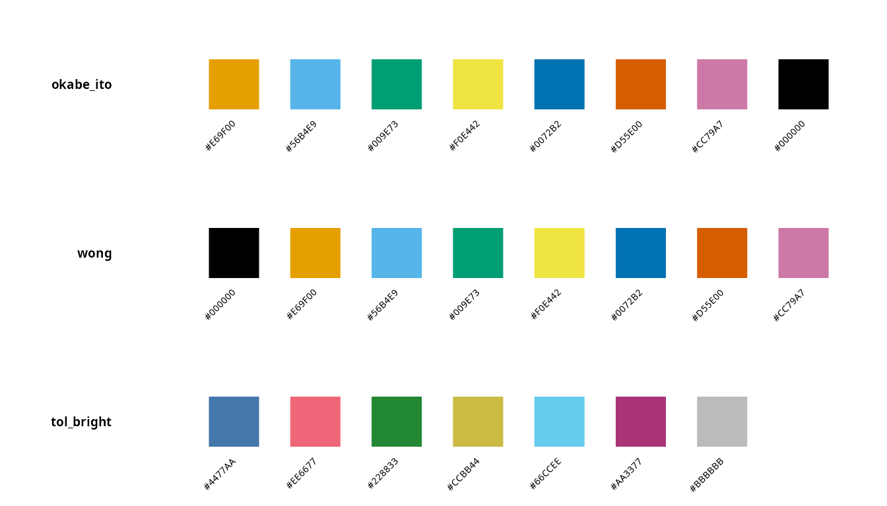

### 2. Limit the number of colors

Even with colorblind-safe palettes, too many colors reduce
distinguishability. The optimal range is 5-7 distinct colors for most
visualizations, with a maximum of 10-12 colors used with caution. When
additional categories are needed beyond this limit, consider using
shapes or patterns rather than introducing more colors.

### 3. Use luminance contrast

Ensure colors have different brightness levels, not just different hues:

``` r

# Paul Tol's high contrast palette
# Specifically designed for grayscale conversion
plot_palette("tol_high_contrast")
```

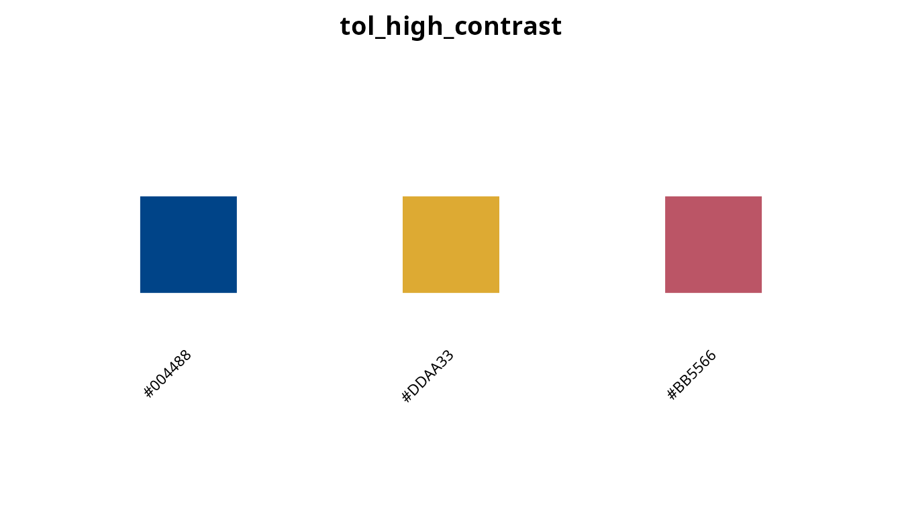

### 4. Avoid problematic color pairs

Never rely solely on problematic color combinations such as red versus
green, blue versus purple, or green versus brown. These pairs are
difficult or impossible to distinguish for individuals with common forms
of color vision deficiency.

``` r

# Safe two-color combinations
safe_pairs <- c("cud_sky_orange", "cud_blue_red")
plot_palette(safe_pairs)
```

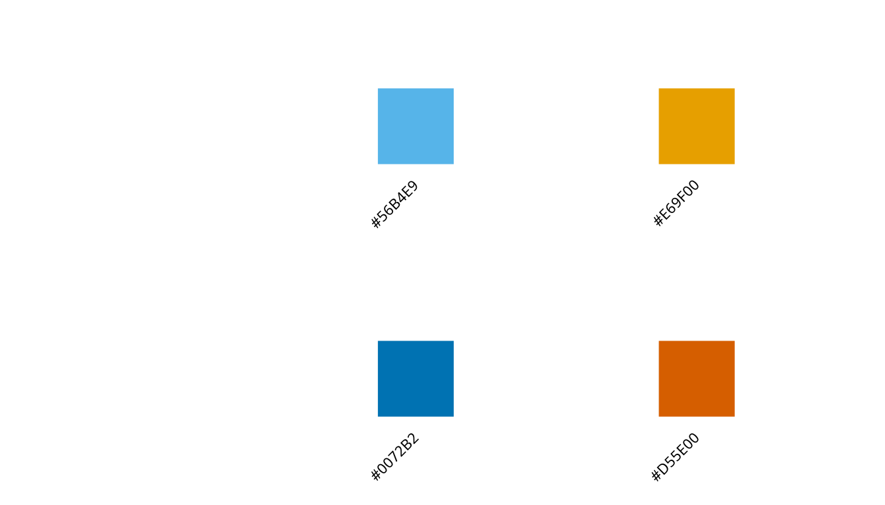

### 5. Test your visualizations

Use colorblind simulators to verify your visualizations:

``` r

# Using the colorspace package
library(colorspace)
cols <- palettes(palette = "okabe_ito")

# Simulate different types of CVD
deutan <- deutan(cols)  # Deuteranopia
protan <- protan(cols)  # Protanopia
tritan <- tritan(cols)  # Tritanopia
```

## Choosing the right palette

### For categorical data (qualitative)

``` r

# Up to 5 categories
plot_palette("tol_high_contrast")  # Maximum contrast
```


``` r


# Up to 8 categories
plot_palette("okabe_ito")  # Gold standard
```

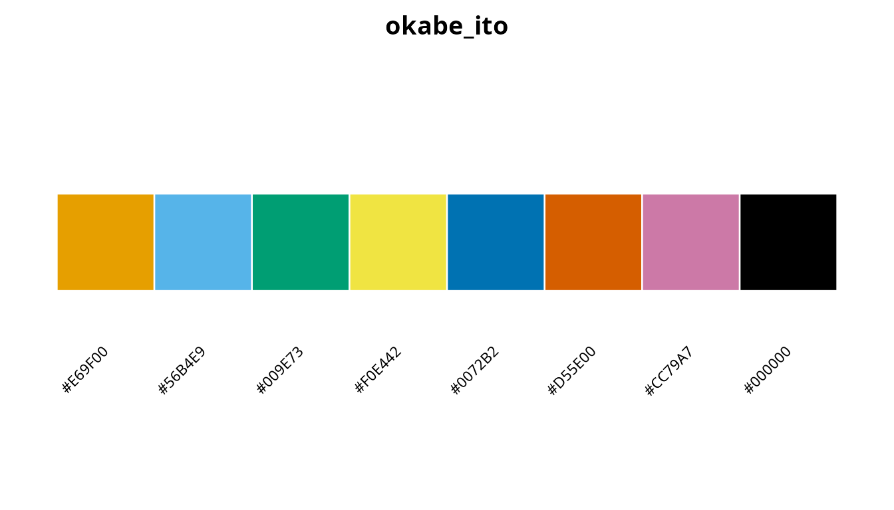

``` r


# Up to 9 categories
plot_palette("tol_muted")  # More colors
```

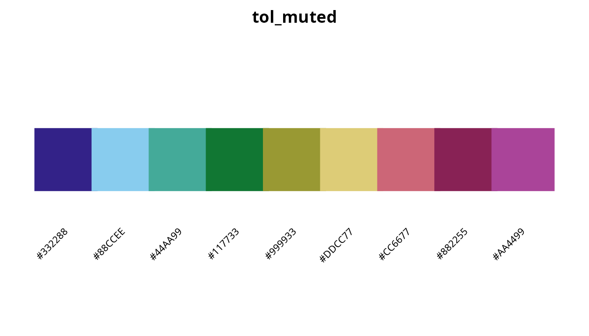

### For sequential data

Use perceptually uniform palettes that work in grayscale:

``` r

plot_palette("cividis")  # Specifically optimized for deuteranopia
```


### For diverging data

``` r

plot_palette("safe_diverging_brown_teal")
```

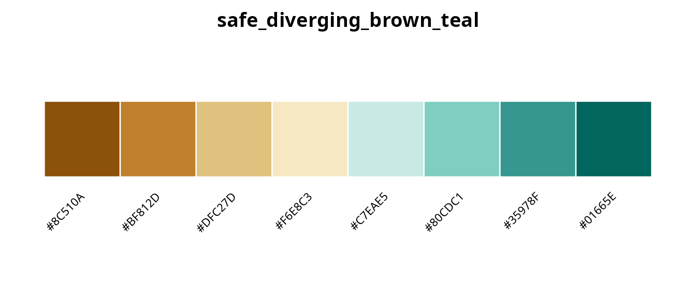

## Using colorblind-safe palettes with ggplot2

``` r

library(ggplot2)

# Discrete scale
ggplot(mtcars, aes(x = wt, y = mpg, color = factor(cyl))) +
  geom_point(size = 3) +
  scale_color_koloro("okabe_ito") +
  theme_minimal()

# Continuous scale (colorblind-optimized)
ggplot(mtcars, aes(x = wt, y = mpg, color = hp)) +
  geom_point(size = 3) +
  scale_color_koloro_c("cividis") +
  theme_minimal()
```

## Summary recommendations

| Situation                        | Recommended palette         |
|----------------------------------|-----------------------------|
| General purpose (≤8 categories)  | `okabe_ito` or `wong`       |
| Scientific publication           | `okabe_ito` or `tol_bright` |
| Maximum contrast (≤3 categories) | `tol_high_contrast`         |
| Many categories (≤9)             | `tol_muted`                 |
| Sequential data                  | `cividis` or `viridis`      |
| Diverging data                   | `safe_diverging_brown_teal` |
| Traffic light alternative        | `traffic_safe`              |

## References

Okabe, M., & Ito, K. (2008). Color Universal Design (CUD): How to make
figures and presentations that are friendly to colorblind people.
*J*Fly\*. <https://jfly.uni-koeln.de/color/>

Wong, B. (2011). Points of view: Color blindness. *Nature Methods*,
8(6), 441. [doi:10.1038/nmeth.1618](https://doi.org/10.1038/nmeth.1618)

Tol, P. (2021). Colour schemes. SRON Technical Note SRON/EPS/TN/09-002.
<https://personal.sron.nl/~pault/>

Crameri, F., Shephard, G.E., & Heron, P.J. (2020). The misuse of colour
in science communication. *Nature Communications*, 11, 5444.
[doi:10.1038/s41467-020-19160-7](https://doi.org/10.1038/s41467-020-19160-7)

Brewer, C.A. (2013). ColorBrewer 2.0: Color advice for cartography.
<https://colorbrewer2.org/>

Nuñez, J.R., Anderton, C.R., & Renslow, R.S. (2018). Optimizing
colormaps with consideration for color vision deficiency. *PLOS ONE*,
13(7), e0199239.
[doi:10.1371/journal.pone.0199239](https://doi.org/10.1371/journal.pone.0199239)

## Session info

``` r

sessionInfo()
#> R version 4.6.0 (2026-04-24)
#> Platform: x86_64-pc-linux-gnu
#> Running under: Ubuntu 24.04.4 LTS
#> 
#> Matrix products: default
#> BLAS:   /usr/lib/x86_64-linux-gnu/openblas-pthread/libblas.so.3 
#> LAPACK: /usr/lib/x86_64-linux-gnu/openblas-pthread/libopenblasp-r0.3.26.so;  LAPACK version 3.12.0
#> 
#> locale:
#>  [1] LC_CTYPE=es_ES.UTF-8       LC_NUMERIC=C              
#>  [3] LC_TIME=es_ES.UTF-8        LC_COLLATE=es_ES.UTF-8    
#>  [5] LC_MONETARY=es_ES.UTF-8    LC_MESSAGES=es_ES.UTF-8   
#>  [7] LC_PAPER=es_ES.UTF-8       LC_NAME=C                 
#>  [9] LC_ADDRESS=C               LC_TELEPHONE=C            
#> [11] LC_MEASUREMENT=es_ES.UTF-8 LC_IDENTIFICATION=C       
#> 
#> time zone: Europe/Madrid
#> tzcode source: system (glibc)
#> 
#> attached base packages:
#> [1] stats     graphics  grDevices utils     datasets  methods   base     
#> 
#> other attached packages:
#> [1] koloRo_0.1.2
#> 
#> loaded via a namespace (and not attached):
#>  [1] digest_0.6.39     desc_1.4.3        R6_2.6.1          fastmap_1.2.0    
#>  [5] xfun_0.57         cachem_1.1.0      knitr_1.51        htmltools_0.5.9  
#>  [9] rmarkdown_2.31    lifecycle_1.0.5   cli_3.6.6         sass_0.4.10      
#> [13] pkgdown_2.2.0     textshaping_1.0.5 jquerylib_0.1.4   systemfonts_1.3.2
#> [17] compiler_4.6.0    rstudioapi_0.18.0 tools_4.6.0       ragg_1.5.2       
#> [21] bslib_0.10.0      evaluate_1.0.5    yaml_2.3.12       otel_0.2.0       
#> [25] jsonlite_2.0.0    htmlwidgets_1.6.4 rlang_1.2.0       fs_2.1.0
```
