# Using koloRo palettes with ggplot2

``` r

library(koloRo)
```

## Overview

koloRo provides seamless integration with ggplot2 through dedicated
scale functions. These functions allow you to use any of the 250+ koloRo
palettes directly in your ggplot2 visualizations.

## Scale functions

koloRo provides the following ggplot2 scale functions:

| Function | Type | Use case |
|----|----|----|
| [`scale_color_koloro()`](https://robustecologies.github.io/koloRo/reference/scale_color_koloro.md) | Discrete | Categorical data (points, lines) |
| [`scale_fill_koloro()`](https://robustecologies.github.io/koloRo/reference/scale_fill_koloro.md) | Discrete | Categorical data (bars, areas) |
| [`scale_color_koloro_c()`](https://robustecologies.github.io/koloRo/reference/scale_color_koloro_c.md) | Continuous | Numeric data (gradients) |
| [`scale_fill_koloro_c()`](https://robustecologies.github.io/koloRo/reference/scale_fill_koloro_c.md) | Continuous | Numeric data (heatmaps) |
| [`scale_color_koloro_div()`](https://robustecologies.github.io/koloRo/reference/scale_color_koloro_div.md) | Diverging | Data with meaningful midpoint |
| [`scale_fill_koloro_div()`](https://robustecologies.github.io/koloRo/reference/scale_fill_koloro_div.md) | Diverging | Data with meaningful midpoint |
| [`scale_color_koloro_binned()`](https://robustecologies.github.io/koloRo/reference/scale_color_koloro_binned.md) | Binned | Stepped color gradients |
| [`scale_fill_koloro_binned()`](https://robustecologies.github.io/koloRo/reference/scale_fill_koloro_binned.md) | Binned | Stepped color gradients |

**Note:** British spelling alternatives (`scale_colour_*`) are also
available.

## Discrete scales

### Basic usage

``` r

library(ggplot2)

# Default: uses Okabe-Ito colorblind-safe palette
ggplot(mtcars, aes(x = wt, y = mpg, color = factor(cyl))) +
  geom_point(size = 3) +
  scale_color_koloro() +
  labs(title = "Default discrete scale (Okabe-Ito)")
```

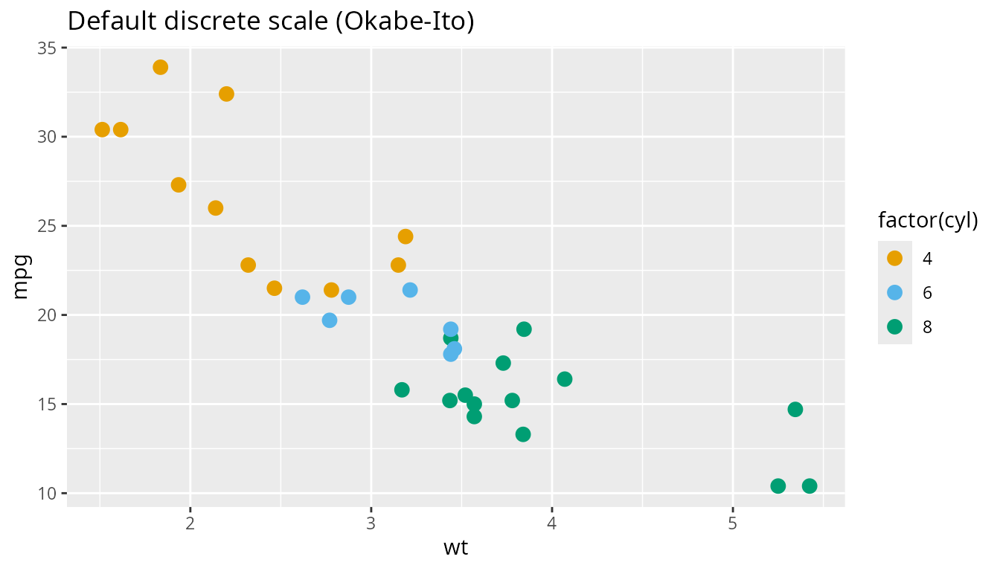

### Specifying a palette

``` r

# Use Paul Tol bright palette
ggplot(mtcars, aes(x = wt, y = mpg, color = factor(cyl))) +
  geom_point(size = 3) +
  scale_color_koloro("tol_bright") +
  labs(title = "Tol bright palette")
```

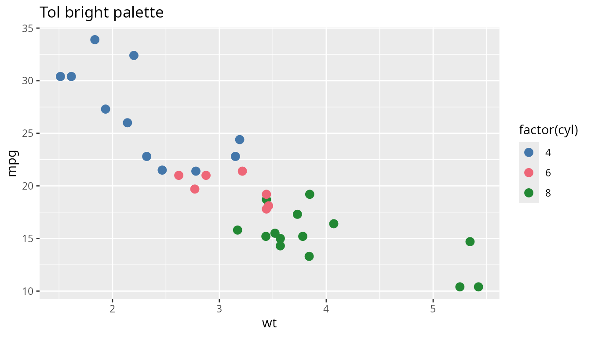

``` r


# Use Alhambra palette
ggplot(mtcars, aes(x = wt, y = mpg, color = factor(cyl))) +
  geom_point(size = 3) +
  scale_color_koloro("alhambra_nazari") +
  labs(title = "Alhambra Nazari palette")
```

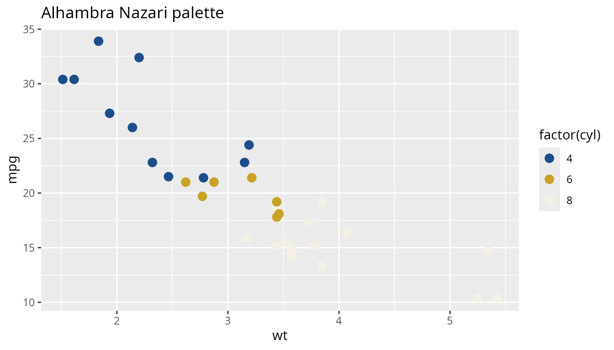

### Fill scales for bar charts

``` r

ggplot(mtcars, aes(x = factor(cyl), fill = factor(cyl))) +
  geom_bar() +
  scale_fill_koloro("wong") +
  labs(title = "Bar chart with Wong palette")
```

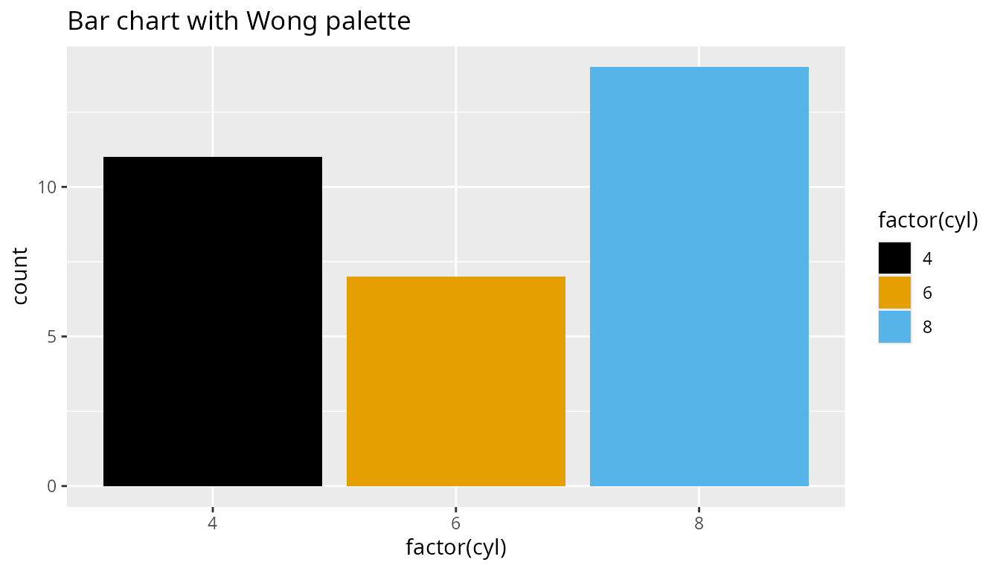

### Reversing color order

``` r

# Reverse the palette direction
ggplot(mtcars, aes(x = wt, y = mpg, color = factor(cyl))) +
  geom_point(size = 3) +
  scale_color_koloro("viridis", direction = -1) +
  labs(title = "Reversed color order")
```

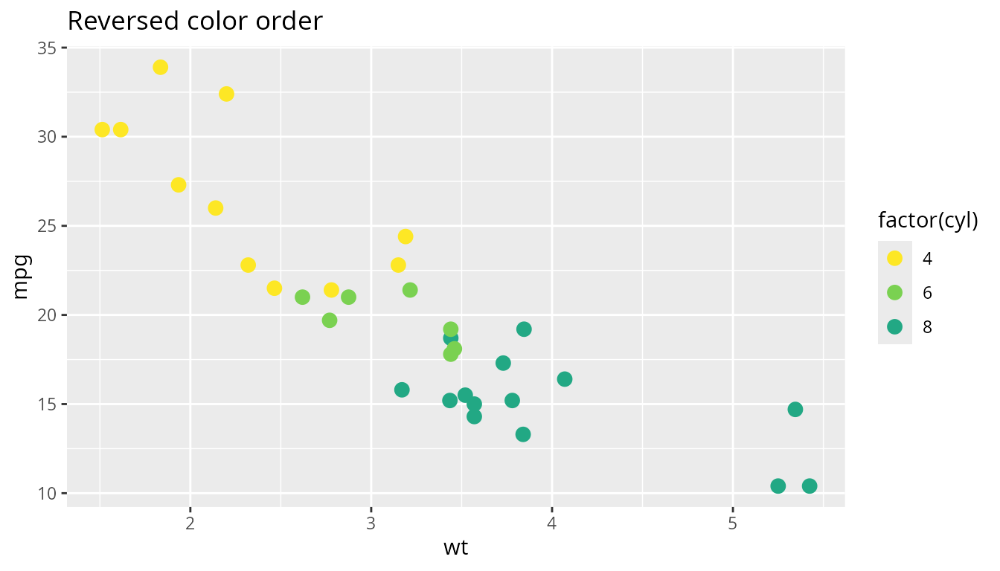

## Continuous scales

### Basic continuous gradient

``` r

# Using viridis (default)
ggplot(mtcars, aes(x = wt, y = mpg, color = hp)) +
  geom_point(size = 3) +
  scale_color_koloro_c() +
  labs(title = "Continuous scale (Viridis)")
```

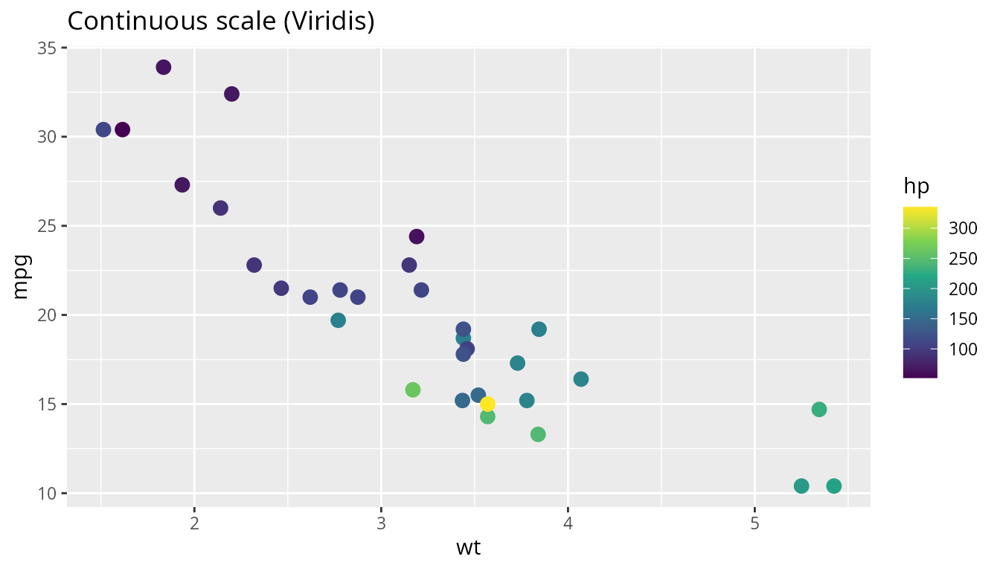

``` r


# Using plasma
ggplot(mtcars, aes(x = wt, y = mpg, color = hp)) +
  geom_point(size = 3) +
  scale_color_koloro_c("plasma") +
  labs(title = "Continuous scale (Plasma)")
```

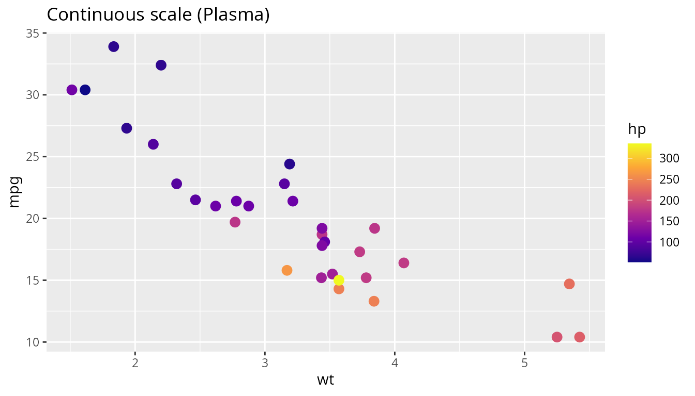

### Heatmaps with continuous fill

``` r

# Heatmap with batlow palette
ggplot(faithfuld, aes(waiting, eruptions, fill = density)) +
  geom_tile() +
  scale_fill_koloro_c("batlow") +
  labs(title = "Heatmap with Batlow palette")
```

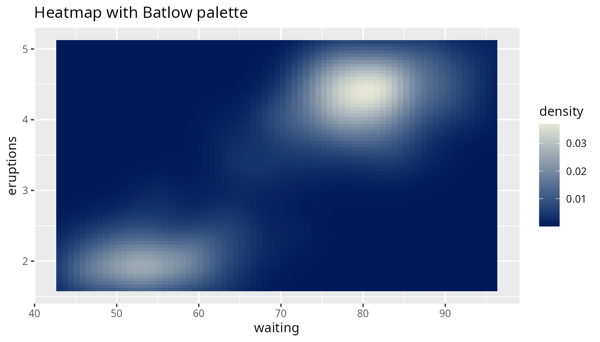

``` r


# Heatmap with magma
ggplot(faithfuld, aes(waiting, eruptions, fill = density)) +
  geom_tile() +
  scale_fill_koloro_c("magma") +
  labs(title = "Heatmap with Magma palette")
```

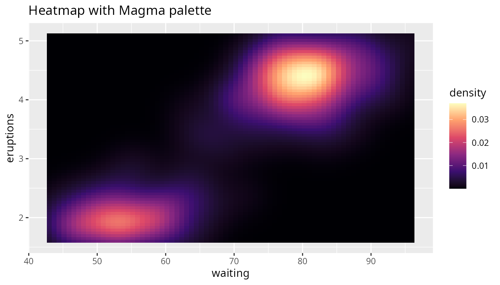

## Diverging scales

Diverging scales are ideal for data with a meaningful midpoint (e.g.,
zero, average, threshold).

### Basic diverging scale

``` r

# Create sample data with positive and negative values
set.seed(42)
df <- data.frame(
  x = 1:100,
  y = rnorm(100)
)

# Default diverging scale (vik palette, midpoint = 0)
ggplot(df, aes(x, y, color = y)) +
  geom_point(size = 3) +
  scale_color_koloro_div() +
  labs(title = "Diverging scale (Vik palette)")
```

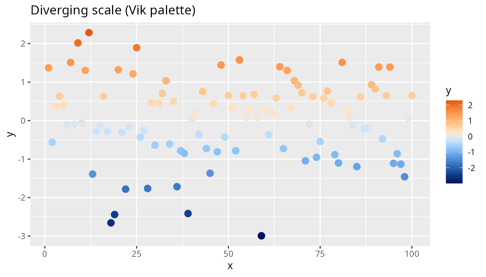

### Custom midpoint

``` r

# Diverging around the mean
df$value <- df$y + 5  # Shift values

ggplot(df, aes(x, value, color = value)) +
  geom_point(size = 3) +
  scale_color_koloro_div("brown_blue_green", midpoint = 5) +
  labs(title = "Diverging scale with custom midpoint")
```

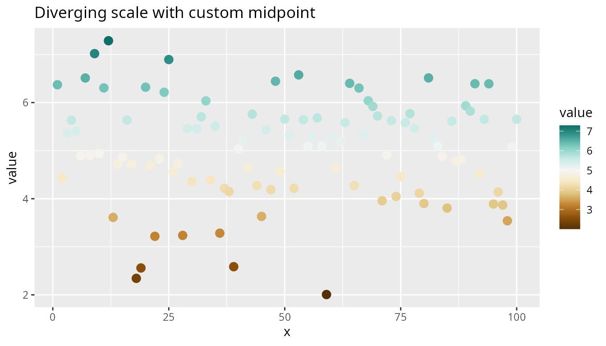

### Correlation matrix example

``` r

# Correlation matrix
cor_matrix <- cor(mtcars)
cor_df <- as.data.frame(as.table(cor_matrix))
names(cor_df) <- c("Var1", "Var2", "value")

ggplot(cor_df, aes(Var1, Var2, fill = value)) +
  geom_tile() +
  scale_fill_koloro_div("vik", midpoint = 0) +
  theme(axis.text.x = element_text(angle = 45, hjust = 1)) +
  labs(title = "Correlation matrix with Vik palette")
```

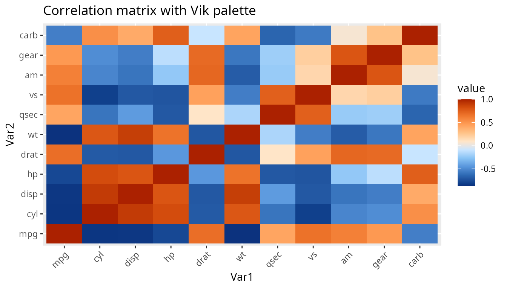

## Binned scales

Binned scales create stepped color gradients, useful when you want
discrete color breaks in continuous data.

``` r

# Binned color scale
ggplot(mtcars, aes(x = wt, y = mpg, color = hp)) +
  geom_point(size = 3) +
  scale_color_koloro_binned("viridis", n_bins = 6) +
  labs(title = "Binned scale (6 bins)")
```

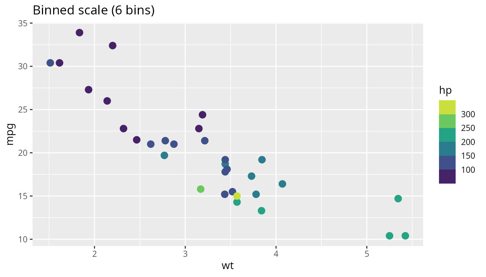

``` r


# More bins
ggplot(mtcars, aes(x = wt, y = mpg, color = hp)) +
  geom_point(size = 3) +
  scale_color_koloro_binned("plasma", n_bins = 10) +
  labs(title = "Binned scale (10 bins)")
```

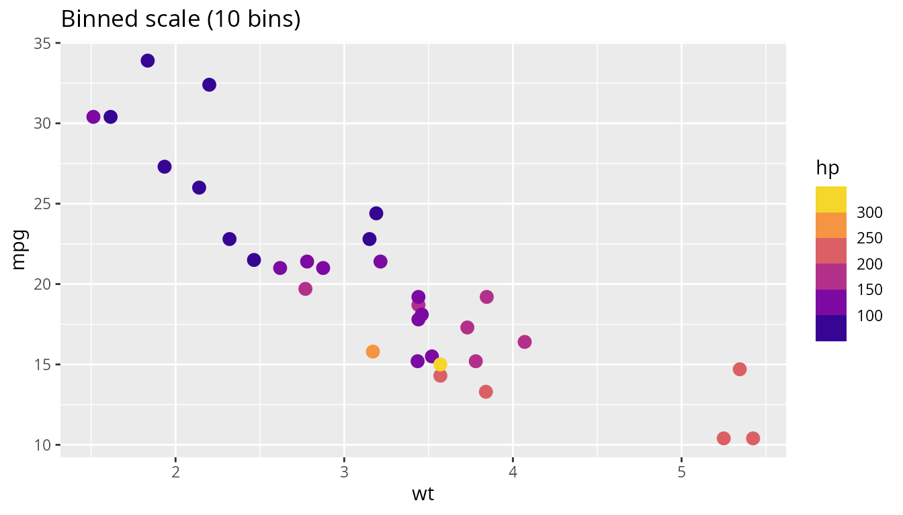

## Recommended palettes by plot type

### Scatter plots (categorical)

``` r

# Recommended: okabe_ito, wong, tol_bright
ggplot(iris, aes(Sepal.Length, Sepal.Width, color = Species)) +
  geom_point(size = 3) +
  scale_color_koloro("okabe_ito")
```

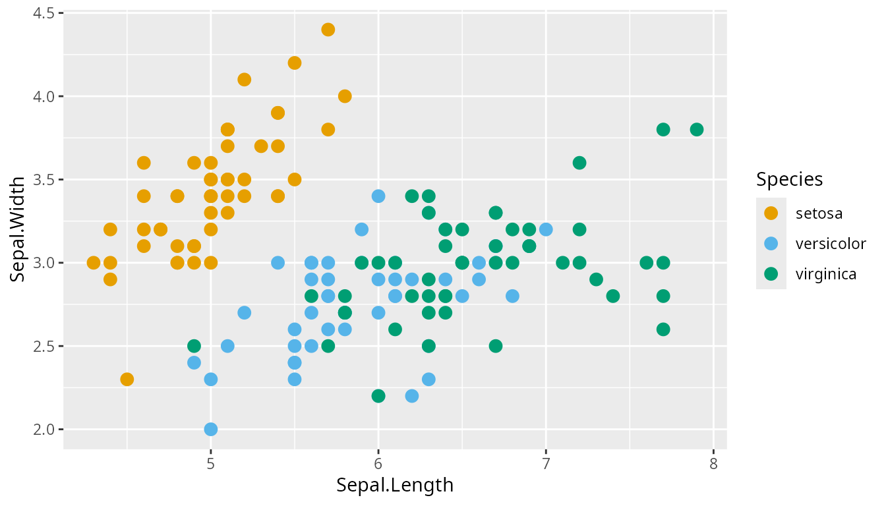

### Line charts

``` r

# Recommended: tol_bright, tol_muted for many lines
library(tidyr)

economics_long <- economics %>%
  pivot_longer(cols = c(pce, pop, psavert, uempmed, unemploy),
               names_to = "variable", values_to = "value")

ggplot(economics_long, aes(date, value, color = variable)) +
  geom_line() +
  scale_color_koloro("tol_muted") +
  facet_wrap(~variable, scales = "free_y")
```

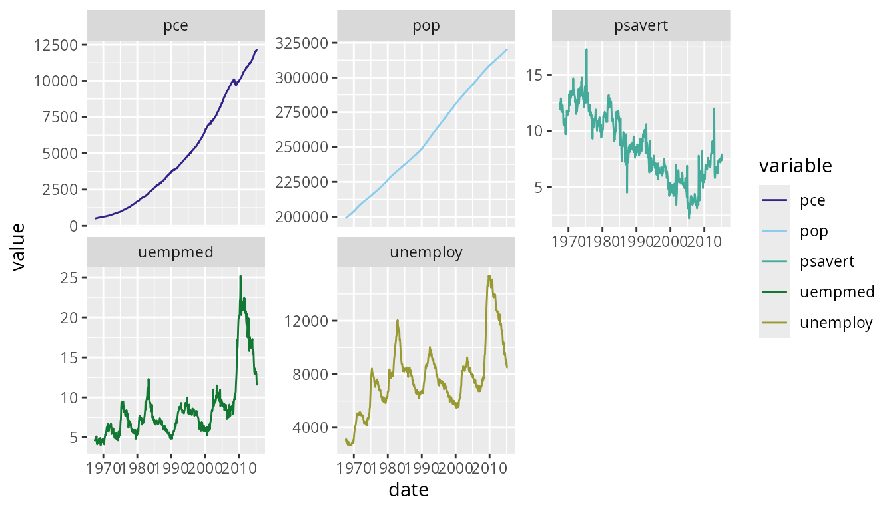

### Bar charts

``` r

# Recommended: set2_8, tol_light for light backgrounds
ggplot(mpg, aes(class, fill = class)) +
  geom_bar() +
  scale_fill_koloro("set2_8") +
  theme(axis.text.x = element_text(angle = 45, hjust = 1))
```

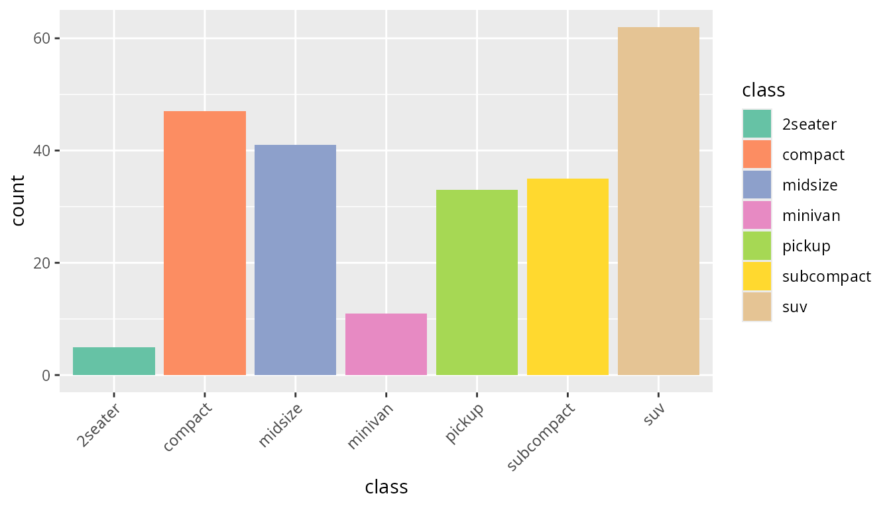

### Heatmaps

``` r

# Recommended sequential: viridis, magma, batlow
# Recommended diverging: vik, brown_blue_green
ggplot(faithfuld, aes(waiting, eruptions, fill = density)) +
  geom_tile() +
  scale_fill_koloro_c("magma")
```

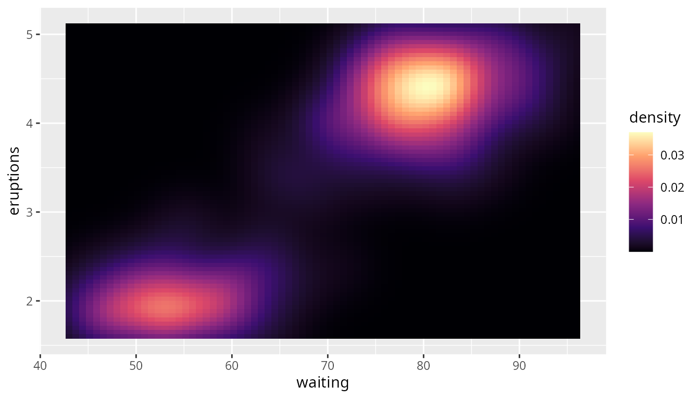

### Maps

``` r

# For choropleth maps with sequential data
# Recommended: viridis, batlow, plasma

# For maps with diverging data
# Recommended: vik, brown_blue_green
```

## Working with themes

koloRo scales work well with any ggplot2 theme:

``` r

p <- ggplot(mtcars, aes(x = wt, y = mpg, color = factor(cyl))) +
  geom_point(size = 3) +
  scale_color_koloro("tol_bright")

# With different themes
p + theme_minimal() + labs(title = "Minimal theme")
```

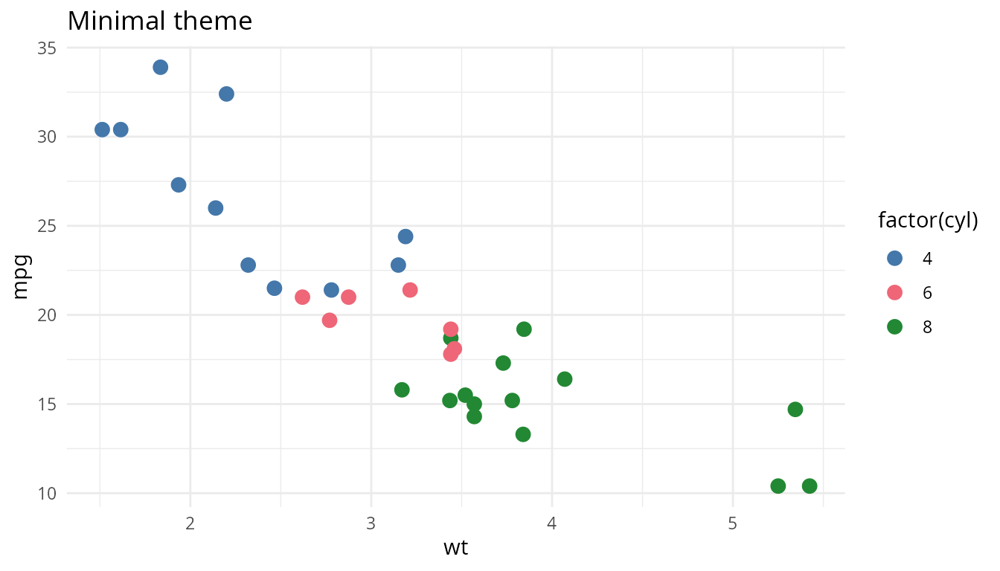

``` r

p + theme_classic() + labs(title = "Classic theme")
```

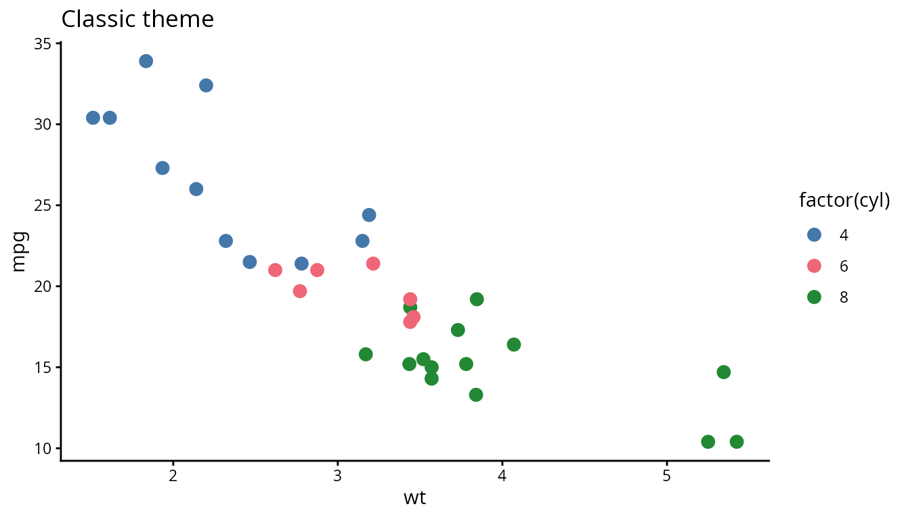

``` r

p + theme_dark() + labs(title = "Dark theme")
```

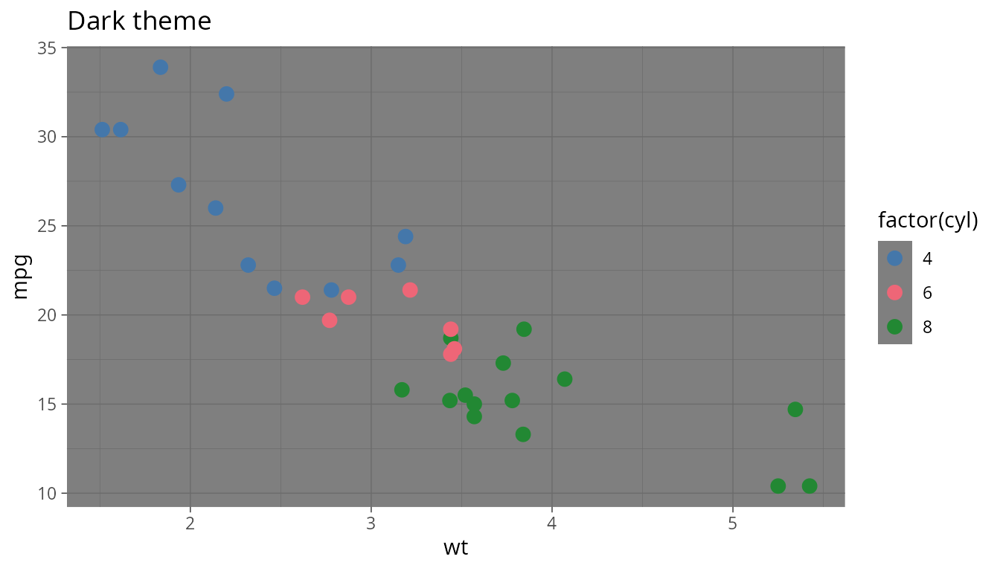

## Combining with manual values

You can use koloRo to get colors and then apply them manually:

``` r

# Get specific colors from a palette
my_colors <- palettes(palette = "okabe_ito")[1:3]

ggplot(mtcars, aes(x = wt, y = mpg, color = factor(cyl))) +
  geom_point(size = 3) +
  scale_color_manual(values = my_colors) +
  labs(title = "Manual color values from koloRo")
```

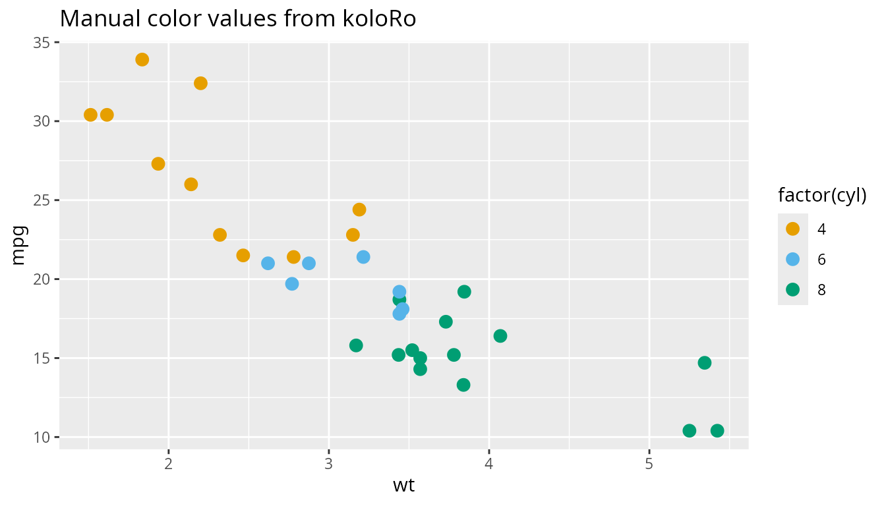

## Creating custom palettes

You can also create custom palettes using koloRo’s color manipulation
functions:

``` r

# Create a custom gradient from two Alhambra colors
base_colors <- palettes(palette = "alhambra_nazari")[c(1, 4)]  # Blue and green
custom_gradient <- interpolate_palette(base_colors, n = 5)

ggplot(mtcars, aes(x = factor(cyl), y = mpg, fill = factor(cyl))) +
  geom_boxplot() +
  scale_fill_manual(values = custom_gradient[c(1, 3, 5)]) +
  labs(title = "Custom gradient from Alhambra colors")
```

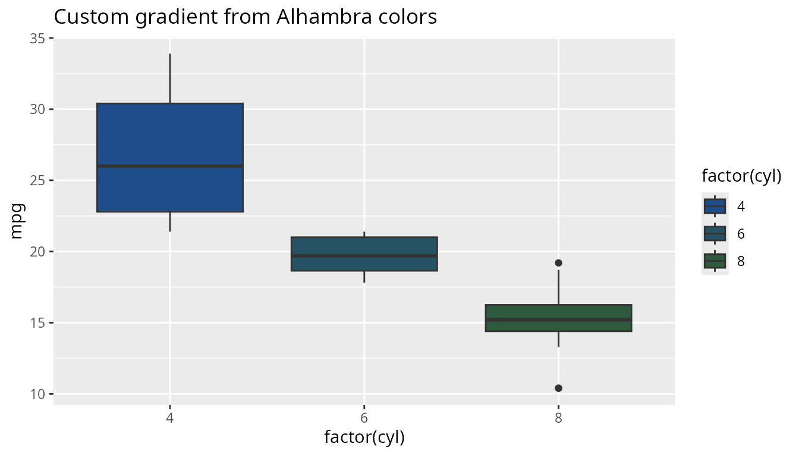

## Complete example

``` r

library(ggplot2)

# Comprehensive example combining multiple elements
p1 <- ggplot(mtcars, aes(x = wt, y = mpg)) +
  geom_point(aes(color = hp, size = disp), alpha = 0.8) +
  scale_color_koloro_c("plasma") +
  labs(
    title = "Vehicle fuel efficiency",
    subtitle = "Using koloRo plasma palette",
    x = "Weight (1000 lbs)",
    y = "Miles per gallon",
    color = "Horsepower",
    size = "Displacement"
  ) +
  theme_minimal()

print(p1)
```

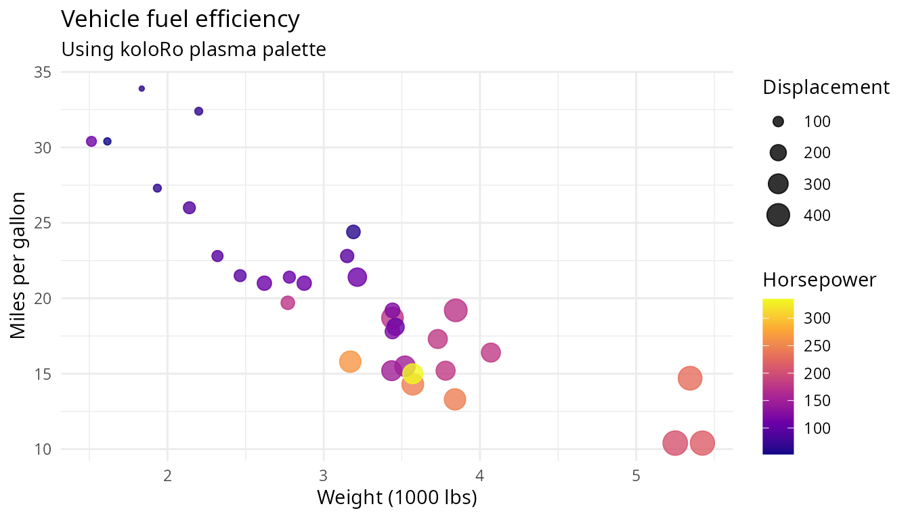

``` r


# Faceted plot with categorical colors
p2 <- ggplot(mtcars, aes(x = wt, y = mpg, color = factor(gear))) +
  geom_point(size = 3) +
  facet_wrap(~cyl, labeller = label_both) +
  scale_color_koloro("tol_bright") +
  labs(
    title = "Fuel efficiency by cylinder count",
    color = "Gears"
  ) +
  theme_minimal()

print(p2)
```

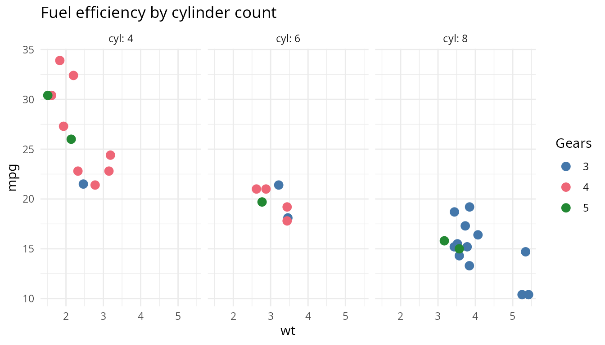

## Troubleshooting

### Palette has fewer colors than categories

koloRo will automatically recycle colors and issue a warning:

``` r

# tol_high_contrast only has 3 colors
# Using it with 4+ categories will recycle
ggplot(mtcars, aes(x = wt, y = mpg, color = factor(gear))) +
  geom_point(size = 3) +
  scale_color_koloro("tol_high_contrast")  # Warning issued
```

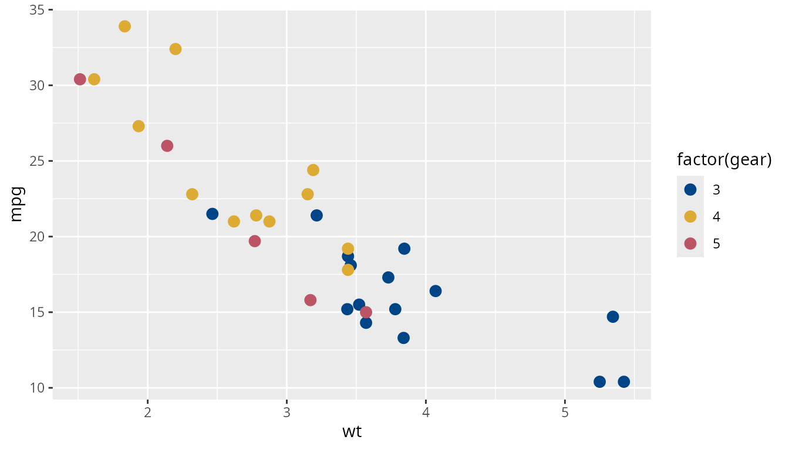

**Solution:** Use a palette with more colors, like `tol_muted` (9
colors) or `okabe_ito` (8 colors).

### Colors don’t appear

Make sure ggplot2 is loaded and you’re using the correct aesthetic:

``` r

# color for points/lines
aes(color = variable)
#> Aesthetic mapping: 
#> * `colour` -> `variable`
scale_color_koloro()
#> <ggproto object: Class ScaleDiscrete, Scale, gg>
#>     aesthetics: colour
#>     axis_order: function
#>     break_info: function
#>     break_positions: function
#>     breaks: waiver
#>     call: call
#>     clone: function
#>     dimension: function
#>     drop: TRUE
#>     expand: waiver
#>     fallback_palette: function
#>     get_breaks: function
#>     get_breaks_minor: function
#>     get_labels: function
#>     get_limits: function
#>     get_transformation: function
#>     guide: legend
#>     is_discrete: function
#>     is_empty: function
#>     labels: waiver
#>     limits: NULL
#>     make_sec_title: function
#>     make_title: function
#>     map: function
#>     map_df: function
#>     minor_breaks: waiver
#>     n.breaks.cache: NULL
#>     na.translate: TRUE
#>     na.value: NA
#>     name: waiver
#>     palette: function
#>     palette.cache: NULL
#>     position: left
#>     range: environment
#>     rescale: function
#>     reset: function
#>     train: function
#>     train_df: function
#>     transform: function
#>     transform_df: function
#>     super:  <ggproto object: Class ScaleDiscrete, Scale, gg>

# fill for bars/areas
aes(fill = variable)
#> Aesthetic mapping: 
#> * `fill` -> `variable`
scale_fill_koloro()
#> <ggproto object: Class ScaleDiscrete, Scale, gg>
#>     aesthetics: fill
#>     axis_order: function
#>     break_info: function
#>     break_positions: function
#>     breaks: waiver
#>     call: call
#>     clone: function
#>     dimension: function
#>     drop: TRUE
#>     expand: waiver
#>     fallback_palette: function
#>     get_breaks: function
#>     get_breaks_minor: function
#>     get_labels: function
#>     get_limits: function
#>     get_transformation: function
#>     guide: legend
#>     is_discrete: function
#>     is_empty: function
#>     labels: waiver
#>     limits: NULL
#>     make_sec_title: function
#>     make_title: function
#>     map: function
#>     map_df: function
#>     minor_breaks: waiver
#>     n.breaks.cache: NULL
#>     na.translate: TRUE
#>     na.value: NA
#>     name: waiver
#>     palette: function
#>     palette.cache: NULL
#>     position: left
#>     range: environment
#>     rescale: function
#>     reset: function
#>     train: function
#>     train_df: function
#>     transform: function
#>     transform_df: function
#>     super:  <ggproto object: Class ScaleDiscrete, Scale, gg>
```

## Summary

| Data type | Scale function | Recommended palettes |
|----|----|----|
| Categorical (≤8) | [`scale_color_koloro()`](https://robustecologies.github.io/koloRo/reference/scale_color_koloro.md) | okabe_ito, wong, tol_bright |
| Categorical (\>8) | [`scale_color_koloro()`](https://robustecologies.github.io/koloRo/reference/scale_color_koloro.md) | tol_muted, set2_8, kelly_colors |
| Sequential | [`scale_color_koloro_c()`](https://robustecologies.github.io/koloRo/reference/scale_color_koloro_c.md) | viridis, plasma, batlow |
| Diverging | [`scale_color_koloro_div()`](https://robustecologies.github.io/koloRo/reference/scale_color_koloro_div.md) | vik, brown_blue_green |
| Binned | [`scale_color_koloro_binned()`](https://robustecologies.github.io/koloRo/reference/scale_color_koloro_binned.md) | viridis, plasma |

## Session info

``` r

sessionInfo()
#> R version 4.6.0 (2026-04-24)
#> Platform: x86_64-pc-linux-gnu
#> Running under: Ubuntu 24.04.4 LTS
#> 
#> Matrix products: default
#> BLAS:   /usr/lib/x86_64-linux-gnu/openblas-pthread/libblas.so.3 
#> LAPACK: /usr/lib/x86_64-linux-gnu/openblas-pthread/libopenblasp-r0.3.26.so;  LAPACK version 3.12.0
#> 
#> locale:
#>  [1] LC_CTYPE=es_ES.UTF-8       LC_NUMERIC=C              
#>  [3] LC_TIME=es_ES.UTF-8        LC_COLLATE=es_ES.UTF-8    
#>  [5] LC_MONETARY=es_ES.UTF-8    LC_MESSAGES=es_ES.UTF-8   
#>  [7] LC_PAPER=es_ES.UTF-8       LC_NAME=C                 
#>  [9] LC_ADDRESS=C               LC_TELEPHONE=C            
#> [11] LC_MEASUREMENT=es_ES.UTF-8 LC_IDENTIFICATION=C       
#> 
#> time zone: Europe/Madrid
#> tzcode source: system (glibc)
#> 
#> attached base packages:
#> [1] stats     graphics  grDevices utils     datasets  methods   base     
#> 
#> other attached packages:
#> [1] tidyr_1.3.2   ggplot2_4.0.3 koloRo_0.1.2 
#> 
#> loaded via a namespace (and not attached):
#>  [1] gtable_0.3.6       jsonlite_2.0.0     dplyr_1.2.1        compiler_4.6.0    
#>  [5] tidyselect_1.2.1   jquerylib_0.1.4    systemfonts_1.3.2  scales_1.4.0      
#>  [9] textshaping_1.0.5  yaml_2.3.12        fastmap_1.2.0      R6_2.6.1          
#> [13] labeling_0.4.3     generics_0.1.4     knitr_1.51         htmlwidgets_1.6.4 
#> [17] tibble_3.3.1       desc_1.4.3         bslib_0.10.0       pillar_1.11.1     
#> [21] RColorBrewer_1.1-3 rlang_1.2.0        cachem_1.1.0       xfun_0.57         
#> [25] fs_2.1.0           sass_0.4.10        S7_0.2.2           otel_0.2.0        
#> [29] cli_3.6.6          withr_3.0.2        pkgdown_2.2.0      magrittr_2.0.5    
#> [33] digest_0.6.39      grid_4.6.0         rstudioapi_0.18.0  lifecycle_1.0.5   
#> [37] vctrs_0.7.3        evaluate_1.0.5     glue_1.8.1         farver_2.1.2      
#> [41] ragg_1.5.2         purrr_1.2.2        rmarkdown_2.31     tools_4.6.0       
#> [45] pkgconfig_2.0.3    htmltools_0.5.9
```
