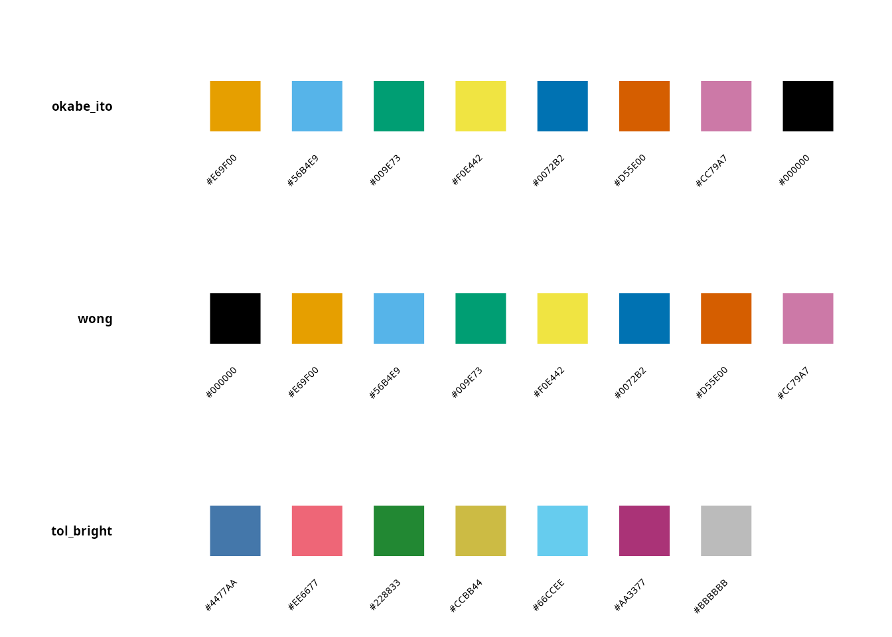
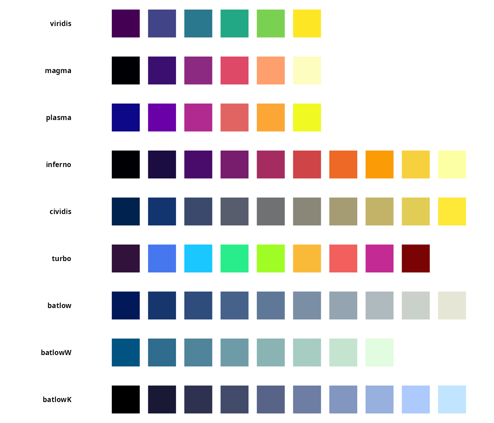
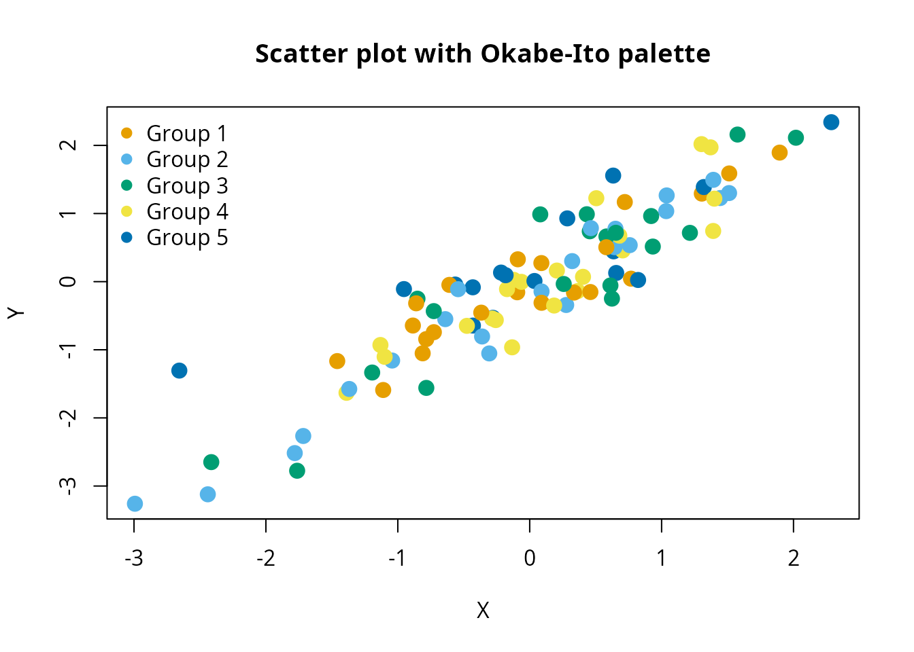

# Introduction to koloRo: comprehensive color palettes for R

## Overview

**koloRo** is a comprehensive R package providing 264 carefully curated
color palettes across 15 categories. Whether you need colorblind-safe
palettes for scientific publications, authentic historical colors from
the Alhambra palace, chameleon species-inspired gradients, or modern
design palettes, koloRo has you covered.

## Installation

``` r

# Install from GitHub
# devtools::install_github("robustecologies/koloRo")
```

``` r

library(koloRo)
```

## Quick start

### Accessing palettes

The main function
[`palettes()`](https://robustecologies.github.io/koloRo/reference/palettes.md)
retrieves color palettes by category or name:

``` r

# Get all palettes in a category
cb_palettes <- palettes(category = "colorblind")
names(cb_palettes)[1:10]
#>  [1] "okabe_ito"          "okabe_ito_extended" "wong"              
#>  [4] "tol_bright"         "tol_high_contrast"  "tol_vibrant"       
#>  [7] "tol_muted"          "tol_light"          "tol_medium"        
#> [10] "tol_pale"

# Get a specific palette
okabe_ito <- palettes(palette = "okabe_ito")
okabe_ito
#> [1] "#E69F00" "#56B4E9" "#009E73" "#F0E442" "#0072B2" "#D55E00" "#CC79A7"
#> [8] "#000000"
```

### Listing available palettes

Use
[`list_palettes()`](https://robustecologies.github.io/koloRo/reference/list_palettes.md)
to see all available palettes:

``` r

# All palettes
all_palettes <- list_palettes()
head(all_palettes, 10)
#>         palette_name   category n_colors
#> 1         RElab_main      RElab        5
#> 2      RElab_primary      RElab        5
#> 3     RElab_extended      RElab        9
#> 4    RElab_diverging      RElab        9
#> 5   RElab_sequential      RElab        9
#> 6  RElab_qualitative      RElab        8
#> 7                    scientific       10
#> 8            viridis scientific        6
#> 9              magma scientific        6
#> 10            plasma scientific        6

# Filter by category
colorblind_list <- list_palettes(category = "colorblind")
head(colorblind_list)
#>         palette_name   category n_colors
#> 1          okabe_ito colorblind        8
#> 2 okabe_ito_extended colorblind       10
#> 3               wong colorblind        8
#> 4         tol_bright colorblind        7
#> 5  tol_high_contrast colorblind        3
#> 6        tol_vibrant colorblind        7
```

### Visualizing palettes

``` r

# Single palette
plot_palette("okabe_ito")
```


``` r

# Compare multiple palettes
plot_palette(c("okabe_ito", "wong", "tol_bright"))
```



## Palette categories

koloRo organizes palettes into 15 categories:

| Category    | Description                                   | Count |
|-------------|-----------------------------------------------|-------|
| RElab       | Custom palettes from RElab research group     | 6     |
| scientific  | Perceptually uniform (viridis, Crameri)       | 17    |
| colorblind  | Colorblind-safe (Okabe-Ito, Paul Tol, Wong)   | 34    |
| alhambra    | Authentic Nasrid dynasty historical pigments  | 30    |
| chameleons  | Chameleon species coloration patterns         | 22    |
| natural     | Natural phenomena (ocean, forest, sunset)     | 41    |
| cultural    | Cultural traditions (Japanese, Persian, etc.) | 23    |
| artistic    | Art movements (impressionist, bauhaus, etc.)  | 13    |
| seasonal    | Seasonal color schemes                        | 8     |
| modern      | Contemporary design (neon, vaporwave)         | 12    |
| classic     | Classic color theory                          | 16    |
| monochrome  | Grayscale and single-hue scales               | 11    |
| food        | Food-inspired palettes                        | 11    |
| diverging   | Diverging scales for bipolar data             | 10    |
| qualitative | Categorical data palettes                     | 10    |

### Exploring categories

``` r

# View all palettes in a category
plot_category("scientific", max_display = 10)
#> Showing first 10 of 18 palettes
```



## Color manipulation

koloRo provides functions for manipulating colors:

### Brightness adjustment

``` r

base_color <- "#1E4D8C"  # Alhambra blue

lighter <- adjust_brightness(base_color, 0.4)
darker <- adjust_brightness(base_color, -0.4)

cat("Original:", base_color, "\n")
#> Original: #1E4D8C
cat("Lighter:", lighter, "\n")
#> Lighter: #7894BA
cat("Darker:", darker, "\n")
#> Darker: #122E54
```

### Shadows and highlights

``` r

shadow <- shadow_color(base_color, intensity = 0.4)
highlight <- highlight_color(base_color, intensity = 0.4)

cat("Shadow:", shadow, "\n")
#> Shadow: #1A3354
cat("Highlight:", highlight, "\n")
#> Highlight: #4577BA
```

### Adding transparency

``` r

# Add 50% transparency
transparent <- add_alpha(base_color, 0.5)
transparent
#>     #1E4D8C 
#> "#1E4D8C7F"
```

### Color mixing

``` r

color1 <- "#FF0000"  # Red
color2 <- "#0000FF"  # Blue

mixed <- mix_colors(color1, color2, ratio = 0.5)
cat("Mixed color:", mixed, "\n")
#> Mixed color: #800080
```

### Color harmonies

``` r

# Complementary color
comp <- complementary_color("#FF0000")
cat("Complementary of red:", comp, "\n")
#> Complementary of red: #00FFFF

# Analogous colors
analogs <- analogous_colors("#FF0000", n = 5, angle = 30)
cat("Analogous colors:", paste(analogs, collapse = ", "), "\n")
#> Analogous colors: #FF00FF, #FF0080, #FF0000, #FF8000, #FFFF00

# Triadic colors
triads <- triadic_colors("#FF0000")
cat("Triadic colors:", paste(triads, collapse = ", "), "\n")
#> Triadic colors: #FF0000, #00FF00, #0000FF
```

## Creating color ramps

Generate smooth color gradients from any palette:

``` r

# Create a 100-color gradient
gradient <- palette_ramp("viridis", n = 100)
head(gradient)
#> [1] "#440154" "#430456" "#430759" "#430B5B" "#430E5E" "#431160"

# Reverse direction
gradient_rev <- palette_ramp("viridis", n = 100, reverse = TRUE)
```

## Pattern colors

Generate color schemes for geometric patterns:

``` r

# Cyclic method - colors repeat in sequence
cyclic <- pattern_colors(15, "alhambra_nazari", method = "cyclic")
cyclic
#>  [1] "#1E4D8C" "#C9A227" "#F5F0E6" "#2D5A3D" "#8B3A3A" "#1E4D8C" "#C9A227"
#>  [8] "#F5F0E6" "#2D5A3D" "#8B3A3A" "#1E4D8C" "#C9A227" "#F5F0E6" "#2D5A3D"
#> [15] "#8B3A3A"

# Random method - random selection from palette
random_cols <- pattern_colors(15, "alhambra_nazari", method = "random", seed = 42)

# Gradient method - smooth interpolation
gradient_cols <- pattern_colors(15, "alhambra_nazari", method = "gradient")

# Alternating method - two colors alternate
alternating <- pattern_colors(15, "alhambra_nazari", method = "alternating")
```

## Integration with base R graphics

``` r

# Example scatter plot with koloRo colors
set.seed(42)
n <- 100
x <- rnorm(n)
y <- x + rnorm(n, sd = 0.5)
groups <- sample(1:5, n, replace = TRUE)

cols <- palettes(palette = "okabe_ito")[groups]

plot(x, y, col = cols, pch = 19, cex = 1.5,
     main = "Scatter plot with Okabe-Ito palette",
     xlab = "X", ylab = "Y")
legend("topleft", legend = paste("Group", 1:5),
       col = palettes(palette = "okabe_ito")[1:5],
       pch = 19, bty = "n")
```



## Getting palette information

``` r

# Detailed information about a palette
info <- palette_info("alhambra_nazari")
info$name
#> [1] "alhambra_nazari"
info$category
#> [1] "alhambra"
info$n_colors
#> [1] 5
info$colors
#> [1] "#1E4D8C" "#C9A227" "#F5F0E6" "#2D5A3D" "#8B3A3A"
```

## Exporting palettes

``` r

# Export to hex format
export_palette("viridis", format = "hex")
#>   index     hex
#> 1     1 #440154
#> 2     2 #414487
#> 3     3 #2a788e
#> 4     4 #22a884
#> 5     5 #7ad151
#> 6     6 #fde725

# Export to RGB format
export_palette("viridis", format = "rgb")
#>   index     hex red green blue
#> 1     1 #440154  68     1   84
#> 2     2 #414487  65    68  135
#> 3     3 #2a788e  42   120  142
#> 4     4 #22a884  34   168  132
#> 5     5 #7ad151 122   209   81
#> 6     6 #fde725 253   231   37

# Save to file
export_palette("viridis", format = "rgb", file = "viridis_colors.csv")
#> Palette exported to: viridis_colors.csv
#>   index     hex red green blue
#> 1     1 #440154  68     1   84
#> 2     2 #414487  65    68  135
#> 3     3 #2a788e  42   120  142
#> 4     4 #22a884  34   168  132
#> 5     5 #7ad151 122   209   81
#> 6     6 #fde725 253   231   37
```

## Next steps

Explore the comprehensive vignettes for detailed guidance:
[`vignette("colorblind-safe")`](https://robustecologies.github.io/koloRo/articles/colorblind-safe.md)
covers accessible visualization best practices;
[`vignette("alhambra-palettes")`](https://robustecologies.github.io/koloRo/articles/alhambra-palettes.md)
documents the historical Nasrid dynasty pigments;
[`vignette("chameleon-palettes")`](https://robustecologies.github.io/koloRo/articles/chameleon-palettes.md)
provides scientific references for species-based palettes;
[`vignette("scientific-palettes")`](https://robustecologies.github.io/koloRo/articles/scientific-palettes.md)
covers perceptually uniform colormaps for oceanography; and
[`vignette("ggplot2-integration")`](https://robustecologies.github.io/koloRo/articles/ggplot2-integration.md)
demonstrates seamless integration with ggplot2.

## References

Crameri, F., Shephard, G.E., & Heron, P.J. (2020). The misuse of colour
in science communication. *Nature Communications*, 11, 5444.
[doi:10.1038/s41467-020-19160-7](https://doi.org/10.1038/s41467-020-19160-7)

Crameri, F. (2018). Scientific colour maps. Zenodo.
[doi:10.5281/zenodo.1243862](https://doi.org/10.5281/zenodo.1243862)

Okabe, M., & Ito, K. (2008). Color Universal Design (CUD): How to make
figures and presentations that are friendly to colorblind people.
*J*Fly\*. <https://jfly.uni-koeln.de/color/>

Wong, B. (2011). Points of view: Color blindness. *Nature Methods*,
8(6), 441. [doi:10.1038/nmeth.1618](https://doi.org/10.1038/nmeth.1618)

Tol, P. (2021). Colour schemes. SRON Technical Note SRON/EPS/TN/09-002.
<https://personal.sron.nl/~pault/>

Fernández-Puertas, A. (1997). *The Alhambra: From the ninth century to
Yusuf I (1354)*. London: Saqi Books.
