# Scientific color palettes: perceptually uniform colormaps for oceanography and earth sciences

``` r

library(koloRo)
library(ggplot2)
```

## The problem with rainbow colormaps

For decades, the “rainbow” or “jet” colormap was the default choice in
scientific visualization. However, research has demonstrated that
rainbow colormaps are fundamentally flawed for scientific communication
([Borland & Taylor (2007)](#ref-borland2007); [Light & Bartlein
(2004)](#ref-light2004)):

1.  **Non-uniform perceptual lightness**: The human visual system
    perceives brightness changes non-linearly across hues. Yellow
    appears much brighter than blue at equal saturation, creating
    artificial “bands” in continuous data.

2.  **Loss of information**: [Crameri et al. (2020)](#ref-crameri2020)
    showed that rainbow colormaps can hide up to 7% of data features
    compared to perceptually uniform alternatives.

3.  **Colorblind inaccessibility**: Rainbow colormaps are particularly
    problematic for the ~8% of males with red-green color vision
    deficiency ([Wong (2011)](#ref-wong2011)).

4.  **False boundaries**: Abrupt perceptual transitions (e.g.,
    cyan-to-green) create apparent boundaries in data where none exist.

## Perceptually uniform colormaps

koloRo includes scientifically validated, perceptually uniform colormaps
designed for accurate data representation.

### The viridis family

The viridis colormaps were developed and introduced by [van der Walt &
Smith (2015)](#ref-vanderwalt2015) and validated through perceptual
studies. They maintain uniform luminance gradients and remain
distinguishable under all forms of color vision deficiency.

``` r

plot_palette(c("viridis", "magma", "plasma", "inferno", "cividis"))
```

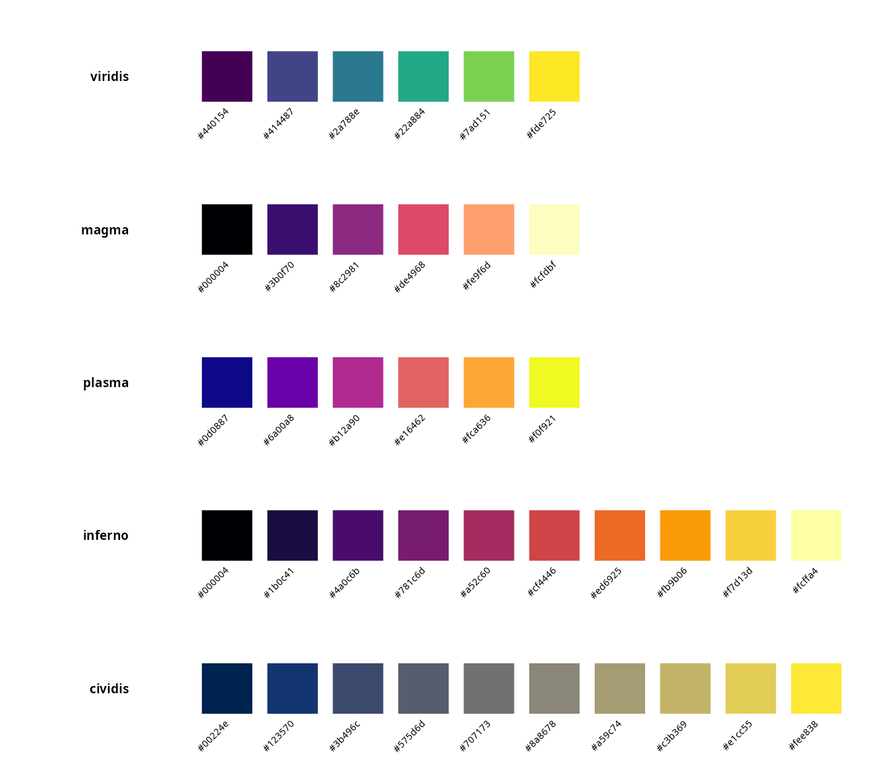

| Palette | Best for | Reference |
|----|----|----|
| `viridis` | General purpose sequential data | [van der Walt & Smith (2015)](#ref-vanderwalt2015) |
| `magma` | Thermal/heat data, high dynamic range | [van der Walt & Smith (2015)](#ref-vanderwalt2015) |
| `plasma` | Scientific visualization with yellow highlights | [van der Walt & Smith (2015)](#ref-vanderwalt2015) |
| `inferno` | Fire/heat metaphors, high contrast | [van der Walt & Smith (2015)](#ref-vanderwalt2015) |
| `cividis` | Optimized for deuteranopia | ([Nuñez et al. (2018)](#ref-nunez2018))(#ref-nunez2018) |

### Fabio Crameri’s scientific colormaps

Developed specifically for geoscientific visualization ([Crameri
(2018)](#ref-crameri2018)), Crameri’s colormaps are mathematically
optimized for perceptual uniformity in CIELAB color space.

``` r

plot_palette(c("batlow", "batlowW", "batlowK", "cork", "vik", "broc"))
```

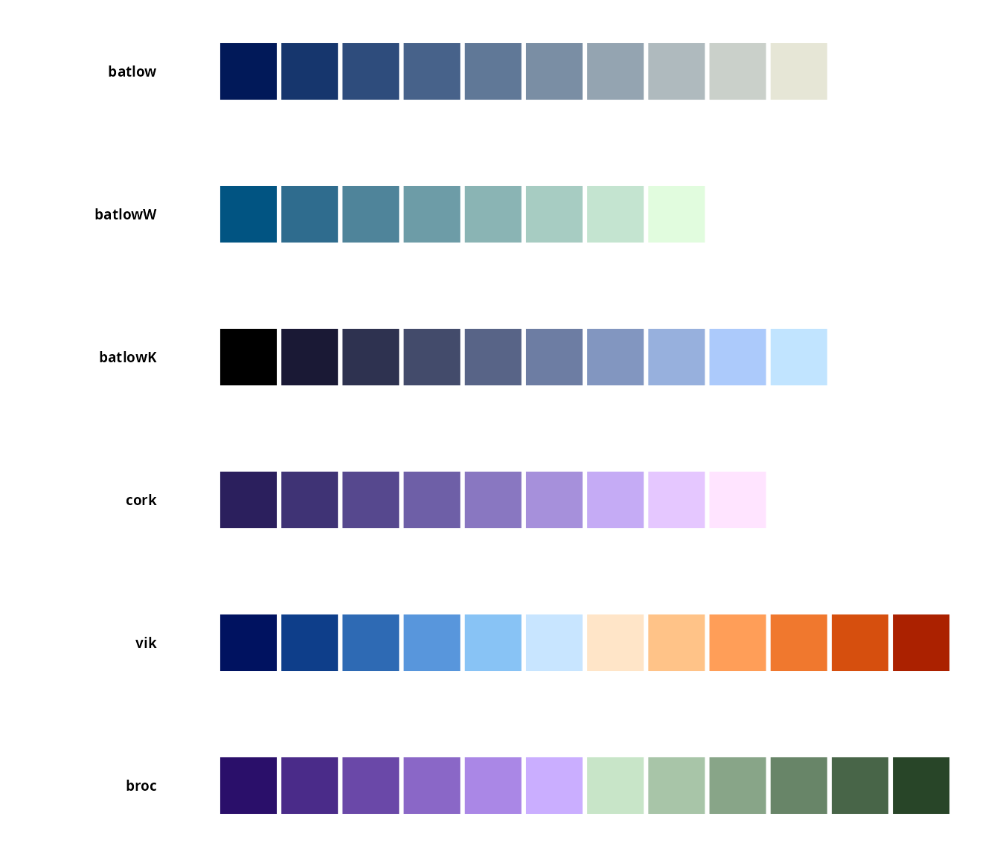

| Palette   | Type                   | Recommended use                           |
|-----------|------------------------|-------------------------------------------|
| `batlow`  | Sequential             | Bathymetry, general sequential data       |
| `batlowW` | Sequential (white end) | Data with white background emphasis       |
| `batlowK` | Sequential (black end) | Data with dark background emphasis        |
| `cork`    | Diverging              | Anomalies around zero                     |
| `vik`     | Diverging              | Temperature anomalies, correlation        |
| `broc`    | Diverging              | Alternative diverging for land/vegetation |

## Oceanographic applications

### Sea surface temperature (SST)

For sea surface temperature visualization, sequential palettes with
warm-to-cool transitions are most intuitive:

``` r

# Simulated SST data (realistic range: -2 to 30°C)
set.seed(42)
lon <- seq(-180, 180, length.out = 100)
lat <- seq(-90, 90, length.out = 50)
sst_grid <- expand.grid(lon = lon, lat = lat)

# Temperature decreases with latitude, with some noise
sst_grid$sst <- 28 - abs(sst_grid$lat) * 0.35 +
  5 * sin(sst_grid$lon * pi / 180) * cos(sst_grid$lat * pi / 90) +
  rnorm(nrow(sst_grid), sd = 1)
sst_grid$sst <- pmax(-2, pmin(32, sst_grid$sst))

ggplot(sst_grid, aes(lon, lat, fill = sst)) +
  geom_raster(interpolate = TRUE) +
  scale_fill_koloro_c("batlow") +
  coord_fixed(expand = FALSE) +
  labs(
    title = "Sea surface temperature (simulated)",
    subtitle = "Using batlow colormap",
    x = "Longitude",
    y = "Latitude",
    fill = "SST (\u00B0C)"
  ) +
  theme_minimal() +
  theme(
    panel.grid = element_blank(),
    legend.position = "bottom",
    legend.key.width = unit(2, "cm")
  )
```

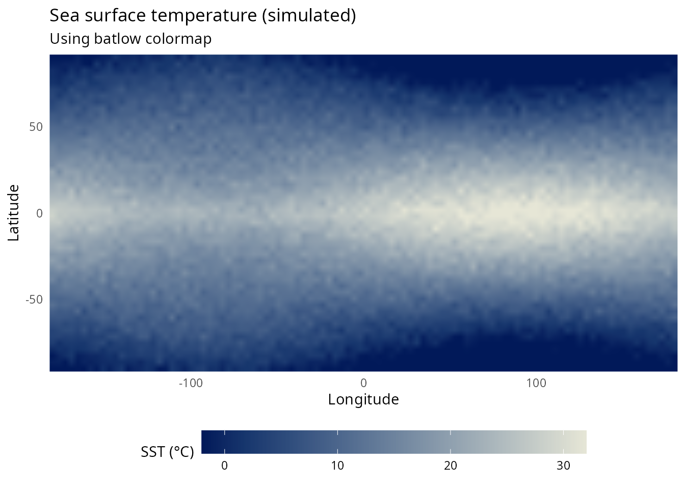

### Bathymetry

Ocean depth data benefits from palettes that transition smoothly from
shallow (light) to deep (dark):

``` r

# Simulated bathymetry
set.seed(123)
bathy_grid <- expand.grid(
  x = seq(0, 100, length.out = 80),
  y = seq(0, 60, length.out = 48)
)

# Create realistic continental shelf and deep ocean
bathy_grid$depth <- with(bathy_grid, {
  shelf <- ifelse(x < 20, -50 - x * 5, -150)
  slope <- ifelse(x >= 20 & x < 40, -150 - (x - 20) * 100, shelf)
  deep <- ifelse(x >= 40, -2000 - 500 * sin((x - 40) * pi / 60), slope)
  deep + rnorm(length(deep), sd = 100)
})

ggplot(bathy_grid, aes(x, y, fill = depth)) +
  geom_raster(interpolate = TRUE) +
  scale_fill_koloro_c("deep_sea", direction = -1) +
  coord_fixed(expand = FALSE) +
  labs(
    title = "Bathymetric profile (simulated)",
    subtitle = "Continental shelf to abyssal plain",
    x = "Distance from coast (km)",
    y = "Along-shore distance (km)",
    fill = "Depth (m)"
  ) +
  theme_minimal() +
  theme(
    panel.grid = element_blank(),
    legend.position = "right"
  )
```

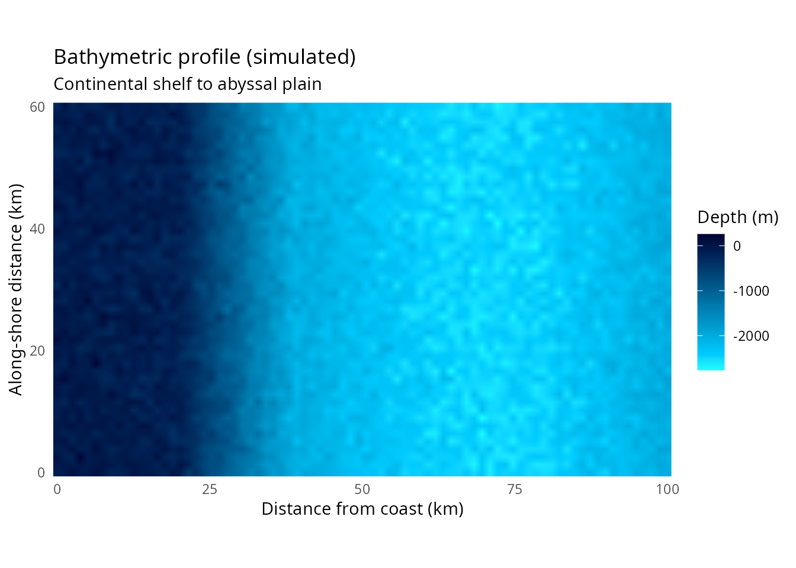

### Chlorophyll-a concentration

Phytoplankton biomass (chlorophyll-a) is typically displayed on a
logarithmic scale spanning several orders of magnitude:

``` r

# Simulated chlorophyll-a (typical range: 0.01 to 50 mg/m³)
set.seed(456)
chl_grid <- expand.grid(
  lon = seq(-130, -115, length.out = 60),
  lat = seq(30, 45, length.out = 45)
)

# Coastal upwelling pattern
chl_grid$chl <- with(chl_grid, {
  coastal <- exp(-((lon + 117)^2) / 20)  # Peak near coast
  upwelling <- 3 * coastal * (1 + sin(lat * pi / 15))
  background <- 0.1
  (background + upwelling * 10) * exp(rnorm(length(lon), sd = 0.3))
})

ggplot(chl_grid, aes(lon, lat, fill = chl)) +
  geom_raster(interpolate = TRUE) +
  scale_fill_koloro_c("viridis", trans = "log10") +
  coord_fixed(expand = FALSE) +
  labs(
    title = "Chlorophyll-a concentration (simulated)",
    subtitle = "California Current upwelling region",
    x = "Longitude",
    y = "Latitude",
    fill = expression(paste("Chl-", italic(a), " (mg ", m^{-3}, ")"))
  ) +
  theme_minimal() +
  theme(
    panel.grid = element_blank(),
    legend.position = "right"
  )
```

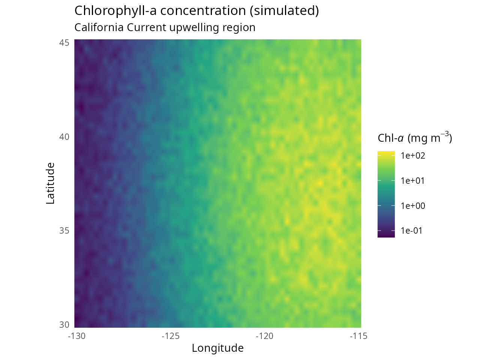

### Temperature anomalies

For data with a meaningful zero point (anomalies, deviations), diverging
colormaps center attention on departures from normal:

``` r

# Simulated SST anomaly (El Niño pattern)
set.seed(789)
anom_grid <- expand.grid(
  lon = seq(-180, -80, length.out = 80),
  lat = seq(-30, 30, length.out = 40)
)

# El Niño-like pattern: warm in eastern Pacific
anom_grid$anomaly <- with(anom_grid, {
  elnino <- 2.5 * exp(-((lon + 120)^2) / 1000) * exp(-(lat^2) / 200)
  lanina <- -1.5 * exp(-((lon + 160)^2) / 800) * exp(-(lat^2) / 150)
  (elnino + lanina) + rnorm(length(lon), sd = 0.3)
})

ggplot(anom_grid, aes(lon, lat, fill = anomaly)) +
  geom_raster(interpolate = TRUE) +
  scale_fill_koloro_div("vik", midpoint = 0) +
  coord_fixed(expand = FALSE) +
  labs(
    title = "Sea surface temperature anomaly (simulated)",
    subtitle = "El Ni\u00F1o-like pattern using vik diverging colormap",
    x = "Longitude",
    y = "Latitude",
    fill = "Anomaly (\u00B0C)"
  ) +
  theme_minimal() +
  theme(
    panel.grid = element_blank(),
    legend.position = "bottom",
    legend.key.width = unit(2, "cm")
  )
```

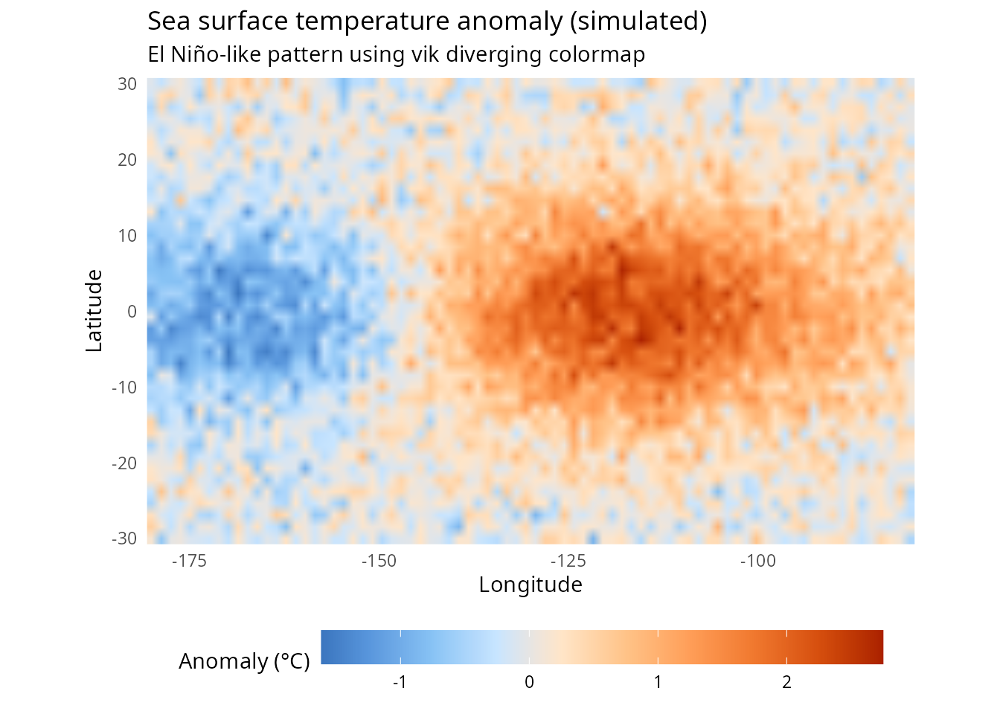

### Salinity

Ocean salinity requires careful colormap selection due to its relatively
narrow dynamic range (typically 33-37 PSU in the open ocean):

``` r

# Simulated salinity field
set.seed(321)
sal_grid <- expand.grid(
  lon = seq(-60, -30, length.out = 50),
  lat = seq(20, 45, length.out = 40)
)

# Atlantic salinity pattern
sal_grid$salinity <- with(sal_grid, {
  base <- 36.5
  gyre <- 0.8 * exp(-((lat - 32)^2) / 100)  # Subtropical gyre high
  freshwater <- -1.2 * exp(-((lon + 45)^2 + (lat - 40)^2) / 50)  # River input
  base + gyre + freshwater + rnorm(length(lon), sd = 0.1)
})

ggplot(sal_grid, aes(lon, lat, fill = salinity)) +
  geom_raster(interpolate = TRUE) +
  scale_fill_koloro_c("plasma") +
  coord_fixed(expand = FALSE) +
  labs(
    title = "Sea surface salinity (simulated)",
    subtitle = "North Atlantic subtropical gyre",
    x = "Longitude",
    y = "Latitude",
    fill = "Salinity (PSU)"
  ) +
  theme_minimal() +
  theme(
    panel.grid = element_blank(),
    legend.position = "right"
  )
```

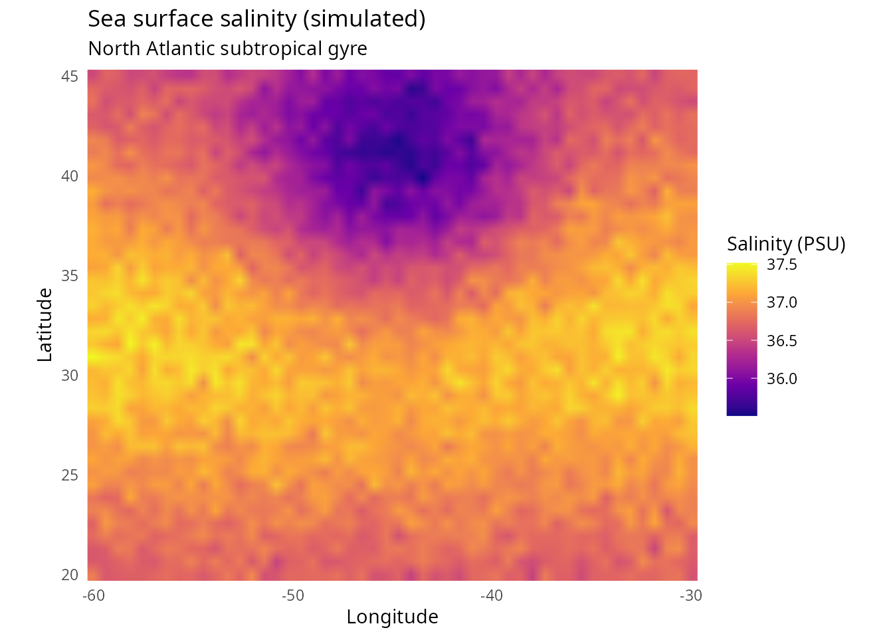

## Atmospheric and climate applications

### Precipitation anomalies

``` r

# Simulated precipitation anomaly
set.seed(654)
precip_grid <- expand.grid(
  lon = seq(-125, -65, length.out = 80),
  lat = seq(25, 50, length.out = 40)
)

# Dipole pattern (wet west, dry east during La Niña)
precip_grid$precip_anom <- with(precip_grid, {
  west <- 2 * exp(-((lon + 115)^2) / 200) * exp(-((lat - 40)^2) / 100)
  east <- -1.5 * exp(-((lon + 85)^2) / 150) * exp(-((lat - 35)^2) / 80)
  (west + east) * 25 + rnorm(length(lon), sd = 5)
})

ggplot(precip_grid, aes(lon, lat, fill = precip_anom)) +
  geom_raster(interpolate = TRUE) +
  scale_fill_koloro_div("brown_blue_green", midpoint = 0) +
  coord_fixed(expand = FALSE) +
  labs(
    title = "Precipitation anomaly (simulated)",
    subtitle = "La Ni\u00F1a-like pattern over North America",
    x = "Longitude",
    y = "Latitude",
    fill = "Anomaly (mm)"
  ) +
  theme_minimal() +
  theme(
    panel.grid = element_blank(),
    legend.position = "bottom",
    legend.key.width = unit(2, "cm")
  )
```

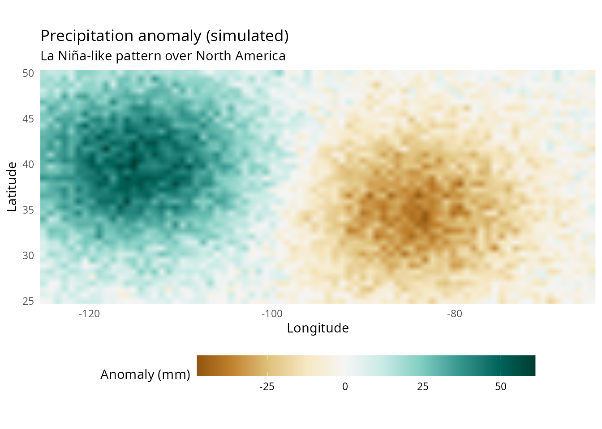

### Wind stress curl

Oceanographic forcing by wind stress curl benefits from diverging
colormaps to highlight regions of positive (cyclonic) and negative
(anticyclonic) curl:

``` r

# Simulated wind stress curl
set.seed(987)
curl_grid <- expand.grid(
  lon = seq(-180, -120, length.out = 60),
  lat = seq(20, 60, length.out = 40)
)

# Typical North Pacific pattern
curl_grid$curl <- with(curl_grid, {
  # Positive curl in subpolar region
  subpolar <- 1e-7 * exp(-((lat - 50)^2) / 50)
  # Negative curl in subtropical region
  subtropical <- -0.8e-7 * exp(-((lat - 30)^2) / 40)
  (subpolar + subtropical) + rnorm(length(lon), sd = 0.2e-7)
})

ggplot(curl_grid, aes(lon, lat, fill = curl * 1e7)) +
  geom_raster(interpolate = TRUE) +
  scale_fill_koloro_div("cork", midpoint = 0) +
  coord_fixed(expand = FALSE) +
  labs(
    title = "Wind stress curl (simulated)",
    subtitle = "North Pacific gyre system",
    x = "Longitude",
    y = "Latitude",
    fill = expression(paste("Curl (", 10^{-7}, " N ", m^{-3}, ")"))
  ) +
  theme_minimal() +
  theme(
    panel.grid = element_blank(),
    legend.position = "right"
  )
```

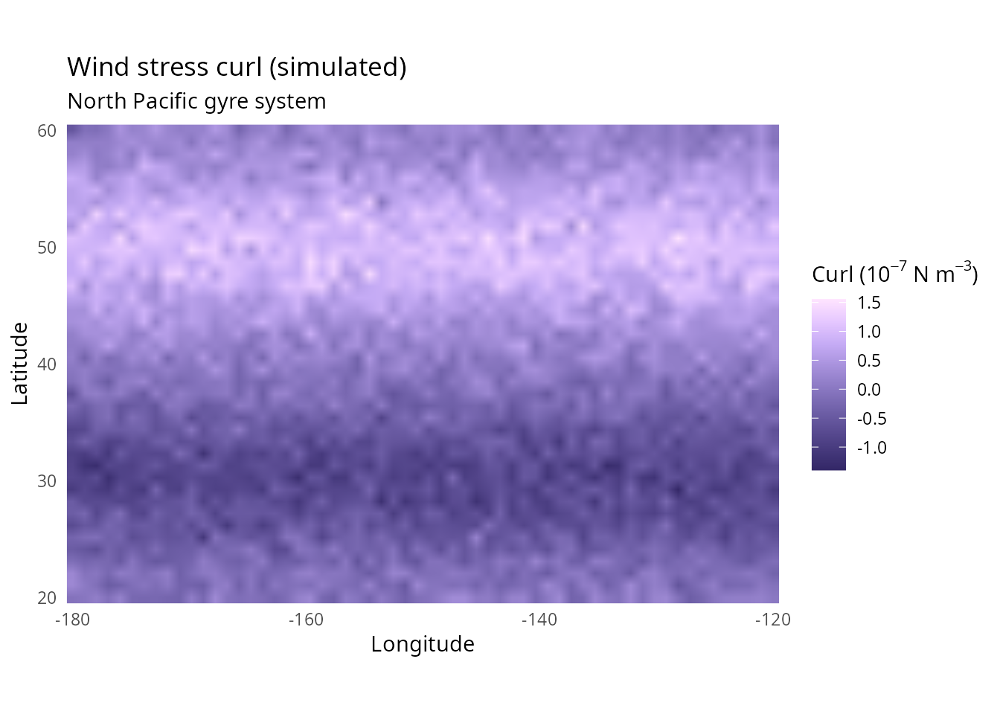

## Palette selection guide for oceanography

| Data type             | Recommended palette | Alternative               |
|-----------------------|---------------------|---------------------------|
| SST (absolute)        | `batlow`            | `viridis`, `plasma`       |
| SST anomaly           | `vik`               | `cork`, `red_yellow_blue` |
| Bathymetry            | `deep_sea`          | `ocean`, `batlowK`        |
| Chlorophyll-a         | `viridis`           | `plasma`, `magma`         |
| Salinity              | `plasma`            | `batlow`, `cividis`       |
| Precipitation anomaly | `brown_blue_green`  | `purple_green`            |
| Wind/current vectors  | `viridis`           | `cividis`                 |
| Mixed layer depth     | `batlowW`           | `batlow`                  |
| Sea ice concentration | `cool_gray`         | `cividis`                 |

## Best practices for scientific visualization

### 1. Choose appropriate colormap type

- **Sequential**: Single-direction data (temperature, depth,
  concentration)
- **Diverging**: Data with meaningful center point (anomalies,
  correlations)
- **Qualitative**: Categorical data (water masses, regions)

### 2. Consider your audience

For publications, use palettes validated for colorblind accessibility
([Nuñez et al. (2018)](#ref-nunez2018)):

``` r

# cividis is specifically optimized for deuteranopia
plot_palette("cividis")
```

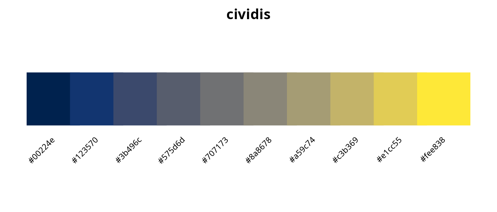

### 3. Match colormap to data semantics

Intuitive color associations improve comprehension:

- **Blues**: Ocean depth, cold temperatures
- **Warm colors**: Heat, high concentrations
- **Earth tones**: Terrain, sediments

### 4. Avoid perceptual artifacts

Rainbow colormaps create false boundaries. Compare:

``` r

# Same data, different colormaps
test_data <- expand.grid(x = 1:50, y = 1:30)
test_data$z <- with(test_data, sin(x/10) * cos(y/10) + x/50)

p1 <- ggplot(test_data, aes(x, y, fill = z)) +
  geom_raster() +
  scale_fill_koloro_c("turbo") +  # Rainbow-like
  labs(title = "Turbo (rainbow-like)") +
  theme_void() +
  theme(legend.position = "none")

p2 <- ggplot(test_data, aes(x, y, fill = z)) +
  geom_raster() +
  scale_fill_koloro_c("viridis") +  # Perceptually uniform
  labs(title = "Viridis (perceptually uniform)") +
  theme_void() +
  theme(legend.position = "none")

gridExtra::grid.arrange(p1, p2, ncol = 2)
```

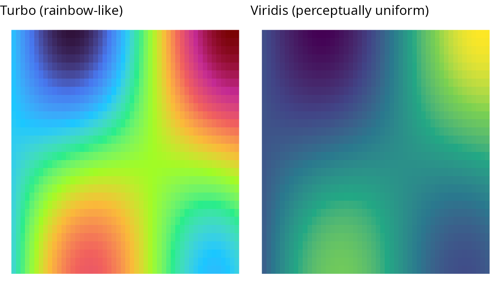

## Complete scientific palette inventory

``` r

sci_palettes <- list_palettes(category = "scientific")
knitr::kable(sci_palettes, caption = "Scientific visualization palettes in koloRo")
```

| palette_name | category   | n_colors |
|:-------------|:-----------|---------:|
|              | scientific |       10 |
| viridis      | scientific |        6 |
| magma        | scientific |        6 |
| plasma       | scientific |        6 |
| inferno      | scientific |       10 |
| cividis      | scientific |       10 |
| turbo        | scientific |        9 |
| batlow       | scientific |       10 |
| batlowW      | scientific |        9 |
| batlowK      | scientific |       10 |
| cork         | scientific |        9 |
| vik          | scientific |       12 |
| broc         | scientific |       12 |
| spectral     | scientific |       11 |
| rdylbu       | scientific |       11 |
| coolwarm     | scientific |        8 |
| twilight     | scientific |       12 |
| parula       | scientific |        9 |

Scientific visualization palettes in koloRo {.table}

## References

Borland, D., & Taylor, R.M. (2007). Rainbow color map (still) considered
harmful. *IEEE Computer Graphics and Applications*, 27(2), 14-17.
[doi:10.1109/MCG.2007.46](https://doi.org/10.1109/MCG.2007.46)

Light, A., & Bartlein, P.J. (2004). The end of the rainbow? Color
schemes for improved data graphics. *Eos, Transactions AGU*, 85(40),
385-391.
[doi:10.1029/2004EO400002](https://doi.org/10.1029/2004EO400002)

Crameri, F., Shephard, G.E., & Heron, P.J. (2020). The misuse of colour
in science communication. *Nature Communications*, 11, 5444.
[doi:10.1038/s41467-020-19160-7](https://doi.org/10.1038/s41467-020-19160-7)

Crameri, F. (2018). Scientific colour maps. Zenodo.
[doi:10.5281/zenodo.1243862](https://doi.org/10.5281/zenodo.1243862)

van der Walt, S., & Smith, N. (2015). A better default colormap for
Matplotlib. *Proceedings of SciPy 2015*.
<https://bids.github.io/colormap/>

Nuñez, J.R., Anderton, C.R., & Renslow, R.S. (2018). Optimizing
colormaps with consideration for color vision deficiency. *PLOS ONE*,
13(7), e0199239.
[doi:10.1371/journal.pone.0199239](https://doi.org/10.1371/journal.pone.0199239)

Thyng, K.M., et al. (2016). True colors of oceanography: Guidelines for
effective and accurate colormap selection. *Oceanography*, 29(3), 9-13.
[doi:10.5670/oceanog.2016.66](https://doi.org/10.5670/oceanog.2016.66)

Wong, B. (2011). Points of view: Color blindness. *Nature Methods*,
8(6), 441. [doi:10.1038/nmeth.1618](https://doi.org/10.1038/nmeth.1618)

Zeileis, A., et al. (2020). colorspace: A toolbox for manipulating and
assessing colors and palettes. *Journal of Statistical Software*, 96(1),
1-49. [doi:10.18637/jss.v096.i01](https://doi.org/10.18637/jss.v096.i01)

## Session info

``` r

sessionInfo()
#> R version 4.6.0 (2026-04-24)
#> Platform: x86_64-pc-linux-gnu
#> Running under: Ubuntu 24.04.4 LTS
#> 
#> Matrix products: default
#> BLAS:   /usr/lib/x86_64-linux-gnu/openblas-pthread/libblas.so.3 
#> LAPACK: /usr/lib/x86_64-linux-gnu/openblas-pthread/libopenblasp-r0.3.26.so;  LAPACK version 3.12.0
#> 
#> locale:
#>  [1] LC_CTYPE=es_ES.UTF-8       LC_NUMERIC=C              
#>  [3] LC_TIME=es_ES.UTF-8        LC_COLLATE=es_ES.UTF-8    
#>  [5] LC_MONETARY=es_ES.UTF-8    LC_MESSAGES=es_ES.UTF-8   
#>  [7] LC_PAPER=es_ES.UTF-8       LC_NAME=C                 
#>  [9] LC_ADDRESS=C               LC_TELEPHONE=C            
#> [11] LC_MEASUREMENT=es_ES.UTF-8 LC_IDENTIFICATION=C       
#> 
#> time zone: Europe/Madrid
#> tzcode source: system (glibc)
#> 
#> attached base packages:
#> [1] stats     graphics  grDevices utils     datasets  methods   base     
#> 
#> other attached packages:
#> [1] ggplot2_4.0.3 koloRo_0.1.2 
#> 
#> loaded via a namespace (and not attached):
#>  [1] gtable_0.3.6       jsonlite_2.0.0     dplyr_1.2.1        compiler_4.6.0    
#>  [5] tidyselect_1.2.1   gridExtra_2.3      jquerylib_0.1.4    systemfonts_1.3.2 
#>  [9] scales_1.4.0       textshaping_1.0.5  yaml_2.3.12        fastmap_1.2.0     
#> [13] R6_2.6.1           labeling_0.4.3     generics_0.1.4     knitr_1.51        
#> [17] htmlwidgets_1.6.4  tibble_3.3.1       desc_1.4.3         bslib_0.10.0      
#> [21] pillar_1.11.1      RColorBrewer_1.1-3 rlang_1.2.0        cachem_1.1.0      
#> [25] xfun_0.57          fs_2.1.0           sass_0.4.10        S7_0.2.2          
#> [29] otel_0.2.0         cli_3.6.6          withr_3.0.2        pkgdown_2.2.0     
#> [33] magrittr_2.0.5     digest_0.6.39      grid_4.6.0         rstudioapi_0.18.0 
#> [37] lifecycle_1.0.5    vctrs_0.7.3        evaluate_1.0.5     glue_1.8.1        
#> [41] farver_2.1.2       ragg_1.5.2         rmarkdown_2.31     tools_4.6.0       
#> [45] pkgconfig_2.0.3    htmltools_0.5.9
```
