# koloRo [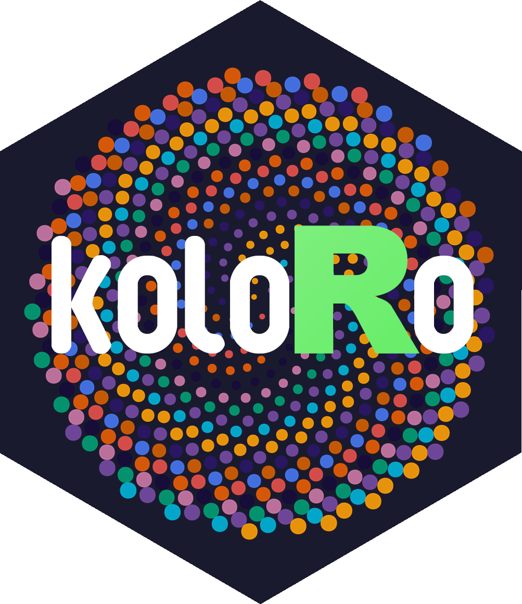](https://robustecologies.github.io/koloRo)

## Color palettes for scientific visualization, accessibility, and geometric art

[](https://github.com/robustecologies/koloRo/actions)
[](https://github.com/robustecologies/koloRo)
[](https://www.r-project.org/)
[](https://robustecologies.github.io/koloRo/reference/index.html)
[](https://robustecologies.github.io/koloRo/reference/palettes.html)
[](https://www.gnu.org/licenses/gpl-3.0)

**koloRo** provides 282 palettes across 16 categories, including 34
colorblind-safe options from established standards. The collection
features 30 Alhambra historical palettes derived from Nasrid dynasty
spectroscopic analysis of original 13th-14th century pigments, 22
chameleon species palettes based on scientific documentation of reptile
coloration patterns from three continents, and 18 cinema palettes
inspired by the cinematography of Denis Villeneuve’s Dune films.
Seamless ggplot2 integration supports discrete, continuous, and
diverging scales for all visualization needs. Color manipulation
functions enable creation of shadows, highlights, and color harmonies,
while pattern generation tools facilitate geometric art and
Islamic-inspired designs.

  

## What is inside

| Layer | Components | Count |
|----|----|----|
| Palette access and inspection | `palettes`, `list_palettes`, `palette_info`, `display_palette`, `compare_palettes`, `palette_ramp`, `interpolate_palette`, `export_palette`, `pattern_colors`, `plot_palette`, `plot_category`, `plot_palette_grid` | 12 |
| ggplot2 integration | `scale_color_koloro` (and `colour` alias), `_c`, `_binned`, `_div` variants for both colour and fill | 12 |
| Colour manipulation | `add_alpha`, `adjust_brightness`, `desaturate`, `highlight_color`, `shadow_color`, `mix_colors`, `complementary_color`, `analogous_colors`, `triadic_colors`, `invert_color`, `hex_to_rgb`, `rgb_to_hex`, `is_color` | 13 |
| Palette catalogue | RElab, scientific (viridis + Crameri), colorblind, alhambra, chameleons, natural, cultural, artistic, diverging, qualitative, cinema | 282 palettes / 16 categories |

## Palette categories

| Category      | Description                                  | Palettes |
|---------------|----------------------------------------------|----------|
| `RElab`       | Robust Ecologies Lab custom palettes         | 6        |
| `scientific`  | Perceptually uniform (viridis, Crameri)      | 17       |
| `colorblind`  | Accessibility-focused (Okabe-Ito, Tol, Wong) | 34       |
| `alhambra`    | Nasrid dynasty historical pigments           | 30       |
| `chameleons`  | Chameleon species coloration patterns        | 22       |
| `natural`     | Ocean, forest, sunset, aurora                | 41       |
| `cultural`    | Japanese, Persian, Chinese traditions        | 23       |
| `artistic`    | Impressionist, Bauhaus, Art Deco             | 13       |
| `diverging`   | Bipolar data with neutral midpoint           | 10       |
| `qualitative` | Categorical data                             | 10       |
| `cinema`      | Dune film cinematography (Fraser, Cole)      | 18       |

## Gallery: diverse visualizations with RElab palettes

[TABLE]

## Installation

Install the development version from GitHub:

``` r

# install.packages("devtools")
devtools::install_github("robustecologies/koloRo")
```

``` r

library(koloRo)
```

## Quick start

### Access palettes by category or name

``` r

# Get a specific palette
palettes(palette = "okabe_ito")
#> [1] "#E69F00" "#56B4E9" "#009E73" "#F0E442" "#0072B2" "#D55E00" "#CC79A7" "#000000"

# Get all colorblind-safe palettes
cb <- palettes(category = "colorblind")
names(cb)[1:8]
#> [1] "okabe_ito"          "okabe_ito_extended" "wong"               "tol_bright"         "tol_high_contrast"  "tol_vibrant"       
#> [7] "tol_muted"          "tol_light"

# List all available palettes
head(list_palettes(), 10)
#>         palette_name   category n_colors
#> 1         RElab_main      RElab        5
#> 2      RElab_primary      RElab        5
#> 3     RElab_extended      RElab        9
#> 4    RElab_diverging      RElab        9
#> 5   RElab_sequential      RElab        9
#> 6  RElab_qualitative      RElab        8
#> 7                    scientific       10
#> 8            viridis scientific        6
#> 9              magma scientific        6
#> 10            plasma scientific        6
```

### Visualize palettes

``` r

plot_palette("RElab_primary")
```

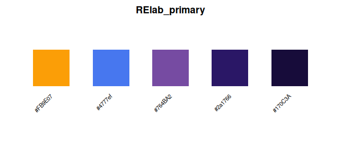

``` r

plot_palette(c("okabe_ito", "wong", "tol_bright", "RElab_qualitative"))
```

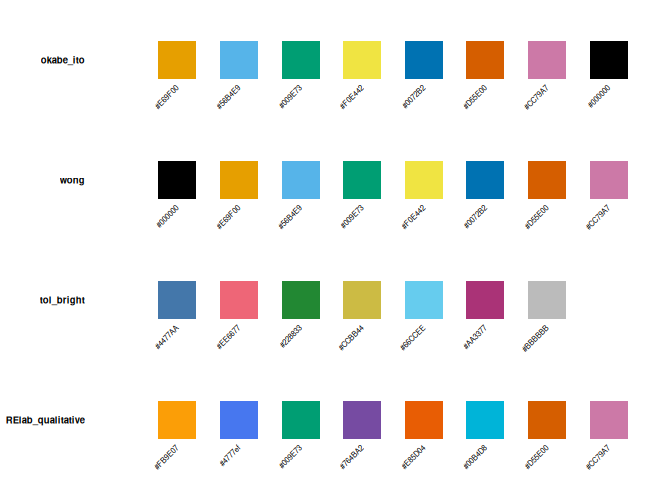

## RElab palettes

The RElab (Robust Ecologies Laboratory) palettes are designed for
scientific publications and data visualization:

``` r

plot_palette(c("RElab_main", "RElab_primary", "RElab_diverging", "RElab_qualitative"))
```

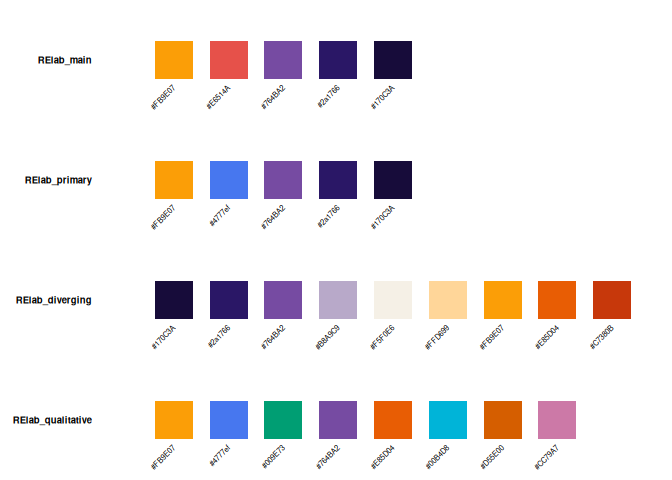

## ggplot2 integration

koloRo provides seamless integration with ggplot2 through dedicated
scale functions:

``` r

library(ggplot2)

# Scatter plot with RElab_primary palette
ggplot(iris, aes(Sepal.Length, Sepal.Width, color = Species)) +
  geom_point(size = 3, alpha = 0.8) +
  scale_color_koloro("RElab_primary") +
  labs(
    title = "Iris dataset with RElab primary palette",
    subtitle = "Designed for scientific publications"
  ) +
  theme_minimal() +
  theme(
    plot.title = element_text(face = "bold"),
    legend.position = "bottom"
  )
```

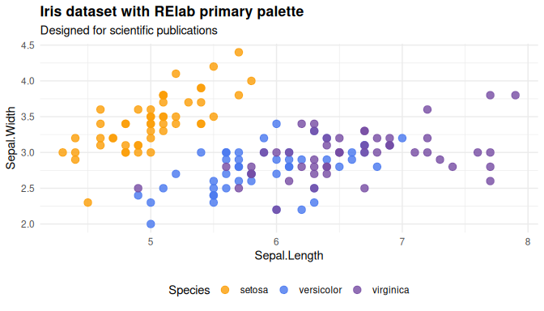

### Continuous scales for heatmaps

``` r

ggplot(faithfuld, aes(waiting, eruptions, fill = density)) +
  geom_tile() +
  scale_fill_koloro_c("viridis") +
  labs(title = "Old Faithful eruption density") +
  theme_minimal()
```

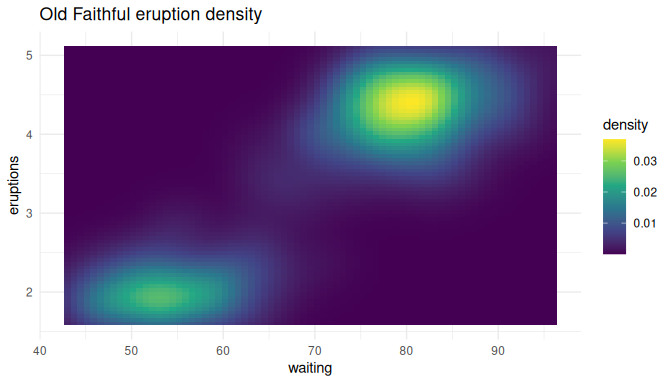

### Diverging scales for correlation matrices

``` r

cor_data <- as.data.frame(as.table(cor(mtcars[, 1:7])))
names(cor_data) <- c("Var1", "Var2", "Correlation")

ggplot(cor_data, aes(Var1, Var2, fill = Correlation)) +
  geom_tile() +
  scale_fill_koloro_div("vik", midpoint = 0) +
  labs(title = "Correlation matrix with Vik diverging palette") +
  theme_minimal() +
  theme(axis.text.x = element_text(angle = 45, hjust = 1))
```

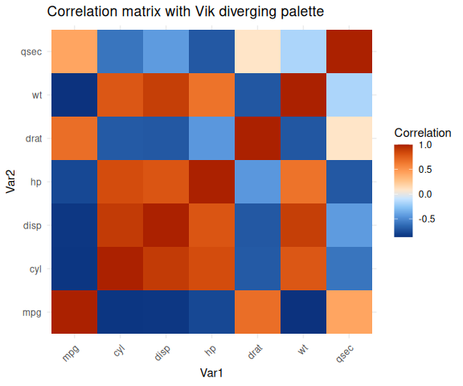

## Alhambra historical palettes

The Alhambra palettes are derived from spectroscopic analysis of
original 13th-14th century Nasrid dynasty pigments:

``` r

plot_palette(c(
  "alhambra_nazari",
  "alhambra_patio_leones",
  "alhambra_sala_abencerrajes",
  "alhambra_generalife"
))
```

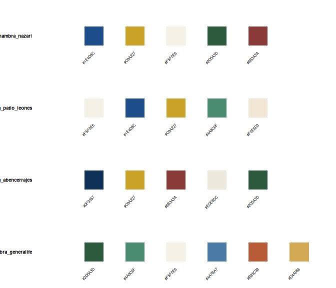

### Authentic pigments

The colors reflect historical materials available in medieval
Al-Andalus: blues derived from cobalt oxide and lapis lazuli; greens
from malachite and verdigris (copper acetate); reds from hematite
(almagre) and iron oxides; golds from gold leaf and amber resins; whites
from lime wash (calcium carbonate) and gypsum.

``` r

plot_palette(c(
  "alhambra_blues",
  "alhambra_greens",
  "alhambra_reds",
  "alhambra_golds"
))
```

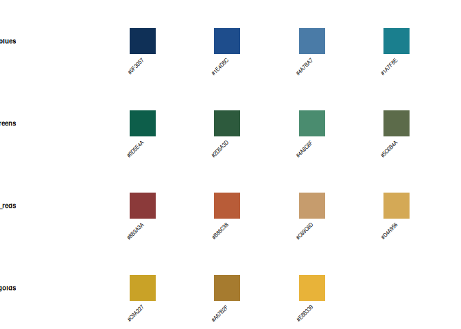

### Using Alhambra palettes for geometric art

``` r

# Create a geometric pattern with Alhambra colors
set.seed(42)
n <- 12
grid <- expand.grid(x = 1:n, y = 1:n)
grid$color <- pattern_colors(nrow(grid), "alhambra_nazari", method = "cyclic")

ggplot(grid, aes(x, y, fill = color)) +
  geom_tile(color = "white", linewidth = 0.5) +
  scale_fill_identity() +
  coord_fixed() +
  labs(title = "Geometric pattern with Alhambra Nazari palette") +
  theme_void() +
  theme(plot.title = element_text(hjust = 0.5, face = "bold"))
```

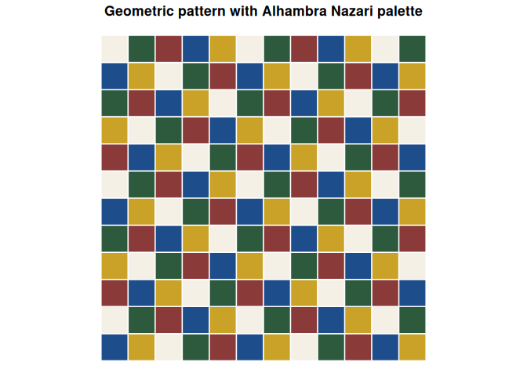

## Chameleon species palettes

koloRo includes 22 palettes based on the documented coloration patterns
of chameleon species from across their global range, derived from
herpetological literature and natural history documentation:

``` r

plot_palette(c(
  "chameleon_pardalis_ambilobe",
  "chameleon_jacksonii",
  "chameleon_calyptratus",
  "chameleon_parsonii"
))
```

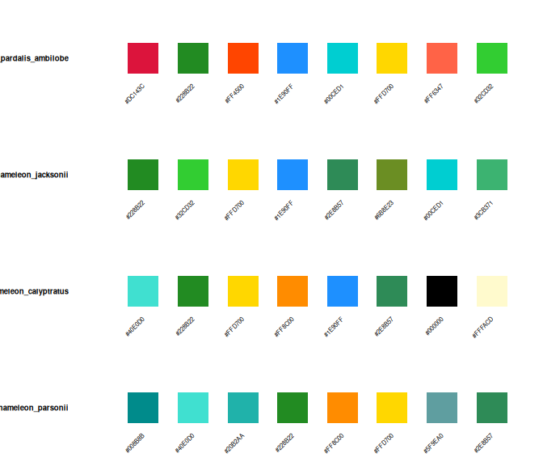

The panther chameleon (*Furcifer pardalis*) from Madagascar displays the
most spectacular color variation, with distinct “locales” corresponding
to geographic populations. Jackson’s three-horned chameleon (*Trioceros
jacksonii*) from East Africa exhibits bright greens with blue and yellow
accents. The veiled chameleon (*Chamaeleo calyptratus*) from the Arabian
Peninsula displays bold turquoise, gold, and orange bands. Parson’s
chameleon (*Calumma parsonii*), the world’s heaviest chameleon, features
turquoise-blue-green body coloration with yellow-orange eye turrets.

### Panther chameleon locales

The panther chameleon exhibits remarkable geographic color variation,
with populations from different regions displaying distinct color
morphs:

``` r

plot_palette(c(
  "chameleon_pardalis_ambilobe",
  "chameleon_pardalis_nosybe",
  "chameleon_pardalis_tamatave"
))
```

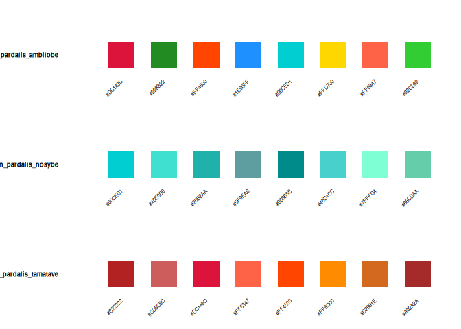

### Using chameleon palettes with ggplot2

``` r

# Scatter plot with panther chameleon Ambilobe palette
ggplot(iris, aes(Sepal.Length, Sepal.Width, color = Species)) +
  geom_point(size = 3, alpha = 0.8) +
  scale_color_koloro("chameleon_pardalis_ambilobe") +
  labs(
    title = "Iris dataset with panther chameleon (Ambilobe) palette",
    subtitle = "Furcifer pardalis: nature's most colorful chameleon"
  ) +
  theme_minimal() +
  theme(legend.position = "bottom")
```

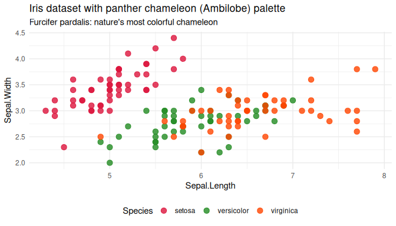

``` r

# Continuous scale with Jackson's chameleon palette
ggplot(faithfuld, aes(waiting, eruptions, fill = density)) +
  geom_tile() +
  scale_fill_koloro_c("chameleon_jacksonii") +
  labs(
    title = "Old Faithful eruptions with Jackson's chameleon palette",
    subtitle = "Trioceros jacksonii: the three-horned chameleon of East Africa"
  ) +
  theme_minimal()
```

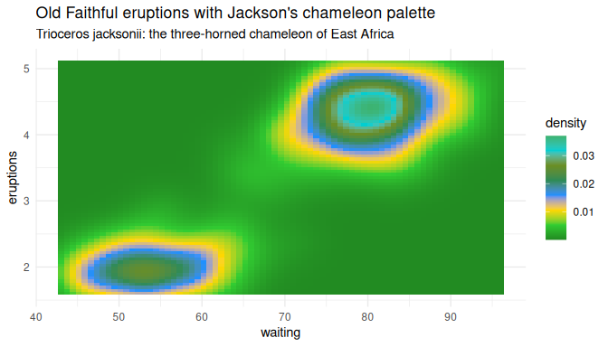

See
[`vignette("chameleon-palettes")`](https://robustecologies.github.io/koloRo/articles/chameleon-palettes.md)
for complete documentation of all 22 chameleon species palettes with
scientific references.

## Cinema palettes

The cinema category draws from the cinematography of Denis Villeneuve’s
*Dune* (2021) and *Dune: Part Two* (2024), capturing Greig Fraser’s
bleach-bypass desert tones, faction color identities, and David Cole’s
color grading signatures:

``` r

plot_palette(c(
  "dune_deep_desert",
  "dune_atreides",
  "dune_spice"
))
```


Some palettes from the movies Dune and Dune: Part Two

## Colorblind-safe visualization

For accessible scientific communication, use validated colorblind-safe
palettes:

``` r

ggplot(mpg, aes(class, fill = class)) +
  geom_bar() +
  scale_fill_koloro("okabe_ito") +
  labs(
    title = "Vehicle classes (Okabe-Ito colorblind-safe palette)",
    x = NULL
  ) +
  theme_minimal() +
  theme(
    axis.text.x = element_text(angle = 45, hjust = 1),
    legend.position = "none"
  )
```

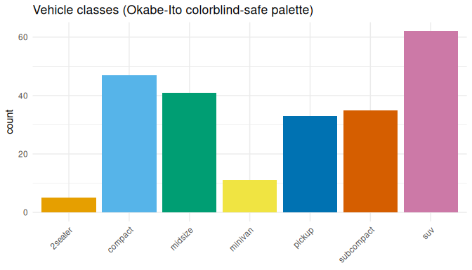

## Oceanographic visualization

koloRo includes perceptually uniform scientific colormaps ideal for
oceanography and earth sciences:

``` r

# Simulated sea surface temperature (SST) data
set.seed(123)
lon <- seq(-180, 180, length.out = 50)
lat <- seq(-60, 60, length.out = 30)
sst_grid <- expand.grid(lon = lon, lat = lat)

# Temperature gradient with latitude and some spatial variation
sst_grid$sst <- 28 - 0.4 * abs(sst_grid$lat) +
  2 * sin(sst_grid$lon * pi / 60) * cos(sst_grid$lat * pi / 40) +
  rnorm(nrow(sst_grid), 0, 1.5)

ggplot(sst_grid, aes(lon, lat, fill = sst)) +
  geom_raster(interpolate = TRUE) +
  scale_fill_koloro_c("batlow", name = "SST (\u00B0C)") +
  labs(
    title = "Sea surface temperature with Batlow palette",
    subtitle = "Perceptually uniform colormap for scientific visualization",
    x = "Longitude", y = "Latitude"
  ) +
  coord_fixed(ratio = 1.5) +
  theme_minimal() +
  theme(
    plot.title = element_text(face = "bold"),
    legend.position = "right"
  )
```

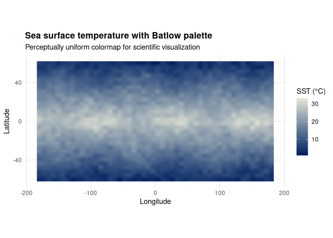

For diverging data like temperature anomalies, use diverging palettes
centered at zero:

``` r

# Temperature anomaly data
sst_grid$anomaly <- sst_grid$sst - mean(sst_grid$sst)

ggplot(sst_grid, aes(lon, lat, fill = anomaly)) +
  geom_raster(interpolate = TRUE) +
  scale_fill_koloro_div("vik", midpoint = 0, name = "Anomaly (\u00B0C)") +
  labs(
    title = "SST anomalies with Vik diverging palette",
    x = "Longitude", y = "Latitude"
  ) +
  coord_fixed(ratio = 1.5) +
  theme_minimal()
```

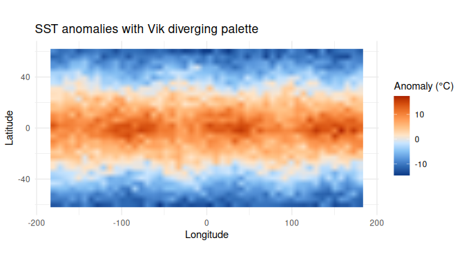

See
[`vignette("scientific-palettes")`](https://robustecologies.github.io/koloRo/articles/scientific-palettes.md)
for more oceanographic examples including bathymetry, chlorophyll-a, and
salinity.

## Color manipulation

koloRo provides functions for color manipulation:

``` r

base <- "#1E4D8C"  # Alhambra blue

# Brightness adjustment
adjust_brightness(base, 0.3)   # Lighter
#>   #1E4D8C 
#> "#6282AF"
adjust_brightness(base, -0.3)  # Darker
#>   #1E4D8C 
#> "#153662"

# Color harmonies
complementary_color(base)
#> [1] "#8C5D1E"
analogous_colors(base, n = 5)
#> [1] "#1E8C5D" "#1E848C" "#1E4D8C" "#261E8C" "#5D1E8C"
triadic_colors(base)
#> [1] "#1E4D8C" "#8C1E4D" "#4D8C1E"

# Effects for 3D illusions
shadow_color(base, intensity = 0.4)
#> [1] "#1A3354"
highlight_color(base, intensity = 0.4)
#> [1] "#4577BA"
```

## Documentation

Explore the vignettes for detailed guidance:

``` r

# Introduction and quick start
vignette("introduction", package = "koloRo")

# Colorblind accessibility
vignette("colorblind-safe", package = "koloRo")

# Alhambra historical palettes
vignette("alhambra-palettes", package = "koloRo")

# Chameleon species palettes
vignette("chameleon-palettes", package = "koloRo")

# ggplot2 integration
vignette("ggplot2-integration", package = "koloRo")

# Scientific visualization (oceanography, climatology)
vignette("scientific-palettes", package = "koloRo")
```

## Contributing

Contributions are welcome! Please feel free to submit issues or pull
requests.

## Citation

If you use koloRo in your research, please cite:

``` R
@software{koloro2026,
  author = {Almaraz, Pablo},
  title = {koloRo: Comprehensive color palettes for scientific visualization,
           accessibility, and geometric art},
  year = {2026},
  url = {https://github.com/robustecologies/koloRo}
}
```

## References

- Crameri, F., Shephard, G.E., & Heron, P.J. (2020). The misuse of
  colour in science communication. *Nature Communications*, 11, 5444.
  [doi:10.1038/s41467-020-19160-7](https://doi.org/10.1038/s41467-020-19160-7)
- Okabe, M., & Ito, K. (2008). Color Universal Design (CUD): How to make
  figures and presentations that are friendly to colorblind people.
  *J*Fly\*. <https://jfly.uni-koeln.de/color/>
- Wong, B. (2011). Points of view: Color blindness. *Nature Methods*,
  8(6), 441.
  [doi:10.1038/nmeth.1618](https://doi.org/10.1038/nmeth.1618)
- Tol, P. (2021). Colour schemes. *SRON Technical Note*
  SRON/EPS/TN/09-002. <https://personal.sron.nl/~pault/>
- Fernández-Puertas, A. (1997). *The Alhambra: From the ninth century to
  Yusuf I (1354)*. London: Saqi Books. ISBN: 978-0-86356-466-6

## License

GPL (\>= 3)

## Author

**Pablo Almaraz**
[](https://orcid.org/0000-0003-1416-2695)

[Robust Ecologies Lab](https://robustecologies.github.io)

## Disclaimer

This package is the original creation of the author in all conceptual,
theoretical, and design aspects. Implementation was assisted by
Anthropic’s Claude Code v.2 (Opus 4.5) to streamline package
development. All original ideas, creativity, and scientific
contributions belong to the author, who maintains full responsibility
for the package’s correctness and reliability. All the code has been
thoroughly tested, and users are encouraged to report any issues through
the package’s issue tracker.
