# Probability distributions provided by lucifer

  

### Distributions

The probability distributions in lucifer are organized by family:

[Univariate continuous: location-scale family](#uclsf)

- [Laplace](#laplace)
- [Asymmetric Laplace](#alaplace)
- [Log-Laplace](#llaplace)
- [Asymmetric log-Laplace](#allaplace)
- [Skew-Laplace](#slaplace)
- [Laplace mixture](#laplacem)
- [Laplace (precision)](#laplacep)
- [Student-t](#st)
- [Student-t (precision)](#stp)
- [Normal (precision)](#normp)
- [Normal (variance)](#normv)
- [Normal mixture](#normm)
- [Normal-Laplace](#normlaplace)
- [Power exponential](#pe)
- [ExGaussian](#exgaussian)

[Half-distributions](#halfdist)

- [Half-Cauchy](#halfcauchy)
- [Half-normal](#halfnorm)
- [Half-t](#halft)

[Positive-support distributions](#possup)

- [Inverse gamma](#invgamma)
- [Inverse chi-squared](#invchisq)
- [Inverse beta](#invbeta)
- [Inverse Gaussian](#invgaussian)
- [Pareto](#pareto)
- [Generalized Pareto](#gpd)
- [Log-normal (precision)](#lnormp)

[Discrete distributions](#discrete)

- [Bernoulli](#bern)
- [Categorical](#cat)
- [Generalized Poisson](#gpois)
- [Skew-discrete Laplace](#sdlaplace)

[Multivariate continuous](#mvcont)

- [Multivariate normal](#mvn)
- [Multivariate t](#mvt)
- [Multivariate Cauchy](#mvc)
- [Multivariate Laplace](#mvl)
- [Asymmetric multivariate Laplace](#aml)
- [Multivariate power exponential](#mvpe)
- [Multivariate Polya](#mvpolya)

[Simplex and Dirichlet](#simplexdir)

- [Dirichlet](#dirichlet)
- [Simplex](#simplex)
- [Stick-breaking](#stick)

[Matrix-valued distributions](#matdist)

- [Wishart](#wishart)
- [Inverse Wishart](#invwishart)
- [Scaled inverse Wishart](#siw)
- [Matrix normal](#matnorm)
- [Matrix gamma](#matgamma)
- [Inverse matrix gamma](#invmatgamma)
- [Matrix-t](#matt)

[Conjugate and structured priors](#conjpriors)

- [Normal-inverse-Wishart](#niw)
- [Normal-Wishart](#nw)
- [Zellner’s g-prior](#zellner)
- [Huang-Wand](#huangwand)
- [Yang-Berger](#yangberger)

[Shrinkage priors](#shrinkage)

- [Horseshoe](#horseshoe)
- [LASSO](#lasso)

[Circular, stable, and compound distributions](#specialcont)

- [Von Mises](#vonmises)
- [Stable](#stable)
- [Tweedie](#tweedie)

[Copulas](#copulas)

- [Clayton](#clayton)
- [Gumbel](#gumbel)
- [Frank](#frank)

[Spatial priors and correlation functions](#spatial)

- [Intrinsic CAR](#car)
- [Matern](#matern)

[Utility: truncated distributions and continuous relaxation](#utility)

- [Truncated](#trunc)
- [Continuous relaxation of MRF](#crmrf)

  

## Preface

The lucifer package provides a comprehensive library of probability
distributions for Bayesian inference, encompassing 74 distribution
families and over 240 individual functions. These distributions were
designed to serve as building blocks for constructing Bayesian models;
they supply the log-densities needed by the MCMC algorithms documented
in the companion vignette, and they provide random number generators for
prior predictive simulation and posterior predictive checking.

  

### Naming conventions

All distribution functions follow the standard R convention of prefixing
the base name with `d` (density), `p` (distribution function), `q`
(quantile function), or `r` (random generation). Not every distribution
implements all four; matrix-valued and multivariate distributions
typically provide only `d` and `r`. Every density function accepts a
`log` argument; when `log = TRUE` the log-density is returned, which is
the form required by the model specification function passed to
[`lucifer()`](https://robustecologies.github.io/lucifer/reference/lucifer.md).

Most of the computational kernels are implemented in C++ via Rcpp,
providing substantial speedups over pure R implementations. Multivariate
distributions exploit the Armadillo linear algebra library, and several
functions use OpenMP for parallel computation when operating on large
matrices.

  

### Parameterization philosophy

Several distribution families are offered in multiple parameterizations.
The multivariate normal, for example, appears in four forms: covariance
(`dmvn`), Cholesky of covariance (`dmvnc`), precision (`dmvnp`), and
Cholesky of precision (`dmvnpc`). The Cholesky parameterizations avoid
redundant matrix decomposition when the Cholesky factor is already
available as a model parameter, and the precision parameterizations are
natural in many Bayesian hierarchical models. The same pattern applies
to the multivariate t, multivariate Cauchy, multivariate Laplace,
multivariate power exponential, Wishart, and inverse Wishart families.

  

### Plotting conventions

All code examples in this vignette use ggplot2 for visualization. The
plotting style emphasizes clean, publication-quality figures with
[`theme_minimal()`](https://ggplot2.tidyverse.org/reference/ggtheme.html)
as the base theme, a restrained color palette, and proper mathematical
notation in axis labels.

  

  

## Univariate continuous: location-scale family

This section collects univariate continuous distributions that are
parameterized primarily by location and scale (or precision) parameters.
They form the backbone of most Bayesian likelihood and prior
specifications for real-valued quantities.

  

### Laplace

The Laplace (double exponential) distribution is a symmetric,
heavy-tailed alternative to the normal distribution. In Bayesian
modeling, the Laplace distribution appears as the likelihood underlying
\\L_1\\ (median) regression and as a sparsity-inducing prior.

\\f(x \mid \mu, \lambda) = \frac{1}{2\lambda} \exp\\\left(-\frac{\|x -
\mu\|}{\lambda}\right)\\

| Parameter   | Description | Constraint             |
|-------------|-------------|------------------------|
| \\\mu\\     | Location    | \\\mu \in \mathbb{R}\\ |
| \\\lambda\\ | Scale       | \\\lambda \> 0\\       |

**Functions:** `dlaplace(x, location, scale, log)`,
`plaplace(q, location, scale)`, `qlaplace(p, location, scale)`,
`rlaplace(n, location, scale)`

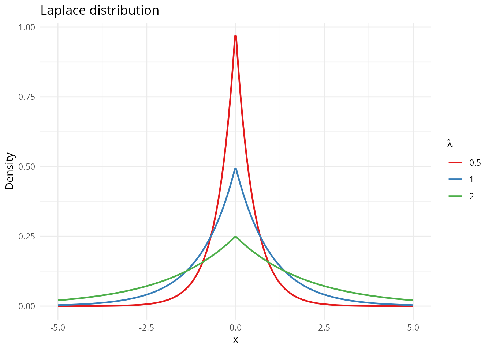

#### References

- Kotz S, Kozubowski TJ, Podgorski K (2001). *The Laplace Distribution
  and Generalizations*. Birkhauser. [DOI:
  10.1007/978-1-4612-0173-1](https://doi.org/10.1007/978-1-4612-0173-1)

  

### Asymmetric Laplace

The asymmetric Laplace distribution extends the symmetric Laplace by
adding a skewness parameter \\\kappa \> 0\\. When \\\kappa = 1\\ the
distribution reduces to the symmetric Laplace; values in \\(0, 1)\\
produce right skew and values in \\(1, \infty)\\ produce left skew. The
asymmetric Laplace arises naturally in Bayesian quantile regression,
where the likelihood for the \\\tau\\-th quantile takes this form.

\\f(x \mid \mu, \lambda, \kappa) = \frac{\kappa}{\lambda(\kappa^2 + 1)}
\begin{cases} \exp\\\left(-\frac{\kappa \|x - \mu\|}{\lambda}\right) & x
\geq \mu \\ \exp\\\left(-\frac{\|x - \mu\|}{\kappa\lambda}\right) & x \<
\mu \end{cases}\\

| Parameter   | Description | Constraint             |
|-------------|-------------|------------------------|
| \\\mu\\     | Location    | \\\mu \in \mathbb{R}\\ |
| \\\lambda\\ | Scale       | \\\lambda \> 0\\       |
| \\\kappa\\  | Asymmetry   | \\\kappa \> 0\\        |

**Functions:** `dalaplace(x, location, scale, kappa, log)`,
`palaplace(q, location, scale, kappa)`,
`qalaplace(p, location, scale, kappa)`,
`ralaplace(n, location, scale, kappa)`

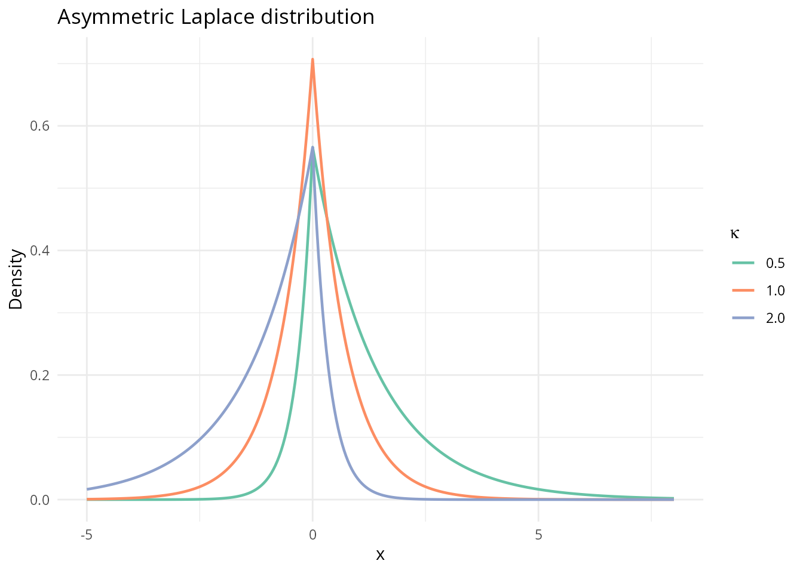

#### References

- Kotz S, Kozubowski TJ, Podgorski K (2001). *The Laplace Distribution
  and Generalizations*. Birkhauser. [DOI:
  10.1007/978-1-4612-0173-1](https://doi.org/10.1007/978-1-4612-0173-1)
- Yu K, Zhang J (2005). “A Three-Parameter Asymmetric Laplace
  Distribution and its Extension.” *Communications in Statistics –
  Theory and Methods*, 34(9-10), 1867-1879. [DOI:
  10.1080/03610920500199018](https://doi.org/10.1080/03610920500199018)

  

### Log-Laplace

The log-Laplace distribution is the distribution of \\\exp(X)\\ when
\\X\\ follows a symmetric Laplace distribution. It is a heavy-tailed
distribution on the positive real line, useful for modeling financial
returns and insurance claim sizes.

\\f(x \mid \mu, \lambda) = \frac{1}{2\lambda x}
\exp\\\left(-\frac{\|\log x - \mu\|}{\lambda}\right), \quad x \> 0\\

| Parameter   | Description                          | Constraint             |
|-------------|--------------------------------------|------------------------|
| \\\mu\\     | Location (of the underlying Laplace) | \\\mu \in \mathbb{R}\\ |
| \\\lambda\\ | Scale                                | \\\lambda \> 0\\       |

**Functions:** `dllaplace(x, location, scale, log)`,
`pllaplace(q, location, scale)`, `qllaplace(p, location, scale)`,
`rllaplace(n, location, scale)`

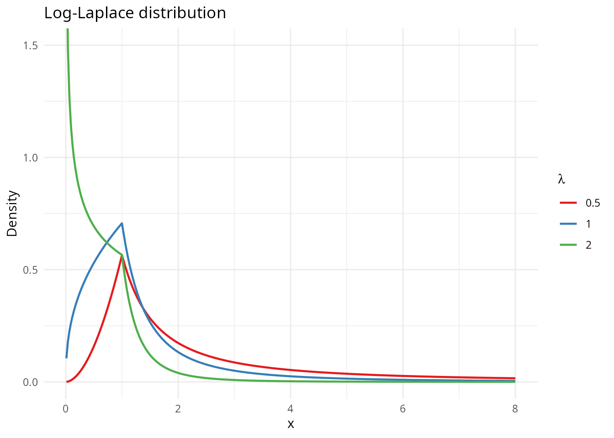

#### References

- Kozubowski TJ, Podgorski K (2003). “Log-Laplace Distributions.”
  *International Mathematical Journal*, 3, 467-495.

  

### Asymmetric log-Laplace

The asymmetric log-Laplace distribution extends the log-Laplace to allow
for skewness via the \\\kappa\\ parameter, following the same
construction as the asymmetric Laplace but on the log scale. If \\X\\
follows an asymmetric Laplace distribution, then \\\exp(X)\\ follows an
asymmetric log-Laplace distribution.

\\f(x \mid \mu, \lambda, \kappa) = \frac{\kappa}{\lambda x (\kappa^2 +
1)} \begin{cases} \exp\\\left(-\frac{\kappa \|\log x -
\mu\|}{\lambda}\right) & x \geq e^\mu \\ \exp\\\left(-\frac{\|\log x -
\mu\|}{\kappa\lambda}\right) & x \< e^\mu \end{cases}\\

| Parameter   | Description          | Constraint             |
|-------------|----------------------|------------------------|
| \\\mu\\     | Location (log scale) | \\\mu \in \mathbb{R}\\ |
| \\\lambda\\ | Scale                | \\\lambda \> 0\\       |
| \\\kappa\\  | Asymmetry            | \\\kappa \> 0\\        |

**Functions:** `dallaplace(x, location, scale, kappa, log)`,
`pallaplace(q, location, scale, kappa)`,
`qallaplace(p, location, scale, kappa)`,
`rallaplace(n, location, scale, kappa)`

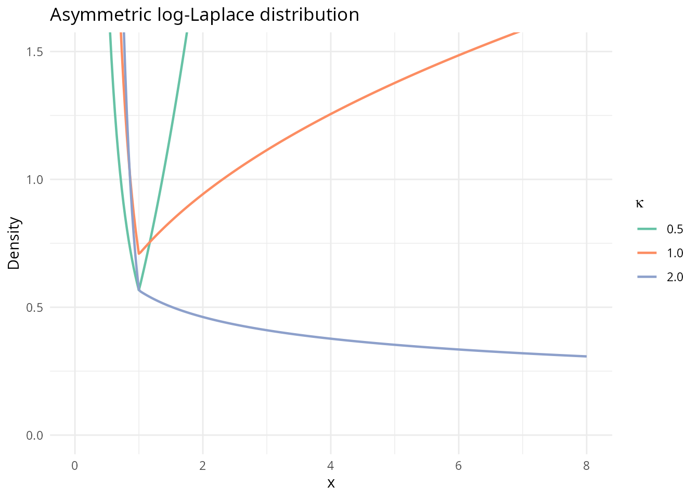

#### References

- Kozubowski TJ, Podgorski K (2003). “Log-Laplace Distributions.”
  *International Mathematical Journal*, 3, 467-495.

  

### Skew-Laplace

The skew-Laplace distribution is an alternative skewed extension of the
Laplace, parameterized by location \\\mu\\ and two positive scale
parameters \\\alpha\\ and \\\beta\\ that independently control the rate
of decay on the left and right sides of the mode. When \\\alpha =
\beta\\ the distribution is symmetric.

\\f(x \mid \mu, \alpha, \beta) = \frac{1}{\alpha + \beta} \begin{cases}
\exp\\\bigl((x - \mu)/\alpha\bigr) & x \< \mu \\ \exp\\\bigl(-(x -
\mu)/\beta\bigr) & x \geq \mu \end{cases}\\

| Parameter  | Description     | Constraint             |
|------------|-----------------|------------------------|
| \\\mu\\    | Location (mode) | \\\mu \in \mathbb{R}\\ |
| \\\alpha\\ | Left scale      | \\\alpha \> 0\\        |
| \\\beta\\  | Right scale     | \\\beta \> 0\\         |

**Functions:** `dslaplace(x, mu, alpha, beta, log)`,
`pslaplace(q, mu, alpha, beta)`, `qslaplace(p, mu, alpha, beta)`,
`rslaplace(n, mu, alpha, beta)`

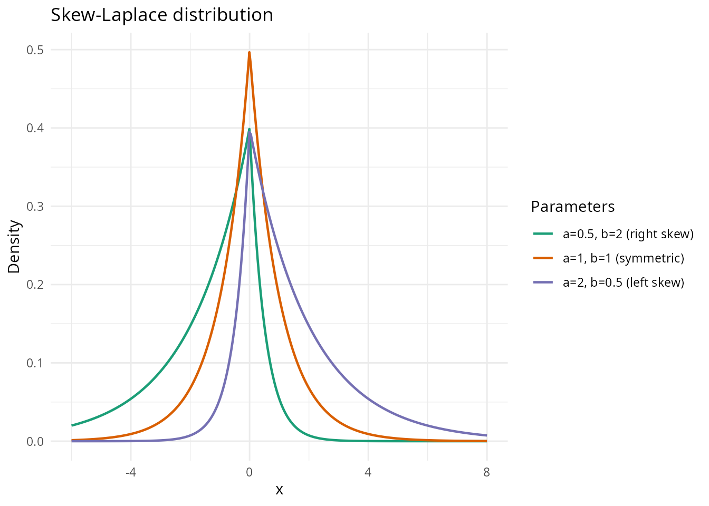

#### References

- Kotz S, Kozubowski TJ, Podgorski K (2001). *The Laplace Distribution
  and Generalizations*. Birkhauser. [DOI:
  10.1007/978-1-4612-0173-1](https://doi.org/10.1007/978-1-4612-0173-1)

  

### Laplace mixture

A finite mixture of \\M\\ Laplace components, useful for modeling
multimodal or heavy-tailed data.

\\f(x) = \sum\_{m=1}^M p_m
\\\frac{1}{2\lambda_m}\exp\\\left(-\frac{\|x -
\mu_m\|}{\lambda_m}\right)\\

where the mixing weights \\p_m\\ are positive and sum to one.

| Parameter | Description | Constraint |
|----|----|----|
| \\p\\ | Mixing weights (length \\M\\) | \\p_m \> 0\\, \\\sum p_m = 1\\ |
| \\\mu\\ | Component locations (length \\M\\) | \\\mu_m \in \mathbb{R}\\ |
| \\\lambda\\ | Component scales (length \\M\\) | \\\lambda_m \> 0\\ |

**Functions:** `dlaplacem(x, p, location, scale, log)`,
`plaplacem(q, p, location, scale)`, `rlaplacem(n, p, location, scale)`

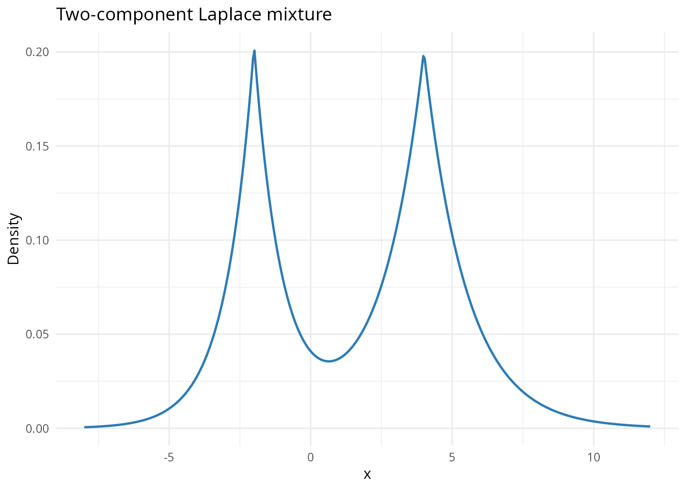

#### References

- Kotz S, Kozubowski TJ, Podgorski K (2001). *The Laplace Distribution
  and Generalizations*. Birkhauser. [DOI:
  10.1007/978-1-4612-0173-1](https://doi.org/10.1007/978-1-4612-0173-1)

  

### Laplace (precision)

The Laplace distribution reparameterized in terms of precision \\\tau =
1/\lambda\\ rather than scale \\\lambda\\. This parameterization is
convenient in models where the precision is assigned a conjugate prior.

\\f(x \mid \mu, \tau) = \frac{\tau}{2} \exp\\\bigl(-\tau \|x -
\mu\|\bigr)\\

| Parameter | Description | Constraint             |
|-----------|-------------|------------------------|
| \\\mu\\   | Location    | \\\mu \in \mathbb{R}\\ |
| \\\tau\\  | Precision   | \\\tau \> 0\\          |

**Functions:** `dlaplacep(x, mu, tau, log)`, `plaplacep(q, mu, tau)`,
`qlaplacep(p, mu, tau)`, `rlaplacep(n, mu, tau)`

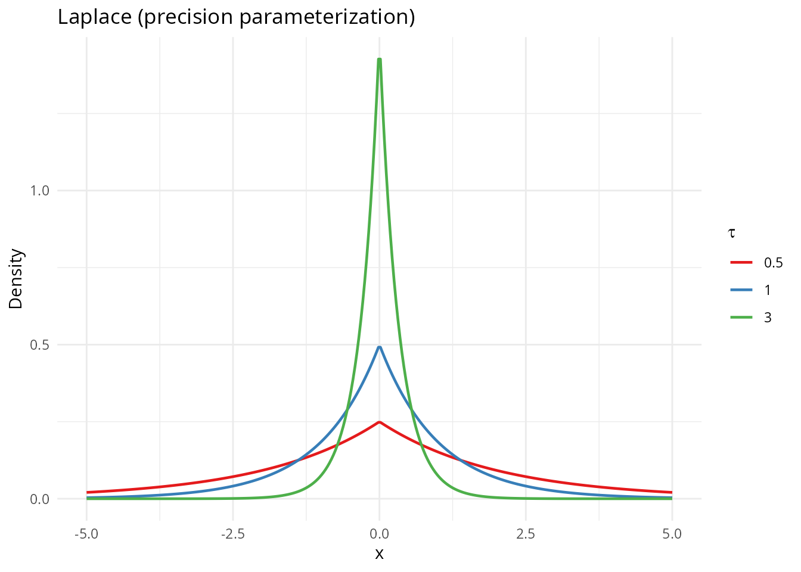

  

### Student-t

The three-parameter Student-t distribution generalizes R’s built-in `dt`
by adding location and scale. It provides a robust alternative to the
normal distribution, with heavier tails controlled by the degrees of
freedom \\\nu\\. As \\\nu \to \infty\\ the density converges to the
normal; at \\\nu = 1\\ it reduces to the Cauchy.

\\f(x \mid \mu, \sigma, \nu) =
\frac{\Gamma\\\bigl((\nu+1)/2\bigr)}{\sigma\sqrt{\nu\pi}\\\Gamma(\nu/2)}
\left(1 +
\frac{1}{\nu}\left(\frac{x-\mu}{\sigma}\right)^2\right)^{\\-(\nu+1)/2}\\

| Parameter  | Description        | Constraint             |
|------------|--------------------|------------------------|
| \\\mu\\    | Location           | \\\mu \in \mathbb{R}\\ |
| \\\sigma\\ | Scale              | \\\sigma \> 0\\        |
| \\\nu\\    | Degrees of freedom | \\\nu \> 0\\           |

**Functions:** `dst(x, mu, sigma, nu, log)`, `pst(q, mu, sigma, nu)`,
`qst(p, mu, sigma, nu)`, `rst(n, mu, sigma, nu)`

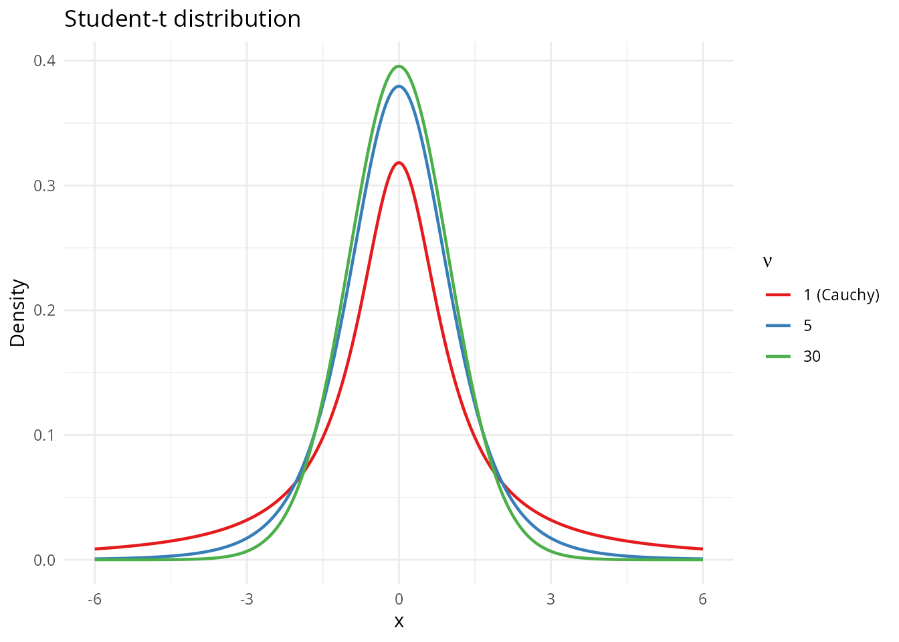

#### References

- Lange KL, Little RJA, Taylor JMG (1989). “Robust Statistical Modeling
  Using the t Distribution.” *Journal of the American Statistical
  Association*, 84(408), 881-896. [DOI:
  10.1080/01621459.1989.10478852](https://doi.org/10.1080/01621459.1989.10478852)

  

### Student-t (precision)

The Student-t reparameterized with precision \\\tau = 1/\sigma^2\\ in
place of scale \\\sigma\\. Internally converts to the scale
parameterization via \\\sigma = 1/\sqrt{\tau}\\.

\\f(x \mid \mu, \tau, \nu) =
\frac{\Gamma\\\bigl((\nu+1)/2\bigr)}{\sqrt{\nu\pi/\tau}\\\Gamma(\nu/2)}
\left(1 + \frac{\tau}{\nu}(x-\mu)^2\right)^{\\-(\nu+1)/2}\\

| Parameter | Description                | Constraint             |
|-----------|----------------------------|------------------------|
| \\\mu\\   | Location                   | \\\mu \in \mathbb{R}\\ |
| \\\tau\\  | Precision (\\1/\sigma^2\\) | \\\tau \> 0\\          |
| \\\nu\\   | Degrees of freedom         | \\\nu \> 0\\           |

**Functions:** `dstp(x, mu, tau, nu, log)`, `pstp(q, mu, tau, nu)`,
`qstp(p, mu, tau, nu)`, `rstp(n, mu, tau, nu)`

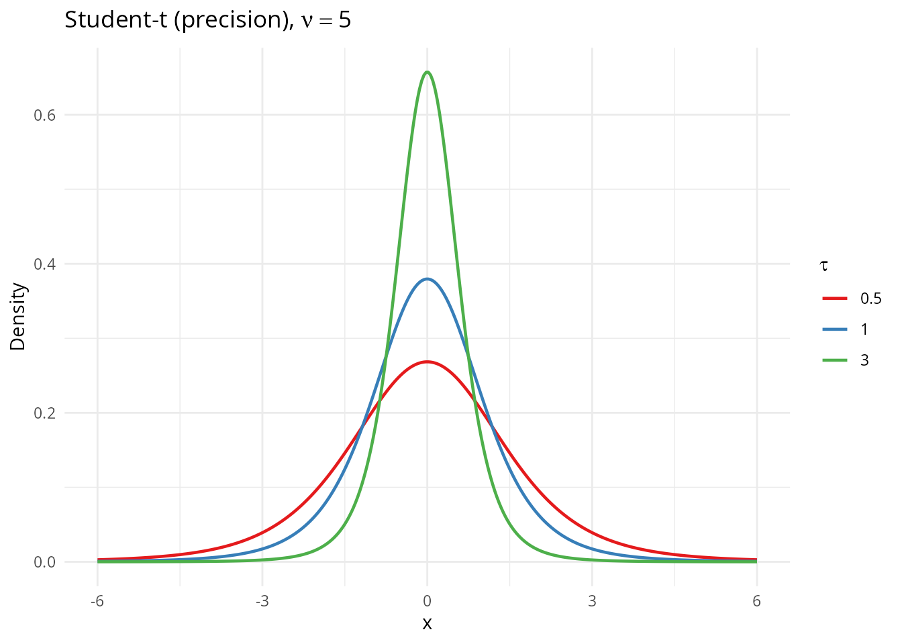

#### References

- Lange KL, Little RJA, Taylor JMG (1989). “Robust Statistical Modeling
  Using the t Distribution.” *Journal of the American Statistical
  Association*, 84(408), 881-896. [DOI:
  10.1080/01621459.1989.10478852](https://doi.org/10.1080/01621459.1989.10478852)

  

### Normal (precision)

The normal distribution parameterized with precision \\\tau =
1/\sigma^2\\ rather than standard deviation. This is the natural
parameterization in many Bayesian conjugate models, where \\\tau\\ is
assigned a gamma prior.

\\f(x \mid \mu, \tau) = \sqrt{\frac{\tau}{2\pi}}
\exp\\\left(-\frac{\tau}{2}(x - \mu)^2\right)\\

| Parameter | Description                | Constraint             |
|-----------|----------------------------|------------------------|
| \\\mu\\   | Mean                       | \\\mu \in \mathbb{R}\\ |
| \\\tau\\  | Precision (\\1/\sigma^2\\) | \\\tau \> 0\\          |

**Functions:** `dnormp(x, mean, prec, log)`, `pnormp(q, mean, prec)`,
`qnormp(p, mean, prec)`, `rnormp(n, mean, prec)`

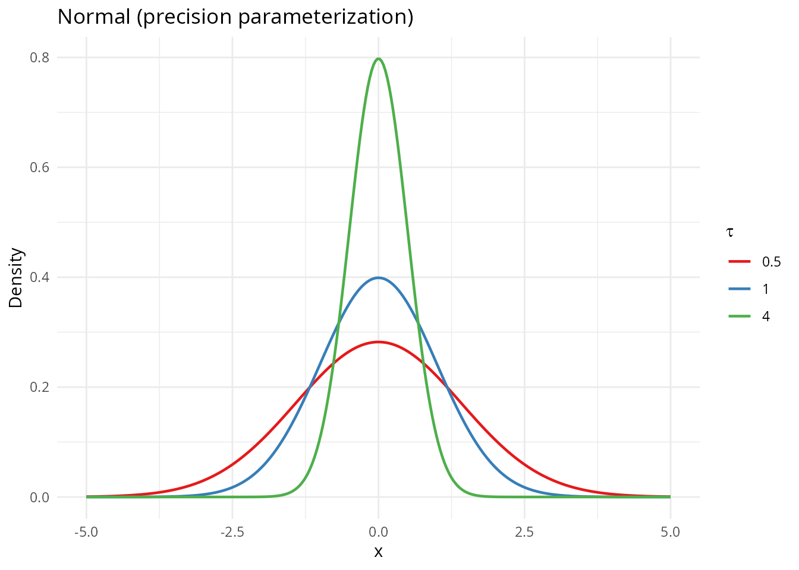

  

### Normal (variance)

The normal distribution parameterized directly with variance
\\\sigma^2\\ rather than standard deviation. Wraps base R’s `dnorm` with
`sd = sqrt(var)`.

\\f(x \mid \mu, \sigma^2) = \frac{1}{\sqrt{2\pi\sigma^2}}
\exp\\\left(-\frac{(x - \mu)^2}{2\sigma^2}\right)\\

| Parameter    | Description | Constraint             |
|--------------|-------------|------------------------|
| \\\mu\\      | Mean        | \\\mu \in \mathbb{R}\\ |
| \\\sigma^2\\ | Variance    | \\\sigma^2 \> 0\\      |

**Functions:** `dnormv(x, mean, var, log)`, `pnormv(q, mean, var)`,
`qnormv(p, mean, var)`, `rnormv(n, mean, var)`

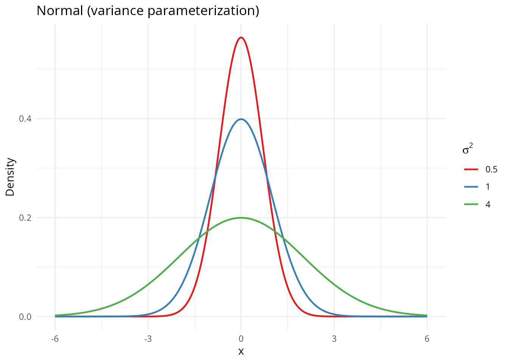

  

### Normal mixture

A finite mixture of \\M\\ normal components, useful as a flexible
likelihood or as a prior for multimodal parameters.

\\f(x) = \sum\_{m=1}^M p_m
\\\frac{1}{\sigma_m\sqrt{2\pi}}\exp\\\left(-\frac{(x -
\mu_m)^2}{2\sigma_m^2}\right)\\

| Parameter | Description | Constraint |
|----|----|----|
| \\p\\ | Mixing weights (length \\M\\) | \\p_m \> 0\\, \\\sum p_m = 1\\ |
| \\\mu\\ | Component means (length \\M\\) | \\\mu_m \in \mathbb{R}\\ |
| \\\sigma\\ | Component standard deviations (length \\M\\) | \\\sigma_m \> 0\\ |

**Functions:** `dnormm(x, p, mu, sigma, log)`,
`pnormm(q, p, mu, sigma)`, `rnormm(n, p, mu, sigma)`

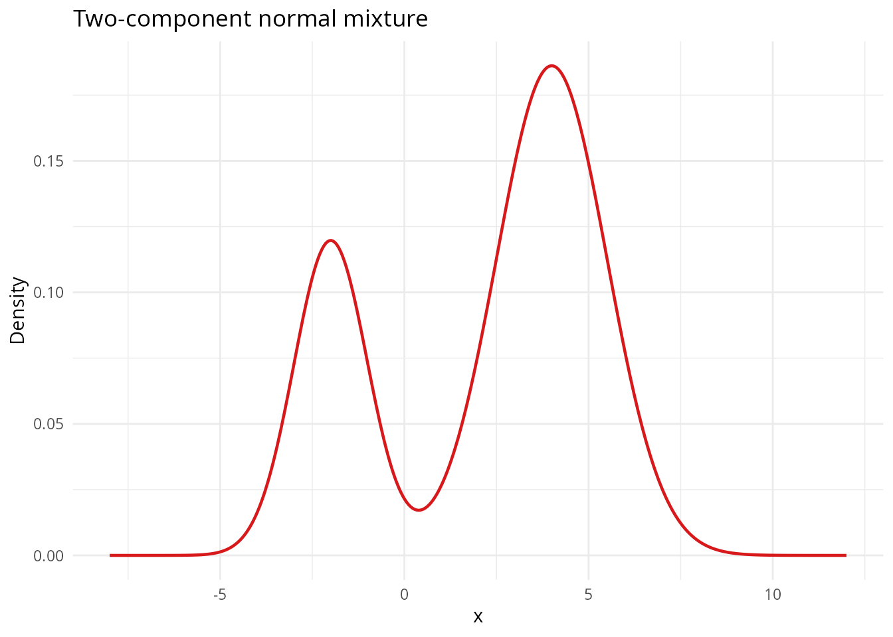

  

### Normal-Laplace

The normal-Laplace distribution is the convolution of a normal and a
skew-Laplace random variable. It arises in financial modeling where
returns exhibit both Gaussian noise and exponential jumps. The density
involves the complementary error function and has four parameters
controlling location, Gaussian width, and left/right tail rates.

\\f(x \mid \mu, \sigma, \alpha, \beta) =
\frac{\alpha\beta}{\alpha+\beta}\left\[\Phi\\\left(\frac{x-\mu}{\sigma} -
\alpha\sigma\right)e^{\alpha\mu + \alpha^2\sigma^2/2 - \alpha x} +
\Phi\\\left(-\frac{x-\mu}{\sigma} + \beta\sigma\right)e^{-\beta\mu +
\beta^2\sigma^2/2 + \beta x}\right\]\\

where \\\Phi\\ is the standard normal CDF.

| Parameter  | Description     | Constraint             |
|------------|-----------------|------------------------|
| \\\mu\\    | Location        | \\\mu \in \mathbb{R}\\ |
| \\\sigma\\ | Gaussian scale  | \\\sigma \> 0\\        |
| \\\alpha\\ | Left tail rate  | \\\alpha \> 0\\        |
| \\\beta\\  | Right tail rate | \\\beta \> 0\\         |

**Functions:** `dnormlaplace(x, mu, sigma, alpha, beta, log)`,
`rnormlaplace(n, mu, sigma, alpha, beta)`

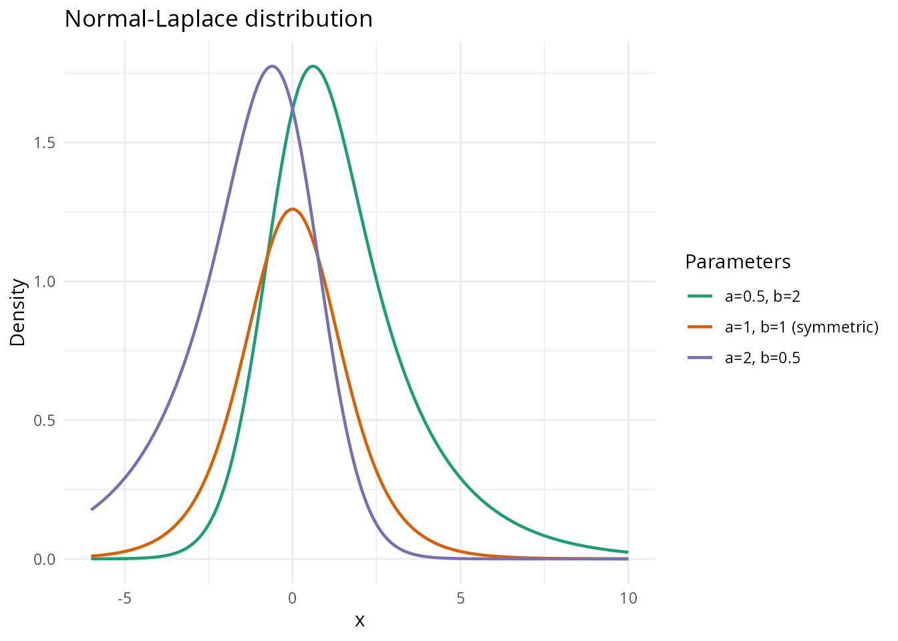

#### References

- Reed WJ (2006). “The Normal-Laplace Distribution and its Relatives.”
  In N Balakrishnan, IG Bairamov, OL Gebizlioglu (eds.), *Advances in
  Distribution Theory, Order Statistics, and Inference*, 61-74.
  Birkhauser. [DOI:
  10.1007/0-8176-4487-3_4](https://doi.org/10.1007/0-8176-4487-3_4)

  

### Power exponential

The power exponential (generalized normal) distribution is a symmetric
family indexed by a kurtosis parameter \\\kappa \> 0\\. At \\\kappa =
2\\ it reduces to the normal distribution; at \\\kappa = 1\\ it is the
Laplace; and as \\\kappa \to \infty\\ it approaches the uniform on
\\\[\mu - \sigma, \mu + \sigma\]\\.

\\f(x \mid \mu, \sigma, \kappa) =
\frac{\kappa}{2\sigma\\\Gamma(1/\kappa)} \exp\\\left(-\left\|\frac{x -
\mu}{\sigma}\right\|^{\kappa}\right)\\

| Parameter  | Description                        | Constraint             |
|------------|------------------------------------|------------------------|
| \\\mu\\    | Location                           | \\\mu \in \mathbb{R}\\ |
| \\\sigma\\ | Scale                              | \\\sigma \> 0\\        |
| \\\kappa\\ | Kurtosis (2 = normal, 1 = Laplace) | \\\kappa \> 0\\        |

**Functions:** `dpe(x, mu, sigma, kappa, log)`,
`ppe(q, mu, sigma, kappa)`, `qpe(p, mu, sigma, kappa)`,
`rpe(n, mu, sigma, kappa)`

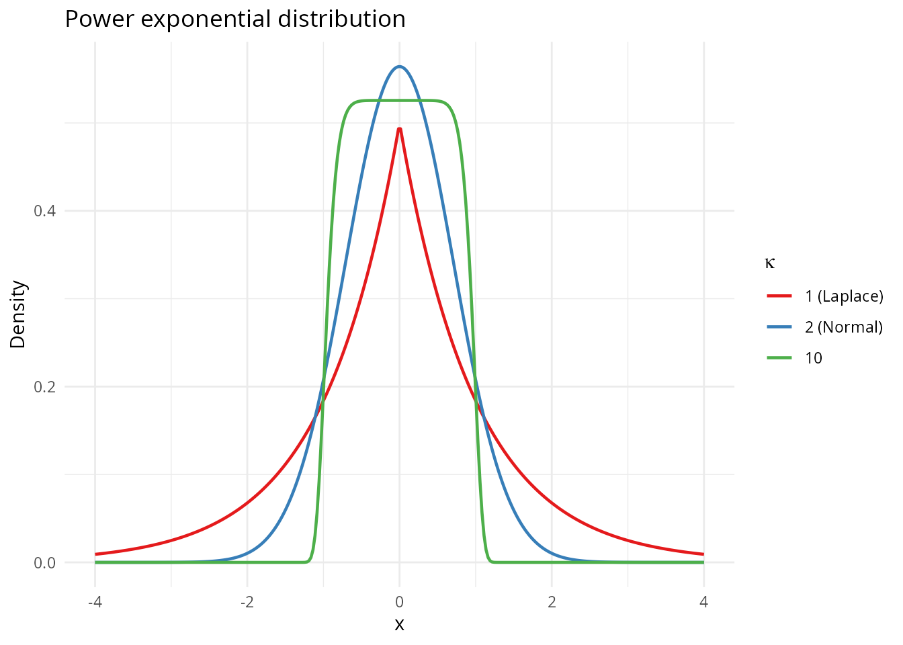

#### References

- Subbotin MT (1923). “On the Law of Frequency of Errors.”
  *Matematicheskii Sbornik*, 31, 296-301.
- Nadarajah S (2005). “A Generalized Normal Distribution.” *Journal of
  Applied Statistics*, 32(7), 685-694. [DOI:
  10.1080/02664760500079464](https://doi.org/10.1080/02664760500079464)

  

### ExGaussian

The exponentially-modified Gaussian (ExGaussian) distribution is the
convolution of a normal and an exponential random variable: if \\X \sim
\mathcal{N}(\mu, \sigma^2)\\ and \\Y \sim \text{Exp}(\lambda)\\, then
\\Z = X + Y\\ follows an ExGaussian distribution. It is widely used in
reaction time modeling and chromatographic peak fitting.

\\f(z) = \frac{\lambda}{2} \exp\\\left(\frac{\lambda}{2}(2\mu +
\lambda\sigma^2 - 2z)\right) \text{erfc}\\\left(\frac{\mu +
\lambda\sigma^2 - z}{\sigma\sqrt{2}}\right)\\

The mean is \\\mu + 1/\lambda\\ and the variance is \\\sigma^2 +
1/\lambda^2\\.

| Parameter   | Description      | Constraint             |
|-------------|------------------|------------------------|
| \\\mu\\     | Gaussian mean    | \\\mu \in \mathbb{R}\\ |
| \\\sigma\\  | Gaussian scale   | \\\sigma \> 0\\        |
| \\\lambda\\ | Exponential rate | \\\lambda \> 0\\       |

**Functions:** `dexgaussian(x, mu, sigma, lambda, log)`,
`pexgaussian(q, mu, sigma, lambda)`, `rexgaussian(n, mu, sigma, lambda)`

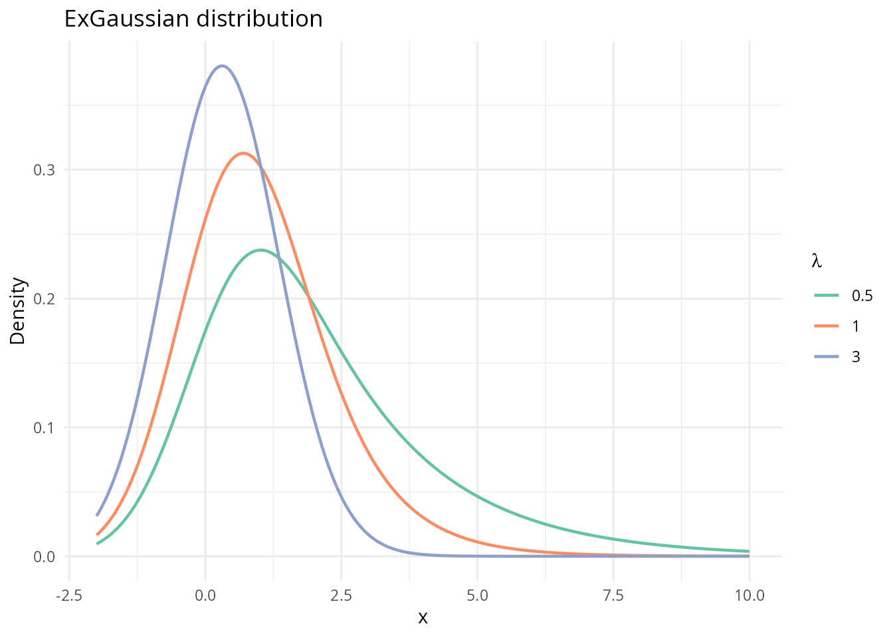

#### References

- Luce RD (1986). *Response Times: Their Role in Inferring Elementary
  Mental Organization*. Oxford University Press. ISBN:
  978-0-19-503642-4.
- Grushka E (1972). “Characterization of Exponentially Modified Gaussian
  Peaks in Chromatography.” *Analytical Chemistry*, 44(11), 1733-1738.
  [DOI: 10.1021/ac60319a011](https://doi.org/10.1021/ac60319a011)

  

## Half-distributions

Half-distributions are formed by folding a symmetric distribution at
zero and restricting to the positive real line. They are widely
recommended as weakly informative prior distributions for scale and
variance parameters in hierarchical models.

  

### Half-Cauchy

The half-Cauchy distribution is the positive half of a Cauchy
distribution centered at zero. Gelman (2006) recommends it as a default
weakly informative prior for scale parameters in hierarchical models,
with \\\alpha = 25\\ providing broad but proper coverage.

\\f(x \mid \alpha) = \frac{2}{\pi\alpha\left(1 + (x/\alpha)^2\right)},
\quad x \geq 0\\

| Parameter  | Description | Constraint                   |
|------------|-------------|------------------------------|
| \\\alpha\\ | Scale       | \\\alpha \> 0\\ (default 25) |

**Functions:** `dhalfcauchy(x, scale, log)`, `phalfcauchy(q, scale)`,
`qhalfcauchy(p, scale)`, `rhalfcauchy(n, scale)`

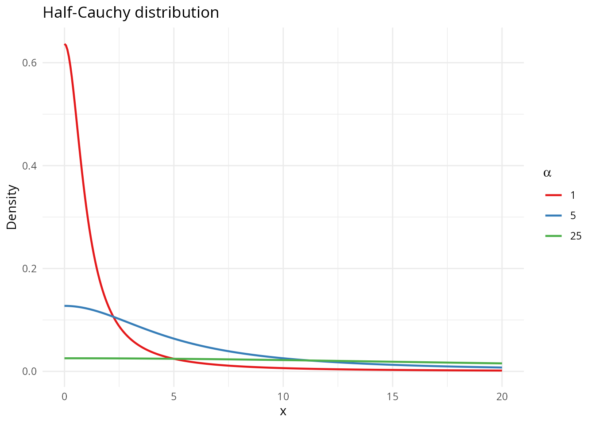

#### References

- Gelman A (2006). “Prior Distributions for Variance Parameters in
  Hierarchical Models.” *Bayesian Analysis*, 1(3), 515-533. [DOI:
  10.1214/06-BA117A](https://doi.org/10.1214/06-BA117A)

  

### Half-normal

The half-normal distribution restricts the normal distribution to \\x
\geq 0\\. The default scale is \\\sqrt{\pi/2}\\, which gives unit
variance. It is a natural prior for standard deviation parameters when
an informative scale is available.

\\f(x \mid \sigma) = \frac{\sqrt{2}}{\sigma\sqrt{\pi}}
\exp\\\left(-\frac{x^2}{2\sigma^2}\right), \quad x \geq 0\\

| Parameter  | Description | Constraint                                 |
|------------|-------------|--------------------------------------------|
| \\\sigma\\ | Scale       | \\\sigma \> 0\\ (default \\\sqrt{\pi/2}\\) |

**Functions:** `dhalfnorm(x, scale, log)`, `phalfnorm(q, scale)`,
`qhalfnorm(p, scale)`, `rhalfnorm(n, scale)`

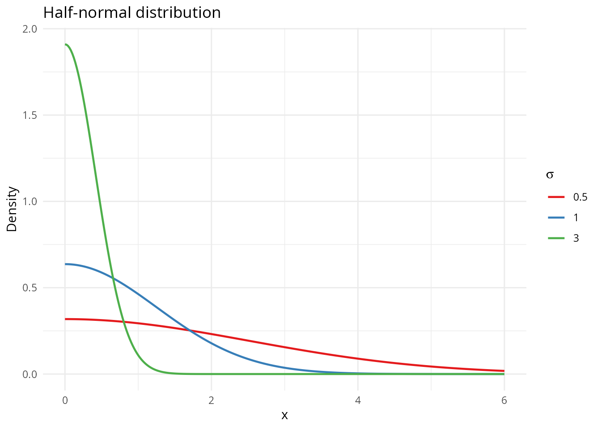

#### References

- Gelman A (2006). “Prior Distributions for Variance Parameters in
  Hierarchical Models.” *Bayesian Analysis*, 1(3), 515-533. [DOI:
  10.1214/06-BA117A](https://doi.org/10.1214/06-BA117A)

  

### Half-t

The half-t distribution generalizes the half-Cauchy by introducing a
degrees-of-freedom parameter \\\nu\\. At \\\nu = 1\\ it is the
half-Cauchy; as \\\nu \to \infty\\ it approaches the half-normal. This
provides a family of priors that can be tuned between the heavy-tailed
half-Cauchy and the lighter-tailed half-normal. Implemented via
truncation of the three-parameter Student-t to \\\[0, \infty)\\.

\\f(x \mid \alpha, \nu) =
\frac{2}{\alpha}\frac{\Gamma\\\bigl((\nu+1)/2\bigr)}{\sqrt{\nu\pi}\\\Gamma(\nu/2)}
\left(1 +
\frac{1}{\nu}\left(\frac{x}{\alpha}\right)^2\right)^{\\-(\nu+1)/2},
\quad x \geq 0\\

| Parameter  | Description        | Constraint                   |
|------------|--------------------|------------------------------|
| \\\alpha\\ | Scale              | \\\alpha \> 0\\ (default 25) |
| \\\nu\\    | Degrees of freedom | \\\nu \> 0\\ (default 1)     |

**Functions:** `dhalft(x, scale, nu, log)`, `phalft(q, scale, nu)`,
`qhalft(p, scale, nu)`, `rhalft(n, scale, nu)`

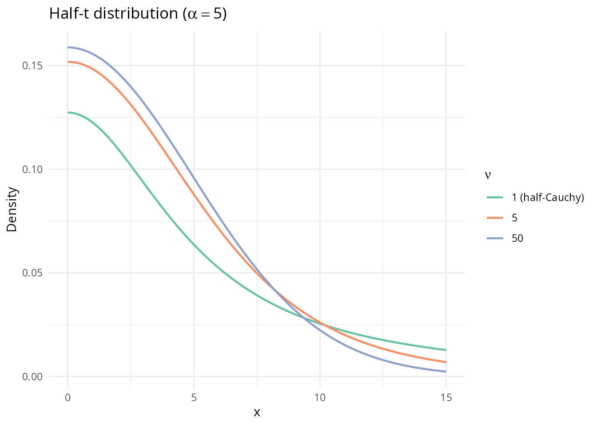

#### References

- Gelman A (2006). “Prior Distributions for Variance Parameters in
  Hierarchical Models.” *Bayesian Analysis*, 1(3), 515-533. [DOI:
  10.1214/06-BA117A](https://doi.org/10.1214/06-BA117A)

  

## Positive-support distributions

Distributions on the positive real line serve as priors for variance,
precision, and scale parameters.

  

### Inverse gamma

The inverse gamma distribution is the distribution of \\1/X\\ when \\X
\sim \text{Gamma}(\alpha, \beta)\\. It is the conjugate prior for the
variance of a normal likelihood and one of the most common variance
priors in Bayesian statistics, though it can be informative near zero
for small shape parameters.

\\f(x \mid \alpha, \beta) = \frac{\beta^\alpha}{\Gamma(\alpha)}
x^{-\alpha-1} \exp\\\left(-\frac{\beta}{x}\right), \quad x \> 0\\

| Parameter  | Description | Constraint                  |
|------------|-------------|-----------------------------|
| \\\alpha\\ | Shape       | \\\alpha \> 0\\ (default 1) |
| \\\beta\\  | Scale       | \\\beta \> 0\\ (default 1)  |

**Functions:** `dinvgamma(x, shape, scale, log)`,
`rinvgamma(n, shape, scale)`

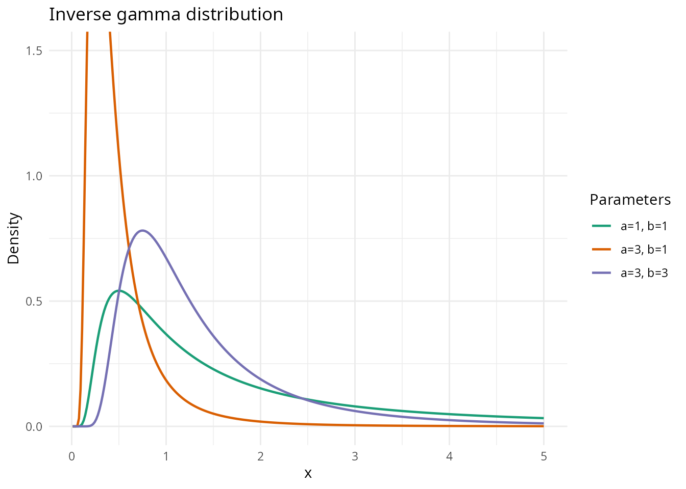

#### References

- Gelman A, Carlin JB, Stern HS, Dunson DB, Vehtari A, Rubin DB (2014).
  *Bayesian Data Analysis*, 3rd ed. CRC Press. ISBN: 978-1-4398-4095-5.

  

### Inverse chi-squared

The scaled inverse chi-squared distribution is a special case of the
inverse gamma with \\\alpha = \nu/2\\ and \\\beta = \nu\lambda/2\\,
where \\\nu\\ is degrees of freedom and \\\lambda\\ is the scale. It is
the conjugate prior for the variance of a normal distribution with known
mean.

\\f(x \mid \nu, \lambda) = \frac{(\nu\lambda/2)^{\nu/2}}{\Gamma(\nu/2)}
x^{-\nu/2 - 1} \exp\\\left(-\frac{\nu\lambda}{2x}\right), \quad x \> 0\\

| Parameter   | Description        | Constraint                           |
|-------------|--------------------|--------------------------------------|
| \\\nu\\     | Degrees of freedom | \\\nu \> 0\\                         |
| \\\lambda\\ | Scale              | \\\lambda \> 0\\ (default \\1/\nu\\) |

**Functions:** `dinvchisq(x, df, scale, log)`, `rinvchisq(n, df, scale)`

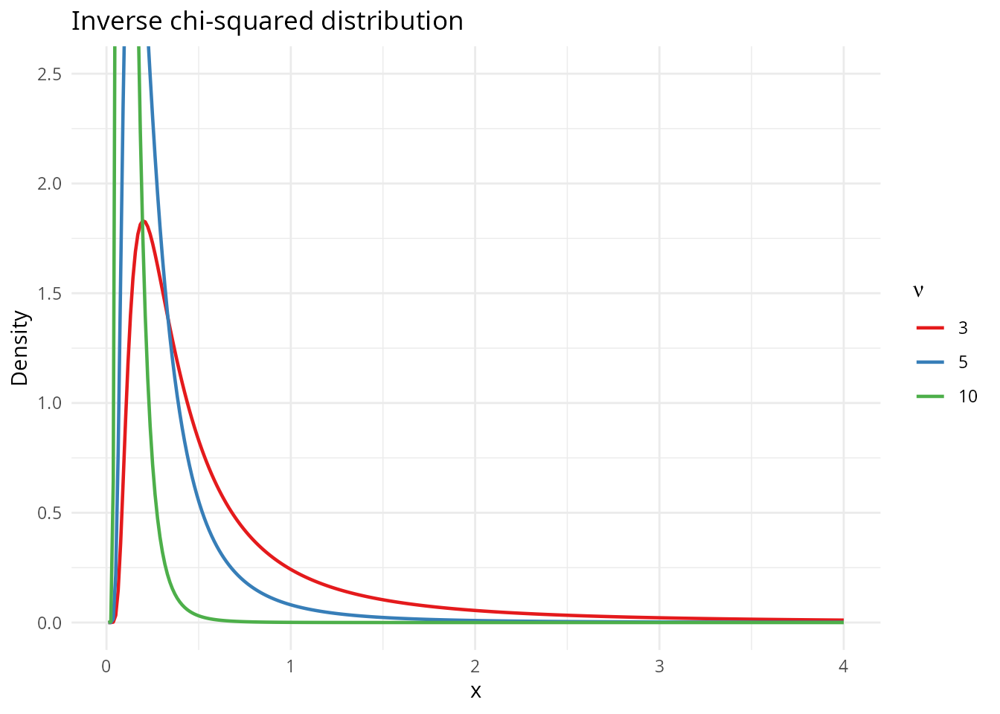

#### References

- Gelman A, Carlin JB, Stern HS, Dunson DB, Vehtari A, Rubin DB (2014).
  *Bayesian Data Analysis*, 3rd ed. CRC Press. ISBN: 978-1-4398-4095-5.

  

### Inverse beta

The inverse beta distribution is the distribution of \\X/(1-X)\\ when
\\X \sim \text{Beta}(a, b)\\. It is supported on \\(0, \infty)\\ and
useful as a prior for positive parameters when the beta distribution’s
\\(0,1)\\ support is too restrictive.

\\f(x \mid a, b) = \frac{x^{a-1}(1+x)^{-(a+b)}}{B(a,b)}, \quad x \> 0\\

| Parameter | Description | Constraint |
|-----------|-------------|------------|
| \\a\\     | Shape 1     | \\a \> 0\\ |
| \\b\\     | Shape 2     | \\b \> 0\\ |

**Functions:** `dinvbeta(x, a, b, log)`, `rinvbeta(n, a, b)`

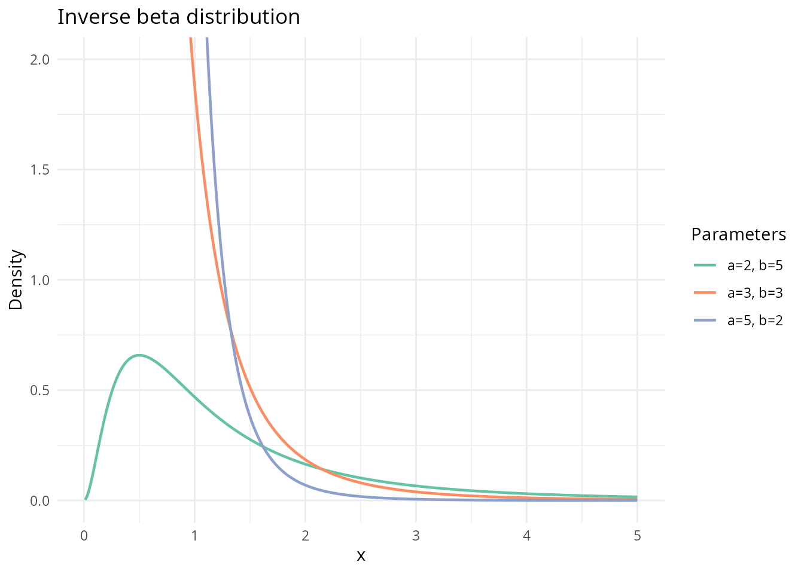

#### References

- Johnson NL, Kotz S, Balakrishnan N (1995). *Continuous Univariate
  Distributions*, Vol. 2, 2nd ed. Wiley. ISBN: 978-0-471-58494-0.

  

### Inverse Gaussian

The inverse Gaussian distribution models the first passage time of a
Brownian motion with positive drift. It is a two-parameter family on
\\(0, \infty)\\ with a right-skewed, unimodal density.

\\f(x \mid \mu, \lambda) = \sqrt{\frac{\lambda}{2\pi x^3}}
\exp\\\left(-\frac{\lambda(x - \mu)^2}{2\mu^2 x}\right), \quad x \> 0\\

| Parameter   | Description              | Constraint       |
|-------------|--------------------------|------------------|
| \\\mu\\     | Mean                     | \\\mu \> 0\\     |
| \\\lambda\\ | Shape (inverse-variance) | \\\lambda \> 0\\ |

**Functions:** `dinvgaussian(x, mu, lambda, log)`,
`rinvgaussian(n, mu, lambda)`

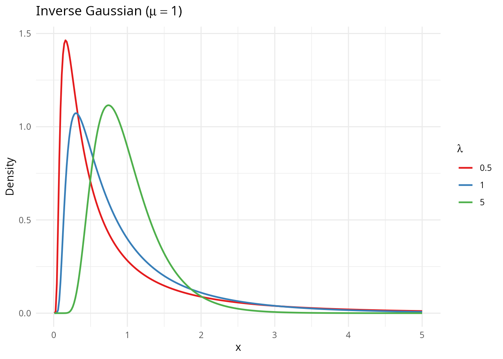

#### References

- Chhikara RS, Folks JL (1989). *The Inverse Gaussian Distribution:
  Theory, Methodology, and Applications*. Marcel Dekker. ISBN:
  978-0-8247-7997-5.

  

### Pareto

The Pareto distribution is a power-law distribution on \\\[1, \infty)\\
widely used to model income distributions, city sizes, and other
phenomena exhibiting scaling behavior.

\\f(x \mid \alpha) = \alpha x^{-(\alpha+1)}, \quad x \geq 1\\

| Parameter  | Description        | Constraint      |
|------------|--------------------|-----------------|
| \\\alpha\\ | Shape (tail index) | \\\alpha \> 0\\ |

**Functions:** `dpareto(x, alpha, log)`, `ppareto(q, alpha)`,
`qpareto(p, alpha)`, `rpareto(n, alpha)`

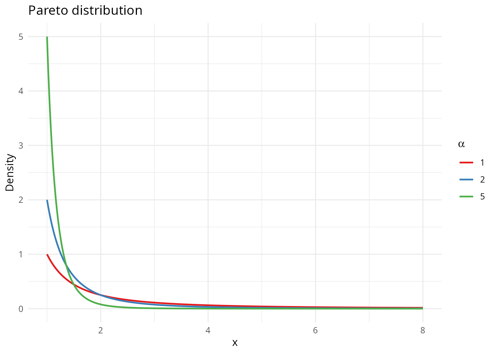

#### References

- Arnold BC (2015). *Pareto Distributions*, 2nd ed. CRC Press. ISBN:
  978-1-4665-8484-6.

  

### Generalized Pareto

The generalized Pareto distribution (GPD) extends the Pareto by adding
location and shape parameters. It arises naturally as the limiting
distribution of exceedances over a high threshold (Pickands, 1975),
making it fundamental to extreme value theory.

\\f(x \mid \mu, \sigma, \xi) = \frac{1}{\sigma}\left(1 + \xi\frac{x -
\mu}{\sigma}\right)^{-1/\xi - 1}\\

for \\\xi \neq 0\\, and \\f(x) = \sigma^{-1}\exp(-(x-\mu)/\sigma)\\ for
\\\xi = 0\\ (exponential case).

| Parameter  | Description          | Constraint             |
|------------|----------------------|------------------------|
| \\\mu\\    | Location (threshold) | \\\mu \in \mathbb{R}\\ |
| \\\sigma\\ | Scale                | \\\sigma \> 0\\        |
| \\\xi\\    | Shape                | \\\xi \in \mathbb{R}\\ |

**Functions:** `dgpd(x, mu, sigma, xi, log)`, `rgpd(n, mu, sigma, xi)`

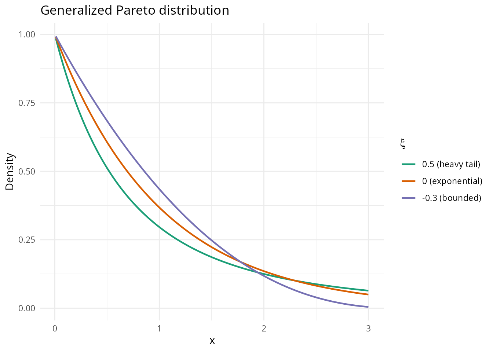

#### References

- Pickands J (1975). “Statistical Inference Using Extreme Order
  Statistics.” *The Annals of Statistics*, 3, 119-131. [DOI:
  10.1214/aos/1176343003](https://doi.org/10.1214/aos/1176343003)

  

### Log-normal (precision)

The log-normal distribution reparameterized with precision \\\tau =
1/\sigma^2\\ (or optionally variance) on the log scale, so that
\\\log(X) \sim \mathcal{N}(\mu, 1/\tau)\\. This is convenient in models
where the log-scale precision is the natural parameter.

\\f(x \mid \mu, \tau) = \frac{\sqrt{\tau}}{x\sqrt{2\pi}}
\exp\\\left(-\frac{\tau}{2}(\log x - \mu)^2\right), \quad x \> 0\\

| Parameter | Description         | Constraint             |
|-----------|---------------------|------------------------|
| \\\mu\\   | Log-scale mean      | \\\mu \in \mathbb{R}\\ |
| \\\tau\\  | Log-scale precision | \\\tau \> 0\\          |

**Functions:** `dlnormp(x, mu, tau, var, log)`, `plnormp(q, mu, tau)`,
`qlnormp(p, mu, tau)`, `rlnormp(n, mu, tau, var)`

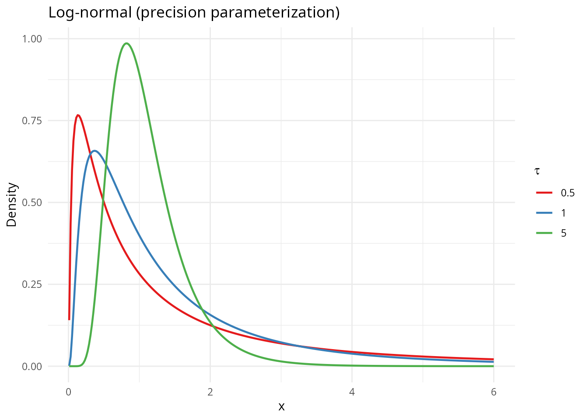

  

## Discrete distributions

  

### Bernoulli

The Bernoulli distribution models a single binary trial with success
probability \\p\\. It is the binomial distribution with \\n = 1\\ and
serves as the foundation for logistic regression and probit models. The
beta distribution is its conjugate prior.

\\\Pr(X = x \mid p) = p^x (1-p)^{1-x}, \quad x \in \\0, 1\\\\

| Parameter | Description         | Constraint         |
|-----------|---------------------|--------------------|
| \\p\\     | Success probability | \\p \in \[0, 1\]\\ |

**Functions:** `dbern(x, prob, log)`, `pbern(q, prob)`,
`qbern(p, prob)`, `rbern(n, prob)`

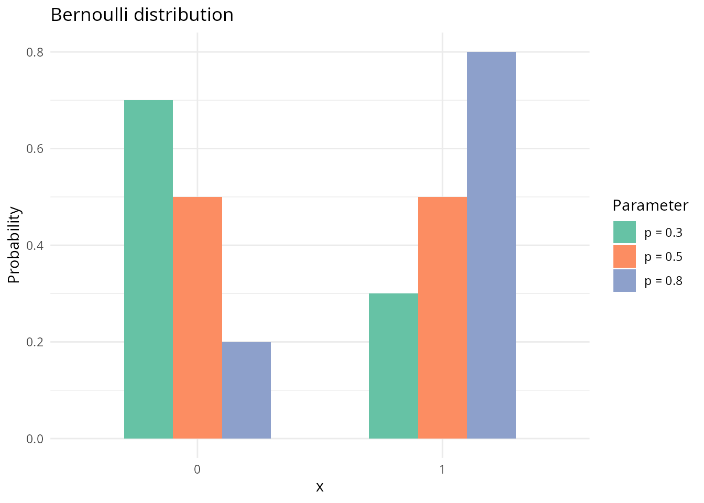

  

### Categorical

The categorical distribution generalizes the Bernoulli to \\k\\
categories. It describes the outcome of a single trial with \\k\\
possible results, each occurring with probability \\p_j\\. The Dirichlet
distribution is its conjugate prior. The function `dcat` accepts either
an integer-valued vector or an indicator matrix as input.

\\\Pr(X = j \mid p) = p_j, \quad j \in \\1, \ldots, k\\, \quad
\sum\_{j=1}^k p_j = 1\\

| Parameter | Description | Constraint |
|----|----|----|
| \\p\\ | Probability vector (length \\k\\) | \\p_j \geq 0\\, \\\sum p_j = 1\\ |

**Functions:** `dcat(x, p, log)`, `qcat(pr, p)`, `rcat(n, p)`

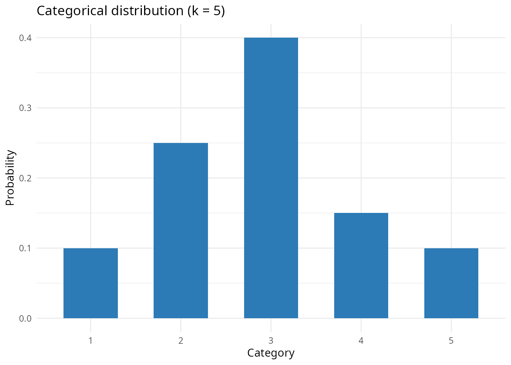

  

### Generalized Poisson

The generalized Poisson distribution (Consul, 1989) extends the standard
Poisson by adding a dispersion parameter \\\omega \in \[0, 1)\\ that
allows both underdispersion and overdispersion. When \\\omega = 0\\ it
reduces to the ordinary Poisson.

\\\Pr(X = x \mid \lambda, \omega) = \frac{\lambda(\lambda +
x\omega)^{x-1}}{x!} \exp\\\bigl(-\lambda - x\omega\bigr), \quad x = 0,
1, 2, \ldots\\

| Parameter   | Description | Constraint             |
|-------------|-------------|------------------------|
| \\\lambda\\ | Rate        | \\\lambda \> 0\\       |
| \\\omega\\  | Dispersion  | \\\omega \in \[0, 1)\\ |

**Functions:** `dgpois(x, lambda, omega, log)`

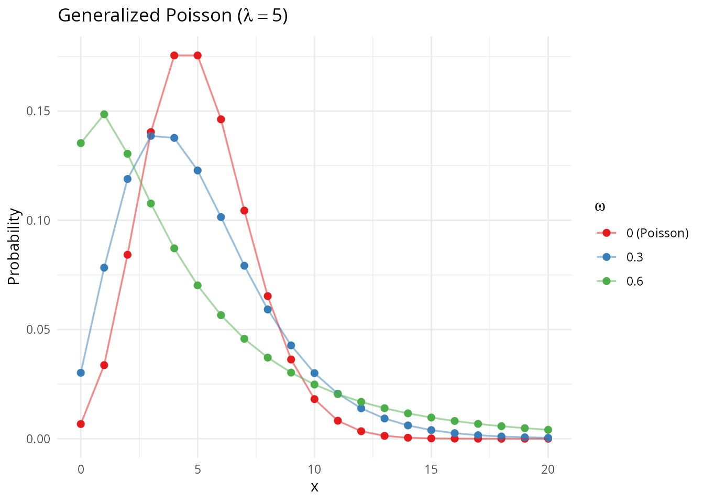

#### References

- Consul P (1989). *Generalized Poisson Distribution: Properties and
  Applications*. Marcel Dekker. ISBN: 978-0-8247-8071-1.

  

### Skew-discrete Laplace

The skew-discrete Laplace distribution is a discrete distribution on the
integers, parameterized by \\p, q \in \[0, 1\]\\. It is the discrete
analogue of the skew-Laplace distribution and is useful for modeling
integer-valued time series with asymmetric behavior.

\\\Pr(X = x \mid p, q) = \frac{(1-p)(1-q)}{1-pq} \begin{cases} p^{\|x\|}
& x \leq 0 \\ q^x & x \> 0 \end{cases}\\

| Parameter | Description      | Constraint         |
|-----------|------------------|--------------------|
| \\p\\     | Left tail decay  | \\p \in \[0, 1\]\\ |
| \\q\\     | Right tail decay | \\q \in \[0, 1\]\\ |

**Functions:** `dsdlaplace(x, p, q, log)`, `psdlaplace(x, p, q)`,
`qsdlaplace(prob, p, q)`, `rsdlaplace(n, p, q)`

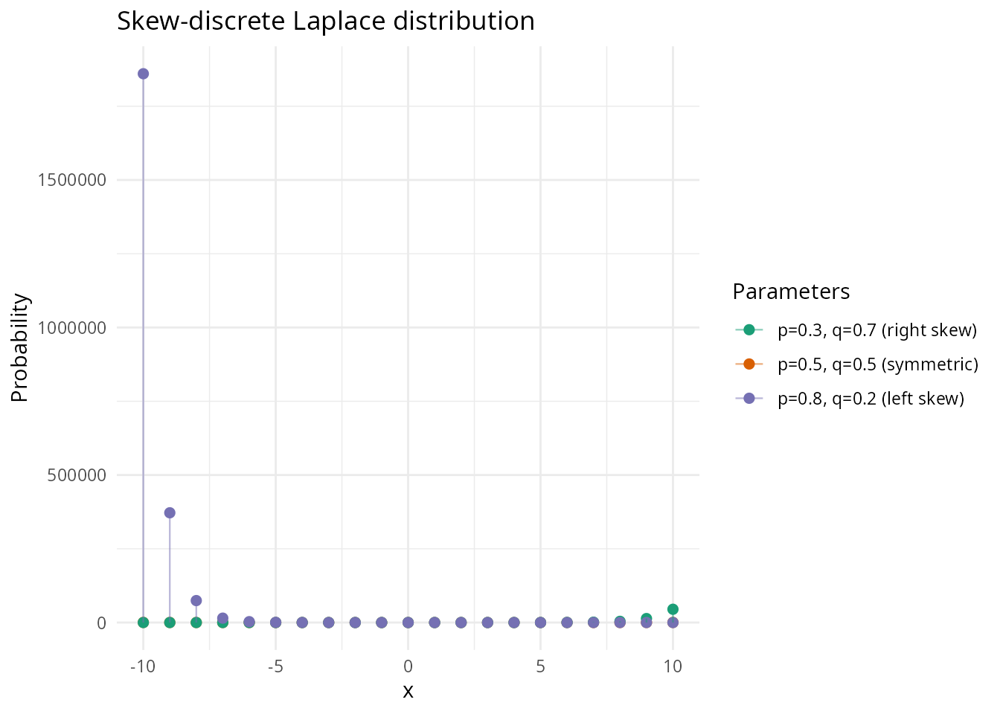

#### References

- Kozubowski TJ, Inusah S (2006). “A Skew Laplace Distribution on
  Integers.” *Annals of the Institute of Statistical Mathematics*,
  58(3), 555-571. [DOI:
  10.1007/s10463-005-0029-1](https://doi.org/10.1007/s10463-005-0029-1)

  

## Multivariate continuous

Multivariate distributions are parameterized by a mean vector \\\mu\\
and a \\k \times k\\ positive-definite matrix that controls scale and
correlation. Each family below is available in up to four
parameterizations: covariance matrix \\\Sigma\\, Cholesky factor of
\\\Sigma\\, precision matrix \\\Omega = \Sigma^{-1}\\, and Cholesky
factor of \\\Omega\\. The Cholesky variants avoid redundant
decomposition when the factor is a model parameter, and the precision
variants are natural in Gaussian Markov random fields and conditional
models.

  

### Multivariate normal

The multivariate normal distribution is the workhorse of Bayesian
inference.

\\f(x \mid \mu, \Sigma) = (2\pi)^{-k/2} \|\Sigma\|^{-1/2}
\exp\\\left(-\frac{1}{2}(x - \mu)^T \Sigma^{-1} (x - \mu)\right)\\

| Parameter  | Description                        | Constraint               |
|------------|------------------------------------|--------------------------|
| \\\mu\\    | Mean vector (length \\k\\)         | \\\mu \in \mathbb{R}^k\\ |
| \\\Sigma\\ | Covariance matrix (\\k \times k\\) | Positive-definite        |

**Parameterizations:**

| Variant | Function prefix | Scale parameter |
|----|----|----|
| Covariance | `dmvn` / `rmvn` | \\\Sigma\\ (covariance matrix) |
| Cholesky | `dmvnc` / `rmvnc` | \\U\\ (upper Cholesky of \\\Sigma\\) |
| Precision | `dmvnp` / `rmvnp` | \\\Omega\\ (precision matrix) |
| Precision-Cholesky | `dmvnpc` / `rmvnpc` | \\U\\ (upper Cholesky of \\\Omega\\) |

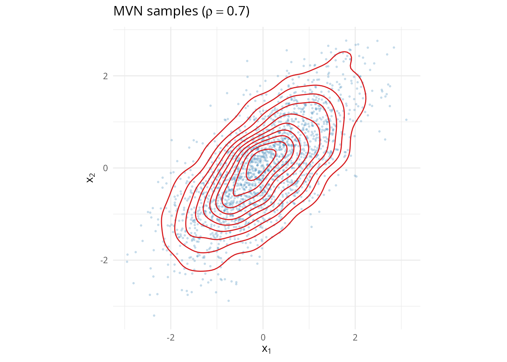

#### References

- Anderson TW (2003). *An Introduction to Multivariate Statistical
  Analysis*, 3rd ed. Wiley. ISBN: 978-0-471-36091-9.

  

### Multivariate t

The multivariate t distribution generalizes the multivariate normal by
replacing the quadratic form with a scaled version that accommodates
heavier tails. As \\\nu \to \infty\\ it converges to the MVN; at \\\nu =
1\\ it is the multivariate Cauchy. Internally, when \\\nu \> 10000\\ the
MVN density is returned for numerical stability.

\\f(x \mid \mu, S, \nu) =
\frac{\Gamma\\\bigl((\nu+k)/2\bigr)}{\Gamma(\nu/2)(\nu\pi)^{k/2}\|S\|^{1/2}}
\left(1 + \frac{1}{\nu}(x-\mu)^T S^{-1} (x-\mu)\right)^{-(\nu+k)/2}\\

| Parameter | Description                   | Constraint               |
|-----------|-------------------------------|--------------------------|
| \\\mu\\   | Mean vector (length \\k\\)    | \\\mu \in \mathbb{R}^k\\ |
| \\S\\     | Scale matrix (\\k \times k\\) | Positive-definite        |
| \\\nu\\   | Degrees of freedom            | \\\nu \> 0\\             |

**Parameterizations:**

| Variant | Function prefix | Scale parameter |
|----|----|----|
| Covariance | `dmvt` / `rmvt` | \\S\\, `df` |
| Cholesky | `dmvtc` / `rmvtc` | \\U\\ (Cholesky of \\S\\), `df` |
| Precision | `dmvtp` / `rmvtp` | \\\Omega\\, `nu` |
| Precision-Cholesky | `dmvtpc` / `rmvtpc` | \\U\\ (Cholesky of \\\Omega\\), `nu` |

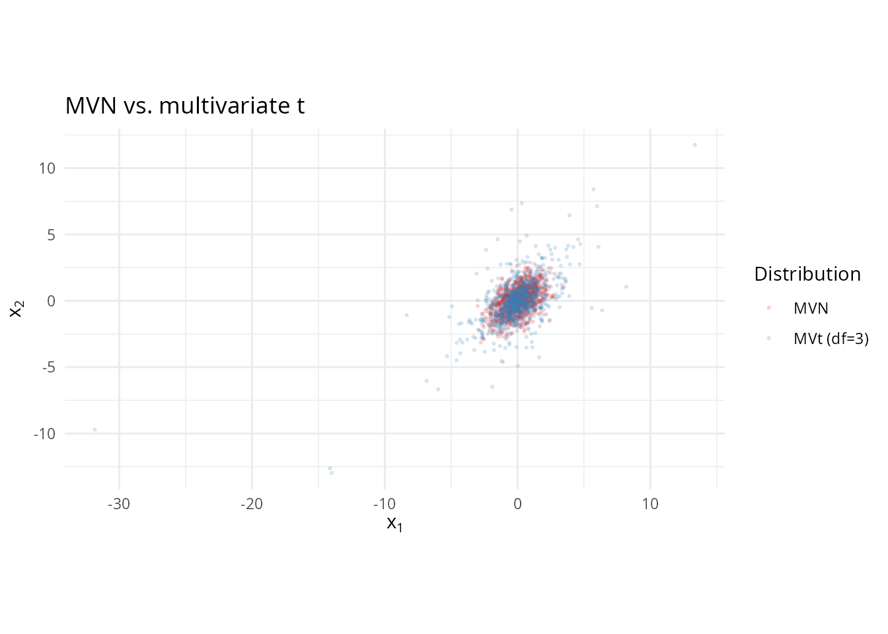

#### References

- Kotz S, Nadarajah S (2004). *Multivariate t Distributions and their
  Applications*. Cambridge University Press. [DOI:
  10.1017/CBO9780511550683](https://doi.org/10.1017/CBO9780511550683)

  

### Multivariate Cauchy

The multivariate Cauchy distribution is the multivariate t with \\\nu =
1\\. It has extremely heavy tails and no finite moments. Available in
all four parameterizations.

\\f(x \mid \mu, S) =
\frac{\Gamma\\\bigl((1+k)/2\bigr)}{\Gamma(1/2)(\pi)^{k/2}\|S\|^{1/2}}
\left(1 + (x-\mu)^T S^{-1} (x-\mu)\right)^{-(1+k)/2}\\

| Parameter | Description                   | Constraint               |
|-----------|-------------------------------|--------------------------|
| \\\mu\\   | Mean vector (length \\k\\)    | \\\mu \in \mathbb{R}^k\\ |
| \\S\\     | Scale matrix (\\k \times k\\) | Positive-definite        |

**Parameterizations:**

| Variant            | Function prefix     | Scale parameter                |
|--------------------|---------------------|--------------------------------|
| Covariance         | `dmvc` / `rmvc`     | \\S\\                          |
| Cholesky           | `dmvcc` / `rmvcc`   | \\U\\ (Cholesky of \\S\\)      |
| Precision          | `dmvcp` / `rmvcp`   | \\\Omega\\                     |
| Precision-Cholesky | `dmvcpc` / `rmvcpc` | \\U\\ (Cholesky of \\\Omega\\) |

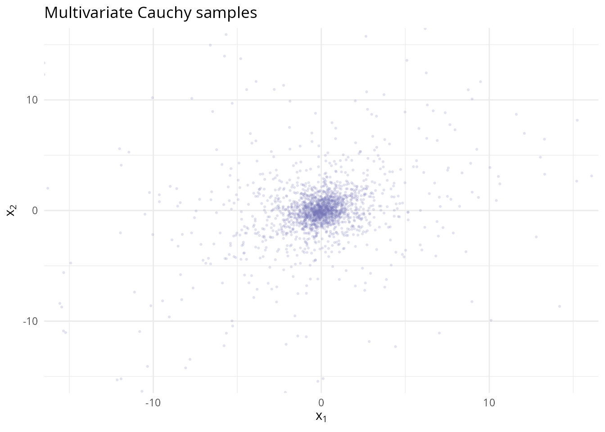

#### References

- Kotz S, Nadarajah S (2004). *Multivariate t Distributions and their
  Applications*. Cambridge University Press. [DOI:
  10.1017/CBO9780511550683](https://doi.org/10.1017/CBO9780511550683)

  

### Multivariate Laplace

The symmetric multivariate Laplace distribution is defined as a scale
mixture of normals with an exponential mixing distribution: \\X = \mu +
\sqrt{E} Z\\ where \\E \sim \text{Exp}(1)\\ and \\Z \sim \mathcal{N}(0,
\Sigma)\\. This produces heavier tails than the MVN and induces sparsity
when used as a prior.

\\f(x \mid \mu, \Sigma) = \frac{2}{(2\pi)^{k/2}\|\Sigma\|^{1/2}}
\left(\frac{q(x)}{2}\right)^{\nu/2} K\_\nu\\\left(\sqrt{2 q(x)}\right)\\

where \\q(x) = (x - \mu)^T \Sigma^{-1}(x - \mu)\\, \\\nu = (2-k)/2\\,
and \\K\_\nu\\ is the modified Bessel function of the second kind.

| Parameter  | Description                        | Constraint               |
|------------|------------------------------------|--------------------------|
| \\\mu\\    | Mean vector (length \\k\\)         | \\\mu \in \mathbb{R}^k\\ |
| \\\Sigma\\ | Covariance matrix (\\k \times k\\) | Positive-definite        |

**Parameterizations:**

| Variant    | Function prefix   | Scale parameter                |
|------------|-------------------|--------------------------------|
| Covariance | `dmvl` / `rmvl`   | \\\Sigma\\                     |
| Cholesky   | `dmvlc` / `rmvlc` | \\U\\ (Cholesky of \\\Sigma\\) |

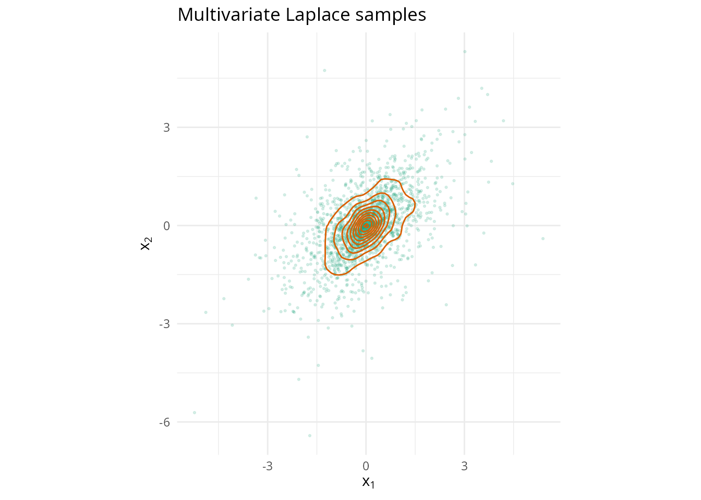

#### References

- Eltoft T, Kim T, Lee TW (2006). “On the Multivariate Laplace
  Distribution.” *IEEE Signal Processing Letters*, 13(5), 300-303. [DOI:
  10.1109/LSP.2006.870353](https://doi.org/10.1109/LSP.2006.870353)

  

### Asymmetric multivariate Laplace

The asymmetric multivariate Laplace distribution of Kotz, Kozubowski,
and Podgorski (2003) extends the symmetric version by allowing the
location/skew parameter \\\mu\\ to be nonzero. The density involves a
modified Bessel function of the second kind and a quadratic form. When
\\\mu = 0\\ it reduces to the symmetric multivariate Laplace.

\\f(x \mid \mu, \Sigma) = \frac{2}{(2\pi)^{k/2}\|\Sigma\|^{1/2}}
\left(\frac{q(x)}{2 + \mu^T\Sigma^{-1}\mu}\right)^{\nu/2}
\exp\\\left(x^T\Sigma^{-1}\mu\right) K\_\nu\\\left(\sqrt{(2 +
\mu^T\Sigma^{-1}\mu)\\q(x)}\right)\\

where \\q(x) = x^T\Sigma^{-1}x\\ and \\\nu = (2-k)/2\\.

| Parameter | Description | Constraint |
|----|----|----|
| \\\mu\\ | Skewness/location vector (length \\k\\) | \\\mu \in \mathbb{R}^k\\ |
| \\\Sigma\\ | Covariance matrix (\\k \times k\\) | Positive-definite |

**Functions:** `daml(x, mu, Sigma, log)`, `raml(n, mu, Sigma)`

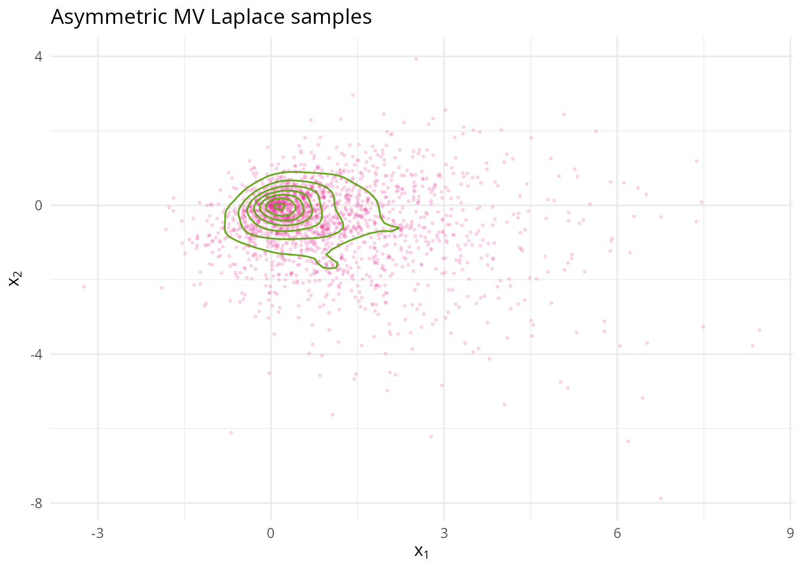

#### References

- Kotz S, Kozubowski TJ, Podgorski K (2003). “An Asymmetric Multivariate
  Laplace Distribution.” Working Paper.
- Kotz S, Kozubowski TJ, Podgorski K (2001). *The Laplace Distribution
  and Generalizations*. Birkhauser. [DOI:
  10.1007/978-1-4612-0173-1](https://doi.org/10.1007/978-1-4612-0173-1)

  

### Multivariate power exponential

The multivariate power exponential distribution generalizes the MVN
through a kurtosis parameter \\\kappa \> 0\\. At \\\kappa = 1\\ it is
the MVN; smaller values produce heavier tails and larger values produce
lighter tails (approaching uniform on an ellipsoid). Random generation
uses a gamma-distributed radius scaled by a uniform point on the unit
sphere.

\\f(x \mid \mu, \Sigma, \kappa) =
\frac{k\\\Gamma(k/2)}{\pi^{k/2}\Gamma(1 +
k/(2\kappa))2^{1+k/(2\kappa)}\|\Sigma\|^{1/2}}
\exp\\\left(-\frac{1}{2}\bigl\[(x-\mu)^T\Sigma^{-1}(x-\mu)\bigr\]^\kappa\right)\\

| Parameter  | Description                        | Constraint               |
|------------|------------------------------------|--------------------------|
| \\\mu\\    | Mean vector (length \\k\\)         | \\\mu \in \mathbb{R}^k\\ |
| \\\Sigma\\ | Covariance matrix (\\k \times k\\) | Positive-definite        |
| \\\kappa\\ | Kurtosis (1 = MVN)                 | \\\kappa \> 0\\          |

**Parameterizations:**

| Variant    | Function prefix     | Scale parameter     |
|------------|---------------------|---------------------|
| Covariance | `dmvpe` / `rmvpe`   | \\\Sigma\\, `kappa` |
| Cholesky   | `dmvpec` / `rmvpec` | \\U\\, `kappa`      |

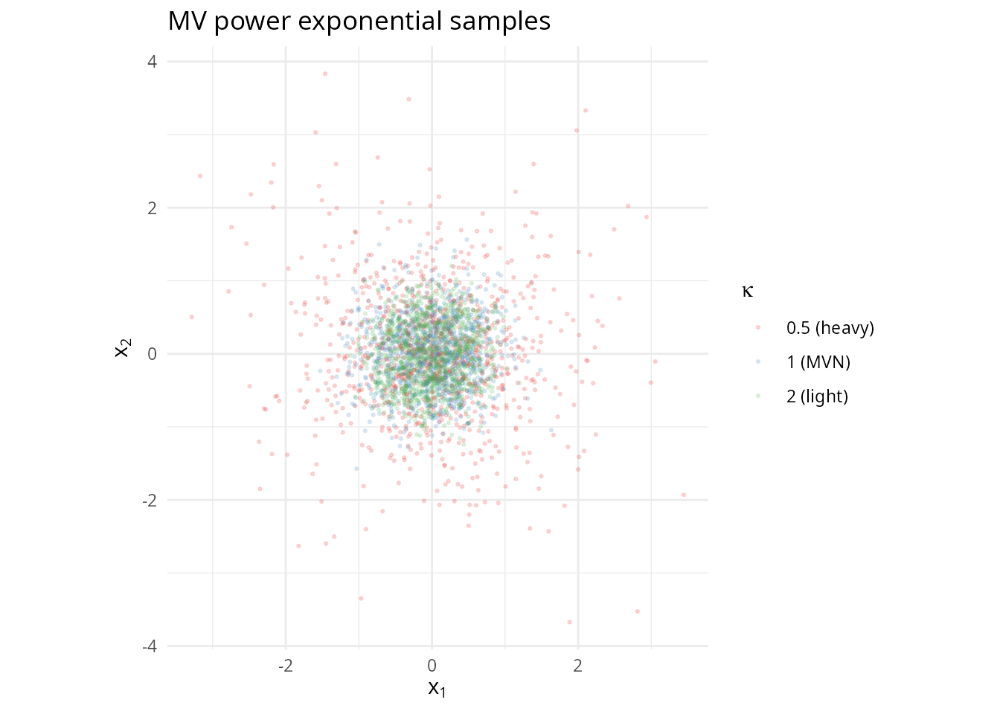

#### References

- Gomez E, Gomez-Villegas MA, Marin JM (1998). “A Multivariate
  Generalization of the Power Exponential Family of Distributions.”
  *Communications in Statistics – Theory and Methods*, 27(3), 589-600.
  [DOI:
  10.1080/03610929808832115](https://doi.org/10.1080/03610929808832115)

  

### Multivariate Polya

The multivariate Polya (Dirichlet-multinomial) distribution is the
distribution of counts drawn from a categorical distribution whose
probabilities are themselves Dirichlet-distributed. It provides an
overdispersed alternative to the multinomial.

\\\Pr(x \mid \alpha) = \frac{n!}{\prod_j x_j!} \frac{\Gamma(\sum_j
\alpha_j)}{\Gamma(n + \sum_j \alpha_j)} \prod\_{j=1}^k
\frac{\Gamma(x_j + \alpha_j)}{\Gamma(\alpha_j)}\\

where \\n = \sum_j x_j\\.

| Parameter  | Description                         | Constraint            |
|------------|-------------------------------------|-----------------------|
| \\x\\      | Count vector (length \\k\\)         | Non-negative integers |
| \\\alpha\\ | Concentration vector (length \\k\\) | \\\alpha_j \> 0\\     |

**Functions:** `dmvpolya(x, alpha, log)`, `rmvpolya(n, alpha)`

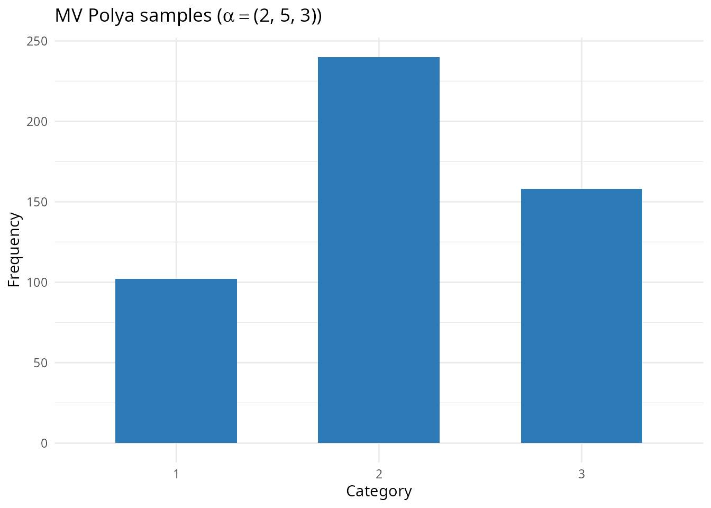

#### References

- Johnson NL, Kotz S, Balakrishnan N (1997). *Discrete Multivariate
  Distributions*. Wiley. ISBN: 978-0-471-12844-1.

  

## Simplex and Dirichlet

  

### Dirichlet

The Dirichlet distribution is the multivariate generalization of the
beta distribution. It is defined on the \\(k-1)\\-simplex (vectors that
are non-negative and sum to one) and serves as the conjugate prior for
the parameters of the categorical and multinomial distributions.

\\f(x \mid \alpha) = \frac{\Gamma(\sum_j \alpha_j)}{\prod_j
\Gamma(\alpha_j)} \prod\_{j=1}^k x_j^{\alpha_j - 1}\\

| Parameter  | Description                         | Constraint        |
|------------|-------------------------------------|-------------------|
| \\\alpha\\ | Concentration vector (length \\k\\) | \\\alpha_j \> 0\\ |

**Functions:** `ddirichlet(x, alpha, log)`, `rdirichlet(n, alpha)`

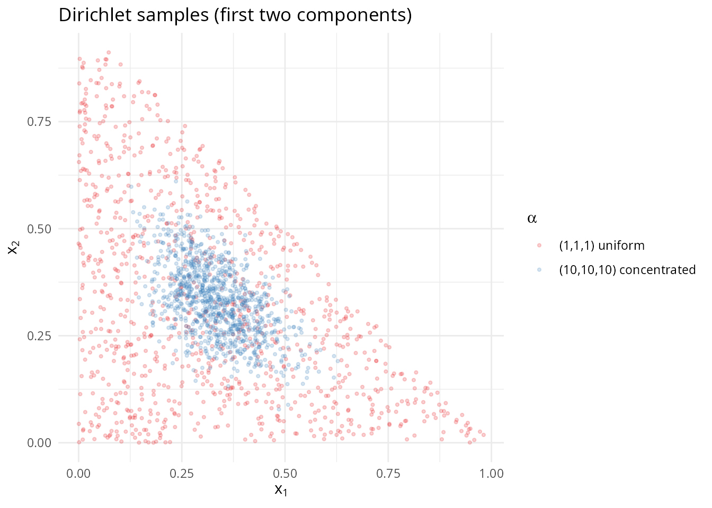

#### References

- Ferguson TS (1973). “A Bayesian Analysis of Some Nonparametric
  Problems.” *The Annals of Statistics*, 1(2), 209-230. [DOI:
  10.1214/aos/1176342360](https://doi.org/10.1214/aos/1176342360)

  

### Simplex

The simplex distribution (Barndorff-Nielsen and Jorgensen, 1991) is a
two-parameter distribution on \\(0, 1)\\ that provides an alternative to
the beta distribution for proportional data. Its density involves a
deviance function \\d(y; \mu) = (y - \mu)^2 /
\[y(1-y)\mu^2(1-\mu)^2\]\\.

\\f(y \mid \mu, \sigma) = \bigl\[2\pi\sigma^2 y^3 (1-y)^3\bigr\]^{-1/2}
\exp\\\left(-\frac{d(y; \mu)}{2\sigma^2}\right)\\

| Parameter  | Description | Constraint         |
|------------|-------------|--------------------|
| \\\mu\\    | Mean        | \\\mu \in (0, 1)\\ |
| \\\sigma\\ | Dispersion  | \\\sigma \> 0\\    |

**Functions:** `dsimplex(x, mu, sigma, log)`, `rsimplex(n, mu, sigma)`

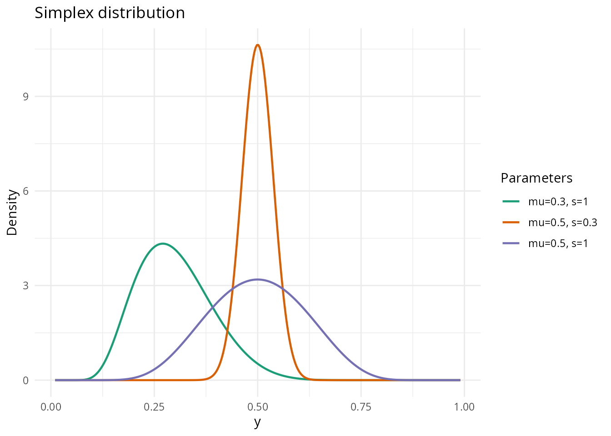

#### References

- Barndorff-Nielsen OE, Jorgensen B (1991). “Some Parametric Models on
  the Simplex.” *Journal of Multivariate Analysis*, 39(1), 106-116.
  [DOI:
  10.1016/0047-259X(91)90008-P](https://doi.org/10.1016/0047-259X(91)90008-P)

  

### Stick-breaking

The truncated stick-breaking prior is a constructive representation of
the Dirichlet process, useful for nonparametric Bayesian mixture models.
The weights are constructed as \\w_m = \theta_m \prod\_{j \< m}(1 -
\theta_j)\\ where \\\theta_j \sim \text{Beta}(1, \gamma)\\. The
parameter \\\gamma\\ controls concentration: small \\\gamma\\ produces a
few large weights while large \\\gamma\\ spreads mass more uniformly.

\\f(\theta \mid \gamma) = \prod\_{m=1}^{M-1} \gamma(1 -
\theta_m)^{\gamma - 1}, \quad \theta_m \in \[0, 1\]\\

| Parameter  | Description                        | Constraint                |
|------------|------------------------------------|---------------------------|
| \\\theta\\ | Stick proportions (length \\M-1\\) | \\\theta_m \in \[0, 1\]\\ |
| \\\gamma\\ | Concentration                      | \\\gamma \> 0\\           |

**Functions:** `dStick(theta, gamma, log)`, `rStick(M, gamma)`

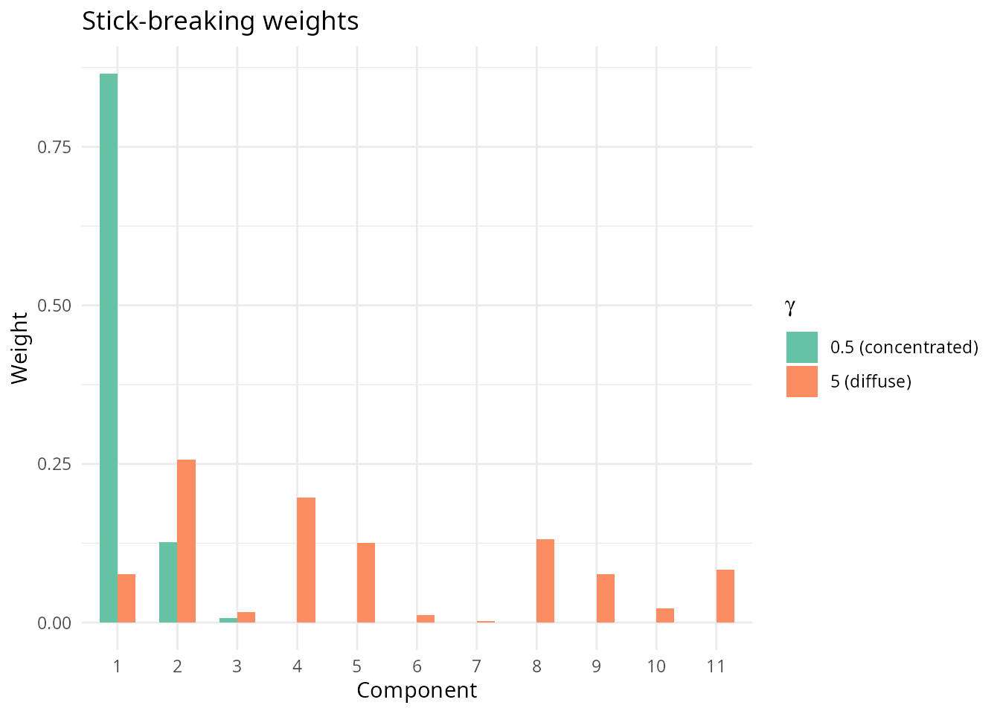

#### References

- Sethuraman J (1994). “A Constructive Definition of Dirichlet Priors.”
  *Statistica Sinica*, 4(2), 639-650.
- Ishwaran H, James LF (2001). “Gibbs Sampling Methods for
  Stick-Breaking Priors.” *Journal of the American Statistical
  Association*, 96(453), 161-173. [DOI:
  10.1198/016214501750332758](https://doi.org/10.1198/016214501750332758)

  

## Matrix-valued distributions

Matrix-valued distributions are priors for covariance matrices,
precision matrices, and matrix-valued parameters in multivariate models.

  

### Wishart

The Wishart distribution is the conjugate prior for the precision matrix
of a multivariate normal distribution. A \\k \times k\\ random matrix
\\\Omega\\ follows a Wishart distribution with \\\nu \geq k\\ degrees of
freedom and \\k \times k\\ positive-semidefinite scale matrix \\S\\.

\\f(\Omega \mid \nu, S) = \frac{\|\Omega\|^{(\nu-k-1)/2}
\exp\\\bigl(-\frac{1}{2}\text{tr}(S^{-1}\Omega)\bigr)}{2^{\nu k/2}
\|S\|^{\nu/2} \Gamma_k(\nu/2)}\\

where \\\Gamma_k\\ is the multivariate gamma function.

| Parameter | Description                   | Constraint        |
|-----------|-------------------------------|-------------------|
| \\\nu\\   | Degrees of freedom            | \\\nu \geq k\\    |
| \\S\\     | Scale matrix (\\k \times k\\) | Positive-definite |

**Parameterizations:**

| Variant  | Function prefix           | Input                                |
|----------|---------------------------|--------------------------------------|
| Matrix   | `dwishart` / `rwishart`   | \\\Omega\\ (precision matrix)        |
| Cholesky | `dwishartc` / `rwishartc` | \\U\\ (upper Cholesky of \\\Omega\\) |

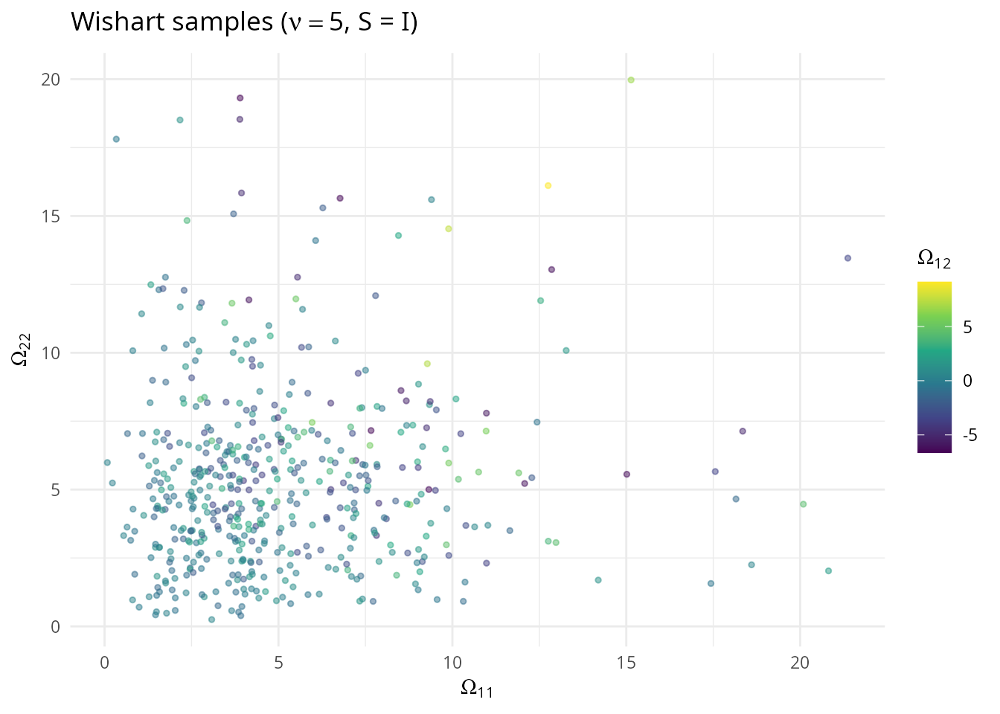

#### References

- Wishart J (1928). “The Generalised Product Moment Distribution in
  Samples from a Normal Multivariate Population.” *Biometrika*,
  20A(1-2), 32-52. [DOI:
  10.2307/2331939](https://doi.org/10.2307/2331939)

  

### Inverse Wishart

The inverse Wishart distribution is the conjugate prior for the
covariance matrix of a multivariate normal distribution. If \\\Omega
\sim \text{Wishart}(\nu, S^{-1})\\, then \\\Sigma = \Omega^{-1} \sim
\text{Inv-Wishart}(\nu, S)\\.

\\f(\Sigma \mid \nu, S) = \frac{\|S\|^{\nu/2}}{2^{\nu
k/2}\Gamma_k(\nu/2)} \|\Sigma\|^{-(\nu+k+1)/2}
\exp\\\left(-\frac{1}{2}\text{tr}(S\Sigma^{-1})\right)\\

| Parameter | Description                   | Constraint        |
|-----------|-------------------------------|-------------------|
| \\\nu\\   | Degrees of freedom            | \\\nu \geq k\\    |
| \\S\\     | Scale matrix (\\k \times k\\) | Positive-definite |

**Parameterizations:**

| Variant | Function prefix | Input |
|----|----|----|
| Matrix | `dinvwishart` / `rinvwishart` | \\\Sigma\\ (covariance matrix) |
| Cholesky | `dinvwishartc` / `rinvwishartc` | \\U\\ (upper Cholesky of \\\Sigma\\) |

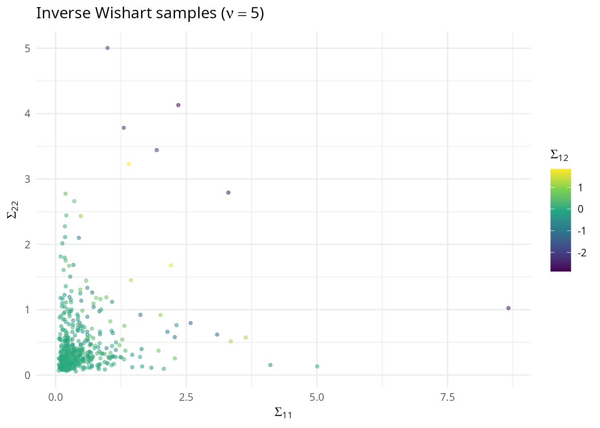

#### References

- Gelman A, Carlin JB, Stern HS, Dunson DB, Vehtari A, Rubin DB (2014).
  *Bayesian Data Analysis*, 3rd ed. CRC Press. ISBN: 978-1-4398-4095-5.

  

### Scaled inverse Wishart

The scaled inverse Wishart distribution separates the standard
deviations from the correlation structure of a covariance matrix,
addressing the well-known coupling between variance and correlation in
the standard inverse Wishart prior. The covariance matrix is decomposed
as \\Q = \text{diag}(\zeta) \cdot \Sigma_0 \cdot \text{diag}(\zeta)\\
where \\\Sigma_0 \sim \text{Inv-Wishart}(\nu, S)\\ and \\\log(\zeta)
\sim \mathcal{N}(\mu, \text{diag}(\delta))\\.

\\f(Q \mid \nu, S, \zeta, \mu, \delta) = f\_{\text{IW}}(\Sigma_0 \mid
\nu, S) \cdot \prod_j f\_{\text{LN}}(\zeta_j \mid \mu_j, \delta_j)\\

| Parameter  | Description                        | Constraint               |
|------------|------------------------------------|--------------------------|
| \\\nu\\    | Degrees of freedom                 | \\\nu \geq k\\           |
| \\S\\      | Base scale matrix (\\k \times k\\) | Positive-definite        |
| \\\zeta\\  | Scale factors (length \\k\\)       | \\\zeta_j \> 0\\         |
| \\\mu\\    | Log-scale mean (length \\k\\)      | \\\mu \in \mathbb{R}^k\\ |
| \\\delta\\ | Log-scale variance (length \\k\\)  | \\\delta_j \> 0\\        |

**Functions:** `dsiw(Q, nu, S, zeta, mu, delta, log)`,
`rsiw(nu, S, mu, delta)`

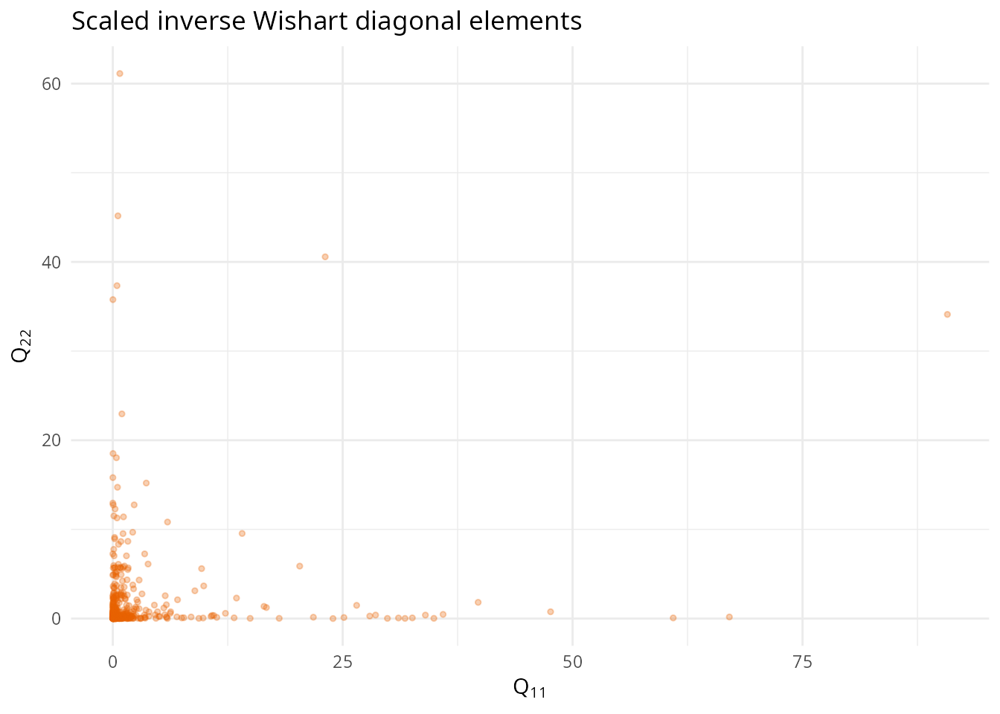

#### References

- O’Malley AJ, Zaslavsky AM (2008). “Domain-Level Covariance Analysis
  for Multilevel Survey Data with Structured Nonresponse.” *Journal of
  the American Statistical Association*, 103(484), 1405-1418. [DOI:
  10.1198/016214508000000724](https://doi.org/10.1198/016214508000000724)

  

### Matrix normal

The matrix normal distribution generalizes the multivariate normal to
matrix-valued random variables. An \\n \times k\\ random matrix \\X\\
follows a matrix normal distribution with mean matrix \\M\\, among-row
covariance \\U\\ (\\n \times n\\), and among-column covariance \\V\\
(\\k \times k\\), written \\X \sim \mathcal{MN}(M, U, V)\\. It is
equivalent to \\\text{vec}(X) \sim \mathcal{N}(\text{vec}(M), V \otimes
U)\\.

\\f(X \mid M, U, V) =
\frac{\exp\\\left(-\frac{1}{2}\text{tr}\bigl\[V^{-1}(X-M)^T
U^{-1}(X-M)\bigr\]\right)}{(2\pi)^{nk/2}\|U\|^{k/2}\|V\|^{n/2}}\\

| Parameter | Description | Constraint |
|----|----|----|
| \\M\\ | Mean matrix (\\n \times k\\) | \\M \in \mathbb{R}^{n \times k}\\ |
| \\U\\ | Row covariance (\\n \times n\\) | Positive-definite |
| \\V\\ | Column covariance (\\k \times k\\) | Positive-definite |

**Functions:** `dmatrixnorm(X, M, U, V, log)`, `rmatrixnorm(M, U, V)`

    #> [1] -10.75608

#### References

- Gupta AK, Nagar DK (1999). *Matrix Variate Distributions*. Chapman and
  Hall/CRC. ISBN: 978-1-58488-046-2.

  

### Matrix gamma

The matrix gamma distribution generalizes the gamma distribution to
positive-definite matrices. It is related to the Wishart:
\\\text{Matrix-Gamma}(\alpha, \beta, \Sigma) = \text{Wishart}(2\alpha,
\beta\Sigma/2)\\.

\\f(X \mid \alpha, \beta, \Sigma) = \frac{\|X\|^{\alpha-(k+1)/2}
\exp\\\bigl(-\text{tr}(\beta\Sigma^{-1}X)\bigr)}{\beta^{-k\alpha}\|\Sigma\|^{\alpha}\Gamma_k(\alpha)}\\

| Parameter  | Description                   | Constraint            |
|------------|-------------------------------|-----------------------|
| \\\alpha\\ | Shape                         | \\\alpha \> (k-1)/2\\ |
| \\\beta\\  | Scale                         | \\\beta \> 0\\        |
| \\\Sigma\\ | Scale matrix (\\k \times k\\) | Positive-definite     |

**Functions:** `dmatrixgamma(X, alpha, beta, Sigma, log)`,
`rmatrixgamma(alpha, beta, Sigma)`

    #> [1] -6.496551

#### References

- Gupta AK, Nagar DK (1999). *Matrix Variate Distributions*. Chapman and
  Hall/CRC. ISBN: 978-1-58488-046-2.

  

### Inverse matrix gamma

The inverse matrix gamma distribution is the distribution of \\X^{-1}\\
when \\X\\ follows a matrix gamma distribution. Equivalently,
\\\text{Inv-Matrix-Gamma}(\alpha, \beta, \Psi) =
\text{Inv-Wishart}(2\alpha, 2\Psi/\beta)\\.

\\f(X \mid \alpha, \beta, \Psi) =
\frac{\|\Psi\|^{\alpha}\beta^{k\alpha}}{\Gamma_k(\alpha)}
\|X\|^{-\alpha-(k+1)/2} \exp\\\left(-\beta\\\text{tr}(\Psi
X^{-1})\right)\\

| Parameter  | Description                   | Constraint            |
|------------|-------------------------------|-----------------------|
| \\\alpha\\ | Shape                         | \\\alpha \> (k-1)/2\\ |
| \\\beta\\  | Scale                         | \\\beta \> 0\\        |
| \\\Psi\\   | Scale matrix (\\k \times k\\) | Positive-definite     |

**Functions:** `dinvmatrixgamma(X, alpha, beta, Psi, log)`,
`rinvmatrixgamma(alpha, beta, Psi)`

    #> [1] -1.640184

#### References

- Gupta AK, Nagar DK (1999). *Matrix Variate Distributions*. Chapman and
  Hall/CRC. ISBN: 978-1-58488-046-2.

  

### Matrix-t

The matrix-variate t distribution generalizes the multivariate t to
matrix-valued random variables. It arises as a scale mixture of matrix
normals with an inverse Wishart mixing distribution and is used for
robust covariance estimation.

\\f(X) \propto \|\Omega\|^{-n/2} \|\Sigma\|^{-p/2} \left\|I_n +
\frac{1}{\nu}\Omega^{-1}(X - M)\Sigma^{-1}(X - M)^T\right\|^{-(\nu + n +
p - 1)/2}\\

| Parameter | Description | Constraint |
|----|----|----|
| \\X\\ | Data matrix (\\n \times p\\) | \\X \in \mathbb{R}^{n \times p}\\ |
| \\M\\ | Location matrix (\\n \times p\\) | \\M \in \mathbb{R}^{n \times p}\\ |
| \\\Omega\\ | Row scale matrix (\\n \times n\\) | Positive-definite |
| \\\Sigma\\ | Column scale matrix (\\p \times p\\) | Positive-definite |
| \\\nu\\ | Degrees of freedom | \\\nu \> 0\\ |

**Functions:** `dmatrixt(X, M, Omega, Sigma, nu, log)`

    #> [1] -4.796025

#### References

- Gupta AK, Nagar DK (1999). *Matrix Variate Distributions*. Chapman and
  Hall/CRC. ISBN: 978-1-58488-046-2.

  

## Conjugate and structured priors

These distributions combine simpler components into structured priors
for Bayesian hierarchical models.

  

### Normal-inverse-Wishart

The normal-inverse-Wishart (NIW) distribution is the conjugate prior for
the mean and covariance of a multivariate normal likelihood. It factors
as \\p(\mu, \Sigma) = p(\Sigma \mid \nu, S) \cdot p(\mu \mid \mu_0,
\Sigma/\lambda)\\, where \\\Sigma \sim \text{Inv-Wishart}(\nu, S)\\ and
\\\mu \mid \Sigma \sim \mathcal{N}(\mu_0, \Sigma/\lambda)\\.

\\f(\mu, \Sigma \mid \mu_0, \lambda, S, \nu) =
\frac{\|S\|^{\nu/2}\lambda^{k/2}}{2^{\nu k/2}\pi^{k/2}\Gamma_k(\nu/2)}
\|\Sigma\|^{-(\nu+k+2)/2}
\exp\\\left(-\frac{1}{2}\text{tr}(S\Sigma^{-1}) -
\frac{\lambda}{2}(\mu-\mu_0)^T\Sigma^{-1}(\mu-\mu_0)\right)\\

| Parameter   | Description                   | Constraint                 |
|-------------|-------------------------------|----------------------------|
| \\\mu_0\\   | Prior mean (length \\k\\)     | \\\mu_0 \in \mathbb{R}^k\\ |
| \\\lambda\\ | Scaling factor                | \\\lambda \> 0\\           |
| \\S\\       | Scale matrix (\\k \times k\\) | Positive-definite          |
| \\\nu\\     | Degrees of freedom            | \\\nu \geq k\\             |

**Functions:** `dnorminvwishart(mu, mu0, lambda, Sigma, S, nu, log)`,
`rnorminvwishart(n, mu0, lambda, S, nu)`

    #> [1] -7.119219

#### References

- Gelman A, Carlin JB, Stern HS, Dunson DB, Vehtari A, Rubin DB (2014).
  *Bayesian Data Analysis*, 3rd ed. CRC Press. ISBN: 978-1-4398-4095-5.

  

### Normal-Wishart

The normal-Wishart distribution is the conjugate prior for the mean and
precision of a multivariate normal likelihood. It factors as \\p(\mu,
\Omega) = p(\Omega \mid \nu, S) \cdot p(\mu \mid \mu_0,
(\lambda\Omega)^{-1})\\, where \\\Omega \sim \text{Wishart}(\nu, S)\\
and \\\mu \mid \Omega \sim \mathcal{N}(\mu_0, (\lambda\Omega)^{-1})\\.

\\f(\mu, \Omega \mid \mu_0, \lambda, S, \nu) =
\frac{\|\Omega\|^{(\nu-k)/2}\lambda^{k/2}}{2^{\nu
k/2}\pi^{k/2}\|S\|^{\nu/2}\Gamma_k(\nu/2)}
\exp\\\left(-\frac{1}{2}\text{tr}(S^{-1}\Omega) -
\frac{\lambda}{2}(\mu-\mu_0)^T\Omega(\mu-\mu_0)\right)\\

| Parameter   | Description                   | Constraint                 |
|-------------|-------------------------------|----------------------------|
| \\\mu_0\\   | Prior mean (length \\k\\)     | \\\mu_0 \in \mathbb{R}^k\\ |
| \\\lambda\\ | Scaling factor                | \\\lambda \> 0\\           |
| \\S\\       | Scale matrix (\\k \times k\\) | Positive-definite          |
| \\\nu\\     | Degrees of freedom            | \\\nu \geq k\\             |

**Functions:** `dnormwishart(mu, mu0, lambda, Omega, S, nu, log)`,
`rnormwishart(n, mu0, lambda, S, nu)`

    #> [1] -7.502599

#### References

- Gelman A, Carlin JB, Stern HS, Dunson DB, Vehtari A, Rubin DB (2014).
  *Bayesian Data Analysis*, 3rd ed. CRC Press. ISBN: 978-1-4398-4095-5.

  

### Zellner’s g-prior

Zellner’s g-prior (Zellner, 1986) is a data-dependent prior for
regression coefficients \\\beta\\ in a linear model. It places \\\beta
\sim \mathcal{N}(0, g\sigma^2 (X^T X)^{-1})\\, automatically scaling
with the design matrix. The hyperparameter \\g\\ controls shrinkage
toward zero; larger \\g\\ implies a less informative prior.

\\f(\beta \mid g, \sigma^2, X) = (2\pi g\sigma^2)^{-p/2} \|X^TX\|^{1/2}
\exp\\\left(-\frac{\beta^T X^TX \beta}{2g\sigma^2}\right)\\

The function `dhyperg` provides the density for the hyper-\\g\\ prior on
\\g\\, following Liang et al. (2008): \\f(g) \propto
(1+g)^{-\alpha/2}\\.

| Parameter | Description | Constraint |
|----|----|----|
| \\\beta\\ | Regression coefficients (length \\p\\) | \\\beta \in \mathbb{R}^p\\ |
| \\g\\ | Prior scale | \\g \> 0\\ |
| \\\sigma\\ | Residual standard deviation | \\\sigma \> 0\\ |
| \\X\\ | Design matrix (\\n \times p\\) | Full column rank |

**Functions:** `dhyperg(g, alpha, log)`,
`dzellner(beta, g, sigma, X, log)`, `rzellner(n, g, sigma, X)`

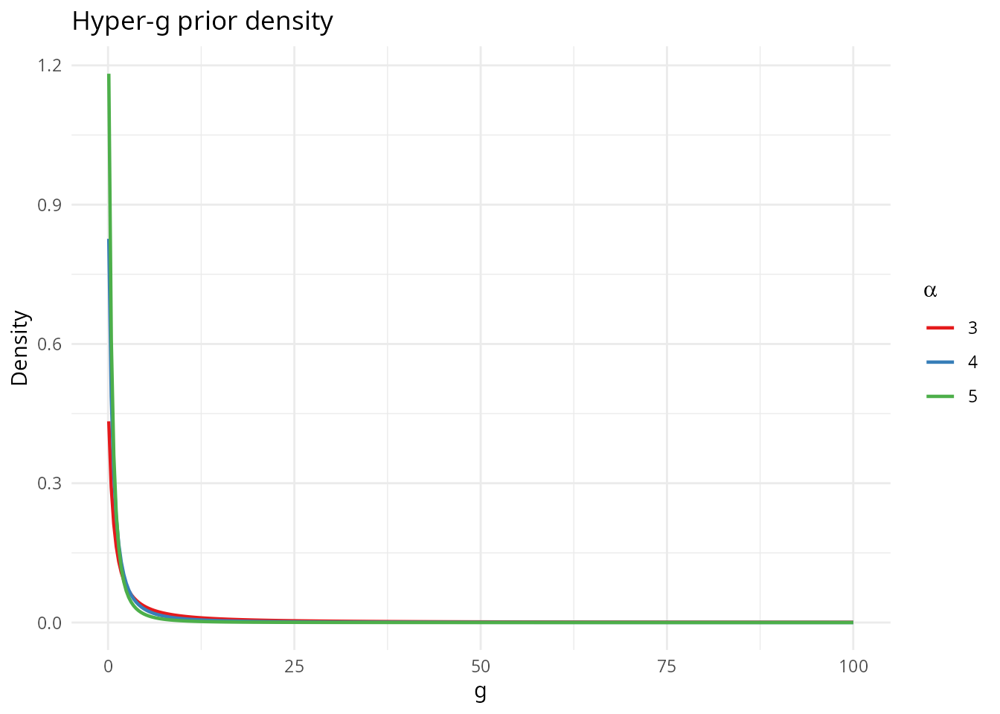

#### References

- Zellner A (1986). “On Assessing Prior Distributions and Bayesian
  Regression Analysis with g-Prior Distributions.” In PK Goel, A Zellner
  (eds.), *Bayesian Inference and Decision Techniques*, 233-243.
  Elsevier.
- Liang F, Paulo R, Molina G, Clyde MA, Berger JO (2008). “Mixtures of g
  Priors for Bayesian Variable Selection.” *Journal of the American
  Statistical Association*, 103(481), 410-423. [DOI:
  10.1198/016214507000001337](https://doi.org/10.1198/016214507000001337)

  

### Huang-Wand

The Huang-Wand prior (Huang and Wand, 2013) is a flexible prior for
covariance matrices in hierarchical models. It decomposes the inverse
Wishart into a product of independent inverse-gamma priors on auxiliary
scale parameters, avoiding the restrictive marginal structure of the
standard inverse Wishart. Available in both matrix and Cholesky
parameterizations.

\\f(\Sigma \mid \nu, a) \propto \|\Sigma\|^{-(\nu+k+1)/2}
\exp\\\left(-\frac{1}{2}\text{tr}\bigl(\text{diag}(1/a_1, \ldots,
1/a_k)\\\Sigma^{-1}\bigr)\right) \prod_j a_j^{-1}
\exp\\\left(-\frac{1}{A_j^2 a_j}\right)\\

| Parameter | Description | Constraint |
|----|----|----|
| \\\nu\\ | Degrees of freedom | \\\nu \geq 2\\ (default 2) |
| \\a\\ | Auxiliary scale parameters (length \\k\\) | \\a_j \> 0\\ |
| \\A\\ | Scale hyperparameters (length \\k\\) | \\A_j \> 0\\ |

**Functions:** `dhuangwand(x, nu, a, A, log)`, `rhuangwand(nu, a, A)`,
`dhuangwandc(x, nu, a, A, log)`, `rhuangwandc(nu, a, A)`

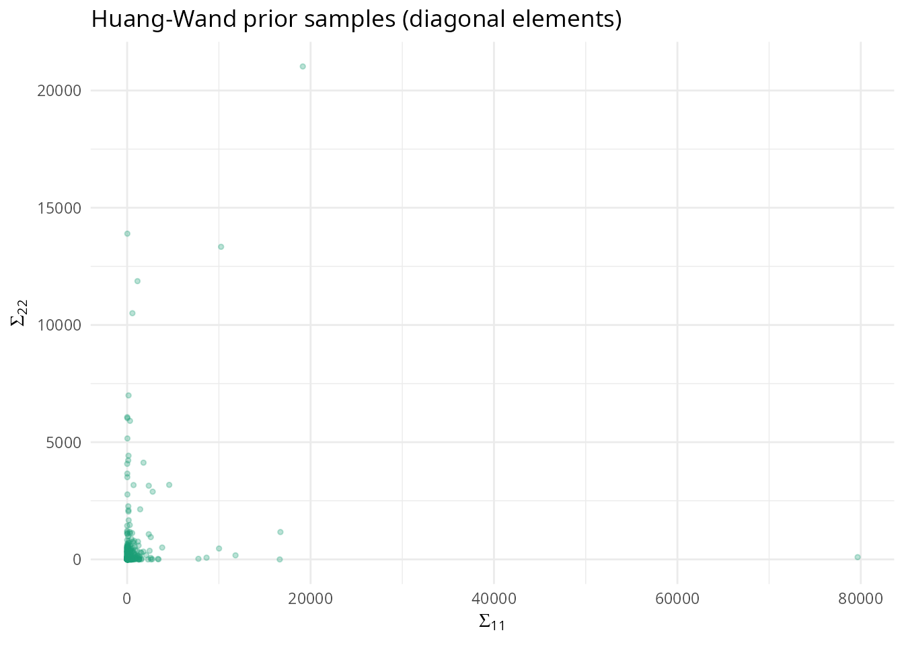

#### References

- Huang A, Wand MP (2013). “Simple Marginally Noninformative Prior
  Distributions for Covariance Matrices.” *Bayesian Analysis*, 8(2),
  439-452. [DOI: 10.1214/13-BA815](https://doi.org/10.1214/13-BA815)

  

### Yang-Berger

The Yang-Berger prior (Yang and Berger, 1994) is a reference (objective)
prior for a covariance matrix, derived from the reference prior
methodology of Berger and Bernardo. It is an improper prior that is
invariant under permutation of the matrix indices. Available in both
matrix and Cholesky parameterizations.

\\f(\Sigma) \propto \|\Sigma\|^{-(k+1)/2} \prod\_{i \< j} \frac{1}{l_i -
l_j} \prod_i \left(\sum\_{j \neq i} \frac{1}{l_i - l_j}\right)^{-1/2}\\

where \\l_1 \> \cdots \> l_k\\ are the eigenvalues of \\\Sigma\\.

| Parameter  | Description                        | Constraint        |
|------------|------------------------------------|-------------------|
| \\\Sigma\\ | Covariance matrix (\\k \times k\\) | Positive-definite |

**Functions:** `dyangberger(x, log)`, `dyangbergerc(x, log)`

    #> [1] -0.7914162

#### References

- Yang R, Berger JO (1994). “Estimation of a Covariance Matrix Using the
  Reference Prior.” *The Annals of Statistics*, 22(3), 1195-1211. [DOI:
  10.1214/aos/1176325625](https://doi.org/10.1214/aos/1176325625)

  

## Shrinkage priors

Shrinkage priors induce sparsity in regression coefficients by placing
heavy mass near zero while maintaining heavy tails to accommodate large
signals.

  

### Horseshoe

The horseshoe prior (Carvalho, Polson, and Scott, 2010) is a
global-local shrinkage prior for sparse signal recovery. Each
coefficient \\\beta_j\\ is assigned a normal prior with variance
\\\lambda_j^2 \tau^2\\, where \\\lambda_j\\ is a local shrinkage
parameter and \\\tau\\ is a global shrinkage parameter. The resulting
marginal prior has a sharp peak at zero and Cauchy-like tails.

\\\beta_j \mid \lambda_j, \tau \sim \mathcal{N}(0, \lambda_j^2 \tau^2),
\quad \lambda_j \sim C^+(0,1), \quad \tau \sim C^+(0, \tau_0)\\

The local parameters \\\lambda_j\\ are typically given half-Cauchy
priors, and \\\tau\\ is assigned a half-Cauchy prior whose scale encodes
the expected sparsity level.

| Parameter   | Description                    | Constraint           |
|-------------|--------------------------------|----------------------|
| \\x\\       | Coefficient values             | \\x \in \mathbb{R}\\ |
| \\\lambda\\ | Local shrinkage (length \\p\\) | \\\lambda_j \> 0\\   |
| \\\tau\\    | Global shrinkage (scalar)      | \\\tau \> 0\\        |

**Functions:** `dhs(x, lambda, tau, log)`, `rhs(n, lambda, tau)`

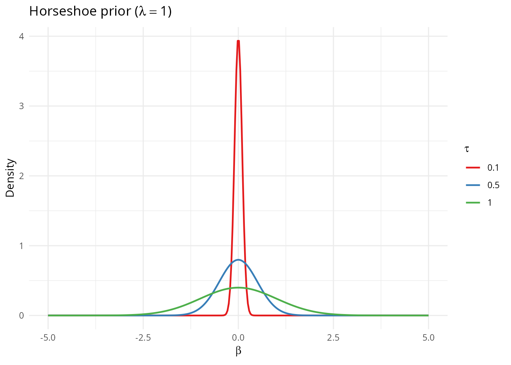

#### References

- Carvalho CM, Polson NG, Scott JG (2010). “The Horseshoe Estimator for
  Sparse Signals.” *Biometrika*, 97(2), 465-480. [DOI:
  10.1093/biomet/asq017](https://doi.org/10.1093/biomet/asq017)

  

### LASSO

The Bayesian LASSO prior (Park and Casella, 2008) places a Laplace
(double-exponential) prior on regression coefficients, which is
equivalent to an \\L_1\\ penalty. The implementation uses the
scale-mixture-of-normals representation: \\\beta_j \mid \sigma, \tau_j
\sim \mathcal{N}(0, \sigma^2 \tau_j^2)\\ with \\\tau_j^2 \sim
\text{Exp}(\lambda^2/2)\\ and \\\lambda^2 \sim \text{Gamma}(a, b)\\.

\\f(\beta_j \mid \lambda) = \frac{\lambda}{2} \exp\\\left(-\lambda
\|\beta_j\|\right)\\

in the marginal (integrated) form.

| Parameter   | Description                       | Constraint           |
|-------------|-----------------------------------|----------------------|
| \\x\\       | Coefficient values                | \\x \in \mathbb{R}\\ |
| \\\sigma\\  | Residual standard deviation       | \\\sigma \> 0\\      |
| \\\tau\\    | Local scale parameters            | \\\tau_j \> 0\\      |
| \\\lambda\\ | Global penalty                    | \\\lambda \> 0\\     |
| \\a, b\\    | Hyperparameters for \\\lambda^2\\ | \\a, b \> 0\\        |

**Functions:** `dlasso(x, sigma, tau, lambda, a, b, log)`,
`rlasso(n, sigma, tau, lambda, a, b)`

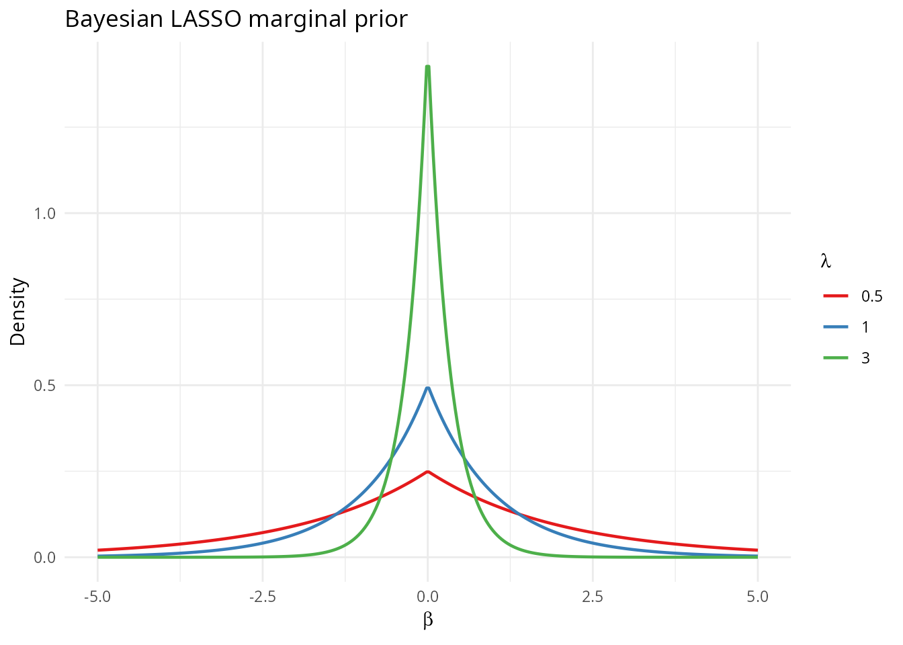

#### References

- Park T, Casella G (2008). “The Bayesian Lasso.” *Journal of the
  American Statistical Association*, 103(482), 681-686. [DOI:
  10.1080/01621459.2008.10469408](https://doi.org/10.1080/01621459.2008.10469408)

  

## Circular, stable, and compound distributions

  

### Von Mises

The von Mises distribution is the circular analogue of the normal
distribution, defined on the circle \\\[-\pi, \pi)\\. When \\\kappa =
0\\ the distribution is uniform on the circle; as \\\kappa \to \infty\\
it concentrates at \\\mu\\. Random generation uses the Best-Fisher
algorithm.

\\f(x \mid \mu, \kappa) = \frac{\exp\\\bigl(\kappa \cos(x -
\mu)\bigr)}{2\pi I_0(\kappa)}\\

where \\I_0(\kappa)\\ is the modified Bessel function of the first kind
and order zero.

| Parameter  | Description              | Constraint               |
|------------|--------------------------|--------------------------|
| \\\mu\\    | Mean direction (radians) | \\\mu \in \[-\pi, \pi)\\ |
| \\\kappa\\ | Concentration            | \\\kappa \geq 0\\        |

**Functions:** `dvonmises(x, mu, kappa, log)`,
`pvonmises(q, mu, kappa)`, `rvonmises(n, mu, kappa)`

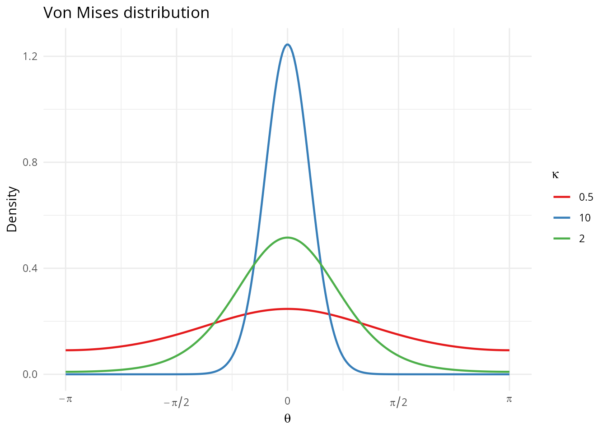

#### References

- Mardia KV, Jupp PE (2000). *Directional Statistics*. John Wiley &
  Sons. ISBN: 978-0-471-95333-3.
- Best DJ, Fisher NI (1979). “Efficient Simulation of the von Mises
  Distribution.” *Journal of the Royal Statistical Society C*, 28(2),
  152-157. [DOI: 10.2307/2346732](https://doi.org/10.2307/2346732)

  

### Stable

The stable distribution is a four-parameter family that generalizes the
Gaussian, encompassing heavy-tailed and skewed distributions. Special
cases include the Gaussian (\\\alpha = 2\\), Cauchy (\\\alpha = 1, \beta
= 0\\), and Levy (\\\alpha = 0.5, \beta = 1\\) distributions. The
density has no closed form for general \\\alpha\\ and is computed via
numerical integration of the characteristic function using Nolan’s
0-parameterization. Random generation uses the Chambers-Mallows-Stuck
algorithm.

The characteristic function is

\\\varphi(t) = \exp\\\left(-\gamma^\alpha \|t\|^\alpha \left\[1 -
i\beta\\\text{sign}(t)\tan\\\left(\frac{\pi\alpha}{2}\right)\right\] +
i\delta t\right)\\

for \\\alpha \neq 1\\.

| Parameter  | Description     | Constraint                |
|------------|-----------------|---------------------------|
| \\\alpha\\ | Stability index | \\\alpha \in (0, 2\]\\    |
| \\\beta\\  | Skewness        | \\\beta \in \[-1, 1\]\\   |
| \\\gamma\\ | Scale           | \\\gamma \> 0\\           |
| \\\delta\\ | Location        | \\\delta \in \mathbb{R}\\ |

**Functions:** `dstable(x, alpha, beta, gamma, delta, log)`,
`rstable(n, alpha, beta, gamma, delta)`

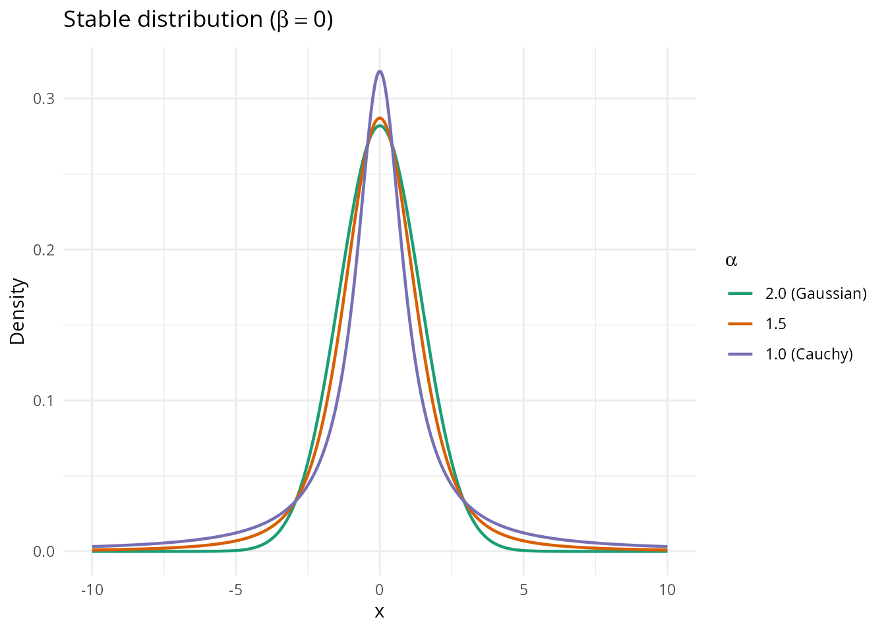

#### References

- Nolan JP (2020). *Stable Distributions: Models for Heavy-Tailed Data*.
  Birkhauser. [DOI:
  10.1007/978-3-030-52915-7](https://doi.org/10.1007/978-3-030-52915-7)
- Chambers JM, Mallows CL, Stuck BW (1976). “A Method for Simulating
  Stable Random Variables.” *Journal of the American Statistical
  Association*, 71(354), 340-344. [DOI:
  10.1080/01621459.1976.10480344](https://doi.org/10.1080/01621459.1976.10480344)

  

### Tweedie

The Tweedie distribution is a compound Poisson-gamma distribution that
belongs to the exponential dispersion family. For power parameter \\p
\in (1, 2)\\, it models data that are a mixture of exact zeros and
positive continuous values, making it useful for insurance claims,
rainfall, and ecological count-abundance data. The density involves an
infinite series and is computed via the saddlepoint approximation of
Dunn and Smyth (2005).

\\f(y \mid \mu, \phi, p) = a(y, \phi, p) \exp\\\left(\frac{y\theta -
\kappa(\theta)}{\phi}\right)\\

where \\\theta = \mu^{1-p}/(1-p)\\, \\\kappa(\theta) =
\mu^{2-p}/(2-p)\\, and \\a(y, \phi, p)\\ is a normalizing function
computed by series evaluation.

| Parameter | Description     | Constraint       |
|-----------|-----------------|------------------|
| \\\mu\\   | Mean            | \\\mu \> 0\\     |
| \\\phi\\  | Dispersion      | \\\phi \> 0\\    |
| \\p\\     | Power parameter | \\p \in (1, 2)\\ |

**Functions:** `dtweedie(x, mu, phi, power, log)`,
`rtweedie(n, mu, phi, power)`

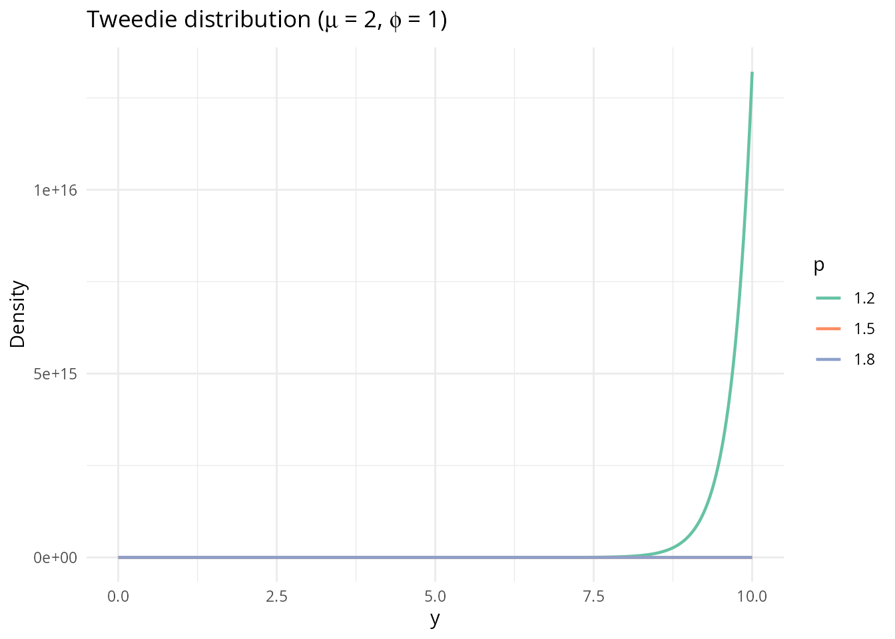

#### References

- Jorgensen B (1997). *The Theory of Dispersion Models*. Chapman and
  Hall. ISBN: 978-0-412-99711-4.
- Dunn PK, Smyth GK (2005). “Series Evaluation of Tweedie Exponential
  Dispersion Model Densities.” *Statistics and Computing*, 15(4),
  267-280. [DOI:
  10.1007/s11222-005-4070-y](https://doi.org/10.1007/s11222-005-4070-y)

  

## Copulas

Copulas separate the marginal distributions from the dependence
structure of multivariate random variables. The three bivariate
Archimedean copulas implemented here are parameterized by a single
dependence parameter \\\theta\\ and provide density evaluation and
random generation.

  

### Clayton

The Clayton copula captures lower tail dependence (concordance in
extreme low values).

\\C(u, v) = \bigl(u^{-\theta} + v^{-\theta} - 1\bigr)^{-1/\theta}, \quad
\theta \> 0\\

The density is

\\c(u, v) =
(1+\theta)(uv)^{-\theta-1}\bigl(u^{-\theta}+v^{-\theta}-1\bigr)^{-2-1/\theta}\\

As \\\theta \to 0\\ the copula approaches independence; as \\\theta \to
\infty\\ it approaches comonotonicity (perfect positive dependence).
Random generation uses conditional inversion.

| Parameter  | Description          | Constraint      |
|------------|----------------------|-----------------|
| \\\theta\\ | Dependence parameter | \\\theta \> 0\\ |

**Functions:** `dclayton(u, v, theta, log)`, `rclayton(n, theta)`

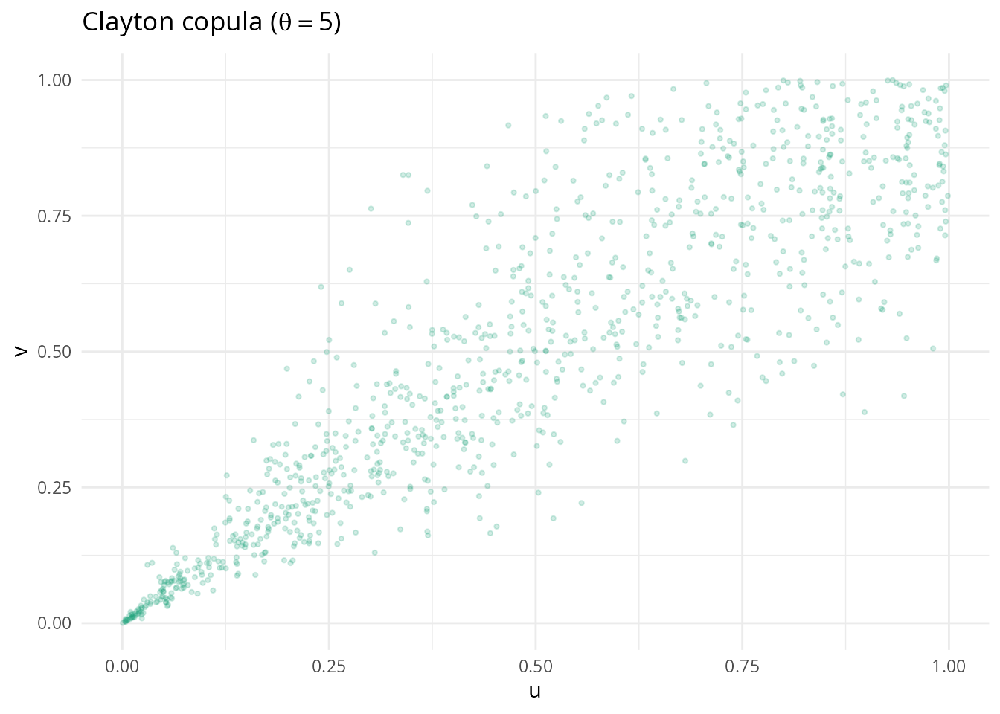

#### References

- Nelsen RB (2006). *An Introduction to Copulas*, 2nd ed. Springer.
  [DOI: 10.1007/0-387-28678-0](https://doi.org/10.1007/0-387-28678-0)

  

### Gumbel

The Gumbel copula captures upper tail dependence (concordance in extreme
high values).

\\C(u, v) = \exp\\\left(-\bigl((-\log u)^\theta + (-\log
v)^\theta\bigr)^{1/\theta}\right), \quad \theta \geq 1\\

At \\\theta = 1\\ the copula is the independence copula. Random
generation uses the Marshall-Olkin stable variate method.

| Parameter  | Description          | Constraint        |
|------------|----------------------|-------------------|
| \\\theta\\ | Dependence parameter | \\\theta \geq 1\\ |

**Functions:** `dgumbel.copula(u, v, theta, log)`,
`rgumbel.copula(n, theta)`

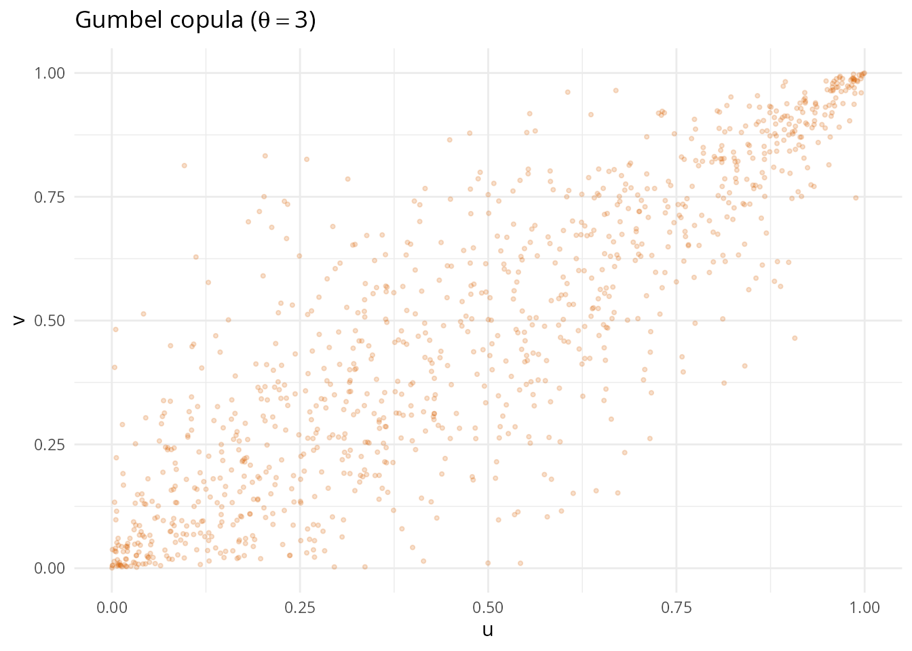

#### References

- Nelsen RB (2006). *An Introduction to Copulas*, 2nd ed. Springer.
  [DOI: 10.1007/0-387-28678-0](https://doi.org/10.1007/0-387-28678-0)

  

### Frank

The Frank copula is symmetric (no tail dependence in either direction)
and captures both positive and negative dependence.

\\C(u, v) = -\frac{1}{\theta}\log\\\left(1 + \frac{(e^{-\theta u} -
1)(e^{-\theta v} - 1)}{e^{-\theta} - 1}\right)\\

The parameter \\\theta\\ can be any real number except zero; \\\theta \>
0\\ gives positive dependence and \\\theta \< 0\\ gives negative
dependence. Random generation uses conditional inversion.

| Parameter  | Description          | Constraint        |
|------------|----------------------|-------------------|
| \\\theta\\ | Dependence parameter | \\\theta \neq 0\\ |

**Functions:** `dfrank(u, v, theta, log)`, `rfrank(n, theta)`

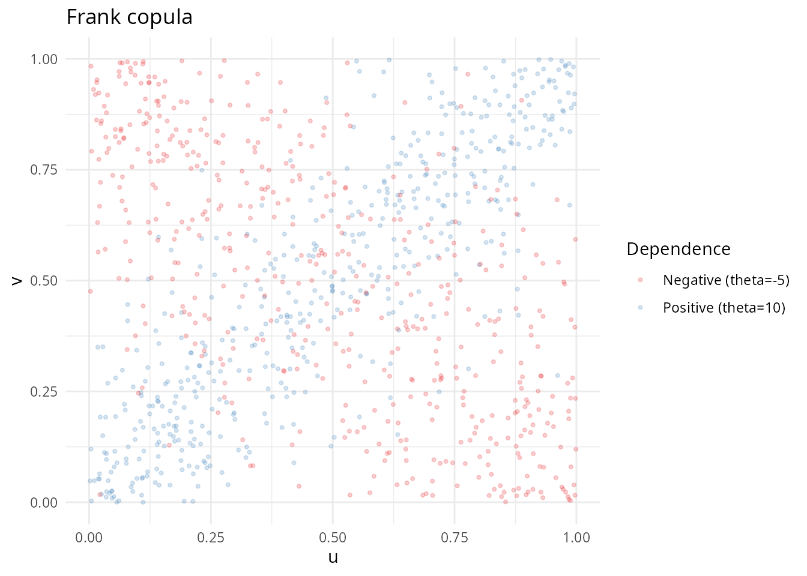

#### References

- Nelsen RB (2006). *An Introduction to Copulas*, 2nd ed. Springer.
  [DOI: 10.1007/0-387-28678-0](https://doi.org/10.1007/0-387-28678-0)
- Joe H (2015). *Dependence Modeling with Copulas*. Chapman and
  Hall/CRC. ISBN: 978-1-4665-8322-1.

  

## Spatial priors and correlation functions

  

### Intrinsic CAR

The intrinsic conditional autoregressive (CAR) prior is a
pairwise-difference prior for spatially structured random effects on an
irregular lattice. Given an adjacency matrix \\W\\, the precision matrix
is \\Q = \tau(D - W)\\ where \\D = \text{diag}(W\mathbf{1})\\ is the
degree matrix. This prior is improper (rank-deficient by one for a
connected graph) and the density is computed using the
pseudo-determinant. A sum-to-zero constraint on \\x\\ is conventionally
imposed for identifiability.

\\f(x \mid W, \tau) \propto \tau^{(n-1)/2} \exp\\\left(-\frac{\tau}{2}
\sum\_{i \sim j} (x_i - x_j)^2\right)\\

where the sum runs over all pairs \\(i, j)\\ with \\W\_{ij} = 1\\.

| Parameter | Description                              | Constraint             |
|-----------|------------------------------------------|------------------------|
| \\x\\     | Spatial random effects (length \\n\\)    | \\x \in \mathbb{R}^n\\ |
| \\W\\     | Binary adjacency matrix (\\n \times n\\) | Symmetric              |
| \\\tau\\  | Precision                                | \\\tau \> 0\\          |

**Functions:** `dcar(x, W, tau, zero.mean, log)`, `rcar(W, tau)`

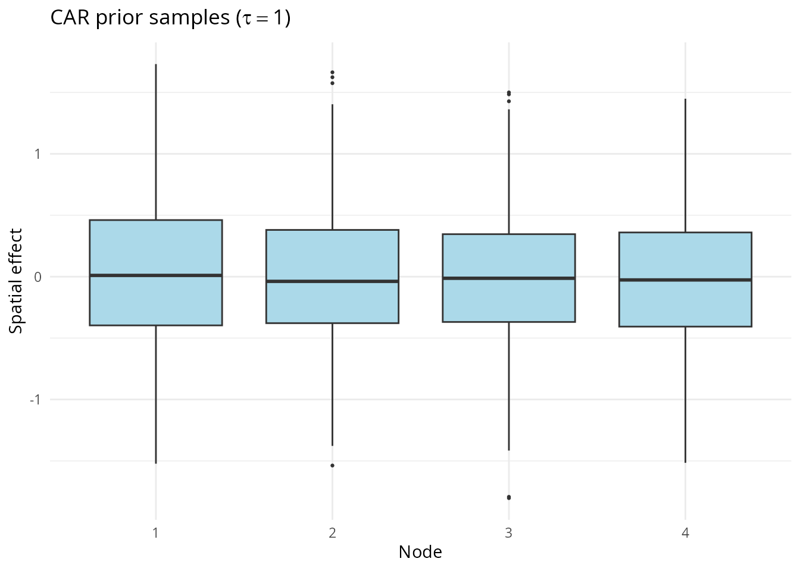

#### References

- Besag J, York J, Mollie A (1991). “Bayesian Image Restoration, with
  Two Applications in Spatial Statistics (with Discussion).” *Annals of
  the Institute of Statistical Mathematics*, 43(1), 1-59. [DOI:
  10.1007/BF00116466](https://doi.org/10.1007/BF00116466)

  

### Matern

The Matern correlation function is the standard isotropic correlation
model in spatial statistics and Gaussian process regression. At \\\nu =
0.5\\ this gives exponential correlation; at \\\nu = 1.5\\ the Matern
3/2 model; and as \\\nu \to \infty\\ the squared exponential (Gaussian)
correlation.

\\C(h; \nu, \rho) = \frac{2^{1-\nu}}{\Gamma(\nu)}
\left(\frac{\sqrt{2\nu}\\h}{\rho}\right)^\nu
K\_\nu\\\left(\frac{\sqrt{2\nu}\\h}{\rho}\right)\\

where \\K\_\nu\\ is the modified Bessel function of the second kind.

| Parameter | Description          | Constraint    |
|-----------|----------------------|---------------|
| \\h\\     | Distance             | \\h \geq 0\\  |
| \\\nu\\   | Smoothness           | \\\nu \> 0\\  |
| \\\rho\\  | Range (length-scale) | \\\rho \> 0\\ |

**Functions:** `matern.corr(h, nu, rho)` (correlation vector),
`matern.cov(dist.mat, sigma2, nu, rho)` (\\n \times n\\ covariance
matrix)

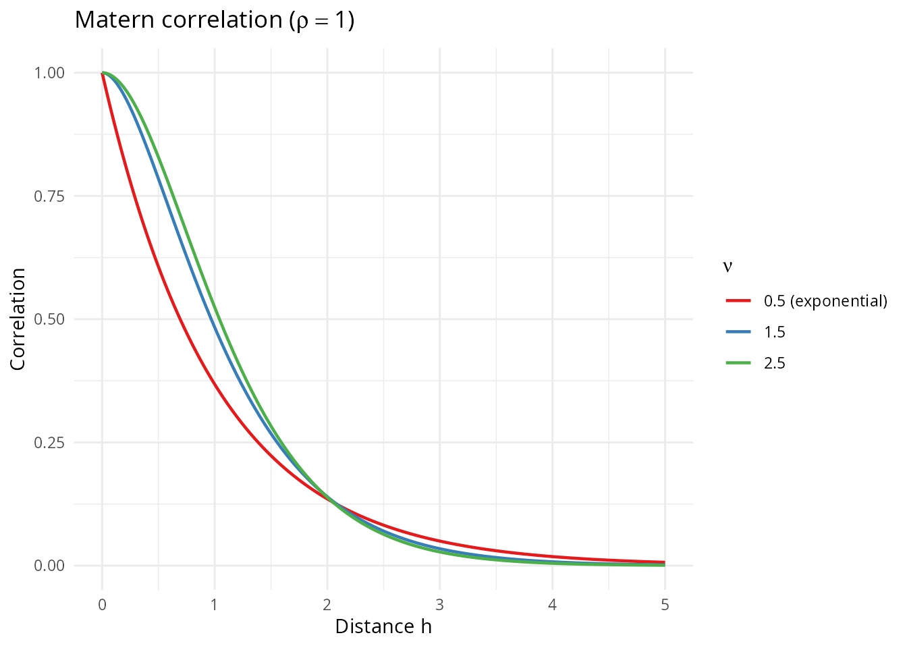

#### References

- Stein ML (1999). *Interpolation of Spatial Data: Some Theory for
  Kriging*. Springer. [DOI:
  10.1007/978-1-4612-1494-6](https://doi.org/10.1007/978-1-4612-1494-6)
- Rasmussen CE, Williams CKI (2006). *Gaussian Processes for Machine
  Learning*. MIT Press. ISBN: 978-0-262-18253-9. [Available
  online](https://gaussianprocess.org/gpml/)

  

## Utility: truncated distributions and continuous relaxation

  

### Truncated

The truncated distribution family provides a generic mechanism for
truncating any base distribution to the interval \\\[a, b\]\\. Given a
base distribution specified by its name (e.g., `"norm"`, `"st"`,
`"laplace"`), the truncated density is

\\f\_{\text{trunc}}(x \mid a, b) = \frac{f(x)}{F(b) - F(a)}, \quad x \in
\[a, b\]\\

where \\f\\ and \\F\\ are the base distribution’s density and CDF,
respectively.

| Parameter | Description | Constraint |
|----|----|----|
| `spec` | Base distribution name (character) | Valid distribution name |
| \\a\\ | Lower bound | \\a \< b\\ (default \\-\infty\\) |
| \\b\\ | Upper bound | \\b \> a\\ (default \\\infty\\) |
| `...` | Additional base distribution parameters | Distribution-specific |

**Functions:** `dtrunc(x, spec, a, b, log, ...)`,
`ptrunc(x, spec, a, b, ...)`, `qtrunc(p, spec, a, b, ...)`,
`rtrunc(n, spec, a, b, ...)`, `extrunc(spec, a, b, ...)`,
`vartrunc(spec, a, b, ...)`

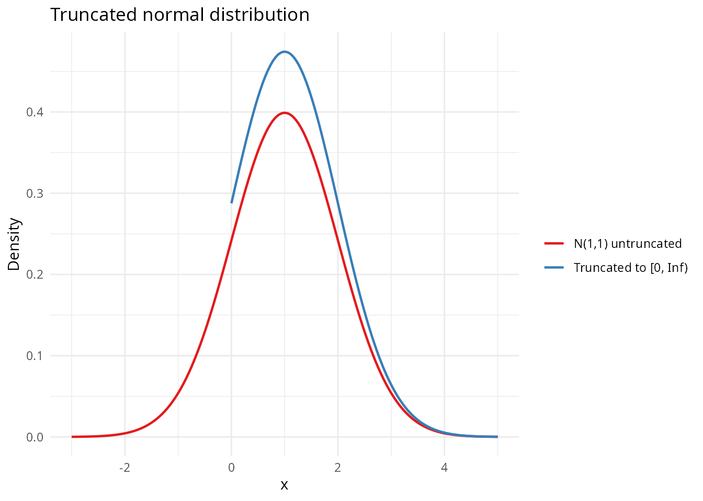

#### References

- Nadarajah S, Kotz S (2006). “R Programs for Computing Truncated
  Distributions.” *Journal of Statistical Software*, 16, Code Snippet 2,
  1-8. [DOI:
  10.18637/jss.v016.c02](https://doi.org/10.18637/jss.v016.c02)

  

### Continuous relaxation of MRF

The continuous relaxation of a Markov random field (MRF) distribution
transforms discrete variables into continuous ones using a generalized
Gaussian integral trick from statistical physics (Zhang et al., 2012).
An auxiliary Gaussian variable is added to a discrete MRF so that
discrete dependencies cancel out, allowing estimation with continuous
samplers such as Hamiltonian Monte Carlo.

\\f(x \mid \alpha, \Omega) \propto \prod\_{j=1}^k \exp\\\bigl(\alpha_j
x_j - \log(1 + e^{x_j})\bigr) \cdot \exp\\\left(-\frac{1}{2}x^T\Omega
x\right)\\

| Parameter | Description | Constraint |
|----|----|----|
| \\x\\ | Continuous relaxation vector (length \\k\\) | \\x \in \mathbb{R}^k\\ |
| \\\alpha\\ | Shape vector (length \\k\\) | \\\alpha \in \mathbb{R}^k\\ |
| \\\Omega\\ | Precision matrix (\\k \times k\\) | Positive-definite |

**Functions:** `dcrmrf(x, alpha, Omega, log)`, `rcrmrf(n, alpha, Omega)`

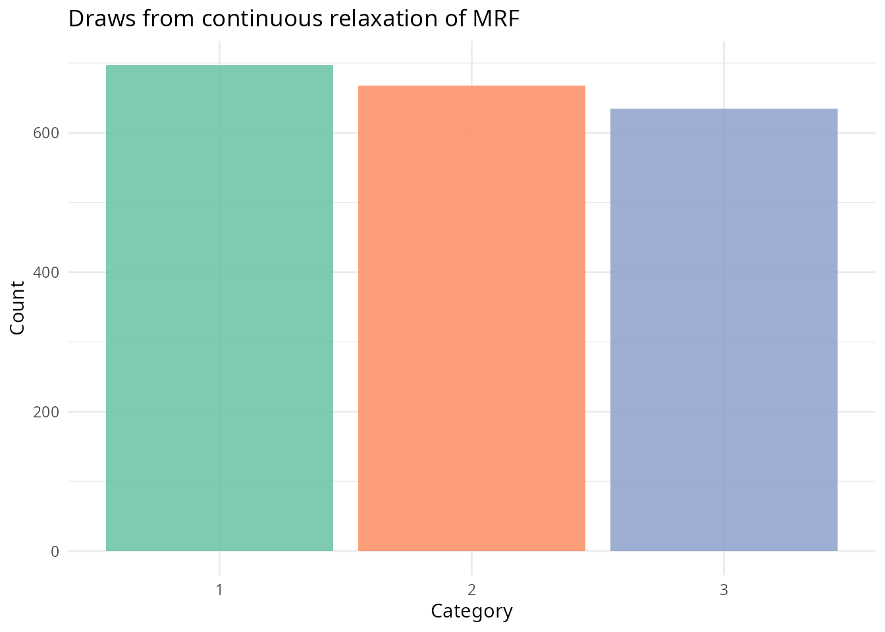

#### References

- Zhang Y, Ghahramani Z, Storkey AJ, Sutton CA (2012). “Continuous
  Relaxations for Discrete Hamiltonian Monte Carlo.” *Advances in Neural
  Information Processing Systems*, 25, 3203-3211. [Available
  online](https://papers.nips.cc/paper/2012/hash/c913303f392ffc643f7240b180602652-Abstract.html)
