# lucifer [](https://robustecologies.github.io/lucifer)

[](https://github.com/robustecologies/lucifer/actions)
[](https://www.r-project.org/)

[](https://cran.r-project.org/package=Rcpp)
[](https://cran.r-project.org/package=RcppArmadillo)
[](https://www.openmp.org/)

[](https://www.gnu.org/licenses/gpl-3.0)

## An exhaustive Bayesian inference environment for R/C++ and OpenMP

lucifer is the next-generation evolution of the legendary
[LaplacesDemon](https://web.archive.org/web/20150125003037/http://www.bayesian-inference.com/software)
package. It provides an exhaustive Bayesian inference environment for R,
with over 130 algorithms behind a single, unified model interface: one
`Model` function, all engines. A declarative
[`model_spec()`](https://robustecologies.github.io/lucifer/reference/model_spec.md)
DSL lets you write models in near-mathematical notation, then
[`compile()`](https://robustecologies.github.io/lucifer/reference/compile.md)
them to native C++ for zero R-callback overhead during sampling. The
computational core is built on Rcpp and RcppArmadillo with OpenMP
parallelization, so that the most demanding operations (gradient
evaluation, matrix decomposition, particle filtering) execute at
compiled speed across all available cores. lucifer is not just an MCMC
sampler; it is a complete environment for specifying, fitting,
diagnosing, comparing, and validating Bayesian models.

Beyond its own inference engines, lucifer is designed to be
**language-agnostic about where posterior samples come from**. Through
[`as.demonoid()`](https://robustecologies.github.io/lucifer/reference/as.demonoid.md)
it ingests fits produced by Stan via rstan, cmdstanr, brms, and
rstanarm, by JAGS via rjags and runjags, by the `coda` package, and by
the `posterior` package (`draws_array`, `draws_matrix`, `draws_df`),
returning a native `demonoid` on which the entire post-processing,
diagnostic, and visualisation pipeline applies unchanged. For more
details and a worked example that fits the same hierarchical model with
every JAGS wrapper, every Stan wrapper, and every lucifer inference
family side by side, see
[`vignette("interoperability", package = "lucifer")`](https://robustecologies.github.io/lucifer/articles/interoperability.md).

## Features

### Inference engines (130+ algorithms)

- **82 MCMC samplers** spanning every major family: gradient-based
  (NUTS, HMC, MALA, SGLD, Barker, autoMALA, GIST-NUTS), adaptive
  Metropolis (AM, RAM, DRAM), slice sampling (ESS, AFSS, QSS, LSS,
  GPSS), ensemble methods (AIES, DEMC, Zeus, DREAM, QMC), geometric and
  Riemannian (RMHMC, Lagrangian MC, Magnetic HMC),
  piecewise-deterministic (BPS, Boomerang, Zig-Zag, Randomized HMC),
  multimodal (simulated tempering, NRST, Wang-Landau, NRPT),
  flow-enhanced (NeuTra, flowMC), and constraint-handling (projected
  Langevin, ProxMCMC).

- **8 variational Bayes methods** including ADVI, BBVI, SVGD, and
  Pathfinder multi-path initialization.

- **18 Laplace approximation optimizers** (BFGS, L-BFGS, Newton-Raphson,
  trust region, conjugate gradient, and others).

- **3 iterative quadrature rules** (AGH, AGHSG, CAGH).

- **PMC and SMC** with adaptive tempering and ESS-based resampling.

- **4 ABC variants** (rejection, MCMC, SMC, simulated annealing).

- **6 simulation-based inference methods** (NPE, NLE, NRE, SNPE, SNLE,
  SNRE) via mixture density networks and neural ratio estimation.

- **5 state-space model engines** (FFBS, PGAS, SMC2, KSC, MS-FFBS) with
  Kalman, unscented Kalman, ensemble Kalman, and particle filters.

### Model specification and compilation

- [`model_spec()`](https://robustecologies.github.io/lucifer/reference/model_spec.md)
  declarative DSL for writing models in near-mathematical syntax.

- [`compile()`](https://robustecologies.github.io/lucifer/reference/compile.md)
  translates the specification to native C++ with automatic gradient
  computation via dual-number AD or finite differences, eliminating
  R-callback overhead entirely.

- 76+ probability distributions implemented in C++ with analytical
  gradients.

### Automated workflow

- [`Prescribe()`](https://robustecologies.github.io/lucifer/reference/Prescribe.md)
  profiles the model and recommends algorithms based on dimensionality,
  gradient availability, and posterior geometry.

- [`Consort()`](https://robustecologies.github.io/lucifer/reference/Consort.md)
  diagnoses convergence and suggests refinements.

- [`Arena()`](https://robustecologies.github.io/lucifer/reference/Arena.md)
  benchmarks competing methods and identifies the Pareto frontier of
  efficiency versus accuracy.

- [`Crucible()`](https://robustecologies.github.io/lucifer/reference/Crucible.md)
  chains the entire pipeline into a single automated call.

### Model comparison and validation

- LOO-PSIS cross-validation with Pareto k diagnostics.

- K-fold and leave-future-out cross-validation.

- Bayesian stacking weights for model combination.

- [`ProductSpace()`](https://robustecologies.github.io/lucifer/reference/ProductSpace.md)
  Bayesian model selection via Bayes factors.

### Sensitivity and identifiability

- [`RobustBayes()`](https://robustecologies.github.io/lucifer/reference/RobustBayes.md)
  for power-scaling sensitivity, prior-data conflict detection,
  observation influence analysis, and robust aggregation.

- [`DataCloning()`](https://robustecologies.github.io/lucifer/reference/DataCloning.md)
  for MLE estimation and formal parameter identifiability assessment via
  data augmentation.

### Domain-specific engines

- [`SDE()`](https://robustecologies.github.io/lucifer/reference/SDE.md)
  for stochastic differential equations with 11 built-in families,
  supporting exact, Euler-Maruyama, Milstein, and particle filter
  likelihoods.

- [`NODE()`](https://robustecologies.github.io/lucifer/reference/NODE.md)
  for neural ODEs via Bayesian gradient matching with a C++ backend.

- [`SSM()`](https://robustecologies.github.io/lucifer/reference/SSM.md)
  for state-space models with Kalman, UKF, EnKF, and particle filter
  backends.

### Frequentist-Bayesian bridge

- [`freq_summary()`](https://robustecologies.github.io/lucifer/reference/freq_summary.md),
  [`wald_test()`](https://robustecologies.github.io/lucifer/reference/wald_test.md),
  [`lr_test()`](https://robustecologies.github.io/lucifer/reference/lr_test.md),
  [`score_test()`](https://robustecologies.github.io/lucifer/reference/score_test.md)
  for classical inference on posterior output.

- [`profile_likelihood()`](https://robustecologies.github.io/lucifer/reference/profile_likelihood.md)
  and
  [`confint_compare()`](https://robustecologies.github.io/lucifer/reference/confint_compare.md)
  for comparing Bayesian credible intervals with frequentist confidence
  intervals.

- [`coverage_sim()`](https://robustecologies.github.io/lucifer/reference/coverage_sim.md)
  for frequentist coverage calibration.

### Interoperability

- Import posterior samples from Stan (`rstan`, `cmdstanr`, `brms`), JAGS
  (`rjags`, `runjags`), `coda`, and the `posterior` package.

- Export to `mcmc.list`, `draws_array`, `draws_matrix`, and `draws_df`.

### Diagnostics and visualization

- Split R-hat, bulk and tail ESS, MCSE, and divergence tracking.
- Pareto k diagnostics for LOO-PSIS reliability.
- 21 ggplot2-based plot types with a publication-quality
  [`theme_relab()`](https://robustecologies.github.io/lucifer/reference/theme_relab.md).

## Installation

``` r

# Development version from GitHub
remotes::install_github("robustecologies/lucifer")
```

The package requires a C++17 compiler with OpenMP support. On most Linux
and Windows systems these are available by default. macOS users may need
to install `libomp` via Homebrew (`brew install libomp`) and configure
the compiler flags in `~/.R/Makevars`.

## Quick start

The following example fits a hierarchical random-intercept regression
with Student-\\t\\ errors, a model that combines partial pooling across
\\J\\ groups with heavy-tailed residuals, making it robust to outliers
while borrowing strength across groups.

### Model

\\y_i \sim t\_\nu(\mu_i,\\ \sigma), \quad i = 1, \dots, N\\ \\\mu_i =
\alpha\_{g\[i\]} + \beta\\ x_i\\ \\\alpha_j \sim
\mathcal{N}(\mu\_\alpha,\\ \sigma\_\alpha), \quad j = 1, \dots, J\\
\\\mu\_\alpha \sim \mathcal{N}(0,\\ 10), \qquad \sigma\_\alpha \sim
\mathcal{HC}(2.5)\\ \\\beta \sim \mathcal{N}(0,\\ 10), \qquad \sigma
\sim \mathcal{HC}(2.5)\\ \\\nu\_{\text{raw}} \sim \text{Exp}(0.1),
\qquad \nu = \nu\_{\text{raw}} + 2\\

The priors follow the weakly informative recommendations of Gelman et
al. (2017): half-Cauchy(2.5) for scale parameters constrains the
posterior without dominating the likelihood, and Normal(0, 10) for
location parameters covers plausible regression effects. The
reparameterization \\\nu = \nu\_{\text{raw}} + 2\\ ensures finite
variance (\\\nu \> 2\\) while placing an Exponential(0.1) prior with
mean 10 on the excess degrees of freedom, gently regularizing toward
moderate tail behavior.

### Specification

lucifer’s
[`model_spec()`](https://robustecologies.github.io/lucifer/reference/model_spec.md)
DSL translates the mathematical notation above almost verbatim into a
model object. The resulting object contains the compiled `Model`
function, a `data_template()` for building the data list, and
`initial_values()` for generating starting points. No manual
log-posterior coding is needed.

``` r

library(lucifer)

spec <- model_spec("
  y ~ StudentT(mu, sigma, nu)
  mu = alpha[group] + beta * x
  alpha[j] ~ Normal(mu_alpha, sigma_alpha), j = 1,...,J
  mu_alpha ~ Normal(0, 10)
  sigma_alpha ~ HalfCauchy(2.5)
  beta ~ Normal(0, 10)
  sigma ~ HalfCauchy(2.5)
  nu_raw ~ Exponential(0.1)
  nu = nu_raw + 2
")
```

### Data simulation

We simulate data from the true model with known parameter values so that
we can verify posterior recovery. With \\J = 10\\ groups and \\N =
1000\\ observations (100 per group), the hierarchical hyperparameters
\\\mu\_\alpha\\ and \\\sigma\_\alpha\\ are well identified, and the
Student-\\t\\ degrees of freedom have enough tail information for
reliable estimation. The `data_template()` method constructs the list
that lucifer expects (including `parm.names` and `mon.names`), and
`initial_values()` provides a reasonable starting point.

``` r

set.seed(666)

N <- 1000; J <- 10
group <- rep(1:J, each = N / J)
x <- rnorm(N)

# True parameter values
alpha_true <- rnorm(J, mean = 3, sd = 1.5)
beta_true <- 2.0
sigma_true <- 1.0
nu_true <- 5

y <- alpha_true[group] + beta_true * x + sigma_true * rt(N, df = nu_true)

# Prepare data and initial values
Data <- spec$data_template(y = y, x = x, group = group, J = J)
Initial.Values <- spec$initial_values(Data)
```

### Algorithm selection

Before fitting,
[`Prescribe()`](https://robustecologies.github.io/lucifer/reference/Prescribe.md)
profiles the model (dimensionality, gradient availability, parameter
constraints) and scores every available algorithm. The output ranks
methods by expected efficiency and flags potential issues.

``` r

rx <- Prescribe(spec$Model, Data, Initial.Values)
```

``` r

print(rx)
#> 
#>    ⚙  Prescribe: pre-fit algorithm recommendation
#>    ────────────────────────────────────────────────── 
#> 
#>   Model fingerprint:
#>     Parameters:     15 (moderate)
#>     Eval speed:     150000 evals/min (fast)
#>     Gradients:      not available
#>     Constraints:    0% of parameters
#>     Conditioning:   moderate
#>     Multimodality:  1.00 (0 = unimodal, 1 = strongly multimodal)
#> 
#>    ✔  Primary recommendation: SMC (SMC)
#>      sequential tempering, robust to multimodality, provides marginal likelihood; d=15 (moderate) 
#> 
#>     Code:
#>        fit <- SMC(Model, Data, Initial.Values, 
#>          N.particles = 1000, Rejuvenation.steps = 5) 
#> 
#>   Alternatives:
#>     2. AIES (MCMC) [score: 1.094]
#>         population-based, handles multimodality; d=15 (moderate) 
#>     3. Zeus (MCMC) [score: 1.094]
#>         population-based, handles multimodality; d=15 (moderate) 
#>     4. DREAM (MCMC) [score: 1.094]
#>         population-based, handles multimodality; d=15 (moderate) 
#> 
#>    ⚠ Strong multimodality hints detected. Consider ensemble MCMC or SMC. 
#> 
#>   Profiling time: 0.2 seconds
plot(rx)
```

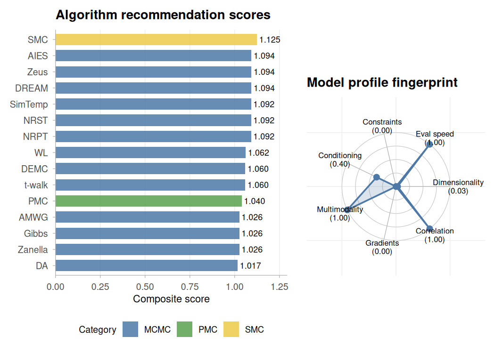

### Fitting with SMC

[`Prescribe()`](https://robustecologies.github.io/lucifer/reference/Prescribe.md)
recommends Sequential Monte Carlo (SMC) as a top strategy for this
model.
[`SMC()`](https://robustecologies.github.io/lucifer/reference/SMC.md)
builds a sequence of tempered distributions from the prior to the
posterior, reweighting and rejuvenating particles at each stage. It
provides a marginal likelihood estimate as a byproduct, which is useful
for model comparison. With 1000 particles and 10 rejuvenation steps per
stage, the posterior approximation is stable across random seeds.

``` r

set.seed(216)
fit_smc <- SMC(spec$Model, Data, Initial.Values,
               Iterations = 1000, N.particles = 1000,
               ESS.threshold = 0.5, Rejuvenation = "RWM",
               Rejuvenation.steps = 10, Schedule = "adaptive",
               Status = 9999)
```

``` r

summary(fit_smc)
#> Sequential Monte Carlo -- summary
#> ================================================== 
#> Call: SMC(Model = spec$Model, Data = Data, Initial.Values = Initial.Values, 
#>     Iterations = 1000, N.particles = 1000, ESS.threshold = 0.5, 
#>     Rejuvenation = "RWM", Rejuvenation.steps = 10, Schedule = "adaptive", 
#>     Status = 9999)
#> 
#> Particles:              1000 
#> Tempering stages:       21 
#> Log marginal lik:       -2489.599 
#> Minutes:                1.58 
#> 
#> Tempering schedule:
#>    0 0.0159 0.0341 0.0727 0.116 ... 0.6447 0.7851 1 
#> 
#> ESS across stages:
#>   Min: 71.6  Mean: 379.5  Max: 561.6 
#> 
#> Rejuvenation acceptance rate:
#>   Min: 0.113  Mean: 0.253  Max: 0.766 
#> 
#> Posterior summary:
#>               Mean     SD    2.5%    50%   97.5%
#> alpha[1]    3.0374 0.1471  2.7437 3.0366  3.3154
#> alpha[2]    5.3448 0.1265  5.1018 5.3513  5.5818
#> alpha[3]    1.6962 0.1419  1.4069 1.6914  1.9675
#> alpha[4]    1.1279 0.1390  0.8451 1.1282  1.4069
#> alpha[5]    2.9802 0.1329  2.7322 2.9819  3.2415
#> alpha[6]    3.7366 0.1321  3.4882 3.7289  3.9967
#> alpha[7]    1.3644 0.1308  1.0990 1.3664  1.6367
#> alpha[8]    1.1654 0.1538  0.8872 1.1647  1.4644
#> alpha[9]    1.4302 0.1405  1.1737 1.4282  1.7029
#> alpha[10]   4.0685 0.1441  3.8156 4.0599  4.3679
#> mu_alpha    2.4799 1.5422 -0.0363 2.3246  6.9734
#> sigma_alpha 3.0081 3.2198  0.9858 2.0140 14.9714
#> beta        1.9738 0.0435  1.8830 1.9757  2.0598
#> sigma       1.0092 0.0444  0.9296 1.0113  1.1046
#> nu_raw      5.1390 1.9863  2.5496 4.6353 10.1766
```

When a `ground_truth` vector is provided,
[`plot()`](https://rdrr.io/r/graphics/plot.default.html) overlays the
true parameter values as dashed lines on the posterior densities, making
it straightforward to assess recovery. The `"intervals"` type shows 95%
credible intervals with diamond markers at the truth.

``` r

ground_truth <- c(alpha_true, mu_alpha = 3, sigma_alpha = 1.5,
                  beta_true, sigma_true, nu_raw = nu_true - 2)
names(ground_truth) <- Data$parm.names
plot(fit_smc, ground_truth = ground_truth)
```

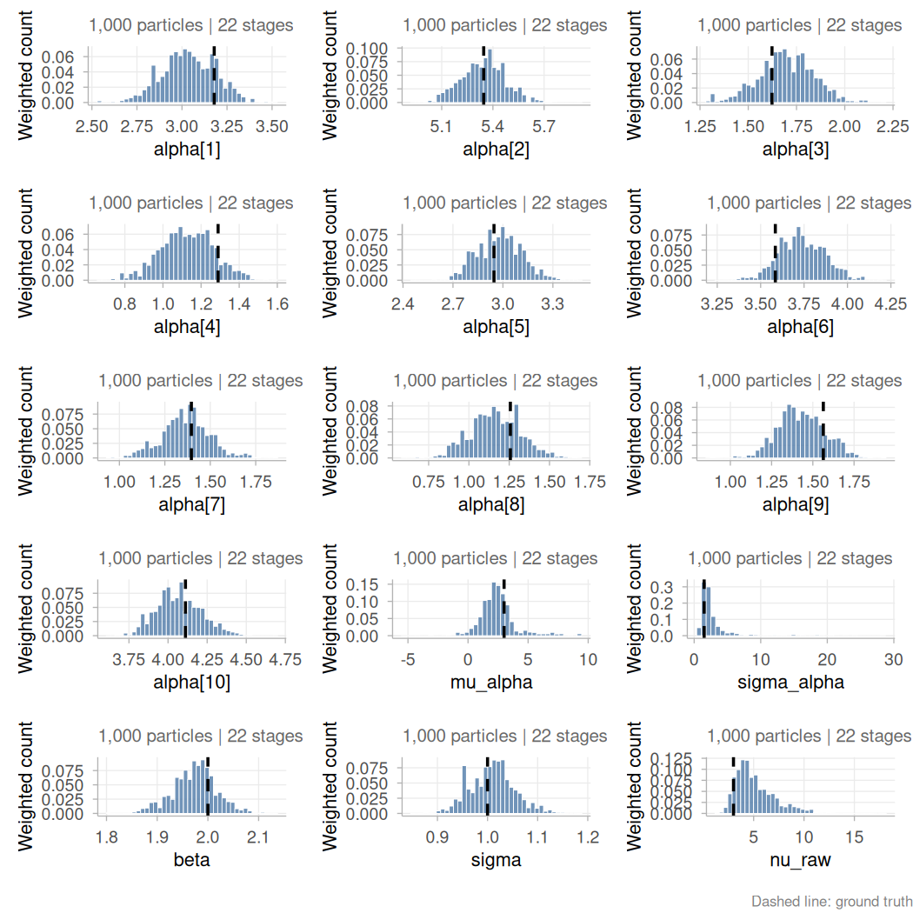

``` r

plot(fit_smc, type = "intervals", ground_truth = ground_truth)
```

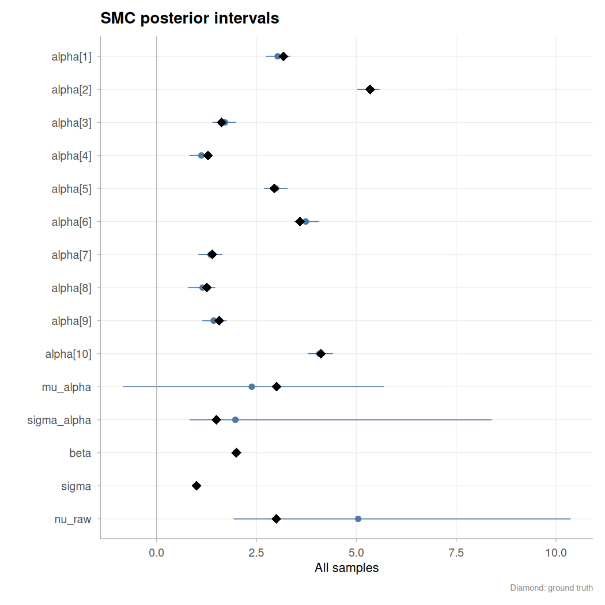

### Fitting with MCMC

lucifer provides 82 MCMC algorithms behind the same
[`lucifer()`](https://robustecologies.github.io/lucifer/reference/lucifer.md)
interface. According to the
[`Prescribe()`](https://robustecologies.github.io/lucifer/reference/Prescribe.md)function
fitting above, several ensemble and population MCMC methods may provide
sensible fittings to the proposed model. As an illustration, here we use
`Zeus`, an ensemble slice sampler that is gradient-free and
affine-invariant (see
[`vignette("mcmc-algorithms", package = "lucifer")`](https://robustecologies.github.io/lucifer/articles/mcmc-algorithms.md)
for the full algorithm catalogue). With `Chains = 3`, three chains run
in parallel via separate R processes, each with a deterministic
per-chain seed derived from the parent’s RNG state. After sampling, the
chains are automatically combined. Hierarchical models with centered
parameterizations present challenging funnel geometries for ensemble
MCMC methods; the diagnostics section below shows how
[`Consort()`](https://robustecologies.github.io/lucifer/reference/Consort.md)
detects this and recommends corrective actions.

``` r

set.seed(616)
fit_mcmc <- lucifer(spec$Model, Data, Initial.Values,
               Iterations = 5000, Status = 100, Thinning = 5,
               Algorithm = "Zeus", Specs = NULL,
               Chains = 3)
```

``` r

summary(fit_mcmc)
#> 
#> Algorithm: Ensemble Slice Sampler
#> Iterations: 15000
#> Thinned samples: 3000
#> Minutes: 3.54
#> Chains: 3
#> CPUs: 3
#> 
#> --- Acceptance ---
#> Combined: 1
#> Per-chain: 1, 1, 1
#> 
#> --- Convergence ---
#> Stationarity: achieved
#> Burn-in (thinned): 2400 (auto-BMK)
#> Posterior2 samples: 600
#> Recommended thinning: 34
#> 
#> --- Split R-hat (Vehtari et al. 2021) ---
#> Max split R-hat:  1.193 (NOT converged, target < 1.01)
#> 
#> --- Gelman-Rubin diagnostic (classical) ---
#>             Point Est. Upper C.I.
#> alpha[1]         1.031      1.095
#> alpha[2]         1.014      1.045
#> alpha[3]         1.019      1.066
#> alpha[4]         1.031      1.108
#> alpha[5]         1.001      1.005
#> alpha[6]         1.028      1.096
#> alpha[7]         1.016      1.052
#> alpha[8]         1.026      1.094
#> alpha[9]         1.136      1.424
#> alpha[10]        1.005      1.008
#> mu_alpha         1.093      1.281
#> sigma_alpha      1.053      1.105
#> beta             1.007      1.013
#> sigma            1.024      1.057
#> nu_raw           1.025      1.070
#> Max PSRF: 1.136 (convergence NOT adequate, target < 1.1)
#> MPSRF: 1.155
#> 
#> --- DIC ---
#>            All Stationary
#> Dbar  3179.315   3145.310
#> pD   18270.451     14.179
#> DIC  21449.767   3159.490
#> Log(Marginal Likelihood): NA
#> 
#> --- Posterior summary (all samples) ---
#>                   Mean       SD    MCSE      ESS         LB     Median
#> alpha[1]        3.0133   0.2535  0.0214 175.3397     2.6965     3.0456
#> alpha[2]        5.2337   0.4560  0.0660 123.4678     4.4825     5.3035
#> alpha[3]        1.7234   0.2594  0.0211  38.7875     1.2532     1.7324
#> alpha[4]        1.0961   0.1880  0.0121 298.3415     0.8260     1.1025
#> alpha[5]        2.9594   0.2804  0.0298 163.2059     2.5250     2.9872
#> alpha[6]        3.7522   0.3369  0.0297 246.4887     3.4676     3.7517
#> alpha[7]        1.3648   0.2431  0.0278 120.9488     1.0854     1.3876
#> alpha[8]        1.1572   0.2970  0.0298 156.4175     0.8616     1.1836
#> alpha[9]        1.4715   0.2543  0.0230 180.7139     1.2032     1.4575
#> alpha[10]       4.0183   0.3405  0.0341 159.1806     3.3884     4.0629
#> mu_alpha        2.5713   0.6598  0.0602 228.1331     1.0992     2.6080
#> sigma_alpha     1.5653   0.4372  0.0396 240.6391     0.9730     1.4839
#> beta            1.9765   0.0729  0.0058 273.2122     1.8926     1.9762
#> sigma           1.0166   0.1881  0.0227 136.9447     0.9163     0.9913
#> nu_raw          4.2514   1.2309  0.1506 127.2311     2.2501     4.1133
#> Deviance     3179.3155 191.1567 24.9499 124.8773  3137.5562  3146.0637
#> LP          -1620.8141  96.6524 12.6466 122.4433 -1788.6574 -1604.0635
#>                     UB
#> alpha[1]        3.2515
#> alpha[2]        5.5378
#> alpha[3]        2.1083
#> alpha[4]        1.3431
#> alpha[5]        3.2237
#> alpha[6]        4.1674
#> alpha[7]        1.6265
#> alpha[8]        1.4391
#> alpha[9]        1.9198
#> alpha[10]       4.2938
#> mu_alpha        3.7250
#> sigma_alpha     2.6539
#> beta            2.0645
#> sigma           1.3216
#> nu_raw          7.0664
#> Deviance     3495.1684
#> LP          -1599.2771
#> 
#> --- Posterior summary (stationary samples) ---
#>                   Mean     SD    MCSE      ESS         LB     Median         UB
#> alpha[1]        3.0443 0.1163  0.0125 156.4074     2.8410     3.0434     3.2858
#> alpha[2]        5.2998 0.1085  0.0297  24.6319     5.1092     5.2932     5.5262
#> alpha[3]        1.7194 0.1078  0.0252  27.3862     1.5249     1.7198     1.9138
#> alpha[4]        1.1128 0.1093  0.0076 325.1385     0.9133     1.1115     1.3307
#> alpha[5]        2.9746 0.1086  0.0304  35.8874     2.7808     2.9721     3.1886
#> alpha[6]        3.7499 0.1160  0.0299  21.5140     3.5318     3.7380     4.0063
#> alpha[7]        1.4099 0.1123  0.0264  30.8852     1.1700     1.4125     1.6071
#> alpha[8]        1.2087 0.1181  0.0111 194.1325     0.9809     1.2068     1.4547
#> alpha[9]        1.4649 0.0898  0.0163  45.1818     1.3058     1.4632     1.6317
#> alpha[10]       4.0830 0.1102  0.0267  29.0596     3.8534     4.0897     4.2744
#> mu_alpha        2.6563 0.5811  0.1737  26.0303     1.4823     2.6754     3.9325
#> sigma_alpha     1.6083 0.4221  0.0598 102.1369     1.0147     1.5398     2.6302
#> beta            1.9685 0.0367  0.0099  23.6329     1.8907     1.9705     2.0398
#> sigma           0.9832 0.0378  0.0101  25.2595     0.9227     0.9787     1.0663
#> nu_raw          4.1908 1.0694  0.2993  36.3761     2.4716     3.9975     6.7294
#> Deviance     3145.3105 5.3253  1.1615  32.7184  3137.1656  3144.5181  3157.7133
#> LP          -1603.6250 2.9489 12.6466  32.8708 -1610.5642 -1603.0757 -1599.1592
#> 
#> --- Effective sample size ---
#> Min ESS: 38.8 (alpha[3])
#> Median ESS: 163.2
#> Min Bulk-ESS: 68.9 (alpha[3])
#> Min Tail-ESS: 61.8 (alpha[3])
#> 
#> --- Overall assessment ---
#> Lucifer is NOT appeased: MCSE too large for some parameters; low ESS (min=38.8); Gelman-Rubin PSRF >= 1.1.

plot(fit_mcmc, ground_truth = ground_truth)
```

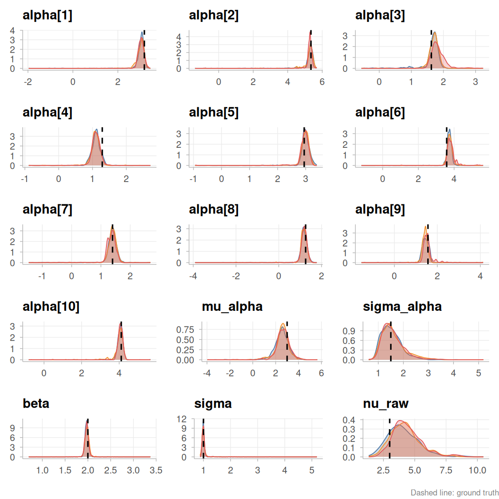

``` r

plot(fit_mcmc, type = "intervals", ground_truth = ground_truth)
```

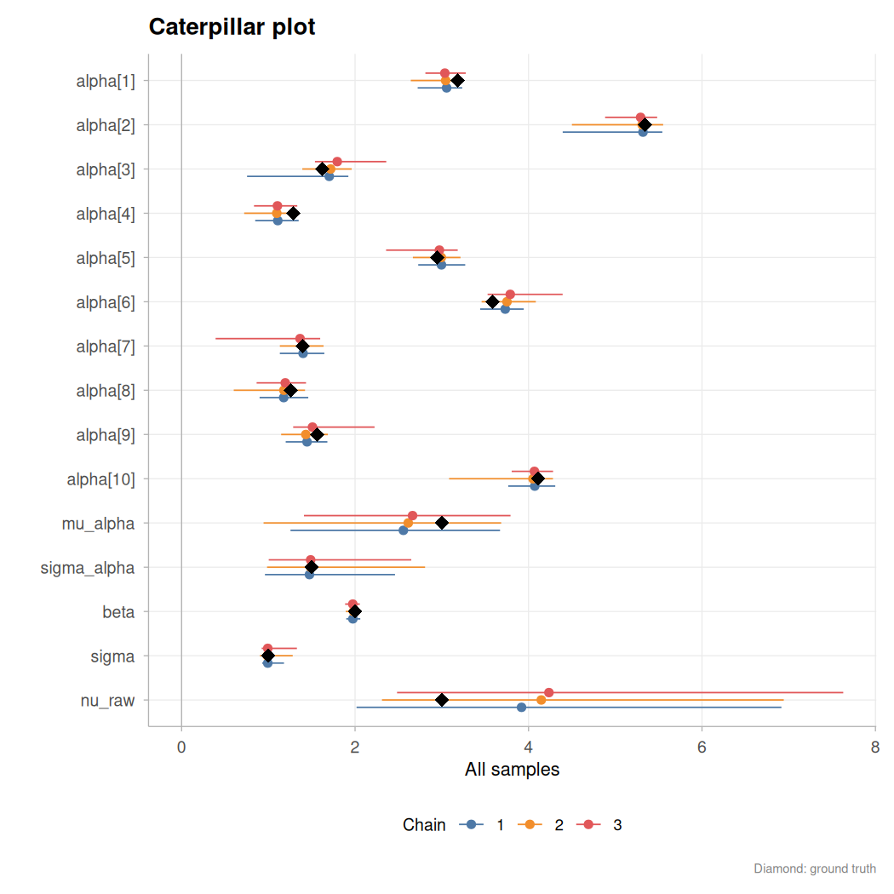

### Diagnostics and sensitivity

[`Consort()`](https://robustecologies.github.io/lucifer/reference/Consort.md)
runs modern convergence diagnostics (split \\\hat{R}\\, bulk/tail ESS,
MCSE) and returns structured recommendations.
[`RobustBayes()`](https://robustecologies.github.io/lucifer/reference/RobustBayes.md)
performs sensitivity analysis: `"power"` measures how much the posterior
changes when the prior or likelihood is scaled, detecting prior-data
conflicts and influential prior choices. The dashboard displays all
modules in a single panel.

``` r

cx_smc <- Consort(fit_smc)
#> 
#> Consort with Lucifer
#> ──────────────────────────────────────── 
#> Algorithm: SMC (SMC, sequential)
#> Time: 1.58 min 
#> 
#>   Final ESS ratio    ✔ not available
#>   Tempering stages   ✔ not available
#> 
#> ✔  Lucifer has been appeased.

rb_smc <- RobustBayes(fit_smc, Model = spec$Model, Data = Data,
                        modules = "all")
#> ⚙ Running power-scaling sensitivity...
#> [                                        ]   1.0% | ETA: 3s[=                                       ]   2.0% | ETA: 2s[=                                       ]   3.0% | ETA: 1s[==                                      ]   4.0% | ETA: 1s[==                                      ]   5.0% | ETA: 1s[==                                      ]   6.0% | ETA: 1s[===                                     ]   7.0% | ETA: 1s[===                                     ]   8.0% | ETA: 1s[====                                    ]   9.0% | ETA: 0s[====                                    ]  10.0% | ETA: 0s[====                                    ]  11.0% | ETA: 0s[=====                                   ]  12.0% | ETA: 0s[=====                                   ]  13.0% | ETA: 0s[======                                  ]  14.0% | ETA: 0s[======                                  ]  15.0% | ETA: 0s[======                                  ]  16.0% | ETA: 0s[=======                                 ]  17.0% | ETA: 0s[=======                                 ]  18.0% | ETA: 0s[========                                ]  19.0% | ETA: 0s[========                                ]  20.0% | ETA: 0s[========                                ]  21.0% | ETA: 0s[=========                               ]  22.0% | ETA: 0s[=========                               ]  23.0% | ETA: 0s[==========                              ]  24.0% | ETA: 0s[==========                              ]  25.0% | ETA: 0s[==========                              ]  26.0% | ETA: 0s[===========                             ]  27.0% | ETA: 0s[===========                             ]  28.0% | ETA: 0s[============                            ]  29.0% | ETA: 0s[============                            ]  30.0% | ETA: 0s[============                            ]  31.0% | ETA: 0s[=============                           ]  32.0% | ETA: 0s[=============                           ]  33.0% | ETA: 0s[==============                          ]  34.0% | ETA: 0s[==============                          ]  35.0% | ETA: 0s[==============                          ]  36.0% | ETA: 0s[===============                         ]  37.0% | ETA: 0s[===============                         ]  38.0% | ETA: 0s[================                        ]  39.0% | ETA: 0s[================                        ]  40.0% | ETA: 0s[================                        ]  41.0% | ETA: 0s[=================                       ]  42.0% | ETA: 0s[=================                       ]  43.0% | ETA: 0s[==================                      ]  44.0% | ETA: 0s[==================                      ]  45.0% | ETA: 0s[==================                      ]  46.0% | ETA: 0s[===================                     ]  47.0% | ETA: 0s[===================                     ]  48.0% | ETA: 0s[====================                    ]  49.0% | ETA: 0s[====================                    ]  50.0% | ETA: 0s[====================                    ]  51.0% | ETA: 0s[=====================                   ]  52.0% | ETA: 0s[=====================                   ]  53.0% | ETA: 0s[======================                  ]  54.0% | ETA: 0s[======================                  ]  55.0% | ETA: 0s[======================                  ]  56.0% | ETA: 0s[=======================                 ]  57.0% | ETA: 0s[=======================                 ]  58.0% | ETA: 0s[========================                ]  59.0% | ETA: 0s[========================                ]  60.0% | ETA: 0s[========================                ]  61.0% | ETA: 0s[=========================               ]  62.0% | ETA: 0s[=========================               ]  63.0% | ETA: 0s[==========================              ]  64.0% | ETA: 0s[==========================              ]  65.0% | ETA: 0s[==========================              ]  66.0% | ETA: 0s[===========================             ]  67.0% | ETA: 0s[===========================             ]  68.0% | ETA: 0s[============================            ]  69.0% | ETA: 0s[============================            ]  70.0% | ETA: 0s[============================            ]  71.0% | ETA: 0s[=============================           ]  72.0% | ETA: 0s[=============================           ]  73.0% | ETA: 0s[==============================          ]  74.0% | ETA: 0s[==============================          ]  75.0% | ETA: 0s[==============================          ]  76.0% | ETA: 0s[===============================         ]  77.0% | ETA: 0s[===============================         ]  78.0% | ETA: 0s[================================        ]  79.0% | ETA: 0s[================================        ]  80.0% | ETA: 0s[================================        ]  81.0% | ETA: 0s[=================================       ]  82.0% | ETA: 0s[=================================       ]  83.0% | ETA: 0s[==================================      ]  84.0% | ETA: 0s[==================================      ]  85.0% | ETA: 0s[==================================      ]  86.0% | ETA: 0s[===================================     ]  87.0% | ETA: 0s[===================================     ]  88.0% | ETA: 0s[====================================    ]  89.0% | ETA: 0s[====================================    ]  90.0% | ETA: 0s[====================================    ]  91.0% | ETA: 0s[=====================================   ]  92.0% | ETA: 0s[=====================================   ]  93.0% | ETA: 0s[======================================  ]  94.0% | ETA: 0s[======================================  ]  95.0% | ETA: 0s[======================================  ]  96.0% | ETA: 0s[======================================= ]  97.0% | ETA: 0s[======================================= ]  98.0% | ETA: 0s[========================================]  99.0% | ETA: 0s[========================================] 100.0% | ETA: 0s
#> [========================================] 100.0% | ETA: 0s
#> ¡   Power-scaling prior...
#> ¡   Power-scaling likelihood...
#> ⚠ Cross-model comparison skipped: requires >= 2 fits.
#> ⚠ Prior-data conflict skipped: Data$PGF not found.
#> ⚙ Running observation influence analysis...
#> ¡   Computing pointwise log-likelihoods...
#> ¡   Stochastic yhat detected; using LOO-Dev decomposition (1000 x 1000 evaluations)...
#> [                                        ]   1.0% | ETA: 166s[=                                       ]   2.0% | ETA: 167s[=                                       ]   3.0% | ETA: 163s[==                                      ]   4.0% | ETA: 162s[==                                      ]   5.0% | ETA: 158s[==                                      ]   6.0% | ETA: 155s[===                                     ]   7.0% | ETA: 152s[===                                     ]   8.0% | ETA: 151s[====                                    ]   9.0% | ETA: 148s[====                                    ]  10.0% | ETA: 146s[====                                    ]  11.0% | ETA: 144s[=====                                   ]  12.0% | ETA: 142s[=====                                   ]  13.0% | ETA: 140s[======                                  ]  14.0% | ETA: 139s[======                                  ]  15.0% | ETA: 137s[======                                  ]  16.0% | ETA: 135s[=======                                 ]  17.0% | ETA: 133s[=======                                 ]  18.0% | ETA: 131s[========                                ]  19.0% | ETA: 130s[========                                ]  20.0% | ETA: 128s[========                                ]  21.0% | ETA: 127s[=========                               ]  22.0% | ETA: 125s[=========                               ]  23.0% | ETA: 123s[==========                              ]  24.0% | ETA: 122s[==========                              ]  25.0% | ETA: 120s[==========                              ]  26.0% | ETA: 119s[===========                             ]  27.0% | ETA: 117s[===========                             ]  28.0% | ETA: 115s[============                            ]  29.0% | ETA: 114s[============                            ]  30.0% | ETA: 112s[============                            ]  31.0% | ETA: 110s[=============                           ]  32.0% | ETA: 109s[=============                           ]  33.0% | ETA: 107s[==============                          ]  34.0% | ETA: 106s[==============                          ]  35.0% | ETA: 104s[==============                          ]  36.0% | ETA: 102s[===============                         ]  37.0% | ETA: 101s[===============                         ]  38.0% | ETA: 99s[================                        ]  39.0% | ETA: 97s[================                        ]  40.0% | ETA: 96s[================                        ]  41.0% | ETA: 94s[=================                       ]  42.0% | ETA: 93s[=================                       ]  43.0% | ETA: 91s[==================                      ]  44.0% | ETA: 89s[==================                      ]  45.0% | ETA: 88s[==================                      ]  46.0% | ETA: 86s[===================                     ]  47.0% | ETA: 85s[===================                     ]  48.0% | ETA: 83s[====================                    ]  49.0% | ETA: 81s[====================                    ]  50.0% | ETA: 80s[====================                    ]  51.0% | ETA: 78s[=====================                   ]  52.0% | ETA: 77s[=====================                   ]  53.0% | ETA: 75s[======================                  ]  54.0% | ETA: 73s[======================                  ]  55.0% | ETA: 72s[======================                  ]  56.0% | ETA: 70s[=======================                 ]  57.0% | ETA: 69s[=======================                 ]  58.0% | ETA: 67s[========================                ]  59.0% | ETA: 65s[========================                ]  60.0% | ETA: 64s[========================                ]  61.0% | ETA: 62s[=========================               ]  62.0% | ETA: 61s[=========================               ]  63.0% | ETA: 59s[==========================              ]  64.0% | ETA: 57s[==========================              ]  65.0% | ETA: 56s[==========================              ]  66.0% | ETA: 54s[===========================             ]  67.0% | ETA: 53s[===========================             ]  68.0% | ETA: 51s[============================            ]  69.0% | ETA: 49s[============================            ]  70.0% | ETA: 48s[============================            ]  71.0% | ETA: 46s[=============================           ]  72.0% | ETA: 45s[=============================           ]  73.0% | ETA: 43s[==============================          ]  74.0% | ETA: 41s[==============================          ]  75.0% | ETA: 40s[==============================          ]  76.0% | ETA: 38s[===============================         ]  77.0% | ETA: 37s[===============================         ]  78.0% | ETA: 35s[================================        ]  79.0% | ETA: 33s[================================        ]  80.0% | ETA: 32s[================================        ]  81.0% | ETA: 30s[=================================       ]  82.0% | ETA: 29s[=================================       ]  83.0% | ETA: 27s[==================================      ]  84.0% | ETA: 25s[==================================      ]  85.0% | ETA: 24s[==================================      ]  86.0% | ETA: 22s[===================================     ]  87.0% | ETA: 21s[===================================     ]  88.0% | ETA: 19s[====================================    ]  89.0% | ETA: 18s[====================================    ]  90.0% | ETA: 16s[====================================    ]  91.0% | ETA: 14s[=====================================   ]  92.0% | ETA: 13s[=====================================   ]  93.0% | ETA: 11s[======================================  ]  94.0% | ETA: 10s[======================================  ]  95.0% | ETA: 8s[======================================  ]  96.0% | ETA: 6s[======================================= ]  97.0% | ETA: 5s[======================================= ]  98.0% | ETA: 3s[========================================]  99.0% | ETA: 2s[========================================] 100.0% | ETA: 0s
#> [========================================] 100.0% | ETA: 0s
#> ¡   Computing PSIS-LOO influence...
#> ⚠ Robust aggregation skipped: requires >= 2 fits.
#> ✔ RobustBayes completed in 2.7 minutes.
print(rb_smc)
#> 
#> Robust Bayesian sensitivity analysis
#> -------------------------------------------------- 
#>   Models:     1 (smc)
#>   Parameters: 15
#>   Observations: 1000 
#>   Time:        2.7 min 
#> 
#> ¡ Power-scaling sensitivity:
#>     ✔ robust: 15 parameter(s)
#>     Top prior-sensitive: sigma_alpha (0.045), mu_alpha (0.038), alpha[8] (0.022)
#> 
#> ¡ Observation influence:
#>     ✔ 0 of 1000 observations flagged (Pareto k > 0.7)
plot(rb_smc, type = "dashboard")
```

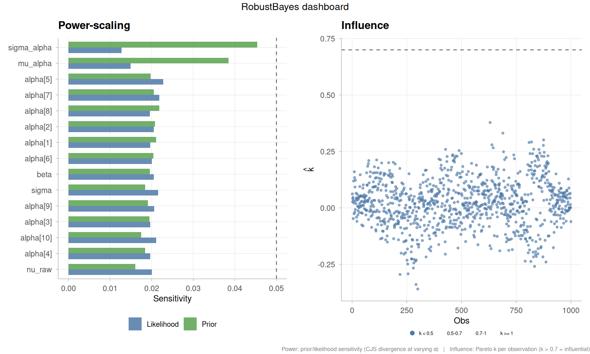

``` r

plot(rb_smc, type = "power_density")
```

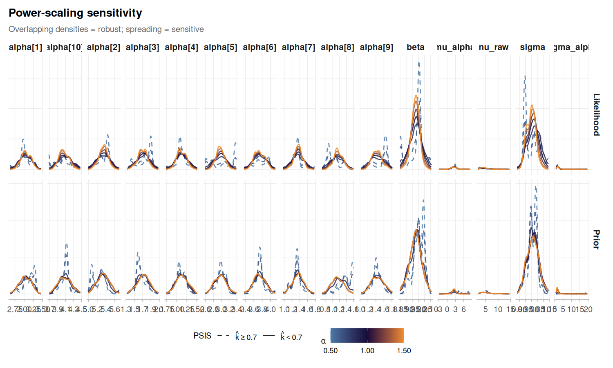

``` r

cx_mcmc <- Consort(fit_mcmc)
#> 
#> Consort with Lucifer
#> ──────────────────────────────────────── 
#> Algorithm: Ensemble Slice Sampler (MCMC, ensemble)
#> Time: 3.54 min | Iterations: 15000 | Parameters: 15 
#> 
#>   Non-adaptive             ✔ non-adaptive phase
#>   Acceptance rate          ✔ not applicable
#>   MCSE                     ✘ max ratio = 0.2989 (threshold 0.0627)
#>   ESS (bulk/tail)          ✘ min bulk = 69, min tail = 62
#>   Rhat                     ✘ max = 1.1929 (threshold 1.01)
#>   Divergences              ✔ 0
#>   Diminishing adaptation   ✔ non-adaptive
#> 
#>   Convergence score: 24.8 / 100
#>   ESS / second: 0.3
#> 
#> ✘  Lucifer has not been appeased.
#>   Suggestion: Continue with more iterations. ESS too low (bulk=69, tail=62); MCSE too high (max ratio=0.2989); Rhat too high (max=1.1929)

rb_mcmc <- RobustBayes(fit_mcmc, Model = spec$Model, Data = Data,
                         modules = "all")
#> ⚙ Running power-scaling sensitivity...
#> [                                        ]   1.0% | ETA: 0s[=                                       ]   2.0% | ETA: 0s[=                                       ]   3.0% | ETA: 0s[==                                      ]   4.0% | ETA: 0s[==                                      ]   5.0% | ETA: 0s[==                                      ]   6.0% | ETA: 0s[===                                     ]   7.0% | ETA: 0s[===                                     ]   8.0% | ETA: 0s[====                                    ]   9.0% | ETA: 0s[====                                    ]  10.0% | ETA: 0s[====                                    ]  11.0% | ETA: 0s[=====                                   ]  12.0% | ETA: 0s[=====                                   ]  13.0% | ETA: 0s[======                                  ]  14.0% | ETA: 0s[======                                  ]  15.0% | ETA: 0s[======                                  ]  16.0% | ETA: 0s[=======                                 ]  17.0% | ETA: 0s[=======                                 ]  18.0% | ETA: 0s[========                                ]  19.0% | ETA: 0s[========                                ]  20.0% | ETA: 0s[========                                ]  21.0% | ETA: 0s[=========                               ]  22.0% | ETA: 0s[=========                               ]  23.0% | ETA: 0s[==========                              ]  24.0% | ETA: 0s[==========                              ]  25.0% | ETA: 0s[==========                              ]  26.0% | ETA: 0s[===========                             ]  27.0% | ETA: 0s[===========                             ]  28.0% | ETA: 0s[============                            ]  29.0% | ETA: 0s[============                            ]  30.0% | ETA: 0s[============                            ]  31.0% | ETA: 0s[=============                           ]  32.0% | ETA: 0s[=============                           ]  33.0% | ETA: 0s[==============                          ]  34.0% | ETA: 0s[==============                          ]  35.0% | ETA: 0s[==============                          ]  36.0% | ETA: 0s[===============                         ]  37.0% | ETA: 0s[===============                         ]  38.0% | ETA: 0s[================                        ]  39.0% | ETA: 0s[================                        ]  40.0% | ETA: 0s[================                        ]  41.0% | ETA: 0s[=================                       ]  42.0% | ETA: 0s[=================                       ]  43.0% | ETA: 0s[==================                      ]  44.0% | ETA: 0s[==================                      ]  45.0% | ETA: 0s[==================                      ]  46.0% | ETA: 0s[===================                     ]  47.0% | ETA: 0s[===================                     ]  48.0% | ETA: 0s[====================                    ]  49.0% | ETA: 0s[====================                    ]  50.0% | ETA: 0s[====================                    ]  51.0% | ETA: 0s[=====================                   ]  52.0% | ETA: 0s[=====================                   ]  53.0% | ETA: 0s[======================                  ]  54.0% | ETA: 0s[======================                  ]  55.0% | ETA: 0s[======================                  ]  56.0% | ETA: 0s[=======================                 ]  57.0% | ETA: 0s[=======================                 ]  58.0% | ETA: 0s[========================                ]  59.0% | ETA: 0s[========================                ]  60.0% | ETA: 0s[========================                ]  61.0% | ETA: 0s[=========================               ]  62.0% | ETA: 0s[=========================               ]  63.0% | ETA: 0s[==========================              ]  64.0% | ETA: 0s[==========================              ]  65.0% | ETA: 0s[==========================              ]  66.0% | ETA: 0s[===========================             ]  67.0% | ETA: 0s[===========================             ]  68.0% | ETA: 0s[============================            ]  69.0% | ETA: 0s[============================            ]  70.0% | ETA: 0s[============================            ]  71.0% | ETA: 0s[=============================           ]  72.0% | ETA: 0s[=============================           ]  73.0% | ETA: 0s[==============================          ]  74.0% | ETA: 0s[==============================          ]  75.0% | ETA: 0s[==============================          ]  76.0% | ETA: 0s[===============================         ]  77.0% | ETA: 0s[===============================         ]  78.0% | ETA: 0s[================================        ]  79.0% | ETA: 0s[================================        ]  80.0% | ETA: 0s[================================        ]  81.0% | ETA: 0s[=================================       ]  82.0% | ETA: 0s[=================================       ]  83.0% | ETA: 0s[==================================      ]  84.0% | ETA: 0s[==================================      ]  85.0% | ETA: 0s[==================================      ]  86.0% | ETA: 0s[===================================     ]  87.0% | ETA: 0s[===================================     ]  88.0% | ETA: 0s[====================================    ]  89.0% | ETA: 0s[====================================    ]  90.0% | ETA: 0s[====================================    ]  91.0% | ETA: 0s[=====================================   ]  92.0% | ETA: 0s[=====================================   ]  93.0% | ETA: 0s[======================================  ]  94.0% | ETA: 0s[======================================  ]  95.0% | ETA: 0s[======================================  ]  96.0% | ETA: 0s[======================================= ]  97.0% | ETA: 0s[======================================= ]  98.0% | ETA: 0s[========================================]  99.0% | ETA: 0s[========================================] 100.0% | ETA: 0s
#> [========================================] 100.0% | ETA: 0s
#> ¡   Power-scaling prior...
#> ¡   Power-scaling likelihood...
#> ⚠ Cross-model comparison skipped: requires >= 2 fits.
#> ⚠ Prior-data conflict skipped: Data$PGF not found.
#> ⚙ Running observation influence analysis...
#> ¡   Computing pointwise log-likelihoods...
#> ¡   Stochastic yhat detected; using LOO-Dev decomposition (1000 x 600 evaluations)...
#> [                                        ]   1.0% | ETA: 94s[=                                       ]   2.0% | ETA: 93s[=                                       ]   3.0% | ETA: 92s[==                                      ]   4.0% | ETA: 91s[==                                      ]   5.0% | ETA: 90s[==                                      ]   6.0% | ETA: 89s[===                                     ]   7.0% | ETA: 90s[===                                     ]   8.0% | ETA: 88s[====                                    ]   9.0% | ETA: 88s[====                                    ]  10.0% | ETA: 86s[====                                    ]  11.0% | ETA: 85s[=====                                   ]  12.0% | ETA: 84s[=====                                   ]  13.0% | ETA: 83s[======                                  ]  14.0% | ETA: 82s[======                                  ]  15.0% | ETA: 81s[======                                  ]  16.0% | ETA: 80s[=======                                 ]  17.0% | ETA: 79s[=======                                 ]  18.0% | ETA: 78s[========                                ]  19.0% | ETA: 77s[========                                ]  20.0% | ETA: 76s[========                                ]  21.0% | ETA: 75s[=========                               ]  22.0% | ETA: 74s[=========                               ]  23.0% | ETA: 73s[==========                              ]  24.0% | ETA: 73s[==========                              ]  25.0% | ETA: 72s[==========                              ]  26.0% | ETA: 71s[===========                             ]  27.0% | ETA: 70s[===========                             ]  28.0% | ETA: 69s[============                            ]  29.0% | ETA: 68s[============                            ]  30.0% | ETA: 67s[============                            ]  31.0% | ETA: 66s[=============                           ]  32.0% | ETA: 65s[=============                           ]  33.0% | ETA: 64s[==============                          ]  34.0% | ETA: 63s[==============                          ]  35.0% | ETA: 62s[==============                          ]  36.0% | ETA: 61s[===============                         ]  37.0% | ETA: 60s[===============                         ]  38.0% | ETA: 59s[================                        ]  39.0% | ETA: 58s[================                        ]  40.0% | ETA: 57s[================                        ]  41.0% | ETA: 56s[=================                       ]  42.0% | ETA: 55s[=================                       ]  43.0% | ETA: 54s[==================                      ]  44.0% | ETA: 53s[==================                      ]  45.0% | ETA: 52s[==================                      ]  46.0% | ETA: 51s[===================                     ]  47.0% | ETA: 50s[===================                     ]  48.0% | ETA: 49s[====================                    ]  49.0% | ETA: 49s[====================                    ]  50.0% | ETA: 48s[====================                    ]  51.0% | ETA: 47s[=====================                   ]  52.0% | ETA: 46s[=====================                   ]  53.0% | ETA: 45s[======================                  ]  54.0% | ETA: 44s[======================                  ]  55.0% | ETA: 43s[======================                  ]  56.0% | ETA: 42s[=======================                 ]  57.0% | ETA: 41s[=======================                 ]  58.0% | ETA: 40s[========================                ]  59.0% | ETA: 39s[========================                ]  60.0% | ETA: 38s[========================                ]  61.0% | ETA: 37s[=========================               ]  62.0% | ETA: 36s[=========================               ]  63.0% | ETA: 35s[==========================              ]  64.0% | ETA: 34s[==========================              ]  65.0% | ETA: 33s[==========================              ]  66.0% | ETA: 32s[===========================             ]  67.0% | ETA: 31s[===========================             ]  68.0% | ETA: 31s[============================            ]  69.0% | ETA: 30s[============================            ]  70.0% | ETA: 29s[============================            ]  71.0% | ETA: 28s[=============================           ]  72.0% | ETA: 27s[=============================           ]  73.0% | ETA: 26s[==============================          ]  74.0% | ETA: 25s[==============================          ]  75.0% | ETA: 24s[==============================          ]  76.0% | ETA: 23s[===============================         ]  77.0% | ETA: 22s[===============================         ]  78.0% | ETA: 21s[================================        ]  79.0% | ETA: 20s[================================        ]  80.0% | ETA: 19s[================================        ]  81.0% | ETA: 18s[=================================       ]  82.0% | ETA: 17s[=================================       ]  83.0% | ETA: 16s[==================================      ]  84.0% | ETA: 15s[==================================      ]  85.0% | ETA: 14s[==================================      ]  86.0% | ETA: 13s[===================================     ]  87.0% | ETA: 12s[===================================     ]  88.0% | ETA: 11s[====================================    ]  89.0% | ETA: 10s[====================================    ]  90.0% | ETA: 10s[====================================    ]  91.0% | ETA: 9s[=====================================   ]  92.0% | ETA: 8s[=====================================   ]  93.0% | ETA: 7s[======================================  ]  94.0% | ETA: 6s[======================================  ]  95.0% | ETA: 5s[======================================  ]  96.0% | ETA: 4s[======================================= ]  97.0% | ETA: 3s[======================================= ]  98.0% | ETA: 2s[========================================]  99.0% | ETA: 1s[========================================] 100.0% | ETA: 0s
#> [========================================] 100.0% | ETA: 0s
#> ¡   Computing PSIS-LOO influence...
#> ⚠ Robust aggregation skipped: requires >= 2 fits.
#> ✔ RobustBayes completed in 1.6 minutes.
print(rb_mcmc)
#> 
#> Robust Bayesian sensitivity analysis
#> -------------------------------------------------- 
#>   Models:     1 (demonoid)
#>   Parameters: 15
#>   Observations: 1000 
#>   Time:        1.6 min 
#> 
#> ¡ Power-scaling sensitivity:
#>     ✔ robust: 15 parameter(s)
#>     Top prior-sensitive: mu_alpha (0.011), sigma_alpha (0.010), alpha[1] (0.007)
#> 
#> ¡ Observation influence:
#>     ⚠ 1 of 1000 observations flagged (Pareto k > 0.7)
plot(rb_mcmc, type = "dashboard")
```

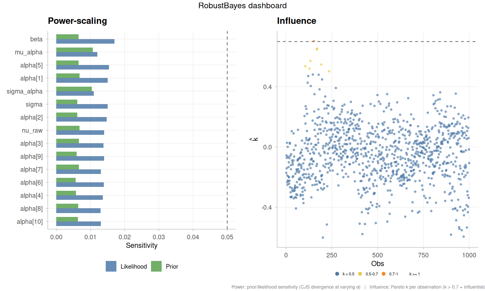

``` r

plot(rb_mcmc, type = "power_density")
```

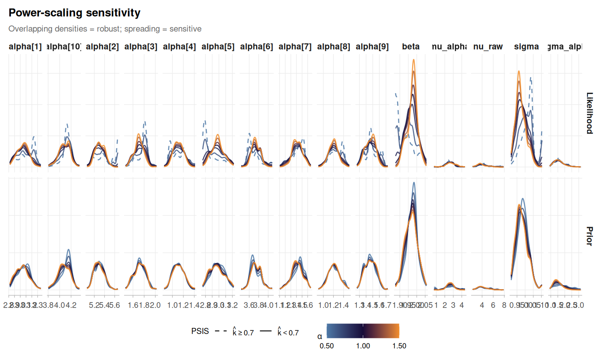

### Cross-checking with brms (NUTS via Stan)

To exercise the interoperability layer described in the Overview, we
refit the same hierarchical Student-\\t\\ model using
[brms](https://paul-buerkner.github.io/brms/), which compiles the model
to Stan and samples with NUTS. The formula `y ~ 1 + x + (1 | group)`
with `family = student()` and matching priors specifies the same
generative model; the parameter names differ because brms uses
treatment-coded fixed effects (`b_Intercept` ≡ \\\mu\_\alpha\\,
`sd_group__Intercept` ≡ \\\sigma\_\alpha\\) and reports \\\nu\\ directly
on its natural scale (\\\nu = \nu\_\text{raw} + 2\\). Once converted
with
[`as.demonoid()`](https://robustecologies.github.io/lucifer/reference/as.demonoid.md),
the brms fit is indistinguishable, from lucifer’s perspective, from a
fit produced by SMC or Zeus, and can be fed into exactly the same
comparison machinery. For a much fuller worked example that fits this
same model class with every JAGS wrapper, every Stan wrapper, and every
lucifer inference family side by side, see
[`vignette("interoperability", package = "lucifer")`](https://robustecologies.github.io/lucifer/articles/interoperability.md).

``` r

library(brms)

df <- data.frame(y = y, x = x, group = factor(group))

priors <- c(
  prior(normal(0, 10),   class = "Intercept"),
  prior(normal(0, 10),   class = "b", coef = "x"),
  prior(cauchy(0, 2.5),  class = "sd", group = "group"),
  prior(cauchy(0, 2.5),  class = "sigma"),
  prior(exponential(0.1), class = "nu")
)

brms_fit <- brm(
  y ~ 1 + x + (1 | group),
  data = df, family = student(),
  prior = priors,
  chains = 3, iter = 2000, warmup = 1000,
  cores = 3, seed = 42, refresh = 0, silent = 2
)
```

``` r

# Convert the brmsfit into a native lucifer demonoid object
fit_brms <- as.demonoid(brms_fit)
class(fit_brms)
#> [1] "demonoid"

# All lucifer post-processing works transparently on the converted object
summary(fit_brms)
#> 
#> Algorithm: Stan:NUTS (brms)
#> Iterations: 3000
#> Thinned samples: 3000
#> Minutes: 0.26
#> Chains: 3
#> CPUs: 1
#> 
#> --- Acceptance ---
#> Combined: 0.91867
#> Per-chain: 0.91867, 0.91867, 0.91867
#> 
#> --- Convergence ---
#> Stationarity: achieved
#> Burn-in (thinned): 0 (auto-BMK)
#> Posterior2 samples: 3000
#> Recommended thinning: 7
#> 
#> --- Split R-hat (Vehtari et al. 2021) ---
#> Max split R-hat:  1.006 (excellent)
#> 
#> --- Gelman-Rubin diagnostic (classical) ---
#>                       Point Est. Upper C.I.
#> b_Intercept                1.001      1.002
#> b_x                        1.002      1.005
#> sd_group__Intercept        1.012      1.016
#> sigma                      1.006      1.019
#> nu                         1.005      1.014
#> Intercept                  1.001      1.002
#> r_group[1,Intercept]       1.001      1.003
#> r_group[2,Intercept]       1.001      1.002
#> r_group[3,Intercept]       1.001      1.002
#> r_group[4,Intercept]       1.001      1.002
#> r_group[5,Intercept]       1.001      1.001
#> r_group[6,Intercept]       1.001      1.003
#> r_group[7,Intercept]       1.001      1.001
#> r_group[8,Intercept]       1.001      1.002
#> r_group[9,Intercept]       1.001      1.002
#> r_group[10,Intercept]      1.001      1.002
#> lprior                     1.007      1.008
#> Max PSRF: 1.012 (convergence adequate)
#> MPSRF: 1.008
#> 
#> --- DIC ---
#>           All Stationary
#> Dbar 3145.164   3145.164
#> pD     12.361     12.361
#> DIC  3157.525   3157.525
#> Log(Marginal Likelihood): -1571.541
#> 
#> --- Posterior summary (all samples) ---
#>                             Mean     SD   MCSE       ESS         LB     Median
#> b_Intercept               2.6196 0.5350 0.0298  619.6871     1.5333     2.6155
#> b_x                       1.9758 0.0358 0.0010 2079.8193     1.9060     1.9752
#> sd_group__Intercept       1.6343 0.4910 0.0288  483.9549     1.0037     1.5356
#> sigma                     0.9858 0.0367 0.0011 1574.1362     0.9123     0.9851
#> nu                        6.3655 1.1926 0.0362 2116.1314     4.4900     6.2389
#> Intercept                 2.5811 0.5350 0.0298  619.7077     1.4952     2.5765
#> r_group[1,Intercept]      0.4345 0.5441 0.0296  605.3382    -0.6170     0.4377
#> r_group[2,Intercept]      2.7098 0.5444 0.0302  619.9976     1.6270     2.7097
#> r_group[3,Intercept]     -0.9097 0.5418 0.0297  584.8159    -1.9521    -0.9051
#> r_group[4,Intercept]     -1.5050 0.5450 0.0300  574.4549    -2.5606    -1.5039
#> r_group[5,Intercept]      0.3686 0.5442 0.0305  567.3702    -0.6663     0.3699
#> r_group[6,Intercept]      1.1269 0.5433 0.0298  578.1187     0.0575     1.1264
#> r_group[7,Intercept]     -1.2266 0.5439 0.0296  593.2895    -2.2884    -1.2084
#> r_group[8,Intercept]     -1.4175 0.5465 0.0300  608.5281    -2.4845    -1.4131
#> r_group[9,Intercept]     -1.1897 0.5410 0.0294  614.7454    -2.2672    -1.1837
#> r_group[10,Intercept]     1.4471 0.5415 0.0297  580.0517     0.3726     1.4497
#> lprior                  -12.5798 0.2249 0.0115  652.4700   -13.0863   -12.5400
#> Deviance               3145.1640 4.9721 0.1717 1274.6868  3137.4074  3144.5898
#> LP                    -1572.5820 2.4861 0.0859 1274.6868 -1578.1411 -1572.2949
#>                               UB
#> b_Intercept               3.6605
#> b_x                       2.0454
#> sd_group__Intercept       2.7581
#> sigma                     1.0570
#> nu                        9.0173
#> Intercept                 3.6217
#> r_group[1,Intercept]      1.5385
#> r_group[2,Intercept]      3.8358
#> r_group[3,Intercept]      0.1987
#> r_group[4,Intercept]     -0.4027
#> r_group[5,Intercept]      1.4738
#> r_group[6,Intercept]      2.2461
#> r_group[7,Intercept]     -0.1289
#> r_group[8,Intercept]     -0.3232
#> r_group[9,Intercept]     -0.0879
#> r_group[10,Intercept]     2.5567
#> lprior                  -12.2542
#> Deviance               3156.2821
#> LP                    -1568.7037
#> 
#> --- Posterior summary (stationary samples) ---
#>                             Mean     SD   MCSE       ESS         LB     Median
#> b_Intercept               2.6196 0.5350 0.0298  619.6871     1.5333     2.6155
#> b_x                       1.9758 0.0358 0.0010 2079.8193     1.9060     1.9752
#> sd_group__Intercept       1.6343 0.4910 0.0288  483.9549     1.0037     1.5356
#> sigma                     0.9858 0.0367 0.0011 1574.1362     0.9123     0.9851
#> nu                        6.3655 1.1926 0.0362 2116.1314     4.4900     6.2389
#> Intercept                 2.5811 0.5350 0.0298  619.7077     1.4952     2.5765
#> r_group[1,Intercept]      0.4345 0.5441 0.0296  605.3382    -0.6170     0.4377
#> r_group[2,Intercept]      2.7098 0.5444 0.0302  619.9976     1.6270     2.7097
#> r_group[3,Intercept]     -0.9097 0.5418 0.0297  584.8159    -1.9521    -0.9051
#> r_group[4,Intercept]     -1.5050 0.5450 0.0300  574.4549    -2.5606    -1.5039
#> r_group[5,Intercept]      0.3686 0.5442 0.0305  567.3702    -0.6663     0.3699
#> r_group[6,Intercept]      1.1269 0.5433 0.0298  578.1187     0.0575     1.1264
#> r_group[7,Intercept]     -1.2266 0.5439 0.0296  593.2895    -2.2884    -1.2084
#> r_group[8,Intercept]     -1.4175 0.5465 0.0300  608.5281    -2.4845    -1.4131
#> r_group[9,Intercept]     -1.1897 0.5410 0.0294  614.7454    -2.2672    -1.1837
#> r_group[10,Intercept]     1.4471 0.5415 0.0297  580.0517     0.3726     1.4497
#> lprior                  -12.5798 0.2249 0.0115  652.4700   -13.0863   -12.5400
#> Deviance               3145.1640 4.9721 0.1717 1274.6868  3137.4074  3144.5898
#> LP                    -1572.5820 2.4861 0.0859 1274.6868 -1578.1411 -1572.2949
#>                               UB
#> b_Intercept               3.6605
#> b_x                       2.0454
#> sd_group__Intercept       2.7581
#> sigma                     1.0570
#> nu                        9.0173
#> Intercept                 3.6217
#> r_group[1,Intercept]      1.5385
#> r_group[2,Intercept]      3.8358
#> r_group[3,Intercept]      0.1987
#> r_group[4,Intercept]     -0.4027
#> r_group[5,Intercept]      1.4738
#> r_group[6,Intercept]      2.2461
#> r_group[7,Intercept]     -0.1289
#> r_group[8,Intercept]     -0.3232
#> r_group[9,Intercept]     -0.0879
#> r_group[10,Intercept]     2.5567
#> lprior                  -12.2542
#> Deviance               3156.2821
#> LP                    -1568.7037
#> 
#> --- Effective sample size ---
#> Min ESS: 484 (sd_group__Intercept)
#> Median ESS: 608.5
#> Min Bulk-ESS: 522.2 (sd_group__Intercept)
#> Min Tail-ESS: 729 (Intercept)
#> 
#> --- Overall assessment ---
#> Lucifer is appeased. Samples appear suitable for inference.
```

lucifer has a built-in function to plot NUTS-specific diagnostics. It
can print a summary similar to Stan’s `check_hmc_diagnostics`, and
checks for divergent transitions, low E-BFMI (energy Bayesian fraction
of missing information), and excessive tree depth saturation:

``` r

diag <- check_nuts(fit_brms)
print(diag)
#> 
#> ⚙ NUTS diagnostics (3000 iterations)
#> ────────────────────────────────────────────────── 
#> ✔  No divergent transitions
#> ✔ E-BFMI = 0.826
#> ⚠ Tree depth: 7 reached in 14.8% of iterations
#>   Consider increasing Lmax in Specs.
#> 
#>   Mean leapfrog steps: 68.8
#>   Mean tree depth:     5.3
#>   Mean energy:         1604.6
plot(diag)
```

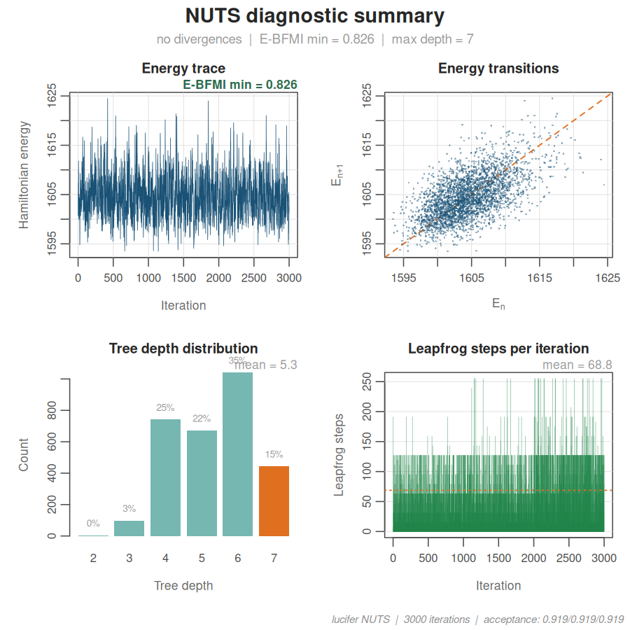

[`Consort()`](https://robustecologies.github.io/lucifer/reference/Consort.md)
then runs the full convergence battery on the converted object, using
`$NUTS.Diagnostics` when present to report divergences, tree-depth
saturation, and E-BFMI alongside the usual split-\\\hat{R}\\, bulk/tail
ESS, and MCSE summaries.

``` r

cx_brms <- Consort(fit_brms)
#> 
#> Consort with Lucifer
#> ──────────────────────────────────────── 
#> Algorithm: Stan:NUTS (brms) (MCMC)
#> Time: 0.26 min | Iterations: 3000 | Parameters: 17 
#> 
#>   Non-adaptive             ✔ non-adaptive phase
#>   Acceptance rate          ✔ not applicable
#>   MCSE                     ✔ max ratio = 0.0586 (threshold 0.0627)
#>   ESS (bulk/tail)          ✔ min bulk = 522, min tail = 729
#>   Rhat                     ✔ max = 1.0059 (threshold 1.01)
#>   Divergences              ✔ 0
#>   Diminishing adaptation   ✔ non-adaptive
#> 
#>   Convergence score: 68.2 / 100
#>   ESS / second: 33.6
#> 
#> ✔  Lucifer has been appeased.
plot(cx_brms)
```

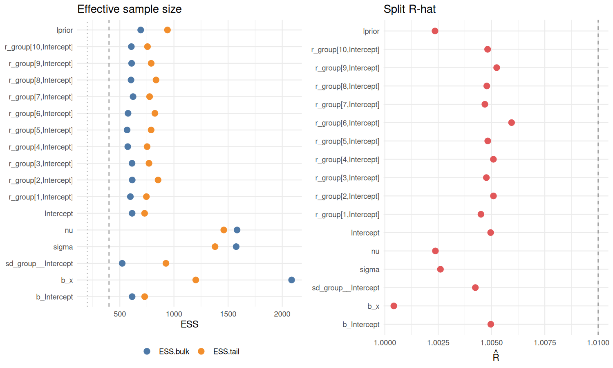

### Posterior comparison: lucifer SMC vs lucifer MCMC vs brms/NUTS

With all three fits on a common footing, we extract posterior means and
95% intervals for the top-level regression coefficients and the
hierarchical hyperparameters, then plot them side by side. The three
engines target the same posterior, so differences reflect a combination
of Monte Carlo error and sampler efficiency rather than model
disagreement.

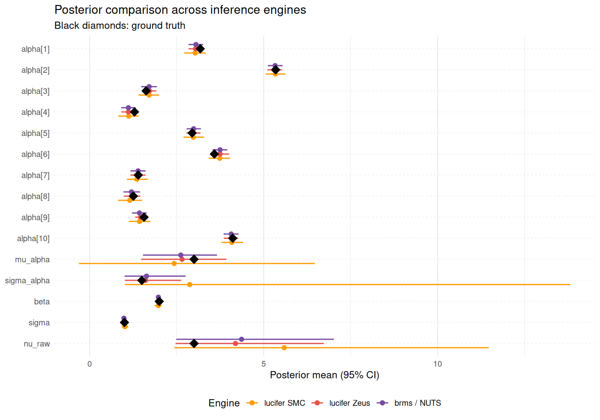

The three engines produce close agreement on well-identified parameters
(\\\beta\\, \\\sigma\\, and the group-level intercepts \\\alpha_j\\),
where sampling variability is the only meaningful source of difference.
The weakly-identified parameters (\\\mu\_\alpha\\, \\\sigma\_\alpha\\,
\\\nu\\) show wider intervals in every method, which is a structural
feature of hierarchical Student-\\t\\ models with \\J = 10\\ groups: the
posterior funnel is intrinsically hard, and the degrees of freedom of a
Student-\\t\\ distribution are estimated from tail behavior alone. The
fact that SMC (tempered importance sampling), Zeus (ensemble slice
sampling), and NUTS (gradient-based HMC with automatic adaptation)
converge on quantitatively consistent summaries is the strongest
possible cross-validation that the posterior is being characterized as
correctly as the data allow.

## Citation

``` r

citation("lucifer")
#> To cite package 'lucifer' in publications use:
#> 
#>   Almaraz P, Hall B, Hall M, Statisticat, LLC, RElab (2026). _lucifer:
#>   An Exhaustive Environment for Bayesian Inference with C++ Backend and
#>   OpenMP parallelization_. R package version 3.7.1,
#>   <https://github.com/robustecologies/lucifer>.
#> 
#> A BibTeX entry for LaTeX users is
#> 
#>   @Manual{,
#>     title = {lucifer: An Exhaustive Environment for Bayesian Inference with C++
#> Backend and OpenMP parallelization},
#>     author = {Pablo Almaraz and Byron Hall and Martina Hall and {Statisticat, LLC} and {RElab}},
#>     year = {2026},
#>     note = {R package version 3.7.1},
#>     url = {https://github.com/robustecologies/lucifer},
#>   }
```

## Author

**Pablo Almaraz**
[](https://orcid.org/0000-0003-1416-2695)

[Robust Ecologies Lab](https://robustecologies.github.io)

## Disclaimer

This package is the original creation of the author in all conceptual,
theoretical, and design aspects. Implementation was assisted by
Anthropic’s Claude Code (Opus 4.6-4.7) to streamline package
development. All original ideas, creativity, and scientific
contributions belong to the author, who maintains full responsibility
for the package’s correctness and reliability. All the code has been
thoroughly tested, and users are encouraged to report any issues through
the package’s [issue
tracker](https://github.com/robustecologies/lucifer/issues).

## License

MIT
