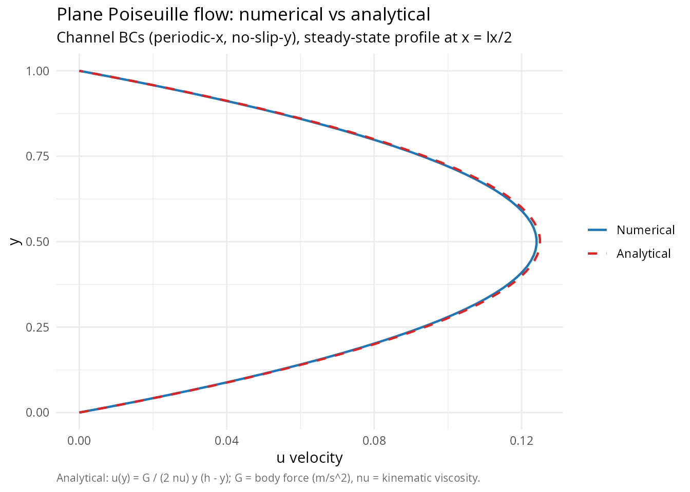
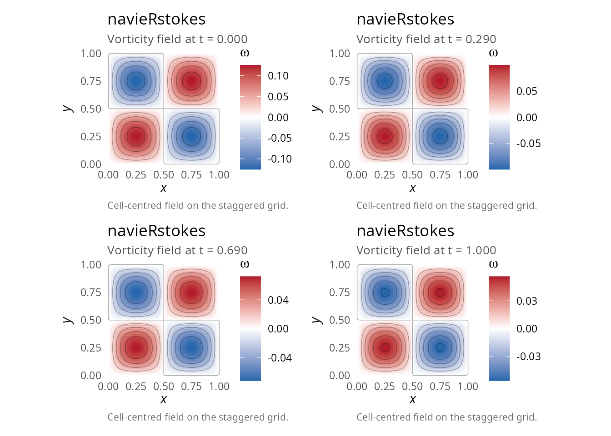
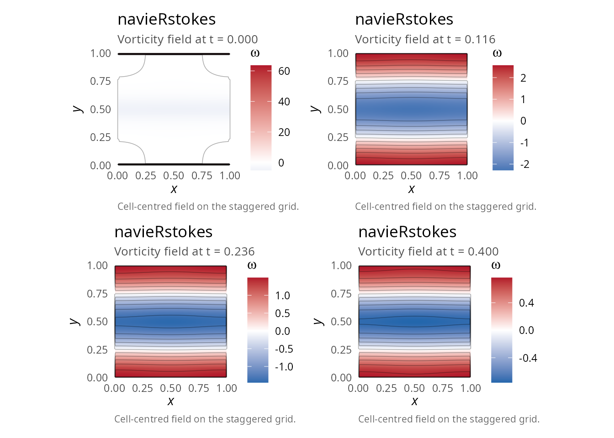
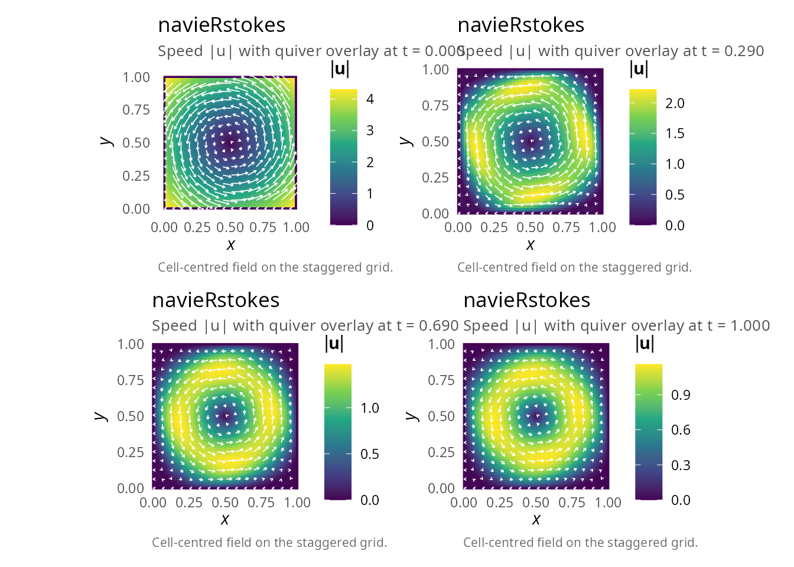
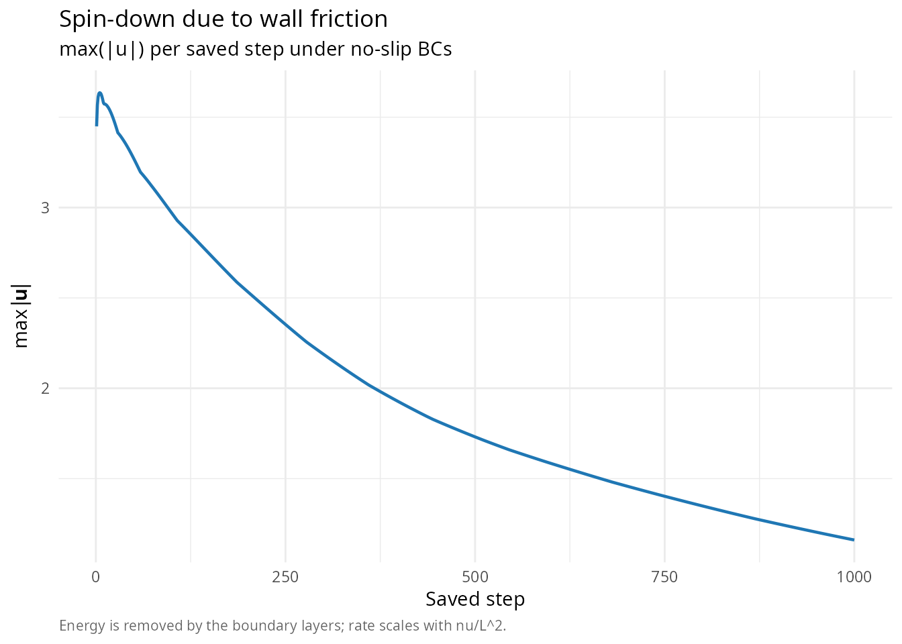
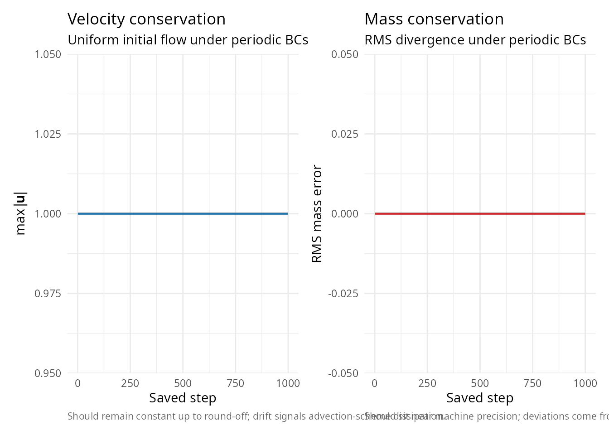
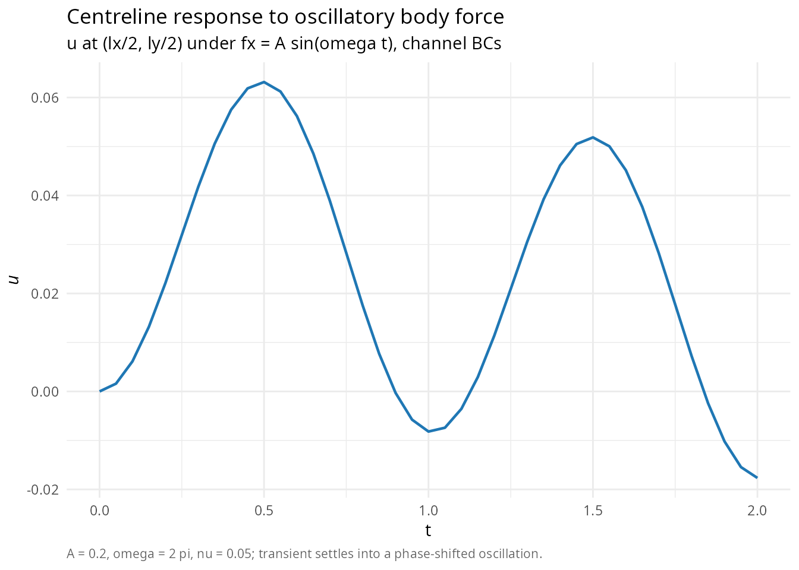
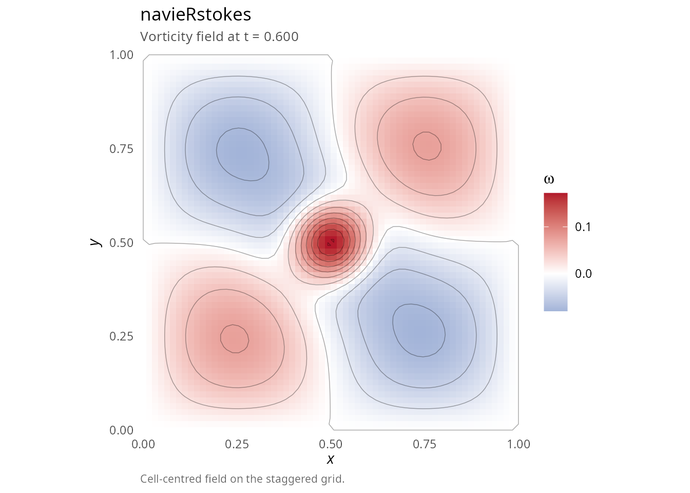

# Advanced examples: Kelvin-Helmholtz, rotation, Poiseuille

## Overview

This vignette presents advanced applications of the `navieRstokes`
package, including:

1.  Poiseuille flow (channel flow with pressure gradient)
2.  Taylor-Green vortex verification
3.  Shear layer instability (Kelvin-Helmholtz)
4.  Solid body rotation with wall friction
5.  Parameter sensitivity studies

## Example 1: Poiseuille flow (channel flow)

Pressure-driven flow between parallel plates [\[5\]](#ref5).

### Analytical solution

For steady flow between plates at \\y = 0\\ and \\y = h\\ with body
force \\f_x = G \> 0\\ (equivalent to pressure gradient \\dp/dx = -G\\):

\\ u(y) = \frac{G}{2\mu} y(h - y) \\

Maximum velocity: \\u\_{max} = \frac{Gh^2}{8\mu}\\ at \\y = h/2\\. This
requires channel boundary conditions: periodic in x (allowing net
throughflow) and no-slip Dirichlet in y (solid walls).

``` r

library(navieRstokes)

# External forcing to mimic pressure gradient
# Note: we define a local forcing function (not the exported pressure_gradient_force,
# which computes fx = -dp_dx/rho and thus drives flow in -x for positive dp_dx).
# Here we apply G > 0 directly as fx to drive rightward flow.
channel_force <- function(x, y, t) {
  G <- 0.1 # Pressure gradient magnitude
  list(fx = G, fy = 0)
}

# Channel BCs: periodic in x (allows throughflow), Dirichlet no-slip in y (walls).
# This is the correct setup for Poiseuille flow validation.
result_channel <- simulate_navier_stokes(
  nx = 32, ny = 64,
  lx = 1.0, ly = 1.0,
  dt = 0.0005, nt = 10000,
  nu = 0.1, # High viscosity for fast approach to steady state
  initial_condition = function(x, y) list(u = 0, v = 0),
  forcing_function = channel_force,
  boundary_condition = list(
    type = "channel",
    values = list(
      u_top = 0, u_bottom = 0, # No-slip walls
      v_top = 0, v_bottom = 0
    )
  ),
  save_interval = 200
)
#> ¡ Starting Navier-Stokes simulation
#>    Grid: 32 x 64, Reynolds number (approx): 10.00
#>    Step 100/10000 | Mass error: 0.00e+00 | CFL: 0.00 | Pressure iter: 1
#>    Step 200/10000 | Mass error: 0.00e+00 | CFL: 0.00 | Pressure iter: 1
#>    Step 300/10000 | Mass error: 0.00e+00 | CFL: 0.00 | Pressure iter: 1
#>    Step 400/10000 | Mass error: 0.00e+00 | CFL: 0.00 | Pressure iter: 1
#>    Step 500/10000 | Mass error: 0.00e+00 | CFL: 0.00 | Pressure iter: 1
#>    Step 600/10000 | Mass error: 0.00e+00 | CFL: 0.00 | Pressure iter: 1
#>    Step 700/10000 | Mass error: 0.00e+00 | CFL: 0.00 | Pressure iter: 1
#>    Step 800/10000 | Mass error: 0.00e+00 | CFL: 0.00 | Pressure iter: 1
#>    Step 900/10000 | Mass error: 0.00e+00 | CFL: 0.00 | Pressure iter: 1
#>    Step 1000/10000 | Mass error: 0.00e+00 | CFL: 0.00 | Pressure iter: 1
#>    Step 1100/10000 | Mass error: 0.00e+00 | CFL: 0.00 | Pressure iter: 1
#>    Step 1200/10000 | Mass error: 0.00e+00 | CFL: 0.00 | Pressure iter: 1
#>    Step 1300/10000 | Mass error: 0.00e+00 | CFL: 0.00 | Pressure iter: 1
#>    Step 1400/10000 | Mass error: 0.00e+00 | CFL: 0.00 | Pressure iter: 1
#>    Step 1500/10000 | Mass error: 0.00e+00 | CFL: 0.00 | Pressure iter: 1
#>    Step 1600/10000 | Mass error: 0.00e+00 | CFL: 0.00 | Pressure iter: 1
#>    Step 1700/10000 | Mass error: 0.00e+00 | CFL: 0.00 | Pressure iter: 1
#>    Step 1800/10000 | Mass error: 0.00e+00 | CFL: 0.00 | Pressure iter: 1
#>    Step 1900/10000 | Mass error: 0.00e+00 | CFL: 0.00 | Pressure iter: 1
#>    Step 2000/10000 | Mass error: 0.00e+00 | CFL: 0.00 | Pressure iter: 1
#>    Step 2100/10000 | Mass error: 0.00e+00 | CFL: 0.00 | Pressure iter: 1
#>    Step 2200/10000 | Mass error: 0.00e+00 | CFL: 0.00 | Pressure iter: 1
#>    Step 2300/10000 | Mass error: 0.00e+00 | CFL: 0.00 | Pressure iter: 1
#>    Step 2400/10000 | Mass error: 0.00e+00 | CFL: 0.00 | Pressure iter: 1
#>    Step 2500/10000 | Mass error: 0.00e+00 | CFL: 0.00 | Pressure iter: 1
#>    Step 2600/10000 | Mass error: 0.00e+00 | CFL: 0.00 | Pressure iter: 1
#>    Step 2700/10000 | Mass error: 0.00e+00 | CFL: 0.00 | Pressure iter: 1
#>    Step 2800/10000 | Mass error: 0.00e+00 | CFL: 0.00 | Pressure iter: 1
#>    Step 2900/10000 | Mass error: 0.00e+00 | CFL: 0.00 | Pressure iter: 1
#>    Step 3000/10000 | Mass error: 0.00e+00 | CFL: 0.00 | Pressure iter: 1
#>    Step 3100/10000 | Mass error: 0.00e+00 | CFL: 0.00 | Pressure iter: 1
#>    Step 3200/10000 | Mass error: 0.00e+00 | CFL: 0.00 | Pressure iter: 1
#>    Step 3300/10000 | Mass error: 0.00e+00 | CFL: 0.00 | Pressure iter: 1
#>    Step 3400/10000 | Mass error: 0.00e+00 | CFL: 0.00 | Pressure iter: 1
#>    Step 3500/10000 | Mass error: 0.00e+00 | CFL: 0.00 | Pressure iter: 1
#>    Step 3600/10000 | Mass error: 0.00e+00 | CFL: 0.00 | Pressure iter: 1
#>    Step 3700/10000 | Mass error: 0.00e+00 | CFL: 0.00 | Pressure iter: 1
#>    Step 3800/10000 | Mass error: 0.00e+00 | CFL: 0.00 | Pressure iter: 1
#>    Step 3900/10000 | Mass error: 0.00e+00 | CFL: 0.00 | Pressure iter: 1
#>    Step 4000/10000 | Mass error: 0.00e+00 | CFL: 0.00 | Pressure iter: 1
#>    Step 4100/10000 | Mass error: 0.00e+00 | CFL: 0.00 | Pressure iter: 1
#>    Step 4200/10000 | Mass error: 0.00e+00 | CFL: 0.00 | Pressure iter: 1
#>    Step 4300/10000 | Mass error: 0.00e+00 | CFL: 0.00 | Pressure iter: 1
#>    Step 4400/10000 | Mass error: 0.00e+00 | CFL: 0.00 | Pressure iter: 1
#>    Step 4500/10000 | Mass error: 0.00e+00 | CFL: 0.00 | Pressure iter: 1
#>    Step 4600/10000 | Mass error: 0.00e+00 | CFL: 0.00 | Pressure iter: 1
#>    Step 4700/10000 | Mass error: 0.00e+00 | CFL: 0.00 | Pressure iter: 1
#>    Step 4800/10000 | Mass error: 0.00e+00 | CFL: 0.00 | Pressure iter: 1
#>    Step 4900/10000 | Mass error: 0.00e+00 | CFL: 0.00 | Pressure iter: 1
#>    Step 5000/10000 | Mass error: 0.00e+00 | CFL: 0.00 | Pressure iter: 1
#>    Step 5100/10000 | Mass error: 0.00e+00 | CFL: 0.00 | Pressure iter: 1
#>    Step 5200/10000 | Mass error: 0.00e+00 | CFL: 0.00 | Pressure iter: 1
#>    Step 5300/10000 | Mass error: 0.00e+00 | CFL: 0.00 | Pressure iter: 1
#>    Step 5400/10000 | Mass error: 0.00e+00 | CFL: 0.00 | Pressure iter: 1
#>    Step 5500/10000 | Mass error: 0.00e+00 | CFL: 0.00 | Pressure iter: 1
#>    Step 5600/10000 | Mass error: 0.00e+00 | CFL: 0.00 | Pressure iter: 1
#>    Step 5700/10000 | Mass error: 0.00e+00 | CFL: 0.00 | Pressure iter: 1
#>    Step 5800/10000 | Mass error: 0.00e+00 | CFL: 0.00 | Pressure iter: 1
#>    Step 5900/10000 | Mass error: 0.00e+00 | CFL: 0.00 | Pressure iter: 1
#>    Step 6000/10000 | Mass error: 0.00e+00 | CFL: 0.00 | Pressure iter: 1
#>    Step 6100/10000 | Mass error: 0.00e+00 | CFL: 0.00 | Pressure iter: 1
#>    Step 6200/10000 | Mass error: 0.00e+00 | CFL: 0.00 | Pressure iter: 1
#>    Step 6300/10000 | Mass error: 0.00e+00 | CFL: 0.00 | Pressure iter: 1
#>    Step 6400/10000 | Mass error: 0.00e+00 | CFL: 0.00 | Pressure iter: 1
#>    Step 6500/10000 | Mass error: 0.00e+00 | CFL: 0.00 | Pressure iter: 1
#>    Step 6600/10000 | Mass error: 0.00e+00 | CFL: 0.00 | Pressure iter: 1
#>    Step 6700/10000 | Mass error: 0.00e+00 | CFL: 0.00 | Pressure iter: 1
#>    Step 6800/10000 | Mass error: 0.00e+00 | CFL: 0.00 | Pressure iter: 1
#>    Step 6900/10000 | Mass error: 0.00e+00 | CFL: 0.00 | Pressure iter: 1
#>    Step 7000/10000 | Mass error: 0.00e+00 | CFL: 0.00 | Pressure iter: 1
#>    Step 7100/10000 | Mass error: 0.00e+00 | CFL: 0.00 | Pressure iter: 1
#>    Step 7200/10000 | Mass error: 0.00e+00 | CFL: 0.00 | Pressure iter: 1
#>    Step 7300/10000 | Mass error: 0.00e+00 | CFL: 0.00 | Pressure iter: 1
#>    Step 7400/10000 | Mass error: 0.00e+00 | CFL: 0.00 | Pressure iter: 1
#>    Step 7500/10000 | Mass error: 0.00e+00 | CFL: 0.00 | Pressure iter: 1
#>    Step 7600/10000 | Mass error: 0.00e+00 | CFL: 0.00 | Pressure iter: 1
#>    Step 7700/10000 | Mass error: 0.00e+00 | CFL: 0.00 | Pressure iter: 1
#>    Step 7800/10000 | Mass error: 0.00e+00 | CFL: 0.00 | Pressure iter: 1
#>    Step 7900/10000 | Mass error: 0.00e+00 | CFL: 0.00 | Pressure iter: 1
#>    Step 8000/10000 | Mass error: 0.00e+00 | CFL: 0.00 | Pressure iter: 1
#>    Step 8100/10000 | Mass error: 0.00e+00 | CFL: 0.00 | Pressure iter: 1
#>    Step 8200/10000 | Mass error: 0.00e+00 | CFL: 0.00 | Pressure iter: 1
#>    Step 8300/10000 | Mass error: 0.00e+00 | CFL: 0.00 | Pressure iter: 1
#>    Step 8400/10000 | Mass error: 0.00e+00 | CFL: 0.00 | Pressure iter: 1
#>    Step 8500/10000 | Mass error: 0.00e+00 | CFL: 0.00 | Pressure iter: 1
#>    Step 8600/10000 | Mass error: 0.00e+00 | CFL: 0.00 | Pressure iter: 1
#>    Step 8700/10000 | Mass error: 0.00e+00 | CFL: 0.00 | Pressure iter: 1
#>    Step 8800/10000 | Mass error: 0.00e+00 | CFL: 0.00 | Pressure iter: 1
#>    Step 8900/10000 | Mass error: 0.00e+00 | CFL: 0.00 | Pressure iter: 1
#>    Step 9000/10000 | Mass error: 0.00e+00 | CFL: 0.00 | Pressure iter: 1
#>    Step 9100/10000 | Mass error: 0.00e+00 | CFL: 0.00 | Pressure iter: 1
#>    Step 9200/10000 | Mass error: 0.00e+00 | CFL: 0.00 | Pressure iter: 1
#>    Step 9300/10000 | Mass error: 0.00e+00 | CFL: 0.00 | Pressure iter: 1
#>    Step 9400/10000 | Mass error: 0.00e+00 | CFL: 0.00 | Pressure iter: 1
#>    Step 9500/10000 | Mass error: 0.00e+00 | CFL: 0.00 | Pressure iter: 1
#>    Step 9600/10000 | Mass error: 0.00e+00 | CFL: 0.00 | Pressure iter: 1
#>    Step 9700/10000 | Mass error: 0.00e+00 | CFL: 0.00 | Pressure iter: 1
#>    Step 9800/10000 | Mass error: 0.00e+00 | CFL: 0.00 | Pressure iter: 1
#>    Step 9900/10000 | Mass error: 0.00e+00 | CFL: 0.00 | Pressure iter: 1
#>    Step 10000/10000 | Mass error: 0.00e+00 | CFL: 0.00 | Pressure iter: 1
#> ✔ Simulation completed successfully

# Compare with analytical solution
final_idx <- dim(result_channel$u)[3]
u_numerical <- result_channel$u[round(result_channel$parameters$nx / 2), , final_idx]

# Analytical Poiseuille profile for unit-density incompressible flow:
# u(y) = G / (2 * nu) * y * (h - y), where G is the body-force magnitude (m/s^2)
# and nu is kinematic viscosity. No rho dependence for incompressible formulation.
G  <- 0.1
nu <- result_channel$parameters$nu
h  <- result_channel$parameters$ly
y  <- result_channel$y
u_analytical <- (G / (2 * nu)) * y * (h - y)

library(ggplot2)

df_pois <- data.frame(
  u      = c(u_numerical, u_analytical),
  y      = rep(y, 2),
  series = factor(rep(c("Numerical", "Analytical"), each = length(y)),
                  levels = c("Numerical", "Analytical"))
)
ggplot(df_pois, aes(x = u, y = y, colour = series, linetype = series)) +
  geom_path(linewidth = 0.8) +
  scale_colour_manual(values = c(Numerical = "#1F77B4", Analytical = "#D62728")) +
  scale_linetype_manual(values = c(Numerical = 1, Analytical = 2)) +
  labs(title = "Plane Poiseuille flow: numerical vs analytical",
       subtitle = "Channel BCs (periodic-x, no-slip-y), steady-state profile at x = lx/2",
       caption = "Analytical: u(y) = G / (2 nu) y (h - y); G = body force (m/s^2), nu = kinematic viscosity.",
       x = "u velocity", y = "y", colour = NULL, linetype = NULL) +
  theme_minimal(base_size = 11) +
  theme(plot.caption = element_text(color = "grey40", size = 8, hjust = 0))
```



## Example 2: Taylor-Green vortex verification

Exact solution to the Navier-Stokes equations [\[1\]](#ref1), useful for
code verification.

### Analytical solution

The package uses this sign convention:

\\ u(x,y,t) = A\sin(kx)\cos(ky) e^{-2\nu k^2 t} \\

\\ v(x,y,t) = -A\cos(kx)\sin(ky) e^{-2\nu k^2 t} \\

\\ p(x,y,t) = \frac{\rho A^2}{4}\[\cos(2kx) + \cos(2ky)\] e^{-4\nu k^2
t} \\

Domain: \\\[0, 1\] \times \[0, 1\]\\ with \\k = 2\pi\\ and periodic
boundary conditions.

``` r

# Use package's divergence-free vortex initial condition
result_TG <- simulate_navier_stokes(
  nx = 64, ny = 64,
  lx = 1.0, ly = 1.0,
  dt = 0.001, nt = 1000,
  nu = 0.01,
  initial_condition = function(x, y) vortex_ic(x, y, A = 0.01), # Small amplitude!
  boundary_condition = list(type = "periodic"),
  save_interval = 10
)
#> ¡ Starting Navier-Stokes simulation
#>    Grid: 64 x 64, Reynolds number (approx): 100.00
#>    Step 100/1000 | Mass error: 9.31e-07 | CFL: 0.00 | Pressure iter: 1
#>    Step 200/1000 | Mass error: 6.38e-07 | CFL: 0.00 | Pressure iter: 1
#>    Step 300/1000 | Mass error: 6.66e-07 | CFL: 0.00 | Pressure iter: 1
#>    Step 400/1000 | Mass error: 5.54e-07 | CFL: 0.00 | Pressure iter: 1
#>    Step 500/1000 | Mass error: 3.33e-07 | CFL: 0.00 | Pressure iter: 1
#>    Step 600/1000 | Mass error: 4.87e-07 | CFL: 0.00 | Pressure iter: 1
#>    Step 700/1000 | Mass error: 2.42e-07 | CFL: 0.00 | Pressure iter: 1
#>    Step 800/1000 | Mass error: 2.95e-07 | CFL: 0.00 | Pressure iter: 1
#>    Step 900/1000 | Mass error: 2.82e-07 | CFL: 0.00 | Pressure iter: 1
#>    Step 1000/1000 | Mass error: 1.25e-07 | CFL: 0.00 | Pressure iter: 1
#> ✔ Simulation completed successfully

library(patchwork)
tg1 <- plot(result_TG, time_index = 1,    plot_type = "vorticity")
tg2 <- plot(result_TG, time_index = 30,   plot_type = "vorticity")
tg3 <- plot(result_TG, time_index = 70,   plot_type = "vorticity")
tg4 <- plot(result_TG, time_index = NULL, plot_type = "vorticity")
(tg1 | tg2) / (tg3 | tg4)
#> Warning: The following aesthetics were dropped during statistical transformation: fill.
#> ℹ This can happen when ggplot fails to infer the correct grouping structure in
#>   the data.
#> ℹ Did you forget to specify a `group` aesthetic or to convert a numerical
#>   variable into a factor?
#> The following aesthetics were dropped during statistical transformation: fill.
#> ℹ This can happen when ggplot fails to infer the correct grouping structure in
#>   the data.
#> ℹ Did you forget to specify a `group` aesthetic or to convert a numerical
#>   variable into a factor?
#> The following aesthetics were dropped during statistical transformation: fill.
#> ℹ This can happen when ggplot fails to infer the correct grouping structure in
#>   the data.
#> ℹ Did you forget to specify a `group` aesthetic or to convert a numerical
#>   variable into a factor?
#> The following aesthetics were dropped during statistical transformation: fill.
#> ℹ This can happen when ggplot fails to infer the correct grouping structure in
#>   the data.
#> ℹ Did you forget to specify a `group` aesthetic or to convert a numerical
#>   variable into a factor?
```



``` r


# Check mass conservation (should be near machine precision)
cat("Mass conservation error:", result_TG$diagnostics$mean_mass_error, "\n")
#> Mass conservation error: 5.782938e-06
```

## Example 3: Kelvin-Helmholtz instability

Shear layer instability between two parallel streams.

**Important**: This is a challenging simulation requiring conservative
parameters.

``` r

# Use package's shear layer initial condition
result_KH <- simulate_navier_stokes(
  nx = 128, ny = 128,
  lx = 1.0, ly = 1.0,
  dt = 0.0001, nt = 4000,
  nu = 0.1, # High viscosity for stability
  initial_condition = function(x, y) {
    shear_layer_ic(x, y, U0 = 0.5, delta = 0.1, epsilon = 0.01) # Conservative parameters
  },
  boundary_condition = list(type = "periodic"),
  save_interval = 40
)
#> ¡ Starting Navier-Stokes simulation
#>    Grid: 128 x 128, Reynolds number (approx): 10.00
#>    Step 100/4000 | Mass error: 1.59e-07 | CFL: 0.01 | Pressure iter: 141
#>    Step 200/4000 | Mass error: 9.79e-08 | CFL: 0.01 | Pressure iter: 127
#>    Step 300/4000 | Mass error: 9.14e-08 | CFL: 0.01 | Pressure iter: 116
#>    Step 400/4000 | Mass error: 9.09e-08 | CFL: 0.01 | Pressure iter: 106
#>    Step 500/4000 | Mass error: 9.13e-08 | CFL: 0.01 | Pressure iter: 99
#>    Step 600/4000 | Mass error: 9.20e-08 | CFL: 0.01 | Pressure iter: 90
#>    Step 700/4000 | Mass error: 9.25e-08 | CFL: 0.01 | Pressure iter: 84
#>    Step 800/4000 | Mass error: 9.31e-08 | CFL: 0.01 | Pressure iter: 77
#>    Step 900/4000 | Mass error: 9.35e-08 | CFL: 0.01 | Pressure iter: 71
#>    Step 1000/4000 | Mass error: 9.40e-08 | CFL: 0.00 | Pressure iter: 65
#>    Step 1100/4000 | Mass error: 9.43e-08 | CFL: 0.00 | Pressure iter: 62
#>    Step 1200/4000 | Mass error: 9.48e-08 | CFL: 0.00 | Pressure iter: 56
#>    Step 1300/4000 | Mass error: 9.52e-08 | CFL: 0.00 | Pressure iter: 52
#>    Step 1400/4000 | Mass error: 9.56e-08 | CFL: 0.00 | Pressure iter: 49
#>    Step 1500/4000 | Mass error: 9.59e-08 | CFL: 0.00 | Pressure iter: 45
#>    Step 1600/4000 | Mass error: 9.61e-08 | CFL: 0.00 | Pressure iter: 41
#>    Step 1700/4000 | Mass error: 9.64e-08 | CFL: 0.00 | Pressure iter: 39
#>    Step 1800/4000 | Mass error: 9.67e-08 | CFL: 0.00 | Pressure iter: 35
#>    Step 1900/4000 | Mass error: 9.69e-08 | CFL: 0.00 | Pressure iter: 31
#>    Step 2000/4000 | Mass error: 9.72e-08 | CFL: 0.00 | Pressure iter: 29
#>    Step 2100/4000 | Mass error: 9.74e-08 | CFL: 0.00 | Pressure iter: 27
#>    Step 2200/4000 | Mass error: 9.75e-08 | CFL: 0.00 | Pressure iter: 25
#>    Step 2300/4000 | Mass error: 9.78e-08 | CFL: 0.00 | Pressure iter: 23
#>    Step 2400/4000 | Mass error: 9.79e-08 | CFL: 0.00 | Pressure iter: 22
#>    Step 2500/4000 | Mass error: 9.81e-08 | CFL: 0.00 | Pressure iter: 20
#>    Step 2600/4000 | Mass error: 9.82e-08 | CFL: 0.00 | Pressure iter: 18
#>    Step 2700/4000 | Mass error: 9.83e-08 | CFL: 0.00 | Pressure iter: 16
#>    Step 2800/4000 | Mass error: 9.84e-08 | CFL: 0.00 | Pressure iter: 16
#>    Step 2900/4000 | Mass error: 9.86e-08 | CFL: 0.00 | Pressure iter: 14
#>    Step 3000/4000 | Mass error: 9.86e-08 | CFL: 0.00 | Pressure iter: 14
#>    Step 3100/4000 | Mass error: 9.88e-08 | CFL: 0.00 | Pressure iter: 13
#>    Step 3200/4000 | Mass error: 9.88e-08 | CFL: 0.00 | Pressure iter: 11
#>    Step 3300/4000 | Mass error: 9.90e-08 | CFL: 0.00 | Pressure iter: 10
#>    Step 3400/4000 | Mass error: 9.90e-08 | CFL: 0.00 | Pressure iter: 10
#>    Step 3500/4000 | Mass error: 9.91e-08 | CFL: 0.00 | Pressure iter: 9
#>    Step 3600/4000 | Mass error: 9.92e-08 | CFL: 0.00 | Pressure iter: 9
#>    Step 3700/4000 | Mass error: 9.92e-08 | CFL: 0.00 | Pressure iter: 7
#>    Step 3800/4000 | Mass error: 9.92e-08 | CFL: 0.00 | Pressure iter: 7
#>    Step 3900/4000 | Mass error: 9.94e-08 | CFL: 0.00 | Pressure iter: 6
#>    Step 4000/4000 | Mass error: 9.94e-08 | CFL: 0.00 | Pressure iter: 5
#> ✔ Simulation completed successfully

kh1 <- plot(result_KH, time_index = 1,    plot_type = "vorticity")
kh2 <- plot(result_KH, time_index = 30,   plot_type = "vorticity")
kh3 <- plot(result_KH, time_index = 60,   plot_type = "vorticity")
kh4 <- plot(result_KH, time_index = NULL, plot_type = "vorticity")
(kh1 | kh2) / (kh3 | kh4)
#> Warning: The following aesthetics were dropped during statistical transformation: fill.
#> ℹ This can happen when ggplot fails to infer the correct grouping structure in
#>   the data.
#> ℹ Did you forget to specify a `group` aesthetic or to convert a numerical
#>   variable into a factor?
#> The following aesthetics were dropped during statistical transformation: fill.
#> ℹ This can happen when ggplot fails to infer the correct grouping structure in
#>   the data.
#> ℹ Did you forget to specify a `group` aesthetic or to convert a numerical
#>   variable into a factor?
#> The following aesthetics were dropped during statistical transformation: fill.
#> ℹ This can happen when ggplot fails to infer the correct grouping structure in
#>   the data.
#> ℹ Did you forget to specify a `group` aesthetic or to convert a numerical
#>   variable into a factor?
#> The following aesthetics were dropped during statistical transformation: fill.
#> ℹ This can happen when ggplot fails to infer the correct grouping structure in
#>   the data.
#> ℹ Did you forget to specify a `group` aesthetic or to convert a numerical
#>   variable into a factor?
```



## Example 4: Solid body rotation

Rotating flow with wall friction demonstrating spin-down.

``` r

# Use package's rotating initial condition
result_rotation <- simulate_navier_stokes(
  nx = 64, ny = 64,
  lx = 1.0, ly = 1.0,
  dt = 0.001, nt = 1000,
  nu = 0.01,
  initial_condition = function(x, y) {
    rotating_ic(x, y, omega = 2 * pi, x0 = 0.5, y0 = 0.5)
  },
  boundary_condition = list(
    type = "dirichlet",
    values = list(
      u_left = 0, u_right = 0,
      u_top = 0, u_bottom = 0,
      v_left = 0, v_right = 0,
      v_top = 0, v_bottom = 0
    )
  ),
  save_interval = 10
)
#> ¡ Starting Navier-Stokes simulation
#>    Grid: 64 x 64, Reynolds number (approx): 100.00
#> Warning in simulate_navier_stokes(nx = 64, ny = 64, lx = 1, ly = 1, dt = 0.001,
#> : ⚠ Poisson solver did not converge at step 11 (error = 9.14e-02, tolerance =
#> 1.00e-03)
#> Warning in simulate_navier_stokes(nx = 64, ny = 64, lx = 1, ly = 1, dt = 0.001,
#> : ⚠ Poisson solver did not converge at step 12 (error = 7.97e-02, tolerance =
#> 1.00e-03)
#> Warning in simulate_navier_stokes(nx = 64, ny = 64, lx = 1, ly = 1, dt = 0.001,
#> : ⚠ Poisson solver did not converge at step 13 (error = 6.97e-02, tolerance =
#> 1.00e-03)
#> Warning in simulate_navier_stokes(nx = 64, ny = 64, lx = 1, ly = 1, dt = 0.001,
#> : ⚠ Poisson solver did not converge at step 14 (error = 6.14e-02, tolerance =
#> 1.00e-03)
#> Warning in simulate_navier_stokes(nx = 64, ny = 64, lx = 1, ly = 1, dt = 0.001,
#> : ⚠ Poisson solver did not converge at step 15 (error = 5.44e-02, tolerance =
#> 1.00e-03)
#>    Step 100/1000 | Mass error: 3.73e-02 | CFL: 0.19 | Pressure iter: 1281
#>    Step 200/1000 | Mass error: 2.92e-02 | CFL: 0.16 | Pressure iter: 1281
#>    Step 300/1000 | Mass error: 2.34e-02 | CFL: 0.14 | Pressure iter: 1281
#>    Step 400/1000 | Mass error: 1.82e-02 | CFL: 0.12 | Pressure iter: 1281
#>    Step 500/1000 | Mass error: 1.43e-02 | CFL: 0.11 | Pressure iter: 1281
#>    Step 600/1000 | Mass error: 1.16e-02 | CFL: 0.10 | Pressure iter: 1281
#>    Step 700/1000 | Mass error: 9.83e-03 | CFL: 0.09 | Pressure iter: 1281
#>    Step 800/1000 | Mass error: 8.51e-03 | CFL: 0.08 | Pressure iter: 1281
#>    Step 900/1000 | Mass error: 7.47e-03 | CFL: 0.08 | Pressure iter: 1261
#>    Step 1000/1000 | Mass error: 6.63e-03 | CFL: 0.07 | Pressure iter: 1202
#> ✔ Simulation completed successfully

rot1 <- plot(result_rotation, time_index = 1,    plot_type = "velocity")
rot2 <- plot(result_rotation, time_index = 30,   plot_type = "velocity")
rot3 <- plot(result_rotation, time_index = 70,   plot_type = "velocity")
rot4 <- plot(result_rotation, time_index = NULL, plot_type = "velocity")
(rot1 | rot2) / (rot3 | rot4)
```



``` r


ggplot(data.frame(step = seq_along(result_rotation$diagnostics$max_velocity),
                  Umax = result_rotation$diagnostics$max_velocity),
       aes(x = step, y = Umax)) +
  geom_line(linewidth = 0.8, colour = "#1F77B4") +
  labs(title = "Spin-down due to wall friction",
       subtitle = "max(|u|) per saved step under no-slip BCs",
       caption = "Energy is removed by the boundary layers; rate scales with nu/L^2.",
       x = "Saved step", y = expression(max(group("|", bold(u), "|")))) +
  theme_minimal(base_size = 11) +
  theme(plot.caption = element_text(color = "grey40", size = 8, hjust = 0))
```



## Example 5: Uniform flow stability

Simple test case to verify solver stability.

``` r

# Uniform flow with periodic boundaries
result_uniform <- simulate_navier_stokes(
  nx = 64, ny = 64,
  lx = 1.0, ly = 1.0,
  dt = 0.001, nt = 1000,
  nu = 0.01,
  initial_condition = function(x, y) list(u = 1.0, v = 0.0),
  boundary_condition = list(type = "periodic"),
  save_interval = 10
)
#> ¡ Starting Navier-Stokes simulation
#>    Grid: 64 x 64, Reynolds number (approx): 100.00
#>    Step 100/1000 | Mass error: 0.00e+00 | CFL: 0.06 | Pressure iter: 1
#>    Step 200/1000 | Mass error: 0.00e+00 | CFL: 0.06 | Pressure iter: 1
#>    Step 300/1000 | Mass error: 0.00e+00 | CFL: 0.06 | Pressure iter: 1
#>    Step 400/1000 | Mass error: 0.00e+00 | CFL: 0.06 | Pressure iter: 1
#>    Step 500/1000 | Mass error: 0.00e+00 | CFL: 0.06 | Pressure iter: 1
#>    Step 600/1000 | Mass error: 0.00e+00 | CFL: 0.06 | Pressure iter: 1
#>    Step 700/1000 | Mass error: 0.00e+00 | CFL: 0.06 | Pressure iter: 1
#>    Step 800/1000 | Mass error: 0.00e+00 | CFL: 0.06 | Pressure iter: 1
#>    Step 900/1000 | Mass error: 0.00e+00 | CFL: 0.06 | Pressure iter: 1
#>    Step 1000/1000 | Mass error: 0.00e+00 | CFL: 0.06 | Pressure iter: 1
#> ✔ Simulation completed successfully

# Verify velocity remains constant
cat("Initial max velocity:", result_uniform$diagnostics$max_velocity[1], "\n")
#> Initial max velocity: 1
cat("Final max velocity:", tail(result_uniform$diagnostics$max_velocity, 1), "\n")
#> Final max velocity: 1
cat(
  "Velocity variation:",
  sd(result_uniform$diagnostics$max_velocity), "\n"
)
#> Velocity variation: 0

df_uni <- data.frame(
  step = seq_along(result_uniform$diagnostics$max_velocity),
  Umax = result_uniform$diagnostics$max_velocity,
  mass = result_uniform$diagnostics$mass_error
)
p_Uu <- ggplot(df_uni, aes(x = step, y = Umax)) +
  geom_line(linewidth = 0.8, colour = "#1F77B4") +
  labs(title = "Velocity conservation",
       subtitle = "Uniform initial flow under periodic BCs",
       caption = "Should remain constant up to round-off; drift signals advection-scheme dissipation.",
       x = "Saved step", y = expression(max(group("|", bold(u), "|")))) +
  theme_minimal(base_size = 11) +
  theme(plot.caption = element_text(color = "grey40", size = 8, hjust = 0))

p_Um <- ggplot(df_uni, aes(x = step, y = mass)) +
  geom_line(linewidth = 0.8, colour = "#D62728") +
  labs(title = "Mass conservation",
       subtitle = "RMS divergence under periodic BCs",
       caption = "Should sit near machine precision; deviations come from the Poisson tolerance.",
       x = "Saved step", y = "RMS mass error") +
  theme_minimal(base_size = 11) +
  theme(plot.caption = element_text(color = "grey40", size = 8, hjust = 0))

p_Uu | p_Um
```



## Example 6: Oscillatory channel forcing

Time-periodic body force in a channel produces a Stokes-layer-like
oscillating profile near the walls. The bulk velocity follows
`oscillatory_force` with frequency `omega`; the boundary layer thickness
scales as `sqrt(2 * nu / omega)` (Stokes layer).

``` r

result_osc <- simulate_navier_stokes(
  nx = 32, ny = 64,
  lx = 1.0, ly = 1.0,
  dt = 0.001, nt = 2000,
  nu = 0.05,
  initial_condition = function(x, y) list(u = 0, v = 0),
  forcing_function = function(x, y, t) {
    oscillatory_force(x, y, t, A = 0.2, omega = 2 * pi)
  },
  boundary_condition = list(
    type = "channel",
    values = list(u_top = 0, u_bottom = 0, v_top = 0, v_bottom = 0)
  ),
  save_interval = 50
)
#> ¡ Starting Navier-Stokes simulation
#>    Grid: 32 x 64, Reynolds number (approx): 20.00
#>    Step 100/2000 | Mass error: 0.00e+00 | CFL: 0.00 | Pressure iter: 1
#>    Step 200/2000 | Mass error: 0.00e+00 | CFL: 0.00 | Pressure iter: 1
#>    Step 300/2000 | Mass error: 0.00e+00 | CFL: 0.00 | Pressure iter: 1
#>    Step 400/2000 | Mass error: 0.00e+00 | CFL: 0.00 | Pressure iter: 1
#>    Step 500/2000 | Mass error: 0.00e+00 | CFL: 0.00 | Pressure iter: 1
#>    Step 600/2000 | Mass error: 0.00e+00 | CFL: 0.00 | Pressure iter: 1
#>    Step 700/2000 | Mass error: 0.00e+00 | CFL: 0.00 | Pressure iter: 1
#>    Step 800/2000 | Mass error: 0.00e+00 | CFL: 0.00 | Pressure iter: 1
#>    Step 900/2000 | Mass error: 0.00e+00 | CFL: 0.00 | Pressure iter: 1
#>    Step 1000/2000 | Mass error: 0.00e+00 | CFL: 0.00 | Pressure iter: 1
#>    Step 1100/2000 | Mass error: 0.00e+00 | CFL: 0.00 | Pressure iter: 1
#>    Step 1200/2000 | Mass error: 0.00e+00 | CFL: 0.00 | Pressure iter: 1
#>    Step 1300/2000 | Mass error: 0.00e+00 | CFL: 0.00 | Pressure iter: 1
#>    Step 1400/2000 | Mass error: 0.00e+00 | CFL: 0.00 | Pressure iter: 1
#>    Step 1500/2000 | Mass error: 0.00e+00 | CFL: 0.00 | Pressure iter: 1
#>    Step 1600/2000 | Mass error: 0.00e+00 | CFL: 0.00 | Pressure iter: 1
#>    Step 1700/2000 | Mass error: 0.00e+00 | CFL: 0.00 | Pressure iter: 1
#>    Step 1800/2000 | Mass error: 0.00e+00 | CFL: 0.00 | Pressure iter: 1
#>    Step 1900/2000 | Mass error: 0.00e+00 | CFL: 0.00 | Pressure iter: 1
#>    Step 2000/2000 | Mass error: 0.00e+00 | CFL: 0.00 | Pressure iter: 1
#> ✔ Simulation completed successfully

# Centreline u(t): probe the channel centre across saved snapshots
i_mid <- round(result_osc$parameters$nx / 2)
j_mid <- round(result_osc$parameters$ny / 2)
u_centre <- result_osc$u[i_mid, j_mid, ]

ggplot(data.frame(t = result_osc$t, u = u_centre),
       aes(x = t, y = u)) +
  geom_line(linewidth = 0.8, colour = "#1F77B4") +
  labs(title = "Centreline response to oscillatory body force",
       subtitle = "u at (lx/2, ly/2) under fx = A sin(omega t), channel BCs",
       caption = "A = 0.2, omega = 2 pi, nu = 0.05; transient settles into a phase-shifted oscillation.",
       x = "t", y = expression(italic(u))) +
  theme_minimal(base_size = 11) +
  theme(plot.caption = element_text(color = "grey40", size = 8, hjust = 0))
```



## Example 7: Localized vortex injection

`localized_vortex_force` injects rotational forcing in a Gaussian
envelope around a chosen point. Combined with a periodic Taylor-Green
base flow, it locally perturbs the vortex field; the vorticity
diagnostic exposes the resulting swirl.

``` r

result_loc <- simulate_navier_stokes(
  nx = 64, ny = 64,
  lx = 1.0, ly = 1.0,
  dt = 0.001, nt = 600,
  nu = 0.01,
  initial_condition = function(x, y) vortex_ic(x, y, A = 0.01),
  forcing_function = function(x, y, t) {
    localized_vortex_force(x, y, t, x0 = 0.5, y0 = 0.5,
                           sigma = 0.1, A = 0.5)
  },
  boundary_condition = list(type = "periodic"),
  save_interval = 50
)
#> ¡ Starting Navier-Stokes simulation
#>    Grid: 64 x 64, Reynolds number (approx): 100.00
#>    Step 100/600 | Mass error: 9.89e-07 | CFL: 0.00 | Pressure iter: 1
#>    Step 200/600 | Mass error: 7.06e-07 | CFL: 0.00 | Pressure iter: 1
#>    Step 300/600 | Mass error: 6.65e-07 | CFL: 0.00 | Pressure iter: 1
#>    Step 400/600 | Mass error: 6.17e-07 | CFL: 0.00 | Pressure iter: 1
#>    Step 500/600 | Mass error: 3.58e-07 | CFL: 0.00 | Pressure iter: 1
#>    Step 600/600 | Mass error: 5.07e-07 | CFL: 0.00 | Pressure iter: 1
#> ✔ Simulation completed successfully

omega_final <- compute_vorticity(
  result_loc$u[, , dim(result_loc$u)[3]],
  result_loc$v[, , dim(result_loc$v)[3]],
  result_loc$parameters$dx,
  result_loc$parameters$dy
)
cat("Peak vorticity at final step:", max(abs(omega_final), na.rm = TRUE), "\n")
#> Peak vorticity at final step: 0.1720097

plot(result_loc, plot_type = "vorticity")
#> Warning: The following aesthetics were dropped during statistical transformation: fill.
#> ℹ This can happen when ggplot fails to infer the correct grouping structure in
#>   the data.
#> ℹ Did you forget to specify a `group` aesthetic or to convert a numerical
#>   variable into a factor?
```



## Parameter sensitivity studies

### Effect of time step

Study CFL number effects:

``` r

# Small dt (conservative)
result_small_dt <- simulate_navier_stokes(
  nx = 32, ny = 32, lx = 1.0, ly = 1.0,
  dt = 0.0005, nt = 2000, nu = 0.01,
  initial_condition = function(x, y) vortex_ic(x, y, A = 0.01),
  boundary_condition = list(type = "periodic"),
  save_interval = 20
)
#> ¡ Starting Navier-Stokes simulation
#>    Grid: 32 x 32, Reynolds number (approx): 100.00
#>    Step 100/2000 | Mass error: 4.90e-06 | CFL: 0.00 | Pressure iter: 1
#>    Step 200/2000 | Mass error: 1.04e-07 | CFL: 0.00 | Pressure iter: 1
#>    Step 300/2000 | Mass error: 9.16e-08 | CFL: 0.00 | Pressure iter: 1
#>    Step 400/2000 | Mass error: 7.01e-08 | CFL: 0.00 | Pressure iter: 1
#>    Step 500/2000 | Mass error: 4.08e-08 | CFL: 0.00 | Pressure iter: 1
#>    Step 600/2000 | Mass error: 3.86e-08 | CFL: 0.00 | Pressure iter: 1
#>    Step 700/2000 | Mass error: 3.53e-08 | CFL: 0.00 | Pressure iter: 1
#>    Step 800/2000 | Mass error: 3.10e-08 | CFL: 0.00 | Pressure iter: 1
#>    Step 900/2000 | Mass error: 2.85e-08 | CFL: 0.00 | Pressure iter: 1
#>    Step 1000/2000 | Mass error: 2.63e-08 | CFL: 0.00 | Pressure iter: 1
#>    Step 1100/2000 | Mass error: 2.42e-08 | CFL: 0.00 | Pressure iter: 1
#>    Step 1200/2000 | Mass error: 2.22e-08 | CFL: 0.00 | Pressure iter: 1
#>    Step 1300/2000 | Mass error: 2.05e-08 | CFL: 0.00 | Pressure iter: 1
#>    Step 1400/2000 | Mass error: 1.89e-08 | CFL: 0.00 | Pressure iter: 1
#>    Step 1500/2000 | Mass error: 1.74e-08 | CFL: 0.00 | Pressure iter: 1
#>    Step 1600/2000 | Mass error: 1.60e-08 | CFL: 0.00 | Pressure iter: 1
#>    Step 1700/2000 | Mass error: 1.47e-08 | CFL: 0.00 | Pressure iter: 1
#>    Step 1800/2000 | Mass error: 1.36e-08 | CFL: 0.00 | Pressure iter: 1
#>    Step 1900/2000 | Mass error: 1.25e-08 | CFL: 0.00 | Pressure iter: 1
#>    Step 2000/2000 | Mass error: 1.15e-08 | CFL: 0.00 | Pressure iter: 1
#> ✔ Simulation completed successfully

# Larger dt (less conservative)
result_large_dt <- simulate_navier_stokes(
  nx = 32, ny = 32, lx = 1.0, ly = 1.0,
  dt = 0.002, nt = 500, nu = 0.01,
  initial_condition = function(x, y) vortex_ic(x, y, A = 0.01),
  boundary_condition = list(type = "periodic"),
  save_interval = 5
)
#> ¡ Starting Navier-Stokes simulation
#>    Grid: 32 x 32, Reynolds number (approx): 100.00
#>    Step 100/500 | Mass error: 1.32e-06 | CFL: 0.00 | Pressure iter: 1
#>    Step 200/500 | Mass error: 4.52e-07 | CFL: 0.00 | Pressure iter: 1
#>    Step 300/500 | Mass error: 1.72e-07 | CFL: 0.00 | Pressure iter: 1
#>    Step 400/500 | Mass error: 2.28e-07 | CFL: 0.00 | Pressure iter: 1
#>    Step 500/500 | Mass error: 1.03e-07 | CFL: 0.00 | Pressure iter: 1
#> ✔ Simulation completed successfully

# Compare stability
cat("Small dt - Mean mass error:", result_small_dt$diagnostics$mean_mass_error, "\n")
#> Small dt - Mean mass error: 8.625488e-06
cat("Large dt - Mean mass error:", result_large_dt$diagnostics$mean_mass_error, "\n")
#> Large dt - Mean mass error: 2.123716e-05
```

### Effect of grid resolution

Compare different resolutions:

``` r

# Coarse grid
result_coarse <- simulate_navier_stokes(
  nx = 32, ny = 32, lx = 1.0, ly = 1.0,
  dt = 0.001, nt = 500, nu = 0.01,
  initial_condition = function(x, y) list(u = 1.0, v = 0.0),
  boundary_condition = list(type = "periodic"),
  save_interval = 10
)
#> ¡ Starting Navier-Stokes simulation
#>    Grid: 32 x 32, Reynolds number (approx): 100.00
#>    Step 100/500 | Mass error: 0.00e+00 | CFL: 0.03 | Pressure iter: 1
#>    Step 200/500 | Mass error: 0.00e+00 | CFL: 0.03 | Pressure iter: 1
#>    Step 300/500 | Mass error: 0.00e+00 | CFL: 0.03 | Pressure iter: 1
#>    Step 400/500 | Mass error: 0.00e+00 | CFL: 0.03 | Pressure iter: 1
#>    Step 500/500 | Mass error: 0.00e+00 | CFL: 0.03 | Pressure iter: 1
#> ✔ Simulation completed successfully

# Fine grid
result_fine <- simulate_navier_stokes(
  nx = 128, ny = 128, lx = 1.0, ly = 1.0,
  dt = 0.001, nt = 500, nu = 0.01,
  initial_condition = function(x, y) list(u = 1.0, v = 0.0),
  boundary_condition = list(type = "periodic"),
  save_interval = 10
)
#> ¡ Starting Navier-Stokes simulation
#>    Grid: 128 x 128, Reynolds number (approx): 100.00
#>    Step 100/500 | Mass error: 0.00e+00 | CFL: 0.13 | Pressure iter: 1
#>    Step 200/500 | Mass error: 0.00e+00 | CFL: 0.13 | Pressure iter: 1
#>    Step 300/500 | Mass error: 0.00e+00 | CFL: 0.13 | Pressure iter: 1
#>    Step 400/500 | Mass error: 0.00e+00 | CFL: 0.13 | Pressure iter: 1
#>    Step 500/500 | Mass error: 0.00e+00 | CFL: 0.13 | Pressure iter: 1
#> ✔ Simulation completed successfully

cat("Coarse (32x32) - Mass error:", result_coarse$diagnostics$mean_mass_error, "\n")
#> Coarse (32x32) - Mass error: 0
cat("Fine (128x128) - Mass error:", result_fine$diagnostics$mean_mass_error, "\n")
#> Fine (128x128) - Mass error: 0
```

## Tips for advanced simulations

### 1. Choosing time step

Balance between accuracy and stability: - Start with
`dt = 0.1 * min(dx, dy)^2 / nu` (diffusion-limited) - Monitor CFL
numbers in diagnostics - Reduce if warnings appear

### 2. Grid resolution

Rules of thumb: - Resolve smallest length scale: \\\Delta x \lesssim
\eta\\ where \\\eta = (\nu^3/\epsilon)^{1/4}\\ (Kolmogorov scale) - For
boundary layers: 10-20 points in layer thickness - For vortices: 10-15
points across vortex core

### 3. Solver settings

- Use `pressure_solver = "sor"` (2-3x faster than Jacobi)
- Increase `max_iter` if warnings appear
- `tolerance = 1e-5` is usually sufficient

### 4. Memory management

For long simulations: - Use large `save_interval` (e.g., 50-100) -
Post-process data periodically - Save only final states if transient not
needed

### 5. Initial conditions

**Critical**: Always specify `initial_condition` with non-zero
velocity: - Without it, flow starts at rest and remains at rest - Use
package functions:
[`vortex_ic()`](https://robustecologies.github.io/navieRstokes/reference/vortex_ic.md),
[`rotating_ic()`](https://robustecologies.github.io/navieRstokes/reference/rotating_ic.md),
[`shear_layer_ic()`](https://robustecologies.github.io/navieRstokes/reference/shear_layer_ic.md) -
Keep amplitudes small (A ≤ 0.01) for stability

### 6. Boundary conditions

- **Periodic**: Most stable, best for vortex simulations
- **Channel**: Periodic in x + Dirichlet no-slip in y; required for
  Poiseuille flow
- **Dirichlet**: Works but higher mass error (~0.06-0.12)
- **Neumann**: Experimental, use with caution

## Numerical accuracy

The solver uses:

- **Convection:** First-order upwind scheme (O(Δx) accuracy, stable but
  introduces numerical diffusion)
- **Diffusion:** Second-order central differences (O(Δx²) accuracy)
- **Time integration:** First-order explicit Euler (O(Δt) accuracy)

Overall accuracy is O(Δx) + O(Δt). The upwind scheme adds numerical
viscosity of order \|u\|Δx/2, which can be significant at low Reynolds
numbers on coarse grids.

## Performance

Typical performance with Rcpp kernels:

| Grid size | Time steps | Time   |
|:----------|-----------:|:-------|
| 64×64     |       1000 | ~0.4 s |
| 128×128   |       1000 | ~2.5 s |
| 256×256   |       1000 | ~30 s  |

## References

**\[1\]** Chorin, A. J. (1968). Numerical solution of the Navier-Stokes
equations. *Mathematics of Computation*, 22(104), 745-762. DOI:
[10.1090/S0025-5718-1968-0242392-2](https://doi.org/10.1090/S0025-5718-1968-0242392-2)

**\[2\]** Anderson, J. D. (1995). *Computational fluid dynamics: The
basics with applications*. McGraw-Hill. ISBN: 978-0-07-001685-9.

**\[3\]** Pope, S. B. (2000). *Turbulent flows*. Cambridge University
Press. ISBN: 978-0-521-59886-6. DOI:
[10.1017/CBO9780511840531](https://doi.org/10.1017/CBO9780511840531)

**\[4\]** Pozrikidis, C. (2016). *Fluid dynamics: Theory, computation,
and numerical simulation* (3rd ed.). Springer. ISBN: 978-1-4899-7990-2.
DOI:
[10.1007/978-1-4899-7991-9](https://doi.org/10.1007/978-1-4899-7991-9)

**\[5\]** Tritton, D. J. (1988). *Physical fluid dynamics* (2nd ed.).
Oxford University Press. ISBN: 978-0-19-854493-7.
