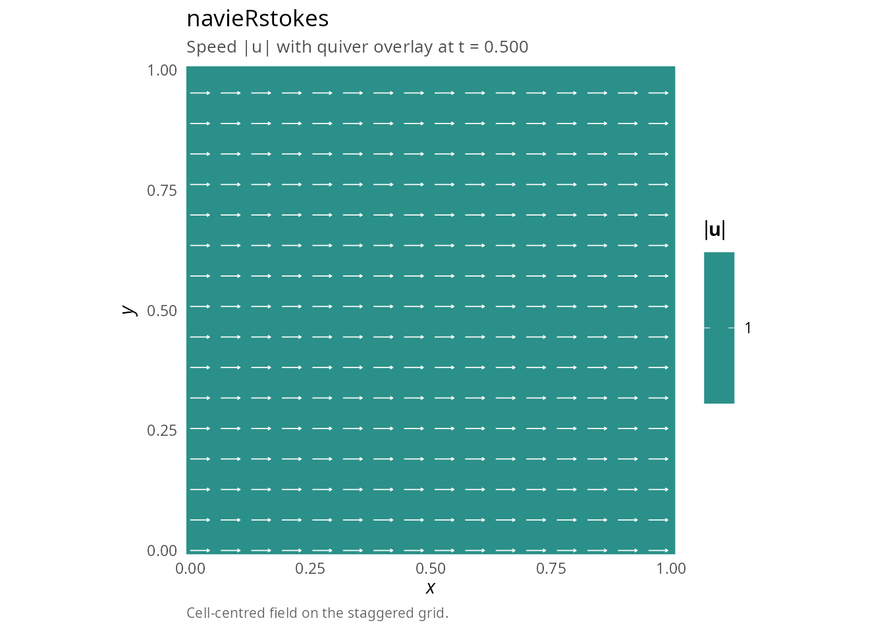
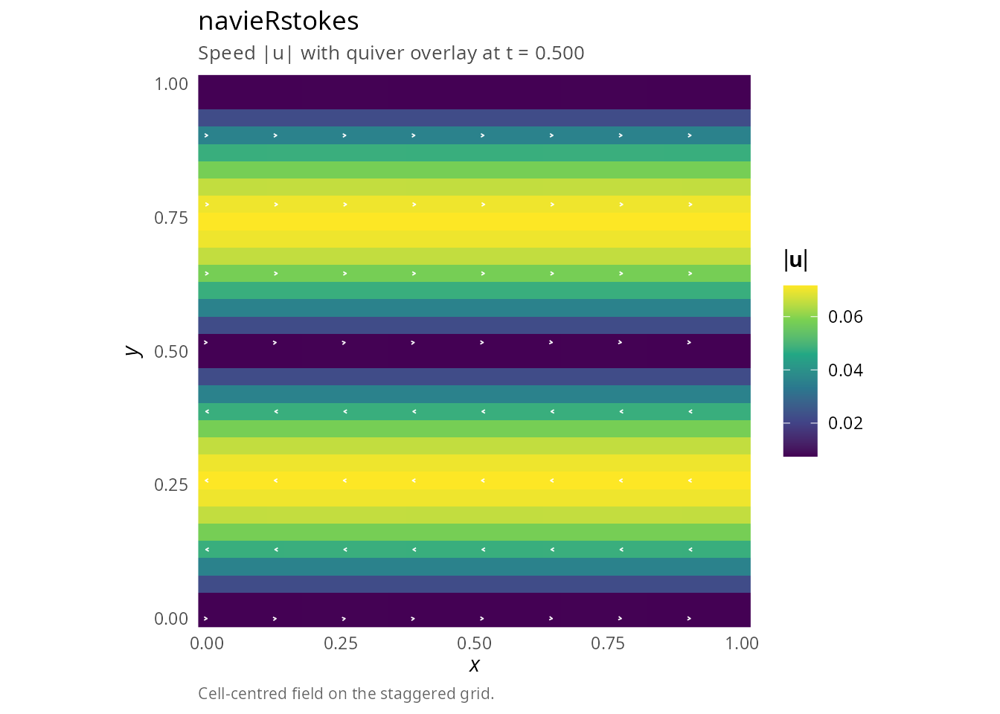
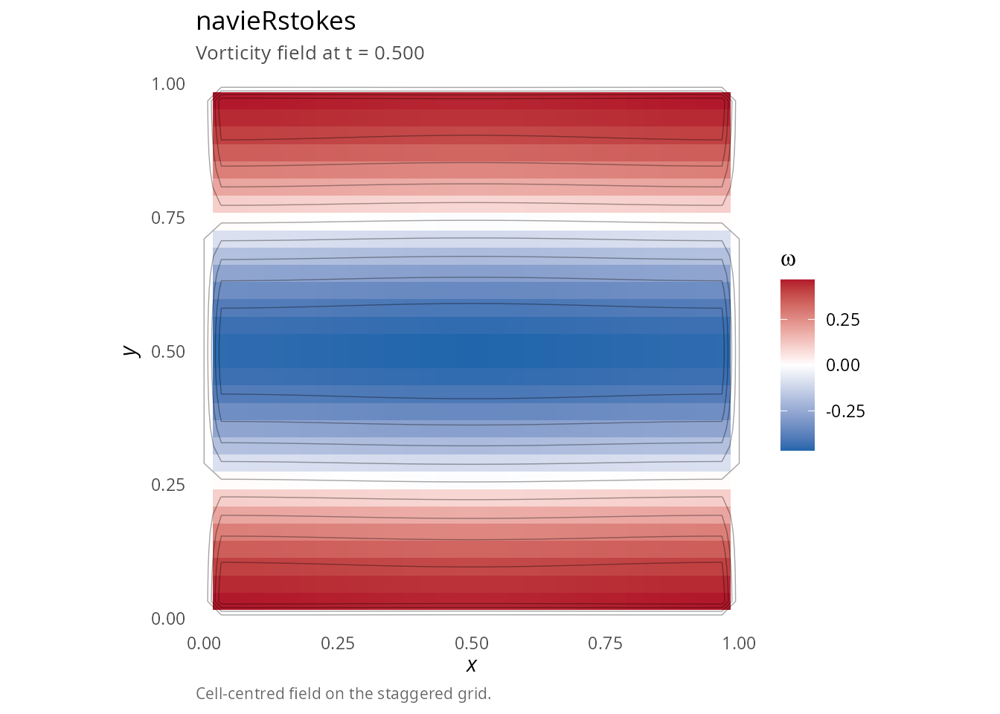
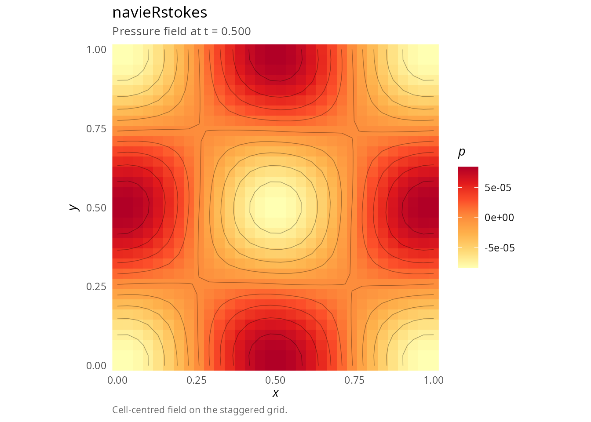
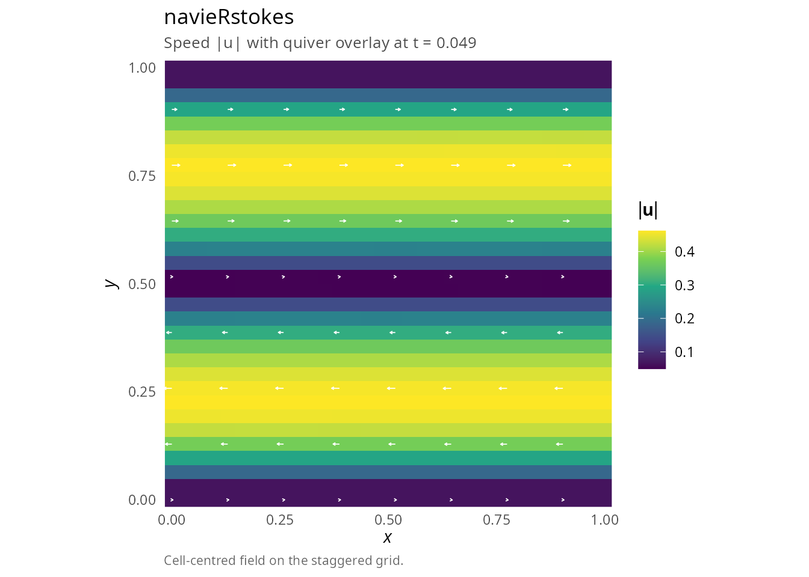
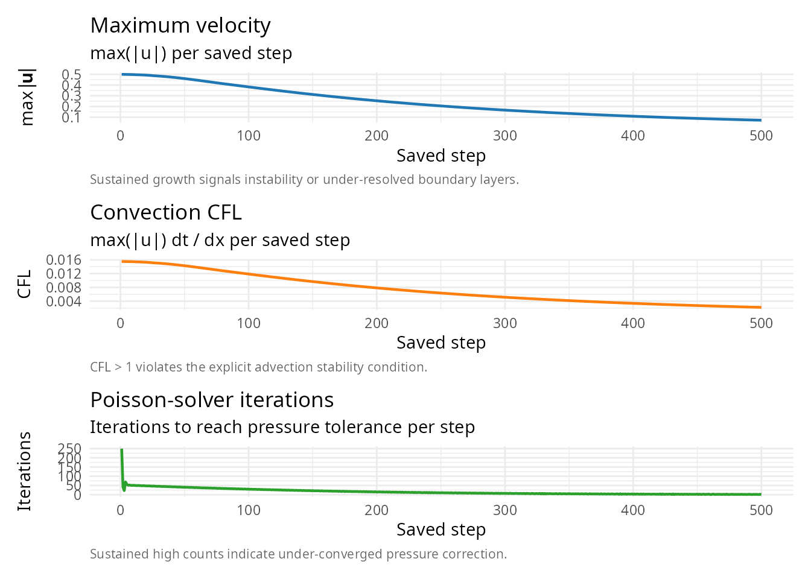
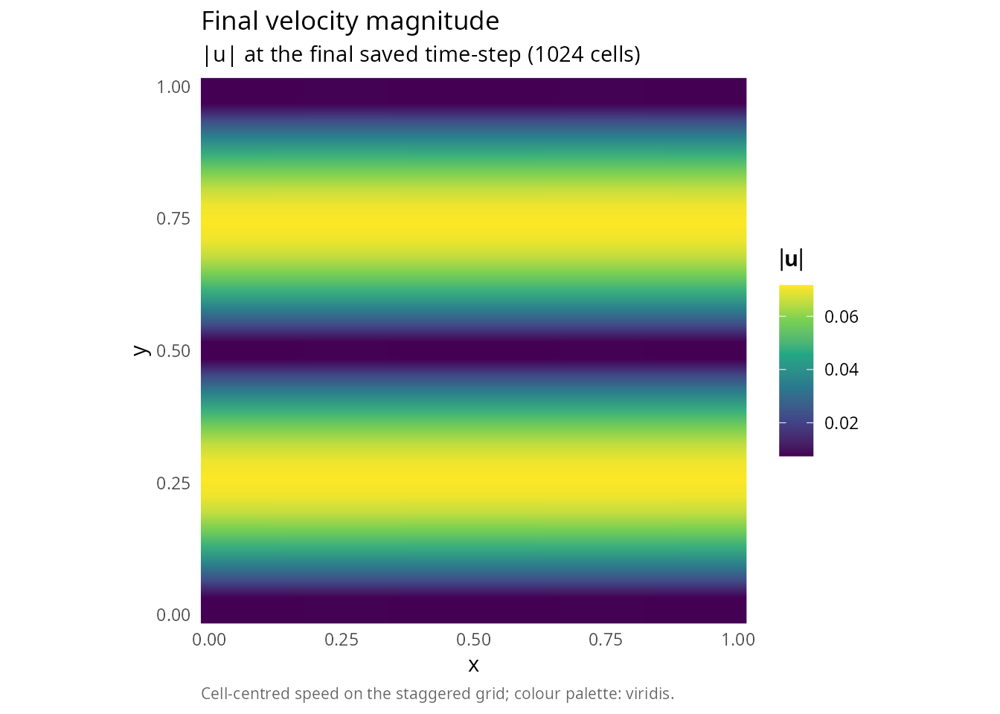

# Getting started with navieRstokes

## Overview

The `navieRstokes` package provides a comprehensive finite difference
solver for the 2D incompressible Navier-Stokes equations using Chorin’s
fractional-step projection method. The package is optimized with Rcpp
for efficient computation and includes S3 methods for easy
visualization.

## Installation

``` r

# Install from local source
# install.packages("navieRstokes", repos = NULL, type = "source")

# Load the package
library(navieRstokes)
```

## Quick start

### Basic simulation with uniform flow

``` r

library(navieRstokes)

# Run simulation
result <- simulate_navier_stokes(
  nx = 64, ny = 64, # Grid resolution
  lx = 1.0, ly = 1.0, # Domain size
  dt = 0.001, nt = 500, # Time stepping
  nu = 0.01, # Kinematic viscosity
  initial_condition = function(x, y) list(u = 1.0, v = 0.0), # Uniform flow
  boundary_condition = list(type = "periodic")
)
#> ¡ Starting Navier-Stokes simulation
#>    Grid: 64 x 64, Reynolds number (approx): 100.00
#>    Step 100/500 | Mass error: 0.00e+00 | CFL: 0.06 | Pressure iter: 1
#>    Step 200/500 | Mass error: 0.00e+00 | CFL: 0.06 | Pressure iter: 1
#>    Step 300/500 | Mass error: 0.00e+00 | CFL: 0.06 | Pressure iter: 1
#>    Step 400/500 | Mass error: 0.00e+00 | CFL: 0.06 | Pressure iter: 1
#>    Step 500/500 | Mass error: 0.00e+00 | CFL: 0.06 | Pressure iter: 1
#> ✔ Simulation completed successfully

# Inspect the navieRstokes S3 object: one-screen summary, then full diagnostics
print(result)
#> 
#> Navier-Stokes Simulation Result
#> ================================
#> 
#> Grid:       64 x 64 (4,096 cells)
#> Domain:     [0, 1.00] x [0, 1.00]
#> Resolution: dx = 0.0159, dy = 0.0159
#> 
#> Viscosity:  nu = 0.01
#> Reynolds:   Re = 100.0 (assuming U = 1)
#> Density:    rho = 1.00
#> 
#> Time:       t = [0, 0.5000] (500 steps, dt = 0.001)
#> Saved:      501 frames
#> 
#> Diagnostics:
#>   Mean mass error: 0.00e+00
#>   Max mass error:  0.00e+00
#>   Max CFL number:  0.063
summary(result)
#> 
#> Navier-Stokes Simulation Summary
#> =================================
#> 
#> GRID CONFIGURATION
#> ------------------
#>   Grid size:    64 x 64 (4,096 cells)
#>   Domain:       [0, 1.00] x [0, 1.00]
#>   Resolution:   dx = 0.0159, dy = 0.0159
#> 
#> PHYSICAL PARAMETERS
#> -------------------
#>   Kinematic viscosity:  nu = 0.01
#>   Reynolds number:      Re = 100.0 (assuming U = 1)
#>   Fluid density:        rho = 1.00
#> 
#> TIME INTEGRATION
#> ----------------
#>   Time step:    dt = 0.001
#>   Total steps:  500
#>   Time range:   [0.0000, 0.5000]
#>   Saved frames: 501
#> 
#> VELOCITY FIELD (final state)
#> ----------------------------
#>   Maximum speed:     1.0000
#>   Mean speed:        1.0000
#>   Max |u|:           1.0000
#>   Max |v|:           0.0000
#> 
#> MASS CONSERVATION
#> -----------------
#>   Mean divergence error: 0.00e+00
#>   Max divergence error:  0.00e+00
#>   Status: Excellent mass conservation
#> 
#> PRESSURE SOLVER CONVERGENCE
#> ---------------------------
#>   Mean iterations: 1.0
#>   Min iterations:  1
#>   Max iterations:  1
#> 
#> CFL STABILITY
#> -------------
#>   Mean CFL:       0.063
#>   Max CFL:        0.063
#>   CFL violations: 0 steps (CFL > 1)
#>   Status: Very stable (CFL < 0.5)

# Visualize using S3 plot method
plot(result, plot_type = "velocity")
```



``` r


# All values should be equal!
```

**Note**: A zero initial velocity field will remain at rest unless
external forcing is applied. For lid-driven cavity, boundary conditions
at the moving lid provide the forcing.

## The Navier-Stokes equations

The incompressible Navier-Stokes equations describe the motion of
viscous, incompressible fluids:

\\ \frac{\partial \mathbf{u}}{\partial t} + (\mathbf{u} \cdot
\nabla)\mathbf{u} = -\frac{1}{\rho}\nabla p + \nu \nabla^2 \mathbf{u} +
\mathbf{f} \\

\\ \nabla \cdot \mathbf{u} = 0 \\

where: - \\\mathbf{u} = (u, v)\\ is the velocity field - \\p\\ is the
pressure - \\\rho\\ is the fluid density - \\\nu\\ is the kinematic
viscosity - \\\mathbf{f}\\ is external forcing

## Numerical method

The solver implements **Chorin’s projection method** [\[1\]](#ref1),
which splits each time step into three substeps:

1.  **Advection-diffusion step** (without pressure): \\\mathbf{u}^\* =
    \mathbf{u}^n + \Delta t \left\[-(\mathbf{u}^n \cdot
    \nabla)\mathbf{u}^n + \nu \nabla^2 \mathbf{u}^n +
    \mathbf{f}\right\]\\

2.  **Pressure Poisson equation**: \\\nabla^2 p^{n+1} =
    \frac{\rho}{\Delta t} \nabla \cdot \mathbf{u}^\*\\

3.  **Velocity correction** (projection): \\\mathbf{u}^{n+1} =
    \mathbf{u}^\* - \frac{\Delta t}{\rho}\nabla p^{n+1}\\

This ensures \\\nabla \cdot \mathbf{u}^{n+1} = 0\\ (incompressibility).

### Spatial discretization

- **Diffusion**: Second-order central differences (\\O(\Delta x^2)\\)
- **Gradient/divergence**: Second-order central differences (\\O(\Delta
  x^2)\\)
- **Convection**: First-order upwind scheme (\\O(\Delta x)\\)

### Temporal discretization

- **Time integration**: First-order explicit Euler (\\O(\Delta t)\\)

**Overall accuracy**: \\O(\Delta x) + O(\Delta t)\\ (first-order in both
space and time).

The upwind scheme for convection introduces numerical diffusion of order
\\\nu\_{num} \approx \|\mathbf{u}\| \Delta x / 2\\, which stabilizes the
scheme but reduces effective resolution at high Reynolds numbers.

## Initial conditions

The package provides several divergence-free initial condition
functions:

### Uniform flow

``` r

result <- simulate_navier_stokes(
  nx = 64, ny = 64, lx = 1.0, ly = 1.0,
  dt = 0.001, nt = 500, nu = 0.01,
  initial_condition = function(x, y) list(u = 1.0, v = 0.0),
  boundary_condition = list(type = "periodic")
)
#> ¡ Starting Navier-Stokes simulation
#>    Grid: 64 x 64, Reynolds number (approx): 100.00
#>    Step 100/500 | Mass error: 0.00e+00 | CFL: 0.06 | Pressure iter: 1
#>    Step 200/500 | Mass error: 0.00e+00 | CFL: 0.06 | Pressure iter: 1
#>    Step 300/500 | Mass error: 0.00e+00 | CFL: 0.06 | Pressure iter: 1
#>    Step 400/500 | Mass error: 0.00e+00 | CFL: 0.06 | Pressure iter: 1
#>    Step 500/500 | Mass error: 0.00e+00 | CFL: 0.06 | Pressure iter: 1
#> ✔ Simulation completed successfully
```

### Taylor-Green vortex

``` r

result <- simulate_navier_stokes(
  nx = 32, ny = 32, lx = 1.0, ly = 1.0,
  dt = 0.001, nt = 500, nu = 0.1,
  initial_condition = function(x, y) vortex_ic(x, y, A = 0.01), # Small amplitude
  boundary_condition = list(type = "periodic")
)
#> ¡ Starting Navier-Stokes simulation
#>    Grid: 32 x 32, Reynolds number (approx): 10.00
#>    Step 100/500 | Mass error: 5.65e-07 | CFL: 0.00 | Pressure iter: 1
#>    Step 200/500 | Mass error: 1.67e-07 | CFL: 0.00 | Pressure iter: 1
#>    Step 300/500 | Mass error: 3.28e-08 | CFL: 0.00 | Pressure iter: 1
#>    Step 400/500 | Mass error: 5.12e-08 | CFL: 0.00 | Pressure iter: 1
#>    Step 500/500 | Mass error: 1.95e-08 | CFL: 0.00 | Pressure iter: 1
#> ✔ Simulation completed successfully
```

### Shear layer

``` r

result <- simulate_navier_stokes(
  nx = 32, ny = 32, lx = 1.0, ly = 1.0,
  dt = 0.001, nt = 500, nu = 0.1,
  initial_condition = function(x, y) {
    shear_layer_ic(x, y, U0 = 0.5, delta = 0.1, epsilon = 0.01)
  },
  boundary_condition = list(type = "periodic")
)
#> ¡ Starting Navier-Stokes simulation
#>    Grid: 32 x 32, Reynolds number (approx): 10.00
#>    Step 100/500 | Mass error: 1.19e-06 | CFL: 0.01 | Pressure iter: 30
#>    Step 200/500 | Mass error: 6.80e-07 | CFL: 0.01 | Pressure iter: 14
#>    Step 300/500 | Mass error: 7.97e-07 | CFL: 0.01 | Pressure iter: 7
#>    Step 400/500 | Mass error: 9.06e-07 | CFL: 0.00 | Pressure iter: 2
#>    Step 500/500 | Mass error: 9.58e-07 | CFL: 0.00 | Pressure iter: 1
#> ✔ Simulation completed successfully
```

## Boundary conditions

The package supports three types of boundary conditions:

### Periodic boundaries

Most stable, recommended for vortex and wave simulations:

``` r

boundary_condition <- list(type = "periodic")
```

### Dirichlet boundaries

Specify values at all boundaries:

``` r

boundary_condition <- list(
  type = "dirichlet",
  values = list(
    u_left = 0, u_right = 0, u_top = 1, u_bottom = 0, # Lid-driven cavity
    v_left = 0, v_right = 0, v_top = 0, v_bottom = 0
  )
)
```

### Neumann boundaries

Zero-gradient at boundaries:

``` r

boundary_condition <- list(type = "neumann")
```

## Stability and CFL conditions

For numerical stability, you must satisfy the CFL conditions
[\[2\]](#ref2):

### Diffusion CFL

\\\Delta t \< \frac{\Delta x^2}{4\nu}\\

### Convection CFL

\\\Delta t \< \frac{\Delta x}{\|\mathbf{u}\|\_{max}}\\

### Safe parameter choices

- **High viscosity** (nu = 0.1): Very stable, dt = 0.01
- **Moderate viscosity** (nu = 0.01): dt = 0.001
- **Low viscosity** (nu \< 0.01): dt \< 0.0001, expert use only

**Example for nx = 64, lx = 1.0, nu = 0.01**: - dx = 1/64 ≈ 0.016 -
Diffusion CFL: dt \< 0.016²/(4×0.01) ≈ 0.0064 - **Safe choice**: dt =
0.001 (factor of 6 below limit)

## Visualization

The package provides S3 methods for easy visualization:

### Static plots

``` r

# Default plot (all fields)
plot(result)
#> Warning: The following aesthetics were dropped during statistical transformation: fill.
#> ℹ This can happen when ggplot fails to infer the correct grouping structure in
#>   the data.
#> ℹ Did you forget to specify a `group` aesthetic or to convert a numerical
#>   variable into a factor?
```


``` r


# Specific field
plot(result, plot_type = "velocity")
```



``` r

plot(result, plot_type = "vorticity")
#> Warning: The following aesthetics were dropped during statistical transformation: fill.
#> ℹ This can happen when ggplot fails to infer the correct grouping structure in
#>   the data.
#> ℹ Did you forget to specify a `group` aesthetic or to convert a numerical
#>   variable into a factor?
```



``` r

plot(result, plot_type = "pressure")
#> Warning: The following aesthetics were dropped during statistical transformation: fill.
#> ℹ This can happen when ggplot fails to infer the correct grouping structure in
#>   the data.
#> ℹ Did you forget to specify a `group` aesthetic or to convert a numerical
#>   variable into a factor?
```



``` r


# Specific time step
plot(result, time_index = 50, plot_type = "velocity")
```



### Animations

Requires the `av` (for MP4) or `gifski` (for GIF) packages:

``` r

# Create MP4 animation
# flow(result, output_file = "simulation.mp4", fps = 20)

# Create GIF animation
# flow(result, output_file = "simulation.gif", format = "gif", fps = 10)

# Custom animation
# flow(result,
#      time_seq = seq(1, 500, by = 5),  # Every 5th frame
#      output_file = "custom.mp4",
#      fps = 30,
#      plot_type = "vorticity")
```

## Diagnostics

The simulation returns comprehensive diagnostics:

``` r

library(ggplot2)
library(patchwork)

# Mass conservation error
result$diagnostics$mean_mass_error
#> [1] 3.949616e-06
result$diagnostics$max_mass_error
#> [1] 0.0002088286

df_d <- data.frame(
  step = seq_along(result$diagnostics$max_velocity),
  Umax = result$diagnostics$max_velocity,
  cfl  = result$diagnostics$cfl_convection,
  iter = result$diagnostics$pressure_iterations
)

p_U <- ggplot(df_d, aes(step, Umax)) + geom_line(linewidth = 0.8, colour = "#1F77B4") +
  labs(title = "Maximum velocity",
       subtitle = "max(|u|) per saved step",
       caption = "Sustained growth signals instability or under-resolved boundary layers.",
       x = "Saved step", y = expression(max(group("|", bold(u), "|")))) +
  theme_minimal(11) +
  theme(plot.caption = element_text(color = "grey40", size = 8, hjust = 0))

p_C <- ggplot(df_d, aes(step, cfl)) + geom_line(linewidth = 0.8, colour = "#FF7F0E") +
  labs(title = "Convection CFL",
       subtitle = "max(|u|) dt / dx per saved step",
       caption = "CFL > 1 violates the explicit advection stability condition.",
       x = "Saved step", y = "CFL") +
  theme_minimal(11) +
  theme(plot.caption = element_text(color = "grey40", size = 8, hjust = 0))

p_I <- ggplot(df_d, aes(step, iter)) + geom_line(linewidth = 0.8, colour = "#2CA02C") +
  labs(title = "Poisson-solver iterations",
       subtitle = "Iterations to reach pressure tolerance per step",
       caption = "Sustained high counts indicate under-converged pressure correction.",
       x = "Saved step", y = "Iterations") +
  theme_minimal(11) +
  theme(plot.caption = element_text(color = "grey40", size = 8, hjust = 0))

p_U / p_C / p_I
```



## Important guidelines

### DO

- Use **divergence-free** initial conditions (package ICs are designed
  for this)
- Use **small amplitudes** for vortices (A \<= 0.1) to start
- Use **high viscosity** when testing (nu = 0.1)
- Use **small time steps** relative to CFL limit (factor of 5-10 below)
- Prefer **periodic boundaries** for vortex flows (most stable)
- Monitor diagnostics (CFL, mass error)

### DON’T

- Use initial conditions with significant divergence
- Use large amplitudes that exceed CFL limits
- Violate CFL conditions (dt too large for given nu, velocity)
- Ignore warnings from the solver

## Example workflow

``` r

library(navieRstokes)

# 1. Run simulation
result <- simulate_navier_stokes(
  nx = 32, ny = 32, lx = 1.0, ly = 1.0,
  dt = 0.001, nt = 500, nu = 0.1,
  initial_condition = function(x, y) {
    shear_layer_ic(x, y, U0 = 0.5, delta = 0.1, epsilon = 0.01)
  },
  boundary_condition = list(type = "periodic")
)
#> ¡ Starting Navier-Stokes simulation
#>    Grid: 32 x 32, Reynolds number (approx): 10.00
#>    Step 100/500 | Mass error: 1.19e-06 | CFL: 0.01 | Pressure iter: 30
#>    Step 200/500 | Mass error: 6.80e-07 | CFL: 0.01 | Pressure iter: 14
#>    Step 300/500 | Mass error: 7.97e-07 | CFL: 0.01 | Pressure iter: 7
#>    Step 400/500 | Mass error: 9.06e-07 | CFL: 0.00 | Pressure iter: 2
#>    Step 500/500 | Mass error: 9.58e-07 | CFL: 0.00 | Pressure iter: 1
#> ✔ Simulation completed successfully

# 2. Check diagnostics
cat("Mean mass error:", result$diagnostics$mean_mass_error, "\n")
#> Mean mass error: 3.949616e-06
cat("Max CFL:", result$diagnostics$max_cfl, "\n")
#> Max CFL: 0.01549903

# 3. Visualize
plot(result, plot_type = "velocity")
```


``` r

plot(result, plot_type = "vorticity")
#> Warning: The following aesthetics were dropped during statistical transformation: fill.
#> ℹ This can happen when ggplot fails to infer the correct grouping structure in
#>   the data.
#> ℹ Did you forget to specify a `group` aesthetic or to convert a numerical
#>   variable into a factor?
```


``` r


# 4. Create animation
# flow(result, output_file = "my_simulation.mp4", fps = 20)

# 5. Extract data for analysis
u_final <- result$u[, , dim(result$u)[3]]
v_final <- result$v[, , dim(result$v)[3]]
speed <- sqrt(u_final^2 + v_final^2)

# Plot speed profile
df_sp <- data.frame(
  x = rep(result$x, length(result$y)),
  y = rep(result$y, each = length(result$x)),
  speed = as.vector(speed)
)
ggplot(df_sp, aes(x = x, y = y, fill = speed)) +
  geom_raster(interpolate = TRUE) +
  scale_fill_viridis_c(option = "viridis", name = expression(group("|", bold(u), "|"))) +
  coord_fixed(expand = FALSE) +
  labs(title = "Final velocity magnitude",
       subtitle = sprintf("|u| at the final saved time-step (%d cells)", length(speed)),
       caption = "Cell-centred speed on the staggered grid; colour palette: viridis.",
       x = "x", y = "y") +
  theme_minimal(11) +
  theme(plot.caption = element_text(color = "grey40", size = 8, hjust = 0),
        panel.grid = element_blank())
```



## Performance

The package uses C++/Rcpp for computational kernels with OpenMP
parallelization, providing significant speedups compared to pure R
implementations.

### C++/OpenMP parallelization

Version 0.2.0 introduces OpenMP support for parallel computation on
multi-core systems. All major computational kernels are parallelized
using OpenMP directives:

| Kernel | Operation | Parallelization |
|:---|:---|:---|
| `solve_poisson_jacobi_cpp()` | Jacobi iterations | `#pragma omp parallel for collapse(2)` |
| `compute_convection_cpp()` | Upwind scheme | `#pragma omp parallel for collapse(2)` |
| `compute_diffusion_cpp()` | Laplacian | `#pragma omp parallel for collapse(2)` |
| `compute_divergence_cpp()` | Divergence | `#pragma omp parallel for collapse(2)` |
| `compute_gradient_cpp()` | Gradient | `#pragma omp parallel for collapse(2)` |
| `compute_vorticity_cpp()` | Vorticity | `#pragma omp parallel for collapse(2)` |

### Conditional parallelization

OpenMP introduces thread management overhead that can exceed
computational benefits for small problems. The package implements
intelligent threshold-based activation:

``` cpp
// OpenMP threshold: only parallelize for large grids
const bool use_omp = (nx * ny >= 128 * 128);  // 16,384 cells

#ifdef _OPENMP
#pragma omp parallel for collapse(2) if(use_omp)
#endif
for (int i = 1; i < nx - 1; i++) {
    for (int j = 1; j < ny - 1; j++) {
        // ... computation ...
    }
}
```

**Threshold rationale**: Empirical testing shows that for grids smaller
than 128×128, OpenMP overhead (thread creation, synchronization, cache
effects) exceeds the benefit of parallel execution. The conditional
`if(use_omp)` clause ensures optimal performance across all grid sizes.

### Performance benchmarks

| Grid size |  Cells | Time (1000 steps) | Parallelization |
|:----------|-------:|------------------:|:----------------|
| 32×32     |  1,024 |             ~0.1s | Serial          |
| 64×64     |  4,096 |         ~0.4-0.7s | Serial          |
| 128×128   | 16,384 |             ~2.5s | OpenMP active   |
| 256×256   | 65,536 |              ~30s | OpenMP active   |

### When OpenMP provides maximum benefit

OpenMP parallelization is most effective when:

1.  **Large grids**: 256×256 or larger, where computational work
    dominates overhead
2.  **Many Poisson iterations**: Ill-conditioned problems requiring 100+
    iterations
3.  **Multi-core systems**: 4+ physical cores for effective workload
    distribution

OpenMP provides minimal benefit when:

1.  **Small grids**: Below the 128×128 threshold (serial execution used)
2.  **Fast Poisson convergence**: Well-conditioned problems converging
    in 1-4 iterations
3.  **Memory-bound operations**: Boundary condition enforcement is I/O
    bound

### System requirements

OpenMP is optional. The package compiles and runs correctly without
OpenMP support:

- **Linux**: GCC 4.2+ includes OpenMP support
- **macOS**: Install `libomp` via Homebrew (`brew install libomp`)
- **Windows**: Rtools includes OpenMP support by default

To verify OpenMP is active, check for the `_OPENMP` macro during
compilation. The package falls back gracefully to serial execution if
OpenMP is unavailable.

## Further reading

- **Lid-driven cavity**: see
  [`vignette("lid-driven-cavity")`](https://robustecologies.github.io/navieRstokes/articles/lid-driven-cavity.md)
- **Vortex decay**: see
  [`vignette("vortex-decay")`](https://robustecologies.github.io/navieRstokes/articles/vortex-decay.md)
- **Advanced examples**: see
  [`vignette("advanced-examples")`](https://robustecologies.github.io/navieRstokes/articles/advanced-examples.md)
- **Theory**: see
  [`vignette("navier-stokes-theory")`](https://robustecologies.github.io/navieRstokes/articles/navier-stokes-theory.md)
- **History**: see
  [`vignette("navier-stokes-history")`](https://robustecologies.github.io/navieRstokes/articles/navier-stokes-history.md)
- **API reference**: see
  [`vignette("api")`](https://robustecologies.github.io/navieRstokes/articles/api.md)

## References

**\[1\]** Chorin, A. J. (1968). Numerical solution of the Navier-Stokes
equations. *Mathematics of Computation*, 22(104), 745-762. DOI:
[10.1090/S0025-5718-1968-0242392-2](https://doi.org/10.1090/S0025-5718-1968-0242392-2)

**\[2\]** Griebel, M., Dornseifer, T., & Neunhoeffer, T. (1998).
*Numerical simulation in fluid dynamics: A practical introduction*.
SIAM. ISBN: 978-0-89871-398-5. DOI:
[10.1137/1.9780898719703](https://doi.org/10.1137/1.9780898719703)

**\[3\]** Pope, S. B. (2000). *Turbulent flows*. Cambridge University
Press. ISBN: 978-0-521-59886-6. DOI:
[10.1017/CBO9780511840531](https://doi.org/10.1017/CBO9780511840531)

**\[4\]** OpenMP Architecture Review Board (2021). *OpenMP Application
Programming Interface, Version 5.2*.
<https://www.openmp.org/specifications/>

**\[5\]** Eddelbuettel, D. & François, R. (2011). Rcpp: Seamless R and
C++ integration. *Journal of Statistical Software*, 40(8), 1-18. DOI:
[10.18637/jss.v040.i08](https://doi.org/10.18637/jss.v040.i08)
