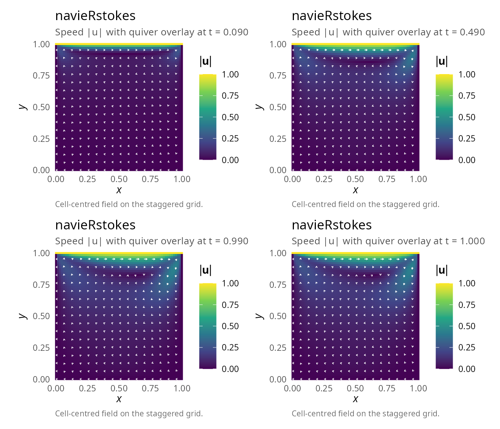
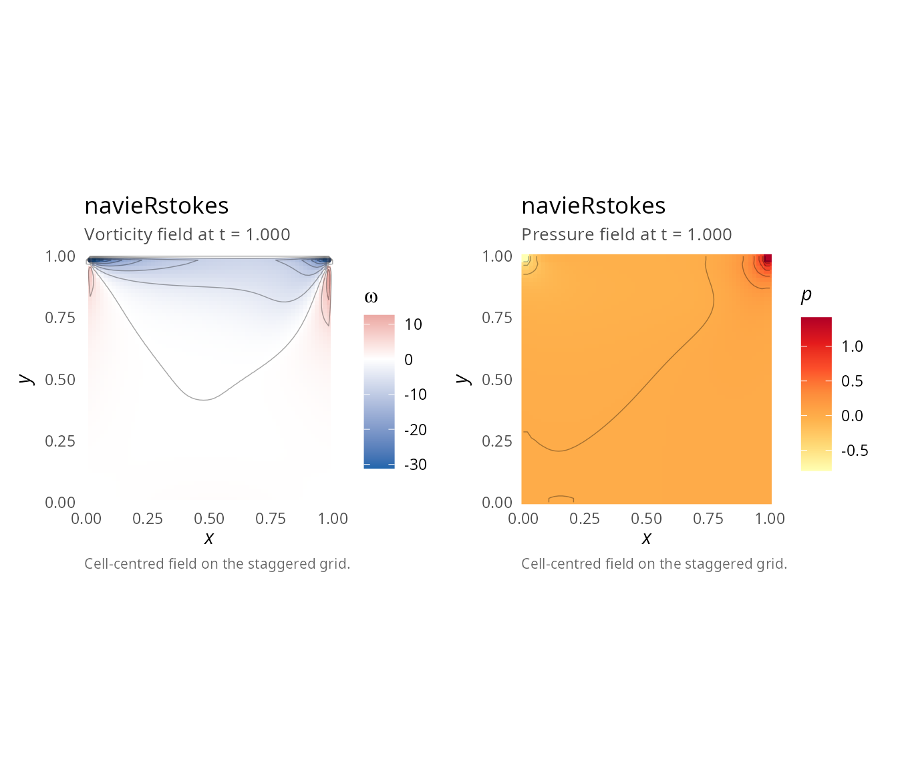
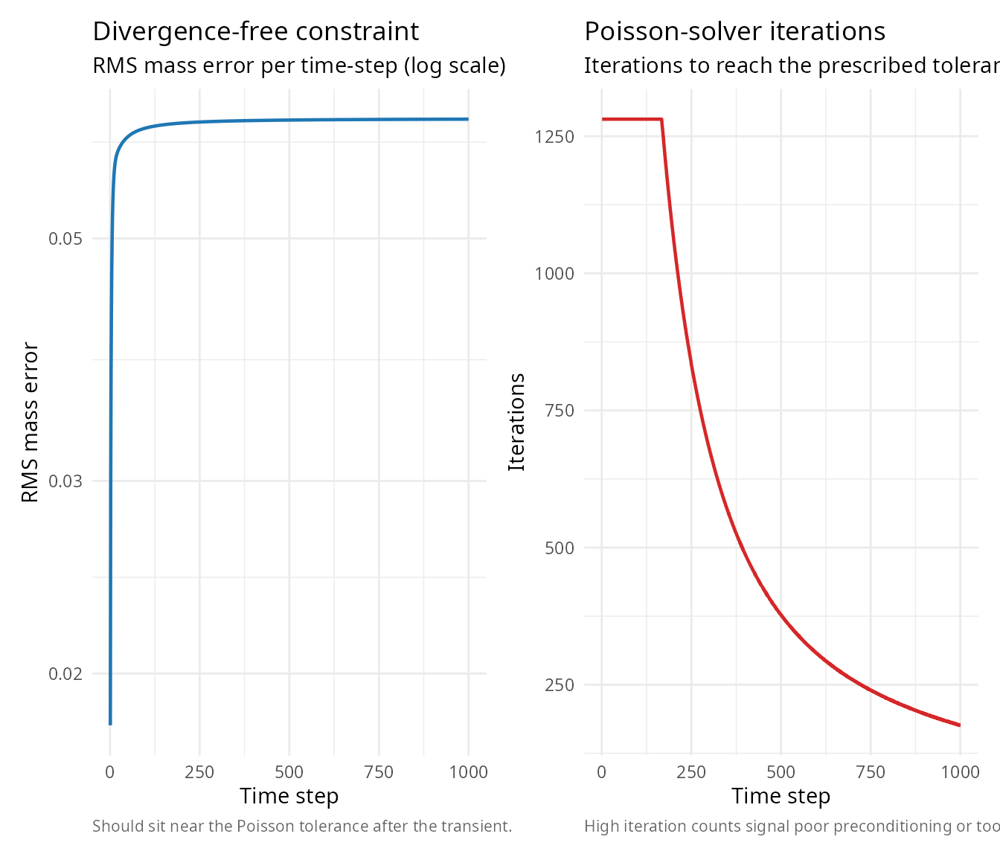
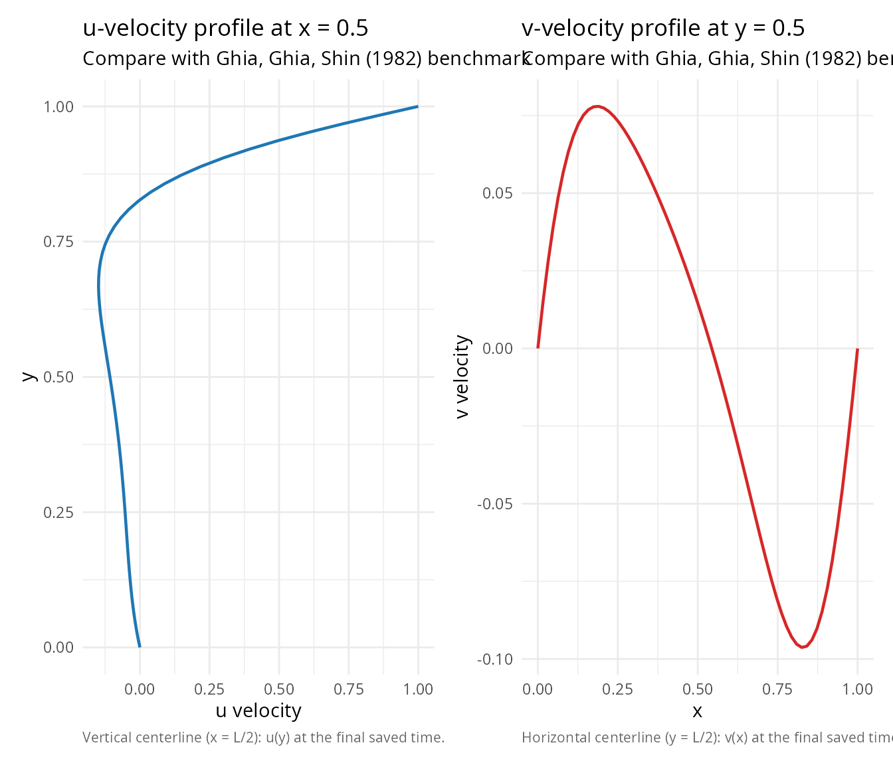

# Lid-driven cavity flow

## Overview

The **lid-driven cavity** is one of the most famous benchmark problems
in computational fluid dynamics [\[1\]](#ref1),[\[2\]](#ref2). It
consists of a square cavity with no-slip walls and a moving lid at the
top.

## Problem description

### Geometry

- Square domain: \\\[0, 1\] \times \[0, 1\]\\
- All walls have no-slip boundary conditions (velocity = 0)
- Top wall moves with constant velocity \\u = 1\\

### Boundary conditions

- **Left wall** (\\x = 0\\): \\u = 0, v = 0\\
- **Right wall** (\\x = 1\\): \\u = 0, v = 0\\
- **Bottom wall** (\\y = 0\\): \\u = 0, v = 0\\
- **Top wall** (\\y = 1\\): \\u = 1, v = 0\\ (moving lid)

### Flow physics

The moving lid creates a primary vortex in the center of the cavity. At
higher Reynolds numbers, secondary vortices appear in the corners. This
problem tests:

- Pressure-velocity coupling
- Treatment of singularities at corners
- Steady-state convergence
- Vortex formation and stability

## Implementation

``` r

library(navieRstokes)

# Simulation parameters
nx <- 64
ny <- 64
lx <- 1.0
ly <- 1.0
nu <- 0.01 # Kinematic viscosity
Re <- lx / nu # Reynolds number = 100 (assumes U = 1, i.e., u_top = 1)

dt <- 0.001 # Time step
nt <- 1000 # Number of steps
save_interval <- 10

cat("Lid-driven cavity simulation\n")
#> Lid-driven cavity simulation
cat("Reynolds number:", Re, "\n")
#> Reynolds number: 100
cat("Grid:", nx, "x", ny, "\n")
#> Grid: 64 x 64

# Run simulation
result <- simulate_navier_stokes(
  nx = nx,
  ny = ny,
  lx = lx,
  ly = ly,
  dt = dt,
  nt = nt,
  nu = nu,
  rho = 1.0,
  initial_condition = function(x, y) list(u = 0, v = 0),
  boundary_condition = list(
    type = "dirichlet",
    values = list(
      u_left = 0, u_right = 0, u_top = 1, u_bottom = 0,
      v_left = 0, v_right = 0, v_top = 0, v_bottom = 0
    )
  ),
  # Using optimized defaults: jacobi solver, max_iter=1000, tolerance=1e-3
  save_interval = save_interval
)
#> ¡ Starting Navier-Stokes simulation
#>    Grid: 64 x 64, Reynolds number (approx): 100.00
#>    Step 100/1000 | Mass error: 6.31e-02 | CFL: 0.06 | Pressure iter: 1281
#>    Step 200/1000 | Mass error: 6.38e-02 | CFL: 0.06 | Pressure iter: 1064
#>    Step 300/1000 | Mass error: 6.40e-02 | CFL: 0.06 | Pressure iter: 680
#>    Step 400/1000 | Mass error: 6.41e-02 | CFL: 0.06 | Pressure iter: 488
#>    Step 500/1000 | Mass error: 6.42e-02 | CFL: 0.06 | Pressure iter: 377
#>    Step 600/1000 | Mass error: 6.42e-02 | CFL: 0.06 | Pressure iter: 307
#>    Step 700/1000 | Mass error: 6.42e-02 | CFL: 0.06 | Pressure iter: 259
#>    Step 800/1000 | Mass error: 6.42e-02 | CFL: 0.06 | Pressure iter: 224
#>    Step 900/1000 | Mass error: 6.43e-02 | CFL: 0.06 | Pressure iter: 197
#>    Step 1000/1000 | Mass error: 6.43e-02 | CFL: 0.06 | Pressure iter: 176
#> ✔ Simulation completed successfully
```

## Visualization

### Velocity field evolution

``` r

library(patchwork)

p1 <- plot(result, time_index = 10,   plot_type = "velocity")
p2 <- plot(result, time_index = 50,   plot_type = "velocity")
p3 <- plot(result, time_index = 100,  plot_type = "velocity")
p4 <- plot(result, time_index = NULL, plot_type = "velocity")
(p1 | p2) / (p3 | p4)
```



### Vorticity field

The vorticity \\\omega = \frac{\partial v}{\partial x} - \frac{\partial
u}{\partial y}\\ reveals the structure of vortices:

``` r

plot(result, plot_type = "vorticity") | plot(result, plot_type = "pressure")
#> Warning: The following aesthetics were dropped during statistical transformation: fill.
#> ℹ This can happen when ggplot fails to infer the correct grouping structure in
#>   the data.
#> ℹ Did you forget to specify a `group` aesthetic or to convert a numerical
#>   variable into a factor?
#> The following aesthetics were dropped during statistical transformation: fill.
#> ℹ This can happen when ggplot fails to infer the correct grouping structure in
#>   the data.
#> ℹ Did you forget to specify a `group` aesthetic or to convert a numerical
#>   variable into a factor?
```



## Diagnostics

### Mass conservation

``` r

library(ggplot2)

df_diag <- data.frame(
  step = seq_along(result$diagnostics$mass_error),
  mass = result$diagnostics$mass_error,
  iter = result$diagnostics$pressure_iterations
)

p_mass <- ggplot(df_diag, aes(x = step, y = mass)) +
  geom_line(linewidth = 0.8, colour = "#1F77B4") +
  scale_y_log10() +
  labs(title = "Divergence-free constraint",
       subtitle = "RMS mass error per time-step (log scale)",
       caption = "Should sit near the Poisson tolerance after the transient.",
       x = "Time step", y = "RMS mass error") +
  theme_minimal(base_size = 11) +
  theme(plot.caption = element_text(color = "grey40", size = 8, hjust = 0))

p_iter <- ggplot(df_diag, aes(x = step, y = iter)) +
  geom_line(linewidth = 0.8, colour = "#D62728") +
  labs(title = "Poisson-solver iterations",
       subtitle = "Iterations to reach the prescribed tolerance",
       caption = "High iteration counts signal poor preconditioning or too-tight tolerance.",
       x = "Time step", y = "Iterations") +
  theme_minimal(base_size = 11) +
  theme(plot.caption = element_text(color = "grey40", size = 8, hjust = 0))

p_mass | p_iter
```



``` r


cat("\nDiagnostics:\n")
#> 
#> Diagnostics:
cat("  Mean mass error:", result$diagnostics$mean_mass_error, "\n")
#>   Mean mass error: 0.06366493
cat("  Max mass error:", result$diagnostics$max_mass_error, "\n")
#>   Max mass error: 0.06427261
cat(
  "  Mean pressure iterations:",
  mean(result$diagnostics$pressure_iterations), "\n"
)
#>   Mean pressure iterations: 562.508
```

## Centerline velocity profiles

Compare with benchmark data from Ghia et al. [\[1\]](#ref1):

``` r

# Extract velocity profiles along centerlines
final_idx <- dim(result$u)[3]
u_final <- result$u[, , final_idx]
v_final <- result$v[, , final_idx]

# Vertical centerline: u vs y at x = L/2 (Ghia et al. convention)
i_mid <- round(nx / 2)
u_centerline <- u_final[i_mid, ]   # all y at fixed x-index i_mid; length ny

# Horizontal centerline: v vs x at y = L/2
j_mid <- round(ny / 2)
v_centerline <- v_final[, j_mid]   # all x at fixed y-index j_mid; length nx

p_u <- ggplot(data.frame(u = u_centerline, y = result$y),
              aes(x = u, y = y)) +
  geom_path(linewidth = 0.8, colour = "#1F77B4") +
  labs(title = "u-velocity profile at x = 0.5",
       subtitle = "Compare with Ghia, Ghia, Shin (1982) benchmark",
       caption = "Vertical centerline (x = L/2): u(y) at the final saved time.",
       x = "u velocity", y = "y") +
  theme_minimal(base_size = 11) +
  theme(plot.caption = element_text(color = "grey40", size = 8, hjust = 0))

p_v <- ggplot(data.frame(x = result$x, v = v_centerline),
              aes(x = x, y = v)) +
  geom_line(linewidth = 0.8, colour = "#D62728") +
  labs(title = "v-velocity profile at y = 0.5",
       subtitle = "Compare with Ghia, Ghia, Shin (1982) benchmark",
       caption = "Horizontal centerline (y = L/2): v(x) at the final saved time.",
       x = "x", y = "v velocity") +
  theme_minimal(base_size = 11) +
  theme(plot.caption = element_text(color = "grey40", size = 8, hjust = 0))

p_u | p_v
```



## Reynolds number effects

Different Reynolds numbers produce different flow structures
[\[3\]](#ref3):

### Re = 100 (current example)

- Single primary vortex
- Smooth, laminar flow
- Quick convergence

### Re = 400

- Primary vortex moves toward center
- Small secondary vortices in bottom corners
- Longer convergence time

### Re = 1000

- Stronger primary vortex
- Pronounced secondary vortices
- Possible tertiary vortices

To simulate higher Reynolds numbers, reduce `nu` and use finer grids:

``` r

# Re = 400 example
result_Re400 <- simulate_navier_stokes(
  nx = 128, ny = 128,
  lx = 1.0, ly = 1.0,
  dt = 0.0005, nt = 5000,
  nu = 0.0025, # Re = 1/0.0025 = 400
  initial_condition = function(x, y) list(u = 0, v = 0),
  boundary_condition = list(
    type = "dirichlet",
    values = list(
      u_left = 0, u_right = 0, u_top = 1, u_bottom = 0,
      v_left = 0, v_right = 0, v_top = 0, v_bottom = 0
    )
  ),
  save_interval = 50
)
#> ¡ Starting Navier-Stokes simulation
#>    Grid: 128 x 128, Reynolds number (approx): 400.00
#> Warning in simulate_navier_stokes(nx = 128, ny = 128, lx = 1, ly = 1, dt =
#> 5e-04, : ⚠ Poisson solver did not converge at step 19 (error = 5.23e-02,
#> tolerance = 1.00e-03)
#>    Step 100/5000 | Mass error: 4.57e-02 | CFL: 0.06 | Pressure iter: 2561
#>    Step 200/5000 | Mass error: 4.71e-02 | CFL: 0.06 | Pressure iter: 2561
#>    Step 300/5000 | Mass error: 4.76e-02 | CFL: 0.06 | Pressure iter: 2294
#>    Step 400/5000 | Mass error: 4.78e-02 | CFL: 0.06 | Pressure iter: 1633
#>    Step 500/5000 | Mass error: 4.80e-02 | CFL: 0.06 | Pressure iter: 1259
#>    Step 600/5000 | Mass error: 4.81e-02 | CFL: 0.06 | Pressure iter: 1025
#>    Step 700/5000 | Mass error: 4.81e-02 | CFL: 0.06 | Pressure iter: 866
#>    Step 800/5000 | Mass error: 4.82e-02 | CFL: 0.06 | Pressure iter: 752
#>    Step 900/5000 | Mass error: 4.82e-02 | CFL: 0.06 | Pressure iter: 668
#>    Step 1000/5000 | Mass error: 4.82e-02 | CFL: 0.06 | Pressure iter: 603
#>    Step 1100/5000 | Mass error: 4.82e-02 | CFL: 0.06 | Pressure iter: 552
#>    Step 1200/5000 | Mass error: 4.83e-02 | CFL: 0.06 | Pressure iter: 511
#>    Step 1300/5000 | Mass error: 4.83e-02 | CFL: 0.06 | Pressure iter: 479
#>    Step 1400/5000 | Mass error: 4.83e-02 | CFL: 0.06 | Pressure iter: 452
#>    Step 1500/5000 | Mass error: 4.83e-02 | CFL: 0.06 | Pressure iter: 429
#>    Step 1600/5000 | Mass error: 4.83e-02 | CFL: 0.06 | Pressure iter: 411
#>    Step 1700/5000 | Mass error: 4.83e-02 | CFL: 0.06 | Pressure iter: 395
#>    Step 1800/5000 | Mass error: 4.83e-02 | CFL: 0.06 | Pressure iter: 380
#>    Step 1900/5000 | Mass error: 4.83e-02 | CFL: 0.06 | Pressure iter: 368
#>    Step 2000/5000 | Mass error: 4.83e-02 | CFL: 0.06 | Pressure iter: 356
#>    Step 2100/5000 | Mass error: 4.83e-02 | CFL: 0.06 | Pressure iter: 346
#>    Step 2200/5000 | Mass error: 4.83e-02 | CFL: 0.06 | Pressure iter: 337
#>    Step 2300/5000 | Mass error: 4.83e-02 | CFL: 0.06 | Pressure iter: 328
#>    Step 2400/5000 | Mass error: 4.83e-02 | CFL: 0.06 | Pressure iter: 319
#>    Step 2500/5000 | Mass error: 4.83e-02 | CFL: 0.06 | Pressure iter: 312
#>    Step 2600/5000 | Mass error: 4.83e-02 | CFL: 0.06 | Pressure iter: 304
#>    Step 2700/5000 | Mass error: 4.83e-02 | CFL: 0.06 | Pressure iter: 298
#>    Step 2800/5000 | Mass error: 4.83e-02 | CFL: 0.06 | Pressure iter: 290
#>    Step 2900/5000 | Mass error: 4.83e-02 | CFL: 0.06 | Pressure iter: 284
#>    Step 3000/5000 | Mass error: 4.83e-02 | CFL: 0.06 | Pressure iter: 278
#>    Step 3100/5000 | Mass error: 4.83e-02 | CFL: 0.06 | Pressure iter: 272
#>    Step 3200/5000 | Mass error: 4.83e-02 | CFL: 0.06 | Pressure iter: 266
#>    Step 3300/5000 | Mass error: 4.83e-02 | CFL: 0.06 | Pressure iter: 261
#>    Step 3400/5000 | Mass error: 4.83e-02 | CFL: 0.06 | Pressure iter: 255
#>    Step 3500/5000 | Mass error: 4.83e-02 | CFL: 0.06 | Pressure iter: 250
#>    Step 3600/5000 | Mass error: 4.83e-02 | CFL: 0.06 | Pressure iter: 246
#>    Step 3700/5000 | Mass error: 4.83e-02 | CFL: 0.06 | Pressure iter: 242
#>    Step 3800/5000 | Mass error: 4.83e-02 | CFL: 0.06 | Pressure iter: 237
#>    Step 3900/5000 | Mass error: 4.83e-02 | CFL: 0.06 | Pressure iter: 233
#>    Step 4000/5000 | Mass error: 4.83e-02 | CFL: 0.06 | Pressure iter: 229
#>    Step 4100/5000 | Mass error: 4.83e-02 | CFL: 0.06 | Pressure iter: 224
#>    Step 4200/5000 | Mass error: 4.83e-02 | CFL: 0.06 | Pressure iter: 222
#>    Step 4300/5000 | Mass error: 4.83e-02 | CFL: 0.06 | Pressure iter: 218
#>    Step 4400/5000 | Mass error: 4.83e-02 | CFL: 0.06 | Pressure iter: 215
#>    Step 4500/5000 | Mass error: 4.83e-02 | CFL: 0.06 | Pressure iter: 212
#>    Step 4600/5000 | Mass error: 4.83e-02 | CFL: 0.06 | Pressure iter: 208
#>    Step 4700/5000 | Mass error: 4.83e-02 | CFL: 0.06 | Pressure iter: 206
#>    Step 4800/5000 | Mass error: 4.83e-02 | CFL: 0.06 | Pressure iter: 202
#>    Step 4900/5000 | Mass error: 4.83e-02 | CFL: 0.06 | Pressure iter: 200
#>    Step 5000/5000 | Mass error: 4.83e-02 | CFL: 0.06 | Pressure iter: 197
#> ✔ Simulation completed successfully
```

## Vortex center location

Find the primary vortex center:

``` r

# Get final velocity field
final_idx <- dim(result$u)[3]
u_final <- result$u[, , final_idx]
v_final <- result$v[, , final_idx]

# Calculate speed
speed <- sqrt(u_final^2 + v_final^2)

# Find vortex center (minimum speed in interior)
interior_speed <- speed[10:(nx - 10), 10:(ny - 10)]
min_idx <- which(interior_speed == min(interior_speed), arr.ind = TRUE)

vortex_i <- min_idx[1] + 9
vortex_j <- min_idx[2] + 9

cat("Vortex center location:\n")
#> Vortex center location:
cat("  x =", result$x[vortex_i], "\n")
#>   x = 0.6507937
cat("  y =", result$y[vortex_j], "\n")
#>   y = 0.8253968

# Benchmark value at Re=100: approximately (0.62, 0.74)
```

## Performance notes

With optimized Jacobi solver (v0.1.1+):

- **64×64 grid**: ~0.4 seconds for 1000 time steps
- **128×128 grid**: ~2-3 seconds for 1000 time steps
- **256×256 grid**: ~30-60 seconds for 1000 time steps

Rcpp-optimized Jacobi solver provides approximately 500x speedup
compared to the original SOR implementation with convergence issues.

## References

**\[1\]** Ghia, U., Ghia, K. N., & Shin, C. T. (1982). High-Re solutions
for incompressible flow using the Navier-Stokes equations and a
multigrid method. *Journal of Computational Physics*, 48(3), 387-411.
DOI:
[10.1016/0021-9991(82)90058-4](https://doi.org/10.1016/0021-9991(82)90058-4)

**\[2\]** Botella, O., & Peyret, R. (1998). Benchmark spectral results
on the lid-driven cavity flow. *Computers & Fluids*, 27(4), 421-433.
DOI:
[10.1016/S0045-7930(98)00002-4](https://doi.org/10.1016/S0045-7930(98)00002-4)

**\[3\]** Erturk, E., Corke, T. C., & Gokcol, C. (2005). Numerical
solutions of 2-D steady incompressible driven cavity flow at high
Reynolds numbers. *International Journal for Numerical Methods in
Fluids*, 48(7), 747-774. DOI:
[10.1002/fld.953](https://doi.org/10.1002/fld.953)
