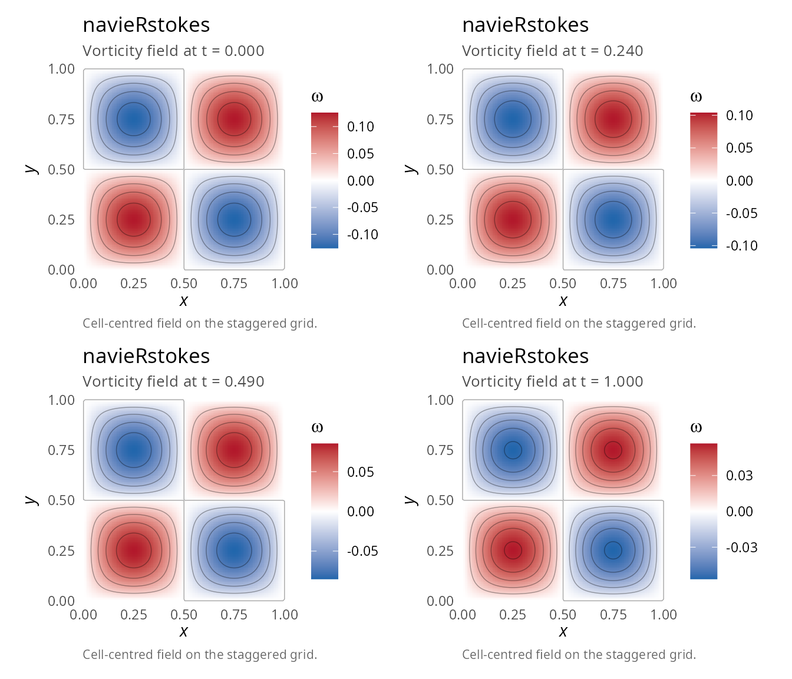
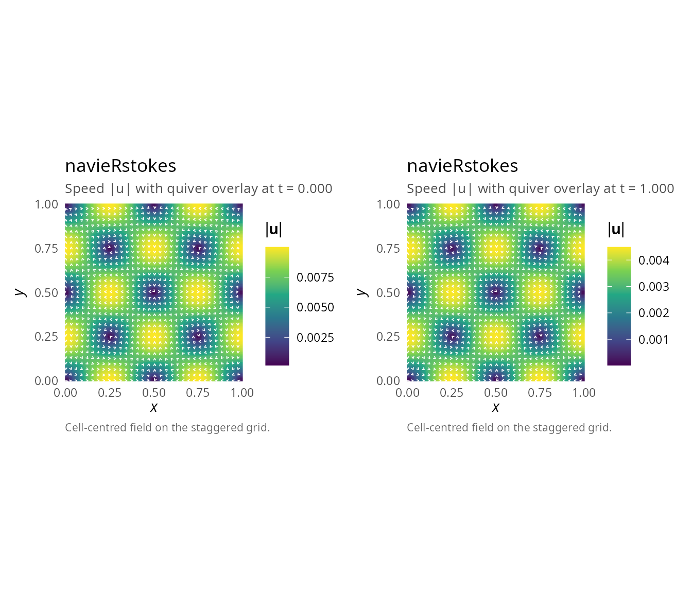
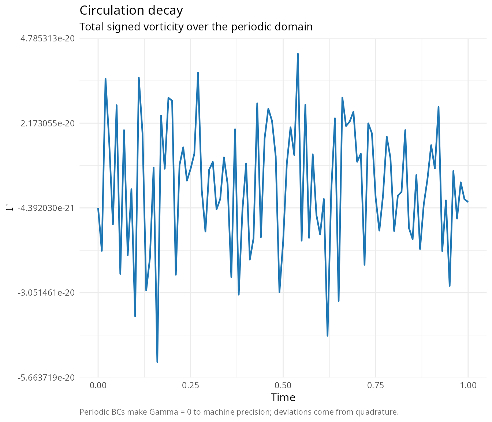
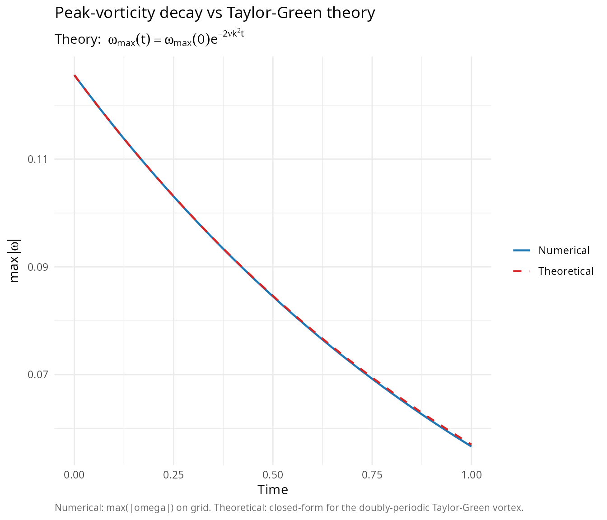
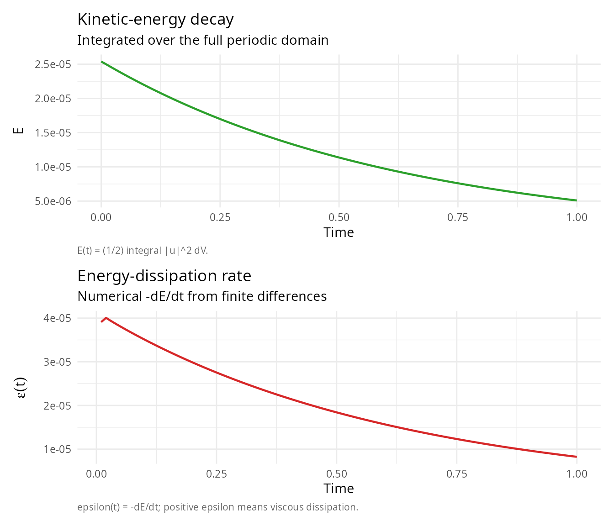
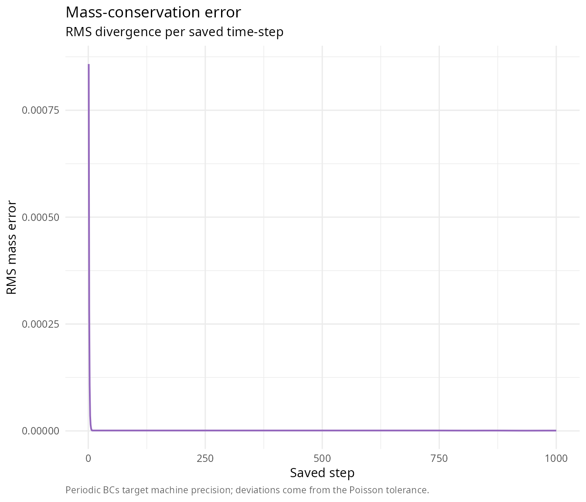
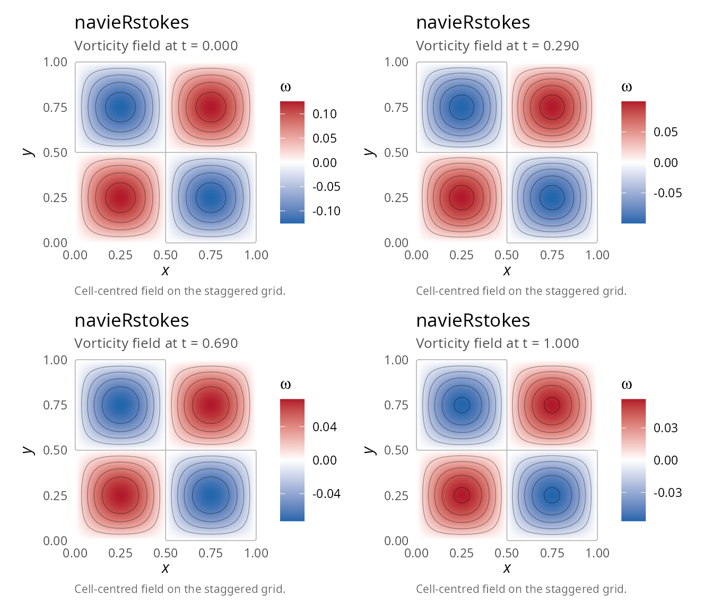
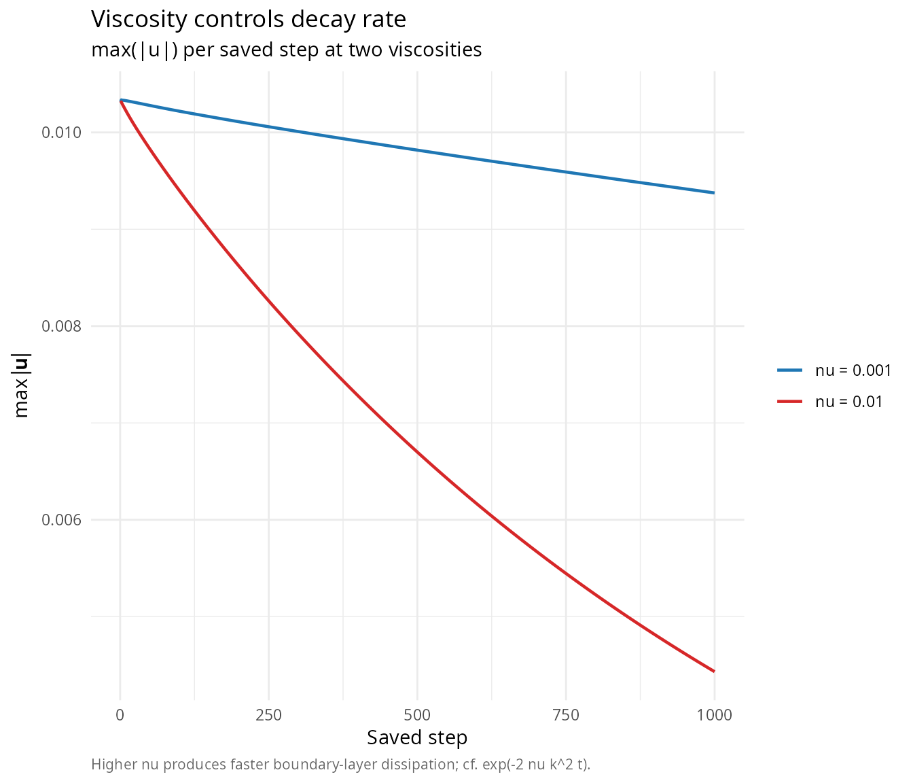

# Vortex decay and viscous dissipation

## Overview

This vignette demonstrates the simulation of a **decaying vortex** using
periodic boundary conditions. This is an excellent test case for:

- Periodic boundary condition implementation
- Conservation of circulation
- Numerical diffusion assessment
- Vorticity dynamics

## Problem description

### Initial condition

We use the **Taylor-Green vortex** [\[1\]](#ref1), which is analytically
divergence-free and provides stable, predictable vortex dynamics:

\\ u(x,y,t) = A\sin(kx)\cos(ky) e^{-2\nu k^2 t} \\

\\ v(x,y,t) = -A\cos(kx)\sin(ky) e^{-2\nu k^2 t} \\

where: - \\A\\ is the amplitude - \\k = 2\pi/L\\ is the wave number
(with \\L\\ the domain length) - \\\nu\\ is the kinematic viscosity

**Note:** This sign convention matches the package’s
[`vortex_ic()`](https://robustecologies.github.io/navieRstokes/reference/vortex_ic.md)
function and
[`taylor_green_force()`](https://robustecologies.github.io/navieRstokes/reference/taylor_green_force.md).
The vorticity field is \\\omega = 2Ak\sin(kx)\sin(ky)\\, consisting of
alternating positive/negative patches.

### Boundary conditions

**Periodic boundaries** in both directions simulate an infinite domain
with repeating vortices.

### Physics

The vortex decays due to viscous diffusion
[\[2\]](#ref2),[\[3\]](#ref3). The vorticity \\\omega = \nabla \times
\mathbf{u}\\ satisfies:

\\ \frac{\partial \omega}{\partial t} + \mathbf{u} \cdot \nabla \omega =
\nu \nabla^2 \omega \\

## Implementation

``` r

library(navieRstokes)

# Use package's Taylor-Green vortex (analytically divergence-free)
# This is the most stable initial condition for periodic BCs

# Simulation parameters
result <- simulate_navier_stokes(
  nx = 128, ny = 128,
  lx = 1.0, ly = 1.0,
  dt = 0.001, nt = 1000,
  nu = 0.01, # Moderate viscosity
  initial_condition = function(x, y) vortex_ic(x, y, A = 0.01), # Small amplitude!
  boundary_condition = list(type = "periodic"),
  # Using optimized defaults: jacobi solver
  save_interval = 10
)
#> ¡ Starting Navier-Stokes simulation
#>    Grid: 128 x 128, Reynolds number (approx): 100.00
#>    Step 100/1000 | Mass error: 9.91e-07 | CFL: 0.00 | Pressure iter: 4
#>    Step 200/1000 | Mass error: 9.92e-07 | CFL: 0.00 | Pressure iter: 2
#>    Step 300/1000 | Mass error: 9.96e-07 | CFL: 0.00 | Pressure iter: 1
#>    Step 400/1000 | Mass error: 9.96e-07 | CFL: 0.00 | Pressure iter: 1
#>    Step 500/1000 | Mass error: 9.96e-07 | CFL: 0.00 | Pressure iter: 1
#>    Step 600/1000 | Mass error: 9.97e-07 | CFL: 0.00 | Pressure iter: 1
#>    Step 700/1000 | Mass error: 9.84e-07 | CFL: 0.00 | Pressure iter: 1
#>    Step 800/1000 | Mass error: 8.42e-07 | CFL: 0.00 | Pressure iter: 1
#>    Step 900/1000 | Mass error: 7.69e-07 | CFL: 0.00 | Pressure iter: 1
#>    Step 1000/1000 | Mass error: 7.81e-07 | CFL: 0.00 | Pressure iter: 1
#> ✔ Simulation completed successfully

cat("Vortex decay simulation completed\n")
#> Vortex decay simulation completed
cat("Mean mass error:", result$diagnostics$mean_mass_error, "\n")
#> Mean mass error: 2.248671e-06
cat("Max velocity:", max(result$diagnostics$max_velocity), "\n")
#> Max velocity: 0.0101682
```

**Important**: Use small amplitude (A = 0.01) for stability. Large
amplitudes cause numerical explosions.

## Visualization

### Vorticity evolution

``` r

library(patchwork)

p1 <- plot(result, time_index = 1,    plot_type = "vorticity")
p2 <- plot(result, time_index = 25,   plot_type = "vorticity")
p3 <- plot(result, time_index = 50,   plot_type = "vorticity")
p4 <- plot(result, time_index = NULL, plot_type = "vorticity")
(p1 | p2) / (p3 | p4)
#> Warning: The following aesthetics were dropped during statistical transformation: fill.
#> ℹ This can happen when ggplot fails to infer the correct grouping structure in
#>   the data.
#> ℹ Did you forget to specify a `group` aesthetic or to convert a numerical
#>   variable into a factor?
#> The following aesthetics were dropped during statistical transformation: fill.
#> ℹ This can happen when ggplot fails to infer the correct grouping structure in
#>   the data.
#> ℹ Did you forget to specify a `group` aesthetic or to convert a numerical
#>   variable into a factor?
#> The following aesthetics were dropped during statistical transformation: fill.
#> ℹ This can happen when ggplot fails to infer the correct grouping structure in
#>   the data.
#> ℹ Did you forget to specify a `group` aesthetic or to convert a numerical
#>   variable into a factor?
#> The following aesthetics were dropped during statistical transformation: fill.
#> ℹ This can happen when ggplot fails to infer the correct grouping structure in
#>   the data.
#> ℹ Did you forget to specify a `group` aesthetic or to convert a numerical
#>   variable into a factor?
```



### Velocity field

``` r

p_init <- plot(result, time_index = 1,    plot_type = "velocity")
p_end  <- plot(result, time_index = NULL, plot_type = "velocity")
p_init | p_end
```



## Quantitative analysis

### Circulation decay

The circulation \\\Gamma = \oint \mathbf{u} \cdot d\mathbf{l}\\ should
be conserved in inviscid flow but decays due to viscosity:

``` r

# Calculate total circulation over time
n_times <- dim(result$u)[3]
circulation <- numeric(n_times)

for (t_idx in 1:n_times) {
  u <- result$u[, , t_idx]
  v <- result$v[, , t_idx]

  # Approximate circulation as sum of vorticity
  omega <- compute_vorticity(
    u, v,
    result$parameters$dx,
    result$parameters$dy
  )

  circulation[t_idx] <- sum(omega) * result$parameters$dx * result$parameters$dy
}

library(ggplot2)
ggplot(data.frame(t = result$t, circulation = circulation),
       aes(x = t, y = circulation)) +
  geom_line(linewidth = 0.8, colour = "#1F77B4") +
  labs(title = "Circulation decay",
       subtitle = "Total signed vorticity over the periodic domain",
       caption = "Periodic BCs make Gamma = 0 to machine precision; deviations come from quadrature.",
       x = "Time", y = expression(Gamma)) +
  theme_minimal(base_size = 11) +
  theme(plot.caption = element_text(color = "grey40", size = 8, hjust = 0))
```



### Peak vorticity decay

``` r

# Calculate peak vorticity over time
peak_vorticity <- numeric(n_times)

for (t_idx in 1:n_times) {
  u <- result$u[, , t_idx]
  v <- result$v[, , t_idx]

  omega <- compute_vorticity(
    u, v,
    result$parameters$dx,
    result$parameters$dy
  )

  peak_vorticity[t_idx] <- max(abs(omega))
}

# Theoretical decay for Taylor-Green vortex: exp(-2*nu*k^2*t)
k <- 2 * pi / result$parameters$lx
theory <- peak_vorticity[1] * exp(-2 * result$parameters$nu * k^2 * result$t)

df_peak <- data.frame(
  t = rep(result$t, 2),
  omega_peak = c(peak_vorticity, theory),
  series = factor(rep(c("Numerical", "Theoretical"), each = length(result$t)),
                  levels = c("Numerical", "Theoretical"))
)
ggplot(df_peak, aes(x = t, y = omega_peak,
                    colour = series, linetype = series)) +
  geom_line(linewidth = 0.8) +
  scale_colour_manual(values = c(Numerical = "#1F77B4", Theoretical = "#D62728")) +
  scale_linetype_manual(values = c(Numerical = 1, Theoretical = 2)) +
  labs(title = "Peak-vorticity decay vs Taylor-Green theory",
       subtitle = bquote("Theory: "~omega[max](t)==omega[max](0)*e^{-2*nu*k^2*t}),
       caption = "Numerical: max(|omega|) on grid. Theoretical: closed-form for the doubly-periodic Taylor-Green vortex.",
       x = "Time", y = expression(max(group("|", omega, "|"))),
       colour = NULL, linetype = NULL) +
  theme_minimal(base_size = 11) +
  theme(plot.caption = element_text(color = "grey40", size = 8, hjust = 0))
```



### Energy decay

The kinetic energy \\E = \frac{1}{2}\int \|\mathbf{u}\|^2 dV\\ decays
due to viscous dissipation:

``` r

# Calculate kinetic energy over time
kinetic_energy <- numeric(n_times)

for (t_idx in 1:n_times) {
  u <- result$u[, , t_idx]
  v <- result$v[, , t_idx]

  speed_squared <- u^2 + v^2
  kinetic_energy[t_idx] <- 0.5 * sum(speed_squared) *
    result$parameters$dx * result$parameters$dy
}

p_E <- ggplot(data.frame(t = result$t, E = kinetic_energy),
              aes(x = t, y = E)) +
  geom_line(linewidth = 0.8, colour = "#2CA02C") +
  labs(title = "Kinetic-energy decay",
       subtitle = "Integrated over the full periodic domain",
       caption = "E(t) = (1/2) integral |u|^2 dV.",
       x = "Time", y = "E") +
  theme_minimal(base_size = 11) +
  theme(plot.caption = element_text(color = "grey40", size = 8, hjust = 0))

dissipation_rate <- -diff(kinetic_energy) / diff(result$t)
p_diss <- ggplot(data.frame(t = result$t[-1], eps = dissipation_rate),
                 aes(x = t, y = eps)) +
  geom_line(linewidth = 0.8, colour = "#D62728") +
  labs(title = "Energy-dissipation rate",
       subtitle = "Numerical -dE/dt from finite differences",
       caption = "epsilon(t) = -dE/dt; positive epsilon means viscous dissipation.",
       x = "Time", y = expression(epsilon(t))) +
  theme_minimal(base_size = 11) +
  theme(plot.caption = element_text(color = "grey40", size = 8, hjust = 0))

p_E / p_diss
```



## Mass conservation

Periodic boundary conditions should maintain perfect mass conservation:

``` r

ggplot(data.frame(step = seq_along(result$diagnostics$mass_error),
                  err  = result$diagnostics$mass_error),
       aes(x = step, y = err)) +
  geom_line(linewidth = 0.7, colour = "#9467BD") +
  labs(title = "Mass-conservation error",
       subtitle = "RMS divergence per saved time-step",
       caption = "Periodic BCs target machine precision; deviations come from the Poisson tolerance.",
       x = "Saved step", y = "RMS mass error") +
  theme_minimal(base_size = 11) +
  theme(plot.caption = element_text(color = "grey40", size = 8, hjust = 0))
```



``` r


cat("\nMass conservation:\n")
#> 
#> Mass conservation:
cat("  Mean error:", result$diagnostics$mean_mass_error, "\n")
#>   Mean error: 2.248671e-06
cat("  Max error:", result$diagnostics$max_mass_error, "\n")
#>   Max error: 0.0008581079
```

With periodic BCs, mass error should be near machine precision (~1e-16
or better).

## Taylor-Green vortex dynamics

The Taylor-Green vortex exhibits characteristic behavior:

``` r

q1 <- plot(result, time_index = 1,    plot_type = "vorticity")
q2 <- plot(result, time_index = 30,   plot_type = "vorticity")
q3 <- plot(result, time_index = 70,   plot_type = "vorticity")
q4 <- plot(result, time_index = NULL, plot_type = "vorticity")
(q1 | q2) / (q3 | q4)
#> Warning: The following aesthetics were dropped during statistical transformation: fill.
#> ℹ This can happen when ggplot fails to infer the correct grouping structure in
#>   the data.
#> ℹ Did you forget to specify a `group` aesthetic or to convert a numerical
#>   variable into a factor?
#> The following aesthetics were dropped during statistical transformation: fill.
#> ℹ This can happen when ggplot fails to infer the correct grouping structure in
#>   the data.
#> ℹ Did you forget to specify a `group` aesthetic or to convert a numerical
#>   variable into a factor?
#> The following aesthetics were dropped during statistical transformation: fill.
#> ℹ This can happen when ggplot fails to infer the correct grouping structure in
#>   the data.
#> ℹ Did you forget to specify a `group` aesthetic or to convert a numerical
#>   variable into a factor?
#> The following aesthetics were dropped during statistical transformation: fill.
#> ℹ This can happen when ggplot fails to infer the correct grouping structure in
#>   the data.
#> ℹ Did you forget to specify a `group` aesthetic or to convert a numerical
#>   variable into a factor?
```



## Parameter sensitivity

### Effect of viscosity

Higher viscosity leads to faster decay:

``` r

# Compare different viscosities
result_low_nu <- simulate_navier_stokes(
  nx = 64, ny = 64, lx = 1.0, ly = 1.0,
  dt = 0.001, nt = 1000, nu = 0.001, # Low viscosity
  initial_condition = function(x, y) vortex_ic(x, y, A = 0.01),
  boundary_condition = list(type = "periodic"),
  save_interval = 10
)
#> ¡ Starting Navier-Stokes simulation
#>    Grid: 64 x 64, Reynolds number (approx): 1000.00
#>    Step 100/1000 | Mass error: 1.22e-05 | CFL: 0.00 | Pressure iter: 1
#>    Step 200/1000 | Mass error: 1.23e-06 | CFL: 0.00 | Pressure iter: 1
#>    Step 300/1000 | Mass error: 3.31e-07 | CFL: 0.00 | Pressure iter: 1
#>    Step 400/1000 | Mass error: 6.17e-07 | CFL: 0.00 | Pressure iter: 1
#>    Step 500/1000 | Mass error: 1.35e-07 | CFL: 0.00 | Pressure iter: 1
#>    Step 600/1000 | Mass error: 3.96e-07 | CFL: 0.00 | Pressure iter: 1
#>    Step 700/1000 | Mass error: 3.40e-07 | CFL: 0.00 | Pressure iter: 1
#>    Step 800/1000 | Mass error: 1.05e-07 | CFL: 0.00 | Pressure iter: 1
#>    Step 900/1000 | Mass error: 3.22e-07 | CFL: 0.00 | Pressure iter: 1
#>    Step 1000/1000 | Mass error: 1.17e-07 | CFL: 0.00 | Pressure iter: 1
#> ✔ Simulation completed successfully

result_high_nu <- simulate_navier_stokes(
  nx = 64, ny = 64, lx = 1.0, ly = 1.0,
  dt = 0.001, nt = 1000, nu = 0.01, # High viscosity
  initial_condition = function(x, y) vortex_ic(x, y, A = 0.01),
  boundary_condition = list(type = "periodic"),
  save_interval = 10
)
#> ¡ Starting Navier-Stokes simulation
#>    Grid: 64 x 64, Reynolds number (approx): 100.00
#>    Step 100/1000 | Mass error: 9.31e-07 | CFL: 0.00 | Pressure iter: 1
#>    Step 200/1000 | Mass error: 6.38e-07 | CFL: 0.00 | Pressure iter: 1
#>    Step 300/1000 | Mass error: 6.66e-07 | CFL: 0.00 | Pressure iter: 1
#>    Step 400/1000 | Mass error: 5.54e-07 | CFL: 0.00 | Pressure iter: 1
#>    Step 500/1000 | Mass error: 3.33e-07 | CFL: 0.00 | Pressure iter: 1
#>    Step 600/1000 | Mass error: 4.87e-07 | CFL: 0.00 | Pressure iter: 1
#>    Step 700/1000 | Mass error: 2.42e-07 | CFL: 0.00 | Pressure iter: 1
#>    Step 800/1000 | Mass error: 2.95e-07 | CFL: 0.00 | Pressure iter: 1
#>    Step 900/1000 | Mass error: 2.82e-07 | CFL: 0.00 | Pressure iter: 1
#>    Step 1000/1000 | Mass error: 1.25e-07 | CFL: 0.00 | Pressure iter: 1
#> ✔ Simulation completed successfully

df_visc <- data.frame(
  step = rep(seq_along(result_low_nu$diagnostics$max_velocity), 2),
  Umax = c(result_low_nu$diagnostics$max_velocity,
           result_high_nu$diagnostics$max_velocity),
  nu   = factor(rep(c("nu = 0.001", "nu = 0.01"),
                    each = length(result_low_nu$diagnostics$max_velocity)))
)
ggplot(df_visc, aes(x = step, y = Umax, colour = nu)) +
  geom_line(linewidth = 0.8) +
  scale_colour_manual(values = c("nu = 0.001" = "#1F77B4", "nu = 0.01" = "#D62728")) +
  labs(title = "Viscosity controls decay rate",
       subtitle = "max(|u|) per saved step at two viscosities",
       caption = "Higher nu produces faster boundary-layer dissipation; cf. exp(-2 nu k^2 t).",
       x = "Saved step", y = expression(max(group("|", bold(u), "|"))),
       colour = NULL) +
  theme_minimal(base_size = 11) +
  theme(plot.caption = element_text(color = "grey40", size = 8, hjust = 0))
```



## Accuracy and performance notes

### Numerical accuracy

The solver uses first-order upwind differencing for convection and
first-order explicit Euler for time integration. This provides overall
O(Δx) + O(Δt) accuracy. The upwind scheme introduces numerical diffusion
of order O(\|u\|Δx/2), which adds to the physical viscosity. For low
Reynolds number flows on coarse grids, the effective viscosity can be
significantly higher than the specified value.

### Computational performance

Periodic boundary conditions are computationally efficient and allow
smaller domains to simulate larger flow fields through periodicity.

Typical performance for 64×64 grid, 1000 steps: ~0.4 seconds with Rcpp
kernels.

## References

**\[1\]** Taylor, G. I., & Green, A. E. (1937). Mechanism of the
production of small eddies from large ones. *Proceedings of the Royal
Society of London A*, 158(895), 499-521. DOI:
[10.1098/rspa.1937.0036](https://doi.org/10.1098/rspa.1937.0036)

**\[2\]** Lamb, H. (1932). *Hydrodynamics* (6th ed.). Cambridge
University Press. [Available
online](https://archive.org/details/hydrodynamics00lamb)

**\[3\]** Saffman, P. G. (1992). *Vortex dynamics*. Cambridge University
Press. ISBN: 978-0-521-42058-7. DOI:
[10.1017/CBO9780511624063](https://doi.org/10.1017/CBO9780511624063)

**\[4\]** Cottet, G. H., & Koumoutsakos, P. D. (2000). *Vortex methods:
Theory and practice*. Cambridge University Press. ISBN:
978-0-521-62186-1. DOI:
[10.1017/CBO9780511526442](https://doi.org/10.1017/CBO9780511526442)
