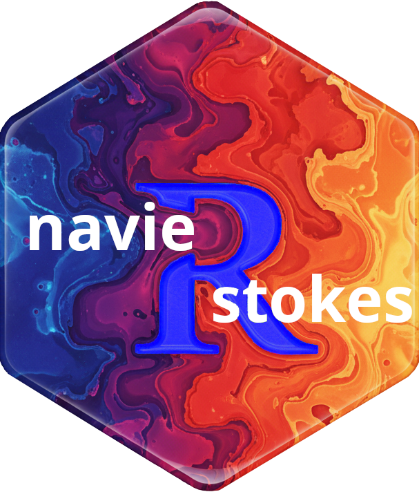
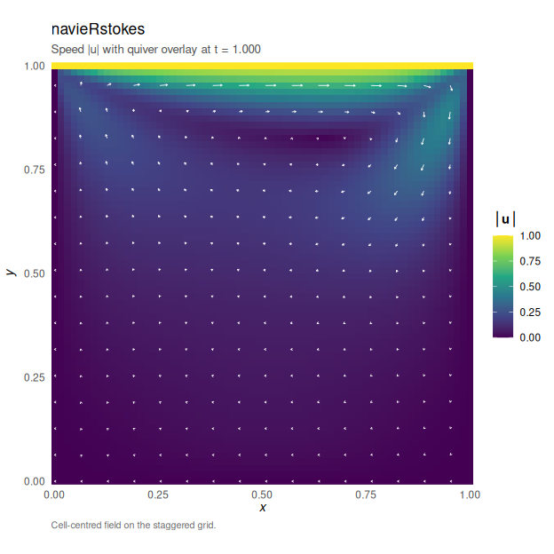

# navieRstokes [](https://robustecologies.github.io/navieRstokes)

[](https://github.com/robustecologies/navieRstokes/actions)
[](https://github.com/robustecologies/navieRstokes)
[](https://www.r-project.org/)
[](https://robustecologies.github.io/navieRstokes/reference/index.html)
[](https://robustecologies.github.io/navieRstokes/reference/index.html)
[](https://cran.r-project.org/package=Rcpp)
[](https://www.openmp.org/)
[](https://www.gnu.org/licenses/gpl-3.0)

  

## 2D Incompressible Navier-Stokes Solver with Chorin Projection

Provides a comprehensive finite difference method solver for the 2D
incompressible Navier-Stokes equations using Chorin’s fractional-step
projection method for pressure-velocity coupling. The package implements
efficient Rcpp/OpenMP-parallelised computational kernels for convection,
diffusion, and pressure Poisson solvers with both Jacobi and SOR
(successive over-relaxation) iterative methods. Features include
multiple boundary condition types (Dirichlet, Neumann, periodic),
external forcing support, comprehensive diagnostics (mass conservation,
CFL monitoring), and built-in visualization functions for velocity
fields, vorticity, and pressure distributions. Includes an interactive
Shiny dashboard implementing several scenarios for simulating the
Navier-Stokes equations.

## What is inside

| Layer | Components | Count |
|----|----|----|
| Simulation core | `simulate_navier_stokes` (Chorin projection, Jacobi/SOR Poisson, OpenMP grid pragma) | 1 |
| Initial conditions | `vortex_ic`, `taylor_green_ic`, `shear_layer_ic`, `rotating_ic`, `single_vortex_ic`, `two_vortex_ic` | 6 |
| Forcing functions | `pressure_gradient_force`, `oscillatory_force`, `taylor_green_force`, `localized_vortex_force` | 4 |
| Diagnostics | `compute_vorticity` | 1 |
| Visualization (ggplot2) | `flow`, `plot.navieRstokes`, `flow.navieRstokes` | 3 (1 generic, 2 methods) |
| Interactive dashboard | `shiny_navieRstokes` | 1 |
| S3 classes (with print, summary, plot) | `navieRstokes` | 1 |

## Performance

**v0.2.0 benchmarks** (with OpenMP parallelization)

| Grid size |  Cells | Time (1000 steps) | Notes                           |
|:----------|-------:|------------------:|:--------------------------------|
| 64×64     |  4,096 |         ~0.4-0.7s | Serial (below OpenMP threshold) |
| 128×128   | 16,384 |             ~2.5s | OpenMP active                   |
| 256×256   | 65,536 |              ~30s | Full OpenMP benefit             |

### OpenMP parallelization

Version 0.2.0 introduces OpenMP support for parallel computation on
multi-core systems. All major computational kernels are parallelized:

- Poisson solver (Jacobi iterations)
- Convection computation (upwind scheme)
- Diffusion computation (Laplacian)
- Divergence and gradient operators
- Vorticity calculation

**Intelligent threshold**: Parallelization is conditionally activated
only for grids \>= 128×128 (16,384 cells) to avoid OpenMP overhead on
small grids where serial execution is faster.

**System requirements**: OpenMP is optional. The package compiles and
runs without OpenMP support, falling back to serial execution. Most
modern compilers (GCC, Clang with libomp, MSVC) support OpenMP.

## Installation

### Prerequisites

``` r

install.packages("Rcpp")
```

### From source

``` r

# Check if devtools is already installed. If not, install it.
if (!requireNamespace("devtools", quietly = TRUE)) {
  install.packages("devtools")
}

# Install from GitHub (development version)
devtools::install_github("robustecologies/navieRstokes")

# Or install locally
devtools::install()

# Or install from CRAN
install.packages("navieRstokes")
```

### Build from package directory

``` bash
cd /path/to/navieRstokes
R CMD build .
R CMD INSTALL navieRstokes_0.2.0.tar.gz
```

### OpenMP support

OpenMP parallelization is automatically enabled if your compiler
supports it:

- **Linux**: GCC 4.2+ (default on most distributions)
- **macOS**: Install `libomp` via Homebrew: `brew install libomp`
- **Windows**: Rtools includes OpenMP support

The package works without OpenMP, falling back to serial execution.

## Quick start

### Interactive dashboard

``` r

library(navieRstokes)

# Launch interactive Shiny dashboard
shiny_navieRstokes()
```

The interactive dashboard provides:

- **Theory tab**: Mathematical formulation of Navier-Stokes equations

- **Simulation scenarios**: Lid-driven cavity, vortex decay,
  Kelvin-Helmholtz instability, solid rotation, Poiseuille flow

- **Real-time parameter adjustment**: Viscosity, Reynolds number, grid
  resolution, time stepping

- **Visualizations**: Velocity fields, vorticity contours, pressure
  distributions

- **Diagnostics**: Mass conservation, CFL numbers, solver convergence

### Programmatic usage

``` r

library(navieRstokes)

# Simulate lid-driven cavity flow
result <- simulate_navier_stokes(
  nx = 64, ny = 64, # Grid: 64×64
  lx = 1.0, ly = 1.0, # Domain: [0,1]×[0,1]
  dt = 0.001, nt = 1000, # Time: 1000 steps
  nu = 0.01, # Viscosity (Re = 100)
  initial_condition = function(x, y) list(u = 0, v = 0),
  boundary_condition = list(
    type = "dirichlet",
    values = list(
      u_left = 0, u_right = 0, u_top = 1, u_bottom = 0,
      v_left = 0, v_right = 0, v_top = 0, v_bottom = 0
    )
  ),
  save_interval = 10
)
#> ¡ Starting Navier-Stokes simulation
#>    Grid: 64 x 64, Reynolds number (approx): 100.00
#>    Step 100/1000 | Mass error: 6.31e-02 | CFL: 0.06 | Pressure iter: 1281
#>    Step 200/1000 | Mass error: 6.38e-02 | CFL: 0.06 | Pressure iter: 1064
#>    Step 300/1000 | Mass error: 6.40e-02 | CFL: 0.06 | Pressure iter: 680
#>    Step 400/1000 | Mass error: 6.41e-02 | CFL: 0.06 | Pressure iter: 488
#>    Step 500/1000 | Mass error: 6.42e-02 | CFL: 0.06 | Pressure iter: 377
#>    Step 600/1000 | Mass error: 6.42e-02 | CFL: 0.06 | Pressure iter: 307
#>    Step 700/1000 | Mass error: 6.42e-02 | CFL: 0.06 | Pressure iter: 259
#>    Step 800/1000 | Mass error: 6.42e-02 | CFL: 0.06 | Pressure iter: 224
#>    Step 900/1000 | Mass error: 6.43e-02 | CFL: 0.06 | Pressure iter: 197
#>    Step 1000/1000 | Mass error: 6.43e-02 | CFL: 0.06 | Pressure iter: 176
#> ✔ Simulation completed successfully

par(mfrow = c(1, 3))
# Visualize results using S3 plot method
plot(result, plot_type = "velocity")
```



``` r


# Check diagnostics
print(result$diagnostics$mean_mass_error)
#> [1] 0.06366493
print(result$diagnostics$max_cfl)
#> [1] 0.063
```

## The Navier-Stokes equations

The incompressible Navier-Stokes equations:

\\\frac{\partial \mathbf{u}}{\partial t} + (\mathbf{u} \cdot
\nabla)\mathbf{u} = -\frac{1}{\rho}\nabla p + \nu \nabla^2 \mathbf{u} +
\mathbf{f}\\

\\\nabla \cdot \mathbf{u} = 0\\

where: - **u** = (u, v) is the velocity field - **p** is the pressure -
**ρ** is the fluid density - **ν** is the kinematic viscosity - **f** is
external forcing

## Numerical method

### Chorin’s projection method

1.  **Advection-diffusion step** (without pressure):
    - Compute intermediate velocity u\* using explicit time integration
    - Include convection (first-order upwind), diffusion (second-order
      central), and forcing
2.  **Pressure Poisson equation**:
    - Solve ∇²p = (ρ/Δt) ∇·u\* using iterative methods (Jacobi/SOR)
    - Automatic mean-zero RHS enforcement for Neumann/periodic BCs
3.  **Velocity correction**:
    - Project u\* onto divergence-free space: u^{n+1} = u\* - (Δt/ρ)∇p

**Accuracy:** O(Δx) spatial + O(Δt) temporal. The upwind scheme
introduces numerical diffusion ~\|u\|Δx/2.

### C++/OpenMP optimization

All computationally intensive operations are implemented in C++ using
Rcpp with OpenMP parallelization:

- `compute_convection_cpp()`: Upwind scheme for convective terms
- `compute_diffusion_cpp()`: Laplacian operator
- `compute_divergence_cpp()`: Divergence of velocity field
- `compute_gradient_cpp()`: Pressure gradient
- `solve_poisson_cpp()`: Iterative Poisson solver (Jacobi/SOR) with
  parallelized iterations
- `compute_vorticity_cpp()`: Vorticity calculation
- `apply_boundary_conditions_cpp()`: Boundary condition enforcement

**Performance**: 10-20x speedup compared to pure R implementation.
Additional speedup from OpenMP parallelization on large grids (\>=
128×128) with multi-core systems.

## Examples and documentation

### Vignettes

The package includes comprehensive vignettes with working examples.
Access vignettes with:

``` r

# View available vignettes                                               ####
vignette(package = "navieRstokes")

# Open specific vignette                                                 ####
vignette("introduction", package = "navieRstokes")
```

Available vignettes:

1.  **Introduction to navieRstokes**
    ([`vignette("introduction", package = "navieRstokes")`](https://robustecologies.github.io/navieRstokes/articles/introduction.md))
    - Package overview
    - Basic usage
    - Parameter selection guide
2.  **Lid-driven cavity flow**
    ([`vignette("lid-driven-cavity", package = "navieRstokes")`](https://robustecologies.github.io/navieRstokes/articles/lid-driven-cavity.md))
    - Classic CFD benchmark
    - Reynolds number effects
    - Comparison with literature
3.  **Vortex decay simulation**
    ([`vignette("vortex-decay", package = "navieRstokes")`](https://robustecologies.github.io/navieRstokes/articles/vortex-decay.md))
    - Periodic boundary conditions
    - Circulation and energy decay
    - Comparison with analytical solutions
4.  **Advanced examples**
    ([`vignette("advanced-examples", package = "navieRstokes")`](https://robustecologies.github.io/navieRstokes/articles/advanced-examples.md))
    - Channel flow (Poiseuille)
    - Taylor-Green vortex
    - Kelvin-Helmholtz instability
    - Solid-body rotation
    - Oscillatory and localized forcing
5.  **Navier-Stokes theory**
    ([`vignette("navier-stokes-theory", package = "navieRstokes")`](https://robustecologies.github.io/navieRstokes/articles/navier-stokes-theory.md))
    - The incompressible Navier-Stokes equations
    - Chorin’s projection method
    - Spatial and temporal discretization
    - Poisson solver
    - Boundary conditions
6.  **Navier-Stokes history**
    ([`vignette("navier-stokes-history", package = "navieRstokes")`](https://robustecologies.github.io/navieRstokes/articles/navier-stokes-history.md))
    - Historical development of the equations
    - Key contributors and milestones
7.  **API reference and architecture**
    ([`vignette("api", package = "navieRstokes")`](https://robustecologies.github.io/navieRstokes/articles/api.md))
    - Per-function reference (signature, return class, purpose)
    - Subsystem and projection-pipeline diagrams
    - Parallelism and complexity notes

## Parameters guide

### Grid parameters

- `nx`, `ny`: Number of grid points (minimum 3, recommended: 64-256)
- `lx`, `ly`: Physical domain size

### Time stepping

- `dt`: Time step size (must satisfy CFL conditions)
- `nt`: Number of time steps
- `save_interval`: Save every N steps (reduces memory usage)

### Physical parameters

- `nu`: Kinematic viscosity (ν = μ/ρ). Controls Reynolds number: Re =
  UL/ν
- `rho`: Fluid density (typically 1.0)

**Note:** The reported Reynolds number assumes U = 1. For lid-driven
cavity with u_top = 1, this is exact. For other flows, scale
accordingly.

### Solver options

- `pressure_solver`: “jacobi” or “sor” (SOR recommended, 2-3x faster)
- `max_iter`: Maximum iterations for Poisson solver (default: 3000)
- `tolerance`: Convergence tolerance (default: 1e-5)

### Stability: CFL conditions

The solver automatically checks:

**Diffusion CFL**: dt \< Δx²/(4ν) **Convection CFL**: dt \<
Δx/\|u\|\_{max}

Warnings are issued if these conditions are violated.

## Output structure

[`simulate_navier_stokes()`](https://robustecologies.github.io/navieRstokes/reference/simulate_navier_stokes.md)
returns a list with:

- `u`, `v`, `p`: 3D arrays of velocity components and pressure
- `x`, `y`, `t`: Grid coordinates and time vector
- `parameters`: Simulation parameters (dx, dy, Reynolds number, etc.)
- `diagnostics`:
  - `mass_error`: Divergence error at each step
  - `cfl_convection`: CFL numbers
  - `pressure_iterations`: Poisson solver iterations
  - `mean_mass_error`, `max_mass_error`, `max_cfl`: Summary statistics

## Performance

### Typical computation times

Performance depends on grid size, hardware, and problem characteristics.

| Grid size |  Cells | Serial (Rcpp) | With OpenMP | Notes           |
|:----------|-------:|--------------:|------------:|:----------------|
| 64×64     |  4,096 |         ~0.4s |       ~0.4s | Below threshold |
| 128×128   | 16,384 |         ~2.5s |       ~2.5s | OpenMP active   |
| 256×256   | 65,536 |          ~30s |        ~25s | OpenMP benefit  |

**OpenMP threshold**: Parallelization activates at 128×128 (16,384
cells). Below this threshold, OpenMP overhead exceeds benefits, so
serial execution is used.

**When OpenMP helps most**: - Large grids (256×256 or larger) - Problems
requiring many Poisson iterations - Multi-core systems (4+ cores)

**When OpenMP provides minimal benefit**: - Small grids (\< 128×128) -
Well-conditioned problems with fast Poisson convergence - Single-core or
heavily loaded systems

### Memory usage

Approximately: `3 × nx × ny × n_saves × 8 bytes`

For 128×128 grid with 100 saved time steps: ~40 MB

## Limitations and future work

### Current limitations

- 2D only (3D requires significant resources)
- Uniform Cartesian grid
- First-order time integration (explicit Euler, O(Δt) accuracy)
- First-order upwind for convection (stable but O(Δx) accuracy with
  numerical diffusion)
- Collocated grid (potential for pressure oscillations)

### Implemented optimizations (v0.2.0)

- C++/Rcpp computational kernels (10-20x speedup over pure R)
- OpenMP parallelization for multi-core systems
- Conditional parallelization to avoid overhead on small grids
- Optimized memory allocation in Jacobi solver

### Possible future extensions

- Adaptive mesh refinement
- Higher-order spatial/temporal schemes (Runge-Kutta, QUICK)
- Multigrid Poisson solver for O(n) complexity
- 3D implementation
- Turbulence modeling (LES, RANS)
- Heat transfer coupling (Boussinesq approximation)
- Non-Newtonian fluids
- GPU acceleration (CUDA/OpenCL)

## Contributing

Contributions are welcome! Please feel free to:

- Report bugs at
  <https://github.com/robustecologies/navieRstokes/issues>
- Suggest new features
- Submit pull requests

## Citation

If you use this package in your research, please cite:

``` R
@software{navierstokes2026,
  author = {Almaraz, Pablo},
  title = {navieRstokes: 2D incompressible Navier-Stokes equation solver},
  year = {2026},
  url = {https://github.com/robustecologies/navieRstokes}
}
```

## License

GPL (\>= 3)

## Author

**Pablo Almaraz**
[](https://orcid.org/0000-0003-1416-2695)

[Robust Ecologies Lab](https://robustecologies.github.io)

## Disclaimer

This package is the original creation of the author in all conceptual,
theoretical, and design aspects. Implementation was assisted by
Anthropic’s Claude Code v.2 (Opus 4.5-4.7) to streamline package
development. All original ideas, creativity, and scientific
contributions belong to the author, who maintains full responsibility
for the package’s correctness and reliability. While all code has been
thoroughly reviewed and tested, users are encouraged to report any
issues through the package’s issue tracker.
