# Climate oscillations: theory, indices and drivers

## Introduction

Earth’s climate system exhibits variability across a wide range of
timescales, from diurnal cycles to millennial oscillations. At
interannual to multidecadal timescales, much of this variability can be
attributed to coupled ocean-atmosphere modes of oscillation that
redistribute heat, moisture, and momentum across the planet
[\[1\]](#ref1). Understanding these oscillations is fundamental for
seasonal forecasting, climate attribution studies, and interpreting
ecological time series.

This vignette provides a comprehensive overview of the 43 climate
oscillation indices included in the **oscillatoRs** package. For each
major oscillation, we describe the physical mechanism, calculation
method, temporal characteristics, teleconnections, and
ecological/societal impacts.

``` r

library(oscillatoRs)
library(ggplot2)
data(climate_monthly)
data(climate_monthly_wide)
data(climate_metadata)
```

## Ocean-atmosphere coupling

The atmosphere and ocean are coupled through exchanges of heat,
moisture, and momentum at the air-sea interface. Sea surface temperature
(SST) anomalies influence atmospheric convection and circulation, while
wind stress anomalies drive ocean currents and upwelling. This
bidirectional coupling gives rise to internal modes of climate
variability that can persist for months to decades [\[2\]](#ref2).

The strength of ocean-atmosphere coupling varies geographically. In the
tropical Pacific, strong coupling arises from the shallow thermocline
and Walker circulation feedback, enabling ENSO. The tropical Atlantic
exhibits moderate coupling with multiple SST modes including the AMO,
TNA, TSA, and Atlantic Nino. Extratropical oceans show weaker coupling
where the ocean integrates atmospheric forcing rather than driving it.
In polar regions, ice-albedo feedback amplifies climate variability.

Most climate oscillation indices capture either SST patterns as direct
measures of ocean thermal state (Nino indices, AMO, PDO); pressure
patterns as measures of atmospheric circulation (NAO, AO, SOI, PNA); or
combined metrics through multivariate indices capturing both components
(MEI, BEST).

## El Nino-Southern Oscillation (ENSO)

ENSO is the dominant mode of interannual climate variability, with
global teleconnections affecting weather patterns, ecosystems, and human
societies worldwide [\[3\]](#ref3). The phenomenon involves coupled
fluctuations in tropical Pacific SST and atmospheric pressure.

### Physical mechanism

The canonical ENSO cycle involves positive feedback between SST, trade
winds, and thermocline depth:

During the El Nino phase, weakening of easterly trade winds reduces
equatorial upwelling, allowing warm water to accumulate in the
central-eastern Pacific. Atmospheric convection shifts eastward, and the
reduced pressure gradient further weakens the trades through the
Bjerknes feedback mechanism.

During the La Nina phase, enhanced easterly trade winds intensify
equatorial upwelling, bringing cold water to the surface in the eastern
Pacific. Convection intensifies over the western Pacific warm pool, and
the increased pressure gradient reinforces strong trades.

The oscillation period is irregular, typically 2-7 years, with events
lasting 9-12 months.

### ENSO indices in oscillatoRs

The package includes 9 ENSO-related indices spanning different aspects
of the phenomenon.

#### Southern Oscillation Index (SOI)

The SOI measures the atmospheric component of ENSO through the sea level
pressure difference between Tahiti and Darwin [\[4\]](#ref4):

\\\text{SOI} = 10 \times \frac{P\_{\text{Tahiti}} - P\_{\text{Darwin}} -
\overline{(P\_{\text{Tahiti}} -
P\_{\text{Darwin}})}}{\sigma\_{P\_{\text{Tahiti}} -
P\_{\text{Darwin}}}}\\

Negative SOI indicates El Nino (weaker pressure gradient); positive
indicates La Nina.

``` r

plot_index(
  climate_monthly,
  "SOI",
  fill_anomaly = TRUE,
  title = "Southern Oscillation Index"
)
```

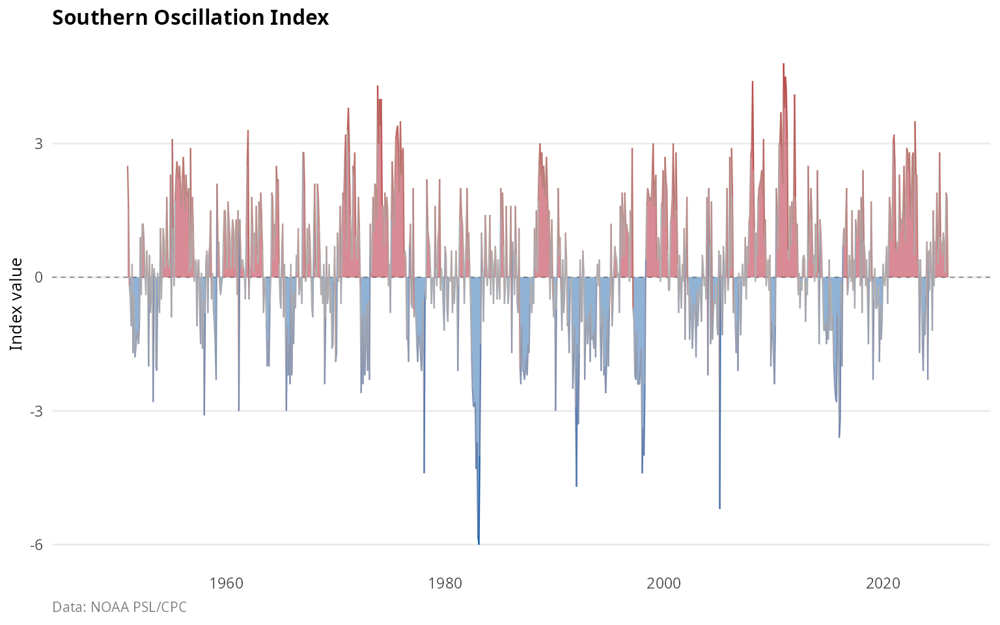

#### Nino SST regions

Four overlapping regions in the equatorial Pacific are monitored for SST
anomalies [\[5\]](#ref5):

| Region   | Coordinates      | Characteristics                   |
|----------|------------------|-----------------------------------|
| Nino 1+2 | 0-10S, 90W-80W   | Far eastern Pacific, coastal      |
| Nino 3   | 5N-5S, 150W-90W  | Eastern Pacific, traditional      |
| Nino 3.4 | 5N-5S, 170-120W  | Central-eastern Pacific, standard |
| Nino 4   | 5N-5S, 160E-150W | Central Pacific, Modoki events    |

``` r

nino_indices <- c("Nino12", "Nino3", "Nino34", "Nino4")
plot_indices(
  climate_monthly,
  indices = nino_indices,
  start_year = 1980,
  title = "Nino SST region anomalies"
)
```

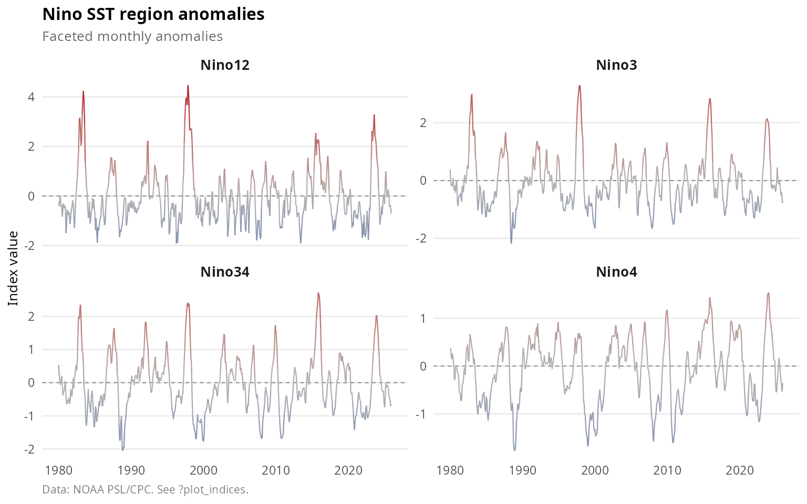

The **Nino 3.4** region is most commonly used because it shows the
strongest atmosphere-ocean coupling and best predicts global
teleconnections.

#### Oceanic Nino Index (ONI)

The ONI is NOAA’s operational ENSO index, defined as the 3-month running
mean of Nino 3.4 SST anomalies [\[6\]](#ref6). El Nino/La Nina episodes
are declared when the ONI exceeds +/- 0.5C for at least 5 consecutive
overlapping 3-month periods.

``` r

plot_index(
  climate_monthly,
  "ONI",
  fill_anomaly = TRUE,
  highlight_extremes = TRUE,
  title = "Oceanic Nino index (operational ENSO monitoring)"
)
```

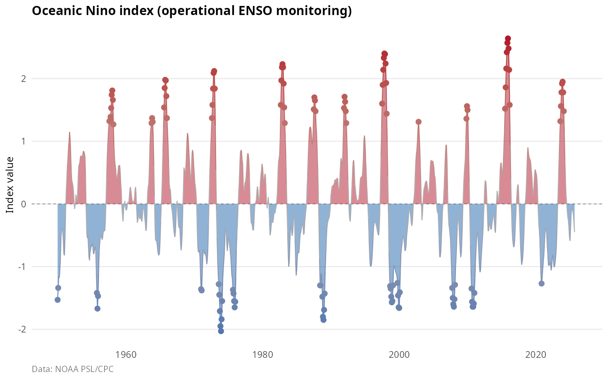

#### Trans-Nino Index (TNI)

The TNI measures the SST gradient across the equatorial Pacific
[\[7\]](#ref7):

\\\text{TNI} = \text{Nino1+2}\_{\text{norm}} -
\text{Nino4}\_{\text{norm}}\\

Positive TNI indicates “canonical” eastern Pacific El Nino; negative TNI
indicates central Pacific (Modoki) El Nino.

#### Bivariate ENSO Timeseries (BEST)

The BEST index combines SOI and Nino 3.4 using singular value
decomposition to reduce measurement noise from either component alone
[\[8\]](#ref8).

#### Multivariate ENSO Index (MEI)

The MEI.v2 is the most comprehensive ENSO index, combining five
variables over the tropical Pacific [\[9\]](#ref9): sea level pressure;
sea surface temperature; surface zonal wind (u-component); surface
meridional wind (v-component); and outgoing longwave radiation as a
proxy for convection.

The MEI is computed as the leading EOF of these combined fields and is
provided on a bimonthly sliding basis (DJ, JF, FM, …, ND).

``` r

data(climate_mei)
if (nrow(climate_mei) > 0) {
  ggplot(climate_mei, aes(x = date, y = value)) +
    geom_col(aes(fill = value), width = 45) +
    scale_fill_anomaly() +
    labs(
      title = "Multivariate ENSO index (MEI v2)",
      subtitle = "Bimonthly values combining 5 atmospheric and oceanic variables",
      x = NULL,
      y = "MEI value"
    ) +
    theme_climate()
}
```

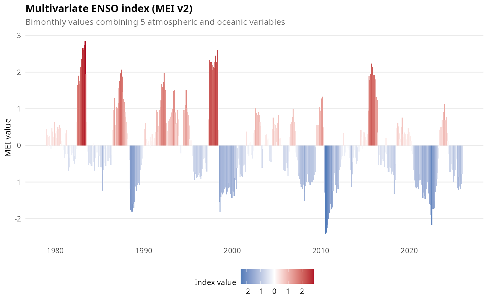

### ENSO teleconnections

ENSO influences global climate through atmospheric teleconnections
[\[10\]](#ref10). El Nino events bring warm and dry conditions to
Australia, Indonesia, and Southeast Asia; drought to southern Africa;
flooding to Peru and Ecuador; warm winters to Canada and the northern
US; increased Atlantic hurricane wind shear resulting in fewer
hurricanes; and enhanced California rainfall.

La Nina events produce enhanced monsoons in Australia and Southeast
Asia; drought in the US Southwest and South America; cold winters in the
northern US; and reduced Atlantic hurricane wind shear leading to more
hurricanes.

## Pacific multidecadal variability

### Pacific Decadal Oscillation (PDO)

The PDO represents the leading pattern of North Pacific SST variability
north of 20N [\[11\]](#ref11). Unlike ENSO, the PDO exhibits persistence
on decadal timescales with “regime shifts” occurring roughly every 20-30
years.

The PDO is calculated as the leading EOF of monthly SST anomalies in the
North Pacific after removing the global mean SST trend. The pattern
shows warm (cool) anomalies in the eastern Pacific; cool (warm)
anomalies in the central North Pacific forming a horseshoe pattern; and
its strongest signal in the Kuroshio-Oyashio extension.

``` r

plot_index(
  climate_monthly,
  "PDO",
  fill_anomaly = TRUE,
  smooth = 0.05,
  title = "Pacific decadal oscillation"
)
```

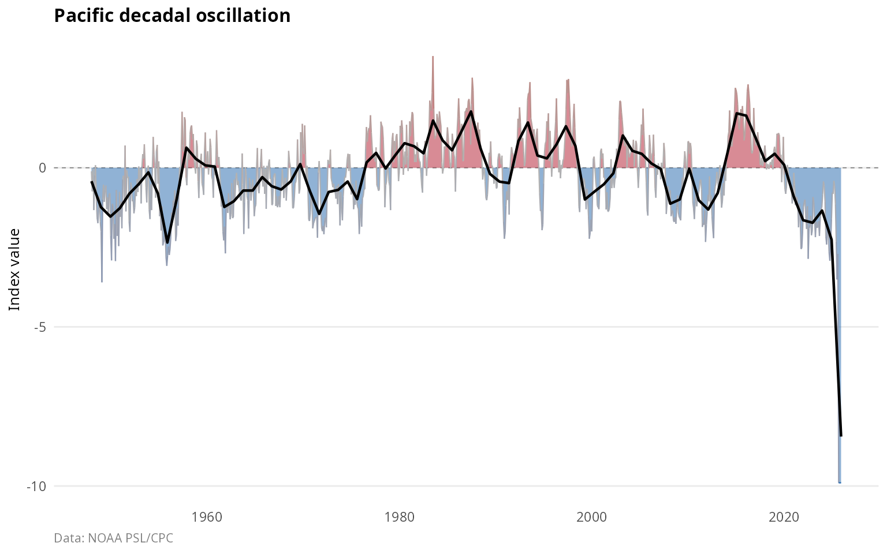

The PDO has exhibited distinct regime shifts over the instrumental
record: a positive phase from 1925 to 1946; a negative phase from 1947
to 1976; a positive phase from 1977 to 1998; a negative phase from 1999
to 2013; and mixed conditions from 2014 to present.

### Interdecadal Pacific Oscillation (IPO)

The IPO is the basin-scale counterpart to the PDO, capturing coherent
SST variability across the entire Pacific [\[12\]](#ref12). The Tripole
Index (TPI) measures the IPO as:

\\\text{TPI} = \text{SSTA}\_{\text{central}} -
\frac{\text{SSTA}\_{\text{NW}} + \text{SSTA}\_{\text{SW}}}{2}\\

Where the regions are: - Central: 10S-10N, 170E-90W - Northwest: 25-45N,
140E-145W - Southwest: 50-15S, 150E-160W

``` r

plot_indices(
  climate_monthly,
  indices = c("PDO", "IPO_TPI"),
  start_year = 1900,
  title = "Pacific multidecadal indices"
)
```

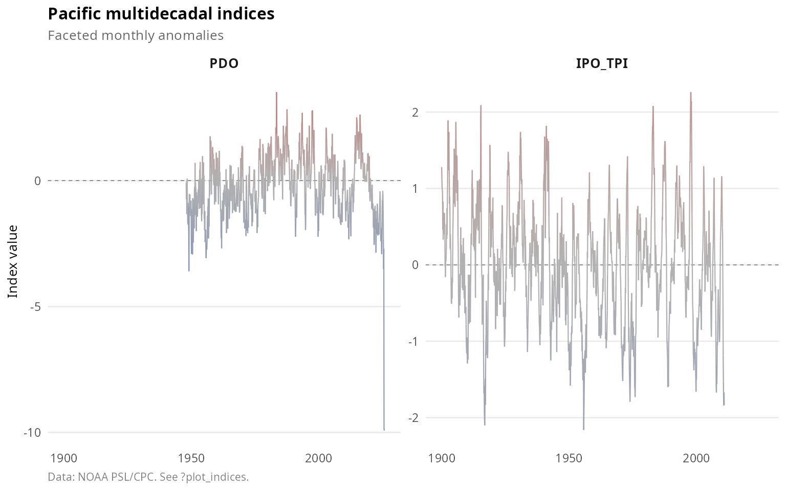

### PDO-ENSO interactions

The PDO modulates ENSO impacts [\[13\]](#ref13). When the PDO and ENSO
are in phase, teleconnections are enhanced; when they are out of phase,
teleconnections are weakened.

## Atlantic variability

### Atlantic Multidecadal Oscillation (AMO)

The AMO represents coherent multidecadal variability in North Atlantic
SST (0-60N) with a period of 60-80 years [\[14\]](#ref14). The index is
computed as the area-weighted average SST anomaly after detrending to
remove anthropogenic warming:

\\\text{AMO} = \overline{\text{SSTA}}\_{\text{North Atlantic}} -
\text{trend}\\

``` r

plot_indices(
  climate_monthly,
  indices = c("AMO_unsmoothed", "AMO_smoothed"),
  start_year = 1856,
  title = "Atlantic multidecadal oscillation"
)
```

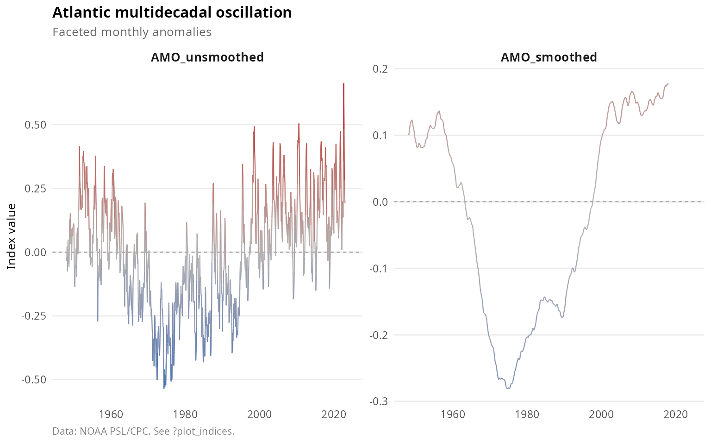

The AMO has oscillated between phases over the historical record:
positive from 1870 to 1900; negative from 1900 to 1925; positive from
1925 to 1965; negative from 1965 to 1995; and positive from 1995 to
present.

The AMO influences Atlantic hurricane activity, with positive phases
associated with more hurricanes; Sahel rainfall, with positive phases
producing wetter conditions; European summer temperatures; and North
American drought patterns.

### Tropical Atlantic indices

#### Tropical Northern Atlantic (TNA)

The TNA measures SST anomalies in the northern tropical Atlantic
(5.5-23.5N, 15-57.5W) [\[15\]](#ref15). It responds to ENSO with a 4-6
month lag through atmospheric bridge mechanisms.

#### Tropical Southern Atlantic (TSA)

The TSA measures SST anomalies in the southern tropical Atlantic (0-20S,
10E-30W). The meridional SST gradient between TNA and TSA influences the
position of the Atlantic ITCZ.

``` r

plot_indices(
  climate_monthly,
  indices = c("TNA", "TSA"),
  start_year = 1950,
  title = "Tropical Atlantic SST indices"
)
```

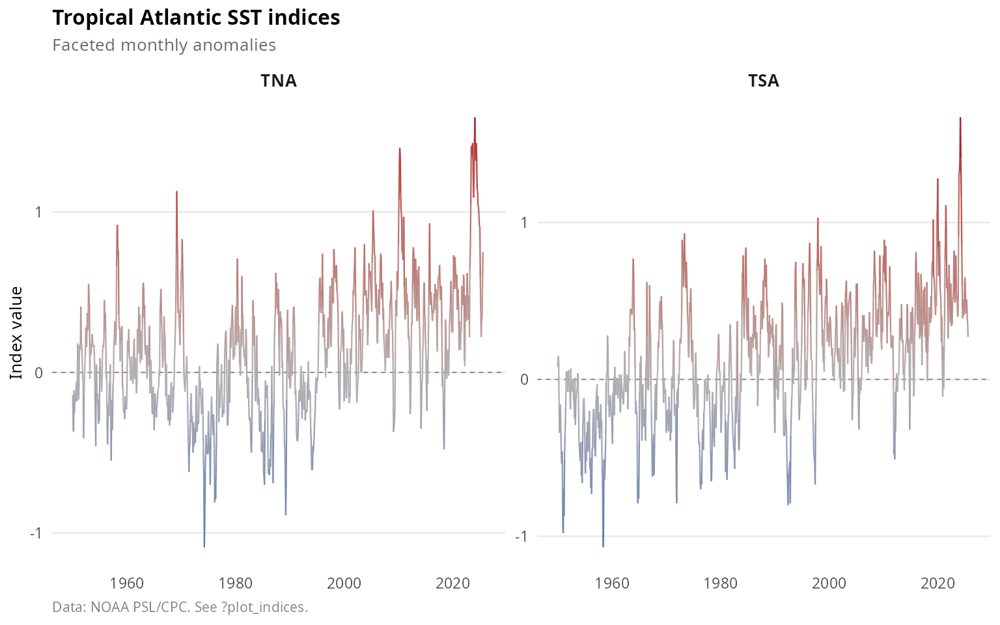

#### Atlantic Tripole

The Atlantic Tripole is the leading EOF of North Atlantic SST showing a
tripole pattern with same-sign anomalies at tropical and subpolar
latitudes and opposite sign in the subtropics [\[16\]](#ref16). This
pattern is primarily forced by NAO-related surface heat fluxes.

#### North Tropical Atlantic (NTA)

The NTA measures SST in the main development region for Atlantic
hurricanes. Warm NTA conditions increase hurricane potential intensity.

#### Caribbean SST (CAR)

The Caribbean index focuses on the Caribbean Sea, a key region for
hurricane intensification and Central American rainfall.

#### Western Hemisphere Warm Pool (WHWP)

The WHWP measures the area of Atlantic and eastern Pacific waters
exceeding 28.5C, which influences tropical cyclone activity and rainfall
across the Americas.

## Polar oscillations

### Arctic Oscillation (AO)

The AO is the leading mode of Northern Hemisphere atmospheric
variability, characterized by opposing pressure anomalies between the
Arctic and mid-latitudes [\[17\]](#ref17). It is calculated as the
leading EOF of sea level pressure poleward of 20N.

During positive AO phases, the polar vortex is strong, the jet stream is
displaced poleward, northern Europe experiences mild and wet winters,
and cold Arctic air remains contained at high latitudes.

During negative AO phases, the polar vortex weakens, the jet stream
becomes wavy with meridional flow, cold air outbreaks occur in
mid-latitudes, and blocking patterns become more common.

``` r

plot_index(
  climate_monthly,
  "AO",
  fill_anomaly = TRUE,
  title = "Arctic Oscillation"
)
```

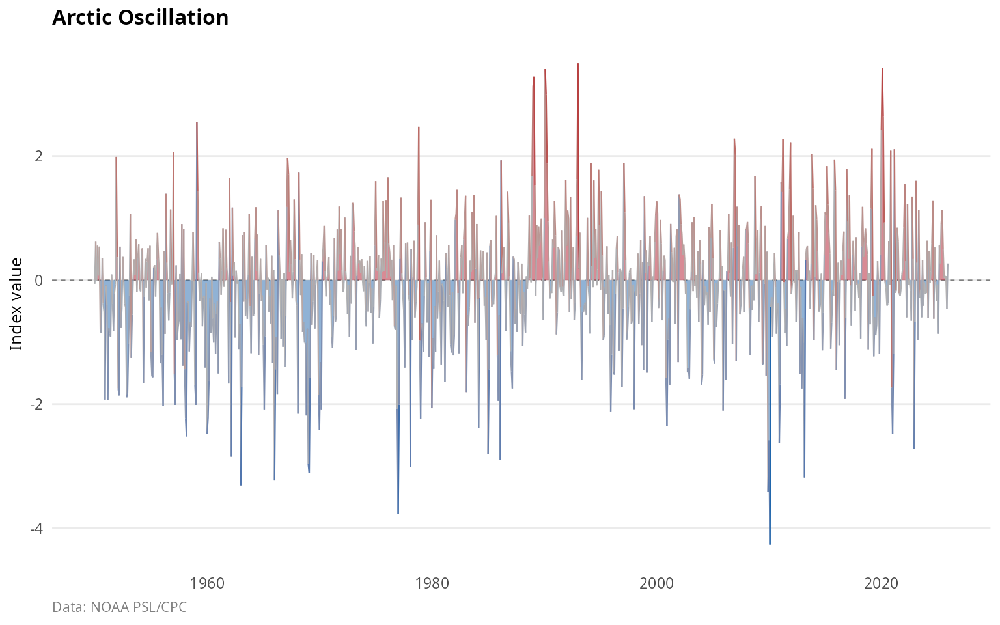

### Antarctic Oscillation (AAO)

The AAO, also called the Southern Annular Mode (SAM), is the leading
mode of Southern Hemisphere extratropical circulation [\[18\]](#ref18).
It is calculated as the leading EOF of 700 hPa geopotential height
poleward of 20S.

The AAO has shown a positive trend since the 1970s, attributed to
stratospheric ozone depletion and greenhouse gas increases
[\[19\]](#ref19).

``` r

plot_index(
  climate_monthly,
  "AAO",
  fill_anomaly = TRUE,
  title = "Antarctic Oscillation (Southern Annular Mode)"
)
```

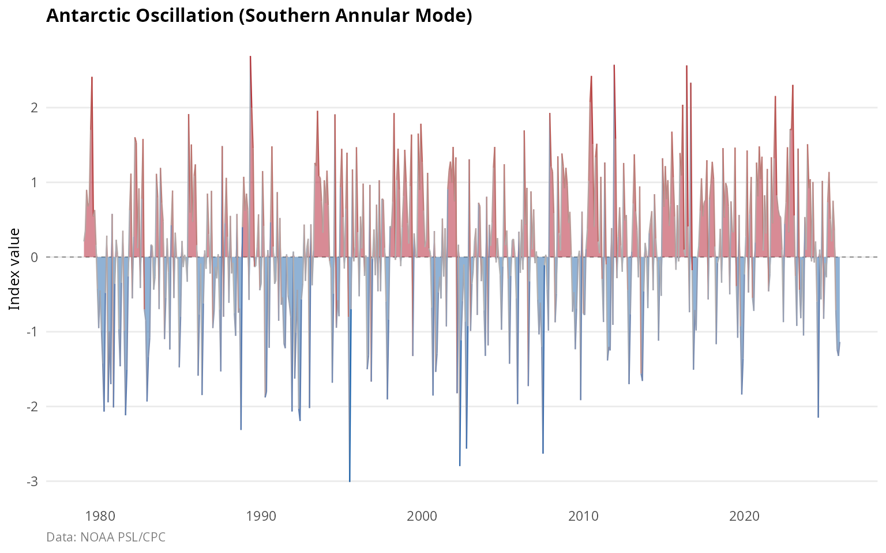

### AO-NAO relationship

The AO and NAO are closely related but not identical [\[20\]](#ref20):

``` r

data(climate_monthly_wide)
if (all(c("AO", "NAO") %in% names(climate_monthly_wide))) {
  recent <- climate_monthly_wide[climate_monthly_wide$date >= "1980-01-01", ]
  r <- cor(recent$AO, recent$NAO, use = "complete.obs")
  cat("AO-NAO correlation (1980-present):", round(r, 3))
}
#> AO-NAO correlation (1980-present): 0.596
```

## Teleconnection patterns

### North Atlantic Oscillation (NAO)

The NAO is the dominant pattern of atmospheric variability over the
North Atlantic, governing weather and climate from eastern North America
to western Europe [\[21\]](#ref21).

The NAO is defined as the pressure difference between the Icelandic Low
and the Azores High. Two versions are commonly used: the CPC NAO, based
on rotated EOF analysis of 500 hPa heights; and the Jones NAO, a
station-based index using Gibraltar and Iceland observations available
since 1821.

``` r

plot_indices(
  climate_monthly,
  indices = c("NAO", "NAO_Jones"),
  start_year = 1900,
  title = "NAO indices comparison"
)
```

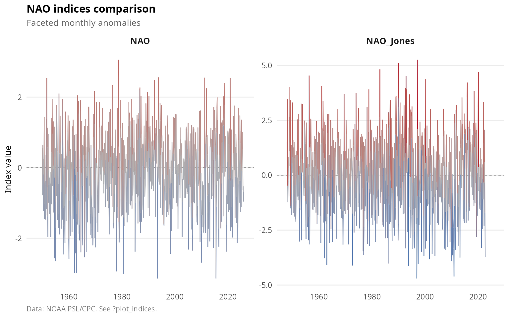

The NAO influences European winter climate, with positive phases
bringing mild and wet conditions to northern Europe; US East Coast
winter storms; Greenland ice sheet mass balance; and North Atlantic
ecosystems and fisheries.

### Pacific North American (PNA)

The PNA pattern is the second leading mode of Northern Hemisphere winter
variability after the AO [\[22\]](#ref22). It consists of four centers
of action: the North Pacific with opposite sign to the tropics; western
Canada with the same sign as the tropics; the Gulf of Alaska with the
same sign as the tropics; and the southeastern US with opposite sign.

Positive PNA phases feature an enhanced ridge over western North
America; warm, dry conditions in the US Northwest; cold, wet conditions
in the Southeast US; and an enhanced Aleutian Low.

``` r

plot_index(
  climate_monthly,
  "PNA",
  fill_anomaly = TRUE,
  title = "Pacific North American pattern"
)
```

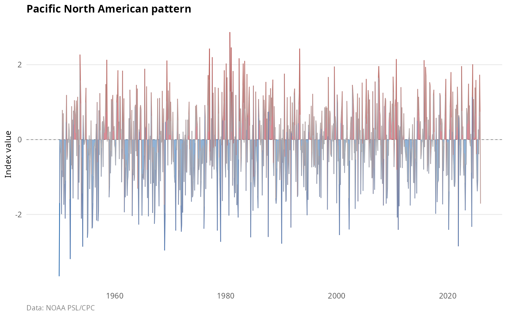

The PNA responds to ENSO forcing: El Nino tends to produce positive PNA,
while La Nina produces negative PNA.

### Western Pacific (WP)

The WP pattern features a north-south dipole of geopotential height
anomalies over the western North Pacific [\[23\]](#ref23). It strongly
influences East Asian climate, including Japanese winter temperatures,
Korean Peninsula precipitation, and the Chinese winter monsoon.

### East Pacific/North Pacific (EP/NP)

The EP/NP pattern is distinct from the PNA, with primary centers over
the Gulf of Alaska and the western subtropical Pacific. It modulates
North Pacific storm tracks.

### East Atlantic/Western Russia (EA/WR)

The EA/WR pattern spans from the North Atlantic to western Eurasia with
four centers of action. It influences European temperature extremes,
Mediterranean precipitation, and western Russian climate.

### North Pacific Index (NP)

The NP index is the area-weighted sea level pressure over 30-65N,
160E-140W [\[24\]](#ref24). Low NP indicates a deeper Aleutian Low,
associated with an enhanced Pacific storm track, warm SST along the
North American coast, and ecosystem regime shifts affecting Pacific
salmon and zooplankton.

### Northern Oscillation Index (NOI)

The NOI measures the pressure anomaly difference between the North
Pacific High and Darwin [\[25\]](#ref25). It captures ENSO-related
extratropical variability and is useful for US West Coast climate
impacts.

## Indian Ocean Dipole (IOD)

### Physical mechanism

The Indian Ocean Dipole is a coupled ocean-atmosphere mode in the
tropical Indian Ocean [\[26\]](#ref26). It involves anomalous SST
gradients between the western (Arabian Sea) and eastern (Indonesia)
Indian Ocean.

The Dipole Mode Index (DMI) is calculated as:

\\\text{DMI} = \text{SSTA}\_{\text{west}} - \text{SSTA}\_{\text{east}}\\

Where: - West: 50-70E, 10S-10N - East: 90-110E, 10S-0

``` r

plot_index(
  climate_monthly,
  "DMI",
  fill_anomaly = TRUE,
  title = "Indian Ocean Dipole Mode Index"
)
```

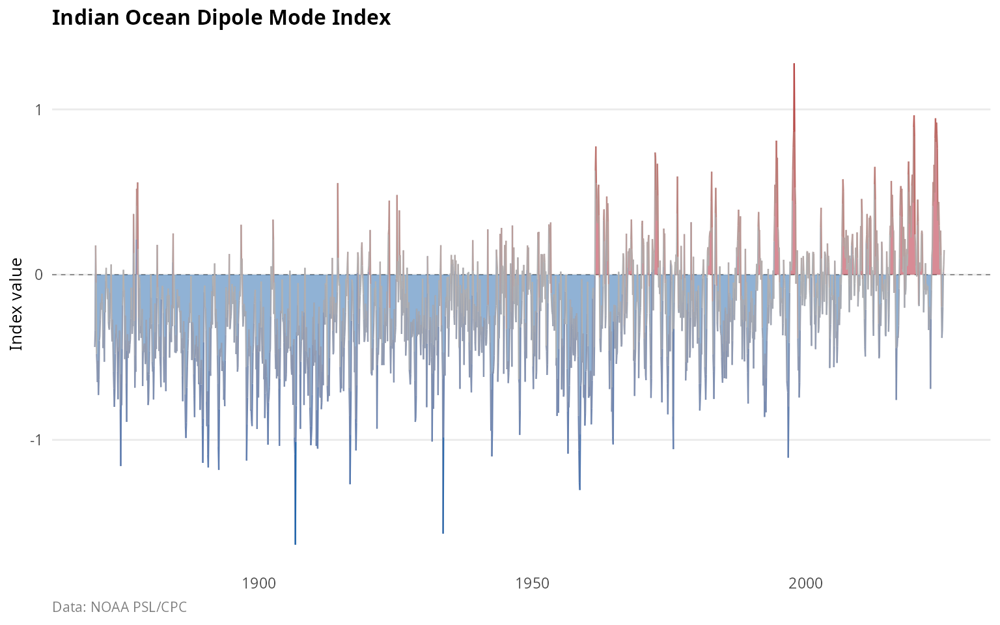

### IOD phases

Positive IOD events feature cool SST near Indonesia due to anomalous
upwelling, warm SST in the western Indian Ocean, drought in Indonesia
and Australia, enhanced rainfall in East Africa, and effects that can
amplify or counteract ENSO.

Negative IOD events feature warm SST near Indonesia, cool western Indian
Ocean temperatures, and above-normal Australian rainfall.

### IOD-ENSO interactions

The IOD can occur independently of ENSO but often develops in
conjunction with El Nino events [\[27\]](#ref27). When El Nino and
positive IOD co-occur, impacts on Australia are amplified (severe
drought).

## Stratospheric dynamics

### Quasi-Biennial Oscillation (QBO)

The QBO is the dominant mode of variability in the equatorial
stratosphere, characterized by alternating easterly and westerly wind
regimes that descend through the stratosphere with a period of
approximately 28 months [\[28\]](#ref28).

The QBO index represents the zonal wind at a specific pressure level
(typically 30 or 50 hPa) over the equator.

``` r

plot_index(
  climate_monthly,
  "QBO",
  fill_anomaly = TRUE,
  title = "Quasi-Biennial Oscillation (30 hPa)"
)
```

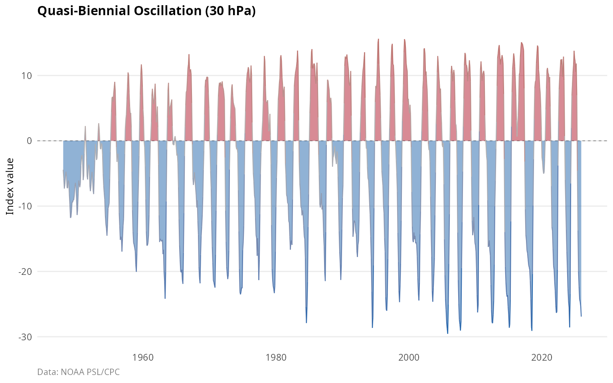

The QBO is generated by upward-propagating tropical waves, with easterly
and westerly phases descending at approximately 1 km per month, and each
phase lasting 12-16 months.

The QBO modulates polar vortex strength; influences Atlantic hurricane
activity, with westerly phases associated with more hurricanes; affects
tropical convection and monsoons; and interacts with the solar cycle.

## Precipitation indices

### Indian monsoon index

The Indian monsoon index measures June-September rainfall over the core
monsoon region of India [\[29\]](#ref29). The monsoon delivers ~80% of
India’s annual rainfall, critical for agriculture.

Monsoon variability is driven by ENSO, with El Nino producing weak
monsoons; the IOD, with positive phases weakening the monsoon; Eurasian
snow cover; and the Atlantic AMO.

### Sahel rainfall index

The Sahel rainfall index measures June-October precipitation over the
Sahel region (10-20N, 20W-10E) [\[30\]](#ref30). This semi-arid region
experienced severe drought in the 1970s-80s.

Sahel rainfall is driven by the AMO, with positive phases producing
wetter conditions; global SST patterns; land surface feedbacks; and
anthropogenic aerosols.

``` r

plot_indices(
  climate_monthly,
  indices = c("Indian_Monsoon", "Sahel_Rainfall"),
  start_year = 1900,
  title = "Precipitation indices"
)
```

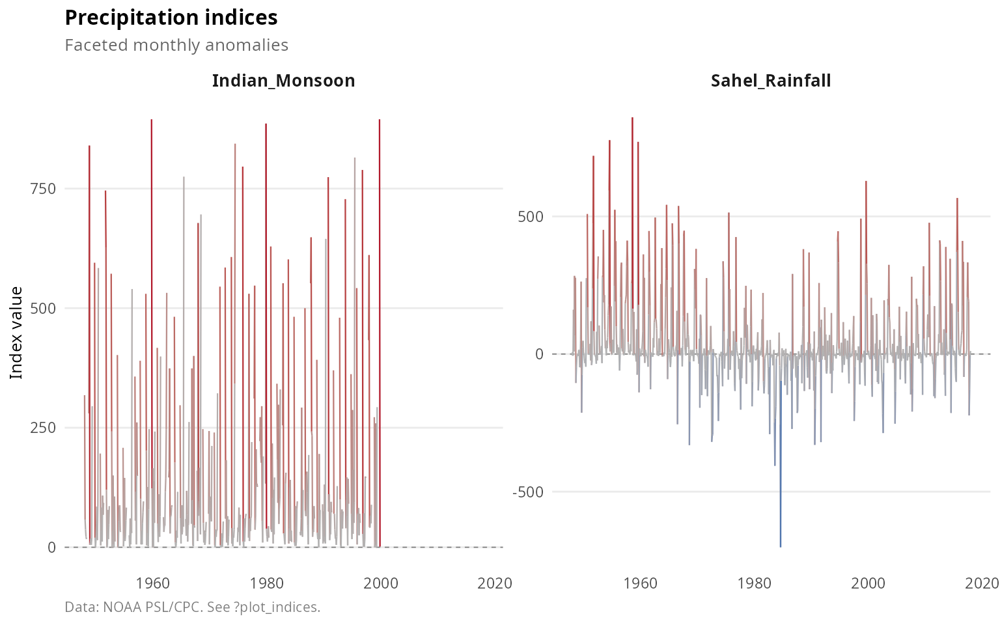

## Other indices

### Solar flux (F10.7)

The F10.7 index measures solar radio emission at 2800 MHz (10.7 cm
wavelength) from Penticton, Canada [\[31\]](#ref31). It serves as a
proxy for solar UV and EUV radiation affecting the upper atmosphere.

The solar cycle, with its 11-year periodicity, influences stratospheric
ozone and temperature, upper atmosphere chemistry, and possible surface
climate effects, though the latter remains debated.

### Global temperature

The global mean surface temperature anomaly combines land and ocean
measurements to track global warming [\[32\]](#ref32). Superimposed on
the long-term warming trend is interannual variability driven by ENSO
and volcanic eruptions.

## Cross-index relationships

Many climate indices are correlated due to shared forcing mechanisms or
teleconnections. Understanding these relationships is essential for
climate attribution and prediction.

``` r

# Select key indices for correlation
key_indices <- c(
  "NAO", "AO", "PNA",           # Teleconnections
  "PDO", "IPO_TPI",             # Pacific multidecadal
  "SOI", "Nino34", "ONI",       # ENSO
  "AMO_unsmoothed", "TNA",      # Atlantic
  "DMI",                         # Indian Ocean
  "QBO"                          # Stratospheric
)

plot_correlation(
  climate_monthly_wide,
  indices = key_indices,
  start_year = 1980,
  title = "Cross-correlations among major climate indices"
)
```

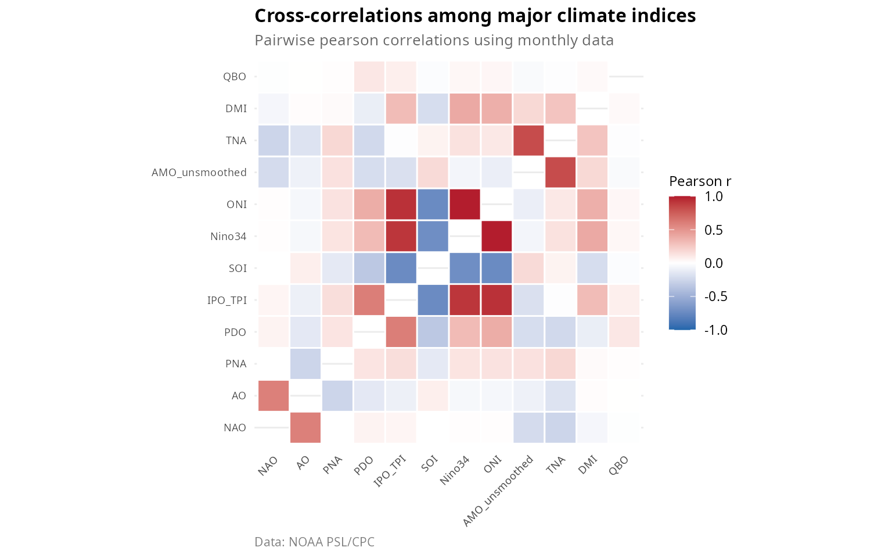

### Notable correlations

Strong positive correlations occur among ENSO indices such as SOI, Nino
regions, and ONI, which measure the same phenomenon; and between AO and
NAO, which represent closely related circulation patterns.

Strong negative correlations exist between SOI and Nino34 by definition,
as they capture opposite phases of ENSO; and between NAO and blocking
events, which have an inverse relationship.

Lagged relationships include ENSO leading TNA by 4-6 months, and ENSO
leading PDO through tropical forcing of extratropical variability.

## Data quality considerations

### Observational changes

Climate indices are derived from observations that have changed over
time [\[33\]](#ref33), including station relocations and instrumentation
changes; the transition from ship to satellite observations; changes in
SST measurement methods such as bucket sampling, engine intake, and
drifting buoys; and reanalysis data inhomogeneities.

### Temporal coverage

Data coverage varies substantially among indices:

``` r

data(climate_summary)
coverage <- climate_summary[, c("index", "start_year", "end_year", "pct_complete")]
coverage <- coverage[order(coverage$start_year), ]
knitr::kable(
  head(coverage, 15),
  caption = "Temporal coverage of climate indices (earliest 15)"
)
```

| index            | start_year | end_year | pct_complete |
|:-----------------|-----------:|---------:|-------------:|
| DMI              |       1870 |     2025 |         99.6 |
| IPO_TPI          |       1870 |     2010 |        100.0 |
| AMO_smoothed     |       1948 |     2023 |         92.2 |
| AMO_unsmoothed   |       1948 |     2023 |         98.8 |
| Atlantic_Tripole |       1948 |     2008 |        100.0 |
| TNA              |       1948 |     2025 |         99.6 |
| TSA              |       1948 |     2025 |         99.6 |
| WHWP             |       1948 |     2025 |         99.6 |
| QBO              |       1948 |     2025 |        100.0 |
| BEST             |       1948 |     2025 |        100.0 |
| Nino12           |       1948 |     2025 |         97.4 |
| Nino3            |       1948 |     2025 |         97.4 |
| Nino34           |       1948 |     2025 |         97.4 |
| Nino4            |       1948 |     2025 |         97.4 |
| SOI              |       1948 |     2025 |         96.2 |

Temporal coverage of climate indices (earliest 15) {.table}

### Recommendations for analysis

For robust multi-index comparisons, use the common period of 1979 to
present, which corresponds to the satellite era. Some indices extend
back to the 1800s, though with greater uncertainty. Missing values
should be handled appropriately rather than simply interpolated.
Consider detrending for analyses where trends are confounding factors.

## Applications

### Ecological time series analysis

Climate indices are widely used to explain ecological variability
[\[34\]](#ref34), including fish recruitment and stock dynamics, seabird
breeding success, terrestrial phenology, and wildfire activity.

### Seasonal forecasting

Many operational seasonal forecasts use climate indices as predictors,
including ENSO-based forecasts with 3-6 month lead times, NAO forecasts
for European winter, and monsoon predictions.

### Climate attribution

Climate indices help attribute observed impacts to specific forcing
mechanisms, distinguishing anthropogenic climate change from natural
internal variability and volcanic or solar forcing.

## Summary

The **oscillatoRs** package provides access to 43 climate oscillation
indices covering the major modes of Earth’s climate variability:

| Category             | Count | Key indices           |
|----------------------|-------|-----------------------|
| ENSO                 | 9     | SOI, Nino34, ONI, MEI |
| Teleconnection       | 8     | NAO, AO, PNA, WP      |
| Pacific multidecadal | 2     | PDO, IPO              |
| Atlantic             | 8     | AMO, TNA, TSA         |
| Polar                | 2     | AO, AAO               |
| Other                | 7+    | DMI, QBO, etc.        |

These indices represent decades of research into climate variability and
provide essential tools for understanding how the climate system
operates on interannual to multidecadal timescales.

## References

**\[1\]** Trenberth, K.E., et al. (1998). Progress during TOGA in
understanding and modeling global teleconnections associated with
tropical sea surface temperatures. *J. Geophys. Res.*, 103(C7),
14291-14324. [doi:10.1029/97JC01444](https://doi.org/10.1029/97JC01444)

**\[2\]** Bjerknes, J. (1969). Atmospheric teleconnections from the
equatorial Pacific. *Mon. Wea. Rev.*, 97(3), 163-172.
[doi:10.1175/1520-0493(1969)097\<0163:ATFTEP\>2.3.CO;2](https://doi.org/10.1175/1520-0493(1969)097%3C0163:ATFTEP%3E2.3.CO;2)

**\[3\]** McPhaden, M.J., Zebiak, S.E., & Glantz, M.H. (2006). ENSO as
an integrating concept in Earth science. *Science*, 314(5806),
1740-1745.
[doi:10.1126/science.1132588](https://doi.org/10.1126/science.1132588)

**\[4\]** Ropelewski, C.F. & Jones, P.D. (1987). An extension of the
Tahiti-Darwin Southern Oscillation Index. *Mon. Wea. Rev.*, 115(9),
2161-2165.
[doi:10.1175/1520-0493(1987)115\<2161:AEOTTS\>2.0.CO;2](https://doi.org/10.1175/1520-0493(1987)115%3C2161:AEOTTS%3E2.0.CO;2)

**\[5\]** Trenberth, K.E. (1997). The definition of El Nino. *Bull.
Amer. Meteor. Soc.*, 78(12), 2771-2778.
[doi:10.1175/1520-0477(1997)078\<2771:TDOENO\>2.0.CO;2](https://doi.org/10.1175/1520-0477(1997)078%3C2771:TDOENO%3E2.0.CO;2)

**\[6\]** Huang, B., et al. (2017). Extended Reconstructed Sea Surface
Temperature, Version 5 (ERSSTv5). *J. Climate*, 30(20), 8179-8205.
[doi:10.1175/JCLI-D-16-0836.1](https://doi.org/10.1175/JCLI-D-16-0836.1)

**\[7\]** Trenberth, K.E. & Stepaniak, D.P. (2001). Indices of El Nino
evolution. *J. Climate*, 14(8), 1697-1701.
[doi:10.1175/1520-0442(2001)014\<1697:LIOENO\>2.0.CO;2](https://doi.org/10.1175/1520-0442(2001)014%3C1697:LIOENO%3E2.0.CO;2)

**\[8\]** Smith, C.A. & Sardeshmukh, P.D. (2000). The effect of ENSO on
the intraseasonal variance of surface temperatures in winter. *Int. J.
Climatol.*, 20(13), 1543-1557.
[doi:10.1002/1097-0088(20001115)20:13\<1543::AID-JOC579\>3.0.CO;2-A](https://doi.org/10.1002/1097-0088(20001115)20:13%3C1543::AID-JOC579%3E3.0.CO;2-A)

**\[9\]** Wolter, K. & Timlin, M.S. (2011). El Nino/Southern Oscillation
behaviour since 1871 as diagnosed in an extended multivariate ENSO index
(MEI.ext). *Int. J. Climatol.*, 31(7), 1074-1087.
[doi:10.1002/joc.2336](https://doi.org/10.1002/joc.2336)

**\[10\]** Alexander, M.A., et al. (2002). The atmospheric bridge: The
influence of ENSO teleconnections on air-sea interaction over the global
oceans. *J. Climate*, 15(16), 2205-2231.
[doi:10.1175/1520-0442(2002)015\<2205:TABTIO\>2.0.CO;2](https://doi.org/10.1175/1520-0442(2002)015%3C2205:TABTIO%3E2.0.CO;2)

**\[11\]** Mantua, N.J., et al. (1997). A Pacific interdecadal climate
oscillation with impacts on salmon production. *Bull. Amer. Meteor.
Soc.*, 78(6), 1069-1079.
[doi:10.1175/1520-0477(1997)078\<1069:APICOW\>2.0.CO;2](https://doi.org/10.1175/1520-0477(1997)078%3C1069:APICOW%3E2.0.CO;2)

**\[12\]** Henley, B.J., et al. (2015). A tripole index for the
Interdecadal Pacific Oscillation. *Climate Dynamics*, 45(11-12),
3077-3090.
[doi:10.1007/s00382-015-2525-1](https://doi.org/10.1007/s00382-015-2525-1)

**\[13\]** Newman, M., et al. (2016). The Pacific Decadal Oscillation,
revisited. *J. Climate*, 29(12), 4399-4427.
[doi:10.1175/JCLI-D-15-0508.1](https://doi.org/10.1175/JCLI-D-15-0508.1)

**\[14\]** Enfield, D.B., Mestas-Nunez, A.M., & Trimble, P.J. (2001).
The Atlantic Multidecadal Oscillation and its relation to rainfall and
river flows in the continental U.S. *Geophys. Res. Lett.*, 28(10),
2077-2080.
[doi:10.1029/2000GL012745](https://doi.org/10.1029/2000GL012745)

**\[15\]** Enfield, D.B. & Mayer, D.A. (1997). Tropical Atlantic sea
surface temperature variability and its relation to El Nino-Southern
Oscillation. *J. Geophys. Res.*, 102(C1), 929-945.
[doi:10.1029/96JC03296](https://doi.org/10.1029/96JC03296)

**\[16\]** Marshall, J., et al. (2001). North Atlantic climate
variability: Phenomena, impacts and mechanisms. *Int. J. Climatol.*,
21(15), 1863-1898.
[doi:10.1002/joc.693](https://doi.org/10.1002/joc.693)

**\[17\]** Thompson, D.W.J. & Wallace, J.M. (1998). The Arctic
Oscillation signature in the wintertime geopotential height and
temperature fields. *Geophys. Res. Lett.*, 25(9), 1297-1300.
[doi:10.1029/98GL00950](https://doi.org/10.1029/98GL00950)

**\[18\]** Thompson, D.W.J. & Wallace, J.M. (2000). Annular modes in the
extratropical circulation. Part I: Month-to-month variability. *J.
Climate*, 13(5), 1000-1016.
[doi:10.1175/1520-0442(2000)013\<1000:AMITEC\>2.0.CO;2](https://doi.org/10.1175/1520-0442(2000)013%3C1000:AMITEC%3E2.0.CO;2)

**\[19\]** Thompson, D.W.J. & Solomon, S. (2002). Interpretation of
recent Southern Hemisphere climate change. *Science*, 296(5569),
895-899.
[doi:10.1126/science.1069270](https://doi.org/10.1126/science.1069270)

**\[20\]** Ambaum, M.H.P., Hoskins, B.J., & Stephenson, D.B. (2001).
Arctic Oscillation or North Atlantic Oscillation? *J. Climate*, 14(16),
3495-3507.
[doi:10.1175/1520-0442(2001)014\<3495:AOONAO\>2.0.CO;2](https://doi.org/10.1175/1520-0442(2001)014%3C3495:AOONAO%3E2.0.CO;2)

**\[21\]** Hurrell, J.W. (1995). Decadal trends in the North Atlantic
Oscillation: Regional temperatures and precipitation. *Science*,
269(5224), 676-679.
[doi:10.1126/science.269.5224.676](https://doi.org/10.1126/science.269.5224.676)

**\[22\]** Wallace, J.M. & Gutzler, D.S. (1981). Teleconnections in the
geopotential height field during the Northern Hemisphere winter. *Mon.
Wea. Rev.*, 109(4), 784-812.
[doi:10.1175/1520-0493(1981)109\<0784:TITGHF\>2.0.CO;2](https://doi.org/10.1175/1520-0493(1981)109%3C0784:TITGHF%3E2.0.CO;2)

**\[23\]** Barnston, A.G. & Livezey, R.E. (1987). Classification,
seasonality and persistence of low-frequency atmospheric circulation
patterns. *Mon. Wea. Rev.*, 115(6), 1083-1126.
[doi:10.1175/1520-0493(1987)115\<1083:CSAPOL\>2.0.CO;2](https://doi.org/10.1175/1520-0493(1987)115%3C1083:CSAPOL%3E2.0.CO;2)

**\[24\]** Trenberth, K.E. & Hurrell, J.W. (1994). Decadal
atmosphere-ocean variations in the Pacific. *Climate Dynamics*, 9(6),
303-319. [doi:10.1007/BF00204745](https://doi.org/10.1007/BF00204745)

**\[25\]** Schwing, F.B., Murphree, T., & Green, P.M. (2002). The
Northern Oscillation Index (NOI): A new climate index for the northeast
Pacific. *Prog. Oceanogr.*, 53(2-4), 115-139.
[doi:10.1016/S0079-6611(02)00027-7](https://doi.org/10.1016/S0079-6611(02)00027-7)

**\[26\]** Saji, N.H., et al. (1999). A dipole mode in the tropical
Indian Ocean. *Nature*, 401(6751), 360-363.
[doi:10.1038/43854](https://doi.org/10.1038/43854)

**\[27\]** Ashok, K., Guan, Z., & Yamagata, T. (2003). Influence of the
Indian Ocean Dipole on the Australian winter rainfall. *Geophys. Res.
Lett.*, 30(15), 1821.
[doi:10.1029/2003GL017926](https://doi.org/10.1029/2003GL017926)

**\[28\]** Baldwin, M.P., et al. (2001). The quasi-biennial oscillation.
*Rev. Geophys.*, 39(2), 179-229.
[doi:10.1029/1999RG000073](https://doi.org/10.1029/1999RG000073)

**\[29\]** Webster, P.J., et al. (1998). Monsoons: Processes,
predictability, and the prospects for prediction. *J. Geophys. Res.*,
103(C7), 14451-14510.
[doi:10.1029/97JC02719](https://doi.org/10.1029/97JC02719)

**\[30\]** Giannini, A., Saravanan, R., & Chang, P. (2003). Oceanic
forcing of Sahel rainfall on interannual to interdecadal time scales.
*Science*, 302(5647), 1027-1030.
[doi:10.1126/science.1089357](https://doi.org/10.1126/science.1089357)

**\[31\]** Tapping, K.F. (2013). The 10.7 cm solar radio flux (F10.7).
*Space Weather*, 11(7), 394-406.
[doi:10.1002/swe.20064](https://doi.org/10.1002/swe.20064)

**\[32\]** Hansen, J., et al. (2010). Global surface temperature change.
*Rev. Geophys.*, 48(4), RG4004.
[doi:10.1029/2010RG000345](https://doi.org/10.1029/2010RG000345)

**\[33\]** Kennedy, J.J. (2014). A review of uncertainty in in situ
measurements and data sets of sea surface temperature. *Rev. Geophys.*,
52(1), 1-32.
[doi:10.1002/2013RG000434](https://doi.org/10.1002/2013RG000434)

**\[34\]** Stenseth, N.C., et al. (2002). Ecological effects of climate
fluctuations. *Science*, 297(5585), 1292-1296.
[doi:10.1126/science.1071281](https://doi.org/10.1126/science.1071281)
