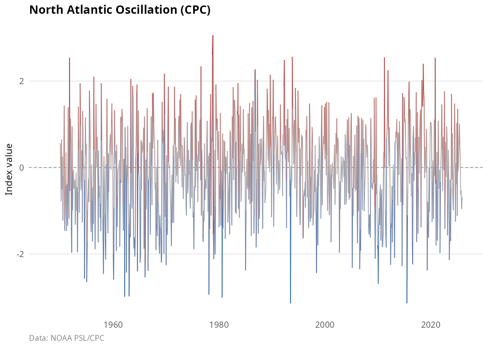
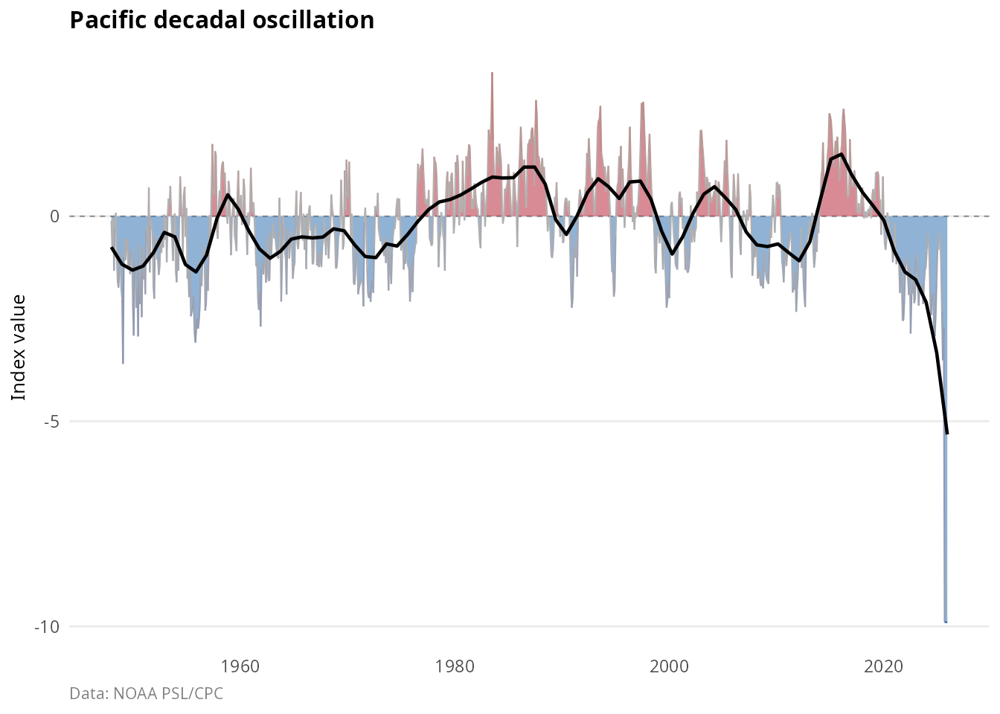
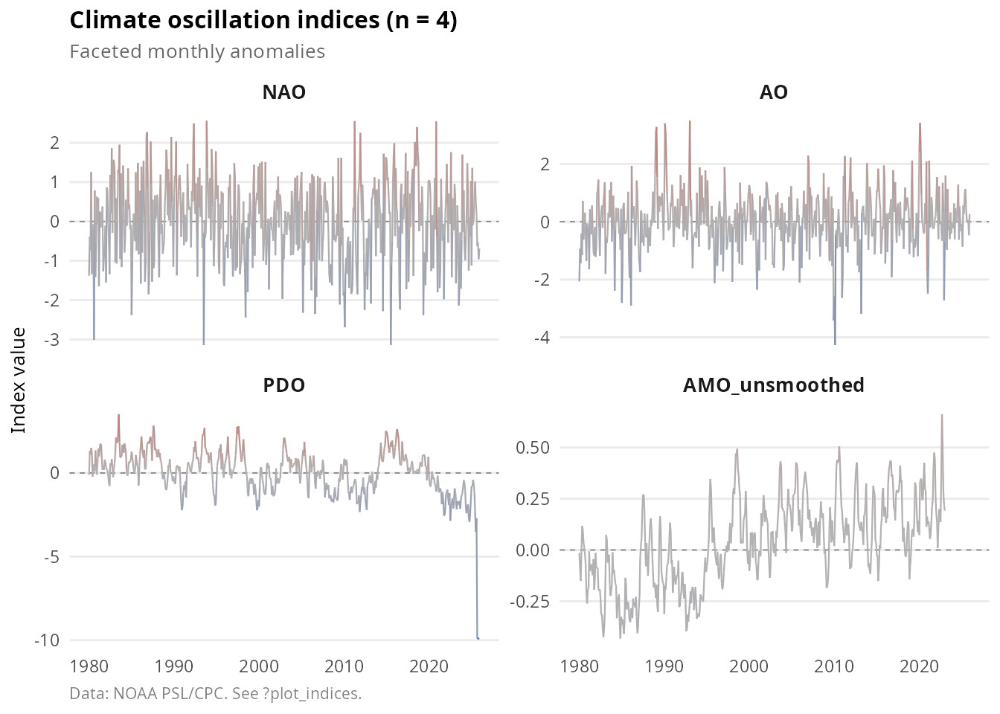
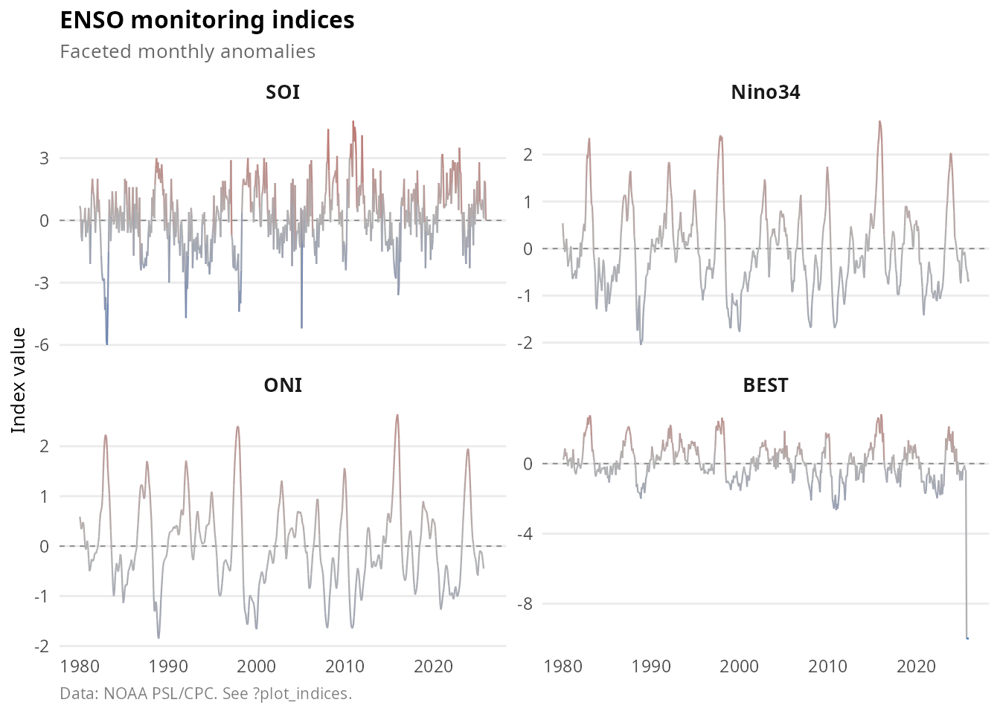
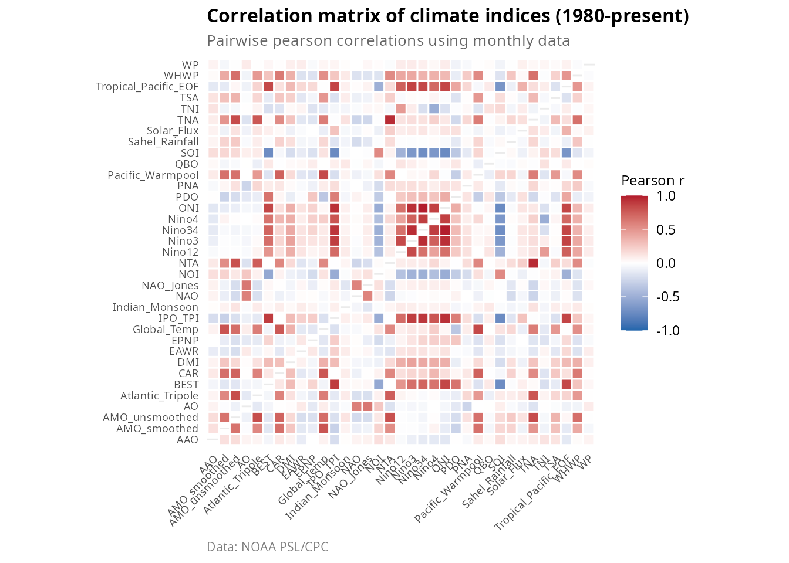
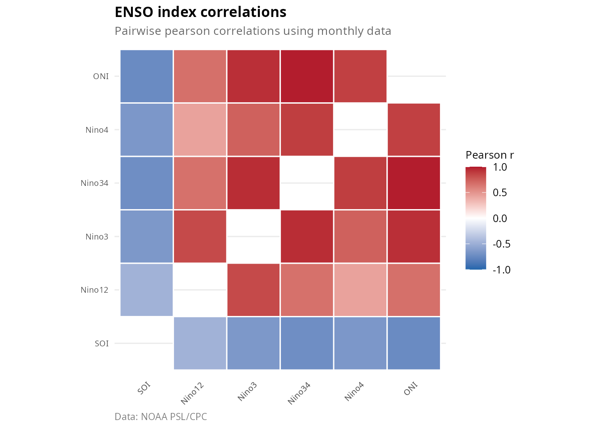
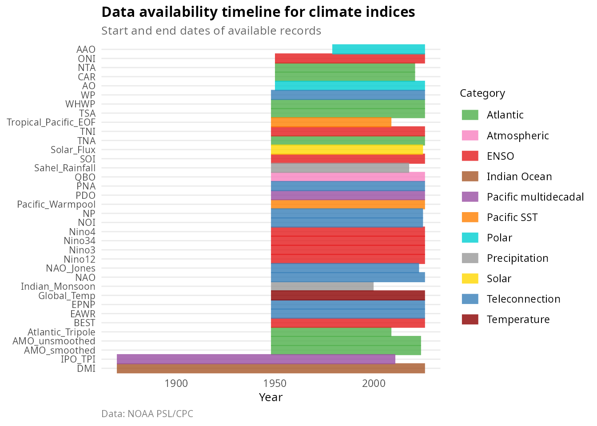
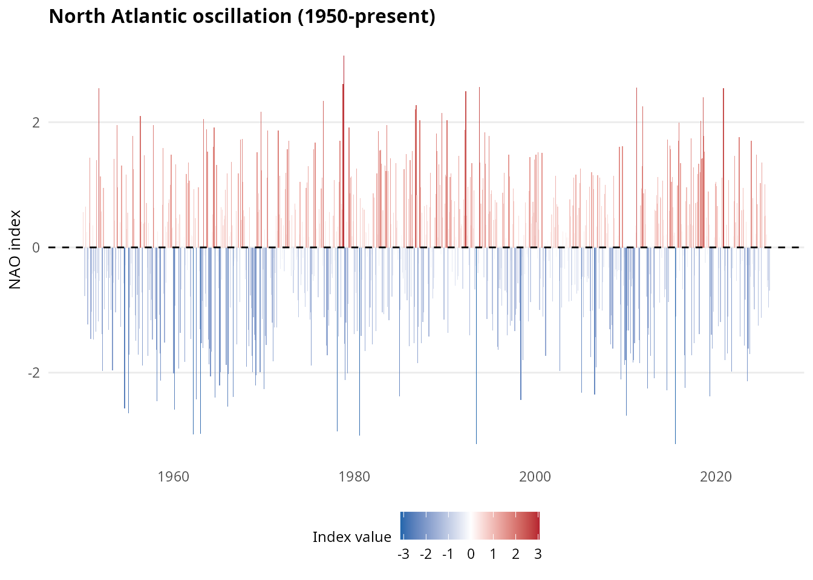

# User guide: accessing and visualizing climate indices

## Introduction

The **oscillatoRs** package provides access to 43 planetary climate
oscillation indices from authoritative sources including NOAA Physical
Sciences Laboratory (PSL) and Climate Prediction Center (CPC). The
package includes pre-bundled datasets covering major climate modes;
functions to download updated data directly from source;
publication-quality visualization tools; and utilities for cross-index
correlation analysis.

## Installation

``` r

# From GitHub (development version)
# install.packages("devtools")
devtools::install_github("robustecologies/oscillatoRs")
```

``` r

library(oscillatoRs)
library(ggplot2)
```

## Quick start

### Loading bundled data

The package includes pre-bundled datasets that can be loaded
immediately:

``` r

# Monthly indices (long format)
data(climate_monthly)

# Check available indices
unique(climate_monthly$index)
#>  [1] "AAO"                  "AMO_smoothed"         "AMO_unsmoothed"      
#>  [4] "AO"                   "Atlantic_Tripole"     "BEST"                
#>  [7] "CAR"                  "DMI"                  "EAWR"                
#> [10] "EPNP"                 "Global_Temp"          "IPO_TPI"             
#> [13] "Indian_Monsoon"       "NAO"                  "NAO_Jones"           
#> [16] "NOI"                  "NP"                   "NTA"                 
#> [19] "Nino12"               "Nino3"                "Nino34"              
#> [22] "Nino4"                "ONI"                  "PDO"                 
#> [25] "PNA"                  "Pacific_Warmpool"     "QBO"                 
#> [28] "SOI"                  "Sahel_Rainfall"       "Solar_Flux"          
#> [31] "TNA"                  "TNI"                  "TSA"                 
#> [34] "Tropical_Pacific_EOF" "WHWP"                 "WP"
```

``` r

knitr::kable(head(climate_monthly), caption = "First rows of climate_monthly")
```

| date | year | month | value | index | description | category | source_url |
|:---|---:|---:|---:|:---|:---|:---|:---|
| 1979-01-01 | 1979 | 1 | 0.209 | AAO | Antarctic Oscillation | Polar | <https://psl.noaa.gov/data/correlation/aao.data> |
| 1979-02-01 | 1979 | 2 | 0.356 | AAO | Antarctic Oscillation | Polar | <https://psl.noaa.gov/data/correlation/aao.data> |
| 1979-03-01 | 1979 | 3 | 0.899 | AAO | Antarctic Oscillation | Polar | <https://psl.noaa.gov/data/correlation/aao.data> |
| 1979-04-01 | 1979 | 4 | 0.678 | AAO | Antarctic Oscillation | Polar | <https://psl.noaa.gov/data/correlation/aao.data> |
| 1979-05-01 | 1979 | 5 | 0.724 | AAO | Antarctic Oscillation | Polar | <https://psl.noaa.gov/data/correlation/aao.data> |
| 1979-06-01 | 1979 | 6 | 1.700 | AAO | Antarctic Oscillation | Polar | <https://psl.noaa.gov/data/correlation/aao.data> |

First rows of climate_monthly {.table}

### Listing available indices

Use
[`list_indices()`](https://robustecologies.github.io/oscillatoRs/reference/list_indices.md)
to see all available indices with their descriptions:

``` r

indices <- list_indices()
knitr::kable(indices[1:15, ], caption = "Sample of available indices")
```

| index | description | category | resolution |
|:---|:---|:---|:---|
| NAO | North Atlantic Oscillation (CPC) | Teleconnection | monthly |
| NAO_Jones | North Atlantic Oscillation (Jones/CRU) | Teleconnection | monthly |
| PNA | Pacific North American Index | Teleconnection | monthly |
| WP | Western Pacific Index | Teleconnection | monthly |
| EPNP | East Pacific/North Pacific Oscillation | Teleconnection | monthly |
| EAWR | Eastern Atlantic/Western Russia | Teleconnection | monthly |
| NP | North Pacific Pattern | Teleconnection | monthly |
| NOI | Northern Oscillation Index | Teleconnection | monthly |
| PDO | Pacific Decadal Oscillation | Pacific multidecadal | monthly |
| IPO_TPI | Tripole Index for Interdecadal Pacific Oscillation | Pacific multidecadal | monthly |
| SOI | Southern Oscillation Index | ENSO | monthly |
| Nino12 | Nino 1+2 SST Anomaly (0-10S, 90W-80W) | ENSO | monthly |
| Nino3 | Nino 3 SST Anomaly (5N-5S, 150W-90W) | ENSO | monthly |
| Nino34 | Nino 3.4 SST Anomaly (5N-5S, 170-120W) | ENSO | monthly |
| Nino4 | Nino 4 SST Anomaly (5N-5S, 160E-150W) | ENSO | monthly |

Sample of available indices {.table}

Filter by category or resolution:

``` r

# ENSO indices only
enso <- list_indices(category = "ENSO")
knitr::kable(enso, caption = "ENSO-related indices")
```

| index  | description                            | category | resolution |
|:-------|:---------------------------------------|:---------|:-----------|
| SOI    | Southern Oscillation Index             | ENSO     | monthly    |
| Nino12 | Nino 1+2 SST Anomaly (0-10S, 90W-80W)  | ENSO     | monthly    |
| Nino3  | Nino 3 SST Anomaly (5N-5S, 150W-90W)   | ENSO     | monthly    |
| Nino34 | Nino 3.4 SST Anomaly (5N-5S, 170-120W) | ENSO     | monthly    |
| Nino4  | Nino 4 SST Anomaly (5N-5S, 160E-150W)  | ENSO     | monthly    |
| ONI    | Oceanic Nino Index                     | ENSO     | monthly    |
| BEST   | Bivariate ENSO Timeseries              | ENSO     | monthly    |
| TNI    | Trans-Nino Index                       | ENSO     | monthly    |
| MEI_v2 | Multivariate ENSO Index v2 (bimonthly) | ENSO     | bimonthly  |

ENSO-related indices {.table}

``` r

# Daily indices
daily <- list_indices(resolution = "daily")
knitr::kable(daily, caption = "Daily indices")
```

| index | description | category | resolution |
|:---|:---|:---|:---|
| NAO_daily | North Atlantic Oscillation (daily, 1950-present) | Teleconnection | daily |
| AO_daily | Arctic Oscillation (daily, 1950-present) | Polar | daily |
| PNA_daily | Pacific North American (daily, 1950-present) | Teleconnection | daily |
| AAO_daily | Antarctic Oscillation (daily, 1979-present) | Polar | daily |

Daily indices {.table}

### Basic plotting

Create time series plots with
[`plot_index()`](https://robustecologies.github.io/oscillatoRs/reference/plot_index.md):

``` r

plot_index(climate_monthly, "NAO")
```



Add smoothing and fill anomalies:

``` r

plot_index(
  climate_monthly,
  "PDO",
  fill_anomaly = TRUE,
  smooth = 0.1,
  title = "Pacific decadal oscillation"
)
```



## Downloading indices

### Single index

Download an individual index directly from its source:

``` r

# Download North Atlantic Oscillation
nao <- get_index("NAO")

# Download with custom timeout
pdo <- get_index("PDO", timeout = 60)
```

### Multiple indices

Download several indices at once:

``` r

# Download specific indices
selected <- get_indices(names = c("NAO", "AO", "PDO"))

# Download all ENSO indices
enso_data <- get_indices(category = "ENSO")

# Get wide format for correlation analysis
enso_wide <- get_indices(category = "ENSO", format = "wide")
```

### Index information

Get detailed metadata about any index:

``` r

info <- get_index_info("Nino34")
cat("Name:", info$name, "\n")
#> Name: Nino34
cat("Description:", info$description, "\n")
#> Description: Nino 3.4 SST Anomaly (5N-5S, 170-120W)
cat("Category:", info$category, "\n")
#> Category: ENSO
cat("Resolution:", info$resolution, "\n")
#> Resolution: monthly
cat("Start year:", info$start_year, "\n")
#> Start year: 1950
```

## Working with data

### Long vs wide format

The bundled data comes in two formats:

**Long format** (`climate_monthly`): One row per observation, ideal for
ggplot2 and dplyr operations.

``` r

data(climate_monthly)
knitr::kable(head(climate_monthly[climate_monthly$index == "NAO", ]))
```

| date | year | month | value | index | description | category | source_url |
|:---|---:|---:|---:|:---|:---|:---|:---|
| 1948-01-01 | 1948 | 1 | NA | NAO | North Atlantic Oscillation (CPC) | Teleconnection | <https://psl.noaa.gov/data/correlation/nao.data> |
| 1948-02-01 | 1948 | 2 | NA | NAO | North Atlantic Oscillation (CPC) | Teleconnection | <https://psl.noaa.gov/data/correlation/nao.data> |
| 1948-03-01 | 1948 | 3 | NA | NAO | North Atlantic Oscillation (CPC) | Teleconnection | <https://psl.noaa.gov/data/correlation/nao.data> |
| 1948-04-01 | 1948 | 4 | NA | NAO | North Atlantic Oscillation (CPC) | Teleconnection | <https://psl.noaa.gov/data/correlation/nao.data> |
| 1948-05-01 | 1948 | 5 | NA | NAO | North Atlantic Oscillation (CPC) | Teleconnection | <https://psl.noaa.gov/data/correlation/nao.data> |
| 1948-06-01 | 1948 | 6 | NA | NAO | North Atlantic Oscillation (CPC) | Teleconnection | <https://psl.noaa.gov/data/correlation/nao.data> |

**Wide format** (`climate_monthly_wide`): One column per index, ideal
for correlation analysis.

``` r

data(climate_monthly_wide)
knitr::kable(head(climate_monthly_wide[, 1:6]))
```

| date       | AAO | AMO_smoothed | AMO_unsmoothed |  AO | Atlantic_Tripole |
|:-----------|----:|-------------:|---------------:|----:|-----------------:|
| 1870-01-01 |  NA |           NA |             NA |  NA |               NA |
| 1870-02-01 |  NA |           NA |             NA |  NA |               NA |
| 1870-03-01 |  NA |           NA |             NA |  NA |               NA |
| 1870-04-01 |  NA |           NA |             NA |  NA |               NA |
| 1870-05-01 |  NA |           NA |             NA |  NA |               NA |
| 1870-06-01 |  NA |           NA |             NA |  NA |               NA |

### Filtering data

Filter by index, category, or time period:

``` r

# Single index
nao <- climate_monthly[climate_monthly$index == "NAO", ]

# Category
enso <- climate_monthly[climate_monthly$category == "ENSO", ]

# Time period
recent <- climate_monthly[climate_monthly$year >= 2000, ]

# Combine filters
nao_recent <- climate_monthly[
  climate_monthly$index == "NAO" & climate_monthly$year >= 1980,
]
```

With dplyr:

``` r

library(dplyr)

nao_recent <- climate_monthly |>
  filter(index == "NAO", year >= 1980)

enso_summary <- climate_monthly |>
  filter(category == "ENSO") |>
  group_by(index) |>
  summarise(
    mean = mean(value, na.rm = TRUE),
    sd = sd(value, na.rm = TRUE),
    n = sum(!is.na(value))
  )
```

### Handling missing values

Check data completeness:

``` r

data(climate_summary)
knitr::kable(
  climate_summary[, c("index", "start_year", "end_year", "pct_complete")][1:10, ],
  caption = "Data completeness by index"
)
```

| index            | start_year | end_year | pct_complete |
|:-----------------|-----------:|---------:|-------------:|
| AMO_smoothed     |       1948 |     2023 |         92.2 |
| AMO_unsmoothed   |       1948 |     2023 |         98.8 |
| Atlantic_Tripole |       1948 |     2008 |        100.0 |
| CAR              |       1950 |     2020 |         98.7 |
| NTA              |       1950 |     2020 |         98.7 |
| TNA              |       1948 |     2025 |         99.6 |
| TSA              |       1948 |     2025 |         99.6 |
| WHWP             |       1948 |     2025 |         99.6 |
| QBO              |       1948 |     2025 |        100.0 |
| BEST             |       1948 |     2025 |        100.0 |

Data completeness by index {.table}

## Visualization

### Multiple indices

Compare indices across time with
[`plot_indices()`](https://robustecologies.github.io/oscillatoRs/reference/plot_indices.md):

``` r

plot_indices(
  climate_monthly,
  indices = c("NAO", "AO", "PDO", "AMO_unsmoothed"),
  start_year = 1980,
  ncol = 2
)
```



### ENSO family comparison

``` r

plot_indices(
  climate_monthly,
  indices = c("SOI", "Nino34", "ONI", "BEST"),
  start_year = 1980,
  title = "ENSO monitoring indices"
)
```



### Correlation matrix

Visualize relationships between indices:

``` r

data(climate_monthly_wide)

# All indices
plot_correlation(climate_monthly_wide, start_year = 1980)
```



Focus on specific indices:

``` r

enso_cols <- c("SOI", "Nino12", "Nino3", "Nino34", "Nino4", "ONI")
plot_correlation(
  climate_monthly_wide,
  indices = enso_cols,
  start_year = 1980,
  title = "ENSO index correlations"
)
```



### Data availability

Show temporal coverage of indices:

``` r

plot_availability(climate_monthly)
```



## Custom visualizations

Build custom plots using the bundled data and theme functions:

``` r

library(ggplot2)

# Filter to NAO
nao <- climate_monthly[climate_monthly$index == "NAO" & climate_monthly$year >= 1950, ]

# Custom plot with anomaly colors
ggplot(nao, aes(x = date, y = value)) +
  geom_col(aes(fill = value), width = 31) +
  scale_fill_anomaly() +
  geom_hline(yintercept = 0, linetype = "dashed") +
  labs(
    title = "North Atlantic oscillation (1950-present)",
    x = NULL,
    y = "NAO index"
  ) +
  theme_climate()
```



### Seasonal analysis

``` r

library(dplyr)

nao_seasonal <- climate_monthly |>
  filter(index == "NAO") |>
  mutate(
    season = case_when(
      month %in% c(12, 1, 2) ~ "Winter",
      month %in% 3:5 ~ "Spring",
      month %in% 6:8 ~ "Summer",
      month %in% 9:11 ~ "Fall"
    )
  ) |>
  group_by(year, season) |>
  summarise(value = mean(value, na.rm = TRUE), .groups = "drop")

ggplot(nao_seasonal, aes(x = year, y = value, color = season)) +
  geom_line() +
  facet_wrap(~season) +
  theme_climate() +
  labs(title = "NAO by season")
```

## Updating bundled data

To update the bundled datasets with the latest available data:

``` r

# Update to a temporary directory
update_indices(path = tempdir())

# Or specify your own path
update_indices(path = "my_data")
```

## Common workflows

### ENSO monitoring

``` r

# Download latest ENSO indices
enso <- get_indices(category = "ENSO", format = "long")

# Plot recent ONI
oni <- enso[enso$index == "ONI" & enso$year >= 2020, ]
plot_index(oni, fill_anomaly = TRUE, title = "Oceanic Nino index (recent)")

# Check current ENSO state
latest <- oni[oni$date == max(oni$date), ]
cat("Latest ONI value:", latest$value, "as of", as.character(latest$date))
```

### Atlantic variability analysis

``` r

atlantic_indices <- c("AMO_unsmoothed", "TNA", "TSA", "NTA", "CAR")
atlantic <- get_indices(names = atlantic_indices, format = "wide")

# Correlation analysis
cor_matrix <- cor(atlantic[, -1], use = "pairwise.complete.obs")
print(round(cor_matrix, 2))
```

### Polar oscillations comparison

``` r

polar <- get_indices(names = c("AO", "AAO", "NAO"))

plot_indices(
  polar,
  start_year = 1979,
  title = "Polar oscillation indices"
)
```

## Data sources and attribution

All data are sourced from:

- **NOAA Physical Sciences Laboratory (PSL)**: <https://psl.noaa.gov/>
- **NOAA Climate Prediction Center (CPC)**:
  <https://www.cpc.ncep.noaa.gov/>

When using this data in publications, please cite the original data
sources and this package.

## References

For detailed descriptions of individual indices and their physical
mechanisms, see the companion vignette:
[`vignette("climate-oscillations-theory", package = "oscillatoRs")`](https://robustecologies.github.io/oscillatoRs/articles/climate-oscillations-theory.md).
