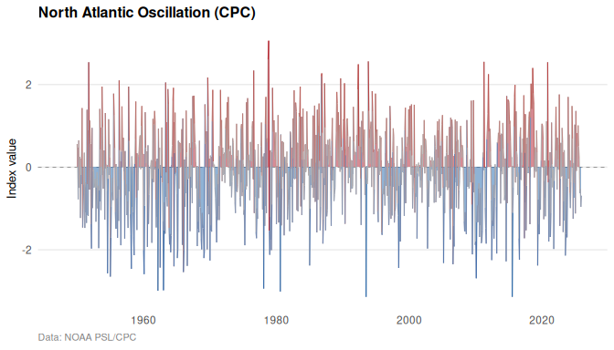
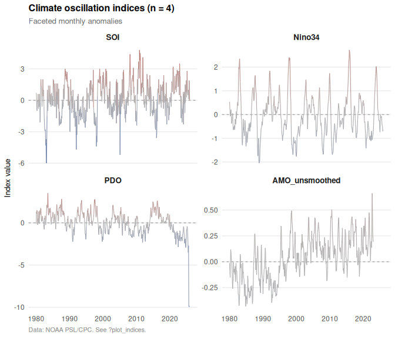
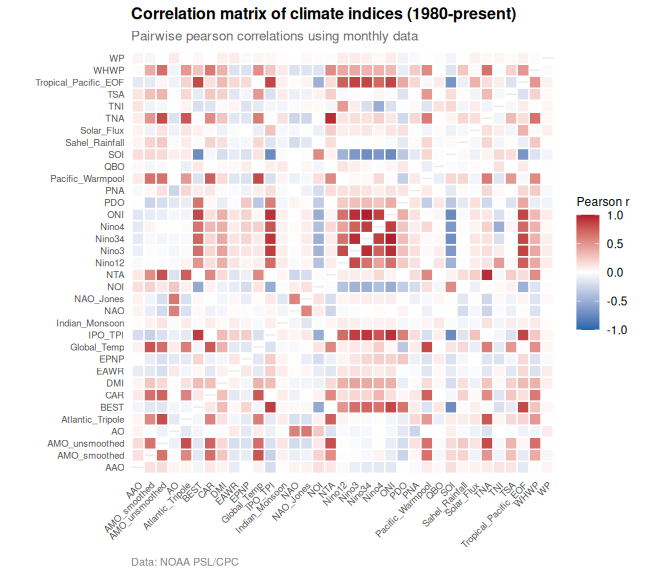

# oscillatoRs [](https://robustecologies.github.io/oscillatoRs)

[](https://github.com/robustecologies/oscillatoRs/actions)
[](https://github.com/robustecologies/oscillatoRs)
[](https://www.r-project.org/)
[](https://robustecologies.github.io/oscillatoRs/reference/index.html)
[](https://robustecologies.github.io/oscillatoRs/reference/list_indices.html)
[](https://www.gnu.org/licenses/gpl-3.0)

## Planetary climate oscillation indices and teleconnections from NOAA PSL and CPC

**oscillatoRs** provides tools to download, process, and visualize 43
planetary climate oscillation indices from authoritative sources
including NOAA Physical Sciences Laboratory (PSL) and Climate Prediction
Center (CPC). The package includes pre-bundled datasets covering major
climate modes: ENSO (SOI, Nino regions, ONI, MEI), Pacific multidecadal
variability (PDO, IPO), Atlantic oscillations (AMO, TNA, TSA), polar
oscillations (AO, AAO, NAO), Indian Ocean Dipole (DMI), stratospheric
dynamics (QBO), and atmospheric teleconnections (PNA, WP, EP/NP).
Provides functions for downloading updated data, creating
publication-quality time series visualizations, and computing
cross-index correlations.

  

## What is inside

| Layer | Components | Count |
|----|----|----|
| Data access | `get_index`, `get_indices`, `update_indices` | 3 |
| Index registry | `list_indices`, `get_index_info` | 2 |
| Visualization | `plot_index`, `plot_indices`, `plot_correlation`, `plot_availability`, `theme_climate`, `category_colors` | 6 |
| ggplot2 integration | `scale_color_anomaly`, `scale_fill_anomaly` | 2 |
| Bundled datasets | `climate_monthly`, `climate_monthly_wide`, `climate_metadata` | 3 |

## Installation

Install the development version from GitHub:

``` r

# install.packages("devtools")
devtools::install_github("robustecologies/oscillatoRs")
```

## Available indices

The package provides 43 climate oscillation indices organized by
category:

| Category             | Indices | Examples                 |
|----------------------|---------|--------------------------|
| ENSO                 | 9       | SOI, Nino34, ONI, MEI v2 |
| Teleconnection       | 8       | NAO, PNA, AO, WP         |
| Pacific multidecadal | 2       | PDO, IPO                 |
| Atlantic             | 8       | AMO, TNA, TSA            |
| Polar                | 2       | AO, AAO                  |
| Indian Ocean         | 1       | DMI                      |
| Atmospheric          | 1       | QBO                      |
| Other                | 5       | Solar flux, Global temp  |
| Daily                | 4       | NAO, AO, PNA, AAO        |

## Quick start

``` r

library(oscillatoRs)
library(ggplot2)
```

### View available indices

``` r

list_indices()
#> # A tibble: 41 × 4
#>    index     description                                        category             resolution
#>    <chr>     <chr>                                              <chr>                <chr>     
#>  1 NAO       North Atlantic Oscillation (CPC)                   Teleconnection       monthly   
#>  2 NAO_Jones North Atlantic Oscillation (Jones/CRU)             Teleconnection       monthly   
#>  3 PNA       Pacific North American Index                       Teleconnection       monthly   
#>  4 WP        Western Pacific Index                              Teleconnection       monthly   
#>  5 EPNP      East Pacific/North Pacific Oscillation             Teleconnection       monthly   
#>  6 EAWR      Eastern Atlantic/Western Russia                    Teleconnection       monthly   
#>  7 NP        North Pacific Pattern                              Teleconnection       monthly   
#>  8 NOI       Northern Oscillation Index                         Teleconnection       monthly   
#>  9 PDO       Pacific Decadal Oscillation                        Pacific multidecadal monthly   
#> 10 IPO_TPI   Tripole Index for Interdecadal Pacific Oscillation Pacific multidecadal monthly   
#> # ℹ 31 more rows
```

### Load bundled data

``` r

data(climate_monthly)
head(climate_monthly)
#> # A tibble: 6 × 8
#>   date        year month value index description           category source_url                                    
#>   <date>     <int> <int> <dbl> <chr> <chr>                 <chr>    <chr>                                         
#> 1 1979-01-01  1979     1 0.209 AAO   Antarctic Oscillation Polar    https://psl.noaa.gov/data/correlation/aao.data
#> 2 1979-02-01  1979     2 0.356 AAO   Antarctic Oscillation Polar    https://psl.noaa.gov/data/correlation/aao.data
#> 3 1979-03-01  1979     3 0.899 AAO   Antarctic Oscillation Polar    https://psl.noaa.gov/data/correlation/aao.data
#> 4 1979-04-01  1979     4 0.678 AAO   Antarctic Oscillation Polar    https://psl.noaa.gov/data/correlation/aao.data
#> 5 1979-05-01  1979     5 0.724 AAO   Antarctic Oscillation Polar    https://psl.noaa.gov/data/correlation/aao.data
#> 6 1979-06-01  1979     6 1.7   AAO   Antarctic Oscillation Polar    https://psl.noaa.gov/data/correlation/aao.data
```

### Plot a single index

``` r

plot_index(climate_monthly, "NAO", fill_anomaly = TRUE)
```



### Compare multiple indices

``` r

plot_indices(
  climate_monthly,
  indices = c("SOI", "Nino34", "PDO", "AMO_unsmoothed"),
  start_year = 1980
)
```



### Download updated data

``` r

# Single index
nao <- get_index("NAO")

# Multiple indices
enso <- get_indices(category = "ENSO")

# All monthly indices in wide format
wide <- get_indices(resolution = "monthly", format = "wide")
```

### Correlation analysis

``` r

data(climate_monthly_wide)
plot_correlation(climate_monthly_wide, start_year = 1980)
```



## Data sources

All data are from authoritative sources:

- **NOAA Physical Sciences Laboratory (PSL)**: <https://psl.noaa.gov/>
- **NOAA Climate Prediction Center (CPC)**:
  <https://www.cpc.ncep.noaa.gov/>

## Documentation

- [`vignette("oscillatoRs-user-guide")`](https://robustecologies.github.io/oscillatoRs/articles/oscillatoRs-user-guide.md):
  Getting started guide
- [`vignette("climate-oscillations-theory")`](https://robustecologies.github.io/oscillatoRs/articles/climate-oscillations-theory.md):
  Comprehensive theory of climate oscillations

## Citation

If you use this package, please cite the original data sources and:

``` R
Almaraz, P. (2025). oscillatoRs: Planetary climate oscillation indices from
NOAA PSL and CPC. R package version 0.1.0.
https://github.com/robustecologies/oscillatoRs
```

## License

GPL (\>= 3)

## Author

**Pablo Almaraz**
[](https://orcid.org/0000-0003-1416-2695)

[Robust Ecologies Lab](https://robustecologies.github.io)

## Disclaimer

This package is the original creation of the author in all conceptual,
theoretical, and design aspects. Implementation was assisted by
Anthropic’s Claude Code v.2 (Opus 4.5) to streamline package
development. All original ideas, creativity, and scientific
contributions belong to the author, who maintains full responsibility
for the package’s correctness and reliability. All the code has been
thoroughly tested, and users are encouraged to report any issues through
the package’s issue tracker.
