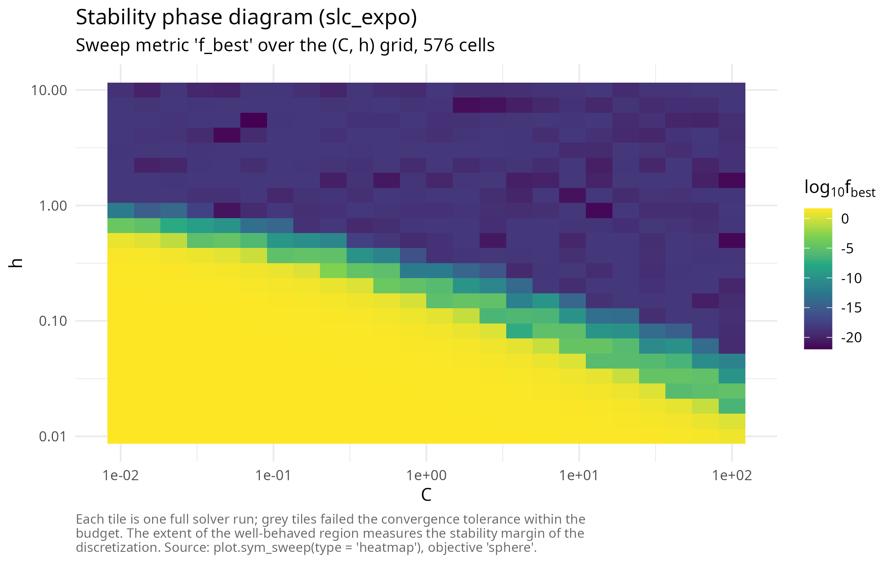
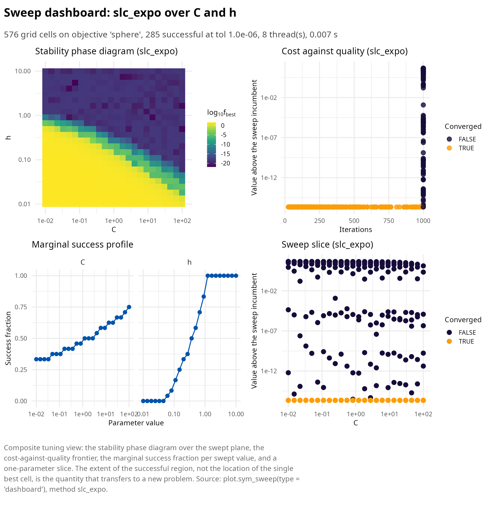

# Bregman dynamics: restarting, temporal looping and the (C, h) plane

This article develops family B of symplectoR: solvers integrating the
time-dependent Bregman Hamiltonian of the variational framework of
accelerated optimization [\[1\]](#ref1), in the fully explicit,
safeguarded form of Duruisseaux and Leok [\[2\]](#ref2), with the
extended-phase-space construction of Betancourt, Jordan and Wilson
[\[3\]](#ref3) available as a diagnostic.

  

## The Bregman Hamiltonian and its two canonical subfamilies

The Euclidean Bregman Hamiltonian is

\\H(q, r, t) = \tfrac12 e^{\alpha_t - \gamma_t} \\r\\^2 + e^{\alpha_t +
\beta_t + \gamma_t} f(q),\\

whose flow, under the ideal scaling conditions \\\dot\beta_t \le
e^{\alpha_t}\\ and \\\dot\gamma_t = e^{\alpha_t}\\, converges at the
rate \\f(q(t)) - f^\* = O(e^{-\beta_t})\\. The polynomial subfamily
(\\\alpha = \log p - \log t\\, \\\beta = p \log t + \log C\\, \\\gamma =
p \log t\\) yields \\O(1/t^p)\\ and contains the continuous limit of
Nesterov’s method at \\p = 2\\, \\C = 1/4\\; the exponential subfamily
yields \\O(e^{-\eta t})\\. Naive explicit discretization of these flows
is provably unstable, and the historical resolution was Nesterov’s
three-sequence scheme; the geometric resolution is symplectic
integration in fictive time on the Poincare-transformed extended phase
space, which is what the `slc_poly` and `slc_expo` kernels implement as
fully explicit symmetric leapfrog compositions costing one gradient per
iteration.

  

## The two safeguards are not optional

The source study’s decisive practical findings both concern failure
modes of the raw integrators, and both fixes ship enabled by default.

Momentum restarting resets the momentum to zero whenever the gradient
opposes the last displacement, \\\nabla f(q)^\top \Delta q \> 0\\. The
package reproduces the dramatic effect on the 10-dimensional Rosenbrock
function: with restarting, `slc_expo` reaches `4.0e-17` in 550
iterations; without it, `3.2e-5` after the full 5000-iteration budget, a
gap of twelve orders of magnitude at fixed cost.

Temporal looping addresses a subtler pathology: the Hamiltonian
coefficients \\e^{\eta t}\\ and \\t^{2p - 1}\\ grow without bound, and
once the gradient has decayed to machine precision the growing
coefficient re-inflates the roundoff floor and expels the iterate from
the minimizer. This is invisible when stopping on a tolerance and fatal
on fixed iteration budgets. The package’s regression test reproduces the
published pathology exactly: on a conditioned quadratic with a
20000-iteration budget, the unguarded run reaches `1e-4` and then
diverges to infinity, while the guarded run (which rolls the time
variable back whenever the instability criterion of the source paper
fires) holds `1.0e-30` at the end of the same budget.

``` r

library(symplectoR)
bm <- sym_benchmark("quadratic", d = 10, kappa = 100, seed = 4)
obj <- sym_objective(bm)
with_loop <- sym_optim(obj, rep(3, 10), method = "slc_expo",
                       control = sym_control("slc_expo", temporal_loop = TRUE,
                                             max_iter = 20000, tol_grad = 0))
without_loop <- sym_optim(obj, rep(3, 10), method = "slc_expo",
                          control = sym_control("slc_expo", temporal_loop = FALSE,
                                                max_iter = 20000, tol_grad = 0))
c(with = with_loop$f_final, without = without_loop$f_final)
#>         with      without 
#> 1.034774e-30          Inf
```

  

## Tuning lives in the (C, h) plane

The source study’s tuning conclusion is a large simplification for
practice: fixing the family order at `p = 6` or `eta = 0.01` costs
little, and the only pair worth tuning is `(C, h)`. Small `C` damps the
oscillatory perturbation of the underlying monotone flow and thereby
admits much larger steps; and the convergent region of the plane is
nearly independent of the problem dimension, so a sweep on a small
analogue transfers to the production problem.
[`sym_sweep()`](https://robustecologies.github.io/symplectoR/reference/sym_sweep.md)
maps the plane in one call, in parallel for compiled objectives.

``` r

co <- sym_compile("return 0.5 * arma::dot(x, x);", "return x;")
objc <- sym_objective(co, dim = 10, name = "sphere")
sw <- sym_sweep(objc, "slc_expo",
                grid = list(C = 10^seq(-2, 2, length.out = 24),
                            h = 10^seq(-2, 1, length.out = 24)),
                x0 = rep(3, 10), n_threads = 8,
                control = sym_control("slc_expo", max_iter = 1000, tol_grad = 1e-9))
plot(sw, type = "heatmap")
```



``` r

summary(sw)
#> ¡ symplectoR sweep (slc_expo over C, h)
#> ⚙ Objective: sphere; grid size 576
#> ✔ Converged: 285; diverged: 0; success at tol 1.0e-06: 285
#> ✔ Incumbent cell: C = 0.07406, h = 5.484 with f = 1.09484e-22 in 181 iterations
#> ⏱ Threads: 8; wall time: 0.007 s
#> ✔ Successful C range: [0.01, 100] over 24 of 24 values
#> ✔ Successful h range: [0.06062, 10] over 18 of 24 values
```

The dashboard adds the three views that turn a phase diagram into a
tuning decision: the cost-against-quality frontier, the marginal success
fraction per swept value, and a one-parameter slice.

``` r

plot(sw, type = "dashboard")
```



  

## The rate-matching scheme and its certificate

For completeness the package ships the p = 2 three-sequence
discretization of [\[1\]](#ref1) as method `"wibisono"`: with
\\\varepsilon = 1/L\\, \\N \> 1\\ and \\C \le 1/(8N)\\ it carries the
explicit certificate \\f(y_k) - f^\* \le \\x_0 - x^\*\\^2 / (\varepsilon
C k (k + 1))\\. The package’s test evaluates the bound at every recorded
iterate of a conditioned quadratic and observes zero violations over
1990 points, with the final gap `6.0e-10` against a bound of `1.6e-2`;
requesting a `C` above the bound triggers a warning rather than silent
degradation. The higher-order members of the family (\\p = 3\\
accelerated cubic-regularized Newton and the uniform-convexity restart
schemes) require Hessians and inner subproblem solves and are
deliberately not implemented in this release; their theory is summarized
in the source paper.

The extended-Hamiltonian monitor (control flag `diagnostics = TRUE`)
integrates the conjugate-energy variable of the Poincare extension
alongside the flow, so that \\H + \mathfrak r\\ is conserved by the
exact extended dynamics and its drift is a per-run step-size health
check, the practical distillate of the extended-phase-space construction
of [\[3\]](#ref3); it costs one extra objective evaluation per iteration
and is off by default.

  

## References

**\[1\]** Wibisono, A., Wilson, A. C., & Jordan, M. I. (2016). A
variational perspective on accelerated methods in optimization.
*Proceedings of the National Academy of Sciences*, 113(47), E7351-E7358.
<https://doi.org/10.1073/pnas.1614734113>

**\[2\]** Duruisseaux, V., & Leok, M. (2023). Practical perspectives on
symplectic accelerated optimization. *Optimization Methods and
Software*, 38(6), 1230-1268.
<https://doi.org/10.1080/10556788.2023.2214837>

**\[3\]** Betancourt, M., Jordan, M. I., & Wilson, A. C. (2018). On
symplectic optimization. *arXiv preprint* arXiv:1802.03653.
<https://doi.org/10.48550/arXiv.1802.03653>
