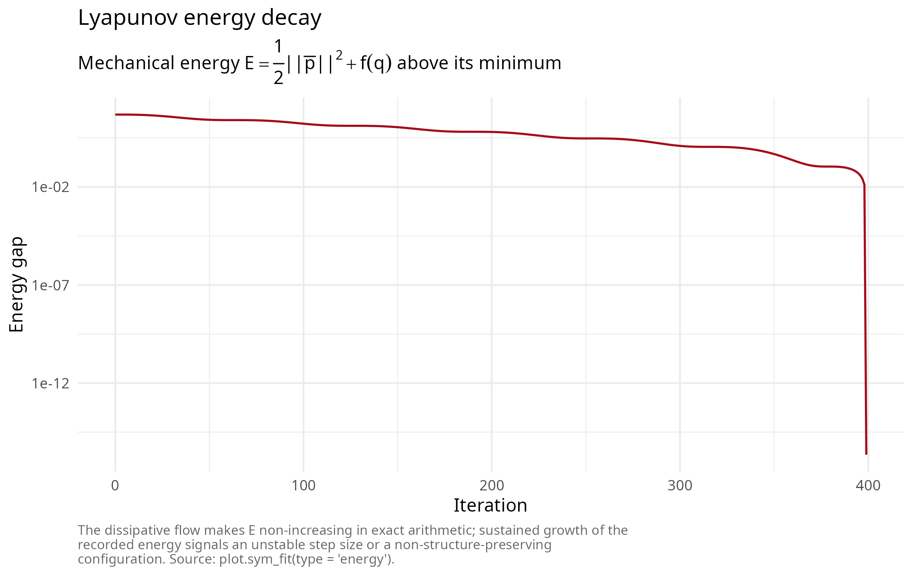
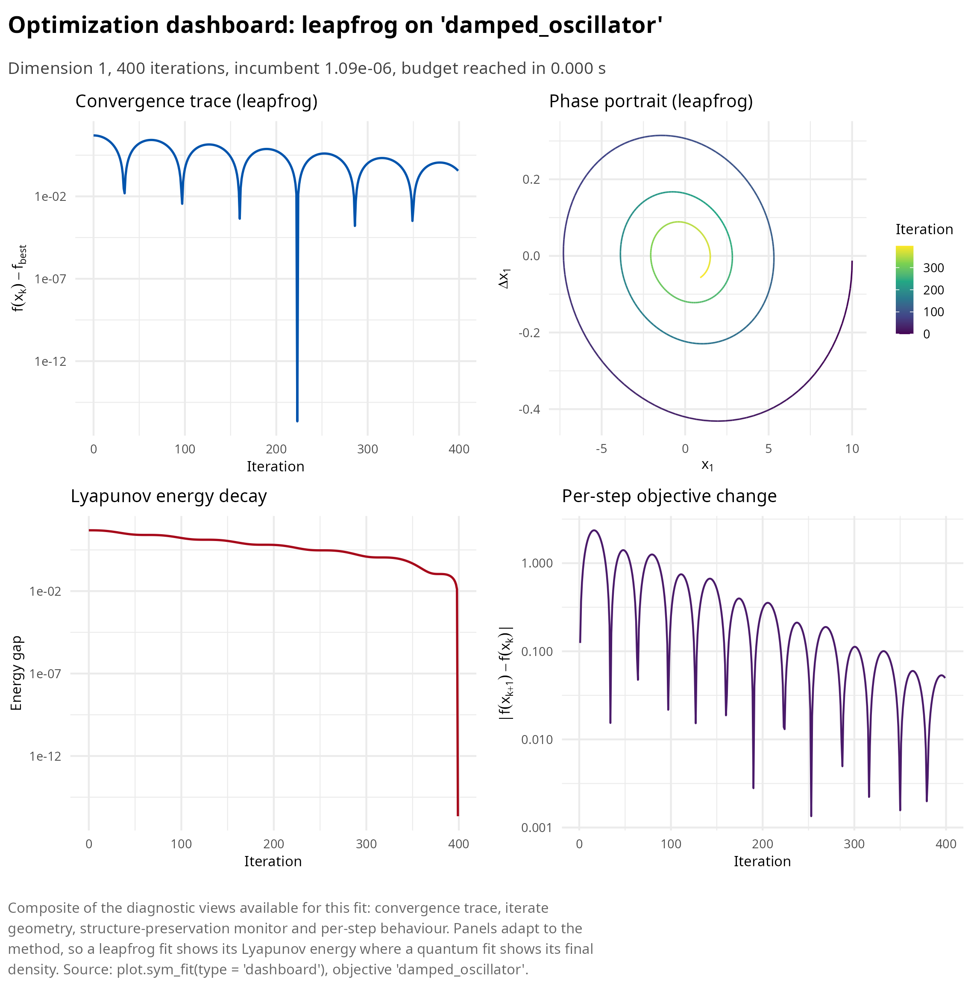

# Conformal symplectic and relativistic optimization

This article develops family A of symplectoR: optimizers that integrate
an autonomous Hamiltonian system with explicit friction, the conformal
symplectic setting of Franca, Sulam, Robinson and Vidal [\[1\]](#ref1)
and the dissipative rate-matching theory of Franca, Jordan and Vidal
[\[2\]](#ref2).

  

## Momentum methods are integrators in disguise

Consider the conformal Hamiltonian system on phase space \\(x, p)\\,

\\\dot x = \nabla_p H(x, p), \qquad \dot p = -\nabla_x H(x, p) - \gamma
p, \qquad H(x, p) = \frac{\\p\\^2}{2 m} + f(x),\\

with damping constant \\\gamma \> 0\\. Along solutions \\\dot H =
-\gamma \\p\\^2 / m \le 0\\, so the objective-plus-kinetic energy is a
Lyapunov function and every orbit relaxes onto critical points of \\f\\.
The flow contracts the symplectic form exactly, \\\omega_t = e^{-\gamma
t} \omega_0\\; a discretization is called conformal symplectic when it
reproduces this contraction rate exactly at every step.

The central classification result is that the classical momentum method
(Polyak’s heavy ball) is precisely the conformal symplectic Euler
discretization of this system, with the identification \\\mu =
e^{-\gamma h}\\ and \\\varepsilon = h^2 / m\\; Nesterov’s accelerated
gradient is an integrator of the same system of the same first order,
but it is not conformal symplectic: it contracts the symplectic form by
the extra Hessian-dependent factor \\I - (h^2 / m) \nabla^2 f +
O(h^3)\\. That spurious anisotropic contraction slightly improves the
contraction rate and simultaneously erodes the stability margin, which
is why Nesterov’s method tolerates smaller step sizes than
structure-preserving alternatives of identical cost.

  

## Relativistic gradient descent

Replacing the kinetic energy by its special-relativistic form \\c
\sqrt{\\p\\^2 + m^2 c^2}\\ normalizes the velocity: \\\\\dot x\\ \< c\\
regardless of how large the momentum grows, a gradient-clipping
mechanism derived rather than bolted on. The resulting relativistic
gradient descent kernel, in the package’s parameterization
\\(\varepsilon, \mu, \delta, \alpha)\\, performs per iteration

\\x\_{k+1/2} = x_k + \frac{\sqrt{\mu}\\ v_k}{\sqrt{\mu \delta
\\v_k\\^2 + 1}}, \quad v\_{k+1/2} = \sqrt{\mu}\\ v_k - \varepsilon
\nabla f(x\_{k+1/2}), \quad x\_{k+1} = \alpha x\_{k+1/2} + (1 - \alpha)
x_k + \frac{v\_{k+1/2}}{\sqrt{\delta \\v\_{k+1/2}\\^2 + 1}}, \quad
v\_{k+1} = \sqrt{\mu}\\ v\_{k+1/2},\\

one gradient per iteration. Setting \\\delta = 0, \alpha = 0\\ recovers
Nesterov exactly; \\\delta = 0, \alpha = 1\\ the second-order-accurate
heavy ball; \\\alpha = 1\\ with any \\\delta\\ is conformal symplectic
and is the recommended default. Each position half-kick is bounded by
\\1 / \sqrt{\delta}\\, so the per-iteration displacement never exceeds
\\2 / \sqrt{\delta}\\; the saturation fraction of this trust region is
reported in the fit diagnostics.

``` r

library(symplectoR)
bm <- sym_benchmark("rosenbrock", d = 10)
fit <- sym_optim(sym_objective(bm), x0 = rep(-2, 10), method = "rgd",
                 control = sym_control("rgd", eps = 0.01, mu = 0.9, delta = 25, max_iter = 2000))
summary(fit)
#> ¡ symplectoR fit (rgd)
#> ⚙ Objective: rosenbrock (dimension 10)
#> ⚠ Best value: 6.49353 after 2000 iterations
#> ⚠ Status: Iteration budget reached
#> ¡ Evaluations: 2001 objective, 2000 gradient
#> ⏱ Wall time: 0.011 s
#> 
#> Incumbent coordinates:
#> ✔   x[1] = 0.963839
#> ✔   x[2] = 0.893264
#> ✔   x[3] = 0.723182
#> ✔   x[4] = 0.454022
#> ✔   x[5] = 0.195886
#> ✔   x[6] = 0.0886004
#> ✔   x[7] = -0.0273712
#> ✔   x[8] = -0.0103166
#> ¡   (and 2 more)
#> ⚠ Final gradient norm: 52
#> ¡ Objective drop over the last 10 recorded iterates: 2.12
#> ⚙ Trust-region bound 1/sqrt(delta) = 0.2, saturated on 9.3% of steps
```

The package’s regression tests verify the exact-equivalence claims
numerically: the relativistic kernel with \\\delta = 0\\ reproduces
hand-coded Nesterov and heavy-ball iterations to below `1e-13` over 100
iterations, and the classical-momentum branch is bit-exact.

  

## Dissipative presymplectic leapfrog

For explicitly time-dependent Hamiltonians \\H = e^{-\eta_1(t)} T +
e^{\eta_2(t)} f\\ the rate-matching theorem of [\[2\]](#ref2) states
that any presymplectic integrator of order \\r\\, obtained by applying a
symplectic integrator on the time-augmented phase space and updating
\\t\\ with the same rule as the positions, reproduces the continuous
convergence rate up to an error \\O(h^r e^{-\eta_2})\\. The package
implements the numerically stabilized leapfrog of their Eq. (C.10): with
the rescaled momentum \\\bar p = e^{-\eta} p\\ only finite differences
of \\\eta\\ enter the exponentials, so the growing factors
\\e^{\eta(t)}\\ never overflow, and with \\\eta_1 = \eta_2\\ the
rescaled momentum is the mechanical momentum, making \\E = \tfrac12
\\\bar p\\^2 + f(q)\\ the recorded Lyapunov energy.

Three damping schedules are available: `"constant"` (\\\eta = \gamma
t\\, heavy-ball-like, the safe choice), `"nesterov"` (\\\eta = \gamma
\log(1 + t)\\, the fast schedule at the edge of the rate-matching
condition), and `"mixed"` (\\\gamma_1 \log(1 + t) + \gamma_2
t^{\delta}\\, the recommended compromise of the source paper).

``` r

bm_osc <- sym_benchmark("damped_oscillator", gamma_damp = 0.2, q0 = 10)
fit_lf <- sym_optim(sym_objective(bm_osc), x0 = 10, method = "leapfrog",
                    control = sym_control("leapfrog", h = 0.05, gamma = 0.2,
                                          damping = "constant", max_iter = 400, tol_grad = 0),
                    keep_path = "full")
plot(fit_lf, type = "energy")
```



The composite view collects every diagnostic this fit carries in one
figure: the convergence trace, the phase portrait of the dissipative
flow, the Lyapunov energy and the per-step objective change.

``` r

plot(fit_lf, type = "dashboard")
```



  

## Validation against closed forms

The damped harmonic oscillator \\\ddot q + \gamma \dot q + q = 0\\ has
the exact solution \\q(t) = q_0 e^{-\gamma t / 2} (\cos(\omega t / 2) +
(\gamma / \omega) \sin(\omega t / 2))\\ with \\\omega = \sqrt{4 -
\gamma^2}\\, and the Nesterov-damped equation \\\ddot q +
\tfrac{\gamma}{t + 1} \dot q + q = 0\\ has a closed form in Bessel
functions of order \\(\gamma \pm 1) / 2\\; both are shipped as
benchmarks with their analytic traces. The package tests integrate both
problems at steps \\h \in \\0.1, 0.05, 0.025\\\\ and observe maximum
trajectory errors falling by the factor 4.00 per halving in both cases
(for the constant schedule: `1.52e-2`, `3.80e-3`, `9.49e-4`), the clean
signature of a second-order method; both closed forms are themselves
verified against a fourth-order Runge-Kutta reference to `1e-10` before
being trusted.

``` r

err_for_h <- function(h) {
  K <- round(10 / h)
  fit <- sym_optim(sym_objective(bm_osc), x0 = 10, method = "leapfrog",
                   control = sym_control("leapfrog", h = h, gamma = 0.2, damping = "constant",
                                         max_iter = K, tol_grad = 0), keep_path = "full")
  max(abs(fit$path[, 1] - vapply(fit$trace_iter * h, bm_osc$analytic, numeric(1))))
}
vapply(c(0.1, 0.05, 0.025), err_for_h, numeric(1))
#> [1] 0.0151985603 0.0037968728 0.0009492864
```

  

## What structure preservation buys, honestly

Across the source papers and the package’s own experiments the
consistent finding is that symplecticity does not improve the asymptotic
convergence rate; it enlarges the stable step-size region (in the
quadratic-programming phase diagram of [\[2\]](#ref2), leapfrog remains
convergent to \\h \approx 0.88\\ where Nesterov fails beyond \\h \approx
0.66\\) and preserves the phase portrait and the stability character of
critical points over exponentially long horizons. Since all methods here
cost one gradient per iteration, the larger admissible step converts
directly into wall-clock advantage. The known weak spot is stochastic
gradients: noise biases the fast symplectic trajectory before averaging
can help, so mini-batch regimes are outside the design envelope of this
release.

  

## References

**\[1\]** Franca, G., Sulam, J., Robinson, D. P., & Vidal, R. (2020).
Conformal symplectic and relativistic optimization. *Advances in Neural
Information Processing Systems*, 33, 16916-16926.
<https://proceedings.neurips.cc/paper/2020/hash/c4b108f53550f1d5967305a9a8140ddd-Abstract.html>

**\[2\]** Franca, G., Jordan, M. I., & Vidal, R. (2021). On dissipative
symplectic integration with applications to gradient-based optimization.
*Journal of Statistical Mechanics: Theory and Experiment*, 2021(4),
043402. <https://doi.org/10.1088/1742-5468/abf5d4>
