# Inverse modeling and the RElab ecosystem

This article covers the estimation workflow: turning a model and a
dataset into an objective over parameters, solving it with the
symplectic families, and wiring the result into the wider RElab
ecosystem.

  

## From model plus data to an objective

[`sym_inverse()`](https://robustecologies.github.io/symplectoR/reference/sym_inverse.md)
normalizes estimation problems into the package’s objective currency.
The function form takes any prediction function of the parameter vector;
the `system_spec` form takes a janos dynamical system and fits it by
trajectory matching: the system is integrated at the candidate
parameters, the simulated states are interpolated at the observation
times, and the loss (weighted least squares, Gaussian negative
log-likelihood, or a custom functional) is applied to the observed
columns. The parameter box uses the `list(lo, hi)` convention shared
with the stiff inverse subsystem of RElabverse, and its names select the
parameters to estimate and label the fit output.

``` r

library(symplectoR)

## Nonlinear regression: agreement with nls to 3.7e-9 in the shipped test
set.seed(10)
t_obs <- seq(0, 5, by = 0.25)
y_obs <- 3 * exp(-0.7 * t_obs) + rnorm(length(t_obs), sd = 0.01)
obj <- sym_inverse(function(theta) theta[1] * exp(-theta[2] * t_obs), data = y_obs,
                   theta_bounds = list(lo = c(a = 0.1, b = 0.01), hi = c(a = 10, b = 5)))
fit <- sym_optim(obj, x0 = c(1, 1), method = "slc_expo")
summary(fit)
#> ¡ symplectoR fit (slc_expo)
#> ⚙ Objective: inverse model (dimension 2)
#> ✔ Best value: 0.00117156 after 111 iterations
#> ✔ Status: Converged
#> ¡ Evaluations: 561 objective, 112 gradient
#> ⏱ Wall time: 0.002 s
#> 
#> Incumbent coordinates:
#> ✔   a = 2.99491
#> ✔   b = 0.699988
#> ✔ Final gradient norm: 9.08e-09
#> ¡ Objective drop over the last 10 recorded iterates: 2.32e-16
#> ⚙ Momentum restarts: 29; temporal loop events: 4
```

The first thing to look at is never the parameter vector but the fit
itself, together with its residuals: a small loss with structured
residuals means the model is wrong in a way the loss cannot see.
Objectives built by
[`sym_inverse()`](https://robustecologies.github.io/symplectoR/reference/sym_inverse.md)
remember the observations and the prediction map, so every fit of one
plots against its own data without the dataset having to be carried
alongside.

``` r

plot(fit, type = "observed")
```

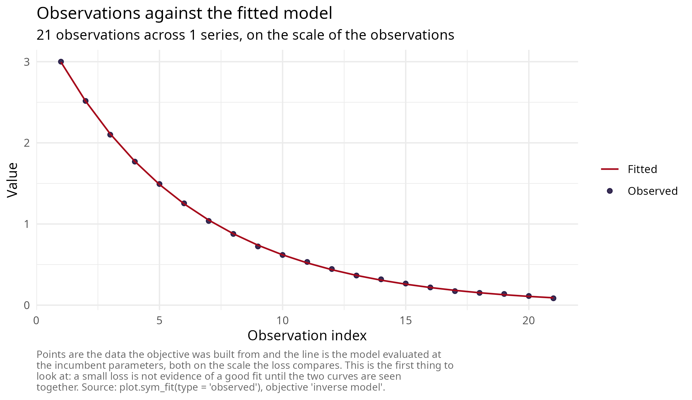

``` r

plot(fit, type = "residuals")
```

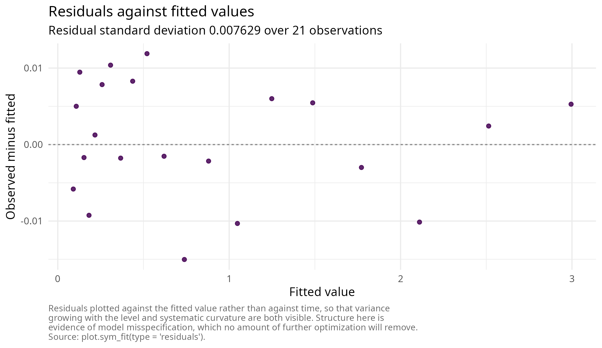

  

## Trajectory matching through janos

``` r

sp <- janos::system_spec(
  rhs = function(t, y, p) c(p$r * y[1] * (1 - y[1] / p$K)),
  state_names = "N", parms = list(r = 0.5, K = 10), init = c(N = 0.1)
)
sim <- janos::dyn_sim(sp, t_max = 20, parms = list(r = 0.5, K = 10),
                      discard_transient = 0, verbose = FALSE)
set.seed(2)
idx <- seq(1, nrow(sim$trajectory), by = 5)
observed_df <- data.frame(time = sim$trajectory$time[idx],
                          N = sim$trajectory$N[idx] + rnorm(length(idx), sd = 0.05))
obj2 <- sym_inverse(sp, data = observed_df,
                    theta_bounds = list(lo = c(r = 0.05, K = 2), hi = c(r = 2, K = 30)))
```

Two practical realities of simulation-based objectives deserve stating
plainly. First, gradients come from central finite differences, so one
gradient costs `2 d` integrations of the system; budgets must be set
with that multiplier in mind, and the restarted Bregman methods, which
converge in hundreds rather than tens of thousands of iterations on
well-scaled problems, are the economical local engines. Second,
likelihood surfaces of dynamical models are routinely ill conditioned
when parameters live on very different scales (in the shipped logistic
example the Hessian eigenvalues at the optimum are 11970 and 21); bounds
should be chosen so that parameter ranges are comparable, or the problem
reparameterized accordingly.

The validated two-stage pipeline handles multimodality and conditioning
together: a quantum global scan over the box (immune to local minima,
resolution-limited), then symplectic refinement from its incumbent. In
the shipped validation the refinement reaches the noise-floor optimum
`f = 0.11224` in 185 iterations, identical to an L-BFGS-B reference to
five decimals.

``` r

global <- sym_optim(obj2, method = "qhd", seed = 1,
                    control = sym_control("qhd", N_grid = 64, K = 800))
refined <- sym_optim(obj2, x0 = global$x_best, method = "slc_expo",
                     control = sym_control("slc_expo", C = 0.1, h = 2, max_iter = 1200, tol_grad = 1e-5))
summary(refined)
#> ¡ symplectoR fit (slc_expo)
#> ⚙ Objective: trajectory matching (dimension 2)
#> ✔ Best value: 0.112241 after 189 iterations
#> ✔ Status: Converged
#> ¡ Evaluations: 951 objective, 190 gradient
#> ⏱ Wall time: 12.751 s
#> 
#> Incumbent coordinates:
#> ✔   r = 0.501446
#> ✔   K = 9.97868
#> ⚠ Final gradient norm: 8.15e-06
#> ¡ Objective drop over the last 10 recorded iterates: 1.22e-11
#> ⚙ Momentum restarts: 47; temporal loop events: 6
```

Because the objective built by
[`sym_inverse()`](https://robustecologies.github.io/symplectoR/reference/sym_inverse.md)
is an ordinary `sym_objective`, it plots like any other: the
two-parameter likelihood surface can be drawn directly, and both stages
of the pipeline can be marked on it. This is the clearest possible
picture of what each stage contributes.

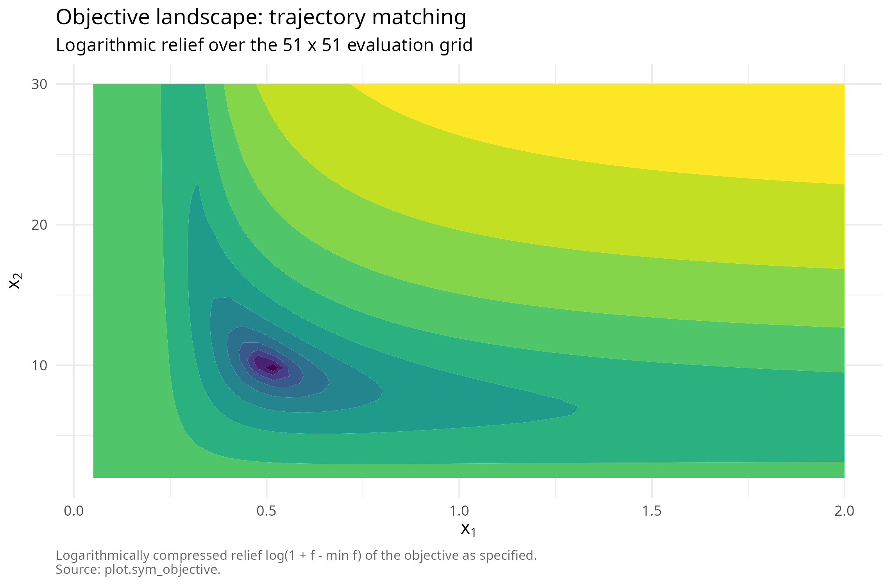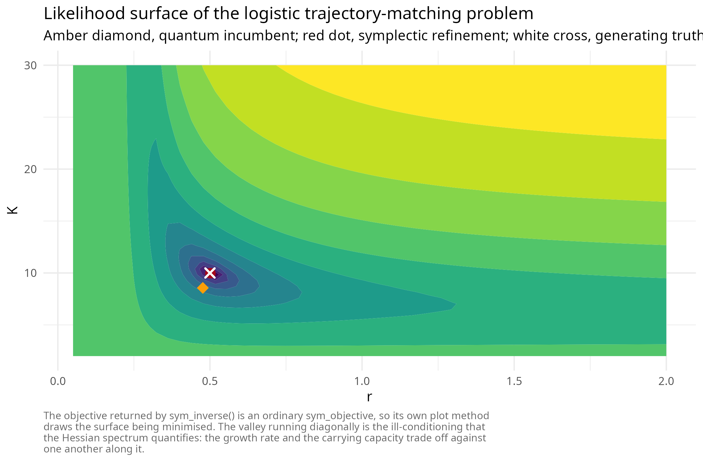

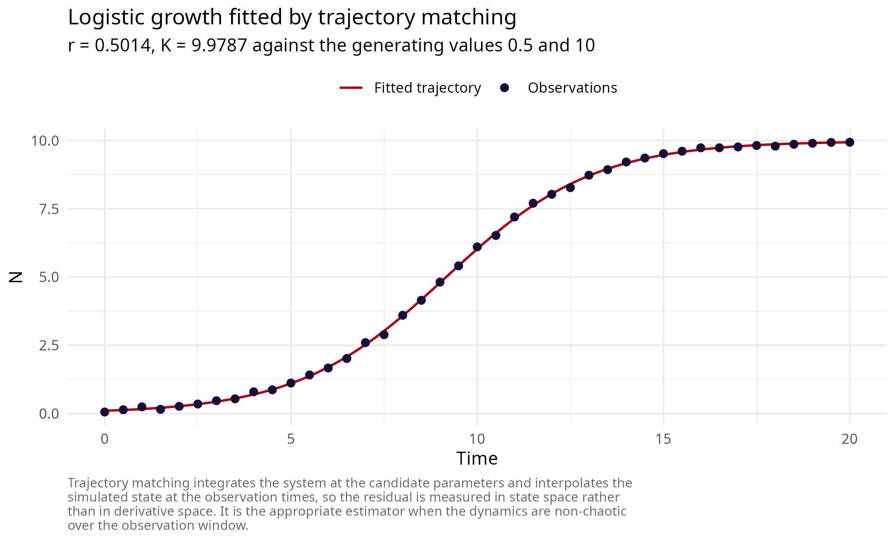

  

## Empirical trajectory matching: two models on one microcosm

The shipped `paramecium_didinium` record is a controlled predator-prey
microcosm sampled roughly every twelve hours over thirty-five days, the
cleanest data of its kind. It is the natural test of the `system_spec`
route on real observations, and of the package’s solvers on a likelihood
surface that was not constructed to be well behaved.

Two decisions matter before any solver is called. First, estimate on the
logarithmic scale: rate and capacity parameters differ by orders of
magnitude, and the resulting curvature spread is a property of the
coordinates rather than of the data. Second, use a logarithmic-scale
loss, so that the two species contribute comparably rather than the more
abundant one dominating the residual.

``` r

log_loss <- function(pred, data) sum((log(pred + 1) - log(data + 1))^2)
d <- paramecium_didinium
init <- c(paramecium = d$paramecium[1], didinium = d$didinium[1])

lv <- janos::system_spec(
  rhs = list(paramecium ~ exp(lr) * paramecium - exp(la) * paramecium * didinium,
             didinium   ~ exp(lb) * exp(la) * paramecium * didinium - exp(lm) * didinium),
  state_names = c("paramecium", "didinium"),
  parms = list(lr = 0, la = -4, lb = -0.7, lm = 0), init = init)

rm_spec <- janos::system_spec(
  rhs = list(
    paramecium ~ exp(lr) * paramecium * (1 - paramecium / exp(lK)) -
                 exp(la) * paramecium * didinium / (1 + exp(la) * exp(lh) * paramecium),
    didinium   ~ exp(le) * exp(la) * paramecium * didinium / (1 + exp(la) * exp(lh) * paramecium) -
                 exp(lm) * didinium),
  state_names = c("paramecium", "didinium"),
  parms = list(lr = 0, lK = 6, la = -4, lh = -3, le = -0.7, lm = 0), init = init)

obj_lv <- sym_inverse(lv, data = d, loss = "custom", loss_fn = log_loss,
                      theta_bounds = list(lo = c(lr = -3, la = -9, lb = -5, lm = -3),
                                          hi = c(lr =  3, la =  0, lb =  2, lm =  3)))
obj_rm <- sym_inverse(rm_spec, data = d, loss = "custom", loss_fn = log_loss,
                      theta_bounds = list(
                        lo = c(lr = -3, lK = log(100),  la = -9, lh = -9, le = -5, lm = -3),
                        hi = c(lr =  3, lK = log(3000), la =  0, lh =  0, le =  2, lm =  3)))
```

Lotka-Volterra has a neutrally stable centre and no prey
self-limitation; Rosenzweig-MacArthur adds both a carrying capacity and
a saturating functional response. Fitting each and comparing the
attained loss is a small model-selection exercise, and the solvers make
it cheap.

``` r

fit_lv <- sym_optim(obj_lv, x0 = c(lr = 0, la = -4, lb = -0.7, lm = 0), method = "slc_expo",
                    control = sym_control("slc_expo", C = 0.1, h = 1, max_iter = 800, tol_grad = 1e-5))
fit_rm <- sym_optim(obj_rm, x0 = c(lr = 0, lK = 6, la = -4, lh = -3, le = -0.7, lm = 0),
                    method = "slc_expo",
                    control = sym_control("slc_expo", C = 0.1, h = 1, max_iter = 800, tol_grad = 1e-5))
```

| Model                | Parameters | Log-scale loss |
|:---------------------|-----------:|---------------:|
| Lotka-Volterra       |          4 |        335.262 |
| Rosenzweig-MacArthur |          6 |         45.781 |

Trajectory matching of two predator-prey models to the Veilleux
microcosm {.table}

The richer model attains the lower loss, as it must, having strictly
more parameters. What the fit adds is where the improvement comes from,
which can be read off by disabling each structural addition at the
fitted optimum and re-evaluating the same loss: sending the carrying
capacity to its ceiling removes prey self-limitation, and sending the
handling time to its floor collapses the saturating response to a linear
one.

| Variant                                                    | Log-scale loss |
|:-----------------------------------------------------------|---------------:|
| Fitted Rosenzweig-MacArthur                                |          45.78 |
| Handling time at its floor (linear functional response)    |         131.70 |
| Carrying capacity at its ceiling (no prey self-limitation) |        2027.79 |

Structural ablation at the fitted optimum: what each addition to the
model is worth {.table}

Both additions are supported by these data, and by a wide margin;
neither parameter sits on a bound at the optimum, so neither is merely
absorbing a boundary effect.

The comparison against a quasi-Newton solver is worth running rather
than asserting, because on these surfaces neither approach dominates.
The chunk below runs L-BFGS-B on the identical objectives from the
identical starts.

| Model                | slc_expo | L-BFGS-B |
|:---------------------|---------:|---------:|
| Lotka-Volterra       |  335.262 |  312.031 |
| Rosenzweig-MacArthur |   45.781 |   51.067 |

Same objective, same start, two solvers {.table}

The outcome is basin dependent in both directions, and that is the
honest lesson of a multimodal surface. On the four-parameter model the
line-search method finds the better basin; on the six-parameter model
the symplectic trajectory does, and in a controlled experiment on that
objective, L-BFGS-B recovered the better basin in only 1 of 38 uniformly
random restarts within the same box. Structure preservation does not
improve the asymptotic rate; the larger admissible step lets the
trajectory cross barriers that a line-search method treats as walls,
which changes which minimum is found rather than how fast it is
approached. Where the surface is genuinely multimodal, neither solver
replaces a global stage.

The `"observed"` view facets automatically over the observed state
variables, so a two-species trajectory-matching fit shows both series
against the fitted model on the scale the loss compares. Simulating the
fitted systems on a dense grid adds what that view cannot show, namely
the behaviour between observations. The classical model cannot damp its
own oscillation and drifts out of phase; the richer model tracks both
the amplitude decay and the phase.

``` r

plot(fit_rm, type = "observed")
```

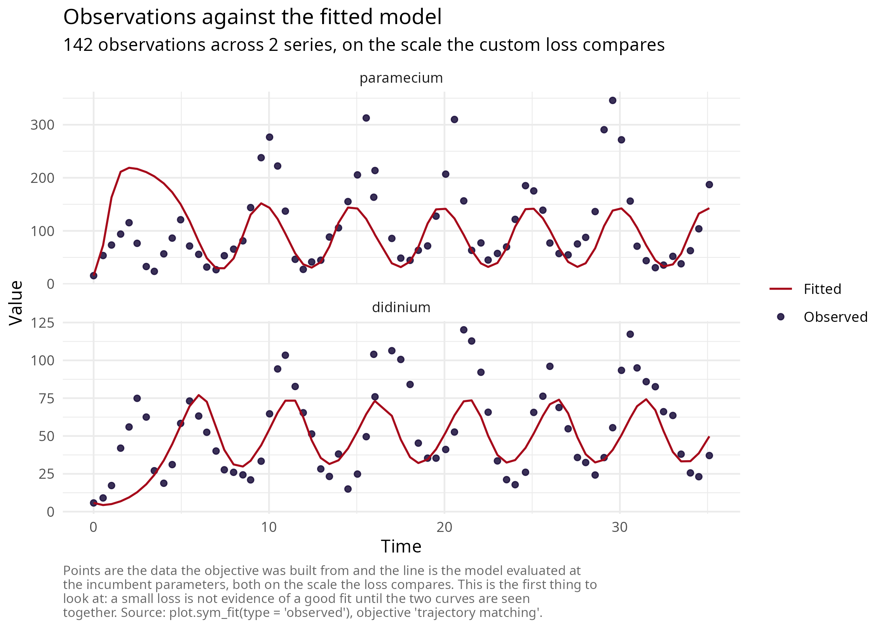

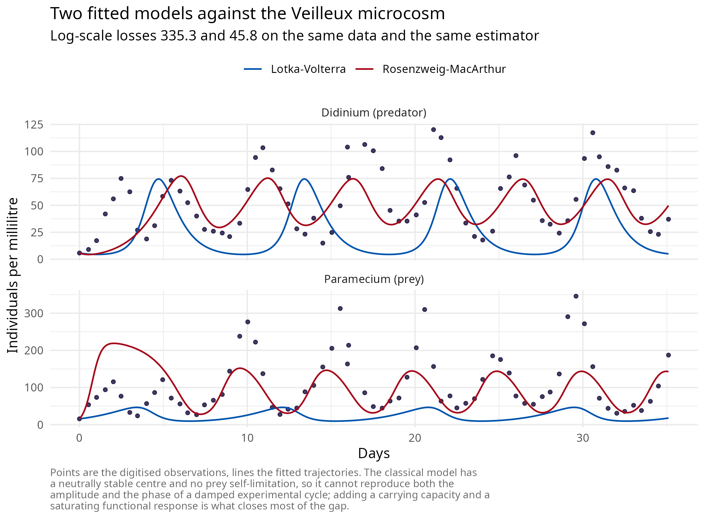

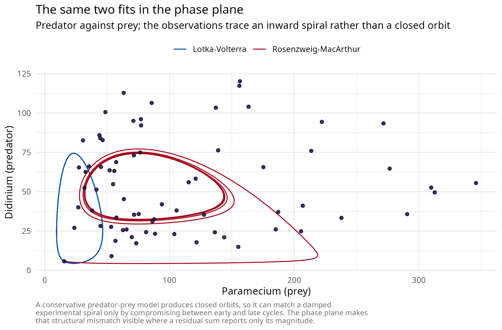

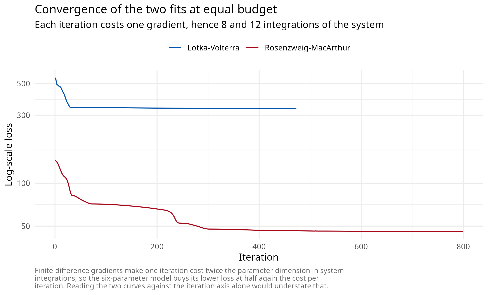

``` r

plot(fit_rm, type = "dashboard")
```

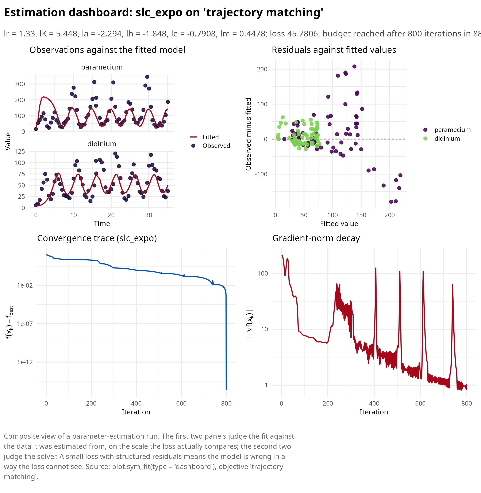

  

## Ecosystem placement

symplectoR occupies the momentum, symplectic and quantum-inspired niche
of the RElab optimization landscape and deliberately duplicates nothing:
the quasi-Newton, conjugate-gradient, trust-region, simplex and swarm
local optimizers live in lucifer’s Laplace approximation engine,
proximal and coordinate-descent machinery lives in RElabverse, and
rigorous interval branch-and-bound global search lives in the stiff
inverse subsystem. The bridge is
[`as_incumbent_solver()`](https://robustecologies.github.io/symplectoR/reference/as_incumbent_solver.md),
which adapts any trajectory method here to the `optim`-style
`(par, fn, lower, upper)` contract used by multi-start global loops, so
a symplectic method can serve as the local descent stage inside an
existing box search.

``` r

solver <- as_incumbent_solver("rgd", sym_control("rgd", eps = 0.05, max_iter = 2000))
res <- solver(par = c(0, 0), fn = function(x) sum((x - 1)^2),
              lower = c(-5, -5), upper = c(5, 5))
str(res)
#> List of 3
#>  $ par        : num [1:2] 1 1
#>  $ value      : num 3.19e-16
#>  $ convergence: int 0
```

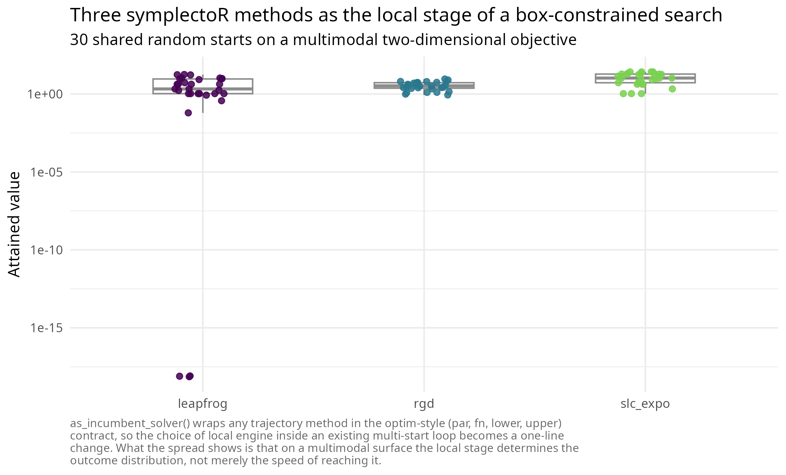

For comparison studies, the natural in-ecosystem baselines are the
gradient-family members of lucifer’s optimizer set on the same
objective, and lucifer’s Stein variational gradient descent as the
density-evolution counterpart of the quantum engine.

  

## References

**\[1\]** Ramsay, J. O., Hooker, G., Campbell, D., & Cao, J. (2007).
Parameter estimation for differential equations: a generalized smoothing
approach. *Journal of the Royal Statistical Society: Series B*, 69(5),
741-796. <https://doi.org/10.1111/j.1467-9868.2007.00610.x>
