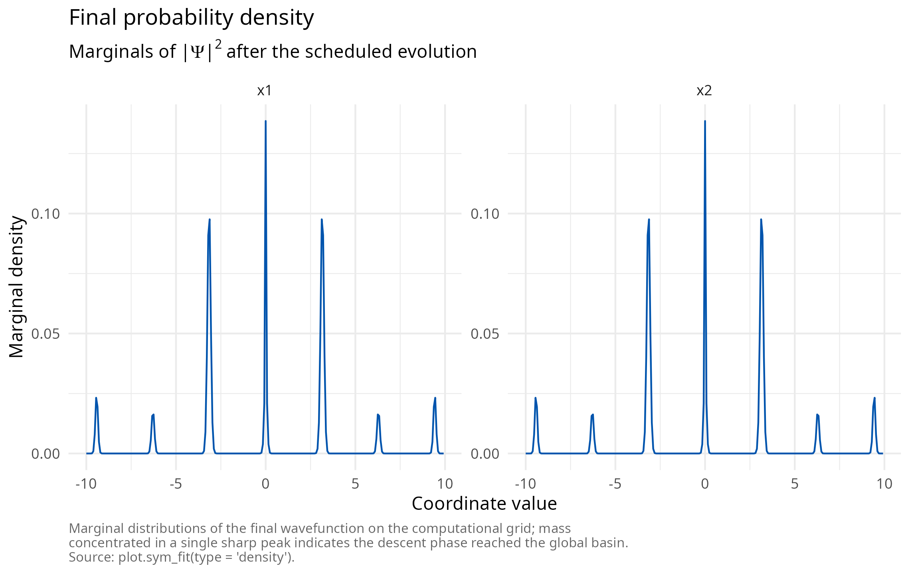
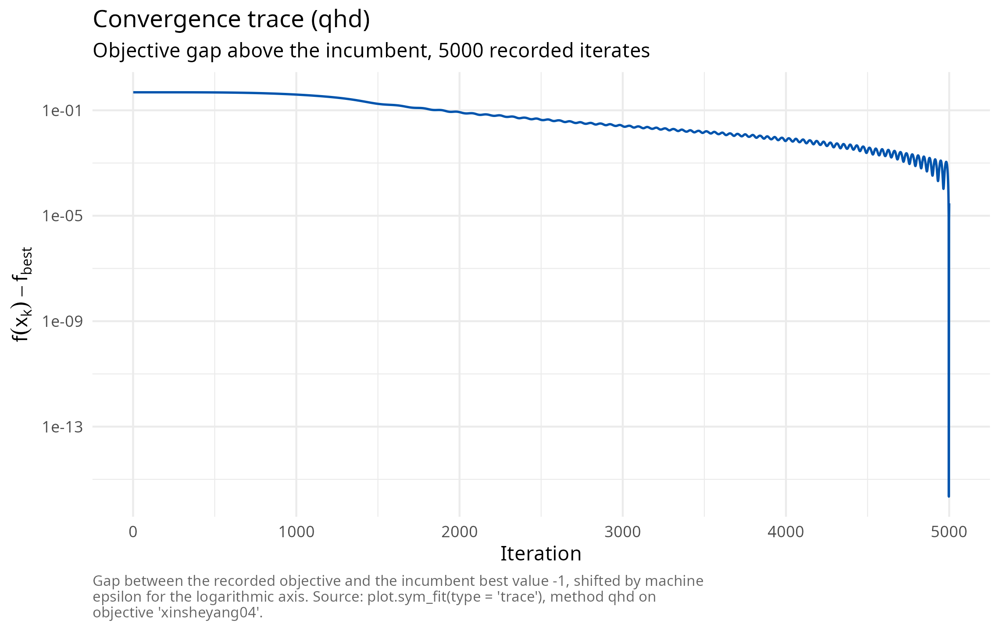
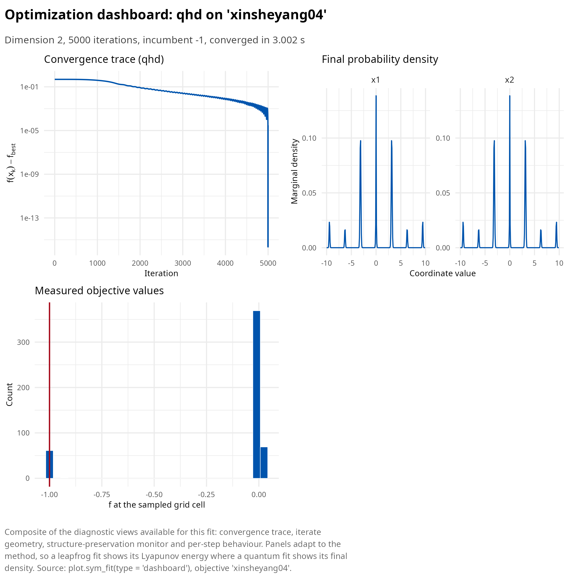
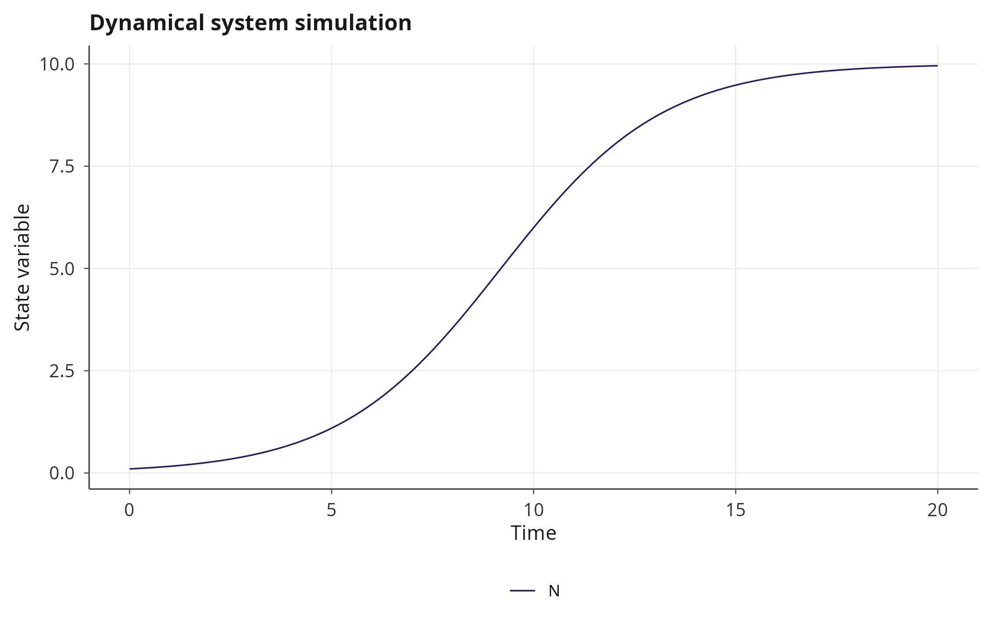
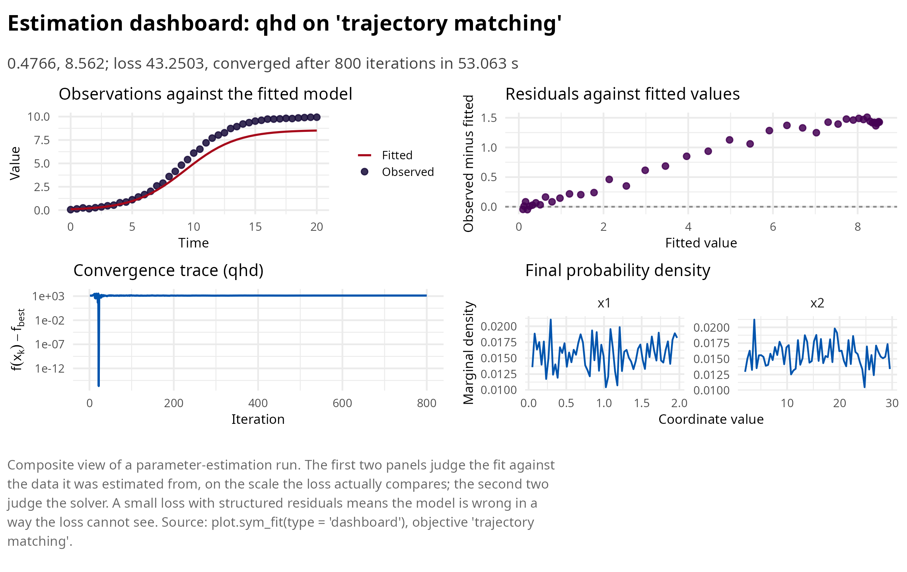
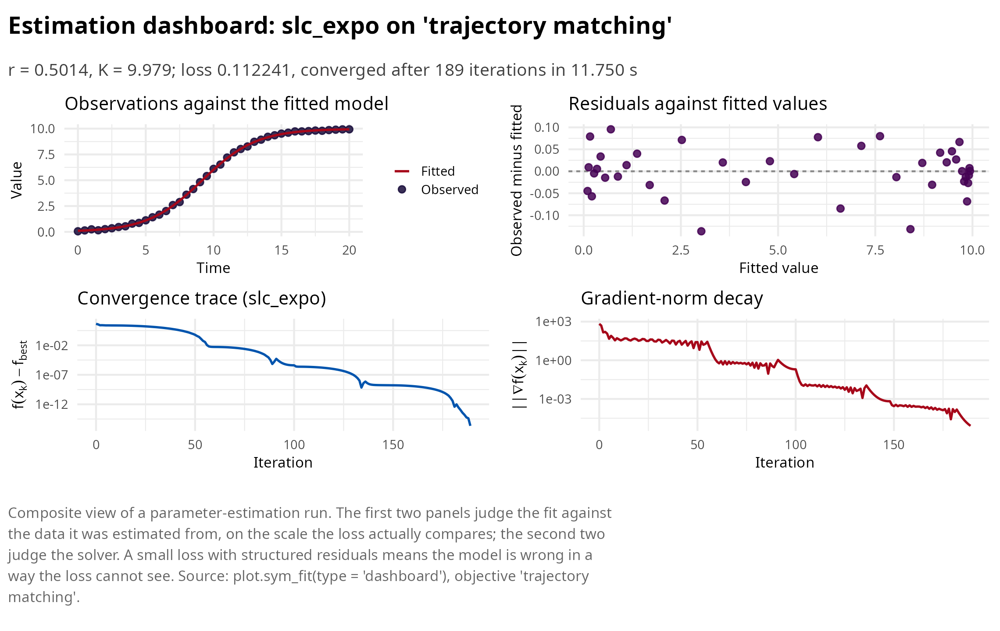

# Quantum Hamiltonian descent on classical hardware

This article develops family C of symplectoR: a classical simulation of
quantum Hamiltonian descent (QHD) following Leng, Zheng, Jia, Fan, Zhao,
Peng and Wu [\[1\]](#ref1). No quantum hardware is involved anywhere:
the reference paper’s own benchmark section ran entirely on a laptop
CPU, because the discrete-time algorithm is a split-step Fourier
integration whose quantum Fourier transform is, on classical hardware,
exactly a fast Fourier transform.

  

## From the Bregman Hamiltonian to a Schrodinger equation

Canonical quantization of the Bregman Hamiltonian replaces the momentum
by \\-i \nabla\\ and yields the time-dependent Schrodinger equation

\\i \\ \partial_t \Psi(t, x) = \left\[ \frac{1}{\lambda(t)} \left(
-\tfrac12 \Delta \right) + \lambda(t) f(x) \right\] \Psi(t, x),\\

with \\\lambda\\ increasing in time: early on the kinetic term dominates
and the density explores the whole box; late in the schedule the
potential dominates and the density concentrates in the deepest basin.
Three schedules are implemented, matching the paper’s variants:
`"cubic"` (\\\lambda = t^3\\, the convex-rate schedule and the
empirically strongest, the default), `"expo"` (\\e^{2\sqrt{\mu} t}\\,
strongly convex rate) and `"onethird"` (\\\alpha t^{1/3}\\, the schedule
of the global-convergence theorem). Two properties matter most for
practice: QHD is a zeroth-order method, querying only function values,
so non-smooth objectives are first class; and for merely locally
Lipschitz objectives the continuous dynamics carry a rigorous
global-convergence guarantee, a regime where classical subgradient
methods can fail to converge at all.

  

## The classical simulation

The state is a complex field on an \\N^d\\ grid over the periodic box;
each step applies the potential phase \\e^{-i h \lambda(t) f(x)}\\
pointwise, transforms to Fourier space, applies the kinetic phase
\\e^{-i h \\k\\^2 / 2 \lambda(t)}\\, and transforms back, at cost \\O(K
N^d \log N)\\. The package parallelizes the phase multiplies over grid
cells with OpenMP and uses the vendored pocketfft for the transforms;
the wavefunction norm is monitored every step and its drift, at machine
precision (below `4e-15` in all validation runs), is reported as a
unitarity diagnostic. Measurement draws seeded samples from the final
density \\\|\Psi\|^2\\, and the incumbent is the best objective value
among the sampled cells and the maximum a posteriori cell;
per-coordinate marginals of the density are returned for the `"density"`
plot view.

``` r

library(symplectoR)
bm <- sym_benchmark("xinsheyang04")
fit <- sym_optim(sym_objective(bm), method = "qhd", seed = 42,
                 control = sym_control("qhd", N_grid = 256, K = 5000, T_evol = 10,
                                       n_samples = 500))
print(fit)
#> ¡ symplectoR fit (qhd)
#> ⚙ Objective: xinsheyang04 (dimension 2)
#> ✔ Best value: -1 after 5000 iterations
#> ✔ Status: Converged
#> ¡ Evaluations: 65536 objective, 0 gradient
#> ⏱ Wall time: 3.002 s
plot(fit, type = "density")
```



``` r

plot(fit, type = "trace")
```



The composite view shows all four quantum diagnostics together: the
expected-objective trace, the marginals of the final density, and the
empirical distribution of the measured objective values against the
retained incumbent.

``` r

plot(fit, type = "dashboard")
```



  

## The benchmark suite and what validation shows

The 12 non-smooth, non-convex test functions of the reference paper ship
as benchmarks with their published domains and global minima
([`sym_benchmark_suite()`](https://robustecologies.github.io/symplectoR/reference/sym_benchmark_suite.md));
the package verified every entry against its stated optimum, and the
verification caught one internal inconsistency in the source: for the
Keane function the paper’s printed minimizer evaluates to `-0.36498`
under its own printed formula, while the true minimum of that formula on
the closed box, located on the boundary at the root of \\\tan x_1 = 4
x_1\\ and confirmed by scan and constrained refinement, is `-0.673668`;
the shipped ground truth records the corrected value.

In the package’s validation runs at grid 256 and 5000 steps, QHD
recovered the exact global minimizer of `xinsheyang04` and `wf` (gap 0),
landed on one of the four symmetric global minimizers of `carromtable`,
and exhibited on `ackley` precisely the resolution floor the paper
documents: the sharp cusp cannot be located more accurately than the
grid spacing, so the gap stalls near `0.4` at that resolution. The floor
is fundamental, not a bug: refining it costs \\N^d\\ memory, which is
also why the engine enforces `d` at most 3 and a cell cap with an
explicit memory estimate in the error message.

  

## The intended division of labor

QHD’s niche in the package is the global stage of inverse problems with
at most three free parameters: it maps the entire likelihood box, is
immune to multimodality and non-smoothness, and its incumbent is then
refined by a trajectory method. In the shipped logistic-growth
validation the pipeline runs QHD to its grid floor and hands over to
`slc_expo`, which converges in 185 iterations to the noise-floor
optimum, matching an L-BFGS-B reference to five decimals.

``` r

sp <- janos::system_spec(
  rhs = function(t, y, p) c(p$r * y[1] * (1 - y[1] / p$K)),
  state_names = "N", parms = list(r = 0.5, K = 10), init = c(N = 0.1)
)
sim <- janos::dyn_sim(sp, t_max = 20, parms = list(r = 0.5, K = 10),
                      discard_transient = 0, verbose = FALSE)
plot(sim)
```



``` r


set.seed(2)
idx <- seq(1, nrow(sim$trajectory), by = 5)
observed_df <- data.frame(time = sim$trajectory$time[idx],
                          N = sim$trajectory$N[idx] + rnorm(length(idx), sd = 0.05))
obj_inv <- sym_inverse(sp, data = observed_df,
                       theta_bounds = list(lo = c(r = 0.05, K = 2), hi = c(r = 2, K = 30)))
global <- sym_optim(obj_inv, method = "qhd", seed = 1,
                    control = sym_control("qhd", N_grid = 64, K = 800))
plot(global, type="dashboard")
```



``` r


refined <- sym_optim(obj_inv, x0 = global$x_best, method = "slc_expo",
                     control = sym_control("slc_expo", C = 0.1, h = 2, max_iter = 1200, tol_grad = 1e-5))
summary(refined)
#> ¡ symplectoR fit (slc_expo)
#> ⚙ Objective: trajectory matching (dimension 2)
#> ✔ Best value: 0.112241 after 189 iterations
#> ✔ Status: Converged
#> ¡ Evaluations: 951 objective, 190 gradient
#> ⏱ Wall time: 11.750 s
#> 
#> Incumbent coordinates:
#> ✔   r = 0.501446
#> ✔   K = 9.97868
#> ⚠ Final gradient norm: 8.15e-06
#> ¡ Objective drop over the last 10 recorded iterates: 1.22e-11
#> ⚙ Momentum restarts: 47; temporal loop events: 6
plot(refined, type="dashboard")
```



  

## References

**\[1\]** Leng, J., Zheng, Y., Jia, Z., Fan, L., Zhao, C., Peng, Y., &
Wu, X. (2025). Quantum Hamiltonian descent for non-smooth optimization.
*arXiv preprint* arXiv:2503.15878.
<https://doi.org/10.48550/arXiv.2503.15878>
