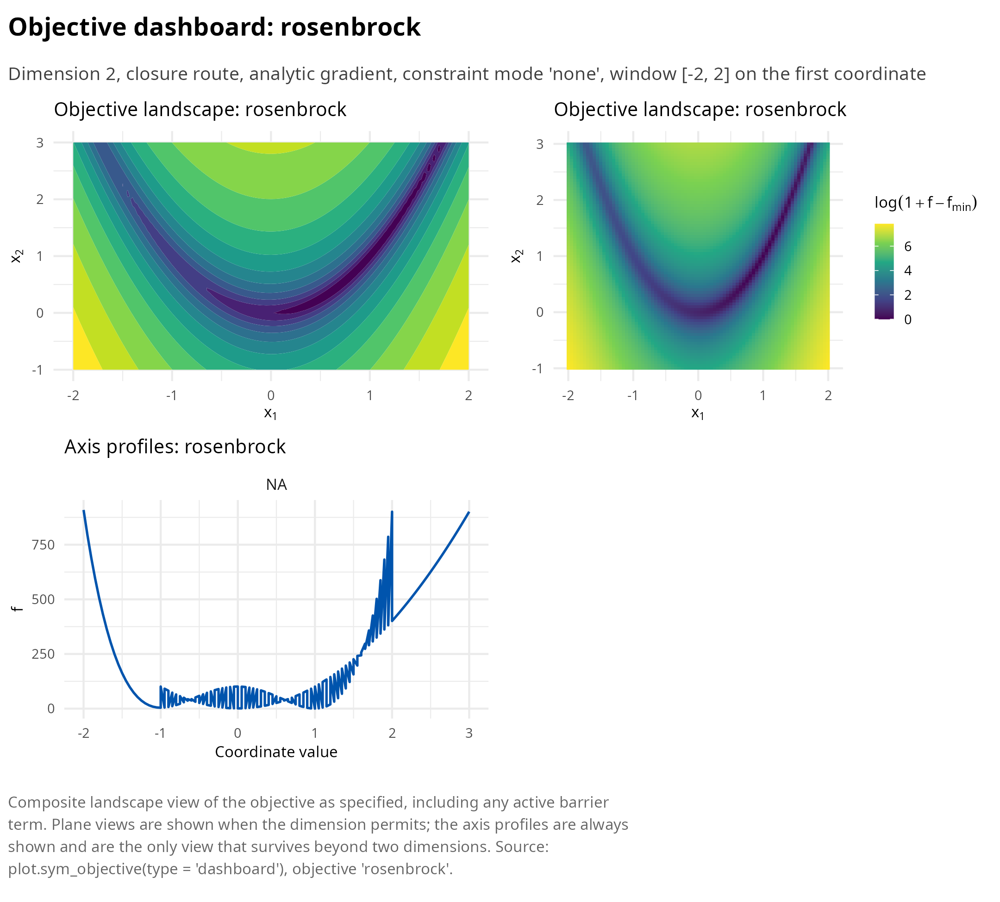
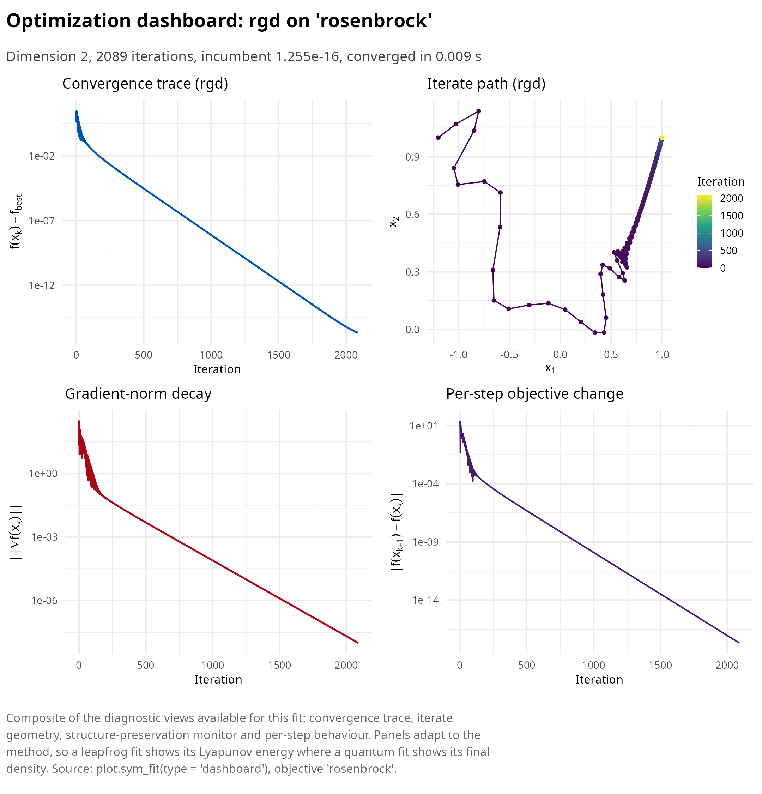
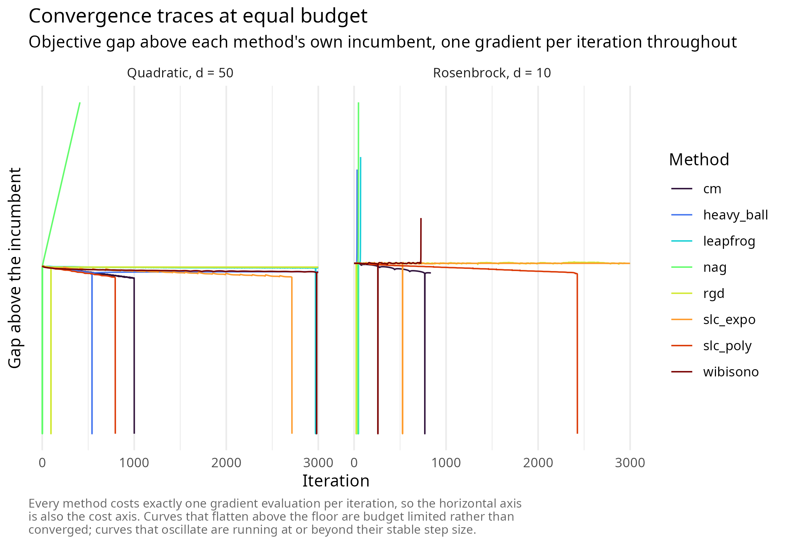
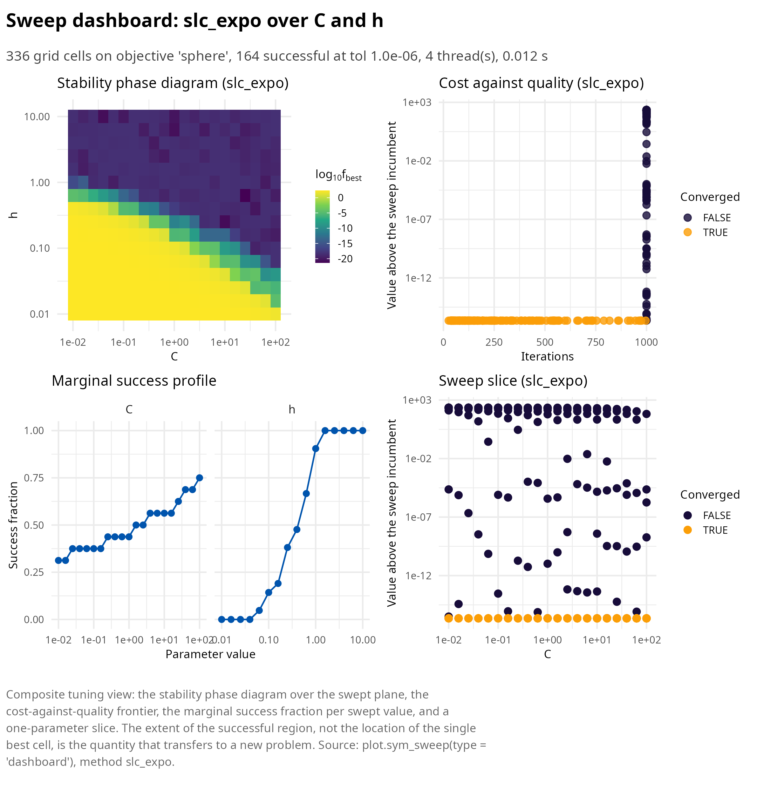
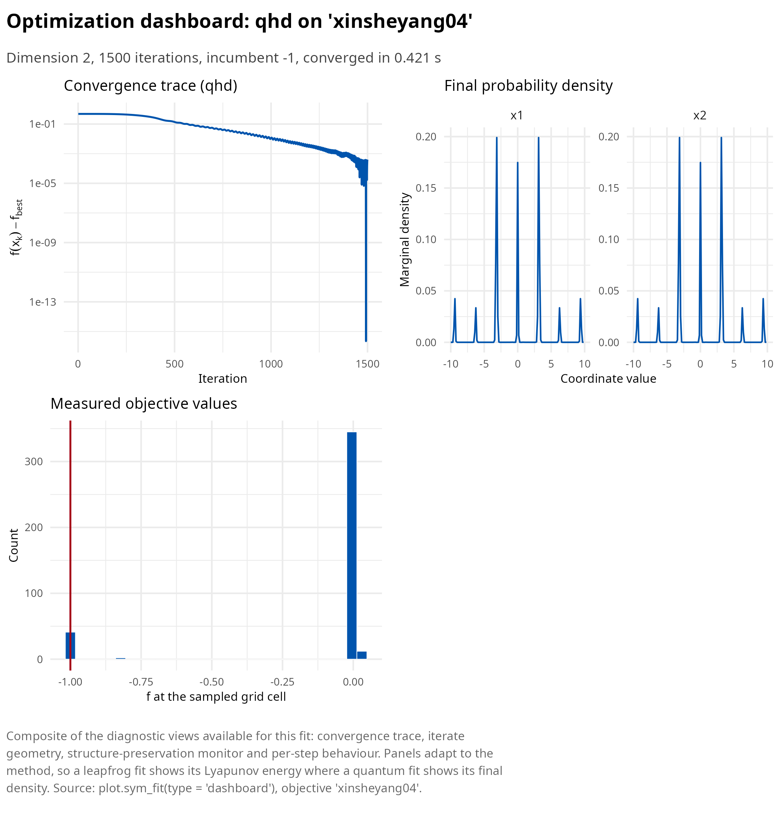
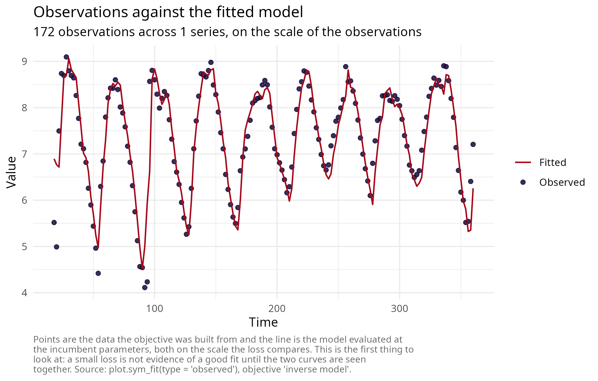
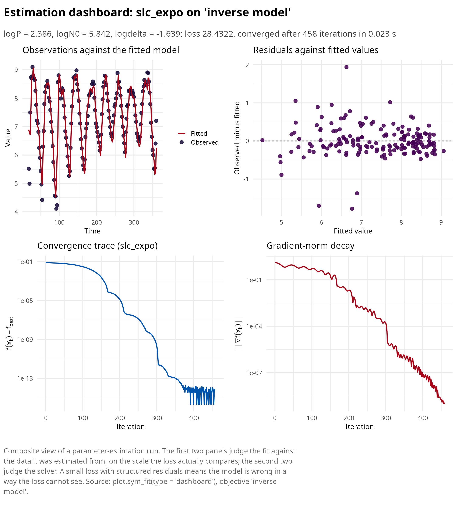
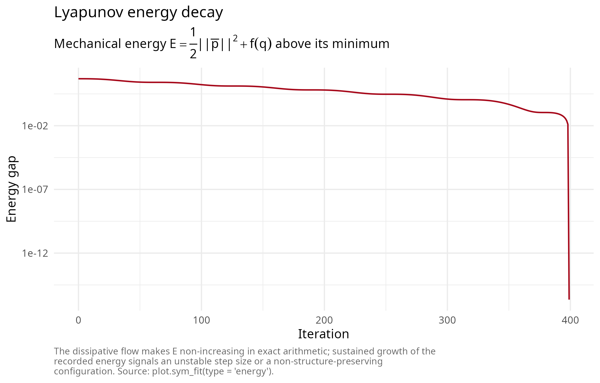

# Getting started with symplectoR

symplectoR implements accelerated gradient optimization as the numerical
integration of continuous dissipative Hamiltonian systems. The design
premise, taken from the research program of Wibisono, Wilson and Jordan
[\[1\]](#ref1) and its symplectic developments [\[2\]](#ref2),
[\[3\]](#ref3), [\[4\]](#ref4), is that acceleration is not an
algorithmic trick but a property of a damped Hamiltonian flow, and that
discretizations preserving the flow’s geometric structure inherit its
convergence rate while remaining stable at far larger step sizes than
the classical Nesterov iteration. Every solver in the package costs one
gradient evaluation per iteration, and every quantitative claim in the
documentation is backed by a regression test against analytic ground
truth.

This vignette is the practical tour: how to specify a problem, how to
choose among the solvers, how to tune the two parameters that matter,
and how to read the diagnostics. The mathematics behind the choices is
developed in the theory article, and each method family has its own
article with validation figures.

  

## The variational premise in one page

Every accelerated method in the package descends from a single
variational object. Given a distance-generating function \\h\\ with
Bregman divergence \\D_h(y, x) = h(y) - h(x) - \langle \nabla h(x), y -
x \rangle\\, the Bregman Lagrangian is

\\\mathcal{L}(X, V, t) = e^{\alpha_t + \gamma_t}\left( D_h\left(X +
e^{-\alpha_t} V,\\ X\right) - e^{\beta_t} f(X) \right),\\

with three time scalings \\\alpha_t\\, \\\beta_t\\, \\\gamma_t\\. Under
the ideal scaling conditions \\\dot\beta_t \le e^{\alpha_t}\\ and
\\\dot\gamma_t = e^{\alpha_t}\\, every solution of the Euler-Lagrange
equation satisfies

\\f(X_t) - f^\star = O\\\left(e^{-\beta_t}\right),\\

because the energy \\\mathcal{E}\_t = D_h(x^\star,\\ X_t +
e^{-\alpha_t}\dot X_t) + e^{\beta_t}(f(X_t) - f^\star)\\ is
non-increasing along the flow. Two consequences drive the package
design. First, arbitrary convergence rates are available in continuous
time simply by reparameterizing \\\beta_t\\, so nothing interesting
happens at the level of the flow: the entire difficulty lives in the
discretization, and naive explicit Euler on these flows is provably
unstable. Second, since the flow is Hamiltonian after a Legendre
transform, the discretization question becomes a question in geometric
numerical integration, where structure preservation is the established
answer.

The Legendre transform gives the Bregman Hamiltonian, which in the
Euclidean separable case is

\\H(q, r, t) = \tfrac{1}{2} e^{\alpha_t - \gamma_t}\lVert r \rVert^2 +
e^{\alpha_t + \beta_t + \gamma_t} f(q).\\

Family B integrates this object directly. Family A integrates its
autonomous relative, a mechanical Hamiltonian with explicit friction.
Family C quantizes it.

  

## The objective as the single currency

Solvers never see raw functions. The constructor
[`sym_objective()`](https://robustecologies.github.io/symplectoR/reference/sym_objective.md)
wraps an R closure (or a compiled function pointer from
[`sym_compile()`](https://robustecologies.github.io/symplectoR/reference/sym_compile.md))
together with the dimension, optional box constraints and the gradient;
a central finite-difference gradient is generated when none is supplied,
at a cost of \\2d\\ objective evaluations per gradient.

``` r

library(symplectoR)

obj <- sym_objective(
  f = function(x) 100 * (x[2] - x[1]^2)^2 + (1 - x[1])^2,
  grad = function(x) c(-400 * x[1] * (x[2] - x[1]^2) - 2 * (1 - x[1]),
                       200 * (x[2] - x[1]^2)),
  dim = 2, lower = c(-2, -1), upper = c(2, 3), name = "rosenbrock"
)
obj
#> ¡ symplectoR objective 'rosenbrock'
#> ⚙ Dimension: 2; route: R closure (serial); analytic gradient
#> ⚙ Box: [-2, -1] x [2, 3]
#> ⚙ Constraint handling: none
```

Every object in the package carries the full print, summary and plot
trio, and every plot method exposes a `"dashboard"` view that assembles
the informative panels for the object at hand. For an objective this
means the landscape where the dimension permits it, plus the axis
profiles, which remain meaningful in any dimension and make
ill-conditioning directly visible as differing curvature between panels.

``` r

plot(obj, type = "dashboard", n = 81)
```



The compiled route matters whenever OpenMP parallelism is wanted: R
closures are structurally excluded from parallel regions because the
interpreter is not thread safe, whereas compiled objectives evaluate
pure C++ inside multi-start ensembles, parameter sweeps and the quantum
grid.

``` r

co <- sym_compile("return 0.5 * arma::dot(x, x);", "return x;")
objc <- sym_objective(co, dim = 50, lower = -5, upper = 5, name = "sphere")
objc
#> ¡ symplectoR objective 'sphere'
#> ✔ Dimension: 50; route: compiled (thread safe); analytic gradient
#> ⚙ Box: [-5, -5, -5, -5] x [5, 5, 5, 5] (first 4 coordinates)
#> ⚙ Constraint handling: none
```

  

## One optimizer, three families

[`sym_optim()`](https://robustecologies.github.io/symplectoR/reference/sym_optim.md)
dispatches to every kernel. The nine method names group as follows.

| Method | Family | Order | Tune first | Notes |
|:---|:---|:---|:---|:---|
| `rgd` | A, conformal symplectic | first (gradient) | `eps`, `delta` | Master kernel; relativistic step bound \\1/\sqrt{\delta}\\ |
| `nag` | A, conformal symplectic | first (gradient) | `eps`, `mu` | Exact preset of `rgd` at \\\delta = 0\\, \\\alpha = 0\\ |
| `heavy_ball` | A, conformal symplectic | first (gradient) | `eps`, `mu` | Exact preset at \\\delta = 0\\, \\\alpha = 1\\ |
| `cm` | A, conformal symplectic | first (gradient) | `eps`, `mu` | Classical momentum, first-order form |
| `leapfrog` | A, conformal symplectic | first (gradient) | `h`, `gamma` | General damping schedules; records the Lyapunov energy |
| `slc_poly` | B, Bregman | first (gradient) | `C`, `h` | Rate \\O(1/t^p)\\; restart and looping on by default |
| `slc_expo` | B, Bregman | first (gradient) | `C`, `h` | Rate \\O(e^{-\eta t})\\; the usual first choice |
| `wibisono` | B, Bregman | first (gradient) | `eps`, `C` | Carries an explicit estimate-sequence certificate |
| `qhd` | C, quantum | zeroth (values only) | `N_grid`, `T_evol` | Global, non-smooth, needs a finite box, \\d \le 3\\ |

The single most useful default is `"slc_expo"`: it is fully explicit,
costs one gradient per iteration, carries both safeguards, and its two
tunable parameters have a convergent region that is nearly independent
of the problem dimension.

``` r

fit <- sym_optim(obj, x0 = c(-1.2, 1), method = "rgd",
                 control = sym_control("rgd", eps = 0.001, delta = 10, max_iter = 20000),
                 keep_path = "full")
summary(fit)
#> ¡ symplectoR fit (rgd)
#> ⚙ Objective: rosenbrock (dimension 2)
#> ✔ Best value: 1.25527e-16 after 2089 iterations
#> ✔ Status: Converged
#> ¡ Evaluations: 2091 objective, 2090 gradient
#> ⏱ Wall time: 0.009 s
#> 
#> Incumbent coordinates:
#> ✔   x[1] = 1
#> ✔   x[2] = 1
#> ✔ Final gradient norm: 9.97e-09
#> ¡ Objective drop over the last 10 recorded iterates: 2.25e-17
#> ⚙ Trust-region bound 1/sqrt(delta) = 0.3162, saturated on 0.0% of steps
```

``` r

plot(fit, type = "dashboard")
```



  

## Choosing a method

The honest comparison is empirical, on the problem at hand, at a fixed
evaluation budget. The block below runs every trajectory method on one
conditioned quadratic and one Rosenbrock valley from the same start with
the same budget, and tabulates what each achieved.

``` r

compare <- function(objective, x0, budget = 3000) {
  specs <- list(
    rgd        = sym_control("rgd", eps = 0.002, mu = 0.95, delta = 4, max_iter = budget),
    nag        = sym_control("nag", eps = 0.002, mu = 0.95, max_iter = budget),
    heavy_ball = sym_control("heavy_ball", eps = 0.002, mu = 0.95, max_iter = budget),
    cm         = sym_control("cm", eps = 0.002, mu = 0.95, max_iter = budget),
    leapfrog   = sym_control("leapfrog", h = 0.05, gamma = 1, damping = "mixed", max_iter = budget),
    slc_poly   = sym_control("slc_poly", C = 0.1, h = 0.01, max_iter = budget),
    slc_expo   = sym_control("slc_expo", C = 1, h = 4, max_iter = budget),
    wibisono   = sym_control("wibisono", eps = 0.002, N = 2, C = 0.0625, max_iter = budget)
  )
  fits <- lapply(names(specs), function(m)
    sym_optim(objective, x0 = x0, method = m, control = specs[[m]]))
  names(fits) <- names(specs)
  status <- function(f) if (f$diverged) "diverged" else if (f$converged) "converged" else "budget reached"
  list(fits = fits, table = data.frame(
    Method = names(fits),
    ## Formatted as text: several methods reach values below 1e-20, which a
    ## fixed number of decimal places would silently print as an exact zero.
    `Final value` = formatC(vapply(fits, function(f) f$f_best, numeric(1)), format = "e", digits = 3),
    Iterations = vapply(fits, function(f) f$n_iter, numeric(1)),
    Gradients = vapply(fits, function(f) f$n_grad, numeric(1)),
    Status = vapply(fits, status, character(1)),
    `Seconds` = round(vapply(fits, function(f) f$timing, numeric(1)), 3),
    check.names = FALSE, row.names = NULL))
}

quad <- sym_objective(sym_benchmark("quadratic", d = 50, kappa = 1000, seed = 1))
cmp_q <- compare(quad, rep(0, 50))
```

| Method     | Final value | Iterations | Gradients | Status         | Seconds |
|:-----------|:------------|-----------:|----------:|:---------------|--------:|
| rgd        | 5.494e+01   |       3000 |      3000 | budget reached |   0.010 |
| nag        | 3.561e+03   |        411 |       412 | diverged       |   0.001 |
| heavy_ball | 2.702e+03   |       3000 |      3000 | budget reached |   0.011 |
| cm         | 6.331e-20   |       1000 |      1001 | converged      |   0.003 |
| leapfrog   | 7.437e-01   |       3000 |      3001 | budget reached |   0.021 |
| slc_poly   | 2.812e-17   |        794 |       795 | converged      |   0.002 |
| slc_expo   | 3.111e-17   |       2714 |      2715 | converged      |   0.008 |
| wibisono   | 1.359e-07   |       3000 |      6000 | budget reached |   0.013 |

Conditioned quadratic, d = 50, condition number 1000, budget 3000
iterations {.table}

``` r

rosen <- sym_objective(sym_benchmark("rosenbrock", d = 10))
cmp_r <- compare(rosen, rep(0, 10))
```

| Method     | Final value | Iterations | Gradients | Status         | Seconds |
|:-----------|:------------|-----------:|----------:|:---------------|--------:|
| rgd        | 5.042e+00   |       3000 |      3000 | budget reached |   0.014 |
| nag        | 4.380e+00   |         49 |        50 | diverged       |   0.000 |
| heavy_ball | 5.066e+00   |         34 |        35 | diverged       |   0.000 |
| cm         | 1.492e-18   |        835 |       836 | converged      |   0.003 |
| leapfrog   | 1.310e+00   |         72 |        73 | diverged       |   0.000 |
| slc_poly   | 9.701e-17   |       2427 |      2428 | converged      |   0.008 |
| slc_expo   | 4.133e+00   |       3000 |      3001 | budget reached |   0.013 |
| wibisono   | 1.832e+00   |        728 |      1458 | diverged       |   0.004 |

Rosenbrock valley, d = 10, budget 3000 iterations {.table}

Two features of these tables deserve reading rather than skimming. The
status column separates a method that met its tolerance from one that
merely exhausted its budget or diverged, and those are very different
outcomes at the same reported value. And every method spends exactly one
gradient per iteration except the rate-matching scheme, which spends
two, so the iteration column is also the cost column and the comparison
is like for like.

Plotting the traces on one axis shows what the table compresses: the
methods differ less in their asymptotic slope than in where they stop
making progress and how violently they oscillate on the way.



A decision rule that survives contact with real problems:

| Problem feature | Start with | Tune |
|:---|:---|:---|
| Smooth, unconstrained, any dimension | `slc_expo` | `C`, `h` |
| Smooth but badly conditioned or sloppy | `slc_expo`, then `rgd` to polish | `C`, `h`; then `eps`, `mu` |
| Need a hard bound on the step | `rgd` with `delta` set | `eps`, `delta` |
| Need a certified rate | `wibisono` | `eps`, `C` at most \\1/(8N)\\ |
| Nonautonomous or explicitly time-dependent damping | `leapfrog` with `damping = "mixed"` | `h`, `gamma`, `gamma2` |
| Non-smooth, boxed, at most three free parameters | `qhd` | `N_grid`, `T_evol` |
| Non-smooth, more than three parameters | multi-start `slc_expo` via `n_starts` | `n_starts`, `C`, `h` |
| Multimodal likelihood, two or three dominant parameters | `qhd`, then `slc_expo` from its incumbent | `N_grid`, then `C`, `h` |

Which solver to reach for first {.table style="width:100%;"}

  

## Tuning lives in a two-parameter plane

For the Bregman methods the source tuning study reduces the problem to
two numbers: fix the family order (`p = 6` for the polynomial family,
`eta = 0.01` for the exponential one) and tune only the pair \\(C, h)\\.
Small \\C\\ suppresses the oscillatory perturbation of the underlying
monotone flow and thereby admits much larger steps.
[`sym_sweep()`](https://robustecologies.github.io/symplectoR/reference/sym_sweep.md)
maps the plane in one call, running one full solver per grid cell in
parallel for compiled objectives.

``` r

sw <- sym_sweep(objc, "slc_expo",
                grid = list(C = 10^seq(-2, 2, 0.2), h = 10^seq(-2, 1, 0.2)),
                x0 = rep(3, 50), n_threads = 4,
                control = sym_control("slc_expo", max_iter = 1000, tol_grad = 1e-9))
sw
#> ¡ symplectoR sweep (slc_expo over C, h)
#> ⚙ Objective: sphere; grid size 336
#> ✔ Converged: 164; diverged: 0; success at tol 1.0e-06: 164
#> ✔ Incumbent cell: C = 25.12, h = 0.631 with f = 4.56516e-22 in 255 iterations
#> ⏱ Threads: 4; wall time: 0.012 s
```

``` r

plot(sw, type = "dashboard")
```



The quantity to read off is the *extent* of the successful region, not
the location of the single best cell. The convergent region of the \\(C,
h)\\ plane is nearly independent of the problem dimension, so a sweep on
a cheap low-dimensional analogue transfers to the production problem;
the location of the optimum does not.

  

## Global optimization of non-smooth objectives

Family C evolves a probability density rather than a point. The state is
a complex field on an \\N^d\\ grid over the periodic box; each step
applies a potential phase, transforms to Fourier space, applies a
kinetic phase, and transforms back. The method queries only function
values, so non-smooth objectives are first class, and the schedule
\\\lambda(t)\\ interpolates from exploration to exploitation. The twelve
non-smooth test functions of the source paper ship with their published
ground truth.

| name         | dim |     f_star | box                      |
|:-------------|----:|-----------:|:-------------------------|
| wf           |   2 |  0.0000000 | \[-10..10, -10..10\]     |
| crownedcross |   2 |  0.0001000 | \[-10..15, -10..15\]     |
| bukin06      |   2 |  0.0000000 | \[-15..-5, -3..3\]       |
| keane        |   2 | -0.6736675 | \[1e-08..10, 1e-08..10\] |
| schwefel     |   1 |  0.0000000 | \[-500..500\]            |
| ackley       |   2 |  0.0000000 | \[-15..30, -15..30\]     |

First six members of the non-smooth global suite, with published ground
truth {.table}

``` r

bm <- sym_benchmark("xinsheyang04")
gfit <- sym_optim(sym_objective(bm), method = "qhd", seed = 42,
                  control = sym_control("qhd", N_grid = 128, K = 1500, n_samples = 400))
c(recovered = gfit$f_best, published = bm$f_star)
#> recovered published 
#>        -1        -1
```

``` r

plot(gfit, type = "dashboard")
```



The hard limits are honest and enforced. Memory grows as \\N^d\\, so the
dimension is capped at three and the cell count at \\2^{24}\\, with an
explicit memory estimate in the error message; and the attainable
accuracy is bounded below by the grid spacing, which is visible on
functions with a sharp cusp at the minimizer.

  

## Inverse modeling on empirical data

[`sym_inverse()`](https://robustecologies.github.io/symplectoR/reference/sym_inverse.md)
converts a model-plus-data estimation problem into an objective over the
parameter vector. Two forms are supported: a plain prediction function
of the parameters, and a `janos` dynamical system fitted by trajectory
matching. Two empirical ecological series ship with the package for this
purpose.

The Nicholson blowfly cages are the classic record of delayed density
dependence. The mechanistic model makes recruitment depend on the adult
population one development time in the past,

\\N\_{t+1} = P\\ N\_{t-k}\\ e^{-N\_{t-k}/N_0} + N_t e^{-\delta},\\

on the two-day sampling grid with \\k = 7\\. Because the dynamics are
aperiodic and the record is noisy, matching a simulated trajectory to
the whole 360-day series would compare phases that decohere long before
the end; conditional one-step-ahead prediction avoids that by
conditioning each prediction on the observed state.

``` r

main <- subset(nicholson_blowfly, population == "main")
N <- main$count
k <- 7L
idx <- seq.int(k + 1L, length(N) - 1L)

predict_step <- function(theta) {
  log(exp(theta[1]) * N[idx - k] * exp(-N[idx - k] / exp(theta[2])) +
      N[idx] * exp(-exp(theta[3])) + 1)
}
obj_bf <- sym_inverse(predict_step, data = log(N[idx + 1L] + 1),
                      obs_times = main$day[idx + 1L],
                      theta_bounds = list(
                        lo = c(logP = log(0.05), logN0 = log(50),    logdelta = log(0.005)),
                        hi = c(logP = log(50),   logN0 = log(20000), logdelta = log(3))))
obj_bf
#> ¡ symplectoR objective 'inverse model'
#> ⚙ Dimension: 3; route: R closure (serial); finite-difference gradient
#> ⚙ Box: [-2.99573, 3.91202, -5.29832] x [3.91202, 9.90349, 1.09861]
#> ⚙ Constraint handling: reflect
```

Three free parameters is exactly the dimension ceiling of the quantum
solver, so the whole box can be scanned globally before any local method
is started. The two stages have complementary failure modes: the global
scan cannot resolve below its grid spacing, and the local method cannot
escape the basin it starts in.

``` r

global  <- sym_optim(obj_bf, method = "qhd", seed = 1,
                     control = sym_control("qhd", N_grid = 48, K = 1200))
refined <- sym_optim(obj_bf, x0 = global$x_best, method = "slc_expo",
                     control = sym_control("slc_expo", C = 0.1, h = 1.5,
                                           max_iter = 3000, tol_grad = 1e-9))

reference <- stats::optim(global$x_best, function(p) sum((predict_step(p) - log(N[idx + 1L] + 1))^2),
                          method = "L-BFGS-B",
                          lower = obj_bf$lower, upper = obj_bf$upper,
                          control = list(maxit = 1000, factr = 1e2))
```

| Stage                 |     Loss |        P |       N0 |   delta |
|:----------------------|---------:|---------:|---------:|--------:|
| Quantum global scan   | 28.51143 |  8.89140 | 368.4031 | 0.18268 |
| Symplectic refinement | 28.43223 | 10.86860 | 344.5695 | 0.19423 |
| L-BFGS-B reference    | 28.43223 | 10.86862 | 344.5693 | 0.19423 |

Nicholson blowfly delayed-recruitment model, conditional one-step-ahead
estimation {.table}

Because
[`sym_inverse()`](https://robustecologies.github.io/symplectoR/reference/sym_inverse.md)
remembers the observations and the prediction map, the fit plots against
its own data with no bookkeeping: the `"observed"` view shows the record
and the fitted model together, and the estimation dashboard leads with
the data rather than with the solver.

``` r

plot(refined, type = "observed")
```



``` r

plot(refined, type = "dashboard")
```



The second shipped series, `paramecium_didinium`, is a controlled
predator-prey microcosm and is fitted by trajectory matching of a
`janos` system through the `system_spec` method of
[`sym_inverse()`](https://robustecologies.github.io/symplectoR/reference/sym_inverse.md);
the inverse-modeling article develops that workflow, including the
comparison between the Lotka-Volterra and Rosenzweig-MacArthur models.

  

## Reading the diagnostics

Three habits catch most solver pathologies before they contaminate a
result. Read the status line: a run that reports the iteration budget
rather than convergence has not converged, whatever its value looks
like. Read the energy panel for the leapfrog family: the dissipative
flow makes the mechanical energy non-increasing in exact arithmetic, so
sustained growth means the step size is unstable. Read the per-step
increment panel: isolated spikes are momentum restarts and
temporal-looping events, and a plateau at the machine floor is
arithmetic stagnation rather than convergence.

``` r

lf <- sym_optim(sym_objective(sym_benchmark("damped_oscillator", gamma_damp = 0.2, q0 = 10)),
                x0 = 10, method = "leapfrog",
                control = sym_control("leapfrog", h = 0.05, gamma = 0.2,
                                      damping = "constant", max_iter = 400, tol_grad = 0),
                keep_path = "full")
plot(lf, type = "energy")
```



  

## Where to go next

The pkgdown articles develop each family with its theory, validation
figures and tuning guidance: conformal symplectic and relativistic
optimization; Bregman dynamics with restarting and temporal looping;
quantum Hamiltonian descent; the inverse-modeling workflow with the
RElab ecosystem bridges; and a mathematical companion collecting the
derivations, the symbol glossary and the literature.

  

## References

**\[1\]** Wibisono, A., Wilson, A. C., & Jordan, M. I. (2016). A
variational perspective on accelerated methods in optimization.
*Proceedings of the National Academy of Sciences*, 113(47), E7351-E7358.
<https://doi.org/10.1073/pnas.1614734113>

**\[2\]** Franca, G., Sulam, J., Robinson, D. P., & Vidal, R. (2020).
Conformal symplectic and relativistic optimization. *Advances in Neural
Information Processing Systems*, 33, 16916-16926.
<https://proceedings.neurips.cc/paper/2020/hash/c4b108f53550f1d5967305a9a8140ddd-Abstract.html>

**\[3\]** Franca, G., Jordan, M. I., & Vidal, R. (2021). On dissipative
symplectic integration with applications to gradient-based optimization.
*Journal of Statistical Mechanics: Theory and Experiment*, 2021(4),
043402. <https://doi.org/10.1088/1742-5468/abf5d4>

**\[4\]** Duruisseaux, V., & Leok, M. (2023). Practical perspectives on
symplectic accelerated optimization. *Optimization Methods and
Software*, 38(6), 1230-1268.
<https://doi.org/10.1080/10556788.2023.2214837>

**\[5\]** Leng, J., Zheng, Y., Jia, Z., Fan, L., Zhao, C., Peng, Y., &
Wu, X. (2025). Quantum Hamiltonian descent for non-smooth optimization.
*arXiv preprint* arXiv:2503.15878.
<https://doi.org/10.48550/arXiv.2503.15878>

**\[6\]** Nicholson, A. J. (1957). The self-adjustment of populations to
change. *Cold Spring Harbor Symposia on Quantitative Biology*, 22,
153-173. <https://doi.org/10.1101/sqb.1957.022.01.017>
