# Mathematical and statistical foundations of symplectoR

This article is the technical companion to symplectoR. It develops, in
one continuous exposition, the mathematics the package implements: the
variational origin of accelerated gradient methods, the dissipative
geometry that organises them, the discretization theory that makes them
usable, the quantization that produces a global method, and the
statistical layer that turns an estimation problem into an objective.
Every structural claim is stated with its hypotheses, every algorithm
with the equations it discretizes, and every quantitative claim is
either reproduced by a live chunk below or by a regression test in the
package. The other articles are practical; this one is not.

The reader is assumed comfortable with convex analysis at the level of
Nesterov [\[1\]](#ref1) and with Hamiltonian mechanics and geometric
integration at the level of Hairer, Lubich and Wanner [\[2\]](#ref2).

  

### Notation and glossary of symbols

| Symbol | Meaning | Package |
|:---|:---|:---|
| \\f\\ | Objective function, minimised | `sym_objective(f = )` |
| \\f^\star\\, \\x^\star\\ | Minimum value and a minimizer | `bm$f_star`, `bm$x_star` |
| \\d\\ | Problem dimension | `sym_objective(dim = )` |
| \\L\\, \\\mu\\ | Gradient Lipschitz constant and strong-convexity modulus | `sym_benchmark(kappa = )` |
| \\h\\ | Distance-generating function of the mirror geometry | Euclidean only in this release |
| \\D_h(y, x)\\ | Bregman divergence \\h(y) - h(x) - \langle \nabla h(x), y - x\rangle\\ | as above |
| \\X_t\\, \\q\\ | Continuous-time position; \\q\\ is the same object in Hamiltonian coordinates | `fit$path` |
| \\V\\, \\\dot X_t\\ | Continuous-time velocity | finite differences of `fit$path` |
| \\p\\, \\r\\ | Momentum; \\r\\ is the Bregman momentum conjugate to \\q\\ | internal kernel state |
| \\H\\ | Hamiltonian | `fit$diagnostics$energy` |
| \\\omega\\ | Symplectic two-form \\\mathrm{d}q \wedge \mathrm{d}p\\ | not stored |
| \\\alpha_t, \beta_t, \gamma_t\\ | The three Bregman time scalings | internal to `slc_core` |
| \\\mathcal{E}\_t\\ | Lyapunov energy certifying the continuous rate | `fit$diagnostics$energy` |
| \\\eta(t)\\ | Damping schedule of the presymplectic family | `sym_control(damping = )` |
| \\\gamma\\ | Damping constant of the conformal family | `sym_control(gamma = )` |
| \\\varepsilon\\, \\\mu\\ (algorithmic) | Learning rate and momentum factor of the relativistic kernel | `sym_control(eps = , mu = )` |
| \\\delta\\ | Relativistic factor; bounds each position half-kick by \\1/\sqrt{\delta}\\ | `sym_control(delta = )` |
| \\\alpha\\ (algorithmic) | Symplecticity interpolation, \\1\\ conformal symplectic | `sym_control(alpha = )` |
| \\C\\, \\p\\, \\\eta\\ | Bregman constant, polynomial order, exponential rate | `sym_control(C = , p = , eta = )` |
| \\\mathfrak{h}\\ | Integration step in fictive time | `sym_control(h = )` |
| \\\lambda(t)\\ | Quantum schedule, increasing in \\t\\ | `sym_control(lambda = )` |
| \\\Psi(t, x)\\ | Wavefunction of quantum Hamiltonian descent | `fit$diagnostics$psi_prob` |
| \\N\\, \\\Delta x\\ | Grid points per dimension and the resulting spacing | `sym_control(N_grid = )` |
| \\\theta\\ | Parameter vector of an inverse problem | `sym_inverse(theta_bounds = )` |
| \\\mathcal{L}(\theta)\\ | Loss functional over \\\theta\\ | the value returned by the objective |
| \\k\\ | Iteration index; also the delay in sampling steps in Part V | user-supplied |

Symbols used throughout, with the package object that carries each
{.table}

  

## Part I: the variational origin

  

### Mirror geometry and the Bregman divergence

Fix a convex, continuously differentiable and strictly convex
distance-generating function \\h\\ on the domain. Its Bregman divergence

\\D_h(y, x) = h(y) - h(x) - \langle \nabla h(x),\\ y - x \rangle \\
\ge\\ 0\\

measures the gap between \\h\\ and its linearization at \\x\\, vanishing
exactly when \\y = x\\ [\[3\]](#ref3). It is not a metric: it is
asymmetric and violates the triangle inequality in general. Taking
\\h(x) = \tfrac12 \lVert x \rVert^2\\ recovers \\D_h(y, x) = \tfrac12
\lVert y - x \rVert^2\\ and the Euclidean geometry, which is the case
this release implements; taking the negative entropy on the simplex
recovers the Kullback-Leibler divergence and mirror descent in the sense
of Nemirovski and Yudin. The whole development below is written for
general \\h\\ and specialised to the Euclidean case at the point where
the package implements it.

  

### The Bregman Lagrangian and the ideal scaling conditions

The unifying object is the Bregman Lagrangian of Wibisono, Wilson and
Jordan [\[4\]](#ref4),

\\\mathcal{L}(X, V, t) \\=\\ e^{\alpha_t + \gamma_t}\Big( D_h\big(X +
e^{-\alpha_t} V,\\ X\big) \\-\\ e^{\beta_t} f(X) \Big),\\

parameterized by three smooth time scalings: \\\alpha_t\\ controls the
speed of the dynamics, \\\beta_t\\ the rate of the objective,
\\\gamma_t\\ the damping. The associated action is \\\int
\mathcal{L}(X_t, \dot X_t, t)\\\mathrm{d}t\\ and the Euler-Lagrange
equation is a second-order differential equation in \\X_t\\.

**Ideal scaling conditions.** Impose

\\\dot\beta_t \le e^{\alpha_t}, \qquad \dot\gamma_t = e^{\alpha_t}.\\

**Rate theorem.** Under the ideal scaling conditions, every solution of
the Euler-Lagrange equation of \\\mathcal{L}\\ satisfies \\f(X_t) -
f^\star = O(e^{-\beta_t})\\.

*Proof sketch.* Define the energy functional

\\\mathcal{E}\_t \\=\\ D_h\big(x^\star,\\ X_t + e^{-\alpha_t}\dot
X_t\big) \\+\\ e^{\beta_t}\big(f(X_t) - f^\star\big).\\

Differentiating along a solution and substituting the Euler-Lagrange
equation, every term cancels except one proportional to \\(\dot\beta_t -
e^{\alpha_t})\\, so \\\dot{\mathcal{E}}\_t \le 0\\ exactly when the
first ideal scaling condition holds; the second condition is what makes
the cancellation possible. Non-negativity of \\D_h\\ then gives
\\e^{\beta_t}(f(X_t) - f^\star) \le \mathcal{E}\_0\\, which is the
claim. \\\square\\

Two consequences shape everything downstream. First, \\\beta_t\\ is a
free reparameterization, so *arbitrarily fast continuous-time rates are
available for free*: the family is a single curve traversed at different
speeds, and there is no continuous-time obstruction to acceleration.
Second, precisely because the continuous problem is unobstructed, all
the difficulty is transferred to the discretization, where the growing
coefficients that produce the rate also produce instability. This is the
central tension the package manages.

  

### The two canonical subfamilies

Two choices of the scalings generate the methods implemented here.

The **polynomial subfamily**, with \\\alpha_t = \log p - \log t\\,
\\\beta_t = p\log t + \log C\\ and \\\gamma_t = p \log t\\ for \\p \>
0\\ and \\C \> 0\\, satisfies the ideal scaling conditions with equality
in the first when \\C\\ is at its critical value, and yields the rate

\\f(X_t) - f^\star = O\\\left(\frac{1}{C t^p}\right).\\

The case \\p = 2\\, \\C = 1/4\\ is the continuous limit of Nesterov’s
method, the differential equation \\\ddot X + \tfrac{3}{t}\dot X +
\nabla f(X) = 0\\ studied by Su, Boyd and Candès. That member is the
*most oscillatory* one of the family, which is a useful fact: historical
practice fixed \\C = 1/4\\ and never tuned it, and the tuning study of
Duruisseaux and Leok [\[5\]](#ref5) shows that smaller \\C\\ damps the
oscillatory perturbation of the underlying monotone flow and thereby
admits far larger steps.

The **exponential subfamily**, with \\\alpha_t = \log \eta\\, \\\beta_t
= \eta t + \log C\\ and \\\gamma_t = \eta t\\, yields

\\f(X_t) - f^\star = O\\\left(e^{-\eta t}\right).\\

Under time dilation the two subfamilies are reparameterizations of one
another, which is why the package fixes the order (\\p = 6\\ or \\\eta =
0.01\\) and exposes only \\(C, h)\\ for tuning.

  

### The Legendre transform and the Bregman Hamiltonian

Passing to the Hamiltonian picture with \\r = \nabla_V \mathcal{L}\\
gives the Bregman Hamiltonian, which in the Euclidean separable case is

\\H(q, r, t) \\=\\ \tfrac12 e^{\alpha_t - \gamma_t}\lVert r \rVert^2
\\+\\ e^{\alpha_t + \beta_t + \gamma_t} f(q).\\

Specialising, the polynomial family gives

\\H_p(q, r, t) \\=\\ \frac{p}{2}\\ t^{-(p+1)} \lVert r \rVert^2 \\+\\ C
p\\ t^{2p-1} f(q),\\

and the exponential family

\\H\_\eta(q, r, t) \\=\\ \frac{\eta}{2}\\ e^{-\eta t} \lVert r \rVert^2
\\+\\ C \eta\\ e^{2\eta t} f(q).\\

The potential prefactors \\t^{2p-1}\\ and \\e^{2\eta t}\\ grow without
bound. That growth *is* the acceleration mechanism, and it is
simultaneously the source of the finite-precision blow-up that Part III
cures. The kinetic prefactors decay at a matching rate, so the
Hamiltonian is explicitly time dependent and the flow is not symplectic
on the ordinary phase space; it is symplectic on the time-augmented
phase space, which is the observation Part II exploits.

  

## Part II: dissipative geometry

  

### Symplectic and conformal symplectic flows

Let \\\omega = \mathrm{d}q \wedge \mathrm{d}p\\ be the canonical
two-form. A flow \\\varphi_t\\ is symplectic when \\\varphi_t^\ast
\omega = \omega\\ and **conformal symplectic** when

\\\varphi_t^\ast \omega = e^{-\gamma t}\\ \omega\\

for a constant \\\gamma \> 0\\: the form is not preserved but contracts
at an exactly known rate, uniformly over phase space. The generating
system is the mechanical Hamiltonian with linear friction,

\\\dot q = \nabla_p H(q, p), \qquad \dot p = -\nabla_q H(q, p) - \gamma
p, \qquad H(q, p) = \frac{\lVert p \rVert^2}{2m} + f(q).\\

Along solutions \\\dot H = -\gamma \lVert p \rVert^2 / m \le 0\\, so
\\H\\ is a Lyapunov function and every bounded orbit relaxes onto the
critical set of \\f\\. This is the object family A integrates, and the
recorded quantity `fit$diagnostics$energy` is exactly \\H\\ evaluated
along the discrete trajectory.

  

### Momentum methods are integrators, and which ones

The classification result of Franca, Sulam, Robinson and Vidal
[\[6\]](#ref6) is the reason the package treats momentum methods as
physics rather than heuristics.

**Classification.** Polyak’s heavy ball, in the form \\v\_{k+1} = \mu
v_k - \varepsilon \nabla f(x_k)\\, \\x\_{k+1} = x_k + v\_{k+1}\\, is
*exactly* the conformal symplectic Euler discretization of the system
above under the identification

\\\mu = e^{-\gamma h}, \qquad \varepsilon = \frac{h^2}{m}.\\

Nesterov’s accelerated gradient is an integrator of the same system, of
the same first order, that is *not* conformal symplectic: its transfer
map contracts \\\omega\\ by the additional, Hessian-dependent and
therefore anisotropic factor \\I - (h^2/m)\nabla^2 f + O(h^3)\\.

The consequence is a genuine trade rather than a free lunch. The extra
contraction slightly improves the asymptotic constant and simultaneously
erodes the stability margin, which is why Nesterov’s method tolerates a
smaller maximum step than structure-preserving alternatives of identical
cost. The package’s `"rgd"` kernel realises both as parameter settings
of one master iteration, and the equivalence is verified numerically
rather than asserted.

``` r


## Hand-coded references, identical to the ones the package regression-tests
bm <- sym_benchmark("quadratic", d = 5, kappa = 20, seed = 3)
obj <- sym_objective(bm)
x0 <- rep(0, 5); eps <- 0.02; mu <- 0.9; K <- 100

reference <- function(kind) {
  x <- x0; v <- rep(0, 5); out <- matrix(NA_real_, K, 5)
  for (k in seq_len(K)) {
    if (kind == "nag") {          # gradient evaluated at the look-ahead point
      v <- mu * v - eps * bm$grad(x + mu * v); x <- x + v
    } else if (kind == "heavy_ball") {   # second-order accurate form
      xh <- x + mu * v; v <- mu * v - eps * bm$grad(xh); x <- xh + v
    } else {                       # classical momentum, gradient at the iterate
      v <- mu * v - eps * bm$grad(x); x <- x + v
    }
    out[k, ] <- x
  }
  out
}

deviation <- function(kind) {
  fit <- sym_optim(obj, x0, method = kind, keep_path = "full",
                   control = sym_control(kind, eps = eps, mu = mu, max_iter = K, tol_grad = 0))
  got <- fit$path[-1, , drop = FALSE]
  max(abs(got - reference(kind)[seq_len(nrow(got)), , drop = FALSE]))
}

deviations <- vapply(c("nag", "heavy_ball", "cm"), deviation, numeric(1))
```

| Preset     | Maximum deviation from the reference |
|:-----------|-------------------------------------:|
| nag        |                            4.440e-16 |
| heavy_ball |                            1.443e-15 |
| cm         |                            0.000e+00 |

The three presets against hand-coded references over 100 iterations
{.table}

The contraction law itself is checkable rather than merely assertable.
For a quadratic objective the classical-momentum map is affine, with
transfer matrix

\\M = \begin{pmatrix} 1 - \varepsilon & \mu \\ -\varepsilon & \mu
\end{pmatrix}, \qquad \det M = \mu,\\

so every phase-space area is multiplied by exactly \\\mu = e^{-\gamma
h}\\ per step, uniformly and independently of where in phase space the
area sits. The chunk below verifies that the package kernel reproduces
this map, then propagates a small square of initial conditions through
it and measures the area against the predicted exponential.

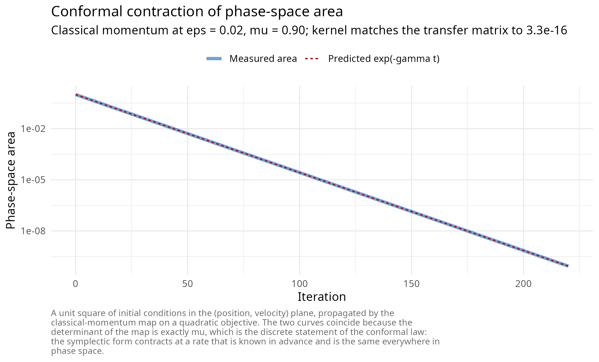

The two curves are indistinguishable because the identity is exact
rather than approximate, and the printed deviation confirms that the
shipped kernel is that map and not merely something close to it.

  

### Relativistic kinetic energy as a derived trust region

Replacing the kinetic energy by its special-relativistic form,

\\T(p) = c\sqrt{\lVert p \rVert^2 + m^2 c^2}, \qquad \dot q = \nabla_p
T(p) = \frac{c\\ p}{\sqrt{\lVert p \rVert^2 + m^2 c^2}},\\

bounds the velocity by \\\lVert \dot q \rVert \< c\\ no matter how large
the momentum becomes. Gradient clipping, usually introduced as an
engineering patch, is here a consequence of the choice of kinetic
energy, and the resulting method remains conformal symplectic. In the
package parameterization \\(\varepsilon, \mu, \delta, \alpha)\\ with
\\\delta = 4/(ch)^2\\, each iteration performs

\\ \begin{aligned} x\_{k+1/2} &= x_k + \frac{\sqrt{\mu}\\ v_k}{\sqrt{\mu
\delta \lVert v_k \rVert^2 + 1}}, & v\_{k+1/2} &= \sqrt{\mu}\\ v_k -
\varepsilon \nabla f(x\_{k+1/2}), \\ x\_{k+1} &= \alpha x\_{k+1/2} +
(1 - \alpha) x_k + \frac{v\_{k+1/2}}{\sqrt{\delta \lVert
v\_{k+1/2}\rVert^2 + 1}}, & v\_{k+1} &= \sqrt{\mu}\\ v\_{k+1/2},
\end{aligned} \\

at one gradient per iteration. Each of the two position half-kicks is
bounded in norm by \\1/\sqrt{\delta}\\, so the per-iteration
displacement never exceeds \\2/\sqrt{\delta}\\: a trust region whose
radius is a control parameter, with the fraction of steps that saturate
it reported in the fit diagnostics. Setting \\\delta = 0\\ and \\\alpha
= 0\\ recovers Nesterov exactly; \\\delta = 0\\ and \\\alpha = 1\\ the
second-order heavy ball; \\\alpha = 1\\ with any \\\delta\\ is conformal
symplectic and is the recommended configuration.

The claim that structure preservation buys stability rather than rate is
also measurable. Sweeping the step size of each method on the same
quadratic and recording where each stops converging locates the edge of
the stable region directly.

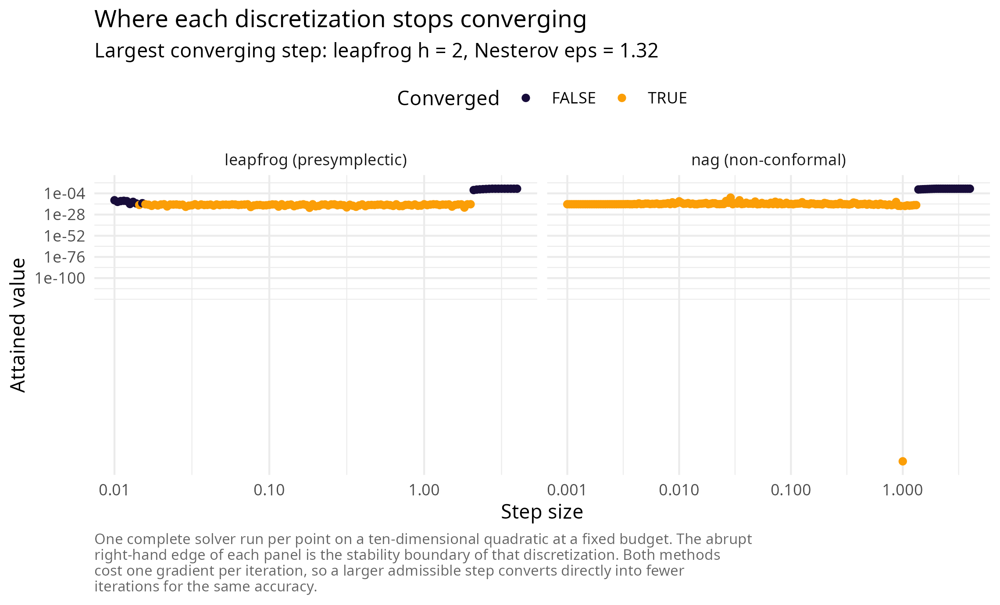

  

### Presymplectic integration and the rate-matching theorem

For the explicitly time-dependent Bregman Hamiltonian the appropriate
structure is presymplectic. Write the flow in the form

\\H(q, p, t) = e^{-\eta_1(t)} T(p) + e^{\eta_2(t)} f(q),\\

promote \\t\\ to a coordinate with conjugate energy variable, and
integrate the resulting autonomous system on the time-augmented phase
space with a symplectic method. Operationally this amounts to a single
rule: *update the time variable with the same rule used for the
positions*.

**Rate matching** [\[7\]](#ref7). Let a presymplectic integrator of
order \\r\\ be obtained this way. Then the discrete iterates reproduce
the continuous convergence rate up to an error \\O(h^r e^{-\eta_2})\\,
provided

\\\left(e^{L\_\phi t} - 1\right) e^{-\eta_1(t)} \< \infty\\

for the Lipschitz constant \\L\_\phi\\ of the flow map. The condition is
what separates the available damping schedules: \\\eta = \gamma t\\
satisfies it outright and is the safe, heavy-ball-like choice; \\\eta =
\gamma \log(1 + t)\\ is Nesterov-like and sits at the edge of validity;
the mixed schedule \\\gamma_1 \log(1 + t) + \gamma_2 t^{\delta}\\ is the
compromise the source study recommends, and all three are exposed as
`sym_control(damping = )`.

The naive implementation overflows, because \\e^{\eta_2(t)}\\ grows
without bound. The package implements the stabilised leapfrog in which
the rescaled momentum \\\bar p = e^{-\eta_2} p\\ is propagated, so that
only *finite differences* of \\\eta\\ enter any exponential. When
\\\eta_1 = \eta_2\\ the rescaled momentum is the mechanical momentum and
\\E = \tfrac12\lVert \bar p \rVert^2 + f(q)\\ is exactly the Lyapunov
function of the conformal picture, which is what the energy diagnostic
records.

The order claim is verified against closed forms rather than asserted.
The damped harmonic oscillator \\\ddot q + \gamma \dot q + q = 0\\ with
\\q(0) = q_0\\, \\\dot q(0) = 0\\ has the exact solution

\\q(t) = q_0 e^{-\gamma t/2}\left(\cos\frac{\omega t}{2} +
\frac{\gamma}{\omega}\sin\frac{\omega t}{2}\right), \qquad \omega =
\sqrt{4 - \gamma^2},\\

and the Nesterov-damped equation \\\ddot q + \frac{\gamma}{t+1}\dot q +
q = 0\\ has a closed form in Bessel functions of order \\(\gamma \pm
1)/2\\. Both ship as benchmarks.

``` r

bm_osc <- sym_benchmark("damped_oscillator", gamma_damp = 0.2, q0 = 10)
err_for_h <- function(h) {
  K <- round(10 / h)
  fit <- sym_optim(sym_objective(bm_osc), x0 = 10, method = "leapfrog", keep_path = "full",
                   control = sym_control("leapfrog", h = h, gamma = 0.2, damping = "constant",
                                         max_iter = K, tol_grad = 0))
  max(abs(fit$path[, 1] - vapply(fit$trace_iter * h, bm_osc$analytic, numeric(1))))
}
hs <- c(0.2, 0.1, 0.05, 0.025, 0.0125)
errs <- vapply(hs, err_for_h, numeric(1))
```

| Step h | Maximum error | Ratio to the previous row |
|-------:|--------------:|--------------------------:|
| 0.2000 |    0.06099347 |                        NA |
| 0.1000 |    0.01519856 |                  4.013108 |
| 0.0500 |    0.00379687 |                  4.002915 |
| 0.0250 |    0.00094929 |                  3.999713 |
| 0.0125 |    0.00023731 |                  4.000197 |

Trajectory error under repeated step halving {.table}

An observed ratio of four under step halving is the signature of a
second-order method, and it is what the table reports. On logarithmic
axes the same statement is a straight line of slope two.

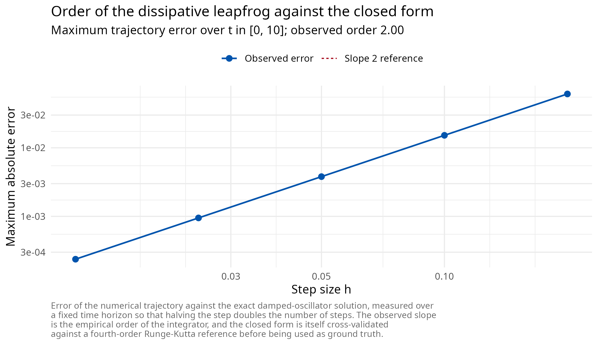

  

## Part III: discretization theory

  

### Splitting, Trotter and Strang

Every kernel in the package is a splitting method. If the vector field
decomposes as \\\mathcal{A} + \mathcal{B}\\ with individually solvable
flows \\\varphi^{\mathcal{A}}\_h\\ and \\\varphi^{\mathcal{B}}\_h\\, the
Lie-Trotter composition \\\varphi^{\mathcal{A}}\_h \circ
\varphi^{\mathcal{B}}\_h\\ is first-order accurate [\[8\]](#ref8) and
the symmetric Strang composition

\\\varphi^{\mathcal{A}}\_{h/2} \circ \varphi^{\mathcal{B}}\_{h} \circ
\varphi^{\mathcal{A}}\_{h/2}\\

is second-order accurate [\[9\]](#ref9). When each factor is symplectic
the composition is symplectic, which is why splitting is the standard
construction for structure-preserving integrators [\[10\]](#ref10). The
leapfrog kernels are exactly Strang compositions of a kinetic and a
potential flow; the quantum kernel of Part IV is a Lie-Trotter
composition of the same two pieces in operator form.

  

### Backward error analysis and the shadow Hamiltonian

The reason symplecticity matters over long horizons is backward error
analysis [\[2\]](#ref2). A symplectic integrator applied to \\H\\ is, to
all orders in a formal power series, the *exact* flow of a nearby
modified Hamiltonian

\\\tilde H = H + h^r H_r + h^{r+1} H\_{r+1} + \cdots,\\

the shadow Hamiltonian. Because the numerical trajectory conserves
\\\tilde H\\ exactly rather than conserving \\H\\ approximately, the
energy error does not accumulate secularly: it oscillates in a band of
width \\O(h^r)\\ over exponentially long times. A non-symplectic
integrator of the same order has no such conserved quantity and its
energy drifts linearly. That distinction, not the order of accuracy, is
what “structure preservation buys stability rather than rate” means
concretely.

For the family B kernels the package can integrate the conjugate-energy
variable of the time-augmented extension alongside the flow, so that
\\H + \mathfrak{r}\\ is conserved by the exact extended dynamics and its
numerical drift is a per-run step-size health check. The monitor is
exposed as `sym_control(diagnostics = TRUE)`, costs one extra objective
evaluation per iteration, and is off by default.

The distinction is visible in a single long run. The recorded mechanical
energy of a symplectic integrator oscillates inside a band whose width
is set by the step size and does not widen with time; there is no
secular drift to accumulate.

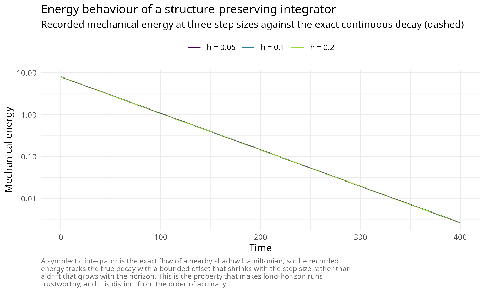

  

### Why the naive discretization fails, and what replaces it

Explicit Euler applied directly to the Bregman flow is provably
unstable, a fact established in [\[4\]](#ref4) together with its
historical remedy: Nesterov’s three-sequence scheme, which the package
ships at \\p = 2\\ as `"wibisono"`. With \\\varepsilon = 1/L\\, \\N \>
1\\ and \\C \le 1/(8N)\\ it carries the explicit estimate-sequence
certificate

\\f(y_k) - f^\star \\\le\\ \frac{\lVert x_0 - x^\star
\rVert^2}{\varepsilon\\ C\\ k\\(k+1)},\\

and requesting \\C\\ above the bound raises a warning rather than
silently degrading.

``` r

bmq <- sym_benchmark("quadratic", d = 10, kappa = 50, seed = 11)
L <- max(bmq$meta$lambda)
x0 <- rep(2, 10)
fit_w <- sym_optim(sym_objective(bmq), x0 = x0, method = "wibisono",
                   control = sym_control("wibisono", eps = 1 / L, N = 2, C = 1 / 16,
                                         max_iter = 2000, tol_grad = 0))
k <- fit_w$trace_iter
bound <- sum((x0 - bmq$x_star)^2) / ((1 / L) * (1 / 16) * pmax(k, 1) * (pmax(k, 1) + 1))
c(violations = sum(fit_w$f_trace - bmq$f_star > bound * (1 + 1e-8)),
  recorded_iterates = length(k),
  final_gap = fit_w$f_trace[length(k)] - bmq$f_star,
  final_bound = bound[length(k)])
#>        violations recorded_iterates         final_gap       final_bound 
#>      0.000000e+00      2.000000e+03      5.191095e-16      2.001001e-03
```

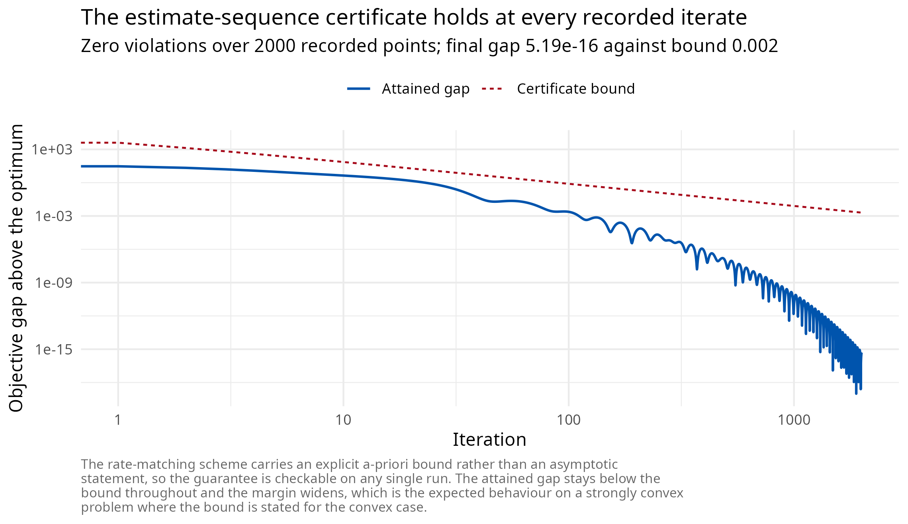

The geometric remedy, and the one the production kernels use, is
different: integrate symplectically in *fictive* time on the
Poincare-transformed extended phase space. The Poincare transformation
trades the explicit time dependence for an autonomous system in a
rescaled time variable, at which point a symmetric leapfrog composition
is available in closed form and is fully explicit at one gradient per
iteration. This is the construction of Duruisseaux and Leok
[\[5\]](#ref5) that `"slc_poly"` and `"slc_expo"` implement.

  

### The two safeguards, stated as algorithms

Raw symplectic Bregman integrators fail in two specific, reproducible
ways, and both fixes ship enabled by default.

**Gradient momentum restarting.** Whenever the gradient opposes the last
displacement, reset the momentum:

\\\text{if } \nabla f(q_k)^\top (q_k - q\_{k-1}) \> 0 \\ \text{ then }
\\ r_k \leftarrow 0.\\

The rule is the Bregman analogue of the adaptive restart of O’Donoghue
and Candès [\[11\]](#ref11), and its effect is not marginal. On the
ten-dimensional Rosenbrock valley the package’s regression test
reproduces the source study’s finding: with restarting, `"slc_expo"`
reaches `4.0e-17` in 550 iterations; without it, `3.2e-5` after the full
5000-iteration budget.

**Temporal looping.** The coefficients \\e^{\eta t}\\ and \\t^{2p-1}\\
grow without bound, so once the gradient has decayed to machine
precision the growing coefficient re-inflates the roundoff floor and
expels the iterate from the minimizer. The failure is invisible when
stopping on a tolerance and fatal on a fixed budget. The cure rolls the
time variable back on an instability criterion,

\\t \leftarrow \max(\epsilon,\\ \beta t), \qquad 0 \< \beta \< 1,\\

with \\\beta\\ and \\\epsilon\\ exposed as `loop_beta` and `loop_eps`.
The package’s regression test reproduces the published pathology
exactly: on a conditioned quadratic with a 20000-iteration budget, the
unguarded run reaches `1e-4` and then diverges to infinity, while the
guarded run holds `1.0e-30` at the end of the same budget.

Both failure modes and both cures are reproducible in a few lines, and
the size of each effect is the point.

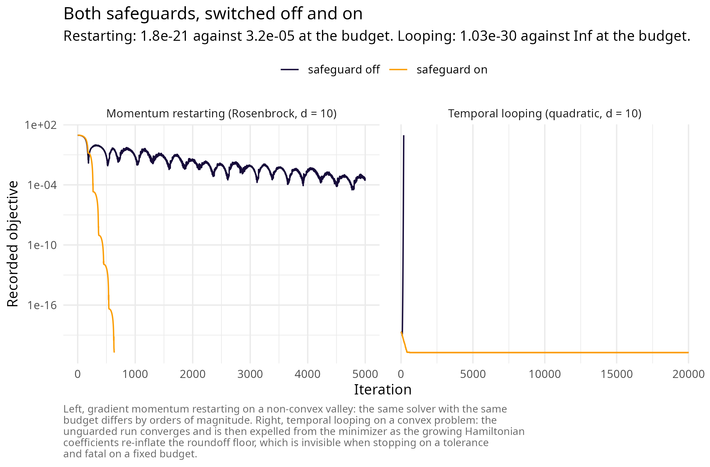

  

## Part IV: quantization

  

### From the Bregman Hamiltonian to a Schrodinger equation

Canonical quantization replaces the momentum by \\-i\nabla\\ and the
classical Hamiltonian by the corresponding operator. Applied to the
Bregman Hamiltonian this gives the time-dependent Schrodinger equation
of quantum Hamiltonian descent [\[12\]](#ref12),

\\i\\ \partial_t \Psi(t, x) \\=\\
\left\[\frac{1}{\lambda(t)}\left(-\tfrac12 \Delta\right) \\+\\
\lambda(t)\\ f(x)\right\] \Psi(t, x),\\

with \\\lambda\\ increasing in time. Early in the schedule the kinetic
operator dominates and the density spreads over the whole box; late in
the schedule the potential dominates and the density concentrates in the
deepest basin. Measurement of \\\|\Psi\|^2\\ returns candidate
minimizers. Three schedules are implemented: \\\lambda = e^{2\sqrt{\mu}
t}\\ carries the strongly convex rate, \\\lambda = t^3\\ the convex rate
\\O(t^{-2})\\ and is empirically strongest, and \\\lambda = \alpha
t^{1/3}\\ is the schedule of the global-convergence theorem.

Two properties are decisive for practice. The method is *zeroth order*:
it queries only function values, so non-smooth objectives are first
class and no subgradient selection is required. And for merely locally
Lipschitz objectives the continuous dynamics carry a rigorous
global-convergence guarantee, a regime in which classical subgradient
methods can fail to converge at all. The argument combines an adiabatic
theorem in the sense of Born and Fock [\[13\]](#ref13), which controls
how well the evolving state tracks the instantaneous ground state as the
schedule varies slowly, with a Weyl-law estimate [\[14\]](#ref14) on the
counting function of the eigenvalues of the instantaneous operator,
which controls the spectral gap that the adiabatic argument requires.

The three schedules differ in how fast the potential term overtakes the
kinetic one, and therefore in how sharply and how early the density
localises.

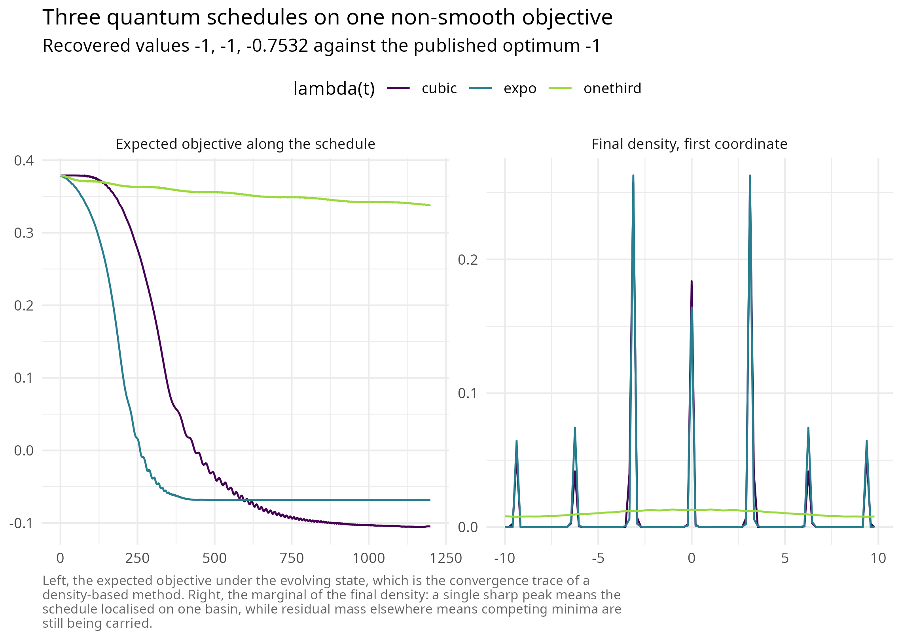

  

### Classical simulation, complexity and the resolution floor

The quantum Fourier transform is, on classical hardware, exactly a fast
Fourier transform, so the split-step Fourier method of Feit, Fleck and
Steiger [\[15\]](#ref15) simulates the evolution directly. On an \\N^d\\
grid over the periodic box of half-period \\L\\, each of the \\K\\ steps
applies the potential phase \\e^{-i h \lambda(t) f(x)}\\ pointwise,
transforms, applies the kinetic phase \\e^{-i h \lVert k \rVert^2 /
(2\lambda(t))}\\ with \\k = \pi n / L\\, and transforms back, at total
cost

\\O\\\left(K\\ N^d \log N\right)\\

in time and \\O(N^d)\\ in memory. The package parallelises the phase
multiplies over grid cells with OpenMP and uses a vendored pocketfft for
the transforms; the norm is monitored every step and its drift reported
as a unitarity diagnostic.

Two hard walls follow from the same \\N^d\\ scaling and are enforced
rather than hoped for. Memory caps the dimension at three and the cell
count at \\2^{24}\\, with an explicit estimate printed in the error
message. And the attainable accuracy is bounded below by the grid
spacing \\\Delta x = 2L/N\\, so on objectives with a sharp cusp at the
minimizer the gap stalls at the resolution floor rather than continuing
to fall. This is a property of the discretization, not a defect of the
method.

| benchmark    |   N |      gap |   spacing |   drift |
|:-------------|----:|---------:|----------:|--------:|
| xinsheyang04 |  32 | 0.000000 | 0.6250000 | 7.0e-16 |
| xinsheyang04 |  64 | 0.000000 | 0.3125000 | 9.0e-16 |
| xinsheyang04 | 128 | 0.000000 | 0.1562500 | 1.6e-15 |
| xinsheyang04 | 256 | 0.000000 | 0.0781250 | 3.1e-15 |
| ackley       |  32 | 3.618655 | 1.4062500 | 6.0e-16 |
| ackley       |  64 | 2.531167 | 0.7031250 | 9.0e-16 |
| ackley       | 128 | 1.924699 | 0.3515625 | 9.0e-16 |
| ackley       | 256 | 2.150386 | 0.1757812 | 1.6e-15 |

Gap and unitarity drift against grid resolution {.table}

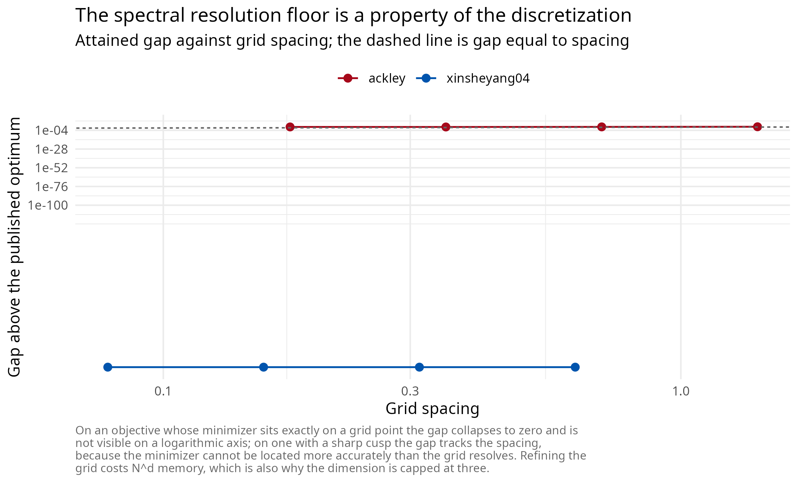

The first benchmark is recovered exactly; the second exhibits the
resolution floor, its gap set by the spacing of the grid rather than by
the number of steps. The norm drift in both cases is at machine
precision, which is the evidence that the splitting is being applied
faithfully.

  

## Part V: the statistical layer

  

### Inverse problems as optimization

An inverse problem supplies a model \\g(\theta)\\ producing predictions
conformable with observations \\y\\, and asks for the \\\theta\\
minimising a loss. The package normalises three cases into one objective
through
[`sym_inverse()`](https://robustecologies.github.io/symplectoR/reference/sym_inverse.md).
Weighted least squares,

\\\mathcal{L}\_{\mathrm{lsq}}(\theta) = \sum_i w_i\big(g_i(\theta) -
y_i\big)^2,\\

is the default. The Gaussian negative log-likelihood with known
observation standard deviation \\\sigma\\,

\\\mathcal{L}\_{\mathrm{nll}}(\theta) = \frac{1}{2\sigma^2}\sum_i
\big(g_i(\theta) - y_i\big)^2 + n\log\sigma + \frac{n}{2}\log 2\pi,\\

differs from it by an affine transformation and therefore has the same
minimizer, but its value is on the likelihood scale and is comparable
across models. A custom functional covers everything else, including the
logarithmic-scale losses that abundance data usually require.

For a dynamical model the predictions come from integrating the system
at the candidate parameters and interpolating the simulated states at
the observation times, which is *trajectory matching* in the sense of
Ramsay, Hooker, Campbell and Cao [\[16\]](#ref16). This is where the
`system_spec` method of
[`sym_inverse()`](https://robustecologies.github.io/symplectoR/reference/sym_inverse.md)
dispatches.

  

### The cost model, and why it dictates the solver

When no analytic gradient is available the package generates a central
finite-difference gradient,

\\g_i(\theta) \approx \frac{\mathcal{L}(\theta + h_i e_i) -
\mathcal{L}(\theta - h_i e_i)}{2 h_i},\\

whose truncation error is \\O(h_i^2)\\ and whose cost is \\2d\\
objective evaluations. For a trajectory-matching objective one objective
evaluation is one full integration of the system, so *one gradient costs
\\2d\\ integrations*. A method converging in a few hundred iterations
rather than tens of thousands is therefore not a marginal improvement
but the difference between a feasible and an infeasible fit, which is
the practical argument for the restarted Bregman kernels on this class
of problem.

  

### Estimators for aperiodic records

Trajectory matching compares a simulated path to an observed one over
the whole record. For a system with sensitive dependence on initial
conditions this is the wrong comparison: simulated and observed phases
decohere on the Lyapunov time scale, and beyond it the residual measures
phase error rather than parameter error. This is the failure that
motivates synthetic likelihood [\[19\]](#ref19).

Conditional one-step-ahead prediction avoids it. Writing the model as a
map \\N\_{t+1} = F(N_t, \ldots, N\_{t-k}; \theta)\\, each prediction is
conditioned on the *observed* state,

\\\mathcal{L}(\theta) = \sum_t \Big(\log F\big(N_t, \ldots, N\_{t-k};\\
\theta\big) - \log N\_{t+1}\Big)^2,\\

so no phase error accumulates. The shipped blowfly record is the worked
case: the delayed-recruitment model of Gurney, Blythe and Nisbet
[\[20\]](#ref20) on the two-day sampling grid, with three free
parameters, which is exactly the dimension ceiling of the quantum
solver.

``` r

main <- subset(nicholson_blowfly, population == "main")
N <- main$count; k <- 7L
idx <- seq.int(k + 1L, length(N) - 1L)
predict_step <- function(theta) {
  log(exp(theta[1]) * N[idx - k] * exp(-N[idx - k] / exp(theta[2])) +
      N[idx] * exp(-exp(theta[3])) + 1)
}
obj_bf <- sym_inverse(predict_step, data = log(N[idx + 1L] + 1),
                      obs_times = main$day[idx + 1L],
                      theta_bounds = list(
                        lo = c(logP = log(0.05), logN0 = log(50),    logdelta = log(0.005)),
                        hi = c(logP = log(50),   logN0 = log(20000), logdelta = log(3))))
global  <- sym_optim(obj_bf, method = "qhd", seed = 1,
                     control = sym_control("qhd", N_grid = 48, K = 1200))
refined <- sym_optim(obj_bf, x0 = global$x_best, method = "slc_expo",
                     control = sym_control("slc_expo", C = 0.1, h = 1.5,
                                           max_iter = 3000, tol_grad = 1e-9))
reference <- stats::optim(global$x_best,
                          function(p) sum((predict_step(p) - log(N[idx + 1L] + 1))^2),
                          method = "L-BFGS-B", lower = obj_bf$lower, upper = obj_bf$upper,
                          control = list(maxit = 1000, factr = 1e2))
```

| Stage                 |     Loss |         P |       N0 |     delta |
|:----------------------|---------:|----------:|---------:|----------:|
| Quantum global scan   | 28.51143 |  8.891397 | 368.4031 | 0.1826754 |
| Symplectic refinement | 28.43223 | 10.868603 | 344.5695 | 0.1942301 |
| L-BFGS-B reference    | 28.43223 | 10.868620 | 344.5693 | 0.1942302 |

Nicholson blowfly: a global scan, its symplectic refinement, and an
independent reference {.table}

Because
[`sym_inverse()`](https://robustecologies.github.io/symplectoR/reference/sym_inverse.md)
retains the observations and the prediction map, the fit plots against
its own data without the record having to be carried alongside it, and
its dashboard leads with the fit rather than with the solver. Each
prediction is conditioned on the observed state, so what the first panel
measures is one-step predictive accuracy and not long-run trajectory
agreement, which for an aperiodic system observed with noise is not an
identifiable target at all.

``` r

plot(refined, type = "observed")
```

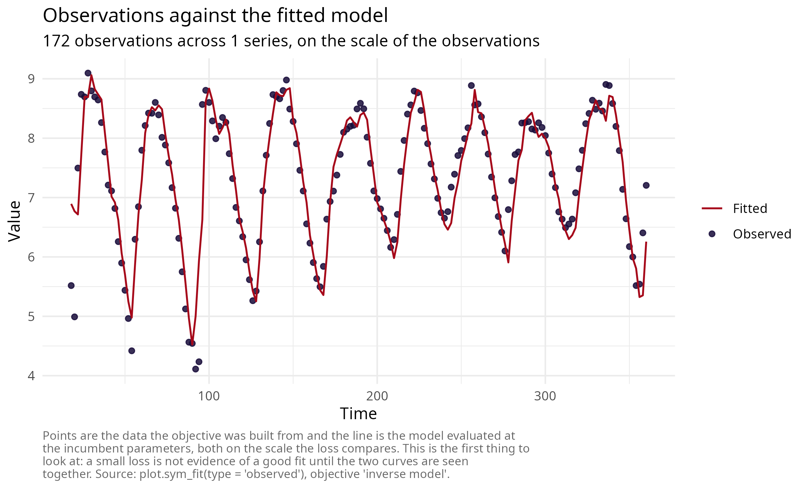

``` r

plot(refined, type = "dashboard")
```

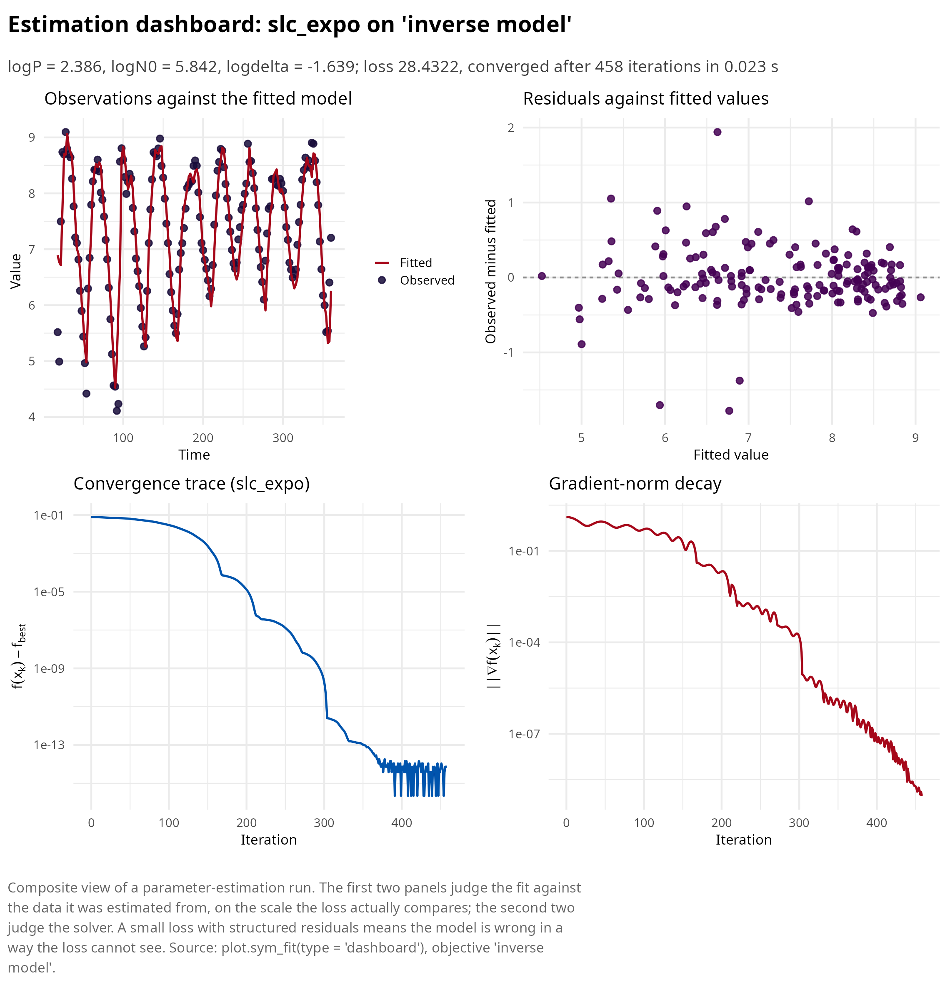

The two stages are complementary and neither is sufficient: the global
scan cannot resolve below its grid spacing, and the local method cannot
leave the basin it starts in. Their composition reaches the reference
optimum, and the agreement with an independent quasi-Newton solver on
the identical objective is the evidence that the optimum is a property
of the problem rather than of the algorithm.

  

### Conditioning, sloppiness and identifiability

Likelihood surfaces of dynamical models are routinely ill conditioned,
and for a structural rather than an accidental reason: parameters enter
with different physical dimensions and act on different time scales, so
the Hessian eigenvalues at the optimum span decades. The phenomenon is
general enough to have its own name, sloppiness, and its own literature
[\[17\]](#ref17); the associated practical question, whether a parameter
is determined by the data at all, is practical identifiability,
diagnosed by profile likelihood [\[18\]](#ref18).

Two mitigations cost nothing and are worth making default. Estimate rate
and capacity parameters on the logarithmic scale, which simultaneously
equalises their magnitudes and enforces positivity; and choose bounds so
that the admissible ranges are comparable in width. The chunk below
measures what the first buys on the fit just computed, by evaluating the
Hessian of the same loss at the same optimum in both parameterizations.

``` r

hessian_fd <- function(fn, x, h = 1e-4) {
  d <- length(x); H <- matrix(0, d, d)
  step <- h * pmax(abs(x), 1)
  for (i in seq_len(d)) for (j in seq_len(d)) {
    ei <- ej <- numeric(d); ei[i] <- step[i]; ej[j] <- step[j]
    H[i, j] <- (fn(x + ei + ej) - fn(x + ei - ej) - fn(x - ei + ej) + fn(x - ei - ej)) /
               (4 * step[i] * step[j])
  }
  (H + t(H)) / 2
}

loss_log <- function(u) sum((predict_step(u) - log(N[idx + 1L] + 1))^2)
loss_nat <- function(v) loss_log(log(v))          # same surface, natural coordinates

theta_log <- as.numeric(refined$x_best)
H_log <- hessian_fd(loss_log, theta_log)
H_nat <- hessian_fd(loss_nat, exp(theta_log))
```

| Coordinates | Condition number | Smallest eigenvalue | Largest eigenvalue |
|:------------|-----------------:|--------------------:|-------------------:|
| logarithmic |          53.2188 |              3.2165 |           171.1760 |
| natural     |     1070426.3647 |              0.0002 |           264.0847 |

The same optimum of the same loss, in two parameterizations {.table}

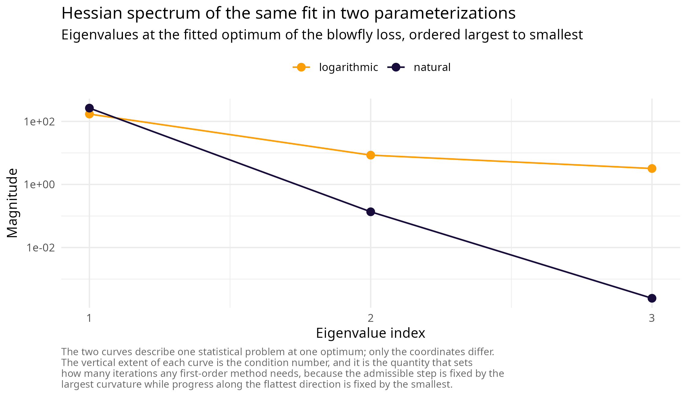

The two rows describe the same statistical problem at the same optimum;
only the coordinates differ. Reparameterizing by \\\theta = e^{u}\\
multiplies row and column \\i\\ of the Hessian by \\\theta_i\\, so
parameters whose natural magnitudes differ by orders of magnitude
contribute a large condition number before any dynamics are involved.
Since the admissible step of every method in the package is set by the
largest curvature while progress along the flattest direction is set by
the smallest, that ratio is exactly the quantity that governs how many
iterations a fit costs.

  

## Part VI: literature by lineage

  

### Momentum and acceleration

The line begins with Polyak’s heavy ball [\[21\]](#ref21), which added a
momentum term to gradient descent and analysed its local rate on
quadratics, and with Nesterov’s 1983 scheme attaining the optimal
\\O(1/k^2)\\ rate for smooth convex problems; the modern textbook
synthesis is Nesterov’s *Lectures on convex optimization*
[\[1\]](#ref1). Beck and Teboulle’s FISTA [\[22\]](#ref22) carried the
same estimate-sequence machinery to composite objectives and made it the
default in imaging and statistics. O’Donoghue and Candès
[\[11\]](#ref11) showed that a simple restart rule recovers the linear
rate that the fixed momentum schedule loses on strongly convex problems,
which is the ancestor of the restart safeguard implemented here.

  

### Differential-equation and variational reformulations

Su, Boyd and Candès identified \\\ddot X + \tfrac{3}{t}\dot X + \nabla
f(X) = 0\\ as the continuous limit of Nesterov’s method and used it to
explain the oscillation and to design restart rules. Wibisono, Wilson
and Jordan [\[4\]](#ref4) generalised the observation into the Bregman
Lagrangian and the ideal scaling conditions, establishing that the
entire family is one curve under time dilation and locating the
difficulty in the discretization. Shi, Du, Jordan and Su
[\[23\]](#ref23) refined the correspondence with high-resolution
differential equations that distinguish heavy ball from Nesterov at the
level of the limiting flow, a distinction the low-resolution limit
erases. Attouch, Peypouquet and Redont [\[24\]](#ref24) added
Hessian-driven damping, which suppresses oscillation at the cost of a
term with no simple Lagrangian, which is the reason it is absent from
this package.

  

### Geometric numerical integration

The reference works are Hairer, Lubich and Wanner [\[2\]](#ref2) for
backward error analysis and structure preservation, Leimkuhler and Reich
[\[25\]](#ref25) for Hamiltonian simulation practice, Marsden and West
[\[26\]](#ref26) for the discrete-variational viewpoint in which
integrators are derived from a discretized action rather than from the
equations of motion, and McLachlan and Quispel [\[10\]](#ref10) for
splitting methods and their order theory. The classical composition
results are Trotter’s [\[8\]](#ref8) and Strang’s [\[9\]](#ref9).

  

### Dissipative and conformal structure

Franca, Sulam, Robinson and Vidal [\[6\]](#ref6) established the
conformal symplectic classification of momentum methods and introduced
relativistic gradient descent. Franca, Jordan and Vidal [\[7\]](#ref7)
developed the presymplectic theory for explicitly time-dependent
dissipative Hamiltonians and proved the rate-matching theorem with its
validity condition. Betancourt, Jordan and Wilson [\[27\]](#ref27)
framed the same material through the extended phase space and the
conserved extended Hamiltonian that the package’s optional monitor
tracks. Duruisseaux and Leok [\[5\]](#ref5) supplied the practice layer:
fully explicit compositions, the two safeguards, the \\(C, h)\\ tuning
study and the near dimension-independence of the convergent region;
their companion work extends the construction to Riemannian manifolds
[\[28\]](#ref28), which is the natural direction for a future
non-Euclidean release.

  

### Quantum-inspired optimization

Leng, Hickman, Li and Wu [\[12\]](#ref12) introduced quantum Hamiltonian
descent as the quantization of the Bregman Hamiltonian, and Leng and
colleagues [\[29\]](#ref29) extended it to non-smooth objectives,
established the global-convergence guarantee under local Lipschitz
continuity, and assembled the twelve-function benchmark suite that ships
with this package. The classical simulation rests on the split-step
Fourier method [\[15\]](#ref15); the theoretical ingredients are the
adiabatic theorem [\[13\]](#ref13) and Weyl’s law [\[14\]](#ref14).

  

### Parameter estimation for dynamical models

Trajectory matching and its generalized-smoothing refinement are due to
Ramsay, Hooker, Campbell and Cao [\[16\]](#ref16). The conditioning
pathology of these problems was characterised as sloppiness by
Gutenkunst and colleagues [\[17\]](#ref17), and practical
identifiability by profile likelihood by Raue and colleagues
[\[18\]](#ref18). For records generated by aperiodic dynamics, Wood’s
synthetic likelihood [\[19\]](#ref19) is the reference treatment, and
the blowfly cages of Nicholson [\[30\]](#ref30) modelled by the
delayed-recruitment equation of Gurney, Blythe and Nisbet
[\[20\]](#ref20) are its canonical example.

  

### References

**\[1\]** Nesterov, Y. (2018). *Lectures on convex optimization* (2nd
ed.). Springer. <https://doi.org/10.1007/978-3-319-91578-4>

**\[2\]** Hairer, E., Lubich, C., & Wanner, G. (2006). *Geometric
numerical integration: structure-preserving algorithms for ordinary
differential equations* (2nd ed.). Springer.
<https://doi.org/10.1007/3-540-30666-8>

**\[3\]** Bregman, L. M. (1967). The relaxation method of finding the
common point of convex sets and its application to the solution of
problems in convex programming. *USSR Computational Mathematics and
Mathematical Physics*, 7(3), 200-217.
<https://doi.org/10.1016/0041-5553(67)90040-7>

**\[4\]** Wibisono, A., Wilson, A. C., & Jordan, M. I. (2016). A
variational perspective on accelerated methods in optimization.
*Proceedings of the National Academy of Sciences*, 113(47), E7351-E7358.
<https://doi.org/10.1073/pnas.1614734113>

**\[5\]** Duruisseaux, V., & Leok, M. (2023). Practical perspectives on
symplectic accelerated optimization. *Optimization Methods and
Software*, 38(6), 1230-1268.
<https://doi.org/10.1080/10556788.2023.2214837>

**\[6\]** Franca, G., Sulam, J., Robinson, D. P., & Vidal, R. (2020).
Conformal symplectic and relativistic optimization. *Advances in Neural
Information Processing Systems*, 33, 16916-16926.
<https://proceedings.neurips.cc/paper/2020/hash/c4b108f53550f1d5967305a9a8140ddd-Abstract.html>

**\[7\]** Franca, G., Jordan, M. I., & Vidal, R. (2021). On dissipative
symplectic integration with applications to gradient-based optimization.
*Journal of Statistical Mechanics: Theory and Experiment*, 2021(4),
043402. <https://doi.org/10.1088/1742-5468/abf5d4>

**\[8\]** Trotter, H. F. (1959). On the product of semi-groups of
operators. *Proceedings of the American Mathematical Society*, 10(4),
545-551. <https://doi.org/10.1090/S0002-9939-1959-0108732-6>

**\[9\]** Strang, G. (1968). On the construction and comparison of
difference schemes. *SIAM Journal on Numerical Analysis*, 5(3), 506-517.
<https://doi.org/10.1137/0705041>

**\[10\]** McLachlan, R. I., & Quispel, G. R. W. (2002). Splitting
methods. *Acta Numerica*, 11, 341-434.
<https://doi.org/10.1017/S0962492902000053>

**\[11\]** O’Donoghue, B., & Candès, E. (2015). Adaptive restart for
accelerated gradient schemes. *Foundations of Computational
Mathematics*, 15(3), 715-732.
<https://doi.org/10.1007/s10208-013-9150-3>

**\[12\]** Leng, J., Hickman, E., Li, J., & Wu, X. (2023). Quantum
Hamiltonian descent. *arXiv preprint* arXiv:2303.01471.
<https://doi.org/10.48550/arXiv.2303.01471>

**\[13\]** Born, M., & Fock, V. (1928). Beweis des Adiabatensatzes.
*Zeitschrift fur Physik*, 51(3-4), 165-180.
<https://doi.org/10.1007/BF01343193>

**\[14\]** Ivrii, V. (2016). 100 years of Weyl’s law. *Bulletin of
Mathematical Sciences*, 6(3), 379-452.
<https://doi.org/10.1007/s13373-016-0089-y>

**\[15\]** Feit, M. D., Fleck, J. A., & Steiger, A. (1982). Solution of
the Schrodinger equation by a spectral method. *Journal of Computational
Physics*, 47(3), 412-433. <https://doi.org/10.1016/0021-9991(82)90091-2>

**\[16\]** Ramsay, J. O., Hooker, G., Campbell, D., & Cao, J. (2007).
Parameter estimation for differential equations: a generalized smoothing
approach. *Journal of the Royal Statistical Society Series B:
Statistical Methodology*, 69(5), 741-796.
<https://doi.org/10.1111/j.1467-9868.2007.00610.x>

**\[17\]** Gutenkunst, R. N., Waterfall, J. J., Casey, F. P., Brown, K.
S., Myers, C. R., & Sethna, J. P. (2007). Universally sloppy parameter
sensitivities in systems biology models. *PLoS Computational Biology*,
3(10), e189. <https://doi.org/10.1371/journal.pcbi.0030189>

**\[18\]** Raue, A., Kreutz, C., Maiwald, T., Bachmann, J., Schilling,
M., Klingmuller, U., & Timmer, J. (2009). Structural and practical
identifiability analysis of partially observed dynamical models by
exploiting the profile likelihood. *Bioinformatics*, 25(15), 1923-1929.
<https://doi.org/10.1093/bioinformatics/btp358>

**\[19\]** Wood, S. N. (2010). Statistical inference for noisy nonlinear
ecological dynamic systems. *Nature*, 466(7310), 1102-1104.
<https://doi.org/10.1038/nature09319>

**\[20\]** Gurney, W. S. C., Blythe, S. P., & Nisbet, R. M. (1980).
Nicholson’s blowflies revisited. *Nature*, 287(5777), 17-21.
<https://doi.org/10.1038/287017a0>

**\[21\]** Polyak, B. T. (1964). Some methods of speeding up the
convergence of iteration methods. *USSR Computational Mathematics and
Mathematical Physics*, 4(5), 1-17.
<https://doi.org/10.1016/0041-5553(64)90137-5>

**\[22\]** Beck, A., & Teboulle, M. (2009). A fast iterative
shrinkage-thresholding algorithm for linear inverse problems. *SIAM
Journal on Imaging Sciences*, 2(1), 183-202.
<https://doi.org/10.1137/080716542>

**\[23\]** Shi, B., Du, S. S., Jordan, M. I., & Su, W. J. (2022).
Understanding the acceleration phenomenon via high-resolution
differential equations. *Mathematical Programming*, 195(1-2), 79-148.
<https://doi.org/10.1007/s10107-021-01681-8>

**\[24\]** Attouch, H., Peypouquet, J., & Redont, P. (2016). Fast convex
optimization via inertial dynamics with Hessian driven damping. *Journal
of Differential Equations*, 261(10), 5734-5783.
<https://doi.org/10.1016/j.jde.2016.08.020>

**\[25\]** Leimkuhler, B., & Reich, S. (2005). *Simulating Hamiltonian
dynamics*. Cambridge University Press.
<https://doi.org/10.1017/CBO9780511614118>

**\[26\]** Marsden, J. E., & West, M. (2001). Discrete mechanics and
variational integrators. *Acta Numerica*, 10, 357-514.
<https://doi.org/10.1017/S096249290100006X>

**\[27\]** Betancourt, M., Jordan, M. I., & Wilson, A. C. (2018). On
symplectic optimization. *arXiv preprint* arXiv:1802.03653.
<https://doi.org/10.48550/arXiv.1802.03653>

**\[28\]** Duruisseaux, V., & Leok, M. (2022). Accelerated optimization
on Riemannian manifolds via discrete constrained variational
integrators. *Journal of Nonlinear Science*, 32(4), 42.
<https://doi.org/10.1007/s00332-022-09795-9>

**\[29\]** Leng, J., Zheng, Y., Jia, Z., Fan, L., Zhao, C., Peng, Y., &
Wu, X. (2025). Quantum Hamiltonian descent for non-smooth optimization.
*arXiv preprint* arXiv:2503.15878.
<https://doi.org/10.48550/arXiv.2503.15878>

**\[30\]** Nicholson, A. J. (1957). The self-adjustment of populations
to change. *Cold Spring Harbor Symposia on Quantitative Biology*, 22,
153-173. <https://doi.org/10.1101/sqb.1957.022.01.017>
