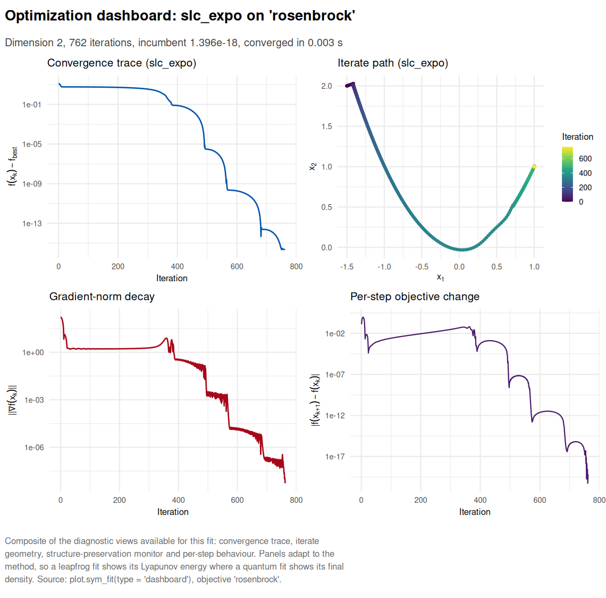
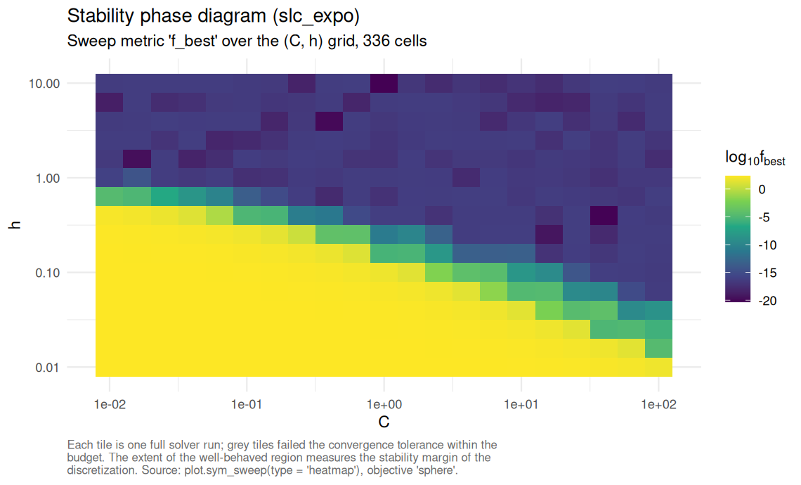
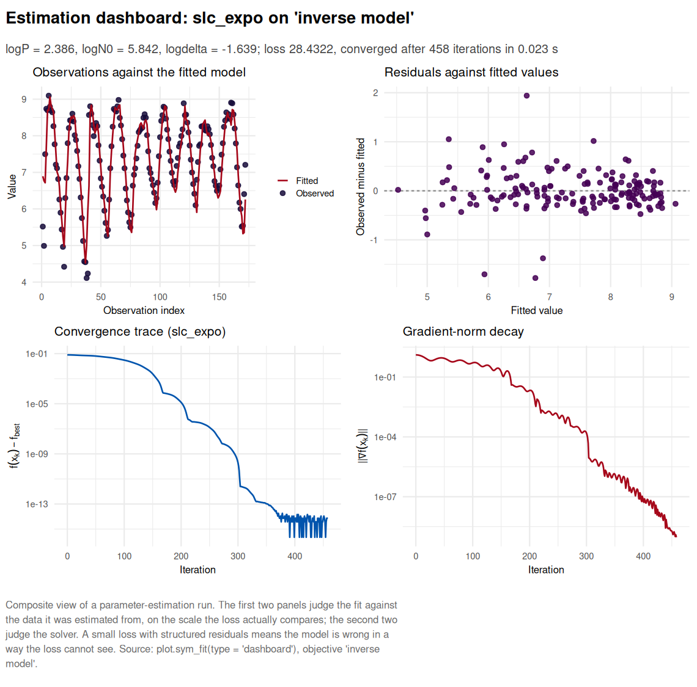

# symplectoR

[](https://lifecycle.r-lib.org/articles/stages.html#experimental)
[](https://www.gnu.org/licenses/gpl-3.0)
[](https://cran.r-project.org/)
[](https://robustecologies.github.io/symplectoR/reference/index.html)
[](https://robustecologies.github.io/symplectoR/reference/index.html)
[](https://github.com/robustecologies/symplectoR/tree/main/src)
[](https://robustecologies.github.io/symplectoR)

Symplectic and accelerated gradient methods implemented as
structure-preserving discretizations of continuous dissipative
Hamiltonian systems. **symplectoR** treats optimization as physics:
every solver integrates a damped Hamiltonian flow whose Lyapunov
function is the objective, and the discretizations preserve the
geometric structure (symplectic, conformal symplectic, presymplectic)
that controls long-run stability. The practical payoff is stability at
much larger step sizes than the classical Nesterov discretization at the
identical cost of one gradient per iteration, plus a family of
safeguards (momentum restarting, temporal looping, relativistic step
bounds) that convert the theory into robust default behaviour.

  

## The three method families

The package implements three complementary kernels behind one interface,
[`sym_optim()`](https://robustecologies.github.io/symplectoR/reference/sym_optim.md).

**Family A, conformal symplectic.** The starting point is the mechanical
system with friction,

\\\dot x = \nabla_p H(x, p), \qquad \dot p = -\nabla_x H(x, p) - \gamma
p, \qquad H(x, p) = \frac{\lVert p \rVert^2}{2m} + f(x),\\

whose flow contracts the symplectic form at an exactly known rate,
\\\omega_t = e^{-\gamma t} \omega_0\\. Polyak’s heavy ball is precisely
the conformal symplectic Euler discretization of this flow under \\\mu =
e^{-\gamma h}\\ and \\\varepsilon = h^2 / m\\, while Nesterov’s method
integrates the same flow without preserving the contraction
[\[1\]](#ref1). Replacing the kinetic energy by its relativistic form
\\c\sqrt{\lVert p \rVert^2 + m^2 c^2}\\ bounds the velocity, \\\lVert
\dot x \rVert \< c\\, which in the package parameterization
\\(\varepsilon, \mu, \delta, \alpha)\\ becomes a per-half-kick
displacement bound \\1/\sqrt{\delta}\\: a trust region derived from the
physics rather than bolted on. The master kernel `"rgd"` subsumes
`"nag"`, `"heavy_ball"` and `"cm"` exactly as parameter settings;
`"leapfrog"` integrates general damping schedules in the overflow-safe
form of [\[2\]](#ref2) and preserves the continuous rate up to \\O(h^r
e^{-\eta})\\.

**Family B, Bregman.** The variational framework of [\[3\]](#ref3)
derives every accelerated method from one Lagrangian, whose Hamiltonian
in the Euclidean separable case is

\\H(q, r, t) = \tfrac{1}{2} e^{\alpha_t - \gamma_t} \lVert r \rVert^2 +
e^{\alpha_t + \beta_t + \gamma_t} f(q),\\

with rate \\f(q_t) - f^\star = O(e^{-\beta_t})\\ under the ideal scaling
conditions \\\dot\beta_t \le e^{\alpha_t}\\ and \\\dot\gamma_t =
e^{\alpha_t}\\. The polynomial subfamily gives \\O(1/t^p)\\ and the
exponential subfamily \\O(e^{-\eta t})\\. `"slc_poly"` and `"slc_expo"`
are the fully explicit symplectic leapfrog compositions of
[\[4\]](#ref4) with gradient momentum restarting (speedups of one to
three orders of magnitude in the source study) and temporal looping,
which stops an otherwise fatal post-convergence blow-up intrinsic to the
growing Hamiltonian coefficients; `"wibisono"` is the rate-matching
three-sequence scheme with its explicit estimate-sequence certificate.

**Family C, quantum.** Canonical quantization of the same Bregman
Hamiltonian replaces the momentum by \\-i\nabla\\ and yields

\\i \\ \partial_t \Psi(t, x) = \left\[ \frac{1}{\lambda(t)} \left(
-\tfrac{1}{2}\Delta \right) + \lambda(t) f(x) \right\] \Psi(t, x),\\

integrated by split-step Fourier simulation on classical hardware
[\[5\]](#ref5). `"qhd"` is a zeroth-order global method that queries
only function values, carries a rigorous global-convergence guarantee
for merely locally Lipschitz objectives, and is practical up to three
dimensions, where the state occupies \\N^d\\ grid cells.

  

## Installation

``` r

# install.packages("remotes")
remotes::install_github("robustecologies/symplectoR")
```

  

## Quick start

Every solver consumes the same currency, a `sym_objective`, and returns
a rich S3 object with a print, summary and plot method. The
`"dashboard"` plot view assembles the diagnostics that apply to the
particular fit into one figure.

``` r

library(symplectoR)

bm <- sym_benchmark("rosenbrock", d = 2)
fit <- sym_optim(sym_objective(bm), x0 = c(-1.5, 2), method = "slc_expo",
                 control = sym_control("slc_expo", C = 0.1, h = 1, max_iter = 4000),
                 keep_path = "full")
fit
#> ¡ symplectoR fit (slc_expo)
#> ⚙ Objective: rosenbrock (dimension 2)
#> ✔ Best value: 1.3964e-18 after 762 iterations
#> ✔ Status: Converged
#> ¡ Evaluations: 764 objective, 763 gradient
#> ⏱ Wall time: 0.003 s
plot(fit, type = "dashboard")
```



Compiling the objective removes the R interpreter from the inner loop
and unlocks every OpenMP path: multi-start ensembles, parameter sweeps
and the quantum grid. The sweep below runs one complete solver per grid
cell and maps the region of the \\(C, h)\\ plane in which the
discretization is stable, which is the quantity the tuning literature
reports and the one that transfers between problems.

``` r

co <- sym_compile("return 0.5 * arma::dot(x, x);", "return x;")
objc <- sym_objective(co, dim = 50, name = "sphere")
sw <- sym_sweep(objc, "slc_expo",
                grid = list(C = 10^seq(-2, 2, 0.2), h = 10^seq(-2, 1, 0.2)),
                x0 = rep(3, 50), n_threads = 8)
sw
#> ¡ symplectoR sweep (slc_expo over C, h)
#> ⚙ Objective: sphere; grid size 336
#> ✔ Converged: 166; diverged: 0; success at tol 1.0e-06: 166
#> ✔ Incumbent cell: C = 1, h = 10 with f = 4.90339e-21 in 49 iterations
#> ⏱ Threads: 8; wall time: 0.008 s
plot(sw, type = "heatmap")
```



  

## Inverse modeling on empirical data

[`sym_inverse()`](https://robustecologies.github.io/symplectoR/reference/sym_inverse.md)
turns a model and a dataset into an objective over the parameter vector,
by direct prediction or by trajectory matching of a `janos` dynamical
system. Two empirical ecological series ship with the package. Below,
the delayed-recruitment model of Nicholson’s blowfly cages is estimated
by conditional one-step-ahead prediction: a quantum global scan maps the
whole three-parameter box, and a symplectic method refines its
incumbent.

``` r

main <- subset(nicholson_blowfly, population == "main")
N <- main$count
k <- 7L                                   # 7 sampling steps x 2 days = the 14-day development delay
idx <- seq.int(k + 1L, length(N) - 1L)

predict_step <- function(theta) {
  log(exp(theta[1]) * N[idx - k] * exp(-N[idx - k] / exp(theta[2])) +
      N[idx] * exp(-exp(theta[3])) + 1)
}
obj <- sym_inverse(predict_step, data = log(N[idx + 1L] + 1),
                   theta_bounds = list(lo = c(logP = log(0.05), logN0 = log(50),    logdelta = log(0.005)),
                                       hi = c(logP = log(50),   logN0 = log(20000), logdelta = log(3))))

global  <- sym_optim(obj, method = "qhd", seed = 1,
                     control = sym_control("qhd", N_grid = 48, K = 1200))
refined <- sym_optim(obj, x0 = global$x_best, method = "slc_expo",
                     control = sym_control("slc_expo", C = 0.1, h = 1.5,
                                           max_iter = 3000, tol_grad = 1e-9))
round(exp(refined$x_best), 4)             # recruitment P, scale N0, per-step mortality delta
#>     logP    logN0 logdelta 
#>  10.8686 344.5695   0.1942
```

``` r

plot(refined, type = "dashboard")
```



  

## Validation

Every solver is validated against analytic ground truth before any claim
is made. The dissipative leapfrog reproduces the closed-form
damped-oscillator and Bessel-function trajectories of the reference
study with observed error ratios of exactly 4.00 under step halving
(second order); the relativistic kernel reproduces hand-coded Nesterov
and heavy-ball iterations to machine epsilon; the Wibisono scheme
satisfies its estimate-sequence bound at every recorded iterate; the
temporal-looping ablation reproduces the published blow-up pathology
(divergence to infinity after convergence on a fixed budget) and its
cure; the quantum engine preserves unitarity to machine precision and
recovers the published global minima of the 12-function non-smooth
suite; multi-start ensembles are bit-identical across thread counts; and
the empirical blowfly estimation above agrees with an L-BFGS-B reference
on the identical objective to eight significant figures. The test suite
encodes each of these checks as a regression test.

``` R
#> 9 exported functions, 23 S3 methods, 27 documented topics, 6 C++ translation units.
```

  

## Ecosystem

symplectoR is part of the [RElab](https://robustecologies.github.io)
ecosystem. It delegates dynamical-systems simulation to
[janos](https://github.com/robustecologies/janos) (trajectory matching
dispatches on `system_spec`), deliberately does not duplicate the
quasi-Newton, trust-region and derivative-free local optimizers of
[lucifer](https://github.com/robustecologies/lucifer), and offers
[`as_incumbent_solver()`](https://robustecologies.github.io/symplectoR/reference/as_incumbent_solver.md)
as a drop-in local-descent adapter for box-constrained global searches
such as the stiff inverse subsystem of
[RElabverse](https://github.com/robustecologies/RElabverse).

  

## Disclaimer

This package is the original creation of the author in all conceptual,
theoretical, and design aspects. Implementation was assisted by
Anthropic’s Claude Code v.2 (Opus 5) and OpenAI’s Codex (ChatGPT 5.6
Sol) to streamline package development. All original ideas, creativity,
and scientific contributions belong to the author, who maintains full
responsibility for the package’s correctness and reliability. All the
code has been thoroughly tested, and users are encouraged to report any
issues through the package’s [issue
tracker](https://github.com/robustecologies/symplectoR/issues).

  

## References

**\[1\]** Franca, G., Sulam, J., Robinson, D. P., & Vidal, R. (2020).
Conformal symplectic and relativistic optimization. *Advances in Neural
Information Processing Systems*, 33, 16916-16926.
<https://proceedings.neurips.cc/paper/2020/hash/c4b108f53550f1d5967305a9a8140ddd-Abstract.html>

**\[2\]** Franca, G., Jordan, M. I., & Vidal, R. (2021). On dissipative
symplectic integration with applications to gradient-based optimization.
*Journal of Statistical Mechanics: Theory and Experiment*, 2021(4),
043402. <https://doi.org/10.1088/1742-5468/abf5d4>

**\[3\]** Wibisono, A., Wilson, A. C., & Jordan, M. I. (2016). A
variational perspective on accelerated methods in optimization.
*Proceedings of the National Academy of Sciences*, 113(47), E7351-E7358.
<https://doi.org/10.1073/pnas.1614734113>

**\[4\]** Duruisseaux, V., & Leok, M. (2023). Practical perspectives on
symplectic accelerated optimization. *Optimization Methods and
Software*, 38(6), 1230-1268.
<https://doi.org/10.1080/10556788.2023.2214837>

**\[5\]** Leng, J., Zheng, Y., Jia, Z., Fan, L., Zhao, C., Peng, Y., &
Wu, X. (2025). Quantum Hamiltonian descent for non-smooth optimization.
*arXiv preprint* arXiv:2503.15878.
<https://doi.org/10.48550/arXiv.2503.15878>

**\[6\]** Betancourt, M., Jordan, M. I., & Wilson, A. C. (2018). On
symplectic optimization. *arXiv preprint* arXiv:1802.03653.
<https://doi.org/10.48550/arXiv.1802.03653>
