# Turbulent attractors: theory and practice

## Introduction

The tuRbulence package implements seven dynamical systems spanning
classical chaos theory, geophysical fluid dynamics, and climate science.
Each system exhibits distinctive nonlinear behavior, from the iconic
butterfly attractor of the Lorenz equations to the noise-induced
transitions of the von Kármán turbulent flow. This vignette provides a
comprehensive introduction to each system, covering the underlying
mathematical theory, historical context, and practical analysis using
the package’s unified interface.

The study of turbulent and chaotic systems traces back to fundamental
debates about the nature of irregular fluid motion. The classical view,
developed primarily by Landau in the 1940s [\[1\]](#ref1),
conceptualized the transition to turbulence as an infinite sequence of
Hopf bifurcations, each adding a new incommensurate frequency to the
flow. According to this quasi-periodic route, system complexity would
gradually increase until the motion became effectively unpredictable due
to the superposition of many independent oscillatory modes. However,
this elegant picture was fundamentally challenged by Ruelle and Takens
in 1971 [\[2\]](#ref2), who demonstrated mathematically that strange
attractors with sensitive dependence on initial conditions could emerge
after only three bifurcations. Their work revealed that apparent
randomness in deterministic systems arises not from high dimensionality
but from exponential divergence of nearby trajectories, a property
quantified by positive Lyapunov exponents.

The resolution of this apparent contradiction, as demonstrated
beautifully by the von Kármán experiments analyzed in this package, is
scale-dependent: small scales exhibit high-dimensional, effectively
quasi-periodic behavior consistent with Landau’s picture, while
large-scale dynamics collapse onto low-dimensional random attractors
consistent with Ruelle-Takens theory when stochastic forcing from
unresolved scales is properly accounted for [\[3\]](#ref3).

``` r

library(tuRbulence)
library(ggplot2)
```

  

## Classical chaotic systems

  

### The Lorenz system

Edward Lorenz’s 1963 discovery of deterministic chaos emerged from an
attempt to model atmospheric convection using a drastically truncated
spectral representation of the Boussinesq equations [\[4\]](#ref4).
Working at MIT on numerical weather prediction, Lorenz found that his
simplified three-variable model exhibited behavior that would later be
recognized as the hallmark of chaos: bounded non-periodic orbits with
sensitive dependence on initial conditions. The story of how Lorenz
discovered this sensitivity, by re-running a simulation with slightly
rounded initial conditions and observing completely different long-term
behavior, has become legendary in the history of science.

The system describes the motion of a two-dimensional fluid layer heated
from below, known as Rayleigh-Bénard convection. The three state
variables have direct physical interpretations: \\x\\ measures the rate
of convective overturning, where positive values correspond to clockwise
circulation in the convection cell; \\y\\ represents the horizontal
temperature variation across the cell, quantifying the temperature
contrast between ascending and descending currents; and \\z\\ captures
the departure of the vertical temperature profile from linearity, with
positive values indicating more stable stratification than the
conductive state.

The governing equations are:

\\\frac{dx}{dt} = \sigma(y - x)\\ \\\frac{dy}{dt} = x(\rho - z) - y\\
\\\frac{dz}{dt} = xy - \beta z\\

The parameter \\\sigma\\ is the Prandtl number, the ratio of kinematic
viscosity to thermal diffusivity \\\sigma = \nu/\kappa\\, which
determines how quickly momentum diffuses relative to heat. The parameter
\\\rho\\ is the Rayleigh number, representing the ratio of buoyancy to
viscous forces, and serves as the primary control parameter. When \\\rho
\< 1\\, no convection occurs and heat is transferred purely by
conduction. For \\1 \< \rho \< \rho_c \approx 24.74\\ (with \\\sigma =
10\\, \\\beta = 8/3\\), the system exhibits stable steady convection in
the form of convection rolls. Beyond this critical value, the system
undergoes a subcritical Hopf bifurcation leading to chaotic behavior.

The geometric factor \\\beta = 4/(1 + a^2)\\ relates to the horizontal
wave number \\a\\ of the convection pattern and controls the rate of
energy dissipation in the vertical mode. The standard choice \\\beta =
8/3\\ corresponds to the critical wave number for the onset of
convection.

For the canonical parameters \\\sigma = 10\\, \\\rho = 28\\, \\\beta =
8/3\\, the system exhibits chaotic behavior on a strange attractor with
the characteristic butterfly shape. The trajectory alternates
unpredictably between two lobes, representing alternation between
clockwise and counterclockwise convection. This bistability with
irregular switching became the paradigmatic example of deterministic
chaos.

The Lyapunov spectrum for these parameters has been computed to high
precision [\[5\]](#ref5): \\\lambda_1 \approx 0.9056\\, \\\lambda_2 =
0\\, \\\lambda_3 \approx -14.572\\. The positive largest exponent
confirms chaos, with nearby trajectories diverging exponentially at a
rate of roughly \\e^{0.91t}\\. The zero exponent reflects the continuous
time nature of the flow, while the large negative third exponent
indicates strong dissipation. The Kaplan-Yorke dimension, computed as
\\D\_{KY} = 2 + \lambda_1/\|\lambda_3\| \approx 2.06\\, confirms that
the attractor is slightly more than two-dimensional, a fractal object
embedded in three-dimensional phase space.

``` r

# Simulate Lorenz system with standard chaotic parameters
lorenz <- lorenz_sim(
    sigma = 10,
    rho = 28,
    beta = 8/3,
    n_steps = 100000,
    dt = 0.001,
    thin = 5,
    seed = 42
)

print(lorenz)
#> Lorenz System Simulation
#>   Parameters: σ=10.00, ρ=28.00, β=2.6667
#>   Time points: 20000
#>   Time span: [0, 100.00]
summary(lorenz)
#> Lorenz System Simulation Summary
#> ================================================== 
#> 
#> Parameters:
#>   Prandtl number σ: 10.0000
#>   Rayleigh number ρ: 28.0000
#>   Geometric factor β: 2.6667
#> 
#> Integration:
#>   Time step dt: 0.0010
#>   Total steps: 100000
#>   Output points: 20000
#> 
#> State variable ranges:
#>   x: [-18.054, 19.563]
#>   y: [-24.281, 27.183]
#>   z: [0.962, 47.834]
#> 
#> Estimated regime: Chaotic (strange attractor)
```

``` r

p <- plot(lorenz, type = "attractor")
p
```

The Lorenz strange attractor viewed in three-dimensional phase space.
The butterfly-shaped geometry reflects the system’s bistable structure,
with trajectories spiraling around two unstable fixed points before
transitioning chaotically between the wings.

The package provides tools for estimating dynamical invariants directly
from time series, following the methods of nonlinear time series
analysis developed in the 1980s and 1990s. Before computing Lyapunov
exponents, we must determine an appropriate embedding dimension using
Cao’s method [\[6\]](#ref6), which provides a practical algorithm for
identifying when the reconstructed attractor has unfolded to its true
dimension.

``` r

# Estimate embedding dimension using Cao's method
cao_lorenz <- turbulence_cao(lorenz, max_dim = 12, tau = 10)
print(cao_lorenz)
#> Turbulence Cao Dimension Analysis
#>   Estimated optimal dimension: 5
#>   Dimensions tested: 1-12
#>   Time delay τ: 10
summary(cao_lorenz)
#> Cao's method summary
#> ======================================== 
#> 
#> Suggested embedding dimension: 5
#> Time delay (tau): 10
#> Dimensions tested: 1 to 12
#> 
#> E1* statistics:
#>   Mean: 0.8355
#>   Range: [0.0002, 0.9952]
#> 
#> E1 and E2 by dimension:
#>   d = 1: E1 = 18274.8722, E2 = 2.0868, E1* = 0.0002
#>   d = 2: E1 = 3.1147, E2 = 0.0967, E1* = 0.4578
#>   d = 3: E1 = 1.4260, E2 = 0.0794, E1* = 0.8850
#>   d = 4: E1 = 1.2620, E2 = 0.0817, E1* = 0.9352
#>   d = 5: E1 = 1.1803, E2 = 0.0847, E1* = 0.9720
#>   d = 6: E1 = 1.1472, E2 = 0.0919, E1* = 0.9812
#>   d = 7: E1 = 1.1256, E2 = 0.0965, E1* = 0.9878
#>   d = 8: E1 = 1.1119, E2 = 0.1042, E1* = 0.9951
#>   d = 9: E1 = 1.1064, E2 = 0.1113, E1* = 0.9858
#>   d = 10: E1 = 1.0907, E2 = 0.1153, E1* = 0.9952
#>   d = 11: E1 = 1.0855, E2 = 0.1216, E1* = 0.9950
#>   d = 12: E1 = 1.0801, E2 = 0.1273, E1* = NA
plot(cao_lorenz)
```

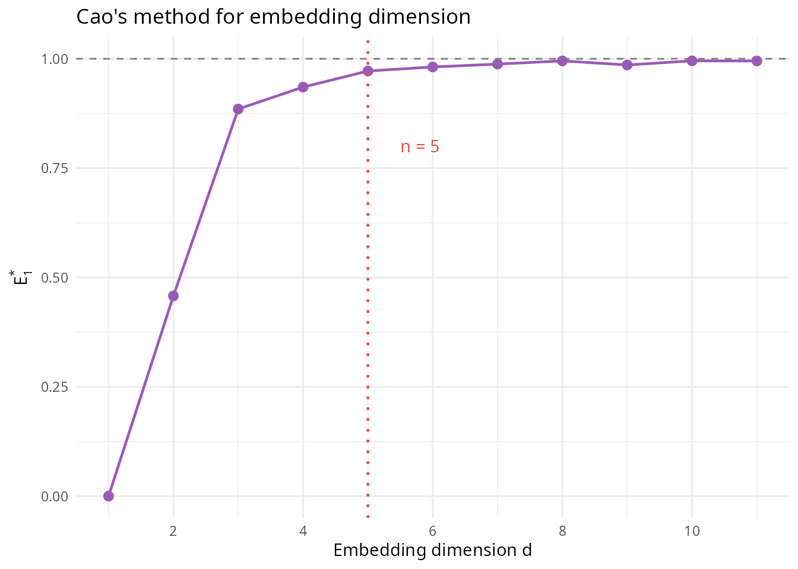

The theoretical foundation for attractor reconstruction is Takens’
embedding theorem [\[7\]](#ref7), which establishes that for a
\\d\\-dimensional attractor, an embedding dimension \\n \geq 2d + 1\\
generically provides a diffeomorphic reconstruction from a scalar time
series. Cao’s method operationalizes this by examining how the ratio of
distances between reconstructed points changes as the embedding
dimension increases; when this ratio stabilizes near unity, the
attractor has been properly unfolded.

For Lyapunov exponent estimation, the package implements both the Wolf
algorithm [\[8\]](#ref8) and the Rosenstein algorithm [\[9\]](#ref9).
The Wolf method tracks a reference trajectory and its nearest neighbor,
replacing the neighbor whenever the separation exceeds a threshold, then
averages the logarithmic divergence rates. The Rosenstein method instead
computes the average divergence curve over all pairs of nearby
trajectories and estimates the exponent from the slope of the linear
scaling region.

``` r

# Wolf algorithm for Lyapunov exponent
lyap_wolf <- turbulence_lyapunov(
    lorenz,
    embed_dim = 10,
    tau = 10,
    method = "wolf"
)
print(lyap_wolf)
#> Turbulence Lyapunov Exponent (wolf algorithm)
#>   λ₁: 1.2485 (per unit time)
#>   λ₁: 0.006243 (per step, dt=0.0050)
#>   Regime: Chaotic
#>   Iterations: 1990
#>   Embedding: dim=10, τ=10
summary(lyap_wolf)
#> Lyapunov-exponent estimation summary (wolf algorithm)
#> ======================================================= 
#> 
#> Largest Lyapunov exponent lambda_1: 1.2485 (per unit time)
#>                               (per step:  0.006243, dt = 0.0050)
#> Regime classification:              chaotic
#> 
#> Embedding parameters: dim = 10, tau = 10
#> Iterations:           1990
```

``` r

# Rosenstein algorithm with visualization of divergence curve
lyap_ros <- turbulence_lyapunov(
    lorenz,
    embed_dim = 10,
    tau = 10,
    method = "rosenstein",
    max_steps = 300
)
print(lyap_ros)
#> Turbulence Lyapunov Exponent (rosenstein algorithm)
#>   λ₁: 1.7218 (per unit time)
#>   λ₁: 0.008609 (per step, dt=0.0050)
#>   Regime: Chaotic
#>   Iterations: 300
#>   Embedding: dim=10, τ=10
plot(lyap_ros)
```

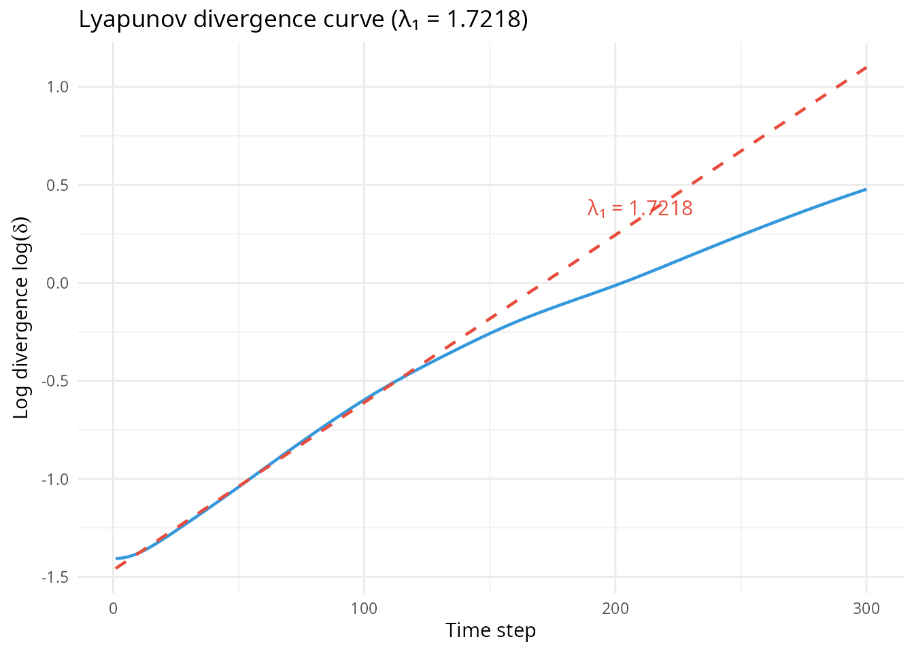

The estimated Lyapunov exponents should approximate the theoretical
value of \\\lambda_1 \approx 0.906\\ for sufficiently long time series
with appropriate embedding parameters.

  

### The Rössler system

Otto Rössler introduced his eponymous system in 1976 [\[10\]](#ref10)
with the explicit goal of constructing the simplest possible continuous
system exhibiting chaotic behavior. While the Lorenz system arose from a
physical model and exhibits relatively complex dynamics with two-lobe
structure, Rössler sought a minimal mathematical construction that would
isolate the essential mechanisms of chaos.

The equations are:

\\\frac{dx}{dt} = -y - z\\ \\\frac{dy}{dt} = x + ay\\ \\\frac{dz}{dt} =
b + z(x - c)\\

The first two equations describe a simple linear oscillator in the \\(x,
y)\\ plane, with \\x\\ and \\y\\ representing oscillatory components
that are phase-shifted relative to each other. The third equation
couples this oscillator to a “switching” variable \\z\\, which remains
small most of the time but occasionally grows large enough to fold the
trajectory back onto itself. This mechanism creates the characteristic
single-scroll attractor structure.

While purely mathematical in origin, the Rössler equations have been
shown to model certain chemical reaction kinetics, particularly variants
of the Belousov-Zhabotinsky reaction where \\x\\ and \\y\\ represent
oscillating chemical concentrations and \\z\\ represents a slowly
accumulating inhibitor that periodically “fires” to reset the
oscillation.

The parameter \\c\\ serves as the primary control parameter, governing
the route to chaos through period-doubling. For \\c \< 3\\, the system
exhibits simple limit cycle behavior with trajectories forming closed
periodic orbits. As \\c\\ increases through approximately 3-4, the
system undergoes a period-doubling bifurcation to period-2 orbits.
Further increases produce a cascade of period-doublings, accumulating at
a critical value beyond which the system becomes chaotic. For \\c =
5.7\\ with \\a = b = 0.2\\, the system is fully chaotic with a largest
Lyapunov exponent of approximately \\\lambda_1 \approx 0.07\\
[\[11\]](#ref11).

Unlike the Lorenz attractor’s two symmetric lobes, the Rössler attractor
has a single-band structure. Trajectories spiral outward in the \\(x,
y)\\ plane, gradually increasing in amplitude until the \\z\\-dynamics
trigger a reinjection event that folds the trajectory back onto the
attractor. This folding mechanism, operating in a simpler geometric
context than Lorenz, made the Rössler system valuable for understanding
the topology of strange attractors.

``` r

# Simulate Rössler system in chaotic regime
rossler <- rossler_sim(
    a = 0.2,
    b = 0.2,
    c = 5.7,
    n_steps = 300000,
    dt = 0.001,
    thin = 5,
    seed = 42
)

print(rossler)
#> Rössler System Simulation
#>   Parameters: a=0.20, b=0.20, c=5.70
#>   Time points: 60000
#>   Time span: [0, 299.99]
summary(rossler)
#> Rössler System Simulation Summary
#> ================================================== 
#> 
#> Parameters:
#>   a: 0.2000
#>   b: 0.2000
#>   c: 5.7000
#> 
#> Integration:
#>   Time step dt: 0.0010
#>   Total steps: 300000
#>   Output points: 60000
#> 
#> State variable ranges:
#>   x: [-9.104, 11.431]
#>   y: [-10.788, 7.839]
#>   z: [0.000, 22.830]
```

``` r

p <- plot(rossler, type = "attractor")
p
```

The Rössler attractor exhibits a characteristic single-scroll geometry.
Trajectories spiral outward in the (x,y) plane before being folded back
by the nonlinear z-dynamics, creating the distinctive band structure
visible in three dimensions.

``` r

# Estimate Lyapunov exponent for Rössler
lyap_rossler <- turbulence_lyapunov(
    rossler,
    embed_dim = 10,
    tau = 15,
    method = "rosenstein",
    max_steps = 400
)
print(lyap_rossler)
#> Turbulence Lyapunov Exponent (rosenstein algorithm)
#>   λ₁: 1.2964 (per unit time)
#>   λ₁: 0.006482 (per step, dt=0.0050)
#>   Regime: Chaotic
#>   Iterations: 400
#>   Embedding: dim=10, τ=15
summary(lyap_rossler)
#> Lyapunov-exponent estimation summary (rosenstein algorithm)
#> ======================================================= 
#> 
#> Largest Lyapunov exponent lambda_1: 1.2964 (per unit time)
#>                               (per step:  0.006482, dt = 0.0050)
#> Regime classification:              chaotic
#> 
#> Embedding parameters: dim = 10, tau = 15
#> Iterations:           400
plot(lyap_rossler)
```

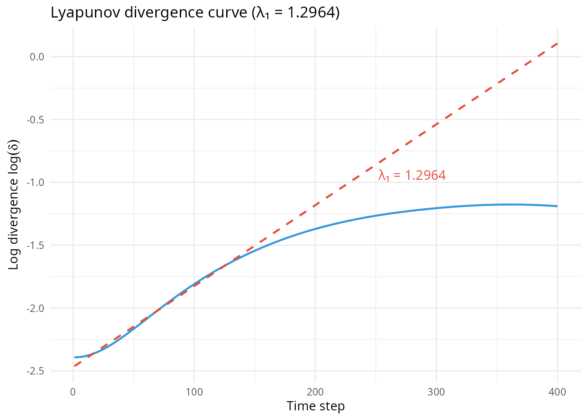

The period-doubling route to chaos exemplified by the Rössler system
follows a universal pattern discovered by Feigenbaum [\[12\]](#ref12),
with the ratio of successive bifurcation intervals converging to the
Feigenbaum constant \\\delta \approx 4.669\\. This universality means
that the same sequence appears in systems as diverse as population
dynamics, fluid convection, and electronic circuits.

``` r

# Explore period-doubling route to chaos
sim_periodic <- rossler_sim(c = 3.0, n_steps = 300000, seed = 42)
sim_p2 <- rossler_sim(c = 4.0, n_steps = 300000, seed = 42)
sim_chaos <- rossler_sim(c = 5.7, n_steps = 300000, seed = 42)

# Each attractor shows progressively more complex structure
p1 <- plot(sim_periodic, type = "attractor")  # Simple limit cycle
p2 <- plot(sim_p2, type = "attractor")        # Period-2 orbit
p3 <- plot(sim_chaos, type = "attractor")     # Chaotic attractor
```

  

### The Lorenz-84 atmospheric model

Two decades after his discovery of chaos, Lorenz returned to the problem
of atmospheric dynamics with a different approach [\[13\]](#ref13).
Rather than deriving equations from first principles as he had in 1963,
he constructed a phenomenological model to capture the essential
features of mid-latitude atmospheric circulation: the mean westerly wind
current and the planetary-scale waves that ride upon it.

The Lorenz-84 system represents the large-scale dynamics of the
mid-latitude atmosphere using three variables: \\x\\ represents the
strength of the symmetric westerly wind current (the zonal flow), while
\\y\\ and \\z\\ describe the amplitudes of cosine and sine components of
a single planetary wave. This spectral truncation captures the
fundamental wave-mean flow interaction that governs atmospheric
variability on synoptic to seasonal timescales.

The equations are:

\\\frac{dx}{dt} = -ax - y^2 - z^2 + aF\\ \\\frac{dy}{dt} = -y + xy -
bxz + G\\ \\\frac{dz}{dt} = -z + bxy + xz\\

The parameter \\a\\ represents mechanical and thermal damping of the
large-scale flow, controlling the rate at which the westerly wind
current relaxes toward equilibrium. The parameter \\b\\ is an advection
coefficient for wave-flow interaction, representing the strength of
nonlinear coupling between the westerly wind and the planetary waves.
The thermal forcing \\F\\ represents the equator-to-pole temperature
gradient, the fundamental driver of mid-latitude circulation. This is
the primary control parameter: \\F \< 4\\ gives stable fixed points; \\F
\approx 6-8\\ produces periodic or chaotic behavior; \\F \> 8\\ enhances
chaos. The asymmetric forcing \\G\\ captures land-sea contrasts or
topographic effects that break the symmetry between wave modes. Setting
\\G = 0\\ gives a symmetric system; \\G \neq 0\\ favors one wave phase
over the other.

The system exhibits multiple dynamical regimes depending on the
parameters, including stable fixed points corresponding to steady
circulation patterns, periodic oscillations representing regular
wave-mean flow vacillations, and chaotic behavior with irregular
transitions between different circulation states. The transitions
between these regimes have been connected to observed atmospheric
phenomena, particularly blocking events where the normal westerly flow
is interrupted by persistent stationary wave patterns.

``` r

# Simulate Lorenz-84 in chaotic regime
lorenz84 <- lorenz84_sim(
    F = 8,
    G = 1,
    a = 0.25,
    b = 4,
    n_steps = 200000,
    dt = 0.001,
    thin = 5,
    seed = 42
)

print(lorenz84)
#> Lorenz-84 Atmospheric Model Simulation
#>   Parameters: a=0.25, b=4.00, F=8.00, G=1.00
#>   Time points: 40000
#>   Time span: [0, 200.00]
summary(lorenz84)
#> Lorenz-84 Atmospheric Model Summary
#> ================================================== 
#> 
#> Parameters:
#>   Damping a: 0.2500
#>   Wave number b: 4.0000
#>   Symmetric forcing F: 8.0000
#>   Asymmetric forcing G: 1.0000
#> 
#> Integration:
#>   Time step dt: 0.0010
#>   Total steps: 200000
#>   Output points: 40000
#> 
#> State variable ranges:
#>   x (westerly wind): [-0.657, 2.835]
#>   y (wave cosine): [-2.246, 2.363]
#>   z (wave sine): [-2.473, 2.135]
```

``` r

p <- plot(lorenz84, type = "attractor")
p
```

The Lorenz-84 attractor shows the chaotic interaction between zonal flow
(x-axis) and planetary wave amplitude (y-z plane). The irregular
transitions between states of strong zonal flow and large wave amplitude
correspond to shifts between different atmospheric circulation regimes.

``` r

# Estimate Lyapunov exponent for Lorenz-84
lyap_l84 <- turbulence_lyapunov(
    lorenz84,
    embed_dim = 10,
    tau = 12,
    method = "rosenstein",
    max_steps = 350
)
print(lyap_l84)
#> Turbulence Lyapunov Exponent (rosenstein algorithm)
#>   λ₁: 3.3182 (per unit time)
#>   λ₁: 0.016591 (per step, dt=0.0050)
#>   Regime: Chaotic
#>   Iterations: 350
#>   Embedding: dim=10, τ=12
summary(lyap_l84)
#> Lyapunov-exponent estimation summary (rosenstein algorithm)
#> ======================================================= 
#> 
#> Largest Lyapunov exponent lambda_1: 3.3182 (per unit time)
#>                               (per step:  0.016591, dt = 0.0050)
#> Regime classification:              chaotic
#> 
#> Embedding parameters: dim = 10, tau = 12
#> Iterations:           350
plot(lyap_l84)
```

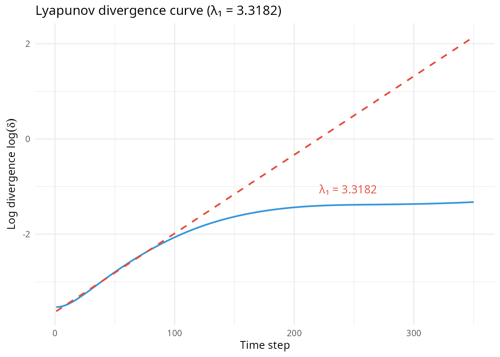

The Lorenz-84 model has been extensively used in studies of atmospheric
predictability, where its low dimensionality allows detailed analysis
while retaining essential features of large-scale atmospheric dynamics.
It has also served as a testbed for data assimilation methods and
ensemble forecasting techniques.

  

## Geophysical fluid dynamics

  

### Von Kármán turbulent flow

The von Kármán swirling flow experiment provides one of the most
thoroughly studied laboratory realizations of fully developed turbulence
[\[14\]](#ref14). The experimental apparatus consists of a cylindrical
container filled with a viscous fluid (typically water) stirred by two
coaxial, counter-rotating impellers. Each impeller is a disk fitted with
curved blades that create swirling flow patterns. The system operates at
Reynolds numbers exceeding \\3 \times 10^5\\, far into the fully
developed turbulent regime.

In a remarkable 2017 study, Faranda and colleagues [\[3\]](#ref3)
demonstrated that despite the enormous complexity of the full turbulent
flow field, the large-scale dynamics could be captured by an extremely
simple model: a stochastic Duffing oscillator. The key insight was that
while small-scale turbulent fluctuations exhibit high-dimensional
behavior consistent with Landau’s quasi-periodic picture, the
large-scale flow reversals between two metastable states collapse onto a
low-dimensional random attractor consistent with Ruelle-Takens theory.

The order parameter characterizing the symmetry of the turbulent state
is:

\\\theta(t) = \frac{f_1(t) - f_2(t)}{f_1(t) + f_2(t)}\\

where \\f_1\\ and \\f_2\\ are the rotation frequencies of the top and
bottom impellers. This observable measures the asymmetry in impeller
response and fluctuates around zero when the flow respects the
top-bottom symmetry.

The minimal model capturing the experimental observations is the
stochastic Duffing oscillator:

\\\ddot{\theta} + \gamma\dot{\theta} - \mu\theta + \theta^3 = \xi(t)\\

where \\\theta\\ represents the angular momentum of the large-scale
circulation, \\\mu\\ controls the depth of the double-well potential
governing bistability, \\\gamma\\ provides damping, and \\\xi(t)\\
represents Ornstein-Uhlenbeck colored noise forcing that models the
aggregate effect of unresolved turbulent fluctuations. The noise is
generated by the auxiliary equation:

\\d\xi = -\phi(\xi - \mu\_\xi) dt + \sigma dW_t\\

where \\\phi\\ is the relaxation rate, \\\mu\_\xi\\ is the mean forcing,
\\\sigma\\ is the noise amplitude, and \\W_t\\ is a standard Wiener
process.

The physical interpretation of this model structure is illuminating. The
cubic potential \\V(\theta) = -\frac{\mu}{2}\theta^2 +
\frac{1}{4}\theta^4\\ arises from the \\\theta \to -\theta\\ symmetry of
the experimental setup, which excludes quadratic terms and makes the
Duffing equation the minimal nonlinear oscillator respecting this
constraint. The two minima at \\\theta = \pm\sqrt{\mu}\\ correspond to
the two quasistationary states \\s_1\\ and \\s_2\\ observed
experimentally, representing different mean flow topologies. The
stochastic forcing enables noise-induced transitions between these
states, with the transition rate depending on both the noise intensity
and the barrier height.

The bifurcation sequence as \\\mu\\ varies follows a characteristic
pattern. For \\\mu \< 0\\, the origin is the unique stable fixed point
and the system exhibits unimodal noise-perturbed dynamics centered on
\\\theta = 0\\; here the Lyapunov exponent \\\lambda_1 \approx 0\\,
indicating a random point attractor. At \\\mu = 0\\, a supercritical
pitchfork bifurcation occurs, and for \\\mu \> 0\\, two symmetric stable
fixed points emerge while the origin becomes unstable. In the range
\\0.02 \< \mu \< 0.06\\, noisy periodic motion emerges as the system
oscillates between the two quasistationary states with a characteristic
frequency. For \\\mu \> 0.06\\, the attractor becomes strange, with
sensitive dependence on initial conditions (\\\lambda_1 \> 0\\) and
multiple transition paths between quasistationary states.

A crucial finding of the original study is that the stochastic forcing
is essential for reproducing the experimental observations. The
deterministic Duffing equation exhibits discontinuous jumps in Lyapunov
exponents as \\\mu\\ varies, while the stochastic version shows smooth
transitions matching the experimental data. The noise smooths the
bifurcation structure, enables transitions between coexisting
attractors, and maintains the correct transition rates between
quasistationary states.

``` r

# Simulate von Kármán turbulent flow
vk <- vonkarman_sim(
    mu = 0.3,
    n_steps = 100000,
    dt = 0.01,
    seed = 42
)

print(vk)
#> Von Kármán Stochastic Duffing Simulation
#>   Control parameter μ: 0.3000
#>   Time points: 100000
#>   Time span: [0, 999.99]
#>   Parameters: a=0.20, φ=0.90, σ=0.20, ω=1.00
summary(vk)
#> Von Kármán Stochastic Duffing Simulation Summary
#> ================================================== 
#> 
#> Parameters:
#>   Control parameter μ: 0.3000
#>   Damping a: 0.200
#>   OU relaxation φ: 0.900
#>   Noise amplitude σ: 0.200
#>   Forcing frequency ω: 1.000
#> 
#> Integration:
#>   Time step dt: 0.0100
#>   Total steps: 100000
#>   Output points: 100000
#> 
#> State variable ranges:
#>   x: [-1.887, 1.815]
#>   y: [-1.707, 1.719]
#>   θ: [-2.887, 0.815]
#> 
#> Estimated regime: Chaotic attractor
```

``` r

plot(vk, type = "timeseries", var = "theta")
```


Time series of the angular momentum parameter θ in the von Kármán
system. The irregular switching between positive and negative states
reflects noise-induced transitions between the two metastable flow
configurations corresponding to different large-scale circulation
patterns.

The package provides specialized tools for von Kármán analysis,
including peak extraction following the method of Packard and colleagues
[\[15\]](#ref15). The peak embedding approach first applies a moving
average filter to remove high-frequency noise, then extracts local
maxima from the filtered time series with a minimum separation
constraint, and finally embeds these peaks in \\n\\-dimensional space
using delay coordinates.

``` r

# Extract peaks for embedding
peaks <- vonkarman_peaks(vk, min_separation = 0.05)
print(peaks)
#> Von Kármán Peak Extraction
#>   Number of peaks: 151
#>   Type: maxima
#>   Minimum separation: 0.050
summary(peaks)
#> Von Kármán peak extraction summary
#> ============================================= 
#> 
#> Number of peaks:           151
#> Type:                      maxima
#> Minimum separation:        0.050
#> Control parameter mu:      0.3000
#> Peak amplitude range:      [-2.101, 0.815]
#> Median inter-peak time:    6.515
plot(peaks)
```

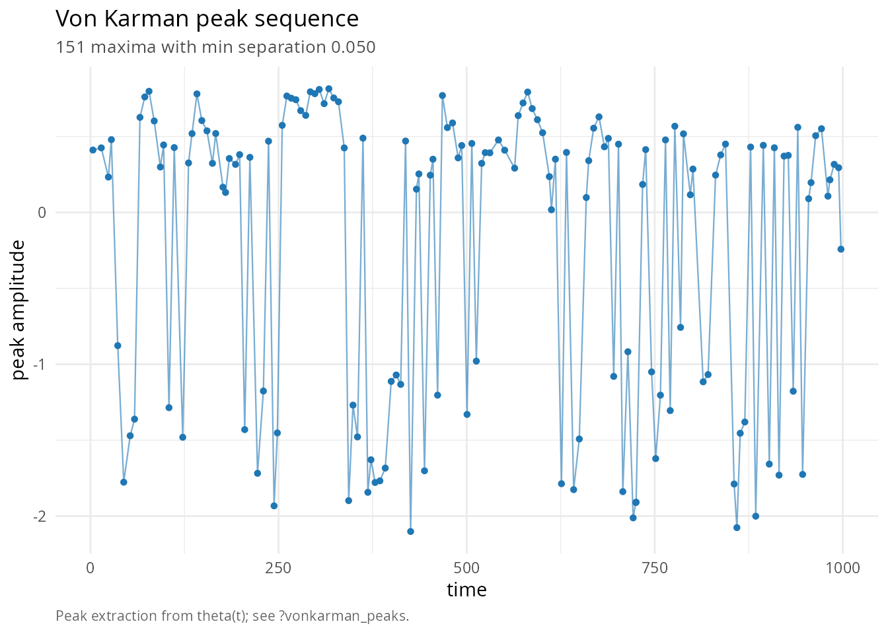

``` r


# Construct peak-embedded attractor
attr <- vonkarman_attractor(peaks, embed_dim = 3)
print(attr)
#> Von Kármán Embedded Attractor
#>   Embedding dimension: 3
#>   Number of embedded points: 149
#>   Control parameter μ: 0.3000
summary(attr)
#> Von Kármán attractor summary
#> ======================================== 
#> 
#> Embedding dimension: 3
#> Number of embedded points: 149
#> Control parameter μ: 0.3000
#> 
#> Embedding bounds:
#>   theta_m0: [-2.1014, 0.8148]
#>   theta_m1: [-2.1014, 0.8148]
#>   theta_m2: [-2.1014, 0.8148]
```

``` r

p <- plot(attr)
p
```

The von Kármán attractor reconstructed via peak embedding. Despite the
stochastic nature of the dynamics, a coherent low-dimensional structure
emerges, demonstrating that the essential chaotic behavior persists
beneath the noise.

The effective embedding dimension estimated by Cao’s method yields
\\n\_{\text{eff}} \approx 9\\-\\10\\ for both experimental data and the
stochastic Duffing model. This relatively high dimension arises from the
combination of the three-dimensional deterministic flow \\(x, y, t \mod
2\pi/\omega)\\ and the stochastic dimension from the Ornstein-Uhlenbeck
process.

``` r

# Estimate embedding dimension
cao_vk <- turbulence_cao(vk, max_dim = 15, tau = 10)
print(cao_vk)
#> Turbulence Cao Dimension Analysis
#>   Estimated optimal dimension: 7
#>   Dimensions tested: 1-15
#>   Time delay τ: 10
summary(cao_vk)
#> Cao's method summary
#> ======================================== 
#> 
#> Suggested embedding dimension: 7
#> Time delay (tau): 10
#> Dimensions tested: 1 to 15
#> 
#> E1* statistics:
#>   Mean: 0.8585
#>   Range: [0.0001, 0.9951]
#> 
#> E1 and E2 by dimension:
#>   d = 1: E1 = 46442.0254, E2 = 0.0734, E1* = 0.0001
#>   d = 2: E1 = 3.1446, E2 = 0.0030, E1* = 0.6257
#>   d = 3: E1 = 1.9676, E2 = 0.0034, E1* = 0.8159
#>   d = 4: E1 = 1.6055, E2 = 0.0038, E1* = 0.8715
#>   d = 5: E1 = 1.3991, E2 = 0.0040, E1* = 0.9161
#>   d = 6: E1 = 1.2817, E2 = 0.0042, E1* = 0.9479
#>   d = 7: E1 = 1.2149, E2 = 0.0044, E1* = 0.9581
#>   d = 8: E1 = 1.1641, E2 = 0.0046, E1* = 0.9690
#>   d = 9: E1 = 1.1280, E2 = 0.0048, E1* = 0.9806
#>   d = 10: E1 = 1.1061, E2 = 0.0050, E1* = 0.9752
#>   d = 11: E1 = 1.0787, E2 = 0.0050, E1* = 0.9832
#>   d = 12: E1 = 1.0606, E2 = 0.0051, E1* = 0.9873
#>   d = 13: E1 = 1.0471, E2 = 0.0051, E1* = 0.9927
#>   d = 14: E1 = 1.0395, E2 = 0.0051, E1* = 0.9951
#>   d = 15: E1 = 1.0344, E2 = 0.0052, E1* = NA
plot(cao_vk)
```

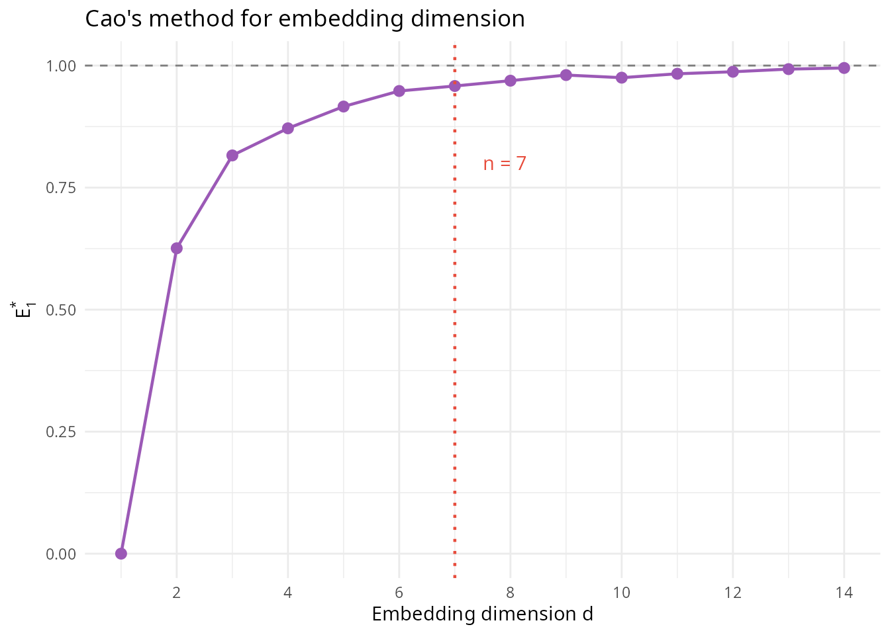

``` r

# Estimate Lyapunov exponent
lyap_vk <- turbulence_lyapunov(vk, embed_dim = 10, tau = 10, method = "rosenstein")
print(lyap_vk)
#> Turbulence Lyapunov Exponent (rosenstein algorithm)
#>   λ₁: 1.9933 (per unit time)
#>   λ₁: 0.019933 (per step, dt=0.0100)
#>   Regime: Chaotic
#>   Iterations: 500
#>   Embedding: dim=10, τ=10
summary(lyap_vk)
#> Lyapunov-exponent estimation summary (rosenstein algorithm)
#> ======================================================= 
#> 
#> Largest Lyapunov exponent lambda_1: 1.9933 (per unit time)
#>                               (per step:  0.019933, dt = 0.0100)
#> Regime classification:              chaotic
#> 
#> Embedding parameters: dim = 10, tau = 10
#> Iterations:           500
plot(lyap_vk)
```

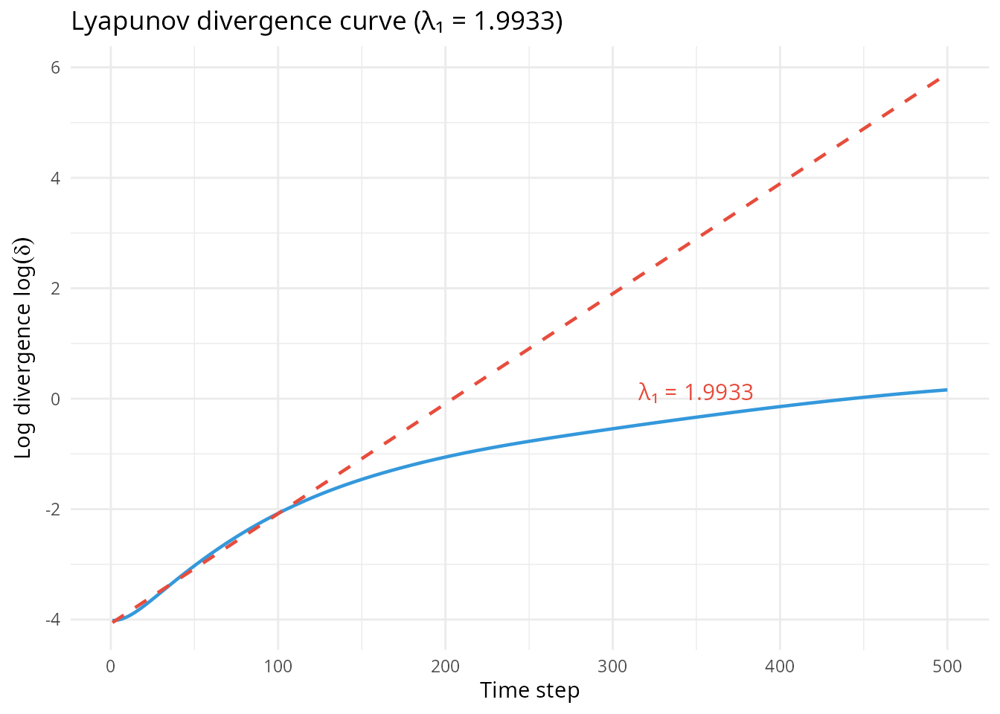

  

### Charney-DeVore atmospheric blocking model

The Charney-DeVore model, introduced in 1979 [\[16\]](#ref16),
represents a landmark in the dynamical systems approach to atmospheric
science. Jule Charney, one of the founders of modern meteorology,
together with John DeVore, developed this model to understand
atmospheric blocking, a phenomenon where the normal westerly flow is
interrupted by persistent stationary wave patterns that can maintain
anomalous weather for weeks.

  

#### The full 6-mode model

The original Charney-DeVore model truncates the barotropic vorticity
equation in a \\\beta\\-plane channel to six spectral modes. The state
variables \\\\x_1, x_2, x_3, x_4, x_5, x_6\\\\ represent amplitudes of
zonal flow modes and planetary waves. Following the formulation in
[\[21\]](#ref21), the equations are:

\\\dot{x}\_1 = -C(x_1 - x_1^\*) + \tilde{\gamma}\_1 x_3\\ \\\dot{x}\_2 =
-Cx_2 + \beta_1 x_3 - \alpha_1 x_1 x_3 - \delta_1 x_4 x_6\\ \\\dot{x}\_3
= -Cx_3 - \beta_1 x_2 + \alpha_1 x_1 x_2 + \delta_1 x_4 x_5 - \gamma_1
x_1\\ \\\dot{x}\_4 = -C(x_4 - x_4^\*) + \varepsilon(x_2 x_6 - x_3 x_5) +
\tilde{\gamma}\_2 x_6\\ \\\dot{x}\_5 = -Cx_5 + \beta_2 x_6 - \alpha_2
x_1 x_6 - \delta_2 x_4 x_3\\ \\\dot{x}\_6 = -Cx_6 - \beta_2 x_5 +
\alpha_2 x_1 x_5 + \delta_2 x_4 x_2 - \gamma_2 x_4\\

where \\C\\ is the thermal relaxation rate (Ekman damping), \\x_1^\*\\
and \\x_4^\*\\ are the externally forced equilibrium states representing
the thermal driving, and the coefficients \\\alpha_m\\, \\\beta_m\\,
\\\gamma_m\\, \\\tilde{\gamma}\_m\\, \\\delta_m\\, and \\\varepsilon\\
depend on channel geometry, topography, and the planetary vorticity
gradient \\\beta\\. Standard parameter values are \\x_1^\* = 0.95\\,
\\x_4^\* = -0.76095\\, and \\C = 0.1\\ (corresponding to a damping time
of approximately 10 days).

The original Charney-DeVore (1979) paper demonstrated that this model
can exhibit genuine bistability under appropriate parameter regimes: two
stable equilibria coexist corresponding to the **high-index state**
(strong zonal flow, weak waves, normal westerly wind belt) and the
**low-index state** (weak zonal flow, amplified waves, atmospheric
blocking). Finding these bistable regimes requires careful parameter
tuning related to the topographic resonance condition. With standard
parameters, the model typically has a single stable equilibrium, but
stochastic forcing can induce variability and regime-like behavior
characteristic of atmospheric blocking events.

  

#### The simplified 3-mode version

The package implements a simplified 3-mode version that captures the
essential wave-mean flow interaction:

\\\frac{dx}{dt} = k(F - x) - \alpha yz + \beta y\\ \\\frac{dy}{dt} =
-ky + \alpha xz - \beta x - \delta z\\ \\\frac{dz}{dt} = -kz + \delta
y\\

where \\x\\ represents the zonal flow amplitude that relaxes toward the
external forcing \\F\\, and \\(y, z)\\ represent planetary wave
amplitudes. The term \\k(F - x)\\ ensures the zonal flow is driven
toward the externally forced state \\F\\ in the absence of wave
activity. The thermal forcing parameter \\F\\ plays a role analogous to
the Rayleigh number in convection: it represents the equator-to-pole
temperature gradient that drives the circulation. Higher \\F\\ produces
stronger zonal flow and increased wave activity through the topographic
coupling terms.

``` r

# Simulate Charney-DeVore with stochastic forcing
charney <- charney_devore_sim(
    F = 1.5,
    n_steps = 100000,
    stochastic = TRUE,
    seed = 42
)

print(charney)
#> Charney-DeVore Atmospheric Blocking Model (Stochastic)
#>   Forcing parameter F: 1.5000
#>   Time points: 100000
#>   Time span: [0, 999.99]
#>   Mean zonal flow: 0.632, wave amplitude: 0.787
#>   Dominant regime: Transitional/Intermittent
summary(charney)
#> Charney-DeVore Atmospheric Blocking Model Summary
#> ======================================================= 
#> 
#> Parameters:
#>   Forcing F: 1.500
#>   Damping k: 0.100
#>   Couplings: α=1.000, β=0.500, δ=1.000
#>   Noise amplitude σ: 0.150
#> 
#> State variable statistics:
#>   x (zonal): mean=0.632, sd=0.358, range=[-0.620, 1.922]
#>   y (wave1): mean=-0.072, sd=0.385, range=[-1.326, 1.292]
#>   z (wave2): mean=-0.640, sd=0.426, range=[-1.872, 0.964]
#> 
#> Blocking analysis:
#>   Wave amplitude threshold (75th): 1.028
#>   Blocked fraction: 17.9%
#>   Mean wave energy: 0.744
```

``` r

plot(charney, type = "phase")
```


Phase space portrait of the Charney-DeVore model showing the zonal flow
amplitude x versus the wave mode y. The stochastic dynamics causes the
system to visit both the high-index (large x, small wave amplitude) and
low-index (smaller x, large wave amplitude) regions, corresponding to
zonal and blocked atmospheric states respectively.

``` r

p <- plot(charney, type = "attractor")
p
```

Three-dimensional attractor of the Charney-DeVore system. The structure
reflects the competition between zonal flow and wave activity, with the
stochastic forcing enabling transitions between metastable atmospheric
states.

The package provides tools for analyzing blocking frequency, which is a
key diagnostic for characterizing the system’s behavior. Blocking events
are identified when the wave amplitude exceeds its 75th percentile while
the zonal flow is below its median, conditions that capture the
essential phenomenology of atmospheric blocking.

``` r

# Analyze blocking frequency for a single simulation
plot(charney, type = "blocking")
```

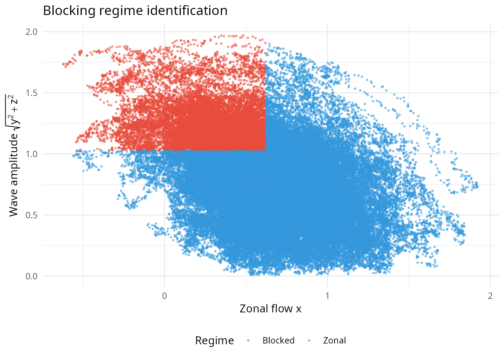

The batch simulation capability enables systematic exploration of regime
transitions across the forcing parameter, revealing how the character of
atmospheric variability changes with the strength of the meridional
temperature gradient.

``` r

# Batch simulation across forcing values
F_seq <- seq(0.5, 3.0, length.out = 21)
batch_cd <- charney_devore_batch(F_seq, n_steps = 50000, seed = 42)

print(batch_cd)
#> Charney-DeVore 3-mode batch simulation
#> ======================================== 
#> Forcing range: F in [0.500, 3.000]
#> Number of forcings: 21
#> Total observations: 50000
summary(batch_cd)
#> Charney-DeVore 3-mode batch simulation summary
#> ================================================== 
#> 
#> Forcing values: 21 (F in [0.500, 3.000])
#> Total observations: 50000
#> 
#> State-variable ranges (across all forcings):
#>   x: [-1.072, 2.545]
#>   y: [-1.917, 1.753]
#>   z: [-2.475, 1.471]

# Visualize blocking frequency across parameter space
plot(batch_cd, type = "blocking")
```

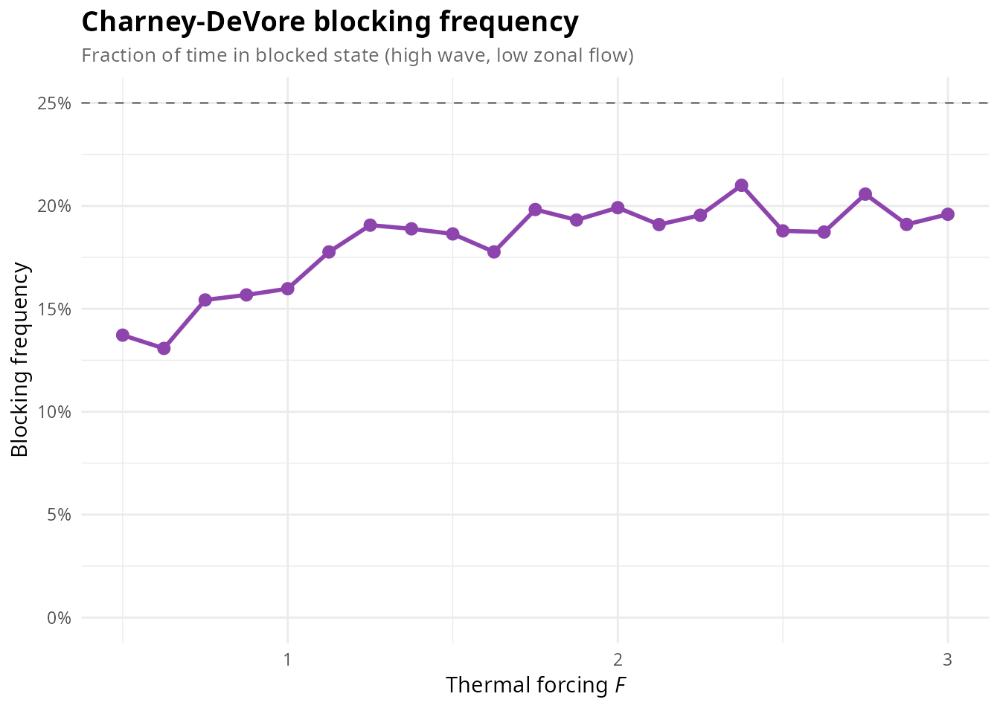

``` r

plot(batch_cd, var = "x", type = "density")
```


Bifurcation diagram showing zonal flow amplitude as a function of
thermal forcing F. The spread of values at each F reflects the
stochastic variability, while the overall trend shows the transition
from blocked-dominated (low F) to zonal-dominated (high F) regimes.

  

#### The full 6-mode model in practice

The package also provides the complete 6-mode Charney-DeVore system
through the
[`charney_devore_6mode()`](https://robustecologies.github.io/tuRbulence/reference/charney_devore_6mode.md)
function. This preserves all six interacting spectral modes from the
original 1979 formulation:

``` r

# Full 6-mode model with stochastic forcing
cdv6 <- charney_devore_6mode(
    n_steps = 100000,
    sigma = 0.02,
    stochastic = TRUE,
    seed = 42
)

print(cdv6)
#> Charney-DeVore 6-Mode Model (Stochastic)
#>   Forced states: x1* = 0.9500, x4* = -0.76095
#>   Time points: 100000
#>   Time span: [0, 999.99]
#>   Mean x1: 0.905, wave amplitude: 0.272
#>   Dominant regime: High-index (zonal)
summary(cdv6)
#> Charney-DeVore 6-Mode Model Summary
#> ======================================================= 
#> 
#> Physical parameters:
#>   Forced zonal states: x1* = 0.9500, x4* = -0.76095
#>   Damping C: 0.100 (tau ~ 10 days)
#>   Channel b: 0.500, beta: 1.250, gamma: 0.200
#> 
#> Derived coefficients:
#>   alpha1: 0.1695, alpha2: 0.0261
#>   beta1: 1.0000, beta2: 0.5882
#>   delta1: 0.1695, delta2: 0.3389
#>   epsilon: 0.0733
#> 
#> State variable statistics:
#>   x1: mean=0.905, sd=0.041, range=[0.745, 1.038]
#>   Wave energy: mean=0.076, sd=0.025
#>   Zonal index: mean=0.174, sd=0.059
```

``` r

plot(cdv6, type = "phase")
```


Phase space of the 6-mode Charney-DeVore model showing zonal flow (x1)
versus total wave energy. With stochastic forcing, the system explores a
range of states characteristic of atmospheric variability.

The 6-mode model produces richer dynamics than the simplified 3-mode
version due to the additional wave-wave interactions captured by the
coupling between modes 2-3 and modes 5-6. The computed coefficients
(\\\alpha\\, \\\beta\\, \\\gamma\\, \\\delta\\, \\\varepsilon\\) are
derived from the spectral truncation formulas in Charney and DeVore
(1979) based on channel geometry and the planetary vorticity gradient.

  

## Climate models

  

### Stommel thermohaline circulation model

Henry Stommel’s 1961 box model [\[17\]](#ref17) represents the ocean’s
thermohaline circulation, one of the most consequential components of
the climate system. The thermohaline circulation, driven by density
differences arising from variations in temperature and salinity,
transports roughly 1 petawatt of heat northward in the Atlantic Ocean,
profoundly influencing climate in Northwestern Europe and beyond.

Stommel’s brilliant insight was to reduce this enormously complex
three-dimensional ocean circulation to its essentials using a two-box
model. The boxes represent the equatorial and polar regions, connected
by exchange flow that depends on the density difference between them.
Temperature and salinity contribute oppositely to density: warm water is
light, but salty water is heavy. This opposing effect creates the
potential for multiple equilibria.

The state variables \\T\\ and \\S\\ represent temperature and salinity
differences between the equatorial and polar boxes. The circulation
strength \\q\\ depends on the density gradient:

\\q = \|T - S\|\\

with the sign depending on which effect dominates. When thermal effects
dominate (\\T \> S\\), the circulation is thermally-driven with warm
surface water flowing poleward and cold deep water returning
equatorward, as in the modern Atlantic. When salinity effects dominate
(\\S \> T\\), the circulation reverses.

The control parameter \\\eta_2\\ represents freshwater forcing, the
asymmetry in precipitation minus evaporation between the equatorial and
polar regions. As \\\eta_2\\ increases (more freshwater input to high
latitudes), the polar surface water becomes fresher and lighter,
potentially overwhelming the thermal density gradient and triggering a
transition to the salinity-dominated regime.

The model’s bistability has profound implications for understanding
abrupt climate change. Paleoclimate records reveal numerous instances of
rapid climate transitions, particularly during glacial periods, that may
reflect switches between circulation states. The Younger Dryas cold
event, approximately 12,900 years ago, is often attributed to a
freshwater pulse from melting ice sheets that disrupted the Atlantic
circulation, plunging the Northern Hemisphere back into near-glacial
conditions.

``` r

# Simulate Stommel model in bistable regime
stommel <- stommel_sim(
    eta2 = 1.0,
    n_steps = 100000,
    stochastic = TRUE,
    seed = 42
)

print(stommel)
#> Stommel Box Model Simulation (Stochastic)
#>   Freshwater flux η₂: 1.0000
#>   Time points: 100000
#>   Time span: [0, 999.99]
#>   Mean flow q: 0.719 (Thermally-dominated (T > S))
summary(stommel)
#> Stommel Box Model Simulation Summary
#> ================================================== 
#> 
#> Parameters:
#>   Temperature forcing η₁: 3.000
#>   Freshwater flux η₂: 1.000
#>   Relaxation ratio η₃: 0.300
#>   Noise amplitudes: σ_T=0.200, σ_S=0.200
#> 
#> State variable statistics:
#>   T: mean=1.754, sd=0.168, range=[1.325, 2.940]
#>   S: mean=1.035, sd=0.296, range=[0.402, 3.068]
#>   q: mean=0.719, sd=0.180, range=[-0.384, 1.341]
#> 
#> Flow regime occupancy:
#>   Thermal-dominated (q > 0): 99.6%
#>   Salinity-dominated (q < 0): 0.4%
#>   Regime transitions: 98
```

``` r

plot(stommel, type = "flow")
```


Time series of the flow strength q in the Stommel model. Positive values
indicate thermally-dominated circulation (like the modern Atlantic),
while negative values would indicate salinity-dominated (reversed)
circulation. The stochastic forcing causes fluctuations within each
regime and potentially enables transitions between states.

``` r

plot(stommel, type = "phase")
```


Phase space portrait of the Stommel model showing the temperature
difference T versus salinity difference S. The two stable branches of
circulation are visible, with the stochastic dynamics exploring the
neighborhood of each equilibrium.

The batch simulation capability allows exploration of how the
circulation responds to changes in freshwater forcing, revealing the
bifurcation structure that underlies the potential for abrupt
transitions.

``` r

# Batch simulation across freshwater forcing
eta2_seq <- seq(0.5, 2.0, length.out = 31)
batch_st <- stommel_batch(eta2_seq, n_steps = 50000, seed = 42)

print(batch_st)
#> Stommel two-box thermohaline batch simulation
#> ================================================== 
#> Salinity forcing range: eta2 in [0.500, 2.000]
#> Number of forcings: 31
#> Total observations: 50000
summary(batch_st)
#> Stommel two-box thermohaline batch simulation summary
#> ============================================================ 
#> 
#> Salinity forcings: 31 (eta2 in [0.500, 2.000])
#> Total observations: 50000
#> 
#> Box differences and flow strength (across all forcings):
#>   T (temperature diff): [1.111, 3.241]
#>   S (salinity diff):    [-0.065, 3.400]
#>   q (flow strength):    [-1.092, 1.614]

# Density ridge plot shows distribution of flow strength
plot(batch_st, var = "q", type = "density")
```

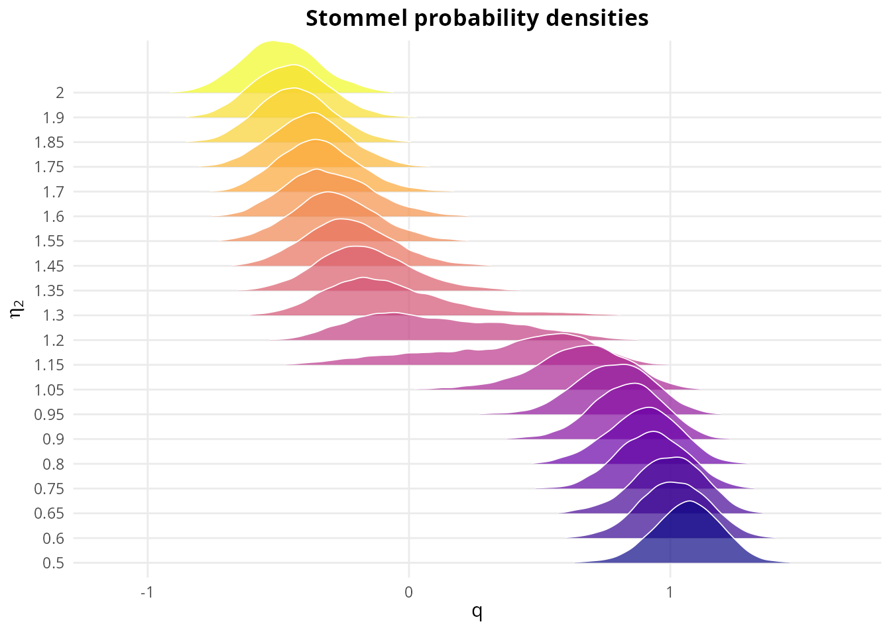

``` r

plot(batch_st, var = "q", type = "summary")
```


Summary statistics of the flow strength q as a function of freshwater
forcing. The mean flow decreases with increasing freshwater input as the
thermally-driven circulation weakens. The variance peaks in the bistable
regime where transitions between states become possible.

  

### Hasselmann stochastic climate model

Klaus Hasselmann’s 1976 framework [\[18\]](#ref18) revolutionized
climate science by providing a mathematical foundation for understanding
climate variability. His key insight was that the climate system acts as
a slow integrator of fast atmospheric fluctuations. Weather, with its
characteristic timescale of days, represents essentially white noise
forcing on the slow components of the climate system: the ocean,
cryosphere, and land surface.

The mathematical formulation begins with the separation of timescales.
Atmospheric variables \\\mathbf{x}\_a\\ fluctuate rapidly around a
statistically stationary state, while climate variables
\\\mathbf{x}\_c\\ evolve slowly. The evolution of the slow variables can
be written:

\\\frac{d\mathbf{x}\_c}{dt} = A\mathbf{x}\_c + N(\mathbf{x}\_a)\\

where \\A\\ represents the deterministic climate dynamics and
\\N(\mathbf{x}\_a)\\ represents the forcing from weather fluctuations.
Because the atmospheric forcing \\N\\ varies on timescales much shorter
than the climate response time, it can be approximated as white noise,
leading to a stochastic differential equation for the climate system.

The profound consequence is that the climate spectrum should exhibit a
characteristic red noise signature: power increasing toward lower
frequencies as \\S(f) \propto 1/f^2\\, in contrast to the relatively
flat (white) spectrum of weather variability. This prediction has been
confirmed across multiple climate proxies, from sea surface temperature
to ice core records.

The tuRbulence implementation extends Hasselmann’s basic framework to
include feedbacks relevant for glacial-interglacial dynamics. The three
state variables represent surface temperature (\\T\\), deep ocean
temperature (\\T_d\\), and ice extent (\\I\\). The ice-albedo feedback,
whereby increased ice cover reflects more sunlight and cools the climate
further, introduces the nonlinearity that enables multiple climate
states and the potential for oscillatory behavior.

``` r

# Simulate Hasselmann climate model
hasselmann <- hasselmann_sim(
    F_forcing = 0.5,
    n_steps = 50000,
    stochastic = TRUE,
    seed = 42
)

print(hasselmann)
#> Hasselmann Climate Model (Stochastic)
#>   External forcing F: 0.5000
#>   Time points: 50000
#>   Time span: [0, 4999.90]
#>   Mean temperature: 4.520, ice: 0.441
#>   Climate state: Intermediate
summary(hasselmann)
#> Hasselmann Stochastic Climate Model Summary
#> ================================================== 
#> 
#> Parameters:
#>   External forcing F: 0.500
#>   Climate feedback λ: 0.100
#>   Ocean exchange γ: 0.050
#>   Deep ocean κ: 0.010
#>   Ice coupling α: 0.100, β: 0.020, μ: 0.500
#>   Noise: σ_T=0.300, σ_I=0.100
#> 
#> State variable statistics:
#>   T (surface):  mean=4.520, sd=0.674, range=[-0.466, 6.666]
#>   Td (deep):    mean=4.428, sd=0.652, range=[-0.003, 5.065]
#>   I (ice):      mean=0.441, sd=0.340, range=[0.000, 2.271]
#> 
#> Temporal characteristics:
#>   Lag-1 autocorrelation: T=0.990, Td=1.000
#>   T e-folding time: 9.9 time units
```

``` r

plot(hasselmann, type = "timeseries", var = "T")
```


Time series of surface temperature in the Hasselmann stochastic climate
model. The irregular fluctuations arise from the integration of fast
weather noise by the slow climate components, producing the
characteristic red noise spectrum of climate variability.

``` r

p <- plot(hasselmann, type = "phase")
p
```

Three-dimensional phase space of the Hasselmann climate model showing
the coevolution of surface temperature (T), deep ocean temperature (Td),
and ice extent (I). The stochastic forcing creates a cloud of points,
but the overall structure reflects the deterministic skeleton modified
by noise.

The batch simulation capability enables exploration of climate
sensitivity: how the climate state responds to changes in radiative
forcing, such as those from varying greenhouse gas concentrations.

``` r

# Batch simulation across forcing values
F_seq <- seq(-1.0, 2.0, length.out = 31)
batch_hs <- hasselmann_batch(F_seq, n_steps = 30000, seed = 42)

print(batch_hs)
#> Hasselmann stochastic-climate batch simulation
#> ================================================== 
#> Forcing range: F in [-1.000, 2.000]
#> Number of forcings: 31
#> Total observations: 30000
summary(batch_hs)
#> Hasselmann stochastic-climate batch simulation summary
#> ============================================================ 
#> 
#> Forcings: 31 (F in [-1.000, 2.000])
#> Total observations: 30000
#> 
#> State-variable ranges (across all forcings):
#>   T  (mixed-layer T): [-22.537, 21.495]
#>   Td (deep T):        [-21.110, 19.967]
#>   I  (sea-ice index): [0.000, 11.738]

# Density ridge plot shows temperature distribution across forcings
plot(batch_hs, var = "T", type = "density")
```

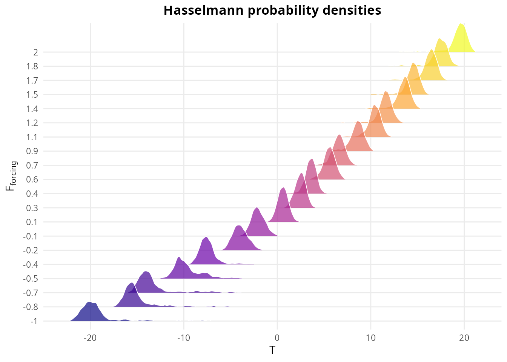

``` r

plot(batch_hs, var = "T", type = "summary")
```


Climate sensitivity as revealed by the Hasselmann model. The mean
temperature increases approximately linearly with forcing (the slope is
the climate sensitivity), while the variance reflects the interplay
between stochastic weather forcing and climate feedbacks. Increased
variance at certain forcing levels may indicate proximity to a
bifurcation point.

  

## Comparative analysis

The seven systems in tuRbulence span a range of dynamical behaviors and
physical contexts. The following table summarizes their key
characteristics:

``` r

comparison <- data.frame(
    System = c("Lorenz", "Rössler", "Lorenz-84", "von Kármán",
               "Charney-DeVore", "Stommel", "Hasselmann"),
    Dimension = c(3, 3, 3, 3, 3, 2, 3),
    Stochastic = c("Optional", "Optional", "Optional", "Intrinsic",
                   "Optional", "Optional", "Intrinsic"),
    Reference_lambda = c("0.906", "0.07", "~0.07", "0.02-0.1",
                         "Variable", "~0", "~0"),
    Attractor = c("Butterfly", "Single scroll", "Irregular", "Smeared",
                  "Bistable", "Bistable", "Noise-driven")
)
names(comparison)[4] <- "Reference λ₁"

knitr::kable(comparison,
             caption = "Comparison of dynamical systems in the tuRbulence package.")
```

| System         | Dimension | Stochastic | Reference λ₁ | Attractor     |
|:---------------|----------:|:-----------|:-------------|:--------------|
| Lorenz         |         3 | Optional   | 0.906        | Butterfly     |
| Rössler        |         3 | Optional   | 0.07         | Single scroll |
| Lorenz-84      |         3 | Optional   | ~0.07        | Irregular     |
| von Kármán     |         3 | Intrinsic  | 0.02-0.1     | Smeared       |
| Charney-DeVore |         3 | Optional   | Variable     | Bistable      |
| Stommel        |         2 | Optional   | ~0           | Bistable      |
| Hasselmann     |         3 | Intrinsic  | ~0           | Noise-driven  |

Comparison of dynamical systems in the tuRbulence package. {.table}

The unified analysis interface provides consistent tools for
characterizing all systems regardless of their origin. Cao’s method
estimates the embedding dimension needed for proper attractor
reconstruction, while the Wolf and Rosenstein algorithms compute largest
Lyapunov exponents that quantify the rate of divergence of nearby
trajectories. The bifurcation analysis function enables systematic
parameter exploration for any system.

``` r

# Bifurcation analysis for Lorenz system: how lambda_1 varies with rho
bif <- turbulence_bifurcation(
    system = "lorenz",
    param_values = seq(20, 30, by = 1),
    n_steps = 50000,
    embed_dim = 10,
    tau = 10,
    verbose = FALSE
)
print(bif)
#> Turbulence Bifurcation Analysis (lorenz, stochastic)
#>   Parameter range: [20.0000, 30.0000]
#>   Number of points: 11
#>   λ₁ range: [-0.0098, 0.7103]
summary(bif)
#> Turbulence Bifurcation Summary (lorenz, stochastic)
#>   Parameter range: [20.0000, 30.0000]
#>   Number of points: 11
#>   λ₁ statistics:
#>     Min: -0.0098
#>     Max: 0.7103
#>     Mean: 0.4154
#>   Regime classification:
#>     Chaotic (λ > 0.01): 7 (63.6%)
#>     Stable (λ < -0.01): 0 (0.0%)
#>     Marginal: 4 (36.4%)
plot(bif)
```

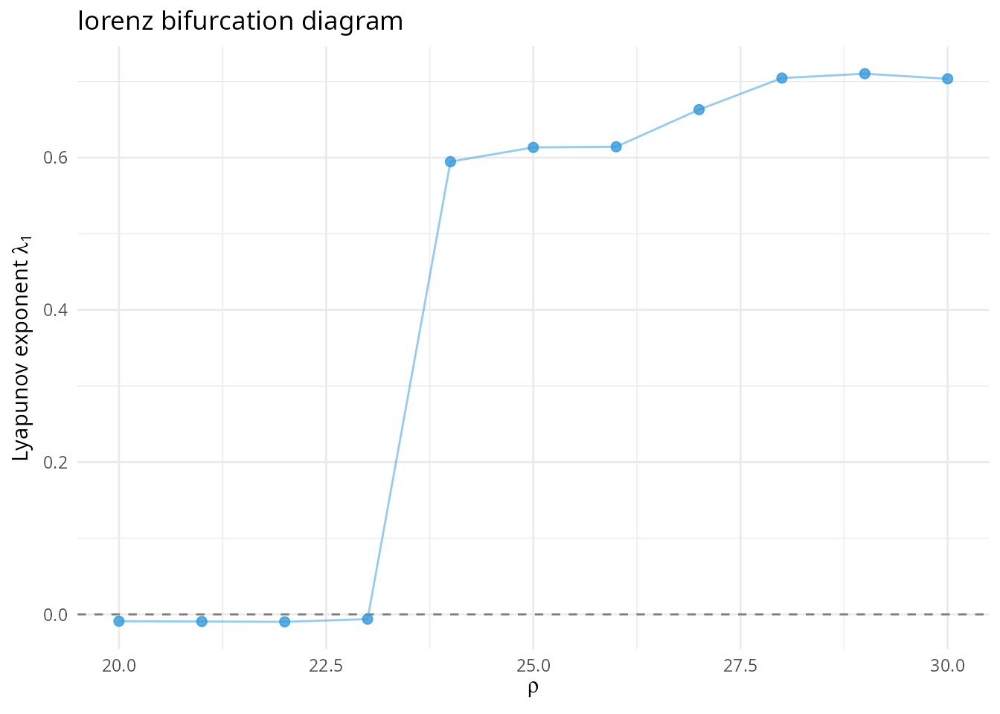

[`plot_bifurcation_panel()`](https://robustecologies.github.io/tuRbulence/reference/plot_bifurcation_panel.md)
produces a multi-panel layout that combines the bifurcation curve with
representative attractors at user-selected control values, providing a
single figure suitable for publications. The function performs its own
batch simulation over the parameter range and renders the panel through
ggplot2 facets.

``` r

plot_bifurcation_panel(
    system = "vonkarman",
    param_values = seq(0.0, 0.4, length.out = 9),
    n_steps = 20000,
    ncol = 3
)
```

The stochastic systems (von Kármán, Stommel with noise, Charney-DeVore
with noise, Hasselmann) represent a fundamentally different dynamical
regime from their deterministic counterparts. The framework of random
dynamical systems [\[19\]](#ref19) provides the appropriate mathematical
foundation: a random attractor is a family of sets indexed by noise
realizations that is invariant under the stochastic flow and attracts
all bounded sets. This framework naturally accommodates the smooth
transitions between dynamical regimes that characterize stochastic
chaos, in contrast to the discontinuous bifurcations of deterministic
systems.

  

## Numerical methods

  

### Integration schemes

The deterministic systems (Lorenz, Rössler, Lorenz-84) are integrated
using the classical fourth-order Runge-Kutta method, which provides an
excellent balance between accuracy and computational efficiency for
smooth ordinary differential equations. For a system \\\dot{\mathbf{x}}
= \mathbf{f}(\mathbf{x})\\, the RK4 scheme advances the solution from
\\\mathbf{x}\_n\\ to \\\mathbf{x}\_{n+1}\\ via:

\\\mathbf{x}\_{n+1} = \mathbf{x}\_n + \frac{\Delta t}{6}(\mathbf{k}\_1 +
2\mathbf{k}\_2 + 2\mathbf{k}\_3 + \mathbf{k}\_4)\\

with stages computed at intermediate points. The method is fourth-order
accurate, meaning the local truncation error scales as
\\\mathcal{O}(\Delta t^5)\\.

The stochastic systems require different treatment. The Euler-Maruyama
scheme provides a straightforward extension of Euler’s method to
stochastic differential equations:

\\\mathbf{x}\_{n+1} = \mathbf{x}\_n + \mathbf{f}(\mathbf{x}\_n)\Delta
t + \mathbf{g}(\mathbf{x}\_n)\sqrt{\Delta t}\\\xi_n\\

where \\\xi_n \sim \mathcal{N}(0, I)\\ are independent standard normal
vectors. This scheme has strong order of convergence
\\\mathcal{O}(\sqrt{\Delta t})\\ and weak order \\\mathcal{O}(\Delta
t)\\. For computing statistics such as means, variances, and Lyapunov
exponents, the weak order is the relevant measure of accuracy.

  

### Performance considerations

All integration routines are implemented in C++ via Rcpp, providing
substantial speedups over pure R implementations. The batch simulation
functions additionally employ OpenMP parallelization, enabling efficient
parameter sweeps on multi-core systems. Cao’s method for embedding
dimension estimation is similarly parallelized, as the nearest-neighbor
searches at each dimension are independent.

  

## The Ornstein-Uhlenbeck process

  

### Historical context and motivation

The Ornstein-Uhlenbeck (OU) process, introduced by Leonard Ornstein and
George Uhlenbeck in 1930 [\[20\]](#ref20), emerged from the need to
resolve a fundamental paradox in Brownian motion theory. Einstein’s 1905
model of Brownian motion predicted that a particle’s instantaneous
velocity should be infinite with probability one, a physically absurd
consequence arising from the non-differentiability of the Wiener
process. Ornstein and Uhlenbeck constructed a model where particle
velocity follows a well-defined stochastic process, with the position
obtained by integration.

The OU process has since become the canonical model for mean-reverting
stochastic phenomena, finding applications across physics, finance,
biology, and geosciences. In the context of turbulent and chaotic
dynamical systems, the OU process provides a mathematically tractable
yet physically realistic representation of colored (temporally
correlated) noise forcing.

  

### Mathematical formulation

The one-dimensional OU process \\X_t\\ satisfies the stochastic
differential equation (SDE):

\\dX_t = \phi(\mu - X_t) \\ dt + \sigma \\ dW_t\\

where \\\phi \> 0\\ is the relaxation rate (inverse timescale), \\\mu\\
is the long-run mean to which the process reverts, \\\sigma \> 0\\ is
the volatility or noise amplitude, and \\W_t\\ is a standard Wiener
process satisfying \\\mathbb{E}\[dW_t\] = 0\\ and \\\mathbb{E}\[dW_t^2\]
= dt\\.

The three parameters have clear physical interpretations:

- **Relaxation rate** \\\phi\\: Controls how quickly the process returns
  to its mean after a perturbation. The characteristic time scale is
  \\\tau = 1/\phi\\; larger \\\phi\\ means faster mean reversion and
  more rapidly decorrelating noise.

- **Mean** \\\mu\\: The equilibrium level around which the process
  fluctuates. When \\\mu = 0\\, the noise is centered; non-zero \\\mu\\
  introduces a systematic drift or bias into the forcing.

- **Amplitude** \\\sigma\\: Controls the intensity of random
  fluctuations. The stationary variance is \\\sigma^2/(2\phi)\\, so the
  standard deviation of fluctuations scales as \\\sigma/\sqrt{2\phi}\\.

  

### Analytical solution and statistical properties

The OU process is one of the few SDEs admitting a closed-form solution.
For initial condition \\X_0 = x_0\\:

\\X_t = \mu + (x_0 - \mu)e^{-\phi t} + \sigma \int_0^t e^{-\phi(t-s)} \\
dW_s\\

The first term \\\mu\\ is the deterministic long-run mean; the second
term \\(x_0 - \mu)e^{-\phi t}\\ shows exponential decay from the initial
condition; the third term is a stochastic integral representing
accumulated noise with exponentially fading memory.

The process is Gaussian for all times, with:

\\\mathbb{E}\[X_t\] = \mu + (x_0 - \mu)e^{-\phi t}\\

\\\text{Var}(X_t) = \frac{\sigma^2}{2\phi}(1 - e^{-2\phi t})\\

As \\t \to \infty\\, the process reaches a stationary distribution:

\\X\_\infty \sim \mathcal{N}\left(\mu, \frac{\sigma^2}{2\phi}\right)\\

The autocorrelation function of the stationary process is:

\\\rho(\tau) = \mathbb{E}\[(X_t - \mu)(X\_{t+\tau} - \mu)\] /
\text{Var}(X) = e^{-\phi\|\tau\|}\\

This exponential decay is characteristic of a first-order Markov process
and produces a Lorentzian power spectrum:

\\S(f) = \frac{\sigma^2}{\pi(\phi^2 + 4\pi^2 f^2)}\\

This spectrum is flat (white) at low frequencies \\f \ll \phi/(2\pi)\\
and decays as \\1/f^2\\ at high frequencies, interpolating between white
noise and Brownian motion.

  

### Limiting behaviors

The OU process interpolates between two important limits:

**White noise limit** (\\\phi \to \infty\\ with \\\sigma^2/\phi\\
fixed): As relaxation becomes instantaneous, the process loses memory
and approaches white noise. The decorrelation time \\1/\phi \to 0\\, and
the autocorrelation function approaches a delta function.

**Brownian motion limit** (\\\phi \to 0\\ with \\\sigma\\ fixed): As
mean reversion vanishes, the process approaches a Wiener process with
drift \\\mu\\. The variance grows without bound and the process becomes
non-stationary.

These limits explain why the tuRbulence package uses \\\phi = 0\\ to
indicate white noise: setting \\\phi = 0\\ formally eliminates mean
reversion, and the implementation switches to direct white noise
forcing.

  

### Role in stochastic dynamical systems

In the dynamical systems context, the OU process serves as a model for
unresolved degrees of freedom that influence the system of interest.
Consider a high-dimensional system where only a few “slow” variables are
tracked explicitly, while the remaining “fast” variables are represented
as stochastic forcing. If the fast variables have finite correlation
time, the OU process provides an appropriate model.

For the von Kármán turbulent flow model, the OU forcing represents the
aggregate effect of small-scale turbulent fluctuations on the
large-scale circulation. The correlation time \\1/\phi\\ matches the
turnover time of energy-containing eddies, while the amplitude
\\\sigma\\ reflects the root-mean-square velocity fluctuations. The mean
\\\mu\\ captures any systematic asymmetry in the turbulent forcing, such
as that arising from differences between the top and bottom impellers.

In climate models like Hasselmann’s framework, atmospheric weather
variability is approximated as stochastic forcing on the slow climate
components. The OU process generalizes the white noise assumption to
include realistic atmospheric persistence: synoptic weather patterns
have lifetimes of days, not the infinitesimal timescale of white noise.
This produces climate spectra that better match observations,
particularly at intermediate frequencies where the transition from
weather to climate variability occurs.

  

### Numerical implementation

The tuRbulence package discretizes the OU process using the
Euler-Maruyama scheme:

\\X\_{n+1} = X_n - \phi(X_n - \mu)\Delta t + \sigma \sqrt{\Delta t} \\
\xi_n\\

where \\\xi_n \sim \mathcal{N}(0, 1)\\ are independent standard normal
random variables. This scheme has strong order of convergence
\\\mathcal{O}(\sqrt{\Delta t})\\.

For the OU process specifically, an exact discretization is available:

\\X\_{n+1} = \mu + (X_n - \mu)e^{-\phi\Delta t} + \sigma\sqrt{\frac{1 -
e^{-2\phi\Delta t}}{2\phi}} \\ \xi_n\\

However, the Euler-Maruyama scheme is used for consistency with the
overall integration scheme and because the time step is typically small
enough that the approximation error is negligible compared to other
sources of uncertainty.

  

### Effect of OU parameters on system dynamics

The OU parameters can qualitatively alter the behavior of forced
dynamical systems:

**Relaxation rate** \\\phi\\: High \\\phi\\ (fast relaxation) produces
noise that varies rapidly, allowing the deterministic dynamics to
dominate on longer timescales. Low \\\phi\\ (slow relaxation) produces
persistent fluctuations that can maintain the system away from its
deterministic attractor for extended periods, potentially enabling
transitions between metastable states.

**Mean** \\\mu\\: Non-zero mean introduces a systematic forcing that can
shift the effective potential landscape. In bistable systems, positive
(negative) \\\mu\\ can favor one well over the other, altering the
relative residence times and transition rates between states.

**Amplitude** \\\sigma\\: Larger \\\sigma\\ increases the exploration of
phase space. In systems with multiple attractors, higher noise amplitude
generally increases transition rates between attractors according to
Kramers’ law: the escape rate from a potential well of depth \\\Delta
V\\ scales as \\\exp(-2\Delta V/\sigma^2)\\ for small noise.

The tuRbulence package exposes all three OU parameters for systems with
stochastic forcing, enabling systematic investigation of how colored
noise characteristics influence dynamical behavior.

  

## Low-level simulation API

Most analyses in this vignette use the family-specific constructors
([`lorenz_sim()`](https://robustecologies.github.io/tuRbulence/reference/lorenz_sim.md),
[`vonkarman_sim()`](https://robustecologies.github.io/tuRbulence/reference/vonkarman_sim.md),
etc.). The package additionally exposes a low-level interface for
callers that need to dispatch by name and consume the canonical scalar
observable.

[`simulate_system()`](https://robustecologies.github.io/tuRbulence/reference/simulate_system.md)
is the legacy dispatcher; it accepts the system name, a parameter list,
and the common integration arguments, and returns the same S3 object as
the dedicated constructor. New code should prefer
[`turbulence_sim()`](https://robustecologies.github.io/tuRbulence/reference/turbulence_sim.md),
which exposes a richer interface and is the recommended entry point.

``` r

sim_l <- simulate_system(
    "lorenz",
    params = list(sigma = 10, rho = 28, beta = 8/3),
    n_steps = 50000, dt = 0.001, thin = 5, seed = 42
)
class(sim_l)
#> [1] "lorenz_sim"        "turbulence_system"
```

[`get_primary_series()`](https://robustecologies.github.io/tuRbulence/reference/get_primary_series.md)
extracts the canonical scalar observable used by the unified analysis
routines. The choice of observable is system-specific and matches the
variable used in the published reference Lyapunov values
(e.g. \\\theta\\ for von Kármán, \\q\\ for Stommel, the \\x\\ coordinate
for Lorenz).

``` r

x_l <- get_primary_series(sim_l)
length(x_l)
#> [1] 10000
range(x_l)
#> [1] -17.45099  19.56289
```

[`turbulence_embed()`](https://robustecologies.github.io/tuRbulence/reference/turbulence_embed.md)
performs delay-coordinate embedding either by Takens’ method or by the
peak-extraction variant used for noise-driven systems.

``` r

emb <- turbulence_embed(x_l, embed_dim = 5, tau = 10, method = "delay")
print(emb)
#> Turbulence Attractor Embedding (delay method)
#>   Embedding dimension: 5
#>   Number of points: 9960
#>   Time delay τ: 10
summary(emb)
#> Turbulence embedding summary
#> ======================================== 
#> 
#> Method: delay
#> Embedding dimension: 5
#> Number of points: 9960
#> Time delay (tau): 10
#> 
#> State space volume:
#>   x_0: [-17.4510, 19.5629] (extent = 37.0139)
#>   x_1: [-17.4510, 19.5629] (extent = 37.0139)
#>   x_2: [-17.4510, 19.5629] (extent = 37.0139)
#>   x_3: [-17.4510, 19.5629] (extent = 37.0139)
#>   x_4: [-17.4510, 19.5629] (extent = 37.0139)
#> Bounding box volume: 6.9474e+07
plot(emb)
```

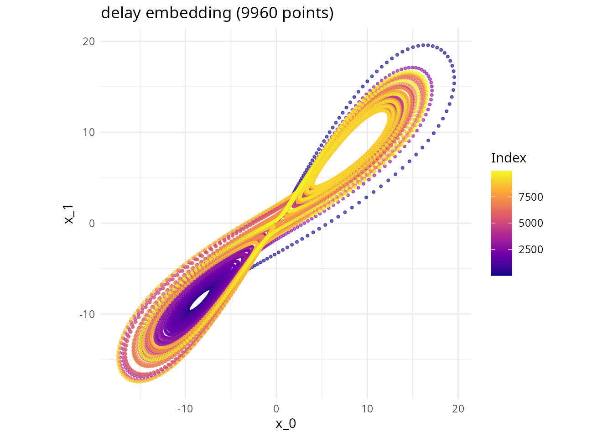

  

## Three-dimensional visualization and animation

The 3D visualization API produces interactive `plotly` widgets and
animated `gganimate`/HTML outputs. These chunks are not evaluated in the
rendered vignette to keep it lightweight; the code is shown for
reference.

``` r

# Single static 3D attractor (interactive plotly widget)
p3d_lorenz <- create_attractor_3d(lorenz, colorscale = "Plasma")

# Coloured trajectory variant: a polyline whose colour encodes time, velocity, or a coordinate
trj_lorenz <- create_trajectory_3d(lorenz, n_points = 5000, color_by = "time")
```

``` r

# Trailing-window animation: a sliding fixed-length trail follows the trajectory
anim_trail <- create_animated_attractor(lorenz, n_frames = 60, trail_length = 200)

# Accumulating animation: each frame adds new points without removing old ones
anim_accum <- create_animated_attractor_accumulate(lorenz, n_frames = 60)
```

``` r

# Save a self-contained HTML widget for inclusion in slides or web pages
save_attractor_html(p3d_lorenz, filename = tempfile(fileext = ".html"))

# Export individual PNG frames for downstream video assembly (ffmpeg, etc.)
export_animation_frames(lorenz, output_dir = tempdir(), n_frames = 30,
                        width = 800, height = 600)
```

  

## References

**\[1\]** Landau, L.D. (1944). On the problem of turbulence. *Doklady
Akademii Nauk SSSR*, 44, 339-342.

**\[2\]** Ruelle, D. & Takens, F. (1971). On the nature of turbulence.
*Communications in Mathematical Physics*, 20(3), 167-192.
<https://doi.org/10.1007/BF01646553>

**\[3\]** Faranda, D., Sato, Y., Saint-Michel, B., Wiertel, C., Padilla,
V., Dubrulle, B., & Daviaud, F. (2017). Stochastic chaos in a turbulent
swirling flow. *Physical Review Letters*, 119(1), 014502.
<https://doi.org/10.1103/PhysRevLett.119.014502>

**\[4\]** Lorenz, E.N. (1963). Deterministic nonperiodic flow. *Journal
of the Atmospheric Sciences*, 20(2), 130-141.
<https://doi.org/10.1175/1520-0469(1963)020%3C0130:DNF%3E2.0.CO;2>

**\[5\]** Sparrow, C. (1982). *The Lorenz Equations: Bifurcations,
Chaos, and Strange Attractors*. Springer-Verlag.
<https://doi.org/10.1007/978-1-4612-5767-7>

**\[6\]** Cao, L. (1997). Practical method for determining the minimum
embedding dimension of a scalar time series. *Physica D*, 110(1-2),
43-50. <https://doi.org/10.1016/S0167-2789(97)00118-8>

**\[7\]** Takens, F. (1981). Detecting strange attractors in turbulence.
In *Dynamical Systems and Turbulence, Warwick 1980* (pp. 366-381).
Springer. <https://doi.org/10.1007/BFb0091924>

**\[8\]** Wolf, A., Swift, J.B., Swinney, H.L., & Vastano, J.A. (1985).
Determining Lyapunov exponents from a time series. *Physica D*, 16(3),
285-317. <https://doi.org/10.1016/0167-2789(85)90011-9>

**\[9\]** Rosenstein, M.T., Collins, J.J., & De Luca, C.J. (1993). A
practical method for calculating largest Lyapunov exponents from small
data sets. *Physica D*, 65(1-2), 117-134.
<https://doi.org/10.1016/0167-2789(93)90009-P>

**\[10\]** Rössler, O.E. (1976). An equation for continuous chaos.
*Physics Letters A*, 57(5), 397-398.
<https://doi.org/10.1016/0375-9601(76)90101-8>

**\[11\]** Sprott, J.C. (2003). *Chaos and Time-Series Analysis*. Oxford
University Press. ISBN: 978-0198508397.

**\[12\]** Feigenbaum, M.J. (1978). Quantitative universality for a
class of nonlinear transformations. *Journal of Statistical Physics*,
19(1), 25-52. <https://doi.org/10.1007/BF01020332>

**\[13\]** Lorenz, E.N. (1984). Irregularity: a fundamental property of
the atmosphere. *Tellus A*, 36(2), 98-110.
<https://doi.org/10.1111/j.1600-0870.1984.tb00230.x>

**\[14\]** Ravelet, F., Chiffaudel, A., & Daviaud, F. (2008).
Supercritical transition to turbulence in an inertially driven von
Kármán closed flow. *Journal of Fluid Mechanics*, 601, 339-364.
<https://doi.org/10.1017/S0022112008000712>

**\[15\]** Packard, N.H., Crutchfield, J.P., Farmer, J.D., & Shaw, R.S.
(1980). Geometry from a time series. *Physical Review Letters*, 45(9),
712. <https://doi.org/10.1103/PhysRevLett.45.712>

**\[16\]** Charney, J.G. & DeVore, J.G. (1979). Multiple flow equilibria
in the atmosphere and blocking. *Journal of the Atmospheric Sciences*,
36(7), 1205-1216.
<https://doi.org/10.1175/1520-0469(1979)036%3C1205:MFEITA%3E2.0.CO;2>

**\[17\]** Stommel, H. (1961). Thermohaline convection with two stable
regimes of flow. *Tellus*, 13(2), 224-230.
<https://doi.org/10.3402/tellusa.v13i2.9491>

**\[18\]** Hasselmann, K. (1976). Stochastic climate models. Part I:
Theory. *Tellus*, 28(6), 473-485.
<https://doi.org/10.3402/tellusa.v28i6.11316>

**\[19\]** Arnold, L. (1998). *Random Dynamical Systems*. Springer.
<https://doi.org/10.1007/978-3-662-12878-7>

**\[20\]** Uhlenbeck, G.E. & Ornstein, L.S. (1930). On the theory of the
Brownian motion. *Physical Review*, 36(5), 823-841.
<https://doi.org/10.1103/PhysRev.36.823>

**\[21\]** Kwasniok, F. (2023). On the interaction of stochastic forcing
and regime dynamics. *Nonlinear Processes in Geophysics*, 30, 49-62.
<https://doi.org/10.5194/npg-30-49-2023>
