# tuRbulence [](https://robustecologies.github.io/tuRbulence)

[](https://github.com/robustecologies/tuRbulence/actions)
[](https://github.com/robustecologies/tuRbulence)
[](https://www.r-project.org/)
[](https://robustecologies.github.io/tuRbulence/reference/index.html)
[](https://robustecologies.github.io/tuRbulence/reference/index.html)
[](https://cran.r-project.org/package=Rcpp)
[](https://www.openmp.org/)
[](https://www.gnu.org/licenses/gpl-3.0)

## Stochastic chaos and turbulent attractors in Earth-system models and ocean-atmosphere interactions

**tuRbulence** provides stochastic dynamical systems analyses for
studying turbulent attractors with Ornstein-Uhlenbeck colored noise
forcing, with emphasis on Earth-system models and ocean-atmosphere
interactions. Includes seven systems: Lorenz-63 and Lorenz-84, Rössler,
Stommel two-box thermohaline circulation, Charney-DeVore atmospheric
blocking (3-mode and 6-mode), Hasselmann stochastic-climate model, and
the Faranda et al. (2017) stochastic Duffing model for von-Karman
turbulent swirling flow. Provides attractor reconstruction via delay and
peak embedding, Lyapunov-exponent estimation (Wolf and Rosenstein
algorithms), embedding-dimension estimation (Cao’s method), and
interactive 3D visualization. Streamlined with Rcpp and C++/OpenMP.

  

> **Note on the von-Karman family.** The functions `vonkarman_sim`,
> `vonkarman_batch`, `vonkarman_peaks` and `vonkarman_attractor`
> integrate the *stochastic Duffing oscillator* of Faranda, Sato,
> Saint-Michel et al. (2017) “Stochastic chaos in a turbulent swirling
> flow” (Phys. Rev. Lett. 119, 014502,
> <doi:10.1103/PhysRevLett.119.014502>), used as a phenomenological
> reduced model for the experimental observables of the von-Karman
> swirling-flow turbulence cell. They do NOT solve the Navier-Stokes
> equations and are not a Galerkin truncation of the von-Karman vortex
> street. See
> [`?vonkarman_sim`](https://robustecologies.github.io/tuRbulence/reference/vonkarman_sim.md)
> for the equations.

  

## What is inside

| Layer | Components | Count |
|----|----|----|
| Unified dispatcher | `turbulence_sim`, `simulate_system`, `get_primary_series` | 3 |
| Canonical chaotic systems | `lorenz_sim`, `lorenz84_sim`, `rossler_sim` | 3 |
| Geophysical and climate systems | `charney_devore_sim`, `charney_devore_6mode`, `charney_devore_batch`, `stommel_sim`, `stommel_batch`, `hasselmann_sim`, `hasselmann_batch`, `vonkarman_sim`, `vonkarman_batch`, `vonkarman_peaks`, `vonkarman_attractor` | 11 |
| Phase-space reconstruction | `turbulence_embed`, `turbulence_cao` | 2 |
| Lyapunov spectra | `turbulence_lyapunov` | 1 |
| Bifurcation analysis | `turbulence_bifurcation`, `plot_bifurcation_panel` | 2 |
| 3D visualization | `create_attractor_3d`, `create_trajectory_3d`, `create_animated_attractor`, `create_animated_attractor_accumulate`, `save_attractor_html`, `export_animation_frames` | 6 |
| Interactive dashboard | `shiny_tuRbulence` | 1 |
| S3 classes (with print, summary, plot) | 18 simulator and analysis classes | 18 |

The package ships canonical-validation regression tests
(`tests/testthat/test-validation-canonical.R`) that pin Lorenz-63
(lambda_1 ~ 0.906 from both Wolf and Rosenstein), Rossler (lambda_1 ~
0.07), Cao optimal embedding dimension on Lorenz-63, and Hasselmann
stochasticity (two seeds diverge; identical seeds reproduce).

See
[`vignette("turbulent-attractors")`](https://robustecologies.github.io/tuRbulence/articles/turbulent-attractors.md)
for theory;
[`vignette("api")`](https://robustecologies.github.io/tuRbulence/articles/api.md)
for the architecture map.

## Installation

Install the development version from GitHub:

``` r

# install.packages("devtools")
# devtools::install_github("robustecologies/tuRbulence")
```

## Dynamical systems

The package implements seven dynamical systems organized into three
categories:

### Classical chaotic systems

**Lorenz system (1963)** models atmospheric convection as a simplified
representation of Rayleigh-Benard flow. The butterfly attractor emerges
for the standard parameters (σ = 10, ρ = 28, β = 8/3) with largest
Lyapunov exponent λ₁ ≈ 0.906.

``` r

library(tuRbulence)

# Simulate Lorenz attractor
sim <- lorenz_sim(sigma = 10, rho = 28, beta = 8/3, n_steps = 100000, seed = 42)
print(sim)
#> Lorenz System Simulation
#>   Parameters: σ=10.00, ρ=28.00, β=2.6667
#>   Time points: 20000
#>   Time span: [0, 100.00]
summary(sim)
#> Lorenz System Simulation Summary
#> ================================================== 
#> 
#> Parameters:
#>   Prandtl number σ: 10.0000
#>   Rayleigh number ρ: 28.0000
#>   Geometric factor β: 2.6667
#> 
#> Integration:
#>   Time step dt: 0.0010
#>   Total steps: 100000
#>   Output points: 20000
#> 
#> State variable ranges:
#>   x: [-18.054, 19.563]
#>   y: [-24.281, 27.183]
#>   z: [0.962, 47.834]
#> 
#> Estimated regime: Chaotic (strange attractor)

# 3D attractor visualization
plot(sim, type = "attractor")
```

**Rossler system (1976)** exhibits a simpler attractor structure with a
single scroll, useful for studying period-doubling routes to chaos.
Reference Lyapunov exponent λ₁ ≈ 0.07.

``` r

sim <- rossler_sim(a = 0.2, b = 0.2, c = 5.7, n_steps = 500000, seed = 42)
plot(sim, type = "attractor")
```

**Lorenz-84** is a low-order atmospheric model capturing the interaction
between westerly winds and large-scale eddies, exhibiting chaotic
transitions between different circulation patterns.

``` r

sim <- lorenz84_sim(F = 8, G = 1, n_steps = 300000, seed = 42)
plot(sim, type = "attractor")
```

### Geophysical fluid dynamics

**Von Karman turbulent flow** implements the stochastic Duffing
oscillator describing symmetry-breaking transitions in turbulent
swirling flows, as observed in the von Karman experiment (Faranda et
al. 2017).

``` r

sim <- vonkarman_sim(mu = 0.3, n_steps = 100000, seed = 42)
plot(sim, type = "attractor")

# Peak embedding for attractor reconstruction
peaks <- vonkarman_peaks(sim, min_separation = 0.05)
attr <- vonkarman_attractor(peaks, embed_dim = 3)
plot(attr)
```

**Charney-DeVore model (1979)** describes the interaction between zonal
flow and planetary waves, exhibiting bistability between blocked and
zonal flow regimes relevant for understanding atmospheric blocking
events.

``` r

sim <- charney_devore_sim(F = 1.5, n_steps = 100000, stochastic = TRUE, seed = 42)
plot(sim, type = "phase")
```

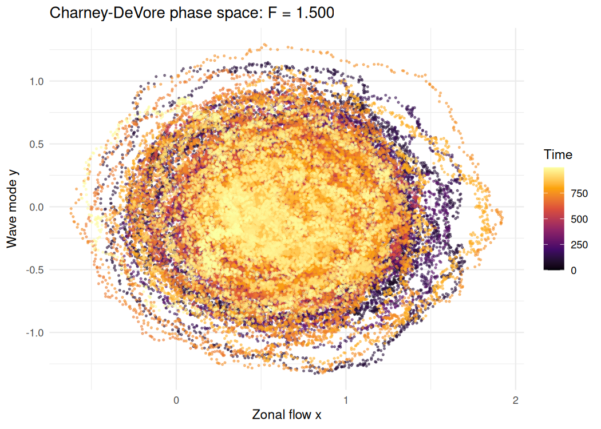

``` r

plot(sim, type = "blocking")
```

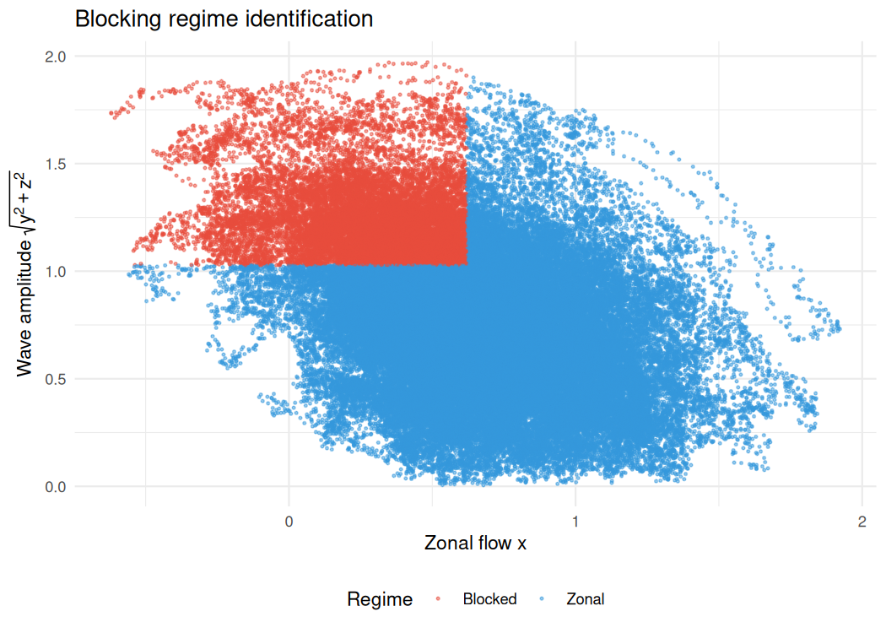

``` r

summary(sim)
#> Charney-DeVore Atmospheric Blocking Model Summary
#> ======================================================= 
#> 
#> Parameters:
#>   Forcing F: 1.500
#>   Damping k: 0.100
#>   Couplings: α=1.000, β=0.500, δ=1.000
#>   Noise amplitude σ: 0.150
#> 
#> State variable statistics:
#>   x (zonal): mean=0.632, sd=0.358, range=[-0.620, 1.922]
#>   y (wave1): mean=-0.072, sd=0.385, range=[-1.326, 1.292]
#>   z (wave2): mean=-0.640, sd=0.426, range=[-1.872, 0.964]
#> 
#> Blocking analysis:
#>   Wave amplitude threshold (75th): 1.028
#>   Blocked fraction: 17.9%
#>   Mean wave energy: 0.744
```

### Climate models

**Stommel box model (1961)** describes thermohaline circulation with
bistability between thermally-driven (like the modern Atlantic) and
salinity-driven flow regimes, relevant for understanding abrupt climate
transitions.

``` r

sim <- stommel_sim(eta2 = 1.2, n_steps = 100000, stochastic = TRUE, seed = 42)
summary(sim)
#> Stommel Box Model Simulation Summary
#> ================================================== 
#> 
#> Parameters:
#>   Temperature forcing η₁: 3.000
#>   Freshwater flux η₂: 1.200
#>   Relaxation ratio η₃: 0.300
#>   Noise amplitudes: σ_T=0.200, σ_S=0.200
#> 
#> State variable statistics:
#>   T: mean=2.421, sd=0.313, range=[1.490, 3.239]
#>   S: mean=2.318, sd=0.552, range=[0.756, 3.261]
#>   q: mean=0.103, sd=0.313, range=[-0.765, 1.069]
#> 
#> Flow regime occupancy:
#>   Thermal-dominated (q > 0): 55.4%
#>   Salinity-dominated (q < 0): 44.6%
#>   Regime transitions: 2866
plot(sim, type = "flow")
```

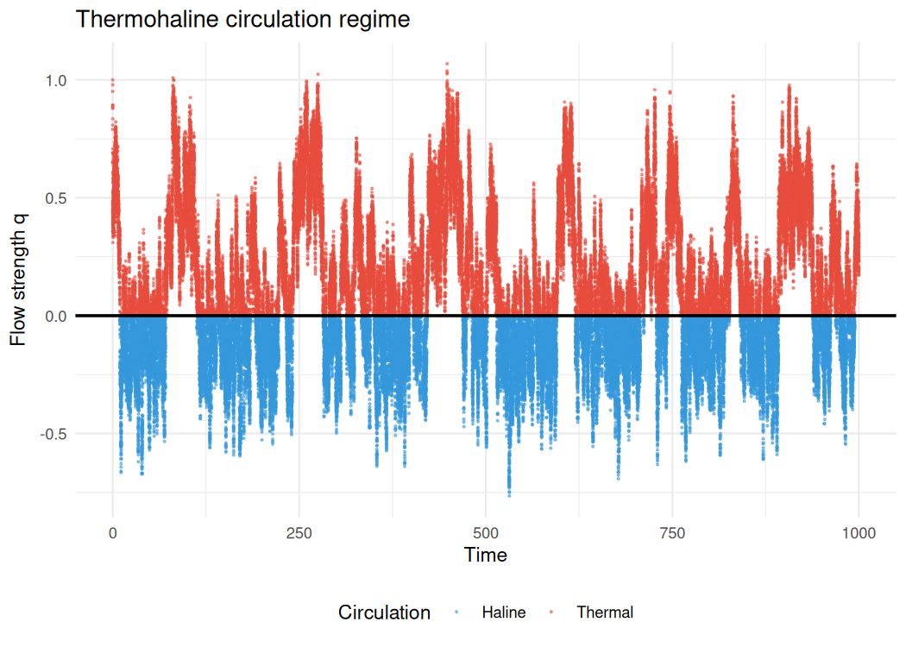

``` r


# Stommel bifurcation diagram
eta2_seq <- seq(0.5, 2.0, length.out = 31)
batch <- stommel_batch(eta2_seq, n_steps = 100000, n_threads = 4, seed = 42)
plot(batch, type = "density")
#> Picking joint bandwidth of 0.0153
```

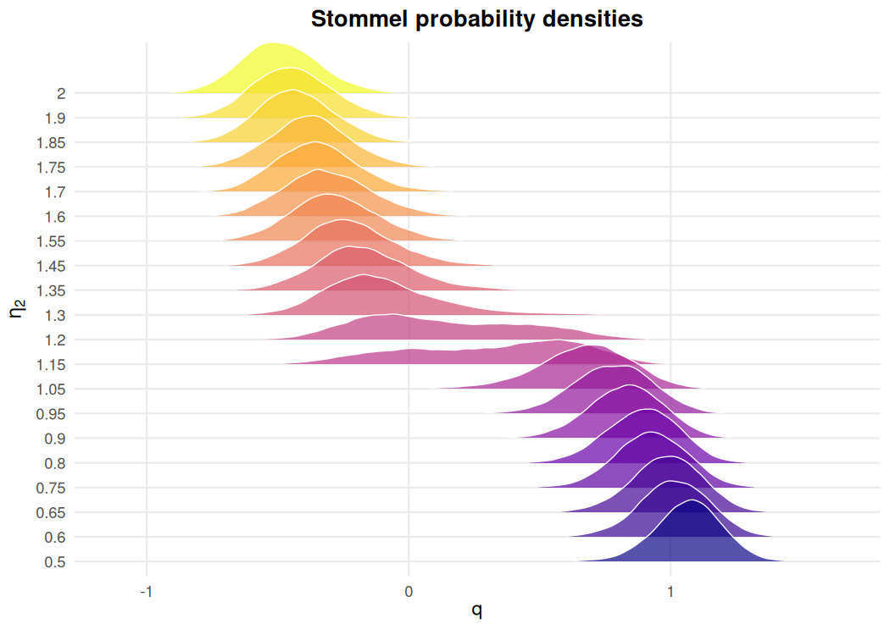

**Hasselmann stochastic climate model (1976)** treats the climate system
as a slow integrator of fast atmospheric fluctuations, extended with
ocean-ice feedbacks for glacial-interglacial dynamics.

``` r

sim <- hasselmann_sim(F_forcing = 0.5, n_steps = 50000, stochastic = TRUE, seed = 42)
plot(sim, type = "phase")
summary(sim)
#> Hasselmann Stochastic Climate Model Summary
#> ================================================== 
#> 
#> Parameters:
#>   External forcing F: 0.500
#>   Climate feedback λ: 0.100
#>   Ocean exchange γ: 0.050
#>   Deep ocean κ: 0.010
#>   Ice coupling α: 0.100, β: 0.020, μ: 0.500
#>   Noise: σ_T=0.300, σ_I=0.100
#> 
#> State variable statistics:
#>   T (surface):  mean=4.520, sd=0.674, range=[-0.466, 6.666]
#>   Td (deep):    mean=4.428, sd=0.652, range=[-0.003, 5.065]
#>   I (ice):      mean=0.441, sd=0.340, range=[0.000, 2.271]
#> 
#> Temporal characteristics:
#>   Lag-1 autocorrelation: T=0.990, Td=1.000
#>   T e-folding time: 9.9 time units
```

## Analysis tools

### Lyapunov exponent estimation

The package provides two algorithms for estimating the largest Lyapunov
exponent: the Wolf algorithm (1985), the original method tracking
fiducial trajectories with neighbor replacement, and the Rosenstein
algorithm (1993), a faster method based on divergence tracking suitable
for smaller datasets.

``` r

# Simulate Lorenz system
sim <- lorenz_sim(sigma = 10, rho = 28, beta = 8/3, n_steps = 200000, seed = 42)

# Wolf algorithm
lyap_wolf <- turbulence_lyapunov(sim, embed_dim = 10, tau = 10, method = "wolf")
print(lyap_wolf)
#> Turbulence Lyapunov Exponent (wolf algorithm)
#>   λ₁: 1.1667 (per unit time)
#>   λ₁: 0.005834 (per step, dt=0.0050)
#>   Regime: Chaotic
#>   Iterations: 3990
#>   Embedding: dim=10, τ=10

# Rosenstein algorithm with divergence curve visualization
lyap_ros <- turbulence_lyapunov(sim, embed_dim = 10, tau = 10, method = "rosenstein")
print(lyap_ros)
#> Turbulence Lyapunov Exponent (rosenstein algorithm)
#>   λ₁: 1.6443 (per unit time)
#>   λ₁: 0.008222 (per step, dt=0.0050)
#>   Regime: Chaotic
#>   Iterations: 500
#>   Embedding: dim=10, τ=10
plot(lyap_ros)
```

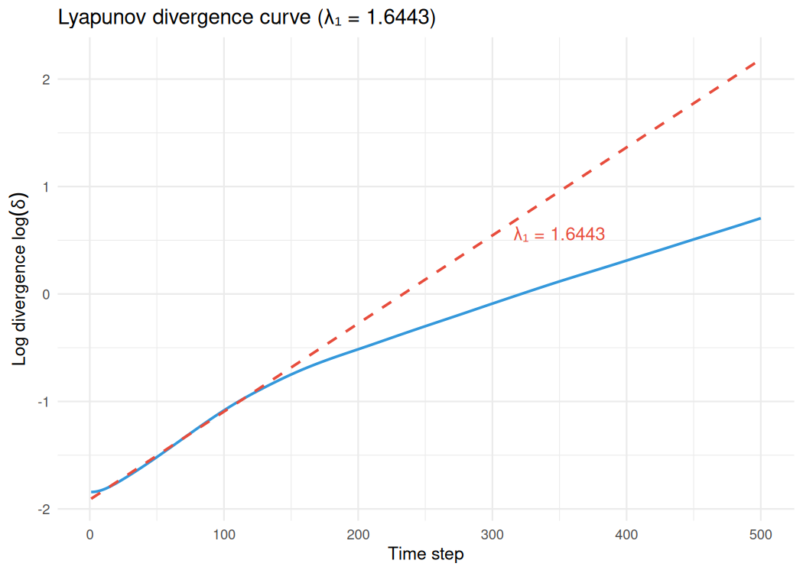

### Embedding dimension estimation

Cao’s method determines the optimal embedding dimension by analyzing how
false nearest neighbors decrease with increasing dimension.

``` r

sim <- vonkarman_sim(mu = 0.3, n_steps = 100000, seed = 42)
cao <- turbulence_cao(sim, max_dim = 15, tau = 10)
print(cao)
#> Turbulence Cao Dimension Analysis
#>   Estimated optimal dimension: 7
#>   Dimensions tested: 1-15
#>   Time delay τ: 10
plot(cao)
```

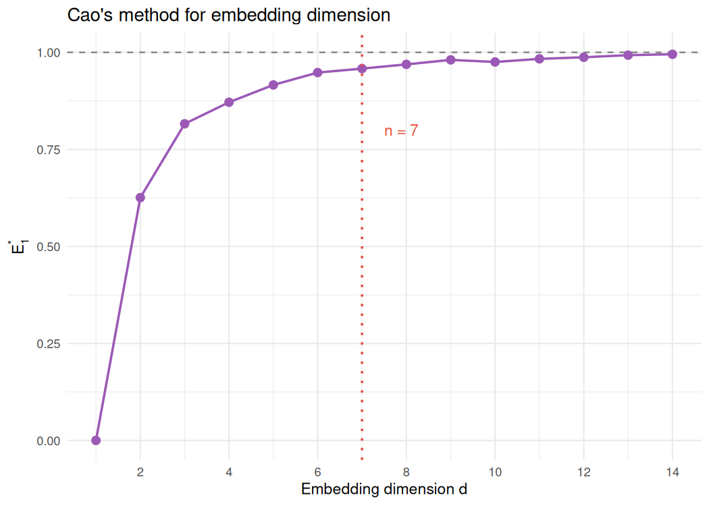

### Delay embedding

Standard Takens delay embedding and specialized peak embedding for
attractor reconstruction.

``` r

sim <- lorenz_sim(n_steps = 100000, seed = 42)

# Standard delay embedding
emb <- turbulence_embed(sim, embed_dim = 3, tau = 10, method = "delay")
print(emb)
#> Turbulence Attractor Embedding (delay method)
#>   Embedding dimension: 3
#>   Number of points: 19980
#>   Time delay τ: 10

# Peak embedding (von Karman style)
sim_vk <- vonkarman_sim(mu = 0.3, n_steps = 100000, seed = 42)
emb_peaks <- turbulence_embed(sim_vk, embed_dim = 3, method = "peaks")
print(emb_peaks)
#> Turbulence Attractor Embedding (peaks method)
#>   Embedding dimension: 3
#>   Number of points: 149
#>   Min separation: 0.100
```

### Bifurcation analysis

Compute Lyapunov exponents across parameter ranges to identify
bifurcation points and regime transitions.

``` r

bif <- turbulence_bifurcation(
    system = "lorenz",
    param_values = seq(20, 30, by = 1),
    n_steps = 50000,
    embed_dim = 10,
    tau = 10,
    verbose = TRUE
)
#> Processing lorenz = 20.0000 (1/11)
#> Processing lorenz = 21.0000 (2/11)
#> Processing lorenz = 22.0000 (3/11)
#> Processing lorenz = 23.0000 (4/11)
#> Processing lorenz = 24.0000 (5/11)
#> Processing lorenz = 25.0000 (6/11)
#> Processing lorenz = 26.0000 (7/11)
#> Processing lorenz = 27.0000 (8/11)
#> Processing lorenz = 28.0000 (9/11)
#> Processing lorenz = 29.0000 (10/11)
#> Processing lorenz = 30.0000 (11/11)
print(bif)
#> Turbulence Bifurcation Analysis (lorenz, stochastic)
#>   Parameter range: [20.0000, 30.0000]
#>   Number of points: 11
#>   λ₁ range: [-0.0119, 0.7325]
summary(bif)
#> Turbulence Bifurcation Summary (lorenz, stochastic)
#>   Parameter range: [20.0000, 30.0000]
#>   Number of points: 11
#>   λ₁ statistics:
#>     Min: -0.0119
#>     Max: 0.7325
#>     Mean: 0.4008
#>   Regime classification:
#>     Chaotic (λ > 0.01): 7 (63.6%)
#>     Stable (λ < -0.01): 1 (9.1%)
#>     Marginal: 3 (27.3%)
plot(bif)
```

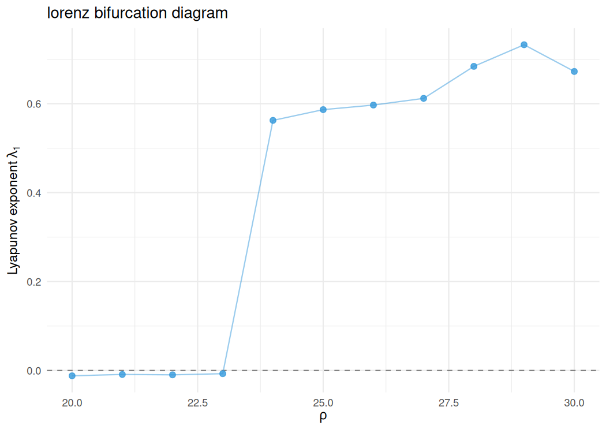

## Batch simulations

Parameter sweep simulations for all geophysical systems with
professional visualization.

``` r

# Von Karman bifurcation diagram
batch_vk <- vonkarman_batch(seq(-0.3, 0.3, length.out = 31), n_steps = 100000)
plot(batch_vk, type = "density")    # Density ridges
#> Picking joint bandwidth of 0.062
```

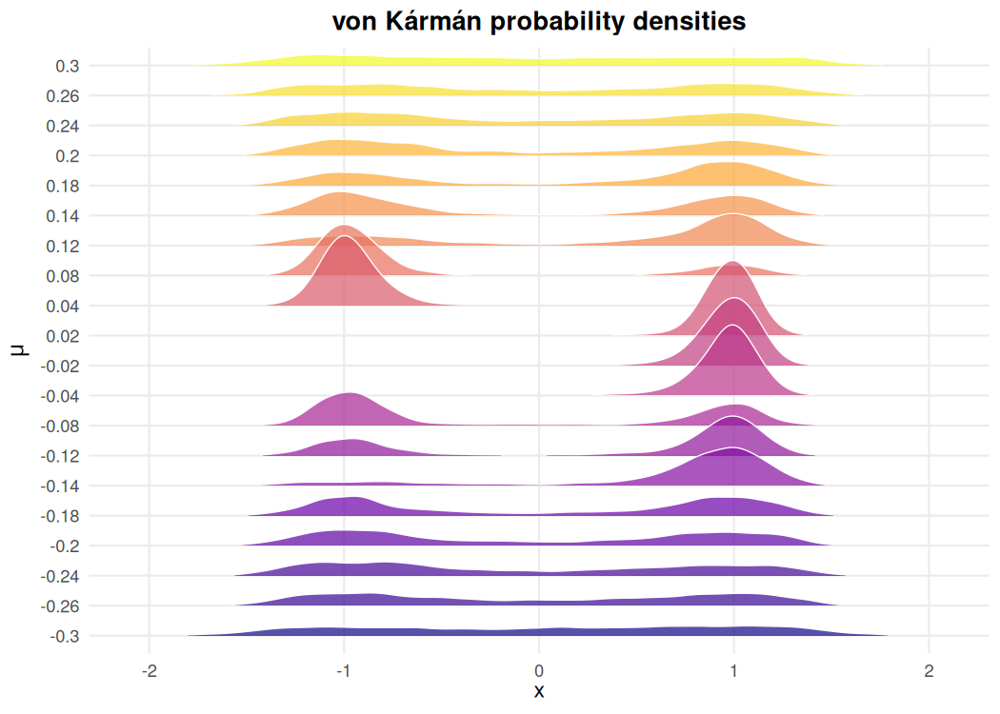

``` r

plot(batch_vk, type = "summary")    # Statistical summary
```

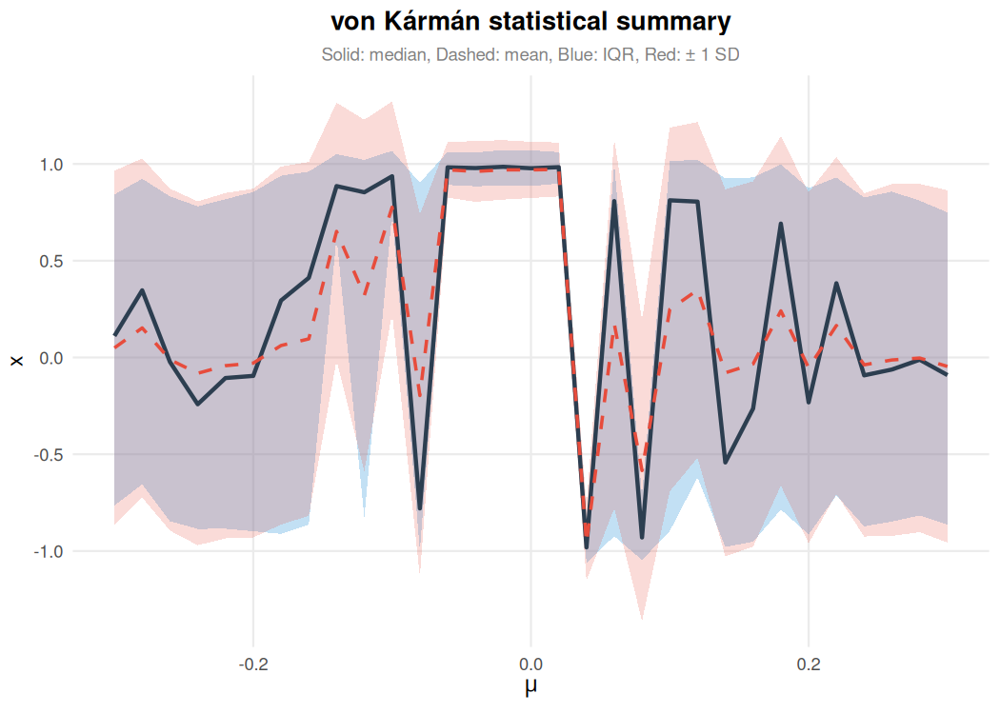

``` r


# Stommel bistability
batch_st <- stommel_batch(seq(0.5, 2.0, length.out = 31), n_steps = 100000)
plot(batch_st, var = "q", type = "density")
#> Picking joint bandwidth of 0.0149
```

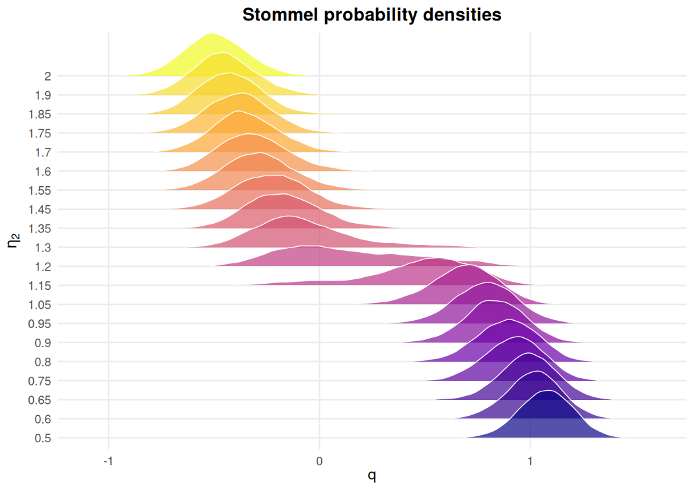

``` r


# Charney-DeVore regime transitions
batch_cd <- charney_devore_batch(seq(0.5, 3.0, length.out = 26), n_steps = 100000)
plot(batch_cd, var = "wave", type = "summary")
```

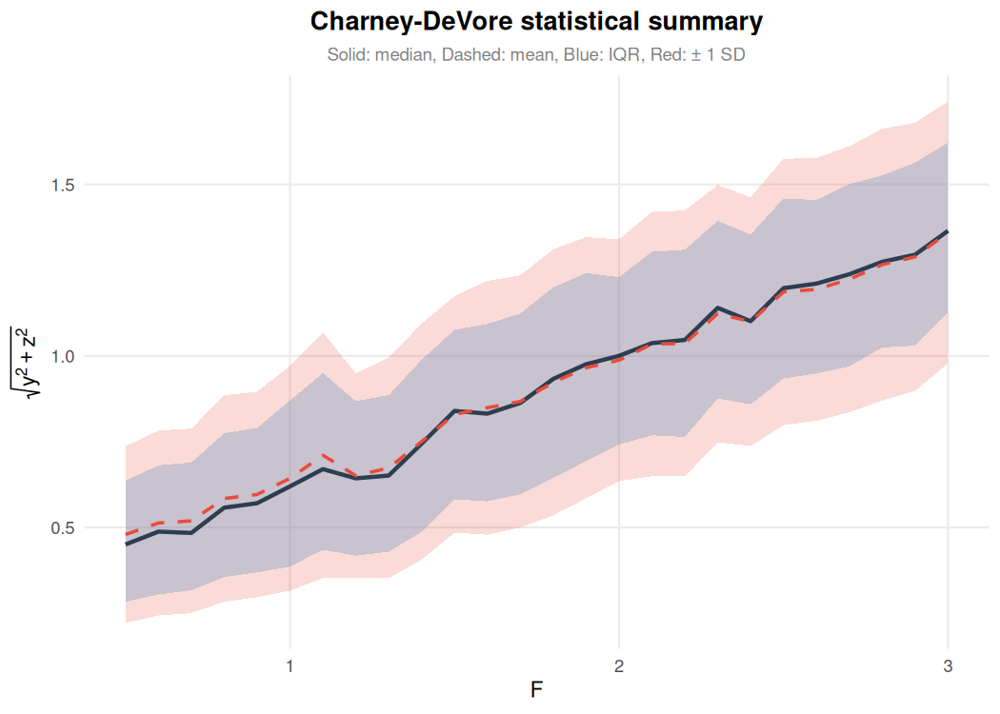

``` r


# Hasselmann climate response
batch_hs <- hasselmann_batch(seq(-1.0, 2.0, length.out = 31), n_steps = 50000)
plot(batch_hs, var = "T", type = "density")
#> Picking joint bandwidth of 0.0721
```

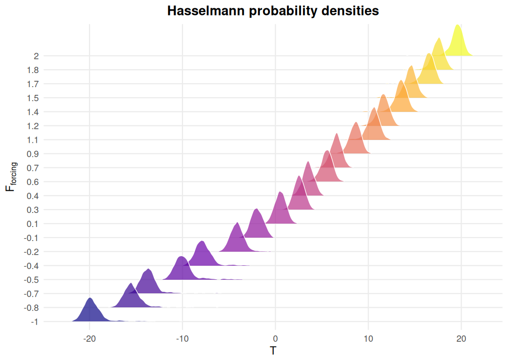

## Unified interface

The
[`turbulence_sim()`](https://robustecologies.github.io/tuRbulence/reference/turbulence_sim.md)
function provides a unified entry point for all systems.

``` r

# Simulate any system with a single interface
sim_lorenz <- turbulence_sim("lorenz", control_param = 28, n_steps = 100000)
sim_vonkarman <- turbulence_sim("vonkarman", control_param = 0.3, n_steps = 100000)
sim_stommel <- turbulence_sim("stommel", control_param = 1.0, stochastic = TRUE)

# All simulations support the same S3 methods
print(sim_lorenz)
#> Lorenz System Simulation
#>   Parameters: σ=10.00, ρ=28.00, β=2.6667
#>   Time points: 20000
#>   Time span: [0, 999.95]
#>   Stochastic forcing: φ=1.00, σ_noise=0.100
summary(sim_lorenz)
#> Lorenz System Simulation Summary
#> ================================================== 
#> 
#> Parameters:
#>   Prandtl number σ: 10.0000
#>   Rayleigh number ρ: 28.0000
#>   Geometric factor β: 2.6667
#> 
#> Integration:
#>   Time step dt: 0.0100
#>   Total steps: 100000
#>   Output points: 20000
#> 
#> State variable ranges:
#>   x: [-18.395, 19.556]
#>   y: [-24.957, 27.184]
#>   z: [0.964, 46.753]
#> 
#> Estimated regime: Chaotic (strange attractor)
plot(sim_lorenz, type = "attractor")
```

## Visualization

All simulation objects support consistent S3 methods with multiple plot
types.

``` r

sim <- lorenz_sim(n_steps = 100000, seed = 42)

# Time series
plot(sim)                           # Default: first variable
```

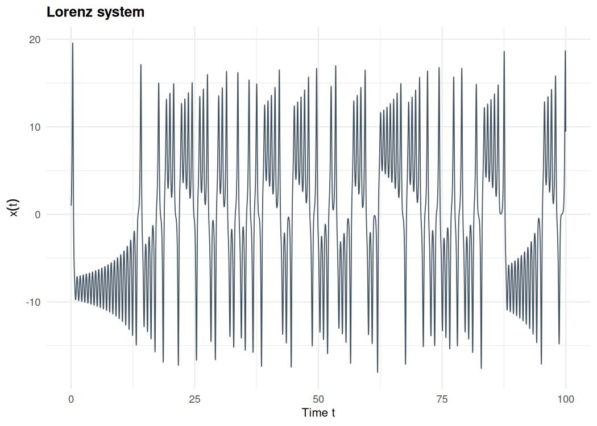

``` r

plot(sim, type = "timeseries", var = "z")
```

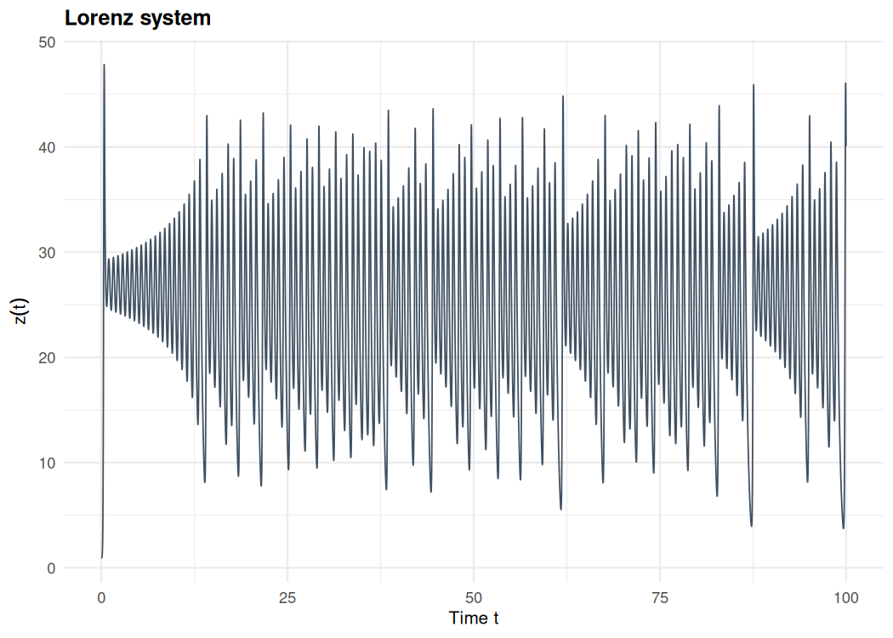

``` r


# Phase portraits
plot(sim, type = "phase")           # 2D projection (x vs y)
```

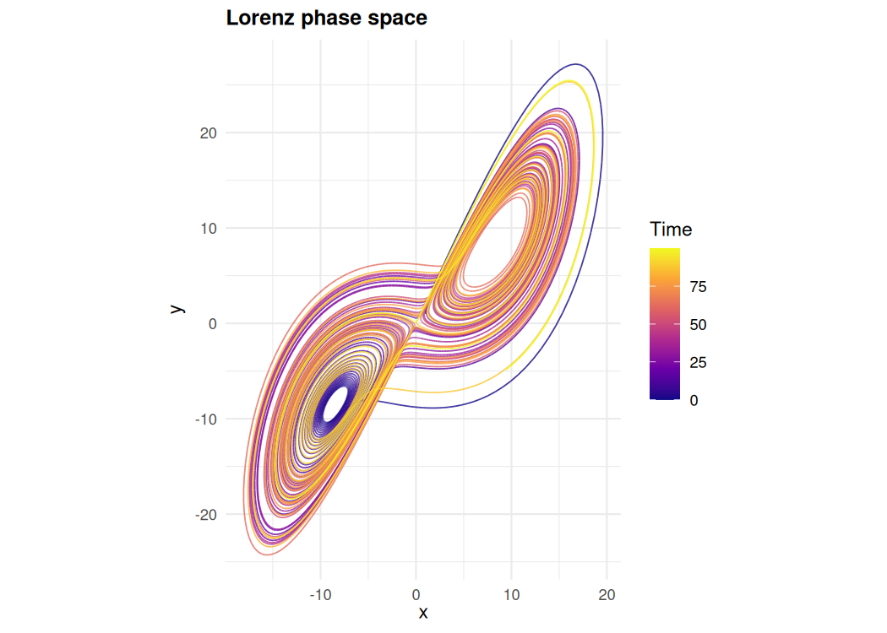

``` r


# 3D attractor (interactive plotly)
plot(sim, type = "attractor")
```

## Performance

The core integration routines are implemented in C++ via Rcpp for high
performance. All systems use either 4th-order Runge-Kutta
(deterministic) or Euler-Maruyama (stochastic) integration. OpenMP
parallelization is available for batch simulations and Cao’s method when
multiple threads are specified.

## References

Faranda, D., Sato, Y., Saint-Michel, B., Wiertel, C., Padilla, V.,
Dubrulle, B., & Daviaud, F. (2017). Stochastic chaos in a turbulent
swirling flow. *Physical Review Letters*, 119(1), 014502.
[doi:10.1103/PhysRevLett.119.014502](https://doi.org/10.1103/PhysRevLett.119.014502)

Lorenz, E.N. (1963). Deterministic nonperiodic flow. *Journal of the
Atmospheric Sciences*, 20(2), 130-141.
[doi:10.1175/1520-0469(1963)020\<0130:DNF\>2.0.CO;2](https://doi.org/10.1175/1520-0469(1963)020%3C0130:DNF%3E2.0.CO;2)

Rossler, O.E. (1976). An equation for continuous chaos. *Physics Letters
A*, 57(5), 397-398.
[doi:10.1016/0375-9601(76)90101-8](https://doi.org/10.1016/0375-9601(76)90101-8)

Stommel, H. (1961). Thermohaline convection with two stable regimes of
flow. *Tellus*, 13(2), 224-230.
[doi:10.3402/tellusa.v13i2.9491](https://doi.org/10.3402/tellusa.v13i2.9491)

Charney, J.G. & DeVore, J.G. (1979). Multiple flow equilibria in the
atmosphere and blocking. *Journal of the Atmospheric Sciences*, 36,
1205-1216.
[doi:10.1175/1520-0469(1979)036\<1205:MFEITA\>2.0.CO;2](https://doi.org/10.1175/1520-0469(1979)036%3C1205:MFEITA%3E2.0.CO;2)

Hasselmann, K. (1976). Stochastic climate models. Part I: Theory.
*Tellus*, 28, 473-485.
[doi:10.3402/tellusa.v28i6.11316](https://doi.org/10.3402/tellusa.v28i6.11316)

Wolf, A., Swift, J.B., Swinney, H.L. & Vastano, J.A. (1985). Determining
Lyapunov exponents from a time series. *Physica D*, 16(3), 285-317.
[doi:10.1016/0167-2789(85)90011-9](https://doi.org/10.1016/0167-2789(85)90011-9)

Rosenstein, M.T., Collins, J.J. & De Luca, C.J. (1993). A practical
method for calculating largest Lyapunov exponents from small data sets.
*Physica D*, 65(1-2), 117-134.
[doi:10.1016/0167-2789(93)90009-P](https://doi.org/10.1016/0167-2789(93)90009-P)

Cao, L. (1997). Practical method for determining the minimum embedding
dimension of a scalar time series. *Physica D*, 110(1-2), 43-50.
[doi:10.1016/S0167-2789(97)00118-8](https://doi.org/10.1016/S0167-2789(97)00118-8)

## License

GPL (\>= 3)

## Author

**Pablo Almaraz**
[](https://orcid.org/0000-0003-1416-2695)

[Robust Ecologies Lab](https://robustecologies.github.io)

## Disclaimer

This package is the original creation of the author in all conceptual,
theoretical, and design aspects. Implementation was assisted by
Anthropic’s Claude Code (Opus 4.5) to streamline package development.
All original ideas, creativity, and scientific contributions belong to
the author, who maintains full responsibility for the package’s
correctness and reliability. All code has been thoroughly tested, and
users are encouraged to report any issues through the package’s issue
tracker.
