# Ensemble simulation and parallelism

## Ensemble simulation in janos

Stochastic dynamical systems produce a different trajectory on every
run, so characterizing their behavior requires many independent
replicates. The
[`ensemble_sim()`](https://robustecologies.github.io/janos/reference/ensemble_sim.md)
function runs these replicates efficiently with two-tier
parallelization: compiled C++ OpenMP batch templates handle SSA Direct,
SDE Euler-Maruyama, and adaptive tau-leap solvers at maximum throughput,
while an R-level parallel fallback
([`parallel::mclapply()`](https://rdrr.io/r/parallel/mclapply.html) or
[`future.apply::future_lapply()`](https://future.apply.futureverse.org/reference/future_lapply.html))
supports every solver type in the package.

``` r

library(janos)
```

## Basic ensemble workflow

The interface mirrors
[`dyn_sim()`](https://robustecologies.github.io/janos/reference/dyn_sim.md)
but adds `n_replicates` and parallel-execution controls. Consider a
birth-death process where the death rate slightly exceeds the birth
rate, so extinction is eventual but stochastic:

``` r

bd <- model_spec(
    stoichiometry = list(
        birth = c(N = 1L),
        death = c(N = -1L)
    ),
    propensities = list(
        birth ~ lambda * N,
        death ~ mu * N
    ),
    state_names = "N",
    parms = list(lambda = 1.0, mu = 1.1),
    init  = c(N = 100L)
)

ens <- ensemble_sim(bd, n_replicates = 500, t_max = 20,
                    solver = solver_ssa_direct(seed = 42))
#> ⚙ Ensemble simulation: 500 replicates
#>   ¡ Backend: openmp (19 threads)
#>   ¡ Solver: ssa_direct, t_max = 20, seed = 42
#> ✔ Ensemble completed in 0.02s
print(ens)
#> 
#> Ensemble simulation
#> ---------------------------------------- 
#> 
#> Replicates:  500
#> Solver:      ssa_direct
#> Duration:    20
#> Backend:     openmp (19 threads)
#> Elapsed:     0.02s
#> 
#> Terminal state statistics:
#>   N: mean = 13.344, sd = 15.118
#> 
#> Extinction events:
#>   N: 128/500 (25.6%)
summary(ens)
#> 
#> Ensemble simulation summary
#> ============================================= 
#> 
#> Replicates:  500
#> Backend:     openmp
#> Elapsed:     0.02s
#> 
#> Terminal state statistics:
#>  state   mean       sd median q25 q75 min max
#>      N 13.344 15.11829      8   0  21   0  85
#> 
#> Extinction events:
#>   N: 128/500 (25.6%)
#> 
#> Trajectory summary available (fan chart, spaghetti plots).
```

The `ensemble_sim` object contains trajectory summaries (mean, standard
deviation, quantiles at each time point), terminal states for all
replicates, extinction tracking for CTMC models, and integration
metadata including the backend used and wall-clock time.

## Plot types

janos provides six plot types for ensemble results, each suited to
different aspects of the dynamics.

### Fan chart

The default `"fan"` plot shows the median trajectory surrounded by
quantile ribbons, giving a visual summary of the ensemble’s
distributional spread:

``` r

plot(ens, type = "fan", title = "Birth-death ensemble fan chart")
```

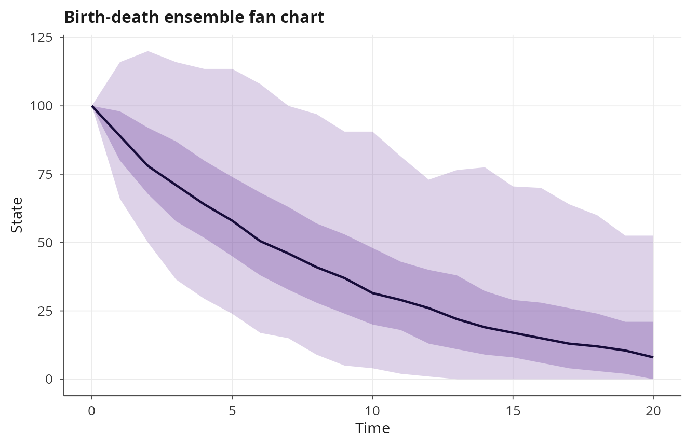

### Spaghetti plot

The `"spaghetti"` plot overlays a sample of individual trajectories,
revealing the actual realization-level behavior rather than smoothed
summaries. This is especially informative for multimodal or
extinction-prone processes:

``` r

plot(ens, type = "spaghetti", max_traces = 50,
     title = "Birth-death individual trajectories")
```

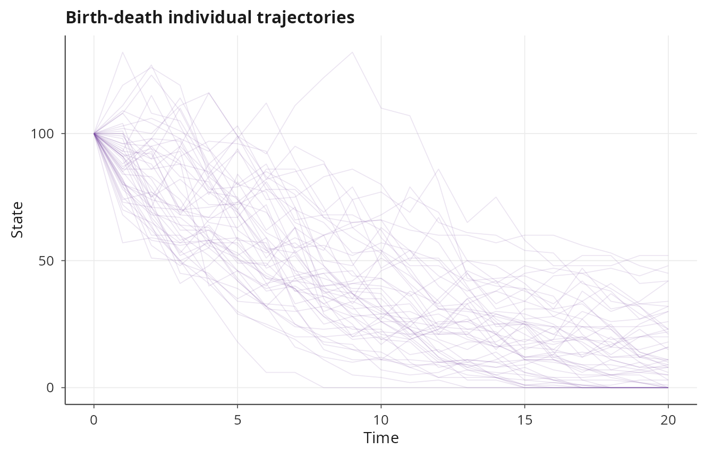

### Terminal state density

The `"terminal"` plot shows the distribution of final states across
replicates, which is useful for assessing the variability of outcomes at
a fixed time horizon:

``` r

plot(ens, type = "terminal", title = "Birth-death terminal states")
```

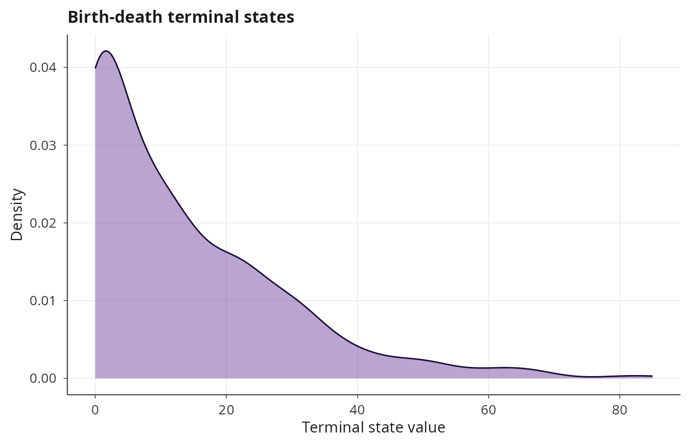

### Mean and standard deviation bands

The `"mean_sd"` plot shows the ensemble mean with plus/minus one
standard deviation bands:

``` r

plot(ens, type = "mean_sd", title = "Birth-death mean and SD")
```

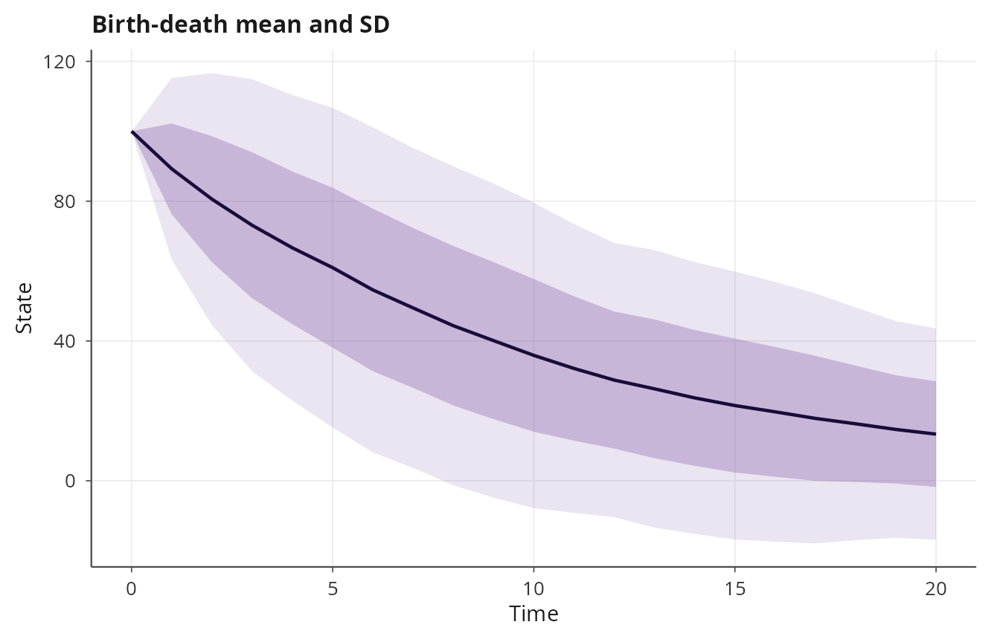

### Extinction curve

For CTMC models, the `"extinction"` plot displays the cumulative
proportion of replicates that have reached the absorbing state (zero
counts) as a step function of time. This provides a nonparametric
estimate of the extinction time distribution:

``` r

plot(ens, type = "extinction", title = "Birth-death extinction curve")
```

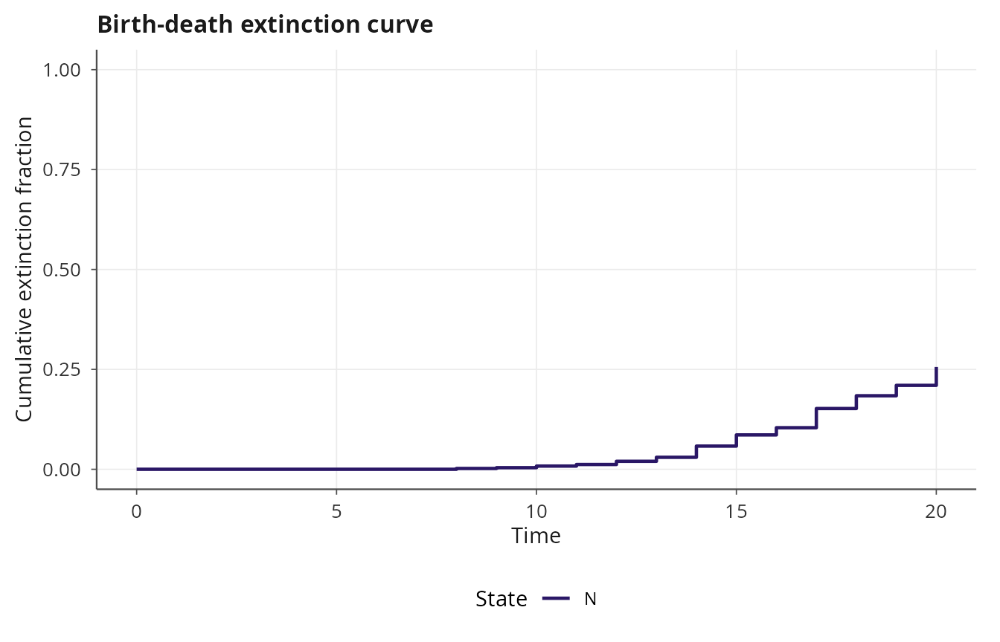

### Convergence diagnostics

The `"convergence"` plot tracks the running mean and standard error
across replicates, which is essential for determining whether the
ensemble size is sufficient. If the running mean has not stabilized,
more replicates are needed:

``` r

plot(ens, type = "convergence", title = "Birth-death convergence")
```

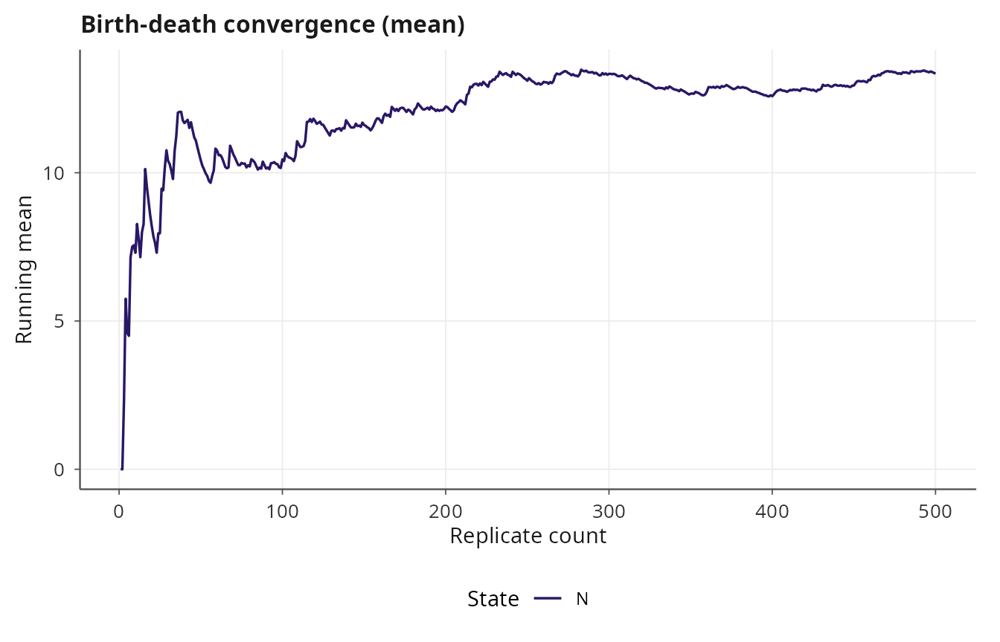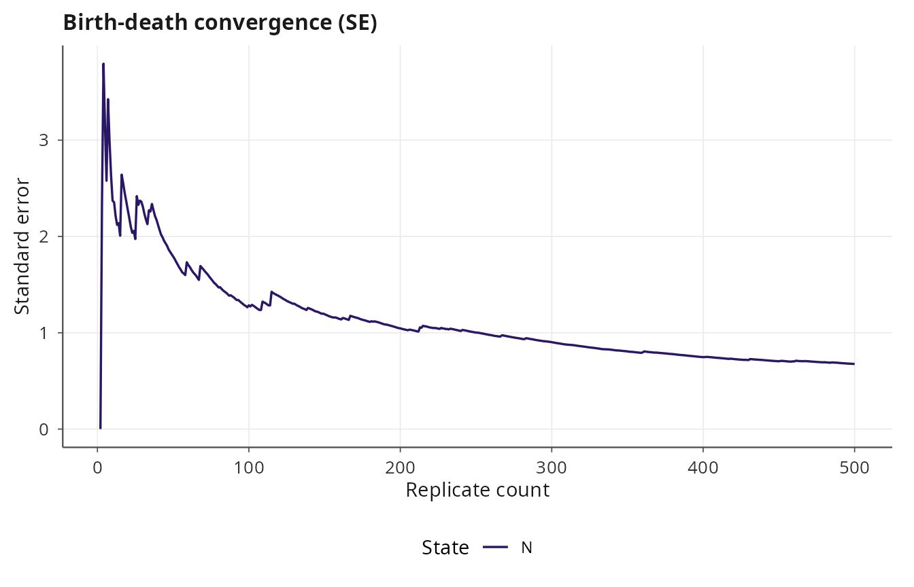

## Backend selection

The `backend` argument controls the parallelization strategy. With
`"auto"` (the default), janos selects the fastest available backend. The
OpenMP batch path is chosen when the solver is one of
[`solver_ssa_direct()`](https://robustecologies.github.io/janos/reference/solver_ssa_direct.md),
[`solver_euler_maruyama()`](https://robustecologies.github.io/janos/reference/solver_euler_maruyama.md),
or
[`solver_tau_leap()`](https://robustecologies.github.io/janos/reference/solver_tau_leap.md)
and all replicates share identical initial conditions and parameters
(i.e., `vary` is `NULL`). In all other cases, the function uses R-level
parallelism.

``` r

# Force OpenMP batch (compiled C++, single call, per-thread RNG)
ens_omp <- ensemble_sim(bd, n_replicates = 1000, t_max = 20,
                        solver = solver_ssa_direct(),
                        backend = "openmp")

# Force R-level mclapply
ens_mc <- ensemble_sim(bd, n_replicates = 1000, t_max = 20,
                       solver = solver_ssa_direct(),
                       backend = "mclapply", n_cores = 4)

# Use future backend (requires future.apply)
ens_fut <- ensemble_sim(bd, n_replicates = 1000, t_max = 20,
                        solver = solver_ssa_direct(),
                        backend = "future")
```

The OpenMP batch compilers generate a single C++ function that loops
over replicates with `#pragma omp parallel for`, using per-thread random
number generators seeded as `master_seed + replicate_index` for
deterministic reproducibility regardless of thread count.

## Reproducibility

Every replicate uses a deterministic seed computed as `seed + i - 1`,
where `i` is the replicate index (1-based). This means that replicate
\\k\\ always produces the same trajectory regardless of the
parallelization backend, thread count, or execution order. Two calls
with the same `seed` and `n_replicates` will produce identical results.

``` r

ens_a <- ensemble_sim(bd, n_replicates = 100, t_max = 10,
                      solver = solver_ssa_direct(), seed = 123)
#> ⚙ Ensemble simulation: 100 replicates
#>   ¡ Backend: openmp (19 threads)
#>   ¡ Solver: ssa_direct, t_max = 10, seed = 123
#> ✔ Ensemble completed in 0.01s
ens_b <- ensemble_sim(bd, n_replicates = 100, t_max = 10,
                      solver = solver_ssa_direct(), seed = 123)
#> ⚙ Ensemble simulation: 100 replicates
#>   ¡ Backend: openmp (19 threads)
#>   ¡ Solver: ssa_direct, t_max = 10, seed = 123
#> ✔ Ensemble completed in 0.01s
# Terminal states are identical
all.equal(ens_a$terminal_states, ens_b$terminal_states)
#> [1] TRUE
```

## SDE ensemble

The ensemble workflow applies identically to SDE models. The OpenMP
batch backend is available for
[`solver_euler_maruyama()`](https://robustecologies.github.io/janos/reference/solver_euler_maruyama.md):

``` r

gbm <- model_spec(
    rhs = list(S ~ mu * S),
    diffusion = list(S ~ sigma * S),
    state_names = "S",
    parms = list(mu = 0.05, sigma = 0.3),
    init  = c(S = 100)
)

ens_sde <- ensemble_sim(gbm, n_replicates = 500, t_max = 5,
                        solver = solver_euler_maruyama(dt = 0.001),
                        discard_transient = 0)
#> ⚙ Ensemble simulation: 500 replicates
#>   ¡ Backend: openmp (19 threads)
#>   ¡ Solver: euler_maruyama, t_max = 5, seed = 42
#> ✔ Ensemble completed in 1.56s
plot(ens_sde, type = "fan", title = "GBM ensemble fan chart")
```

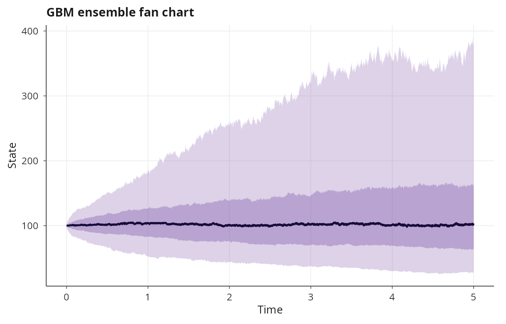

``` r

plot(ens_sde, type = "terminal", title = "GBM terminal distribution")
```

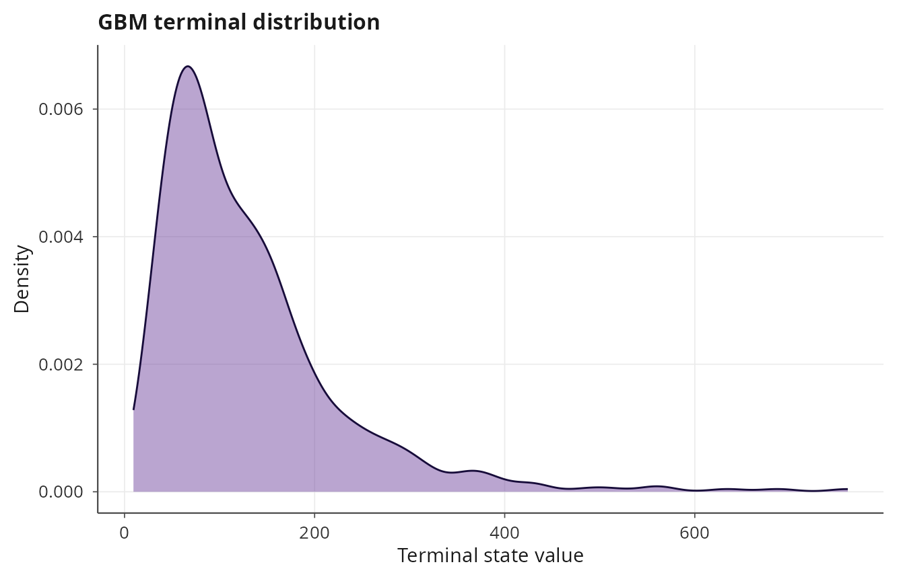

## Varying initial conditions and parameters

The `vary` argument enables per-replicate initial conditions and
parameters. It accepts a list with optional elements `init` (a function
of replicate index returning a named numeric vector) and `parms` (a
function of replicate index returning a named list). Using `vary` forces
the R-level parallel backend because each replicate may differ
structurally.

``` r

# Vary initial population size across replicates
ens_vary <- ensemble_sim(
    bd, n_replicates = 200, t_max = 20,
    solver = solver_ssa_direct(),
    n_cores = 1,
    vary = list(
        init = function(i) c(N = as.integer(50 + 5 * i))
    )
)
#> ⚙ Ensemble simulation: 200 replicates
#>   ¡ Backend: mclapply (1 cores)
#>   ¡ Solver: ssa_direct, t_max = 20, seed = 42
#> ✔ Ensemble completed in 0.08s
plot(ens_vary, type = "spaghetti", max_traces = 30,
     title = "Varying initial conditions")
```

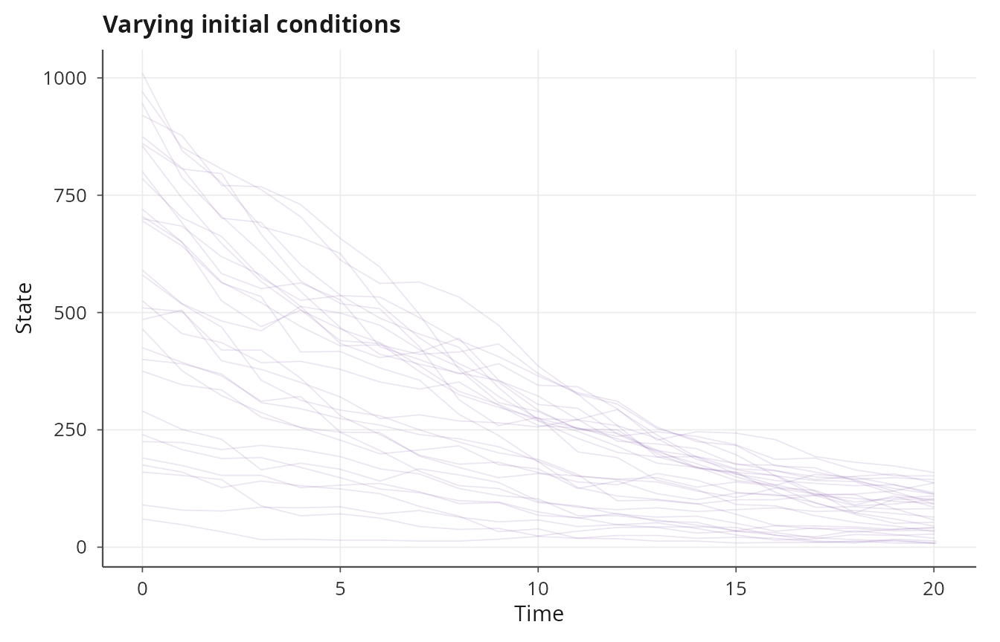

``` r

plot(ens_vary, type = "terminal", title = "Terminal states with varying IC")
```

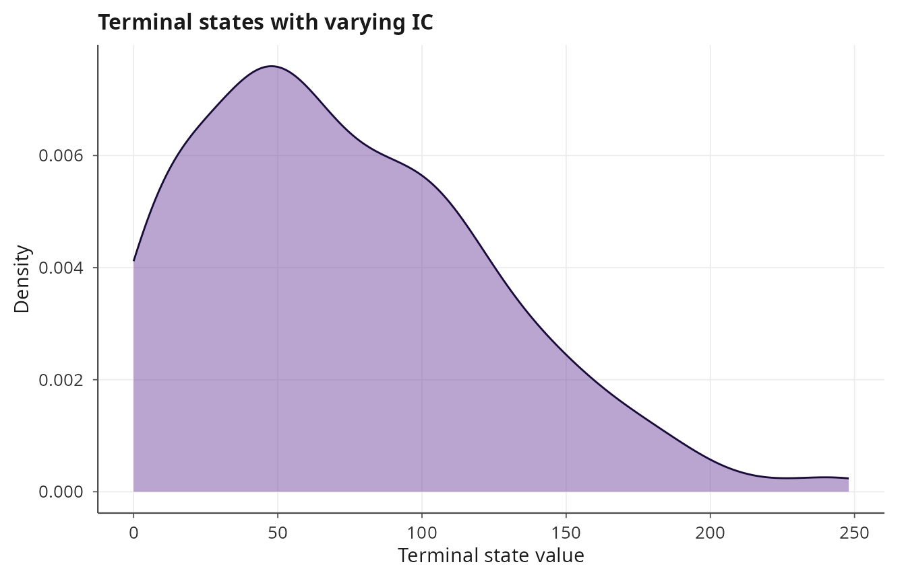

### Parameter sweeps

Combining `vary` with parameter functions enables systematic parameter
sweeps within a single ensemble call:

``` r

# Sweep death rate from subcritical to supercritical
ens_sweep <- ensemble_sim(
    bd, n_replicates = 100, t_max = 30,
    solver = solver_ssa_direct(),
    n_cores = 1,
    vary = list(
        parms = function(i) list(lambda = 1.0, mu = 0.8 + 0.01 * i)
    )
)
#> ⚙ Ensemble simulation: 100 replicates
#>   ¡ Backend: mclapply (1 cores)
#>   ¡ Solver: ssa_direct, t_max = 30, seed = 42
#> ✔ Ensemble completed in 0.05s
plot(ens_sweep, type = "terminal", title = "Death rate sweep terminal states")
```

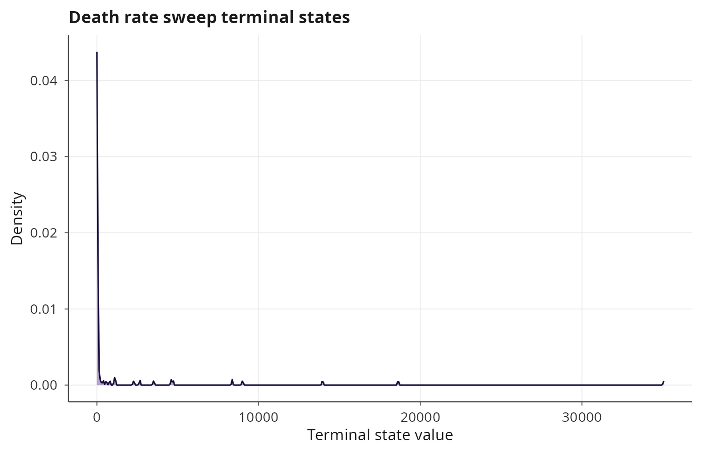

## Memory-efficient mode

For large ensembles, storing all trajectory matrices can exhaust
available memory. Setting `store_trajectories = FALSE` avoids this by
keeping only the terminal states and running statistics (mean and
standard deviation at each time point):

``` r

ens_large <- ensemble_sim(bd, n_replicates = 1000, t_max = 20,
                          solver = solver_ssa_direct(),
                          store_trajectories = FALSE)
#> ⚙ Ensemble simulation: 1000 replicates
#>   ¡ Backend: openmp (19 threads)
#>   ¡ Solver: ssa_direct, t_max = 20, seed = 42
#> ✔ Ensemble completed in 0.02s
print(ens_large)
#> 
#> Ensemble simulation
#> ---------------------------------------- 
#> 
#> Replicates:  1000
#> Solver:      ssa_direct
#> Duration:    20
#> Backend:     openmp (19 threads)
#> Elapsed:     0.02s
#> 
#> Terminal state statistics:
#>   N: mean = 13.676, sd = 15.994
#> 
#> Extinction events:
#>   N: 248/1000 (24.8%)

# Full trajectories are not available
is.null(ens_large$trajectories)  # TRUE
#> [1] TRUE

# But terminal states and summary statistics are
dim(ens_large$terminal_states)
#> [1] 1000    1
plot(ens_large, type = "terminal",
     title = "Large ensemble terminal states")
```

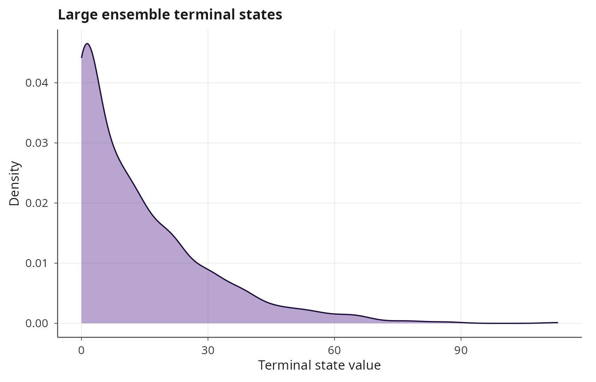

Fan and spaghetti plots require stored trajectories and will produce an
informative error when called on a memory-efficient ensemble. The
convergence, terminal, and extinction plots remain available.

## Ensemble with ODE solvers

Although ensemble simulation is most commonly used for stochastic
models, it works with any solver, including deterministic ODE solvers.
When combined with `vary`, this enables sensitivity analysis by initial
conditions or parameters:

``` r

lv <- model_spec(
    rhs = list(
        prey     ~ alpha * prey - beta * prey * predator,
        predator ~ delta * prey * predator - gamma * predator
    ),
    state_names = c("prey", "predator"),
    parms = list(alpha = 1.0, beta = 0.1, delta = 0.075, gamma = 1.5),
    init  = c(prey = 40, predator = 9)
)

ens_ode <- ensemble_sim(
    lv, n_replicates = 50, t_max = 30,
    solver = solver_rk45(),
    discard_transient = 0,
    n_cores = 1,
    vary = list(
        init = function(i) c(prey = 30 + i, predator = 5 + 0.2 * i)
    )
)
#> ⚙ Ensemble simulation: 50 replicates
#>   ¡ Backend: mclapply (1 cores)
#>   ¡ Solver: rk45, t_max = 30, seed = 42
#> ✔ Ensemble completed in 0.16s
plot(ens_ode, type = "spaghetti",
     title = "Lotka-Volterra varying initial conditions")
```

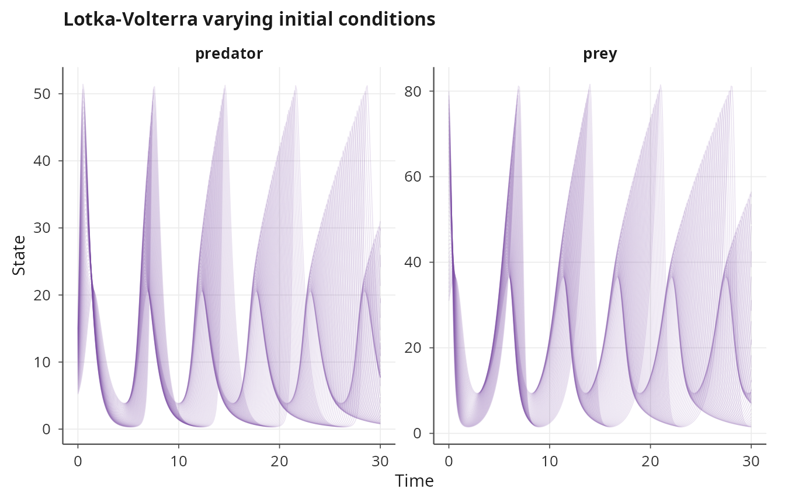

## Tau-leap ensemble

Adaptive tau-leap also supports OpenMP batch compilation:

``` r

sir <- model_spec(
    stoichiometry = list(
        infection = c(S = -1L, I = 1L, R = 0L),
        recovery  = c(S = 0L,  I = -1L, R = 1L)
    ),
    propensities = list(
        infection ~ beta * S * I,
        recovery  ~ gamma * I
    ),
    state_names = c("S", "I", "R"),
    parms = list(beta = 0.001, gamma = 0.1),
    init  = c(S = 999L, I = 1L, R = 0L)
)

ens_tau <- ensemble_sim(sir, n_replicates = 300, t_max = 200,
                        solver = solver_tau_leap(),
                        discard_transient = 0)
#> ⚙ Ensemble simulation: 300 replicates
#>   ¡ Backend: openmp (19 threads)
#>   ¡ Solver: tau_leap, t_max = 200, seed = 42
#> ✔ Ensemble completed in 0.16s
plot(ens_tau, type = "fan", title = "SIR tau-leap ensemble")
```

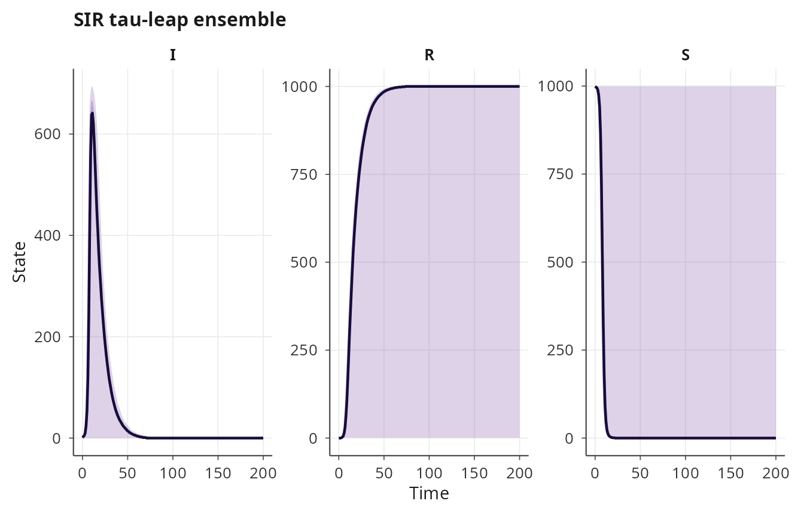

## Practical guidance

For SSA Direct, SDE EM, and tau-leap with uniform initial conditions and
parameters, the OpenMP batch backend can be orders of magnitude faster
than R-level parallelism because it avoids R-to-C++ dispatch overhead
per replicate and eliminates inter-process communication. The R-level
backend is necessary for solvers that lack batch compilers (DDE, PDE,
PDMP, Rosenbrock, etc.) or when `vary` is used.

The number of cores defaults to one fewer than the available hardware
threads. For OpenMP batch, this is the number of OpenMP threads; for
`mclapply`, it is the number of forked processes. Setting `n_cores = 1`
disables parallelism, which is useful for debugging or profiling.

When the ensemble size is uncertain, start with a small run and use the
convergence plot to assess whether the running mean has stabilized. The
standard error of the mean decreases as \\1/\sqrt{n}\\, so doubling the
precision requires four times as many replicates.
