# Qualitative analysis and the geometry of dynamics: phase portraits across dynamical system types

``` r

library(janos)
```

## The geometry of dynamics

### Flows and phase space

The qualitative theory of dynamical systems seeks to understand the
long-term behaviour of a system without solving its equations
explicitly. The central object is the *phase portrait*: a geometric
representation of the flow \\\dot{\mathbf{x}} = \mathbf{f}(\mathbf{x})\\
in state space, showing how trajectories evolve, where they converge or
diverge, and what structures organise the global dynamics. This
approach, pioneered by Poincaré in his study of celestial mechanics in
the 1880s and systematised by Andronov, Pontryagin, and their school in
the mid-twentieth century [\[1\]](#ref1), remains the most powerful tool
for extracting insight from nonlinear systems that resist closed-form
solution.

The starting point is an autonomous system of ordinary differential
equations

\\\dot{\mathbf{x}} = \mathbf{f}(\mathbf{x}), \quad \mathbf{x} \in
\mathbb{R}^n,\\

where \\\mathbf{f}: \mathbb{R}^n \to \mathbb{R}^n\\ is a \\C^1\\ vector
field. The vector field assigns to each point \\\mathbf{x}\\ in state
space a velocity vector \\\mathbf{f}(\mathbf{x})\\ that determines the
instantaneous direction and rate of change of the system. The
Picard-Lindelöf theorem guarantees that, given \\\mathbf{f}\\ Lipschitz
continuous, for every initial condition \\\mathbf{x}(0) =
\mathbf{x}\_0\\ there exists a unique solution \\\phi_t(\mathbf{x}\_0)\\
defined at least locally in time. The collection of all such solution
curves fills the phase space without crossing (by uniqueness), creating
the *phase portrait* of the system. The map \\\phi_t: \mathbb{R}^n \to
\mathbb{R}^n\\ is called the *flow* of the system and satisfies the
group properties \\\phi_0 = \text{id}\\ and \\\phi\_{t+s} = \phi_t \circ
\phi_s\\.

The *nullclines* of the system are the loci in state space where
individual components of the velocity vanish. The \\i\\-th nullcline is
the set \\\mathcal{N}\_i = \\\mathbf{x} \in \mathbb{R}^n :
f_i(\mathbf{x}) = 0\\\\. In a two-dimensional system, nullclines are
curves; in three dimensions, they are surfaces. On the \\i\\-th
nullcline, the \\i\\-th component of the state vector is instantaneously
stationary (\\\dot{x}\_i = 0\\), so the flow is constrained to move
parallel to the remaining coordinate directions. The equilibria of the
system, the points \\\mathbf{x}^\*\\ where \\\mathbf{f}(\mathbf{x}^\*) =
\mathbf{0}\\, are precisely the intersections of all nullclines:
\\\mathbf{x}^\* \in \bigcap\_{i=1}^n \mathcal{N}\_i\\. The nullcline
structure therefore provides a powerful graphical tool for locating
equilibria and understanding the flow geometry, since the signs of
\\f_i\\ in each region bounded by the nullclines determine the direction
of the flow.

### Linearisation and the Hartman-Grobman theorem

The local behaviour near an equilibrium \\\mathbf{x}^\*\\ is governed by
the linearisation of the vector field. Writing \\\mathbf{x} =
\mathbf{x}^\* + \mathbf{\xi}\\ and Taylor-expanding gives
\\\dot{\mathbf{\xi}} = J\\\mathbf{\xi} + O(\\\mathbf{\xi}\\^2)\\, where
\\J = D\mathbf{f}(\mathbf{x}^\*)\\ is the \\n \times n\\ Jacobian matrix
with entries \\J\_{ij} = \partial f_i / \partial x_j
\|\_{\mathbf{x}^\*}\\. The linear system \\\dot{\mathbf{\xi}} =
J\\\mathbf{\xi}\\ has the explicit solution \\\mathbf{\xi}(t) =
e^{Jt}\\\mathbf{\xi}(0)\\, whose behaviour is completely determined by
the eigenvalues \\\lambda_1, \ldots, \lambda_n\\ of \\J\\, found by
solving the characteristic equation

\\\det(\lambda I - J) = 0.\\

An equilibrium \\\mathbf{x}^\*\\ is called *hyperbolic* if no eigenvalue
of \\J\\ lies on the imaginary axis, i.e., \\\text{Re}(\lambda_i) \neq
0\\ for all \\i\\. For hyperbolic equilibria, the following fundamental
result guarantees that the linearisation captures the full local
topology:

**Theorem (Hartman-Grobman [\[2\]](#ref2)).** *Let \\\mathbf{x}^\*\\ be
a hyperbolic equilibrium of the \\C^1\\ system \\\dot{\mathbf{x}} =
\mathbf{f}(\mathbf{x})\\. Then there exists a neighbourhood \\U\\ of
\\\mathbf{x}^\*\\ and a homeomorphism \\h: U \to V\\ (where \\V\\ is a
neighbourhood of the origin) that maps orbits of the nonlinear flow
\\\phi_t\\ to orbits of the linear flow \\e^{Jt}\\, preserving the
direction of time. That is, \\h \circ \phi_t = e^{Jt} \circ h\\ wherever
both sides are defined.*

The Hartman-Grobman theorem is a topological result: the homeomorphism
\\h\\ preserves the orbit structure but is generally not smooth (not a
diffeomorphism). It implies that the qualitative behaviour of
trajectories near a hyperbolic equilibrium, their convergence,
divergence, or saddle-type structure, is faithfully represented by the
eigenvalue classification. The theorem fails for non-hyperbolic
equilibria (those with eigenvalues on the imaginary axis), where
nonlinear terms determine the local dynamics and center manifold theory
must be invoked [\[17\]](#ref17).

### Classification of equilibria

The eigenvalues of the Jacobian \\J\\ at a hyperbolic equilibrium
determine its topological type. In two dimensions, where \\J\\ is a \\2
\times 2\\ matrix, the eigenvalues are the roots of \\\lambda^2 -
\tau\lambda + \Delta = 0\\, where \\\tau = \text{tr}(J)\\ is the trace
and \\\Delta = \det(J)\\ is the determinant. The discriminant \\D =
\tau^2 - 4\Delta\\ determines whether the eigenvalues are real or
complex. The full classification is:

- **Stable node** (\\\Delta \> 0\\, \\\tau \< 0\\, \\D \geq 0\\): both
  eigenvalues are real and negative, \\\lambda_1, \lambda_2 \< 0\\.
  Trajectories converge monotonically to \\\mathbf{x}^\*\\ along the
  eigenvector directions; the approach is tangent to the slow
  eigenvector (the one with the eigenvalue of smaller absolute value).
  janos marks stable nodes as filled blue circles.

- **Unstable node** (\\\Delta \> 0\\, \\\tau \> 0\\, \\D \geq 0\\): both
  eigenvalues are real and positive, \\\lambda_1, \lambda_2 \> 0\\.
  Trajectories diverge monotonically from \\\mathbf{x}^\*\\.
  Time-reversal of a stable node. Marked as filled red circles.

- **Stable focus** (\\\Delta \> 0\\, \\\tau \< 0\\, \\D \< 0\\):
  eigenvalues are complex conjugates \\\lambda = \alpha \pm i\beta\\
  with \\\alpha \< 0\\. Trajectories spiral inward toward
  \\\mathbf{x}^\*\\ with angular frequency \\\beta\\ and exponential
  decay rate \\\|\alpha\|\\. Marked as filled blue diamonds.

- **Unstable focus** (\\\Delta \> 0\\, \\\tau \> 0\\, \\D \< 0\\):
  eigenvalues are complex conjugates with \\\alpha \> 0\\. Trajectories
  spiral outward from \\\mathbf{x}^\*\\. Time-reversal of a stable
  focus. Marked as filled red diamonds.

- **Center** (\\\Delta \> 0\\, \\\tau = 0\\, \\D \< 0\\): eigenvalues
  are purely imaginary, \\\lambda = \pm i\beta\\. The linearisation
  predicts closed elliptical orbits with period \\2\pi/\beta\\. Centers
  are *non-hyperbolic*: the Hartman-Grobman theorem does not apply, and
  the nonlinear system may exhibit centres (as in the conservative
  Lotka-Volterra model) or slow spirals (when higher-order terms break
  the symmetry). Marked as open green circles.

- **Saddle** (\\\Delta \< 0\\): one eigenvalue is positive and the other
  negative, \\\lambda_1 \> 0 \> \lambda_2\\. The equilibrium is
  unstable, but the flow is structured: the stable eigenvector defines
  the direction from which trajectories approach \\\mathbf{x}^\*\\, and
  the unstable eigenvector defines the direction along which they
  depart. Marked as filled orange triangles.

In three dimensions, the \\3 \times 3\\ Jacobian has three eigenvalues,
which may be three real numbers or one real number and a complex
conjugate pair. The additional type that emerges is the
**saddle-focus**, where one real eigenvalue has opposite sign to the
real part of the complex pair. For example, \\\lambda_1 \> 0\\ and
\\\lambda\_{2,3} = \alpha \pm i\beta\\ with \\\alpha \< 0\\ gives a
saddle-focus where trajectories spiral inward on the 2D stable manifold
while diverging along the 1D unstable manifold. The Lorenz system’s
\\C^{\pm}\\ equilibria are of this type at the classical parameters.
janos marks saddle-foci as filled orange inverted triangles.

The trace-determinant plane provides a global view of all possible 2D
equilibrium types. The parabola \\D = \tau^2/4\\ separates nodes (\\D
\geq 0\\) from foci (\\D \< 0\\); the \\\tau = 0\\ axis separates stable
(\\\tau \< 0\\) from unstable (\\\tau \> 0\\) types; and the \\\Delta =
0\\ axis separates proper equilibria (\\\Delta \> 0\\) from saddles
(\\\Delta \< 0\\) and degenerate cases (\\\Delta = 0\\, where at least
one eigenvalue is zero and the equilibrium is non-isolated or the system
has a line of equilibria).

### Invariant manifolds

The *stable manifold theorem* [\[17\]](#ref17) extends the notion of
eigenspaces to the nonlinear setting. Suppose \\\mathbf{x}^\*\\ is a
hyperbolic equilibrium of \\\dot{\mathbf{x}} = \mathbf{f}(\mathbf{x})\\,
and let \\E^s\\ and \\E^u\\ denote the stable and unstable eigenspaces
of \\J = D\mathbf{f}(\mathbf{x}^\*)\\ (the eigenspaces corresponding to
eigenvalues with negative and positive real part, respectively, with
\\\dim E^s = n_s\\ and \\\dim E^u = n_u = n - n_s\\).

**Theorem (Stable manifold).** *There exist \\C^1\\ invariant manifolds
\\W^s(\mathbf{x}^\*)\\ and \\W^u(\mathbf{x}^\*)\\ of dimension \\n_s\\
and \\n_u\\ respectively, such that:*

1.  *\\W^s(\mathbf{x}^\*)\\ is tangent to \\E^s\\ at \\\mathbf{x}^\*\\,
    and every trajectory starting on \\W^s\\ converges to
    \\\mathbf{x}^\*\\ as \\t \to +\infty\\.*
2.  *\\W^u(\mathbf{x}^\*)\\ is tangent to \\E^u\\ at \\\mathbf{x}^\*\\,
    and every trajectory starting on \\W^u\\ converges to
    \\\mathbf{x}^\*\\ as \\t \to -\infty\\.*
3.  *Both manifolds are locally unique and as smooth as \\\mathbf{f}\\.*

For a saddle in 2D, both \\W^s\\ and \\W^u\\ are one-dimensional curves
that act as *separatrices*, dividing the phase plane into distinct
basins of attraction. The stable manifold delineates the boundary
between basins: initial conditions on opposite sides of \\W^s\\ may
converge to entirely different attractors. For a saddle in 3D, \\W^s\\
and \\W^u\\ may be one- or two-dimensional, depending on the eigenvalue
configuration. janos computes both manifolds numerically by perturbing
slightly along the eigenvectors at \\\mathbf{x}^\*\\ (by a distance
`manifold_eps`) and integrating forward in time for \\W^u\\ and backward
in time for \\W^s\\ using an explicit RK4 integrator.

### The Poincaré-Bendixson theorem and limit cycles

In planar systems (\\n = 2\\), the topology of the plane imposes strong
constraints on the possible long-term behaviour. The following theorem,
proved by Poincaré (1882) and sharpened by Bendixson (1901), is the
central result:

**Theorem (Poincaré-Bendixson [\[1\]](#ref1), [\[18\]](#ref18)).** *Let
\\\dot{\mathbf{x}} = \mathbf{f}(\mathbf{x})\\ be a \\C^1\\ planar
system, and suppose that \\\gamma^+(\mathbf{x}\_0) =
\\\phi_t(\mathbf{x}\_0) : t \geq 0\\\\ is a forward orbit that remains
in a compact subset \\K \subset \mathbb{R}^2\\. Then the
\\\omega\\-limit set \\\omega(\mathbf{x}\_0)\\ is one of the following:*

1.  *A single equilibrium point.*
2.  *A periodic orbit (limit cycle).*
3.  *A finite set of equilibria connected by heteroclinic or homoclinic
    orbits (a “polycycle”).*

*In particular, if \\K\\ contains no equilibria, then
\\\omega(\mathbf{x}\_0)\\ is a periodic orbit.*

The Poincaré-Bendixson theorem has profound consequences. It implies
that *chaos is impossible in continuous-time planar systems*: bounded
trajectories must eventually settle onto equilibria or periodic orbits.
The theorem provides a practical criterion for establishing the
existence of limit cycles: if one can identify a positively invariant
annular region (a “trapping region”) that contains no equilibria, then
by Poincaré-Bendixson the region must contain at least one periodic
orbit. This strategy is used extensively in mathematical biology (e.g.,
to prove the existence of oscillations in the FitzHugh-Nagumo and
Brusselator models) and chemical kinetics.

A related result, the *Dulac criterion* (also known as Bendixson’s
negative criterion), provides a sufficient condition for the *absence*
of periodic orbits. If there exists a function \\B(\mathbf{x})\\ such
that \\\nabla \cdot (B\mathbf{f})\\ does not change sign in a simply
connected domain \\D\\, then \\D\\ contains no periodic orbit of the
system \\\dot{\mathbf{x}} = \mathbf{f}(\mathbf{x})\\ [\[1\]](#ref1). The
choice of \\B\\ (the Dulac function) is problem-specific and often
guided by the structure of the equations.

In three or more dimensions, the Poincaré-Bendixson theorem does not
hold. The orbit topology of \\\mathbb{R}^3\\ is rich enough to support
*strange attractors*: compact invariant sets on which the flow is
chaotic, exhibiting sensitive dependence on initial conditions and
fractal geometric structure. The Lorenz attractor (\\\sigma = 10\\,
\\\rho = 28\\, \\\beta = 8/3\\) is the prototypical example, with
largest Lyapunov exponent \\\lambda_1 \approx 0.906\\ and Hausdorff
dimension \\\approx 2.06\\ [\[1\]](#ref1). The Rössler system provides
another canonical example, where the route to chaos proceeds through a
period-doubling cascade, and the Shilnikov theorem connects homoclinic
orbits to saddle-foci with the existence of horseshoe-type chaos
[\[19\]](#ref19).

### Structural stability and bifurcations

An equilibrium classification is *structurally stable* if small
perturbations to the vector field \\\mathbf{f}\\ do not change the
topological type of the equilibrium. By the Hartman-Grobman theorem, all
hyperbolic equilibria are structurally stable: small perturbations to
\\\mathbf{f}\\ move the eigenvalues continuously, and as long as they
remain bounded away from the imaginary axis, the topological type is
preserved. Non-hyperbolic equilibria (centres, and cases where
\\\text{Re}(\lambda) = 0\\ for some eigenvalue) are structurally
unstable: arbitrarily small perturbations can change a center into a
stable or unstable focus [\[19\]](#ref19).

The qualitative change in the phase portrait as a parameter varies is
called a *bifurcation*. The most important local bifurcations in
continuous-time systems are:

- **Saddle-node bifurcation**: two equilibria (a node and a saddle)
  collide and annihilate as a parameter crosses a critical value. This
  is the generic mechanism for the sudden appearance or disappearance of
  equilibria and occurs when a single eigenvalue crosses zero (\\\Delta
  = 0\\ in the 2D classification).

- **Transcritical bifurcation**: two equilibria exchange stability
  without being destroyed. Occurs generically in systems where one
  equilibrium is fixed by a symmetry (e.g., the trivial equilibrium
  \\\mathbf{x}^\* = \mathbf{0}\\ in population models).

- **Pitchfork bifurcation**: a symmetric equilibrium loses stability and
  two new asymmetric equilibria appear (supercritical) or an unstable
  equilibrium collides with two stable ones (subcritical). Common in
  systems with \\\mathbb{Z}\_2\\ symmetry.

- **Hopf bifurcation**: a focus changes stability as a complex conjugate
  pair of eigenvalues crosses the imaginary axis (\\\tau = 0\\ with
  \\\Delta \> 0\\). A supercritical Hopf bifurcation gives birth to a
  stable limit cycle as the equilibrium becomes unstable; a subcritical
  Hopf absorbs an unstable limit cycle. The Hopf bifurcation theorem
  [\[20\]](#ref20) guarantees the local existence and uniqueness of the
  limit cycle branch.

While janos does not compute bifurcation diagrams in the portrait
functions (see
[`continuation()`](https://robustecologies.github.io/janos/reference/continuation.md)
for that purpose), the phase portrait at a fixed parameter value reveals
the current bifurcation regime through its equilibrium classification,
nullcline geometry, and manifold structure. A portrait showing a
near-degenerate equilibrium (eigenvalues close to the imaginary axis or
to zero) signals proximity to a bifurcation.

### The janos portrait API

The janos package provides five portrait analysis functions, one for
each major class of dynamical system:
[`phase_portrait()`](https://robustecologies.github.io/janos/reference/phase_portrait.md)
for ODEs,
[`map_portrait()`](https://robustecologies.github.io/janos/reference/map_portrait.md)
for discrete maps,
[`sde_portrait()`](https://robustecologies.github.io/janos/reference/sde_portrait.md)
for stochastic differential equations,
[`dde_portrait()`](https://robustecologies.github.io/janos/reference/dde_portrait.md)
for delay differential equations, and
[`pdmp_portrait()`](https://robustecologies.github.io/janos/reference/pdmp_portrait.md)
for piecewise deterministic Markov processes. All share a common
workflow: define the model with
[`model_spec()`](https://robustecologies.github.io/janos/reference/model_spec.md),
compute the portrait, and inspect the results through the S3 triad
[`print()`](https://rdrr.io/r/base/print.html),
[`summary()`](https://rdrr.io/r/base/summary.html),
[`plot()`](https://rdrr.io/r/graphics/plot.default.html).

The shared parameters across all five functions include `xlim` and
`ylim` for domain specification (auto-detected from the model’s initial
conditions when set to `NULL`), `n_grid` for the density of the vector
or displacement field (default \\25 \times 25\\), `states` for
projecting higher-dimensional systems onto a 2D subspace, `parms` for
overriding model parameters, `discard_transient` for removing the
leading fraction of trajectories (a value in \\\[0, 1)\\), and `verbose`
for progress messages. The equilibrium-finding algorithm shares
`n_eq_grid` (initial guess grid density), `eq_tol` (convergence
tolerance, default \\10^{-10}\\), and `eq_merge_tol` (duplicate merging
tolerance, default \\10^{-6}\\) across all portrait types.

The [`plot()`](https://rdrr.io/r/graphics/plot.default.html) methods all
accept a `type` argument selecting which components to display (each
function defines its own set of valid types), a `title` argument for
custom plot titles, `arrow_scale` for adjusting arrow sizes,
`arrow_type` choosing between `"open"` and `"closed"` arrowheads, and
`feasible` for shading infeasible regions of state space. The `feasible`
argument accepts `FALSE` (no shading, the default), `TRUE` (shade where
any state is negative), or a named list with per-state bounds (e.g.,
`feasible = list(x = c(0, 100), y = c(0, 50))`).

## ODE phase portraits

### Theory: vector fields, nullclines, and equilibrium classification

The phase portrait of an ODE system consists of several geometric
objects that together reveal the qualitative dynamics. The *vector
field* assigns to each point \\\mathbf{x}\\ the velocity
\\\mathbf{f}(\mathbf{x})\\, typically rendered as arrows whose direction
indicates the flow and whose colour or length encodes the speed
\\\\\mathbf{f}(\mathbf{x})\\\\. The *nullclines* are the curves (in 2D)
or surfaces (in 3D) where individual components of the velocity vanish:
the \\i\\-th nullcline is the set \\\\x : f_i(\mathbf{x}) = 0\\\\.
Equilibria lie at intersections of all nullclines, since
\\\mathbf{f}(\mathbf{x}^\*) = \mathbf{0}\\ requires every component to
vanish simultaneously. janos computes nullclines by evaluating \\f_i\\
on a fine grid and extracting zero-contours via
[`grDevices::contourLines()`](https://rdrr.io/r/grDevices/contourLines.html).

Equilibria are found by a multi-start Newton iteration. The domain is
seeded with a grid of initial guesses (controlled by `n_eq_grid`), and
each is refined by the iteration

\\\mathbf{x}\_{k+1} = \mathbf{x}\_k -
J(\mathbf{x}\_k)^{-1}\\\mathbf{f}(\mathbf{x}\_k)\\

until \\\\\mathbf{f}(\mathbf{x}\_k)\\ \< \text{eq\\tol}\\. Duplicate
equilibria (within `eq_merge_tol`) are merged. Each equilibrium is then
classified by the eigenvalues \\\lambda_i\\ of the Jacobian:

\\\det(\lambda I - J(\mathbf{x}^\*)) = 0.\\

For 2D systems the classification yields six types: stable node,
unstable node, stable focus, unstable focus, center, and saddle. In 3D a
seventh type appears, the *saddle-focus*, where one real eigenvalue and
a complex pair have opposite stability. At saddle equilibria, the stable
and unstable manifolds are computed by perturbing along the
corresponding eigenvectors and integrating forward (for unstable) or
backward (for stable) in time using RK4.

The
[`phase_portrait()`](https://robustecologies.github.io/janos/reference/phase_portrait.md)
function additionally supports *streamlines* (field lines of
\\\mathbf{f}\\, integrated from boundary seed points) and *trajectories*
(from the model’s initial conditions or from a user-supplied list of
starting points). For 3D systems, the output switches from ggplot2 to an
interactive plotly widget with cone glyphs for the vector field and 3D
trajectory traces.

### Example 1: Lotka-Volterra predator-prey (ecology)

The classical Lotka-Volterra predator-prey model [\[1\]](#ref1)
describes the interaction between a prey population \\N\\ and a predator
population \\P\\:

\\\dot{N} = \alpha N - \beta N P, \quad \dot{P} = \delta N P - \gamma
P.\\

This conservative system has a first integral \\V = \delta N - \gamma
\ln N + \beta P - \alpha \ln P\\, so all trajectories in the positive
quadrant are closed orbits surrounding the interior equilibrium \\(N^\*,
P^\*) = (\gamma/\delta, \alpha/\beta)\\, which is a center.

``` r

lv <- model_spec(
    rhs = list(
        N ~ alpha * N - beta * N * P,
        P ~ delta * N * P - gamma * P
    ),
    state_names = c("N", "P"),
    parms = list(alpha = 1.0, beta = 0.1, delta = 0.075, gamma = 1.5),
    init  = c(N = 40, P = 9)
)

pp1 <- phase_portrait(lv,
    xlim = c(0, 60), ylim = c(0, 30),
    traj_length = 80, manifold_length = 80)
#> ⚙ Computing trajectories...
#> ⚙ Searching for equilibria...
#> ✔ Found 2 equilibria.
#> ⚙ Computing vector field...
#> ⚙ Computing nullclines...
#> ⚙ Computing manifolds for 1 saddle equilibrium...
#> ✔ Phase portrait complete.

print(pp1)
#> 
#> Phase portrait
#> ──────────────────────────────────────── 
#> 
#> Dimension: 2 D
#> States: N, P 
#> Domain: [0.00, 60.00] x [0.00, 30.00]
#> 
#> Components:
#>   Vector field:   625 points 
#>   Nullclines:     2 contour segments 
#>   Equilibria:     2 (1 center, 1 saddle) 
#>   Streamlines:    not computed 
#>   Manifolds:      not computed 
#>   Trajectories:   1 curves
summary(pp1)
#> 
#> Phase portrait
#> ──────────────────────────────────────── 
#> 
#> Dimension: 2 D
#> States: N, P 
#> Domain: [0.00, 60.00] x [0.00, 30.00]
#> 
#> Components:
#>   Vector field:   625 points 
#>   Nullclines:     2 contour segments 
#>   Equilibria:     2 (1 center, 1 saddle) 
#>   Streamlines:    not computed 
#>   Manifolds:      not computed 
#>   Trajectories:   1 curves 
#> 
#> Equilibrium details:
#> ──────────────────────────────────────── 
#> 
#>   #1: saddle (unstable)
#>       (N, P) = (-0.000000, -0.000000)
#>       lambda_1 = 1.000000
#>       lambda_2 = -1.500000
#> 
#>   #2: center (unstable)
#>       (N, P) = (20.000000, 10.000000)
#>       lambda_1 = 0.000000 + 1.224745i
#>       lambda_2 = 0.000000 - 1.224745i
```

The portrait reveals two equilibria: a saddle at the origin (where both
populations are extinct) and a center at \\(N^\*, P^\*) = (20, 10)\\.
The nullclines are straight lines: \\N = \gamma/\delta = 20\\ (vertical)
and \\P = \alpha/\beta = 10\\ (horizontal), intersecting at the center.
The trajectory from the initial condition \\(N_0, P_0) = (40, 9)\\
traces a closed orbit whose amplitude is set by the initial Hamiltonian
value. The `feasible = TRUE` option shades the biologically meaningless
region where \\N \< 0\\ or \\P \< 0\\.

``` r

plot(pp1, feasible = TRUE,
     title = "Lotka-Volterra predator-prey")
```

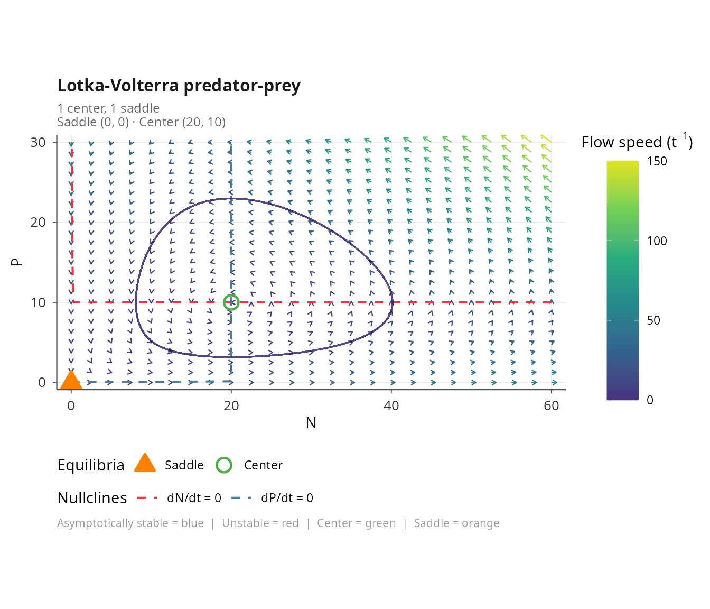

Viewing only the nullcline structure, without the vector field or
trajectories, often clarifies the equilibrium geometry:

``` r

plot(pp1, type = "nullclines",
     title = "Nullcline intersection: Lotka-Volterra")
```

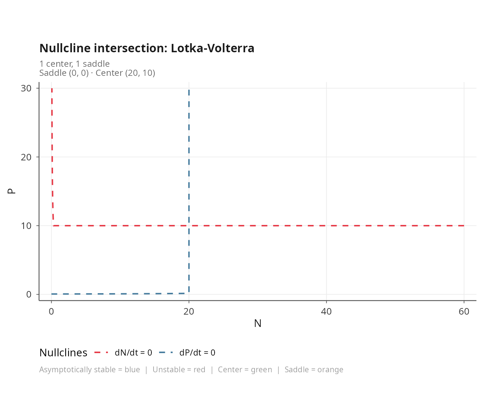

### Example 2: FitzHugh-Nagumo neuron model (biology)

The FitzHugh-Nagumo model [\[1\]](#ref1) is a simplified two-dimensional
reduction of the Hodgkin-Huxley equations for neural excitability:

\\\dot{v} = v - \frac{v^3}{3} - w + I\_{\text{ext}}, \quad \dot{w} =
\frac{v + a - bw}{\tau}.\\

The cubic \\v\\-nullcline and linear \\w\\-nullcline intersect at a
single equilibrium whose stability depends on the external current
\\I\_\text{ext}\\. At \\I\_\text{ext} = 0.5\\ with \\(a, b, \tau) =
(0.7, 0.8, 12.5)\\ the equilibrium undergoes a Hopf bifurcation,
producing a stable limit cycle that represents repetitive neural firing.
The Poincaré-Bendixson theorem guarantees that the limit cycle exists
whenever the equilibrium is unstable and trajectories remain bounded.

``` r

fhn <- model_spec(
    rhs = list(
        v ~ v - v^3 / 3 - w + I_ext,
        w ~ (v + a - b * w) / tau
    ),
    state_names = c("v", "w"),
    parms = list(a = 0.7, b = 0.8, tau = 12.5, I_ext = 0.5),
    init  = c(v = 0.5, w = 0.0)
)

pp2 <- phase_portrait(fhn,
    xlim = c(-2.5, 2.5), ylim = c(-1, 2),
    streamlines = TRUE, n_streamlines = 16,
    traj_length = 200, discard_transient = 0.3)
#> ⚙ Computing trajectories...
#> ⚙ Searching for equilibria...
#> ✔ Found 1 equilibrium.
#> ⚙ Computing vector field...
#> ⚙ Computing nullclines...
#> ⚙ Computing streamlines...
#> ¡ No saddle equilibria found; skipping manifolds.
#> ✔ Phase portrait complete.

print(pp2)
#> 
#> Phase portrait
#> ──────────────────────────────────────── 
#> 
#> Dimension: 2 D
#> States: v, w 
#> Domain: [-2.50, 2.50] x [-1.00, 2.00]
#> 
#> Components:
#>   Vector field:   625 points 
#>   Nullclines:     2 contour segments 
#>   Equilibria:     1 (1 unstable focus) 
#>   Streamlines:    13 curves 
#>   Manifolds:      not computed 
#>   Trajectories:   1 curves
summary(pp2)
#> 
#> Phase portrait
#> ──────────────────────────────────────── 
#> 
#> Dimension: 2 D
#> States: v, w 
#> Domain: [-2.50, 2.50] x [-1.00, 2.00]
#> 
#> Components:
#>   Vector field:   625 points 
#>   Nullclines:     2 contour segments 
#>   Equilibria:     1 (1 unstable focus) 
#>   Streamlines:    13 curves 
#>   Manifolds:      not computed 
#>   Trajectories:   1 curves 
#> 
#> Equilibrium details:
#> ──────────────────────────────────────── 
#> 
#>   #1: unstable focus (unstable)
#>       (v, w) = (-0.804848, -0.131060)
#>       lambda_1 = 0.144110 + 0.191547i
#>       lambda_2 = 0.144110 - 0.191547i
```

The streamlines reveal the global convergence pattern: all trajectories
spiral inward toward the limit cycle from both inside and outside. The
`discard_transient = 0.3` setting removes the initial 30% of each
trajectory, so the plotted trajectory lies on the periodic orbit itself
rather than showing the transient approach. The `arrow_type = "closed"`
option produces filled arrowheads for a cleaner visual.

``` r

plot(pp2, arrow_type = "closed",
     title = "FitzHugh-Nagumo: limit cycle and streamlines")
```

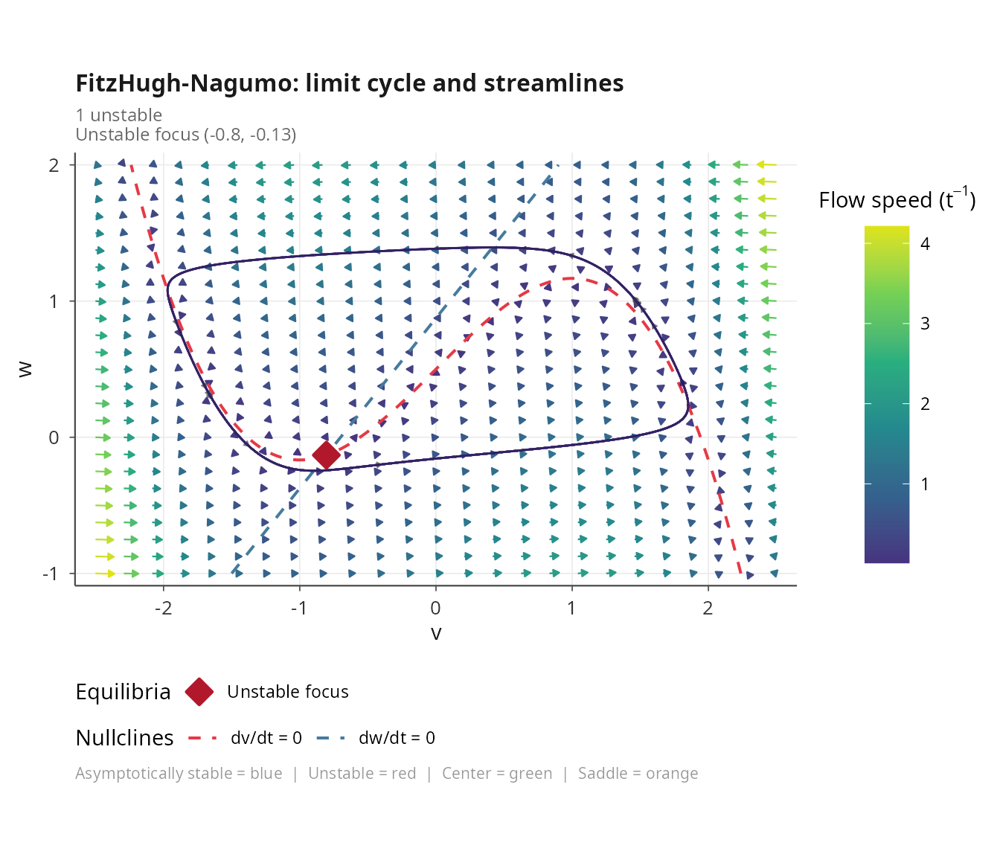

The streamlines alone, without the trajectory, give a clear picture of
the flow topology:

``` r

plot(pp2, type = "streamlines",
     title = "FitzHugh-Nagumo: flow streamlines")
```

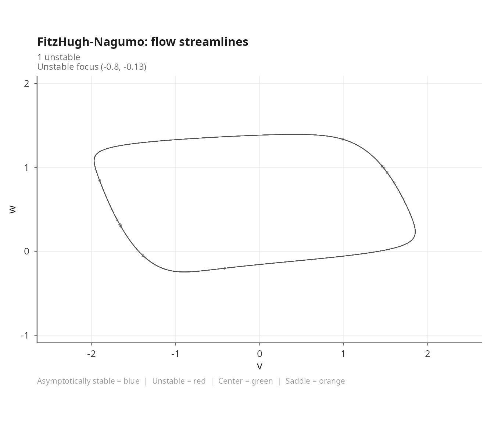

### Example 3: Brusselator (chemistry)

The Brusselator [\[1\]](#ref1) is a model of an autocatalytic chemical
reaction that exhibits limit cycle oscillations via a Hopf bifurcation:

\\\dot{X} = A - (B+1)X + X^2 Y, \quad \dot{Y} = BX - X^2 Y.\\

The unique equilibrium at \\(X^\*, Y^\*) = (A, B/A)\\ is stable when \\B
\< 1 + A^2\\ and loses stability through a supercritical Hopf
bifurcation at \\B = 1 + A^2\\. With \\A = 1\\ and \\B = 3\\, the
bifurcation threshold is \\B_c = 2\\, so the system is well into the
oscillatory regime. Multiple trajectories from different initial
conditions all converge to the same limit cycle, demonstrating its
global attractivity.

``` r

brusselator <- model_spec(
    rhs = list(
        X ~ A - (B + 1) * X + X^2 * Y,
        Y ~ B * X - X^2 * Y
    ),
    state_names = c("X", "Y"),
    parms = list(A = 1.0, B = 3.0),
    init  = c(X = 1.0, Y = 1.0)
)

pp3 <- phase_portrait(brusselator,
    xlim = c(0, 4), ylim = c(0, 5),
    trajectories = list(
        c(X = 0.5, Y = 0.5),
        c(X = 3.5, Y = 0.5),
        c(X = 1.0, Y = 4.5)
    ),
    traj_length = 150, discard_transient = 0.2,
    n_grid = 20)
#> ⚙ Computing trajectories...
#> ⚙ Searching for equilibria...
#> ✔ Found 1 equilibrium.
#> ⚙ Computing vector field...
#> ⚙ Computing nullclines...
#> ¡ No saddle equilibria found; skipping manifolds.
#> ✔ Phase portrait complete.

print(pp3)
#> 
#> Phase portrait
#> ──────────────────────────────────────── 
#> 
#> Dimension: 2 D
#> States: X, Y 
#> Domain: [0.00, 4.00] x [0.00, 5.00]
#> 
#> Components:
#>   Vector field:   400 points 
#>   Nullclines:     2 contour segments 
#>   Equilibria:     1 (1 unstable focus) 
#>   Streamlines:    not computed 
#>   Manifolds:      not computed 
#>   Trajectories:   3 curves
summary(pp3)
#> 
#> Phase portrait
#> ──────────────────────────────────────── 
#> 
#> Dimension: 2 D
#> States: X, Y 
#> Domain: [0.00, 4.00] x [0.00, 5.00]
#> 
#> Components:
#>   Vector field:   400 points 
#>   Nullclines:     2 contour segments 
#>   Equilibria:     1 (1 unstable focus) 
#>   Streamlines:    not computed 
#>   Manifolds:      not computed 
#>   Trajectories:   3 curves 
#> 
#> Equilibrium details:
#> ──────────────────────────────────────── 
#> 
#>   #1: unstable focus (unstable)
#>       (X, Y) = (1.000000, 3.000000)
#>       lambda_1 = 0.500000 + 0.866025i
#>       lambda_2 = 0.500000 - 0.866025i
plot(pp3, title = "Brusselator: limit cycle from three initial conditions")
```

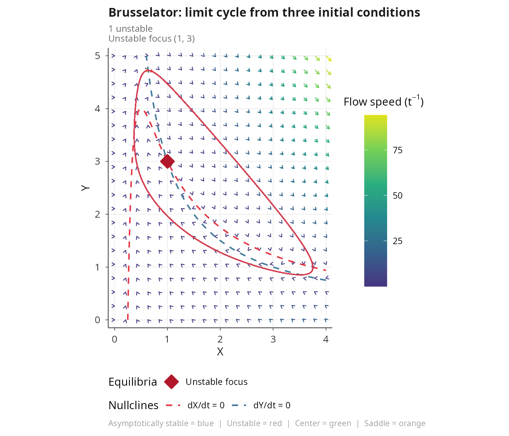

The [`summary()`](https://rdrr.io/r/base/summary.html) output confirms
that the equilibrium at \\(1, 3)\\ is an unstable focus (eigenvalues
with positive real part and nonzero imaginary part). All three
trajectories converge to the same periodic orbit regardless of starting
position, which is the defining property of a globally attracting limit
cycle.

### Example 4: Lorenz system in 3D (physics)

The Lorenz system [\[1\]](#ref1) is the prototypical example of
deterministic chaos:

\\\dot{x} = \sigma(y - x), \quad \dot{y} = x(\rho - z) - y, \quad
\dot{z} = xy - \beta z.\\

At the classical parameter values \\(\sigma, \rho, \beta) = (10, 28,
8/3)\\, the system has three equilibria: the origin (a saddle with one
positive real eigenvalue and a complex pair with negative real part) and
two symmetric fixed points \\C^{\pm} = (\pm\sqrt{\beta(\rho-1)},
\pm\sqrt{\beta(\rho-1)}, \rho-1) \approx (\pm 8.49, \pm 8.49, 27)\\,
both saddle-foci. The largest Lyapunov exponent is approximately
\\0.906\\, confirming chaotic dynamics.

``` r

lorenz <- model_spec(
    rhs = list(
        x ~ sigma * (y - x),
        y ~ x * (rho - z) - y,
        z ~ x * y - beta * z
    ),
    state_names = c("x", "y", "z"),
    parms = list(sigma = 10, rho = 28, beta = 8 / 3),
    init  = c(x = 0.1, y = 0, z = 0)
)

pp4 <- phase_portrait(lorenz,
    n_grid = 6,
    traj_length = 500,
    discard_transient = 0.1,
    manifolds = FALSE)
#> ¡ Nullclines are computed only for 2D phase portraits.
#> ⚙ Computing trajectories...
#> ⚙ Searching for equilibria...
#> ✔ Found 3 equilibria.
#> ⚙ Computing vector field...
#> ✔ Phase portrait complete.

print(pp4)
#> 
#> Phase portrait
#> ──────────────────────────────────────── 
#> 
#> Dimension: 3 D
#> States: x, y, z 
#> Domain: [-22.51, 22.56] x [-30.73, 30.84] x [-5.15, 50.54]
#> 
#> Components:
#>   Vector field:   216 points 
#>   Nullclines:     not computed 
#>   Equilibria:     3 (1 saddle, 2 saddle-focus) 
#>   Streamlines:    not computed 
#>   Manifolds:      not computed 
#>   Trajectories:   1 curves
summary(pp4)
#> 
#> Phase portrait
#> ──────────────────────────────────────── 
#> 
#> Dimension: 3 D
#> States: x, y, z 
#> Domain: [-22.51, 22.56] x [-30.73, 30.84] x [-5.15, 50.54]
#> 
#> Components:
#>   Vector field:   216 points 
#>   Nullclines:     not computed 
#>   Equilibria:     3 (1 saddle, 2 saddle-focus) 
#>   Streamlines:    not computed 
#>   Manifolds:      not computed 
#>   Trajectories:   1 curves 
#> 
#> Equilibrium details:
#> ──────────────────────────────────────── 
#> 
#>   #1: saddle-focus (unstable)
#>       (x, y, z) = (-8.485281, -8.485281, 27.000000)
#>       lambda_1 = -13.854578
#>       lambda_2 = 0.093956 + 10.194505i
#>       lambda_3 = 0.093956 - 10.194505i
#> 
#>   #2: saddle-focus (unstable)
#>       (x, y, z) = (8.485281, 8.485281, 27.000000)
#>       lambda_1 = -13.854578
#>       lambda_2 = 0.093956 + 10.194505i
#>       lambda_3 = 0.093956 - 10.194505i
#> 
#>   #3: saddle (unstable)
#>       (x, y, z) = (0.000000, 0.000000, -0.000000)
#>       lambda_1 = -22.827723
#>       lambda_2 = 11.827723
#>       lambda_3 = -2.666667
plot(pp4, title = "Lorenz attractor")
```

For 3D systems, [`plot()`](https://rdrr.io/r/graphics/plot.default.html)
returns an interactive plotly widget. The vector field is rendered as
cone glyphs, and the trajectory traces out the butterfly-shaped
attractor after transient removal. The `n_grid = 6` setting produces
\\6^3 = 216\\ cones, which is sufficient to visualise the global flow
without excessive rendering cost. Setting `manifolds = FALSE` is
advisable here because the 3D manifold computation is expensive and the
Lorenz attractor is better understood through its trajectory structure.

## Discrete map portraits

### Theory: fixed points, eigenvalue modulus, and cobweb construction

Discrete-time dynamical systems are defined by an iteration
\\\mathbf{x}\_{n+1} = \mathbf{F}(\mathbf{x}\_n)\\ where \\\mathbf{F}:
\mathbb{R}^n \to \mathbb{R}^n\\ is the update map. A fixed point
satisfies \\\mathbf{F}(\mathbf{x}^\*) = \mathbf{x}^\*\\, or equivalently
\\\mathbf{G}(\mathbf{x}^\*) = \mathbf{F}(\mathbf{x}^\*) - \mathbf{x}^\*
= \mathbf{0}\\. Stability is determined by the eigenvalues of the
Jacobian \\J_F = D\mathbf{F}(\mathbf{x}^\*)\\, but unlike the continuous
case, the criterion is based on eigenvalue modulus: a fixed point is
stable if all \\\|\lambda_i\| \< 1\\ and unstable if any \\\|\lambda_i\|
\> 1\\ [\[3\]](#ref3). The discrete-time Hartman-Grobman theorem applies
identically: near a hyperbolic fixed point (no \\\|\lambda_i\| = 1\\)
the nonlinear map is locally conjugate to its linearisation. A
period-doubling bifurcation occurs when an eigenvalue crosses the unit
circle at \\\lambda = -1\\, which has no continuous-time analogue.

For one-dimensional maps \\x\_{n+1} = F(x_n)\\, the cobweb (or Lamerey)
diagram is the standard visualisation. The graph \\y = F(x)\\ is drawn
alongside the diagonal \\y = x\\, and the iteration is traced as a
staircase: \\(x_n, x_n) \to (x_n, F(x_n)) \to (F(x_n), F(x_n)) \to
\cdots\\. Fixed points appear as intersections of the curve with the
diagonal; the staircase spirals inward when \\\|F'(x^\*)\| \< 1\\
(stable) and outward when \\\|F'(x^\*)\| \> 1\\ (unstable). For
two-dimensional maps, janos draws the *displacement field*
\\\mathbf{F}(\mathbf{x}) - \mathbf{x}\\, which shows the “kick”
delivered by each iteration, and the *isoclines* \\F_i(x,y) = x_i\\,
whose intersections locate fixed points.

The
[`map_portrait()`](https://robustecologies.github.io/janos/reference/map_portrait.md)
function automatically detects 1D maps and switches to cobweb mode,
disabling displacement fields, isoclines, and manifolds (which require
2D). For 2D maps, the stable manifold of saddle fixed points is computed
via backward Newton preimage iteration, and the unstable manifold by
forward iteration. The `orbit_scatter = TRUE` option generates a scatter
cloud from a long orbit, revealing the attractor structure directly.

### Example 5: logistic map (ecology/mathematics)

The logistic map \\x\_{n+1} = rx_n(1 - x_n)\\ is one of the most studied
discrete dynamical systems, originating in ecology as a model of
non-overlapping generations [\[1\]](#ref1). The single nontrivial fixed
point at \\x^\* = 1 - 1/r\\ undergoes a cascade of period-doubling
bifurcations as \\r\\ increases, with the onset of chaos at the
Feigenbaum accumulation point \\r\_\infty \approx 3.5699\\. At \\r =
3.7\\ the map is in the chaotic regime, and the cobweb diagram shows the
irregular staircase characteristic of sensitive dependence on initial
conditions.

``` r

logistic_map <- model_spec(
    map = list(x ~ r * x * (1 - x)),
    state_names = "x",
    parms = list(r = 3.7),
    init  = c(x = 0.2)
)

mp5 <- map_portrait(logistic_map, xlim = c(0, 1),
                    n_iter = 200)
#> ⚙ Computing orbits...
#> ⚙ Searching for fixed points...
#> ✔ Found 2 fixed points.
#> ⚙ Computing cobweb diagram...
#> ✔ Map portrait complete.

print(mp5)
#> 
#> Map portrait
#> ──────────────────────────────────────── 
#> 
#> Dimension: 1 D (cobweb) 
#> States: x 
#> Domain: [0, 1] 
#> 
#> Components:
#>   Fixed points:        2 (2 unstable node) 
#>   Orbits:              201 iterations 
#>   Cobweb:              computed
summary(mp5)
#> 
#> Map portrait
#> ──────────────────────────────────────── 
#> 
#> Dimension: 1 D (cobweb) 
#> States: x 
#> Domain: [0, 1] 
#> 
#> Components:
#>   Fixed points:        2 (2 unstable node) 
#>   Orbits:              201 iterations 
#>   Cobweb:              computed 
#> 
#> Fixed point details:
#> ──────────────────────────────────────── 
#> 
#>   #1: unstable node (unstable)
#>       x = -0.000000
#>       lambda_1 = 3.700000  (|lambda| = 3.700000)
#> 
#>   #2: unstable node (unstable)
#>       x = 0.729730
#>       lambda_1 = -1.700000  (|lambda| = 1.700000)
plot(mp5, title = "Logistic map cobweb (r = 3.7)",
     feasible = list(x = c(0, 1)))
```

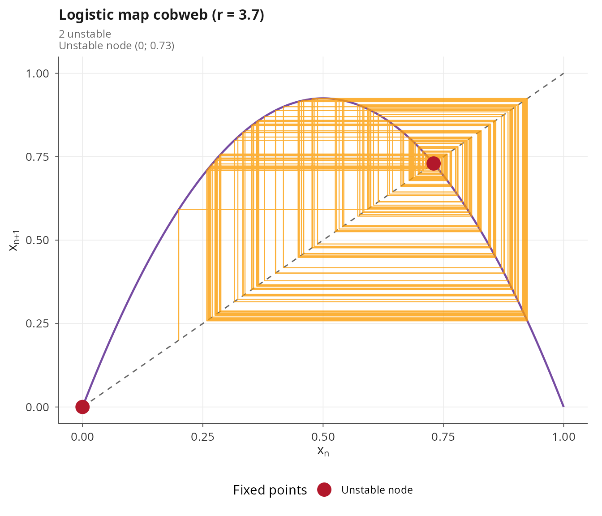

The [`summary()`](https://rdrr.io/r/base/summary.html) output reports
two fixed points: \\x^\* = 0\\ (unstable, since \\\|F'(0)\| = r = 3.7 \>
1\\) and \\x^\* = 1 - 1/r \approx 0.73\\ (also unstable in the chaotic
regime, since \\\|F'(x^\*)\| = \|2 - r\| = 1.7 \> 1\\). The cobweb
staircase wanders through the interval \\\[0, 1\]\\ without settling,
reflecting the ergodic nature of the chaotic dynamics. The `feasible`
argument shades the region outside \\\[0, 1\]\\ to emphasise the
biologically meaningful domain.

### Example 6: Ricker map with Allee effect (ecology)

The Ricker map \\N\_{n+1} = N_n \exp(r(1 - N_n/K))\\ is a classic
discrete-time population model. Incorporating a component Allee effect,
where per-capita growth vanishes at low densities, modifies the map to

\\N\_{n+1} = N_n \exp\\\left(r\left(1 -
\frac{N_n}{K}\right)\frac{N_n}{A + N_n}\right),\\

where \\A\\ is the Allee threshold. This produces three fixed points:
extinction (\\N^\* = 0\\, stable), a breakpoint near \\A\\ (unstable),
and the carrying capacity (\\N^\* = K\\, stable for moderate \\r\\). The
presence of the unstable fixed point creates bistability: populations
starting above the threshold converge to \\K\\, while those below
collapse to extinction.

``` r

ricker_allee <- model_spec(
    map = list(
        N ~ N * exp(r * (1 - N / K) * (N / (A + N)))
    ),
    state_names = "N",
    parms = list(r = 2.5, K = 100, A = 15),
    init  = c(N = 80)
)

mp6 <- map_portrait(ricker_allee, xlim = c(0, 130),
                    n_iter = 80, n_fp_grid = 15)
#> ⚙ Computing orbits...
#> ⚙ Searching for fixed points...
#> ✔ Found 5 fixed points.
#> ⚙ Computing cobweb diagram...
#> ✔ Map portrait complete.

print(mp6)
#> 
#> Map portrait
#> ──────────────────────────────────────── 
#> 
#> Dimension: 1 D (cobweb) 
#> States: N 
#> Domain: [0, 130] 
#> 
#> Components:
#>   Fixed points:        5 (1 stable node, 4 unstable node) 
#>   Orbits:              81 iterations 
#>   Cobweb:              computed
summary(mp6)
#> 
#> Map portrait
#> ──────────────────────────────────────── 
#> 
#> Dimension: 1 D (cobweb) 
#> States: N 
#> Domain: [0, 130] 
#> 
#> Components:
#>   Fixed points:        5 (1 stable node, 4 unstable node) 
#>   Orbits:              81 iterations 
#>   Cobweb:              computed 
#> 
#> Fixed point details:
#> ──────────────────────────────────────── 
#> 
#>   #1: unstable node (unstable)
#>       N = 0.000013
#>       lambda_1 = 1.000004  (|lambda| = 1.000004)
#> 
#>   #2: stable node (stable)
#>       N = -0.000020
#>       lambda_1 = 0.999993  (|lambda| = 0.999993)
#> 
#>   #3: unstable node (unstable)
#>       N = 100.000000
#>       lambda_1 = -1.173913  (|lambda| = 1.173913)
#> 
#>   #4: unstable node (unstable)
#>       N = 0.000022
#>       lambda_1 = 1.000007  (|lambda| = 1.000007)
#> 
#>   #5: unstable node (unstable)
#>       N = 0.000015
#>       lambda_1 = 1.000005  (|lambda| = 1.000005)
plot(mp6, title = "Ricker map with Allee effect",
     feasible = list(N = c(0, 130)))
```

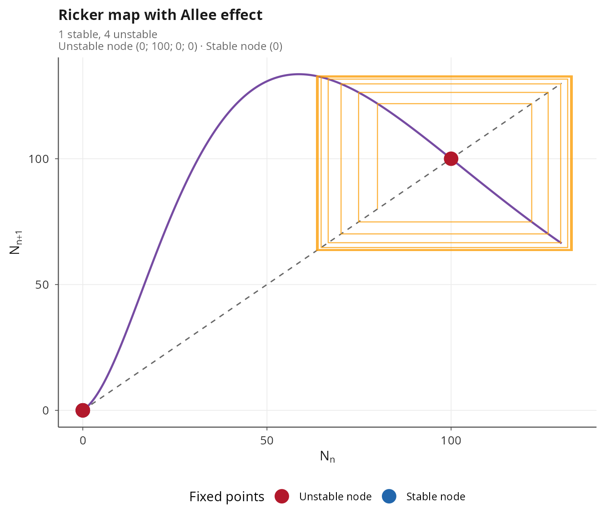

The cobweb from \\N_0 = 80\\ converges to the carrying capacity \\K =
100\\. The `n_fp_grid = 15` increases the density of Newton search
initial guesses, improving the likelihood of finding all three fixed
points. Starting from \\N_0 \< A\\ would instead produce a staircase
descending to zero, illustrating the critical population threshold below
which the Allee effect drives extinction.

### Example 7: Henon map (physics/mathematics)

The Hénon map [\[4\]](#ref4) is the canonical example of a
two-dimensional invertible map with a strange attractor:

\\x\_{n+1} = 1 - ax_n^2 + y_n, \quad y\_{n+1} = bx_n.\\

At the classical parameters \\(a, b) = (1.4, 0.3)\\ the map has a
chaotic attractor with Hausdorff dimension approximately \\1.26\\ and
largest Lyapunov exponent approximately \\0.42\\. The
`orbit_scatter = TRUE` option generates a long forward orbit and plots
the resulting point cloud, revealing the fractal structure of the
attractor. The stable and unstable manifolds of the saddle fixed point
provide additional geometric insight: the unstable manifold traces out
the attractor itself, while the stable manifold delineates the boundary
of the basin of attraction.

``` r

henon <- model_spec(
    map = list(
        x ~ 1 - a * x^2 + y,
        y ~ b * x
    ),
    state_names = c("x", "y"),
    parms = list(a = 1.4, b = 0.3),
    init  = c(x = 0.1, y = 0.1)
)

mp7 <- map_portrait(henon,
    n_iter = 15000,
    discard_transient = 0.05,
    orbit_scatter = TRUE,
    manifolds = TRUE,
    manifold_n_iter = 2000)
#> ⚙ Computing orbits...
#> ⚙ Searching for fixed points...
#> ✔ Found 2 fixed points.
#> ⚙ Computing displacement field...
#> ⚙ Computing isoclines...
#> ⚙ Computing manifolds for 2 saddle fixed points...
#> ✔ Map portrait complete.

print(mp7)
#> 
#> Map portrait
#> ──────────────────────────────────────── 
#> 
#> Dimension: 2 D  
#> States: x, y 
#> Domain: [-1.847, 1.836] x [-0.5854, 0.5819] 
#> 
#> Components:
#>   Displacement field:  625 points 
#>   Isoclines:           3 contour segments 
#>   Fixed points:        2 (2 saddle) 
#>   Manifolds:           8 branches 
#>   Orbits:              14251 iterations 
#>   Orbit scatter:       14251 points
summary(mp7)
#> 
#> Map portrait
#> ──────────────────────────────────────── 
#> 
#> Dimension: 2 D  
#> States: x, y 
#> Domain: [-1.847, 1.836] x [-0.5854, 0.5819] 
#> 
#> Components:
#>   Displacement field:  625 points 
#>   Isoclines:           3 contour segments 
#>   Fixed points:        2 (2 saddle) 
#>   Manifolds:           8 branches 
#>   Orbits:              14251 iterations 
#>   Orbit scatter:       14251 points 
#> 
#> Fixed point details:
#> ──────────────────────────────────────── 
#> 
#>   #1: saddle (unstable)
#>       (x, y) = (-1.131354, -0.339406)
#>       lambda_1 = 3.259822  (|lambda| = 3.259822)
#>       lambda_2 = -0.092030  (|lambda| = 0.092030)
#> 
#>   #2: saddle (unstable)
#>       (x, y) = (0.631354, 0.189406)
#>       lambda_1 = -1.923739  (|lambda| = 1.923739)
#>       lambda_2 = 0.155946  (|lambda| = 0.155946)
#> 
#> Manifold branches:
#>   4 stable, 4 unstable
plot(mp7, title = "Henon attractor with manifolds")
```

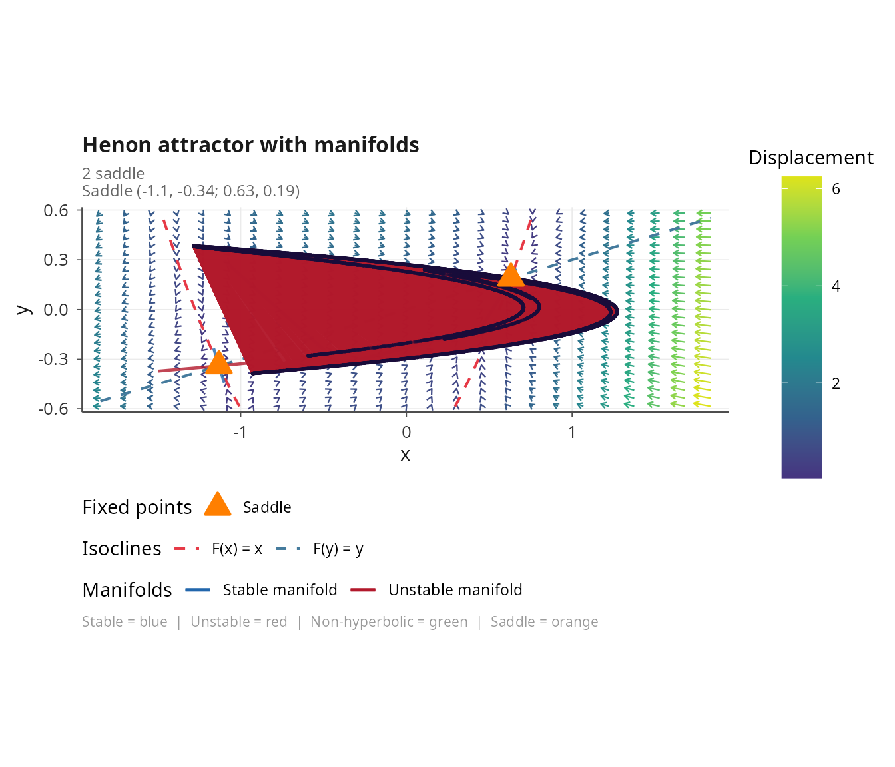

The `type = "scatter"` view strips away the connecting orbit paths,
showing only the scattered points and revealing the layered Cantor-set
structure characteristic of the Hénon attractor:

``` r

plot(mp7, type = "scatter",
     title = "Henon attractor: orbit scatter cloud")
```

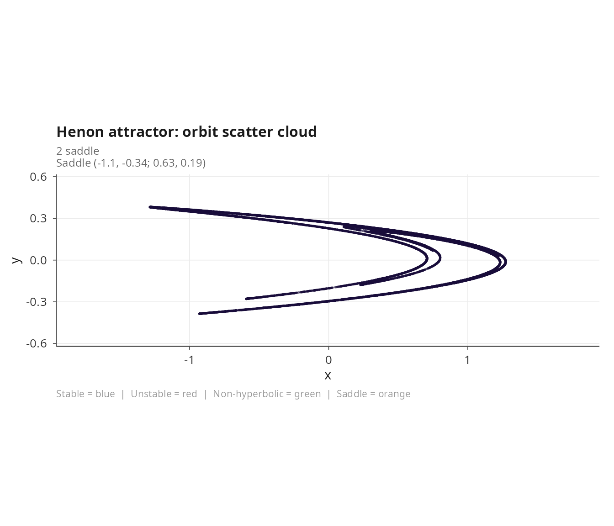

The manifold structure can be examined in isolation:

``` r

plot(mp7, type = "manifolds",
     title = "Henon map: stable and unstable manifolds")
```

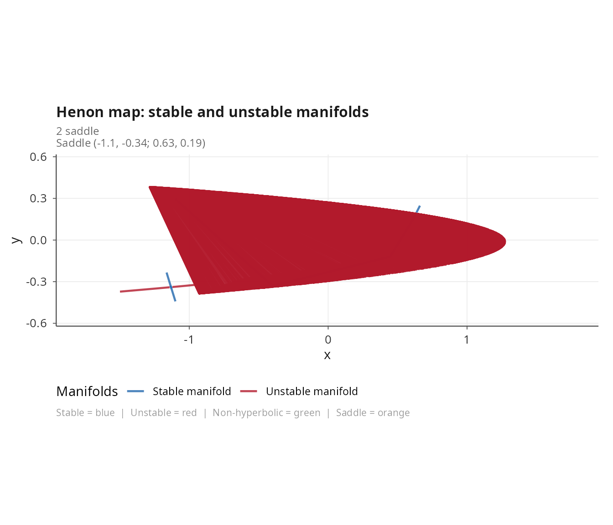

### Example 8: Nicholson-Bailey host-parasitoid (ecology)

The Nicholson-Bailey model [\[5\]](#ref5) describes the interaction
between a host population \\H\\ and a specialist parasitoid \\P\\:

\\H\_{n+1} = \lambda H_n \exp(-a P_n), \quad P\_{n+1} = H_n(1 - \exp(-a
P_n)).\\

This model has a nontrivial fixed point at \\H^\* = \lambda \ln\lambda /
(a(\lambda-1))\\ and \\P^\* = \ln\lambda / a\\, but it is always an
unstable focus (spiral source) for \\\lambda \> 1\\. The orbits spiral
outward with increasing amplitude until one or both populations reach
zero. This intrinsic instability is a fundamental result in theoretical
ecology: the Nicholson-Bailey model requires spatial structure,
density-dependent parasitism, or other stabilising mechanisms for
persistence.

``` r

nb <- model_spec(
    map = list(
        H ~ lambda * H * exp(-a * P),
        P ~ H * (1 - exp(-a * P))
    ),
    state_names = c("H", "P"),
    parms = list(lambda = 2.0, a = 0.068),
    init  = c(H = 60, P = 12)
)

mp8 <- map_portrait(nb,
    xlim = c(0, 200), ylim = c(0, 40),
    n_iter = 50,
    n_fp_grid = 12)
#> ⚙ Computing orbits...
#> ⚙ Searching for fixed points...
#> ✔ Found 2 fixed points.
#> ⚙ Computing displacement field...
#> ⚙ Computing isoclines...
#> ⚙ Computing manifolds for 1 saddle fixed point...
#> ✔ Map portrait complete.

print(mp8)
#> 
#> Map portrait
#> ──────────────────────────────────────── 
#> 
#> Dimension: 2 D  
#> States: H, P 
#> Domain: [0, 200] x [0, 40] 
#> 
#> Components:
#>   Displacement field:  625 points 
#>   Isoclines:           2 contour segments 
#>   Fixed points:        2 (1 saddle, 1 unstable focus) 
#>   Manifolds:           1 branches 
#>   Orbits:              51 iterations
summary(mp8)
#> 
#> Map portrait
#> ──────────────────────────────────────── 
#> 
#> Dimension: 2 D  
#> States: H, P 
#> Domain: [0, 200] x [0, 40] 
#> 
#> Components:
#>   Displacement field:  625 points 
#>   Isoclines:           2 contour segments 
#>   Fixed points:        2 (1 saddle, 1 unstable focus) 
#>   Manifolds:           1 branches 
#>   Orbits:              51 iterations 
#> 
#> Fixed point details:
#> ──────────────────────────────────────── 
#> 
#>   #1: saddle (unstable)
#>       (H, P) = (-0.000000, -0.000000)
#>       lambda_1 = 2.000000  (|lambda| = 2.000000)
#>       lambda_2 = -0.000000  (|lambda| = 0.000000)
#> 
#>   #2: unstable focus (unstable)
#>       (H, P) = (20.386682, 10.193341)
#>       lambda_1 = 0.846574 + 0.818295i  (|lambda| = 1.177410)
#>       lambda_2 = 0.846574 - 0.818295i  (|lambda| = 1.177410)
#> 
#> Manifold branches:
#>   0 stable, 1 unstable
plot(mp8, feasible = TRUE,
     title = "Nicholson-Bailey host-parasitoid")
```

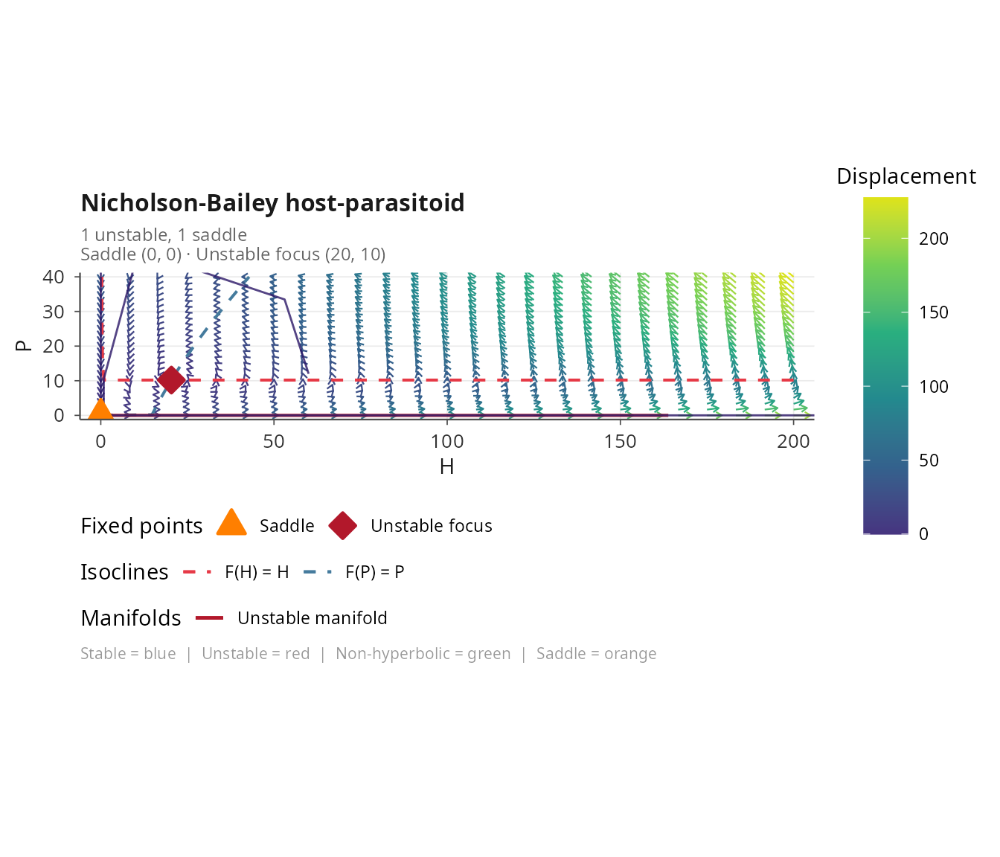

The isoclines can be examined separately to understand the fixed-point
geometry:

``` r

plot(mp8, type = "isoclines",
     title = "Nicholson-Bailey: isoclines")
```

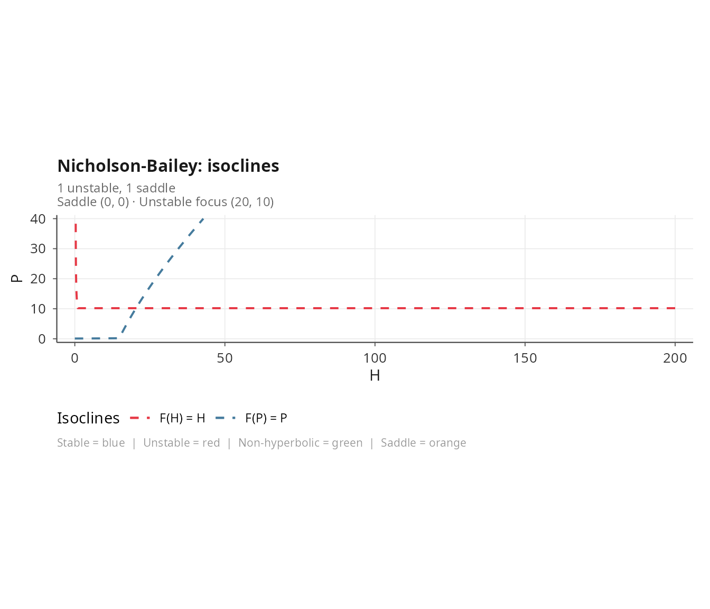

The isoclines (curves where \\F_H = H\\ and \\F_P = P\\) intersect at
the nontrivial fixed point. The
[`summary()`](https://rdrr.io/r/base/summary.html) output reports
eigenvalues with \\\|\lambda\| \> 1\\ for both roots, confirming the
universal instability of this model.

## SDE portraits

### Theory: Fokker-Planck equation, stationary covariance, and the Lyapunov equation

When a deterministic system is perturbed by noise, the phase portrait
must be reinterpreted in probabilistic terms. An Itô stochastic
differential equation

\\d\mathbf{X} = \mathbf{f}(\mathbf{X})\\dt +
G(\mathbf{X})\\d\mathbf{W}\\

defines a diffusion process whose probability density \\\rho(\mathbf{x},
t)\\ evolves according to the Fokker-Planck equation [\[6\]](#ref6):

\\\frac{\partial \rho}{\partial t} = -\sum_i \frac{\partial}{\partial
x_i}\bigl\[f_i(\mathbf{x})\\\rho\bigr\] + \frac{1}{2}\sum\_{i,j}
\frac{\partial^2}{\partial x_i\\\partial
x_j}\bigl\[(GG^\top)\_{ij}\\\rho\bigr\].\\

The *deterministic skeleton* of the SDE is the ODE \\\dot{\mathbf{x}} =
\mathbf{f}(\mathbf{x})\\ obtained by setting \\G = 0\\. Its equilibria,
nullclines, and manifolds provide the geometric scaffold on which noise
acts. The
[`sde_portrait()`](https://robustecologies.github.io/janos/reference/sde_portrait.md)
function analyses both the deterministic skeleton and the stochastic
perturbation in a unified portrait.

Near a stable equilibrium \\\mathbf{x}^\*\\ with Jacobian \\A =
J(\mathbf{x}^\*)\\ and local noise matrix \\B = G(\mathbf{x}^\*)\\, the
linearised SDE \\d\mathbf{\xi} = A\mathbf{\xi}\\dt + B\\d\mathbf{W}\\
has a stationary Gaussian distribution with zero mean and covariance
\\\Sigma\\ satisfying the continuous Lyapunov equation:

\\A\Sigma + \Sigma A^\top + Q = 0, \quad Q = BB^\top.\\

This matrix equation is solved by Kronecker vectorisation:
\\\text{vec}(\Sigma) = -(A \otimes I + I \otimes
A)^{-1}\\\text{vec}(Q)\\, which reduces to a \\4 \times 4\\ linear
system in 2D. The confidence ellipse at level \\\alpha\\ is then the set

\\\bigl\\\mathbf{x} : (\mathbf{x} - \mathbf{x}^\*)^\top \Sigma^{-1}
(\mathbf{x} - \mathbf{x}^\*) = \chi^2_2(\alpha)\bigr\\,\\

where \\\chi^2_2(\alpha)\\ is the \\\alpha\\-quantile of the chi-squared
distribution with 2 degrees of freedom. janos draws both the 68% and 95%
confidence ellipses at each stable equilibrium.

The *diffusion intensity field* \\\\G(\mathbf{x})\\\\ reveals where
noise is amplified or quenched by state-dependent diffusion
coefficients. For multiplicative noise systems, this field is
inhomogeneous and provides crucial information about which regions of
state space experience the strongest stochastic perturbations. The
portrait also includes Euler-Maruyama sample paths

\\\mathbf{X}\_{n+1} = \mathbf{X}\_n + \mathbf{f}(\mathbf{X}\_n)\\\Delta
t + G(\mathbf{X}\_n)\\\sqrt{\Delta t}\\\mathbf{Z}\_n, \quad
\mathbf{Z}\_n \sim \mathcal{N}(0, I),\\

which show individual realisations of the stochastic dynamics.

### Example 9: Ornstein-Uhlenbeck with multiplicative noise (physics)

A two-dimensional linearly mean-reverting system with state-dependent
noise intensity:

\\dX = (-\theta_x X + \kappa Y)\\dt + \sigma\sqrt{1 + X^2}\\dW_1, \quad
dY = (\kappa X - \theta_y Y)\\dt + \sigma\sqrt{1 + Y^2}\\dW_2.\\

The deterministic skeleton has a stable node at the origin (both
eigenvalues real and negative). The multiplicative noise
\\\sigma\sqrt{1 + X^2}\\ means that fluctuations grow with distance from
the origin, producing a diffusion intensity field that increases
radially. The Lyapunov equation yields asymmetric confidence ellipses
because \\\theta_x \neq \theta_y\\: the direction with faster mean
reversion has a more confined ellipse axis.

``` r

ou2d <- model_spec(
    rhs = list(
        x ~ -theta_x * x + kappa * y,
        y ~ kappa * x - theta_y * y
    ),
    diffusion = list(
        x ~ sigma * sqrt(1 + x^2),
        y ~ sigma * sqrt(1 + y^2)
    ),
    state_names = c("x", "y"),
    parms = list(theta_x = 1.5, theta_y = 1.0,
                 kappa = 0.3, sigma = 0.4),
    init  = c(x = 0.5, y = 0.5)
)

set.seed(42)
sp9 <- sde_portrait(ou2d,
    xlim = c(-4, 4), ylim = c(-4, 4),
    n_paths = 8, path_length = 60,
    discard_transient = 0.1)
#> ⚙ Searching for equilibria of the deterministic skeleton...
#> ✔ Found 1 equilibrium.
#> ⚙ Computing drift field...
#> ⚙ Computing diffusion intensity field...
#> ⚙ Computing nullclines...
#> ¡ No saddle equilibria found; skipping manifolds.
#> ⚙ Computing confidence ellipses for 1 stable equilibrium...
#> ✔ Computed 1 ellipse set.
#> ⚙ Simulating 8 Euler-Maruyama sample paths...
#> ✔ Completed 8 sample paths.
#> ✔ SDE portrait complete.

print(sp9)
#> 
#> SDE phase portrait
#> ──────────────────────────────────────── 
#> 
#> Dimension: 2 D
#> States: x, y 
#> Noise type: gaussian 
#> Domain: [-4.00, 4.00] x [-4.00, 4.00]
#> 
#> Components:
#>   Drift field:            625 points 
#>   Diffusion field:        625 points, intensity [0.566, 2.33] 
#>   Nullclines:             2 contour segments 
#>   Equilibria:             1 (1 stable node) 
#>   Confidence ellipses:    1 set 
#>   Manifolds:              not computed 
#>   Streamlines:            not computed 
#>   Sample paths:           8 paths
summary(sp9)
#> 
#> SDE phase portrait
#> ──────────────────────────────────────── 
#> 
#> Dimension: 2 D
#> States: x, y 
#> Noise type: gaussian 
#> Domain: [-4.00, 4.00] x [-4.00, 4.00]
#> 
#> Components:
#>   Drift field:            625 points 
#>   Diffusion field:        625 points, intensity [0.566, 2.33] 
#>   Nullclines:             2 contour segments 
#>   Equilibria:             1 (1 stable node) 
#>   Confidence ellipses:    1 set 
#>   Manifolds:              not computed 
#>   Streamlines:            not computed 
#>   Sample paths:           8 paths 
#> 
#> Equilibrium details (deterministic skeleton):
#> ──────────────────────────────────────── 
#> 
#>   #1: stable node (stable)
#>       (x, y) = (0.000000, -0.000000)
#>       lambda_1 = -0.859488
#>       lambda_2 = -1.640512
#> 
#> Confidence ellipses:
#> ──────────────────────────────────────── 
#> 
#>   Equilibrium #1 at (0.0000, -0.0000)
#>       Sigma eigenvalues: 0.09308, 0.04877
#>       Semi-axis ratio: 1.382
#> 
#> Sample paths:
#> ──────────────────────────────────────── 
#>   8 paths, dt = 0.01, max time = 60
#>   Path 1: 5401 steps, x in [-0.953, 0.497], y in [-1.26, 0.747]
#>   Path 2: 5401 steps, x in [-0.82, 1.08], y in [-0.915, 0.95]
#>   Path 3: 5401 steps, x in [-0.592, 0.645], y in [-0.915, 1.05]
#>   Path 4: 5401 steps, x in [-0.775, 0.699], y in [-0.744, 1.03]
#>   Path 5: 5401 steps, x in [-0.89, 0.643], y in [-0.835, 0.932]
#>   Path 6: 5401 steps, x in [-1.1, 0.793], y in [-1.29, 0.735]
#>   Path 7: 5401 steps, x in [-0.911, 0.85], y in [-0.677, 0.914]
#>   Path 8: 5401 steps, x in [-0.748, 0.809], y in [-0.947, 0.577]
```

The default plot overlays all components: drift arrows, diffusion
heatmap, nullclines, equilibria, confidence ellipses, and sample paths:

``` r

plot(sp9, title = "Ornstein-Uhlenbeck with multiplicative noise")
```

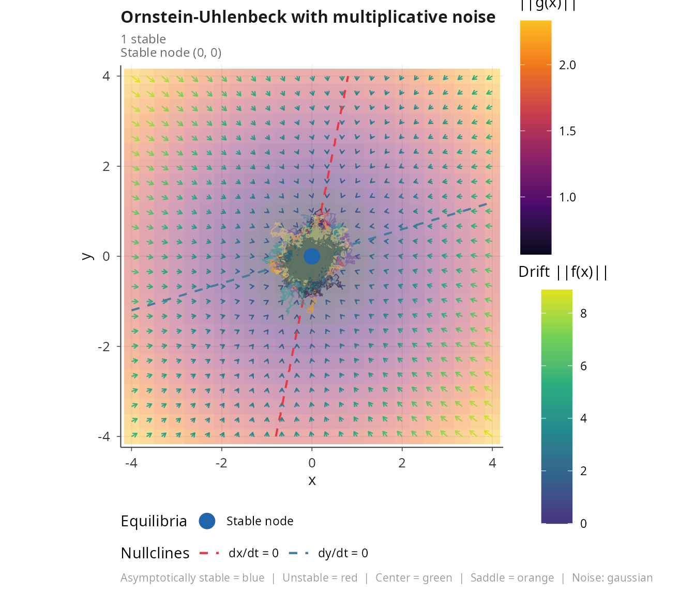

Individual components can be examined through the `type` argument. The
drift field shows the deterministic convergence:

``` r

plot(sp9, type = "drift",
     title = "Drift field: OU process")
```

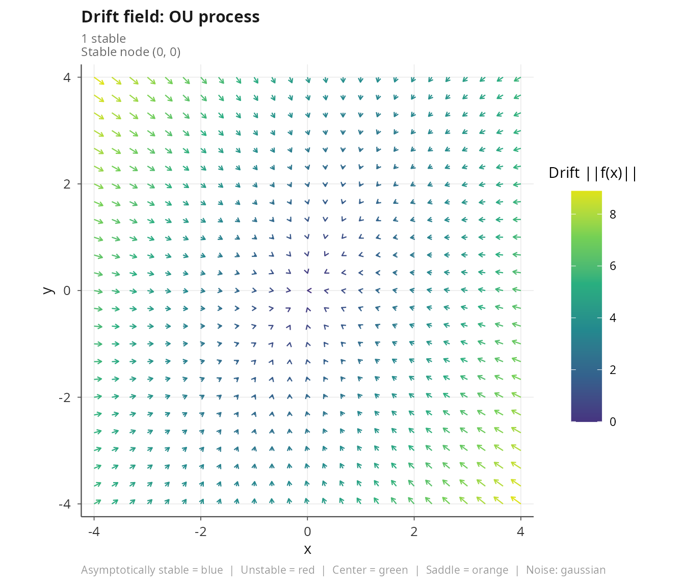

The diffusion intensity heatmap reveals the state-dependent noise
amplification:

``` r

plot(sp9, type = "diffusion",
     title = "Diffusion intensity: multiplicative noise")
```

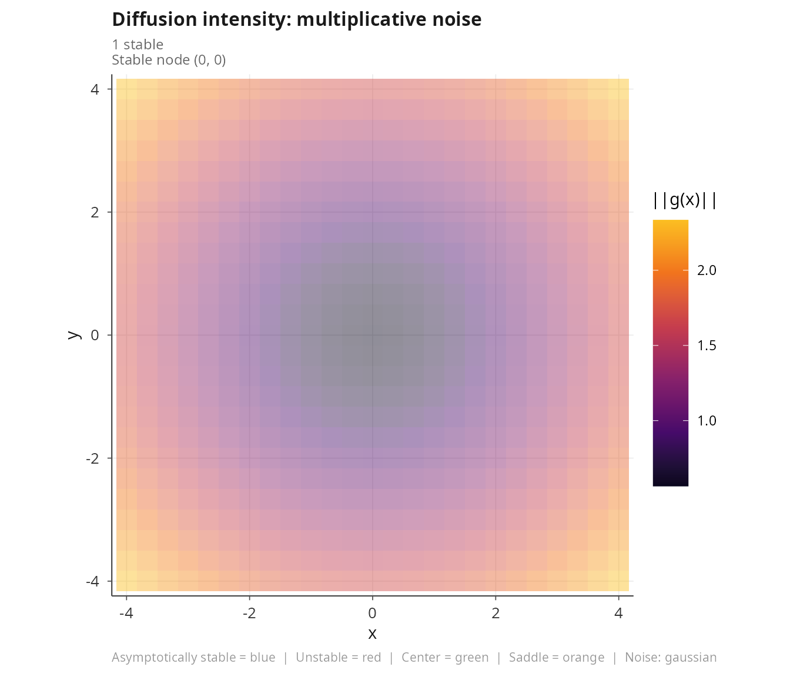

The stochastic portrait combines only the noise-related layers (sample
paths, confidence ellipses, diffusion heatmap) without the drift arrows:

``` r

plot(sp9, type = "stochastic",
     title = "Stochastic portrait: sample paths and ellipses")
```

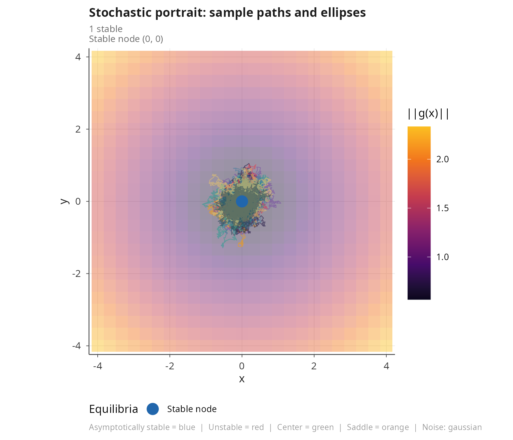

### Example 10: stochastic Lotka-Volterra (ecology)

Adding demographic stochasticity to the Lotka-Volterra predator-prey
model transforms the conservative center into a diffusive process. The
noise terms \\\sigma_N N\\ and \\\sigma_P P\\ use geometric
(multiplicative) noise to preserve the positivity of population
densities:

\\dN = (\alpha N - \beta NP)\\dt + \sigma_N N\\dW_1, \quad dP = (\delta
NP - \gamma P)\\dt + \sigma_P P\\dW_2.\\

The deterministic skeleton retains the center equilibrium, but noise
converts the closed orbits into a random walk that drifts stochastically
across the level sets of the Hamiltonian. Over long times, the
populations will eventually reach the absorbing boundary at \\N = 0\\ or
\\P = 0\\, representing stochastic extinction.

``` r

lv_sde <- model_spec(
    rhs = list(
        N ~ alpha * N - beta * N * P,
        P ~ delta * N * P - gamma * P
    ),
    diffusion = list(
        N ~ sigma_N * N,
        P ~ sigma_P * P
    ),
    state_names = c("N", "P"),
    parms = list(alpha = 1.0, beta = 0.1, delta = 0.075,
                 gamma = 1.5, sigma_N = 0.2, sigma_P = 0.15),
    init  = c(N = 20, P = 10)
)

set.seed(7)
sp10 <- sde_portrait(lv_sde,
    xlim = c(0, 60), ylim = c(0, 30),
    n_paths = 6, path_length = 100,
    discard_transient = 0.1)
#> ⚙ Searching for equilibria of the deterministic skeleton...
#> ✔ Found 2 equilibria.
#> ⚙ Computing drift field...
#> ⚙ Computing diffusion intensity field...
#> ⚙ Computing nullclines...
#> ⚙ Computing manifolds for 1 saddle equilibrium...
#> ¡ No stable equilibria; skipping confidence ellipses.
#> ⚙ Simulating 6 Euler-Maruyama sample paths...
#> ✔ Completed 6 sample paths.
#> ✔ SDE portrait complete.

print(sp10)
#> 
#> SDE phase portrait
#> ──────────────────────────────────────── 
#> 
#> Dimension: 2 D
#> States: N, P 
#> Noise type: gaussian 
#> Domain: [0.00, 60.00] x [0.00, 30.00]
#> 
#> Components:
#>   Drift field:            625 points 
#>   Diffusion field:        625 points, intensity [0, 12.8] 
#>   Nullclines:             2 contour segments 
#>   Equilibria:             2 (1 center, 1 saddle) 
#>   Confidence ellipses:    not computed 
#>   Manifolds:              not computed 
#>   Streamlines:            not computed 
#>   Sample paths:           6 paths
summary(sp10)
#> 
#> SDE phase portrait
#> ──────────────────────────────────────── 
#> 
#> Dimension: 2 D
#> States: N, P 
#> Noise type: gaussian 
#> Domain: [0.00, 60.00] x [0.00, 30.00]
#> 
#> Components:
#>   Drift field:            625 points 
#>   Diffusion field:        625 points, intensity [0, 12.8] 
#>   Nullclines:             2 contour segments 
#>   Equilibria:             2 (1 center, 1 saddle) 
#>   Confidence ellipses:    not computed 
#>   Manifolds:              not computed 
#>   Streamlines:            not computed 
#>   Sample paths:           6 paths 
#> 
#> Equilibrium details (deterministic skeleton):
#> ──────────────────────────────────────── 
#> 
#>   #1: saddle (unstable)
#>       (N, P) = (-0.000000, -0.000000)
#>       lambda_1 = 1.000000
#>       lambda_2 = -1.500000
#> 
#>   #2: center (unstable)
#>       (N, P) = (20.000000, 10.000000)
#>       lambda_1 = 0.000000 + 1.224745i
#>       lambda_2 = 0.000000 - 1.224745i
#> 
#> Sample paths:
#> ──────────────────────────────────────── 
#>   6 paths, dt = 0.01, max time = 100
#>   Path 1: 5648 steps, x in [0.29, 147], y in [0.0184, 88.2]
#>   Path 2: 8949 steps, x in [0.0772, 157], y in [0.00878, 88.9]
#>   Path 3: 9001 steps, x in [0.206, 127], y in [0.00865, 86.8]
#>   Path 4: 9001 steps, x in [4.31, 58.4], y in [1.44, 34]
#>   Path 5: 6039 steps, x in [0.405, 126], y in [0.0202, 89.9]
#>   Path 6: 5307 steps, x in [0.357, 130], y in [0.0169, 89]
```

The `"skeleton"` plot type shows the deterministic structure without any
stochastic elements, useful for comparison:

``` r

plot(sp10, type = "skeleton",
     title = "Deterministic skeleton: stochastic Lotka-Volterra")
```

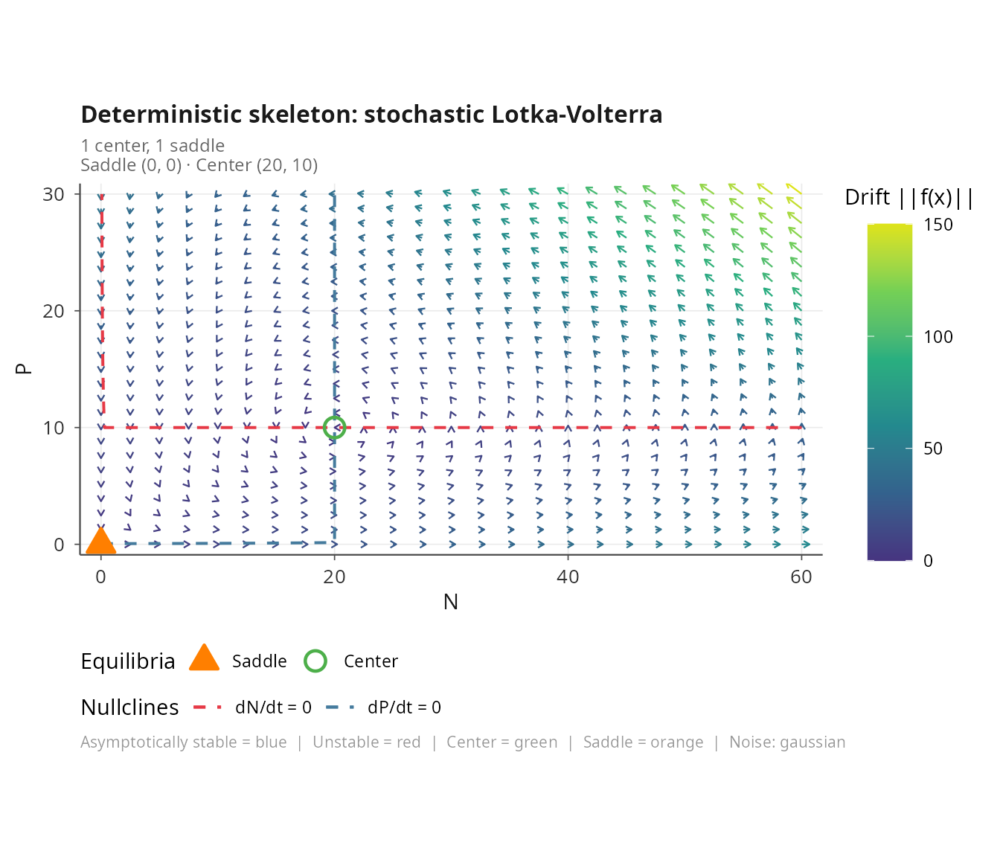

The full portrait with `feasible = TRUE` overlays sample paths that
spiral erratically rather than following closed orbits:

``` r

plot(sp10, feasible = TRUE,
     title = "Stochastic Lotka-Volterra: noise-perturbed orbits")
```

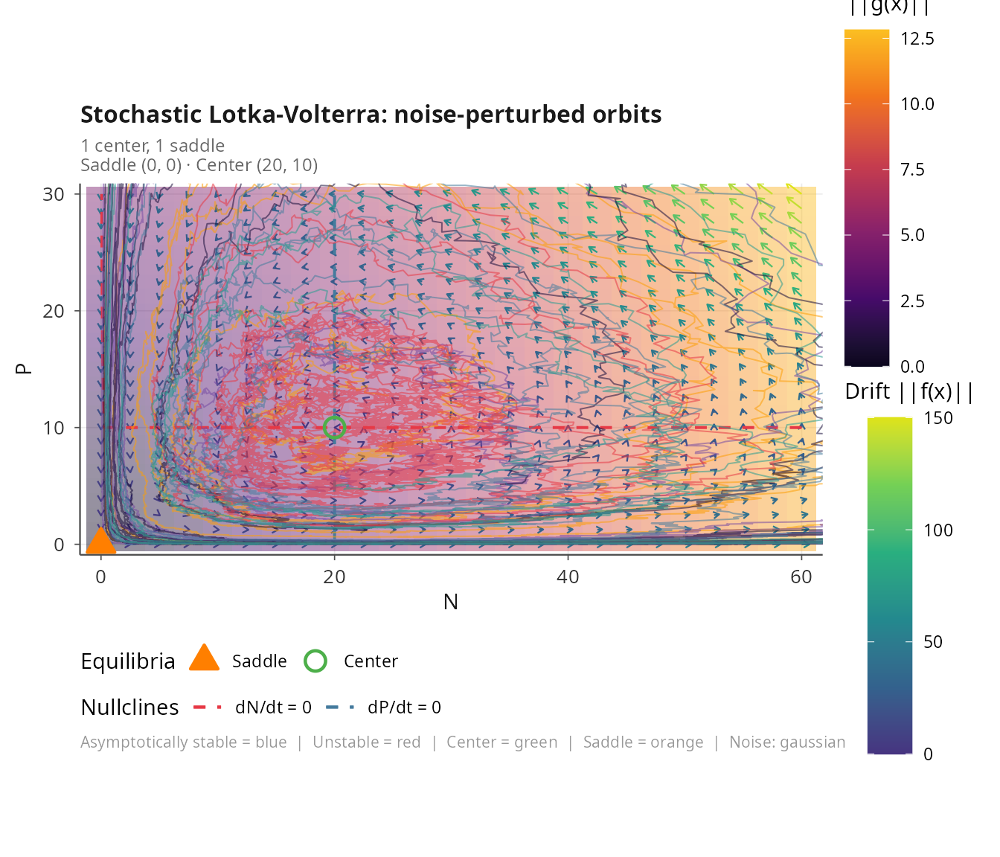

### Example 11: stochastic genetic toggle switch (biology)

The genetic toggle switch [\[7\]](#ref7) consists of two mutually
repressing genes, producing a bistable system with two stable equilibria
(high-\\u\\/low-\\v\\ and low-\\u\\/high-\\v\\ states). Additive noise
can drive rare transitions between these states, a phenomenon central to
phenotypic switching in bacteria.

\\du = \left(\frac{\alpha}{1 + v^\beta} - u\right)dt + \sigma\\dW_1,
\quad dv = \left(\frac{\alpha}{1 + u^\gamma} - v\right)dt +
\sigma\\dW_2.\\

The deterministic skeleton has two stable nodes separated by a saddle
point. The stable manifold of the saddle acts as a separatrix between
the basins of attraction. When the noise intensity \\\sigma\\ is
sufficiently large, thermal activation can push the system across the
separatrix, producing stochastic switching between gene expression
states.

``` r

toggle <- model_spec(
    rhs = list(
        u ~ alpha / (1 + v^beta) - u,
        v ~ alpha / (1 + u^gamma) - v
    ),
    diffusion = list(
        u ~ sigma,
        v ~ sigma
    ),
    state_names = c("u", "v"),
    parms = list(alpha = 3.0, beta = 2.5, gamma = 2.5,
                 sigma = 0.15),
    init  = c(u = 2.5, v = 0.5)
)

set.seed(123)
sp11 <- sde_portrait(toggle,
    xlim = c(0, 4), ylim = c(0, 4),
    n_paths = 5, path_length = 200,
    discard_transient = 0.05)
#> ⚙ Searching for equilibria of the deterministic skeleton...
#> ✔ Found 3 equilibria.
#> ⚙ Computing drift field...
#> ⚙ Computing diffusion intensity field...
#> ⚙ Computing nullclines...
#> ⚙ Computing manifolds for 1 saddle equilibrium...
#> ⚙ Computing confidence ellipses for 2 stable equilibria...
#> ✔ Computed 2 ellipse sets.
#> ⚙ Simulating 5 Euler-Maruyama sample paths...
#> ✔ Completed 5 sample paths.
#> ✔ SDE portrait complete.

print(sp11)
#> 
#> SDE phase portrait
#> ──────────────────────────────────────── 
#> 
#> Dimension: 2 D
#> States: u, v 
#> Noise type: gaussian 
#> Domain: [0.00, 4.00] x [0.00, 4.00]
#> 
#> Components:
#>   Drift field:            625 points 
#>   Diffusion field:        625 points, intensity [0.212, 0.212] 
#>   Nullclines:             2 contour segments 
#>   Equilibria:             3 (1 saddle, 2 stable node) 
#>   Confidence ellipses:    2 sets 
#>   Manifolds:              4 branches 
#>   Streamlines:            not computed 
#>   Sample paths:           5 paths
summary(sp11)
#> 
#> SDE phase portrait
#> ──────────────────────────────────────── 
#> 
#> Dimension: 2 D
#> States: u, v 
#> Noise type: gaussian 
#> Domain: [0.00, 4.00] x [0.00, 4.00]
#> 
#> Components:
#>   Drift field:            625 points 
#>   Diffusion field:        625 points, intensity [0.212, 0.212] 
#>   Nullclines:             2 contour segments 
#>   Equilibria:             3 (1 saddle, 2 stable node) 
#>   Confidence ellipses:    2 sets 
#>   Manifolds:              4 branches 
#>   Streamlines:            not computed 
#>   Sample paths:           5 paths 
#> 
#> Equilibrium details (deterministic skeleton):
#> ──────────────────────────────────────── 
#> 
#>   #1: saddle (unstable)
#>       (u, v) = (1.185567, 1.185567)
#>       lambda_1 = 0.512028
#>       lambda_2 = -2.512028
#> 
#>   #2: stable node (stable)
#>       (u, v) = (2.955096, 0.187363)
#>       lambda_1 = -1.296154
#>       lambda_2 = -0.703846
#> 
#>   #3: stable node (stable)
#>       (u, v) = (0.187363, 2.955096)
#>       lambda_1 = -1.296154
#>       lambda_2 = -0.703846
#> 
#> Confidence ellipses:
#> ──────────────────────────────────────── 
#> 
#>   Equilibrium #2 at (2.9551, 0.1874)
#>       Sigma eigenvalues: 0.0176, 0.008268
#>       Semi-axis ratio: 1.459
#> 
#>   Equilibrium #3 at (0.1874, 2.9551)
#>       Sigma eigenvalues: 0.0176, 0.008268
#>       Semi-axis ratio: 1.459
#> 
#> Manifold branches:
#>   2 stable, 2 unstable
#> 
#> Sample paths:
#> ──────────────────────────────────────── 
#>   5 paths, dt = 0.01, max time = 16.37
#>   Path 1: 294 steps, x in [2.51, 3.2], y in [-0.02, 0.491]
#>   Path 2: 1557 steps, x in [2.57, 3.11], y in [-0.0203, 0.512]
#>   Path 3: 1548 steps, x in [2.52, 3.17], y in [-0.0106, 0.384]
#>   Path 4: 870 steps, x in [2.43, 3.27], y in [-0.0099, 0.567]
#>   Path 5: 217 steps, x in [2.56, 2.95], y in [-0.00142, 0.421]
```

The [`summary()`](https://rdrr.io/r/base/summary.html) output identifies
two stable foci (or nodes) and one saddle. The confidence ellipses at
each stable equilibrium show the typical fluctuation amplitude, while
the stochastic plot type emphasises the noise-driven dynamics:

``` r

plot(sp11,
     title = "Stochastic toggle switch: bistability under noise")
```

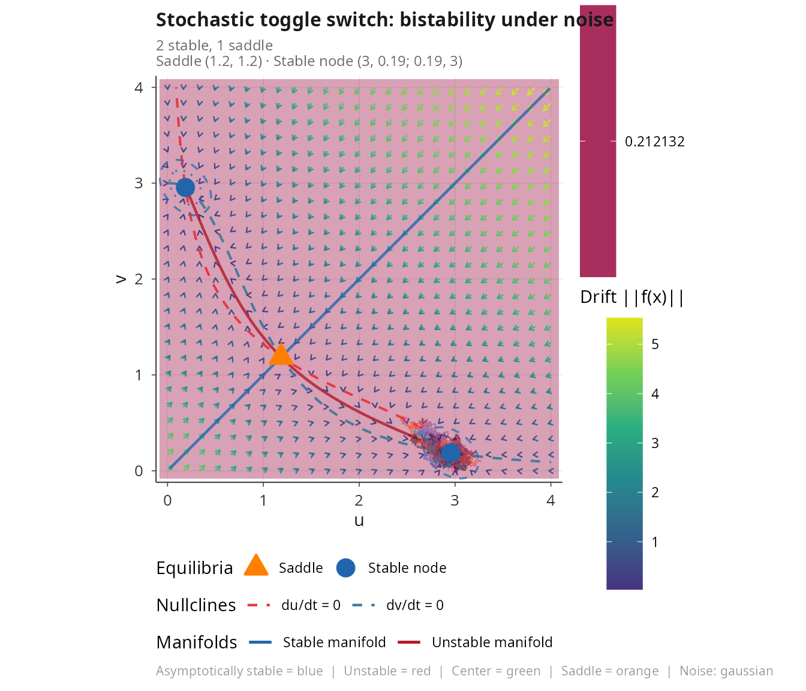

``` r

plot(sp11, type = "stochastic",
     title = "Toggle switch: sample paths and confidence ellipses")
```

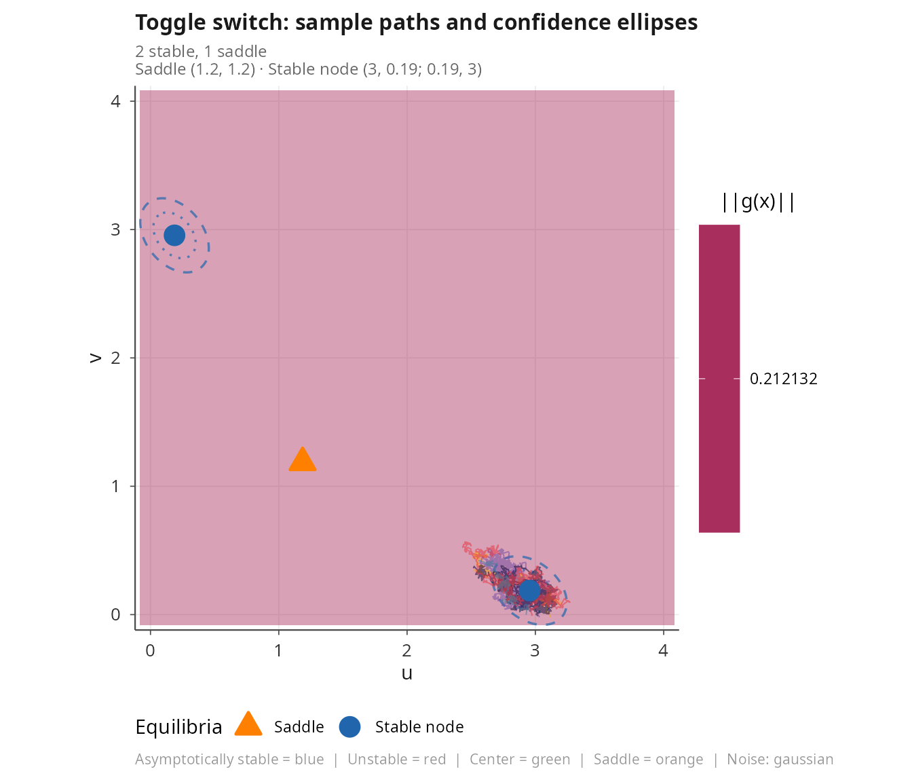

### Example 12: noisy van der Pol oscillator (physics)

The van der Pol oscillator [\[8\]](#ref8) with additive noise in the
velocity equation demonstrates the interaction between a deterministic
limit cycle and stochastic perturbations:

\\dx = y\\dt, \quad dy = (\mu(1 - x^2)y - x)\\dt + \sigma\\dW.\\

For \\\mu \> 0\\ the deterministic system has a single unstable
equilibrium at the origin surrounded by a stable limit cycle. The noise
is additive (constant diffusion coefficient) and acts only on the \\y\\
direction, so the diffusion intensity field is uniform. Sample paths
track the limit cycle but undergo phase diffusion along it: the
amplitude fluctuates mildly but the timing of successive oscillations
varies stochastically.

``` r

vdp <- model_spec(
    rhs = list(
        x ~ y,
        y ~ mu * (1 - x^2) * y - x
    ),
    diffusion = list(
        x ~ 0,
        y ~ sigma
    ),
    state_names = c("x", "y"),
    parms = list(mu = 1.5, sigma = 0.5),
    init  = c(x = 0.1, y = 0.1)
)

set.seed(99)
sp12 <- sde_portrait(vdp,
    xlim = c(-3, 3), ylim = c(-4, 4),
    n_paths = 5, path_length = 100,
    discard_transient = 0.2)
#> ⚙ Searching for equilibria of the deterministic skeleton...
#> ✔ Found 1 equilibrium.
#> ⚙ Computing drift field...
#> ⚙ Computing diffusion intensity field...
#> ⚙ Computing nullclines...
#> ¡ No saddle equilibria found; skipping manifolds.
#> ¡ No stable equilibria; skipping confidence ellipses.
#> ⚙ Simulating 5 Euler-Maruyama sample paths...
#> ✔ Completed 5 sample paths.
#> ✔ SDE portrait complete.

print(sp12)
#> 
#> SDE phase portrait
#> ──────────────────────────────────────── 
#> 
#> Dimension: 2 D
#> States: x, y 
#> Noise type: gaussian 
#> Domain: [-3.00, 3.00] x [-4.00, 4.00]
#> 
#> Components:
#>   Drift field:            625 points 
#>   Diffusion field:        625 points, intensity [0.5, 0.5] 
#>   Nullclines:             4 contour segments 
#>   Equilibria:             1 (1 unstable focus) 
#>   Confidence ellipses:    not computed 
#>   Manifolds:              not computed 
#>   Streamlines:            not computed 
#>   Sample paths:           5 paths
summary(sp12)
#> 
#> SDE phase portrait
#> ──────────────────────────────────────── 
#> 
#> Dimension: 2 D
#> States: x, y 
#> Noise type: gaussian 
#> Domain: [-3.00, 3.00] x [-4.00, 4.00]
#> 
#> Components:
#>   Drift field:            625 points 
#>   Diffusion field:        625 points, intensity [0.5, 0.5] 
#>   Nullclines:             4 contour segments 
#>   Equilibria:             1 (1 unstable focus) 
#>   Confidence ellipses:    not computed 
#>   Manifolds:              not computed 
#>   Streamlines:            not computed 
#>   Sample paths:           5 paths 
#> 
#> Equilibrium details (deterministic skeleton):
#> ──────────────────────────────────────── 
#> 
#>   #1: unstable focus (unstable)
#>       (x, y) = (0.000000, 0.000000)
#>       lambda_1 = 0.750000 + 0.661438i
#>       lambda_2 = 0.750000 - 0.661438i
#> 
#> Sample paths:
#> ──────────────────────────────────────── 
#>   5 paths, dt = 0.01, max time = 100
#>   Path 1: 8001 steps, x in [-2.33, 2.31], y in [-4.76, 4.76]
#>   Path 2: 8001 steps, x in [-2.25, 2.14], y in [-4.34, 3.98]
#>   Path 3: 8001 steps, x in [-2.26, 2.17], y in [-4.09, 3.92]
#>   Path 4: 8001 steps, x in [-2.22, 2.23], y in [-3.9, 4.2]
#>   Path 5: 8001 steps, x in [-2.28, 2.31], y in [-4.45, 4.68]
```

Separating the drift and diffusion fields clarifies the structure. The
drift field shows the characteristic van der Pol flow with fast
horizontal excursions and slow vertical returns:

``` r

plot(sp12, type = "drift",
     title = "Van der Pol: drift field")
```

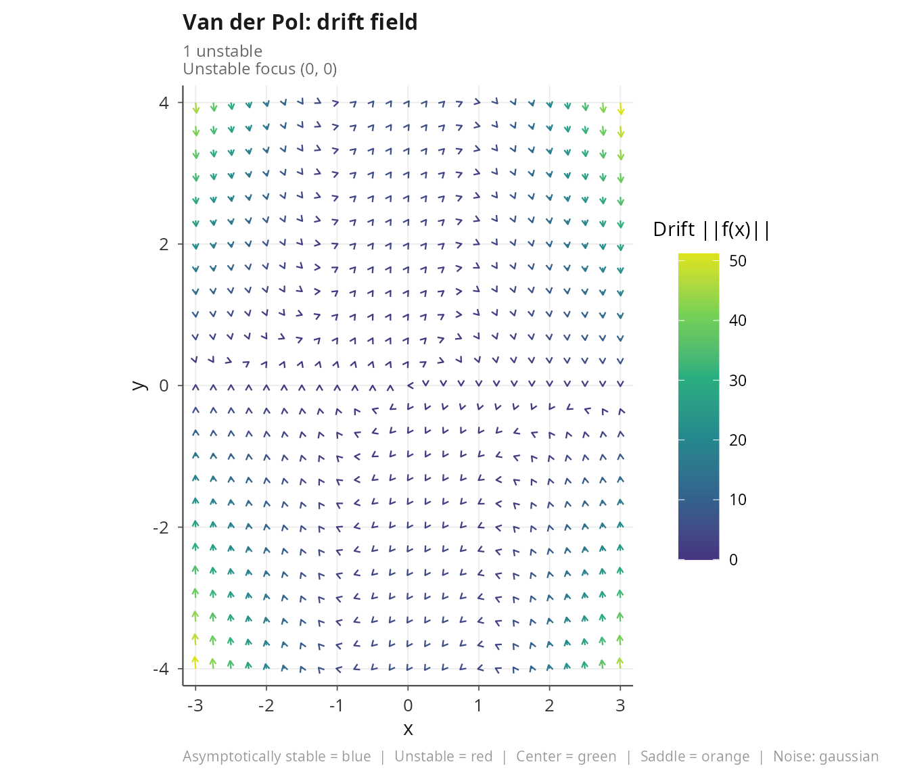

The diffusion field is constant since the noise is additive and acts
only on \\y\\:

``` r

plot(sp12, type = "diffusion",
     title = "Van der Pol: additive noise in velocity")
```

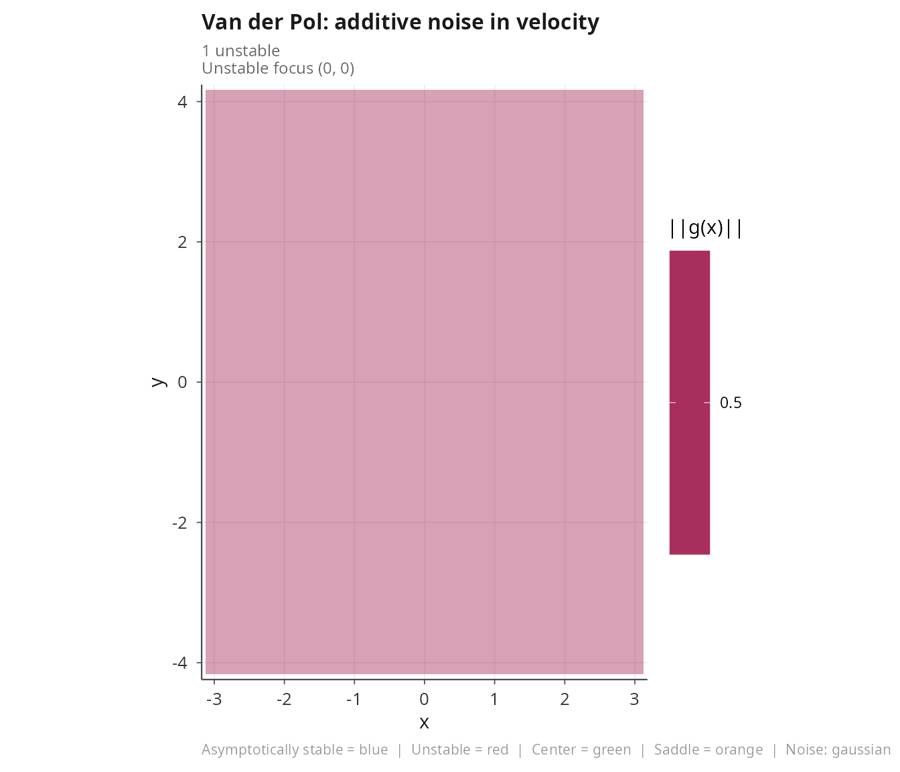

The full portrait combines all elements:

``` r

plot(sp12, title = "Noisy van der Pol oscillator")
```

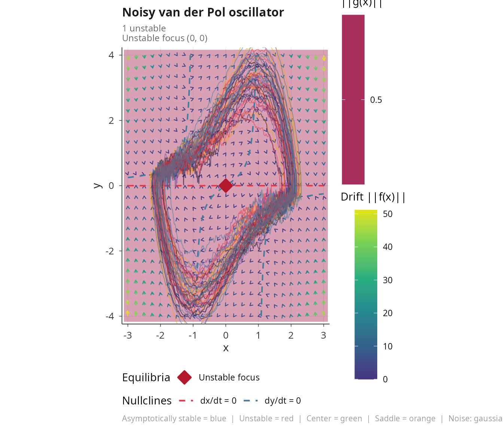

## DDE portraits

### Theory: characteristic quasi-polynomials, Chebyshev collocation, and delay-induced bifurcation

Delay differential equations introduce memory into the dynamics: the
rate of change depends not only on the current state but also on its
past values,

\\\dot{\mathbf{x}}(t) = \mathbf{f}\bigl(\mathbf{x}(t),
\mathbf{x}(t-\tau_1), \ldots, \mathbf{x}(t-\tau_m)\bigr).\\

The infinite-dimensional nature of DDEs (the “state” is a function on
\\\[-\tau\_{\max}, 0\]\\ rather than a point in \\\mathbb{R}^n\\)
fundamentally complicates the analysis. Nevertheless, the equilibria of
the DDE coincide with those of the *frozen system* obtained by setting
all delay variables equal to the current state:
\\\mathbf{f}(\mathbf{x}^\*, \mathbf{x}^\*, \ldots, \mathbf{x}^\*) =
\mathbf{0}\\. This is because at a steady state the delayed values
\\\mathbf{x}(t - \tau_k) = \mathbf{x}^\*\\ trivially equal the current
state \\\mathbf{x}(t) = \mathbf{x}^\*\\. The frozen system thus locates
equilibria exactly, and its vector field provides a qualitatively
meaningful (though not stability-exact) picture of the phase space
structure.

The stability of a DDE equilibrium requires solving the characteristic
quasi-polynomial [\[9\]](#ref9):

\\\det\\\left(sI - A_0 - \sum\_{k=1}^m A_k\\e^{-s\tau_k}\right) = 0,\\

where \\A_0 = \partial
\mathbf{f}/\partial\mathbf{x}\|\_{\mathbf{x}^\*}\\ is the instantaneous
Jacobian and \\A_k =
\partial\mathbf{f}/\partial\mathbf{x}(t-\tau_k)\|\_{\mathbf{x}^\*}\\ is
the delayed Jacobian with respect to the \\k\\-th delay term. Unlike the
polynomial eigenvalue problem for ODEs, this transcendental equation has
infinitely many roots, and stability requires all roots to have
\\\text{Re}(s) \< 0\\. A delay-induced Hopf bifurcation occurs when
roots cross the imaginary axis as \\\tau\\ increases from zero: the
equilibrium that was stable for the ODE (\\\tau = 0\\) can become
unstable for sufficiently large delay, spawning oscillations purely from
the memory effect.

The
[`dde_portrait()`](https://robustecologies.github.io/janos/reference/dde_portrait.md)
function uses the Chebyshev pseudospectral method of Breda, Maset, and
Vermiglio [\[10\]](#ref10) to approximate the leading characteristic
roots. The delay interval \\\[-\tau\_{\max}, 0\]\\ is discretised using
\\N\\ Chebyshev collocation points, and the infinite-dimensional
eigenvalue problem is approximated by a finite companion matrix whose
eigenvalues converge to the true roots as \\N \to \infty\\. The
rightmost roots (those with largest real part) are the most accurately
approximated and are the ones that determine stability. When the frozen
system and the delay spectrum disagree about stability, the portrait
annotates the affected equilibria to highlight the discrepancy.

The
[`dde_portrait()`](https://robustecologies.github.io/janos/reference/dde_portrait.md)
function is restricted to 2D systems (at least two state variables are
required). The computational components include the frozen vector field,
frozen nullclines, frozen equilibria with Jacobian classification, the
optional Chebyshev delay spectrum, frozen saddle manifolds, frozen
streamlines, and actual DDE trajectories computed via
[`dyn_sim()`](https://robustecologies.github.io/janos/reference/dyn_sim.md)
with
[`solver_dde()`](https://robustecologies.github.io/janos/reference/solver_dde.md).

### Example 13: delayed predator-prey (ecology)

A predator-prey system with a maturation delay on the prey, so that
predator growth depends on prey density at an earlier time:

\\\dot{N} = rN\\\left(1 - \frac{N\_\tau}{K}\right) - aNP, \quad \dot{P}
= bNP - dP,\\

where \\N\_\tau = N(t - \tau)\\. The delay \\\tau\\ represents the time
lag between resource consumption and its effect on prey growth
regulation. The frozen system (setting \\N\_\tau = N\\) is a standard
Lotka-Volterra model with logistic prey growth, and its equilibrium
analysis is exact. However, the frozen eigenvalue classification may
disagree with the true delay stability.

``` r

delayed_lv <- model_spec(
    rhs = list(
        N ~ r * N * (1 - N_delay / K) - a * N * P,
        P ~ b * N * P - d * P
    ),
    delays = list(N_delay = list(state = "N", tau = 3.0)),
    state_names = c("N", "P"),
    parms = list(r = 1.5, K = 10.0, a = 0.2, b = 0.1, d = 0.5),
    init  = c(N = 5.0, P = 2.0)
)

dp13 <- dde_portrait(delayed_lv,
    xlim = c(0, 12), ylim = c(0, 6),
    traj_length = 120, discard_transient = 0.2,
    delay_spectrum = TRUE)
#> ⚙ Computing DDE trajectories...
#> ⚙ Searching for equilibria (frozen system)...
#> ✔ Found 3 equilibria (frozen classification).
#> ⚙ Computing delay characteristic spectrum...
#> ¡   Eq #1: frozen = saddle, delay spectrum max Re(s) = 26.6845 (unstable)
#> ¡   Eq #2: frozen = stable focus, delay spectrum max Re(s) = 25.5139 (unstable)
#> ¡   Eq #3: frozen = saddle, delay spectrum max Re(s) = 19.8978 (unstable)
#> ⚙ Computing frozen vector field...
#> ⚙ Computing nullclines (frozen system)...
#> ⚙ Computing manifolds for 2 frozen saddle equilibria...
#> ✔ DDE portrait complete.

print(dp13)
#> 
#> DDE portrait
#> ──────────────────────────────────────── 
#> 
#> Dimension: 2D (frozen projection)
#> States: N, P 
#> Domain: [0.00, 12.00] x [0.00, 6.00] 
#> Delays: 1 term (tau_max = 3.00) 
#>   N_delay: N(t - 3.00)
#> 
#> Components:
#>   Frozen field:     625 points 
#>   Nullclines:       2 contour segments (frozen) 
#>   Equilibria:       3 (2 saddle, 1 stable focus) [frozen] 
#>   Delay spectrum:   3 equilibria analyzed 
#>   Streamlines:      not computed 
#>   Manifolds:        1 branches (frozen) 
#>   DDE trajectories: 1 curves
summary(dp13)
#> 
#> DDE portrait
#> ──────────────────────────────────────── 
#> 
#> Dimension: 2D (frozen projection)
#> States: N, P 
#> Domain: [0.00, 12.00] x [0.00, 6.00] 
#> Delays: 1 term (tau_max = 3.00) 
#>   N_delay: N(t - 3.00)
#> 
#> Components:
#>   Frozen field:     625 points 
#>   Nullclines:       2 contour segments (frozen) 
#>   Equilibria:       3 (2 saddle, 1 stable focus) [frozen] 
#>   Delay spectrum:   3 equilibria analyzed 
#>   Streamlines:      not computed 
#>   Manifolds:        1 branches (frozen) 
#>   DDE trajectories: 1 curves 
#> 
#> Equilibrium details:
#> ────────────────────────────────────────────────── 
#> 
#>   #1: saddle (frozen) [frozen-unstable]
#>       (N, P) = (-0.000000, -0.000000)
#>       Frozen eigenvalues:
#>         λ_1 = 1.500000
#>         λ_2 = -0.500000
#>       Delay spectrum (approximate):
#>         Max Re(s) = 26.684475
#>         Delay stability: unstable
#>         Leading roots:
#>           s_1 = 26.6845
#>           s_2 = 22.2047 + 16.9613i
#>           s_3 = 22.2047 - 16.9613i
#>           s_4 = 10.6467 + 14.4520i
#>           s_5 = 10.6467 - 14.4520i
#> 
#>   #2: stable focus (frozen) [frozen-stable]
#>       (N, P) = (5.000000, 3.750000)
#>       Frozen eigenvalues:
#>         λ_1 = -0.375000 + 0.484123i
#>         λ_2 = -0.375000 - 0.484123i
#>       Delay spectrum (approximate):
#>         Max Re(s) = 25.513937
#>         Delay stability: unstable
#>         Leading roots:
#>           s_1 = 25.5139 + 7.9842i
#>           s_2 = 25.5139 - 7.9842i
#>           s_3 = 14.8871 + 14.9680i
#>           s_4 = 14.8871 - 14.9680i
#>           s_5 = 7.5078 + 14.0839i
#>         ⚠ Frozen-stable but delay-UNSTABLE: delay destabilizes this equilibrium.
#> 
#>   #3: saddle (frozen) [frozen-unstable]
#>       (N, P) = (10.000000, -0.000000)
#>       Frozen eigenvalues:
#>         λ_1 = -1.500000
#>         λ_2 = 0.500000
#>       Delay spectrum (approximate):
#>         Max Re(s) = 19.897848
#>         Delay stability: unstable
#>         Leading roots:
#>           s_1 = 19.8978 + 12.3796i
#>           s_2 = 19.8978 - 12.3796i
#>           s_3 = 5.4898 + 12.8211i
#>           s_4 = 5.4898 - 12.8211i
#>           s_5 = 5.4270
#> 
#> Manifold branches (frozen system):
#>   0 stable, 1 unstable
#> 
#> Delay structure:
#>   N_delay: N(t - 3.0000)
```

The [`summary()`](https://rdrr.io/r/base/summary.html) output reports
both the frozen eigenvalues and the Chebyshev-approximate characteristic
roots. When the rightmost characteristic root has \\\text{Re}(s) \> 0\\
but the frozen system classifies the equilibrium as stable, this
represents a delay-induced destabilisation. The DDE trajectory will then
show oscillations that the frozen portrait does not predict.

``` r

plot(dp13, title = "Delayed predator-prey (tau = 3)")
```

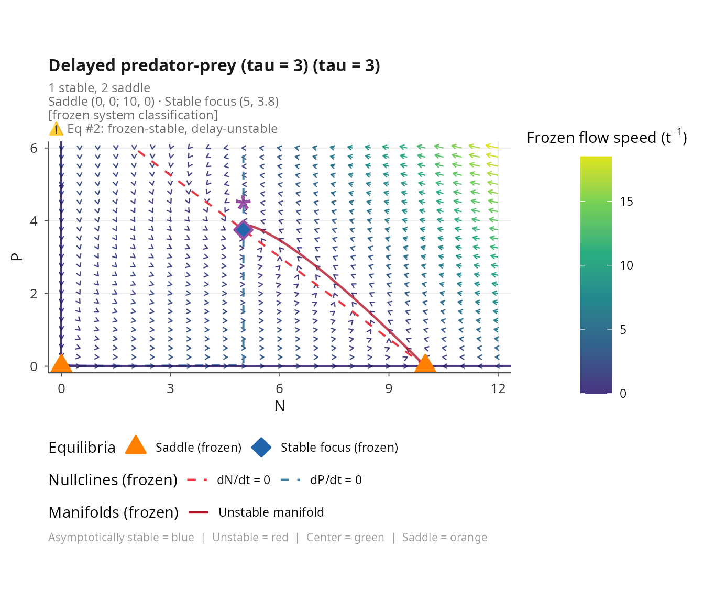

The frozen vector field alone shows the ODE-like structure:

``` r

plot(dp13, type = "field",
     title = "Frozen vector field: delayed predator-prey")
```

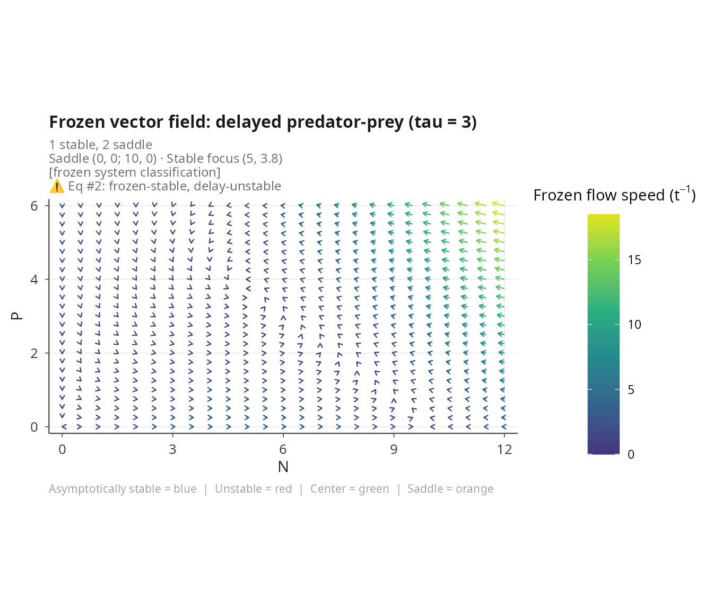

### Example 14: Mackey-Glass haematopoiesis (biology)

The Mackey-Glass equation [\[12\]](#ref12) models feedback control in
blood cell production (haematopoiesis):

\\\dot{x}(t) = \frac{a\\x(t-\tau)}{1 + x(t-\tau)^c} - b\\x(t).\\

This is inherently one-dimensional, so for a 2D portrait we introduce an
auxiliary variable \\y\\ representing a downstream product (e.g., mature
blood cells):

\\\dot{x} = \frac{a\\x\_\tau}{1 + x\_\tau^c} - b\\x, \quad \dot{y} =
e\\x - f\\y.\\

At \\\tau = 20\\ and \\c = 10\\ the original Mackey-Glass equation is
well into the oscillatory regime, producing large-amplitude periodic
oscillations. The frozen system may still classify the equilibrium as
stable (a focus with negative real part), but the DDE trajectory reveals
pronounced oscillations driven by the delay.

``` r

mg2d <- model_spec(
    rhs = list(
        x ~ a * x_delay / (1 + x_delay^c) - b * x,
        y ~ e * x - f * y
    ),
    delays = list(x_delay = list(state = "x", tau = 20.0)),
    state_names = c("x", "y"),
    parms = list(a = 0.2, b = 0.1, c = 10.0, e = 0.5, f = 0.3),
    init  = c(x = 0.5, y = 0.8)
)

dp14 <- dde_portrait(mg2d,
    traj_length = 1500, discard_transient = 0.4,
    n_grid = 20)
#> ⚙ Computing DDE trajectories...
#> ⚙ Searching for equilibria (frozen system)...
#> ✔ Found 3 equilibria (frozen classification).
#> ⚙ Computing frozen vector field...
#> ⚙ Computing nullclines (frozen system)...
#> ⚙ Computing manifolds for 1 frozen saddle equilibrium...
#> ✔ DDE portrait complete.

print(dp14)
#> 
#> DDE portrait
#> ──────────────────────────────────────── 
#> 
#> Dimension: 2D (frozen projection)
#> States: x, y 
#> Domain: [-2.00, 2.32] x [-2.67, 3.16] 
#> Delays: 1 term (tau_max = 20.00) 
#>   x_delay: x(t - 20.00)
#> 
#> Components:
#>   Frozen field:     400 points 
#>   Nullclines:       4 contour segments (frozen) 
#>   Equilibria:       3 (1 saddle, 2 stable node) [frozen] 
#>   Delay spectrum:   not computed 
#>   Streamlines:      not computed 
#>   Manifolds:        4 branches (frozen) 
#>   DDE trajectories: 1 curves
summary(dp14)
#> 
#> DDE portrait
#> ──────────────────────────────────────── 
#> 
#> Dimension: 2D (frozen projection)
#> States: x, y 
#> Domain: [-2.00, 2.32] x [-2.67, 3.16] 
#> Delays: 1 term (tau_max = 20.00) 
#>   x_delay: x(t - 20.00)
#> 
#> Components:
#>   Frozen field:     400 points 
#>   Nullclines:       4 contour segments (frozen) 
#>   Equilibria:       3 (1 saddle, 2 stable node) [frozen] 
#>   Delay spectrum:   not computed 
#>   Streamlines:      not computed 
#>   Manifolds:        4 branches (frozen) 
#>   DDE trajectories: 1 curves 
#> 
#> Equilibrium details:
#> ────────────────────────────────────────────────── 
#> 
#>   #1: saddle (frozen) [frozen-unstable]
#>       (x, y) = (0.000000, -0.000000)
#>       Frozen eigenvalues:
#>         λ_1 = -0.300000
#>         λ_2 = 0.100000
#> 
#>   #2: stable node (frozen) [frozen-stable]
#>       (x, y) = (-1.000000, -1.666667)
#>       Frozen eigenvalues:
#>         λ_1 = -0.500000
#>         λ_2 = -0.300000
#> 
#>   #3: stable node (frozen) [frozen-stable]
#>       (x, y) = (1.000000, 1.666667)
#>       Frozen eigenvalues:
#>         λ_1 = -0.500000
#>         λ_2 = -0.300000
#> 
#> Manifold branches (frozen system):
#>   2 stable, 2 unstable
#> 
#> Delay structure:
#>   x_delay: x(t - 20.0000)
plot(dp14, title = "Mackey-Glass haematopoiesis (tau = 20)")
```

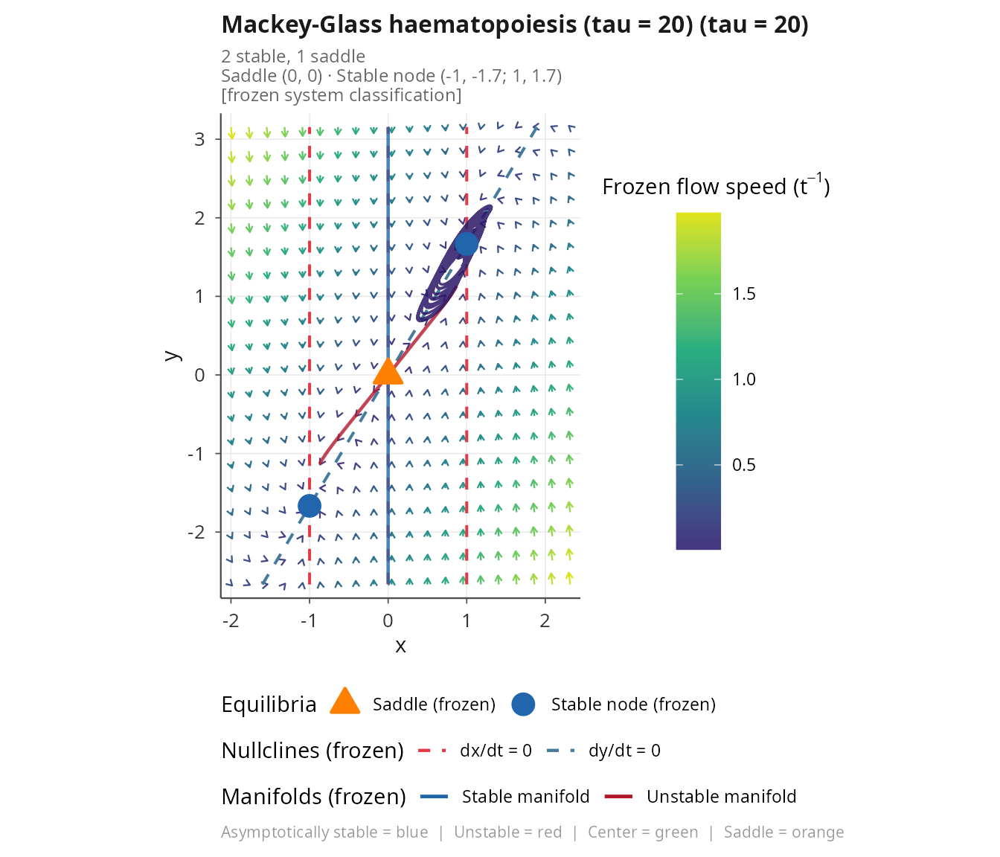

The frozen nullclines show the geometric location of the equilibrium:

``` r

plot(dp14, type = "nullclines",
     title = "Frozen nullclines: haematopoiesis model")
```

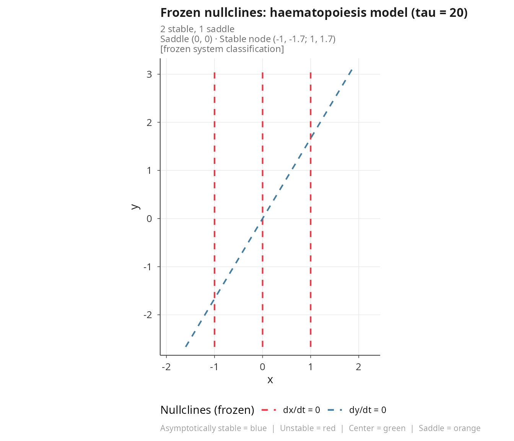

The discrepancy between the frozen portrait (which suggests a stable
equilibrium) and the DDE trajectory (which shows sustained oscillations)
is the most instructive feature of the DDE portrait. It visually
demonstrates that delay fundamentally alters the qualitative dynamics.

### Example 15: Wangersky-Cunningham two-delay model (ecology)

The Wangersky-Cunningham model [\[13\]](#ref13) introduces separate
delays for predator response and prey maturation:

\\\dot{H} = rH\\\left(1 - \frac{H}{K}\right) - aHP\_\tau, \quad \dot{P}
= bH\_\tau P - dP,\\

where \\P\_\tau = P(t - \tau_1)\\ represents a handling time for the
predator’s functional response and \\H\_\tau = H(t - \tau_2)\\
represents a maturation delay in the numerical response. The presence of
two independent delays enriches the characteristic quasi-polynomial and
the spectrum analysis.

``` r

wangersky <- model_spec(
    rhs = list(
        H ~ r * H * (1 - H / K) - a * H * P_delay,
        P ~ b * H_delay * P - d * P
    ),
    delays = list(
        P_delay = list(state = "P", tau = 1.5),
        H_delay = list(state = "H", tau = 2.0)
    ),
    state_names = c("H", "P"),
    parms = list(r = 1.0, K = 10.0, a = 0.5,
                 b = 0.3, d = 0.4),
    init  = c(H = 5.0, P = 2.0)
)

dp15 <- dde_portrait(wangersky,
    xlim = c(0, 15), ylim = c(0, 8),
    traj_length = 200, discard_transient = 0.3,
    delay_spectrum = TRUE, n_spectrum_roots = 30)
#> ⚙ Computing DDE trajectories...
#> ⚙ Searching for equilibria (frozen system)...
#> ✔ Found 3 equilibria (frozen classification).
#> ⚙ Computing delay characteristic spectrum...
#> ¡   Eq #1: frozen = saddle, delay spectrum max Re(s) = 71.2973 (unstable)
#> ¡   Eq #2: frozen = stable focus, delay spectrum max Re(s) = 60.9639 (unstable)
#> ¡   Eq #3: frozen = saddle, delay spectrum max Re(s) = 82.7255 (unstable)
#> ⚙ Computing frozen vector field...
#> ⚙ Computing nullclines (frozen system)...
#> ⚙ Computing manifolds for 2 frozen saddle equilibria...
#> ✔ DDE portrait complete.

print(dp15)
#> 
#> DDE portrait
#> ──────────────────────────────────────── 
#> 
#> Dimension: 2D (frozen projection)
#> States: H, P 
#> Domain: [0.00, 15.00] x [0.00, 8.00] 
#> Delays: 2 terms (tau_max = 2.00) 
#>   P_delay: P(t - 1.50)
#>   H_delay: H(t - 2.00)
#> 
#> Components:
#>   Frozen field:     625 points 
#>   Nullclines:       3 contour segments (frozen) 
#>   Equilibria:       3 (2 saddle, 1 stable focus) [frozen] 
#>   Delay spectrum:   3 equilibria analyzed 
#>   Streamlines:      not computed 
#>   Manifolds:        1 branches (frozen) 
#>   DDE trajectories: 1 curves
summary(dp15)
#> 
#> DDE portrait
#> ──────────────────────────────────────── 
#> 
#> Dimension: 2D (frozen projection)
#> States: H, P 
#> Domain: [0.00, 15.00] x [0.00, 8.00] 
#> Delays: 2 terms (tau_max = 2.00) 
#>   P_delay: P(t - 1.50)
#>   H_delay: H(t - 2.00)
#> 
#> Components:
#>   Frozen field:     625 points 
#>   Nullclines:       3 contour segments (frozen) 
#>   Equilibria:       3 (2 saddle, 1 stable focus) [frozen] 
#>   Delay spectrum:   3 equilibria analyzed 
#>   Streamlines:      not computed 
#>   Manifolds:        1 branches (frozen) 
#>   DDE trajectories: 1 curves 
#> 
#> Equilibrium details:
#> ────────────────────────────────────────────────── 
#> 
#>   #1: saddle (frozen) [frozen-unstable]
#>       (H, P) = (-0.000000, -0.000000)
#>       Frozen eigenvalues:
#>         λ_1 = 1.000000
#>         λ_2 = -0.400000
#>       Delay spectrum (approximate):
#>         Max Re(s) = 71.297274
#>         Delay stability: unstable
#>         Leading roots:
#>           s_1 = 71.2973
#>           s_2 = 64.4442 + 35.8772i
#>           s_3 = 64.4442 - 35.8772i
#>           s_4 = 37.1744 + 37.9242i
#>           s_5 = 37.1744 - 37.9242i
#> 
#>   #2: stable focus (frozen) [frozen-stable]
#>       (H, P) = (1.333333, 1.733333)
#>       Frozen eigenvalues:
#>         λ_1 = -0.066667 + 0.584998i
#>         λ_2 = -0.066667 - 0.584998i
#>       Delay spectrum (approximate):
#>         Max Re(s) = 60.963924
#>         Delay stability: unstable
#>         Leading roots:
#>           s_1 = 60.9639
#>           s_2 = 36.1517 + 31.9336i
#>           s_3 = 36.1517 - 31.9336i
#>           s_4 = 14.8061 + 29.9704i
#>           s_5 = 14.8061 - 29.9704i
#>         ⚠ Frozen-stable but delay-UNSTABLE: delay destabilizes this equilibrium.
#> 
#>   #3: saddle (frozen) [frozen-unstable]
#>       (H, P) = (10.000000, -0.000000)
#>       Frozen eigenvalues:
#>         λ_1 = 2.600000
#>         λ_2 = -1.000000
#>       Delay spectrum (approximate):
#>         Max Re(s) = 82.725541
#>         Delay stability: unstable
#>         Leading roots:
#>           s_1 = 82.7255
#>           s_2 = 71.0505 + 46.5755i
#>           s_3 = 71.0505 - 46.5755i
#>           s_4 = 37.3051 + 43.8880i
#>           s_5 = 37.3051 - 43.8880i
#> 
#> Manifold branches (frozen system):
#>   0 stable, 1 unstable
#> 
#> Delay structure:
#>   P_delay: P(t - 1.5000)
#>   H_delay: H(t - 2.0000)
plot(dp15, title = "Wangersky-Cunningham delayed predator-prey")
#> Warning: Removed 1341 rows containing missing values or values outside the scale range
#> (`geom_path()`).
```

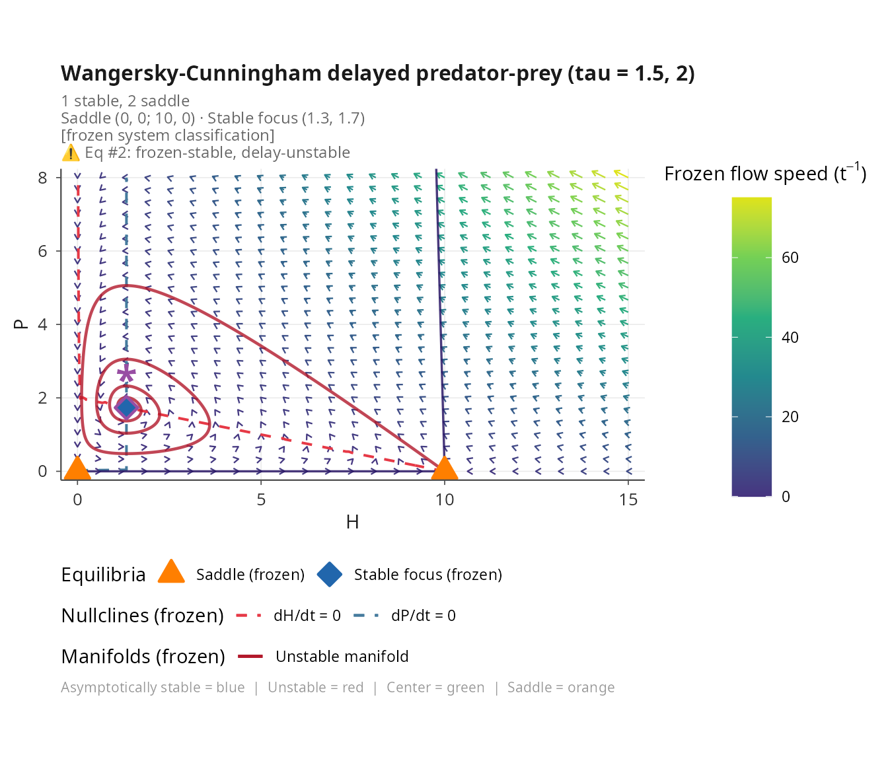

The `n_spectrum_roots = 30` increases the number of Chebyshev
collocation points, improving the accuracy of the leading characteristic
roots. The [`summary()`](https://rdrr.io/r/base/summary.html) output
lists the rightmost roots; when any has positive real part, the
equilibrium is delay-unstable even if the frozen classification says
otherwise. The frozen manifolds approximate the separatrix geometry:

``` r

plot(dp15, type = "manifolds",
     title = "Frozen manifolds: two-delay predator-prey")
```

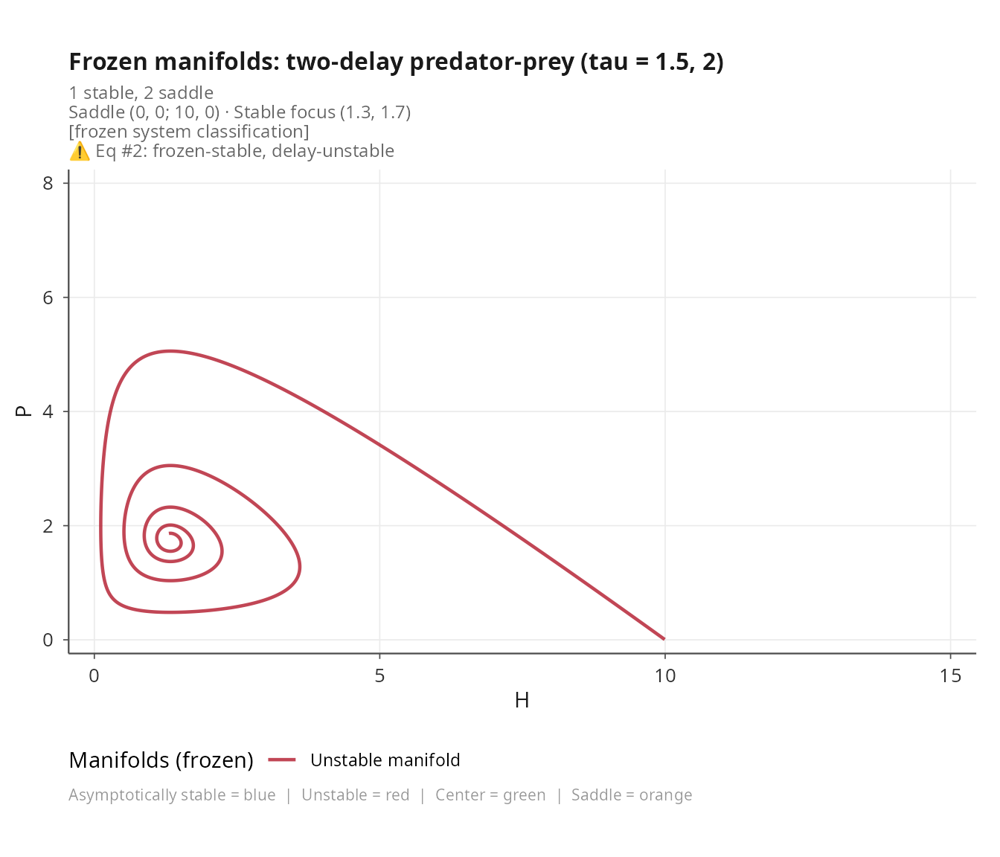

## PDMP portraits

### Theory: extended generator, regime-dependent equilibria, and invariant measures

A piecewise deterministic Markov process (PDMP) [\[14\]](#ref14) is a
hybrid system combining continuous deterministic dynamics with discrete
stochastic switching. The state of the system is the pair
\\(\mathbf{X}(t), R(t)) \in \mathbb{R}^n \times \\1, \ldots, M\\\\,
where \\R(t)\\ is the active regime. Between switching events, the
continuous state evolves according to the ODE of the current regime:

\\\dot{\mathbf{X}}(t) = \mathbf{f}\_{R(t)}\bigl(\mathbf{X}(t)\bigr).\\

Transitions between regimes occur at random times governed by
state-dependent rates \\\lambda\_{r \to r'}(\mathbf{x})\\, and the total
rate out of regime \\r\\ is \\\Lambda_r(\mathbf{x}) = \sum\_{r'}
\lambda\_{r \to r'}(\mathbf{x})\\. The extended generator of the
process, acting on smooth test functions \\\phi(\mathbf{x}, r)\\, is

\\\mathcal{A}\phi(\mathbf{x}, r) = \mathbf{f}\_r(\mathbf{x}) \cdot
\nabla\_\mathbf{x}\phi(\mathbf{x}, r) + \sum\_{r'} \lambda\_{r \to
r'}(\mathbf{x})\bigl\[\phi(\mathbf{x}, r') - \phi(\mathbf{x},
r)\bigr\].\\

Under suitable conditions, the process admits a unique invariant measure
\\\mu\\ on \\\mathbb{R}^n \times \\1, \ldots, M\\\\ satisfying
\\\mathcal{A}^\*\mu = 0\\ [\[15\]](#ref15). This measure describes the
long-run fraction of time spent in each regime and region of state
space.

The
[`pdmp_portrait()`](https://robustecologies.github.io/janos/reference/pdmp_portrait.md)
function analyses each regime’s ODE independently, computing per-regime
vector fields, nullclines, and equilibria. These regime-specific
equilibria are landmarks of the deterministic flow within each regime;
the PDMP trajectories typically do not reach any of them, since
switching occurs before the system can settle. The switching
trajectories are computed via
[`dyn_sim()`](https://robustecologies.github.io/janos/reference/dyn_sim.md)
with
[`solver_pdmp()`](https://robustecologies.github.io/janos/reference/solver_pdmp.md),
which implements the Lewis-Shedler thinning algorithm for inhomogeneous
Poisson processes. The portrait records the coordinates and timing of
each switch point, and the plot methods colour trajectory segments by
active regime.

The plot `type` argument offers four views: `"default"` produces a
faceted layout with one panel per regime, `"combined"` overlays all
regimes on a single panel, `"trajectories"` shows switching trajectories
coloured by regime with switch points marked, and `"regime_NAME"`
displays the full portrait for a single named regime.

### Example 16: gene expression telegraph model (biology)

The telegraph model of gene expression [\[16\]](#ref16) describes a
promoter that stochastically switches between an active (`on`) state, in
which mRNA \\x\\ is produced at rate \\k_1\\, and an inactive (`off`)
state, in which production ceases. A downstream protein \\y\\ is
translated from \\x\\ in both regimes:

\\\text{on}: \quad \dot{x} = k_1 - d_1 x, \quad \dot{y} = k_2 x - d_2
y;\\ \\\text{off}: \quad \dot{x} = -d_1 x, \quad \dot{y} = k_2 x - d_2
y.\\

Switching rates are constant: \\\lambda\_{\text{on} \to \text{off}} =
\lambda\_\text{off}\\ and \\\lambda\_{\text{off} \to \text{on}} =
\lambda\_\text{on}\\. The `on` regime has an equilibrium at \\(x^\*,
y^\*) = (k_1/d_1, k_2 k_1/(d_1 d_2))\\, while the `off` regime has its
equilibrium at the origin. The PDMP dynamics bounce between these two
attractors without ever reaching either.

``` r

telegraph <- model_spec(
    regimes = list(
        on  = list(
            x ~ k1 - d1 * x,
            y ~ k2 * x - d2 * y
        ),
        off = list(
            x ~ -d1 * x,
            y ~ k2 * x - d2 * y
        )
    ),
    transitions = list(
        list(from = "on",  to = "off", rate = ~ lambda_off),
        list(from = "off", to = "on",  rate = ~ lambda_on)
    ),
    state_names = c("x", "y"),
    parms = list(k1 = 10, k2 = 5, d1 = 1, d2 = 0.5,
                 lambda_on = 0.5, lambda_off = 0.3),
    init  = c(x = 5, y = 20),
    initial_regime = "on"
)

pdp16 <- pdmp_portrait(telegraph,
    xlim = c(0, 15), ylim = c(0, 60),
    traj_length = 100, n_trajectories = 3)
#> ⚙ PDMP portrait: PDMP system (2 regimes)
#>   ¡ States: x, y
#>   ¡ Regimes: on, off
#> ⚙ Computing per-regime vector fields...
#> ⚙ Computing per-regime nullclines...
#> ⚙ Searching for per-regime equilibria...
#> ✔ Found 2 equilibria across all regimes.
#>   ¡ on: 1 (1 stable node)
#>   ¡ off: 1 (1 stable node)
#> ⚙ Simulating 3 switching trajectories...
#> ✔ 3 trajectories computed, 124 switch points detected.
#> ✔ PDMP portrait complete.

print(pdp16)
#> 
#> PDMP portrait
#> ──────────────────────────────────────── 
#> 
#> States: x, y 
#> Regimes: on, off 
#> Domain: [0.00, 15.00] x [0.00, 60.00] 
#> 
#> Per-regime components:
#>   Vector fields:  on (625 pts), off (625 pts) 
#>   Nullclines:     on (2 segments), off (2 segments) 
#>   Equilibria [on]: 1 (1 stable node)
#>   Equilibria [off]: 1 (1 stable node)
#>   Trajectories:  3 (30003 points, 124 switches)
summary(pdp16)
#> 
#> PDMP portrait
#> ──────────────────────────────────────── 
#> 
#> States: x, y 
#> Regimes: on, off 
#> Domain: [0.00, 15.00] x [0.00, 60.00] 
#> 
#> Per-regime components:
#>   Vector fields:  on (625 pts), off (625 pts) 
#>   Nullclines:     on (2 segments), off (2 segments) 
#>   Equilibria [on]: 1 (1 stable node)
#>   Equilibria [off]: 1 (1 stable node)
#>   Trajectories:  3 (30003 points, 124 switches)
#> 
#> Equilibrium details [on]:
#> ──────────────────────────────────────── 
#> 
#>   #1: stable node (stable)
#>       (x, y) = (10.000000, 100.000000)
#>       lambda_1 = -1.000000
#>       lambda_2 = -0.500000
#> 
#> Equilibrium details [off]:
#> ──────────────────────────────────────── 
#> 
#>   #1: stable node (stable)
#>       (x, y) = (0.000000, 0.000000)
#>       lambda_1 = -1.000000
#>       lambda_2 = -0.500000
#> 
#> Switching statistics:
#> ──────────────────────────────────────── 
#>   Total switches: 124 across 3 trajectories
#>   Switches per trajectory: mean = 41.3, range = [38, 46]
#>   Switches by target regime:
#>     off: 62 (50.0%)
#>     on: 62 (50.0%)
```

The default faceted plot shows each regime’s phase portrait side by
side:

``` r

plot(pdp16,
     title = "Gene expression telegraph model")
```

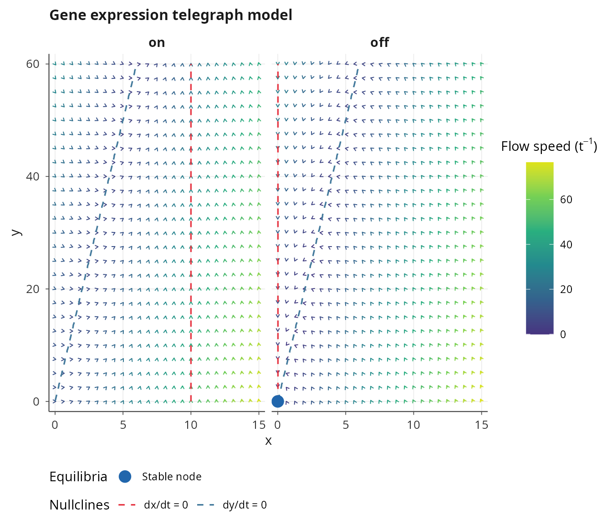

Individual regime portraits can be examined in detail:

``` r

plot(pdp16, type = "regime_on",
     title = "Promoter on: active gene expression")
```

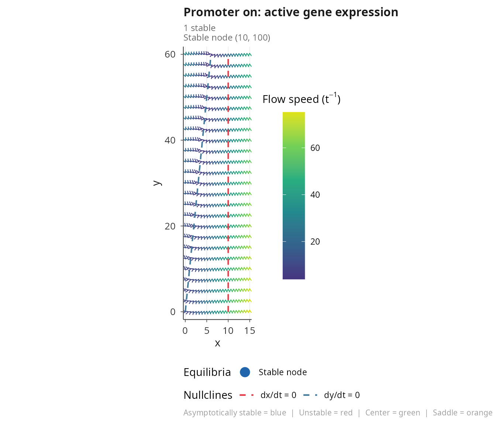

``` r

plot(pdp16, type = "regime_off",
     title = "Promoter off: mRNA and protein decay")
```

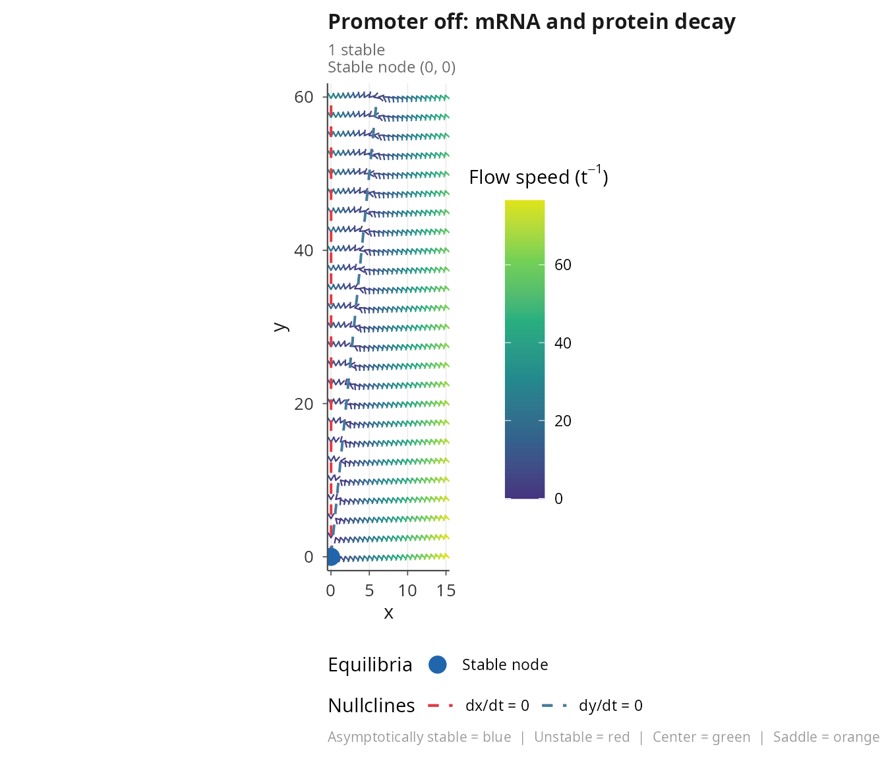

The switching trajectories, coloured by active regime with switch points
marked as filled circles, reveal the characteristic sawtooth dynamics:

``` r

plot(pdp16, type = "trajectories",
     title = "Telegraph model: switching trajectories")
#> Scale for fill is already present.
#> Adding another scale for fill, which will replace the existing scale.
```

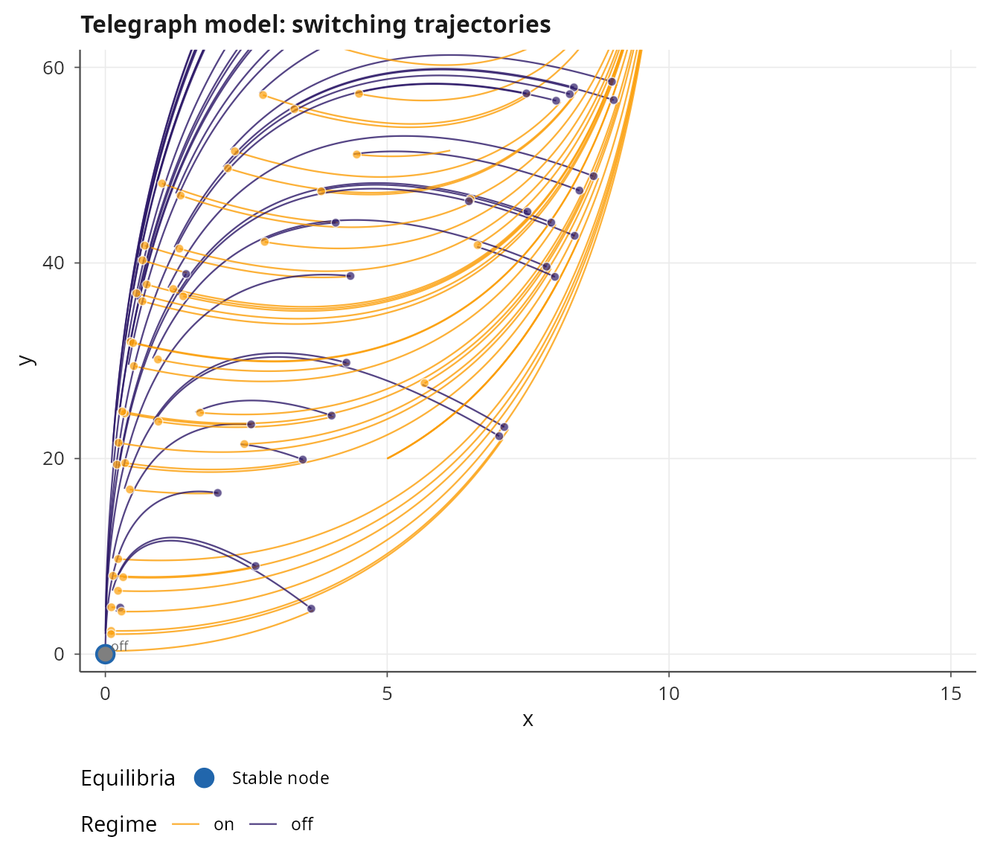

### Example 17: environmentally switching predator-prey (ecology)

A Lotka-Volterra predator-prey system whose prey growth rate switches
between a favorable and an adverse environmental regime, modelling the
effect of stochastic climate fluctuations [\[15\]](#ref15):

\\\text{favorable}: \quad \dot{N} = r\_\text{high} N\\\left(1 -
\frac{N}{K}\right) - aNP, \quad \dot{P} = bNP - dP;\\ \\\text{adverse}:
\quad \dot{N} = r\_\text{low} N\\\left(1 - \frac{N}{K}\right) - aNP,
\quad \dot{P} = bNP - dP.\\

The two regimes differ only in the prey growth rate (\\r\_\text{high}\\
vs \\r\_\text{low}\\), so the predator equation is identical. Each
regime has its own interior equilibrium; the favorable regime sustains
higher prey densities. Constant switching rates \\\mu\_{fa}\\ and
\\\mu\_{af}\\ produce a process that alternates between the two regimes.

``` r

env_switch <- model_spec(
    regimes = list(
        favorable = list(
            N ~ r_high * N * (1 - N / K) - a * N * P,
            P ~ b * N * P - d * P
        ),
        adverse   = list(
            N ~ r_low  * N * (1 - N / K) - a * N * P,
            P ~ b * N * P - d * P
        )
    ),
    transitions = list(
        list(from = "favorable", to = "adverse",
             rate = ~ mu_fa),
        list(from = "adverse", to = "favorable",
             rate = ~ mu_af)
    ),
    state_names = c("N", "P"),
    parms = list(r_high = 1.5, r_low = 0.3, K = 10,
                 a = 0.5, b = 0.3, d = 0.4,
                 mu_fa = 0.2, mu_af = 0.15),
    init  = c(N = 5, P = 2),
    initial_regime = "favorable"
)

pdp17 <- pdmp_portrait(env_switch,
    xlim = c(0, 12), ylim = c(0, 5),
    traj_length = 200, n_trajectories = 4)
#> ⚙ PDMP portrait: PDMP system (2 regimes)
#>   ¡ States: N, P
#>   ¡ Regimes: favorable, adverse
#> ⚙ Computing per-regime vector fields...
#> ⚙ Computing per-regime nullclines...
#> ⚙ Searching for per-regime equilibria...
#> ✔ Found 6 equilibria across all regimes.
#>   ¡ favorable: 3 (2 saddle, 1 stable focus)
#>   ¡ adverse: 3 (2 saddle, 1 stable focus)
#> ⚙ Simulating 4 switching trajectories...
#> ✔ 4 trajectories computed, 144 switch points detected.
#> ✔ PDMP portrait complete.

print(pdp17)
#> 
#> PDMP portrait
#> ──────────────────────────────────────── 
#> 
#> States: N, P 
#> Regimes: favorable, adverse 
#> Domain: [0.00, 12.00] x [0.00, 5.00] 
#> 
#> Per-regime components:
#>   Vector fields:  favorable (625 pts), adverse (625 pts) 
#>   Nullclines:     favorable (4 segments), adverse (3 segments) 
#>   Equilibria [favorable]: 3 (2 saddle, 1 stable focus)
#>   Equilibria [adverse]: 3 (2 saddle, 1 stable focus)
#>   Trajectories:  4 (80004 points, 144 switches)
summary(pdp17)
#> 
#> PDMP portrait
#> ──────────────────────────────────────── 
#> 
#> States: N, P 
#> Regimes: favorable, adverse 
#> Domain: [0.00, 12.00] x [0.00, 5.00] 
#> 
#> Per-regime components:
#>   Vector fields:  favorable (625 pts), adverse (625 pts) 
#>   Nullclines:     favorable (4 segments), adverse (3 segments) 
#>   Equilibria [favorable]: 3 (2 saddle, 1 stable focus)
#>   Equilibria [adverse]: 3 (2 saddle, 1 stable focus)
#>   Trajectories:  4 (80004 points, 144 switches)
#> 
#> Equilibrium details [favorable]:
#> ──────────────────────────────────────── 
#> 
#>   #1: saddle (unstable)
#>       (N, P) = (-0.000000, -0.000000)
#>       lambda_1 = 1.500000
#>       lambda_2 = -0.400000
#> 
#>   #2: stable focus (stable)
#>       (N, P) = (1.333333, 2.600000)
#>       lambda_1 = -0.100000 + 0.714143i
#>       lambda_2 = -0.100000 - 0.714143i
#> 
#>   #3: saddle (unstable)
#>       (N, P) = (10.000000, -0.000000)
#>       lambda_1 = 2.600000
#>       lambda_2 = -1.500000
#> 
#> Equilibrium details [adverse]:
#> ──────────────────────────────────────── 
#> 
#>   #1: saddle (unstable)
#>       (N, P) = (-0.000000, -0.000000)
#>       lambda_1 = 0.300000
#>       lambda_2 = -0.400000
#> 
#>   #2: stable focus (stable)
#>       (N, P) = (1.333333, 0.520000)
#>       lambda_1 = -0.020000 + 0.321870i
#>       lambda_2 = -0.020000 - 0.321870i
#> 
#>   #3: saddle (unstable)
#>       (N, P) = (10.000000, -0.000000)
#>       lambda_1 = 2.600000
#>       lambda_2 = -0.300000
#> 
#> Switching statistics:
#> ──────────────────────────────────────── 
#>   Total switches: 144 across 4 trajectories
#>   Switches per trajectory: mean = 36.0, range = [31, 42]
#>   Switches by target regime:
#>     adverse: 73 (50.7%)
#>     favorable: 71 (49.3%)
```

The `"combined"` plot type overlays both regimes on a single panel,
using colour to distinguish their respective nullclines and equilibria.
Trajectories are coloured by active regime:

``` r

plot(pdp17, type = "combined",
     title = "Environmental switching: overlaid regimes")
```

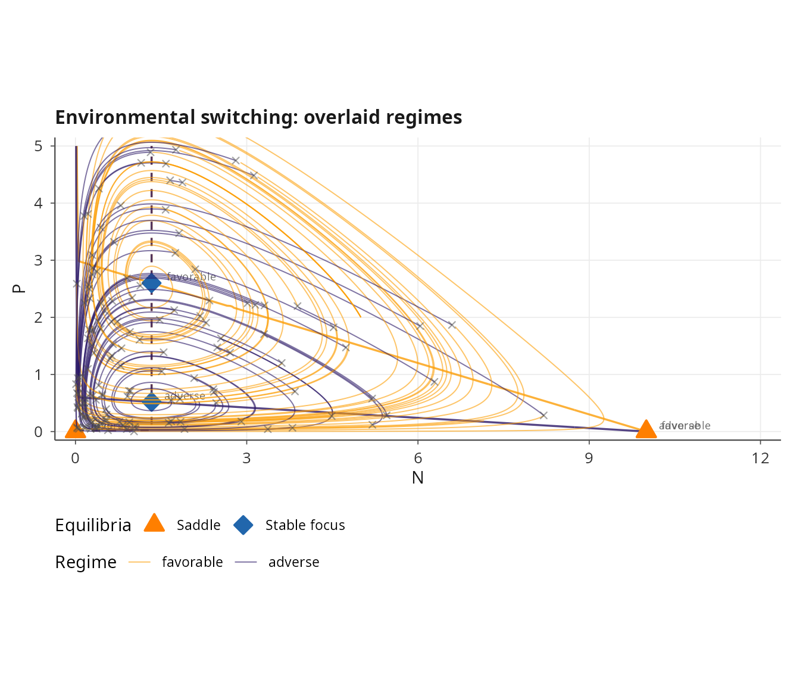

The trajectories alone, without the vector field clutter, reveal how the
system bounces between the two regime-specific attractors:

``` r

plot(pdp17, type = "trajectories",
     title = "Environmental switching: sample trajectories")
#> Scale for fill is already present.
#> Adding another scale for fill, which will replace the existing scale.
```

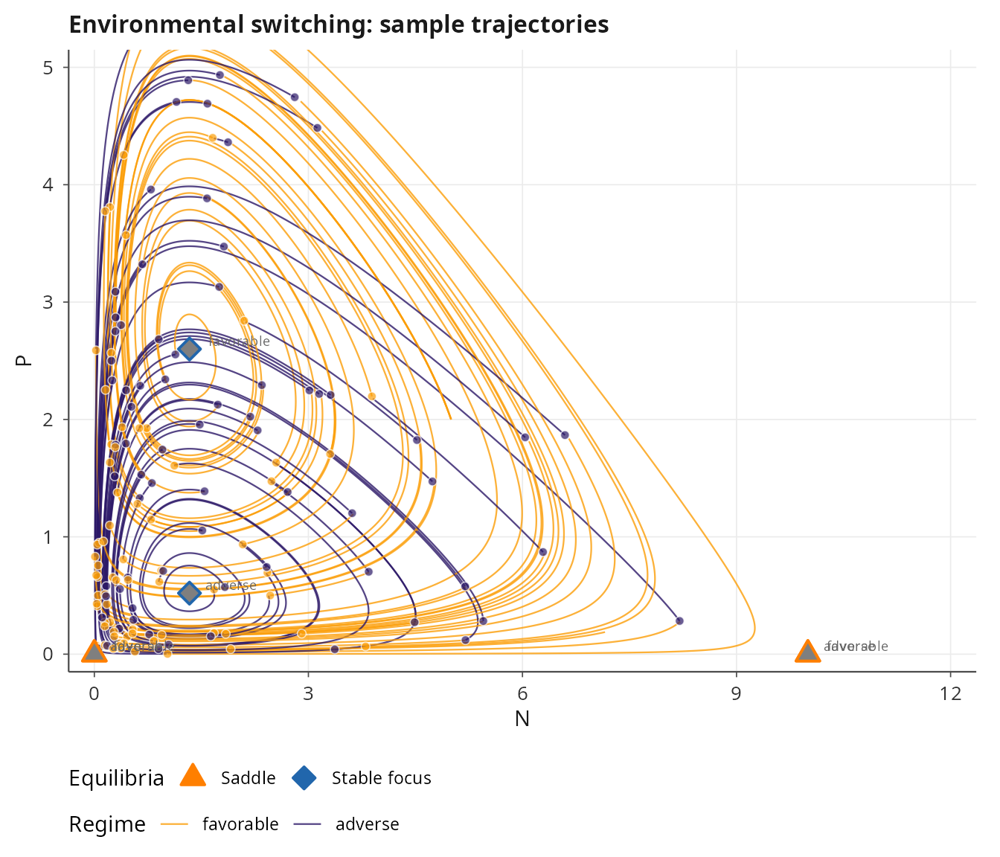

### Example 18: catalytic reaction with on/off kinetics (chemistry)

A two-variable chemical system where a catalyst switches between active
and inactive states. In the active regime, substrate \\S\\ is produced
via Michaelis-Menten kinetics and simultaneously degraded; enzyme \\E\\
binds reversibly to substrate. In the inactive regime, production ceases
and \\S\\ simply decays. The transition rate from active to inactive is
proportional to \\S\\ (product inhibition), so high substrate
concentrations accelerate inactivation.

``` r

catalytic <- model_spec(
    regimes = list(
        active   = list(
            S ~ v_max * S / (K_m + S) - k_deg * S,
            E ~ -k_bind * E * S + k_rel * (E_tot - E)
        ),
        inactive = list(
            S ~ -k_deg * S,
            E ~ k_rel * (E_tot - E)
        )
    ),
    transitions = list(
        list(from = "active",   to = "inactive",
             rate = ~ kappa_off * S),
        list(from = "inactive", to = "active",
             rate = ~ kappa_on)
    ),
    state_names = c("S", "E"),
    parms = list(v_max = 2.0, K_m = 0.5, k_deg = 0.3,
                 k_bind = 0.4, k_rel = 0.2, E_tot = 5.0,
                 kappa_off = 0.15, kappa_on = 0.5),
    init  = c(S = 2.0, E = 3.0),
    initial_regime = "active"
)

pdp18 <- pdmp_portrait(catalytic,
    xlim = c(0, 8), ylim = c(0, 6),
    traj_length = 80, n_trajectories = 3)
#> ⚙ PDMP portrait: PDMP system (2 regimes)
#>   ¡ States: S, E
#>   ¡ Regimes: active, inactive
#> ⚙ Computing per-regime vector fields...
#> ⚙ Computing per-regime nullclines...
#> ⚙ Searching for per-regime equilibria...
#> ✔ Found 3 equilibria across all regimes.
#>   ¡ active: 2 (1 saddle, 1 stable node)
#>   ¡ inactive: 1 (1 stable node)
#> ⚙ Simulating 3 switching trajectories...
#> ✔ 3 trajectories computed, 110 switch points detected.
#> ✔ PDMP portrait complete.

print(pdp18)
#> 
#> PDMP portrait
#> ──────────────────────────────────────── 
#> 
#> States: S, E 
#> Regimes: active, inactive 
#> Domain: [0.00, 8.00] x [0.00, 6.00] 
#> 
#> Per-regime components:
#>   Vector fields:  active (625 pts), inactive (625 pts) 
#>   Nullclines:     active (2 segments), inactive (2 segments) 
#>   Equilibria [active]: 2 (1 saddle, 1 stable node)
#>   Equilibria [inactive]: 1 (1 stable node)
#>   Trajectories:  3 (24003 points, 110 switches)
summary(pdp18)
#> 
#> PDMP portrait
#> ──────────────────────────────────────── 
#> 
#> States: S, E 
#> Regimes: active, inactive 
#> Domain: [0.00, 8.00] x [0.00, 6.00] 
#> 
#> Per-regime components:
#>   Vector fields:  active (625 pts), inactive (625 pts) 
#>   Nullclines:     active (2 segments), inactive (2 segments) 
#>   Equilibria [active]: 2 (1 saddle, 1 stable node)
#>   Equilibria [inactive]: 1 (1 stable node)
#>   Trajectories:  3 (24003 points, 110 switches)
#> 
#> Equilibrium details [active]:
#> ──────────────────────────────────────── 
#> 
#>   #1: stable node (stable)
#>       (S, E) = (6.166667, 0.375000)
#>       lambda_1 = -2.666667
#>       lambda_2 = -0.277500
#> 
#>   #2: saddle (unstable)
#>       (S, E) = (-0.000000, 5.000000)
#>       lambda_1 = 3.700000
#>       lambda_2 = -0.200000
#> 
#> Equilibrium details [inactive]:
#> ──────────────────────────────────────── 
#> 
#>   #1: stable node (stable)
#>       (S, E) = (0.000000, 5.000000)
#>       lambda_1 = -0.200000
#>       lambda_2 = -0.300000
#> 
#> Switching statistics:
#> ──────────────────────────────────────── 
#>   Total switches: 110 across 3 trajectories
#>   Switches per trajectory: mean = 36.7, range = [29, 44]
#>   Switches by target regime:
#>     active: 54 (49.1%)
#>     inactive: 56 (50.9%)
plot(pdp18, title = "Catalytic reaction: on/off switching")
```

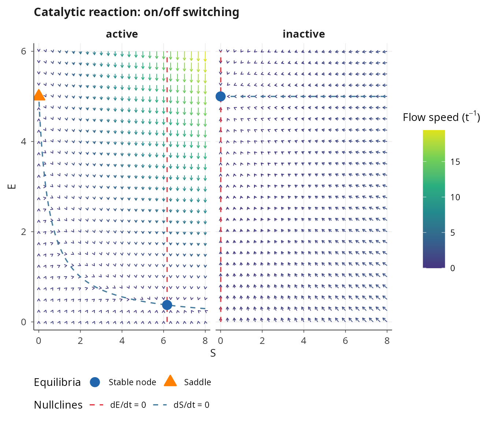

The individual regime portraits provide contrasting pictures. The active
regime sustains a nontrivial steady state:

``` r

plot(pdp18, type = "regime_active",
     title = "Active catalyst: Michaelis-Menten production")
```

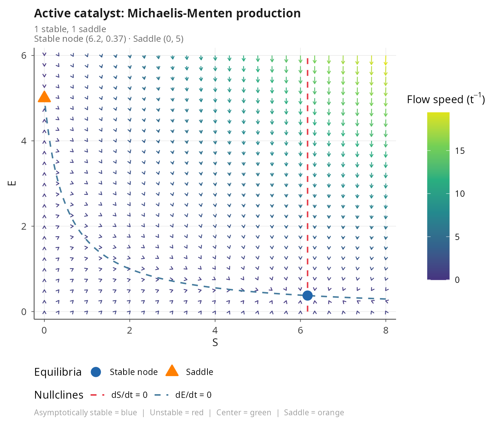

The inactive regime shows purely convergent dynamics toward the
substrate-free state:

``` r

plot(pdp18, type = "regime_inactive",
     title = "Inactive catalyst: substrate decay")
```

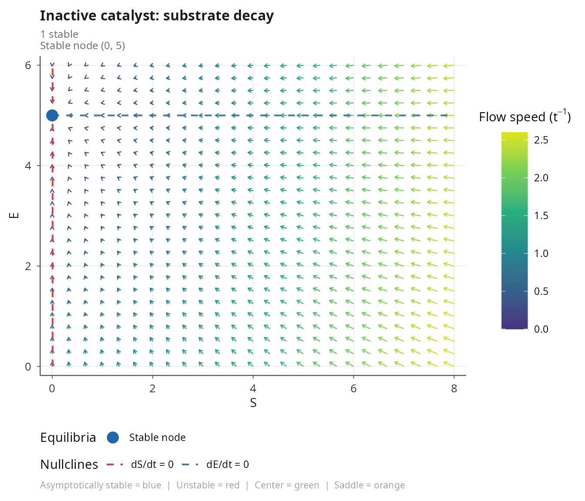

The [`summary()`](https://rdrr.io/r/base/summary.html) output includes
switching statistics: total switch count, mean switches per trajectory,
and the distribution of switches by target regime. The state-dependent
rate \\\kappa\_\text{off} \cdot S\\ means that periods of active
production are shorter when substrate accumulates to high levels,
creating a self-regulating feedback loop that operates through the
stochastic switching mechanism rather than through the deterministic
dynamics.

## References

**\[1\]** Strogatz, S. H. (2015). *Nonlinear dynamics and chaos: with
applications to physics, biology, chemistry, and engineering* (2nd ed.).
Westview Press. ISBN: 978-0-8133-4910-7.

**\[2\]** Hartman, P. (1960). A lemma in the theory of structural
stability of differential equations. *Proceedings of the American
Mathematical Society*, 11(4), 610–620.
[doi:10.1090/S0002-9939-1960-0121542-7](https://doi.org/10.1090/S0002-9939-1960-0121542-7).

**\[3\]** Alligood, K. T., Sauer, T. D., & Yorke, J. A. (1996). *Chaos:
an introduction to dynamical systems*. Springer. ISBN:
978-0-387-94677-1.

**\[4\]** Hénon, M. (1976). A two-dimensional mapping with a strange
attractor. *Communications in Mathematical Physics*, 50(1), 69–77.
[doi:10.1007/BF01608556](https://doi.org/10.1007/BF01608556).

**\[5\]** Nicholson, A. J., & Bailey, V. A. (1935). The balance of
animal populations. Part I. *Proceedings of the Zoological Society of
London*, 105(3), 551–598.
[doi:10.1111/j.1096-3642.1935.tb01680.x](https://doi.org/10.1111/j.1096-3642.1935.tb01680.x).

**\[6\]** Risken, H. (1996). *The Fokker-Planck equation: methods of
solution and applications* (2nd ed.). Springer. ISBN: 978-3-540-61530-9.

**\[7\]** Gardner, T. S., Cantor, C. R., & Collins, J. J. (2000).
Construction of a genetic toggle switch in *Escherichia coli*. *Nature*,
403(6767), 339–342.
[doi:10.1038/35002131](https://doi.org/10.1038/35002131).

**\[8\]** van der Pol, B. (1926). On relaxation-oscillations. *The
London, Edinburgh, and Dublin Philosophical Magazine and Journal of
Science*, 2(11), 978–992.
[doi:10.1080/14786442608564127](https://doi.org/10.1080/14786442608564127).

**\[9\]** Erneux, T. (2009). *Applied delay differential equations*.
Springer. ISBN: 978-0-387-74371-4.

**\[10\]** Breda, D., Maset, S., & Vermiglio, R. (2005). Pseudospectral
differencing methods for characteristic roots of delay differential
equations. *SIAM Journal on Scientific Computing*, 27(2), 482–495.
[doi:10.1137/030601600](https://doi.org/10.1137/030601600).

**\[11\]** Hutchinson, G. E. (1948). Circular causal systems in ecology.
*Annals of the New York Academy of Sciences*, 50(4), 221–246.
[doi:10.1111/j.1749-6632.1948.tb39854.x](https://doi.org/10.1111/j.1749-6632.1948.tb39854.x).

**\[12\]** Mackey, M. C., & Glass, L. (1977). Oscillation and chaos in
physiological control systems. *Science*, 197(4300), 287–289.
[doi:10.1126/science.267326](https://doi.org/10.1126/science.267326).

**\[13\]** Wangersky, P. J., & Cunningham, W. J. (1957). Time lag in
prey-predator population models. *Ecology*, 38(1), 136–139.
[doi:10.2307/1932137](https://doi.org/10.2307/1932137).

**\[14\]** Davis, M. H. A. (1984). Piecewise-deterministic Markov
processes: a general class of non-diffusion stochastic models. *Journal
of the Royal Statistical Society: Series B*, 46(3), 353–388.
[doi:10.1111/j.2517-6161.1984.tb01308.x](https://doi.org/10.1111/j.2517-6161.1984.tb01308.x).

**\[15\]** Benaïm, M., Le Borgne, S., Malrieu, F., & Zitt, P.-A. (2015).
Qualitative properties of certain piecewise deterministic Markov
processes. *Annales de l’Institut Henri Poincaré, Probabilités et
Statistiques*, 51(3), 1040–1075.
[doi:10.1214/14-AIHP619](https://doi.org/10.1214/14-AIHP619).

**\[16\]** Raj, A., Peskin, C. S., Tranchina, D., Vargas, D. Y., &
Tyagi, S. (2006). Stochastic mRNA synthesis in mammalian cells. *PLOS
Biology*, 4(10), e309.
[doi:10.1371/journal.pbio.0040309](https://doi.org/10.1371/journal.pbio.0040309).

**\[17\]** Guckenheimer, J., & Holmes, P. (1983). *Nonlinear
oscillations, dynamical systems, and bifurcations of vector fields*.
Springer. ISBN: 978-0-387-90819-9.

**\[18\]** Teschl, G. (2012). *Ordinary differential equations and
dynamical systems*. American Mathematical Society. ISBN:
978-0-8218-8328-0.

**\[19\]** Kuznetsov, Y. A. (2004). *Elements of applied bifurcation
theory* (3rd ed.). Springer. ISBN: 978-0-387-21906-6.

**\[20\]** Marsden, J. E., & McCracken, M. (1976). *The Hopf bifurcation
and its applications*. Springer. ISBN: 978-0-387-90200-5.
