# Stochastic differential equations and noise processes

## SDEs in janos

A stochastic differential equation in Ito form \\dX = f(X) \\ dt + g(X)
\\ dW\\ couples a deterministic drift \\f\\ with a state-dependent
diffusion \\g\\ driven by a Wiener process \\W\\. janos specifies SDEs
by providing both `rhs` (the drift formulas) and `diffusion` (the
diffusion coefficient formulas) in
[`model_spec()`](https://robustecologies.github.io/janos/reference/model_spec.md),
then compiles both components to C++ for efficient simulation. Two
numerical schemes are available: Euler-Maruyama (strong order 0.5) and
Milstein (strong order 1.0). Beyond standard Gaussian noise, janos
supports four structured noise processes, correlated Wiener processes,
Levy alpha-stable increments, colored \\1/f^\beta\\ noise, and
fractional Brownian motion, as well as Poisson-driven jump-diffusion
channels.

``` r

library(janos)
```

## Euler-Maruyama scheme

The Euler-Maruyama method advances the SDE by one time step as
\\X\_{n+1} = X_n + f(X_n) \Delta t + g(X_n) \sqrt{\Delta t} \\ Z_n\\
where \\Z_n \sim N(0, 1)\\. This is the stochastic analog of the Euler
method for ODEs and converges in the strong sense with order 0.5.
Despite its simplicity, it is the default choice for many SDE problems
and the only option for non-Gaussian noise.

Consider geometric Brownian motion (GBM), which models multiplicative
noise on a positive quantity:

\\dS = \mu S \\ dt + \sigma S \\ dW\\

``` r

gbm <- model_spec(
    rhs = list(S ~ mu * S),
    diffusion = list(S ~ sigma * S),
    state_names = "S",
    parms = list(mu = 0.05, sigma = 0.2),
    init  = c(S = 100)
)

result_em <- dyn_sim(gbm, t_max = 5, solver = solver_euler_maruyama(dt = 0.001),
                     discard_transient = 0)
#> ⚙ Simulating SDE system (compiled EULER_MARUYAMA)
#>   ¡ dt = 0.001, seed = 42
#>   ¡ Duration: 5, discarding 0 transient
#>   ⏱ Elapsed: 0.01 seconds
#> ✔ Simulation complete: 5001 time points, 5001 on attractor
print(result_em)
#> 
#> Dynamical system simulation 
#> --------------------------- 
#> 
#> System type: autonomous
#> 
#> Solver: EULER_MARUYAMA (dt = 0.0010, seed = 42)
#> Simulation: t_max = 5.0, discarding 0.0 transient
#> Attractor points: 5001
#> 
#> State variables on attractor (mean ± sd):
#>   S:           167.9757 ± 40.7991
plot(result_em, title = "Geometric Brownian motion (Euler-Maruyama)")
```

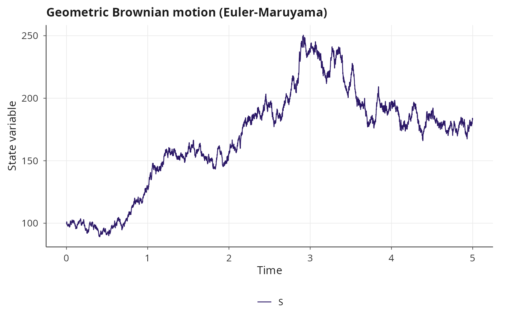

## Milstein scheme

The Milstein method improves the strong convergence order to 1.0 by
including the Ito-Taylor correction term involving \\g'(X) g(X)\\:

\\X\_{n+1} = X_n + f(X_n) \Delta t + g(X_n) \sqrt{\Delta t} \\ Z_n +
\tfrac{1}{2} g(X_n) g'(X_n) \left(Z_n^2 - 1\right) \Delta t\\

janos computes \\g'(X)\\ via central finite differences with a
configurable perturbation `dg_eps`, avoiding the need for symbolic
differentiation of the diffusion coefficient.

``` r

result_mil <- dyn_sim(gbm, t_max = 5,
                      solver = solver_milstein(dt = 0.001, dg_eps = 1e-6),
                      discard_transient = 0)
#> ⚙ Simulating SDE system (compiled MILSTEIN)
#>   ¡ dt = 0.001, seed = 42
#>   ¡ Duration: 5, discarding 0 transient
#>   ⏱ Elapsed: 0.01 seconds
#> ✔ Simulation complete: 5001 time points, 5001 on attractor
plot(result_mil, title = "Geometric Brownian motion (Milstein)")
```

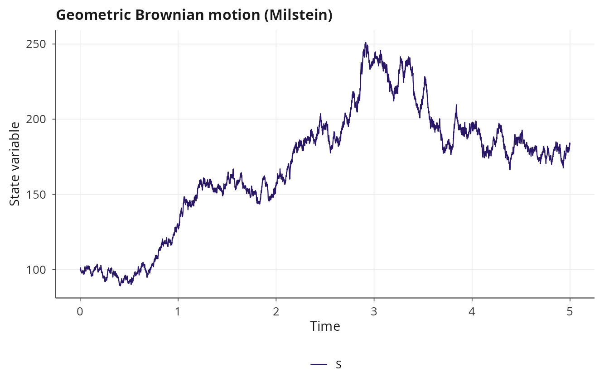

For GBM the analytical solution is known, so the Milstein scheme’s
improved accuracy can be verified directly.

## Ornstein-Uhlenbeck process

The Ornstein-Uhlenbeck (OU) process models mean-reverting noise, widely
used in physics and finance. The drift pulls the state back toward a
long-run mean \\\theta\\ at rate \\\kappa\\, while the diffusion
coefficient is constant:

\\dX = \kappa (\theta - X) \\ dt + \sigma \\ dW\\

``` r

ou <- model_spec(
    rhs = list(X ~ kappa * (theta - X)),
    diffusion = list(X ~ sigma),
    state_names = "X",
    parms = list(kappa = 2.0, theta = 0.0, sigma = 1.0),
    init  = c(X = 5.0)
)

result_ou <- dyn_sim(ou, t_max = 10, solver = solver_euler_maruyama(dt = 0.01),
                     discard_transient = 0)
#> ⚙ Simulating SDE system (compiled EULER_MARUYAMA)
#>   ¡ dt = 0.01, seed = 42
#>   ¡ Duration: 10, discarding 0 transient
#>   ⏱ Elapsed: 0.01 seconds
#> ✔ Simulation complete: 1001 time points, 1001 on attractor
plot(result_ou, title = "Ornstein-Uhlenbeck process")
```

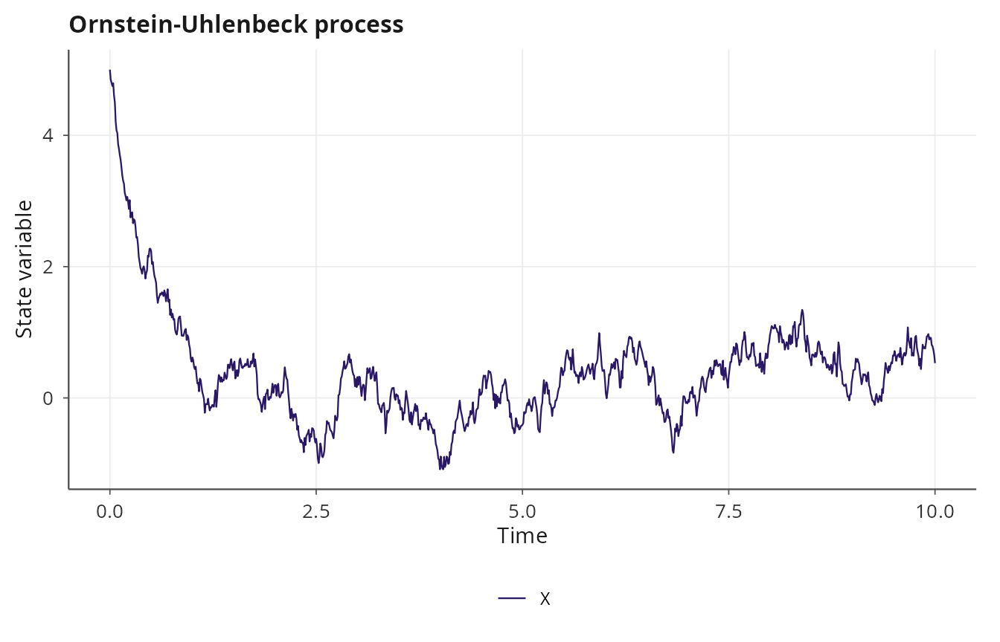

## Correlated noise

When multiple state variables share noise sources (e.g., environmental
fluctuations affecting several species simultaneously), the Wiener
increments are correlated with a user-specified covariance matrix
\\\Sigma\\. The
[`correlated_noise()`](https://robustecologies.github.io/janos/reference/correlated_noise.md)
function computes the Cholesky factor \\L\\ such that \\\Sigma = L
L^T\\, and the SDE integrator generates correlated increments as \\dW =
L \\ dZ\\ where \\dZ\\ is a vector of independent standard normals.

``` r

Sigma <- matrix(c(1.0, 0.8, 0.8, 1.0), nrow = 2)

coupled_ou <- model_spec(
    rhs = list(x ~ -a * x, y ~ -b * y),
    diffusion = list(x ~ sigma, y ~ sigma),
    noise = correlated_noise(Sigma),
    state_names = c("x", "y"),
    parms = list(a = 1.0, b = 2.0, sigma = 0.5),
    init  = c(x = 1.0, y = 1.0)
)

result_corr <- dyn_sim(coupled_ou, t_max = 20,
                       solver = solver_euler_maruyama(dt = 0.01),
                       discard_transient = 0)
#> ⚙ Simulating SDE system (compiled EULER_MARUYAMA)
#>   ¡ dt = 0.01, seed = 42
#>   ¡ Duration: 20, discarding 0 transient
#>   ⏱ Elapsed: 0.01 seconds
#> ✔ Simulation complete: 2001 time points, 2001 on attractor
plot(result_corr, title = "Coupled OU with correlated noise")
```

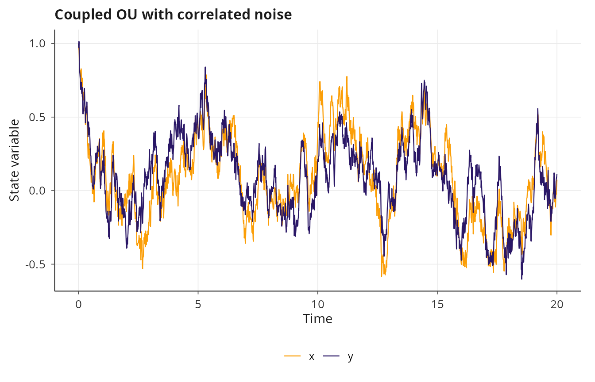

``` r

plot(result_corr, type = "phase", title = "Coupled OU with correlated noise")
```

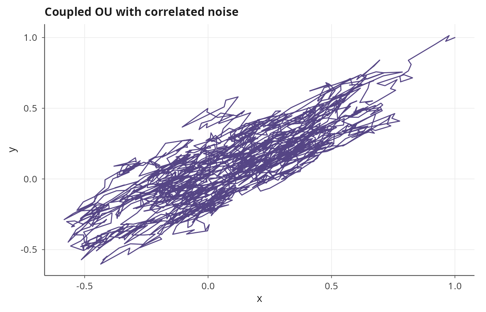

The correlation is visible in the phase portrait: the two processes tend
to fluctuate together when \\\Sigma\_{12}\\ is positive, and in opposite
directions when it is negative.

## Levy alpha-stable noise

Gaussian noise has finite variance and exponentially decaying tails.
Many real-world systems exhibit heavy-tailed fluctuations with
occasional extreme jumps, which are better captured by Levy alpha-stable
distributions. The
[`levy_noise()`](https://robustecologies.github.io/janos/reference/levy_noise.md)
specification replaces the Wiener increments with alpha-stable variates
generated by the Chambers-Mallows-Stuck (CMS) algorithm [\[1\]](#ref1).
The stability index \\\alpha \in (0, 2\]\\ controls the tail heaviness
(\\\alpha = 2\\ recovers Gaussian noise), while the skewness parameter
\\\beta \in \[-1, 1\]\\ controls asymmetry.

The scaling of increments changes from \\\sqrt{\Delta t}\\ (Gaussian) to
\\(\Delta t)^{1/\alpha}\\ (alpha-stable), reflecting the self-similarity
of stable processes.

``` r

levy_ou <- model_spec(
    rhs = list(X ~ kappa * (theta - X)),
    diffusion = list(X ~ sigma),
    noise = levy_noise(alpha = 1.5, beta = 0),
    state_names = "X",
    parms = list(kappa = 2.0, theta = 0.0, sigma = 0.5),
    init  = c(X = 0.0)
)

result_levy <- dyn_sim(levy_ou, t_max = 50,
                       solver = solver_euler_maruyama(dt = 0.01),
                       discard_transient = 0)
#> ⚙ Simulating SDE system (compiled EULER_MARUYAMA)
#>   ¡ dt = 0.01, seed = 42
#>   ¡ Duration: 50, discarding 0 transient
#>   ⏱ Elapsed: 0.01 seconds
#> ✔ Simulation complete: 5001 time points, 5001 on attractor
plot(result_levy, title = "Levy-driven Ornstein-Uhlenbeck")
```

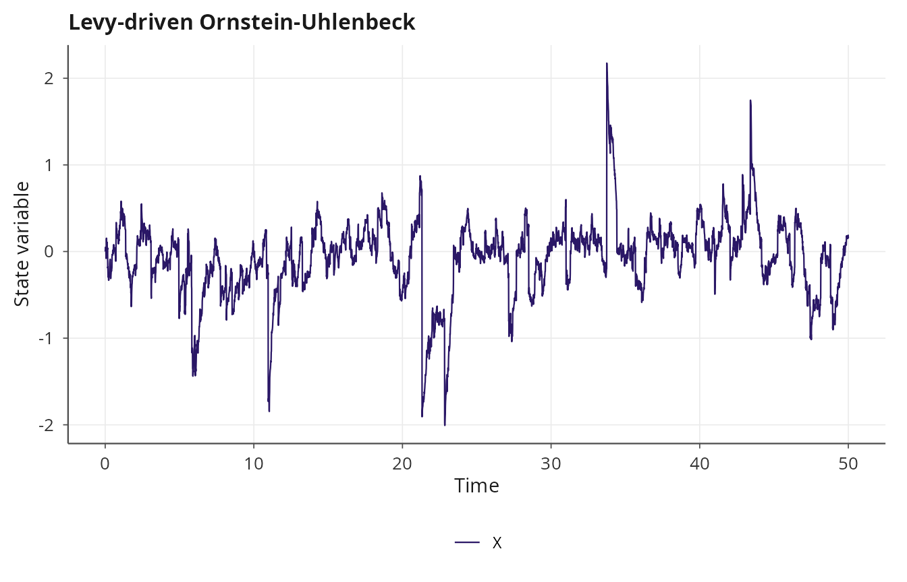

The trajectory will show occasional large excursions that would be
essentially impossible under Gaussian noise, which is precisely the
behavior Levy noise is designed to capture.

### Composing correlated and Levy noise

Correlated noise and Levy noise can be composed: the Cholesky rotation
is applied to the alpha-stable increments instead of Gaussian
increments. This models systems where multiple state variables share
heavy-tailed noise sources with known correlation structure.

``` r

Sigma2 <- matrix(c(1.0, 0.6, 0.6, 1.0), nrow = 2)

levy_coupled <- model_spec(
    rhs = list(x ~ -a * x, y ~ -b * y),
    diffusion = list(x ~ sigma, y ~ sigma),
    noise = list(correlated_noise(Sigma2), levy_noise(alpha = 1.7, beta = 0)),
    state_names = c("x", "y"),
    parms = list(a = 1.0, b = 1.5, sigma = 0.3),
    init  = c(x = 0.0, y = 0.0)
)

result_cl <- dyn_sim(levy_coupled, t_max = 30,
                     solver = solver_euler_maruyama(dt = 0.01),
                     discard_transient = 0)
#> ⚙ Simulating SDE system (compiled EULER_MARUYAMA)
#>   ¡ dt = 0.01, seed = 42
#>   ¡ Duration: 30, discarding 0 transient
#>   ⏱ Elapsed: 0.01 seconds
#> ✔ Simulation complete: 3001 time points, 3001 on attractor
plot(result_cl, type = "phase", title = "Correlated Levy-driven system")
```

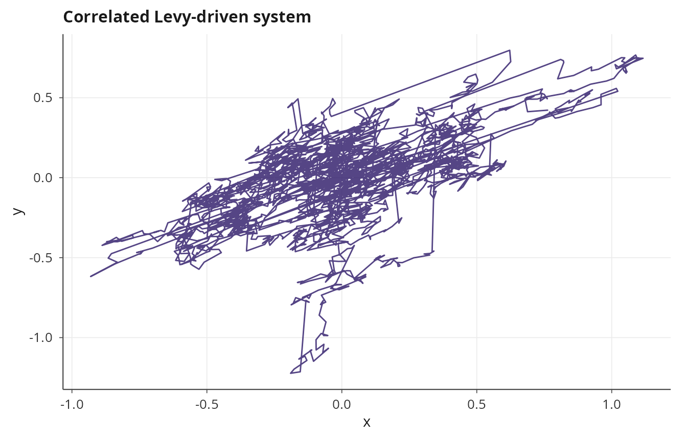

## Colored noise

Environmental fluctuations often exhibit temporal autocorrelation with a
specific spectral structure. Colored noise with power spectral density
\\S(f) \propto 1/f^\beta\\ captures this: \\\beta = 0\\ is white noise,
\\\beta = 1\\ is pink (flicker) noise, and \\\beta = 2\\ is Brownian
(red) noise. The
[`colored_noise()`](https://robustecologies.github.io/janos/reference/colored_noise.md)
specification generates noise increments via FFT spectral synthesis,
producing a pre-computed noise matrix that is passed into the C++
integrator.

``` r

pink_ou <- model_spec(
    rhs = list(X ~ kappa * (theta - X)),
    diffusion = list(X ~ sigma),
    noise = colored_noise(beta = 1.0, amplitude = 1.0),
    state_names = "X",
    parms = list(kappa = 1.0, theta = 0.0, sigma = 0.5),
    init  = c(X = 0.0)
)

result_pink <- dyn_sim(pink_ou, t_max = 50,
                       solver = solver_euler_maruyama(dt = 0.01),
                       discard_transient = 0)
#> ⚙ Simulating SDE system (compiled EULER_MARUYAMA)
#>   ¡ dt = 0.01, seed = 42
#>   ¡ Duration: 50, discarding 0 transient
#>   ⏱ Elapsed: 0.01 seconds
#> ✔ Simulation complete: 5001 time points, 5001 on attractor
plot(result_pink, title = "OU process with pink noise")
```

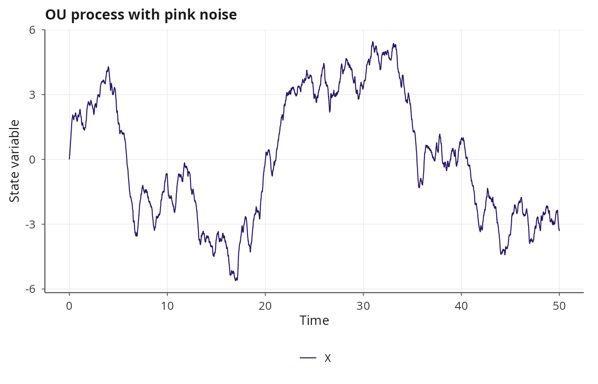

Because the noise is pre-generated in R before being passed to C++, the
Milstein scheme is not available for colored noise (it would require the
derivative of the pre-generated noise path, which is not meaningful).

## Fractional Brownian motion

Fractional Brownian motion (fBm) is a Gaussian process with stationary
increments whose Hurst parameter \\H \in (0, 1)\\ controls the degree of
long-range dependence. When \\H = 0.5\\, fBm reduces to standard
Brownian motion (independent increments). When \\H \> 0.5\\ the
increments are positively correlated (persistent, long memory), and when
\\H \< 0.5\\ they are negatively correlated (anti-persistent, rough
paths). The
[`fbm_noise()`](https://robustecologies.github.io/janos/reference/fbm_noise.md)
specification generates fBm sample paths via the Wood-Chan circulant
embedding method [\[2\]](#ref2), which runs in \\O(n \log n)\\ time,
with a Hosking fallback [\[3\]](#ref3) for cases where the circulant
matrix is not positive definite.

``` r

fbm_ou <- model_spec(
    rhs = list(X ~ kappa * (theta - X)),
    diffusion = list(X ~ sigma),
    noise = fbm_noise(H = 0.75, method = "circulant"),
    state_names = "X",
    parms = list(kappa = 1.0, theta = 0.0, sigma = 0.5),
    init  = c(X = 0.0)
)

result_fbm <- dyn_sim(fbm_ou, t_max = 50,
                      solver = solver_euler_maruyama(dt = 0.01),
                      discard_transient = 0)
#> ⚙ Simulating SDE system (compiled EULER_MARUYAMA)
#>   ¡ dt = 0.01, seed = 42
#>   ¡ Duration: 50, discarding 0 transient
#>   ⏱ Elapsed: 0.01 seconds
#> ✔ Simulation complete: 5001 time points, 5001 on attractor
plot(result_fbm, title = "OU process with fractional Brownian motion")
```

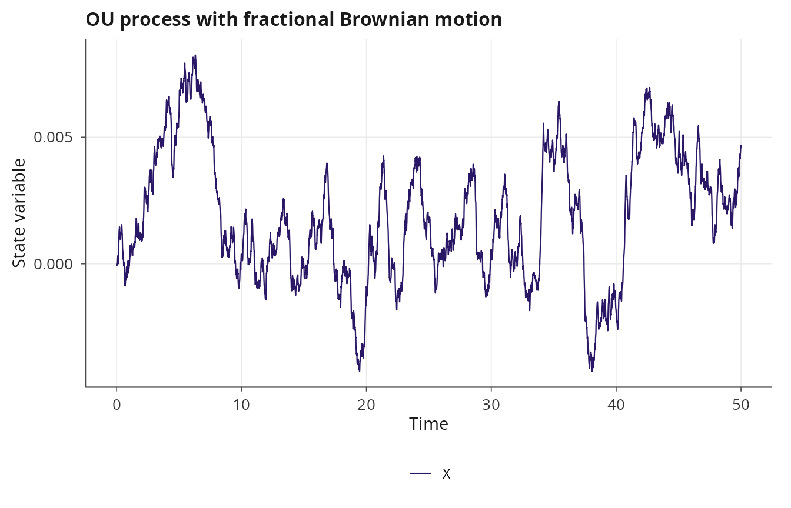

The persistent memory of fBm with \\H \> 0.5\\ produces visibly smoother
trajectories than standard Brownian motion, with long-term trends that
can mimic regime-like behavior.

## Jump-diffusion

Jump-diffusion processes extend SDEs with Poisson-driven discontinuous
jumps:

\\dX = f(X) \\ dt + g(X) \\ dW + h(X) \\ dN\\

where \\N\\ is a Poisson process with state-dependent intensity and
\\h(X)\\ determines the jump size. janos supports both deterministic and
stochastic jump sizes, the latter drawn from normal, exponential, or
uniform distributions. The `jumps` argument in
[`model_spec()`](https://robustecologies.github.io/janos/reference/model_spec.md)
specifies the jump channels using formula syntax.

The Merton jump-diffusion model for asset prices adds log-normally
distributed jumps to GBM:

``` r

merton <- model_spec(
    rhs = list(S ~ mu * S),
    diffusion = list(S ~ sigma * S),
    jumps = list(
        S ~ list(
            intensity = ~ lambda,
            size_distribution = "normal",
            size_mean = ~ jump_mean * S,
            size_sd   = ~ jump_sd * S
        )
    ),
    state_names = "S",
    parms = list(mu = 0.05, sigma = 0.2, lambda = 0.5,
                 jump_mean = -0.02, jump_sd = 0.1),
    init  = c(S = 100)
)

result_jd <- dyn_sim(merton, t_max = 5,
                     solver = solver_jump_diffusion(dt = 0.001, seed = 42),
                     discard_transient = 0)
#> ⚙ Simulating Jump-diffusion system (jump-diffusion, Euler-Maruyama)
#>   ¡ Jump channels: 1
#>   ¡ dt = 0.001, seed = 42
#>   ¡ Duration: 5, discarding 0 transient
#>   ⏱ Elapsed: 0.01 seconds
#> ✔ Simulation complete: 5001 time points, 5001 on attractor
print(result_jd)
#> 
#> Dynamical system simulation 
#> --------------------------- 
#> 
#> System type: autonomous
#> 
#> Solver: JUMP_DIFFUSION (dt = 0.0010, seed = 42)
#>   Total jumps: 2
#> Simulation: t_max = 5.0, discarding 0.0 transient
#> Attractor points: 5001
#> 
#> State variables on attractor (mean ± sd):
#>   S:           125.6880 ± 17.4767
plot(result_jd, title = "Merton jump-diffusion")
```

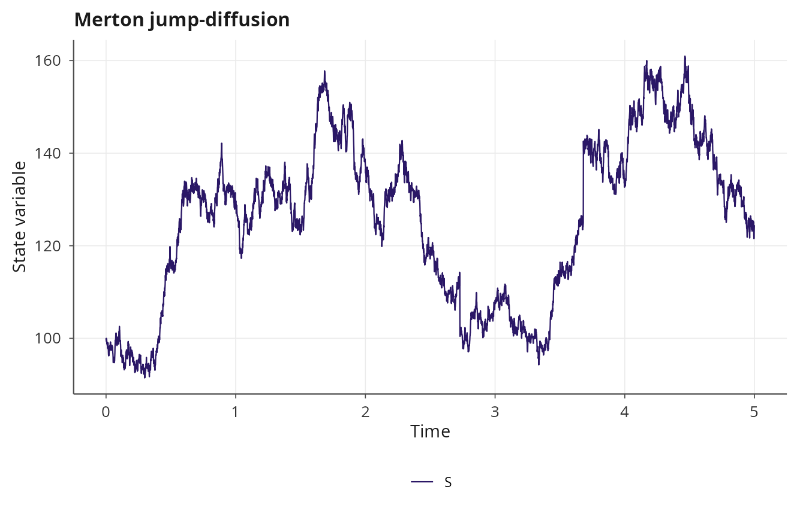

### Deterministic jump sizes

For systems where the jump magnitude is a known function of the current
state (e.g., instantaneous dose delivery in pharmacokinetics), use a
deterministic jump specification:

``` r

pk <- model_spec(
    rhs = list(C ~ -k * C),
    diffusion = list(C ~ sigma),
    jumps = list(
        C ~ list(
            intensity = ~ lambda,
            size = ~ dose
        )
    ),
    state_names = "C",
    parms = list(k = 0.1, sigma = 0.05, lambda = 0.2, dose = 10),
    init  = c(C = 0)
)

result_pk <- dyn_sim(pk, t_max = 100,
                     solver = solver_jump_diffusion(dt = 0.01, seed = 42),
                     discard_transient = 0)
#> ⚙ Simulating Jump-diffusion system (jump-diffusion, Euler-Maruyama)
#>   ¡ Jump channels: 1
#>   ¡ dt = 0.01, seed = 42
#>   ¡ Duration: 100, discarding 0 transient
#>   ⏱ Elapsed: 0.01 seconds
#> ✔ Simulation complete: 10001 time points, 10001 on attractor
plot(result_pk, title = "Pharmacokinetic dosing model")
```

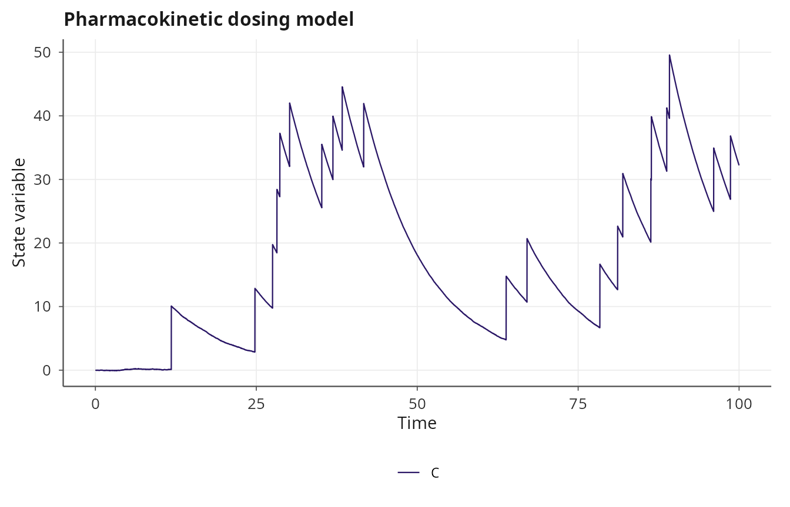

## Noise composability rules

Not all noise types can be combined. The composability rules are:

- **Correlated + Levy**: allowed. The Cholesky rotation is applied to
  the alpha-stable increments.
- **fBm alone**: allowed. Cannot be composed with any other noise type.
- **Colored alone**: allowed. Cannot be composed with any other noise
  type.
- **Correlated + fBm** or **Correlated + colored**: not allowed. These
  combinations would require generating correlated non-Gaussian
  non-independent increments, which is not supported.
- **Milstein scheme**: only available for standard Gaussian noise (with
  or without correlation). Blocked for Levy, fBm, and colored noise
  because the Ito-Taylor correction assumes Gaussian increments.

The `resolve_noise_spec()` function validates these constraints at model
specification time, before any compilation occurs.

## References

**\[1\]** Chambers, J. M., Mallows, C. L., & Stuck, B. W. (1976). A
method for simulating stable random variables. *Journal of the American
Statistical Association*, 71(354), 340-344.
[doi:10.1080/01621459.1976.10480344](https://doi.org/10.1080/01621459.1976.10480344)

**\[2\]** Wood, A. T. A., & Chan, G. (1994). Simulation of stationary
Gaussian processes in \\\[0, 1\]^d\\. *Journal of Computational and
Graphical Statistics*, 3(4), 409-432.
[doi:10.2307/1390903](https://doi.org/10.2307/1390903)

**\[3\]** Hosking, J. R. M. (1984). Modeling persistence in hydrological
time series using fractional differencing. *Water Resources Research*,
20(12), 1898-1908.
[doi:10.1029/WR020i012p01898](https://doi.org/10.1029/WR020i012p01898)
