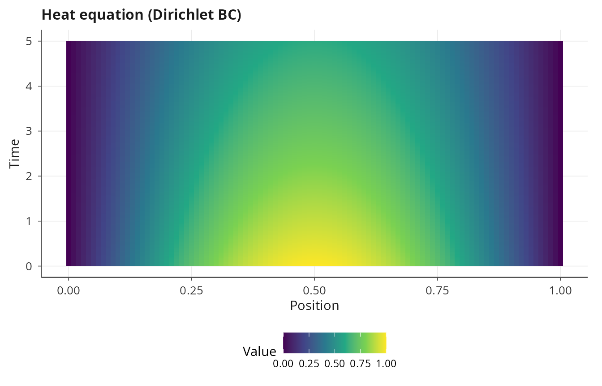
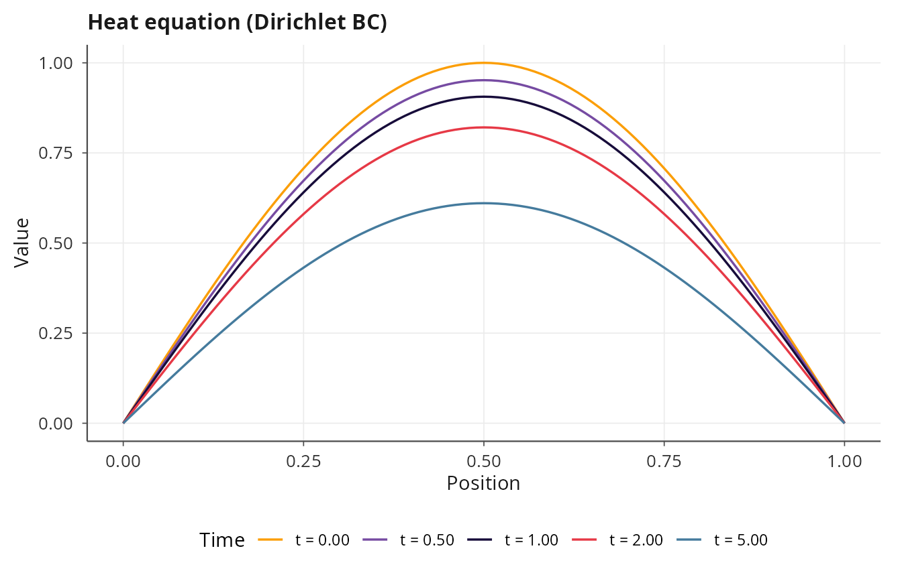
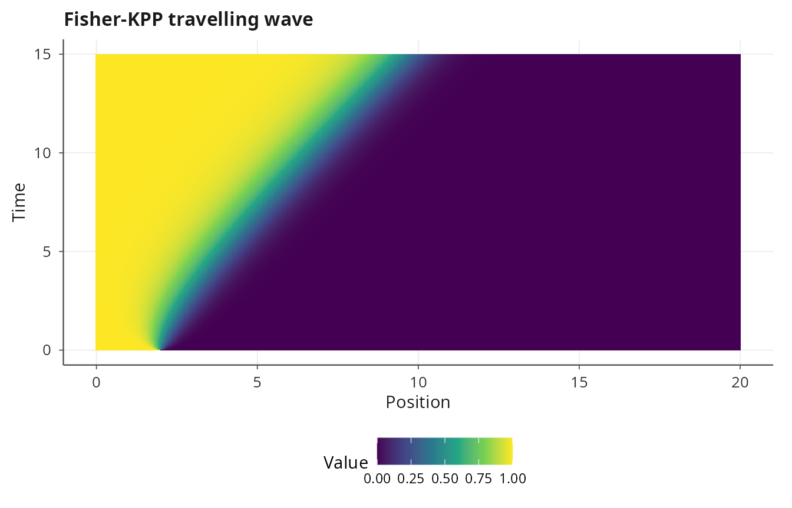
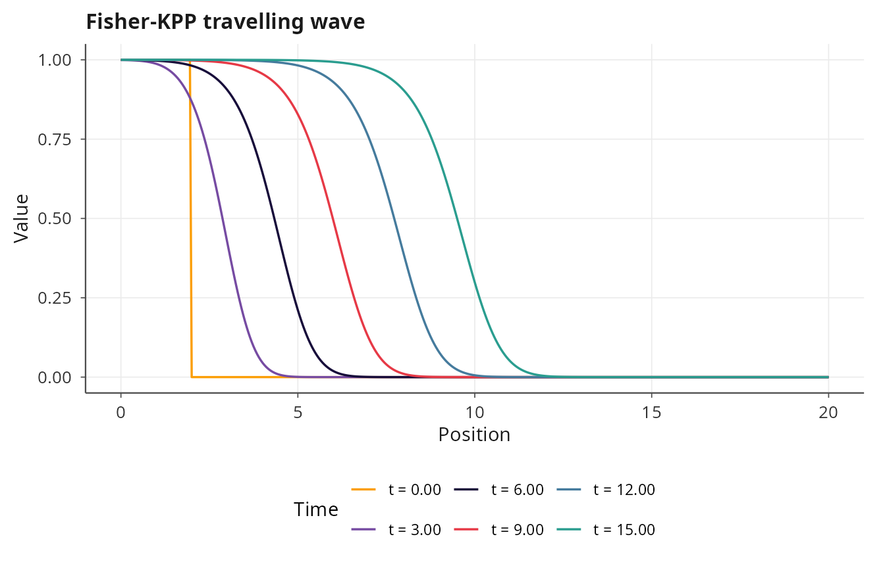
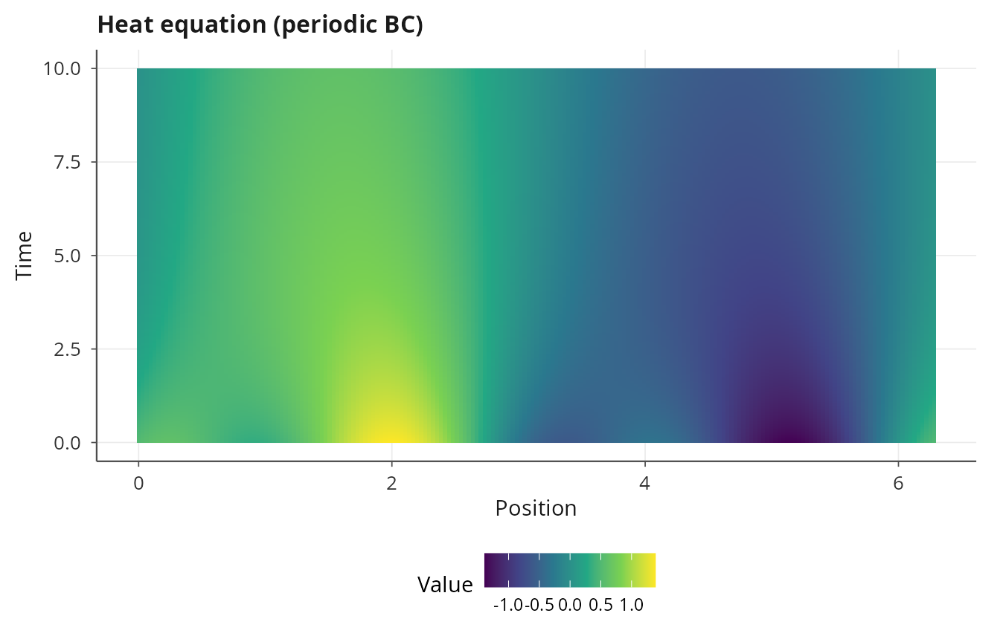
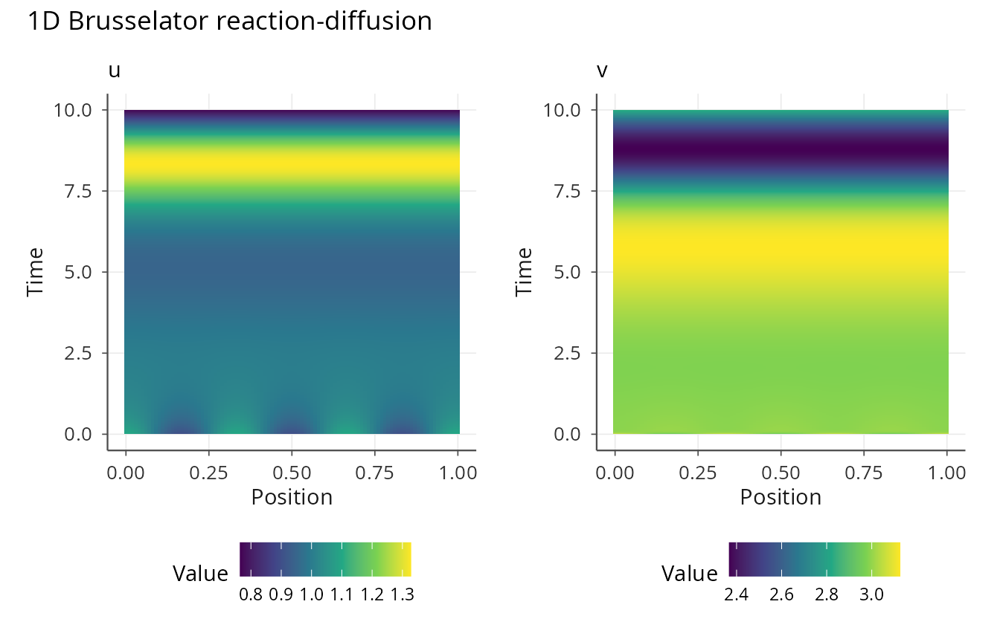
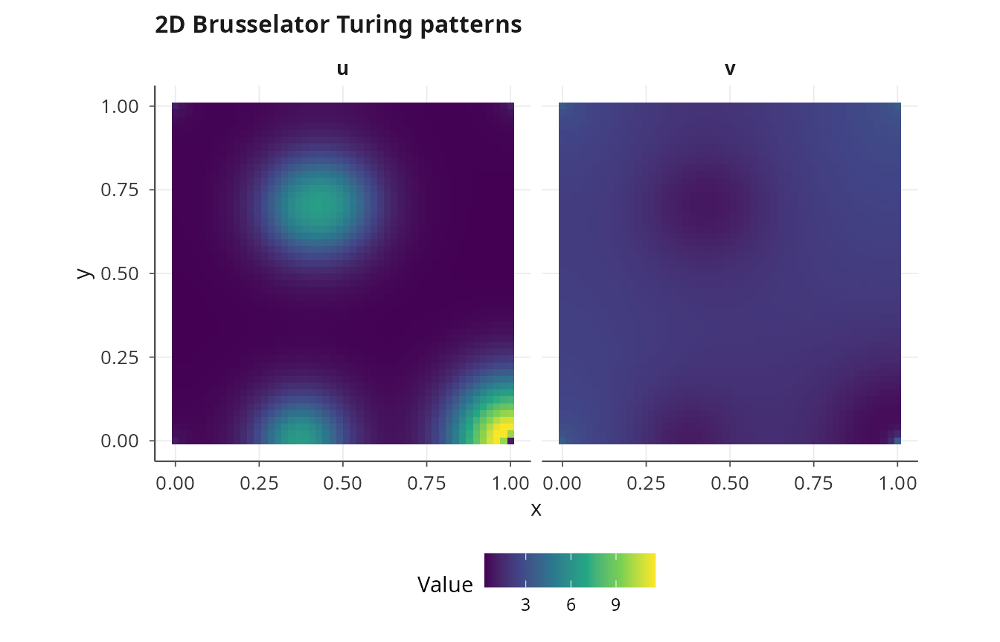
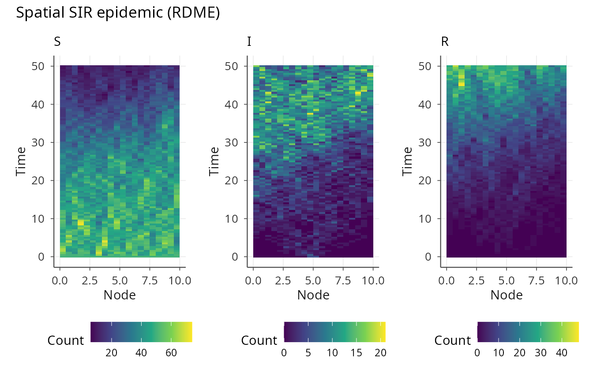
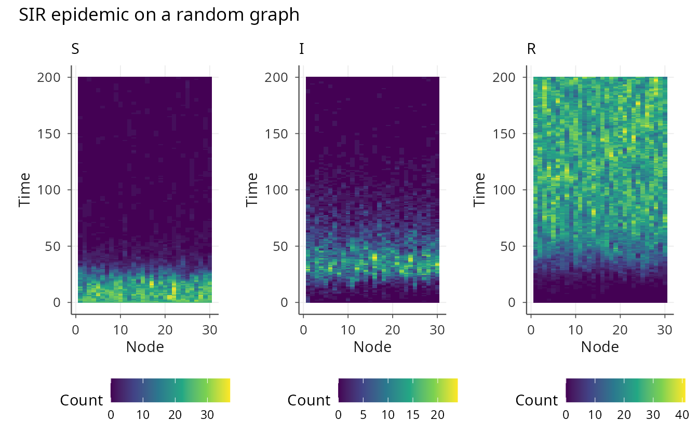
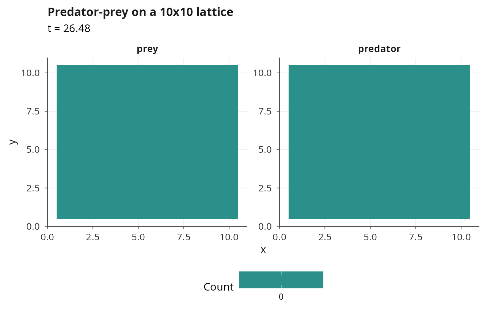

# Spatial dynamics: PDE, RDME, and graph models

## Spatial models in janos

Many dynamical systems involve spatial structure, whether through
continuous diffusion described by partial differential equations,
discrete stochastic transport on a lattice, or reaction-diffusion on an
arbitrary network topology. janos supports all three through a unified
[`model_spec()`](https://robustecologies.github.io/janos/reference/model_spec.md)
interface: 1D and 2D PDEs are solved via the method of lines (MOL), the
reaction-diffusion master equation (RDME) handles spatially resolved
stochastic simulation on regular grids, and the graph RDME extends this
to arbitrary network topologies.

``` r

library(janos)
```

## 1D partial differential equations

A 1D PDE is specified with the `pde` and `spatial` arguments in
[`model_spec()`](https://robustecologies.github.io/janos/reference/model_spec.md).
The `pde` argument is a list of formulas where spatial derivative
operators `d1x()` (first derivative) and `d2x()` (second derivative,
Laplacian in 1D) act on state variables. The `spatial` argument defines
the domain, number of grid points, and boundary conditions.

### Heat equation

The heat equation \\\partial_t u = D \\ \partial\_{xx} u\\ describes
diffusion of a scalar field \\u\\ on a spatial domain. With Dirichlet
boundary conditions fixing the endpoints to zero, any initial
perturbation decays exponentially toward the trivial steady state.

``` r

heat <- model_spec(
    pde = list(u ~ D * d2x(u)),
    spatial = list(
        domain = c(0, 1),
        n_grid = 101,
        bc = list(u = list(type = "dirichlet", left = 0, right = 0))
    ),
    state_names = "u",
    parms = list(D = 0.01),
    init  = function(x) sin(pi * x)
)

result_heat <- dyn_sim(heat, t_max = 5, solver = solver_mol(dt = 0.0001),
                       discard_transient = 0)
#> ⚙ Simulating PDE system (compiled PDE/MOL)
#>   ¡ Grid: N = 101, dx = 0.0100, domain = [0, 1]
#>   ¡ Integration: MOL (RK4), dt = 1e-04
#>   ¡ Duration: 5, discarding 0 transient
#>   ⏱ Elapsed: 0.04 seconds
#> ✔ Simulation complete: 5001 time points, 101 grid points, 1 state(s)
print(result_heat)
#> 
#> Dynamical system simulation 
#> --------------------------- 
#> 
#> System type: PDE (1D, method of lines)
#> 
#> Solver: MOL (dt = 0.0001)
#> Simulation: t_max = 5.0, discarding 0.0 transient
#> Spatial grid: 101 points, dx = 0.0100
#> Attractor points: 5001
#> 
#> Spatial averages on attractor (mean ± sd):
#>   u:           0.4975 ± 0.0707
plot(result_heat, title = "Heat equation (Dirichlet BC)")
```



``` r

plot(result_heat, type = "snapshot", times = c(0, 0.5, 1, 2, 5),
     title = "Heat equation (Dirichlet BC)")
```



The `init` argument for PDE models accepts a function of the spatial
coordinate `x`, which is evaluated at each grid point to construct the
initial condition. The
[`solver_mol()`](https://robustecologies.github.io/janos/reference/solver_mol.md)
backend discretizes space with second-order central finite differences
and integrates the resulting ODE system with RK4.

### Fisher-KPP traveling wave

The Fisher-KPP equation \\\partial_t u = D \\ \partial\_{xx} u + r \\
u(1 - u)\\ models the spatial spread of a population with logistic
growth. Starting from a localized initial condition, the solution
develops a traveling wave front that propagates at the minimum speed
\\c^\* = 2\sqrt{Dr}\\.

``` r

fisher <- model_spec(
    pde = list(u ~ D * d2x(u) + r * u * (1 - u)),
    spatial = list(
        domain = c(0, 20),
        n_grid = 401,
        bc = list(u = list(type = "neumann", left = 0, right = 0))
    ),
    state_names = "u",
    parms = list(D = 0.1, r = 1.0),
    init  = function(x) ifelse(x < 2, 1, 0)
)

result_fisher <- dyn_sim(fisher, t_max = 15, solver = solver_mol(dt = 0.001),
                         discard_transient = 0)
#> ⚙ Simulating PDE system (compiled PDE/MOL)
#>   ¡ Grid: N = 401, dx = 0.0500, domain = [0, 20]
#>   ¡ Integration: MOL (RK4), dt = 0.001
#>   ¡ Duration: 15, discarding 0 transient
#>   ⏱ Elapsed: 0.05 seconds
#> ✔ Simulation complete: 1501 time points, 401 grid points, 1 state(s)
plot(result_fisher, title = "Fisher-KPP travelling wave")
```



``` r

plot(result_fisher, type = "snapshot", times = c(0, 3, 6, 9, 12, 15),
     title = "Fisher-KPP travelling wave")
```



The Neumann boundary conditions \\\partial_x u = 0\\ at both ends
implement no-flux conditions, allowing the wave to propagate without
artificial reflections (until it reaches the boundary).

### Boundary conditions

janos supports three types of boundary conditions. Dirichlet conditions
fix the state at the boundary to a specified value. Neumann conditions
fix the spatial derivative (flux) at the boundary using a ghost-point
formula. Periodic conditions wrap the domain so that the left and right
boundaries are connected, forming a ring.

``` r

# Periodic boundary conditions (ring domain)
ring_heat <- model_spec(
    pde = list(u ~ D * d2x(u)),
    spatial = list(
        domain = c(0, 2 * pi),
        n_grid = 201,
        bc = list(u = list(type = "periodic"))
    ),
    state_names = "u",
    parms = list(D = 0.05),
    init  = function(x) sin(x) + 0.5 * cos(3 * x)
)

result_periodic <- dyn_sim(ring_heat, t_max = 10,
                           solver = solver_mol(dt = 0.0005),
                           discard_transient = 0)
#> ⚙ Simulating PDE system (compiled PDE/MOL)
#>   ¡ Grid: N = 201, dx = 0.0314, domain = [0, 6.28318530717959]
#>   ¡ Integration: MOL (RK4), dt = 5e-04
#>   ¡ Duration: 10, discarding 0 transient
#>   ⏱ Elapsed: 0.03 seconds
#> ✔ Simulation complete: 2001 time points, 201 grid points, 1 state(s)
plot(result_periodic, title = "Heat equation (periodic BC)")
```



### Multi-state 1D PDE

Systems of coupled PDEs are specified by providing multiple formulas in
the `pde` list, with separate boundary conditions for each state. The
Brusselator reaction-diffusion system is a canonical example that can
produce Turing patterns when the diffusion coefficients differ
sufficiently:

``` r

brusselator_1d <- model_spec(
    pde = list(
        u ~ Du * d2x(u) + a - (b + 1) * u + u^2 * v,
        v ~ Dv * d2x(v) + b * u - u^2 * v
    ),
    spatial = list(
        domain = c(0, 1),
        n_grid = 101,
        bc = list(
            u = list(type = "neumann", left = 0, right = 0),
            v = list(type = "neumann", left = 0, right = 0)
        )
    ),
    state_names = c("u", "v"),
    parms = list(a = 1.0, b = 3.0, Du = 0.01, Dv = 0.1),
    init  = function(x) c(1.0 + 0.1 * cos(6 * pi * x),
                           3.0 + 0.1 * cos(6 * pi * x))
)

result_brus <- dyn_sim(brusselator_1d, t_max = 10,
                       solver = solver_mol(dt = 0.00001),
                       discard_transient = 0)
#> ⚙ Simulating PDE system (compiled PDE/MOL)
#>   ¡ Grid: N = 101, dx = 0.0100, domain = [0, 1]
#>   ¡ Integration: MOL (RK4), dt = 1e-05
#>   ¡ Duration: 10, discarding 0 transient
#>   ⏱ Elapsed: 1.46 seconds
#> ✔ Simulation complete: 100001 time points, 101 grid points, 2 state(s)
plot(result_brus, title = "1D Brusselator reaction-diffusion")
```



Note the very small time step, which is necessary to satisfy the CFL
stability condition for the diffusion operator. The solver prints a
warning when the chosen `dt` exceeds the estimated CFL limit.

## 2D partial differential equations

Two-dimensional PDEs extend the spatial operators to include `d1y()`,
`d2y()`, and `lap()` (the Laplacian, expanded as `d2x + d2y`). The
`spatial` argument must specify a 2D domain with `x` and `y` ranges and
grid sizes.

### 2D Brusselator Turing patterns

The Brusselator on a 2D domain produces striking Turing patterns: spots,
stripes, and labyrinthine structures depending on the parameters and
initial conditions.

``` r

brusselator_2d <- model_spec(
    pde = list(
        u ~ Du * lap(u) + a - (b + 1) * u + u^2 * v,
        v ~ Dv * lap(v) + b * u - u^2 * v
    ),
    spatial = list(
        domain = list(x = c(0, 1), y = c(0, 1)),
        n_grid = list(nx = 50, ny = 50),
        bc = list(
            u = list(
                x = list(type = "neumann", left = 0, right = 0),
                y = list(type = "neumann", left = 0, right = 0)
            ),
            v = list(
                x = list(type = "neumann", left = 0, right = 0),
                y = list(type = "neumann", left = 0, right = 0)
            )
        )
    ),
    state_names = c("u", "v"),
    parms = list(a = 1.0, b = 3.5, Du = 0.01, Dv = 0.1),
    init  = function(x, y) c(1.0 + 0.1 * runif(1, -1, 1),
                              3.5 + 0.1 * runif(1, -1, 1))
)

result_2d <- dyn_sim(brusselator_2d, t_max = 10,
                     solver = solver_mol2d(dt = 0.0001),
                     discard_transient = 5)
#> Warning: dt = 1e-04 exceeds the 2D CFL stability limit (0.000030) for estimated
#> D = 3.5. Consider reducing dt or increasing n_grid.
#> ⚙ Simulating 2D PDE system (compiled 2D PDE/MOL)
#>   ¡ Grid: Nx = 50, Ny = 50, dx = 0.0204, dy = 0.0204
#>   ¡ Integration: MOL 2D (RK4), dt = 1e-04
#>   ⏱ Elapsed: 11.73 seconds
#> ✔ Simulation complete: 10001 time points, 50x50 grid, 2 state(s)
plot(result_2d, title = "2D Brusselator Turing patterns")
```



The
[`solver_mol2d()`](https://robustecologies.github.io/janos/reference/solver_mol2d.md)
backend uses second-order central differences on a Cartesian grid with
RK4 time stepping. The output contains 3D arrays (spatial grid x spatial
grid x time) for each state variable.

## Reaction-diffusion master equation (RDME)

While PDEs describe continuous concentrations, many biological systems
involve discrete numbers of molecules in small spatial compartments
where stochastic fluctuations matter. The RDME [\[1\]](#ref1) divides
space into voxels, treats reactions within each voxel as a CTMC, and
models transport between adjacent voxels as first-order diffusion hops.
The resulting process is a high-dimensional CTMC simulated by the
Gillespie algorithm over the combined set of reaction and diffusion
channels.

An RDME model in janos is a CTMC model (stoichiometry + propensities)
with an added `spatial` specification containing `diffusion_rates`,
`n_voxels`, and `domain`:

``` r

rdme_sir <- model_spec(
    stoichiometry = list(
        infection = c(S = -1L, I = 1L, R = 0L),
        recovery  = c(S = 0L,  I = -1L, R = 1L)
    ),
    propensities = list(
        infection ~ beta * S * I,
        recovery  ~ gamma * I
    ),
    state_names = c("S", "I", "R"),
    parms = list(beta = 0.005, gamma = 0.1,
                 Ds = 0.1, Di = 0.5, Dr = 0.1),
    init  = function(x) {
        if (abs(x - 5) < 0.5) c(S = 50L, I = 5L, R = 0L)
        else c(S = 50L, I = 0L, R = 0L)
    },
    spatial = list(
        diffusion_rates = list(S ~ Ds, I ~ Di, R ~ Dr),
        n_voxels = 20,
        domain = c(0, 10)
    )
)

result_rdme <- dyn_sim(rdme_sir, t_max = 50,
                       solver = solver_rdme(output_dt = 0.5, seed = 42),
                       discard_transient = 0)
#> ⚙ Simulating RDME reaction-diffusion system (RDME)
#>   ¡ Grid: 20 voxels, dx = 0.5000
#>   ¡ Reactions: 2 (infection, recovery)
#>   ¡ BCs: reflecting, seed = 42
#>   ¡ Duration: 50, discarding 0 transient
#>   ⏱ Elapsed: 0.01 seconds
#> ✔ Simulation complete: 101 time points, 56919 events
plot(result_rdme, title = "Spatial SIR epidemic (RDME)")
```



The `init` function for 1D RDME models takes the spatial coordinate of
the voxel center, allowing spatially heterogeneous initial conditions.
Here the infection is seeded in the voxel nearest to the center of the
domain. The diffusion rates can reference parameters, and the solver
outputs spatially resolved snapshots at regular intervals.

## Graph RDME

Many spatial systems are not well described by regular grids. Ecological
metapopulations live on habitat patches connected by dispersal
corridors; intracellular reactions occur in compartments linked by
transport channels; epidemics spread through contact networks. The graph
RDME generalizes the voxel-based RDME to arbitrary network topologies
specified through an adjacency matrix.

### Graph topology helpers

janos provides constructors for common graph topologies:

``` r

# 5x5 rectangular lattice
adj_lat <- lattice_graph(5, 5, bc = "periodic")

# Ring of 10 nodes
adj_ring <- ring_graph(10)

# Star with 8 leaves
adj_star <- star_graph(8)

# Complete graph on 6 nodes
adj_comp <- complete_graph(6)

# Erdos-Renyi random graph
adj_rand <- random_graph(20, p = 0.3, seed = 42)
```

Each constructor returns a symmetric adjacency matrix with a `layout`
attribute that enables automatic spatial plotting.

### SIR on a network

Consider an SIR epidemic spreading on a small-world network. The
infection can only transmit between connected nodes, and each node is a
well-mixed compartment with its own copy of the reaction system:

``` r

# Create network
adj <- random_graph(30, p = 0.2, seed = 7)

# Define model (same reactions as before, but on a graph)
graph_sir <- model_spec(
    stoichiometry = list(
        infection = c(S = -1L, I = 1L, R = 0L),
        recovery  = c(S = 0L,  I = -1L, R = 1L)
    ),
    propensities = list(
        infection ~ beta * S * I,
        recovery  ~ gamma * I
    ),
    state_names = c("S", "I", "R"),
    parms = list(beta = 0.01, gamma = 0.05,
                 Ds = 0.05, Di = 0.1, Dr = 0.05),
    init  = function(node) {
        if (node == 1) c(S = 20L, I = 5L, R = 0L)
        else c(S = 25L, I = 0L, R = 0L)
    },
    spatial = list(
        diffusion_rates = list(S ~ Ds, I ~ Di, R ~ Dr),
        adjacency = adj
    )
)

result_graph <- dyn_sim(graph_sir, t_max = 200,
                        solver = solver_rdme(output_dt = 1.0, seed = 42),
                        discard_transient = 0)
#> ⚙ Simulating Graph RDME reaction-diffusion system (graph RDME)
#>   ¡ Nodes: 30, edges: 158
#>   ¡ Reactions: 2 (infection, recovery)
#>   ¡ Seed: 42
#>   ¡ Duration: 200, discarding 0 transient
#>   ⏱ Elapsed: 0.02 seconds
#> ✔ Simulation complete: 201 time points, 45267 events
print(result_graph)
#> 
#> Dynamical system simulation 
#> --------------------------- 
#> 
#> System type: graph RDME (network-structured)
#> 
#> Solver: RDME (seed = 42)
#>   Total events: 45,267
#>   Nodes: 30, edges: 158
#> Simulation: t_max = 200.0, discarding 0.0 transient
#> Attractor points: 201
#> 
#> Spatial averages on attractor (mean ± sd):
#>   S:           3.3776 ± 7.2772
#>   I:           2.5279 ± 3.6318
#>   R:           19.0945 ± 8.5817
plot(result_graph, title = "SIR epidemic on a random graph")
```



The graph RDME solver computes diffusion hop rates from the adjacency
matrix weights and simulates all reaction and diffusion events via a
single Gillespie direct algorithm operating over the combined channel
space of all nodes and edges.

### Lattice ecology

For spatial ecology on a regular grid,
[`lattice_graph()`](https://robustecologies.github.io/janos/reference/lattice_graph.md)
with a layout attribute enables automatic 2D heatmap visualization:

``` r

# Predator-prey on a 10x10 lattice
adj_eco <- lattice_graph(10, 10, bc = "periodic")

pp_lattice <- model_spec(
    stoichiometry = list(
        prey_birth    = c(prey = 1L, predator = 0L),
        predation     = c(prey = -1L, predator = 1L),
        predator_death = c(prey = 0L, predator = -1L)
    ),
    propensities = list(
        prey_birth    ~ alpha * prey,
        predation     ~ beta * prey * predator,
        predator_death ~ gamma * predator
    ),
    state_names = c("prey", "predator"),
    parms = list(alpha = 1.0, beta = 0.005, gamma = 0.5,
                 D_prey = 0.2, D_predator = 0.1),
    init  = function(node) {
        c(prey = sample(10:30, 1), predator = sample(0:5, 1))
    },
    spatial = list(
        diffusion_rates = list(prey ~ D_prey, predator ~ D_predator),
        adjacency = adj_eco
    )
)

result_eco <- dyn_sim(pp_lattice, t_max = 50,
                      solver = solver_rdme(output_dt = 1.0, seed = 42),
                      discard_transient = 0)
#> ⚙ Simulating Graph RDME reaction-diffusion system (graph RDME)
#>   ¡ Nodes: 100, edges: 400
#>   ¡ Reactions: 3 (prey_birth, predation, predator_death)
#>   ¡ Seed: 42
#>   ¡ Duration: 50, discarding 0 transient
#>   ⏱ Elapsed: 0.50 seconds
#> ✔ Simulation complete: 28 time points, 891496 events
plot(result_eco, title = "Predator-prey on a 10x10 lattice")
```



## CFL stability and practical considerations

The method of lines reduces a PDE to an ODE system whose stiffness
depends on the spatial resolution. For an explicit solver like RK4, the
Courant-Friedrichs-Lewy (CFL) condition constrains the time step:
roughly \\\Delta t \< \Delta x^2 / (2 D\_{\max})\\ for
diffusion-dominated problems. janos prints a warning when the specified
`dt` violates this bound, but the user is responsible for choosing an
appropriate step size. For very stiff PDE systems, the Rosenbrock
implicit solver
([`solver_rosenbrock()`](https://robustecologies.github.io/janos/reference/solver_rosenbrock.md))
can bypass the CFL constraint at the cost of solving a linear system at
each step.

For RDME models, computational cost scales with the total propensity
across all voxels and all channels. Dense graphs and high molecule
counts increase the total propensity and thus the number of events per
unit time. The `output_dt` parameter in
[`solver_rdme()`](https://robustecologies.github.io/janos/reference/solver_rdme.md)
controls how frequently spatial snapshots are stored, which helps manage
memory for long simulations.

## References

**\[1\]** Gardiner, C. W., McNeil, K. J., Walls, D. F., & Matheson, I.
S. (1976). Correlations in stochastic theories of chemical reactions.
*Journal of Statistical Physics*, 14(4), 307-331.
[doi:10.1007/BF01030197](https://doi.org/10.1007/BF01030197)
