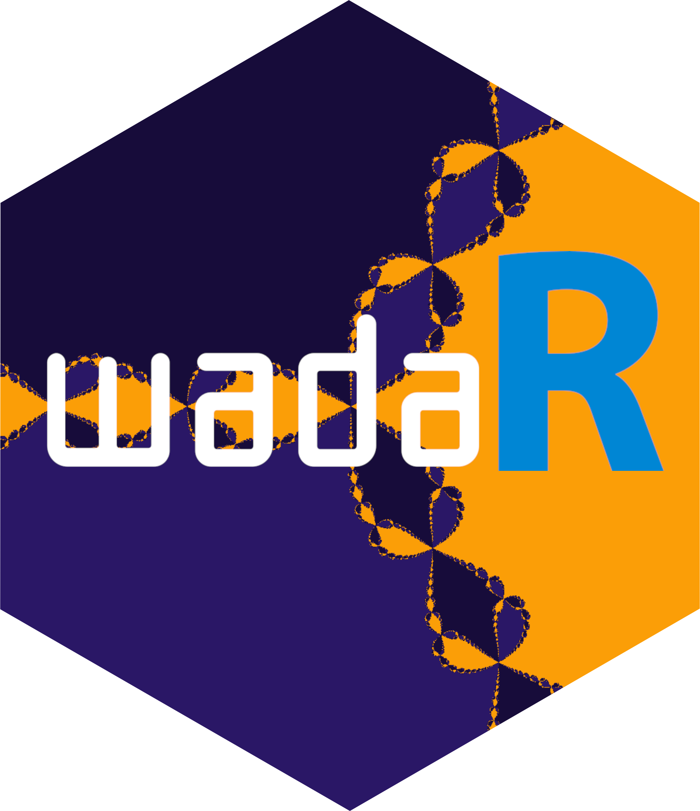

# wadaR [](https://robustecologies.github.io/wadaR)

## Wada basin detection in dynamical systems

[](https://www.gnu.org/licenses/gpl-3.0)
[](https://www.r-project.org/)
[](https://cran.r-project.org/package=Rcpp)

**wadaR** implements multiple computational methods for detecting Wada
basins of attraction in dynamical systems. Wada basins are a remarkable
type of fractal basin structure where a single boundary simultaneously
separates three or more basins, so that every boundary point is
arbitrarily close to all attractors. This extreme form of
unpredictability has profound implications for chaos theory, control
systems, and predictability in nonlinear dynamics.

### Key features

#### Wada detection methods

- **Grid method**: Tests whether a third basin can always be found
  between any two basins at finer resolutions
- **Merging method**: Compares boundary structure when basins are merged
  using Hausdorff distance
- **Saddle-straddle method**: Tracks chaotic saddles on basin boundaries
  to verify uniqueness

#### Example dynamical systems

- **Forced damped pendulum**: The canonical example for Wada basins with
  three coexisting attractors
- **Henon-Heiles system**: Hamiltonian system with escape basins
  exhibiting Wada boundaries
- **Newton fractals**: Mathematically proven Wada basins from
  Newton-Raphson iteration
- **Multispecies competition**: Huisman-Weissing ecological model with
  fractal boundaries between outcomes

#### High-performance implementation

- **OpenMP parallelization**: All computationally intensive operations
  run in parallel
- **Rcpp integration**: Core algorithms implemented in C++ for maximum
  performance
- **ggplot2 visualization**: Publication-quality plots with customizable
  color palettes

See the accompanying
[`vignette("wada-basins")`](https://robustecologies.github.io/wadaR/articles/wada-basins.md)
for comprehensive mathematical theory, algorithms, and extensive
examples.

## Installation

``` r
# Check if devtools is already installed. If not, install it.
if (!requireNamespace("devtools", quietly = TRUE)) {
  install.packages("devtools")
}

# Install from GitHub (development version)
devtools::install_github("robustecologies/wadaR")

# Or install locally
devtools::install()
```

### Build from package directory

``` bash
cd /path/to/wadaR
R CMD build .
R CMD INSTALL wadaR_1.0.0.tar.gz
```

## Mathematical background

### What are Wada basins?

For a dynamical system with attractors \\A_1, \ldots, A\_{N_A}\\, the
basin of attraction \\B_i\\ is the set of initial conditions converging
to \\A_i\\:

\\B_i = \\x : \lim\_{t \to \infty} \phi_t(x) \in A_i\\\\

The basins have the **Wada property** if every boundary point is
simultaneously on the boundary of all basins:

\\\partial B_1 = \partial B_2 = \cdots = \partial B\_{N_A}\\

### Why does it matter?

Wada basins represent an extreme form of **final-state sensitivity**:
arbitrarily small uncertainties in initial conditions can lead to
convergence to *any* of the system’s attractors. This has implications
for:

- **Climate prediction**: Small errors can lead to qualitatively
  different outcomes
- **Ecological dynamics**: Ecosystems with multiple stable states may
  have Wada boundaries
- **Engineering control**: Understanding basin structure is crucial for
  robust design
- **Celestial mechanics**: Spacecraft trajectory planning near Wada
  boundaries

## Quick start

``` r
library(wadaR)
library(ggplot2)
```

### Example 1: Forced damped pendulum

The forced damped pendulum is the canonical example of a system with
Wada basins:

\\\ddot{x} + \gamma \dot{x} + \sin(x) = F \cos(t)\\

``` r
# Create system with Wada basins (F = 1.66)
pendulum <- forced_damped_pendulum(forcing = 1.66, damping = 0.2)
print(pendulum$description)

# Compute basins of attraction
basins <- compute_basins(
    pendulum,
    x_range = c(-pi, pi),
    y_range = c(-3, 3),
    resolution = 200,
    verbose = FALSE
)

# Visualize with custom colors
plot(basins,
     title = "Wada basins: forced damped pendulum",
     colors = c("#E63946", "#457B9D", "#2A9D8F"))
```

### Example 2: Test for Wada property

``` r
# Apply the grid method
result <- wada_grid_method(basins, verbose = FALSE)
print(result)

# Visualize boundary classification
plot(result, basins = basins)
```

### Example 3: Newton fractal

Newton fractals are mathematically proven to have Wada basins for \\n
\geq 3\\ roots:

``` r
# Compute Newton fractal basins
newton_basins <- compute_newton_basins(
    n_roots = 3,
    x_range = c(-2, 2),
    y_range = c(-2, 2),
    resolution = 400
)

# Visualize
plot(newton_basins,
     title = expression(paste("Newton fractal: ", z^6 - 1 == 0)),
     colors = c("#264653", "#E9C46A", "#E76F51")) +
    theme_void() +
    theme(legend.position = "none")
```

## Available methods

### 1. Grid method (Daza et al., 2015)

Tests whether a third color can be found between any two colors at finer
resolutions:

``` r
result_grid <- wada_grid_method(basins, verbose = FALSE)
cat(sprintf("W_3 = %.4f (Wada if close to 1)\n", result_grid$W_m[3]))
cat(sprintf("Is Wada: %s\n", result_grid$is_wada))
```

### 2. Merging method (Daza et al., 2018)

Compares slim boundaries when basins are merged:

``` r
result_merge <- wada_merging_method(basins, verbose = FALSE)
cat(sprintf("Relative difference = %.4f\n", result_merge$relative_diff))
cat(sprintf("Is Wada: %s\n", result_merge$is_wada))
```

### 3. Saddle-straddle method (Wagemakers et al., 2020)

Tracks chaotic saddles on basin boundaries:

``` r
result_straddle <- wada_straddle_method(
    pendulum,
    x_range = c(-pi, pi),
    y_range = c(-3, 3),
    n_points = 2000,
    verbose = FALSE
)
cat(sprintf("Max Hausdorff distance = %.6f\n", result_straddle$max_distance))
cat(sprintf("Is Wada: %s\n", result_straddle$is_wada))
```

## Computational complexity

Understanding the computational cost helps choose appropriate
resolutions:

| Function | Complexity | Description |
|----|----|----|
| [`compute_basins()`](https://robustecologies.github.io/wadaR/reference/compute_basins.md) | \\O(N^2 \cdot T/\Delta t)\\ | \\N^2\\ grid points, each integrated for \\T/\Delta t\\ RK4 steps |
| [`compute_newton_basins()`](https://robustecologies.github.io/wadaR/reference/compute_newton_basins.md) | \\O(N^2 \cdot k)\\ | \\N^2\\ points, \\k\\ Newton iterations (fast, no ODE) |
| [`compute_competition_basins()`](https://robustecologies.github.io/wadaR/reference/compute_competition_basins.md) | \\O(N^2 \cdot T/\Delta t \cdot n\_{vars})\\ | \\N^2\\ points, long integration (\\T \sim 2000\\), 8-11 state variables |
| [`wada_grid_method()`](https://robustecologies.github.io/wadaR/reference/wada_grid_method.md) | \\O(B \cdot 2^d)\\ | \\B\\ boundary boxes, \\d\\ refinement depth |
| [`wada_merging_method()`](https://robustecologies.github.io/wadaR/reference/wada_merging_method.md) | \\O(N_A \cdot B^2)\\ | \\N_A\\ basins, pairwise Hausdorff on \\B\\ boundary points |
| [`wada_straddle_method()`](https://robustecologies.github.io/wadaR/reference/wada_straddle_method.md) | \\O(N_A \cdot P \cdot T/\Delta t)\\ | \\N_A\\ saddles, \\P\\ points each, full ODE integration |
| [`basin_entropy()`](https://robustecologies.github.io/wadaR/reference/basin_entropy.md) | \\O(N^2 / s^2)\\ | Fast, just counting over boxes of size \\s\\ |

where \\N\\ = resolution, \\T\\ = `t_max`, \\\Delta t\\ = `dt`, \\B\\ =
boundary points, \\d\\ = `max_refinements`, \\P\\ = `n_points`,
\\n\_{vars}\\ = number of state variables.

**Typical runtimes** (8-core CPU, resolution 300): -
[`compute_basins()`](https://robustecologies.github.io/wadaR/reference/compute_basins.md):
5-30 seconds -
[`compute_newton_basins()`](https://robustecologies.github.io/wadaR/reference/compute_newton_basins.md):
\<1 second -
[`compute_competition_basins()`](https://robustecologies.github.io/wadaR/reference/compute_competition_basins.md):
10-60 minutes (8-species scenario, resolution 200) -
[`wada_grid_method()`](https://robustecologies.github.io/wadaR/reference/wada_grid_method.md):
2-10 seconds -
[`wada_merging_method()`](https://robustecologies.github.io/wadaR/reference/wada_merging_method.md):
1-5 seconds -
[`wada_straddle_method()`](https://robustecologies.github.io/wadaR/reference/wada_straddle_method.md):
1-10 minutes

## Method selection guide

| Method              | Best for           | Speed  | Accuracy | Input required      |
|---------------------|--------------------|--------|----------|---------------------|
| **Grid**            | Final confirmation | Medium | High     | Basins matrix       |
| **Merging**         | Quick screening    | Fast   | Medium   | Basins matrix       |
| **Saddle-straddle** | Dynamical insight  | Slow   | High     | System + attractors |

**Recommended workflow:**

1.  Start with **merging method** for quick screening
2.  Confirm with **grid method** for higher accuracy
3.  Use **saddle-straddle** when you need dynamical insight

## Common workflows

### Workflow 1: Complete Wada analysis

``` r
# Create system
pendulum <- forced_damped_pendulum(forcing = 1.66)

# Compute basins
basins <- compute_basins(pendulum, c(-pi, pi), c(-3, 3),
                         resolution = 200, verbose = FALSE)

# Run all detection methods
cat("=== Wada detection results ===\n")
r1 <- wada_grid_method(basins, verbose = FALSE)
r2 <- wada_merging_method(basins, verbose = FALSE)

cat(sprintf("Grid method:    W_3 = %.3f, Wada = %s\n", r1$W_m[3], r1$is_wada))
cat(sprintf("Merging method: rel_diff = %.3f, Wada = %s\n", r2$relative_diff, r2$is_wada))
```

### Workflow 2: Comparing parameter regimes

``` r
# Compare Wada (F=1.66) vs Partial Wada (F=1.71)
systems <- list(
    "F=1.66" = forced_damped_pendulum(forcing = 1.66),
    "F=1.71" = forced_damped_pendulum(forcing = 1.71)
)

for (name in names(systems)) {
    basins <- compute_basins(systems[[name]], c(-pi, pi), c(-3, 3),
                             resolution = 150, verbose = FALSE)
    result <- wada_grid_method(basins, verbose = FALSE)
    cat(sprintf("%s: W_3 = %.3f, Wada = %s\n", name, result$W_m[3], result$is_wada))
}
```

### Workflow 3: Henon-Heiles escape basins

``` r
# Henon-Heiles system above critical energy
hh <- henon_heiles_system(energy = 0.2)
basins_hh <- compute_basins(hh, c(-0.3, 0.3), c(-0.3, 0.3),
                            resolution = 200, t_max = 200, verbose = FALSE)

# Test for Wada
result_hh <- wada_merging_method(basins_hh, verbose = FALSE)
cat(sprintf("Henon-Heiles: rel_diff = %.3f, Wada = %s\n",
            result_hh$relative_diff, result_hh$is_wada))

# Visualize
plot(basins_hh, title = "Henon-Heiles escape basins",
     colors = c("#F72585", "#7209B7", "#3A0CA3"))
```

## Performance tips

1.  **Start with lower resolution** (100-200) for exploration, increase
    for publication
2.  **Use merging method first** for quick screening (no dynamics
    integration)
3.  **Grid method** gives most reliable results but is slower
4.  **Saddle-straddle** requires system dynamics, use for detailed
    analysis
5.  **Newton fractals** are fastest to compute (no ODE integration)

## Function reference

### Basin computation

| Function | Description |
|----|----|
| [`compute_basins()`](https://robustecologies.github.io/wadaR/reference/compute_basins.md) | Compute basins of attraction for 2D dynamical systems |
| [`compute_newton_basins()`](https://robustecologies.github.io/wadaR/reference/compute_newton_basins.md) | Specialized function for Newton fractal basins |
| [`get_boundary()`](https://robustecologies.github.io/wadaR/reference/get_boundary.md) | Extract boundary points from basin matrix |
| [`merge_basins()`](https://robustecologies.github.io/wadaR/reference/merge_basins.md) | Create two-color basin maps for analysis |

### Wada detection

| Function | Description |
|----|----|
| [`wada_grid_method()`](https://robustecologies.github.io/wadaR/reference/wada_grid_method.md) | Grid refinement method |
| [`wada_merging_method()`](https://robustecologies.github.io/wadaR/reference/wada_merging_method.md) | Boundary merging method |
| [`wada_straddle_method()`](https://robustecologies.github.io/wadaR/reference/wada_straddle_method.md) | Saddle-straddle method |
| [`detect_wada()`](https://robustecologies.github.io/wadaR/reference/detect_wada.md) | Unified interface for multiple methods |
| [`hausdorff_distance()`](https://robustecologies.github.io/wadaR/reference/hausdorff_distance.md) | Compute Hausdorff distance between point sets |
| [`basin_entropy()`](https://robustecologies.github.io/wadaR/reference/basin_entropy.md) | Quantify unpredictability using basin entropy |

### Example systems

| Function | Description |
|----|----|
| [`forced_damped_pendulum()`](https://robustecologies.github.io/wadaR/reference/forced_damped_pendulum.md) | Forced damped pendulum (Wada for F \\\approx\\ 1.66) |
| [`henon_heiles_system()`](https://robustecologies.github.io/wadaR/reference/henon_heiles_system.md) | Henon-Heiles Hamiltonian (escape basins) |
| [`newton_fractal_system()`](https://robustecologies.github.io/wadaR/reference/newton_fractal_system.md) | Newton method fractals for \\z^n - 1 = 0\\ |
| [`multispecies_competition()`](https://robustecologies.github.io/wadaR/reference/multispecies_competition.md) | Huisman-Weissing resource competition (ecological Wada basins) |

### Ecological competition

| Function | Description |
|----|----|
| [`multispecies_competition()`](https://robustecologies.github.io/wadaR/reference/multispecies_competition.md) | Create 5-species or 8-species competition scenarios |
| [`compute_competition_basins()`](https://robustecologies.github.io/wadaR/reference/compute_competition_basins.md) | Compute basins of attraction for competition outcomes |
| [`simulate_competition()`](https://robustecologies.github.io/wadaR/reference/simulate_competition.md) | Integrate competition dynamics and return time series |

## Theoretical references

This package implements algorithms from:

- **Kennedy, J., & Yorke, J. A. (1991).** Basins of Wada. *Physica D*,
  51, 213-225.
  [doi:10.1016/0167-2789(91)90234-Z](https://doi.org/10.1016/0167-2789(91)90234-Z)

- **Daza, A., et al. (2015).** Testing for basins of Wada. *Scientific
  Reports*, 5, 16579.
  [doi:10.1038/srep16579](https://doi.org/10.1038/srep16579)

- **Daza, A., et al. (2018).** Ascertaining when a basin is Wada: The
  merging method. *Scientific Reports*, 8, 9954.
  [doi:10.1038/s41598-018-28119-0](https://doi.org/10.1038/s41598-018-28119-0)

- **Wagemakers, A., et al. (2020).** The saddle-straddle method to test
  for Wada basins. *CNSNS*, 84, 105167.
  [doi:10.1016/j.cnsns.2020.105167](https://doi.org/10.1016/j.cnsns.2020.105167)

## Documentation and vignettes

``` r
# View available vignettes
vignette(package = "wadaR")

# Open main vignette with theory and examples
vignette("wada-basins", package = "wadaR")
```

## Getting help

``` r
# Function documentation
?compute_basins
?wada_grid_method
?wada_merging_method
?wada_straddle_method

# Package overview
?wadaR
```

## Contributing

Contributions are welcome! Please feel free to:

- Report bugs at <https://github.com/robustecologies/wadaR/issues>
- Suggest new features
- Submit pull requests

## License

GPL (\>= 3) + LICENSE

## Author

**Pablo Almaraz** Email: <pablo.almaraz@csic.es>, RElab ORCID:
[0000-0003-1416-2695](https://orcid.org/0000-0003-1416-2695)

## Citation

If you use **wadaR** in publications, please cite:

``` bibtex
@Manual{wadinger2025,
  title = {wadaR: Wada basin detection in dynamical systems},
  author = {Pablo Almaraz},
  year = {2025},
  note = {R package version 1.0.0},
  url = {https://github.com/robustecologies/wadaR}
}
```
